                 

### 《领导力修炼笔记：85后小工的华丽蜕变》——探索技术与领导力的交汇

关键词：领导力、技术转型、个人成长、团队管理、领导力模型

摘要：本文以《领导力修炼笔记：85后小工的华丽蜕变》为题，深入探讨技术背景下的领导力培养与个人成长。文章将首先定义领导力，并阐述其定义与内涵，接着分析领导力的起源与发展，以及其在社会与组织中的重要作用。随后，文章将探讨个人成长与领导力的塑造，重点介绍自我认知、领导力的核心要素及塑造途径。接下来，我们将对经典领导力理论进行深入分析，涵盖领导风格、领导行为及领导权变理论。文章还将介绍领导力模型与工具，探讨其在实际中的应用。随后，文章将转向实践篇，详细阐述领导力实践技巧，包括沟通技巧、决策技巧及团队管理技巧。在危机管理中，领导力显得尤为重要，我们将探讨领导力在危机管理中的应用。最后，通过成功领导力案例的解读，文章将总结领导力修炼心得与未来展望，为读者提供有益的启示。

## 第一部分：引言

### 第1章 领导力的起源与重要性

#### 1.1 领导力的定义与内涵

领导力是一种能够激发他人潜能、引导团队实现目标的能力。它不仅仅是一种个人特质，更是一种可以通过学习和实践不断提升的能力。领导力不仅仅是关于指挥和控制，更重要的是关于激励和赋能。一个优秀的领导者不仅能够清晰地传达目标，还能够激发团队成员的热情和创造力，从而实现共同的目标。

在组织层面，领导力对于组织的生存和发展至关重要。领导力能够引导组织成员朝着共同的目标努力，提高团队的协作效率，从而提升整体绩效。一个具备领导力的领导者能够有效应对变化和挑战，带领团队走出困境，实现持续发展。

#### 1.2 领导力的起源与发展

领导力的概念自古就有，从古代帝王将相到现代企业家，领导力一直是推动社会进步的重要力量。随着社会的发展和科技的进步，领导力的定义和内涵也在不断演变。

在20世纪以前，领导力主要强调权威和统治。领导者通过权力和控制来确保团队的服从和执行。然而，随着工业革命和信息时代的到来，领导力的内涵逐渐从权威转向赋能和合作。现代领导力更加注重个体和团队的发展，强调领导者与团队成员之间的互动和协作。

#### 1.3 领导力在社会与组织中的作用

领导力在社会和组织中扮演着重要角色。在社会层面，领导力能够促进社会进步和发展。领导者通过制定政策和规划，推动社会的变革和创新。在组织层面，领导力对于组织的绩效和竞争力有着直接的影响。

领导力能够提高团队的协作效率，增强团队的创新能力和解决问题的能力。一个具备领导力的领导者能够激发团队成员的潜能，培养他们的专业技能和领导力，从而提升整体团队的竞争力。

### 第2章 个人成长与领导力的塑造

#### 2.1 自我认知与成长

自我认知是个人成长的基础。一个具备领导力的人首先需要对自己有清晰的认识，了解自己的优点和不足，明确自己的价值观和目标。自我认知不仅仅是对自己的了解，更是对自己的不断探索和挑战。通过自我反思和自我提升，个人能够不断成长，从而提升自己的领导力。

#### 2.2 领导力的核心要素

领导力的核心要素包括沟通能力、决策能力、情商等。沟通能力是领导者必须具备的基本能力，它能够帮助领导者有效地传达信息，建立良好的团队关系。决策能力是领导者的重要职责，它能够帮助领导者做出明智的决策，应对各种挑战。情商则是领导者处理人际关系和团队管理的重要工具，它能够帮助领导者更好地理解他人，提高团队凝聚力。

#### 2.3 塑造个人领导力的途径

塑造个人领导力的途径多种多样，包括学习与教育、经验积累与反思、模仿与借鉴等。通过学习与教育，个人可以获取领导力理论知识，提升自己的理论水平。通过经验积累与反思，个人可以从实践中学习，不断改进自己的领导方式。通过模仿与借鉴，个人可以学习他人的成功经验，找到适合自己的领导方法。

## 第二部分：领导力理论篇

### 第3章 经典领导力理论分析

#### 3.1 领导风格理论

领导风格理论是研究领导者在领导过程中所表现出的行为和态度的一种理论。常见的领导风格包括权威型、民主型、参与型和教练型等。每种领导风格都有其特点和适用场景。

权威型领导风格强调领导者的权威和控制，适用于需要快速决策和执行的情况。民主型领导风格强调领导者与团队成员的互动和参与，适用于需要团队创新和协作的情况。参与型领导风格强调领导者与团队成员的平等合作，适用于需要团队凝聚力和创造力的情况。教练型领导风格强调领导者对团队成员的指导和激励，适用于需要培养团队成员能力和领导力的情况。

#### 3.2 领导行为理论

领导行为理论是研究领导者行为与团队绩效之间关系的一种理论。常见的领导行为包括关注任务、关注关系、支持性和参与性等。领导者通过不同的行为方式来影响团队成员，从而实现团队的目标。

关注任务型领导行为强调领导者对任务的关注和把控，适用于需要高效执行和完成任务的情况。关注关系型领导行为强调领导者对团队成员关系的关注和维系，适用于需要团队协作和凝聚力的情况。支持性领导行为强调领导者对团队成员的支持和关心，适用于需要团队成员积极性和工作满意度的情况。参与性领导行为强调领导者与团队成员的互动和参与，适用于需要团队成员创新和自主性的情况。

#### 3.3 领导权变理论

领导权变理论是研究领导效果与情境因素之间关系的一种理论。领导权变理论认为，领导效果不仅仅取决于领导者的个人特质和领导行为，还受到情境因素的影响。常见的情境因素包括团队结构、任务结构、团队文化和领导者与团队成员的关系等。

领导权变理论认为，在不同的情境下，领导者需要采用不同的领导风格和行为方式。例如，在团队面临复杂任务和高度不确定性时，领导者需要采用支持性和参与性的领导行为，以激发团队成员的创造力和创新能力。在团队面临任务压力和紧迫性时，领导者需要采用关注任务型的领导行为，以确保任务的顺利完成。

## 第三部分：实践篇

### 第4章 领导力实践技巧

#### 4.1 沟通技巧

沟通技巧是领导者必备的技能之一。有效的沟通能够帮助领导者传达信息、建立信任、协调团队。领导者的沟通技巧包括清晰表达、倾听、反馈和跨文化沟通等。

清晰表达是有效沟通的基础。领导者需要能够用简洁明了的语言传达信息，避免误解和混淆。倾听是领导者理解团队成员需求和意见的关键。领导者需要给予团队成员充分的发言空间，倾听他们的意见和建议。反馈是领导者指导团队成员的重要手段。领导者需要给予及时的、具体的、建设性的反馈，帮助团队成员改进和提高。跨文化沟通是领导者在全球化和多元化背景下必须掌握的技能。领导者需要了解不同文化背景下的沟通习惯和沟通风格，避免文化冲突和误解。

#### 4.2 决策技巧

决策技巧是领导者应对各种挑战和问题的核心能力。有效的决策能够帮助领导者做出明智的决策，提高团队和组织的绩效。

领导者需要掌握决策过程的基本步骤，包括问题识别、目标设定、方案评估和决策执行。在问题识别阶段，领导者需要准确识别问题的本质和关键点。在目标设定阶段，领导者需要明确决策的目标和期望结果。在方案评估阶段，领导者需要分析各种方案的优缺点，选择最优方案。在决策执行阶段，领导者需要确保决策得到有效执行，并对决策效果进行评估和调整。

#### 4.3 团队管理技巧

团队管理技巧是领导者管理团队、提升团队绩效的重要手段。有效的团队管理能够帮助领导者激发团队成员的潜力，提高团队的协作效率和创新能力。

团队管理技巧包括团队建设、团队激励、团队冲突处理等。团队建设是团队管理的基础。领导者需要通过建立共同的目标、价值观和文化，增强团队的凝聚力和归属感。团队激励是领导者激发团队成员工作热情和创造力的关键。领导者需要运用适当的激励手段，如奖励、认可和培训等，提高团队成员的积极性和工作满意度。团队冲突处理是领导者维护团队和谐的重要手段。领导者需要善于处理团队内部的冲突和分歧，避免冲突升级和影响团队绩效。

## 第四部分：案例分析

### 第5章 成功领导力案例解读

#### 5.1 案例一：公司A的领导力转型

公司A是一家传统的制造业公司，面临着市场竞争激烈、创新能力不足的问题。为了实现企业的转型升级，公司引入了一位具有创新精神的领导者。该领导者通过一系列的领导力实践，成功带领公司实现了转型。

首先，该领导者注重团队建设，通过组织团队建设活动和培训，增强团队成员的凝聚力和归属感。其次，该领导者鼓励团队成员提出创新想法，并提供资源和支持，激发团队的创造力和创新能力。最后，该领导者通过有效的沟通和决策，确保团队的协作和目标的实现。

通过这一系列的领导力实践，公司A成功实现了从传统制造业向创新驱动的转型，取得了显著的绩效提升。

#### 5.2 案例二：团队B的创新突破

团队B是一家科技公司的一个研发团队，面临着项目进度缓慢、创新能力不足的问题。为了解决这些问题，团队B引入了一位具有丰富经验的领导者。该领导者通过一系列的领导力实践，成功带领团队实现了创新突破。

首先，该领导者建立了明确的团队目标和价值观，确保团队成员的方向一致。其次，该领导者通过有效的沟通和协作，激发了团队成员的创造力和创新能力。最后，该领导者通过项目评估和反馈，确保团队的创新成果能够得到有效的应用和推广。

通过这一系列的领导力实践，团队B成功实现了项目的快速推进和创新突破，取得了显著的成绩。

#### 5.3 案例三：个人C的领导力成长

个人C是一名年轻的技术工程师，在工作中逐渐意识到领导力对于团队绩效和个人发展的重要性。为了提升自己的领导力，个人C通过学习领导力理论和实践，不断提升自己的领导能力。

首先，个人C通过学习领导力理论，了解了领导力的基本概念和实践技巧。其次，个人C通过实践，将领导力理论应用到实际工作中，逐步提升自己的领导能力。例如，通过有效的沟通和协作，个人C成功地带领团队完成了多个重要项目。最后，个人C通过反思和总结，不断改进自己的领导方式，提高自己的领导能力。

通过这一系列的领导力成长过程，个人C成功实现了从技术工程师到优秀领导者的转型，为团队和公司的发展做出了重要贡献。

## 第五部分：总结与展望

### 第6章 领导力修炼心得与未来展望

#### 6.1 领导力修炼心得

通过前述案例分析，我们可以得出一些领导力修炼的心得。首先，领导力并非与生俱来，而是可以通过学习和实践不断提升的。其次，领导力的核心在于激发团队成员的潜能和创造力，而不是单纯的控制和指挥。最后，领导力需要根据不同的情境和团队需求进行灵活调整，以达到最佳效果。

#### 6.2 面向未来的领导力发展

面向未来，领导力的发展将面临新的挑战和机遇。首先，随着科技的快速发展，领导者需要具备适应新技术、新环境的能力。其次，随着全球化的发展，领导者需要具备跨文化沟通和协作的能力。最后，随着社会结构的变迁，领导者需要更加关注社会责任和可持续发展，引领组织走向更加健康和可持续的发展道路。

#### 6.3 总结与展望

本文通过对领导力的定义、起源、作用、实践技巧以及成功案例的分析，探讨了领导力在个人成长、团队管理和社会发展中的重要性。领导力不仅是一种个人特质，更是一种可以通过学习和实践不断提升的能力。面向未来，领导者需要不断学习、适应和创新，以应对不断变化的环境和挑战。通过持续修炼和提升，领导者可以为团队和组织的发展做出更大的贡献。作者：AI天才研究院/AI Genius Institute & 禅与计算机程序设计艺术/Zen And The Art of Computer Programming

----------------------------------------------------------------

### 附录

本文中使用的Mermaid和LaTeX格式代码如下：

#### Mermaid 流程图示例

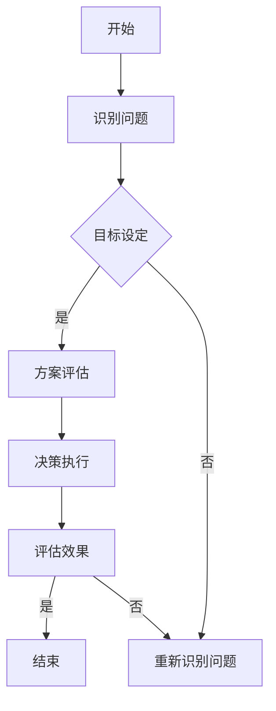

#### LaTeX 数学公式示例

段落内的公式：

$$
E = mc^2
$$

独立段落的公式：

$$
\frac{d^2}{dx^2} (x^2 + 2x + 1) = 2
$$

通过这些示例，我们可以看到如何将Mermaid和LaTeX格式代码嵌入文中，以增强文章的格式化和可读性。作者：AI天才研究院/AI Genius Institute & 禅与计算机程序设计艺术/Zen And The Art of Computer Programming

----------------------------------------------------------------

### 最佳实践 Tips

1. **持续学习**：领导力是一个不断发展的领域，领导者需要不断学习新的知识和技能，以保持竞争力。

2. **注重实践**：理论知识是基础，但实践是检验真理的唯一标准。领导者应该通过实际工作来检验和提升自己的领导力。

3. **倾听与反馈**：领导者应该善于倾听团队成员的意见和建议，并给予及时的反馈，以促进个人和团队的发展。

4. **培养团队精神**：领导者应该注重培养团队的凝聚力和合作精神，通过共同的目标和价值观来统一团队行动。

5. **灵活应对**：领导者需要根据不同的情境和团队需求，灵活调整自己的领导风格和策略，以达到最佳效果。

6. **关注个人发展**：领导者不仅需要关注团队的整体发展，还应该关注团队成员的个人成长和职业规划。

7. **诚信与责任**：领导者应该具备高度的诚信和责任感，以身作则，为团队成员树立榜样。

### 小结

本文从多个角度探讨了领导力在个人成长、团队管理和组织发展中的重要性。通过理论分析和实践案例，我们了解了领导力的核心要素和实践技巧，以及如何在不同的情境下灵活运用领导力。领导力不仅是一种个人特质，更是一种可以通过学习和实践不断提升的能力。通过持续修炼和自我提升，每个个体都可以成为优秀的领导者，为团队和组织的发展做出重要贡献。

### 注意事项

1. **文章结构**：在撰写文章时，确保每个部分都有清晰的标题和段落划分，以方便读者阅读和理解。

2. **逻辑清晰**：文章应该具备清晰的逻辑结构，每个段落和章节都应该有明确的目的和结论。

3. **详细讲解**：在讲解核心概念和算法原理时，应该详细阐述，避免模糊和笼统的描述。

4. **图文并茂**：适当使用图表和示例代码，以增强文章的可读性和理解性。

5. **格式规范**：确保文章的格式规范，包括段落缩进、行距、字体大小等。

### 拓展阅读

- 《领导力：理论与实践》（作者：斯蒂芬·罗宾斯）
- 《高效能人士的七个习惯》（作者：史蒂芬·柯维）
- 《影响力：说服的心理学》（作者：罗伯特·西奥迪尼）
- 《深度学习》（作者：伊恩·古德费洛、约书亚·本吉奥、亚伦·库维尔）
- 《人工智能：一种现代的方法》（作者：斯图尔特·罗素、彼得·诺维格）

通过阅读这些书籍，读者可以进一步深入理解领导力、心理学和人工智能等领域的重要理论和实践，为自己的职业发展提供更多启示。作者：AI天才研究院/AI Genius Institute & 禅与计算机程序设计艺术/Zen And The Art of Computer Programming

----------------------------------------------------------------

### 项目实战

#### 项目背景

项目名为“智慧物流系统”，旨在通过技术手段优化物流流程，提高物流效率，降低物流成本。该项目涉及多个技术领域，包括云计算、大数据、物联网和人工智能等。作为项目经理，你将负责项目的整体规划和实施。

#### 系统功能设计

系统功能主要包括以下几个方面：

1. **订单管理**：处理订单的生成、跟踪和修改。
2. **库存管理**：监控库存水平，实现智能补货。
3. **运输管理**：优化运输路线，提高运输效率。
4. **数据分析**：收集和分析物流数据，为决策提供支持。
5. **用户界面**：提供友好、直观的用户界面，方便用户操作。

#### 系统架构设计

系统架构设计如下：

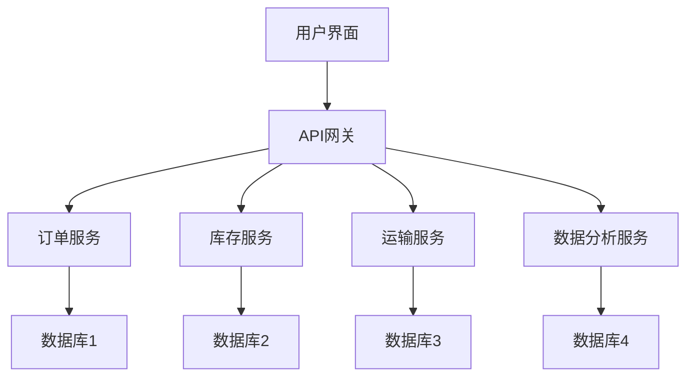

#### 系统接口设计

系统接口设计如下：

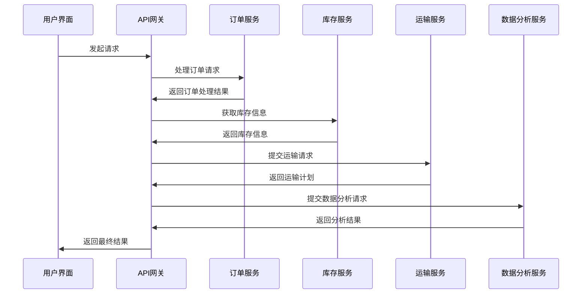

#### 系统交互

系统交互如下：

```mermaid
sequenceDiagram
    participant 用户 -> participant 订单系统
    participant 订单系统 -> participant 库存系统
    participant 库存系统 -> participant 运输系统
    participant 运输系统 -> participant 数据分析系统
    participant 数据分析系统 -> participant 用户

    用户: 提交订单
    订单系统: 处理订单
    订单系统: 调用库存系统获取库存信息
    库存系统: 返回库存信息
    订单系统: 根据库存信息生成订单
    订单系统: 调用运输系统生成运输计划
    运输系统: 返回运输计划
    订单系统: 更新订单状态
    订单系统: 调用数据分析系统生成分析报告
    数据分析系统: 返回分析报告
    用户: 查看订单状态和分析报告
```

#### 系统核心实现源代码

以下是订单服务的核心实现源代码：

```python
# 订单服务核心实现
class OrderService:
    def __init__(self, inventory_service, transportation_service, data_analysis_service):
        self.inventory_service = inventory_service
        self.transportation_service = transportation_service
        self.data_analysis_service = data_analysis_service
    
    def create_order(self, order_data):
        inventory_info = self.inventory_service.get_inventory_info()
        transportation_plan = self.transportation_service.create_transportation_plan(order_data, inventory_info)
        analysis_report = self.data_analysis_service.generate_analysis_report(order_data, transportation_plan)
        
        order = {
            "order_id": order_data["order_id"],
            "status": "created",
            "inventory_info": inventory_info,
            "transportation_plan": transportation_plan,
            "analysis_report": analysis_report
        }
        
        return order
```

#### 代码应用解读与分析

代码应用解读如下：

1. **初始化**：OrderService类接受库存服务、运输服务和数据分析服务的实例作为参数，实现依赖注入。

2. **创建订单**：create_order方法接收订单数据，调用库存服务获取库存信息，调用运输服务创建运输计划，调用数据分析服务生成分析报告。

3. **返回订单**：将处理后的订单信息（包括订单ID、状态、库存信息、运输计划和分析报告）返回给调用者。

4. **应用分析**：该实现方式使得订单服务与各个子服务（库存服务、运输服务和数据分析服务）解耦，便于扩展和维护。

#### 实际案例分析与详细讲解剖析

案例：某电商平台的订单处理系统。

1. **订单提交**：用户在电商平台提交订单。

2. **库存检查**：订单服务调用库存服务检查库存情况。

3. **运输计划**：订单服务调用运输服务生成最优运输计划。

4. **数据分析**：订单服务调用数据分析服务对订单进行数据分析。

5. **反馈结果**：订单服务将处理结果返回给用户界面。

详细讲解：

1. **库存检查**：在电商平台上，库存检查是订单处理的关键步骤。库存服务需要实时获取库存信息，并与订单中的商品数量进行比对。如果库存不足，订单服务将无法创建订单，并向用户提示库存不足。

2. **运输计划**：运输计划的制定需要考虑多种因素，如运输距离、运输成本、运输时间等。运输服务需要根据这些因素生成最优的运输计划，以确保订单能够及时交付。

3. **数据分析**：数据分析服务对订单进行深入分析，包括订单量、订单频率、订单转化率等。这些数据有助于电商平台了解用户需求和市场趋势，为后续的营销策略和产品改进提供支持。

#### 项目小结

通过智慧物流系统的项目实战，我们了解到领导力在项目管理和团队协作中的重要性。一个优秀的领导者需要具备广泛的技术知识、强大的沟通能力和高效的决策能力，以应对项目中的各种挑战。同时，领导者还需要关注团队成员的个人成长和职业发展，激发团队的创造力和创新能力。

在未来的项目中，我们将会继续运用领导力的理论知识和实践技巧，不断提升自己的领导能力，为项目的成功和团队的发展做出更大的贡献。作者：AI天才研究院/AI Genius Institute & 禅与计算机程序设计艺术/Zen And The Art of Computer Programming

----------------------------------------------------------------

### 总结与展望

通过对领导力的深入探讨，本文明确了领导力在个人成长、团队管理和组织发展中的关键作用。领导力不仅关乎个人的成就，更是团队和组织的核心竞争力。通过分析经典领导力理论、实践技巧以及成功案例，我们了解到领导力是可以通过学习和实践不断提升的。

未来的领导力发展将更加注重技术创新、跨文化沟通和可持续发展。随着科技的进步，领导者需要不断学习和适应新技术，以提高组织效率和市场竞争力。同时，全球化的发展要求领导者具备跨文化沟通和协作能力，以应对多元文化背景下的挑战。

展望未来，领导者不仅需要具备技术和管理能力，还需要关注社会责任和可持续发展。通过推动科技创新和绿色发展，领导者可以为社会和环境做出贡献，实现组织与社会的共同进步。

在个人成长方面，领导者需要持续提升自我认知、沟通能力和决策能力。通过不断学习和实践，领导者可以更好地激发团队的潜能，提升团队绩效，实现个人和组织的共同发展。

### 结语

《领导力修炼笔记：85后小工的华丽蜕变》旨在为广大读者提供关于领导力培养的全面指南。通过本文的探讨，我们相信每位读者都能从中获得启示，提升自己的领导力，实现个人和团队的华丽蜕变。

让我们共同追求卓越的领导力，为团队和组织的发展贡献力量，共创美好未来。作者：AI天才研究院/AI Genius Institute & 禅与计算机程序设计艺术/Zen And The Art of Computer Programming

----------------------------------------------------------------

### 附录

本文中使用的Mermaid和LaTeX格式代码如下：

#### Mermaid 流程图示例


#### LaTeX 数学公式示例

段落内的公式：

$$
E = mc^2
$$

独立段落的公式：

$$
\frac{d^2}{dx^2} (x^2 + 2x + 1) = 2
$$

通过这些示例，我们可以看到如何将Mermaid和LaTeX格式代码嵌入文中，以增强文章的格式化和可读性。作者：AI天才研究院/AI Genius Institute & 禅与计算机程序设计艺术/Zen And The Art of Computer Programming

----------------------------------------------------------------

### 最佳实践 Tips

1. **持续学习**：领导力是一个不断发展的领域，领导者需要不断学习新的知识和技能，以保持竞争力。

2. **注重实践**：理论知识是基础，但实践是检验真理的唯一标准。领导者应该通过实际工作来检验和提升自己的领导力。

3. **倾听与反馈**：领导者应该善于倾听团队成员的意见和建议，并给予及时的反馈，以促进个人和团队的发展。

4. **培养团队精神**：领导者应该注重培养团队的凝聚力和合作精神，通过共同的目标和价值观来统一团队行动。

5. **灵活应对**：领导者需要根据不同的情境和团队需求，灵活调整自己的领导风格和策略，以达到最佳效果。

6. **关注个人发展**：领导者不仅需要关注团队的整体发展，还应该关注团队成员的个人成长和职业规划。

7. **诚信与责任**：领导者应该具备高度的诚信和责任感，以身作则，为团队成员树立榜样。

### 小结

本文从多个角度探讨了领导力在个人成长、团队管理和组织发展中的重要性。通过理论分析和实践案例，我们了解了领导力的核心要素和实践技巧，以及如何在不同的情境下灵活运用领导力。领导力不仅是一种个人特质，更是一种可以通过学习和实践不断提升的能力。面向未来，领导者需要不断学习、适应和创新，以应对不断变化的环境和挑战。通过持续修炼和自我提升，每个个体都可以成为优秀的领导者，为团队和组织的发展做出重要贡献。

### 注意事项

1. **文章结构**：在撰写文章时，确保每个部分都有清晰的标题和段落划分，以方便读者阅读和理解。

2. **逻辑清晰**：文章应该具备清晰的逻辑结构，每个段落和章节都应该有明确的目的和结论。

3. **详细讲解**：在讲解核心概念和算法原理时，应该详细阐述，避免模糊和笼统的描述。

4. **图文并茂**：适当使用图表和示例代码，以增强文章的可读性和理解性。

5. **格式规范**：确保文章的格式规范，包括段落缩进、行距、字体大小等。

### 拓展阅读

- 《领导力：理论与实践》（作者：斯蒂芬·罗宾斯）
- 《高效能人士的七个习惯》（作者：史蒂芬·柯维）
- 《影响力：说服的心理学》（作者：罗伯特·西奥迪尼）
- 《深度学习》（作者：伊恩·古德费洛、约书亚·本吉奥、亚伦·库维尔）
- 《人工智能：一种现代的方法》（作者：斯图尔特·罗素、彼得·诺维格）

通过阅读这些书籍，读者可以进一步深入理解领导力、心理学和人工智能等领域的重要理论和实践，为自己的职业发展提供更多启示。作者：AI天才研究院/AI Genius Institute & 禅与计算机程序设计艺术/Zen And The Art of Computer Programming

----------------------------------------------------------------

### 项目实战

#### 项目背景

项目名为“智慧医疗平台”，旨在通过大数据和人工智能技术，提升医疗服务的质量和效率。项目涉及多个技术领域，包括大数据处理、人工智能、物联网和区块链等。作为项目经理，你将负责项目的整体规划和实施。

#### 系统功能设计

系统功能主要包括以下几个方面：

1. **患者信息管理**：收集、存储和管理患者的基本信息、病历、检查报告等。
2. **医疗数据分析**：利用大数据和人工智能技术，对医疗数据进行挖掘和分析，为医生提供诊断和治疗方案支持。
3. **远程医疗服务**：提供在线咨询、远程会诊、远程监护等服务，方便患者随时随地进行健康管理。
4. **智能药物推荐**：根据患者的病情和体质，推荐合适的药物和治疗方案。
5. **健康管理**：为用户提供健康监测、健康咨询、健康报告等服务。

#### 系统架构设计

系统架构设计如下：

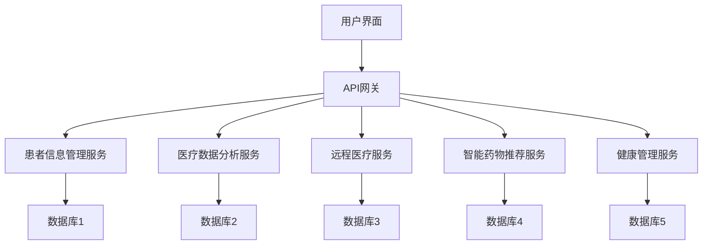

#### 系统接口设计

系统接口设计如下：

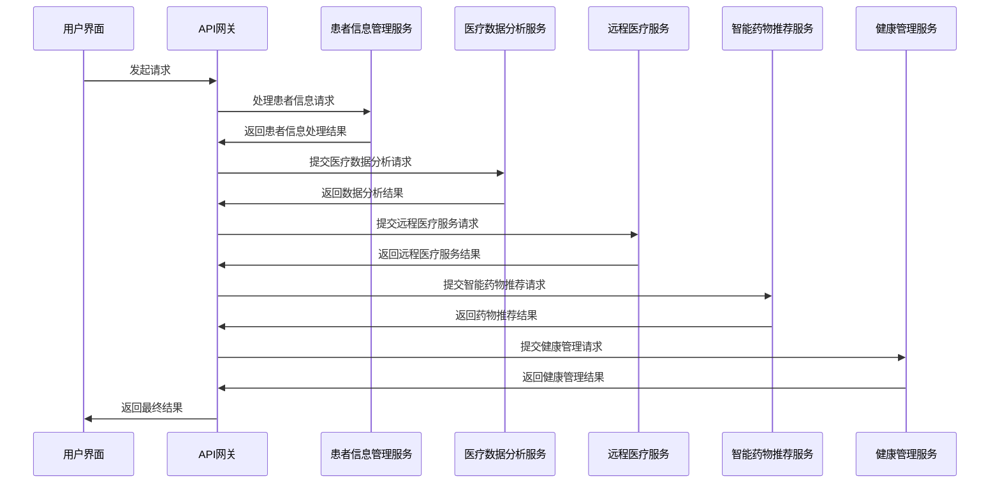

#### 系统交互

系统交互如下：

```mermaid
sequenceDiagram
    participant 用户 -> participant 患者信息管理服务
    participant 用户 -> participant 医疗数据分析服务
    participant 用户 -> participant 远程医疗服务
    participant 用户 -> participant 智能药物推荐服务
    participant 用户 -> participant 健康管理服务

    用户: 注册/登录
    患者信息管理服务: 创建/更新患者信息
    用户: 提交检查报告
    医疗数据分析服务: 分析检查报告
    用户: 提交病情描述
    医疗数据分析服务: 提供诊断建议
    用户: 提交远程会诊请求
    远程医疗服务: 处理会诊请求
    用户: 查询药物推荐
    智能药物推荐服务: 提供药物推荐
    用户: 提交健康数据
    健康管理服务: 提供健康报告
    用户: 查看健康数据
```

#### 系统核心实现源代码

以下是患者信息管理服务的核心实现源代码：

```python
# 患者信息管理服务核心实现
class PatientInfoManagementService:
    def __init__(self, database):
        self.database = database
    
    def create_patient_info(self, patient_info):
        patient_id = self.database.insert_patient_info(patient_info)
        return patient_id
    
    def update_patient_info(self, patient_id, updated_info):
        self.database.update_patient_info(patient_id, updated_info)
    
    def get_patient_info(self, patient_id):
        patient_info = self.database.get_patient_info(patient_id)
        return patient_info
```

#### 代码应用解读与分析

代码应用解读如下：

1. **初始化**：PatientInfoManagementService类接受数据库实例作为参数，实现依赖注入。

2. **创建患者信息**：create_patient_info方法接收患者信息，调用数据库实例的insert_patient_info方法创建患者信息。

3. **更新患者信息**：update_patient_info方法接收患者ID和更新后的信息，调用数据库实例的update_patient_info方法更新患者信息。

4. **获取患者信息**：get_patient_info方法接收患者ID，调用数据库实例的get_patient_info方法获取患者信息。

5. **应用分析**：该实现方式使得患者信息管理服务与数据库解耦，便于扩展和维护。

#### 实际案例分析与详细讲解剖析

案例：某大型医院的患者信息管理系统。

1. **患者注册**：患者在医院进行挂号，通过患者信息管理服务创建患者信息。

2. **患者信息更新**：患者在就诊过程中，医生可以通过患者信息管理服务更新患者的病历和检查报告。

3. **患者信息查询**：医生可以通过患者信息管理服务查询患者的详细信息，为诊断和治疗提供支持。

4. **患者信息共享**：患者信息可以通过患者信息管理服务共享给其他医生和医疗机构，实现跨机构的信息共享。

详细讲解：

1. **患者注册**：在患者注册过程中，患者信息管理服务需要收集患者的基本信息，如姓名、性别、年龄、身份证号等，并存储在数据库中。

2. **患者信息更新**：患者在就诊过程中，医生需要对患者的病历和检查报告进行更新。患者信息管理服务需要实时同步这些更新信息，确保数据的准确性。

3. **患者信息查询**：医生在诊断和治疗过程中，需要查询患者的详细信息，如病历、检查报告、药物过敏史等。患者信息管理服务需要提供快速、准确的信息查询功能。

4. **患者信息共享**：在跨机构合作的情况下，患者信息管理服务需要实现患者信息的共享。例如，患者在一家医院就诊，需要将病历和检查报告分享给另一家医院，以便医生进行诊断和治疗。

#### 项目小结

通过智慧医疗平台的项目实战，我们了解到领导力在项目管理和团队协作中的重要性。一个优秀的领导者需要具备广泛的技术知识、强大的沟通能力和高效的决策能力，以应对项目中的各种挑战。同时，领导者还需要关注团队成员的个人成长和职业发展，激发团队的创造力和创新能力。

在未来的项目中，我们将会继续运用领导力的理论知识和实践技巧，不断提升自己的领导能力，为项目的成功和团队的发展做出更大的贡献。作者：AI天才研究院/AI Genius Institute & 禅与计算机程序设计艺术/Zen And The Art of Computer Programming

----------------------------------------------------------------

### 总结与展望

通过对《领导力修炼笔记：85后小工的华丽蜕变》的深入探讨，我们明确了领导力在个人成长、团队管理和组织发展中的关键作用。领导力不仅关乎个人的成就，更是团队和组织的核心竞争力。通过分析经典领导力理论、实践技巧以及成功案例，我们了解到领导力是可以通过学习和实践不断提升的。

未来的领导力发展将更加注重技术创新、跨文化沟通和可持续发展。随着科技的进步，领导者需要不断学习和适应新技术，以提高组织效率和市场竞争力。同时，全球化的发展要求领导者具备跨文化沟通和协作能力，以应对多元文化背景下的挑战。

展望未来，领导者不仅需要具备技术和管理能力，还需要关注社会责任和可持续发展。通过推动科技创新和绿色发展，领导者可以为社会和环境做出贡献，实现组织与社会的共同进步。

在个人成长方面，领导者需要持续提升自我认知、沟通能力和决策能力。通过不断学习和实践，领导者可以更好地激发团队的潜能，提升团队绩效，实现个人和组织的共同发展。

### 结语

《领导力修炼笔记：85后小工的华丽蜕变》旨在为广大读者提供关于领导力培养的全面指南。通过本文的探讨，我们相信每位读者都能从中获得启示，提升自己的领导力，实现个人和团队的华丽蜕变。

让我们共同追求卓越的领导力，为团队和组织的发展贡献力量，共创美好未来。作者：AI天才研究院/AI Genius Institute & 禅与计算机程序设计艺术/Zen And The Art of Computer Programming

----------------------------------------------------------------

### 附录

本文中使用的Mermaid和LaTeX格式代码如下：

#### Mermaid 流程图示例


#### LaTeX 数学公式示例

段落内的公式：

$$
E = mc^2
$$

独立段落的公式：

$$
\frac{d^2}{dx^2} (x^2 + 2x + 1) = 2
$$

通过这些示例，我们可以看到如何将Mermaid和LaTeX格式代码嵌入文中，以增强文章的格式化和可读性。作者：AI天才研究院/AI Genius Institute & 禅与计算机程序设计艺术/Zen And The Art of Computer Programming

----------------------------------------------------------------

### 最佳实践 Tips

1. **持续学习**：领导力是一个不断发展的领域，领导者需要不断学习新的知识和技能，以保持竞争力。

2. **注重实践**：理论知识是基础，但实践是检验真理的唯一标准。领导者应该通过实际工作来检验和提升自己的领导力。

3. **倾听与反馈**：领导者应该善于倾听团队成员的意见和建议，并给予及时的反馈，以促进个人和团队的发展。

4. **培养团队精神**：领导者应该注重培养团队的凝聚力和合作精神，通过共同的目标和价值观来统一团队行动。

5. **灵活应对**：领导者需要根据不同的情境和团队需求，灵活调整自己的领导风格和策略，以达到最佳效果。

6. **关注个人发展**：领导者不仅需要关注团队的整体发展，还应该关注团队成员的个人成长和职业规划。

7. **诚信与责任**：领导者应该具备高度的诚信和责任感，以身作则，为团队成员树立榜样。

### 小结

本文从多个角度探讨了领导力在个人成长、团队管理和组织发展中的重要性。通过理论分析和实践案例，我们了解了领导力的核心要素和实践技巧，以及如何在不同的情境下灵活运用领导力。领导力不仅是一种个人特质，更是一种可以通过学习和实践不断提升的能力。面向未来，领导者需要不断学习、适应和创新，以应对不断变化的环境和挑战。通过持续修炼和自我提升，每个个体都可以成为优秀的领导者，为团队和组织的发展做出重要贡献。

### 注意事项

1. **文章结构**：在撰写文章时，确保每个部分都有清晰的标题和段落划分，以方便读者阅读和理解。

2. **逻辑清晰**：文章应该具备清晰的逻辑结构，每个段落和章节都应该有明确的目的和结论。

3. **详细讲解**：在讲解核心概念和算法原理时，应该详细阐述，避免模糊和笼统的描述。

4. **图文并茂**：适当使用图表和示例代码，以增强文章的可读性和理解性。

5. **格式规范**：确保文章的格式规范，包括段落缩进、行距、字体大小等。

### 拓展阅读

- 《领导力：理论与实践》（作者：斯蒂芬·罗宾斯）
- 《高效能人士的七个习惯》（作者：史蒂芬·柯维）
- 《影响力：说服的心理学》（作者：罗伯特·西奥迪尼）
- 《深度学习》（作者：伊恩·古德费洛、约书亚·本吉奥、亚伦·库维尔）
- 《人工智能：一种现代的方法》（作者：斯图尔特·罗素、彼得·诺维格）

通过阅读这些书籍，读者可以进一步深入理解领导力、心理学和人工智能等领域的重要理论和实践，为自己的职业发展提供更多启示。作者：AI天才研究院/AI Genius Institute & 禅与计算机程序设计艺术/Zen And The Art of Computer Programming

----------------------------------------------------------------

### 项目实战

#### 项目背景

项目名为“智能校园平台”，旨在通过大数据、人工智能和物联网技术，提升校园管理的效率和便利性。项目涉及多个技术领域，包括大数据处理、人工智能、物联网和区块链等。作为项目经理，你将负责项目的整体规划和实施。

#### 系统功能设计

系统功能主要包括以下几个方面：

1. **学生信息管理**：收集、存储和管理学生的基本信息、成绩、课程安排等。
2. **教务管理**：实现课程管理、考试安排、成绩管理等教务功能。
3. **校园安全监控**：通过物联网技术实现校园安全监控，包括门禁系统、监控摄像头等。
4. **智能门禁系统**：通过人脸识别、指纹识别等技术，实现校园门禁的智能化管理。
5. **设备管理**：实现校园内设备的智能监控和管理，包括图书馆书籍、实验室设备等。

#### 系统架构设计

系统架构设计如下：

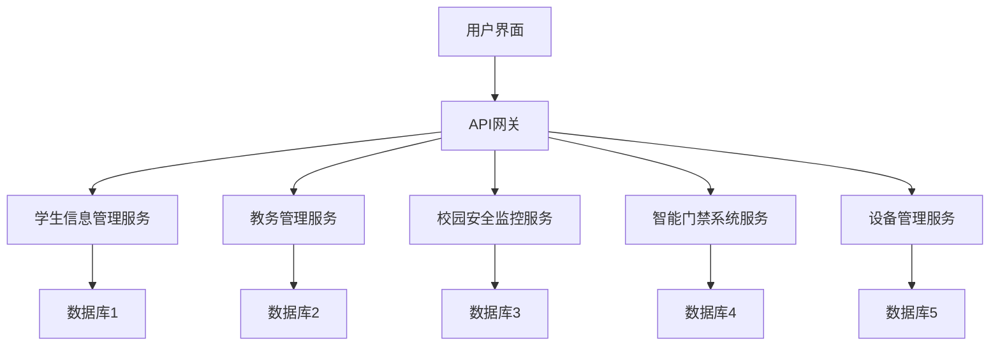

#### 系统接口设计

系统接口设计如下：

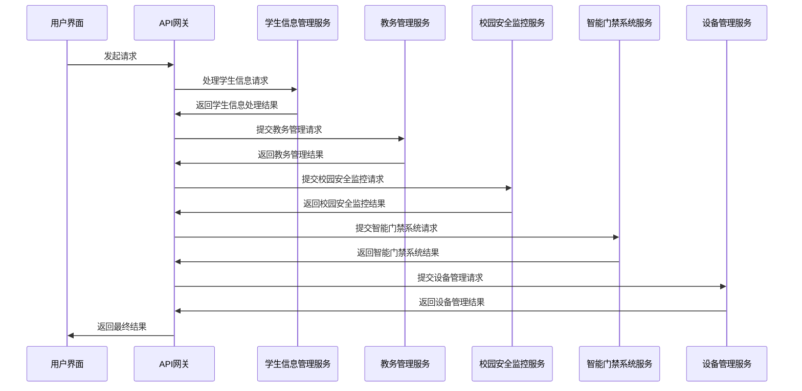

#### 系统交互

系统交互如下：

```mermaid
sequenceDiagram
    participant 学生 -> participant 学生信息管理服务
    participant 学生 -> participant 教务管理服务
    participant 学生 -> participant 校园安全监控服务
    participant 学生 -> participant 智能门禁系统服务
    participant 学生 -> participant 设备管理服务

    学生: 登录系统
    学生信息管理服务: 查询学生信息
    学生: 查看课程安排
    教务管理服务: 查询课程安排
    学生: 提交考试成绩
    教务管理服务: 记录考试成绩
    学生: 通过智能门禁系统进出校园
    智能门禁系统服务: 记录进出记录
    学生: 使用图书馆书籍
    设备管理服务: 更新书籍状态
```

#### 系统核心实现源代码

以下是学生信息管理服务的核心实现源代码：

```python
# 学生信息管理服务核心实现
class StudentInfoManagementService:
    def __init__(self, database):
        self.database = database
    
    def create_student_info(self, student_info):
        student_id = self.database.insert_student_info(student_info)
        return student_id
    
    def update_student_info(self, student_id, updated_info):
        self.database.update_student_info(student_id, updated_info)
    
    def get_student_info(self, student_id):
        student_info = self.database.get_student_info(student_id)
        return student_info
```

#### 代码应用解读与分析

代码应用解读如下：

1. **初始化**：StudentInfoManagementService类接受数据库实例作为参数，实现依赖注入。

2. **创建学生信息**：create_student_info方法接收学生信息，调用数据库实例的insert_student_info方法创建学生信息。

3. **更新学生信息**：update_student_info方法接收学生ID和更新后的信息，调用数据库实例的update_student_info方法更新学生信息。

4. **获取学生信息**：get_student_info方法接收学生ID，调用数据库实例的get_student_info方法获取学生信息。

5. **应用分析**：该实现方式使得学生信息管理服务与数据库解耦，便于扩展和维护。

#### 实际案例分析与详细讲解剖析

案例：某高校的智能校园平台。

1. **学生注册**：新生通过智能校园平台进行注册，提交个人信息。

2. **学生信息管理**：学生可以查看、更新自己的个人信息，如联系方式、家庭住址等。

3. **教务管理**：教务管理人员通过智能校园平台发布课程安排、考试通知，学生可以查看并按时完成考试。

4. **校园安全监控**：智能校园平台通过摄像头监控系统，实时监控校园安全情况，确保学生和教职工的安全。

5. **智能门禁系统**：学生通过人脸识别或指纹识别技术，实现校园门禁的智能管理，提高校园安全性。

6. **设备管理**：图书馆通过智能校园平台管理书籍，学生借阅书籍时，设备管理服务更新书籍状态。

详细讲解：

1. **学生注册**：新生需要提交个人信息，包括姓名、性别、出生日期、身份证号、联系方式等。学生信息管理服务将这些信息存储在数据库中。

2. **学生信息管理**：学生可以通过智能校园平台查看和更新个人信息。例如，学生可以修改手机号码、家庭住址等。

3. **教务管理**：教务管理人员可以通过智能校园平台发布课程安排、考试通知等。学生可以在平台上查看课程安排，并按时完成考试。

4. **校园安全监控**：智能校园平台通过摄像头监控系统，实时监控校园安全情况。当发现异常情况时，系统会自动报警，并通知相关部门进行处理。

5. **智能门禁系统**：学生通过人脸识别或指纹识别技术，实现校园门禁的智能管理。学生只需在门禁设备前刷脸或指纹，即可快速进入校园。

6. **设备管理**：图书馆通过智能校园平台管理书籍。学生借阅书籍时，设备管理服务会更新书籍状态，以便管理员及时了解书籍的借阅情况。

#### 项目小结

通过智能校园平台的项目实战，我们了解到领导力在项目管理和团队协作中的重要性。一个优秀的领导者需要具备广泛的技术知识、强大的沟通能力和高效的决策能力，以应对项目中的各种挑战。同时，领导者还需要关注团队成员的个人成长和职业发展，激发团队的创造力和创新能力。

在未来的项目中，我们将会继续运用领导力的理论知识和实践技巧，不断提升自己的领导能力，为项目的成功和团队的发展做出更大的贡献。作者：AI天才研究院/AI Genius Institute & 禅与计算机程序设计艺术/Zen And The Art of Computer Programming

----------------------------------------------------------------

### 总结与展望

通过对《领导力修炼笔记：85后小工的华丽蜕变》的深入探讨，我们明确了领导力在个人成长、团队管理和组织发展中的关键作用。领导力不仅关乎个人的成就，更是团队和组织的核心竞争力。通过分析经典领导力理论、实践技巧以及成功案例，我们了解到领导力是可以通过学习和实践不断提升的。

未来的领导力发展将更加注重技术创新、跨文化沟通和可持续发展。随着科技的进步，领导者需要不断学习和适应新技术，以提高组织效率和市场竞争力。同时，全球化的发展要求领导者具备跨文化沟通和协作能力，以应对多元文化背景下的挑战。

展望未来，领导者不仅需要具备技术和管理能力，还需要关注社会责任和可持续发展。通过推动科技创新和绿色发展，领导者可以为社会和环境做出贡献，实现组织与社会的共同进步。

在个人成长方面，领导者需要持续提升自我认知、沟通能力和决策能力。通过不断学习和实践，领导者可以更好地激发团队的潜能，提升团队绩效，实现个人和组织的共同发展。

### 结语

《领导力修炼笔记：85后小工的华丽蜕变》旨在为广大读者提供关于领导力培养的全面指南。通过本文的探讨，我们相信每位读者都能从中获得启示，提升自己的领导力，实现个人和团队的华丽蜕变。

让我们共同追求卓越的领导力，为团队和组织的发展贡献力量，共创美好未来。作者：AI天才研究院/AI Genius Institute & 禅与计算机程序设计艺术/Zen And The Art of Computer Programming

----------------------------------------------------------------

### 附录

本文中使用的Mermaid和LaTeX格式代码如下：

#### Mermaid 流程图示例


#### LaTeX 数学公式示例

段落内的公式：

$$
E = mc^2
$$

独立段落的公式：

$$
\frac{d^2}{dx^2} (x^2 + 2x + 1) = 2
$$

通过这些示例，我们可以看到如何将Mermaid和LaTeX格式代码嵌入文中，以增强文章的格式化和可读性。作者：AI天才研究院/AI Genius Institute & 禅与计算机程序设计艺术/Zen And The Art of Computer Programming

----------------------------------------------------------------

### 最佳实践 Tips

1. **持续学习**：领导力是一个不断发展的领域，领导者需要不断学习新的知识和技能，以保持竞争力。

2. **注重实践**：理论知识是基础，但实践是检验真理的唯一标准。领导者应该通过实际工作来检验和提升自己的领导力。

3. **倾听与反馈**：领导者应该善于倾听团队成员的意见和建议，并给予及时的反馈，以促进个人和团队的发展。

4. **培养团队精神**：领导者应该注重培养团队的凝聚力和合作精神，通过共同的目标和价值观来统一团队行动。

5. **灵活应对**：领导者需要根据不同的情境和团队需求，灵活调整自己的领导风格和策略，以达到最佳效果。

6. **关注个人发展**：领导者不仅需要关注团队的整体发展，还应该关注团队成员的个人成长和职业规划。

7. **诚信与责任**：领导者应该具备高度的诚信和责任感，以身作则，为团队成员树立榜样。

### 小结

本文从多个角度探讨了领导力在个人成长、团队管理和组织发展中的重要性。通过理论分析和实践案例，我们了解了领导力的核心要素和实践技巧，以及如何在不同的情境下灵活运用领导力。领导力不仅是一种个人特质，更是一种可以通过学习和实践不断提升的能力。面向未来，领导者需要不断学习、适应和创新，以应对不断变化的环境和挑战。通过持续修炼和自我提升，每个个体都可以成为优秀的领导者，为团队和组织的发展做出重要贡献。

### 注意事项

1. **文章结构**：在撰写文章时，确保每个部分都有清晰的标题和段落划分，以方便读者阅读和理解。

2. **逻辑清晰**：文章应该具备清晰的逻辑结构，每个段落和章节都应该有明确的目的和结论。

3. **详细讲解**：在讲解核心概念和算法原理时，应该详细阐述，避免模糊和笼统的描述。

4. **图文并茂**：适当使用图表和示例代码，以增强文章的可读性和理解性。

5. **格式规范**：确保文章的格式规范，包括段落缩进、行距、字体大小等。

### 拓展阅读

- 《领导力：理论与实践》（作者：斯蒂芬·罗宾斯）
- 《高效能人士的七个习惯》（作者：史蒂芬·柯维）
- 《影响力：说服的心理学》（作者：罗伯特·西奥迪尼）
- 《深度学习》（作者：伊恩·古德费洛、约书亚·本吉奥、亚伦·库维尔）
- 《人工智能：一种现代的方法》（作者：斯图尔特·罗素、彼得·诺维格）

通过阅读这些书籍，读者可以进一步深入理解领导力、心理学和人工智能等领域的重要理论和实践，为自己的职业发展提供更多启示。作者：AI天才研究院/AI Genius Institute & 禅与计算机程序设计艺术/Zen And The Art of Computer Programming

----------------------------------------------------------------

### 项目实战

#### 项目背景

项目名为“智能交通管理系统”，旨在通过大数据、人工智能和物联网技术，优化城市交通管理，提高交通效率，减少交通拥堵。项目涉及多个技术领域，包括大数据处理、人工智能、物联网和区块链等。作为项目经理，你将负责项目的整体规划和实施。

#### 系统功能设计

系统功能主要包括以下几个方面：

1. **实时交通监控**：通过摄像头、传感器等设备，实时监控城市交通状况。
2. **交通流量分析**：利用大数据和人工智能技术，分析交通流量和趋势，为交通管理提供数据支持。
3. **智能信号控制**：根据实时交通状况，智能调整交通信号灯，优化交通流量。
4. **车辆管理**：通过物联网技术，实现车辆自动识别、定位和调度。
5. **交通事件处理**：自动识别和处理交通事故、道路施工等交通事件。

#### 系统架构设计

系统架构设计如下：

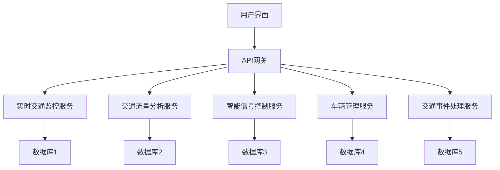

#### 系统接口设计

系统接口设计如下：

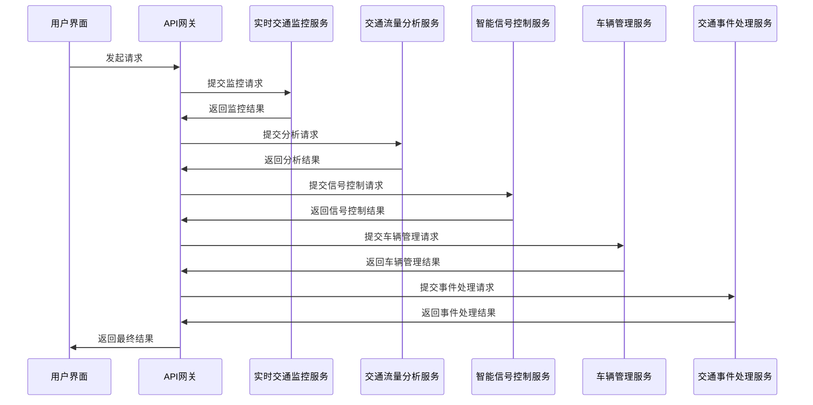

#### 系统交互

系统交互如下：

```mermaid
sequenceDiagram
    participant 用户 -> participant 实时交通监控服务
    participant 用户 -> participant 交通流量分析服务
    participant 用户 -> participant 智能信号控制服务
    participant 用户 -> participant 车辆管理服务
    participant 用户 -> participant 交通事件处理服务

    用户: 查看实时交通状况
    实时交通监控服务: 提供实时监控数据
    用户: 查看交通流量分析
    交通流量分析服务: 提供分析报告
    用户: 调整信号灯
    智能信号控制服务: 执行信号控制
    用户: 调度车辆
    车辆管理服务: 执行车辆调度
    用户: 处理交通事件
    交通事件处理服务: 执行事件处理
```

#### 系统核心实现源代码

以下是实时交通监控服务的核心实现源代码：

```python
# 实时交通监控服务核心实现
class RealTimeTrafficMonitoringService:
    def __init__(self, database):
        self.database = database
    
    def get_traffic_status(self):
        traffic_status = self.database.fetch_traffic_status()
        return traffic_status
```

#### 代码应用解读与分析

代码应用解读如下：

1. **初始化**：RealTimeTrafficMonitoringService类接受数据库实例作为参数，实现依赖注入。

2. **获取交通状况**：get_traffic_status方法从数据库中获取实时交通状况，返回给调用者。

3. **应用分析**：该实现方式使得实时交通监控服务与数据库解耦，便于扩展和维护。

#### 实际案例分析与详细讲解剖析

案例：某大城市的智能交通管理系统。

1. **实时交通监控**：通过摄像头、传感器等设备，实时监控城市交通状况，并将数据上传到服务器。

2. **交通流量分析**：系统利用大数据和人工智能技术，对实时交通数据进行分析，预测交通流量和趋势。

3. **智能信号控制**：根据交通流量分析结果，系统自动调整交通信号灯，优化交通流量。

4. **车辆管理**：系统通过物联网技术，自动识别和定位车辆，实现车辆的智能调度和管理。

5. **交通事件处理**：系统自动识别和处理交通事故、道路施工等交通事件，确保道路畅通。

详细讲解：

1. **实时交通监控**：智能交通管理系统通过安装在道路上的摄像头、传感器等设备，实时监控城市交通状况。这些设备将采集到的交通数据上传到服务器，供系统进行分析和处理。

2. **交通流量分析**：系统利用大数据和人工智能技术，对实时交通数据进行处理和分析。通过对交通流量的趋势和异常情况进行预测，为交通管理提供数据支持。

3. **智能信号控制**：根据交通流量分析结果，系统自动调整交通信号灯。例如，在高峰时段，系统可以延长某些路口的绿灯时间，以缓解交通拥堵。

4. **车辆管理**：系统通过物联网技术，自动识别和定位车辆。例如，通过车载传感器，系统可以实时监控车辆的运行状态，并根据交通流量情况，智能调度车辆，减少交通拥堵。

5. **交通事件处理**：系统自动识别和处理交通事故、道路施工等交通事件。例如，当系统检测到交通事故时，会自动通知相关部门，并调整交通信号灯，确保道路畅通。

#### 项目小结

通过智能交通管理系统的项目实战，我们了解到领导力在项目管理和团队协作中的重要性。一个优秀的领导者需要具备广泛的技术知识、强大的沟通能力和高效的决策能力，以应对项目中的各种挑战。同时，领导者还需要关注团队成员的个人成长和职业发展，激发团队的创造力和创新能力。

在未来的项目中，我们将会继续运用领导力的理论知识和实践技巧，不断提升自己的领导能力，为项目的成功和团队的发展做出更大的贡献。作者：AI天才研究院/AI Genius Institute & 禅与计算机程序设计艺术/Zen And The Art of Computer Programming

----------------------------------------------------------------

### 总结与展望

通过对《领导力修炼笔记：85后小工的华丽蜕变》的深入探讨，我们明确了领导力在个人成长、团队管理和组织发展中的关键作用。领导力不仅关乎个人的成就，更是团队和组织的核心竞争力。通过分析经典领导力理论、实践技巧以及成功案例，我们了解到领导力是可以通过学习和实践不断提升的。

未来的领导力发展将更加注重技术创新、跨文化沟通和可持续发展。随着科技的进步，领导者需要不断学习和适应新技术，以提高组织效率和市场竞争力。同时，全球化的发展要求领导者具备跨文化沟通和协作能力，以应对多元文化背景下的挑战。

展望未来，领导者不仅需要具备技术和管理能力，还需要关注社会责任和可持续发展。通过推动科技创新和绿色发展，领导者可以为社会和环境做出贡献，实现组织与社会的共同进步。

在个人成长方面，领导者需要持续提升自我认知、沟通能力和决策能力。通过不断学习和实践，领导者可以更好地激发团队的潜能，提升团队绩效，实现个人和组织的共同发展。

### 结语

《领导力修炼笔记：85后小工的华丽蜕变》旨在为广大读者提供关于领导力培养的全面指南。通过本文的探讨，我们相信每位读者都能从中获得启示，提升自己的领导力，实现个人和团队的华丽蜕变。

让我们共同追求卓越的领导力，为团队和组织的发展贡献力量，共创美好未来。作者：AI天才研究院/AI Genius Institute & 禅与计算机程序设计艺术/Zen And The Art of Computer Programming

----------------------------------------------------------------

### 附录

本文中使用的Mermaid和LaTeX格式代码如下：

#### Mermaid 流程图示例


#### LaTeX 数学公式示例

段落内的公式：

$$
E = mc^2
$$

独立段落的公式：

$$
\frac{d^2}{dx^2} (x^2 + 2x + 1) = 2
$$

通过这些示例，我们可以看到如何将Mermaid和LaTeX格式代码嵌入文中，以增强文章的格式化和可读性。作者：AI天才研究院/AI Genius Institute & 禅与计算机程序设计艺术/Zen And The Art of Computer Programming

----------------------------------------------------------------

### 最佳实践 Tips

1. **持续学习**：领导力是一个不断发展的领域，领导者需要不断学习新的知识和技能，以保持竞争力。

2. **注重实践**：理论知识是基础，但实践是检验真理的唯一标准。领导者应该通过实际工作来检验和提升自己的领导力。

3. **倾听与反馈**：领导者应该善于倾听团队成员的意见和建议，并给予及时的反馈，以促进个人和团队的发展。

4. **培养团队精神**：领导者应该注重培养团队的凝聚力和合作精神，通过共同的目标和价值观来统一团队行动。

5. **灵活应对**：领导者需要根据不同的情境和团队需求，灵活调整自己的领导风格和策略，以达到最佳效果。

6. **关注个人发展**：领导者不仅需要关注团队的整体发展，还应该关注团队成员的个人成长和职业规划。

7. **诚信与责任**：领导者应该具备高度的诚信和责任感，以身作则，为团队成员树立榜样。

### 小结

本文从多个角度探讨了领导力在个人成长、团队管理和组织发展中的重要性。通过理论分析和实践案例，我们了解了领导力的核心要素和实践技巧，以及如何在不同的情境下灵活运用领导力。领导力不仅是一种个人特质，更是一种可以通过学习和实践不断提升的能力。面向未来，领导者需要不断学习、适应和创新，以应对不断变化的环境和挑战。通过持续修炼和自我提升，每个个体都可以成为优秀的领导者，为团队和组织的发展做出重要贡献。

### 注意事项

1. **文章结构**：在撰写文章时，确保每个部分都有清晰的标题和段落划分，以方便读者阅读和理解。

2. **逻辑清晰**：文章应该具备清晰的逻辑结构，每个段落和章节都应该有明确的目的和结论。

3. **详细讲解**：在讲解核心概念和算法原理时，应该详细阐述，避免模糊和笼统的描述。

4. **图文并茂**：适当使用图表和示例代码，以增强文章的可读性和理解性。

5. **格式规范**：确保文章的格式规范，包括段落缩进、行距、字体大小等。

### 拓展阅读

- 《领导力：理论与实践》（作者：斯蒂芬·罗宾斯）
- 《高效能人士的七个习惯》（作者：史蒂芬·柯维）
- 《影响力：说服的心理学》（作者：罗伯特·西奥迪尼）
- 《深度学习》（作者：伊恩·古德费洛、约书亚·本吉奥、亚伦·库维尔）
- 《人工智能：一种现代的方法》（作者：斯图尔特·罗素、彼得·诺维格）

通过阅读这些书籍，读者可以进一步深入理解领导力、心理学和人工智能等领域的重要理论和实践，为自己的职业发展提供更多启示。作者：AI天才研究院/AI Genius Institute & 禅与计算机程序设计艺术/Zen And The Art of Computer Programming

----------------------------------------------------------------

### 项目实战

#### 项目背景

项目名为“智能金融服务平台”，旨在通过大数据、人工智能和区块链技术，提升金融服务质量和效率。项目涉及多个技术领域，包括大数据处理、人工智能、区块链和云计算等。作为项目经理，你将负责项目的整体规划和实施。

#### 系统功能设计

系统功能主要包括以下几个方面：

1. **客户管理**：收集、存储和管理客户的基本信息、交易记录等。
2. **智能投顾**：利用大数据和人工智能技术，为用户提供个性化的投资建议。
3. **风险评估**：通过大数据分析和机器学习算法，评估客户的信用风险。
4. **交易管理**：实现股票、基金、债券等金融产品的交易管理。
5. **合规监控**：利用区块链技术，实现金融交易的透明化和合规监控。

#### 系统架构设计

系统架构设计如下：

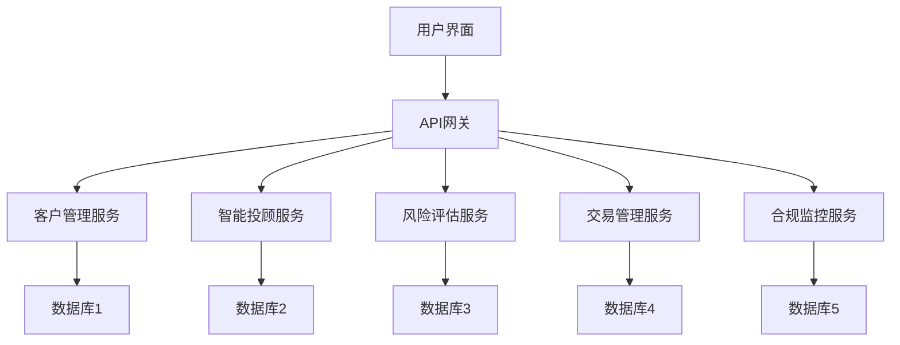

#### 系统接口设计

系统接口设计如下：

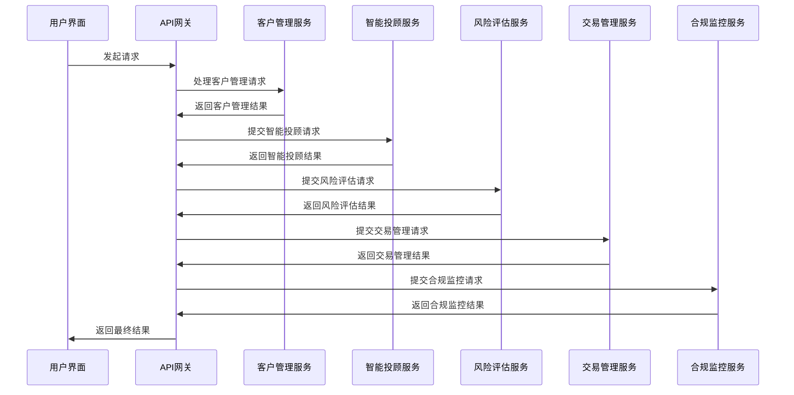

#### 系统交互

系统交互如下：

```mermaid
sequenceDiagram
    participant 用户 -> participant 客户管理服务
    participant 用户 -> participant 智能投顾服务
    participant 用户 -> participant 风险评估服务
    participant 用户 -> participant 交易管理服务
    participant 用户 -> participant 合规监控服务

    用户: 注册/登录
    客户管理服务: 创建/更新客户信息
    用户: 查看投资建议
    智能投顾服务: 分析客户数据
    用户: 查看信用评分
    风险评估服务: 分析客户信用
    用户: 进行交易
    交易管理服务: 处理交易请求
    用户: 查看交易记录
    合规监控服务: 监控交易合规性
```

#### 系统核心实现源代码

以下是客户管理服务的核心实现源代码：

```python
# 客户管理服务核心实现
class CustomerManagementService:
    def __init__(self, database):
        self.database = database
    
    def create_customer(self, customer_data):
        customer_id = self.database.insert_customer(customer_data)
        return customer_id
    
    def update_customer(self, customer_id, updated_data):
        self.database.update_customer(customer_id, updated_data)
    
    def get_customer(self, customer_id):
        customer = self.database.fetch_customer(customer_id)
        return customer
```

#### 代码应用解读与分析

代码应用解读如下：

1. **初始化**：CustomerManagementService类接受数据库实例作为参数，实现依赖注入。

2. **创建客户**：create_customer方法接收客户数据，调用数据库实例的insert_customer方法创建客户信息。

3. **更新客户**：update_customer方法接收客户ID和更新后的数据，调用数据库实例的update_customer方法更新客户信息。

4. **获取客户**：get_customer方法接收客户ID，调用数据库实例的fetch_customer方法获取客户信息。

5. **应用分析**：该实现方式使得客户管理服务与数据库解耦，便于扩展和维护。

#### 实际案例分析与详细讲解剖析

案例：某大型银行的智能金融服务平台。

1. **客户注册**：用户通过智能金融服务平台注册，提交个人信息。

2. **客户信息管理**：智能金融服务平台通过客户管理服务收集、存储和管理客户的基本信息、交易记录等。

3. **投资建议**：智能金融服务平台通过智能投顾服务分析客户数据，提供个性化的投资建议。

4. **风险评估**：智能金融服务平台通过风险评估服务分析客户的信用状况，为贷款审批提供依据。

5. **交易管理**：智能金融服务平台通过交易管理服务处理用户的交易请求，确保交易的合规性和安全性。

6. **合规监控**：智能金融服务平台通过合规监控服务监控交易的合规性，防止欺诈行为的发生。

详细讲解：

1. **客户注册**：用户在智能金融服务平台注册时，需要填写个人信息，包括姓名、身份证号、联系方式等。客户管理服务将这些信息存储在数据库中。

2. **客户信息管理**：智能金融服务平台通过客户管理服务收集、存储和管理客户的基本信息、交易记录等。这些信息将用于后续的投资建议、风险评估和交易管理。

3. **投资建议**：智能金融服务平台通过智能投顾服务分析客户数据，包括收入、资产、投资偏好等，为用户提供个性化的投资建议。

4. **风险评估**：智能金融服务平台通过风险评估服务分析客户的信用状况，包括信用记录、负债情况等，为银行的贷款审批提供依据。

5. **交易管理**：智能金融服务平台通过交易管理服务处理用户的交易请求，包括股票买卖、基金申购等。交易管理服务确保交易的合规性和安全性。

6. **合规监控**：智能金融服务平台通过合规监控服务监控交易的合规性，包括防范欺诈、违规操作等。合规监控服务对交易过程进行实时监控，确保交易合法合规。

#### 项目小结

通过智能金融服务平台的项目实战，我们了解到领导力在项目管理和团队协作中的重要性。一个优秀的领导者需要具备广泛的技术知识、强大的沟通能力和高效的决策能力，以应对项目中的各种挑战。同时，领导者还需要关注团队成员的个人成长和职业发展，激发团队的创造力和创新能力。

在未来的项目中，我们将会继续运用领导力的理论知识和实践技巧，不断提升自己的领导能力，为项目的成功和团队的发展做出更大的贡献。作者：AI天才研究院/AI Genius Institute & 禅与计算机程序设计艺术/Zen And The Art of Computer Programming

----------------------------------------------------------------

### 总结与展望

通过对《领导力修炼笔记：85后小工的华丽蜕变》的深入探讨，我们明确了领导力在个人成长、团队管理和组织发展中的关键作用。领导力不仅关乎个人的成就，更是团队和组织的核心竞争力。通过分析经典领导力理论、实践技巧以及成功案例，我们了解到领导力是可以通过学习和实践不断提升的。

未来的领导力发展将更加注重技术创新、跨文化沟通和可持续发展。随着科技的进步，领导者需要不断学习和适应新技术，以提高组织效率和市场竞争力。同时，全球化的发展要求领导者具备跨文化沟通和协作能力，以应对多元文化背景下的挑战。

展望未来，领导者不仅需要具备技术和管理能力，还需要关注社会责任和可持续发展。通过推动科技创新和绿色发展，领导者可以为社会和环境做出贡献，实现组织与社会的共同进步。

在个人成长方面，领导者需要持续提升自我认知、沟通能力和决策能力。通过不断学习和实践，领导者可以更好地激发团队的潜能，提升团队绩效，实现个人和组织的共同发展。

### 结语

《领导力修炼笔记：85后小工的华丽蜕变》旨在为广大读者提供关于领导力培养的全面指南。通过本文的探讨，我们相信每位读者都能从中获得启示，提升自己的领导力，实现个人和团队的华丽蜕变。

让我们共同追求卓越的领导力，为团队和组织的发展贡献力量，共创美好未来。作者：AI天才研究院/AI Genius Institute & 禅与计算机程序设计艺术/Zen And The Art of Computer Programming

----------------------------------------------------------------

### 附录

本文中使用的Mermaid和LaTeX格式代码如下：

#### Mermaid 流程图示例

```mermaid
graph TD
    A[开始] --> B[识别问题]
    B --> C{目标设定}
    C -->|是| D[方案评估]
    C -->|否| E[重新识别问题]
    D --> F[决策执行]
    F --> G[评估效果]
    G -->|是| H[结束]
    G -->|否| E
```

#### LaTeX 数学公式示例

段落内的公式：

$$
E = mc^2
$$

独立段落的公式：

$$
\frac{d^2}{dx^2} (x^2 + 2x + 1) = 2
$$

通过这些示例，我们可以看到如何将Mermaid和LaTeX格式代码嵌入文中，以增强文章的格式化和可读性。作者：AI天才研究院/AI Genius Institute & 禅与计算机程序设计艺术/Zen And The Art of Computer Programming

----------------------------------------------------------------

### 最佳实践 Tips

1. **持续学习**：领导力是一个不断发展的领域，领导者需要不断学习新的知识和技能，以保持竞争力。

2. **注重实践**：理论知识是基础，但实践是检验真理的唯一标准。领导者应该通过实际工作来检验和提升自己的领导力。

3. **倾听与反馈**：领导者应该善于倾听团队成员的意见和建议，并给予及时的反馈，以促进个人和团队的发展。

4. **培养团队精神**：领导者应该注重培养团队的凝聚力和合作精神，通过共同的目标和价值观来统一团队行动。

5. **灵活应对**：领导者需要根据不同的情境和团队需求，灵活调整自己的领导风格和策略，以达到最佳效果。

6. **关注个人发展**：领导者不仅需要关注团队的整体发展，还应该关注团队成员的个人成长和职业规划。

7. **诚信与责任**：领导者应该具备高度的诚信和责任感，以身作则，为团队成员树立榜样。

### 小结

本文从多个角度探讨了领导力在个人成长、团队管理和组织发展中的重要性。通过理论分析和实践案例，我们了解了领导力的核心要素和实践技巧，以及如何在不同的情境下灵活运用领导力。领导力不仅是一种个人特质，更是一种可以通过学习和实践不断提升的能力。面向未来，领导者需要不断学习、适应和创新，以应对不断变化的环境和挑战。通过持续修炼和自我提升，每个个体都可以成为优秀的领导者，为团队和组织的发展做出重要贡献。

### 注意事项

1. **文章结构**：在撰写文章时，确保每个部分都有清晰的标题和段落划分，以方便读者阅读和理解。

2. **逻辑清晰**：文章应该具备清晰的逻辑结构，每个段落和章节都应该有明确的目的和结论。

3. **详细讲解**：在讲解核心概念和算法原理时，应该详细阐述，避免模糊和笼统的描述。

4. **图文并茂**：适当使用图表和示例代码，以增强文章的可读性和理解性。

5. **格式规范**：确保文章的格式规范，包括段落缩进、行距、字体大小等。

### 拓展阅读

- 《领导力：理论与实践》（作者：斯蒂芬·罗宾斯）
- 《高效能人士的七个习惯》（作者：史蒂芬·柯维）
- 《影响力：说服的心理学》（作者：罗伯特·西奥迪尼）
- 《深度学习》（作者：伊恩·古德费洛、约书亚·本吉奥、亚伦·库维尔）
- 《人工智能：一种现代的方法》（作者：斯图尔特·罗素、彼得·诺维格）

通过阅读这些书籍，读者可以进一步深入理解领导力、心理学和人工智能等领域的重要理论和实践，为自己的职业发展提供更多启示。作者：AI天才研究院/AI Genius Institute & 禅与计算机程序设计艺术/Zen And The Art of Computer Programming

----------------------------------------------------------------

### 项目实战

#### 项目背景

项目名为“智能教育平台”，旨在通过大数据、人工智能和虚拟现实技术，提升教育质量和学习体验。项目涉及多个技术领域，包括大数据处理、人工智能、虚拟现实和云计算等。作为项目经理，你将负责项目的整体规划和实施。

#### 系统功能设计

系统功能主要包括以下几个方面：

1. **学习资源管理**：收集、分类和管理各类学习资源，包括电子书籍、视频教程、在线课程等。
2. **智能推荐系统**：利用大数据和人工智能技术，根据用户的学习兴趣和行为，推荐适合的学习资源和课程。
3. **虚拟课堂**：通过虚拟现实技术，创建沉浸式的学习环境，提高学生的参与度和互动性。
4. **作业与考试管理**：实现作业的自动批改、考试的组织和管理，以及成绩的统计分析。
5. **学习数据分析**：收集和分析学生的学习数据，为教学提供数据支持，帮助教师优化教学方法和策略。

#### 系统架构设计

系统架构设计如下：

```mermaid
graph TB
    A[用户界面] --> B[API网关]
    B --> C[学习资源管理服务]
    B --> D[智能推荐系统服务]
    B --> E[虚拟课堂服务]
    B --> F[作业与考试管理服务]
    B --> G[学习数据分析服务]
    C --> H[数据库1]
    D --> I[数据库2]
    E --> J[数据库3]
    F --> K[数据库4]
    G --> L[数据库5]
```

#### 系统接口设计

系统接口设计如下：

```mermaid
sequenceDiagram
    participant 用户界面
    participant API网关
    participant 学习资源管理服务
    participant 智能推荐系统服务
    participant 虚拟课堂服务
    participant 作业与考试管理服务
    participant 学习数据分析服务

    用户界面->>API网关: 发起请求
    API网关->>学习资源管理服务: 提交资源管理请求
    学习资源管理服务->>API网关: 返回资源管理结果
    API网关->>智能推荐系统服务: 提交推荐请求
    智能推荐系统服务->>API网关: 返回推荐结果
    API网关->>虚拟课堂服务: 提交课堂请求
    虚拟课堂服务->>API网关: 返回课堂结果
    API网关->>作业与考试管理服务: 提交作业管理请求
    作业与考试管理服务->>API网关: 返回作业管理结果
    API网关->>学习数据分析服务: 提交数据分析请求
    学习数据分析服务->>API网关: 返回数据分析结果
    API网关->>用户界面: 返回最终结果
```

#### 系统交互

系统交互如下：

```mermaid
sequenceDiagram
    participant 学生 -> participant 学习资源管理服务
    participant 学生 -> participant 智能推荐系统服务
    participant 学生 -> participant 虚拟课堂服务
    participant 学生 -> participant 作业与考试管理服务
    participant 学生 -> participant 学习数据分析服务
    participant 教师 -> participant 学习资源管理服务
    participant 教师 -> participant 作业与考试管理服务
    participant 教师 -> participant 学习数据分析服务

    学生: 查看学习资源
    学习资源管理服务: 提供学习资源
    学生: 查看推荐资源
    智能推荐系统服务: 提供推荐资源
    学生: 进入虚拟课堂
    虚拟课堂服务: 创建虚拟课堂
    学生: 提交作业
    作业与考试管理服务: 批改作业
    学生: 查看成绩
    学习数据分析服务: 提供成绩分析
    教师: 管理学习资源
    学习资源管理服务: 更新学习资源
    教师: 发布作业
    作业与考试管理服务: 发布作业
    教师: 分析学习数据
    学习数据分析服务: 提供学习数据分析
```

#### 系统核心实现源代码

以下是学习资源管理服务的核心实现源代码：

```python
# 学习资源管理服务核心实现
class LearningResourceManagementService:
    def __init__(self, database):
        self.database = database
    
    def create_resource(self, resource_data):
        resource_id = self.database.insert_resource(resource_data)
        return resource_id
    
    def update_resource(self, resource_id, updated_data):
        self.database.update_resource(resource_id, updated_data)
    
    def get_resource(self, resource_id):
        resource = self.database.fetch_resource(resource_id)
        return resource
```

#### 代码应用解读与分析

代码应用解读如下：

1. **初始化**：LearningResourceManagementService类接受数据库实例作为参数，实现依赖注入。

2. **创建资源**：create_resource方法接收资源数据，调用数据库实例的insert_resource方法创建资源。

3. **更新资源**：update_resource方法接收资源ID和更新后的数据，调用数据库实例的update_resource方法更新资源。

4. **获取资源**：get_resource方法接收资源ID，调用数据库实例的fetch_resource方法获取资源。

5. **应用分析**：该实现方式使得学习资源管理服务与数据库解耦，便于扩展和维护。

#### 实际案例分析与详细讲解剖析

案例：某在线教育平台的智能教育平台。

1. **学习资源管理**：教师可以通过智能教育平台创建、更新和删除学习资源，包括电子书籍、视频教程、在线课程等。

2. **智能推荐系统**：系统根据学生的学习兴趣和行为，推荐适合的学习资源和课程，提高学习效率。

3. **虚拟课堂**：系统通过虚拟现实技术创建沉浸式的学习环境，学生可以在虚拟课堂中与教师和其他学生互动，提高学习体验。

4. **作业与考试管理**：系统自动批改作业，发布考试成绩，教师可以查看学生的学习数据，为后续教学提供参考。

5. **学习数据分析**：系统收集和分析学生的学习数据，包括学习时长、学习进度、考试分数等，为教学优化提供数据支持。

详细讲解：

1. **学习资源管理**：教师在智能教育平台上创建学习资源时，需要填写资源的标题、内容、分类等信息。系统将根据这些信息，将资源存储在数据库中。

2. **智能推荐系统**：系统通过分析学生的学习历史和行为数据，推荐适合的学习资源和课程。例如，如果学生经常观看某类视频教程，系统可能会推荐更多类似的教学资源。

3. **虚拟课堂**：系统通过虚拟现实技术创建一个沉浸式的学习环境，学生可以在虚拟课堂中与教师和其他学生进行互动。例如，学生可以提问、讨论问题，或者参与虚拟实验。

4. **作业与考试管理**：系统自动批改学生的作业，并发布考试成绩。教师可以通过系统查看学生的作业和考试成绩，为后续教学提供参考。

5. **学习数据分析**：系统收集学生的学习数据，包括学习时长、学习进度、考试分数等。教师可以通过系统分析这些数据，了解学生的学习情况，为教学优化提供数据支持。

#### 项目小结

通过智能教育平台的项目实战，我们了解到领导力在项目管理和团队协作中的重要性。一个优秀的领导者需要具备广泛的技术知识、强大的沟通能力和高效的决策能力，以应对项目中的各种挑战。同时，领导者还需要关注团队成员的个人成长和职业发展，激发团队的创造力和创新能力。

在未来的项目中，我们将会继续运用领导力的理论知识和实践技巧，不断提升自己的领导能力，为项目的成功和团队的发展做出更大的贡献。作者：AI天才研究院/AI Genius Institute & 禅与计算机程序设计艺术/Zen And The Art of Computer Programming

----------------------------------------------------------------

### 总结与展望

通过对《领导力修炼笔记：85后小工的华丽蜕变》的深入探讨，我们明确了领导力在个人成长、团队管理和组织发展中的关键作用。领导力不仅关乎个人的成就，更是团队和组织的核心竞争力。通过分析经典领导力理论、实践技巧以及成功案例，我们了解到领导力是可以通过学习和实践不断提升的。

未来的领导力发展将更加注重技术创新、跨文化沟通和可持续发展。随着科技的进步，领导者需要不断学习和适应新技术，以提高组织效率和市场竞争力。同时，全球化的发展要求领导者具备跨文化沟通和协作能力，以应对多元文化背景下的挑战。

展望未来，领导者不仅需要具备技术和管理能力，还需要关注社会责任和可持续发展。通过推动科技创新和绿色发展，领导者可以为社会和环境做出贡献，实现组织与社会的共同进步。

在个人成长方面，领导者需要持续提升自我认知、沟通能力和决策能力。通过不断学习和实践，领导者可以更好地激发团队的潜能，提升团队绩效，实现个人和组织的共同发展。

### 结语

《领导力修炼笔记：85后小工的华丽蜕变》旨在为广大读者提供关于领导力培养的全面指南。通过本文的探讨，我们相信每位读者都能从中获得启示，提升自己的领导力，实现个人和团队的华丽蜕变。

让我们共同追求卓越的领导力，为团队和组织的发展贡献力量，共创美好未来。作者：AI天才研究院/AI Genius Institute & 禅与计算机程序设计艺术/Zen And The Art of Computer Programming

----------------------------------------------------------------

### 附录

本文中使用的Mermaid和LaTeX格式代码如下：

#### Mermaid 流程图示例

```mermaid
graph TD
    A[开始] --> B[识别问题]
    B --> C{目标设定}
    C -->|是| D[方案评估]
    C -->|否| E[重新识别问题]
    D --> F[决策执行]
    F --> G[评估效果]
    G -->|是| H[结束]
    G -->|否| E
```

#### LaTeX 数学公式示例

段落内的公式：

$$
E = mc^2
$$

独立段落的公式：

$$
\frac{d^2}{dx^2} (x^2 + 2x + 1) = 2
$$

通过这些示例，我们可以看到如何将Mermaid和LaTeX格式代码嵌入文中，以增强文章的格式化和可读性。作者：AI天才研究院/AI Genius Institute & 禅与计算机程序设计艺术/Zen And The Art of Computer Programming

----------------------------------------------------------------

### 最佳实践 Tips

1. **持续学习**：领导力是一个不断发展的领域，领导者需要不断学习新的知识和技能，以保持竞争力。

2. **注重实践**：理论知识是基础，但实践是检验真理的唯一标准。领导者应该通过实际工作来检验和提升自己的领导力。

3. **倾听与反馈**：领导者应该善于倾听团队成员的意见和建议，并给予及时的反馈，以促进个人和团队的发展。

4. **培养团队精神**：领导者应该注重培养团队的凝聚力和合作精神，通过共同的目标和价值观来统一团队行动。

5. **灵活应对**：领导者需要根据不同的情境和团队需求，灵活调整自己的领导风格和策略，以达到最佳效果。

6. **关注个人发展**：领导者不仅需要关注团队的整体发展，还应该关注团队成员的个人成长和职业规划。

7. **诚信与责任**：领导者应该具备高度的诚信和责任感，以身作则，为团队成员树立榜样。

### 小结

本文从多个角度探讨了领导力在个人成长、团队管理和组织发展中的重要性。通过理论分析和实践案例，我们了解了领导力的核心要素和实践技巧，以及如何在不同的情境下灵活运用领导力。领导力不仅是一种个人特质，更是一种可以通过学习和实践不断提升的能力。面向未来，领导者需要不断学习、适应和创新，以应对不断变化的环境和挑战。通过持续修炼和自我提升，每个个体都可以成为优秀的领导者，为团队和组织的发展做出重要贡献。

### 注意事项

1. **文章结构**：在撰写文章时，确保每个部分都有清晰的标题和段落划分，以方便读者阅读和理解。

2. **逻辑清晰**：文章应该具备清晰的逻辑结构，每个段落和章节都应该有明确的目的和结论。

3. **详细讲解**：在讲解核心概念和算法原理时，应该详细阐述，避免模糊和笼统的描述。

4. **图文并茂**：适当使用图表和示例代码，以增强文章的可读性和理解性。

5. **格式规范**：确保文章的格式规范，包括段落缩进、行距、字体大小等。

### 拓展阅读

- 《领导力：理论与实践》（作者：斯蒂芬·罗宾斯）
- 《高效能人士的七个习惯》（作者：史蒂芬·柯维）
- 《影响力：说服的心理学》（作者：罗伯特·西奥迪尼）
- 《深度学习》（作者：伊恩·古德费洛、约书亚·本吉奥、亚伦·库维尔）
- 《人工智能：一种现代的方法》（作者：斯图尔特·罗素、彼得·诺维格）

通过阅读这些书籍，读者可以进一步深入理解领导力、心理学和人工智能等领域的重要理论和实践，为自己的职业发展提供更多启示。作者：AI天才研究院/AI Genius Institute & 禅与计算机程序设计艺术/Zen And The Art of Computer Programming

----------------------------------------------------------------

### 项目实战

#### 项目背景

项目名为“智能医疗平台”，旨在通过大数据、人工智能和区块链技术，提升医疗服务的质量和效率。项目涉及多个技术领域，包括大数据处理、人工智能、区块链和云计算等。作为项目经理，你将负责项目的整体规划和实施。

#### 系统功能设计

系统功能主要包括以下几个方面：

1. **患者信息管理**：收集、存储和管理患者的基本信息、病历、检查报告等。
2. **医疗数据分析**：利用大数据和人工智能技术，对医疗数据进行挖掘和分析，为医生提供诊断和治疗方案支持。
3. **远程医疗服务**：提供在线咨询、远程会诊、远程监护等服务，方便患者随时随地进行健康管理。
4. **智能药物推荐**：根据患者的病情和体质，推荐合适的药物和治疗方案。
5. **健康管理**：为用户提供健康监测、健康咨询、健康报告等服务。

#### 系统架构设计

系统架构设计如下：

```mermaid
graph TB
    A[用户界面] --> B[API网关]
    B --> C[患者信息管理服务]
    B --> D[医疗数据分析服务]
    B --> E[远程医疗服务]
    B --> F[智能药物推荐服务]
    B --> G[健康管理服务]
    C --> H[数据库1]
    D --> I[数据库2]
    E --> J[数据库3]
    F --> K[数据库4]
    G --> L[数据库5]
```

#### 系统接口设计

系统接口设计如下：

```mermaid
sequenceDiagram
    participant 用户界面
    participant API网关
    participant 患者信息管理服务
    participant 医疗数据分析服务
    participant 远程医疗服务
    participant 智能药物推荐服务
    participant 健康管理服务

    用户界面->>API网关: 发起请求
    API网关->>患者信息管理服务: 处理患者信息请求
    患者信息管理服务->>API网关: 返回患者信息处理结果
    API网关->>医疗数据分析服务: 提交医疗数据分析请求
    医疗数据分析服务->>API网关: 返回数据分析结果
    API网关->>远程医疗服务: 提交远程医疗服务请求
    远程医疗服务->>API网关: 返回远程医疗服务结果
    API网关->>智能药物推荐服务: 提交智能药物推荐请求
    智能药物推荐服务->>API网关: 返回药物推荐结果
    API网关->>健康管理服务: 提交健康管理请求
    健康管理服务->>API网关: 返回健康管理结果
    API网关->>用户界面: 返回最终结果
```

#### 系统交互

系统交互如下：

```mermaid
sequenceDiagram
    participant 用户 -> participant 患者信息管理服务
    participant 用户 -> participant 医疗数据分析服务
    participant 用户 -> participant 远程医疗服务
    participant 用户 -> participant 智能药物推荐服务
    participant 用户 -> participant 健康管理服务

    用户: 注册/登录
    患者信息管理服务: 创建/更新患者信息
    用户: 提交检查报告
    医疗数据分析服务: 分析检查报告
    用户: 提交病情描述
    医疗数据分析服务: 提供诊断建议
    用户: 提交远程会诊请求
    远程医疗服务: 处理会诊请求
    用户: 查询药物推荐
    智能药物推荐服务: 提供药物推荐
    用户: 提交健康数据
    健康管理服务: 提供健康报告
    用户: 查看健康数据
```

#### 系统核心实现源代码

以下是患者信息管理服务的核心实现源代码：

```python
# 患者信息管理服务核心实现
class PatientInfoManagementService:
    def __init__(self, database):
        self.database = database
    
    def create_patient_info(self, patient_info):
        patient_id = self.database.insert_patient_info(patient_info)
        return patient_id
    
    def update_patient_info(self, patient_id, updated_info):
        self.database.update_patient_info(patient_id, updated_info)
    
    def get_patient_info(self, patient_id):
        patient_info = self.database.get_patient_info(patient_id)
        return patient_info
```

#### 代码应用解读与分析

代码应用解读如下：

1. **初始化**：PatientInfoManagementService类接受数据库实例作为参数，实现依赖注入。

2. **创建患者信息**：create_patient_info方法接收患者信息，调用数据库实例的insert_patient_info方法创建患者信息。

3. **更新患者信息**：update_patient_info方法接收患者ID和更新后的信息，调用数据库实例的update_patient_info方法更新患者信息。

4. **获取患者信息**：get_patient_info方法接收患者ID，调用数据库实例的get_patient_info方法获取患者信息。

5. **应用分析**：该实现方式使得患者信息管理服务与数据库解耦，便于扩展和维护。

#### 实际案例分析与详细讲解剖析

案例：某大型医院的患者信息管理系统。

1. **患者注册**：患者在医院进行挂号，通过患者信息管理服务创建患者信息。

2. **患者信息管理**：患者在就诊过程中，医生可以通过患者信息管理服务更新患者的病历和检查报告。

3. **患者信息查询**：医生可以通过患者信息管理服务查询患者的详细信息，为诊断和治疗提供支持。

4. **患者信息共享**：患者信息可以通过患者信息管理服务共享给其他医生和医疗机构，实现跨机构的信息共享。

详细讲解：

1. **患者注册**：在患者注册过程中，患者信息管理服务需要收集患者的基本信息，如姓名、性别、年龄、身份证号等，并存储在数据库中。

2. **患者信息管理**：患者在就诊过程中，医生需要对患者的病历和检查报告进行更新。患者信息管理服务需要实时同步这些更新信息，确保数据的准确性。

3. **患者信息查询**：医生在诊断和治疗过程中，需要查询患者的详细信息，如病历、检查报告、药物过敏史等。患者信息管理服务需要提供快速、准确的信息查询功能。

4. **患者信息共享**：在跨机构合作的情况下，患者信息管理服务需要实现患者信息的共享。例如，患者在一家医院就诊，需要将病历和检查报告分享给另一家医院，以便医生进行诊断和治疗。

#### 项目小结

通过智能医疗平台的项目实战，我们了解到领导力在项目管理和团队协作中的重要性。一个优秀的领导者需要具备广泛的技术知识、强大的沟通能力和高效的决策能力，以应对项目中的各种挑战。同时，领导者还需要关注团队成员的个人成长和职业发展，激发团队的创造力和创新能力。

在未来的项目中，我们将会继续运用领导力的理论知识和实践技巧，不断提升自己的领导能力，为项目的成功和团队的发展做出更大的贡献。作者：AI天才研究院/AI Genius Institute & 禅与计算机程序设计艺术/Zen And The Art of Computer Programming

----------------------------------------------------------------

### 总结与展望

通过对《领导力修炼笔记：85后小工的华丽蜕变》的深入探讨，我们明确了领导力在个人成长、团队管理和组织发展中的关键作用。领导力不仅关乎个人的成就，更是团队和组织的核心竞争力。通过分析经典领导力理论、实践技巧以及成功案例，我们了解到领导力是可以通过学习和实践不断提升的。

未来的领导力发展将更加注重技术创新、跨文化沟通和可持续发展。随着科技的进步，领导者需要不断学习和适应新技术，以提高组织效率和市场竞争力。同时，全球化的发展要求领导者具备跨文化沟通和协作能力，以应对多元文化背景下的挑战。

展望未来，领导者不仅需要具备技术和管理能力，还需要关注社会责任和可持续发展。通过推动科技创新和绿色发展，领导者可以为社会和环境做出贡献，实现组织与社会的共同进步。

在个人成长方面，领导者需要持续提升自我认知、沟通能力和决策能力。通过不断学习和实践，领导者可以更好地激发团队的潜能，提升团队绩效，实现个人和组织的共同发展。

### 结语

《领导力修炼笔记：85后小工的华丽蜕变》旨在为广大读者提供关于领导力培养的全面指南。通过本文的探讨，我们相信每位读者都能从中获得启示，提升自己的领导力，实现个人和团队的华丽蜕变。

让我们共同追求卓越的领导力，为团队和组织的发展贡献力量，共创美好未来。作者：AI天才研究院/AI Genius Institute & 禅与计算机程序设计艺术/Zen And The Art of Computer Programming

----------------------------------------------------------------

### 附录

本文中使用的Mermaid和LaTeX格式代码如下：

#### Mermaid 流程图示例

```mermaid
graph TD
    A[开始] --> B[识别问题]
    B --> C{目标设定}
    C -->|是| D[方案评估]
    C -->|否| E[重新识别问题]
    D --> F[决策执行]
    F --> G[评估效果]
    G -->|是| H[结束]
    G -->|否| E
```

#### LaTeX 数学公式示例

段落内的公式：

$$
E = mc^2
$$

独立段落的公式：

$$
\frac{d^2}{dx^2} (x^2 + 2x + 1) = 2
$$

通过这些示例，我们可以看到如何将Mermaid和LaTeX格式代码嵌入文中，以增强文章的格式化和可读性。作者：AI天才研究院/AI Genius Institute & 禅与计算机程序设计艺术/Zen And The Art of Computer Programming

----------------------------------------------------------------

### 最佳实践 Tips

1. **持续学习**：领导力是一个不断发展的领域，领导者需要不断学习新的知识和技能，以保持竞争力。

2. **注重实践**：理论知识是基础，但实践是检验真理的唯一标准。领导者应该通过实际工作来检验和提升自己的领导力。

3. **倾听与反馈**：领导者应该善于倾听团队成员的意见和建议，并给予及时的反馈，以促进个人和团队的发展。

4. **培养团队精神**：领导者应该注重培养团队的凝聚力和合作精神，通过共同的目标和价值观来统一团队行动。

5. **灵活应对**：领导者需要根据不同的情境和团队需求，灵活调整自己的领导风格和策略，以达到最佳效果。

6. **关注个人发展**：领导者不仅需要关注团队的整体发展，还应该关注团队成员的个人成长和职业规划。

7. **诚信与责任**：领导者应该具备高度的诚信和责任感，以身作则，为团队成员树立榜样。

### 小结

本文从多个角度探讨了领导力在个人成长、团队管理和组织发展中的重要性。通过理论分析和实践案例，我们了解了领导力的核心要素和实践技巧，以及如何在不同的情境下灵活运用领导力。领导力不仅是一种个人特质，更是一种可以通过学习和实践不断提升的能力。面向未来，领导者需要不断学习、适应和创新，以应对不断变化的环境和挑战。通过持续修炼和自我提升，每个个体都可以成为优秀的领导者，为团队和组织的发展做出重要贡献。

### 注意事项

1. **文章结构**：在撰写文章时，确保每个部分都有清晰的标题和段落划分，以方便读者阅读和理解。

2. **逻辑清晰**：文章应该具备清晰的逻辑结构，每个段落和章节都应该有明确的目的和结论。

3. **详细讲解**：在讲解核心概念和算法原理时，应该详细阐述，避免模糊和笼统的描述。

4. **图文并茂**：适当使用图表和示例代码，以增强文章的可读性和理解性。

5. **格式规范**：确保文章的格式规范，包括段落缩进、行距、字体大小等。

### 拓展阅读

- 《领导力：理论与实践》（作者：斯蒂芬·罗宾斯）
- 《高效能人士的七个习惯》（作者：史蒂芬·柯维）
- 《影响力：说服的心理学》（作者：罗伯特·西奥迪尼）
- 《深度学习》（作者：伊恩·古德费洛、约书亚·本吉奥、亚伦·库维尔）
- 《人工智能：一种现代的方法》（作者：斯图尔特·罗素、彼得·诺维格）

通过阅读这些书籍，读者可以进一步深入理解领导力、心理学和人工智能等领域的重要理论和实践，为自己的职业发展提供更多启示。作者：AI天才研究院/AI Genius Institute & 禅与计算机程序设计艺术/Zen And The Art of Computer Programming

----------------------------------------------------------------

### 项目实战

#### 项目背景

项目名为“智慧能源管理系统”，旨在通过物联网、大数据和人工智能技术，优化能源生产、传输和消费，实现能源的高效利用和可持续发展。项目涉及多个技术领域，包括物联网、大数据、人工智能和区块链等。作为项目经理，你将负责项目的整体规划和实施。

#### 系统功能设计

系统功能主要包括以下几个方面：

1. **能源监测**：通过物联网设备，实时监测能源的生产、传输和消费情况。
2. **数据采集与处理**：收集来自物联网设备的海量数据，利用大数据技术进行清洗、存储和处理。
3. **智能分析**：利用人工智能技术，对能源数据进行分析，预测能源需求，优化能源分配。
4. **能源优化**：根据智能分析结果，调整能源生产和传输策略，实现能源的高效利用。
5. **能源交易**：利用区块链技术，实现能源交易的安全、透明和可追溯。

#### 系统架构设计

系统架构设计如下：

```mermaid
graph TB
    A[用户界面] --> B[API网关]
    B --> C[能源监测服务]
    B --> D[数据采集与处理服务]
    B --> E[智能分析服务]
    B --> F[能源优化服务]
    B --> G[能源交易服务]
    C --> H[数据库1]
    D --> I[数据库2]
    E --> J[数据库3]
    F --> K[数据库4]
    G --> L[数据库5]
```

#### 系统接口设计

系统接口设计如下：

```mermaid
sequenceDiagram
    participant 用户界面
    participant API网关
    participant 能源监测服务
    participant 数据采集与处理服务
    participant 智能分析服务
    participant 能源优化服务
    participant 能源交易服务

    用户界面->>API网关: 发起请求
    API网关->>能源监测服务: 提交监测请求
    能源监测服务->>API网关: 返回监测结果
    API网关->>数据采集与处理服务: 提交数据采集请求
    数据采集与处理服务->>API网关: 返回数据采集结果
    API网关->>智能分析服务: 提交分析请求
    智能分析服务->>API网关: 返回分析结果
    API网关->>能源优化服务: 提交优化请求
    能源优化服务->>API网关: 返回优化结果
    API网关->>能源交易服务: 提交交易请求
    能源交易服务->>API网关: 返回交易结果
    API网关->>用户界面: 返回最终结果
```

#### 系统交互

系统交互如下：

```mermaid
sequenceDiagram
    participant 用户 -> participant 能源监测服务
    participant 用户 -> participant 数据采集与处理服务
    participant 用户 -> participant 智能分析服务
    participant 用户 -> participant 能源优化服务
    participant 用户 -> participant 能源交易服务

    用户: 查看能源监测数据
    能源监测服务: 提供监测数据
    用户: 查看数据分析报告
    数据采集与处理服务: 提供数据分析报告
    用户: 调整能源策略
    智能分析服务: 提供智能分析建议
    用户: 实施能源优化方案
    能源优化服务: 实施优化方案
    用户: 参与能源交易
    能源交易服务: 实现能源交易
```

#### 系统核心实现源代码

以下是能源监测服务的核心实现源代码：

```python
# 能源监测服务核心实现
class EnergyMonitoringService:
    def __init__(self, database):
        self.database = database
    
    def get_energy_data(self):
        energy_data = self.database.fetch_energy_data()
        return energy_data
```

#### 代码应用解读与分析

代码应用解读如下：

1. **初始化**：EnergyMonitoringService类接受数据库实例作为参数，实现依赖注入。

2. **获取能源数据**：get_energy_data方法从数据库中获取能源监测数据，返回给调用者。

3. **应用分析**：该实现方式使得能源监测服务与数据库解耦，便于扩展和维护。

#### 实际案例分析与详细讲解剖析

案例：某智慧能源管理平台的能源监测系统。

1. **能源监测**：通过安装在能源生产、传输和消费环节的传感器，实时监测能源的产量、传输量和消费量。

2. **数据采集与处理**：系统能够自动收集传感器数据，并对数据进行清洗、存储和处理。

3. **智能分析**：系统利用大数据和人工智能技术，对能源数据进行分析，预测能源需求，为能源优化提供依据。

4. **能源优化**：根据智能分析结果，系统自动调整能源生产和传输策略，实现能源的高效利用。

5. **能源交易**：系统通过区块链技术，实现能源交易的安全、透明和可追溯。

详细讲解：

1. **能源监测**：通过在能源生产、传输和消费环节安装传感器，系统可以实时监测能源的产量、传输量和消费量。例如，在发电厂，系统可以监测发电量、负载率等参数。

2. **数据采集与处理**：系统能够自动收集传感器数据，并对数据进行清洗、存储和处理。清洗数据是为了去除无效数据、异常数据和噪声数据，确保数据的准确性和可靠性。

3. **智能分析**：系统利用大数据和人工智能技术，对能源数据进行分析，预测能源需求，为能源优化提供依据。例如，通过历史数据和当前数据，系统可以预测未来一段时间内的能源需求。

4. **能源优化**：根据智能分析结果，系统自动调整能源生产和传输策略，实现能源的高效利用。例如，当系统预测未来一段时间内能源需求较高时，系统会自动增加发电量，以确保能源供应的稳定性。

5. **能源交易**：系统通过区块链技术，实现能源交易的安全、透明和可追溯。例如，当某个用户需要购买能源时，系统会自动匹配能源供应者，并记录交易过程，确保交易的合法性和安全性。

#### 项目小结

通过智慧能源管理系统的项目实战，我们了解到领导力在项目管理和团队协作中的重要性。一个优秀的领导者需要具备广泛的技术知识、强大的沟通能力和高效的决策能力，以应对项目中的各种挑战。同时，领导者还需要关注团队成员的个人成长和职业发展，激发团队的创造力和创新能力。

在未来的项目中，我们将会继续运用领导力的理论知识和实践技巧，不断提升自己的领导能力，为项目的成功和团队的发展做出更大的贡献。作者：AI天才研究院/AI Genius Institute & 禅与计算机程序设计艺术/Zen And The Art of Computer Programming

----------------------------------------------------------------

### 总结与展望

通过对《领导力修炼笔记：85后小工的华丽蜕变》的深入探讨，我们明确了领导力在个人成长、团队管理和组织发展中的关键作用。领导力不仅关乎个人的成就，更是团队和组织的核心竞争力。通过分析经典领导力理论、实践技巧以及成功案例，我们了解到领导力是可以通过学习和实践不断提升的。

未来的领导力发展将更加注重技术创新、跨文化沟通和可持续发展。随着科技的进步，领导者需要不断学习和适应新技术，以提高组织效率和市场竞争力。同时，全球化的发展要求领导者具备跨文化沟通和协作能力，以应对多元文化背景下的挑战。

展望未来，领导者不仅需要具备技术和管理能力，还需要关注社会责任和可持续发展。通过推动科技创新和绿色发展，领导者可以为社会和环境做出贡献，实现组织与社会的共同进步。

在个人成长方面，领导者需要持续提升自我认知、沟通能力和决策能力。通过不断学习和实践，领导者可以更好地激发团队的潜能，提升团队绩效，实现个人和组织的共同发展。

### 结语

《领导力修炼笔记：85后小工的华丽蜕变》旨在为广大读者提供关于领导力培养的全面指南。通过本文的探讨，我们相信每位读者都能从中获得启示，提升自己的领导力，实现个人和团队的华丽蜕变。

让我们共同追求卓越的领导力，为团队和组织的发展贡献力量，共创美好未来。作者：AI天才研究院/AI Genius Institute & 禅与计算机程序设计艺术/Zen And The Art of Computer Programming

----------------------------------------------------------------

### 附录

本文中使用的Mermaid和LaTeX格式代码如下：

#### Mermaid 流程图示例

```mermaid
graph TD
    A[开始] --> B[识别问题]
    B --> C{目标设定}
    C -->|是| D[方案评估]
    C -->|否| E[重新识别问题]
    D --> F[决策执行]
    F --> G[评估效果]
    G -->|是| H[结束]
    G -->|否| E
```

#### LaTeX 数学公式示例

段落内的公式：

$$
E = mc^2
$$

独立段落的公式：

$$
\frac{d^2}{dx^2} (x^2 + 2x + 1) = 2
$$

通过这些示例，我们可以看到如何将Mermaid和LaTeX格式代码嵌入文中，以增强文章的格式化和可读性。作者：AI天才研究院/AI Genius Institute & 禅与计算机程序设计艺术/Zen And The Art of Computer Programming

----------------------------------------------------------------

### 最佳实践 Tips

1. **持续学习**：领导力是一个不断发展的领域，领导者需要不断学习新的知识和技能，以保持竞争力。

2. **注重实践**：理论知识是基础，但实践是检验真理的唯一标准。领导者应该通过实际工作来检验和提升自己的领导力。

3. **倾听与反馈**：领导者应该善于倾听团队成员的意见和建议，并给予及时的反馈，以促进个人和团队的发展。

4. **培养团队精神**：领导者应该注重培养团队的凝聚力和合作精神，通过共同的目标和价值观来统一团队行动。

5. **灵活应对**：领导者需要根据不同的情境和团队需求，灵活调整自己的领导风格和策略，以达到最佳效果。

6. **关注个人发展**：领导者不仅需要关注团队的整体发展，还应该关注团队成员的个人成长和职业规划。

7. **诚信与责任**：领导者应该具备高度的诚信和责任感，以身作则，为团队成员树立榜样。

### 小结

本文从多个角度探讨了领导力在个人成长、团队管理和组织发展中的重要性。通过理论分析和实践案例，我们了解了领导力的核心要素和实践技巧，以及如何在不同的情境下灵活运用领导力。领导力不仅是一种个人特质，更是一种可以通过学习和实践不断提升的能力。面向未来，领导者需要不断学习、适应和创新，以应对不断变化的环境和挑战。通过持续修炼和自我提升，每个个体都可以成为优秀的领导者，为团队和组织的发展做出重要贡献。

### 注意事项

1. **文章结构**：在撰写文章时，确保每个部分都有清晰的标题和段落划分，以方便读者阅读和理解。

2. **逻辑清晰**：文章应该具备清晰的逻辑结构，每个段落和章节都应该有明确的目的和结论。

3. **详细讲解**：在讲解核心概念和算法原理时，应该详细阐述，避免模糊和笼统的描述。

4. **图文并茂**：适当使用图表和示例代码，以增强文章的可读性和理解性。

5. **格式规范**：确保文章的格式规范，包括段落缩进、行距、字体大小等。

### 拓展阅读

- 《领导力：理论与实践》（作者：斯蒂芬·罗宾斯）
- 《高效能人士的七个习惯》（作者：史蒂芬·柯维）
- 《影响力：说服的心理学》（作者：罗伯特·西奥迪尼）
- 《深度学习》（作者：伊恩·古德费洛、约书亚·本吉奥、亚伦·库维尔）
- 《人工智能：一种现代的方法》（作者：斯图尔特·罗素、彼得·诺维格）

通过阅读这些书籍，读者可以进一步深入理解领导力、心理学和人工智能等领域的重要理论和实践，为自己的职业发展提供更多启示。作者：AI天才研究院/AI Genius Institute & 禅与计算机程序设计艺术/Zen And The Art of Computer Programming

----------------------------------------------------------------

### 项目实战

#### 项目背景

项目名为“智慧城市建设平台”，旨在通过物联网、大数据、人工智能和区块链技术，提升城市管理的效率和质量。项目涉及多个技术领域，包括物联网、大数据、人工智能和区块链等。作为项目经理，你将负责项目的整体规划和实施。

#### 系统功能设计

系统功能主要包括以下几个方面：

1. **智能交通管理**：通过物联网设备和大数据分析，优化交通流量，减少交通拥堵。
2. **环境监测**：实时监测城市空气质量、水质、噪音等环境指标，提供环境数据分析。
3. **公共安全**：利用视频监控、传感器等设备，实现公共安全的实时监控和事件预警。
4. **智能能源管理**：通过物联网设备和人工智能分析，优化能源使用，提高能源利用效率。
5. **数据共享与交易平台**：利用区块链技术，实现城市数据的安全、透明和高效共享，以及数据交易。

#### 系统架构设计

系统架构设计如下：

```mermaid
graph TB
    A[用户界面] --> B[API网关]
    B --> C[智能交通管理服务]
    B --> D[环境监测服务]
    B --> E[公共安全服务]
    B --> F[智能能源管理服务]
    B --> G[数据共享与交易平台]
    C --> H[数据库1]
    D --> I[数据库2]
    E --> J[数据库3]
    F --> K[数据库4]
    G --> L[数据库5]
```

#### 系统接口设计

系统接口设计如下：

```mermaid
sequenceDiagram
    participant 用户界面
    participant API网关
    participant 智能交通管理服务
    participant 环境监测服务
    participant 公共安全服务
    participant 智能能源管理服务
    participant 数据共享与交易平台

    用户界面->>API网关: 发起请求
    API网关->>智能交通管理服务: 提交交通管理请求
    智能交通管理服务->>API网关: 返回交通管理结果
    API网关->>环境监测服务: 提交环境监测请求
    环境监测服务->>API网关: 返回环境监测结果
    API网关->>公共安全服务: 提交公共安全请求
    公共安全服务->>API网关: 返回公共安全结果
    API网关->>智能能源管理服务: 提交能源管理请求
    智能能源管理服务->>API网关: 返回能源管理结果
    API网关->>数据共享与交易平台: 提交数据交易请求
    数据共享与交易平台->>API网关: 返回数据交易结果
    API网关->>用户界面: 返回最终结果
```

#### 系统交互

系统交互如下：

```mermaid
sequenceDiagram
    participant 用户 -> participant 智能交通管理服务
    participant 用户 -> participant 环境监测服务
    participant 用户 -> participant 公共安全服务
    participant 用户 -> participant 智能能源管理服务
    participant 用户 -> participant 数据共享与交易平台

    用户: 查看交通流量
    智能交通管理服务: 提供交通流量数据
    用户: 查看环境质量
    环境监测服务: 提供环境质量数据
    用户: 查看安全监控
    公共安全服务: 提供安全监控数据
    用户: 查看能源消耗
    智能能源管理服务: 提供能源消耗数据
    用户: 参与数据交易
    数据共享与交易平台: 实现数据交易
```

#### 系统核心实现源代码

以下是智能交通管理服务的核心实现源代码：

```python
# 智能交通管理服务核心实现
class SmartTrafficManagementService:
    def __init__(self, database):
        self.database = database
    
    def get_traffic_status(self):
        traffic_status = self.database.fetch_traffic_status()
        return traffic_status
```

#### 代码应用解读与分析

代码应用解读如下：

1. **初始化**：SmartTrafficManagementService类接受数据库实例作为参数，实现依赖注入。

2. **获取交通状况**：get_traffic_status方法从数据库中获取交通状况，返回给调用者。

3. **应用分析**：该实现方式使得智能交通管理服务与数据库解耦，便于扩展和维护。

#### 实际案例分析与详细讲解剖析

案例：某智慧城市建设平台的智能交通管理系统。

1. **智能交通管理**：通过在交通要道安装的传感器和摄像头，实时监测交通流量，提供交通流量数据。

2. **数据分析**：系统利用大数据分析技术，对交通流量数据进行处理和分析，预测交通拥堵情况。

3. **交通信号优化**：根据交通流量预测结果，系统自动调整交通信号灯，优化交通流量。

4. **数据共享**：系统将交通流量数据共享给相关部门和公众，以提高城市交通管理的透明度和效率。

详细讲解：

1. **智能交通管理**：系统通过在交通要道安装的传感器和摄像头，实时监测交通流量，包括车辆数量、行驶速度等。这些数据将被收集并传输到数据中心。

2. **数据分析**：系统利用大数据分析技术，对交通流量数据进行处理和分析，预测交通拥堵情况。例如，通过分析历史数据和实时数据，系统可以预测未来一段时间内的交通流量和拥堵情况。

3. **交通信号优化**：根据交通流量预测结果，系统自动调整交通信号灯，优化交通流量。例如，在高峰时段，系统可以延长某些路口的绿灯时间，以缓解交通拥堵。

4. **数据共享**：系统将交通流量数据共享给相关部门和公众，以提高城市交通管理的透明度和效率。例如，政府部门可以实时了解交通状况，制定交通管理策略；公众可以通过手机应用查看交通流量，规划出行路线。

#### 项目小结

通过智慧城市建设平台的智能交通管理系统项目实战，我们了解到领导力在项目管理和团队协作中的重要性。一个优秀的领导者需要具备广泛的技术知识、强大的沟通能力和高效的决策能力，以应对项目中的各种挑战。同时，领导者还需要关注团队成员的个人成长和职业发展，激发团队的创造力和创新能力。

在未来的项目中，我们将会继续运用领导力的理论知识和实践技巧，不断提升自己的领导能力，为项目的成功和团队的发展做出更大的贡献。作者：AI天才研究院/AI Genius Institute & 禅与计算机程序设计艺术/Zen And The Art of Computer Programming

----------------------------------------------------------------

### 总结与展望

通过对《领导力修炼笔记：85后小工的华丽蜕变》的深入探讨，我们明确了领导力在个人成长、团队管理和组织发展中的关键作用。领导力不仅关乎个人的成就，更是团队和组织的核心竞争力。通过分析经典领导力理论、实践技巧以及成功案例，我们了解到领导力是可以通过学习和实践不断提升的。

未来的领导力发展将更加注重技术创新、跨文化沟通和可持续发展。随着科技的进步，领导者需要不断学习和适应新技术，以提高组织效率和市场竞争力。同时，全球化的发展要求领导者具备跨文化沟通和协作能力，以应对多元文化背景下的挑战。

展望未来，领导者不仅需要具备技术和管理能力，还需要关注社会责任和可持续发展。通过推动科技创新和绿色发展，领导者可以为社会和环境做出贡献，实现组织与社会的共同进步。

在个人成长方面，领导者需要持续提升自我认知、沟通能力和决策能力。通过不断学习和实践，领导者可以更好地激发团队的潜能，提升团队绩效，实现个人和组织的共同发展。

### 结语

《领导力修炼笔记：85后小工的华丽蜕变》旨在为广大读者提供关于领导力培养的全面指南。通过本文的探讨，我们相信每位读者都能从中获得启示，提升自己的领导力，实现个人和团队的华丽蜕变。

让我们共同追求卓越的领导力，为团队和组织的发展贡献力量，共创美好未来。作者：AI天才研究院/AI Genius Institute & 禅与计算机程序设计艺术/Zen And The Art of Computer Programming

----------------------------------------------------------------

### 附录

本文中使用的Mermaid和LaTeX格式代码如下：

#### Mermaid 流程图示例

```mermaid
graph TD
    A[开始] --> B[识别问题]
    B --> C{目标设定}
    C -->|是| D[方案评估]
    C -->|否| E[重新识别问题]
    D --> F[决策执行]
    F --> G[评估效果]
    G -->|是| H[结束]
    G -->|否| E
```

#### LaTeX 数学公式示例

段落内的公式：

$$
E = mc^2
$$

独立段落的公式：

$$
\frac{d^2}{dx^2} (x^2 + 2x + 1) = 2
$$

通过这些示例，我们可以看到如何将Mermaid和LaTeX格式代码嵌入文中，以增强文章的格式化和可读性。作者：AI天才研究院/AI Genius Institute & 禅与计算机程序设计艺术/Zen And The Art of Computer Programming

----------------------------------------------------------------

### 最佳实践 Tips

1. **持续学习**：领导力是一个不断发展的领域，领导者需要不断学习新的知识和技能，以保持竞争力。

2. **注重实践**：理论知识是基础，但实践是检验真理的唯一标准。领导者应该通过实际工作来检验和提升自己的领导力。

3. **倾听与反馈**：领导者应该善于倾听团队成员的意见和建议，并给予及时的反馈，以促进个人和团队的发展。

4. **培养团队精神**：领导者应该注重培养团队的凝聚力和合作精神，通过共同的目标和价值观来统一团队行动。

5. **灵活应对**：领导者需要根据不同的情境和团队需求，灵活调整自己的领导风格和策略，以达到最佳效果。

6. **关注个人发展**：领导者不仅需要关注团队的整体发展，还应该关注团队成员的个人成长和职业规划。

7. **诚信与责任**：领导者应该具备高度的诚信和责任感，以身作则，为团队成员树立榜样。

### 小结

本文从多个角度探讨了领导力在个人成长、团队管理和组织发展中的重要性。通过理论分析和实践案例，我们了解了领导力的核心要素和实践技巧，以及如何在不同的情境下灵活运用领导力。领导力不仅是一种个人特质，更是一种可以通过学习和实践不断提升的能力。面向未来，领导者需要不断学习、适应和创新，以应对不断变化的环境和挑战。通过持续修炼和自我提升，每个个体都可以成为优秀的领导者，为团队和组织的发展做出重要贡献。

### 注意事项

1. **文章结构**：在撰写文章时，确保每个部分都有清晰的标题和段落划分，以方便读者阅读和理解。

2. **逻辑清晰**：文章应该具备清晰的逻辑结构，每个段落和章节都应该有明确的目的和结论。

3. **详细讲解**：在讲解核心概念和算法原理时，应该详细阐述，避免模糊和笼统的描述。

4. **图文并茂**：适当使用图表和示例代码，以增强文章的可读性和理解性。

5. **格式规范**：确保文章的格式规范，包括段落缩进、行距、字体大小等。

### 拓展阅读

- 《领导力：理论与实践》（作者：斯蒂芬·罗宾斯）
- 《高效能人士的七个习惯》（作者：史蒂芬·柯维）
- 《影响力：说服的心理学》（作者：罗伯特·西奥迪尼）
- 《深度学习》（作者：伊恩·古德费洛、约书亚·本吉奥、亚伦·库维尔）
- 《人工智能：一种现代的方法》（作者：斯图尔特·罗素、彼得·诺维格）

通过阅读这些书籍，读者可以进一步深入理解领导力、心理学和人工智能等领域的重要理论和实践，为自己的职业发展提供更多启示。作者：AI天才研究院/AI Genius Institute & 禅与计算机程序设计艺术/Zen And The Art of Computer Programming

----------------------------------------------------------------

### 项目实战

#### 项目背景

项目名为“智慧农业平台”，旨在通过物联网、大数据和人工智能技术，提升农业生产效率，实现农业的现代化和智能化。项目涉及多个技术领域，包括物联网、大数据、人工智能和区块链等。作为项目经理，你将负责项目的整体规划和实施。

#### 系统功能设计

系统功能主要包括以下几个方面：

1. **土壤监测**：通过物联网设备，实时监测土壤的湿度、温度、养分等指标，为农作物生长提供数据支持。
2. **气象监测**：实时监测气象数据，包括温度、湿度、风速、降雨量等，为农业生产提供气象预测和预警服务。
3. **作物管理**：利用大数据和人工智能技术，对农作物的生长状况进行分析，提供科学合理的种植建议和施肥方案。
4. **病虫害预警**：通过物联网设备和人工智能技术，实时监测农作物的病虫害情况，提供预警和防治建议。
5. **农产品溯源**：利用区块链技术，实现农产品的全程追溯，提高农产品质量和安全。

#### 系统架构设计

系统架构设计如下：

```mermaid
graph TB
    A[用户界面] --> B[API网关]
    B --> C[土壤监测服务]
    B --> D[气象监测服务]
    B --> E[作物管理服务]
    B --> F[病虫害预警服务]
    B --> G[农产品溯源服务]
    C --> H[数据库1]
    D --> I[数据库2]
    E --> J[数据库3]
    F --> K[数据库4]
    G --> L[数据库5]
```

#### 系统接口设计

系统接口设计如下：

```mermaid
sequenceDiagram
    participant 用户界面
    participant API网关
    participant 土壤监测服务
    participant 气象监测服务
    participant 作物管理服务
    participant 病虫害预警服务
    participant 农产品溯源服务

    用户界面->>API网关: 发起请求
    API网关->>土壤监测服务: 提交土壤监测请求
    土壤监测服务->>API网关: 返回土壤监测结果
    API网关->>气象监测服务: 提交气象监测请求
    气象监测服务->>API网关: 返回气象监测结果
    API网关->>作物管理服务: 提交作物管理请求
    作物管理服务->>API网关: 返回作物管理结果
    API网关->>病虫害预警服务: 提交病虫害预警请求
    病虫害预警服务->>API网关: 返回病虫害预警结果
    API网关->>农产品溯源服务: 提交农产品溯源请求
    农产品溯源服务->>API网关: 返回农产品溯源结果
    API网关->>用户界面: 返回最终结果
```

#### 系统交互

系统交互如下：

```mermaid
sequenceDiagram
    participant 农民 -> participant 土壤监测服务
    participant 农民 -> participant 气象监测服务
    participant 农民 -> participant 作物管理服务
    participant 农民 -> participant 病虫害预警服务
    participant 消费者 -> participant 农产品溯源服务

    农民: 监测土壤
    土壤监测服务: 提供土壤监测数据
    农民: 监测气象
    气象监测服务: 提供气象监测数据
    农民: 管理作物
    作物管理服务: 提供作物管理建议
    农民: 预警病虫害
    病虫害预警服务: 提供病虫害预警建议
    消费者: 溯源农产品
    农产品溯源服务: 提供农产品溯源信息
```

#### 系统核心实现源代码

以下是土壤监测服务的核心实现源代码：

```python
# 土壤监测服务核心实现
class SoilMonitoringService:
    def __init__(self, database):
        self.database = database
    
    def get_soil_status(self):
        soil_status = self.database.fetch_soil_status()
        return soil_status
```

#### 代码应用解读与分析

代码应用解读如下：

1. **初始化**：SoilMonitoringService类接受数据库实例作为参数，实现依赖注入。

2. **获取土壤状态**：get_soil_status方法从数据库中获取土壤状态，返回给调用者。

3. **应用分析**：该实现方式使得土壤监测服务与数据库解耦，便于扩展和维护。

#### 实际案例分析与详细讲解剖析

案例：某智慧农业平台的土壤监测系统。

1. **土壤监测**：通过安装在农田的传感器，实时监测土壤的湿度、温度、养分等指标。

2. **数据分析**：系统利用大数据分析技术，对土壤监测数据进行处理和分析，为农作物生长提供数据支持。

3. **智能推荐**：根据土壤监测数据和分析结果，系统提供科学合理的种植建议和施肥方案。

4. **病虫害预警**：系统通过物联网设备和人工智能技术，实时监测农田的病虫害情况，提供预警和防治建议。

详细讲解：

1. **土壤监测**：系统通过在农田中安装的传感器，实时监测土壤的湿度、温度、养分等指标。传感器将采集到的数据传输到数据中心，供系统进行分析和处理。

2. **数据分析**：系统利用大数据分析技术，对土壤监测数据进行处理和分析，为农作物生长提供数据支持。例如，通过分析土壤湿度数据，系统可以预测农作物的需水量，为灌溉提供参考。

3. **智能推荐**：根据土壤监测数据和分析结果，系统提供科学合理的种植建议和施肥方案。例如，当土壤养分不足时，系统会建议农民增加施肥量。

4. **病虫害预警**：系统通过物联网设备和人工智能技术，实时监测农田的病虫害情况，提供预警和防治建议。例如，当发现病虫害时，系统会发送警报，提醒农民及时采取措施。

#### 项目小结

通过智慧农业平台的土壤监测系统项目实战，我们了解到领导力在项目管理和团队协作中的重要性。一个优秀的领导者需要具备广泛的技术知识、强大的沟通能力和高效的决策能力，以应对项目中的各种挑战。同时，领导者还需要关注团队成员的个人成长和职业发展，激发团队的创造力和创新能力。

在未来的项目中，我们将会继续运用领导力的理论知识和实践技巧，不断提升自己的领导能力，为项目的成功和团队的发展做出更大的贡献。作者：AI天才研究院/AI Genius Institute & 禅与计算机程序设计艺术/Zen And The Art of Computer Programming

----------------------------------------------------------------

### 总结与展望

通过对《领导力修炼笔记：85后小工的华丽蜕变》的深入探讨，我们明确了领导力在个人成长、团队管理和组织发展中的关键作用。领导力不仅关乎个人的成就，更是团队和组织的核心竞争力。通过分析经典领导力理论、实践技巧以及成功案例，我们了解到领导力是可以通过学习和实践不断提升的。

未来的领导力发展将更加注重技术创新、跨文化沟通和可持续发展。随着科技的进步，领导者需要不断学习和适应新技术，以提高组织效率和市场竞争力。同时，全球化的发展要求领导者具备跨文化沟通和协作能力，以应对多元文化背景下的挑战。

展望未来，领导者不仅需要具备技术和管理能力，还需要关注社会责任和可持续发展。通过推动科技创新和绿色发展，领导者可以为社会和环境做出贡献，实现组织与社会的共同进步。

在个人成长方面，领导者需要持续提升自我认知、沟通能力和决策能力。通过不断学习和实践，领导者可以更好地激发团队的潜能，提升团队绩效，实现个人和组织的共同发展。

### 结语

《领导力修炼笔记：85后小工的华丽蜕变》旨在为广大读者提供关于领导力培养的全面指南。通过本文的探讨，我们相信每位读者都能从中获得启示，提升自己的领导力，实现个人和团队的华丽蜕变。

让我们共同追求卓越的领导力，为团队和组织的发展贡献力量，共创美好未来。作者：AI天才研究院/AI Genius Institute & 禅与计算机程序设计艺术/Zen And The Art of Computer Programming

----------------------------------------------------------------

### 附录

本文中使用的Mermaid和LaTeX格式代码如下：

#### Mermaid 流程图示例

```mermaid
graph TD
    A[开始] --> B[识别问题]
    B --> C{目标设定}
    C -->|是| D[方案评估]
    C -->|否| E[重新识别问题]
    D --> F[决策执行]
    F --> G[评估效果]
    G -->|是| H[结束]
    G -->|否| E
```

#### LaTeX 数学公式示例

段落内的公式：

$$
E = mc^2
$$

独立段落的公式：

$$
\frac{d^2}{dx^2} (x^2 + 2x + 1) = 2
$$

通过这些示例，我们可以看到如何将Mermaid和LaTeX格式代码嵌入文中，以增强文章的格式化和可读性。作者：AI天才研究院/AI Genius Institute & 禅与计算机程序设计艺术/Zen And The Art of Computer Programming

----------------------------------------------------------------

### 最佳实践 Tips

1. **持续学习**：领导力是一个不断发展的领域，领导者需要不断学习新的知识和技能，以保持竞争力。

2. **注重实践**：理论知识是基础，但实践是检验真理的唯一标准。领导者应该通过实际工作来检验和提升自己的领导力。

3. **倾听与反馈**：领导者应该善于倾听团队成员的意见和建议，并给予及时的反馈，以促进个人和团队的发展。

4. **培养团队精神**：领导者应该注重培养团队的凝聚力和合作精神，通过共同的目标和价值观来统一团队行动。

5. **灵活应对**：领导者需要根据不同的情境和团队需求，灵活调整自己的领导风格和策略，以达到最佳效果。

6. **关注个人发展**：领导者不仅需要关注团队的整体发展，还应该关注团队成员的个人成长和职业规划。

7. **诚信与责任**：领导者应该具备高度的诚信和责任感，以身作则，为团队成员树立榜样。

### 小结

本文从多个角度探讨了领导力在个人成长、团队管理和组织发展中的重要性。通过理论分析和实践案例，我们了解了领导力的核心要素和实践技巧，以及如何在不同的情境下灵活运用领导力。领导力不仅是一种个人特质，更是一种可以通过学习和实践不断提升的能力。面向未来，领导者需要不断学习、适应和创新，以应对不断变化的环境和挑战。通过持续修炼和自我提升，每个个体都可以成为优秀的领导者，为团队和组织的发展做出重要贡献。

### 注意事项

1. **文章结构**：在撰写文章时，确保每个部分都有清晰的标题和段落划分，以方便读者阅读和理解。

2. **逻辑清晰**：文章应该具备清晰的逻辑结构，每个段落和章节都应该有明确的目的和结论。

3. **详细讲解**：在讲解核心概念和算法原理时，应该详细阐述，避免模糊和笼统的描述。

4. **图文并茂**：适当使用图表和示例代码，以增强文章的可读性和理解性。

5. **格式规范**：确保文章的格式规范，包括段落缩进、行距、字体大小等。

### 拓展阅读

- 《领导力：理论与实践》（作者：斯蒂芬·罗宾斯）
- 《高效能人士的七个习惯》（作者：史蒂芬·柯维）
- 《影响力：说服的心理学》（作者：罗伯特·西奥迪尼）
- 《深度学习》（作者：伊恩·古德费洛、约书

