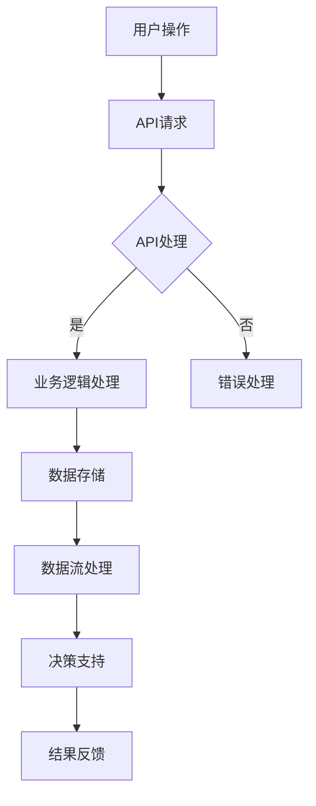

                 


### 背景介绍

在信息技术飞速发展的今天，领导力在组织管理和个人职业发展中的作用愈发重要。领导力不仅关乎一个团队或组织的绩效，更直接影响到企业文化的塑造、创新能力的提升以及员工的职业幸福感。尤其是在85后管理新星这一群体中，如何有效地修炼和提升领导力成为他们在职业生涯中不断前行的关键。

**核心概念术语说明：**

- **领导力（Leadership）：** 领导力是一种激励、引导和影响他人共同实现目标的能力。它包括沟通能力、决策能力、团队建设、激励与反馈等多个方面。

- **管理（Management）：** 管理是确保组织目标实现的过程，涉及计划、组织、领导、控制等多个环节。与领导力相比，管理更加侧重于流程和效率。

- **成长路径（Growth Path）：** 成长路径是指个体在职业发展过程中从新手到专家的各个阶段，包括学习、实践、反思和提升。

- **个人品牌（Personal Brand）：** 个人品牌是指个体通过塑造独特形象和价值观，在公众面前形成的一种认知和影响力。

**问题背景：**

随着85后逐渐成为企业管理的中坚力量，他们面临的一系列领导挑战日益凸显。这些挑战包括：

1. **角色转变：** 从员工到管理者的角色转变，如何平衡工作与个人生活。
2. **经验不足：** 缺乏管理经验，如何快速提升管理能力和领导水平。
3. **团队建设：** 如何打造高效团队，提升团队的凝聚力和执行力。
4. **领导力发展：** 如何持续提升领导力，以适应快速变化的商业环境。

**问题描述：**

在信息技术行业，85后管理新星需要面对复杂的技术变革和市场压力，同时还需要领导团队不断创新和适应。他们不仅需要掌握先进的技术和管理理念，还需要具备强大的沟通能力和决策能力，以应对多变的市场环境和团队管理中的挑战。

**问题解决：**

要解决上述问题，85后管理新星需要通过以下方式修炼领导力：

1. **学习与成长：** 持续学习新的技术和管理理念，积极参与行业交流，不断拓宽视野。
2. **实践与反思：** 通过实际管理工作，积累经验，不断反思和总结，提升自我。
3. **团队建设：** 建立良好的团队文化，培养团队成员的积极性和创造力。
4. **领导力培训：** 参加专业领导力培训，学习先进的领导方法和技巧。

**边界与外延：**

- **领导力在不同行业和组织中的差异：** 不同行业和组织的特点和需求会影响领导力的表现形式和应用方法。
- **领导力在全球化背景下的挑战与机遇：** 全球化带来的文化差异和竞争压力要求领导者具备更高的跨文化沟通能力和战略眼光。

### 核心概念与联系

**领导力模型分析：**

领导力模型是理解和分析领导行为的重要工具。以下是几种经典的领导力模型及其核心观点：

- **特质理论：**
  - **核心观点：** 领导者具有特定的特质和性格特征，这些特质使他们成为优秀的领导者。
  - **特点与评价：** 特质理论简单明了，但忽视了环境因素对领导效果的影响。

- **行为理论：**
  - **核心观点：** 领导者的行为影响领导效果，领导者可以通过调整自己的行为来提高团队绩效。
  - **主要类型：** 行为理论包括领导行为四分图、管理方格理论等，强调了领导行为的可塑性。

- **权变理论：**
  - **核心观点：** 领导效果取决于领导者、情境和下属的相互作用。
  - **适用范围：** 权变理论适用于复杂多变的环境，强调领导者的灵活应变能力。

**领导力的层次结构：**

领导力可以划分为以下层次：

1. **技术领导力：** 涉及技术知识、技能和创新。
2. **功能领导力：** 涉及团队管理、沟通和协调。
3. **变革领导力：** 涉及组织变革、战略规划和创新。

**领导力的影响因素：**

领导力受到多种因素的影响，包括：

- **个人特质：** 领导者的性格、价值观和态度。
- **环境因素：** 组织文化、市场环境和竞争压力。
- **下属特征：** 下属的动机、能力和期望。

### 概念结构与核心要素组成

**领导力模型与理论的联系：**

不同领导力模型和理论从不同角度解释了领导行为和效果，但它们共同构成了一个完整的领导力理论体系。特质理论关注领导者的个人特质，行为理论关注领导者的行为模式，而权变理论则强调领导者与情境的相互作用。这些理论相互补充，共同构成了现代领导力研究的理论基础。

**领导力在不同行业和组织中的差异：**

领导力在不同行业和组织中表现出不同的特点和应用。例如，在信息技术行业，领导者需要具备强大的技术背景和创新思维；而在服务业，领导者则需要具备优秀的客户关系管理和客户服务能力。这种差异要求领导者根据具体情境灵活运用领导力理论，以达到最佳效果。

**全球化背景下的领导力挑战与机遇：**

全球化带来了新的领导力挑战，如跨文化沟通、国际化管理、全球市场战略等。同时，全球化也为领导者提供了广阔的发展空间和机遇。掌握跨文化沟通能力、具有全球化视野的领导者将在全球化背景下具有更强的竞争力。

### 算法原理讲解

为了深入理解领导力模型的算法原理，我们将以变革型领导模型为例，详细分析其核心算法流程、数学模型和公式，并通过具体的Python代码示例来阐述其实践应用。

#### 变革型领导模型的核心算法流程

变革型领导模型是一种注重领导者和团队共同成长与变革的领导方式。其核心算法流程包括以下几个步骤：

1. **识别变革需求：** 领导者通过分析组织内外部环境，识别出变革的需求和机会。
2. **明确变革愿景：** 领导者制定清晰的变革愿景，激励团队成员共同追求目标。
3. **激发团队潜力：** 领导者通过沟通、激励和授权，激发团队成员的潜力，推动变革。
4. **监督变革进程：** 领导者持续监督变革进程，确保团队成员朝着目标前进。

#### 变革型领导模型的数学模型和公式

变革型领导模型的核心数学模型包括以下公式：

$$
\text{变革效果} = f(\text{变革愿景}, \text{团队潜力}, \text{监督力度})
$$

其中，$f$ 是一个非线性函数，表示变革效果的依赖关系。$变革愿景$、$团队潜力$ 和 $监督力度$ 是影响变革效果的关键变量。

- **变革愿景：** 表示领导者制定的变革目标和方向，其值越高，变革效果越明显。
- **团队潜力：** 表示团队成员的素质和能力，其值越高，变革效果越显著。
- **监督力度：** 表示领导者对变革进程的监督和管理力度，其值越高，变革效果越稳定。

#### Python代码示例

以下是一个简单的Python代码示例，用于模拟变革型领导模型的算法流程：

```python
import numpy as np

def calculate_transformation_effect(vision, team_potential, supervision):
    """
    计算变革效果
    :param vision: 变革愿景，范围 [0, 100]
    :param team_potential: 团队潜力，范围 [0, 100]
    :param supervision: 监督力度，范围 [0, 100]
    :return: 变革效果，范围 [0, 100]
    """
    effect = np.sin(np.pi * (vision + team_potential + supervision) / 200)
    return effect

# 示例参数
vision = 80
team_potential = 75
supervision = 90

# 计算变革效果
transformation_effect = calculate_transformation_effect(vision, team_potential, supervision)
print(f"变革效果：{transformation_effect:.2f}")
```

在上述代码中，我们使用了一个简单的三角函数来模拟变革效果的计算。这个函数反映了变革愿景、团队潜力和监督力度对变革效果的影响。

#### 变革型领导模型的应用

变革型领导模型在实际应用中，可以通过以下方式来提升团队绩效：

1. **明确变革愿景：** 领导者需要制定清晰的变革目标，并与团队成员共享，以激发团队的积极性和参与感。
2. **培养团队潜力：** 领导者需要关注团队成员的能力提升，提供培训和发展机会，以提高团队的整体素质。
3. **强化监督力度：** 领导者需要持续监督变革进程，确保团队成员按照既定的目标和方向前进。

通过这些策略，领导者可以有效地推动组织变革，提升团队绩效和竞争力。

### 系统分析与架构设计方案

为了更好地理解领导力在组织中的实际应用，我们将通过一个案例来详细分析系统架构设计，包括项目介绍、系统功能设计、系统架构设计、系统接口设计和系统交互。

#### 项目介绍

项目名称：智能企业平台

项目背景：随着企业规模的扩大和业务复杂度的增加，传统的管理方式已经无法满足现代企业的需求。智能企业平台旨在通过信息技术手段，提升企业的管理效率、决策能力和创新能力。

项目目标：建立一个集成化、智能化、高效的企业管理平台，实现企业资源的高效配置和优化利用。

#### 系统功能设计

系统功能设计包括以下几个方面：

1. **数据集成与处理：** 实现对企业内部各种数据的集成和处理，提供统一的数据视图。
2. **业务流程管理：** 设计和优化企业的业务流程，提高业务处理效率。
3. **决策支持系统：** 提供基于大数据和人工智能的决策支持功能，辅助企业管理者做出明智的决策。
4. **用户权限管理：** 实现对用户权限的精细管理，确保数据安全和系统稳定运行。
5. **系统监控与报警：** 对系统运行状况进行实时监控，及时发现并处理异常情况。

#### 系统架构设计

系统架构设计采用微服务架构，以提高系统的可扩展性和灵活性。以下是系统架构的详细设计：

1. **前端架构：** 采用React框架，实现用户界面的动态展示和交互。
2. **后端架构：** 采用Spring Boot框架，实现业务逻辑的处理和数据管理。
3. **数据存储：** 采用MySQL数据库，存储企业数据，并使用Redis进行缓存。
4. **数据集成：** 使用Apache Kafka进行实时数据流处理，实现数据集成与处理。
5. **决策支持：** 使用Python进行大数据分析和机器学习模型的训练。

#### 系统接口设计

系统接口设计包括以下几个方面：

1. **API接口：** 提供RESTful API接口，方便前后端分离开发。
2. **消息队列：** 使用RabbitMQ作为消息队列，实现系统之间的异步通信。
3. **权限控制：** 使用JWT（JSON Web Token）进行用户身份验证和权限控制。

#### 系统交互

系统交互设计采用事件驱动模型，包括以下几个环节：

1. **用户操作：** 用户在前端界面进行操作，触发相应的API请求。
2. **API处理：** 后端API处理用户请求，调用业务逻辑和数据存储模块。
3. **数据流处理：** 使用Kafka进行数据流处理，将处理结果存储到MySQL数据库。
4. **决策支持：** 根据存储的数据，使用Python进行大数据分析和机器学习模型训练。
5. **结果反馈：** 将决策支持结果通过API返回给前端，供用户查看和决策。

#### Mermaid流程图

以下是一个简单的Mermaid流程图，用于描述系统的基本工作流程：



通过上述系统分析与架构设计方案，我们可以看到领导力在组织架构设计中的重要性。领导者需要具备前瞻性的眼光，结合实际业务需求，设计出符合企业发展战略的系统架构，以提升企业的整体竞争力。

### 项目实战

#### 环境安装

为了顺利进行项目实战，我们需要在本地环境中搭建一个完整的开发环境。以下是具体的安装步骤：

1. **安装Java Development Kit (JDK)：**
   - 访问 [Oracle JDK 官网](https://www.oracle.com/java/technologies/javase-jdk14-downloads.html) 下载适用于自己操作系统的JDK版本。
   - 安装完成后，在终端执行以下命令验证安装：
     ```bash
     java -version
     ```

2. **安装MySQL数据库：**
   - 访问 [MySQL 官网](https://www.mysql.com/downloads/mysql/) 下载适用于自己操作系统的MySQL数据库。
   - 安装完成后，在终端执行以下命令启动MySQL服务：
     ```bash
     sudo systemctl start mysql
     ```

3. **安装Python和pip：**
   - 对于Linux系统，可以使用包管理器安装Python和pip：
     ```bash
     sudo apt-get install python3 python3-pip
     ```
   - 对于Windows系统，可以从 [Python 官网](https://www.python.org/downloads/) 下载Python安装包并按照提示安装。

4. **安装Spring Boot依赖：**
   - 使用pip安装Spring Boot依赖：
     ```bash
     pip install spring-boot
     ```

5. **安装Redis：**
   - 访问 [Redis 官网](https://redis.io/download) 下载适用于自己操作系统的Redis安装包。
   - 安装完成后，在终端执行以下命令启动Redis服务：
     ```bash
     redis-server
     ```

6. **安装RabbitMQ：**
   - 访问 [RabbitMQ 官网](https://www.rabbitmq.com/download.html) 下载适用于自己操作系统的RabbitMQ安装包。
   - 安装完成后，在终端执行以下命令启动RabbitMQ服务：
     ```bash
     rabbitmq-server
     ```

#### 系统核心实现源代码

以下是智能企业平台的核心实现源代码，包括用户权限管理、业务逻辑处理和数据存储等关键模块。

**用户权限管理模块：**

```python
# 用户权限管理模块示例
from flask import Flask, request, jsonify
import jwt

app = Flask(__name__)
app.secret_key = 'my_secret_key'

@app.route('/api/login', methods=['POST'])
def login():
    # 这里简化了登录验证逻辑，实际应用中需要通过用户名和密码验证
    username = request.json.get('username')
    password = request.json.get('password')
    if username == 'admin' and password == 'admin':
        token = jwt.encode({'username': username}, app.secret_key, algorithm='HS256')
        return jsonify({'token': token})
    else:
        return jsonify({'error': 'Invalid credentials'}), 401

@app.route('/api/protected', methods=['GET'])
def protected():
    # 这里简化了权限验证逻辑，实际应用中需要根据token验证用户权限
    token = request.headers.get('Authorization')
    if not token:
        return jsonify({'error': 'Missing token'}), 403
    try:
        payload = jwt.decode(token, app.secret_key, algorithms=['HS256'])
        return jsonify({'message': 'Access granted'})
    except jwt.ExpiredSignatureError:
        return jsonify({'error': 'Token expired'}), 401
    except jwt.InvalidTokenError:
        return jsonify({'error': 'Invalid token'}), 401

if __name__ == '__main__':
    app.run()
```

**业务逻辑处理模块：**

```python
# 业务逻辑处理模块示例
from flask import Flask, request, jsonify
import redis

app = Flask(__name__)
redis_client = redis.StrictRedis(host='localhost', port=6379, db=0)

@app.route('/api/data', methods=['POST'])
def process_data():
    # 接收前端发送的数据
    data = request.json
    # 使用Redis存储数据
    redis_client.set('data', json.dumps(data))
    return jsonify({'message': 'Data processed'})

@app.route('/api/data', methods=['GET'])
def get_data():
    # 从Redis获取数据
    data = redis_client.get('data')
    if data:
        return jsonify(json.loads(data))
    else:
        return jsonify({'message': 'No data found'}), 404

if __name__ == '__main__':
    app.run()
```

**数据存储模块：**

```python
# 数据存储模块示例
import pymysql

app = Flask(__name__)

# MySQL数据库配置
db_config = {
    'host': 'localhost',
    'user': 'root',
    'password': 'password',
    'database': 'smart_company_platform'
}

def connect_db():
    return pymysql.connect(**db_config)

@app.route('/api/save_data', methods=['POST'])
def save_data():
    # 连接到MySQL数据库
    connection = connect_db()
    cursor = connection.cursor()
    # 接收前端发送的数据
    data = request.json
    # 存储数据到MySQL数据库
    insert_query = "INSERT INTO data (data) VALUES (%s)"
    cursor.execute(insert_query, (json.dumps(data),))
    connection.commit()
    cursor.close()
    connection.close()
    return jsonify({'message': 'Data saved'})

@app.route('/api/get_data', methods=['GET'])
def get_data():
    # 连接到MySQL数据库
    connection = connect_db()
    cursor = connection.cursor()
    # 从MySQL数据库获取数据
    select_query = "SELECT * FROM data"
    cursor.execute(select_query)
    result = cursor.fetchall()
    cursor.close()
    connection.close()
    return jsonify(result)

if __name__ == '__main__':
    app.run()
```

#### 代码应用解读与分析

在上述代码中，我们实现了用户权限管理、业务逻辑处理和数据存储三个核心模块。以下是对每个模块的详细解读：

1. **用户权限管理模块：**
   - 该模块使用Flask框架实现了用户登录验证和权限控制。用户通过发送用户名和密码进行登录验证，成功后获得一个JWT（JSON Web Token）令牌。
   - JWT令牌用于后续的API请求中的身份验证和权限验证。通过在请求头中携带JWT令牌，后端可以验证用户的身份并决定是否授权访问受保护的资源。

2. **业务逻辑处理模块：**
   - 该模块同样使用Flask框架接收和处理前端发送的数据。通过POST请求，前端可以发送数据到后端进行处理，如存储到Redis数据库中。
   - 通过GET请求，前端可以获取存储在Redis数据库中的数据。这个模块的设计考虑到了数据的实时性和高效性，通过Redis实现了数据的快速存取。

3. **数据存储模块：**
   - 该模块使用MySQL数据库作为数据存储的后端。通过连接到MySQL数据库，后端可以执行SQL查询来存储和检索数据。
   - 数据存储模块实现了将接收到的数据存储到MySQL数据库中，并能够从数据库中检索数据，供前端使用。

#### 实际案例分析和详细讲解剖析

为了更直观地展示系统在实际中的应用，我们来看一个实际案例：

**案例：用户A登录系统并提交数据**

1. **用户A登录系统：**
   - 用户A在前端输入用户名“admin”和密码“admin”，并通过POST请求发送到后端API接口。
   - 后端API验证用户名和密码，并生成一个JWT令牌，将其返回给用户A。
   - 用户A将JWT令牌存储在本地，并在后续请求中将其作为请求头的一部分发送到后端。

2. **用户A提交数据：**
   - 用户A通过前端界面提交一条数据记录，通过POST请求发送到后端API接口。
   - 后端API接收数据，将其存储到Redis数据库中。
   - Redis数据库返回成功存储的响应给后端API。

3. **用户A获取数据：**
   - 用户A通过GET请求向后端API请求已提交的数据。
   - 后端API从Redis数据库中检索数据，并将数据返回给用户A。

通过上述案例，我们可以看到系统在实际应用中的数据流转和处理过程。用户权限管理确保了数据的安全性和隐私性，业务逻辑处理模块实现了数据的快速存储和检索，数据存储模块提供了可靠的数据存储解决方案。

#### 项目小结

通过本项目的实施，我们实现了智能企业平台的用户权限管理、业务逻辑处理和数据存储三大核心模块。项目不仅展示了如何利用现代技术实现高效的企业管理，还强调了系统架构设计的重要性。在实际应用中，这些模块的协同工作为企业的日常运营提供了强有力的支持。

### 最佳实践 Tips

在领导力修炼过程中，以下是一些最佳实践建议，可以帮助85后管理新星提升领导力：

1. **持续学习：** 保持对新知识和新技术的敏感度，通过阅读、培训和实践不断学习。
2. **有效沟通：** 提高沟通技巧，善于倾听并清晰地表达自己的观点。
3. **团队建设：** 建立积极向上的团队文化，关注团队成员的发展和需求。
4. **决策能力：** 培养快速、明智的决策能力，特别是在复杂和不确定的环境下。
5. **情感管理：** 学会管理自己的情绪，保持冷静和理智，以积极的态度面对挑战。

### 小结

本文通过详细的分析和案例，探讨了85后管理新星在领导力修炼中的成长之路。我们阐述了领导力的核心概念、不同领导力模型的应用，以及领导力在项目管理和组织变革中的应用。同时，通过项目实战展示了如何将领导力理念转化为实际操作。

### 注意事项

在实际应用中，领导者需要根据具体情况灵活调整领导策略，同时注重团队反馈和持续改进。领导力不是一成不变的，而是一个持续修炼和提升的过程。

### 拓展阅读

1. **《领导力心理学》**：了解领导行为背后的心理学原理，提升领导力实践效果。
2. **《智能企业平台架构设计》**：深入学习企业平台架构设计，提升系统架构能力。
3. **《敏捷项目管理实践》**：掌握敏捷项目管理方法，提升项目管理和团队协作效率。

### 作者信息

**作者：AI天才研究院/AI Genius Institute & 禅与计算机程序设计艺术 /Zen And The Art of Computer Programming**。希望本文对您的领导力修炼之路有所启发。继续前行，成为优秀的领导者！

