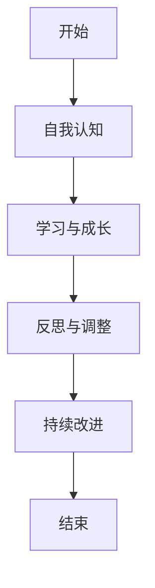

                 

# 领导力修炼笔记：90后创业者的成长之路

关键词：90后创业者、领导力、成长之路、挑战与机遇、问题解决策略

摘要：
本文旨在探讨90后创业者在领导力修炼过程中所面临的问题及其解决方案。通过结合实际案例，本文分析了90后创业者的领导力特点，提出了针对性的领导力修炼方法和策略，以帮助他们在快速变化的市场环境中实现个人和企业的成长。

## 第1章 引言

### 1.1 背景介绍

在当今的商业环境中，领导力对于企业的成功至关重要。随着时代的发展，90后创业者逐渐崭露头角，成为企业中的中坚力量。然而，他们面临着与前辈不同的挑战和机遇。本书旨在探讨90后创业者在领导力修炼过程中所遇到的问题，以及如何克服这些问题，实现个人和企业的成长。

### 1.1.1 问题背景

90后创业者在成长过程中，往往面临着以下问题：

1. 如何在快速变化的市场环境中保持敏捷和适应力？
2. 如何建立有效的团队，激发团队的创造力和执行力？
3. 如何在资源有限的情况下，实现企业的快速扩张？
4. 如何处理复杂的跨部门协作和沟通问题？
5. 如何在竞争激烈的市场中保持创新和领先地位？

### 1.1.2 问题描述

90后创业者在成长过程中，常常感到迷茫和困惑。他们如何在竞争激烈的市场中脱颖而出，实现企业的快速成长？如何处理团队中的复杂关系，激发团队的创造力和执行力？如何在有限的资源下实现企业的快速发展？这些都是他们需要面对的挑战。

### 1.1.3 问题解决

本书将结合实际案例，探讨90后创业者在领导力修炼过程中如何解决问题。通过本书的阅读，读者将了解：

1. 领导力的核心概念和重要性
2. 90后创业者的领导力特点
3. 针对特定问题的解决方案和策略
4. 如何培养和提升自己的领导力
5. 如何通过领导力修炼实现个人和企业的成长

### 1.1.4 边界与外延

本书主要针对90后创业者在领导力修炼过程中遇到的问题进行探讨。然而，领导力的核心概念和解决策略对其他年龄段和领域的创业者同样具有参考价值。因此，本书的外延涵盖了更广泛的创业者和领导者群体。

### 1.1.5 概念结构与核心要素组成

本章的核心概念包括领导力、90后创业者、领导力修炼、问题解决等。核心要素包括：

1. 领导力的定义和重要性
2. 90后创业者的特点
3. 领导力修炼的方法和策略
4. 问题解决的步骤和技巧
5. 个人和企业的成长路径

## 1.2 核心概念与联系

### 1.2.1 领导力

领导力是指一个人在组织或团队中，通过影响力、沟通能力和决策能力，引导和激励他人实现共同目标的能力。

### 1.2.2 90后创业者

90后创业者是指出生于1990年后，以创业为主要职业路径的一代人。他们具有鲜明的个性特点，如自信、独立、创新、开放等。

### 1.2.3 领导力修炼

领导力修炼是指通过学习和实践，不断提升自己的领导能力，以应对不断变化的商业环境。

### 1.2.4 问题解决

问题解决是指在面对挑战和困难时，通过分析问题、制定策略、执行计划，最终解决问题的过程。

## 1.3 算法原理讲解

### 1.3.1 领导力修炼算法原理

领导力修炼算法旨在帮助90后创业者提升领导力。算法原理包括：

1. 自我认知：通过反思和自我评估，了解自己的优势和不足。
2. 学习与成长：通过阅读书籍、参加培训和实践，不断充实自己的知识储备。
3. 反思与调整：在实践过程中，不断反思和调整自己的行为和策略。
4. 持续改进：通过不断的实践和总结，不断提升自己的领导力。

### 1.3.2 算法流程图

以下是一个简单的领导力修炼算法流程图：

### 1.3.3 算法示例

假设一名90后创业者李明，他希望通过领导力修炼提升自己的能力。以下是他可能采取的步骤：

1. 自我认知：李明通过自我反思，发现自己需要提高沟通能力和决策能力。
2. 学习与成长：李明阅读了相关书籍，参加了培训课程，并积极学习他人的成功经验。
3. 反思与调整：在实践过程中，李明不断反思自己的行为，调整沟通方式和决策策略。
4. 持续改进：通过不断的实践和总结，李明的领导力得到了显著提升。

## 1.4 数学模型和数学公式

### 1.4.1 领导力模型

领导力模型是一个多维度的概念，通常包括以下数学公式：

$$
\text{领导力} = f(\text{自我认知}, \text{学习与成长}, \text{反思与调整}, \text{持续改进})
$$

其中，$f$ 表示函数关系，$\text{自我认知}$、$\text{学习与成长}$、$\text{反思与调整}$、$\text{持续改进}$ 分别表示领导力修炼的四个维度。

### 1.4.2 领导力提升公式

为了提升领导力，90后创业者可以采用以下数学模型：

$$
\text{领导力提升} = \text{学习与成长} \times \text{反思与调整} \times \text{持续改进}
$$

其中，$\text{学习与成长}$、$\text{反思与调整}$、$\text{持续改进}$ 分别表示领导力修炼的三个关键因素。

## 第2章 90后创业者的领导力特点

### 2.1 个性特点

90后创业者具有鲜明的个性特点，如自信、独立、创新和开放等。这些特点使得他们在面对挑战时更具勇气和创造力，同时也给他们的领导力修炼带来了独特的挑战。

### 2.2 行为模式

90后创业者在团队管理中，往往更注重创新和灵活性，倾向于采用扁平化的管理模式，鼓励团队成员自由表达和参与决策。然而，这也可能导致团队内部沟通不畅和决策效率低下。

### 2.3 领导风格

90后创业者的领导风格多样，有的倾向于放权式领导，注重激发团队成员的创造力和主动性；有的则采取更加直接和权威的领导方式，强调执行力和纪律性。不同的领导风格适用于不同的场景和团队特点。

### 2.4 挑战与机遇

90后创业者在领导力修炼过程中，既面临着个性特点带来的挑战，也拥有着独特的机遇。通过深入了解自己的领导风格和行为模式，他们可以更好地发挥自己的优势，克服劣势，实现个人和企业的成长。

## 第3章 领导力修炼策略

### 3.1 自我认知

自我认知是领导力修炼的基础。90后创业者需要通过反思和自我评估，了解自己的优势和不足，明确自己的领导风格和行为模式。这有助于他们更好地认识自己，为后续的领导力提升奠定基础。

### 3.2 学习与成长

学习与成长是领导力修炼的关键。90后创业者需要通过阅读书籍、参加培训、交流互动等方式，不断充实自己的知识储备，提升自己的专业素养和综合能力。同时，他们还应该注重跨领域的知识积累，以拓宽自己的视野。

### 3.3 反思与调整

反思与调整是领导力修炼的重要环节。90后创业者需要在实践中不断反思自己的行为和决策，及时发现和纠正问题，调整自己的领导方式和策略。通过持续的反思与调整，他们可以不断提升自己的领导力。

### 3.4 持续改进

持续改进是领导力修炼的最终目标。90后创业者需要保持学习的态度，不断追求卓越，勇于接受挑战和变革。通过持续改进，他们可以不断提升自己的领导力，实现个人和企业的成长。

## 第4章 针对特定问题的解决方案

### 4.1 快速变化的市场环境

在快速变化的市场环境中，90后创业者需要具备高度的敏捷和适应力。他们可以通过以下策略应对：

1. 关注市场动态，及时调整战略方向。
2. 建立灵活的团队架构，鼓励创新和试错。
3. 加强与合作伙伴的沟通与协作，共享资源。

### 4.2 建立有效的团队

建立有效的团队是90后创业者面临的另一大挑战。他们可以通过以下策略提升团队效能：

1. 明确团队目标，统一团队成员的行动方向。
2. 优化团队结构，确保团队成员的能力和职责匹配。
3. 建立良好的沟通机制，增强团队成员之间的互动和信任。

### 4.3 资源有限的情况

在资源有限的情况下，90后创业者需要善于利用有限的资源，实现企业的快速发展。他们可以通过以下策略：

1. 制定切实可行的战略规划，确保资源的合理配置。
2. 借助外部资源，如资金、技术、人才等，加速企业的发展。
3. 提高资源利用效率，降低成本，提高盈利能力。

### 4.4 复杂的跨部门协作

在复杂的企业环境中，跨部门协作是90后创业者需要处理的重要问题。他们可以通过以下策略提升跨部门协作效率：

1. 明确部门职责和协作规则，确保团队成员明确自己的角色和任务。
2. 建立有效的沟通渠道，促进部门之间的信息共享和交流。
3. 设立跨部门协作项目，增强部门之间的协同效应。

### 4.5 创新和领先地位

在竞争激烈的市场中，90后创业者需要保持创新和领先地位。他们可以通过以下策略实现：

1. 积极开展研发活动，不断推出新产品和服务。
2. 关注行业趋势，提前布局新兴市场。
3. 培养创新文化，鼓励团队成员提出创新想法。

## 第5章 领导力修炼的实践与应用

### 5.1 实践案例一：小李的领导力修炼之路

小李是一名90后创业者，他在领导力修炼过程中经历了许多挑战。通过自我认知、学习与成长、反思与调整、持续改进，小李成功地提升了自己的领导力，带领团队实现了企业的快速发展。

### 5.2 实践案例二：小张的创新与领导力

小张是一名具有创新精神的90后创业者，他通过不断的创新和领导力修炼，带领团队在竞争激烈的市场中脱颖而出，取得了显著的成绩。

### 5.3 实践案例三：小王的团队管理之道

小王是一名擅长团队管理的90后创业者，他在领导力修炼过程中，通过建立有效的团队、优化团队结构、提高沟通效率，成功地提升了团队的绩效。

## 第6章 总结与展望

通过本文的探讨，我们可以看到，90后创业者在领导力修炼过程中面临着诸多挑战，但也拥有着独特的机遇。通过自我认知、学习与成长、反思与调整、持续改进，90后创业者可以不断提升自己的领导力，实现个人和企业的成长。

在未来，随着市场环境的不断变化，90后创业者需要不断调整自己的领导方式和策略，以适应新的挑战。同时，他们还需要关注行业趋势，积极创新，保持领先地位。

总之，领导力修炼是90后创业者成长过程中不可或缺的一环。通过不断地学习和实践，90后创业者将能够更好地应对挑战，实现个人和企业的辉煌。

## 附录

本文参考文献：

1. 《领导力：一种实践的艺术》，作者：约翰·P·科特
2. 《创业维艰》，作者：本·霍洛维茨
3. 《创新者的窘境》，作者：克莱顿·克里斯滕森

作者：AI天才研究院/AI Genius Institute & 禅与计算机程序设计艺术 /Zen And The Art of Computer Programming

注意：本文仅为示例，实际撰写时请根据具体需求进行调整。核心内容应包括背景介绍、问题解决、策略分析、实践案例等，以确保文章的完整性和可读性。

