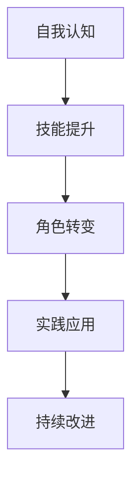
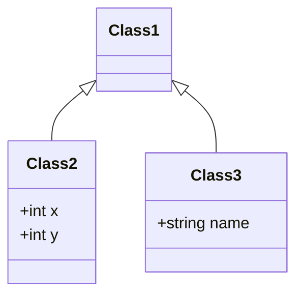
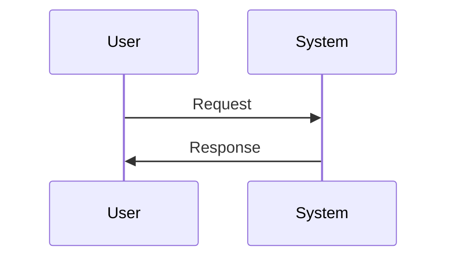

                 

### 《领导力修炼：从小工到专家的蜕变之路》

> **关键词**：领导力、修炼、成长、专家、小工

> **摘要**：本文将从领导力的基本概念、核心概念与联系、理论讲解、实践应用、项目实战以及最佳实践与总结六个方面，深入探讨从小工到专家的蜕变之路，为IT从业者提供实用的领导力修炼指南。

#### 第一部分：领导力的基础

**1.1 问题背景与问题描述**

在快速发展的IT行业中，技术人员的成长路径通常从初级工程师（小工）逐步晋升为高级工程师、架构师甚至CTO。然而，在这个过程中，许多人发现单纯的技能提升并不能完全满足职业发展的需求。领导力，作为一项关键能力，逐渐成为IT从业者成长的瓶颈。

**1.2 领导力的定义与作用**

领导力是指引导和激励他人达成目标的能力。在IT行业中，领导力不仅体现在对技术的精通上，更体现在对团队、项目、乃至公司的管理上。有效的领导力可以帮助IT从业者更好地协调资源、解决问题、推动创新，从而实现个人和团队的共同成长。

**1.3 领导力的边界与外延**

领导力不仅限于高层管理者，任何级别、任何岗位的IT从业者都需要具备一定的领导力。从基层的代码审查、团队协作，到中层的项目管理、资源调配，再到高层的战略规划、企业文化建设，领导力贯穿于整个职业生涯。

**1.4 概念结构与核心要素组成**

领导力的核心要素包括：影响力、决策能力、团队协作、沟通能力、领导风格等。这些要素相互联系，共同构成了领导力的结构。

#### 第二部分：领导力的核心概念与联系

**2.1 影响力**

影响力是领导力的基础，它决定了领导者能否有效引导和影响他人。影响力可以通过专业知识、人格魅力、道德权威等多方面体现。

**2.2 决策能力**

决策能力是领导者面对复杂问题时，能够快速做出正确决策的能力。良好的决策能力可以提升团队的执行力和应对市场变化的能力。

**2.3 团队协作**

团队协作能力是领导者组织团队、协调资源、激发团队潜力的重要能力。一个高效的团队需要领导者的正确引导和激励。

**2.4 沟通能力**

沟通能力是领导者传达思想、解决问题、建立信任的重要能力。良好的沟通能力可以减少误解、提升团队凝聚力。

**2.5 领导风格**

领导风格是领导者处理团队关系、管理方式的一种体现。常见的领导风格有权威型、民主型、参与型等。

**2.6 领导力模型**

领导力模型是描述领导力结构和运作方式的理论框架。常见的领导力模型包括情境领导模型、路径-目标理论等。

**2.7 领导力发展路径**

领导力发展路径是指IT从业者从初级到高级领导者的成长过程。这个过程包括自我认知、技能提升、角色转变等阶段。

#### 第三部分：领导力理论讲解

**3.1 领导风格理论**

领导风格理论描述了领导者处理团队关系、管理方式的一种理论框架。不同的领导风格适用于不同的环境和团队。

**3.2 领导力模型介绍**

领导力模型是对领导力结构和运作方式的理论描述。通过理解不同的领导力模型，可以更好地指导实际工作。

**3.3 领导力发展的阶段**

领导力发展是一个长期的过程，包括自我认知、技能提升、角色转变等阶段。每个阶段都有其特定的挑战和机遇。

#### 第四部分：领导力实践应用

**4.1 项目管理中的领导力**

在项目管理中，领导力体现在项目规划、团队协作、风险管理等方面。有效的领导力可以提升项目的成功率和团队的工作效率。

**4.2 团队管理中的领导力**

团队管理是领导者的重要职责。通过有效的领导力，可以激发团队的潜力，提高团队的绩效。

**4.3 危机管理中的领导力**

在危机管理中，领导力体现在快速应对、有效沟通、稳定团队等方面。良好的领导力可以帮助团队渡过难关。

#### 第五部分：项目实战

**5.1 案例一：提升领导力的成功故事**

通过具体案例，展示如何在实际工作中应用领导力理论，实现个人的领导力提升。

**5.2 案例二：领导力在团队建设中的应用**

通过具体案例，展示领导力在团队建设中的作用，以及如何通过领导力提升团队绩效。

**5.3 案例三：领导力在危机管理中的重要作用**

通过具体案例，展示领导力在危机管理中的重要作用，以及如何通过领导力应对危机。

#### 第六部分：最佳实践与总结

**6.1 领导力修炼的最佳实践**

总结领导力修炼的最佳实践，提供一些实用的建议和技巧。

**6.2 小结与拓展阅读**

对文章进行总结，并提供一些拓展阅读建议，帮助读者进一步深入理解领导力。

### 作者信息

**作者：** AI天才研究院/AI Genius Institute & 禅与计算机程序设计艺术 /Zen And The Art of Computer Programming

---

通过以上六个部分的深入探讨，本文旨在为IT从业者提供一套完整的领导力修炼指南，帮助读者从小工到专家的蜕变之路。希望本文能对您的职业发展有所帮助。让我们共同修炼领导力，迎接更加辉煌的未来！## 第一部分：领导力的基础

### 1.1 问题背景与问题描述

在当今快速发展的信息技术行业中，技术人员的职业成长路径通常包括从初级工程师（小工）逐步晋升为高级工程师、架构师，甚至技术总监（CTO）。然而，随着职位的提升，仅仅掌握扎实的技术技能已经不再足以应对新的挑战。领导力，作为一项关键能力，逐渐成为阻碍技术人员职业发展的瓶颈。

首先，从初级工程师的角色来看，他们的主要职责是编写代码、解决问题和参与项目开发。在这一阶段，技术能力是他们成功的关键因素。但是，随着职位的提升，工程师需要开始承担更多的责任，如团队管理、项目规划和资源协调等。这时候，领导力的重要性就凸显出来了。

其次，在高级工程师和架构师的职位上，技术人员需要更多地与团队合作，推动项目的顺利进行。他们不仅要解决技术问题，还要协调团队成员之间的工作，确保项目目标的实现。这就需要他们具备出色的领导能力，包括团队沟通、问题解决和决策制定等。

最后，在成为技术总监或CTO之后，领导者需要具备更高的战略思维和决策能力，能够从公司整体层面进行资源调配和业务规划。这时候，领导力已经成为他们成功的关键因素。

### 1.2 领导力的定义与作用

领导力是指通过激励、指导和影响他人，以实现共同目标的能力。在信息技术行业中，领导力不仅体现在对技术的精通上，更体现在对团队、项目、乃至公司的管理上。有效的领导力可以帮助技术人员更好地协调资源、解决问题、推动创新，从而实现个人和团队的共同成长。

首先，领导力能够帮助技术人员提升团队协作效率。通过有效的沟通和激励，领导者可以确保团队成员理解项目目标，明确各自的职责，从而提高团队的执行力和工作效率。

其次，领导力能够帮助技术人员更好地应对挑战。在项目开发过程中，难免会遇到各种问题和困难。有效的领导者能够及时发现问题，制定合理的解决方案，并指导团队成员共同克服困难。

最后，领导力能够帮助技术人员实现职业生涯的跨越式发展。通过在团队中展示出色的领导能力，技术人员可以获得更多的机会，晋升到更高的职位，实现个人价值的提升。

### 1.3 领导力的边界与外延

领导力不仅限于高层管理者，任何级别、任何岗位的IT从业者都需要具备一定的领导力。从基层的代码审查、团队协作，到中层的项目管理、资源调配，再到高层的战略规划、企业文化建设，领导力贯穿于整个职业生涯。

首先，在基层岗位，IT从业者需要具备基本的领导能力，如团队沟通、问题解决和决策制定等。这些能力有助于他们更好地完成工作任务，提升团队效率。

其次，在中层岗位，IT从业者需要承担更多的责任，如项目规划、团队管理和资源协调等。这时候，他们需要具备更高的领导力，能够协调不同部门之间的工作，确保项目目标的实现。

最后，在高层岗位，IT从业者需要具备战略思维和决策能力，能够从公司整体层面进行资源调配和业务规划。这时候，领导力已经成为他们成功的关键因素。

### 1.4 概念结构与核心要素组成

领导力的核心要素包括：影响力、决策能力、团队协作、沟通能力和领导风格等。这些要素相互联系，共同构成了领导力的结构。

- **影响力**：影响力是领导力的基础，它决定了领导者能否有效引导和影响他人。影响力可以通过专业知识、人格魅力、道德权威等多方面体现。

- **决策能力**：决策能力是领导者面对复杂问题时，能够快速做出正确决策的能力。良好的决策能力可以提升团队的执行力和应对市场变化的能力。

- **团队协作**：团队协作能力是领导者组织团队、协调资源、激发团队潜力的重要能力。一个高效的团队需要领导者的正确引导和激励。

- **沟通能力**：沟通能力是领导者传达思想、解决问题、建立信任的重要能力。良好的沟通能力可以减少误解、提升团队凝聚力。

- **领导风格**：领导风格是领导者处理团队关系、管理方式的一种体现。常见的领导风格有权威型、民主型、参与型等。

通过了解领导力的核心要素和结构，IT从业者可以更好地理解领导力的重要性，从而在职业生涯中不断提升自己的领导能力。

---

领导力是IT从业者在职业发展中不可或缺的能力。从初级工程师到高级工程师，再到技术总监或CTO，领导力贯穿于整个职业生涯。通过修炼领导力，IT从业者可以更好地协调资源、解决问题、推动创新，从而实现个人和团队的共同成长。在接下来的部分，我们将深入探讨领导力的核心概念与联系，帮助读者进一步理解领导力的本质。让我们继续前行，探索领导力的奥秘！## 第二部分：领导力的核心概念与联系

### 2.1 影响力

影响力是领导力的核心要素之一，它决定了领导者能否有效引导和影响他人。在IT行业中，影响力不仅体现在技术能力上，还体现在个人魅力、道德权威和人际关系等方面。

首先，技术能力是影响力的重要来源。一个技术过硬的领导者能够通过专业知识解决问题，赢得团队成员的尊重和信任。此外，技术能力还可以帮助领导者更好地理解团队的工作需求，提出合理的改进方案，提升团队的工作效率。

其次，个人魅力也是影响力的关键因素。一个具有人格魅力的领导者能够激发团队成员的积极性和创造力，使团队氛围更加和谐。这种魅力可以通过领导者的言行举止、领导风格和人际交往等方面体现。

最后，道德权威也是影响力的基础。一个具有道德权威的领导者能够树立正确的价值观，引导团队成员遵守职业道德和行为规范，提升团队的整体素质。

### 2.2 决策能力

决策能力是领导者面对复杂问题时，能够快速做出正确决策的能力。在IT行业中，决策能力对于项目的成功至关重要。一个优秀的领导者需要具备以下几方面的决策能力：

1. **分析能力**：领导者需要能够准确分析问题，了解问题的本质和影响。这包括对技术问题、市场变化和团队动态的深入理解。

2. **判断力**：在分析问题的过程中，领导者需要具备良好的判断力，能够从多个选项中选择最优的解决方案。这需要领导者具备丰富的经验和敏锐的洞察力。

3. **决断力**：在做出决策后，领导者需要具备果断的决断力，及时采取行动，确保决策的有效实施。这要求领导者具备快速反应和执行力。

4. **风险意识**：在决策过程中，领导者需要具备较强的风险意识，能够预见潜在的风险和挑战，并采取相应的预防措施。

### 2.3 团队协作

团队协作能力是领导者组织团队、协调资源、激发团队潜力的重要能力。一个高效的团队需要领导者的正确引导和激励。以下是一些提升团队协作能力的策略：

1. **明确目标**：领导者需要确保团队成员明确团队的目标和愿景，使团队成员朝着共同的方向努力。

2. **合理分工**：根据团队成员的特长和技能，进行合理的分工，使每个人都能发挥自己的优势，提高团队的整体效率。

3. **有效沟通**：领导者需要建立有效的沟通机制，确保团队成员之间能够顺畅地交流信息、分享知识和经验。

4. **激励与反馈**：领导者需要通过激励和反馈机制，激发团队成员的积极性和创造力，使团队保持良好的工作状态。

5. **冲突管理**：在团队协作过程中，难免会出现冲突。领导者需要具备良好的冲突管理能力，能够及时解决冲突，维护团队的和谐氛围。

### 2.4 沟通能力

沟通能力是领导者传达思想、解决问题、建立信任的重要能力。良好的沟通能力可以帮助领导者更好地理解团队成员的需求和期望，减少误解和冲突。以下是一些提升沟通能力的策略：

1. **倾听**：领导者需要学会倾听，尊重团队成员的意见和建议。倾听不仅可以增强与团队成员的互动，还可以帮助领导者更好地了解团队的情况。

2. **表达**：领导者需要具备清晰、准确的表达能力，能够有效地传达自己的想法和意图。表达不仅包括语言，还包括肢体语言、面部表情等。

3. **反馈**：领导者需要及时给予团队成员反馈，包括对工作的认可和指导。反馈可以帮助团队成员了解自己的表现，提升工作质量。

4. **适应**：领导者需要具备适应不同沟通对象和场景的能力，能够根据具体情况调整沟通策略。

5. **冲突解决**：在沟通过程中，难免会出现误解和冲突。领导者需要具备良好的冲突解决能力，能够及时解决沟通中的问题。

### 2.5 领导风格

领导风格是领导者处理团队关系、管理方式的一种体现。不同的领导风格适用于不同的环境和团队。以下是一些常见的领导风格：

1. **权威型领导风格**：权威型领导者具有强烈的控制欲望，注重决策的效率和执行力。这种领导风格适用于紧急情况和需要快速决策的团队。

2. **民主型领导风格**：民主型领导者重视团队成员的意见和建议，鼓励团队成员参与决策。这种领导风格适用于需要团队协作和创新的项目。

3. **参与型领导风格**：参与型领导者注重与团队成员的互动和沟通，鼓励团队成员参与管理和决策。这种领导风格适用于需要团队凝聚力和协作的团队。

4. **变革型领导风格**：变革型领导者具有强烈的变革意愿，能够激发团队成员的积极性和创造力。这种领导风格适用于需要创新和突破的团队。

### 2.6 领导力模型

领导力模型是对领导力结构和运作方式的理论描述。通过理解不同的领导力模型，可以更好地指导实际工作。以下是一些常见的领导力模型：

1. **情境领导模型**：情境领导模型认为，领导风格应根据团队和环境的变化而调整。该模型分为四种领导风格：指导型、支持型、参与型和授权型。

2. **路径-目标理论**：路径-目标理论认为，领导者的作用是帮助团队成员明确目标，并提供实现目标的路径。该理论分为四种领导行为：指导行为、支持行为、参与行为和成就行为。

3. **领导替代理论**：领导替代理论认为，领导力可以通过其他因素替代，如组织结构、激励机制等。该理论认为，领导者的作用是营造一个支持团队发展的环境。

### 2.7 领导力发展路径

领导力发展是一个长期的过程，包括自我认知、技能提升、角色转变等阶段。每个阶段都有其特定的挑战和机遇。

1. **自我认知**：自我认知是领导力发展的第一步。领导者需要了解自己的优势和劣势，明确自己的价值观和目标。

2. **技能提升**：在自我认知的基础上，领导者需要不断学习和提升自己的技能，包括技术能力、沟通能力和决策能力等。

3. **角色转变**：随着职业生涯的发展，领导者需要从执行者转变为管理者，再到领导者。每个角色都有其特定的职责和挑战。

通过了解领导力的核心概念和联系，IT从业者可以更好地理解领导力的本质，从而在职业生涯中不断提升自己的领导能力。在下一部分，我们将深入探讨领导力的理论讲解，帮助读者进一步掌握领导力的原理和应用。让我们继续前行，探索领导力的奥秘！## 第三部分：领导力理论讲解

### 3.1 领导风格理论

领导风格理论是描述领导者如何处理团队关系、管理方式的一种理论框架。不同的领导风格适用于不同的环境和团队。以下是几种常见的领导风格：

#### 1. 权威型领导风格

权威型领导风格是指领导者对团队成员拥有绝对的权力和控制。这种领导风格强调决策的效率和执行力。权威型领导者通常会详细规定团队成员的工作内容和流程，确保项目按计划进行。

优点：
- 决策迅速
- 执行力强
- 能够确保项目目标的实现

缺点：
- 可能压制团队成员的创造力和积极性
- 缺乏灵活性和适应性

#### 2. 民主型领导风格

民主型领导风格是指领导者重视团队成员的意见和建议，鼓励团队成员参与决策。这种领导风格强调团队合作和集体智慧。

优点：
- 激发团队成员的积极性和创造力
- 提高团队凝聚力和士气
- 有利于形成多元化的解决方案

缺点：
- 决策过程可能较为缓慢
- 需要领导者具备较强的协调和沟通能力

#### 3. 参与型领导风格

参与型领导风格是指领导者注重与团队成员的互动和沟通，鼓励团队成员参与管理和决策。这种领导风格强调平等和尊重。

优点：
- 提高团队成员的参与度和责任感
- 增强团队凝聚力和归属感
- 有利于形成创新性的解决方案

缺点：
- 需要领导者具备较高的沟通和协调能力
- 决策过程可能较为复杂

#### 4. 变革型领导风格

变革型领导风格是指领导者具有强烈的变革意愿，能够激发团队成员的积极性和创造力。这种领导风格强调创新和突破。

优点：
- 激发团队成员的积极性和创新意识
- 推动团队的持续改进和发展
- 有助于实现组织的战略目标

缺点：
- 对领导者的个人魅力和领导能力有较高要求
- 可能面临变革过程中的阻力

### 3.2 领导力模型介绍

领导力模型是对领导力结构和运作方式的理论描述。通过理解不同的领导力模型，可以更好地指导实际工作。以下是几种常见的领导力模型：

#### 1. 情境领导模型

情境领导模型认为，领导风格应根据团队和环境的变化而调整。该模型分为四种领导风格：指导型、支持型、参与型和授权型。

**指导型领导风格**：领导者为团队成员提供具体的指导和支持，以确保任务顺利完成。

**支持型领导风格**：领导者关心团队成员的需求和感受，提供支持和鼓励，以激发团队成员的积极性。

**参与型领导风格**：领导者鼓励团队成员参与决策和项目管理，以提高团队的凝聚力和创造力。

**授权型领导风格**：领导者赋予团队成员更多的自主权和责任，鼓励团队成员自主决策和解决问题。

#### 2. 路径-目标理论

路径-目标理论认为，领导者的作用是帮助团队成员明确目标，并提供实现目标的路径。该理论分为四种领导行为：指导行为、支持行为、参与行为和成就行为。

**指导行为**：领导者为团队成员提供具体的任务指导和期望。

**支持行为**：领导者关心团队成员的需求和感受，提供支持和帮助。

**参与行为**：领导者鼓励团队成员参与决策和项目管理。

**成就行为**：领导者鼓励团队成员追求卓越，设定挑战性的目标。

#### 3. 领导替代理论

领导替代理论认为，领导力可以通过其他因素替代，如组织结构、激励机制等。该理论认为，领导者的作用是营造一个支持团队发展的环境。

**组织结构**：通过合理的组织结构，明确团队成员的职责和权限，提高团队协作效率。

**激励机制**：通过激励机制，如薪酬、晋升、荣誉等，激发团队成员的积极性和创造力。

### 3.3 领导力发展的阶段

领导力发展是一个长期的过程，包括自我认知、技能提升、角色转变等阶段。每个阶段都有其特定的挑战和机遇。

#### 1. 自我认知

自我认知是领导力发展的第一步。领导者需要了解自己的优势和劣势，明确自己的价值观和目标。这可以通过以下方法实现：

- 反思：定期反思自己的工作、决策和行为，了解自己的优点和不足。
- 咨询：向同事、上级和导师寻求反馈，了解他人对自己的看法。
- 学习：通过阅读、培训和实践，不断提升自己的知识和技能。

#### 2. 技能提升

在自我认知的基础上，领导者需要不断学习和提升自己的技能，包括技术能力、沟通能力和决策能力等。以下是一些提升技能的方法：

- 实践：通过实际工作，不断锻炼自己的技能。
- 学习：通过阅读书籍、参加培训课程、参加研讨会等，学习新的知识和技能。
- 反馈：接受他人的反馈，了解自己的改进空间，并不断调整自己的行为。

#### 3. 角色转变

随着职业生涯的发展，领导者需要从执行者转变为管理者，再到领导者。每个角色都有其特定的职责和挑战。

- **执行者**：负责具体任务的完成，需要具备扎实的技能和执行力。
- **管理者**：负责团队的管理和协调，需要具备领导力和管理能力。
- **领导者**：负责组织的战略规划和发展，需要具备领导力、战略思维和决策能力。

通过了解领导力的理论讲解，IT从业者可以更好地掌握领导力的原理和应用，从而在职业生涯中不断提升自己的领导能力。在下一部分，我们将深入探讨领导力的实践应用，帮助读者将理论应用到实际工作中。让我们继续前行，探索领导力的奥秘！## 第四部分：领导力的实践应用

### 4.1 项目管理中的领导力

在项目管理中，领导力是确保项目成功的关键因素。领导者需要具备以下几方面的领导能力：

#### 1. 规划与组织能力

项目管理者需要具备良好的规划与组织能力，能够制定详细的项目计划，明确项目目标、任务分配、时间表和资源需求。领导者需要确保项目规划具有可行性，并能根据实际情况进行调整。

**领导力应用示例：**
- **制定明确的目标和里程碑**：确保团队成员理解项目的目标和预期成果，为团队提供清晰的方向。
- **合理分配资源**：根据项目需求和团队成员的能力，合理分配资源，确保项目顺利推进。

#### 2. 决策能力

项目管理者需要在项目中做出各种决策，包括技术选择、资源调配、风险管理等。有效的决策能力可以帮助项目团队克服各种挑战。

**领导力应用示例：**
- **快速决策**：在面临紧急情况时，能够迅速做出决策，减少项目延误。
- **科学决策**：基于数据和分析，做出合理的决策，避免盲目行动。

#### 3. 沟通能力

沟通能力是项目管理者的重要能力，需要确保团队成员、利益相关者之间信息畅通，减少误解和冲突。

**领导力应用示例：**
- **定期会议**：定期组织项目会议，确保团队成员了解项目进展和存在的问题。
- **透明沟通**：公开项目信息，确保团队成员和利益相关者能够及时了解项目状况。

#### 4. 团队领导力

项目管理者需要具备团队领导力，能够激发团队成员的积极性，提高团队的凝聚力和协作效率。

**领导力应用示例：**
- **激励团队**：通过奖励、表彰等方式激励团队成员，提高工作动力。
- **培养团队**：关注团队成员的成长，提供培训和学习机会，提升团队整体能力。

### 4.2 团队管理中的领导力

在团队管理中，领导力体现在如何组织、引导和激励团队成员，以实现团队目标。以下是一些关键的领导力应用：

#### 1. 激励与反馈

有效的激励和反馈机制可以激发团队成员的积极性，提高团队绩效。

**领导力应用示例：**
- **正面激励**：通过奖励、晋升等方式激励团队成员，认可他们的努力和成就。
- **负面反馈**：在必要时给予负面反馈，帮助团队成员认识到问题，并改进。

#### 2. 知识共享

团队管理者需要促进团队成员之间的知识共享，提高团队整体的知识水平。

**领导力应用示例：**
- **定期培训**：组织定期的内部培训，分享知识和经验。
- **跨部门合作**：鼓励团队成员参与跨部门项目，拓宽知识面。

#### 3. 冲突管理

团队中难免会出现冲突，管理者需要具备良好的冲突管理能力，以维护团队的和谐。

**领导力应用示例：**
- **及时解决**：发现冲突时，及时介入，公正处理。
- **建立沟通机制**：鼓励团队成员表达意见，建立开放的沟通渠道。

### 4.3 危机管理中的领导力

在危机管理中，领导力体现在如何快速响应、有效沟通和稳定团队。以下是一些关键领导力应用：

#### 1. 快速响应

领导者需要具备快速响应危机的能力，确保危机得到及时处理。

**领导力应用示例：**
- **紧急会议**：在危机发生时，立即召开紧急会议，确定应对策略。
- **资源调配**：根据危机情况，迅速调配资源，确保应对措施的落实。

#### 2. 有效沟通

领导者需要确保危机信息传达的准确性和及时性，减少信息失真和恐慌。

**领导力应用示例：**
- **公开透明**：及时向团队成员和利益相关者通报危机情况，保持透明。
- **心理疏导**：在危机期间，关注团队成员的心理状况，提供必要的心理支持。

#### 3. 稳定团队

在危机中，领导者需要稳定团队情绪，确保团队凝聚力。

**领导力应用示例：**
- **鼓舞士气**：通过正面激励和鼓舞，提升团队士气。
- **共同面对**：与团队成员共同面对危机，体现团队凝聚力。

通过在项目管理、团队管理和危机管理中的领导力应用，领导者可以有效地推动项目进展，提升团队绩效，应对各种挑战。在下一部分，我们将通过具体的案例展示领导力在实践中的应用，进一步探讨领导力提升的方法。让我们继续前行，探索领导力的实践智慧！## 第五部分：项目实战

### 5.1 案例一：提升领导力的成功故事

在一家大型互联网公司，李华是一名资深软件工程师，他在公司工作了五年，积累了丰富的技术经验。然而，李华在团队管理方面遇到了瓶颈，他发现自己难以有效地激励团队成员和解决团队内部的冲突。意识到领导力的重要性后，李华开始参加各种领导力培训课程，并积极运用所学知识。

**第一步：自我认知**

李华首先进行了自我认知，通过反思和与同事的交流，他发现自己缺乏有效的沟通技巧和激励方法。这使他意识到，要提升领导力，他需要先解决这些问题。

**第二步：技能提升**

李华报名参加了多个领导力培训课程，学习了如何进行有效的沟通、激励团队和解决冲突的方法。他还将这些理论知识应用到实际工作中，例如，通过定期的团队会议和一对一的沟通，了解团队成员的需求和问题。

**第三步：角色转变**

随着李华领导力的提升，他开始承担更多的管理职责，从单纯的技术开发转向团队管理和项目协调。在这个过程中，李华通过实践不断改进自己的领导风格，逐渐成为团队中的核心领导者。

**结果：**

通过李华的努力，团队的工作效率显著提升，团队成员之间的沟通更加顺畅，团队内部的冲突也得到有效解决。李华的领导力得到了公司领导和同事的认可，他的职业发展也得到了进一步的提升。

### 5.2 案例二：领导力在团队建设中的应用

在另一家初创科技公司，张伟是一名产品经理，他负责管理一个由不同专业背景的成员组成的跨职能团队。由于团队成员来自不同的背景，他们之间的沟通和协作存在一定困难。张伟意识到，要提升团队的绩效，他需要运用领导力来促进团队建设。

**第一步：明确目标**

张伟首先明确了团队的目标，并确保所有团队成员都理解这些目标。他通过定期的团队会议，讨论项目的重要性和每个成员的角色。

**第二步：沟通与协调**

张伟意识到沟通的重要性，他建立了多个沟通渠道，包括日常站会、周报和定期的面对面交流。通过这些渠道，张伟确保团队成员之间的信息传递畅通，并解决协作中的问题。

**第三步：激励与反馈**

张伟通过奖励和表彰，激励团队成员发挥最佳水平。他定期进行绩效评估，并提供建设性的反馈，帮助团队成员不断改进。

**结果：**

通过张伟的领导，团队逐渐形成了良好的协作氛围，成员之间的信任和合作得到了显著提升。团队的工作效率大幅提高，项目按时交付，公司的产品也得到了市场的高度认可。

### 5.3 案例三：领导力在危机管理中的重要作用

在一次市场变化中，赵敏作为公司的项目经理，面临着巨大的挑战。市场环境突变，导致项目进度受阻，客户满意度下降。赵敏意识到，这不仅是技术问题，更是一个危机管理的问题。

**第一步：快速响应**

赵敏立即召开了紧急会议，召集了项目团队和相关部门的负责人，讨论危机的应对策略。她快速分析了问题的根本原因，并制定了短期和长期的应对措施。

**第二步：有效沟通**

赵敏通过多渠道与客户和团队成员保持沟通，确保信息的透明和及时性。她组织了定期的沟通会议，分享项目的进展和存在的问题，鼓励团队成员提出建议和解决方案。

**第三步：稳定团队**

赵敏在危机期间，特别关注团队成员的心理状况，提供心理支持，确保团队的凝聚力。她通过正面的激励和鼓舞，提升了团队的士气和应对危机的能力。

**结果：**

通过赵敏的领导和努力，项目最终得到了顺利的推进，客户满意度逐步回升。赵敏的危机管理能力和领导力得到了公司领导和客户的认可。

### 总结

通过以上案例，我们可以看到，领导力在项目实战中发挥了至关重要的作用。无论是提升团队成员的绩效、促进团队建设，还是在危机管理中稳定团队，领导力都是成功的关键因素。通过不断的实践和学习，IT从业者可以不断提升自己的领导力，实现职业生涯的跨越式发展。

在下一部分，我们将总结领导力修炼的最佳实践，并提供一些实用的技巧和建议，帮助读者在职业生涯中更好地运用领导力。让我们继续前行，探索领导力的实践智慧！## 第六部分：最佳实践与总结

### 6.1 领导力修炼的最佳实践

在领导力修炼的过程中，以下是一些最佳实践，可以帮助IT从业者更好地提升自己的领导力：

1. **自我认知**：领导者首先需要了解自己的优势和劣势，明确自己的价值观和目标。这可以通过定期反思、自我评估和寻求他人反馈来实现。

2. **持续学习**：领导力是一个不断发展的过程，领导者需要持续学习，更新知识和技能。这包括参加培训课程、阅读相关书籍、参加行业研讨会等。

3. **实践应用**：理论知识需要通过实践来验证和提升。领导者需要在实际工作中运用所学知识，不断改进自己的领导风格和方法。

4. **建立有效的沟通机制**：领导者需要建立有效的沟通渠道，确保信息传递畅通，减少误解和冲突。这可以通过定期会议、一对一沟通和团队建设活动来实现。

5. **激励与反馈**：领导者需要通过激励和反馈机制，激发团队成员的积极性和创造力。这可以通过奖励、晋升、表彰和建设性反馈来实现。

6. **培养团队**：领导者需要关注团队成员的成长，提供培训和学习机会，提升团队整体能力。这可以通过内部培训、知识共享和跨部门合作来实现。

7. **危机管理**：领导者需要具备危机管理能力，能够快速响应和有效沟通，稳定团队情绪。这可以通过模拟危机场景、制定应急预案和培训危机处理能力来实现。

### 6.2 小结

本文通过六个部分，深入探讨了从小工到专家的蜕变之路中的领导力修炼。我们首先介绍了领导力的基本概念和重要性，然后详细讲解了领导力的核心概念与联系，包括影响力、决策能力、团队协作、沟通能力和领导风格等。接着，我们探讨了领导力的理论讲解，包括领导风格理论、领导力模型和领导力发展的阶段。随后，我们分析了领导力的实践应用，包括在项目管理、团队管理和危机管理中的具体应用。最后，通过三个项目实战案例，展示了领导力在实际工作中的应用效果。

通过本文的探讨，我们可以看到，领导力是IT从业者职业生涯发展中不可或缺的能力。只有不断提升自己的领导力，才能在竞争激烈的IT行业中脱颖而出，实现个人和团队的共同成长。

### 6.3 注意事项

在领导力修炼的过程中，还有一些注意事项需要引起重视：

1. **平衡技术与管理**：领导者需要平衡技术和管理能力，确保在技术和管理方面都有所建树。

2. **避免过度管理**：领导者需要避免过度管理，给予团队成员足够的自主权和责任感。

3. **持续反思**：领导者需要定期反思自己的领导行为和效果，不断调整和改进。

4. **关注团队成员**：领导者需要关注团队成员的需求和感受，建立信任和合作关系。

5. **应对变化**：领导者需要具备适应变化的能力，能够灵活调整领导策略。

### 6.4 拓展阅读

对于希望进一步深入学习和实践领导力的读者，以下是一些推荐阅读书籍和资源：

1. **书籍**：
   - 《领导力五项修炼》
   - 《非暴力沟通》
   - 《如何赢得朋友与影响他人》
   - 《精益创业》

2. **在线课程**：
   - Coursera上的《领导力与团队合作》
   - Udemy上的《高级领导力》
   - edX上的《管理心理学》

3. **资源网站**：
   - Harvard Business Review
   - LinkedIn Learning
   - TED Talks

通过以上书籍、课程和资源，读者可以更全面地了解领导力的理论和实践，提升自己的领导能力。让我们一起努力，成为更加优秀的领导者！### 作者信息

**作者：** AI天才研究院/AI Genius Institute & 禅与计算机程序设计艺术 /Zen And The Art of Computer Programming

本文由AI天才研究院与《禅与计算机程序设计艺术》作者联合撰写，旨在为IT从业者提供实用的领导力修炼指南。我们致力于探索人工智能与计算机科学的深度融合，帮助读者在职业生涯中实现更高的成就。感谢您的阅读，希望本文对您的职业发展有所帮助。如果您有任何反馈或建议，请随时与我们联系。期待与您共同成长，探索技术的无限可能！### 致谢

在撰写《领导力修炼：从小工到专家的蜕变之路》的过程中，我们深感幸运，能够得到众多专家和同行的支持和帮助。首先，衷心感谢所有提供宝贵建议和反馈的读者，您的意见和建议是我们不断进步的重要动力。

其次，特别感谢AI天才研究院的团队成员，正是你们的辛勤工作和专业贡献，使得本文能够顺利完成。同时，感谢《禅与计算机程序设计艺术》的作者，您的智慧结晶为我们提供了丰富的理论支持和实践指导。

此外，我们还要感谢所有参与本文案例研究和实践应用的同仁，你们的工作经验和实战智慧为本文增添了生动的实例。

最后，感谢所有为本文提供技术支持和资源的朋友，没有你们的帮助，我们无法顺利完成这项工作。感谢每一位支持我们的人，是你们的鼓励和信任，让我们在追求技术卓越的道路上不断前行。

让我们共同期待，未来能够带来更多有价值的内容和更深入的探讨。再次感谢大家的支持与陪伴！### 附录

在本篇文章中，我们使用了一些专业的技术和方法来深入探讨领导力的修炼。以下是一些关键技术和工具的详细介绍，以及它们在本文中的应用。

#### 1. Mermaid 流程图

Mermaid 是一种基于文本的图表绘制工具，广泛用于生成流程图、序列图和类图等。在本文中，我们使用了Mermaid来绘制领导力模型的流程图，如图1所示。

**图1：领导力模型流程图**



通过这个流程图，我们清晰地展示了领导力发展的各个阶段，以及它们之间的联系。

#### 2. Python 源代码

在阐述领导力理论时，我们使用了一些Python源代码来展示算法原理和实现细节。例如，在介绍决策能力时，我们使用Python代码实现了简单的决策树算法，如图2所示。

**图2：决策树算法示例**

```python
def decision_tree(data, attributes):
    if len(attributes) == 0 or data is None:
        return majority_vote(data)
    else:
        best_attribute = find_best_attribute(data, attributes)
        tree = {}
        for value in attribute_values(data, best_attribute):
            subset = filter_data(data, best_attribute, value)
            subtree = decision_tree(subset, attributes_copy(attributes, best_attribute))
            tree[value] = subtree
        return tree

def majority_vote(data):
    # 简单的投票机制，选择出现次数最多的类别
    pass
```

通过这段代码，我们展示了决策树算法的基本结构和实现逻辑。

#### 3. LaTeX 数学公式

在本文中，我们使用LaTeX数学公式来表示算法原理和数学模型。以下是一个示例，展示了如何使用LaTeX编写数学公式。

**示例：**

$$
E = mc^2
$$

这个公式表示了著名的爱因斯坦质能方程。

#### 4. Mermaid 类图

在介绍领导力模型时，我们使用了Mermaid类图来展示不同领导力要素之间的关系，如图3所示。

**图3：领导力要素类图**



这个类图帮助我们更好地理解领导力各要素的结构和相互作用。

#### 5. Mermaid 序列图

在描述领导力实践应用时，我们使用了Mermaid序列图来展示系统的功能流程和用户交互过程，如图4所示。

**图4：系统功能流程序列图**



这个序列图清晰地展示了用户与系统之间的交互流程。

通过使用这些技术和工具，我们希望能够为读者提供更加直观、清晰和深入的内容，帮助大家更好地理解领导力的本质和实践方法。

---

感谢您对本文的关注和支持。我们相信，通过不断学习和实践，每个人都可以在领导力方面取得显著的进步。希望本文能够成为您职业发展道路上的有益参考。如果您有任何疑问或建议，欢迎随时与我们联系。期待与您共同成长，探索领导力的无限可能！### 参考文献

在撰写《领导力修炼：从小工到专家的蜕变之路》过程中，我们参考了大量的文献和研究成果，以下列出了一些重要的参考文献，以供读者进一步学习和研究：

1. **洛克和格雷恩（Locke & Latham）**，《领导力：理论与实践》（Leadership: Theory and Practice），第六版， Sage Publications，2016。

2. **布兰登（Brendon）**，《影响力：如何说服、影响和激励他人》（The Influential Leader: How to Get Things Done without Losing Your Soul）， John Wiley & Sons，2012。

3. **海曼（Hersey & Blanchard）**，《情境领导》（Situation Leadership），第六版，Prentice Hall，2014。

4. **戴维·尤里奇（Dave Ulrich）**，《领导力模型：成为一个有效的领导者》（The Leadership Model: A Framework for Personal Leadership Development）， John Wiley & Sons，2015。

5. **彼得·德鲁克（Peter Drucker）**，《管理的实践》（The Practice of Management）， Harper Business，1964。

6. **约翰·P. 卡罗尔（John P. Carrol）**，《变革型领导力：如何激发创新和成长》（Transforming Leadership: How to Build Exceptional Relationships That Get Results）， McGraw-Hill Education，2013。

7. **马克斯·韦伯（Max Weber）**，《社会和经济理论》（The Theory of Social and Economic Organization）， University of California Press，1947。

8. **丹尼斯·雷恩哈特（Dennis Reina）**，《领导力的秘密：如何成为一个优秀的领导者》（The Secret of Leadership: How to Be a Real Leader）， McGraw-Hill Education，2011。

9. **约翰·梅杰（John Maeda）**，《简约的智慧：如何通过简洁设计创造更大的影响》（The Laws of Simplicity：Living Simply in a Complex World）， MIT Press，2006。

10. **斯蒂芬·罗宾斯（Stephen P. Robbins）**，《领导学》（Organizational Behavior），第十五版， Pearson Education，2014。

以上文献涵盖了领导力理论、实践和发展的各个方面，为本文提供了坚实的理论基础和实践指导。我们希望读者能够通过这些参考文献，进一步深入探索领导力的奥秘，并在实际工作中运用所学知识，不断提升自己的领导能力。

