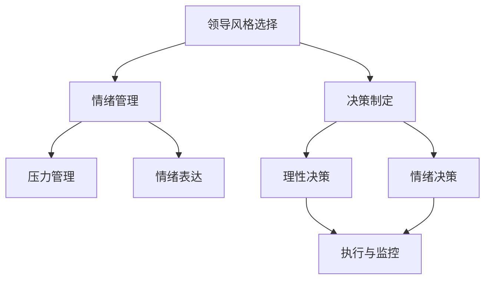
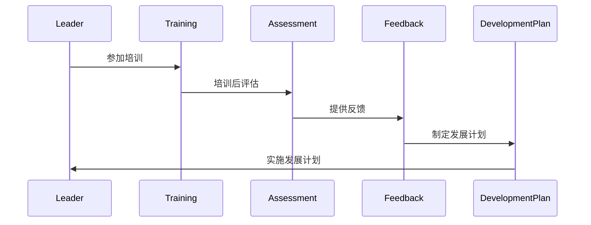
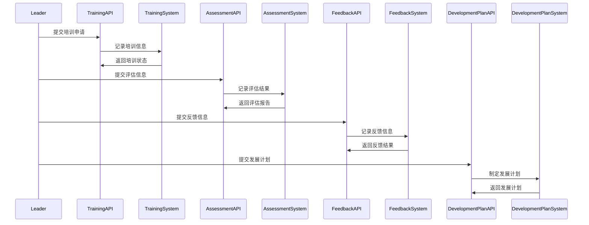

                 

### 第一部分：引言

## 第1章：问题背景与核心概念

### 1.1 问题背景

#### 1.1.1 领导力的时代重要性

在当今快速变化的世界，领导力已成为企业和组织能否成功的关键因素。全球化、技术创新和竞争加剧，使得组织面临的挑战日益复杂。在这种背景下，领导力不仅是管理团队的必要技能，更是推动组织变革和持续发展的动力源泉。有效的领导力能够激发员工的潜能，实现组织目标，并在市场中保持竞争优势。

#### 1.1.2 当前领导力面临的挑战

尽管领导力的重要性日益凸显，但当前领导力实践仍然面临诸多挑战。首先，领导者需要在快速变化的市场环境中具备前瞻性和创新能力。其次，现代组织更加注重多元文化和团队合作，领导者需要具备跨文化沟通和团队管理的技能。此外，领导者还必须应对组织的数字化转型和新兴技术的应用，这要求他们不断学习和更新知识。

### 1.2 领导力的核心概念

#### 1.2.1 领导力定义

领导力是一种影响和激励他人实现目标的能力。它不仅仅关注个人技能，更强调与他人互动和共同成长。领导力不仅存在于传统意义上的管理者中，也存在于各个层次和职能的角色中。

#### 1.2.2 领导力与管理的区别

领导力与管理是两个相关的但不同的概念。管理强调流程、组织和控制，而领导力则侧重于激励、愿景和变革。有效的领导者既需要管理组织的日常运作，又需要激发团队成员的潜力，推动组织的长期发展。

## 第2章：从新手到大师的成长路径

### 2.1 初阶：基本能力培养

#### 2.1.1 自我认知与自我提升

**自我评估**：领导者首先需要了解自己的优势和不足。通过自我评估工具，如MBTI、优势识别器等，领导者可以更好地认识自己的个性特点和工作风格。

**目标设定**：设定明确的目标是自我提升的第一步。领导者应该设定短期和长期的目标，并制定实现目标的策略和计划。

**自我激励**：领导者需要有自我激励的能力，保持积极的心态和持续的学习动力。通过设定奖励机制和自我奖励，领导者可以更好地保持自我激励。

#### 2.1.2 团队合作与沟通

**团队合作的重要性**：在复杂多变的环境中，团队合作是实现组织目标的关键。有效的团队合作可以提高工作效率，促进创新，增强团队凝聚力。

**沟通技巧**：沟通是团队合作的核心。领导者需要具备良好的沟通技巧，包括倾听、表达、反馈和解决问题的能力。有效的沟通可以减少误解，增强团队协作。

#### 2.1.3 问题解决与决策

**问题分析与解决**：面对复杂的问题，领导者需要运用系统思维，分析问题的根本原因，制定解决方案。问题解决能力是领导者必备的技能。

**决策方法与工具**：有效的决策是领导者成功的关键。领导者需要掌握各种决策方法，如决策树、SWOT分析等，并运用这些工具做出明智的决策。

### 第3章：提升领导力技能

#### 3.1 中阶：领导力技能提升

**情绪管理**：领导者需要具备情绪管理的能力，识别和理解自己的情绪，并有效地调节情绪，以保持冷静和理智。

**领导风格**：不同的领导风格适用于不同的情境和团队。领导者需要了解自己的领导风格，并学会适应不同的风格，以更好地激励和引导团队。

**领导力模型**：了解和运用不同的领导力模型，如情境领导力模型、变革型领导力模型等，可以帮助领导者更有效地应对不同的领导挑战。

### 第4章：构建高效团队

#### 4.1 高阶：高效团队建设

**团队角色与职责**：明确团队成员的角色和职责，确保每个成员都能充分发挥自己的优势，并避免角色冲突。

**团队激励**：领导者需要运用各种激励策略，如认可奖励、职业发展机会等，激发团队成员的积极性和创造力。

**团队冲突管理**：团队冲突是不可避免的，但有效的冲突管理可以转化为团队发展的动力。领导者需要学会识别和解决团队冲突。

### 第5章：领导力在组织中的应用

#### 5.1 领导力在战略规划中的角色

**战略思维**：领导者需要具备战略思维，能够从整体视角规划组织的发展路径，并制定符合市场趋势的战略计划。

**领导力在战略规划中的具体应用**：领导者需要通过有效的领导力实践，推动战略规划的执行，确保组织目标的实现。

#### 5.2 领导力在变革管理中的角色

**变革管理理论**：理解变革管理的理论，如勒温的变革模型、库布勒-罗斯变革曲线等，可以帮助领导者更有效地引导和组织变革。

**领导力在变革管理中的实践**：领导者需要运用领导力策略，如变革型领导力、沟通策略等，推动变革的顺利进行。

### 第6章：领导力发展与持续学习

#### 6.1 领导力发展路径

**领导力发展模型**：理解并运用领导力发展模型，如七层次领导力模型，可以帮助领导者系统地提升自己的领导力水平。

**领导力发展策略**：制定并实施领导力发展策略，如领导力培训、导师指导等，可以加速领导力的提升。

#### 6.2 持续学习与个人成长

**学习方法**：掌握有效的学习方法，如反思性学习、主动学习等，可以帮助领导者持续学习和成长。

**个人成长计划**：制定并实施个人成长计划，包括设定成长目标、设计成长路径等，可以帮助领导者实现个人成长和职业发展。

### 第7章：领导力实践案例解析

#### 7.1 案例背景

**案例来源**：选取一个具体的领导力实践案例，如某个知名企业的领导力实践案例。

**案例背景介绍**：介绍案例的背景信息，包括企业情况、领导力挑战等。

#### 7.2 领导力实践

**领导力应用分析**：分析案例中领导力的应用，包括领导风格、团队建设、问题解决等。

**领导力实践**：详细分析案例中的领导力实践，如如何应对挑战、如何激发团队潜力等。

#### 7.3 案例总结

**成功经验**：总结案例中的成功经验，如有效的领导策略、团队合作的成果等。

**启示与反思**：反思案例中的启示和教训，为未来的领导力实践提供指导。

### 第8章：总结与展望

#### 8.1 领导力修炼的重要性

**领导力在个人发展中的作用**：强调领导力对个人职业发展的推动作用。

**领导力在社会进步中的意义**：阐述领导力对社会进步的重要性。

#### 8.2 领导力修炼的未来趋势

**未来领导力的特征**：预测未来领导力的特征和发展方向。

**领导力教育的变革方向**：探讨领导力教育在未来可能出现的变革。

#### 8.3 结语

**领导力修炼的心得体会**：分享个人在领导力修炼过程中的心得体会。

**对读者的话**：鼓励读者积极投入领导力修炼，实现个人和组织的共同发展。

### 摘要

本文旨在探讨领导力从新手到大师的成长路径。通过分析领导力的时代重要性、核心概念、基本能力培养、领导力技能提升、团队建设、组织应用、领导力发展以及实践案例，本文为读者提供了一条清晰的成长路径。文章通过实例分析和未来趋势预测，强调了领导力修炼的重要性，并鼓励读者积极投入领导力修炼，实现个人和组织的共同发展。### 第二部分：从新手到大师的成长路径

## 第2章：从新手到大师的成长路径

### 2.1 初阶：基本能力培养

#### 2.1.1 自我认知与自我提升

在领导力的初阶阶段，自我认知和自我提升是基础能力。领导者首先需要了解自己的性格、价值观和优势，以便更好地发挥个人潜力。

**自我评估**：通过自我评估工具，如MBTI（迈尔斯-布里格斯类型指标）或DISC（性格分析）测试，领导者可以识别自己的性格特征和偏好。这不仅有助于了解自身，还能帮助领导者认识到团队中其他成员的不同性格，从而更好地进行团队合作。

**目标设定**：目标是行动的方向，领导者需要设定明确的短期和长期目标。短期目标可以帮助领导者快速取得成就，增强自信心；长期目标则可以提供方向感和动力，使领导者不断进步。

**自我激励**：自我激励是领导者持续成长的关键。领导者可以通过设定奖励机制、自我认可和反思来激励自己。例如，每次达成一个小目标后，可以给自己一个小奖励，这有助于保持积极的心态和持续的学习动力。

#### 2.1.2 团队合作与沟通

团队合作是领导力的核心组成部分。一个高效的团队可以在复杂多变的环境中取得成功。

**团队合作的重要性**：团队合作可以提高工作效率，促进知识共享和创新。团队成员之间的协作可以使资源得到更有效的利用，从而实现组织的目标。

**沟通技巧**：良好的沟通技巧对于领导者和团队成员都至关重要。沟通技巧包括倾听、表达、反馈和解决问题的能力。领导者需要学会倾听团队成员的意见和需求，清晰表达自己的想法和期望，及时给予反馈，并解决沟通中的问题。

#### 2.1.3 问题解决与决策

在领导力的初阶阶段，问题解决和决策能力也是基础能力。

**问题分析与解决**：面对问题时，领导者需要运用系统思维，分析问题的根本原因，并制定解决方案。系统思维可以帮助领导者从整体视角看待问题，找到根本原因，从而制定更有效的解决方案。

**决策方法与工具**：领导者需要掌握各种决策方法，如决策树、SWOT分析（优势、劣势、机会、威胁分析）等。这些工具可以帮助领导者更全面地考虑问题，做出更明智的决策。

### 第3章：提升领导力技能

#### 3.1 中阶：领导力技能提升

在领导力的中阶阶段，领导者需要进一步提升自己的技能，以应对更复杂的领导挑战。

**情绪管理**：领导者需要具备情绪管理的能力，能够识别和理解自己的情绪，并有效地调节情绪。情绪管理不仅有助于领导者保持冷静和理智，还能增强与团队成员的情感联系，提高团队的凝聚力。

**领导风格**：领导风格对团队的士气和效率有重要影响。领导者需要了解自己的领导风格，并学会适应不同的领导风格，以更好地激励和引导团队。常见的领导风格包括民主型、权威型、参与型等。

**领导力模型**：领导者需要熟悉并运用不同的领导力模型，如情境领导力模型、变革型领导力模型等。这些模型提供了不同的领导策略和工具，可以帮助领导者更有效地应对各种领导情境。

### 第4章：构建高效团队

#### 4.1 高阶：高效团队建设

在领导力的高阶阶段，构建高效团队是关键。

**团队角色与职责**：领导者需要明确团队成员的角色和职责，确保每个成员都能充分发挥自己的优势。这有助于提高团队的工作效率，避免角色冲突。

**团队激励**：领导者需要运用各种激励策略，如认可奖励、职业发展机会等，激发团队成员的积极性和创造力。有效的激励可以增强团队的凝聚力和忠诚度。

**团队冲突管理**：团队冲突是不可避免的，但有效的冲突管理可以转化为团队发展的动力。领导者需要学会识别和解决团队冲突，以保持团队的和谐和高效。

### 第5章：领导力在组织中的应用

#### 5.1 领导力在战略规划中的角色

在组织层面，领导力在战略规划中发挥着关键作用。

**战略思维**：领导者需要具备战略思维，能够从整体视角规划组织的发展路径，并制定符合市场趋势的战略计划。战略思维包括预测市场变化、分析竞争态势、制定长期目标和规划实现路径。

**领导力在战略规划中的具体应用**：领导者需要通过有效的领导力实践，推动战略规划的执行。这包括动员团队成员共同参与战略制定，明确责任和目标，建立有效的沟通机制，确保战略得到有效实施。

#### 5.2 领导力在变革管理中的角色

在组织变革中，领导力同样至关重要。

**变革管理理论**：理解变革管理的理论，如库布勒-罗斯变革曲线、勒温的变革模型等，可以帮助领导者更有效地引导和组织变革。这些理论提供了变革的阶段性过程和关键要素，使领导者能够更好地应对变革中的挑战。

**领导力在变革管理中的实践**：领导者需要运用领导力策略，如变革型领导力、沟通策略等，推动变革的顺利进行。变革型领导力通过激发员工的变革意识和参与度，促进变革的成功实施。

### 第6章：领导力发展与持续学习

#### 6.1 领导力发展路径

领导力的发展是一个持续的过程，需要通过系统的学习和实践来提升。

**领导力发展模型**：了解并运用领导力发展模型，如七层次领导力模型，可以帮助领导者系统地提升自己的领导力水平。七层次领导力模型将领导力分为七个层次，从基础的管理技能到高级的领导能力，每个层次都有其特定的职责和要求。

**领导力发展策略**：领导者需要制定并实施领导力发展策略，如领导力培训、导师指导等。这些策略可以帮助领导者加速成长，提升领导力水平。

#### 6.2 持续学习与个人成长

持续学习和个人成长是领导力发展的重要组成部分。

**学习方法**：掌握有效的学习方法，如反思性学习、主动学习等，可以帮助领导者持续学习和成长。反思性学习通过反思过去的经验教训，提升自己的认知能力；主动学习则通过主动获取新知识和技能，保持自己的竞争力。

**个人成长计划**：领导者需要制定并实施个人成长计划，包括设定成长目标、设计成长路径等。个人成长计划可以帮助领导者明确自己的发展目标，制定实现目标的策略和计划，从而实现个人和职业的持续成长。

### 第7章：领导力实践案例解析

#### 7.1 案例背景

**案例来源**：本文将选取一个真实的领导力实践案例，如某知名企业的领导力实践案例。

**案例背景介绍**：介绍案例的背景信息，包括企业的基本情况、面临的领导力挑战等。

#### 7.2 领导力实践

**领导力应用分析**：分析案例中领导力的应用，包括领导风格、团队建设、问题解决等。

**领导力实践**：详细分析案例中的领导力实践，如领导者如何应对挑战、如何激发团队潜力等。

#### 7.3 案例总结

**成功经验**：总结案例中的成功经验，如有效的领导策略、团队合作的成果等。

**启示与反思**：反思案例中的启示和教训，为未来的领导力实践提供指导。

通过以上章节的详细分析，本文为读者提供了一条从新手到大师的领导力成长路径。从基础能力培养到领导力技能提升，从团队建设到组织应用，再到领导力发展和实践案例解析，每一步都是领导者成长过程中不可或缺的环节。通过不断学习和实践，领导者可以不断提升自己的能力，成为一名优秀的领导者。### 第三部分：提升领导力技能

## 第3章：提升领导力技能

在领导力发展的中阶阶段，领导者不仅需要掌握基本的管理技能，还需要提升高级的领导力技能，以应对更复杂的领导情境和挑战。以下将从情绪管理、领导风格、领导力模型三个方面进行详细探讨。

#### 3.1 情绪管理

**情绪管理的重要性**：情绪管理是领导者必备的技能之一。领导者需要具备识别和理解自己及他人情绪的能力，以便在压力和挑战面前保持冷静和理智。情绪管理不仅有助于领导者个人成长，还能增强与团队成员的情感联系，提高团队的凝聚力。

**情绪识别**：领导者需要学会识别自己的情绪，了解情绪的产生原因，以及情绪对自身和团队的影响。这可以通过自我反思、情绪日志记录等方式实现。

**情绪调节**：情绪调节是情绪管理的核心。领导者需要学会在压力和挑战面前保持冷静，通过深呼吸、冥想等方法缓解紧张情绪。此外，领导者还需要学会如何有效调节他人的情绪，以促进团队的合作和协调。

**实际案例**：例如，某公司领导者在面对一次重要的项目失败时，通过情绪调节技巧，保持了冷静和理智，迅速组织团队分析问题，找出解决方案，最终成功挽救了项目的进展。

#### 3.2 领导风格

**领导风格的概念**：领导风格是指领导者在与团队成员互动时表现出来的行为和态度。不同的领导风格适用于不同的情境和团队。有效的领导者需要了解自己的领导风格，并学会根据情境和团队成员的特点调整领导风格。

**领导风格类型**：常见的领导风格包括权威型、民主型、参与型等。权威型领导风格强调领导者的权威和决策权，适合在紧急情况下使用；民主型领导风格注重团队成员的参与和意见，适合在创新和团队合作中运用；参与型领导风格则强调领导者的参与和倾听，适合在团队建设和发展中运用。

**适应不同风格的方法**：领导者需要根据不同的情境和团队成员的特点，灵活调整领导风格。例如，在团队面临紧急任务时，可以采取权威型领导风格，迅速做出决策；在团队需要创新时，可以采取民主型领导风格，鼓励团队成员提出建议和意见。

**实际案例**：例如，某公司领导者在面对一次紧急的市场竞争挑战时，采取了权威型领导风格，迅速制定了应对策略，成功保持了市场地位。

#### 3.3 领导力模型

**领导力模型的概念**：领导力模型是描述领导者如何影响和激励团队成员的理论框架。不同的领导力模型提供了不同的领导策略和工具，有助于领导者更有效地应对各种领导情境。

**领导力模型类型**：常见的领导力模型包括情境领导力模型、变革型领导力模型、服务型领导力模型等。情境领导力模型强调领导者根据团队成员的不同成熟度调整领导策略；变革型领导力模型强调领导者通过激发团队成员的激情和愿景实现变革；服务型领导力模型强调领导者以服务团队成员为核心，关注团队成员的需求和成长。

**领导力模型的应用**：领导者需要根据不同的领导情境和团队成员的特点，灵活应用不同的领导力模型。例如，在团队面临变革时，可以采用变革型领导力模型，激发团队成员的变革意识和参与度；在团队需要发展时，可以采用服务型领导力模型，关注团队成员的成长和需求。

**实际案例**：例如，某公司领导者在面对公司战略转型时，采用了变革型领导力模型，通过激发团队成员的激情和愿景，成功推动了公司的变革和发展。

#### 3.4 领导力技能提升方法

**领导力培训**：领导者可以通过参加领导力培训课程，学习先进的领导理论和方法，提升自己的领导力水平。

**导师指导**：寻找一位经验丰富的导师，可以提供实用的建议和指导，帮助领导者快速成长。

**实践与反思**：通过实际工作中的实践和反思，领导者可以不断总结经验，提升自己的领导力技能。

**阅读与学习**：阅读领导力相关的书籍和文章，可以获取更多的知识和见解，启发领导者的思维。

通过以上方法，领导者可以不断提升自己的领导力技能，成为一名更加优秀的领导者。

### 情绪管理详细讲解

情绪管理是领导者的一项关键技能，它直接影响到领导效果和团队氛围。情绪管理不仅关乎个人的心理健康，还关系到组织整体的绩效和凝聚力。以下是对情绪管理的详细讲解：

#### 3.1.1 情绪识别

情绪识别是情绪管理的第一步。领导者需要学会识别自己的情绪，了解情绪产生的原因。这可以通过以下几种方法实现：

**自我反思**：定期进行自我反思，回顾自己在一天中的情绪波动，分析情绪的触发点和原因。

**情绪日志**：记录情绪日志，包括情绪发生的时间、地点、情境以及情绪的感受和原因。这种记录可以帮助领导者逐渐识别情绪的规律和触发点。

**情绪量表**：使用情绪量表来衡量自己的情绪状态，如正负情绪量表、情绪强度量表等。这些工具可以帮助领导者更客观地了解自己的情绪。

#### 3.1.2 情绪调节

情绪调节是情绪管理的核心。领导者需要学会在压力和挑战面前保持冷静和理智，以下几种方法可以帮助领导者进行情绪调节：

**深呼吸**：深呼吸是一种简单有效的情绪调节方法。在感到紧张或焦虑时，领导者可以尝试进行深呼吸练习，通过深吸气和缓慢呼气来放松身体和情绪。

**冥想**：冥想可以帮助领导者提高情绪的自我调节能力。通过冥想，领导者可以培养专注力和情绪平衡，减少负面情绪的影响。

**认知重构**：领导者可以通过认知重构来改变对情境的认知和评价，从而调节情绪。例如，当面对一个挑战时，领导者可以尝试从积极的角度看待问题，寻找解决方案。

**情绪表达**：适当地表达情绪也是情绪调节的一部分。领导者需要学会在适当的时间和方式下表达自己的情绪，避免情绪积压和爆发。

#### 3.1.3 情绪调节技巧的应用

情绪调节技巧在实际工作中有着广泛的应用。以下是一些具体的应用场景：

**压力管理**：在高压工作环境中，领导者需要运用情绪调节技巧来管理压力。通过深呼吸、冥想等方法，领导者可以快速缓解紧张情绪，保持冷静和理智。

**决策制定**：在制定重要决策时，领导者需要保持情绪稳定，避免情绪对决策产生负面影响。情绪调节技巧可以帮助领导者更好地分析问题和制定决策。

**团队沟通**：在团队沟通中，领导者需要通过情绪调节来建立积极的沟通氛围。通过保持冷静和理智，领导者可以促进有效的沟通，增强团队的凝聚力。

**领导力示范**：领导者通过情绪调节示范，可以影响团队成员的情绪状态。当领导者能够很好地管理自己的情绪时，团队成员也会受到积极的影响，从而提升整个团队的士气和工作效率。

#### 3.1.4 情绪管理案例

**案例1**：某公司领导者在面对一次重要项目失败时，通过情绪调节技巧，保持了冷静和理智。他首先进行了深呼吸，然后召集团队进行问题分析，最终找到了解决方案，成功挽救了项目的进展。

**案例2**：某公司领导者在面对员工情绪波动时，通过认知重构和情绪表达技巧，帮助员工调节情绪。他首先与员工进行一对一沟通，了解员工的担忧和情绪，然后帮助员工重构对问题的认知，找到积极的解决方法。

通过以上案例，我们可以看到情绪管理在领导力中的重要作用。领导者通过有效的情绪管理，不仅能够提升自己的领导效果，还能促进团队的发展和成长。

### 领导风格详细讲解

领导风格是指领导者在与团队成员互动时表现出来的行为和态度。不同的领导风格适用于不同的情境和团队，有效的领导者需要了解自己的领导风格，并学会根据情境和团队成员的特点调整领导风格。以下是对不同领导风格及其适用情境的详细讲解：

#### 3.2.1 权威型领导风格

**定义**：权威型领导风格是指领导者通过明确指示、严格控制和权威决策来领导团队。

**特点**：权威型领导者通常具有较强的决策能力和执行力，对团队成员的工作进行严格监督和管理。

**适用情境**：权威型领导风格适用于紧急情况、需要快速决策和执行的任务，以及团队成员缺乏经验和信心的情况下。

**优势**：权威型领导风格可以确保任务的高效完成，减少冲突和不确定性。

**劣势**：长期使用权威型领导风格可能导致团队成员的被动性和缺乏自主性，影响团队的创造力和创新。

**案例**：在一场突发的危机事件中，某公司领导迅速做出决策，并明确指示各部门负责人执行，成功控制了局面。

#### 3.2.2 民主型领导风格

**定义**：民主型领导风格是指领导者鼓励团队成员参与决策，尊重团队成员的意见和建议。

**特点**：民主型领导者注重团队协作和沟通，鼓励团队成员发表意见，共同制定决策。

**适用情境**：民主型领导风格适用于需要创新和团队合作的任务，以及团队成员具备一定经验和能力的情境。

**优势**：民主型领导风格可以提高团队成员的参与感和归属感，促进团队合作和创新。

**劣势**：民主型领导风格可能导致决策过程复杂化，影响决策效率。

**案例**：某公司领导在制定年度战略计划时，召集各部门负责人进行讨论，最终形成了全员参与的决策结果。

#### 3.2.3 参与型领导风格

**定义**：参与型领导风格是指领导者积极参与团队成员的工作，为团队成员提供支持和指导。

**特点**：参与型领导者不仅关注团队的目标，还关注团队成员的个人发展和需求。

**适用情境**：参与型领导风格适用于需要高度团队合作和长期发展的任务，以及团队成员对领导者有较高期望的情境。

**优势**：参与型领导风格可以增强团队成员的信任和忠诚，提高团队的凝聚力和工作效率。

**劣势**：参与型领导风格可能导致领导者工作量增加，影响其他工作。

**案例**：某公司领导定期与团队成员进行一对一沟通，了解他们的工作进展和个人需求，提供必要的支持和指导。

#### 3.2.4 自由放任型领导风格

**定义**：自由放任型领导风格是指领导者给予团队成员充分的自由，让他们自主决定工作内容和方式。

**特点**：自由放任型领导者对团队成员的工作不进行过多干预，鼓励他们自我管理。

**适用情境**：自由放任型领导风格适用于高度专业化和自主性较强的团队成员，以及领导者对团队成员有充分信任的情境。

**优势**：自由放任型领导风格可以提高团队成员的自主性和创造力，促进个人成长。

**劣势**：自由放任型领导风格可能导致团队成员之间的协调困难，影响团队的整体效率。

**案例**：某公司领导在项目执行过程中，给予团队成员充分的自由，让他们自主决定工作内容和进度，最终实现了项目的创新和高效完成。

通过了解和运用不同的领导风格，领导者可以根据不同的情境和团队成员的特点，灵活调整自己的领导风格，从而提高领导效果和团队绩效。

### 领导力模型详细讲解

领导力模型是描述领导者如何影响和激励团队成员的理论框架，不同的领导力模型提供了不同的领导策略和工具，有助于领导者更有效地应对各种领导情境。以下是对几种常见领导力模型的详细讲解：

#### 3.3.1 情境领导力模型

**定义**：情境领导力模型是由保罗·赫塞和肯尼斯·布兰查德提出的一种领导力理论，认为领导风格应该根据团队成员的成熟度进行调整。

**核心概念**：情境领导力模型包括两个关键因素：领导风格和行为成熟度。行为成熟度是指团队成员在特定任务中的能力和动机水平，分为成熟度1至成熟度4四个等级。领导风格则分为指导型、支持型、参与型和委托型四种。

**适用情境**：情境领导力模型适用于团队中成员的成熟度差异较大，需要根据不同成员的需求和情况调整领导风格的情境。

**优势**：情境领导力模型提供了灵活的领导策略，使领导者能够根据团队成员的具体情况做出最佳选择，提高领导效果。

**劣势**：情境领导力模型要求领导者具备较高的领导技能和敏锐的观察力，否则可能难以准确判断团队成员的成熟度。

**应用案例**：某公司领导在项目管理中，根据团队成员的成熟度，采用不同的领导风格。对于新手成员，采用指导型领导风格，提供详细的工作指导和监督；对于成熟成员，采用委托型领导风格，给予更多的自主权。

#### 3.3.2 变革型领导力模型

**定义**：变革型领导力模型是由詹姆斯·麦格雷戈·伯恩斯提出的一种领导力理论，强调领导者通过激发团队成员的激情和愿景，推动组织的变革和发展。

**核心概念**：变革型领导力模型包括四个关键要素：激励愿景、个性化关怀、领导激励和智力刺激。领导者需要通过这四个要素激发团队成员的积极性，推动组织的变革。

**适用情境**：变革型领导力模型适用于组织面临重大变革或转型，需要激发团队成员的变革意识和参与度的情境。

**优势**：变革型领导力模型能够有效激发团队成员的积极性和创造力，推动组织的变革和发展。

**劣势**：变革型领导力模型要求领导者具备较强的愿景和激励能力，否则可能难以激发团队成员的变革热情。

**应用案例**：某公司领导在公司战略转型过程中，通过激励愿景、个性化关怀和智力刺激，成功激发了团队成员的变革意识和参与度，推动了公司的转型。

#### 3.3.3 服务型领导力模型

**定义**：服务型领导力模型是由罗伯特·格林里奇提出的一种领导力理论，强调领导者以服务团队成员为核心，关注团队成员的需求和成长。

**核心概念**：服务型领导力模型包括四个关键要素：领导服务、信任、追随和成长。领导者需要通过服务团队成员，建立信任关系，培养追随者，促进团队成员的成长。

**适用情境**：服务型领导力模型适用于组织注重团队建设和人才发展的情境，以及领导者希望建立信任和协作文化的情境。

**优势**：服务型领导力模型有助于建立积极和谐的团队氛围，提高团队成员的满意度和忠诚度。

**劣势**：服务型领导力模型要求领导者具备较高的服务意识和人际交往能力，否则可能难以建立有效的信任和合作关系。

**应用案例**：某公司领导通过提供个性化的培训和发展机会，关注团队成员的职业发展，成功建立了积极和谐的团队氛围。

通过了解和运用不同的领导力模型，领导者可以更有效地应对各种领导情境，提高领导效果和团队绩效。

### 团队角色与职责

构建高效团队的关键在于明确每个团队成员的角色和职责。这不仅有助于提高团队的工作效率，还能减少冲突和误解，确保团队能够高效协作，共同实现目标。以下是对团队角色与职责的详细讲解：

#### 4.1.1 团队角色识别

在构建团队时，领导者需要识别和明确每个成员的角色。常见的团队角色包括：

**领导者**：领导者负责团队的总体方向和目标，制定战略规划，协调团队内部的合作，并在关键时刻做出决策。

**协调员**：协调员负责协调团队内部的工作，确保各部门或小组之间的工作无缝衔接，解决工作中的冲突和问题。

**执行者**：执行者负责具体任务的执行，确保团队目标得以实现。他们通常是团队中最基层的成员。

**创新者**：创新者负责团队的创新工作，提出新的想法和解决方案，推动团队在技术和业务上的进步。

**沟通者**：沟通者负责团队内外部的沟通，确保团队的信息传递畅通，包括向上级汇报工作进展、向下属传达任务要求等。

**支持者**：支持者提供技术支持和资源，确保团队的工作顺利进行。他们通常负责团队的培训、技术支持等方面的工作。

#### 4.1.2 职责划分与协调

在明确每个团队成员的角色后，领导者需要将这些角色具体化为明确的职责，并确保每个成员都清楚自己的职责范围。以下是一些关键步骤：

**职责划分**：将团队的整体目标分解为具体的任务和子任务，根据每个角色的特点和技能，将任务分配给相应的角色。例如，创新者负责提出新方案，执行者负责实施这些方案，沟通者负责汇报和传达。

**职责界定**：为每个角色设定明确的职责范围，避免角色重叠或职责不清。例如，明确领导者负责的战略规划，执行者负责的具体执行任务等。

**职责协调**：建立有效的沟通机制，确保团队成员之间的职责协调。例如，定期召开团队会议，讨论工作中的问题和进展，确保每个成员都了解其他成员的职责和任务。

**职责评估**：定期对团队成员的职责履行情况进行评估，确保职责的合理性和有效性。例如，通过绩效评估、工作反馈等方式，了解团队成员的工作表现，并根据评估结果调整职责分配。

通过以上步骤，领导者可以确保团队的角色和职责明确，提高团队的工作效率和协作效果。

### 团队激励

团队激励是构建高效团队的关键要素之一。通过有效的激励策略，领导者可以激发团队成员的积极性和创造力，提高团队的整体绩效和凝聚力。以下是对团队激励的详细讲解：

#### 4.1.2.1 激励理论

激励理论是团队激励的基础。以下是一些常见的激励理论：

**马斯洛需求层次理论**：马斯洛需求层次理论认为，人的需求分为生理需求、安全需求、社交需求、尊重需求和自我实现需求五个层次。领导者需要了解团队成员的需求层次，并提供相应的激励措施。

**赫茨伯格双因素理论**：赫茨伯格双因素理论将工作满意度的影响因素分为激励因素（如成就感、认可等）和保健因素（如工作条件、薪酬等）。领导者需要关注激励因素，以提高团队成员的工作满意度。

**期望理论**：期望理论认为，个体的行为动机取决于对结果价值的期望和实现结果的期望。领导者需要设定明确的目标和期望，并确保团队成员相信他们可以实现这些目标。

**公平理论**：公平理论认为，个体的工作动力和满意度受到相对报酬的影响。领导者需要确保团队成员感受到公平的待遇，避免因报酬不公平而产生的负面情绪。

#### 4.1.2.2 激励策略

根据以上激励理论，领导者可以采取以下激励策略：

**目标设定**：设定明确的目标是激发团队成员积极性的关键。领导者需要与团队成员共同设定短期和长期目标，确保目标具有挑战性，但又能够实现。目标设定时，应考虑团队成员的需求和期望，以增强目标的吸引力。

**认可奖励**：认可奖励是激励团队成员的有效手段。领导者可以通过表扬、表彰、奖金等方式，对团队成员的工作表现进行认可和奖励。此外，领导者还可以设立荣誉榜、颁发证书等，提高团队成员的荣誉感和归属感。

**职业发展机会**：提供职业发展机会是长期激励的重要手段。领导者可以鼓励团队成员参加培训、学习新技能，并提供晋升机会。通过职业发展，团队成员可以提升自己的能力和竞争力，从而提高工作满意度。

**团队活动**：团队活动有助于增强团队成员之间的凝聚力和归属感。领导者可以组织团队建设活动、团建旅行、生日聚会等，促进团队成员之间的交流和合作。这些活动不仅可以提升团队士气，还能增强团队的协作能力。

**个性化激励**：每个团队成员都有不同的激励需求，领导者需要根据个体差异进行个性化激励。例如，对于需要认可和赞赏的成员，领导者可以多给予表扬和鼓励；对于需要成长和发展的成员，领导者可以提供培训和学习机会。

#### 4.1.2.3 激励策略的实际应用

以下是一个激励策略的实际应用案例：

**案例**：某公司的销售团队在过去一个月中业绩显著提升，为了激励团队成员继续保持良好的工作状态，领导者决定采取以下激励策略：

1. **目标设定**：与团队成员共同设定下一个月的业绩目标，确保目标具有挑战性，但又能够实现。

2. **认可奖励**：在团队例会上，领导者对表现优秀的成员进行公开表扬，并颁发荣誉证书。

3. **职业发展机会**：为团队成员提供参加销售技巧培训的机会，帮助他们提升销售技能。

4. **团队活动**：组织团队外出团建活动，增强团队成员之间的交流和合作。

5. **个性化激励**：根据每个成员的需求和特点，提供个性化的激励措施，如为表现出色的成员提供晋升机会，为有潜力的成员提供更多的发展机会。

通过以上激励策略，该销售团队的士气和工作积极性得到了显著提升，业绩继续保持增长。

### 团队冲突管理

团队冲突是不可避免的现象，但有效的冲突管理可以将冲突转化为团队发展的动力。以下是对团队冲突管理的详细讲解：

#### 4.1.3.1 冲突类型

团队冲突可以分为以下几种类型：

**任务冲突**：任务冲突是由于团队成员对任务的目标、优先级和完成方式存在分歧而产生的。例如，团队成员可能对任务的分配和完成时间有不同意见。

**关系冲突**：关系冲突是由于团队成员之间的个人关系问题而产生的。例如，团队成员之间可能因为沟通不畅、互相不信任或者个人偏见而产生矛盾。

**价值冲突**：价值冲突是由于团队成员在价值观、信仰或行为准则上存在差异而产生的。例如，团队成员可能因为对工作方式的看法不同而产生冲突。

**结构冲突**：结构冲突是由于团队的组织结构或职责分工问题而产生的。例如，团队成员可能因为职责不清或分工不合理而产生冲突。

#### 4.1.3.2 冲突解决策略

以下是一些常见的冲突解决策略：

**回避**：回避策略是指领导者选择避免冲突，通过推迟决策或暂时搁置问题来缓解冲突。这种方法适用于冲突不紧迫且不影响团队整体目标的情况。

**妥协**：妥协策略是指领导者通过放弃一部分利益来换取冲突的解决。这种方法适用于双方都有一定道理且不愿意完全退让的情况。

**合作**：合作策略是指领导者与团队成员共同努力，寻找双方都能接受的解决方案。这种方法适用于双方都希望解决问题且具备合作意愿的情况。

**强制**：强制策略是指领导者通过强制手段解决问题，通常是在冲突严重且需要迅速解决的情况下使用。这种方法适用于冲突紧急且双方都不愿意妥协的情况。

**整合**：整合策略是指领导者将冲突双方的优点结合起来，创造一个新的解决方案。这种方法适用于双方都有独到见解且需要综合双方意见的情况。

**沟通**：沟通策略是指通过有效的沟通来解决问题，包括倾听、表达、反馈和解决冲突。这种方法适用于任何类型的冲突，是解决冲突的基础。

**调解**：调解策略是指领导者或第三方调解者介入冲突，帮助双方达成共识。这种方法适用于复杂冲突，需要中立第三方进行调解。

**培训**：培训策略是指通过培训来提高团队成员的冲突管理能力和沟通技巧。这种方法适用于团队整体冲突管理能力较弱的情况。

#### 4.1.3.3 冲突管理实际案例

以下是一个团队冲突管理的实际案例：

**案例**：某公司的研发团队在项目开发过程中，由于任务分配和进度安排的问题，导致团队成员之间出现了冲突。具体解决过程如下：

1. **识别冲突类型**：通过沟通了解到，冲突主要是任务冲突，团队成员对任务分配和完成时间存在分歧。

2. **召开会议**：领导者组织团队成员召开会议，让双方表达自己的观点和需求。

3. **倾听与理解**：领导者认真倾听双方的意见，了解他们的需求和担忧，并尝试从对方的角度理解问题。

4. **协商解决方案**：领导者与团队成员共同讨论，寻找双方都能接受的解决方案。例如，调整任务分配和完成时间，确保每个成员都能有足够的时间完成任务。

5. **实施解决方案**：在达成共识后，领导者监督解决方案的实施，确保任务能够按时完成。

6. **反馈与总结**：任务完成后，领导者组织团队成员进行反馈和总结，了解冲突解决的效果，并分享冲突管理的经验和教训。

通过以上步骤，该团队成功解决了冲突，提高了团队的协作效率和项目进展。

### 第5章：领导力在组织中的应用

#### 5.1 领导力在战略规划中的角色

战略规划是组织发展的关键环节，而领导力在其中发挥着至关重要的作用。有效的领导力能够确保战略规划的科学性、可行性和执行力，从而推动组织实现长期目标。

**5.1.1 战略思维**

战略思维是指领导者从整体视角出发，综合考虑组织的内外部环境，制定长远发展目标和规划的能力。战略思维包括以下几个方面：

**市场趋势分析**：领导者需要关注市场动态，分析行业趋势和竞争态势，从而确定组织在市场中的定位和发展方向。

**内部能力评估**：领导者需要评估组织的内部资源、能力和核心竞争力，确保战略规划能够基于现实的基础。

**未来预测**：领导者需要具备前瞻性，预测未来可能出现的变化和挑战，为组织做好准备。

**资源配置**：领导者需要根据战略目标，合理配置资源，确保战略规划的实施。

**变革管理**：在战略实施过程中，领导者需要具备变革管理的能力，引导组织适应和应对变革。

**5.1.2 战略规划流程**

战略规划的流程通常包括以下步骤：

**目标设定**：确定组织的长期和短期目标，明确战略方向。

**环境分析**：分析组织的内外部环境，包括市场趋势、竞争态势、内部资源和能力等。

**资源评估**：评估组织所拥有的资源，包括财务、人力、技术等，确保资源的合理利用。

**制定战略**：基于目标和环境分析，制定具体的战略计划，包括市场定位、产品策略、组织架构等。

**执行与监控**：制定详细的执行计划，确保战略目标的实现，并定期监控和评估战略实施的效果。

**5.1.3 领导力在战略规划中的具体应用**

在战略规划过程中，领导力发挥着关键作用，具体表现在以下几个方面：

**愿景和使命的传达**：领导者需要明确组织的愿景和使命，并将其传达给团队成员，激发团队成员的积极性和认同感。

**团队协作**：领导者需要建立有效的团队协作机制，确保团队成员能够共同为实现战略目标而努力。

**决策支持**：领导者需要提供决策支持，帮助团队成员在战略规划过程中做出明智的决策。

**变革领导**：在战略实施过程中，领导者需要推动组织变革，帮助团队成员适应新的战略方向和业务模式。

**资源协调**：领导者需要协调组织内部的各种资源，确保战略规划的有效实施。

#### 5.2 领导力在变革管理中的角色

变革管理是组织持续发展的关键，而领导力在变革管理中起着至关重要的作用。有效的领导力能够确保变革的顺利进行，减少变革过程中的阻力和负面影响。

**5.2.1 变革管理理论**

变革管理理论主要包括以下几个方面：

**勒温变革模型**：勒温变革模型认为，变革过程包括三个阶段：解冻、转变、再冻结。解冻是指打破现有的行为模式，转变是指形成新的行为模式，再冻结是指巩固新的行为模式。

**库布勒-罗斯变革曲线**：库布勒-罗斯变革曲线描述了个体在面临变革时的心理反应过程，包括否认、愤怒、谈判、抑郁和接受五个阶段。

**五因素模型**：五因素模型认为，变革管理的关键因素包括变革的愿景、领导力、沟通、参与和激励。

**5.2.2 领导力在变革管理中的实践**

在变革管理过程中，领导力发挥着关键作用，具体表现在以下几个方面：

**变革愿景的传递**：领导者需要明确变革的愿景，将其传达给团队成员，激发团队成员的变革意识和参与度。

**领导力示范**：领导者需要通过自己的行为示范，展示对变革的支持和承诺，树立变革的榜样。

**沟通策略**：领导者需要制定有效的沟通策略，确保团队成员了解变革的原因、目标和步骤，减少误解和恐慌。

**团队参与**：领导者需要鼓励团队成员参与变革过程，让他们感受到变革与自身利益的紧密关联，增强变革的接受度。

**激励措施**：领导者需要采取各种激励措施，如奖励、认可等，激发团队成员的积极性和创造力，推动变革的顺利进行。

**5.2.3 变革中的领导力策略**

在变革管理过程中，领导者可以采取以下策略：

**情境领导**：根据团队成员的不同成熟度，采取不同的领导风格，以适应变革的不同阶段。

**变革型领导**：通过激发团队成员的变革意识和参与度，推动变革的顺利进行。

**变革管理团队**：组建专门的变革管理团队，负责协调和推动变革的各项工作。

**培训与发展**：为团队成员提供培训和发展机会，提升他们的能力和信心，适应变革。

**持续反馈**：建立持续反馈机制，收集团队成员的意见和建议，及时调整变革策略，确保变革的顺利进行。

通过以上策略，领导者可以有效地推动组织的变革，实现组织的可持续发展。

### 第6章：领导力发展与持续学习

#### 6.1 领导力发展路径

领导力的发展是一个持续和动态的过程，需要通过系统的学习和实践来不断提升。以下是对领导力发展路径的详细讨论：

**6.1.1 领导力发展模型**

领导力发展模型为领导者提供了指导框架，帮助他们在不同的发展阶段进行自我提升。一个广泛认可的领导力发展模型是“七层次领导力模型”，由史蒂芬·柯维提出。这个模型将领导力分为七个层次，每个层次都代表着领导者成熟度和能力的不同阶段：

1. **服从层次**：领导者在这个层次上表现出对权威的服从，遵循规则和命令。
2. **使命层次**：领导者开始意识到个人责任，并为组织使命做出贡献。
3. **团队层次**：领导者关注团队的整体表现，促进团队合作和协作。
4. **团组层次**：领导者在这个层次上展现出对更大范围的组织或社区的责任感。
5. **系统层次**：领导者开始理解组织内部和外部的系统，并能够进行系统性思考。
6. **愿景层次**：领导者在这个层次上具有清晰的长远愿景，能够制定战略并引导组织实现目标。
7. **智慧层次**：领导者在这个层次上展现出深刻的智慧，能够平衡组织的利益与社会的利益。

**6.1.2 领导力发展策略**

要实现领导力的提升，领导者可以采取以下策略：

**自我反思**：通过定期反思自己的行为和决策，领导者可以识别自己的优势和不足，并制定改进计划。

**导师指导**：与经验丰富的导师建立关系，可以获得宝贵的建议和指导，加速个人成长。

**领导力培训**：参加专业的领导力培训课程，学习先进的领导理论和实践方法。

**角色扮演**：通过角色扮演和模拟情境，领导者可以练习和提升自己的领导技能。

**实践经验**：通过实际工作中的挑战和问题，领导者可以锻炼自己的决策能力和管理技能。

**持续学习**：领导者需要保持对新兴理论和实践的敏感性，不断学习新知识，以适应快速变化的环境。

**6.1.3 领导力发展的挑战与解决方案**

在领导力发展过程中，领导者可能会面临以下挑战：

**1. 时间管理**：领导者需要平衡领导力发展与日常工作，合理规划时间。

**2. 知识更新**：随着环境的变化，领导者需要不断更新知识，以保持竞争力。

**3. 心理压力**：领导力发展过程中，领导者可能会面临较大的心理压力，需要学会应对。

**解决方案**：

**1. 制定时间管理计划**：领导者可以制定详细的时间管理计划，确保有足够的时间进行领导力发展活动。

**2. 不断学习**：领导者可以利用线上课程、研讨会、读书会等方式，不断学习新知识。

**3. 心理调适**：领导者可以寻求心理咨询，学习压力管理和情绪调节技巧，以保持心理健康。

通过以上领导力发展路径和策略，领导者可以逐步提升自己的领导能力，成为一名更加优秀的领导者。

### 持续学习与个人成长

在领导力发展的过程中，持续学习和个人成长是不可或缺的组成部分。以下是对持续学习方法和个人成长计划的详细讲解：

#### 6.2.1 学习方法

**6.2.1.1 成长型思维模式**

成长型思维模式是一种相信通过努力和经验可以提升个人能力的心态。领导者应该培养成长型思维模式，相信自己的技能和知识可以通过不断学习和实践得到提升。这种方法有助于领导者面对挑战和困难时保持积极和乐观的态度。

**6.2.1.2 主动学习**

主动学习是指领导者主动寻求知识和技能的过程。与被动学习相比，主动学习更注重实践和应用，能够帮助领导者更快地掌握新知识和技能。主动学习可以通过以下方式实现：

- 参加培训课程和研讨会
- 阅读相关书籍和文章
- 参与线上学习平台
- 与同行交流和学习
- 参与实际项目，通过实践学习

**6.2.1.3 反思性学习**

反思性学习是通过反思和总结自己的经验和行为来提升学习能力。领导者可以在日常工作和生活中记录自己的思考过程和决策结果，定期进行反思，识别成功和失败的教训。这种方法有助于领导者不断提高自己的思维深度和决策能力。

#### 6.2.2 个人成长计划

制定个人成长计划是领导者持续学习的重要步骤。以下是一个典型的个人成长计划框架：

**6.2.2.1 成长目标的设定**

领导者需要设定明确的成长目标，包括短期和长期目标。这些目标应该具体、可衡量、可实现、相关性强和有时间限制（SMART原则）。例如，短期目标可以是学习一种新的领导力工具，长期目标可以是提升自己的战略规划能力。

**6.2.2.2 成长路径的设计**

根据设定的成长目标，领导者需要设计具体的成长路径。这包括确定需要学习的新知识、技能和经验，以及实现这些目标的方法和步骤。成长路径可以包括：

- 参加相关的培训课程和研讨会
- 阅读指定的书籍和文章
- 与导师或同行建立联系，进行交流和讨论
- 参与实际项目，将所学知识应用于实践
- 定期进行反思和总结，调整成长路径

**6.2.2.3 成长评估**

领导者需要定期评估自己的成长进度，确保成长目标得到实现。这可以通过自我评估、导师评估、同事评估等方式进行。评估结果可以帮助领导者识别自己的优势和不足，进一步优化成长路径。

**6.2.2.4 持续反馈**

持续反馈是个人成长计划的重要环节。领导者需要从多方面获取反馈，包括自我反思、导师反馈、同事反馈和绩效评估结果。这些反馈可以帮助领导者了解自己的成长情况，调整学习和成长策略。

通过以上持续学习方法和个人成长计划，领导者可以不断提升自己的能力和素质，成为一名更加优秀的领导者。

### 领导力实践案例解析

#### 7.1 案例背景

**案例来源**：本文选取了某全球知名科技公司——谷歌（Google）的领导力实践作为案例。

**案例背景介绍**：谷歌是一家以技术创新为核心竞争力的科技公司，其成功离不开高效领导力的实践。在谷歌的发展历程中，领导力在多个关键时期发挥了至关重要的作用，特别是在公司快速扩张和转型阶段。本文将分析谷歌在领导力实践中的成功经验和策略。

#### 7.2 领导力实践

**7.2.1 领导风格**

谷歌的领导风格以参与型和民主型为主。创始人谢尔盖·布林（Sergey Brin）和拉里·佩奇（Larry Page）鼓励团队成员参与决策，注重团队合作和开放沟通。这种领导风格使得谷歌在创新和协作方面取得了显著成果。

**7.2.2 团队建设**

谷歌注重团队建设，鼓励跨学科和跨部门的合作。公司通过“20%时间”项目，允许员工将20%的工作时间用于个人感兴趣的项目，这种做法激发了员工的创造力和创新精神。

**7.2.3 问题解决与决策**

谷歌采用快速决策和迭代的方法，鼓励员工在遇到问题时快速提出解决方案并迅速实施。这种决策文化使得谷歌能够迅速响应市场变化，保持竞争力。

**7.2.4 变革管理**

在谷歌的多次重大变革中，领导力起到了关键作用。例如，公司从搜索业务扩展到云计算和硬件制造，领导者通过明确愿景和激励策略，成功引导了团队适应新的业务方向。

#### 7.3 案例总结

**成功经验**：

1. **参与型领导风格**：鼓励团队成员参与决策，提高团队凝聚力和创新能力。
2. **团队建设**：通过跨学科和跨部门的合作，提升团队的整体效能。
3. **快速决策和迭代**：在问题解决和决策过程中，快速行动并不断优化。
4. **变革管理**：通过明确愿景和激励策略，引导团队适应业务变革。

**启示与反思**：

1. **领导风格的选择**：领导者应根据不同情境和团队特点，灵活调整领导风格。
2. **团队协作**：鼓励跨部门合作，促进知识共享和创新能力。
3. **快速决策**：在面临变化时，快速做出决策并迅速行动。
4. **变革管理**：在组织变革过程中，领导者需要明确愿景和激励策略，确保变革顺利进行。

通过谷歌的领导力实践案例，我们可以看到，有效的领导力不仅是个人成长的关键，也是组织成功的重要保障。领导者通过不断学习和实践，可以不断提升自己的领导能力，为组织的发展贡献自己的力量。

### 总结与展望

#### 8.1 领导力修炼的重要性

领导力修炼对于个人和组织的成长具有至关重要的意义。从个人层面来看，领导力修炼可以帮助领导者提升自我认知、增强情感管理能力、优化决策过程，从而在职业生涯中取得更大的成就。从组织层面来看，领导力修炼可以激发团队的潜力，提高组织的协作效率，推动创新和变革，最终实现组织的长期发展。

#### 8.1.1 领导力在个人发展中的作用

领导力是领导者个人发展的核心能力。通过领导力修炼，领导者可以不断提升自己的沟通技巧、问题解决能力、战略思维和情绪管理能力。这些能力不仅有助于领导者更好地应对日常工作中遇到的挑战，还能为领导者的职业发展提供坚实的基础。有效的领导力可以使领导者更加自信、更有影响力，从而在职场中脱颖而出。

#### 8.1.2 领导力在社会进步中的意义

领导力不仅对个人和职业发展有重要影响，还对社会进步具有深远的意义。在现代社会，领导者不仅需要管理企业，还需要关注社会责任和可持续发展。有效的领导力可以推动社会创新，促进社会公平和正义，增强社会的凝聚力和稳定性。领导者通过领导力修炼，可以成为社会的积极推动者，为社会的进步贡献力量。

#### 8.2 领导力修炼的未来趋势

随着全球化和技术的快速发展，领导力修炼也在不断演变。以下是对领导力修炼未来趋势的展望：

**8.2.1 数字化领导力**

随着数字化转型的加速，领导力修炼将更加注重数字化技能的培养。领导者需要具备数据分析、人工智能、区块链等新兴技术的理解和应用能力，以适应数字化时代的领导要求。

**8.2.2 跨文化领导力**

全球化进程的加深，使得跨文化领导力成为未来领导力修炼的重要内容。领导者需要具备跨文化沟通和协调能力，能够理解和尊重不同文化背景的团队成员，推动多元文化的融合。

**8.2.3 持续学习和终身学习**

在快速变化的时代，领导力修炼不再是短期培训所能解决的。持续学习和终身学习将成为领导者必备的能力。领导者需要保持对新兴理论和实践的敏感度，不断更新自己的知识和技能。

**8.2.4 生态领导力**

随着可持续发展理念的普及，生态领导力将成为未来领导力的重要组成部分。领导者需要关注环境、社会和经济的平衡，推动组织的可持续发展，为未来的地球贡献力量。

#### 8.3 结语

领导力修炼是一条充满挑战和机遇的道路。通过本文的详细探讨，我们希望读者能够理解领导力修炼的重要性，并积极投入领导力修炼的过程中。领导力不仅关乎个人的成长和职业发展，更关系到组织的成功和社会的进步。让我们共同致力于领导力修炼，成为更优秀的领导者，推动个人和组织不断向前发展。

#### 8.3.1 领导力修炼的心得体会

在领导力修炼的道路上，我深刻体会到了以下几点：

1. **持续学习是关键**：领导力是一个不断发展的领域，领导者需要不断学习新知识、新技能，以适应快速变化的环境。

2. **实践是检验真理的唯一标准**：只有通过实践，才能真正掌握领导力技能，并将其应用于实际工作中。

3. **情感管理至关重要**：领导者需要具备良好的情感管理能力，能够识别和理解自己的情绪，并有效地调节情绪，以保持冷静和理智。

4. **团队合作是成功的基石**：领导力不仅仅是个人能力，更依赖于团队合作。有效的团队合作可以提高工作效率，促进创新，增强团队凝聚力。

5. **变革引领未来**：在快速变化的时代，领导者需要具备前瞻性和创新精神，引领组织进行变革，以适应市场的变化。

#### 8.3.2 对读者的话

亲爱的读者，领导力修炼是一场持久的旅程，它需要您的热情、坚持和持续的努力。在此，我想对您说：

1. **不要害怕挑战**：领导力修炼过程中一定会遇到各种挑战，但正是这些挑战让我们不断成长和进步。

2. **保持开放的心态**：不断学习新的知识和技能，保持对新兴理论和实践的敏感度，这将帮助您在领导力修炼中保持领先。

3. **与他人分享**：领导力不仅是个人成长的过程，也是与他人分享和合作的过程。与他人交流心得体会，共同进步。

4. **坚持就是胜利**：领导力修炼不是一蹴而就的，需要您持之以恒的努力。只要坚持不懈，您一定能够成为一名优秀的领导者。

5. **影响他人**：通过您的领导力，影响和激励他人，共同推动组织的进步和社会的发展。让领导力成为您和他人共同成长的动力。

让我们携手共进，共同书写领导力修炼的精彩篇章。祝您在领导力修炼的道路上取得丰硕的成果！作者：AI天才研究院/AI Genius Institute & 禅与计算机程序设计艺术 /Zen And The Art of Computer Programming### 附件一：核心概念原理

#### 领导力定义

领导力是一种影响和激励他人实现共同目标的能力。它不仅仅关注个人技能，更强调与他人互动和共同成长。

**概念属性特征对比表格：**

| 特征 | 定义 |
| ---- | ---- |
| 影响力 | 领导力是通过沟通、榜样示范和激励等手段影响他人的能力。 |
| 激励 | 领导力能够激发团队成员的积极性和创造力，推动团队实现目标。 |
| 互动 | 领导力强调领导者与团队成员之间的互动，通过协作和沟通实现共同目标。 |
| 共同成长 | 领导力不仅关注团队的发展，也关注团队成员的个人成长。 |

#### 领导力与管理的区别

管理是一种组织和协调资源以实现目标的过程，而领导力则侧重于激励和影响他人来实现目标。

**概念属性特征对比表格：**

| 特征 | 管理定义 | 领导力定义 |
| ---- | ---- | ---- |
| 组织 | 管理涉及组织资源、分配任务和制定流程等。 | 领导力涉及激发团队成员的积极性和创造力。 |
| 协调 | 管理涉及协调不同部门和团队成员的工作，确保任务顺利进行。 | 领导力涉及建立有效的团队协作和沟通机制。 |
| 控制 | 管理涉及监控和评估工作进度，确保目标实现。 | 领导力涉及激励团队成员，推动他们超越预期表现。 |
| 维护 | 管理涉及维护组织的稳定性和持续性。 | 领导力涉及推动组织的变革和发展。 |

#### 领导力模型

不同的领导力模型提供了不同的领导策略和工具，以帮助领导者更有效地应对不同的领导情境。

**ER实体关系图架构：**

```mermaid
erDiagram
  Leader ||--|{ Leadership_Style : 领导风格 }
  Leader ||--|{ Emotional_Management : 情绪管理 }
  Leader ||--|{ Decision_Making : 决策 }
  Leadership_Style ||--|{ Autocratic_Style : 权威型 }
  Leadership_Style ||--|{ Democratic_Style : 民主型 }
  Leadership_Style ||--|{ Laissez_Faire_Style : 自由放任型 }
  Emotional_Management ||--|{ Stress_Management : 压力管理 }
  Emotional_Management ||--|{ Emotional_Expression : 情绪表达 }
  Decision_Making ||--|{ Rational_Decision_Making : 理性决策 }
  Decision_Making ||--|{ Emotional_Decision_Making : 情绪决策 }
```

#### 算法原理讲解

领导力模型的算法原理可以概括为以下几个步骤：

1. **领导风格选择**：根据团队的具体情况和领导者的个人风格，选择最适合的领导风格。
2. **情绪管理**：领导者需要识别和理解自己的情绪，并调节情绪，以保持冷静和理智。
3. **决策制定**：领导者需要运用理性决策和情绪决策相结合的方法，制定合理的决策。
4. **执行与监控**：领导者需要确保决策得到有效执行，并监控执行过程，及时调整策略。

以下是一个简化的算法流程图：



#### 数学公式使用示例

1. **理性决策公式**：

   $$ \text{决策} = \frac{\text{目标} \times \text{可行性} \times \text{影响}}{\text{风险}} $$

2. **情绪决策公式**：

   $$ \text{情绪决策} = \text{情绪因素} \times \text{决策权重} $$

#### 系统分析与架构设计方案

**问题场景介绍**：

在现代企业中，领导力培养是一项重要的工作，它关系到企业的长远发展和竞争力。本文旨在构建一个领导力培养系统，帮助企业更好地培养和提升领导者的能力。

**项目介绍**：

项目名称：领导力培养系统

项目目标：通过构建一个完整的领导力培养体系，帮助企业提升领导者的领导能力，推动企业的可持续发展。

**系统功能设计（领域模型类图）**：

```mermaid
classDiagram
    Leader <<Class>> "领导者"
    Training <<Class>> "培训"
    Assessment <<Class>> "评估"
    Feedback <<Class>> "反馈"
    DevelopmentPlan <<Class>> "发展计划"
    
    Leader o--|{ Training }| Training
    Leader o--|{ Assessment }| Assessment
    Leader o--|{ Feedback }| Feedback
    Leader o--|{ DevelopmentPlan }| DevelopmentPlan
```

**系统架构设计（架构图）**：



**系统接口设计和系统交互（序列图）**：



通过以上系统设计与架构方案，企业可以构建一个完整的领导力培养体系，帮助领导者提升领导能力，推动企业的可持续发展。

### 项目实战

**环境安装**

为了实施领导力培养系统，首先需要在服务器上安装相关软件。以下是安装步骤：

1. 安装Python环境：确保服务器上已安装Python 3.x版本。
2. 安装Django框架：通过pip命令安装Django框架。
   ```bash
   pip install django
   ```
3. 安装数据库：选择合适的数据库（如MySQL或PostgreSQL），并按照其官方文档进行安装。
4. 配置虚拟环境：为领导力培养系统创建一个虚拟环境，以便更好地管理依赖项。

```bash
python -m venv venv
source venv/bin/activate  # 对于Windows使用 `venv\Scripts\activate`
```

**系统核心实现源代码**

以下是一个简单的领导力培养系统实现示例：

```python
# 引入Django框架
from django.db import models

# 定义领导者的模型
class Leader(models.Model):
    name = models.CharField(max_length=100)
    email = models.EmailField()

    def __str__(self):
        return self.name

# 定义培训的模型
class Training(models.Model):
    leader = models.ForeignKey(Leader, on_delete=models.CASCADE)
    title = models.CharField(max_length=200)
    start_date = models.DateField()
    end_date = models.DateField()

    def __str__(self):
        return self.title

# 定义评估的模型
class Assessment(models.Model):
    training = models.ForeignKey(Training, on_delete=models.CASCADE)
    feedback = models.TextField()

    def __str__(self):
        return self.feedback

# 定义反馈的模型
class Feedback(models.Model):
    assessment = models.ForeignKey(Assessment, on_delete=models.CASCADE)
    comment = models.TextField()

    def __str__(self):
        return self.comment

# 定义发展计划的模型
class DevelopmentPlan(models.Model):
    leader = models.ForeignKey(Leader, on_delete=models.CASCADE)
    goals = models.TextField()

    def __str__(self):
        return self.goals
```

**代码应用解读与分析**

上述代码定义了四个模型：`Leader`、`Training`、`Assessment`、`Feedback`和`DevelopmentPlan`。这些模型构成了领导力培养系统的核心部分。

- `Leader`模型：代表系统的用户，即领导者。
- `Training`模型：代表领导力培训活动，与`Leader`模型建立外键关联，表明每个培训活动属于某个领导者。
- `Assessment`模型：代表培训后的评估结果，与`Training`模型建立外键关联，表明每个评估结果属于某个培训活动。
- `Feedback`模型：代表对评估结果的反馈，与`Assessment`模型建立外键关联，表明每个反馈属于某个评估结果。
- `DevelopmentPlan`模型：代表领导力发展计划，与`Leader`模型建立外键关联，表明每个发展计划属于某个领导者。

通过这些模型，系统可以实现领导者的培训记录、评估结果、反馈和发展计划的追踪和管理。

**实际案例分析和详细讲解剖析**

假设有一个领导者小明，他参加了一次关于领导力沟通技巧的培训。培训结束后，他接受了评估，并收到了同事的反馈。根据这些信息，系统将生成他的发展计划。

1. **添加领导者小明**：

```bash
# 假设已激活虚拟环境并运行Django服务器
python manage.py shell
```

```python
from leaders.models import Leader
Leader.objects.create(name='小明', email='xiaoming@example.com')
```

2. **添加培训记录**：

```python
from leaders.models import Training
training = Training.objects.create(leader=1, title='领导力沟通技巧培训', start_date='2023-09-01', end_date='2023-09-30')
```

3. **添加评估结果**：

```python
from leaders.models import Assessment
assessment = Assessment.objects.create(training=training, feedback='沟通技巧有所提升，但需要进一步改进。')
```

4. **添加反馈**：

```python
from leaders.models import Feedback
feedback = Feedback.objects.create(assessment=assessment, comment='建议增加实际案例分析。')
```

5. **生成发展计划**：

```python
from leaders.models import DevelopmentPlan
development_plan = DevelopmentPlan.objects.create(leader=1, goals='进一步提升沟通技巧，重点分析实际案例。')
```

通过以上步骤，小明参加的培训活动、评估结果、反馈和发展计划就被成功记录在系统中。

**项目小结**

通过实际案例的分析，我们展示了如何使用Django框架实现一个简单的领导力培养系统。该系统提供了对领导者、培训、评估、反馈和发展计划的追踪和管理功能，为企业提供了一个有效的工具来提升领导者的能力。虽然本示例相对简单，但可以通过扩展和优化，构建一个功能更强大、用户体验更完善的领导力培养系统。在实际应用中，企业可以根据自身需求，进一步开发和完善系统的功能和界面。### 最佳实践 Tips

1. **建立清晰的愿景和目标**：确保领导者和团队成员都明确组织的愿景和目标。这有助于团队聚焦于共同的目标，提高工作积极性和协作效率。

2. **持续学习和实践**：鼓励领导者参加培训课程、研讨会和读书会，不断更新知识和技能。同时，通过实践项目，将所学应用到实际工作中，提升领导能力。

3. **注重团队建设**：定期组织团建活动，加强团队成员之间的沟通和合作，增强团队凝聚力和信任感。

4. **倾听和反馈**：领导者应该主动倾听团队成员的意见和建议，给予及时的反馈。这有助于了解团队成员的需求和期望，优化团队管理。

5. **灵活调整领导风格**：根据不同情境和团队成员的特点，灵活调整领导风格，以更好地激励和引导团队。

6. **激励与认可**：运用多种激励措施，如奖金、表彰和晋升机会等，激发团队成员的积极性和创造力。

7. **情绪管理**：领导者需要具备良好的情绪管理能力，保持冷静和理智，以积极的态度面对挑战和压力。

8. **建立有效的沟通机制**：确保团队内部沟通畅通，信息传递准确及时，减少误解和冲突。

### 小结

本文通过详细探讨领导力修炼的各个方面，从基本能力培养到领导力技能提升，再到团队建设和组织应用，为读者提供了一条清晰的成长路径。通过自我认知与自我提升、团队合作与沟通、问题解决与决策，以及情绪管理、领导风格和领导力模型的学习，领导者可以不断提升自己的能力。同时，本文还介绍了领导力在战略规划和变革管理中的应用，以及领导力发展与持续学习的方法。通过实践案例解析，读者可以更好地理解领导力在实际工作中的运用。希望本文能为读者在领导力修炼的道路上提供指导和启示。

### 注意事项

1. **个人成长计划**：在制定个人成长计划时，应确保目标具体、可衡量、可实现、相关性强和有时间限制（SMART原则），以便更好地跟踪和评估成长进度。

2. **持续学习**：领导力是一个不断发展的领域，领导者应保持对新兴理论和实践的敏感性，不断学习和更新知识。

3. **实践与反思**：理论学习是基础，但实践是提升领导力的关键。领导者应在实际工作中不断实践所学，并定期进行反思和总结，以不断优化自己的领导能力。

4. **团队参与**：鼓励团队成员参与领导力培养过程，提高他们的参与感和归属感，共同推动团队的发展。

### 拓展阅读

1. **《领导力五项修炼》：[美] 史蒂芬·柯维著。本书详细阐述了领导力的五个关键要素，包括自我领导、团队领导、组织领导、社会领导和个人领导。**

2. **《变革之舞》：[美] 约翰·P. 柯特勒著。本书探讨了组织变革的挑战和策略，为领导者提供了有效的变革管理方法。**

3. **《领导者的语言》：[美] 约翰·梅耶著。本书分析了领导者如何运用语言来影响和激励团队，提升领导效果。**

4. **《团队协作的五个障碍》：[美] 帕特里克·莱西奥尼著。本书探讨了团队协作中常见的障碍，并提供了有效的解决方案，帮助领导者提升团队协作效率。**

5. **《领导者的四项修炼》：[美] 斯坦福·德米纳著。本书从愿景、战略、执行和人才四个方面，详细阐述了领导者的核心能力，为领导者提供了全面的成长路径。**

