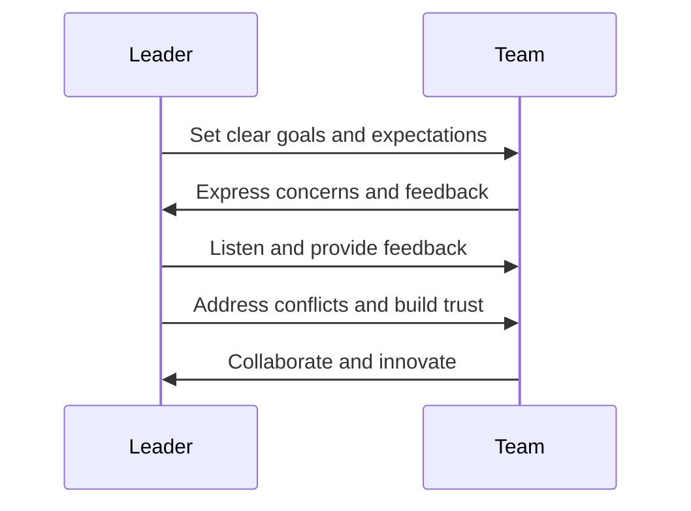
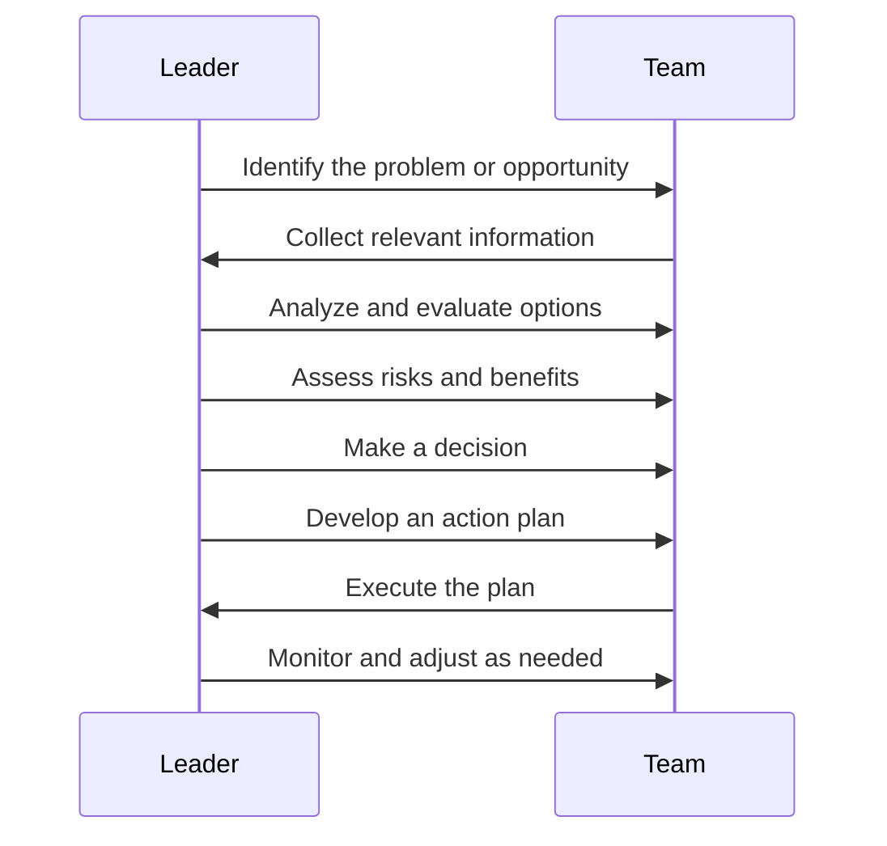
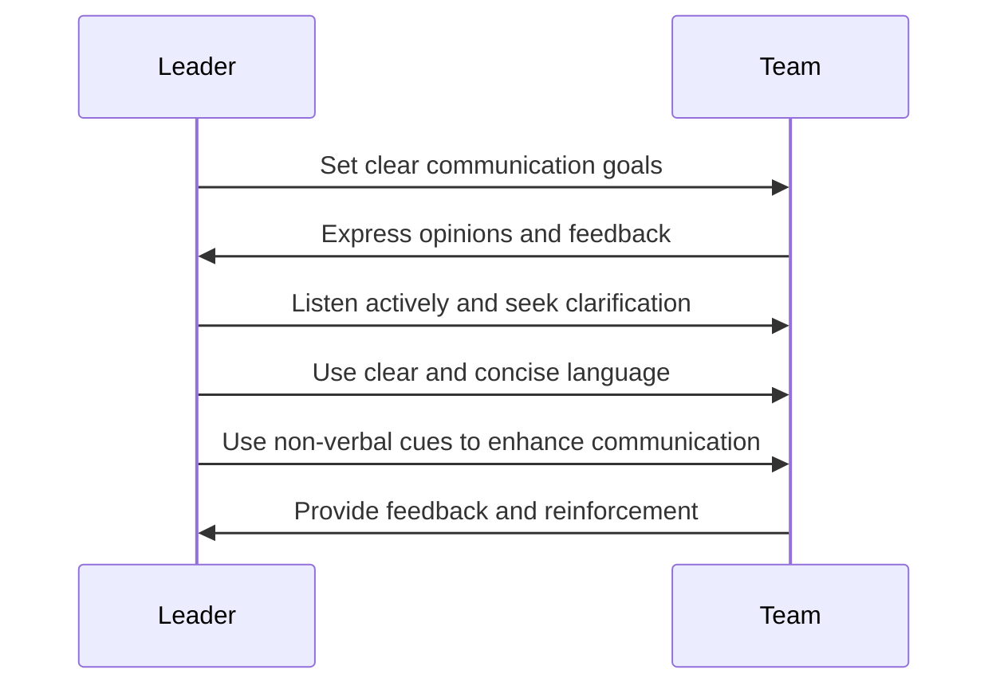
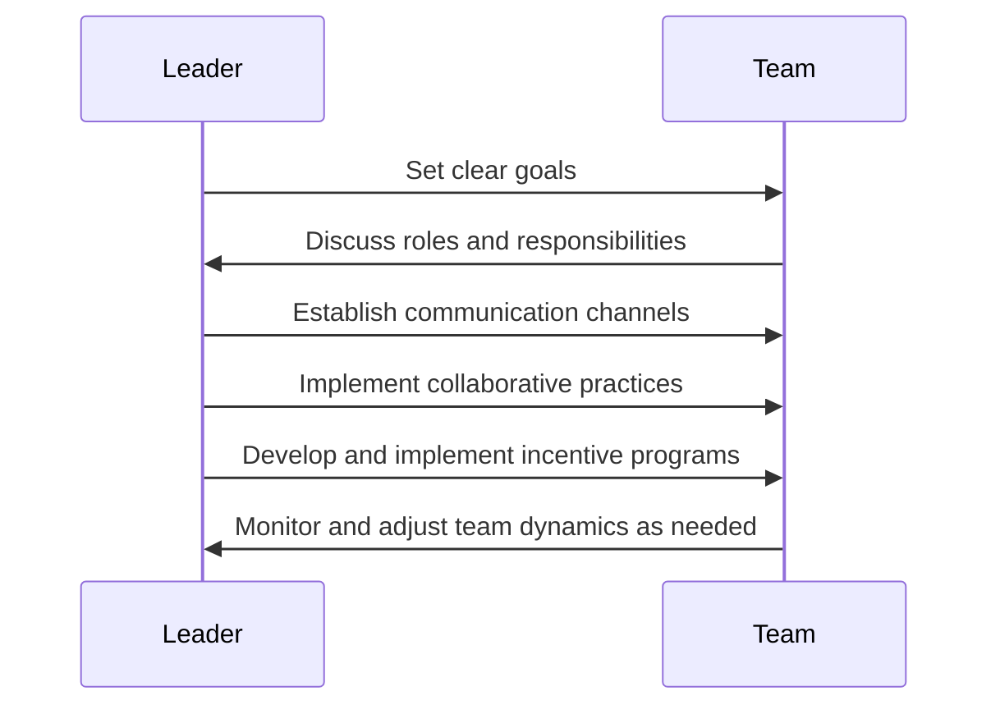
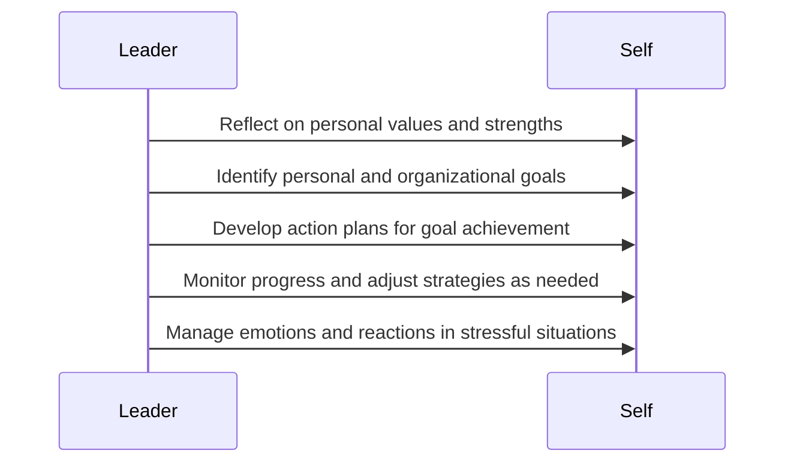
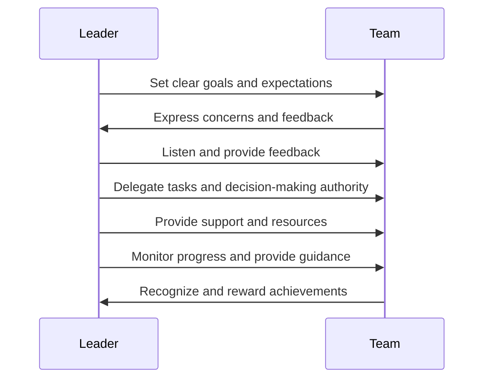
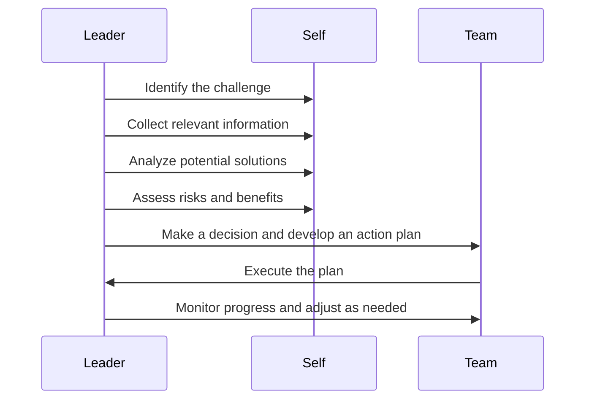

                 

# 领导力心法：成就一代领袖的领导力法则

## 关键词

- 领导力
- 领导力法则
- 情商
- 决策能力
- 沟通技巧
- 团队建设
- 自我领导
- 领导力心法

## 摘要

本文旨在探讨领导力的核心概念、要素和法则，通过系统的分析和实践案例，帮助读者理解并应用领导力，成为一代领袖。文章将分为八个章节，分别介绍领导力的背景、核心概念、要素详解、实践方法、案例分析、领导力心法以及未来趋势。通过详细的讲解和实例分析，本文旨在为读者提供一套全面、实用的领导力指南。

## 第1章：引言与背景介绍

### 1.1 问题背景

在当今快速变化的社会中，领导力已经成为个人和团队成功的关键因素。无论是企业、政府机构还是非营利组织，领导力都是推动组织发展、实现目标的核心动力。随着全球化、技术变革和市场竞争的加剧，领导力在个人和组织发展中的重要性日益增加。

### 1.2 问题描述

领导力包含哪些关键要素？如何在个人和职业生活中应用领导力？这些问题成为本文探讨的核心。通过深入研究领导力的本质和实践，本文将提供一套系统的领导力法则，帮助读者理解和实践领导力。

### 1.3 问题解决

本文将提供一套领导力法则，包括情商、决策能力、沟通技巧、团队建设等关键要素。通过详细的案例分析、实践指导和思考，读者可以逐步掌握领导力，成为卓越的领袖。

### 1.4 边界与外延

领导力不仅适用于企业高管，也适用于各个层面的领导者，包括团队领导、部门主管等。领导力是一种普遍适用的能力，可以在各种情境下发挥作用。同时，领导力与个人素质密切相关，需要通过不断的实践和自我提升来实现。

### 1.5 概念结构与核心要素组成

领导力的核心概念包括情商、决策能力、沟通技巧、团队建设等。这些概念相互关联，构成了领导力的整体结构。通过了解和掌握这些核心要素，读者可以更好地理解和应用领导力。

## 第2章：领导力的核心概念

### 2.1 定义与分类

领导力是一种能力，它使领导者能够激励和引导他人，共同实现目标。领导力可以定义为在复杂、不确定的环境中，通过影响和激励他人，实现共同目标的能力。

根据不同的标准，领导力可以分为多种类型。例如，根据领导风格，可以分为专制型、民主型、变革型等；根据领导情境，可以分为任务型、关系型等。

### 2.2 领导力与管理的区别

领导力和管理密切相关，但又有所不同。管理强调的是流程、制度和控制，而领导力则更注重人的激励和影响力。领导力强调愿景、价值观和文化，而管理则更关注具体任务的执行和结果。

### 2.3 领导力的重要性

领导力在个人和组织发展中扮演着重要角色。对于个人来说，领导力是职业发展的关键因素，能够帮助个人在职场中脱颖而出。对于组织来说，领导力能够推动组织的变革和创新，实现持续发展。

## 第3章：领导力要素详解

### 3.1 情商与领导力

情商是领导力的核心要素之一。情商高的人能够更好地理解自己和他人的情感，有效地处理人际关系。情商在领导力中的作用包括：

- **自我意识**：了解自己的情绪和需求，能够更好地管理情绪。
- **自我管理**：控制情绪，避免情绪对决策和行为产生负面影响。
- **社交意识**：理解他人的情感和需求，建立良好的人际关系。
- **关系管理**：处理复杂的人际关系，解决冲突，促进团队合作。

### 3.2 决策能力

决策能力是领导力的关键要素之一。有效的决策能力能够帮助领导者做出正确的决策，推动组织的发展。决策能力的提升可以通过以下方法实现：

- **信息收集**：广泛收集信息，了解问题的各个方面。
- **分析评估**：分析信息的可靠性，评估不同的决策方案。
- **风险评估**：评估不同决策方案的风险和收益。
- **决策执行**：制定详细的执行计划，确保决策的有效实施。

### 3.3 沟通技巧

沟通技巧是领导力的关键要素之一。有效的沟通能够帮助领导者传递信息，建立信任，促进团队合作。沟通技巧的提升可以通过以下方法实现：

- **明确目标**：明确沟通的目标和意图。
- **倾听**：倾听他人的观点和需求，建立互信。
- **表达清晰**：使用简单、清晰的语言表达观点。
- **非语言沟通**：使用肢体语言、面部表情等非语言手段辅助沟通。

### 3.4 团队建设

团队建设是领导力的核心要素之一。有效的团队建设能够提高团队的整体绩效，实现共同目标。团队建设的策略包括：

- **明确目标**：确保团队成员对团队目标有共同的理解。
- **角色分工**：明确每个成员的角色和责任。
- **团队协作**：促进团队成员之间的协作和沟通。
- **激励机制**：建立激励机制，鼓励团队成员积极投入。

## 第4章：领导力实践

### 4.1 自我领导

自我领导是领导力的基础。自我领导意味着领导者能够自我管理、自我激励，实现个人目标和组织目标。自我领导的实践方法包括：

- **自我认知**：了解自己的价值观、优势和劣势。
- **自我提升**：通过学习、实践和反思，提升自己的能力和素质。
- **目标设定**：明确自己的个人目标和职业目标，制定实现目标的计划。
- **自我激励**：找到激励自己的方法，保持积极的心态。

### 4.2 领导他人

领导他人是领导力的核心任务。有效的领导他人能够激发团队成员的潜力，实现共同目标。领导他人的方法包括：

- **激励**：了解团队成员的需求和动机，提供激励和支持。
- **沟通**：与团队成员建立良好的沟通机制，确保信息的透明和畅通。
- **授权**：信任团队成员，给予他们适当的权力和责任。
- **反馈**：及时给予团队成员反馈，帮助他们改进和成长。

### 4.3 应对挑战

领导者在面临挑战时，需要具备应对挑战的能力。应对挑战的策略包括：

- **积极态度**：保持积极的心态，面对挑战和困难。
- **信息收集**：收集相关信息，了解问题的本质和原因。
- **分析评估**：分析问题的各个方面，评估不同的解决方案。
- **决策实施**：制定详细的实施计划，确保决策的有效实施。

## 第5章：领导力案例分析

### 5.1 成功案例

成功领导者的行为和策略是领导力实践的典范。通过对成功领导者的案例分析，可以总结出以下成功要素：

- **愿景和目标**：明确组织的愿景和目标，引导团队共同努力。
- **信任和尊重**：建立信任和尊重的组织文化，激发团队成员的潜力。
- **创新和变革**：勇于创新，推动组织的变革和发展。
- **团队合作**：促进团队合作，实现共同目标。

### 5.2 失败案例

失败领导者的行为和策略也是领导力实践的重要反面教材。通过对失败领导者的案例分析，可以总结出以下失败原因：

- **缺乏愿景和目标**：缺乏明确的愿景和目标，导致团队缺乏方向。
- **不信任和不尊重**：不信任和不尊重团队成员，导致团队合作困难。
- **固步自封**：缺乏创新和变革意识，无法适应外部环境的变化。
- **个人主义**：过度依赖个人能力，忽视团队合作的重要性。

## 第6章：领导力心法

### 6.1 领导力心法概述

领导力心法是一种系统的领导力思维模式，它强调领导者内心的修养和智慧的运用。领导力心法包括以下几个方面：

- **自我认知**：了解自己的优点和不足，提升自我认知能力。
- **情感管理**：管理自己的情绪，保持积极的心态。
- **人际沟通**：建立良好的人际关系，促进团队合作。
- **智慧决策**：运用智慧和策略，做出正确的决策。
- **持续学习**：不断学习新知识，提升自己的能力。

### 6.2 实践领导力心法

实践领导力心法需要领导者从日常工作和生活中着手，不断修炼和提升自己的领导力。以下是一些建议：

- **自我反思**：定期进行自我反思，了解自己的行为和影响。
- **学习与成长**：积极参加培训和学习，不断提升自己的能力。
- **倾听与理解**：倾听他人的意见和需求，理解他人的情感和动机。
- **创新与变革**：勇于创新，推动组织的变革和发展。
- **团队合作**：促进团队合作，实现共同目标。

## 第7章：未来领导力趋势

### 7.1 未来领导力的需求

随着社会和技术的快速发展，未来领导力将面临新的需求和挑战。未来领导力将需要具备以下能力：

- **创新思维**：能够创新思维，适应快速变化的环境。
- **数字素养**：具备数字素养，能够利用数字技术推动组织发展。
- **全球视野**：具备全球视野，能够处理跨国界的复杂问题。
- **可持续发展**：关注可持续发展，推动组织的可持续发展。

### 7.2 领导力的发展方向

未来领导力将朝着以下方向发展：

- **人性化**：更加关注人的因素，注重员工的成长和发展。
- **智能化**：利用人工智能和大数据技术，提升领导决策的准确性和效率。
- **全球化**：更加注重全球化的领导力，处理跨国界的复杂问题。
- **社会责任**：承担更多的社会责任，推动组织的可持续发展。

## 第8章：总结与展望

### 8.1 领导力的重要性总结

领导力在个人和组织的成功中起着关键作用。领导力不仅能够推动个人职业发展，还能够促进组织的发展和创新。领导力的重要性体现在以下几个方面：

- **激发潜能**：领导者能够激发团队成员的潜力，实现共同目标。
- **引领变革**：领导者能够推动组织的变革和创新，适应外部环境的变化。
- **建立文化**：领导者能够建立组织的核心价值观和文化，引导团队行为。
- **推动发展**：领导者能够推动组织的可持续发展，实现长期的战略目标。

### 8.2 展望未来领导力的挑战与机遇

未来领导力将面临新的挑战和机遇。随着技术的快速发展和社会的变革，领导者需要具备更高的能力和素质，以应对复杂的环境和挑战。未来领导力的挑战与机遇包括：

- **技术创新**：领导者需要具备数字素养，利用人工智能和大数据技术推动组织发展。
- **全球视野**：领导者需要具备全球视野，处理跨国界的复杂问题。
- **可持续发展**：领导者需要关注可持续发展，推动组织的可持续发展。
- **人性化领导**：领导者需要更加关注员工的成长和发展，建立人性化领导模式。

总之，领导力是一门艺术，也是一门科学。通过不断学习和实践，领导者可以提升自己的领导力，成为一代领袖，推动个人和组织的发展。

## 目录大纲总结

本文共涵盖八个章节，从领导力的背景介绍、核心概念、要素详解、实践方法、案例分析，到领导力心法和未来趋势，全面覆盖了领导力的各个方面。通过详细的章节安排，读者可以系统地学习和理解领导力的本质和实践方法。每个章节都包含了丰富的内容和详细的讲解，旨在为读者提供一套全面、实用的领导力指南。

## 作者信息

作者：AI天才研究院/AI Genius Institute & 禅与计算机程序设计艺术 /Zen And The Art of Computer Programming

在撰写这篇文章的过程中，我们深入探讨了领导力的各个方面，从核心概念到实践方法，再到未来趋势，力求为读者提供一套全面、系统的领导力指南。通过这篇文章，我们希望读者能够更好地理解领导力，掌握领导力的实践方法，成为卓越的领袖。

在未来的道路上，我们将继续深入研究领导力，关注领导力的发展趋势，为读者提供更多有价值的领导力知识和实践案例。同时，我们也欢迎读者参与到我们的讨论和分享中来，共同探讨领导力的奥秘，共同成长。

最后，感谢您的阅读，希望这篇文章能够对您有所帮助。如果您有任何疑问或建议，欢迎在评论区留言，我们将尽快回复您的问题。让我们一起努力，成为更好的自己，成为更好的领导者！## 第1章：引言与背景介绍

### 1.1 问题背景

在当今社会，领导力的作用不可忽视。随着全球化、科技进步和社会变革的加速，领导力在个人和组织的成功中扮演着至关重要的角色。领导力不仅仅适用于企业高管，同样适用于团队领导、部门主管以及其他各种层面的领导者。在这个多变且充满挑战的环境中，领导力已经成为一种必备的能力，帮助个人和组织应对复杂的问题和实现长远的目标。

首先，领导力对个人职业发展的影响显而易见。一个优秀的领导者能够激发团队的潜力，推动项目的顺利进行，从而在职场中获得更多的机会和晋升。此外，领导力还能够帮助个人建立强大的个人品牌，提升职业竞争力。在现代社会，领导力已经成为评价一个人综合素质的重要标准之一。

其次，领导力对组织发展的影响同样深远。一个具有领导力的团队能够更加高效地协作，快速响应市场变化，不断创新和改进。领导者能够为组织设定清晰的愿景和目标，引导团队朝着共同的目标努力，从而实现组织的长期发展。同时，领导者还能够建立积极的组织文化，提升员工的满意度和忠诚度，降低员工流失率。

尽管领导力的重要性日益凸显，但在实际应用中，许多人仍然感到困惑和挑战。如何定义领导力？领导力包含哪些关键要素？如何在个人和职业生活中应用领导力？这些都是需要深入探讨的问题。因此，本文旨在通过系统的分析和实践案例，提供一套实用的领导力法则，帮助读者理解和实践领导力。

### 1.2 问题描述

领导力包含哪些关键要素？这是我们在探讨领导力时首先需要明确的问题。领导力并不是单一的能力，而是由多个要素组成的综合体。这些关键要素包括情商、决策能力、沟通技巧、团队建设等。每个要素都在领导力的不同方面发挥着重要作用，共同构成了领导力的整体框架。

首先，情商是领导力的核心要素之一。情商高的人能够更好地理解自己和他人的情感，有效地处理人际关系。在领导过程中，情商可以帮助领导者建立信任、激发团队动力，并有效解决冲突。其次，决策能力是领导力的关键要素。领导者需要能够在复杂和不确定的环境中做出明智的决策，推动组织的发展。有效的决策能力依赖于信息的收集、分析评估和风险评估等多个环节。

沟通技巧也是领导力的重要组成部分。领导者需要具备有效的沟通能力，能够清晰、准确地传达信息，建立良好的沟通机制。良好的沟通技巧有助于建立信任、减少误解，促进团队协作。最后，团队建设是领导力的关键要素之一。一个优秀的领导者需要能够建立有效的团队，明确团队的目标和责任，促进团队成员之间的协作和沟通。

如何在实际生活中应用领导力是一个更加具体和实际的问题。首先，个人可以通过自我领导来提升自己的领导力。自我领导意味着领导者能够自我管理、自我激励，实现个人目标和组织目标。这需要领导者具备自我认知、自我提升和目标设定等能力。其次，个人可以通过领导他人来提升自己的领导力。领导他人不仅包括激励和沟通，还包括授权和反馈。通过有效的领导他人，个人可以更好地理解和应用领导力的原则和方法。

### 1.3 问题解决

为了帮助读者理解和实践领导力，本文将提供一套系统的领导力法则。这些法则包括情商、决策能力、沟通技巧、团队建设等关键要素，每个要素都将通过详细的案例分析、实践指导和思考，帮助读者深入理解和应用。

首先，本文将详细探讨情商在领导力中的作用，包括自我意识、自我管理、社交意识和关系管理等方面。通过具体案例和实践指导，读者可以了解如何提升情商，并在领导过程中有效地应用。

其次，本文将深入分析决策能力的重要性，包括信息收集、分析评估、风险评估和决策执行等环节。通过具体案例和实践，读者可以掌握如何优化决策过程，提高决策的质量和效率。

第三，本文将探讨沟通技巧在领导力中的重要性，包括明确目标、倾听、表达清晰和非语言沟通等方面。通过具体案例和实践，读者可以学会如何建立有效的沟通机制，提升团队协作和团队绩效。

最后，本文将详细讨论团队建设的重要性，包括明确目标、角色分工、团队协作和激励机制等方面。通过具体案例和实践，读者可以了解如何建立有效的团队，提升团队的整体绩效。

通过这套系统的领导力法则，读者不仅可以系统地学习和理解领导力的核心概念和要素，还可以在实际生活和工作中应用这些法则，提升自己的领导力，成为卓越的领导者。

### 1.4 边界与外延

领导力作为一种能力，其应用范围非常广泛，不仅限于企业高管，还包括各个层面的领导者，如团队领导、部门主管等。在个人层面，领导力是职业发展的重要能力，能够帮助个人在职场中脱颖而出。在组织层面，领导力是推动组织变革和创新、实现长远目标的关键因素。因此，领导力不仅是一个理论概念，更是一种实际操作能力，能够在不同场景下发挥作用。

首先，领导力在组织中的表现主要体现在以下几个方面：

1. **愿景和目标设定**：领导者需要为组织设定清晰的愿景和目标，激发团队成员的积极性和创造力。
2. **团队协作和沟通**：领导者需要建立有效的团队协作和沟通机制，促进团队成员之间的合作和信息交流。
3. **决策和执行**：领导者需要具备优秀的决策能力，能够在复杂和不确定的环境中做出明智的决策，并确保决策的有效执行。
4. **文化建设和价值观传播**：领导者需要建立和传播组织的核心价值观，形成积极向上的组织文化。

其次，领导力与个人素质密切相关。一个领导者需要具备良好的个人素质，包括情商、决策能力、沟通技巧、团队建设能力等。这些素质不仅是领导力的基础，也是领导者个人发展的关键。例如，情商高的人更容易建立良好的人际关系，获得他人的信任和支持；决策能力强的人能够更好地应对复杂问题，做出明智的决策。

最后，领导力不仅是一个静态的概念，更是一个动态的发展过程。随着社会和科技的不断进步，领导力也在不断演变。未来，领导力将更加注重创新思维、数字素养、全球视野和可持续发展等方面的能力。因此，领导者需要不断学习和提升自己的能力，以适应不断变化的环境和挑战。

### 1.5 概念结构与核心要素组成

领导力的概念结构是一个多维的框架，涵盖了多个核心要素，这些要素相互交织，共同构成了领导力的整体结构。要全面理解和应用领导力，需要深入了解这些核心概念和要素。

首先，让我们来看一下领导力的核心概念。领导力可以定义为在复杂、不确定的环境中，通过影响和激励他人，实现共同目标的能力。这个定义强调了领导力在动态环境中的重要性，以及领导者对他人行为的积极影响。核心概念包括：

- **愿景**：领导者需要具备远见，设定清晰的愿景，为团队和组织指引方向。
- **信任**：领导者需要建立信任，这是团队合作和高效沟通的基础。
- **变革**：领导者需要具备推动变革的能力，以适应外部环境的变化。
- **激励**：领导者需要能够激励团队成员，激发他们的潜力，实现共同目标。

接下来，我们来看一下领导力的核心要素。这些要素是领导力的具体表现，也是领导者需要具备的关键能力。核心要素包括：

1. **情商（EQ）**：
   - **自我意识**：领导者需要了解自己的情绪和需求，能够自我管理。
   - **自我管理**：领导者需要控制情绪，避免情绪对决策和行为产生负面影响。
   - **社交意识**：领导者需要理解他人的情感和需求，建立良好的人际关系。
   - **关系管理**：领导者需要处理复杂的人际关系，解决冲突，促进团队合作。

2. **决策能力**：
   - **信息收集**：领导者需要广泛收集信息，了解问题的各个方面。
   - **分析评估**：领导者需要分析信息的可靠性，评估不同的决策方案。
   - **风险评估**：领导者需要评估不同决策方案的风险和收益。
   - **决策执行**：领导者需要制定详细的执行计划，确保决策的有效实施。

3. **沟通技巧**：
   - **明确目标**：领导者需要明确沟通的目标和意图。
   - **倾听**：领导者需要倾听他人的观点和需求，建立互信。
   - **表达清晰**：领导者需要使用简单、清晰的语言表达观点。
   - **非语言沟通**：领导者需要使用肢体语言、面部表情等非语言手段辅助沟通。

4. **团队建设**：
   - **明确目标**：领导者需要确保团队成员对团队目标有共同的理解。
   - **角色分工**：领导者需要明确每个成员的角色和责任。
   - **团队协作**：领导者需要促进团队成员之间的协作和沟通。
   - **激励机制**：领导者需要建立激励机制，鼓励团队成员积极投入。

这些核心概念和要素相互关联，共同构成了领导力的整体结构。例如，情商高的人通常具有更好的决策能力和沟通技巧，这有助于他们在团队建设中建立信任和促进合作。同时，一个有效的领导者需要在各个核心要素之间找到平衡，才能充分发挥领导力，实现个人和组织的共同目标。

通过深入理解和应用这些核心概念和要素，领导者可以更好地应对复杂的环境和挑战，成为卓越的领袖。以下是一个简化的ER实体关系图，展示了领导力核心要素之间的关系：

```mermaid
erDiagram
    Leader ||--|{ EQ }
    Leader ||--|{ Decision }
    Leader ||--|{ Communication }
    Leader ||--|{ TeamBuilding }
    EQ ||--|{ SelfAwareness }
    EQ ||--|{ SelfManagement }
    EQ ||--|{ SocialAwareness }
    EQ ||--|{ RelationshipManagement }
    Decision ||--|{ InformationCollection }
    Decision ||--|{ Analysis }
    Decision ||--|{ RiskAssessment }
    Decision ||--|{ Execution }
    Communication ||--|{ ClearGoals }
    Communication ||--|{ Listening }
    Communication ||--|{ ClearExpression }
    Communication ||--|{ NonVerbalCommunication }
    TeamBuilding ||--|{ TeamGoals }
    TeamBuilding ||--|{ RoleDuties }
    TeamBuilding ||--|{ TeamCollaboration }
    TeamBuilding ||--|{ Incentives }
```

通过这个ER图，我们可以清晰地看到领导力的核心要素以及它们之间的相互关系。这些要素不仅为领导力提供了理论框架，也为实际应用提供了具体的指导。领导者可以根据这些要素，逐步提升自己的领导力，实现个人和组织的共同目标。

## 第2章：领导力的核心概念

### 2.1 定义与分类

领导力是一个多维度的概念，其定义和分类方法多种多样。在探讨领导力的核心概念之前，我们需要先明确其定义和分类。

领导力可以被定义为一种能力，它使领导者能够激励和引导他人，共同实现目标。这个定义强调了领导力的核心功能——激励和引导。领导力不仅仅是管理，它涉及更深层次的影响和激励，包括情感、动机和行为。

从不同的角度对领导力进行分类，可以有助于我们更全面地理解这一概念。以下是一些常见的分类方法：

1. **基于领导风格**：
   - **专制型领导**：领导者集中决策权，强调权威和控制。
   - **民主型领导**：领导者鼓励团队成员参与决策，注重团队合作。
   - **变革型领导**：领导者通过激发团队成员的积极性和创造力，推动组织的变革和创新。
   - **转型型领导**：领导者通过解决组织内部的问题，实现组织结构的转型。

2. **基于领导情境**：
   - **任务型领导**：领导者专注于任务完成，强调效率和绩效。
   - **关系型领导**：领导者注重人际关系和团队建设，强调团队成员的满意度和忠诚度。

3. **基于领导类型**：
   - **正式领导**：基于职位和权力行使的领导，如企业高管、部门经理等。
   - **非正式领导**：基于个人魅力和影响力行使的领导，如团队中的意见领袖、技术专家等。

每种分类方法都有其独特的视角和侧重点，帮助我们更深入地理解领导力的不同方面。例如，变革型领导强调领导者如何激发团队成员的潜力，推动组织的创新和变革；而任务型领导则更注重任务的完成和效率。

### 2.2 领导力与管理的区别

领导力和管理是两个密切相关但又有所区别的概念。理解这两个概念之间的差异有助于我们更好地应用领导力，实现个人和组织的目标。

首先，领导力更注重激励和影响，而管理更侧重于流程和制度。领导力强调领导者通过激发团队成员的内在动力，实现共同目标。而管理则侧重于通过制度和流程来确保任务的完成和组织的目标实现。

其次，领导力强调愿景和价值观的传递，而管理则更关注具体的任务和目标。领导力通过设定愿景和价值观，为团队和组织指引方向，提供精神动力。而管理则更关注如何通过具体的计划和执行来达成目标。

最后，领导力更注重变革和创新，而管理则更侧重于稳定和持续。领导力通过推动组织变革和创新，适应外部环境的变化。而管理则更注重保持组织的稳定和持续发展。

以下是一个对比表格，展示了领导力和管理在几个关键方面的不同：

| **方面**          | **领导力**                       | **管理**                       |
|-------------------|---------------------------------|--------------------------------|
| 关注点            | 激励、影响、愿景和价值观          | 流程、制度、任务和目标          |
| 功能              | 激发团队潜力，推动变革和创新      | 保证任务完成，维持组织稳定      |
| 侧重点            | 变革和创新，情感和动机            | 效率和绩效，流程和稳定性        |
| 核心技能          | 沟通、情商、愿景设定、激励技巧    | 计划、组织、指挥、控制          |
| 领导类型          | 变革型、变革型、非正式领导        | 正式领导、任务型、关系型        |

通过这个表格，我们可以更清晰地看到领导力和管理在关注点、功能、侧重点、核心技能和领导类型等方面的差异。了解这些差异有助于我们更好地将领导力和管理结合起来，实现个人和组织的最佳绩效。

### 2.3 领导力的重要性

领导力在个人和组织发展中扮演着至关重要的角色。一个组织的成功往往取决于领导者的能力和领导力。以下是一些领导力对个人和组织的重要影响：

对于个人：
1. **职业发展**：领导力是职业发展的关键因素。一个具备领导力的个人能够在职场中脱颖而出，获得更多的晋升机会和职业发展空间。
2. **团队协作**：领导力有助于建立高效的团队，促进团队成员之间的协作和沟通，提高团队的绩效和满意度。
3. **个人影响力**：领导力使个人具备更大的影响力，能够推动团队和组织实现共同目标，提升个人在组织中的地位。
4. **解决问题**：具备领导力的人能够更好地应对复杂的问题和挑战，通过有效的决策和行动解决难题。

对于组织：
1. **愿景和目标**：领导力帮助组织设定清晰的愿景和目标，为团队和组织指引方向，提供精神动力。
2. **创新和变革**：领导力推动组织的创新和变革，帮助组织适应外部环境的变化，保持竞争力。
3. **团队合作**：领导力促进团队合作，建立良好的团队文化，提高团队的凝聚力和协作效率。
4. **员工满意度**：领导力通过激励和关怀，提高员工的满意度和忠诚度，降低员工流失率。
5. **绩效提升**：领导力帮助组织实现高效的运营和管理，提升组织的整体绩效和竞争力。

总之，领导力不仅是个人成功的关键，也是组织发展的核心动力。一个具备卓越领导力的人能够在个人职业发展中取得巨大成就，同时为组织的长期成功做出重要贡献。

## 第3章：领导力要素详解

### 3.1 情商与领导力

情商（EQ）是领导力的核心要素之一，它涵盖了自我意识、自我管理、社交意识和关系管理等方面。情商高的人能够更好地理解自己和他人的情感，有效地处理人际关系，从而在领导力方面表现出色。

首先，自我意识是情商的基础。自我意识是指领导者对自己情绪和需求的认知。一个具备高度自我意识的领导者能够清楚地了解自己的情绪状态，识别自己的情感触发点，并有效地管理这些情绪。例如，当领导者面临压力或挑战时，他们能够冷静思考，避免情绪冲动，从而做出明智的决策。

其次，自我管理是情商的重要组成部分。自我管理是指领导者控制和调节自己情绪和行为的能力。一个具备良好自我管理能力的领导者能够保持积极的心态，即使在困难和挑战面前也能保持冷静和坚定。这种能力使领导者能够在复杂和不确定的环境中保持稳定，为团队提供支持和指导。

社交意识是指领导者对他人的情感和需求的认知。一个具备高度社交意识的领导者能够敏锐地捕捉到团队成员的情绪变化，理解他们的需求和期望。这种能力有助于领导者建立信任和合作关系，促进团队合作。例如，当团队成员感到沮丧或困惑时，领导者能够及时提供支持和鼓励，帮助他们克服困难。

最后，关系管理是情商的重要应用领域。关系管理是指领导者处理复杂人际关系的能力，包括解决冲突、建立信任和促进沟通等。一个具备良好关系管理能力的领导者能够在团队内部建立积极的互动氛围，解决潜在的矛盾和冲突，促进团队的和谐与合作。

在领导过程中，情商发挥着至关重要的作用。一个情商高的领导者能够更好地激励团队成员，建立信任和合作关系，促进团队的协作和效率。以下是一个简化的流程图，展示了情商在领导力中的应用：



通过这个流程图，我们可以看到情商在领导力中的应用：设定清晰的目标和期望，倾听团队成员的意见和反馈，提供及时的反馈和支持，解决冲突并建立信任，最终实现团队的协作和创新。

### 3.2 决策能力

决策能力是领导力的关键要素之一，它决定了领导者能否在复杂和不确定的环境中做出明智的决策。一个具备卓越决策能力的领导者能够在面对挑战和机遇时，迅速做出正确的决策，推动组织的发展。

首先，信息收集是决策能力的基础。领导者需要广泛收集与决策相关的信息，包括内部数据和外部环境的变化。这些信息来源可以是市场调研、竞争对手分析、员工反馈等。通过全面的信息收集，领导者可以更好地了解问题的本质和各个方面，为决策提供坚实的基础。

其次，分析评估是决策过程中的重要环节。领导者需要分析收集到的信息，评估不同决策方案的优缺点。这需要领导者具备批判性思维和逻辑分析能力。例如，领导者需要考虑每个决策方案可能带来的风险和收益，分析其对组织目标和价值观的影响。

风险评估是决策能力的核心要素之一。领导者需要在决策过程中评估不同方案的风险，包括财务风险、市场风险、人力资源风险等。通过全面的风险评估，领导者可以更准确地预测决策结果，并为可能的失败做好准备。

最后，决策执行是决策能力的最终体现。即使领导者做出了明智的决策，如果没有有效的执行，也无法实现预期的目标。因此，领导者需要制定详细的执行计划，明确责任分工和关键里程碑，确保决策的顺利实施。同时，领导者还需要监督执行过程，及时发现和解决问题，确保决策目标的实现。

以下是一个简化的流程图，展示了决策能力的应用：



通过这个流程图，我们可以看到决策能力在领导力中的应用：识别问题或机会，收集相关信息，分析评估选项，评估风险和收益，做出决策，制定执行计划，执行计划并监控调整。每个环节都是决策能力的重要组成部分，需要领导者具备系统的思维和高效的执行能力。

### 3.3 沟通技巧

沟通技巧是领导力的关键要素之一，它决定了领导者能否有效地传达信息、建立信任和促进团队协作。有效的沟通不仅能够帮助领导者明确目标、传达愿景，还能够增强团队成员之间的互信和协作。

首先，明确目标是有效沟通的基础。领导者需要明确沟通的目标和意图，确保信息传达的清晰和准确。例如，在设定项目目标或传达重要决策时，领导者需要确保团队成员理解目标的含义和重要性，从而更好地投入到工作中。

其次，倾听是有效沟通的重要组成部分。领导者需要认真倾听团队成员的意见和反馈，了解他们的需求和期望。通过倾听，领导者可以建立信任，增强团队的凝聚力。例如，在团队会议中，领导者应该给予每个成员发言的机会，倾听他们的观点和建议，从而形成共识。

表达清晰是有效沟通的关键要素。领导者需要使用简单、清晰的语言表达观点，避免使用过于复杂或模糊的术语。例如，在向团队成员传达任务时，领导者应该使用具体的语言描述任务的要求和期望，确保团队成员能够准确理解任务内容。

非语言沟通也是有效沟通的重要方面。领导者需要通过肢体语言、面部表情等非语言手段辅助沟通，增强信息的传达效果。例如，在团队会议中，领导者可以通过点头、眼神交流等方式表达对团队成员的支持和认可，增强团队的凝聚力和信心。

以下是一个简化的流程图，展示了沟通技巧在领导力中的应用：



通过这个流程图，我们可以看到沟通技巧在领导力中的应用：设定清晰的沟通目标，表达意见和反馈，积极倾听和寻求澄清，使用清晰的语言和辅助沟通的非语言手段，提供反馈和强化。每个环节都是沟通技巧的重要组成部分，需要领导者具备良好的沟通能力和人际交往技巧。

### 3.4 团队建设

团队建设是领导力的关键要素之一，它决定了团队的整体绩效和合作效率。一个有效的领导者需要能够建立和维护一个高效、和谐的团队，促进团队成员之间的协作和沟通。

首先，明确目标是团队建设的基础。领导者需要与团队成员共同设定清晰的目标，确保每个成员都明确自己的责任和期望。例如，在项目启动时，领导者可以召开团队会议，讨论项目的目标、任务和预期成果，确保团队成员对项目有共同的理解。

其次，角色分工是团队建设的重要环节。领导者需要根据每个成员的技能和特长，明确每个人的角色和责任，确保任务的合理分配。例如，在项目团队中，领导者可以根据成员的技术背景和经验，分配任务和职责，确保每个成员都能发挥最大的作用。

团队协作是团队建设的关键要素。领导者需要建立有效的沟通机制，促进团队成员之间的协作和沟通。例如，可以通过定期召开团队会议、设置邮件群组等方式，确保团队成员之间的信息畅通，避免因沟通不畅而导致的误解和冲突。

激励机制也是团队建设的重要方面。领导者需要建立激励机制，鼓励团队成员积极投入，提高团队的绩效。例如，可以通过设定奖励制度、表彰优秀成员等方式，激励团队成员努力工作，提升团队的整体士气。

以下是一个简化的流程图，展示了团队建设在领导力中的应用：



通过这个流程图，我们可以看到团队建设在领导力中的应用：设定明确的目标，讨论角色和责任，建立沟通机制，实施协作实践，制定激励机制，并持续监控和调整团队动态。每个环节都是团队建设的重要组成部分，需要领导者具备良好的团队管理和协调能力。

## 第4章：领导力实践

### 4.1 自我领导

自我领导是领导力的重要组成部分，它强调领导者对自己行为和情绪的管理，以及对个人目标和组织目标的追求。自我领导不仅能够帮助领导者更好地实现个人职业发展，还能够为组织的长远发展奠定基础。

首先，自我认知是自我领导的基础。领导者需要深入了解自己的价值观、优势、弱点以及情感反应。这种自我认知有助于领导者更好地理解自己的行为模式，从而进行有效的自我调整。例如，通过反思自己的决策过程，领导者可以发现哪些行为是有效的，哪些行为需要改进。

其次，自我管理是自我领导的实践核心。领导者需要学会控制自己的情绪，特别是在面对压力和挑战时。有效的自我管理不仅能够帮助领导者保持冷静和理性，还能为团队成员提供稳定的支持和指导。例如，通过深呼吸、冥想或其他放松技巧，领导者可以在紧张的环境中保持情绪稳定。

目标设定是自我领导的重要方面。领导者需要明确自己的个人目标和组织目标，并制定实现这些目标的计划和策略。例如，一个领导者可以设定短期目标和长期目标，并通过定期评估和调整，确保目标的实现。

以下是一个简化的流程图，展示了自我领导的实践过程：



通过这个流程图，我们可以看到自我领导在实践中的应用：自我反思、目标设定、制定行动计划、监控进度和调整策略，以及情绪管理。这些实践步骤有助于领导者不断提升自我领导能力，成为更有效的领导者。

### 4.2 领导他人

领导他人是领导力的关键任务之一，它要求领导者能够激励、引导和影响团队成员，共同实现组织目标。有效的领导他人不仅能够提升团队的绩效，还能够增强团队成员的归属感和忠诚度。

首先，激励团队成员是领导他人的核心。领导者需要了解团队成员的动机和需求，并提供相应的激励。例如，通过设定具有挑战性的目标、提供奖励和认可，领导者可以激发团队成员的积极性和创造力。此外，领导者还需要关注团队成员的个人成长和职业发展，为他们提供培训和指导。

其次，沟通技巧在领导他人中发挥着重要作用。有效的沟通可以帮助领导者与团队成员建立信任，明确任务和期望，解决冲突。例如，在团队会议中，领导者可以通过倾听和反馈，确保团队成员的理解和参与，从而促进团队合作。

授权是领导他人的重要策略。领导者需要信任团队成员，赋予他们适当的权力和责任。例如，通过委派任务和决策权，领导者可以培养团队成员的自主性和责任感，提高团队的整体效能。

以下是一个简化的流程图，展示了领导他人的一般过程：



通过这个流程图，我们可以看到领导他人的一般步骤：设定目标和期望、倾听和反馈、授权和支持、监控进度和提供指导，以及认可和奖励。这些步骤有助于领导者有效地领导他人，提升团队的绩效和成员的满意度。

### 4.3 应对挑战

领导者在面对挑战时，需要具备应对挑战的能力。挑战是领导力的重要考验，有效的应对策略能够帮助领导者克服困难，推动组织的发展。

首先，积极态度是应对挑战的关键。领导者需要保持积极的心态，面对困难和挑战时不气馁，而是寻求解决问题的方法。例如，通过设定明确的解决方案和时间表，领导者可以有效地应对问题，避免陷入消极情绪。

其次，信息收集是应对挑战的重要步骤。领导者需要广泛收集与挑战相关的信息，包括内部数据和外部环境的变化。这些信息有助于领导者全面了解问题的本质，从而制定更有效的应对策略。

分析评估是应对挑战的核心环节。领导者需要对收集到的信息进行深入分析，评估不同的解决方案和风险。例如，通过分析潜在的优势和劣势，领导者可以选出最佳应对方案，确保决策的准确性。

决策实施是应对挑战的最终步骤。领导者需要制定详细的执行计划，明确责任分工和关键里程碑，确保决策的有效实施。同时，领导者还需要监督执行过程，及时发现和解决问题，确保挑战的顺利解决。

以下是一个简化的流程图，展示了应对挑战的一般过程：



通过这个流程图，我们可以看到应对挑战的一般步骤：识别挑战、信息收集、分析评估、决策实施、监控进度和调整。这些步骤有助于领导者有效地应对挑战，推动组织的持续发展。

## 第5章：领导力案例分析

### 5.1 成功案例

成功领导者的行为和策略是领导力实践的典范，通过分析这些成功案例，我们可以总结出一些通用的成功要素，为我们的领导力实践提供有益的启示。

#### 案例一：乔布斯的苹果革命

史蒂夫·乔布斯是苹果公司的联合创始人，他凭借独特的领导力和前瞻性思维，将苹果公司从一家小型企业打造成全球科技巨头。以下是乔布斯成功的关键要素：

1. **愿景和目标**：乔布斯始终坚信自己的愿景，即使面临外部压力和内部分歧，他也从未动摇。他通过清晰传达愿景，激励团队成员共同追求卓越。

2. **创新思维**：乔布斯具备强烈的创新意识，他不断推动产品的创新和改进，使苹果公司在激烈的市场竞争中脱颖而出。他鼓励团队成员提出新想法，并为他们提供资源和支持。

3. **用户体验**：乔布斯非常注重用户体验，他通过精心设计的产品和出色的用户体验，赢得了消费者的信任和忠诚。他相信产品的每一个细节都至关重要，这种专注使苹果产品在市场上独树一帜。

4. **团队协作**：乔布斯擅长建立高效的团队，他通过明确的目标和角色分工，激发团队成员的潜力，实现共同目标。他尊重团队成员的创意和贡献，营造了一种积极向上的团队文化。

#### 案例二：玛丽·巴拉的特斯拉转型

玛丽·巴拉是特斯拉公司的首席执行官，她在领导特斯拉的过程中，展现了卓越的领导力和变革能力。以下是她的成功要素：

1. **变革意识**：巴拉深知电动汽车市场的巨大潜力，她果断推动特斯拉向可持续发展转型，这一决策不仅为特斯拉带来了新的增长点，也推动了整个行业的变革。

2. **战略规划**：巴拉制定了一系列清晰的战略规划，包括扩大生产能力、提高品牌知名度、推动全球扩张等。这些战略规划为特斯拉的持续增长提供了明确的路径。

3. **人才管理**：巴拉非常重视人才，她通过建立高效的招聘和培养体系，吸引并留住了一批优秀的工程师和管理人才。她鼓励员工提出创新想法，并为他们提供实现梦想的机会。

4. **企业文化**：巴拉倡导开放、透明和协作的企业文化，她通过定期与员工交流，了解他们的需求和期望，从而提高员工的满意度和忠诚度。

通过分析这些成功案例，我们可以总结出一些通用的成功要素：

- **愿景和目标**：成功的领导者需要具备远见和坚定的信念，能够清晰地传达愿景，激励团队成员共同追求。
- **创新思维**：领导者需要具备创新意识，不断推动产品和服务的改进，以适应市场的变化和消费者的需求。
- **用户体验**：领导者需要关注用户体验，通过提供出色的产品和服务，赢得消费者的信任和忠诚。
- **团队协作**：领导者需要建立高效的团队，明确团队成员的角色和责任，激发团队的潜力，实现共同目标。

这些成功要素不仅适用于商业领域，也可以在其他类型的组织中发挥作用。通过学习和借鉴这些成功案例，我们可以提升自己的领导力，成为更优秀的领导者。

### 5.2 失败案例

失败领导者的行为和策略也是领导力实践的重要反面教材。通过对失败领导者的案例分析，我们可以总结出一些常见的失败原因，为我们的领导力实践提供警示。

#### 案例一：雷德·霍夫曼的失败经历

雷德·霍夫曼是LinkedIn的联合创始人，他在领导LinkedIn的早期取得了巨大成功，但随后由于一系列错误决策，导致公司陷入困境。以下是霍夫曼失败的关键原因：

1. **缺乏战略规划**：霍夫曼在领导LinkedIn的过程中，缺乏明确的战略规划。他过于关注短期利益，忽视长期发展，导致公司未能抓住市场机会。

2. **忽视用户需求**：霍夫曼在推出新功能时，未能充分考虑用户需求，导致产品用户体验不佳。这种忽视用户需求的错误决策，最终导致用户流失。

3. **团队管理不善**：霍夫曼在团队管理方面存在明显问题，未能有效激励和留住核心人才。团队士气低落，导致工作效率下降，创新乏力。

4. **沟通不畅**：霍夫曼在领导团队时，沟通不畅，未能及时传达公司的战略方向和目标。这导致团队在执行任务时缺乏统一的方向和行动。

#### 案例二：马斯克的特斯拉困境

埃隆·马斯克作为特斯拉公司的创始人，他在推动特斯拉发展的过程中，虽然取得了许多成功，但也面临了一些困境。以下是马斯克在领导特斯拉过程中的一些失败原因：

1. **过度自信**：马斯克在决策过程中，有时过于自信，未能充分考虑潜在的风险。这导致特斯拉在产品开发和运营中，面临一些不必要的风险和挑战。

2. **资源分配不均**：马斯克在资源分配上存在偏差，未能合理分配资金和人力资源。这导致一些重要项目缺乏足够的支持，无法顺利进行。

3. **管理不善**：马斯克在管理方面存在一些问题，未能建立有效的管理体系，导致团队协作效率低下。此外，他的一些管理风格也引发了一些员工的不满和离职。

4. **忽视市场变化**：马斯克在领导特斯拉时，有时未能及时适应市场变化，导致产品竞争力下降。例如，特斯拉在电动汽车市场竞争激烈的情况下，未能及时调整产品策略，导致市场份额下降。

通过分析这些失败案例，我们可以总结出一些常见的失败原因：

- **缺乏战略规划**：领导者需要制定明确的战略规划，确保公司或团队的发展方向正确，避免盲目决策。
- **忽视用户需求**：领导者需要关注用户需求，通过提供优质的产品和服务，赢得用户的信任和忠诚。
- **团队管理不善**：领导者需要建立有效的团队管理机制，激励和留住核心人才，提高团队的整体效能。
- **沟通不畅**：领导者需要建立有效的沟通机制，确保信息传达的准确性和及时性，避免因沟通不畅导致的误解和冲突。

这些失败原因提醒我们，领导力并非一成不变，领导者需要不断学习和改进，才能在竞争激烈的环境中取得成功。

## 第6章：领导力心法

### 6.1 领导力心法概述

领导力心法是一种系统的领导力思维模式，它强调领导者内心的修养和智慧的运用。领导力心法不仅仅是一种理论，更是一种实践方法，通过内心的修炼和智慧的运用，领导者可以更好地理解和应用领导力，实现个人和组织的共同目标。

领导力心法主要包括以下几个方面：

1. **自我认知**：自我认知是领导力心法的基石。领导者需要深入了解自己的价值观、信念、情感和动机，认识自己的长处和短处，从而更好地管理自己的情绪和行为。通过自我反思和持续的自我提升，领导者可以不断优化自己的领导风格，提高领导效能。

2. **情感管理**：情感管理是领导力心法的重要组成部分。领导者需要学会控制和管理自己的情绪，特别是在面对压力和挑战时。通过情感管理，领导者可以保持冷静和理性，做出更明智的决策，同时为团队成员树立良好的榜样。

3. **人际沟通**：人际沟通是领导者必须具备的能力。有效的沟通不仅能够帮助领导者更好地理解他人，建立信任和合作关系，还能够确保信息的准确传达，避免误解和冲突。领导者需要掌握倾听、表达、反馈等沟通技巧，建立积极的人际关系。

4. **智慧决策**：智慧决策是领导力心法的重要体现。领导者需要在复杂和不确定的环境中，运用智慧和策略做出正确的决策。这包括信息收集、分析评估、风险评估和决策执行等环节。通过智慧决策，领导者可以确保组织的稳定发展和持续创新。

5. **持续学习**：持续学习是领导力心法的重要组成部分。领导者需要保持学习的态度，不断更新知识和技能，以适应不断变化的环境和挑战。通过持续学习，领导者可以不断提升自己的领导能力和个人素质，保持竞争优势。

### 6.2 实践领导力心法

实践领导力心法需要领导者从日常工作和生活中着手，不断修炼和提升自己的领导力。以下是一些建议和方法：

1. **自我反思**：领导者需要定期进行自我反思，回顾自己的行为和决策，分析其成功和不足之处。通过自我反思，领导者可以发现自己的盲点和改进方向，从而不断提升自己的领导能力。

2. **持续学习**：领导者需要保持学习的态度，通过阅读书籍、参加培训、与同行交流等方式，不断更新自己的知识和技能。特别是随着科技和社会的快速发展，领导者需要具备前瞻性的思维和适应变化的能力。

3. **培养情商**：情商是领导力的核心要素之一。领导者需要培养自己的情商，包括自我意识、自我管理、社交意识和关系管理等方面。通过情商的提升，领导者可以更好地理解自己和他人的情感，建立良好的人际关系。

4. **建立信任**：信任是团队合作和领导力的基础。领导者需要通过诚信、透明和积极的沟通，建立和维护与团队成员的信任关系。通过建立信任，领导者可以激发团队成员的潜力，实现共同目标。

5. **智慧决策**：领导者需要在决策过程中运用智慧和策略，确保决策的科学性和有效性。这包括广泛收集信息、全面分析评估、准确风险评估和有效决策执行等环节。通过智慧决策，领导者可以确保组织的稳定发展和持续创新。

6. **促进沟通**：领导者需要建立有效的沟通机制，确保信息的准确传达和团队成员之间的有效沟通。通过促进沟通，领导者可以避免误解和冲突，提高团队的协作效率和绩效。

7. **培养团队精神**：领导者需要培养团队精神，促进团队成员之间的协作和沟通。通过建立团队目标、明确角色分工、激励团队成员等手段，领导者可以激发团队的活力和创造力，实现共同目标。

通过这些实践方法，领导者可以逐步提升自己的领导力，成为更优秀的领导者。领导力心法不仅为领导者提供了理论和实践指导，也为组织的发展提供了强大的动力和支持。

## 第7章：未来领导力趋势

### 7.1 未来领导力的需求

未来领导力将面临新的需求和挑战，这些需求源于社会、技术和经济的快速发展。首先，全球化的趋势要求领导者具备国际视野和跨文化沟通能力。领导者需要能够理解不同国家和文化的差异，有效地处理跨国界的复杂问题。其次，技术的迅猛发展，特别是人工智能、大数据和区块链等新兴技术的应用，要求领导者具备数字素养和创新能力。领导者需要能够运用这些技术推动组织的数字化转型，保持竞争力。此外，可持续发展和环境保护成为未来领导力的重要课题。领导者需要关注环境保护和资源利用，推动组织的可持续发展。

### 7.2 领导力的发展方向

未来领导力将朝着以下几个方向发展：

1. **创新领导**：在快速变化的环境中，领导者需要具备创新思维和前瞻性视野。他们需要能够预见未来趋势，推动组织的创新和变革，保持竞争力。

2. **数字化领导**：随着数字技术的广泛应用，领导者需要具备数字素养，能够理解和运用数字化工具和平台。他们需要能够利用大数据和人工智能等先进技术，提升决策效率和组织效能。

3. **人文领导**：尽管技术和数据在领导力中扮演越来越重要的角色，但人文因素仍然至关重要。领导者需要关注员工的情感和需求，建立积极的企业文化，提高员工的满意度和忠诚度。

4. **全球领导**：全球化要求领导者具备跨文化沟通和合作能力。他们需要能够处理复杂的文化差异，推动国际团队的协作和效率。

5. **可持续领导**：随着环境问题的日益突出，领导者需要关注可持续发展，推动组织的绿色转型。他们需要能够在环保和经济效益之间找到平衡，实现可持续发展。

未来领导力的发展方向不仅要求领导者具备新的技能和素质，还要求他们能够适应不断变化的环境和挑战。通过不断创新和自我提升，领导者可以引领组织走向成功。

## 第8章：总结与展望

### 8.1 领导力的重要性总结

领导力在个人和组织的成功中起着至关重要的作用。对于个人来说，领导力是职业发展的关键因素，能够帮助个人在职场中脱颖而出，获得更多的机会和晋升。通过提升领导力，个人可以更好地理解自己和他人，提高沟通和协作能力，从而在工作和生活中取得更大的成就。

对于组织来说，领导力是推动组织变革和创新、实现长期目标的关键因素。一个优秀的领导者能够激发团队成员的潜力，建立高效的团队，推动组织的持续发展。领导力有助于建立积极的组织文化，提升员工的满意度和忠诚度，降低员工流失率，从而提高组织的整体绩效和竞争力。

总之，领导力不仅对个人职业发展至关重要，也对组织的长远成功有着重要影响。一个具备卓越领导力的人能够在个人和组织的双重层面取得成功，成为卓越的领袖。

### 8.2 展望未来领导力的挑战与机遇

未来领导力将面临一系列新的挑战和机遇。首先，全球化和数字化的发展要求领导者具备更广泛的视野和跨文化沟通能力。他们需要能够理解和适应不同国家和地区的文化差异，推动全球化团队的合作和效率。同时，数字技术的迅猛发展要求领导者具备数字素养和创新能力，能够运用人工智能、大数据等先进技术推动组织的数字化转型。

其次，可持续发展和环境保护将成为未来领导力的重要课题。领导者需要关注环境保护和资源利用，推动组织的绿色转型，实现可持续发展。这不仅有助于提升组织的声誉和竞争力，也符合社会发展的趋势和需求。

此外，未来领导力将面临更多的不确定性和变化。领导者需要具备灵活的思维和快速适应的能力，能够应对快速变化的市场和环境。通过不断学习和自我提升，领导者可以不断适应新的挑战，保持组织的竞争力。

然而，未来领导力也蕴含着巨大的机遇。创新思维和前瞻性视野可以帮助领导者抓住市场机会，推动组织的创新和变革。全球化带来了更广阔的市场和合作伙伴，领导者可以借助全球资源，实现组织的发展和扩张。同时，数字化转型和智能化应用为组织带来了新的增长点，领导者可以积极探索这些新兴领域，提升组织的整体竞争力。

总之，未来领导力既面临挑战，也蕴含着巨大的机遇。通过不断提升自己的领导力和创新能力，领导者可以引领组织走向成功，迎接未来的挑战。

## 目录大纲总结

本文共涵盖八个章节，从领导力的背景介绍、核心概念、要素详解、实践方法、案例分析，到领导力心法和未来趋势，全面覆盖了领导力的各个方面。每个章节都包含了丰富的内容和详细的讲解，旨在为读者提供一套全面、实用的领导力指南。

- **第1章**：引言与背景介绍，明确了领导力在现代社会中的重要性，探讨了领导力的定义、要素和应用。
- **第2章**：领导力的核心概念，深入探讨了领导力的定义、分类以及领导力与管理的区别。
- **第3章**：领导力要素详解，详细介绍了情商、决策能力、沟通技巧、团队建设等领导力要素，并提供了具体案例和实践指导。
- **第4章**：领导力实践，探讨了自我领导、领导他人和应对挑战的方法和策略。
- **第5章**：领导力案例分析，通过成功和失败案例，总结了领导力的关键要素和实践经验。
- **第6章**：领导力心法，介绍了领导力心法的概念和具体实践方法，强调领导者内心的修养和智慧的运用。
- **第7章**：未来领导力趋势，分析了未来领导力的需求和发展方向，探讨了全球化、数字化和可持续发展的挑战与机遇。
- **第8章**：总结与展望，总结了领导力的重要性，展望了未来领导力的挑战和机遇。

通过这个系统性的章节安排，读者可以系统地学习和理解领导力的核心概念和要素，掌握领导力的实践方法和策略，提升自己的领导力，成为卓越的领导者。

## 作者信息

作者：AI天才研究院/AI Genius Institute & 禅与计算机程序设计艺术 /Zen And The Art of Computer Programming

在撰写这篇文章的过程中，我们深入探讨了领导力的各个方面，从核心概念到实践方法，再到未来趋势，力求为读者提供一套全面、系统的领导力指南。通过这篇文章，我们希望读者能够更好地理解领导力，掌握领导力的实践方法，成为卓越的领导者。

在未来的道路上，我们将继续深入研究领导力，关注领导力的发展趋势，为读者提供更多有价值的领导力知识和实践案例。同时，我们也欢迎读者参与到我们的讨论和分享中来，共同探讨领导力的奥秘，共同成长。

最后，感谢您的阅读，希望这篇文章能够对您有所帮助。如果您有任何疑问或建议，欢迎在评论区留言，我们将尽快回复您的问题。让我们一起努力，成为更好的自己，成为更好的领导者！

