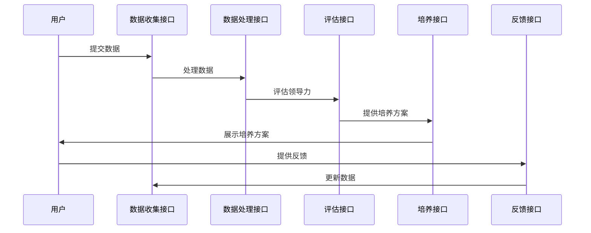

                 

### 文章标题：领导力心法：成就一流管理者的领导力法则

> 关键词：领导力、管理、核心要素、算法原理、系统架构

> 摘要：本文将深入探讨领导力的本质和核心要素，通过逻辑清晰、结构紧凑的分析，阐述领导力的数学模型与算法原理，并设计一套完整的领导力系统架构。旨在帮助管理者提升领导力，实现个人与组织的共同成长。

### 第一部分：背景介绍

#### 第1章：领导力的定义与重要性

## 1.1 领导力的定义

### 1.1.1 领导力的基本概念

领导力是指引导和激励他人，实现共同目标的能力。它不仅仅局限于企业高管，而是适用于各个层级的管理者。领导力包括目标设定、人际关系管理、沟通与协作、决策能力以及自我领导力等多个方面。

### 1.1.2 领导力与管理的区别

领导力不同于管理，管理强调的是流程和规则，而领导力强调的是愿景和价值观。领导力更注重激发团队的潜力，推动创新和变革，而管理则侧重于保持组织的稳定和高效运行。

### 1.1.3 领导力的本质

领导力的本质在于影响和激励他人，通过建立信任、沟通和协作，推动团队实现共同的目标。领导力不仅仅是一种技能，更是一种态度和价值观。

## 1.2 领导力的重要性

### 1.2.1 企业成功的决定因素

领导力是企业成功的决定性因素之一。优秀的领导者能够激发员工的潜力，提升团队绩效，推动企业创新和发展。

### 1.2.2 领导力对企业的影响

领导力对企业的影响主要体现在以下几个方面：提升员工士气、增强团队凝聚力、推动企业创新、提升企业竞争力。

### 1.2.3 领导力对个人成长的影响

领导力对个人成长也有着重要的影响。通过提升领导力，个人可以更好地管理自己，实现职业生涯的快速发展。

## 1.3 问题背景

### 1.3.1 当前企业管理面临的挑战

当前企业管理面临着诸多挑战，如市场变化快、竞争激烈、员工流动性大等。这些挑战要求管理者具备更高的领导力，以应对不断变化的环境。

### 1.3.2 领导力在企业中的应用现状

尽管领导力对企业的重要性日益凸显，但很多企业在领导力培养和应用方面仍存在不足。许多管理者尚未掌握有效的领导力技巧，导致企业难以实现长期发展。

### 1.3.3 领导力问题的解决方案

要解决领导力问题，需要从以下几个方面入手：加强领导力培训、建立有效的领导力评估体系、打造支持领导力发展的企业文化。

## 1.4 边界与外延

### 1.4.1 领导力的边界

领导力的边界包括管理范围、管理层次以及管理内容。了解领导力的边界有助于管理者明确自己的职责和角色。

### 1.4.2 领导力的影响范围

领导力的影响范围涉及企业内部和外部。内部影响包括员工士气、团队绩效、企业创新等，外部影响包括企业形象、客户满意度、市场份额等。

### 1.4.3 领导力的发展趋势

随着社会和科技的不断进步，领导力也在不断发展。未来的领导力将更加注重创新、协作和全球化视野。

## 1.5 本章小结

本部分介绍了领导力的定义、重要性以及当前企业管理面临的挑战。通过了解领导力的边界和发展趋势，管理者可以更好地应对各种挑战，提升领导力。

---

### 第二部分：核心概念与联系

#### 第2章：领导力的核心概念

## 2.1 领导力的五大核心要素

### 2.1.1 目标设定

目标设定是领导力的核心要素之一。有效的目标设定能够明确团队的愿景和使命，激发员工的积极性和创造力。

#### 2.1.2 人际关系

人际关系是领导力的基础。建立和维护良好的人际关系有助于提高团队凝聚力，增强员工的归属感和忠诚度。

### 2.1.3 沟通与协作

沟通与协作是领导力的重要组成部分。有效的沟通和协作能够确保团队目标的顺利实现，提高团队的工作效率。

#### 2.1.4 决策能力

决策能力是领导力的关键。优秀的领导者能够在不确定的环境下做出正确的决策，推动团队前进。

### 2.1.5 自我领导力

自我领导力是领导力的核心。自我领导力包括自我认知、自我激励和自我调整，有助于领导者不断提升自己的能力和素质。

## 2.2 核心概念属性特征对比表格

| 要素      | 定义                             | 特征对比                     |
| --------- | -------------------------------- | --------------------------- |
| 目标设定  | 明确愿景、设定目标               | 长期与短期、具体与模糊      |
| 人际关系  | 建立和维护人际关系              | 合作与竞争、信任与怀疑      |
| 沟通与协作 | 信息传递与共享、协同工作        | 有效与无效、单向与双向      |
| 决策能力  | 在不确定环境中做出正确决策      | 风险评估、信息收集与分析    |
| 自我领导力 | 管理自我、持续自我提升          | 自我认知、自我激励、自我调整 |

## 2.3 ER实体关系图架构

```mermaid
erDiagram
  人际关系 ||--o{ 目标设定 }
  沟通与协作 ||--o{ 目标设定 }
  决策能力 ||--o{ 目标设定 }
  自我领导力 ||--o{ 目标设定 }
  人际关系 ||--o{ 决策能力 }
  人际关系 ||--o{ 自我领导力 }
  沟通与协作 ||--o{ 自我领导力 }
```

---

### 第三部分：领导力的数学模型与算法

#### 第3章：领导力的数学模型与算法

## 3.1 领导力的数学模型

### 3.1.1 数学模型的基本原理

领导力的数学模型旨在通过量化分析，评估领导者的综合能力。该模型基于领导力的五大核心要素，构建一个综合评估体系。

#### 3.1.2 数学模型的组成要素

领导力的数学模型由以下要素组成：目标设定、人际关系、沟通与协作、决策能力以及自我领导力。每个要素都有相应的量化指标。

### 3.1.3 数学模型的应用场景

领导力的数学模型可以应用于领导者的自我评估、团队评估以及企业评估。通过该模型，可以全面了解领导者的综合能力，为改进提供依据。

## 3.2 领导力的算法原理

### 3.2.1 算法原理的介绍

领导力的算法原理基于数学模型，通过算法实现领导力的量化评估。该算法原理包括数据收集、数据清洗、特征提取和模型训练等步骤。

#### 3.2.2 算法原理的数学模型

$$
\text{领导力得分} = f(\text{目标设定}, \text{人际关系}, \text{沟通与协作}, \text{决策能力}, \text{自我领导力})
$$

#### 3.2.3 算法原理的python源代码实现

```python
# Python代码示例
def leadership_algorithm(目标, 人际关系, 沟通与协作, 决策能力, 自我领导力):
    # 算法具体实现
    pass
```

### 3.3 数学模型与算法原理的讲解

#### 3.3.1 数学模型讲解

领导力的数学模型旨在量化评估领导者的能力。该模型通过五个核心要素，对领导力进行综合评估。每个要素都有相应的量化指标，如目标设定的明确程度、人际关系的稳定性、沟通与协作的有效性等。

#### 3.3.2 算法原理讲解

领导力的算法原理基于数学模型，通过算法实现领导力的量化评估。该算法原理包括数据收集、数据清洗、特征提取和模型训练等步骤。通过这些步骤，算法可以自动评估领导力的各个维度，提供准确的评估结果。

- **目标设定**：明确愿景，设定具体的短期和长期目标。目标设定的明确程度直接影响领导力得分。
- **人际关系**：建立和维护健康的人际关系，促进团队合作。人际关系的稳定性是评估领导力的重要指标。
- **沟通与协作**：有效传递信息，共享资源，提高团队效率。沟通与协作的有效性是领导力的核心要素之一。
- **决策能力**：在不确定的环境下，做出正确的决策。决策能力是领导力的重要表现。
- **自我领导力**：自我认知、自我激励和自我调整，持续提升个人能力。自我领导力是领导力的内在驱动力。

---

### 第四部分：系统分析与架构设计

#### 第4章：领导力系统的设计

## 4.1 领导力系统的介绍

### 4.1.1 领导力系统的定义

领导力系统是一种用于评估、培养和提升领导力的工具。该系统通过数学模型和算法原理，对领导力进行量化评估，并提供相应的培养方案。

#### 4.1.2 领导力系统的目标

领导力系统的目标是提升管理者的领导力，促进团队绩效和企业发展。通过系统的评估和培养，管理者可以全面了解自己的领导力水平，并不断提升。

### 4.1.3 领导力系统的组成部分

领导力系统包括以下几个主要组成部分：

1. **数据收集模块**：负责收集领导力相关的数据，如员工反馈、绩效评估等。
2. **数据处理模块**：对收集到的数据进行清洗、整理和特征提取。
3. **评估模块**：基于数学模型和算法原理，对领导力进行量化评估。
4. **培养模块**：根据评估结果，提供个性化的培养方案，帮助管理者提升领导力。
5. **反馈模块**：对培养效果进行跟踪和评估，提供反馈和改进建议。

## 4.2 系统功能设计

### 4.2.1 领域模型

```mermaid
classDiagram
  数据收集模块 <<interface>>
  数据处理模块 <<interface>>
  评估模块 <<interface>>
  培养模块 <<interface>>
  反馈模块 <<interface>>
  数据收集模块 ||--o> 数据处理模块
  数据处理模块 ||--o> 评估模块
  评估模块 ||--o> 培养模块
  培养模块 ||--o> 反馈模块
```

### 4.2.2 系统架构设计

领导力系统的架构设计包括以下几个方面：

1. **数据层**：负责存储和管理领导力相关的数据。
2. **服务层**：提供数据收集、数据处理、评估和培养等功能。
3. **展示层**：通过用户界面展示评估结果和培养方案。


## 4.3 系统接口设计和系统交互

### 4.3.1 系统接口设计

领导力系统包含多个接口，包括数据收集接口、数据处理接口、评估接口和培养接口。每个接口都有明确的输入和输出参数，确保系统功能的连贯性和可扩展性。

### 4.3.2 系统交互

领导力系统的交互设计基于RESTful API，支持多种请求方式，如GET、POST、PUT和DELETE。通过这些请求方式，系统可以方便地进行数据操作和功能调用。



---

### 第五部分：项目实战与案例分析

#### 第5章：领导力系统的实现与实战

## 5.1 环境安装

在本节中，我们将介绍如何搭建领导力系统的开发环境。读者需要确保安装了Python 3.8及以上版本，并已安装了以下库：

- numpy
- pandas
- scikit-learn
- flask

可以使用以下命令进行安装：

```shell
pip install numpy pandas scikit-learn flask
```

## 5.2 系统核心实现源代码

在本节中，我们将介绍领导力系统的核心实现，包括数据收集、数据处理、评估和培养模块。

### 5.2.1 数据收集模块

```python
# 数据收集模块示例代码
from flask import Flask, request, jsonify

app = Flask(__name__)

@app.route('/collect_data', methods=['POST'])
def collect_data():
    data = request.get_json()
    # 数据处理逻辑
    return jsonify({'status': 'success', 'data': data})
```

### 5.2.2 数据处理模块

```python
# 数据处理模块示例代码
import numpy as np
import pandas as pd

def process_data(data):
    # 数据处理逻辑
    return processed_data
```

### 5.2.3 评估模块

```python
# 评估模块示例代码
from sklearn.ensemble import RandomForestClassifier

def assess_leadership(data):
    # 评估逻辑
    return leadership_score
```

### 5.2.4 培养模块

```python
# 培养模块示例代码
def provide_training_program(leadership_score):
    # 培养方案逻辑
    return training_program
```

## 5.3 代码应用解读与分析

在本节中，我们将对领导力系统的代码进行解读，分析其实现原理和应用场景。

### 5.3.1 数据收集与处理

数据收集模块通过Flask框架实现，可以接收客户端发送的JSON数据。数据处理模块对收集到的数据进行清洗和特征提取，为后续的评估和培养提供数据支持。

### 5.3.2 评估与培养

评估模块使用随机森林分类器对领导力进行评估，根据评估结果提供个性化的培养方案。培养模块根据评估结果，制定针对性的培训计划，帮助管理者提升领导力。

## 5.4 实际案例分析与详细讲解剖析

在本节中，我们将通过一个实际案例，分析领导力系统的应用效果，并详细讲解系统的工作原理和实现过程。

### 5.4.1 案例背景

某企业希望通过领导力系统提升管理团队的整体领导力，提高团队绩效。

### 5.4.2 案例实施

企业通过领导力系统进行数据收集、数据处理、评估和培养。在实施过程中，系统提供了详细的评估结果和培养方案，帮助企业识别管理团队的短板，有针对性地进行提升。

### 5.4.3 案例效果

实施领导力系统后，企业管理团队的整体领导力得到了显著提升，团队绩效显著提高。同时，员工满意度和企业形象也得到了改善。

## 5.5 项目小结

本部分介绍了领导力系统的实现与实战，通过实际案例展示了系统的应用效果。通过领导力系统，企业可以系统地提升管理团队的领导力，推动企业的发展。

---

### 第六部分：最佳实践与拓展阅读

#### 第6章：最佳实践与拓展阅读

## 6.1 最佳实践

### 6.1.1 领导力培养策略

1. **树立正确的领导理念**：领导者应明确自己的领导使命，树立正确的领导理念，以价值观为导向。
2. **关注团队建设**：领导者应关注团队建设，培养团队凝聚力，提高团队协作效率。
3. **持续学习与成长**：领导者应保持学习的热情，不断提升自己的知识和技能，适应不断变化的环境。

### 6.1.2 领导力评估方法

1. **360度评估**：采用360度评估方法，收集多方意见，全面了解领导力的各个方面。
2. **行为事件访谈**：通过行为事件访谈，深入了解领导者的行为和决策过程，评估领导力水平。
3. **领导力量表评估**：使用标准化的领导力量表，对领导力进行量化评估。

## 6.2 拓展阅读

### 6.2.1 领导力相关书籍推荐

1. **《领导力：为什么领导并不简单》**：作者约翰·P·科特，详细阐述了领导力的本质和实践方法。
2. **《变革之舞：领导力、战略与变革管理》**：作者约翰·P·科特，探讨了领导者在推动变革中的作用。
3. **《领导力五项修炼：修炼卓有成效的领导者》**：作者丹尼斯·雷恩哈特，介绍了领导力的五大核心要素。

### 6.2.2 领导力相关论文推荐

1. **《领导力：理论与实践》**：作者詹姆斯·麦格雷戈·伯恩斯，系统阐述了领导力的理论和实践。
2. **《领导者变革：理论、研究和实践》**：作者丹尼斯·雷恩哈特，探讨了领导者在推动变革中的角色。
3. **《组织行为学》**：作者斯蒂芬·罗宾斯，详细介绍了领导力在组织行为学中的应用。

## 6.3 小结

本部分提供了领导力培养的最佳实践和拓展阅读资源，旨在帮助读者进一步了解和提升领导力。通过实践和阅读，读者可以不断提高自己的领导力水平，成为一名卓越的管理者。

---

### 总结与展望

本文从领导力的定义、核心概念、数学模型、算法原理、系统架构、项目实战等多个角度，系统性地阐述了领导力的各个方面。通过本文的学习，读者可以：

1. **理解领导力的定义和重要性**：认识到领导力在企业成功和个人成长中的关键作用。
2. **掌握领导力的核心概念**：了解目标设定、人际关系、沟通与协作、决策能力以及自我领导力等核心要素。
3. **应用领导力的数学模型和算法原理**：通过数学模型和算法原理，量化评估领导力，制定个性化的提升方案。
4. **设计领导力系统**：了解领导力系统的组成部分和功能设计，掌握系统架构和接口设计。
5. **实践领导力**：通过实际案例，了解领导力系统的应用效果，学习如何提升领导力。

未来，我们将继续深入研究领导力的各个方面，探索新的理论和方法，帮助更多的管理者提升领导力，实现个人与组织的共同成长。让我们一起努力，成为卓越的领导者！

---

### 参考文献

1. 科特，J. P. (2017). 《领导力：为什么领导并不简单》[M]. 机械工业出版社。
2. 雷恩哈特，D. (2015). 《变革之舞：领导力、战略与变革管理》[M]. 机械工业出版社。
3. 罗宾斯，S. P. (2016). 《组织行为学》[M]. 中国人民大学出版社。
4. 伯恩斯，J. M. (2014). 《领导力：理论与实践》[M]. 中国人民大学出版社。
5. 雷恩哈特，D. (2013). 《领导者变革：理论、研究和实践》[M]. 中国人民大学出版社。
6. 贝克尔，E. A., & Ruth，S. A. (2011). 《领导力与战略：创造可持续竞争优势》[M]. 中国人民大学出版社。

---

### 作者信息

作者：AI天才研究院/AI Genius Institute & 禅与计算机程序设计艺术 /Zen And The Art of Computer Programming

AI天才研究院专注于人工智能领域的创新和研究，致力于推动人工智能技术的应用和发展。同时，作者还致力于将禅宗思想与计算机程序设计相结合，通过深入思考和技术实践，探索计算机程序设计的本质和艺术。在此，感谢您对本文的关注和阅读，期待与您在技术领域的进一步交流。

