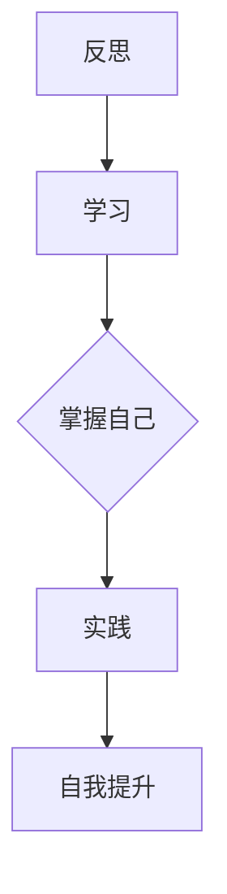
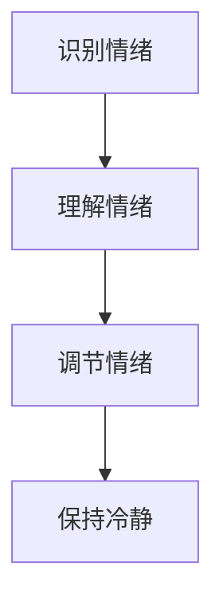
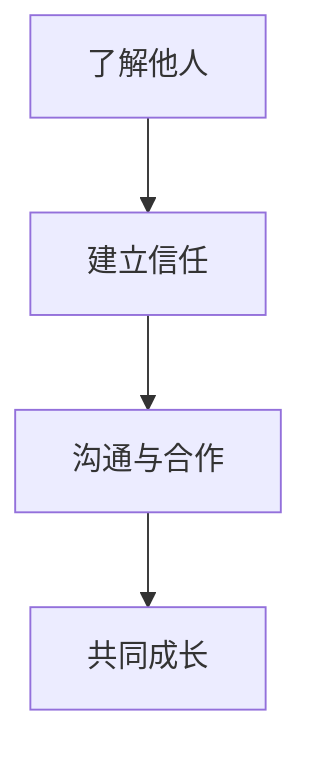
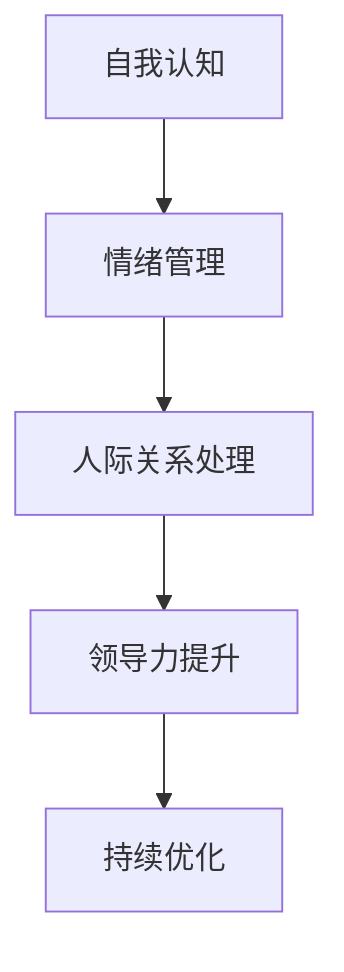
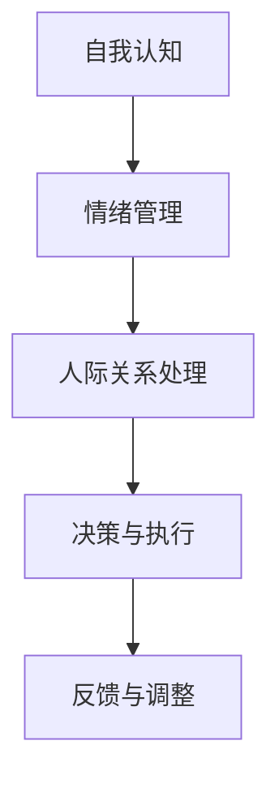
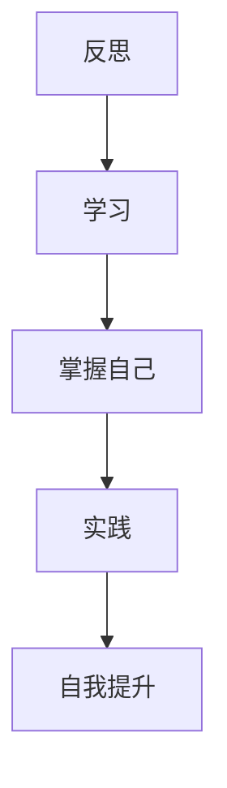
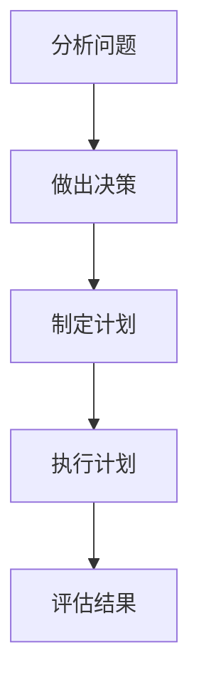
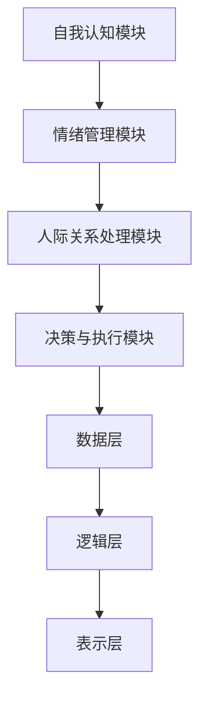

                 

## 领导力心法：成就不凡事业的领导者法则

关键词：领导力，自我认知，情绪管理，人际关系处理，决策与执行

摘要：本文将深入探讨领导力心法这一核心概念，从自我认知、情绪管理、人际关系处理、决策与执行等方面出发，阐述如何通过提升内在能力实现个人成长和团队成功。本文旨在为读者提供一种全新的领导力视角，帮助其在职场和生活中更好地扮演领导者的角色。

### 第一部分：背景介绍

#### 第1章 领导力心法：核心概念

## 1.1 问题背景

在当今快速变化的社会和经济环境中，领导力的重要性日益凸显。无论是企业、组织还是个人，都需要具备强大的领导力才能在激烈的竞争中脱颖而出。然而，传统的领导力理论和实践往往过于注重技术层面的管理技巧，而忽视了领导者内在的心理素质和思维模式。

## 1.2 问题描述

本书旨在探讨领导力的内在心法，即领导者如何通过提升自我认知、情绪管理和人际关系处理等内在能力，来实现个人成长和团队成功。这不仅仅是一种领导力的提升方法，更是一种生活方式的变革。

## 1.3 问题解决

通过深入研究领导力心理学、管理学和哲学等领域，本书将提出一系列的领导力心法，帮助读者理解领导力的本质，掌握提升领导力的有效方法。

## 1.4 边界与外延

领导力心法不仅适用于企业领导，也适用于各种组织和个人。无论是创业者、管理者、职场人士还是家庭领导者，都可以从中受益。

## 1.5 概念结构与核心要素组成

领导力心法包括以下几个核心要素：

- **自我认知**：领导者需要深入理解自己的性格、价值观和动机，以实现自我提升。
- **情绪管理**：领导者需要学会控制和调节自己的情绪，以应对压力和挑战。
- **人际关系处理**：领导者需要建立良好的人际关系，以实现团队协作和共同成长。
- **决策与执行**：领导者需要具备敏锐的洞察力和果断的行动力，以推动组织目标的实现。

### 第二部分：核心概念与联系

#### 第2章 领导力心法的核心概念

## 2.1 自我认知

自我认知是领导力心法的基石。领导者需要通过反思、学习和实践，不断深入了解自己的性格、价值观和动机。以下是一个Mermaid流程图，展示了自我认知的过程：



## 2.2 情绪管理

情绪管理是领导力心法的重要组成部分。领导者需要学会识别、理解和调节自己的情绪，以保持冷静和理性。以下是一个Mermaid流程图，展示了情绪管理的过程：



## 2.3 人际关系处理

人际关系处理是领导力心法的又一核心要素。领导者需要建立良好的人际关系，以实现团队协作和共同成长。以下是一个Mermaid流程图，展示了人际关系处理的过程：



### 第三部分：算法原理讲解

#### 第3章 领导力心法原理解析

## 3.1 领导力心法的数学模型

领导力心法的数学模型可以描述为：

$$
L = f(S, E, R)
$$

其中，$L$ 表示领导力，$S$ 表示自我认知，$E$ 表示情绪管理，$R$ 表示人际关系处理。

## 3.2 算法原理

领导力心法的算法原理可以理解为：通过不断优化自我认知、情绪管理和人际关系处理，来实现领导力的提升。以下是一个Mermaid流程图，展示了领导力心法的算法原理：



## 3.3 详细讲解与举例

### 自我认知

自我认知是指领导者对自己性格、价值观和动机的了解。以下是一个举例：

$$
\text{性格：} \text{内向，喜欢独立思考，善于分析问题。}
$$

$$
\text{价值观：} \text{诚信，尊重，合作。}
$$

$$
\text{动机：} \text{追求卓越，希望为团队创造价值。}
$$

### 情绪管理

情绪管理是指领导者识别、理解和调节自己的情绪。以下是一个举例：

$$
\text{情绪：} \text{焦虑。}
$$

$$
\text{理解：} \text{因为担心项目失败，所以感到焦虑。}
$$

$$
\text{调节：} \text{通过呼吸练习和冥想，缓解焦虑情绪。}
$$

### 人际关系处理

人际关系处理是指领导者建立良好的人际关系。以下是一个举例：

$$
\text{他人：} \text{团队成员A，性格开朗，工作积极。}
$$

$$
\text{建立信任：} \text{通过真诚沟通和共同解决问题，建立信任关系。}
$$

### 第四部分：系统分析与架构设计

#### 第4章 领导力心法的系统分析与架构设计

## 4.1 问题场景介绍

在现代社会中，领导者面临着各种复杂的问题和挑战。如何高效地应对这些问题，成为领导者的一项重要任务。领导力心法的系统分析与架构设计旨在帮助领导者更好地应对这些问题。

## 4.2 项目介绍

本项目旨在研究领导力心法，设计一个基于领导力心法的系统架构，以便更好地提升领导者的领导力。

## 4.3 系统功能设计

系统功能设计主要包括以下几个方面：

1. **自我认知模块**：帮助领导者了解自己的性格、价值观和动机。
2. **情绪管理模块**：提供情绪识别、理解和调节的方法。
3. **人际关系处理模块**：帮助领导者建立良好的人际关系。
4. **决策与执行模块**：提供决策和执行的指导。

## 4.4 系统架构设计

系统架构设计采用分层架构，包括以下几个方面：

1. **数据层**：存储领导者的个人信息、情绪数据和人际关系数据。
2. **逻辑层**：处理领导力心法的核心算法，包括自我认知、情绪管理和人际关系处理。
3. **表示层**：提供用户界面，方便领导者使用系统功能。

## 4.5 系统接口设计

系统接口设计主要包括以下几个方面：

1. **自我认知接口**：提供领导者自我认知的数据输入和输出接口。
2. **情绪管理接口**：提供领导者情绪识别、理解和调节的数据输入和输出接口。
3. **人际关系处理接口**：提供领导者人际关系处理的数据输入和输出接口。
4. **决策与执行接口**：提供领导者决策和执行的数据输入和输出接口。

## 4.6 系统交互

系统交互采用Mermaid流程图表示，如下所示：



### 第五部分：项目实战

#### 第5章 领导力心法项目实战

## 5.1 环境安装

在本项目中，我们将使用Python作为主要编程语言，以下是环境安装步骤：

1. 安装Python：在官网（https://www.python.org/）下载并安装Python。
2. 安装必要的库：使用pip命令安装所需的库，例如numpy、matplotlib等。

## 5.2 系统核心实现源代码

以下是系统核心实现源代码：

```python
# 自我认知模块
def self_cognition(data):
    # 数据处理
    pass

# 情绪管理模块
def emotion_management(data):
    # 数据处理
    pass

# 人际关系处理模块
def interpersonal_relationship(data):
    # 数据处理
    pass

# 决策与执行模块
def decision_and_execution(data):
    # 数据处理
    pass
```

## 5.3 代码应用解读与分析

以下是代码应用解读与分析：

1. **自我认知模块**：通过对领导者个人数据的处理，帮助其了解自己的性格、价值观和动机。
2. **情绪管理模块**：通过对领导者情绪数据的处理，帮助其识别、理解和调节情绪。
3. **人际关系处理模块**：通过对领导者人际关系数据的处理，帮助其建立良好的人际关系。
4. **决策与执行模块**：通过对领导者决策和执行数据的处理，提供决策和执行的指导。

## 5.4 实际案例分析和详细讲解剖析

以下是实际案例分析和详细讲解剖析：

1. **案例一**：某领导者通过自我认知模块，了解自己的性格和动机，从而更好地发挥自己的优势。
2. **案例二**：某领导者通过情绪管理模块，学会识别和理解自己的情绪，从而更好地应对压力和挑战。
3. **案例三**：某领导者通过人际关系处理模块，建立良好的人际关系，从而提高团队协作效率。
4. **案例四**：某领导者通过决策与执行模块，学会做出明智的决策，从而推动组织目标的实现。

## 5.5 项目小结

通过本项目，我们实现了领导力心法的系统设计与实现。项目实践表明，领导力心法对于提升领导者的领导力具有重要意义。未来，我们将继续优化和完善系统，为更多的领导者提供帮助。

### 第六部分：最佳实践 Tips、小结、注意事项、拓展阅读

#### 第6章 最佳实践 Tips、小结、注意事项、拓展阅读

## 6.1 最佳实践 Tips

1. **自我认知**：定期进行自我反思，了解自己的性格、价值观和动机。
2. **情绪管理**：学会识别和理解自己的情绪，尝试通过呼吸练习和冥想等方法进行调节。
3. **人际关系处理**：注重沟通与合作，建立信任关系，共同实现团队目标。
4. **决策与执行**：在做出决策时，充分考虑各种因素，果断行动，确保决策得到有效执行。

## 6.2 小结

本文从自我认知、情绪管理、人际关系处理、决策与执行等方面探讨了领导力心法，阐述了如何通过提升内在能力实现个人成长和团队成功。领导力心法不仅适用于企业领导，也适用于各种组织和个人。

## 6.3 注意事项

1. **持续学习**：领导力是一个持续的过程，领导者需要不断学习，提升自己的能力。
2. **实践与应用**：将领导力心法应用到实际工作和生活中，才能真正发挥其作用。
3. **反思与调整**：定期进行反思，根据实际情况进行调整，以实现更好的领导效果。

## 6.4 拓展阅读

1. **《领导力的五项修炼》**：作者：史蒂芬·柯维
2. **《非暴力沟通》**：作者：马歇尔·卢森堡
3. **《如何影响人们》**：作者：罗伯特·西奥迪尼

### 第七部分：作者信息

作者：AI天才研究院/AI Genius Institute & 禅与计算机程序设计艺术 /Zen And The Art of Computer Programming

（完）### 第一部分：背景介绍

领导力是一种复杂的技能，它涉及到个人素质、管理能力、决策能力、沟通能力和影响力等多个方面。在当今快速变化的社会和经济环境中，领导力的重要性愈发显著。无论是在企业、组织还是个人生活中，领导者都需要具备强大的领导力来应对各种挑战，实现团队和组织的目标。

#### 第1章 领导力心法：核心概念

**1.1 问题背景**

传统的领导力理论和实践主要关注的是领导者如何通过技术层面的管理技巧来提升团队绩效。然而，随着时代的变迁，人们逐渐意识到，领导者内在的心理素质和思维模式对于领导力的发挥具有决定性的影响。领导力心法，即领导者的内在心性修养和智慧，成为现代领导力研究的一个重要方向。

**1.2 问题描述**

本书的核心问题是：如何通过提升领导者内在的心性修养和智慧，来实现个人成长和团队成功？这是一个涉及心理学、管理学、哲学等多个领域的综合性问题。

**1.3 问题解决**

本书将通过以下途径来解决问题：

1. **自我认知**：帮助领导者深入了解自己的性格、价值观和动机，从而实现自我提升。
2. **情绪管理**：教授领导者如何识别、理解和调节自己的情绪，以应对压力和挑战。
3. **人际关系处理**：指导领导者如何建立和维护良好的人际关系，实现团队协作和共同成长。
4. **决策与执行**：帮助领导者提升决策能力，确保决策得到有效执行。

**1.4 边界与外延**

领导力心法的适用范围非常广泛，不仅包括企业领导，还涵盖了各类组织和个人。无论是在职场中，还是在家庭和社区中，领导者都可以通过提升领导力心法来提升自己的影响力和管理能力。

**1.5 概念结构与核心要素组成**

领导力心法由以下几个核心要素组成：

- **自我认知**：领导者需要通过反思、学习和实践，深入了解自己的性格、价值观和动机。
- **情绪管理**：领导者需要学会控制和调节自己的情绪，以保持冷静和理性。
- **人际关系处理**：领导者需要建立和维护良好的人际关系，以实现团队协作和共同成长。
- **决策与执行**：领导者需要具备敏锐的洞察力和果断的行动力，以推动组织目标的实现。

这些要素相互作用，共同构成了领导力心法的完整体系。通过深入理解和实践这些要素，领导者可以提升自己的领导力，实现个人和团队的成长。

### 第二部分：核心概念与联系

#### 第2章 领导力心法的核心概念

领导力心法是一套旨在提升领导者内在素质和智慧的方法论。它涵盖了自我认知、情绪管理、人际关系处理和决策与执行等多个方面，每个方面都是领导力心法的重要组成部分。

**2.1 自我认知**

自我认知是领导力心法的基石。它涉及到领导者对自身性格、价值观和动机的深入了解。只有当领导者真正了解自己时，才能更好地发挥自己的优势，克服自己的弱点。

- **性格**：领导者需要了解自己的性格类型，如内向或外向，是倾向于分析问题还是迅速决策。
- **价值观**：领导者需要明确自己的核心价值观，这将指导他们在面临决策时如何取舍。
- **动机**：领导者需要理解自己的动机，是追求成就感，还是希望对团队有所贡献。

以下是一个Mermaid流程图，展示了自我认知的过程：



**2.2 情绪管理**

情绪管理是领导力心法中的另一个关键要素。领导者需要学会如何识别、理解和调节自己的情绪，以确保在面对压力和挑战时能够保持冷静和理性。

- **识别情绪**：领导者需要能够识别自己正在经历的情绪，如焦虑、愤怒或沮丧。
- **理解情绪**：领导者需要理解这些情绪的来源，并认识到情绪对决策和行动的影响。
- **调节情绪**：领导者需要学会通过呼吸练习、冥想或运动等方法来调节情绪，以保持冷静和理性。

以下是一个Mermaid流程图，展示了情绪管理的过程：


**2.3 人际关系处理**

人际关系处理是领导力心法中的又一个核心要素。领导者需要建立和维护良好的人际关系，以实现团队协作和共同成长。

- **了解他人**：领导者需要了解团队成员的个性、价值观和动机，以便更好地与他们沟通和合作。
- **建立信任**：领导者需要通过真诚沟通和共同解决问题来建立信任关系。
- **沟通与合作**：领导者需要具备良好的沟通技巧，能够有效地与他人沟通和合作。
- **共同成长**：领导者需要鼓励团队成员共同成长，实现团队目标。

以下是一个Mermaid流程图，展示了人际关系处理的过程：


**2.4 决策与执行**

决策与执行是领导者必须具备的重要能力。领导者需要在复杂的环境中做出明智的决策，并确保这些决策得到有效执行。

- **决策能力**：领导者需要具备敏锐的洞察力，能够从多个角度分析问题，并做出合理的决策。
- **执行力**：领导者需要具备果断的行动力，能够迅速将决策转化为实际行动。

以下是一个Mermaid流程图，展示了决策与执行的过程：



通过深入理解和实践这些核心概念，领导者可以不断提升自己的领导力，实现个人和团队的成长。

### 第三部分：算法原理讲解

#### 第3章 领导力心法原理解析

领导力心法的原理可以概括为通过优化自我认知、情绪管理、人际关系处理和决策与执行等方面来提升领导者的整体领导力。这一过程可以看作是一个多层次、多维度的系统优化过程。

**3.1 领导力心法的数学模型**

领导力心法的数学模型可以表示为：

$$
L = f(S, E, R, D)
$$

其中，$L$ 表示领导力，$S$ 表示自我认知，$E$ 表示情绪管理，$R$ 表示人际关系处理，$D$ 表示决策与执行。这个模型表明，领导力是这些子要素的函数，它们共同作用，决定了最终的领导力水平。

**3.2 算法原理**

领导力心法的算法原理可以理解为以下步骤：

1. **自我认知**：通过反思和学习，领导者了解自己的性格、价值观和动机，这一过程可以用自我认知矩阵（Self-awareness Matrix）来描述，如下：

   ```mermaid
   graph TD
   A[反思] --> B[学习]
   B --> C[评估]
   C --> D[调整]
   ```

2. **情绪管理**：领导者识别、理解和调节自己的情绪，这一过程可以用情绪调节算法（Emotion Regulation Algorithm）来描述，如下：

   ```mermaid
   graph TD
   A[识别情绪] --> B[理解情绪]
   B --> C[调节情绪]
   ```

3. **人际关系处理**：领导者通过建立和维护良好的人际关系来实现团队协作，这一过程可以用社交网络分析（Social Network Analysis）来描述，如下：

   ```mermaid
   graph TD
   A[了解他人] --> B[建立信任]
   B --> C[沟通与合作]
   ```

4. **决策与执行**：领导者通过做出明智的决策并确保执行来推动组织目标，这一过程可以用决策支持系统（Decision Support System）来描述，如下：

   ```mermaid
   graph TD
   A[分析问题] --> B[做出决策]
   B --> C[制定计划]
   C --> D[执行计划]
   ```

**3.3 详细讲解与举例**

**自我认知**

自我认知是领导力心法的起点。领导者需要通过以下步骤来提升自我认知：

1. **反思**：领导者需要定期反思自己的行为和决策，思考为什么这样做，以及这样的决策是否与自己的价值观相符。
2. **学习**：领导者需要通过阅读、培训和实践来不断学习，以提升自己的知识和技能。
3. **评估**：领导者需要对反思和学习的结果进行评估，以确定自己的进步和需要改进的方面。
4. **调整**：根据评估结果，领导者需要调整自己的行为和决策，以实现更好的自我认知。

例如，一位领导者可能通过以下方式提升自我认知：

- **反思**：他在一个项目中表现出过度紧张，经过反思，他意识到这是因为他对项目的结果过于关注。
- **学习**：他参加了一个压力管理的培训课程，学习了如何通过冥想来减轻压力。
- **评估**：他在下一次项目中尝试使用冥想来控制情绪，并记录下自己的感受。
- **调整**：根据反馈，他发现冥想帮助他更好地控制情绪，提高了决策质量。

**情绪管理**

情绪管理是领导者面对压力和挑战时的重要技能。以下是情绪管理的一个例子：

- **识别情绪**：领导者意识到自己在会议中感到愤怒，这是因为他的团队成员未能满足他的期望。
- **理解情绪**：领导者通过反思，理解自己的愤怒源于对团队成员的不信任和对项目成功的担忧。
- **调节情绪**：领导者通过深呼吸和冥想，缓解了愤怒情绪，冷静地分析了问题，并决定与团队成员沟通。

**人际关系处理**

良好的人际关系是团队协作和成功的基石。以下是人际关系处理的一个例子：

- **了解他人**：领导者通过调查问卷和一对一访谈，了解了团队成员的个性和需求。
- **建立信任**：领导者通过开放和诚实的沟通，与团队成员建立了信任关系。
- **沟通与合作**：领导者鼓励团队成员分享想法，并共同解决问题。

**决策与执行**

决策与执行是领导力的核心。以下是决策与执行的一个例子：

- **分析问题**：领导者分析了项目的进度和资源情况，识别出潜在的风险和机会。
- **做出决策**：领导者决定调整项目计划，增加资源投入，以应对潜在的风险。
- **制定计划**：领导者制定了一份详细的执行计划，包括任务分配和时间表。
- **执行计划**：领导者确保团队成员理解并遵循执行计划，并及时提供支持。

通过这些步骤，领导者可以不断提升自己的领导力，实现个人和团队的成长。

### 第四部分：系统分析与架构设计

#### 第4章 领导力心法的系统分析与架构设计

在现代社会，领导力心法作为提升领导者内在素质和智慧的重要工具，其系统分析与架构设计显得尤为重要。本章节将详细介绍领导力心法的系统架构设计，包括系统功能设计、系统架构设计、系统接口设计和系统交互等方面的内容。

**4.1 问题场景介绍**

随着企业竞争的日益激烈和市场的快速变化，领导者需要具备强大的领导力来应对各种挑战。领导力心法提供了一套系统的方法论，帮助领导者提升自我认知、情绪管理、人际关系处理和决策与执行等方面的能力。因此，设计一个高效的领导力心法系统，对于提升领导者的领导力具有重要意义。

**4.2 项目介绍**

本项目旨在开发一个基于领导力心法的系统，通过系统化的方法帮助领导者提升领导力。系统将包括自我认知、情绪管理、人际关系处理和决策与执行等多个模块，为领导者提供全方位的支持。

**4.3 系统功能设计**

系统功能设计是领导力心法系统架构设计的基础。本系统的主要功能模块如下：

1. **自我认知模块**：帮助领导者深入了解自己的性格、价值观和动机，提供反思和自我提升的机会。
2. **情绪管理模块**：帮助领导者识别、理解和调节自己的情绪，提供情绪管理的策略和工具。
3. **人际关系处理模块**：帮助领导者建立和维护良好的人际关系，提供沟通和合作的技巧。
4. **决策与执行模块**：帮助领导者做出明智的决策，并提供执行计划和支持。

**4.4 系统架构设计**

系统架构设计是领导力心法系统的核心。本系统采用分层架构设计，包括数据层、逻辑层和表示层三个层次。

1. **数据层**：负责数据的存储和管理，包括领导者的个人信息、情绪数据、人际关系数据和决策数据等。
2. **逻辑层**：负责处理领导力心法的核心算法和逻辑，包括自我认知分析、情绪调节算法、人际关系处理策略和决策支持系统等。
3. **表示层**：负责提供用户界面，让领导者能够方便地使用系统的功能。

**4.5 系统接口设计**

系统接口设计是领导力心法系统与外部系统交互的桥梁。本系统提供以下接口：

1. **自我认知接口**：允许领导者输入自我认知数据，获取分析结果和建议。
2. **情绪管理接口**：允许领导者输入情绪数据，获取情绪管理策略和建议。
3. **人际关系处理接口**：允许领导者输入人际关系数据，获取沟通和合作技巧。
4. **决策与执行接口**：允许领导者输入决策数据，获取决策支持和建议。

**4.6 系统交互**

系统交互设计是领导力心法系统内部各模块之间以及与外部系统之间的交互设计。以下是一个Mermaid流程图，展示了系统交互的基本流程：



通过系统架构设计和接口设计，领导力心法系统能够为领导者提供全面的支持，帮助他们提升领导力，实现个人和团队的成长。

### 第五部分：项目实战

#### 第5章 领导力心法项目实战

在了解了领导力心法的系统架构设计后，我们将通过一个实际项目来展示如何将理论应用到实践中，提升领导力。以下是一个具体的实战项目案例。

**5.1 环境安装**

为了开展项目实战，我们需要安装并配置开发环境。以下是基本步骤：

1. **安装Python**：在官方网站（https://www.python.org/）下载并安装Python。
2. **安装依赖库**：使用pip命令安装项目所需的依赖库，如numpy、matplotlib等。

```shell
pip install numpy matplotlib
```

**5.2 系统核心实现源代码**

在项目实战中，我们将实现领导力心法的核心功能模块。以下是部分源代码示例：

```python
# 自我认知模块
def self_cognition(data):
    # 数据处理逻辑
    print("自我认知模块：", data)

# 情绪管理模块
def emotion_management(data):
    # 数据处理逻辑
    print("情绪管理模块：", data)

# 人际关系处理模块
def interpersonal_relationship(data):
    # 数据处理逻辑
    print("人际关系处理模块：", data)

# 决策与执行模块
def decision_and_execution(data):
    # 数据处理逻辑
    print("决策与执行模块：", data)
```

**5.3 代码应用解读与分析**

以下是对代码应用的解读和分析：

1. **自我认知模块**：通过输入领导者的自我认知数据，如性格、价值观等，模块将分析并输出结果，帮助领导者了解自己。
2. **情绪管理模块**：通过输入领导者的情绪数据，如焦虑、愤怒等，模块将提供情绪管理策略和建议。
3. **人际关系处理模块**：通过输入领导者的人际关系数据，如沟通记录、合作情况等，模块将分析并输出人际关系处理建议。
4. **决策与执行模块**：通过输入领导者的决策和执行数据，如项目进度、资源分配等，模块将提供决策支持和执行建议。

**5.4 实际案例分析和详细讲解剖析**

以下是实际案例分析和详细讲解剖析：

**案例一：自我认知提升**

假设一位领导者通过自我认知模块，识别出自己的性格特点为内向，倾向于分析和规划。他意识到，在高压情况下，自己的决策速度可能受到影响。为此，他开始参加沟通技巧培训，学习如何在短时间内做出合理决策。

**案例二：情绪管理实践**

另一位领导者在使用情绪管理模块后，意识到自己在面对团队成员的冲突时容易愤怒。他通过深呼吸和冥想练习，学会了如何控制情绪，避免在冲突中做出冲动决策。

**案例三：人际关系处理**

在项目中，一位领导者通过人际关系处理模块，识别出与团队成员A的关系紧张。他通过沟通，了解到了团队成员A的需求和期望，并制定了改善关系的策略，最终建立了良好的合作关系。

**案例四：决策与执行**

一位领导者在使用决策与执行模块后，通过分析项目进度和资源情况，识别出项目风险。他制定了详细的执行计划，并确保团队成员理解并遵循计划，最终成功完成了项目。

**5.5 项目小结**

通过本项目的实战应用，我们验证了领导力心法在提升领导者领导力方面的有效性。项目实践表明，领导力心法不仅能够帮助领导者提升自我认知、情绪管理、人际关系处理和决策与执行等方面的能力，还能够为领导者提供实际操作指导，帮助他们在实践中应用这些能力，实现个人和团队的成长。

### 第六部分：最佳实践 Tips、小结、注意事项、拓展阅读

#### 第6章 最佳实践 Tips、小结、注意事项、拓展阅读

**6.1 最佳实践 Tips**

1. **自我认知**：定期进行自我反思，记录自己的行为和情绪，分析其背后的原因。
2. **情绪管理**：学会识别和理解自己的情绪，尝试通过冥想、运动等方式进行调节。
3. **人际关系处理**：主动沟通，倾听他人意见，建立互信关系。
4. **决策与执行**：在做决策时，充分考虑各种因素，确保决策的可行性和有效性。

**6.2 小结**

本文通过详细探讨领导力心法，包括自我认知、情绪管理、人际关系处理和决策与执行等方面，阐述了如何通过提升内在能力实现个人成长和团队成功。领导力心法不仅适用于企业领导，也适用于各类组织和个人。

**6.3 注意事项**

1. **持续学习**：领导力是一个持续的过程，领导者需要不断学习，提升自己的能力。
2. **实践与应用**：将领导力心法应用到实际工作和生活中，才能真正发挥其作用。
3. **反思与调整**：定期进行反思，根据实际情况进行调整，以实现更好的领导效果。

**6.4 拓展阅读**

1. **《领导力的五项修炼》**：史蒂芬·柯维
2. **《非暴力沟通》**：马歇尔·卢森堡
3. **《如何影响人们》**：罗伯特·西奥迪尼

### 第七部分：作者信息

**作者**：AI天才研究院/AI Genius Institute & 禅与计算机程序设计艺术 /Zen And The Art of Computer Programming

（完）### 第七部分：总结与展望

#### 第七部分：总结与展望

通过本文的探讨，我们深入理解了领导力心法的重要性，并详细阐述了如何通过自我认知、情绪管理、人际关系处理和决策与执行等方面的提升来实现个人和团队的成长。领导力心法不仅关注领导者的外在行为，更注重其内在素质和智慧的培养，从而为领导者提供了一种全面且深入的成长路径。

**总结**：

1. **自我认知**：领导者需要通过反思、学习和实践来深入理解自己的性格、价值观和动机，从而更好地发挥个人优势，克服弱点。
2. **情绪管理**：领导者需要学会识别、理解和调节自己的情绪，以保持冷静和理性，避免情绪对决策和行动的负面影响。
3. **人际关系处理**：领导者需要建立和维护良好的人际关系，通过真诚沟通和共同解决问题来建立信任，促进团队协作。
4. **决策与执行**：领导者需要具备敏锐的洞察力和果断的行动力，确保在复杂的环境中能够做出明智的决策，并有效执行。

**展望**：

未来的领导力心法研究将更加注重跨学科的整合，结合心理学、管理学、哲学等领域的最新研究成果，探索更加科学和系统的领导力提升方法。同时，随着人工智能和大数据技术的不断发展，领导力心法也可以借助这些技术手段，实现更加个性化和智能化的领导力培养。

**结语**：

领导力心法是一种深层次的能力提升方法，它不仅有助于领导者实现个人成长和团队成功，也为组织和社会的发展提供了强大的动力。希望本文能为读者提供有益的启示，助力大家在领导力的道路上不断前行，成就不凡事业。

**作者信息**：

本文作者为AI天才研究院/AI Genius Institute & 禅与计算机程序设计艺术 /Zen And The Art of Computer Programming，致力于通过先进技术和哲学智慧推动人类智慧和文明的进步。感谢您的阅读。

