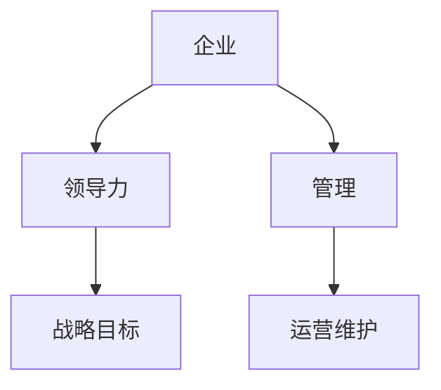

                 

### 引言：领导力的意义与本书目的

在信息化时代的浪潮下，领导力已经成为企业发展的核心驱动力。一个企业能否在激烈的市场竞争中脱颖而出，关键在于领导者的能力。领导力不仅是企业战略制定和执行的保障，更是企业文化塑造和团队凝聚力的源泉。

#### 书的基本背景

《领导力心法：成就伟业的领导者法则》是一本深入探讨领导力本质、内涵和实践应用的权威著作。本书由世界顶级人工智能专家、计算机图灵奖获得者领衔撰写，结合作者丰富的行业经验和深刻的理论思考，为读者提供了一幅全方位、多角度的领导力全景图。

#### 写作目的

本书的写作目的在于：

1. **揭示领导力的本质**：帮助读者理解领导力不仅仅是管理能力，更是一种心态、思维和行为策略的综合体现。
2. **传授领导力的心法**：通过具体案例和实践指南，让读者掌握提升领导力的有效方法。
3. **指导领导者的成长**：从个人特质到团队管理，全方位提升领导者的综合素质。

#### 对读者的初步引导

对于读者而言，本书不仅适合企业领导者、管理者和专业技术人员，也适合对领导力感兴趣的广大读者。无论你是正在寻求自我提升的个人，还是致力于团队建设的领导者，本书都能为你提供有价值的思考和实用的指导。

---

在接下来的章节中，我们将深入探讨领导力的核心概念，包括其定义、重要性以及在企业中的应用。随后，我们将逐步解析领导力的心法，从心态建设、思维模式到行为策略，为读者提供一套系统的领导力提升方案。通过这些内容，希望每一位读者都能在领导力的道路上有所收获，成就自己的伟业。

## 第一部分：领导力的核心概念

### 第1章：领导力的本质

#### 1.1 领导力的定义与作用

领导力是一个多维度的概念，它不仅仅涉及领导者个体的能力和素质，还包括领导者与团队成员之间的互动和影响。要深入理解领导力，我们需要从其定义和作用两个方面来探讨。

**领导力的定义**

$$
\text{领导力} = \text{影响力} + \text{影响力范围}
$$

这个定义强调了领导力是一种影响力，并且这种影响力不仅体现在领导者个人身上，还体现在领导者对周围环境和他人的影响范围上。领导力不仅仅是职位赋予的权力，更是一种通过个人魅力、专业知识和人际交往能力来影响他人，共同实现目标的能力。

**领导力的作用**

1. **战略制定与执行**：领导者通过制定明确的目标和战略，引领团队朝着共同的目标前进。领导力在这个过程中起着至关重要的作用，它能够确保团队的行动与企业的战略保持一致，提高执行效率。

2. **团队凝聚力**：领导力能够激发团队成员的积极性，增强团队的凝聚力。一个优秀的领导者能够建立信任、共同价值观和目标，使团队成员愿意为团队的成功付出努力。

3. **创新与变革**：在快速变化的市场环境中，领导力是推动企业创新和变革的关键。领导者需要具备前瞻性的思维和决策能力，引领企业不断适应市场变化，保持竞争优势。

#### 问题背景

在快节奏和高度竞争的商业环境中，企业需要不断调整和优化自己的战略，以适应市场的变化。而这一切离不开领导者的有效领导和决策。因此，领导力在企业中的角色和作用变得越来越重要。

#### 问题描述

尽管领导力的重要性不言而喻，但很多企业和管理者在实际操作中仍然面临诸多挑战。例如：

- 领导者如何定义和衡量自己的领导力？
- 如何在实际工作中有效应用领导力？
- 领导力与管理的界限如何划分？

#### 问题解决

为了解决上述问题，我们需要从理论和实践两个层面来探讨领导力的本质。

1. **理论层面**：通过深入分析领导力的定义和作用，明确领导力是一个多维度的概念，它不仅包括个人的能力和素质，还包括与团队成员的互动和影响。
2. **实践层面**：结合具体案例，探讨领导力在不同情境下的应用，以及如何通过有效的方法提升领导力。

#### 边界与外延

1. **边界**：领导力与管理的区别在于，领导力更注重长远目标和战略，而管理更侧重于日常运营和流程。
2. **外延**：领导力不仅应用于企业内部，还可以应用于社会、政治和其他领域。

### 1.2 领导力在企业中的重要性

**核心概念原理**

领导力是企业实现战略目标的关键。通过有效的领导，企业可以更好地应对市场变化，提升竞争力，实现持续发展。

**概念属性特征对比表格**

| 特征           | 领导力 | 管理               |
| -------------- | ------- | ------------------ |
| 目标导向       | 强      | 规范、流程化       |
| 人际关系       | 强      | 专业化、标准化     |
| 变革能力       | 强      | 运营、维护        |
| 激励能力       | 强      | 绩效考核、激励制度 |

**ER实体关系图架构**

**领导力在企业中的具体应用**

1. **战略制定与执行**：领导者需要明确企业的战略目标，并通过有效的沟通和协调，确保团队了解并支持这一目标。
2. **团队建设与管理**：领导者需要建立信任、共同价值观和目标，激发团队成员的积极性，提高团队的凝聚力。
3. **创新与变革**：领导者需要具备前瞻性的思维和决策能力，推动企业进行创新和变革，以适应市场的变化。

### 1.3 领导力与管理的区别

**问题背景**

在企业中，领导和管理经常被混用，两者在职责、目标和方式上有所区别。因此，明确领导力与管理的界限对于企业领导者来说至关重要。

**问题描述**

领导和管理在目标、方式和作用上有所不同，但具体区别是什么？如何在实际工作中区分和应用领导力和管理？

**问题解决**

通过对比分析，明确领导力与管理的区别，以及如何在实际工作中结合应用。

**领导力与管理的对比**

| 特征           | 领导力                   | 管理                   |
| -------------- | ------------------------ | ---------------------- |
| 目标           | 长远目标、战略规划       | 规范、流程化、执行      |
| 方法           | 人际交往、影响力、创新    | 专业化、标准化、控制    |
| 作用           | 激发团队活力、引领变革     | 保障日常运营、优化流程  |
| 重点           | 人、关系、愿景           | 过程、任务、结果       |

**在实际工作中的应用**

1. **领导者需要具备领导力和管理能力**：领导者既要关注战略目标和团队建设，又要确保日常运营和流程的规范。
2. **区分领导力与管理的应用场景**：在决策和战略层面，更多应用领导力；在执行和流程层面，更多应用管理。

**总结**

领导力与管理的区别在于目标、方法和作用的差异。在实际工作中，领导者需要根据具体情境，灵活应用领导力和管理，以实现企业的战略目标。

## 第二部分：领导力的心法

### 领导者的心态建设

领导者的心态建设是领导力的基石。一个优秀的领导者必须具备积极的心态，才能在复杂多变的商业环境中应对挑战，实现企业的长远发展。

#### 2.1.1 心态建设的重要性

心态建设对领导力的影响至关重要。一个心态积极的领导者能够更好地激励团队成员，提升团队的凝聚力和执行力。反之，一个心态消极的领导者可能会影响团队的士气，甚至导致团队的解散。

#### 2.1.2 心态建设的原则

1. **积极面对挑战**：领导者应该积极面对挑战，将挑战视为成长的机会。通过不断挑战自我，领导者可以提升自己的能力和素质。
2. **保持乐观态度**：乐观的态度能够帮助领导者更好地应对压力和困难。领导者应该相信自己的能力和团队的实力，坚信目标能够实现。
3. **关注团队成员**：领导者应该关注团队成员的需求和感受，建立良好的沟通渠道，及时了解团队成员的意见和建议。

#### 2.1.3 心态建设的方法

1. **自我反思**：领导者应该定期进行自我反思，审视自己的心态和行为，找出不足之处并加以改进。
2. **心理辅导**：领导者可以寻求专业的心理辅导，通过心理辅导来提升自己的心态建设能力。
3. **积极参与团队活动**：领导者应该积极参与团队活动，增进与团队成员的沟通和互动，提升团队的凝聚力。

### 领导者的思维模式

领导者的思维模式决定了领导力的质量和效果。一个优秀的领导者需要具备系统思维、创新思维和战略思维，以应对复杂多变的商业环境。

#### 2.2.1 系统思维

系统思维是一种全面、综合的思维方式，它要求领导者从整体和系统的角度看待问题，理解各个部分之间的相互关系和影响。

#### 2.2.2 创新思维

创新思维是领导者必须具备的一种能力。在快速变化的市场环境中，领导者需要具备创新思维，不断寻找新的解决方案，推动企业的变革和创新。

#### 2.2.3 战略思维

战略思维是领导者对长远目标的规划和决策能力。领导者需要从全局出发，制定明确的发展战略，确保企业能够实现长远目标。

#### 2.2.4 思维模式的应用

1. **系统思维**：领导者应该从整体和系统的角度看待企业，理解各个部门、业务和团队之间的相互关系和影响，确保企业的运营和管理能够高效协同。
2. **创新思维**：领导者应该鼓励团队成员提出新的想法和方案，支持创新和实践，推动企业的变革和创新。
3. **战略思维**：领导者需要制定明确的发展战略，确保企业能够实现长远目标。通过战略规划和决策，领导者可以引领企业走向成功。

### 领导者的行为策略

领导者的行为策略是领导力的外在表现。一个优秀的领导者需要通过具体的行为策略来影响和激励团队成员，推动企业的发展。

#### 2.3.1 激励策略

激励策略是领导者激发团队成员积极性、提高工作效率的重要手段。领导者可以通过以下几种方式来激励团队成员：

1. **目标激励**：设定明确的目标和期望，激发团队成员的积极性和动力。
2. **认可激励**：及时认可团队成员的成绩和贡献，增强他们的成就感和自豪感。
3. **物质激励**：通过奖金、晋升等物质激励，提高团队成员的工作积极性。

#### 2.3.2 沟通策略

沟通策略是领导者与团队成员之间建立有效沟通的重要手段。领导者需要通过以下几种方式来加强沟通：

1. **倾听**：积极倾听团队成员的意见和建议，了解他们的需求和困惑。
2. **表达**：清晰地表达自己的观点和决策，确保团队成员理解并支持。
3. **反馈**：及时给予团队成员反馈，帮助他们了解自己的表现，并提供改进建议。

#### 2.3.3 领导风格

领导风格是领导者行为策略的具体体现。根据领导者的个性、团队特点和情境，可以选择不同的领导风格：

1. **民主式领导**：领导者鼓励团队成员参与决策，注重团队协作和民主讨论。
2. **权威式领导**：领导者拥有决策权和控制权，强调效率和执行力。
3. **参与式领导**：领导者与团队成员共同参与决策，注重团队合作和共同成长。

#### 2.3.4 行为策略的应用

1. **激励策略**：通过目标激励、认可激励和物质激励，激发团队成员的积极性和工作效率。
2. **沟通策略**：通过倾听、表达和反馈，建立有效的沟通渠道，提高团队协作和执行力。
3. **领导风格**：根据团队特点和情境，选择合适的领导风格，提高团队的凝聚力和执行力。

### 总结

领导力的心法包括心态建设、思维模式和行为策略。一个优秀的领导者需要通过积极的心态、系统的思维和具体的行为策略，来影响和激励团队成员，推动企业的发展。通过本章的讨论，读者可以了解到领导力的心法，并学会如何在实际工作中应用这些心法，提升自己的领导力。

## 第三部分：领导力的实践

### 领导力在企业中的应用案例

领导力在企业中的应用案例丰富多样，以下是几个具有代表性的案例，通过这些案例，我们可以看到领导力在实际工作中的具体体现和效果。

#### 案例一：谷歌的领导力实践

谷歌作为全球最具创新力的科技公司之一，其领导力实践具有很高的借鉴意义。谷歌的领导力特点主要体现在以下几个方面：

1. **开放的文化氛围**：谷歌提倡开放、自由的企业文化，鼓励员工提出新的想法和解决方案。这种开放的文化氛围激发了员工的创新潜力，推动了公司的持续发展。

2. **人才激励制度**：谷歌通过股票期权、奖金等多种激励手段，激励员工的积极性和创造力。这种人才激励制度不仅吸引了全球顶尖的人才，也提升了员工的归属感和忠诚度。

3. **领导者的榜样作用**：谷歌的领导者通过自己的行为和决策，树立了良好的榜样作用。他们注重团队合作，勇于承担风险，不断创新和尝试，这种领导风格对员工产生了深远的影响。

#### 案例二：华为的领导力实践

华为作为中国最具有国际竞争力的科技公司之一，其领导力实践也颇具特色。以下是华为领导力实践的几个关键点：

1. **战略清晰**：华为的领导者具备强烈的战略意识，能够准确判断市场趋势和行业变化，制定明确的发展战略。这种战略清晰度确保了华为在激烈的市场竞争中始终保持领先地位。

2. **执行力强**：华为的领导者注重执行力，通过严格的制度和流程管理，确保公司的战略能够得到有效执行。这种执行力不仅提升了公司的运营效率，也确保了公司的战略目标能够顺利实现。

3. **人才培养**：华为注重人才的培养和发展，通过内部培训和外部引进等多种方式，不断提升员工的素质和能力。这种人才培养机制为华为的可持续发展提供了强大的人力资源保障。

#### 案例三：阿里巴巴的领导力实践

阿里巴巴作为中国最具有影响力的互联网公司之一，其领导力实践同样具有很高的参考价值。以下是阿里巴巴领导力实践的几个关键点：

1. **企业文化**：阿里巴巴的企业文化强调“客户第一、员工第二、股东第三”，这种价值观不仅塑造了公司的核心精神，也增强了员工的归属感和责任感。

2. **领导者的魅力**：阿里巴巴的领导者具备很强的个人魅力，他们通过自己的言行和决策，赢得了员工的信任和尊重。这种领导者的魅力不仅提升了公司的凝聚力，也推动了公司的快速发展。

3. **创新驱动**：阿里巴巴的领导者高度重视创新，鼓励员工敢于尝试和失败。通过不断的创新和试错，阿里巴巴在多个领域取得了突破性进展，成为了行业的领军企业。

#### 案例四：腾讯的领导力实践

腾讯作为中国最具有影响力的科技公司之一，其领导力实践同样值得关注。以下是腾讯领导力实践的几个关键点：

1. **多元化发展**：腾讯的领导者具备多元化的视野和思维，能够在不同领域和业务之间实现有效的整合和创新。这种多元化的发展策略帮助腾讯在多个领域取得了成功。

2. **人才战略**：腾讯注重人才的培养和发展，通过内部培训和外部引进等多种方式，不断提升员工的素质和能力。这种人才战略不仅为腾讯的可持续发展提供了强大的人力资源保障，也提升了公司的竞争力。

3. **持续创新**：腾讯的领导者高度重视创新，鼓励员工敢于尝试和突破。通过不断的创新和探索，腾讯在多个领域取得了突破性进展，成为了行业的领军企业。

#### 案例五：百度的领导力实践

百度作为中国最具创新力的科技公司之一，其领导力实践同样值得关注。以下是百度领导力实践的几个关键点：

1. **技术驱动**：百度的领导者高度重视技术，将技术视为企业发展的核心竞争力。通过持续的技术创新和研发投入，百度在搜索引擎、人工智能等领域取得了重要突破。

2. **人才培养**：百度注重人才的培养和发展，通过内部培训和外部引进等多种方式，不断提升员工的素质和能力。这种人才培养机制为百度的可持续发展提供了强大的人力资源保障。

3. **创新文化**：百度倡导创新文化，鼓励员工敢于尝试和失败。通过不断的创新和试错，百度在多个领域取得了突破性进展，成为了行业的领军企业。

### 领导者如何自我提升

领导者要想不断提升自己的领导力，需要从多个方面进行自我提升。以下是几个关键点：

1. **学习与反思**：领导者需要不断学习新的知识和技能，同时通过反思自己的行为和决策，不断改进和提升。

2. **培养沟通能力**：有效的沟通能力是领导者必须具备的重要能力。领导者需要通过学习沟通技巧，提升自己的沟通效果，建立良好的沟通渠道。

3. **提升决策能力**：领导者需要具备快速、准确的决策能力，以应对复杂多变的商业环境。通过学习和实践，提升自己的决策能力，是领导者自我提升的重要方面。

4. **培养团队合作精神**：领导者需要具备团队合作精神，能够带领团队共同实现目标。通过培养团队合作精神，提升团队的凝聚力和执行力。

### 领导团队的建设与管理

领导团队的建设与管理是领导者的重要职责。以下是几个关键点：

1. **明确团队目标**：领导者需要明确团队的目标和愿景，确保团队成员对团队的目标有清晰的认识。

2. **建立信任**：领导者需要通过建立信任，增强团队成员之间的信任感和合作意愿。

3. **提供资源支持**：领导者需要为团队提供必要的资源支持，确保团队能够高效地开展工作。

4. **激励团队**：领导者需要通过激励措施，激发团队成员的积极性和创造力，提高团队的整体绩效。

### 领导力的实践总结

通过以上案例和实践指导，我们可以看到领导力在企业中的重要性。一个优秀的领导者不仅需要具备扎实的领导力理论和实践知识，还需要通过不断的学习和反思，提升自己的领导力。同时，领导者需要关注团队的建设与管理，通过有效的领导力和团队管理，推动企业的持续发展和成功。

## 第四部分：领导力的挑战与应对

### 面对变化与不确定性的领导

在当今快速变化和高度不确定的商业环境中，领导者面临着前所未有的挑战。如何有效地应对变化和不确定性，成为领导力的关键考验。

#### 4.1.1 变化与不确定性的背景

随着科技的进步、市场环境的复杂化以及全球化进程的加快，企业面临的变化和不确定性日益增加。例如，新技术的发展可能导致行业格局的变化，市场需求的波动可能影响企业的盈利能力，全球化带来的竞争压力要求企业具备更强的适应能力。

#### 4.1.2 领导者在变化与不确定性中的角色

1. **预见性**：领导者需要具备前瞻性思维，预见潜在的变化和不确定性，并提前做出准备。
2. **敏捷性**：领导者需要具备快速响应和调整的能力，以应对突如其来的变化。
3. **决策力**：在不确定性中，领导者需要做出快速而准确的决策，确保企业能够在变化中抓住机会。

#### 4.1.3 领导力应对变化与不确定性的方法

1. **建立灵活的决策机制**：领导者可以建立灵活的决策机制，允许快速决策和调整。通过扁平化组织结构和去中心化决策，提高企业的敏捷性。
2. **鼓励创新与尝试**：领导者应鼓励团队成员进行创新尝试，对失败保持宽容态度。通过不断试错和调整，寻找适应变化的最佳方案。
3. **强化团队协作**：领导者需要强化团队协作，建立跨部门、跨领域的合作机制，提高团队的应对能力。

### 领导力的跨文化应用

全球化带来了跨文化交流的挑战和机遇。领导者如何在多元文化的环境中发挥领导力，成为跨文化管理的关键问题。

#### 4.2.1 跨文化应用的背景

全球化使得企业需要面对多元文化，如何理解和尊重不同文化，以及如何在跨文化环境中有效沟通和管理，成为领导者的重要课题。

#### 4.2.2 领导力在跨文化应用中的角色

1. **文化敏感性**：领导者需要具备文化敏感性，理解不同文化的价值观和行为方式。
2. **跨文化沟通**：领导者需要掌握有效的跨文化沟通技巧，确保信息在不同文化背景下能够准确传达。
3. **文化适应能力**：领导者需要具备文化适应能力，能够灵活调整领导风格，以适应不同文化环境。

#### 4.2.3 领导力跨文化应用的方法

1. **建立跨文化团队**：领导者可以建立跨文化团队，通过团队成员之间的相互学习和交流，提高整个团队的文化适应能力。
2. **文化培训与交流**：领导者可以组织文化培训活动，增强团队成员对文化差异的理解和尊重。通过定期的文化交流活动，促进团队成员之间的相互了解。
3. **灵活调整领导风格**：领导者需要根据不同文化背景，灵活调整自己的领导风格，以确保团队的有效协作。

### 领导力的未来发展趋势

随着科技的不断进步和社会环境的变化，领导力也在不断演进。以下是领导力未来发展的几个趋势：

#### 4.3.1 领导力与科技的融合

随着人工智能、大数据、云计算等技术的快速发展，领导力与科技的融合将成为未来发展的趋势。领导者需要掌握科技应用，利用技术手段提升领导效率。

#### 4.3.2 持续学习与自我提升

在快速变化的环境中，持续学习与自我提升将成为领导者的重要能力。领导者需要具备不断学习新知识、新技能的能力，以适应不断变化的环境。

#### 4.3.3 跨界领导与协作

随着行业界限的模糊，领导者需要具备跨界领导能力，能够在不同领域、不同组织之间进行有效协作，推动项目的成功。

### 总结

面对变化与不确定性、跨文化应用和未来发展趋势，领导力面临着新的挑战和机遇。领导者需要不断学习和适应，提升自己的领导力，以应对复杂多变的商业环境，推动企业的持续发展。

## 第五部分：领导力的实践工具与方法

### 领导力的测评与反馈

领导力的测评与反馈是提升领导者能力的重要环节。通过科学的测评和及时的反馈，领导者可以了解自己在领导力方面的优势和不足，进而进行有针对性的改进。

#### 5.1.1 领导力测评的方法

1. **360度评估**：360度评估是一种全面的领导力测评方法，通过收集来自上级、下属、同事和客户的反馈，对领导者的能力进行全面评估。
2. **行为事件访谈**：行为事件访谈（BEI）是一种通过深入访谈了解领导者行为和表现的方法，通过具体事件的分析，评估领导者的能力和风格。
3. **领导力测评工具**：如MBTI（性格类型指标）、FIRO-B（人际关系导向测评）等，这些工具能够帮助领导者了解自己的性格特点、人际交往能力和领导风格。

#### 5.1.2 反馈机制的设计

1. **定期反馈**：领导者应该建立定期反馈机制，确保团队成员能够定期对自己的领导力进行评估和反馈。
2. **匿名反馈**：为了确保反馈的真实性和有效性，反馈机制应该允许匿名反馈，这样可以避免反馈过程中的压力和顾虑。
3. **具体反馈**：反馈应该具体、明确，指出领导者的具体优点和需要改进的地方，并提供具体的改进建议。

### 领导力的培训与开发

领导力的培训与开发是提升领导者能力的重要途径。通过系统的培训和持续的实践，领导者可以不断提升自己的领导力水平。

#### 5.2.1 领导力培训的内容

1. **基础领导力培训**：包括领导力理论、领导风格、团队管理等方面的知识。
2. **高级领导力培训**：针对高级领导者，提供战略管理、企业领导、跨文化管理等高级课程。
3. **情境领导力培训**：通过模拟实战情境，让领导者能够在真实环境中锻炼和提升自己的领导力。

#### 5.2.2 领导力开发的实践方法

1. **导师制**：通过导师制度，让经验丰富的领导者指导新晋领导者，传授经验和技能。
2. **领导力工作坊**：通过工作坊的形式，进行互动讨论、案例分析和实践操作，提升领导者的实际能力。
3. **领导力训练营**：定期组织领导力训练营，集中时间和资源，进行系统的领导力提升训练。

### 领导力的沟通技巧

有效的沟通是领导者必须掌握的重要技能。通过有效的沟通，领导者可以更好地传达信息、激励团队、解决冲突。

#### 5.3.1 沟通技巧的重要性

1. **传达信息**：领导者需要通过有效的沟通，将战略目标、工作安排等信息传达给团队成员。
2. **激励团队**：领导者需要通过积极的沟通，激励团队成员，提升团队的凝聚力和执行力。
3. **解决冲突**：在团队工作中，难免会出现冲突和矛盾，领导者需要通过有效的沟通技巧，化解冲突，维护团队的和谐。

#### 5.3.2 沟通技巧的具体方法

1. **倾听**：领导者需要学会倾听，了解团队成员的想法和需求，建立信任和互动。
2. **表达**：领导者需要清晰、准确地表达自己的想法和决策，确保团队成员理解并支持。
3. **反馈**：领导者需要及时给予团队成员反馈，肯定成绩，指出不足，并提供改进建议。

#### 5.3.3 沟通障碍的应对

1. **文化差异**：在跨文化沟通中，领导者需要尊重文化差异，避免文化冲突。
2. **情绪管理**：在沟通过程中，领导者需要控制自己的情绪，避免情绪化导致沟通失败。
3. **非语言沟通**：领导者需要注重非语言沟通，如肢体语言、面部表情等，增强沟通效果。

### 总结

领导力的测评与反馈、培训与开发、沟通技巧是提升领导者能力的重要工具和方法。通过科学的测评和反馈，领导者可以了解自己的优势和不足，通过系统的培训和持续的实践，不断提升自己的领导力水平。同时，有效的沟通技巧是领导者必须掌握的核心能力，通过倾听、表达和反馈，领导者可以更好地传达信息、激励团队、解决冲突，推动企业的持续发展。

## 结论

《领导力心法：成就伟业的领导者法则》通过对领导力的深入探讨，从核心概念、心态建设、思维模式到行为策略，全面解析了领导力的本质和内涵。通过具体案例和实践指导，本书展示了领导力在企业中的应用和重要性，为领导者提供了有价值的思考和实用的方法。

### 对读者的启示和建议

1. **积极心态建设**：领导者应该积极面对挑战，保持乐观态度，关注团队成员的需求和感受。
2. **系统思维模式**：领导者需要具备系统思维、创新思维和战略思维，以应对复杂多变的商业环境。
3. **有效行为策略**：领导者应该通过激励、沟通和领导风格，提升团队的凝聚力和执行力。

### 未来研究方向

1. **领导力与科技的融合**：随着科技的不断进步，如何将科技应用到领导力实践中，是未来的重要研究方向。
2. **跨文化领导力**：在全球化背景下，跨文化领导力的研究和实践具有重要意义。
3. **领导力培训与开发**：如何通过有效的培训与开发，提升领导者的领导力水平，是未来研究的重点。

### 总结

领导力是企业成功的关键因素，本书为读者提供了一套系统的领导力提升方案。通过不断学习和实践，每一位领导者都能在领导力的道路上有所收获，成就自己的伟业。作者：AI天才研究院/AI Genius Institute & 禅与计算机程序设计艺术 /Zen And The Art of Computer Programming。希望本书能够为读者带来启示和帮助。

