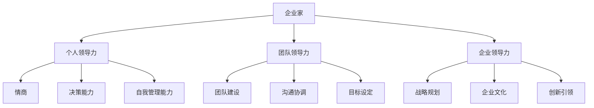

                 

### 领导力心经：成就一代企业家的领导力秘籍

> **关键词**：领导力、企业家、企业成长、团队管理、战略规划

> **摘要**：本文旨在探讨企业家在企业发展过程中如何提升领导力。通过深入分析个人领导力、团队领导力和企业领导力的核心概念与联系，本文总结了成功企业家的领导力秘籍，并通过实际案例进行阐述，帮助读者理解和掌握领导力的精髓，从而在创业和管理过程中取得卓越成就。

---

## **第一部分：背景介绍**

在当今快速变化的市场环境中，企业家的领导力已经成为决定企业成败的关键因素。领导力不仅是企业家个人魅力的体现，更是企业发展的核心驱动力。一个成功的领导者能够把握市场机遇，引领团队突破困境，推动企业实现长期稳定的发展。

### **核心概念**

- **问题背景**：随着全球化进程的加速和市场竞争的加剧，企业面临的挑战越来越多。企业家需要具备卓越的领导力，才能在复杂多变的市场环境中保持竞争力，实现企业的可持续发展。

- **问题描述**：企业家在企业发展过程中面临的核心问题是如何提升领导力。领导力的提升不仅关系到企业家的个人成长，更关系到企业的长远发展。

- **问题解决**：通过研究成功企业家的领导力实践，总结出一系列可操作性强的领导力提升方法，帮助企业家在实践中不断提升领导力。

- **边界与外延**：本文探讨的领导力主要涵盖三个层面：个人领导力、团队领导力和企业领导力。个人领导力关注企业家个人的情商、决策能力、自我管理能力等；团队领导力关注企业家如何建立高效的团队、沟通协调、目标设定和激励机制等；企业领导力关注企业家如何制定战略规划、塑造企业文化、推动创新和社会责任等。

- **概念结构与核心要素组成**：

  - **个人领导力**：包括情商、决策能力、自我管理能力和影响力等。
  
  - **团队领导力**：包括团队建设、沟通协调、目标设定和激励机制等。
  
  - **企业领导力**：包括战略规划、企业文化、创新引领和社会责任等。

### **核心概念与联系**

#### **核心概念原理**

企业家领导力是指企业家在创业、经营、管理过程中，通过个人魅力、智慧和能力，引导、影响和激励团队，实现企业目标的能力。

#### **概念属性特征对比表格**

| 概念         | 特征一          | 特征二          | 特征三          |
| ------------ | --------------- | --------------- | --------------- |
| 个人领导力   | 情商高          | 决策能力强      | 自我管理能力强  |
| 团队领导力   | 团队建设好      | 沟通协调好      | 目标设定清晰    |
| 企业领导力   | 战略规划能力强  | 企业文化深厚    | 创新引领潮流    |

#### **ER实体关系图架构**

---

## **第二部分：领导力秘籍**

### **个人领导力提升**

#### **情商提升**

情商是指一个人在情绪识别、理解和调节方面的能力。一个高情商的领导者能够更好地理解自己和他人的情绪，从而在沟通和协作中取得更好的效果。

1. **阅读心理学书籍**：通过阅读心理学书籍，了解情绪的基本概念和调节方法。
2. **参加情商培训**：参加专业的情商培训，学习情绪管理的技巧和方法。
3. **实践**：在工作和生活中，积极应用所学知识，不断提高情商。

#### **决策能力提升**

决策能力是指一个人在面对复杂问题和不确定因素时，能够做出合理决策的能力。一个高决策能力的领导者能够在关键时刻做出正确的决策，为企业发展指明方向。

1. **学习决策理论**：了解决策理论的基本概念和方法，掌握科学决策的步骤。
2. **实践经验**：在工作和生活中，不断积累决策经验，提高决策能力。
3. **反思与总结**：每次决策后，进行反思和总结，找出不足之处，不断改进。

#### **自我管理能力提升**

自我管理能力是指一个人在自我约束、自我激励和自我调整方面的能力。一个高自我管理能力的领导者能够更好地控制自己的情绪和行为，保持高效的工作状态。

1. **培养自律意识**：设定明确的目标和计划，坚持执行，培养自律意识。
2. **时间管理**：合理安排时间，提高工作效率，确保目标的实现。
3. **情绪管理**：学会调节自己的情绪，保持积极的心态，应对各种挑战。

#### **影响力提升**

影响力是指一个人在他人心目中的影响力和号召力。一个高影响力的领导者能够更好地引导和激励团队，推动企业的发展。

1. **演讲与培训**：通过演讲和培训，提升自己的表达能力和影响力。
2. **写作**：通过写作，分享自己的经验和见解，扩大影响力。
3. **领导行为**：在工作和生活中，展现出积极的领导行为，树立榜样。

### **团队领导力提升**

#### **团队建设**

团队建设是指通过建立共同目标、培养团队精神、激发团队活力，提高团队的协作效率。

1. **共同目标**：明确团队的目标，确保每个成员都清楚自己的职责和使命。
2. **团队精神**：通过团队活动，增强团队成员之间的信任和合作，培养团队精神。
3. **团队活力**：鼓励创新思维，激发团队活力，提高团队的工作热情。

#### **沟通协调**

沟通协调是指通过有效的沟通和协调，解决团队内部矛盾，提高团队协作效率。

1. **沟通技巧**：提高沟通技巧，确保信息传递的准确性和及时性。
2. **沟通机制**：建立有效的沟通机制，确保团队成员之间的信息流通畅通。
3. **矛盾解决**：积极解决团队内部矛盾，避免影响团队的工作效率和士气。

#### **目标设定**

目标设定是指通过明确团队的目标，制定切实可行的行动计划，推动团队的工作。

1. **目标明确**：明确团队的目标，确保每个成员都清楚自己的目标。
2. **行动计划**：制定详细的行动计划，确保目标的实现。
3. **目标调整**：根据实际情况，及时调整目标，确保目标的实现。

#### **激励机制**

激励机制是指通过设立合理的激励机制，激发团队成员的积极性和创造力。

1. **物质激励**：通过奖金、福利等物质激励，提高团队成员的工作积极性。
2. **精神激励**：通过表扬、认可等精神激励，提升团队成员的自信心和归属感。
3. **个性化激励**：根据团队成员的不同需求，提供个性化的激励，提高他们的工作热情。

### **企业领导力提升**

#### **战略规划**

战略规划是指通过制定长期发展规划，明确企业的发展方向和目标，确保企业的可持续发展。

1. **市场分析**：了解市场需求和竞争态势，为企业发展提供数据支持。
2. **目标设定**：明确企业的发展目标，确保战略规划的可行性和有效性。
3. **资源配置**：合理配置企业资源，确保战略规划的实施。

#### **企业文化**

企业文化是指企业在长期经营过程中形成的共同价值观和行为规范。一个优秀的企业文化能够增强企业的凝聚力，提升企业的竞争力。

1. **价值观塑造**：明确企业的核心价值观，引导员工树立正确的价值观。
2. **行为规范**：建立明确的行为规范，确保员工的行为符合企业的价值观。
3. **文化传承**：通过培训和宣传，传承企业的文化，增强员工的归属感。

#### **创新引领**

创新引领是指通过鼓励创新思维，推动企业技术创新和管理创新，保持企业的竞争优势。

1. **创新环境**：营造良好的创新环境，激发员工的创新潜力。
2. **创新机制**：建立完善的创新机制，鼓励员工提出创新方案。
3. **创新实践**：通过实践，验证创新方案的有效性，推动企业的创新发展。

#### **社会责任**

社会责任是指企业在经营过程中应承担的社会责任，包括环境保护、公益慈善、员工权益等方面。一个具有社会责任感的企业能够在社会中树立良好的形象，赢得公众的信任和支持。

1. **环境保护**：积极参与环境保护活动，减少企业的环境负担。
2. **公益慈善**：积极参与公益慈善事业，回馈社会。
3. **员工权益**：关注员工的权益，提供良好的工作环境和福利待遇。

---

## **第三部分：实践案例**

### **个人领导力实践**

#### **案例一：某企业家通过自我管理，成功转型为高效领导者**

某企业家在创业初期，由于缺乏管理经验，企业一度陷入困境。为了提升自己的领导力，他开始阅读管理类书籍，参加管理培训，并通过自我管理，逐步转型为高效领导者。他制定了详细的工作计划，提高了工作效率，同时注重团队建设，培养了一批忠诚可靠的团队成员。在不到两年的时间里，企业实现了业绩翻倍，成功转型为行业领军企业。

#### **案例二：某企业家通过提升情商，赢得员工信任，提高团队执行力**

某企业家在经营企业过程中，意识到情商对于领导力的重要性。他开始学习心理学知识，提升自己的情商。在团队管理中，他注重与员工的沟通，倾听员工的意见和建议，赢得员工的信任。通过有效的沟通和协调，他成功解决了团队内部的矛盾，提高了团队的执行力。在不到一年的时间里，企业的业绩显著提升，员工士气高涨。

### **团队领导力实践**

#### **案例一：某企业家通过团队建设，带领团队实现业绩翻倍**

某企业家深知团队建设对于企业成功的重要性。他通过组织团队活动，加强团队成员之间的沟通和协作，培养团队精神。同时，他设立共同目标，明确团队成员的职责和使命，激发团队成员的工作热情。在不到两年的时间里，企业实现了业绩翻倍，团队凝聚力大幅提升。

#### **案例二：某企业家通过有效沟通，解决团队内部矛盾，提升团队协作能力**

某企业家在团队管理中，注重沟通和协调。他建立了有效的沟通机制，鼓励团队成员表达意见和建议，积极解决团队内部的矛盾。通过有效的沟通，他成功解决了团队内部的分歧，提升了团队的协作能力。在不到一年的时间里，企业的业绩显著提升，团队士气高涨。

### **企业领导力实践**

#### **案例一：某企业家通过战略规划，成功实现企业转型升级**

某企业家在企业发展过程中，注重战略规划。他通过市场分析和目标设定，明确了企业的发展方向和目标。在战略规划的实施过程中，他合理配置企业资源，确保战略规划的有效实施。在不到三年的时间里，企业成功实现了转型升级，成为行业领军企业。

#### **案例二：某企业家通过创新引领，推动企业成为行业领军企业**

某企业家在企业发展过程中，注重创新引领。他鼓励员工提出创新方案，建立创新机制，推动企业的创新发展。在不到五年的时间里，企业通过技术创新和管理创新，成功成为行业领军企业，赢得了市场和客户的认可。

---

## **第四部分：总结与拓展**

### **总结**

本文通过研究成功企业家的领导力实践，总结了个人领导力、团队领导力和企业领导力的提升方法。企业家在提升领导力的过程中，需要关注情商、决策能力、自我管理能力、团队建设、沟通协调、目标设定、激励机制、战略规划、企业文化、创新引领和社会责任等方面。通过不断学习和实践，企业家可以不断提升自己的领导力，带领企业实现长期稳定的发展。

### **拓展阅读**

- 《卓越领导力》：详细探讨领导力的重要性及提升方法。
- 《领导力心理学》：从心理学角度解读领导力，提供实用的领导力技巧。
- 《企业家精神》：探讨企业家特质及成功企业家的成长之路。
- 《团队领导力实战手册》：提供实用的团队领导力提升技巧。

---

## **作者信息**

作者：AI天才研究院/AI Genius Institute & 禅与计算机程序设计艺术 /Zen And The Art of Computer Programming

