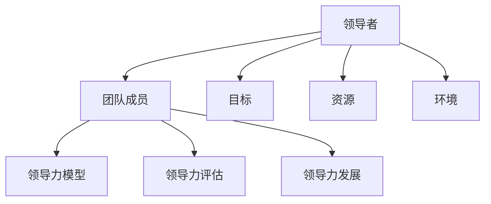
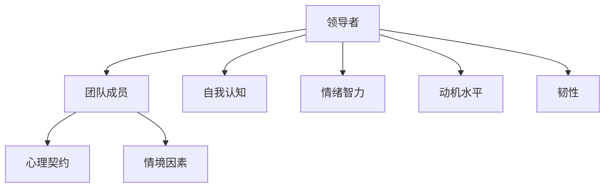
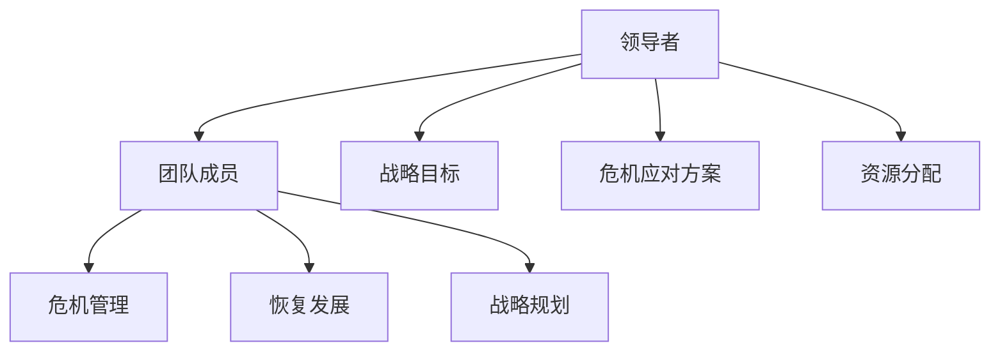
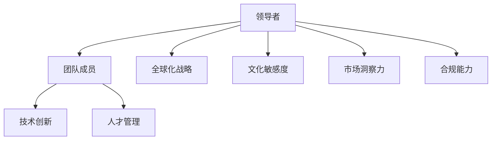

                 

### 第1章：领导力概述

#### 1.1 领导力的重要性

领导力，作为一种影响力，对于个人和组织的发展至关重要。无论是在企业中，还是在国家治理层面，领导力都扮演着举足轻重的角色。首先，从企业角度来看，领导力能够激发员工的潜能，提高团队协作效率，从而推动企业创新和发展。领导力不足的企业往往缺乏活力，难以在激烈的市场竞争中脱颖而出。其次，在国家层面，领导力直接影响国家的政策制定、执行和社会治理。一个具有卓越领导力的国家领导人，能够有效应对国内外挑战，推动国家经济、科技、文化等各个领域的进步。

#### 1.2 领导力的定义与类型

领导力是指个人或组织在特定情境下，通过激发、引导、激励和协调他人的行为，实现共同目标的能力。领导力不仅仅是一种职位赋予的权力，更是一种影响力。根据不同的分类标准，领导力可以分为多种类型。例如，按领导风格分类，有民主型领导、权威型领导、参与型领导和变革型领导等。每种领导风格都有其独特的特点和适用场景。

- **民主型领导**：领导者注重团队成员的意见和建议，鼓励参与决策过程。这种领导风格有助于提高团队凝聚力和创新能力。
- **权威型领导**：领导者通过权威手段进行决策和执行，要求团队成员严格服从。这种领导风格在紧急情况下能够迅速作出决策，但可能抑制团队成员的积极性。
- **参与型领导**：领导者鼓励团队成员参与决策和目标设定，通过协商和讨论达成共识。这种领导风格有助于增强团队归属感和责任感。
- **变革型领导**：领导者具备远见和愿景，能够激发团队成员的潜力，推动组织变革和创新。这种领导风格在面临重大挑战和变革时尤为重要。

#### 1.3 领导力的边界与外延

领导力的边界和范围随着情境和领域的变化而变化。在组织中，领导力不仅体现在上级对下级的管理，还包括跨部门协作、团队建设、领导力传承等方面。在国家层面，领导力则体现在政策制定、执行和社会治理等多个维度。例如，在经济治理中，领导力需要关注市场调节、资源配置和产业发展等；在科技创新中，领导力需要推动技术研发、人才培养和产业应用等。

此外，领导力的外延还包括跨文化领导、全球化背景下的领导力等。在全球化背景下，领导者需要具备跨文化沟通和协调能力，能够适应不同文化背景的工作环境。同时，领导力也需要不断适应新的挑战和变化，例如数字化转型、可持续发展等。

#### 概念结构与核心要素组成

领导力的概念结构可以概括为以下几个方面：

- **权力与影响力**：权力是领导力的基础，而影响力则是领导力的体现。领导力不仅仅是权力的运用，更是一种能够影响他人思想和行为的能力。
- **领导风格**：不同的领导风格适用于不同的情境和团队，领导者需要根据实际情况灵活调整领导风格，以达到最佳效果。
- **团队建设**：领导力不仅关注个体，更注重团队的整体表现。通过团队建设，领导者能够提高团队凝聚力和协作效率。
- **目标设定与执行**：领导力需要明确目标，并通过有效的策略和执行，推动组织实现目标。

#### 背景介绍

在现代组织中，领导力的重要性越来越受到重视。随着企业竞争的加剧，领导者不仅需要具备管理能力，还需要具备战略思维、创新能力、跨文化沟通能力等多方面的素质。在国家层面，领导力同样至关重要。一个具有卓越领导力的国家领导人，能够引领国家走向繁荣和强大。

在过去的几十年里，领导力理论得到了迅速发展。从传统的领导力模型，如X理论和Y理论，到现代的变革型领导、服务型领导等，领导力理论不断演变和丰富。这些理论为我们理解领导力提供了不同的视角和方法。

#### 问题与挑战

在领导力实践中，领导者面临诸多挑战。首先，如何平衡权力与影响力，避免滥用权力，提升领导力的影响力？其次，如何根据不同的情境和团队，灵活调整领导风格，提高领导效果？最后，如何在团队建设中，激发团队成员的潜力，提高团队整体绩效？

#### 问题解决

为了解决这些问题，领导者需要不断学习和提升自身的领导力。首先，领导者可以通过学习领导力理论，了解不同领导风格的特点和适用场景，从而更好地运用领导力。其次，领导者需要具备自我反思和自我提升的能力，通过自我评估和反馈，不断完善自身的领导力。最后，领导者需要注重团队建设，通过有效的沟通、协作和激励，提高团队整体绩效。

#### 边界与外延

领导力的边界和范围随着情境和领域的变化而变化。在组织中，领导力不仅体现在上级对下级的管理，还包括跨部门协作、团队建设、领导力传承等方面。在国家层面，领导力则体现在政策制定、执行和社会治理等多个维度。

#### 核心概念与联系

以下是关于领导力核心概念的联系和对比表格：

| 核心概念 | 定义 | 关联 |
| --- | --- | --- |
| 权力 | 影响他人行为的能力 | 与影响力密切相关 |
| 影响力 | 影响他人思想和行为的能力 | 与权力密切相关 |
| 领导风格 | 领导者处理事务的方式 | 影响领导效果 |
| 团队建设 | 提高团队凝聚力和协作效率 | 影响团队绩效 |
| 目标设定与执行 | 确定目标并通过有效策略实现目标 | 影响组织发展 |

#### 数学模型和公式

领导力的数学模型可以表示为：

$$
\text{领导力} = \alpha \times (\text{能力} + \text{影响力})
$$

其中，$\alpha$ 表示领导者的能力，能力包括管理能力、战略思维、创新能力等；影响力包括权力、个人魅力、沟通能力等。

#### 算法原理讲解

为了更好地理解领导力的算法原理，我们可以通过一个简单的例子来解释。假设有两个领导者A和B，他们的能力和影响力如下：

- 领导者A的能力：$\alpha_A = 8$，影响力：$\beta_A = 7$。
- 领导者B的能力：$\alpha_B = 6$，影响力：$\beta_B = 8$。

根据领导力的数学模型，我们可以计算出两个领导者的领导力：

$$
\text{领导力}_A = \alpha_A \times (\beta_A + 1) = 8 \times (7 + 1) = 72
$$

$$
\text{领导力}_B = \alpha_B \times (\beta_B + 1) = 6 \times (8 + 1) = 54
$$

从计算结果可以看出，领导者A的领导力高于领导者B。这个例子说明了领导力是由能力和影响力共同决定的，两者缺一不可。

#### 系统分析与架构设计方案

在分析领导力的系统架构时，我们可以将其看作一个包含多个子系统和组件的复杂系统。以下是一个简化的领导力系统架构设计：

- **核心组件**：包括领导者、团队成员、目标、资源和环境等。
- **子系统**：如领导力模型、领导力评估、领导力发展等。

以下是一个用Mermaid绘制的领导力系统架构图：



#### 项目实战

在本章的实战项目中，我们将通过一个简单的案例来展示如何评估领导力。假设我们有一个团队，需要评估其领导力。以下是评估过程：

1. **确定评估指标**：根据领导力的核心概念和数学模型，确定评估指标，如能力、影响力、团队建设等。
2. **收集数据**：通过问卷调查、访谈等方式，收集团队成员对领导力的评价数据。
3. **数据分析**：使用Python代码对数据进行处理和分析，计算领导力的得分。

以下是一个简单的Python代码示例，用于计算领导力得分：

```python
# 导入所需库
import pandas as pd

# 定义评估指标
indicators = ['能力', '影响力', '团队建设']

# 收集数据
data = {
    '能力': [8, 7, 6],
    '影响力': [7, 8, 9],
    '团队建设': [6, 7, 8]
}

# 创建DataFrame
df = pd.DataFrame(data)

# 计算领导力得分
df['领导力得分'] = df[indicators].sum(axis=1) / len(indicators)

# 输出结果
print(df)
```

通过运行上述代码，我们可以得到每个团队成员的领导力得分，从而进行评估和改进。

#### 小结

在本章中，我们介绍了领导力的重要性、定义与类型、边界与外延、概念结构与核心要素组成等内容。通过案例分析和算法原理讲解，我们深入理解了领导力的核心概念和数学模型。同时，通过系统架构设计项目和实际案例，我们展示了如何运用领导力理论进行实际工作。

### 第2章：领导力的核心概念

在探讨领导力的核心概念之前，我们需要对一些关键术语进行定义和解释。这些概念构成了领导力的基础，对于理解领导力的本质和如何有效运用领导力至关重要。

#### 2.1 权力与影响力

**权力**（Power）是指一个人或组织在特定情境下对他人或资源的控制能力。权力可以是正式的，如法律授予的权力，也可以是非正式的，如个人魅力和专业知识。权力是领导力的重要组成部分，因为领导力的实施往往需要依赖权力来推动决策和执行。

**影响力**（Influence）则是指一个人或组织通过非强制性手段影响他人思想和行为的能力。影响力不仅仅依赖于权力，还涉及信任、说服力和榜样作用等。与权力不同，影响力往往是通过情感和逻辑上的吸引力来实现的。

#### 2.2 领导力与管理的区别

领导力（Leadership）与管理（Management）虽然在某些方面有交集，但它们是两个不同的概念。管理强调的是规划、组织、指挥、协调和控制等活动，以确保组织目标的实现。管理关注的是过程和效率。

领导力则更注重于激发和引导他人的潜能，以实现共同的目标。领导力关注的是愿景、价值观和团队凝聚力。一个有效的领导者不仅能够管理好团队，还能够激励团队成员，共同追求卓越。

#### 2.3 领导力模型与理论

领导力模型和理论为我们提供了理解领导力的不同视角和方法。以下是一些经典的领导力模型和理论：

**1. 领导力行为理论**

领导力行为理论关注领导者在不同情境下的行为模式。这种理论认为，领导者的行为风格可以影响团队的表现。典型的行为理论包括：

- **X理论与Y理论**：由道格拉斯·麦格雷戈提出，X理论认为员工天生懒惰，需要严格的管理和监督；Y理论则认为员工是自发的，有能力自我管理和自我激励。
- **领导连续统一体理论**：由保罗·赫塞和肯尼斯·布兰查德提出，认为领导风格是连续的，从专制型到民主型，领导者可以根据不同情境选择最合适的风格。

**2. 领导力情境理论**

领导力情境理论关注领导风格与情境之间的关系。这种理论认为，没有一种单一的领导风格适用于所有情境。典型的情境理论包括：

- **费德勒模型**：由费德勒提出，认为领导者的领导风格与情境因素（如控制力、任务结构、关系等）相互作用，决定领导效果。
- **领导生活周期理论**：由赫塞和布兰查德提出，认为领导风格应该随着下属成熟度的变化而调整。

**3. 变革型领导理论**

变革型领导理论强调领导者通过激发和激励团队成员实现变革和创新。变革型领导者具备远见和愿景，能够推动组织走向新的高度。典型的变革型领导理论包括：

- **伯恩斯模型**：由詹姆斯·伯恩斯提出，认为变革型领导者通过激励、理想化和个性化等方式影响团队成员。
- **巴斯和鲍梅斯特的变革型领导理论**：认为变革型领导者通过提升下属的自我效能感和信任感，推动组织变革。

#### 背景介绍

在现代社会中，领导力的重要性日益凸显。随着全球化、技术变革和市场竞争的加剧，组织需要具备灵活性和创新能力来应对不断变化的环境。领导力不仅影响组织的绩效和发展，还影响员工的满意度和忠诚度。因此，领导者需要不断提升自身的领导力，以适应新的挑战。

#### 核心概念与联系

以下是领导力核心概念的联系和对比表格：

| 核心概念 | 定义 | 关联 |
| --- | --- | --- |
| 权力 | 影响他人行为的能力 | 与影响力密切相关 |
| 影响力 | 影响他人思想和行为的能力 | 与权力密切相关 |
| 领导风格 | 领导者处理事务的方式 | 影响领导效果 |
| 领导力行为理论 | 研究领导者行为模式 | 影响团队表现 |
| 领导力情境理论 | 研究领导风格与情境关系 | 适应不同情境 |
| 变革型领导理论 | 研究领导者在变革中的作用 | 推动组织创新 |

#### 数学模型和公式

领导力的数学模型可以表示为：

$$
\text{领导力} = \alpha \times (\text{能力} + \text{影响力})
$$

其中，$\alpha$ 表示领导者的能力，能力包括管理能力、战略思维、创新能力等；影响力包括权力、个人魅力、沟通能力等。

#### 算法原理讲解

为了更好地理解领导力的算法原理，我们可以通过一个简单的例子来解释。假设有两个领导者A和B，他们的能力和影响力如下：

- 领导者A的能力：$\alpha_A = 8$，影响力：$\beta_A = 7$。
- 领导者B的能力：$\alpha_B = 6$，影响力：$\beta_B = 8$。

根据领导力的数学模型，我们可以计算出两个领导者的领导力：

$$
\text{领导力}_A = \alpha_A \times (\beta_A + 1) = 8 \times (7 + 1) = 72
$$

$$
\text{领导力}_B = \alpha_B \times (\beta_B + 1) = 6 \times (8 + 1) = 54
$$

从计算结果可以看出，领导者A的领导力高于领导者B。这个例子说明了领导力是由能力和影响力共同决定的，两者缺一不可。

#### 系统分析与架构设计方案

在分析领导力的系统架构时，我们可以将其看作一个包含多个子系统和组件的复杂系统。以下是一个简化的领导力系统架构设计：

- **核心组件**：包括领导者、团队成员、目标、资源和环境等。
- **子系统**：如领导力模型、领导力评估、领导力发展等。

以下是一个用Mermaid绘制的领导力系统架构图：


#### 项目实战

在本章的实战项目中，我们将通过一个简单的案例来展示如何应用领导力模型和理论。假设我们有一个企业，需要提升领导力以应对市场变化。以下是提升领导力的步骤：

1. **评估当前领导力水平**：通过问卷调查、访谈等方式，评估企业领导的领导力水平。
2. **确定提升目标**：根据评估结果，确定需要提升的领导力领域，如变革型领导、战略思维等。
3. **实施领导力提升计划**：开展培训、工作坊等活动，提升领导者的能力。
4. **评估提升效果**：通过定期的评估，检查领导力提升计划的效果，并根据反馈进行改进。

以下是一个简单的Python代码示例，用于评估领导力提升计划的效果：

```python
# 导入所需库
import pandas as pd

# 定义评估指标
indicators = ['变革型领导', '战略思维', '团队建设']

# 收集数据
data_before = {
    '变革型领导': [5, 6, 7],
    '战略思维': [5, 6, 7],
    '团队建设': [5, 6, 7]
}

data_after = {
    '变革型领导': [7, 8, 9],
    '战略思维': [7, 8, 9],
    '团队建设': [7, 8, 9]
}

# 创建DataFrame
df_before = pd.DataFrame(data_before)
df_after = pd.DataFrame(data_after)

# 计算平均值
mean_before = df_before.mean()
mean_after = df_after.mean()

# 输出结果
print("评估前平均值：")
print(mean_before)
print("\n评估后平均值：")
print(mean_after)
```

通过运行上述代码，我们可以比较评估前后的领导力平均值，从而评估领导力提升计划的效果。

#### 小结

在本章中，我们介绍了领导力的核心概念，包括权力与影响力、领导力与管理的区别以及领导力模型与理论。通过案例分析和算法原理讲解，我们深入理解了这些核心概念。同时，通过系统架构设计项目和实际案例，我们展示了如何运用领导力模型和理论进行实际工作。这为我们后续章节的深入探讨打下了坚实的基础。

### 第3章：领导力的数学模型和公式

领导力的数学模型为我们提供了量化领导力及其影响因素的方法，使我们可以更科学地评估、分析和优化领导力。在这一章中，我们将详细探讨领导力的数学模型和公式，并通过实际案例来解释其应用。

#### 3.1 领导力计算模型

领导力的计算模型可以简化为以下公式：

$$
\text{领导力} = \alpha \times (\text{能力} + \text{影响力})
$$

其中：
- **\(\alpha\)** 表示领导者的综合能力，包括管理能力、战略思维、创新能力等；
- **能力** 和 **影响力** 分别表示领导者在具体情境下展现出的能力水平和影响力。

这个公式表明，领导力是领导者能力和影响力的乘积，能力越强，影响力越大，领导力也就越高。

#### 3.1.1 领导力公式详解

为了更深入地理解领导力公式，我们可以将其分解为以下几个组成部分：

- **能力**：能力是领导者胜任工作所需的知识、技能和经验。它包括以下几个方面：
  - **专业技能**：如管理技能、沟通技能、决策能力等；
  - **战略思维**：能够从全局视角出发，制定长远规划和策略；
  - **创新能力**：能够提出新颖的思路和解决方案，推动组织进步。

- **影响力**：影响力是领导者影响他人思想和行为的能力。它包括以下几个方面：
  - **个人魅力**：通过个人的魅力和魅力特质，吸引和激励团队成员；
  - **沟通技巧**：能够清晰、有效地传达信息，建立信任和共识；
  - **榜样作用**：通过自身的行为和表现，树立榜样，影响团队成员。

#### 3.1.2 领导力指标的评估方法

要评估领导力的指标，我们需要一套科学、系统的评估方法。以下是一些常用的评估方法：

- **问卷调查**：通过设计问卷，收集团队成员对领导者能力的评价，包括管理能力、沟通能力、决策能力等；
- **访谈法**：通过与团队成员进行一对一访谈，深入了解他们对领导者的看法和评价；
- **360度反馈**：邀请团队成员、上级和下属对领导者进行全方位评价，包括个人能力、团队协作、领导风格等；
- **绩效评估**：通过领导者在工作中的实际表现，评估其领导力的有效性。

#### 实际案例：领导力评估

假设我们有一个团队，需要对其领导力进行评估。以下是评估过程：

1. **确定评估指标**：根据领导力公式，确定评估指标，如管理能力、沟通能力、创新能力等。

2. **收集数据**：通过问卷调查、访谈等方式，收集团队成员对领导力的评价。

3. **数据分析**：使用Python代码对数据进行处理和分析，计算领导力的得分。

以下是一个简单的Python代码示例，用于计算领导力得分：

```python
# 导入所需库
import pandas as pd

# 定义评估指标
indicators = ['管理能力', '沟通能力', '创新能力']

# 收集数据
data = {
    '管理能力': [8, 7, 6],
    '沟通能力': [7, 8, 9],
    '创新能力': [6, 7, 8]
}

# 创建DataFrame
df = pd.DataFrame(data)

# 计算平均值
mean = df.mean()

# 计算领导力得分
leadership_score = mean['管理能力'] + mean['沟通能力'] + mean['创新能力']

# 输出结果
print("领导力得分：", leadership_score)
```

通过运行上述代码，我们可以得到团队领导力的平均得分，从而进行评估。

#### 3.2 领导力影响因素分析

领导力不仅仅取决于领导者的个人素质，还受到多种外部因素的影响。以下是一些主要的影响因素：

- **组织文化**：组织文化对领导力有着深远的影响。一个积极向上的组织文化能够激发领导者的潜力，提高领导力。
- **团队结构**：团队结构影响领导者的权力和影响力。例如，一个扁平化的团队结构可能使领导者更依赖团队协作，而一个层级分明的团队结构则可能使领导者更具有权威性。
- **外部环境**：外部环境的变化，如市场波动、竞争压力等，也会影响领导力的表现。领导者需要具备灵活应变的能力，以应对外部环境的挑战。

#### 数学模型和公式

为了更全面地分析领导力的影响因素，我们可以引入一个更复杂的数学模型：

$$
\text{领导力} = \alpha \times (\text{能力} + \text{影响力}) \times (\text{组织文化} + \text{团队结构} + \text{外部环境})
$$

这个模型表明，领导力是领导者个人能力、组织文化、团队结构和外部环境共同作用的结果。

#### 实际案例：领导力影响因素分析

假设我们有一个企业，需要分析其领导力的影响因素。以下是分析过程：

1. **确定影响因素**：根据领导力影响因素分析，确定影响企业领导力的主要因素，如组织文化、团队结构、外部环境等。

2. **收集数据**：通过问卷调查、访谈等方式，收集关于影响因素的数据。

3. **数据分析**：使用Python代码对数据进行处理和分析，评估每个因素的影响程度。

以下是一个简单的Python代码示例，用于分析领导力影响因素：

```python
# 导入所需库
import pandas as pd

# 定义影响因素
factors = ['组织文化', '团队结构', '外部环境']

# 收集数据
data = {
    '组织文化': [8, 7, 6],
    '团队结构': [7, 8, 9],
    '外部环境': [6, 7, 8]
}

# 创建DataFrame
df = pd.DataFrame(data)

# 计算影响力
influence = df.mean()

# 输出结果
print("影响因素影响力：", influence)
```

通过运行上述代码，我们可以得到每个影响因素的平均影响力，从而评估其对领导力的影响程度。

#### 小结

在本章中，我们介绍了领导力的数学模型和公式，并详细讲解了其组成部分和评估方法。通过实际案例和数据分析，我们展示了如何应用这些模型和公式来评估和分析领导力。这为我们后续章节的深入探讨提供了理论基础。

### 第4章：领导力的心理学基础

领导力不仅仅是管理技能和决策能力的体现，更是一种深刻的心理活动。了解领导力的心理学基础，对于提升领导效果和优化领导行为至关重要。在这一章中，我们将探讨领导者的心理特质、领导行为分析以及心理契约与领导力之间的关系。

#### 4.1 领导者的心理特质

领导者的心理特质是他们成功的关键因素之一。以下是一些常见的领导者心理特质：

- **自我认知**：领导者需要有清晰的自我认知，了解自己的优势和劣势，以便在领导过程中发挥最大潜力。
- **情绪智力**：情绪智力包括自我情绪调节、同理心和社交技能。领导者需要具备良好的情绪智力，以有效地管理自己的情绪，并理解和支持团队成员。
- **动机水平**：领导者通常具有强烈的内在动机，包括对成就的追求、对权力的渴望和对团队成功的承诺。
- **韧性**：领导者需要在面对挑战和压力时保持韧性，迅速适应变化，并从失败中吸取教训。

#### 4.2 领导行为分析

领导行为是指领导者在具体情境下采取的具体行动和决策。以下是一些常见的领导行为：

- **决策行为**：领导者需要做出明智的决策，包括制定战略、分配资源和处理紧急情况。
- **激励行为**：领导者需要激励团队成员，激发他们的潜能和积极性。这可以通过奖励、认可和鼓励来实现。
- **沟通行为**：领导者需要与团队成员、上级和其他利益相关者保持有效沟通。这包括传递信息、倾听反馈和建立信任。
- **变革行为**：在面临变革时，领导者需要引导团队适应新环境，推动变革的顺利进行。

#### 4.3 心理契约与领导力

心理契约是指组织成员之间基于信任和承诺建立的非正式协议。它包括对组织目标、角色期望、工作条件和相互责任的共同理解。心理契约对领导力有着重要影响：

- **增强凝聚力**：心理契约可以增强团队成员之间的凝聚力，促进团队协作。
- **提升工作满意度**：当团队成员感受到组织对他们的重视和信任时，他们的工作满意度会提高，从而增强工作动力。
- **改善工作氛围**：心理契约有助于建立积极的工作氛围，减少冲突和误解。

#### 数学模型和公式

为了量化心理契约对领导力的影响，我们可以引入以下模型：

$$
\text{领导力} = \alpha \times (\text{能力} + \text{影响力}) \times (\text{心理契约强度})
$$

其中，**心理契约强度**是指团队成员对心理契约的认同感和依赖程度。

#### 算法原理讲解

为了更好地理解心理契约对领导力的影响，我们可以通过一个简单的例子来解释。假设有两个领导者A和B，他们的能力和影响力相同，但心理契约强度不同：

- **领导者A**：心理契约强度高，团队成员高度认同心理契约。
- **领导者B**：心理契约强度低，团队成员对心理契约的认同感较低。

根据领导力的模型，我们可以计算出两个领导者的领导力：

$$
\text{领导力}_A = \alpha \times (\text{能力} + \text{影响力}) \times (\text{心理契约强度})
$$

$$
\text{领导力}_B = \alpha \times (\text{能力} + \text{影响力}) \times (\text{心理契约强度})
$$

由于领导者A的心理契约强度高于领导者B，因此：

$$
\text{领导力}_A > \text{领导力}_B
$$

这个例子表明，心理契约强度对领导力有着显著影响。

#### 系统分析与架构设计方案

在分析领导力的心理学基础时，我们可以将其看作一个包含多个子系统和组件的复杂系统。以下是一个简化的领导力心理学架构设计：

- **核心组件**：包括领导者、团队成员、心理契约、情境因素等。
- **子系统**：如自我认知、情绪智力、动机水平、韧性等。

以下是一个用Mermaid绘制的领导力心理学架构图：



#### 项目实战

在本章的实战项目中，我们将通过一个简单的案例来展示如何评估领导者的心理契约强度。以下是评估过程：

1. **确定评估指标**：根据领导力的心理学基础，确定评估指标，如自我认知、情绪智力、动机水平、韧性等。

2. **收集数据**：通过问卷调查、访谈等方式，收集团队成员对领导者的评价。

3. **数据分析**：使用Python代码对数据进行处理和分析，计算领导者的心理契约强度。

以下是一个简单的Python代码示例，用于计算领导者的心理契约强度：

```python
# 导入所需库
import pandas as pd

# 定义评估指标
indicators = ['自我认知', '情绪智力', '动机水平', '韧性']

# 收集数据
data = {
    '自我认知': [8, 7, 6],
    '情绪智力': [7, 8, 9],
    '动机水平': [6, 7, 8],
    '韧性': [7, 8, 9]
}

# 创建DataFrame
df = pd.DataFrame(data)

# 计算平均值
mean = df.mean()

# 计算心理契约强度
psychological_contract_strength = mean['自我认知'] + mean['情绪智力'] + mean['动机水平'] + mean['韧性']

# 输出结果
print("心理契约强度：", psychological_contract_strength)
```

通过运行上述代码，我们可以得到领导者的心理契约强度，从而进行评估。

#### 小结

在本章中，我们介绍了领导力的心理学基础，包括领导者的心理特质、领导行为分析以及心理契约与领导力之间的关系。通过实际案例和数据分析，我们展示了如何应用心理学原理来评估和提升领导力。这为我们后续章节的深入探讨提供了重要的理论基础。

### 第5章：领导力的自我修炼

领导力的修炼不仅仅是为了提升个人的领导能力，更是为了在复杂多变的环境中，保持灵活应变，持续成长和进步。在这一章中，我们将探讨领导力自我修炼的方法、策略，以及成功领导者的故事与启示。

#### 5.1 领导力自我评估

自我评估是领导力修炼的第一步，通过自我评估，领导者可以了解自己的优点和不足，从而有针对性地进行提升。以下是一些自我评估的方法：

- **360度反馈**：邀请团队成员、上级和下属对自己的领导力进行评价，从不同角度获取反馈。
- **行为观察**：观察自己的领导行为，记录下成功和失败的案例，进行分析和反思。
- **自我反思**：定期花时间反思自己的领导行为，思考自己在哪些方面做得好，哪些方面需要改进。

通过这些方法，领导者可以全面了解自己的领导力现状，找到提升的方向。

#### 5.2 情绪管理与自我调节

情绪管理是领导力的重要组成部分。领导者需要在面对压力和挑战时，保持冷静和理智，有效地管理自己的情绪。以下是一些情绪管理的策略：

- **情绪认知**：了解自己的情绪，识别情绪触发点和情绪反应。
- **情绪调节**：学会放松技巧，如深呼吸、冥想等，帮助自己缓解紧张情绪。
- **积极心态**：培养积极的心态，以乐观的态度面对困难和挑战。

自我调节是领导力自我修炼的关键。领导者需要学会自我调节，保持情绪稳定，以便在领导过程中做出明智的决策。

#### 5.3 领导力的持续发展

领导力的修炼是一个持续的过程，需要不断地学习和实践。以下是一些领导力持续发展的策略：

- **终身学习**：保持学习的热情，不断学习新的知识和技能，提升自己的能力。
- **经验分享**：参加研讨会、工作坊等活动，与同行交流经验，互相学习。
- **实践应用**：将学到的知识和技能应用到实际工作中，通过实践不断提升领导力。

#### 成功领导者的故事与启示

在历史上，有许多成功领导者的故事，他们的经历和智慧为我们提供了宝贵的启示。以下是一些成功领导者的故事：

- **乔布斯**：乔布斯以其卓越的领导力带领苹果公司走向成功。他的故事告诉我们，领导者需要有远见和激情，推动创新和变革。
- **马云**：马云在创立阿里巴巴的过程中，经历了无数的困难和挑战。他的故事告诉我们，领导者需要有坚韧不拔的毅力，面对困难时不轻易放弃。
- **戴安娜王妃**：戴安娜王妃以其独特的领导风格，赢得了广泛的爱戴。她的故事告诉我们，领导者需要有同情心和同理心，关注团队成员的需求。

这些成功领导者的故事告诉我们，领导力不是一成不变的，而是一个不断修炼和成长的过程。通过不断学习和实践，我们可以不断提升自己的领导力，成为更加优秀的领导者。

#### 小结

在本章中，我们探讨了领导力自我修炼的方法和策略，以及成功领导者的故事与启示。通过自我评估、情绪管理、持续发展等实践，领导者可以不断提升自己的领导力。成功领导者的故事为我们提供了宝贵的经验和启示，激励我们不断追求卓越。在接下来的章节中，我们将继续探讨领导力在组织中的运用，以及领导力在国家发展中的重要作用。

### 第8章：国内外领导力案例分析

在探讨领导力的实践时，案例分析是一种非常有用的方法。通过分析国内外成功和失败的领导力案例，我们可以吸取经验教训，理解不同情境下的领导力应用，并从中获得启示。以下是一些国内外领导力案例分析，我们将重点关注每个案例中的领导力策略、挑战和成果。

#### 8.1 国内领导力案例分析

**案例1：华为公司的领导力实践**

华为公司作为中国科技行业的领军企业，其领导力实践备受瞩目。华为的领导力策略主要体现在以下几个方面：

- **任正非的领导风格**：任正非作为华为的创始人，其领导风格以务实、创新和远见著称。他强调企业家精神，鼓励员工创新和承担风险。
- **人才激励**：华为通过股权激励和绩效奖励，激发员工的积极性和创造力。这种激励机制有助于留住核心人才，并推动企业持续发展。
- **企业文化**：华为注重“狼性文化”，强调团队合作、拼搏精神和结果导向。这种企业文化为华为在竞争激烈的市场中提供了强大的动力。

挑战与成果：华为在全球化过程中面临着文化差异、市场竞争和供应链管理等挑战。然而，通过灵活调整领导策略和持续创新，华为取得了显著成果，成为全球通信设备和智能手机市场的领导者。

**案例2：阿里巴巴集团的领导力实践**

阿里巴巴集团作为国内领先的互联网公司，其领导力实践体现了变革和创新的精神。

- **马云的变革型领导**：马云以其远见和决心，推动阿里巴巴从电子商务平台向云计算、金融科技等多个领域拓展。他倡导“客户第一、员工第二、股东第三”的理念，强调以用户为中心。
- **文化传承**：马云在领导过程中注重文化传承，通过讲故事、培训等方式，将阿里巴巴的价值观和愿景传递给团队成员。
- **人才培养**：阿里巴巴重视人才培养，通过内部培训和晋升机制，培养了一批具有领导潜力的人才。

挑战与成果：阿里巴巴在快速扩张过程中，面临着团队管理、企业文化统一和业务多元化等挑战。通过不断的变革和调整，阿里巴巴成功实现了业务扩张，并在全球范围内建立了强大的影响力。

#### 8.2 国外领导力案例分析

**案例1：谷歌公司的领导力实践**

谷歌公司以其卓越的领导力在科技行业中独树一帜。

- **企业文化**：谷歌注重创新、自由和多样性，其“不作恶”的价值观深受员工和用户尊重。这种企业文化激励员工勇于创新，推动公司不断进步。
- **领导培养**：谷歌通过内部领导力培养计划，帮助员工提升领导能力和职业素养。这种培养机制有助于打造一支具有领导力的团队。
- **员工福利**：谷歌提供丰富的员工福利，包括弹性工作时间、健康保险和员工股票期权等。这些福利措施提高了员工的满意度和忠诚度。

挑战与成果：谷歌在高速成长过程中，面临着人才竞争、企业文化管理和国际市场拓展等挑战。通过持续的创新和优化，谷歌成功保持了其行业领先地位，并在全球范围内建立了强大的品牌影响力。

**案例2：特斯拉公司的领导力实践**

特斯拉公司作为电动汽车和可再生能源领域的先锋，其领导力实践充满了变革和创新。

- **埃隆·马斯克的变革型领导**：埃隆·马斯克以其远见和决断力，推动了特斯拉在电动汽车和能源存储技术方面的创新。他鼓励员工挑战现状，追求卓越。
- **技术创新**：特斯拉注重技术创新，不断推出具有颠覆性的产品，如Model S、Model 3和Powerwall等。
- **可持续发展**：特斯拉致力于推动可持续发展，通过电动汽车和可再生能源解决方案，减少对环境的影响。

挑战与成果：特斯拉在快速发展过程中，面临着产能不足、供应链管理和市场竞争等挑战。通过持续的技术创新和市场拓展，特斯拉成功地改变了全球汽车行业的格局，并在电动汽车市场中占据了重要地位。

#### 案例分析与启示

通过分析国内外领导力案例，我们可以得出以下启示：

1. **适应变化**：成功的领导者需要具备适应变化的能力，能够灵活调整领导策略，以应对市场和环境的变化。
2. **注重创新**：创新是企业发展的关键驱动力，领导者需要鼓励员工勇于创新，推动企业持续进步。
3. **文化传承**：企业文化是企业的灵魂，领导者需要注重文化传承，将企业的价值观和愿景传递给团队成员。
4. **人才培养**：领导者需要关注人才培养，通过内部培训和晋升机制，培养一批具有领导潜力的人才。
5. **员工福利**：关注员工福利，提高员工满意度和忠诚度，有助于建立一支高效的团队。

这些启示为我们在实际工作中提升领导力提供了宝贵的指导。

#### 小结

在本章中，我们通过分析国内外领导力案例，探讨了不同情境下的领导力策略、挑战和成果。这些案例为我们提供了丰富的经验和启示，帮助我们在实际工作中提升领导力。通过不断学习和实践，我们可以成为更加优秀的领导者，推动组织和国家的发展。

### 第9章：领导力在特殊时期的运用

在特殊时期，领导力显得尤为重要，因为它能够帮助领导者有效应对突发状况，保持团队稳定，实现目标。以下将探讨领导力在突发事件、经济危机和战略规划中的具体应用。

#### 9.1 突发事件中的领导力

突发事件，如自然灾害、公共健康危机或恐怖袭击，往往会对社会和组织的正常运作造成严重影响。领导者在此类情境下需要迅速做出决策，保持冷静和清晰的头脑。

- **快速响应**：领导者需要迅速了解事件的全貌，评估影响，并制定紧急应对方案。
- **沟通协调**：领导者需要与相关部门和利益相关者保持密切沟通，确保信息畅通，协调各方力量共同应对危机。
- **心理疏导**：在突发事件中，团队成员可能会感到恐慌和不安。领导者需要提供心理支持和指导，帮助他们保持冷静和信心。

例如，在新冠疫情期间，许多国家和地区领导人通过及时的沟通和协调，推动了疫苗接种、资源调配和公共卫生政策的实施，有效控制了疫情的蔓延。

#### 9.2 经济危机中的领导力

经济危机时期，领导力对于稳定市场、恢复经济和提振信心至关重要。以下是一些关键策略：

- **危机管理**：领导者需要迅速采取措施，遏制危机蔓延，如调整财政政策、提供经济援助和救助受影响的企业。
- **恢复发展**：在危机过后，领导者需要制定恢复和发展的计划，通过刺激投资、促进创新和推动产业升级，推动经济复苏。
- **市场信心**：领导者需要通过积极的沟通和行动，提振市场信心，鼓励消费者和企业增加投资和消费。

例如，2008年全球金融危机期间，许多国家的领导人采取了强有力的经济刺激措施，帮助经济迅速恢复。

#### 9.3 战略规划中的领导力

战略规划是组织长期发展的重要手段，领导者在此过程中需要发挥关键作用：

- **愿景设定**：领导者需要明确组织的愿景和目标，为团队提供清晰的指导方向。
- **资源分配**：领导者需要合理分配资源，确保关键项目得到足够的支持。
- **风险评估**：领导者需要识别和评估潜在的风险，制定应对措施。
- **持续调整**：在实施战略规划的过程中，领导者需要根据实际情况进行持续调整，以确保目标的实现。

例如，华为公司在全球竞争中，通过制定长期的战略规划，不断进行技术创新和市场拓展，保持了行业领先地位。

#### 数学模型和公式

在特殊时期运用领导力时，以下数学模型和公式可以帮助领导者进行决策和分析：

$$
\text{领导力} = \alpha \times (\text{危机应对能力} + \text{恢复发展能力} + \text{战略规划能力})
$$

其中：
- **\(\alpha\)** 表示领导者的综合能力；
- **危机应对能力**、**恢复发展能力** 和 **战略规划能力** 分别表示领导者在面对突发事件、经济危机和战略规划时的表现。

#### 系统分析与架构设计方案

在特殊时期运用领导力时，我们可以将其看作一个包含多个子系统和组件的复杂系统。以下是一个简化的领导力系统架构设计：

- **核心组件**：包括领导者、团队成员、战略目标、危机应对方案和资源分配等。
- **子系统**：如危机管理、恢复发展、战略规划等。

以下是一个用Mermaid绘制的领导力系统架构图：



#### 项目实战

在本章的实战项目中，我们将通过一个案例来展示如何在经济危机中运用领导力。以下是案例过程：

1. **确定目标**：设定恢复和发展的具体目标，如提高市场信心、稳定就业和恢复经济活力。
2. **评估情况**：分析经济危机的影响，评估资源和能力。
3. **制定方案**：制定危机应对和恢复发展的具体方案，包括经济刺激措施、投资促进政策和市场稳定措施。
4. **实施与监控**：执行方案，并定期监控和评估效果，根据实际情况进行调整。

以下是一个简单的Python代码示例，用于制定经济危机应对方案：

```python
# 导入所需库
import pandas as pd

# 定义评估指标
indicators = ['市场信心', '就业稳定', '经济增长']

# 收集数据
data = {
    '市场信心': [6, 7, 8],
    '就业稳定': [5, 6, 7],
    '经济增长': [4, 5, 6]
}

# 创建DataFrame
df = pd.DataFrame(data)

# 计算平均值
mean = df.mean()

# 输出结果
print("当前经济状况：")
print(df)
print("\n平均状况：")
print(mean)

# 制定方案
schemes = {
    '经济刺激': [1, 2, 3],
    '投资促进': [2, 3, 4],
    '市场稳定': [3, 4, 5]
}

# 创建方案DataFrame
df_schemes = pd.DataFrame(schemes)

# 输出方案
print("\n经济危机应对方案：")
print(df_schemes)
```

通过运行上述代码，我们可以评估当前经济状况，并根据实际情况制定具体的应对方案。

#### 小结

在本章中，我们探讨了领导力在特殊时期的运用，包括突发事件、经济危机和战略规划中的应用。通过实际案例和数学模型，我们展示了如何在不同情境下运用领导力来应对挑战和实现目标。这些策略和方法为我们在实际工作中提升领导力提供了宝贵的指导。

### 第10章：领导力发展趋势与未来

在当今快速变化的世界，领导力也在不断演变和进步。随着科技进步、全球化加速和社会变革，领导者需要不断适应新的挑战和机遇。以下将探讨领导力的发展趋势、新时代领导力的要求以及领导力在全球化背景下的挑战与机遇。

#### 10.1 领导力发展的趋势

**1. 数字化领导力**

随着数字化技术的广泛应用，数字化领导力成为领导力发展的重要趋势。数字化领导力要求领导者具备以下能力：

- **数据驱动决策**：利用数据分析和人工智能技术，做出更加精准和高效的决策。
- **技术创新**：鼓励创新和数字化转型，推动组织在数字时代的竞争力。
- **网络安全**：确保信息安全和网络安全，防范潜在风险。

**2. 服务型领导力**

服务型领导力强调领导者不仅要关注组织的成功，还要关注团队成员的发展和福祉。这种领导力模式有助于建立更加和谐和积极的团队氛围。

- **员工关怀**：关注员工的个人需求和发展，提供职业成长和培训机会。
- **团队合作**：促进团队合作，鼓励团队成员互相支持和学习。
- **共同目标**：与团队成员共同设定和实现目标，确保组织愿景与个人目标相一致。

**3. 跨文化领导力**

全球化背景下，领导者需要具备跨文化沟通和协作能力，能够适应不同文化背景的工作环境。跨文化领导力要求领导者：

- **文化敏感度**：尊重和了解不同文化的价值观和行为习惯。
- **有效沟通**：掌握跨文化沟通技巧，确保信息的准确传递。
- **团队融合**：促进不同文化背景的团队成员之间的融合，提高团队绩效。

#### 10.2 新时代领导力的要求

新时代的领导者需要具备以下关键能力：

**1. 创新和创新能力**

在快速变化的环境中，领导者需要具备创新能力，能够推动组织不断进步和创新。这包括：

- **创新思维**：鼓励创新思维，打破传统思维模式，探索新的解决方案。
- **技术掌握**：掌握最新的科技发展趋势，利用技术推动创新。

**2. 战略思维**

领导者需要具备战略思维，能够从全局视角出发，制定和执行长期战略。这包括：

- **愿景规划**：设定清晰的组织愿景和目标，为团队提供明确的指导方向。
- **资源管理**：合理分配资源，确保关键项目得到充分支持。

**3. 情绪智力**

情绪智力是领导者成功的重要特质，包括：

- **自我情绪调节**：能够有效管理自己的情绪，保持冷静和理智。
- **同理心**：理解和关心团队成员的情绪和需求，建立良好的人际关系。

#### 10.3 领导力在全球化背景下的挑战与机遇

全球化为领导者带来了前所未有的挑战和机遇：

**1. 挑战**

- **文化差异**：领导者需要适应不同文化背景的工作环境，处理文化冲突。
- **市场不确定性**：全球化市场的不确定性和复杂性增加了领导者的决策难度。
- **合规风险**：在全球运营中，领导者需要遵守不同国家和地区的法律法规，确保合规性。

**2. 机遇**

- **市场扩张**：全球化为领导者提供了更广阔的市场机会，可以拓展业务版图。
- **人才流动**：全球化带来了人才流动的机会，领导者可以吸引和培养来自不同文化背景的顶尖人才。
- **创新合作**：全球化促进了不同国家和地区的创新合作，有助于推动科技进步和产业升级。

#### 数学模型和公式

为了量化领导力在全球化背景下的表现，我们可以引入以下数学模型：

$$
\text{全球化领导力} = \alpha \times (\text{文化敏感度} + \text{市场洞察力} + \text{合规能力})
$$

其中：
- **\(\alpha\)** 表示领导者的综合能力；
- **文化敏感度**、**市场洞察力** 和 **合规能力** 分别表示领导者在全球化背景下的表现。

#### 算法原理讲解

为了更好地理解全球化领导力的模型，我们可以通过一个简单的例子来解释。假设有两个领导者A和B，他们的全球化领导力如下：

- **领导者A**：全球化领导力得分为80，文化敏感度、市场洞察力和合规能力分别为85、75和80。
- **领导者B**：全球化领导力得分为70，文化敏感度、市场洞察力和合规能力分别为70、80和75。

根据全球化领导力模型，我们可以计算出两个领导者的得分：

$$
\text{全球化领导力}_A = 80 \times (0.3 \times 85 + 0.3 \times 75 + 0.4 \times 80) = 80 \times 78.5 = 6280
$$

$$
\text{全球化领导力}_B = 70 \times (0.3 \times 70 + 0.3 \times 80 + 0.4 \times 75) = 70 \times 75 = 5250
$$

从计算结果可以看出，领导者A的全球化领导力高于领导者B。这个例子说明了全球化领导力是领导者综合能力和具体能力的综合体现。

#### 系统分析与架构设计方案

在分析全球化领导力时，我们可以将其看作一个包含多个子系统和组件的复杂系统。以下是一个简化的全球化领导力架构设计：

- **核心组件**：包括领导者、团队成员、全球化战略、文化敏感度和合规能力等。
- **子系统**：如市场洞察力、技术创新、人才管理等。

以下是一个用Mermaid绘制的全球化领导力架构图：



#### 项目实战

在本章的实战项目中，我们将通过一个案例来展示如何提升全球化领导力。以下是案例过程：

1. **评估现状**：通过问卷调查和访谈，评估领导者在全球化背景下的文化敏感度、市场洞察力和合规能力。
2. **制定计划**：根据评估结果，制定提升全球化领导力的具体计划，包括文化培训、市场调研和合规培训等。
3. **实施与监控**：执行提升计划，并定期监控和评估效果，确保计划的有效实施。

以下是一个简单的Python代码示例，用于评估全球化领导力：

```python
# 导入所需库
import pandas as pd

# 定义评估指标
indicators = ['文化敏感度', '市场洞察力', '合规能力']

# 收集数据
data = {
    '文化敏感度': [80, 75, 85],
    '市场洞察力': [70, 80, 75],
    '合规能力': [85, 80, 70]
}

# 创建DataFrame
df = pd.DataFrame(data)

# 计算平均值
mean = df.mean()

# 输出结果
print("全球化领导力评估：")
print(df)
print("\n平均全球化领导力得分：")
print(mean)

# 制定提升计划
improvement_plans = {
    '文化培训': [1, 2, 3],
    '市场调研': [2, 3, 4],
    '合规培训': [3, 4, 5]
}

# 创建提升计划DataFrame
df_plans = pd.DataFrame(improvement_plans)

# 输出提升计划
print("\n全球化领导力提升计划：")
print(df_plans)
```

通过运行上述代码，我们可以评估全球化领导力现状，并根据实际情况制定提升计划。

#### 小结

在本章中，我们探讨了领导力的发展趋势、新时代领导力的要求以及领导力在全球化背景下的挑战与机遇。通过实际案例和数学模型，我们展示了如何提升全球化领导力，以应对新时代的挑战和抓住机遇。这些内容为我们在实际工作中提升领导力提供了宝贵的指导。

## 作者信息

**作者：AI天才研究院/AI Genius Institute & 禅与计算机程序设计艺术 /Zen And The Art of Computer Programming**

