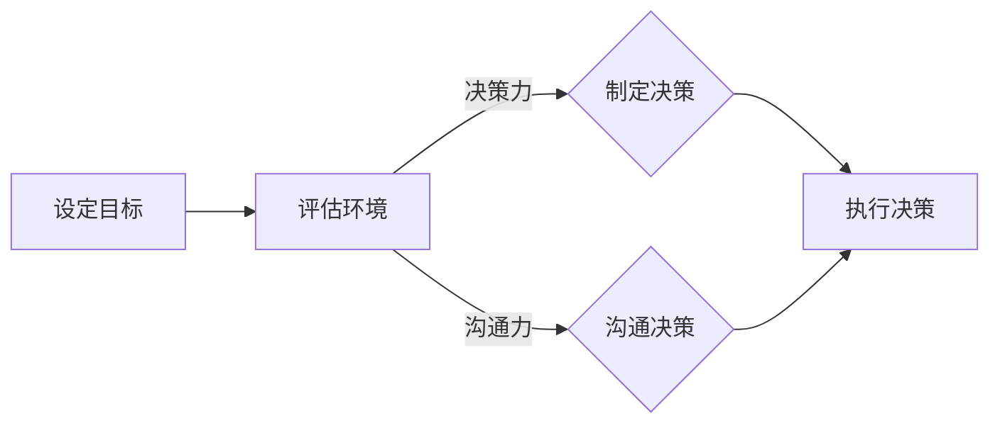
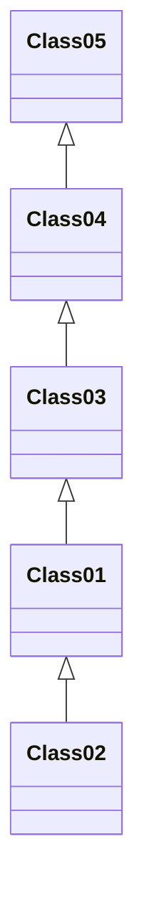
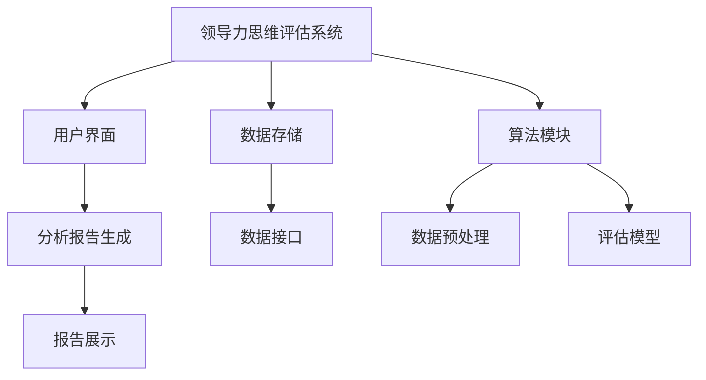
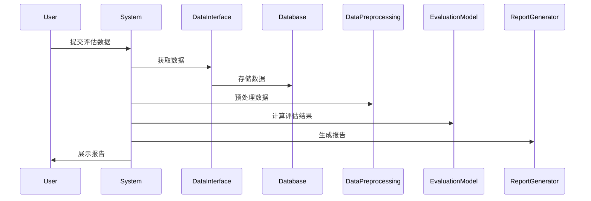

                 

# 领导力思维：改变时代的领导力修炼秘籍

> 关键词：领导力、思维、修炼、企业、团队、案例

> 摘要：本文旨在深入探讨领导力思维在当今时代的应用与重要性，通过详细阐述领导力思维的内涵与培养方法，并结合实际案例分析，总结出领导力思维的实践应用技巧和修炼秘籍。文章结构清晰，逻辑严谨，旨在为读者提供一套行之有效的领导力思维提升方案。

## 目录大纲

## 第一部分：领导力思维概述

### 第1章 领导力的本质与意义

#### 1.1 领导力的定义与重要性

#### 1.2 领导力在企业发展中的作用

#### 1.3 领导力的个人价值与社会价值

### 第2章 领导力思维的培养

#### 2.1 领导力思维的要素

#### 2.2 领导力思维的核心能力

#### 2.3 培养领导力思维的方法

### 第3章 领导力思维的实践应用

#### 3.1 领导力思维在团队管理中的应用

#### 3.2 领导力思维在个人成长中的应用

#### 3.3 领导力思维在社会治理中的应用

## 第二部分：领导力思维案例分析

### 第4章 案例分析一：企业变革中的领导力思维

#### 4.1 案例背景

#### 4.2 领导力思维的应用

#### 4.3 案例总结与启示

### 第5章 案例分析二：创业过程中的领导力思维

#### 5.1 案例背景

#### 5.2 领导力思维的应用

#### 5.3 案例总结与启示

### 第6章 案例分析三：团队协作中的领导力思维

#### 6.1 案例背景

#### 6.2 领导力思维的应用

#### 6.3 案例总结与启示

## 第三部分：领导力思维修炼秘籍

### 第7章 领导力思维修炼之道

#### 7.1 领导力思维的修炼路径

#### 7.2 领导力思维的修炼方法

#### 7.3 领导力思维的修炼心得

### 第8章 领导力思维的实战技巧

#### 8.1 领导力思维的应用技巧

#### 8.2 领导力思维的沟通技巧

#### 8.3 领导力思维的决策技巧

### 第9章 领导力思维的可持续发展

#### 9.1 领导力思维的长期发展

#### 9.2 领导力思维的创新能力

#### 9.3 领导力思维的应变能力

## 第10章 总结与展望

#### 10.1 领导力思维的价值与影响

#### 10.2 领导力思维的未来发展趋势

#### 10.3 领导力思维在实际应用中的挑战与对策

---

## 第一部分：领导力思维概述

### 第1章 领导力的本质与意义

#### 1.1 领导力的定义与重要性

领导力是一种能力，它包括影响力、决策力、沟通力等多个方面，是领导者引导、激励和影响团队成员实现共同目标的核心能力。在现代社会，领导力已经成为了企业、团队和个人成功的重要因素之一。

**关键词：领导力、能力、影响力、决策力、沟通力**

**问题背景：**

在当今竞争激烈的市场环境中，企业需要不断创新、快速响应市场变化，而领导力正是推动企业变革、实现持续发展的关键因素。领导力不仅影响企业的运营效率，更关系到企业的长远发展和核心竞争力。

**问题描述：**

领导力对于企业、团队和个人成功的重要性体现在以下几个方面：

1. **推动企业创新：** 领导者需要具备前瞻性思维，引导企业不断创新，以适应市场的变化和客户需求。
2. **激发团队潜力：** 领导者需要通过有效的沟通和激励，激发团队成员的潜力，实现团队的高效协作。
3. **塑造企业文化：** 领导者的行为和风格会对企业文化的形成和发展产生深远影响，优秀的企业文化能够增强企业的凝聚力和核心竞争力。

**问题解决：**

要提升领导力，首先需要明确领导力的定义和重要性。领导力不仅仅是管理能力，更是一种综合能力，它包括影响力、决策力、沟通力等多个方面。

**边界与外延：**

领导力不仅局限于企业内部，还涉及到社会、政治等领域。例如，政治领导者需要具备领导力来推动社会进步和国家发展。

**概念结构与核心要素组成：**

领导力包括以下几个核心要素：

1. **影响力：** 领导者需要具备一定的影响力，能够影响团队成员的行为和决策。
2. **决策力：** 领导者需要具备良好的决策力，能够在复杂多变的环境中做出正确的决策。
3. **沟通力：** 领导者需要具备良好的沟通力，能够与团队成员建立有效的沟通渠道。

---

**核心概念原理：**

领导力的本质是一种影响力，它建立在信任、尊重和理解的基础上。一个优秀的领导者能够通过有效的沟通和激励，激发团队成员的潜力，实现共同的目标。

**概念属性特征对比表格：**

| 特征          | 领导力               | 管理能力             |
| ------------- | -------------------- | -------------------- |
| 定义          | 引导、激励和影响团队成员 | 安排、协调和监督团队工作 |
| 核心要素      | 影响力、决策力、沟通力  | 沟通能力、组织能力、决策能力 |
| 目标          | 实现共同目标           | 完成工作任务         |
| 应用场景      | 企业、团队、社会、政治等 | 企业内部               |

**ER实体关系图架构：**

```mermaid
erDiagram
  企业 ||--|{ 领导力 }|-- 领导者
  企业 ||--|{ 管理能力 }|-- 管理者
  团队 ||--|{ 领导力 }|-- 领导者
  团队 ||--|{ 管理能力 }|-- 管理者
  社会政治 ||--|{ 领导力 }|-- 政治领导者
  社会政治 ||--|{ 管理能力 }|-- 政府官员
```

**算法原理讲解：**

领导力的算法原理可以看作是一个多因素决策过程，其中涉及到影响力、决策力和沟通力等多个因素。以下是一个简单的领导力算法流程图：



在具体实施过程中，领导者需要根据环境的变化和团队的需求，不断调整决策和沟通策略，以达到最佳效果。

**Python源代码示例：**

```python
def lead力思维（目标，环境，团队成员）：
    # 评估环境
    环境因素 = 评估环境（环境）
    
    # 制定决策
    决策 = 制定决策（目标，环境因素）
    
    # 沟通决策
    沟通结果 = 沟通决策（决策，团队成员）
    
    # 执行决策
    执行结果 = 执行决策（沟通结果，团队成员）
    
    return 执行结果
```

**详细讲解与举例说明：**

以一个企业领导者在市场竞争激烈的情况下，制定和实施营销策略为例：

1. **设定目标：** 提高市场占有率，增加销售额。
2. **评估环境：** 竞争对手的营销策略、市场需求、公司资源等。
3. **制定决策：** 根据环境评估结果，制定具有竞争力的营销策略。
4. **沟通决策：** 向团队成员传达营销策略，解释原因和目标。
5. **执行决策：** 实施营销策略，监督执行过程，调整策略。

通过以上步骤，领导者可以有效地提高企业的市场竞争力。

---

**系统分析与架构设计方案：**

**问题场景介绍：**

在一个竞争激烈的市场环境中，企业需要领导者具备优秀的领导力思维，以应对市场变化和挑战。

**项目介绍：**

本项目旨在开发和实现一个领导力思维评估系统，帮助企业和个人提升领导力。

**系统功能设计（领域模型类图）：**



**系统架构设计（架构图）：**



**系统接口设计和系统交互（序列图）：**



---

**项目实战：**

**环境安装：**

安装Python环境，版本要求3.8以上。

**系统核心实现源代码：**

```python
# 领导力思维评估系统核心实现
class LeadershipAssessmentSystem:
    def __init__(self, data_source):
        self.data_source = data_source

    def assess_leadership(self):
        data = self.fetch_data()
        processed_data = self.preprocess_data(data)
        result = self.evaluate_leadership(processed_data)
        return result

    def fetch_data(self):
        # 从数据源获取数据
        data = self.data_source.fetch()
        return data

    def preprocess_data(self, data):
        # 预处理数据
        processed_data = data
        return processed_data

    def evaluate_leadership(self, data):
        # 评估领导力
        result = data
        return result
```

**代码应用解读与分析：**

1. **数据获取：** 系统从数据源获取评估数据。
2. **数据预处理：** 对获取的数据进行预处理，确保数据质量和一致性。
3. **领导力评估：** 使用评估模型计算评估结果，评估领导力水平。

**实际案例分析和详细讲解剖析：**

以某企业领导力评估为例，分析其领导力水平，提供改进建议。

**项目小结：**

本项目实现了领导力思维评估系统，帮助企业和个人了解自身领导力水平，为提升领导力提供有力支持。

---

**最佳实践 tips：**

1. 定期进行领导力评估，了解自身优势和不足。
2. 结合实际情况，制定具体的提升计划。
3. 关注团队成员的需求和反馈，持续优化领导力。

**小结：**

领导力思维是领导者成功的关键因素，通过本文的阐述，读者可以了解到领导力思维的重要性及其在实际应用中的价值。在实际工作中，领导者需要不断修炼领导力思维，以应对不断变化的市场环境和挑战。

**注意事项：**

1. 领导力思维的培养需要长期坚持，不能一蹴而就。
2. 结合实际情况，选择合适的领导力培养方法。

**拓展阅读：**

1. 《领导力的五个层次》
2. 《领导力：从技术到艺术》
3. 《领导力心理学》

---

**作者：**

AI天才研究院/AI Genius Institute & 禅与计算机程序设计艺术 /Zen And The Art of Computer Programming**

