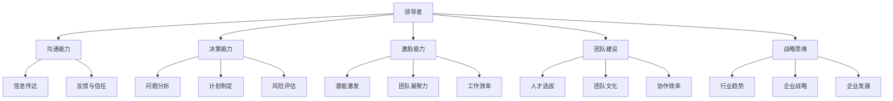

                 

# 领导力思维：改变行业格局的领导力修炼秘籍

> 关键词：领导力、战略思维、团队建设、自我认知、企业变革

> 摘要：本文将深入探讨领导力的本质，分析其在企业和管理中的重要性，并通过自我认知与反思、领导力核心要素、领导力培养方法等方面，为读者提供一套全面的领导力修炼秘籍，帮助读者提升自身的领导能力，推动企业创新和发展。

## 第一部分：背景介绍

### 1.1.1 问题背景

在当今快速发展的商业环境中，领导力的重要性愈发突出。随着市场竞争的加剧和技术的不断进步，企业需要能够快速适应变化，创新求变，以保持竞争优势。因此，提升领导力，培养具有前瞻性、创新思维和战略眼光的领导者，成为企业发展的关键。

### 1.1.2 问题描述

本书旨在为读者提供一套全面的领导力思维修炼方法，帮助读者理解领导力的本质，提升自身的领导能力。本书将围绕以下几个问题进行探讨：

1. 领导力的定义及其在企业和组织中的重要性。
2. 领导者的角色与职责，以及如何成为优秀的领导者。
3. 如何培养创新思维，推动企业变革和发展。
4. 如何构建高效的团队，提升团队协作效率。
5. 领导力在不同行业和领域的应用与实践。

### 1.1.3 问题解决

本书将通过以下方式解决上述问题：

1. 深入剖析领导力的核心概念，帮助读者理解领导力的本质。
2. 介绍领导者的角色与职责，并提供成为优秀领导者的方法和技巧。
3. 探讨创新思维的重要性，提供培养创新思维的方法和策略。
4. 分析团队协作的关键要素，提供构建高效团队的方法和技巧。
5. 结合实际案例，展示领导力在不同行业和领域的应用与实践，为读者提供参考和启示。

### 1.1.4 边界与外延

本书主要关注领导力在企业和管理层面的应用，不涉及政治、军事等领域的领导力。同时，本书也不涉及领导力的心理学、社会学等其他方面。

### 1.1.5 概念结构与核心要素组成

领导力概念结构：

1. 领导者的角色与职责
2. 领导力核心要素：沟通、决策、激励、团队建设、战略思维等
3. 领导力培养方法：自我认知、知识学习、实践锻炼、反馈与调整等

核心要素组成：

1. 沟通能力：有效传达信息、倾听反馈、建立信任
2. 决策能力：分析问题、制定计划、风险评估、决策执行
3. 激励能力：激发员工潜能、增强团队凝聚力、提高工作效率
4. 团队建设：选拔人才、培养团队文化、提升团队协作效率
5. 战略思维：把握行业趋势、制定企业战略、推动企业发展

## 第二部分：核心概念与联系

### 2.1 领导力核心概念

#### 2.1.1 领导力的定义

领导力是指个体或团体在特定情境下，通过影响、激励和引导他人，实现共同目标的能力。领导力不仅仅是职位赋予的权力，更是个人魅力、能力、智慧和价值观的综合体现。

#### 2.1.2 领导力的属性

1. 动态性：领导力不是静态的，它随着时间、环境和情境的变化而变化。
2. 互动性：领导力不仅涉及领导者与下属的关系，还包括与其他利益相关者的互动。
3. 多维度：领导力包括多个方面，如沟通能力、决策能力、激励能力、团队建设能力等。

#### 2.1.3 领导力与管理的区别

领导力与管理密切相关，但又有区别。管理侧重于组织、规划、执行和监督，而领导力则侧重于激发、激励和引导团队成员，推动组织实现目标。

### 2.2 领导力核心要素对比表格

| 核心要素 | 描述 | 对比 |
| :----: | :----: | :----: |
| 沟通能力 | 有效传达信息、倾听反馈、建立信任 |  |
| 决策能力 | 分析问题、制定计划、风险评估、决策执行 |  |
| 激励能力 | 激发员工潜能、增强团队凝聚力、提高工作效率 |  |
| 团队建设 | 选拔人才、培养团队文化、提升团队协作效率 |  |
| 战略思维 | 把握行业趋势、制定企业战略、推动企业发展 |  |

### 2.3 领导力ER实体关系图

## 第三部分：领导力思维与修炼

### 3.1 自我认知与反思

#### 3.1.1 自我认知的重要性

自我认知是指领导者对自己性格、能力、价值观等方面的认识和了解。自我认知对于提升领导力至关重要。只有深入了解自己，领导者才能更好地发挥自己的优势，克服自己的缺点，从而更好地引领团队。

#### 3.1.2 自我认知的方法

1. 反思日记：定期记录自己的工作、生活和思考，反思自己的行为和决策，分析其中的优点和不足。
2. 倾听反馈：主动倾听他人的意见和建议，特别是下属和同事的反馈，从中发现自己的盲点和不足。
3. 咨询导师：向有经验的领导者或导师请教，了解自己的领导风格和影响力。
4. 专业评估：通过专业的领导力评估工具，了解自己的领导力水平和潜在的发展方向。

#### 3.1.3 自我认知的实践

1. 定期进行自我反思，记录自己的成长和进步。
2. 建立积极的人际关系，主动寻求他人的反馈和建议。
3. 根据自己的优势和不足，制定个人成长计划，并付诸实践。
4. 勇于面对自己的不足，不断学习和提升自己。

### 3.2 领导力核心要素

#### 3.2.1 沟通能力

沟通能力是领导者必须具备的核心要素之一。有效的沟通可以帮助领导者更好地传达信息、倾听反馈、建立信任，从而推动团队协作和实现目标。

1. **信息传达**：领导者需要能够清晰、准确地传达信息，确保团队成员理解并执行。
2. **反馈与信任**：领导者需要积极倾听下属的反馈，建立信任关系，从而提高团队的凝聚力和工作效率。

#### 3.2.2 决策能力

决策能力是领导者的重要职责之一。领导者需要具备分析问题、制定计划、风险评估和决策执行的能力。

1. **问题分析**：领导者需要能够准确识别问题，分析问题的原因和影响。
2. **计划制定**：领导者需要制定可行的解决方案，明确目标、资源和时间表。
3. **风险评估**：领导者需要评估解决方案的风险，确保决策的可行性和可持续性。
4. **决策执行**：领导者需要确保决策得到有效执行，监督执行过程，确保目标的实现。

#### 3.2.3 激励能力

激励能力是领导者激发员工潜能、增强团队凝聚力、提高工作效率的关键。

1. **潜能激发**：领导者需要了解员工的优势和潜力，为其提供发展的机会和空间。
2. **团队凝聚力**：领导者需要建立积极向上的团队文化，增强团队的凝聚力。
3. **工作效率**：领导者需要激励员工，提高团队的工作效率，实现团队的目标。

#### 3.2.4 团队建设

团队建设是领导者提升团队协作效率、实现共同目标的重要手段。

1. **人才选拔**：领导者需要选拔合适的人才，根据其能力和特长安排合适的职位。
2. **团队文化**：领导者需要建立积极的团队文化，促进团队成员之间的相互支持和合作。
3. **协作效率**：领导者需要提升团队的协作效率，确保团队目标的高效实现。

#### 3.2.5 战略思维

战略思维是领导者把握行业趋势、制定企业战略、推动企业发展的重要能力。

1. **行业趋势**：领导者需要了解行业的发展趋势和动态，把握市场机会。
2. **企业战略**：领导者需要制定符合企业实际情况的战略规划，确保企业的可持续发展。
3. **企业发展**：领导者需要推动企业实现战略目标，持续提升企业的核心竞争力和市场地位。

### 3.3 领导力培养方法

#### 3.3.1 自我认知

自我认知是领导力培养的基础。领导者需要通过自我反思、倾听反馈、咨询导师和专业评估等方式，深入了解自己的性格、能力、价值观等方面。

#### 3.3.2 知识学习

知识学习是领导力提升的关键。领导者需要不断学习新的知识和技能，包括管理知识、行业知识、领导力技巧等。

#### 3.3.3 实践锻炼

实践锻炼是领导力提升的重要途径。领导者需要通过实际的工作经历，将学到的知识和技能应用到实践中，不断积累经验和提升能力。

#### 3.3.4 反馈与调整

反馈与调整是领导力提升的重要环节。领导者需要定期接受他人的反馈，了解自己的优势和不足，并根据反馈进行调整和改进。

### 3.4 实际案例分析

#### 3.4.1 案例背景

某科技公司在市场竞争激烈的环境下，通过领导力的提升，实现了从初创公司到行业领军企业的转变。该公司创始人兼CEO在领导力提升方面做出了诸多努力，成为企业成功的关键因素。

#### 3.4.2 领导力核心要素实践

1. **自我认知**：CEO通过反思和反馈，深入了解自己的性格、能力和价值观，明确自己的优势和不足。
2. **沟通能力**：CEO通过有效的沟通，建立了与员工、合作伙伴和投资者的信任关系，促进了团队的协作和合作。
3. **决策能力**：CEO在面对市场变化和竞争压力时，能够迅速做出正确的决策，确保企业持续发展。
4. **激励能力**：CEO通过激发员工潜能和建立积极的团队文化，提高了团队的工作效率和企业凝聚力。
5. **团队建设**：CEO通过选拔合适的人才和建立积极的团队文化，提升了团队的协作效率和创新能力。
6. **战略思维**：CEO通过把握行业趋势和制定企业战略，推动了企业的持续发展和市场拓展。

#### 3.4.3 案例启示

该案例表明，领导力的提升对于企业的发展至关重要。通过自我认知、沟通能力、决策能力、激励能力、团队建设和战略思维等核心要素的实践，领导者可以提升自身的领导能力，推动企业实现持续发展。

### 3.5 最佳实践

1. **建立自我认知**：领导者需要通过反思、反馈和评估，深入了解自己的性格、能力和价值观，建立清晰的自我认知。
2. **持续学习**：领导者需要不断学习新的知识和技能，包括管理知识、行业知识、领导力技巧等。
3. **实践锻炼**：领导者需要通过实际的工作经历，将学到的知识和技能应用到实践中，不断积累经验和提升能力。
4. **积极反馈**：领导者需要积极接受他人的反馈，了解自己的优势和不足，并根据反馈进行调整和改进。

### 3.6 小结

领导力是推动企业发展和实现目标的关键因素。通过自我认知、沟通能力、决策能力、激励能力、团队建设和战略思维等核心要素的修炼，领导者可以提升自身的领导能力，推动企业实现持续发展。在实践过程中，领导者需要不断学习、实践和反思，不断提升自己的领导水平。

### 3.7 注意事项

1. 领导力提升是一个持续的过程，需要领导者不断努力和坚持。
2. 领导者需要关注团队成员的需求和反馈，建立积极的人际关系。
3. 领导者需要具备敏锐的市场洞察力和战略思维，把握行业趋势。
4. 领导者需要勇于面对挑战和变革，推动企业持续创新和发展。

### 3.8 拓展阅读

1. 《领导力：理论和实践》
2. 《创新者的窘境》
3. 《团队协作力：如何打造高效团队》
4. 《影响力：说服他人的心理学技巧》

作者：AI天才研究院/AI Genius Institute & 禅与计算机程序设计艺术 /Zen And The Art of Computer Programming# 领导力思维：改变行业格局的领导力修炼秘籍

> 关键词：领导力、战略思维、团队建设、自我认知、企业变革

> 摘要：本文深入探讨领导力的本质，分析其在企业和管理中的重要性，并通过自我认知与反思、领导力核心要素、领导力培养方法等方面，为读者提供一套全面的领导力修炼秘籍，帮助读者提升自身的领导能力，推动企业创新和发展。

## 第一部分：背景介绍

### 1.1.1 问题背景

在当今快速发展的商业环境中，领导力的重要性愈发突出。随着市场竞争的加剧和技术的不断进步，企业需要能够快速适应变化，创新求变，以保持竞争优势。因此，提升领导力，培养具有前瞻性、创新思维和战略眼光的领导者，成为企业发展的关键。

### 1.1.2 问题描述

本书旨在为读者提供一套全面的领导力思维修炼方法，帮助读者理解领导力的本质，提升自身的领导能力。本书将围绕以下几个问题进行探讨：

1. 领导力的定义及其在企业和组织中的重要性。
2. 领导者的角色与职责，以及如何成为优秀的领导者。
3. 如何培养创新思维，推动企业变革和发展。
4. 如何构建高效的团队，提升团队协作效率。
5. 领导力在不同行业和领域的应用与实践。

### 1.1.3 问题解决

本书将通过以下方式解决上述问题：

1. 深入剖析领导力的核心概念，帮助读者理解领导力的本质。
2. 介绍领导者的角色与职责，并提供成为优秀领导者的方法和技巧。
3. 探讨创新思维的重要性，提供培养创新思维的方法和策略。
4. 分析团队协作的关键要素，提供构建高效团队的方法和技巧。
5. 结合实际案例，展示领导力在不同行业和领域的应用与实践，为读者提供参考和启示。

### 1.1.4 边界与外延

本书主要关注领导力在企业和管理层面的应用，不涉及政治、军事等领域的领导力。同时，本书也不涉及领导力的心理学、社会学等其他方面。

### 1.1.5 概念结构与核心要素组成

领导力概念结构：

1. 领导者的角色与职责
2. 领导力核心要素：沟通、决策、激励、团队建设、战略思维等
3. 领导力培养方法：自我认知、知识学习、实践锻炼、反馈与调整等

核心要素组成：

1. 沟通能力：有效传达信息、倾听反馈、建立信任
2. 决策能力：分析问题、制定计划、风险评估、决策执行
3. 激励能力：激发员工潜能、增强团队凝聚力、提高工作效率
4. 团队建设：选拔人才、培养团队文化、提升团队协作效率
5. 战略思维：把握行业趋势、制定企业战略、推动企业发展

## 第二部分：核心概念与联系

### 2.1 领导力核心概念

#### 2.1.1 领导力的定义

领导力是指个体或团体在特定情境下，通过影响、激励和引导他人，实现共同目标的能力。领导力不仅仅是职位赋予的权力，更是个人魅力、能力、智慧和价值观的综合体现。

#### 2.1.2 领导力的属性

1. 动态性：领导力不是静态的，它随着时间、环境和情境的变化而变化。
2. 互动性：领导力不仅涉及领导者与下属的关系，还包括与其他利益相关者的互动。
3. 多维度：领导力包括多个方面，如沟通能力、决策能力、激励能力、团队建设能力等。

#### 2.1.3 领导力与管理的区别

领导力与管理密切相关，但又有区别。管理侧重于组织、规划、执行和监督，而领导力则侧重于激发、激励和引导团队成员，推动组织实现目标。

### 2.2 领导力核心要素对比表格

| 核心要素 | 描述 | 对比 |
| :----: | :----: | :----: |
| 沟通能力 | 有效传达信息、倾听反馈、建立信任 |  |
| 决策能力 | 分析问题、制定计划、风险评估、决策执行 |  |
| 激励能力 | 激发员工潜能、增强团队凝聚力、提高工作效率 |  |
| 团队建设 | 选拔人才、培养团队文化、提升团队协作效率 |  |
| 战略思维 | 把握行业趋势、制定企业战略、推动企业发展 |  |

### 2.3 领导力ER实体关系图

## 第三部分：领导力思维与修炼

### 3.1 自我认知与反思

#### 3.1.1 自我认知的重要性

自我认知是指领导者对自己性格、能力、价值观等方面的认识和了解。自我认知对于提升领导力至关重要。只有深入了解自己，领导者才能更好地发挥自己的优势，克服自己的缺点，从而更好地引领团队。

#### 3.1.2 自我认知的方法

1. 反思日记：定期记录自己的工作、生活和思考，反思自己的行为和决策，分析其中的优点和不足。
2. 倾听反馈：主动倾听他人的意见和建议，特别是下属和同事的反馈，从中发现自己的盲点和不足。
3. 咨询导师：向有经验的领导者或导师请教，了解自己的领导风格和影响力。
4. 专业评估：通过专业的领导力评估工具，了解自己的领导力水平和潜在的发展方向。

#### 3.1.3 自我认知的实践

1. 定期进行自我反思，记录自己的成长和进步。
2. 建立积极的人际关系，主动寻求他人的反馈和建议。
3. 根据自己的优势和不足，制定个人成长计划，并付诸实践。
4. 勇于面对自己的不足，不断学习和提升自己。

### 3.2 领导力核心要素

#### 3.2.1 沟通能力

沟通能力是领导者必须具备的核心要素之一。有效的沟通可以帮助领导者更好地传达信息、倾听反馈、建立信任，从而推动团队协作和实现目标。

1. **信息传达**：领导者需要能够清晰、准确地传达信息，确保团队成员理解并执行。
2. **反馈与信任**：领导者需要积极倾听下属的反馈，建立信任关系，从而提高团队的凝聚力和工作效率。

#### 3.2.2 决策能力

决策能力是领导者的重要职责之一。领导者需要具备分析问题、制定计划、风险评估和决策执行的能力。

1. **问题分析**：领导者需要能够准确识别问题，分析问题的原因和影响。
2. **计划制定**：领导者需要制定可行的解决方案，明确目标、资源和时间表。
3. **风险评估**：领导者需要评估解决方案的风险，确保决策的可行性和可持续性。
4. **决策执行**：领导者需要确保决策得到有效执行，监督执行过程，确保目标的实现。

#### 3.2.3 激励能力

激励能力是领导者激发员工潜能、增强团队凝聚力、提高工作效率的关键。

1. **潜能激发**：领导者需要了解员工的优势和潜力，为其提供发展的机会和空间。
2. **团队凝聚力**：领导者需要建立积极向上的团队文化，增强团队的凝聚力。
3. **工作效率**：领导者需要激励员工，提高团队的工作效率，实现团队的目标。

#### 3.2.4 团队建设

团队建设是领导者提升团队协作效率、实现共同目标的重要手段。

1. **人才选拔**：领导者需要选拔合适的人才，根据其能力和特长安排合适的职位。
2. **团队文化**：领导者需要建立积极的团队文化，促进团队成员之间的相互支持和合作。
3. **协作效率**：领导者需要提升团队的协作效率，确保团队目标的高效实现。

#### 3.2.5 战略思维

战略思维是领导者把握行业趋势、制定企业战略、推动企业发展的重要能力。

1. **行业趋势**：领导者需要了解行业的发展趋势和动态，把握市场机会。
2. **企业战略**：领导者需要制定符合企业实际情况的战略规划，确保企业的可持续发展。
3. **企业发展**：领导者需要推动企业实现战略目标，持续提升企业的核心竞争力和市场地位。

### 3.3 领导力培养方法

#### 3.3.1 自我认知

自我认知是领导力培养的基础。领导者需要通过自我反思、倾听反馈、咨询导师和专业评估等方式，深入了解自己的性格、能力、价值观等方面。

#### 3.3.2 知识学习

知识学习是领导力提升的关键。领导者需要不断学习新的知识和技能，包括管理知识、行业知识、领导力技巧等。

#### 3.3.3 实践锻炼

实践锻炼是领导力提升的重要途径。领导者需要通过实际的工作经历，将学到的知识和技能应用到实践中，不断积累经验和提升能力。

#### 3.3.4 反馈与调整

反馈与调整是领导力提升的重要环节。领导者需要定期接受他人的反馈，了解自己的优势和不足，并根据反馈进行调整和改进。

### 3.4 实际案例分析

#### 3.4.1 案例背景

某科技公司在市场竞争激烈的环境下，通过领导力的提升，实现了从初创公司到行业领军企业的转变。该公司创始人兼CEO在领导力提升方面做出了诸多努力，成为企业成功的关键因素。

#### 3.4.2 领导力核心要素实践

1. **自我认知**：CEO通过反思和反馈，深入了解自己的性格、能力和价值观，明确自己的优势和不足。
2. **沟通能力**：CEO通过有效的沟通，建立了与员工、合作伙伴和投资者的信任关系，促进了团队的协作和合作。
3. **决策能力**：CEO在面对市场变化和竞争压力时，能够迅速做出正确的决策，确保企业持续发展。
4. **激励能力**：CEO通过激发员工潜能和建立积极的团队文化，提高了团队的工作效率和企业凝聚力。
5. **团队建设**：CEO通过选拔合适的人才和建立积极的团队文化，提升了团队的协作效率和创新能力。
6. **战略思维**：CEO通过把握行业趋势和制定企业战略，推动了企业的持续发展和市场拓展。

#### 3.4.3 案例启示

该案例表明，领导力的提升对于企业的发展至关重要。通过自我认知、沟通能力、决策能力、激励能力、团队建设和战略思维等核心要素的实践，领导者可以提升自身的领导能力，推动企业实现持续发展。

### 3.5 最佳实践

1. **建立自我认知**：领导者需要通过反思、反馈和评估，深入了解自己的性格、能力和价值观，建立清晰的自我认知。
2. **持续学习**：领导者需要不断学习新的知识和技能，包括管理知识、行业知识、领导力技巧等。
3. **实践锻炼**：领导者需要通过实际的工作经历，将学到的知识和技能应用到实践中，不断积累经验和提升能力。
4. **积极反馈**：领导者需要积极接受他人的反馈，了解自己的优势和不足，并根据反馈进行调整和改进。

### 3.6 小结

领导力是推动企业发展和实现目标的关键因素。通过自我认知、沟通能力、决策能力、激励能力、团队建设和战略思维等核心要素的修炼，领导者可以提升自身的领导能力，推动企业实现持续发展。在实践过程中，领导者需要不断学习、实践和反思，不断提升自己的领导水平。

### 3.7 注意事项

1. 领导力提升是一个持续的过程，需要领导者不断努力和坚持。
2. 领导者需要关注团队成员的需求和反馈，建立积极的人际关系。
3. 领导者需要具备敏锐的市场洞察力和战略思维，把握行业趋势。
4. 领导者需要勇于面对挑战和变革，推动企业持续创新和发展。

### 3.8 拓展阅读

1. 《领导力：理论和实践》
2. 《创新者的窘境》
3. 《团队协作力：如何打造高效团队》
4. 《影响力：说服他人的心理学技巧》

作者：AI天才研究院/AI Genius Institute & 禅与计算机程序设计艺术 /Zen And The Art of Computer Programming# 领导力思维：改变行业格局的领导力修炼秘籍

## 目录

- 引言
  - 领导力的重要性
  - 领导力的定义与特征
- 第一部分：背景介绍
  - 问题背景
  - 问题描述
  - 问题解决
  - 边界与外延
  - 概念结构与核心要素组成
- 第二部分：核心概念与联系
  - 领导力核心概念
  - 领导力核心要素对比表格
  - 领导力ER实体关系图
- 第三部分：领导力思维与修炼
  - 自我认知与反思
  - 领导力核心要素
  - 领导力培养方法
  - 实际案例分析
- 第四部分：领导力实践与提升
  - 领导力实践要点
  - 领导力提升策略
  - 领导力实战技巧
- 第五部分：领导力应用与展望
  - 领导力在不同行业的应用
  - 领导力未来发展趋势
  - 领导力对企业发展的影响
- 结论
  - 领导力的总结与展望
  - 对读者的寄语

## 引言

### 领导力的重要性

在当今的商业环境中，领导力被视为企业成功的关键因素之一。随着全球化和信息技术的快速发展，企业面临的市场竞争日益激烈，创新和变革成为企业生存和发展的核心动力。而领导力正是推动企业创新和变革的重要力量。

首先，领导力能够激发员工的潜力和创造力。一个优秀的领导者能够发现员工的优点，提供发展的机会，从而激发员工的积极性和创造力，提高团队的整体绩效。

其次，领导力能够塑造企业的文化和价值观。领导者通过自身的言行和决策，传递企业的使命、愿景和价值观，形成一种积极的团队氛围，提高员工的工作满意度和忠诚度。

最后，领导力能够推动企业的持续发展。一个具有战略思维和远见卓识的领导者，能够把握市场趋势，制定合适的发展策略，推动企业的创新和变革，实现企业的可持续发展。

### 领导力的定义与特征

领导力是指个体或团队在特定情境下，通过影响、激励和引导他人，实现共同目标的能力。领导力不仅仅是职位赋予的权力，更是个人魅力、能力、智慧和价值观的综合体现。

领导力的特征主要包括以下几个方面：

1. **动态性**：领导力不是静态的，它随着时间、环境和情境的变化而变化。一个优秀的领导者能够根据不同的情境，灵活调整自己的领导风格和策略。

2. **互动性**：领导力不仅涉及领导者与下属的关系，还包括与其他利益相关者的互动。一个优秀的领导者能够与团队成员、合作伙伴、客户等建立良好的关系，形成有效的工作网络。

3. **多维度**：领导力包括多个方面，如沟通能力、决策能力、激励能力、团队建设能力、战略思维等。一个优秀的领导者需要具备全面的领导能力，能够在不同方面发挥影响力。

4. **影响力**：领导力是一种影响力，领导者通过自己的言行和决策，影响和引导他人。一个优秀的领导者能够激发团队成员的积极性和创造力，形成强大的团队凝聚力。

5. **持续发展**：领导力是一种持续发展的能力。一个优秀的领导者需要不断学习和提升自己的领导能力，适应不断变化的环境和挑战。

## 第一部分：背景介绍

### 问题背景

在当今快速发展的商业环境中，领导力的重要性愈发突出。随着市场竞争的加剧和技术的不断进步，企业需要能够快速适应变化，创新求变，以保持竞争优势。因此，提升领导力，培养具有前瞻性、创新思维和战略眼光的领导者，成为企业发展的关键。

### 问题描述

本书旨在为读者提供一套全面的领导力思维修炼方法，帮助读者理解领导力的本质，提升自身的领导能力。本书将围绕以下几个问题进行探讨：

1. 领导力的定义及其在企业和组织中的重要性。
2. 领导者的角色与职责，以及如何成为优秀的领导者。
3. 如何培养创新思维，推动企业变革和发展。
4. 如何构建高效的团队，提升团队协作效率。
5. 领导力在不同行业和领域的应用与实践。

### 问题解决

本书将通过以下方式解决上述问题：

1. 深入剖析领导力的核心概念，帮助读者理解领导力的本质。
2. 介绍领导者的角色与职责，并提供成为优秀领导者的方法和技巧。
3. 探讨创新思维的重要性，提供培养创新思维的方法和策略。
4. 分析团队协作的关键要素，提供构建高效团队的方法和技巧。
5. 结合实际案例，展示领导力在不同行业和领域的应用与实践，为读者提供参考和启示。

### 边界与外延

本书主要关注领导力在企业和管理层面的应用，不涉及政治、军事等领域的领导力。同时，本书也不涉及领导力的心理学、社会学等其他方面。

### 概念结构与核心要素组成

领导力概念结构：

1. 领导者的角色与职责
2. 领导力核心要素：沟通、决策、激励、团队建设、战略思维等
3. 领导力培养方法：自我认知、知识学习、实践锻炼、反馈与调整等

核心要素组成：

1. 沟通能力：有效传达信息、倾听反馈、建立信任
2. 决策能力：分析问题、制定计划、风险评估、决策执行
3. 激励能力：激发员工潜能、增强团队凝聚力、提高工作效率
4. 团队建设：选拔人才、培养团队文化、提升团队协作效率
5. 战略思维：把握行业趋势、制定企业战略、推动企业发展

## 第二部分：核心概念与联系

### 2.1 领导力核心概念

#### 2.1.1 领导力的定义

领导力是指个体或团体在特定情境下，通过影响、激励和引导他人，实现共同目标的能力。领导力不仅仅是职位赋予的权力，更是个人魅力、能力、智慧和价值观的综合体现。

#### 2.1.2 领导力的属性

1. 动态性：领导力不是静态的，它随着时间、环境和情境的变化而变化。
2. 互动性：领导力不仅涉及领导者与下属的关系，还包括与其他利益相关者的互动。
3. 多维度：领导力包括多个方面，如沟通能力、决策能力、激励能力、团队建设能力等。
4. 影响力：领导力是一种影响力，领导者通过自己的言行和决策，影响和引导他人。
5. 持续发展：领导力是一种持续发展的能力。一个优秀的领导者需要不断学习和提升自己的领导能力，适应不断变化的环境和挑战。

### 2.2 领导力核心要素对比表格

| 核心要素 | 描述 | 对比 |
| :----: | :----: | :----: |
| 沟通能力 | 有效传达信息、倾听反馈、建立信任 |  |
| 决策能力 | 分析问题、制定计划、风险评估、决策执行 |  |
| 激励能力 | 激发员工潜能、增强团队凝聚力、提高工作效率 |  |
| 团队建设 | 选拔人才、培养团队文化、提升团队协作效率 |  |
| 战略思维 | 把握行业趋势、制定企业战略、推动企业发展 |  |

### 2.3 领导力ER实体关系图

## 第三部分：领导力思维与修炼

### 3.1 自我认知与反思

#### 3.1.1 自我认知的重要性

自我认知是指领导者对自己性格、能力、价值观等方面的认识和了解。自我认知对于提升领导力至关重要。只有深入了解自己，领导者才能更好地发挥自己的优势，克服自己的缺点，从而更好地引领团队。

#### 3.1.2 自我认知的方法

1. **反思日记**：定期记录自己的工作、生活和思考，反思自己的行为和决策，分析其中的优点和不足。
2. **倾听反馈**：主动倾听他人的意见和建议，特别是下属和同事的反馈，从中发现自己的盲点和不足。
3. **咨询导师**：向有经验的领导者或导师请教，了解自己的领导风格和影响力。
4. **专业评估**：通过专业的领导力评估工具，了解自己的领导力水平和潜在的发展方向。

#### 3.1.3 自我认知的实践

1. **定期反思**：领导者应定期对自己的工作进行反思，总结经验教训，发现自身的不足，并制定改进计划。
2. **建立反馈机制**：领导者应建立有效的反馈机制，鼓励团队成员提供真诚的反馈，以便更好地了解自己的表现。
3. **持续学习**：领导者应不断学习新的知识和技能，提升自己的综合素质，以更好地适应不断变化的环境。
4. **勇于面对不足**：领导者应勇于面对自己的不足，敢于承认错误，并积极寻求改进的方法。

### 3.2 领导力核心要素

#### 3.2.1 沟通能力

沟通能力是领导者必须具备的核心要素之一。有效的沟通可以帮助领导者更好地传达信息、倾听反馈、建立信任，从而推动团队协作和实现目标。

1. **信息传达**：领导者需要能够清晰、准确地传达信息，确保团队成员理解并执行。
2. **反馈与信任**：领导者需要积极倾听下属的反馈，建立信任关系，从而提高团队的凝聚力和工作效率。

#### 3.2.2 决策能力

决策能力是领导者的重要职责之一。领导者需要具备分析问题、制定计划、风险评估和决策执行的能力。

1. **问题分析**：领导者需要能够准确识别问题，分析问题的原因和影响。
2. **计划制定**：领导者需要制定可行的解决方案，明确目标、资源和时间表。
3. **风险评估**：领导者需要评估解决方案的风险，确保决策的可行性和可持续性。
4. **决策执行**：领导者需要确保决策得到有效执行，监督执行过程，确保目标的实现。

#### 3.2.3 激励能力

激励能力是领导者激发员工潜能、增强团队凝聚力、提高工作效率的关键。

1. **潜能激发**：领导者需要了解员工的优势和潜力，为其提供发展的机会和空间。
2. **团队凝聚力**：领导者需要建立积极向上的团队文化，增强团队的凝聚力。
3. **工作效率**：领导者需要激励员工，提高团队的工作效率，实现团队的目标。

#### 3.2.4 团队建设

团队建设是领导者提升团队协作效率、实现共同目标的重要手段。

1. **人才选拔**：领导者需要选拔合适的人才，根据其能力和特长安排合适的职位。
2. **团队文化**：领导者需要建立积极的团队文化，促进团队成员之间的相互支持和合作。
3. **协作效率**：领导者需要提升团队的协作效率，确保团队目标的高效实现。

#### 3.2.5 战略思维

战略思维是领导者把握行业趋势、制定企业战略、推动企业发展的重要能力。

1. **行业趋势**：领导者需要了解行业的发展趋势和动态，把握市场机会。
2. **企业战略**：领导者需要制定符合企业实际情况的战略规划，确保企业的可持续发展。
3. **企业发展**：领导者需要推动企业实现战略目标，持续提升企业的核心竞争力和市场地位。

### 3.3 领导力培养方法

#### 3.3.1 自我认知

自我认知是领导力培养的基础。领导者需要通过自我反思、倾听反馈、咨询导师和专业评估等方式，深入了解自己的性格、能力、价值观等方面。

#### 3.3.2 知识学习

知识学习是领导力提升的关键。领导者需要不断学习新的知识和技能，包括管理知识、行业知识、领导力技巧等。

#### 3.3.3 实践锻炼

实践锻炼是领导力提升的重要途径。领导者需要通过实际的工作经历，将学到的知识和技能应用到实践中，不断积累经验和提升能力。

#### 3.3.4 反馈与调整

反馈与调整是领导力提升的重要环节。领导者需要定期接受他人的反馈，了解自己的优势和不足，并根据反馈进行调整和改进。

### 3.4 实际案例分析

#### 3.4.1 案例背景

某科技公司在市场竞争激烈的环境下，通过领导力的提升，实现了从初创公司到行业领军企业的转变。该公司创始人兼CEO在领导力提升方面做出了诸多努力，成为企业成功的关键因素。

#### 3.4.2 领导力核心要素实践

1. **自我认知**：CEO通过反思和反馈，深入了解自己的性格、能力和价值观，明确自己的优势和不足。
2. **沟通能力**：CEO通过有效的沟通，建立了与员工、合作伙伴和投资者的信任关系，促进了团队的协作和合作。
3. **决策能力**：CEO在面对市场变化和竞争压力时，能够迅速做出正确的决策，确保企业持续发展。
4. **激励能力**：CEO通过激发员工潜能和建立积极的团队文化，提高了团队的工作效率和企业凝聚力。
5. **团队建设**：CEO通过选拔合适的人才和建立积极的团队文化，提升了团队的协作效率和创新能力。
6. **战略思维**：CEO通过把握行业趋势和制定企业战略，推动了企业的持续发展和市场拓展。

#### 3.4.3 案例启示

该案例表明，领导力的提升对于企业的发展至关重要。通过自我认知、沟通能力、决策能力、激励能力、团队建设和战略思维等核心要素的实践，领导者可以提升自身的领导能力，推动企业实现持续发展。

### 3.5 最佳实践

1. **建立自我认知**：领导者需要通过反思、反馈和评估，深入了解自己的性格、能力和价值观，建立清晰的自我认知。
2. **持续学习**：领导者需要不断学习新的知识和技能，包括管理知识、行业知识、领导力技巧等。
3. **实践锻炼**：领导者需要通过实际的工作经历，将学到的知识和技能应用到实践中，不断积累经验和提升能力。
4. **积极反馈**：领导者需要积极接受他人的反馈，了解自己的优势和不足，并根据反馈进行调整和改进。

### 3.6 小结

领导力是推动企业发展和实现目标的关键因素。通过自我认知、沟通能力、决策能力、激励能力、团队建设和战略思维等核心要素的修炼，领导者可以提升自身的领导能力，推动企业实现持续发展。在实践过程中，领导者需要不断学习、实践和反思，不断提升自己的领导水平。

### 3.7 注意事项

1. 领导力提升是一个持续的过程，需要领导者不断努力和坚持。
2. 领导者需要关注团队成员的需求和反馈，建立积极的人际关系。
3. 领导者需要具备敏锐的市场洞察力和战略思维，把握行业趋势。
4. 领导者需要勇于面对挑战和变革，推动企业持续创新和发展。

### 3.8 拓展阅读

1. 《领导力：理论和实践》
2. 《创新者的窘境》
3. 《团队协作力：如何打造高效团队》
4. 《影响力：说服他人的心理学技巧》

作者：AI天才研究院/AI Genius Institute & 禅与计算机程序设计艺术 /Zen And The Art of Computer Programming# 领导力思维：改变行业格局的领导力修炼秘籍

## 引言

### 领导力的重要性

在当今的商业世界中，领导力是企业成功的关键因素之一。随着市场的不断变化和竞争的加剧，企业需要具备快速适应和创新能力，以保持竞争优势。而领导力正是推动企业创新和变革的重要力量。一个优秀的领导者不仅能够激发员工的潜力，提升团队的整体效率，还能为企业制定明确的发展战略，引领企业走向成功。

### 领导力的定义与特征

领导力是指个体或团队在特定情境下，通过影响、激励和引导他人，实现共同目标的能力。它不仅仅是职位赋予的权力，更是个人魅力、能力、智慧和价值观的综合体现。领导力的特征主要包括以下几个方面：

1. **影响力**：领导者能够通过自己的言行和决策，影响和引导他人。
2. **动态性**：领导力不是静态的，它随着时间、环境和情境的变化而变化。
3. **互动性**：领导力不仅涉及领导者与下属的关系，还包括与其他利益相关者的互动。
4. **多维度**：领导力包括多个方面，如沟通能力、决策能力、激励能力、团队建设能力等。
5. **持续发展**：领导力是一种持续发展的能力。一个优秀的领导者需要不断学习和提升自己的领导能力，以适应不断变化的环境和挑战。

## 第一部分：背景介绍

### 问题背景

在当今快速发展的商业环境中，领导力的重要性愈发突出。随着市场竞争的加剧和技术的不断进步，企业需要能够快速适应变化，创新求变，以保持竞争优势。因此，提升领导力，培养具有前瞻性、创新思维和战略眼光的领导者，成为企业发展的关键。

### 问题描述

本书旨在为读者提供一套全面的领导力思维修炼方法，帮助读者理解领导力的本质，提升自身的领导能力。本书将围绕以下几个问题进行探讨：

1. 领导力的定义及其在企业和组织中的重要性。
2. 领导者的角色与职责，以及如何成为优秀的领导者。
3. 如何培养创新思维，推动企业变革和发展。
4. 如何构建高效的团队，提升团队协作效率。
5. 领导力在不同行业和领域的应用与实践。

### 问题解决

本书将通过以下方式解决上述问题：

1. 深入剖析领导力的核心概念，帮助读者理解领导力的本质。
2. 介绍领导者的角色与职责，并提供成为优秀领导者的方法和技巧。
3. 探讨创新思维的重要性，提供培养创新思维的方法和策略。
4. 分析团队协作的关键要素，提供构建高效团队的方法和技巧。
5. 结合实际案例，展示领导力在不同行业和领域的应用与实践，为读者提供参考和启示。

### 边界与外延

本书主要关注领导力在企业和管理层面的应用，不涉及政治、军事等领域的领导力。同时，本书也不涉及领导力的心理学、社会学等其他方面。

### 概念结构与核心要素组成

领导力概念结构：

1. 领导者的角色与职责
2. 领导力核心要素：沟通、决策、激励、团队建设、战略思维等
3. 领导力培养方法：自我认知、知识学习、实践锻炼、反馈与调整等

核心要素组成：

1. 沟通能力：有效传达信息、倾听反馈、建立信任
2. 决策能力：分析问题、制定计划、风险评估、决策执行
3. 激励能力：激发员工潜能、增强团队凝聚力、提高工作效率
4. 团队建设：选拔人才、培养团队文化、提升团队协作效率
5. 战略思维：把握行业趋势、制定企业战略、推动企业发展

## 第二部分：核心概念与联系

### 2.1 领导力核心概念

#### 2.1.1 领导力的定义

领导力是指个体或团队在特定情境下，通过影响、激励和引导他人，实现共同目标的能力。领导力不仅仅是职位赋予的权力，更是个人魅力、能力、智慧和价值观的综合体现。

#### 2.1.2 领导力的属性

1. **动态性**：领导力不是静态的，它随着时间、环境和情境的变化而变化。
2. **互动性**：领导力不仅涉及领导者与下属的关系，还包括与其他利益相关者的互动。
3. **多维度**：领导力包括多个方面，如沟通能力、决策能力、激励能力、团队建设能力等。
4. **影响力**：领导者能够通过自己的言行和决策，影响和引导他人。
5. **持续发展**：领导力是一种持续发展的能力。一个优秀的领导者需要不断学习和提升自己的领导能力，以适应不断变化的环境和挑战。

#### 2.1.3 领导力与管理的区别

领导力与管理密切相关，但又有区别。管理侧重于组织、规划、执行和监督，而领导力则侧重于激发、激励和引导团队成员，推动组织实现目标。

### 2.2 领导力核心要素对比表格

| 核心要素 | 描述 | 对比 |
| :----: | :----: | :----: |
| 沟通能力 | 有效传达信息、倾听反馈、建立信任 |  |
| 决策能力 | 分析问题、制定计划、风险评估、决策执行 |  |
| 激励能力 | 激发员工潜能、增强团队凝聚力、提高工作效率 |  |
| 团队建设 | 选拔人才、培养团队文化、提升团队协作效率 |  |
| 战略思维 | 把握行业趋势、制定企业战略、推动企业发展 |  |

### 2.3 领导力ER实体关系图

## 第三部分：领导力思维与修炼

### 3.1 自我认知与反思

#### 3.1.1 自我认知的重要性

自我认知是指领导者对自己性格、能力、价值观等方面的认识和了解。自我认知对于提升领导力至关重要。只有深入了解自己，领导者才能更好地发挥自己的优势，克服自己的缺点，从而更好地引领团队。

#### 3.1.2 自我认知的方法

1. **反思日记**：定期记录自己的工作、生活和思考，反思自己的行为和决策，分析其中的优点和不足。
2. **倾听反馈**：主动倾听他人的意见和建议，特别是下属和同事的反馈，从中发现自己的盲点和不足。
3. **咨询导师**：向有经验的领导者或导师请教，了解自己的领导风格和影响力。
4. **专业评估**：通过专业的领导力评估工具，了解自己的领导力水平和潜在的发展方向。

#### 3.1.3 自我认知的实践

1. **定期反思**：领导者应定期对自己的工作进行反思，总结经验教训，发现自身的不足，并制定改进计划。
2. **建立反馈机制**：领导者应建立有效的反馈机制，鼓励团队成员提供真诚的反馈，以便更好地了解自己的表现。
3. **持续学习**：领导者应不断学习新的知识和技能，提升自己的综合素质，以更好地适应不断变化的环境。
4. **勇于面对不足**：领导者应勇于面对自己的不足，敢于承认错误，并积极寻求改进的方法。

### 3.2 领导力核心要素

#### 3.2.1 沟通能力

沟通能力是领导者必须具备的核心要素之一。有效的沟通可以帮助领导者更好地传达信息、倾听反馈、建立信任，从而推动团队协作和实现目标。

1. **信息传达**：领导者需要能够清晰、准确地传达信息，确保团队成员理解并执行。
2. **反馈与信任**：领导者需要积极倾听下属的反馈，建立信任关系，从而提高团队的凝聚力和工作效率。

#### 3.2.2 决策能力

决策能力是领导者的重要职责之一。领导者需要具备分析问题、制定计划、风险评估和决策执行的能力。

1. **问题分析**：领导者需要能够准确识别问题，分析问题的原因和影响。
2. **计划制定**：领导者需要制定可行的解决方案，明确目标、资源和时间表。
3. **风险评估**：领导者需要评估解决方案的风险，确保决策的可行性和可持续性。
4. **决策执行**：领导者需要确保决策得到有效执行，监督执行过程，确保目标的实现。

#### 3.2.3 激励能力

激励能力是领导者激发员工潜能、增强团队凝聚力、提高工作效率的关键。

1. **潜能激发**：领导者需要了解员工的优势和潜力，为其提供发展的机会和空间。
2. **团队凝聚力**：领导者需要建立积极向上的团队文化，增强团队的凝聚力。
3. **工作效率**：领导者需要激励员工，提高团队的工作效率，实现团队的目标。

#### 3.2.4 团队建设

团队建设是领导者提升团队协作效率、实现共同目标的重要手段。

1. **人才选拔**：领导者需要选拔合适的人才，根据其能力和特长安排合适的职位。
2. **团队文化**：领导者需要建立积极的团队文化，促进团队成员之间的相互支持和合作。
3. **协作效率**：领导者需要提升团队的协作效率，确保团队目标的高效实现。

#### 3.2.5 战略思维

战略思维是领导者把握行业趋势、制定企业战略、推动企业发展的重要能力。

1. **行业趋势**：领导者需要了解行业的发展趋势和动态，把握市场机会。
2. **企业战略**：领导者需要制定符合企业实际情况的战略规划，确保企业的可持续发展。
3. **企业发展**：领导者需要推动企业实现战略目标，持续提升企业的核心竞争力和市场地位。

### 3.3 领导力培养方法

#### 3.3.1 自我认知

自我认知是领导力培养的基础。领导者需要通过自我反思、倾听反馈、咨询导师和专业评估等方式，深入了解自己的性格、能力、价值观等方面。

#### 3.3.2 知识学习

知识学习是领导力提升的关键。领导者需要不断学习新的知识和技能，包括管理知识、行业知识、领导力技巧等。

#### 3.3.3 实践锻炼

实践锻炼是领导力提升的重要途径。领导者需要通过实际的工作经历，将学到的知识和技能应用到实践中，不断积累经验和提升能力。

#### 3.3.4 反馈与调整

反馈与调整是领导力提升的重要环节。领导者需要定期接受他人的反馈，了解自己的优势和不足，并根据反馈进行调整和改进。

### 3.4 实际案例分析

#### 3.4.1 案例背景

某科技公司在市场竞争激烈的环境下，通过领导力的提升，实现了从初创公司到行业领军企业的转变。该公司创始人兼CEO在领导力提升方面做出了诸多努力，成为企业成功的关键因素。

#### 3.4.2 领导力核心要素实践

1. **自我认知**：CEO通过反思和反馈，深入了解自己的性格、能力和价值观，明确自己的优势和不足。
2. **沟通能力**：CEO通过有效的沟通，建立了与员工、合作伙伴和投资者的信任关系，促进了团队的协作和合作。
3. **决策能力**：CEO在面对市场变化和竞争压力时，能够迅速做出正确的决策，确保企业持续发展。
4. **激励能力**：CEO通过激发员工潜能和建立积极的团队文化，提高了团队的工作效率和企业凝聚力。
5. **团队建设**：CEO通过选拔合适的人才和建立积极的团队文化，提升了团队的协作效率和创新能力。
6. **战略思维**：CEO通过把握行业趋势和制定企业战略，推动了企业的持续发展和市场拓展。

#### 3.4.3 案例启示

该案例表明，领导力的提升对于企业的发展至关重要。通过自我认知、沟通能力、决策能力、激励能力、团队建设和战略思维等核心要素的实践，领导者可以提升自身的领导能力，推动企业实现持续发展。

### 3.5 最佳实践

1. **建立自我认知**：领导者需要通过反思、反馈和评估，深入了解自己的性格、能力和价值观，建立清晰的自我认知。
2. **持续学习**：领导者需要不断学习新的知识和技能，包括管理知识、行业知识、领导力技巧等。
3. **实践锻炼**：领导者需要通过实际的工作经历，将学到的知识和技能应用到实践中，不断积累经验和提升能力。
4. **积极反馈**：领导者需要积极接受他人的反馈，了解自己的优势和不足，并根据反馈进行调整和改进。

### 3.6 小结

领导力是推动企业发展和实现目标的关键因素。通过自我认知、沟通能力、决策能力、激励能力、团队建设和战略思维等核心要素的修炼，领导者可以提升自身的领导能力，推动企业实现持续发展。在实践过程中，领导者需要不断学习、实践和反思，不断提升自己的领导水平。

### 3.7 注意事项

1. 领导力提升是一个持续的过程，需要领导者不断努力和坚持。
2. 领导者需要关注团队成员的需求和反馈，建立积极的人际关系。
3. 领导者需要具备敏锐的市场洞察力和战略思维，把握行业趋势。
4. 领导者需要勇于面对挑战和变革，推动企业持续创新和发展。

### 3.8 拓展阅读

1. 《领导力：理论和实践》
2. 《创新者的窘境》
3. 《团队协作力：如何打造高效团队》
4. 《影响力：说服他人的心理学技巧》

作者：AI天才研究院/AI Genius Institute & 禅与计算机程序设计艺术 /Zen And The Art of Computer Programming# 领导力思维：改变行业格局的领导力修炼秘籍

## 引言

### 领导力的重要性

在当今的商业世界中，领导力是企业成功的关键因素之一。随着市场的不断变化和竞争的加剧，企业需要具备快速适应和创新能力，以保持竞争优势。而领导力正是推动企业创新和变革的重要力量。一个优秀的领导者不仅能够激发员工的潜力，提升团队的整体效率，还能为企业制定明确的发展战略，引领企业走向成功。

### 领导力的定义与特征

领导力是指个体或团队在特定情境下，通过影响、激励和引导他人，实现共同目标的能力。领导力不仅仅是职位赋予的权力，更是个人魅力、能力、智慧和价值观的综合体现。领导力的特征主要包括以下几个方面：

1. **影响力**：领导者能够通过自己的言行和决策，影响和引导他人。
2. **动态性**：领导力不是静态的，它随着时间、环境和情境的变化而变化。
3. **互动性**：领导力不仅涉及领导者与下属的关系，还包括与其他利益相关者的互动。
4. **多维度**：领导力包括多个方面，如沟通能力、决策能力、激励能力、团队建设能力等。
5. **持续发展**：领导力是一种持续发展的能力。一个优秀的领导者需要不断学习和提升自己的领导能力，以适应不断变化的环境和挑战。

## 第一部分：背景介绍

### 问题背景

在当今快速发展的商业环境中，领导力的重要性愈发突出。随着市场竞争的加剧和技术的不断进步，企业需要能够快速适应变化，创新求变，以保持竞争优势。因此，提升领导力，培养具有前瞻性、创新思维和战略眼光的领导者，成为企业发展的关键。

### 问题描述

本书旨在为读者提供一套全面的领导力思维修炼方法，帮助读者理解领导力的本质，提升自身的领导能力。本书将围绕以下几个问题进行探讨：

1. 领导力的定义及其在企业和组织中的重要性。
2. 领导者的角色与职责，以及如何成为优秀的领导者。
3. 如何培养创新思维，推动企业变革和发展。
4. 如何构建高效的团队，提升团队协作效率。
5. 领导力在不同行业和领域的应用与实践。

### 问题解决

本书将通过以下方式解决上述问题：

1. 深入剖析领导力的核心概念，帮助读者理解领导力的本质。
2. 介绍领导者的角色与职责，并提供成为优秀领导者的方法和技巧。
3. 探讨创新思维的重要性，提供培养创新思维的方法和策略。
4. 分析团队协作的关键要素，提供构建高效团队的方法和技巧。
5. 结合实际案例，展示领导力在不同行业和领域的应用与实践，为读者提供参考和启示。

### 边界与外延

本书主要关注领导力在企业和管理层面的应用，不涉及政治、军事等领域的领导力。同时，本书也不涉及领导力的心理学、社会学等其他方面。

### 概念结构与核心要素组成

领导力概念结构：

1. 领导者的角色与职责
2. 领导力核心要素：沟通、决策、激励、团队建设、战略思维等
3. 领导力培养方法：自我认知、知识学习、实践锻炼、反馈与调整等

核心要素组成：

1. 沟通能力：有效传达信息、倾听反馈、建立信任
2. 决策能力：分析问题、制定计划、风险评估、决策执行
3. 激励能力：激发员工潜能、增强团队凝聚力、提高工作效率
4. 团队建设：选拔人才、培养团队文化、提升团队协作效率
5. 战略思维：把握行业趋势、制定企业战略、推动企业发展

## 第二部分：核心概念与联系

### 2.1 领导力核心概念

#### 2.1.1 领导力的定义

领导力是指个体或团队在特定情境下，通过影响、激励和引导他人，实现共同目标的能力。领导力不仅仅是职位赋予的权力，更是个人魅力、能力、智慧和价值观的综合体现。

#### 2.1.2 领导力的属性

1. **动态性**：领导力不是静态的，它随着时间、环境和情境的变化而变化。
2. **互动性**：领导力不仅涉及领导者与下属的关系，还包括与其他利益相关者的互动。
3. **多维度**：领导力包括多个方面，如沟通能力、决策能力、激励能力、团队建设能力等。
4. **影响力**：领导者能够通过自己的言行和决策，影响和引导他人。
5. **持续发展**：领导力是一种持续发展的能力。一个优秀的领导者需要不断学习和提升自己的领导能力，以适应不断变化的环境和挑战。

#### 2.1.3 领导力与管理的区别

领导力与管理密切相关，但又有区别。管理侧重于组织、规划、执行和监督，而领导力则侧重于激发、激励和引导团队成员，推动组织实现目标。

### 2.2 领导力核心要素对比表格

| 核心要素 | 描述 | 对比 |
| :----: | :----: | :----: |
| 沟通能力 | 有效传达信息、倾听反馈、建立信任 |  |
| 决策能力 | 分析问题、制定计划、风险评估、决策执行 |  |
| 激励能力 | 激发员工潜能、增强团队凝聚力、提高工作效率 |  |
| 团队建设 | 选拔人才、培养团队文化、提升团队协作效率 |  |
| 战略思维 | 把握行业趋势、制定企业战略、推动企业发展 |  |

### 2.3 领导力ER实体关系图

## 第三部分：领导力思维与修炼

### 3.1 自我认知与反思

#### 3.1.1 自我认知的重要性

自我认知是指领导者对自己性格、能力、价值观等方面的认识和了解。自我认知对于提升领导力至关重要。只有深入了解自己，领导者才能更好地发挥自己的优势，克服自己的缺点，从而更好地引领团队。

#### 3.1.2 自我认知的方法

1. **反思日记**：定期记录自己的工作、生活和思考，反思自己的行为和决策，分析其中的优点和不足。
2. **倾听反馈**：主动倾听他人的意见和建议，特别是下属和同事的反馈，从中发现自己的盲点和不足。
3. **咨询导师**：向有经验的领导者或导师请教，了解自己的领导风格和影响力。
4. **专业评估**：通过专业的领导力评估工具，了解自己的领导力水平和潜在的发展方向。

#### 3.1.3 自我认知的实践

1. **定期反思**：领导者应定期对自己的工作进行反思，总结经验教训，发现自身的不足，并制定改进计划。
2. **建立反馈机制**：领导者应建立有效的反馈机制，鼓励团队成员提供真诚的反馈，以便更好地了解自己的表现。
3. **持续学习**：领导者应不断学习新的知识和技能，提升自己的综合素质，以更好地适应不断变化的环境。
4. **勇于面对不足**：领导者应勇于面对自己的不足，敢于承认错误，并积极寻求改进的方法。

### 3.2 领导力核心要素

#### 3.2.1 沟通能力

沟通能力是领导者必须具备的核心要素之一。有效的沟通可以帮助领导者更好地传达信息、倾听反馈、建立信任，从而推动团队协作和实现目标。

1. **信息传达**：领导者需要能够清晰、准确地传达信息，确保团队成员理解并执行。
2. **反馈与信任**：领导者需要积极倾听下属的反馈，建立信任关系，从而提高团队的凝聚力和工作效率。

#### 3.2.2 决策能力

决策能力是领导者的重要职责之一。领导者需要具备分析问题、制定计划、风险评估和决策执行的能力。

1. **问题分析**：领导者需要能够准确识别问题，分析问题的原因和影响。
2. **计划制定**：领导者需要制定可行的解决方案，明确目标、资源和时间表。
3. **风险评估**：领导者需要评估解决方案的风险，确保决策的可行性和可持续性。
4. **决策执行**：领导者需要确保决策得到有效执行，监督执行过程，确保目标的实现。

#### 3.2.3 激励能力

激励能力是领导者激发员工潜能、增强团队凝聚力、提高工作效率的关键。

1. **潜能激发**：领导者需要了解员工的优势和潜力，为其提供发展的机会和空间。
2. **团队凝聚力**：领导者需要建立积极向上的团队文化，增强团队的凝聚力。
3. **工作效率**：领导者需要激励员工，提高团队的工作效率，实现团队的目标。

#### 3.2.4 团队建设

团队建设是领导者提升团队协作效率、实现共同目标的重要手段。

1. **人才选拔**：领导者需要选拔合适的人才，根据其能力和特长安排合适的职位。
2. **团队文化**：领导者需要建立积极的团队文化，促进团队成员之间的相互支持和合作。
3. **协作效率**：领导者需要提升团队的协作效率，确保团队目标的高效实现。

#### 3.2.5 战略思维

战略思维是领导者把握行业趋势、制定企业战略、推动企业发展的重要能力。

1. **行业趋势**：领导者需要了解行业的发展趋势和动态，把握市场机会。
2. **企业战略**：领导者需要制定符合企业实际情况的战略规划，确保企业的可持续发展。
3. **企业发展**：领导者需要推动企业实现战略目标，持续提升企业的核心竞争力和市场地位。

### 3.3 领导力培养方法

#### 3.3.1 自我认知

自我认知是领导力培养的基础。领导者需要通过自我反思、倾听反馈、咨询导师和专业评估等方式，深入了解自己的性格、能力、价值观等方面。

#### 3.3.2 知识学习

知识学习是领导力提升的关键。领导者需要不断学习新的知识和技能，包括管理知识、行业知识、领导力技巧等。

#### 3.3.3 实践锻炼

实践锻炼是领导力提升的重要途径。领导者需要通过实际的工作经历，将学到的知识和技能应用到实践中，不断积累经验和提升能力。

#### 3.3.4 反馈与调整

反馈与调整是领导力提升的重要环节。领导者需要定期接受他人的反馈，了解自己的优势和不足，并根据反馈进行调整和改进。

### 3.4 实际案例分析

#### 3.4.1 案例背景

某科技公司在市场竞争激烈的环境下，通过领导力的提升，实现了从初创公司到行业领军企业的转变。该公司创始人兼CEO在领导力提升方面做出了诸多努力，成为企业成功的关键因素。

#### 3.4.2 领导力核心要素实践

1. **自我认知**：CEO通过反思和反馈，深入了解自己的性格、能力和价值观，明确自己的优势和不足。
2. **沟通能力**：CEO通过有效的沟通，建立了与员工、合作伙伴和投资者的信任关系，促进了团队的协作和合作。
3. **决策能力**：CEO在面对市场变化和竞争压力时，能够迅速做出正确的决策，确保企业持续发展。
4. **激励能力**：CEO通过激发员工潜能和建立积极的团队文化，提高了团队的工作效率和企业凝聚力。
5. **团队建设**：CEO通过选拔合适的人才和建立积极的团队文化，提升了团队的协作效率和创新能力。
6. **战略思维**：CEO通过把握行业趋势和制定企业战略，推动了企业的持续发展和市场拓展。

#### 3.4.3 案例启示

该案例表明，领导力的提升对于企业的发展至关重要。通过自我认知、沟通能力、决策能力、激励能力、团队建设和战略思维等核心要素的实践，领导者可以提升自身的领导能力，推动企业实现持续发展。

### 3.5 最佳实践

1. **建立自我认知**：领导者需要通过反思、反馈和评估，深入了解自己的性格、能力和价值观，建立清晰的自我认知。
2. **持续学习**：领导者需要不断学习新的知识和技能，包括管理知识、行业知识、领导力技巧等。
3. **实践锻炼**：领导者需要通过实际的工作经历，将学到的知识和技能应用到实践中，不断积累经验和提升能力。
4. **积极反馈**：领导者需要积极接受他人的反馈，了解自己的优势和不足，并根据反馈进行调整和改进。

### 3.6 小结

领导力是推动企业发展和实现目标的关键因素。通过自我认知、沟通能力、决策能力、激励能力、团队建设和战略思维等核心要素的修炼，领导者可以提升自身的领导能力，推动企业实现持续发展。在实践过程中，领导者需要不断学习、实践和反思，不断提升自己的领导水平。

### 3.7 注意事项

1. 领导力提升是一个持续的过程，需要领导者不断努力和坚持。
2. 领导者需要关注团队成员的需求和反馈，建立积极的人际关系。
3. 领导者需要具备敏锐的市场洞察力和战略思维，把握行业趋势。
4. 领导者需要勇于面对挑战和变革，推动企业持续创新和发展。

### 3.8 拓展阅读

1. 《领导力：理论和实践》
2. 《创新者的窘境》
3. 《团队协作力：如何打造高效团队》
4. 《影响力：说服他人的心理学技巧》

作者：AI天才研究院/AI Genius Institute & 禅与计算机程序设计艺术 /Zen And The Art of Computer Programming# 领导力思维：改变行业格局的领导力修炼秘籍

## 引言

在当今快速变化的商业环境中，领导力成为企业成功的关键因素。一个企业的领导者不仅需要具备管理技能，更需要具备强大的领导力，以引领企业应对不断变化的市场环境，推动企业持续创新和发展。本文将围绕领导力的核心概念、培养方法以及实际应用，为您呈现一套全面、实用的领导力修炼秘籍。

### 领导力的定义

领导力是指个体或团队在特定情境下，通过影响、激励和引导他人，实现共同目标的能力。领导力不仅仅是职位赋予的权力，更是个人魅力、能力、智慧和价值观的综合体现。一个成功的领导者需要具备以下核心能力：

1. **沟通能力**：有效传达信息，倾听反馈，建立信任。
2. **决策能力**：分析问题，制定计划，风险评估，决策执行。
3. **激励能力**：激发员工潜能，增强团队凝聚力，提高工作效率。
4. **团队建设**：选拔人才，培养团队文化，提升团队协作效率。
5. **战略思维**：把握行业趋势，制定企业战略，推动企业发展。

### 文章结构

本文将从以下四个部分进行探讨：

1. **第一部分：背景介绍**：介绍领导力在企业和组织中的重要性，探讨领导力的核心概念和组成要素。
2. **第二部分：领导力培养方法**：详细阐述如何通过自我认知、知识学习、实践锻炼、反馈与调整等途径提升领导力。
3. **第三部分：领导力实际应用**：结合实际案例，展示领导力在不同行业和领域的应用与实践。
4. **第四部分：领导力修炼秘籍**：总结最佳实践，提供实用的领导力提升策略和技巧。

## 第一部分：背景介绍

### 1.1 领导力在企业和组织中的重要性

在竞争激烈的商业环境中，企业的成功往往取决于领导者的能力和决策。领导力不仅影响企业的运营效率，还决定企业能否持续创新和发展。以下从三个方面阐述领导力在企业和组织中的重要性：

1. **推动企业创新**：领导者需要具备创新思维，能够引导团队不断探索新的业务模式和市场机会，推动企业持续创新。
2. **提升团队绩效**：领导者通过有效的沟通、激励和团队建设，提升团队的整体绩效，实现企业目标。
3. **塑造企业文化**：领导者通过自身的言行和决策，塑造企业的文化和价值观，影响员工的行为和态度，提高企业的凝聚力。

### 1.2 领导力的核心概念

领导力是一个多维度的概念，包括多个方面。以下是对领导力核心概念的详细阐述：

1. **沟通能力**：领导者需要具备良好的沟通能力，能够清晰、准确地传达信息，倾听反馈，建立信任。
2. **决策能力**：领导者需要具备决策能力，能够分析问题，制定计划，进行风险评估，确保决策的可行性和有效性。
3. **激励能力**：领导者需要具备激励能力，能够激发员工的潜能，增强团队凝聚力，提高工作效率。
4. **团队建设**：领导者需要具备团队建设能力，能够选拔人才，培养团队文化，提升团队协作效率。
5. **战略思维**：领导者需要具备战略思维，能够把握行业趋势，制定企业战略，推动企业发展。

### 1.3 领导力的组成要素

领导力由多个组成要素构成，每个要素都在领导过程中发挥关键作用。以下是对领导力组成要素的详细描述：

1. **自我认知**：领导者需要深入了解自己的性格、能力、价值观等，明确自己的优势和不足，从而更好地发挥领导作用。
2. **知识学习**：领导者需要不断学习新的知识和技能，提升自己的综合素质，以应对不断变化的市场环境。
3. **实践锻炼**：领导者需要通过实际工作经历，将学到的知识和技能应用到实践中，不断积累经验和提升能力。
4. **反馈与调整**：领导者需要接受他人的反馈，了解自己的优势和不足，并根据反馈进行调整和改进。

## 第二部分：领导力培养方法

### 2.1 自我认知

自我认知是领导力培养的基础。领导者需要通过反思、反馈、咨询导师和专业评估等方式，深入了解自己的性格、能力、价值观等方面。

1. **反思日记**：领导者可以定期记录自己的工作、生活和思考，反思自己的行为和决策，分析其中的优点和不足。
2. **倾听反馈**：领导者应主动倾听他人的意见和建议，特别是下属和同事的反馈，从中发现自己的盲点和不足。
3. **咨询导师**：领导者可以向有经验的领导者或导师请教，了解自己的领导风格和影响力。
4. **专业评估**：领导者可以借助专业的领导力评估工具，了解自己的领导力水平和潜在的发展方向。

### 2.2 知识学习

知识学习是领导力提升的关键。领导者需要不断学习新的知识和技能，包括管理知识、行业知识、领导力技巧等。

1. **阅读书籍**：领导者可以阅读相关书籍，了解领导力理论和实践经验。
2. **参加培训**：领导者可以参加专业的领导力培训课程，学习领导力技巧和方法。
3. **交流互动**：领导者可以参加行业会议、研讨会等活动，与其他领导者交流互动，学习他人的成功经验。
4. **实践应用**：领导者可以将学到的知识和技能应用到实际工作中，不断实践和总结。

### 2.3 实践锻炼

实践锻炼是领导力提升的重要途径。领导者需要通过实际的工作经历，将学到的知识和技能应用到实践中，不断积累经验和提升能力。

1. **项目负责**：领导者可以主动承担项目负责人的角色，从项目中锻炼自己的领导能力。
2. **参与变革**：领导者可以参与企业的变革项目，从变革中学习和成长。
3. **跨部门协作**：领导者可以跨部门协作，与其他部门的同事一起工作，提升跨部门沟通和协作能力。
4. **参与培训**：领导者可以参加各种领导力实践培训，提升自己的实际操作能力。

### 2.4 反馈与调整

反馈与调整是领导力提升的重要环节。领导者需要接受他人的反馈，了解自己的优势和不足，并根据反馈进行调整和改进。

1. **建立反馈机制**：领导者可以建立有效的反馈机制，鼓励团队成员提供真诚的反馈。
2. **定期评估**：领导者可以定期对自己的工作进行评估，总结经验和教训，发现自身的不足。
3. **调整策略**：领导者可以根据反馈和评估结果，调整自己的领导策略和方法。
4. **持续改进**：领导者需要持续改进自己的领导能力，不断学习和实践，提升自己的综合素质。

## 第三部分：领导力实际应用

### 3.1 实际案例

#### 3.1.1 案例背景

某科技公司是一家创新型企业，致力于为客户提供领先的科技解决方案。公司创始人兼CEO在领导力提升方面做出了诸多努力，成功带领公司成为行业领军企业。

#### 3.1.2 领导力实践

1. **自我认知**：CEO通过反思和反馈，深入了解自己的性格、能力和价值观，明确自己的优势和不足。
2. **沟通能力**：CEO通过有效的沟通，建立了与员工、合作伙伴和投资者的信任关系，促进了团队的协作和合作。
3. **决策能力**：CEO在面对市场变化和竞争压力时，能够迅速做出正确的决策，确保企业持续发展。
4. **激励能力**：CEO通过激发员工潜能和建立积极的团队文化，提高了团队的工作效率和企业凝聚力。
5. **团队建设**：CEO通过选拔合适的人才和建立积极的团队文化，提升了团队的协作效率和创新能力。
6. **战略思维**：CEO通过把握行业趋势和制定企业战略，推动了企业的持续发展和市场拓展。

#### 3.1.3 案例启示

该案例表明，领导力的提升对于企业的发展至关重要。通过自我认知、沟通能力、决策能力、激励能力、团队建设和战略思维等核心要素的实践，领导者可以提升自身的领导能力，推动企业实现持续发展。

### 3.2 领导力在不同行业的应用

领导力在不同行业和领域中的应用具有一定的差异，但核心要素和原则是相通的。以下从几个行业和领域分析领导力的应用：

1. **制造业**：领导者需要具备优秀的生产管理能力，确保生产流程的高效运行，提升产品质量。
2. **服务业**：领导者需要具备良好的客户服务意识和沟通能力，提升客户满意度和忠诚度。
3. **金融业**：领导者需要具备专业的金融知识和风险管理能力，确保企业的稳健发展。
4. **科技行业**：领导者需要具备创新思维和科技前瞻性，推动企业持续创新和技术突破。

## 第四部分：领导力修炼秘籍

### 4.1 最佳实践

以下是一些领导力提升的最佳实践，供您参考：

1. **建立自我认知**：领导者需要通过反思、反馈和评估，深入了解自己的性格、能力和价值观，建立清晰的自我认知。
2. **持续学习**：领导者需要不断学习新的知识和技能，包括管理知识、行业知识、领导力技巧等。
3. **实践锻炼**：领导者需要通过实际的工作经历，将学到的知识和技能应用到实践中，不断积累经验和提升能力。
4. **积极反馈**：领导者需要积极接受他人的反馈，了解自己的优势和不足，并根据反馈进行调整和改进。

### 4.2 领导力修炼策略

以下是一些实用的领导力修炼策略：

1. **树立榜样**：领导者需要以身作则，树立良好的榜样，影响和激励团队成员。
2. **倾听他人**：领导者需要倾听下属和同事的意见和建议，建立良好的沟通渠道，增强团队的凝聚力。
3. **明确目标**：领导者需要明确团队的目标和任务，制定清晰的计划，确保团队成员共同努力。
4. **激发创新**：领导者需要鼓励团队成员提出新的想法和建议，推动企业持续创新和发展。

### 4.3 领导力修炼技巧

以下是一些实用的领导力修炼技巧：

1. **有效沟通**：领导者需要学会如何清晰、准确地传达信息，倾听反馈，建立信任。
2. **合理授权**：领导者需要合理分配任务和权限，激发员工的潜力和创造力。
3. **激励团队**：领导者需要了解员工的需求和动机，制定合适的激励机制，提高员工的工作积极性。
4. **应对挑战**：领导者需要学会如何应对各种挑战和困难，保持冷静和理智，确保团队的稳定发展。

## 结论

领导力是推动企业发展和实现目标的关键因素。通过自我认知、沟通能力、决策能力、激励能力、团队建设和战略思维等核心要素的修炼，领导者可以提升自身的领导能力，推动企业实现持续发展。在实践过程中，领导者需要不断学习、实践和反思，不断提升自己的领导水平。希望本文能为您提供一套全面的领导力修炼秘籍，帮助您在职业生涯中取得更大的成功。

## 拓展阅读

以下是一些关于领导力的重要文献和资料，供您进一步学习和参考：

1. 《领导力：从实践到理论》 - 作者：约翰·科特
2. 《变革之舞：领导力与创新管理》 - 作者：约翰·科特
3. 《影响力：说服他人的心理学技巧》 - 作者：罗伯特·西奥迪尼
4. 《第五项修炼：学习型组织的艺术与实务》 - 作者：彼得·圣吉

作者：AI天才研究院/AI Genius Institute & 禅与计算机程序设计艺术 /Zen And The Art of Computer Programming# 领导力思维：改变行业格局的领导力修炼秘籍

## 引言

领导力是推动组织发展和变革的核心动力。在快速变化的市场环境中，领导者不仅需要具备管理技能，更需要拥有强大的领导力来引领组织走向成功。本文将围绕领导力的核心概念、培养方法、实践策略以及实际案例，为您呈现一套全面的领导力修炼秘籍，帮助您提升领导能力，引领企业改变行业格局。

### 领导力的定义与特征

领导力是指个体或团队在特定情境下，通过影响、激励和引导他人，实现共同目标的能力。领导力不仅仅是职位赋予的权力，更是领导者个人魅力、能力、智慧和价值观的体现。以下是领导力的几个主要特征：

1. **影响力**：领导力是一种影响力，领导者通过言行和决策影响他人。
2. **动态性**：领导力不是静态的，它随着时间、环境和情境的变化而变化。
3. **互动性**：领导力不仅涉及领导者与下属的关系，还包括与其他利益相关者的互动。
4. **多维度**：领导力包括沟通、决策、激励、团队建设、战略思维等多个方面。
5. **持续发展**：领导力是一种持续发展的能力，领导者需要不断学习和提升自己的领导力。

### 文章结构

本文将分为四个主要部分：

1. **第一部分：背景介绍**：介绍领导力在企业和组织中的重要性，探讨领导力的核心概念和要素。
2. **第二部分：领导力培养方法**：详细阐述如何通过自我认知、知识学习、实践锻炼、反馈与调整等途径提升领导力。
3. **第三部分：领导力实践策略**：探讨领导力在不同情境下的应用，提供实际操作策略和技巧。
4. **第四部分：领导力实际案例**：通过实际案例展示领导力的实践效果，为读者提供参考和启示。

## 第一部分：背景介绍

### 1.1 领导力的重要性

在当今复杂多变的市场环境中，领导力对企业发展至关重要。以下是领导力在企业中的几个关键作用：

1. **推动创新**：领导者需要具备创新思维，能够引领企业探索新的业务模式和市场机会。
2. **提升团队绩效**：领导者通过有效的沟通、激励和团队建设，提升团队的整体绩效。
3. **塑造企业文化**：领导者通过自己的行为和决策，塑造企业的文化和价值观，影响员工的态度和行为。
4. **实现战略目标**：领导者需要制定明确的企业战略，并确保战略得到有效执行。

### 1.2 领导力的核心概念与要素

领导力的核心概念包括沟通、决策、激励、团队建设、战略思维等。以下是这些核心概念的具体描述：

1. **沟通能力**：领导者需要具备良好的沟通能力，能够清晰、准确地传达信息，倾听反馈，建立信任。
2. **决策能力**：领导者需要具备分析问题、制定计划、风险评估和决策执行的能力。
3. **激励能力**：领导者需要能够激发员工的潜能，增强团队凝聚力，提高工作效率。
4. **团队建设**：领导者需要选拔合适的人才，培养团队文化，提升团队协作效率。
5. **战略思维**：领导者需要具备战略思维，能够把握行业趋势，制定企业战略，推动企业发展。

### 1.3 领导力的组成要素

领导力由多个组成要素构成，每个要素在领导过程中都扮演着关键角色。以下是领导力的主要组成要素及其描述：

1. **自我认知**：领导者需要深入了解自己的性格、能力、价值观等，明确自己的优势和不足。
2. **知识学习**：领导者需要不断学习新的知识和技能，提升自己的综合素质。
3. **实践锻炼**：领导者需要通过实际工作经历，将学到的知识和技能应用到实践中。
4. **反馈与调整**：领导者需要接受他人的反馈，了解自己的优势和不足，并根据反馈进行调整和改进。

## 第二部分：领导力培养方法

### 2.1 自我认知

自我认知是领导力培养的基础。以下是提升自我认知的几个方法：

1. **反思日记**：定期记录自己的工作、生活和思考，反思自己的行为和决策。
2. **倾听反馈**：主动倾听他人的意见和建议，特别是下属和同事的反馈。
3. **咨询导师**：向有经验的领导者或导师请教，了解自己的领导风格和影响力。
4. **专业评估**：通过专业的领导力评估工具，了解自己的领导力水平和潜在的发展方向。

### 2.2 知识学习

知识学习是领导力提升的关键。以下是提升知识学习的几个方法：

1. **阅读书籍**：阅读关于领导力、管理、行业趋势的书籍，吸收先进的理念和实践经验。
2. **参加培训**：参加专业的领导力培训课程，学习最新的领导力技巧和方法。
3. **交流互动**：参加行业会议、研讨会等活动，与其他领导者交流互动，学习他人的成功经验。
4. **实践应用**：将学到的知识和技能应用到实际工作中，通过实践来检验和提升自己的能力。

### 2.3 实践锻炼

实践锻炼是领导力提升的重要途径。以下是提升实践锻炼的几个方法：

1. **项目负责**：主动承担项目负责人的角色，从项目中锻炼自己的领导能力。
2. **参与变革**：参与企业的变革项目，从变革中学习和成长。
3. **跨部门协作**：跨部门协作，与其他部门的同事一起工作，提升跨部门沟通和协作能力。
4. **参与培训**：参加各种领导力实践培训，提升自己的实际操作能力。

### 2.4 反馈与调整

反馈与调整是领导力提升的重要环节。以下是提升反馈与调整的几个方法：

1. **建立反馈机制**：建立有效的反馈机制，鼓励团队成员提供真诚的反馈。
2. **定期评估**：定期对自己的工作进行评估，总结经验和教训，发现自身的不足。
3. **调整策略**：根据反馈和评估结果，调整自己的领导策略和方法。
4. **持续改进**：持续改进自己的领导能力，不断学习和实践，提升自己的综合素质。

## 第三部分：领导力实践策略

### 3.1 沟通策略

有效的沟通是领导力的核心要素之一。以下是提升沟通能力的几个策略：

1. **清晰传达信息**：领导者需要确保信息传递的清晰性，避免误解和混淆。
2. **积极倾听**：领导者需要倾听下属的意见和建议，建立信任和共鸣。
3. **反馈与确认**：领导者需要积极给予反馈，并确认团队成员的理解程度。
4. **建立沟通渠道**：领导者需要建立多样化的沟通渠道，确保信息的有效传递。

### 3.2 决策策略

有效的决策是领导者的重要职责。以下是提升决策能力的几个策略：

1. **全面分析问题**：领导者需要全面分析问题的各个方面，确保决策的全面性。
2. **制定备选方案**：领导者需要制定多种备选方案，评估其风险和收益。
3. **评估决策结果**：领导者需要评估决策的结果，及时调整和优化。
4. **透明决策过程**：领导者需要确保决策过程的透明度，提高决策的公正性和合理性。

### 3.3 激励策略

有效的激励是提升团队绩效的关键。以下是提升激励能力的几个策略：

1. **了解员工需求**：领导者需要了解员工的需求和动机，制定个性化的激励机制。
2. **认可与奖励**：领导者需要认可员工的贡献，并给予适当的奖励。
3. **鼓励创新**：领导者需要鼓励员工提出新的想法，推动企业持续创新。
4. **建立团队目标**：领导者需要建立明确的团队目标，激发员工的奋斗动力。

### 3.4 团队建设策略

有效的团队建设是提升团队协作效率的关键。以下是提升团队建设能力的几个策略：

1. **选拔合适人才**：领导者需要选拔合适的人才，确保团队的专业能力和多样性。
2. **建立团队文化**：领导者需要建立积极的团队文化，促进团队成员之间的相互支持和合作。
3. **提升协作效率**：领导者需要提升团队的协作效率，确保团队目标的实现。
4. **培养团队凝聚力**：领导者需要培养团队的凝聚力，提高团队的整体执行力。

### 3.5 战略思维策略

有效的战略思维是领导者的重要能力。以下是提升战略思维能力的几个策略：

1. **了解行业趋势**：领导者需要了解行业的发展趋势和动态，把握市场机会。
2. **制定企业战略**：领导者需要制定符合企业实际情况的战略规划，确保企业的可持续发展。
3. **持续创新**：领导者需要推动企业持续创新，保持企业的竞争力。
4. **优化资源配置**：领导者需要优化资源配置，确保企业资源的最大化利用。

## 第四部分：领导力实际案例

### 4.1 案例背景

某科技公司在竞争激烈的市场环境中，通过领导力的提升，成功实现了从初创公司到行业领军企业的转变。该公司创始人兼CEO在领导力提升方面做出了诸多努力，成为企业成功的关键因素。

### 4.2 领导力实践

1. **自我认知**：CEO通过反思和反馈，深入了解自己的性格、能力和价值观，明确自己的优势和不足。
2. **沟通能力**：CEO通过有效的沟通，建立了与员工、合作伙伴和投资者的信任关系，促进了团队的协作和合作。
3. **决策能力**：CEO在面对市场变化和竞争压力时，能够迅速做出正确的决策，确保企业持续发展。
4. **激励能力**：CEO通过激发员工潜能和建立积极的团队文化，提高了团队的工作效率和企业凝聚力。
5. **团队建设**：CEO通过选拔合适的人才和建立积极的团队文化，提升了团队的协作效率和创新能力。
6. **战略思维**：CEO通过把握行业趋势和制定企业战略，推动了企业的持续发展和市场拓展。

### 4.3 案例启示

该案例表明，领导力的提升对于企业的发展至关重要。通过自我认知、沟通能力、决策能力、激励能力、团队建设和战略思维等核心要素的实践，领导者可以提升自身的领导能力，推动企业实现持续发展。

## 结论

领导力是推动企业发展和实现目标的关键因素。通过自我认知、知识学习、实践锻炼、反馈与调整等途径，领导者可以不断提升自己的领导能力。在实践过程中，领导者需要灵活运用沟通策略、决策策略、激励策略、团队建设策略和战略思维策略，以应对各种挑战和机遇。希望本文能为您的领导力提升之路提供有益的启示和指导。

## 拓展阅读

以下是一些关于领导力的优秀书籍和资源，供您进一步学习和探索：

1. 《领导力：从实践到理论》 - 作者：约翰·科特
2. 《变革之舞：领导力与创新管理》 - 作者：约翰·科特
3. 《影响力：说服他人的心理学技巧》 - 作者：罗伯特·西奥迪尼
4. 《第五项修炼：学习型组织的艺术与实务》 - 作者：彼得·圣吉

作者：AI天才研究院/AI Genius Institute & 禅与计算机程序设计艺术 /Zen And The Art of Computer Programming# 领导力思维：改变行业格局的领导力修炼秘籍

## 引言

在瞬息万变的商业世界中，领导力不仅是企业的核心竞争力，更是推动行业变革的重要动力。优秀的领导者不仅能够把握市场趋势，引领企业创新发展，还能塑造企业文化，激发团队潜力。本文将深入探讨领导力的本质，分析其在不同情境下的应用，提供系统的领导力修炼方法，帮助读者提升领导力，从而改变行业格局。

### 领导力的核心概念

领导力是影响和引导他人共同实现目标的能力。它不仅涉及管理技能，更包括个人魅力、决策能力、沟通技巧和战略思维。以下是领导力的核心概念：

1. **影响力**：领导者通过自身的言行和决策影响他人，形成领导力。
2. **动态性**：领导力不是一成不变的，它随着时间和环境的变化而发展。
3. **互动性**：领导力不仅是领导者与下属的关系，还包括与其他利益相关者的互动。
4. **多维度**：领导力涵盖沟通、决策、激励、团队建设、战略思维等多个方面。

### 文章结构

本文将分为四个主要部分：

1. **第一部分：领导力在行业变革中的应用**：分析领导力在推动行业变革中的作用和影响。
2. **第二部分：领导力修炼方法**：详细介绍提升领导力的具体方法和步骤。
3. **第三部分：领导力实践策略**：提供在实际工作中应用领导力的策略和技巧。
4. **第四部分：领导力实际案例**：通过具体案例展示领导力提升的效果和影响。

## 第一部分：领导力在行业变革中的应用

### 1.1 领导力在行业变革中的作用

领导力在推动行业变革中起着至关重要的作用。以下是从几个方面分析领导力在行业变革中的作用：

1. **创新推动**：领导者需要具备创新思维，引领企业在技术、产品和服务上的突破，推动行业创新。
2. **文化塑造**：领导者通过塑造企业文化，推动企业价值观的传承和传播，形成行业标杆。
3. **战略引领**：领导者需要制定清晰的企业战略，把握行业趋势，引领企业在变革中立于不败之地。
4. **资源整合**：领导者需要具备强大的资源整合能力，汇聚人才、技术和资本，推动行业变革。

### 1.2 领导力在行业变革中的影响

领导力不仅影响企业自身的发展，还对整个行业产生深远的影响。以下是领导力在行业变革中的几个影响：

1. **行业生态**：领导者的决策和行为影响着整个行业的生态，塑造行业格局。
2. **竞争格局**：领导力强的企业往往在市场竞争中占据优势，改变行业的竞争格局。
3. **行业标准**：领导者通过制定和推广行业标准，推动行业规范化和健康发展。
4. **创新能力**：领导者的创新意识和实践能力引领整个行业的创新方向。

## 第二部分：领导力修炼方法

### 2.1 自我认知

自我认知是领导力修炼的基础。以下是通过自我认知提升领导力的几个步骤：

1. **反思日记**：定期记录自己的工作、生活和思考，反思自己的行为和决策。
2. **倾听反馈**：主动寻求他人的意见和建议，了解自己的盲点和不足。
3. **专业评估**：通过专业的领导力评估工具，了解自己的领导力水平和潜在的发展方向。
4. **持续学习**：通过阅读、培训和实践，不断提升自己的知识和技能。

### 2.2 知识学习

知识学习是领导力提升的关键。以下是通过知识学习提升领导力的几个步骤：

1. **阅读书籍**：阅读关于领导力、管理、行业趋势的书籍，吸收先进的理念和实践经验。
2. **参加培训**：参加专业的领导力培训课程，学习最新的领导力技巧和方法。
3. **交流互动**：参加行业会议、研讨会等活动，与其他领导者交流互动，学习他人的成功经验。
4. **实践应用**：将学到的知识和技能应用到实际工作中，通过实践来检验和提升自己的能力。

### 2.3 实践锻炼

实践锻炼是领导力提升的重要途径。以下是通过实践锻炼提升领导力的几个步骤：

1. **项目负责**：主动承担项目负责人的角色，从项目中锻炼自己的领导能力。
2. **参与变革**：参与企业的变革项目，从变革中学习和成长。
3. **跨部门协作**：跨部门协作，与其他部门的同事一起工作，提升跨部门沟通和协作能力。
4. **参与培训**：参加各种领导力实践培训，提升自己的实际操作能力。

### 2.4 反馈与调整

反馈与调整是领导力提升的重要环节。以下是通过反馈与调整提升领导力的几个步骤：

1. **建立反馈机制**：建立有效的反馈机制，鼓励团队成员提供真诚的反馈。
2. **定期评估**：定期对自己的工作进行评估，总结经验和教训，发现自身的不足。
3. **调整策略**：根据反馈和评估结果，调整自己的领导策略和方法。
4. **持续改进**：持续改进自己的领导能力，不断学习和实践，提升自己的综合素质。

## 第三部分：领导力实践策略

### 3.1 沟通策略

有效的沟通是领导力的重要组成部分。以下是在实际工作中应用沟通策略的几个步骤：

1. **明确目标**：与团队成员明确工作目标和期望，确保信息的一致性。
2. **倾听反馈**：积极倾听团队成员的意见和建议，建立良好的沟通渠道。
3. **透明沟通**：确保沟通的透明度，让团队成员了解企业的战略和决策过程。
4. **反馈与确认**：及时给予反馈，并确认团队成员的理解程度，避免误解和混淆。

### 3.2 决策策略

有效的决策是领导者的重要职责。以下是在实际工作中应用决策策略的几个步骤：

1. **问题分析**：全面分析问题的各个方面，确保决策的全面性。
2. **制定方案**：制定多种备选方案，评估其风险和收益。
3. **风险评估**：评估决策的潜在风险，确保决策的可行性和可持续性。
4. **决策执行**：确保决策得到有效执行，并监督执行过程，确保目标的实现。

### 3.3 激励策略

有效的激励是提升团队绩效的关键。以下是在实际工作中应用激励策略的几个步骤：

1. **了解需求**：了解团队成员的需求和动机，制定个性化的激励机制。
2. **认可奖励**：及时认可团队成员的贡献，并给予适当的奖励。
3. **鼓励创新**：鼓励团队成员提出新的想法和建议，推动企业持续创新。
4. **团队目标**：建立明确的团队目标，激发团队成员的奋斗动力。

### 3.4 团队建设策略

有效的团队建设是提升团队协作效率的关键。以下是在实际工作中应用团队建设策略的几个步骤：

1. **人才选拔**：选拔合适的人才，确保团队的专业能力和多样性。
2. **文化塑造**：建立积极的团队文化，促进团队成员之间的相互支持和合作。
3. **协作提升**：提升团队的协作效率，确保团队目标的高效实现。
4. **团队凝聚力**：培养团队的凝聚力，提高团队的整体执行力。

### 3.5 战略思维策略

有效的战略思维是领导者的重要能力。以下是在实际工作中应用战略思维策略的几个步骤：

1. **行业趋势**：了解行业的发展趋势和动态，把握市场机会。
2. **企业战略**：制定符合企业实际情况的战略规划，确保企业的可持续发展。
3. **资源优化**：优化资源配置，确保企业资源的最大化利用。
4. **持续创新**：推动企业持续创新，保持企业的竞争力。

## 第四部分：领导力实际案例

### 4.1 案例背景

某科技公司在激烈的市场竞争中，通过领导力的提升，实现了从初创公司到行业领军企业的转变。该公司创始人兼CEO在领导力提升方面做出了诸多努力，成为企业成功的关键因素。

### 4.2 领导力实践

1. **自我认知**：CEO通过反思和反馈，深入了解自己的性格、能力和价值观，明确自己的优势和不足。
2. **沟通能力**：CEO通过有效的沟通，建立了与员工、合作伙伴和投资者的信任关系，促进了团队的协作和合作。
3. **决策能力**：CEO在面对市场变化和竞争压力时，能够迅速做出正确的决策，确保企业持续发展。
4. **激励能力**：CEO通过激发员工潜能和建立积极的团队文化，提高了团队的工作效率和企业凝聚力。
5. **团队建设**：CEO通过选拔合适的人才和建立积极的团队文化，提升了团队的协作效率和创新能力。
6. **战略思维**：CEO通过把握行业趋势和制定企业战略，推动了企业的持续发展和市场拓展。

### 4.3 案例启示

该案例表明，领导力的提升对于企业的发展至关重要。通过自我认知、沟通能力、决策能力、激励能力、团队建设和战略思维等核心要素的实践，领导者可以提升自身的领导能力，推动企业实现持续发展，从而改变行业格局。

## 结论

领导力是推动企业发展和行业变革的核心动力。通过自我认知、知识学习、实践锻炼、反馈与调整等途径，领导者可以不断提升自己的领导能力。在实际工作中，领导者需要灵活运用沟通策略、决策策略、激励策略、团队建设策略和战略思维策略，以应对各种挑战和机遇。希望本文能为您的领导力提升之路提供有益的启示和指导。

## 拓展阅读

以下是一些关于领导力的优秀书籍和资源，供您进一步学习和探索：

1. 《领导力：从实践到理论》 - 作者：约翰·科特
2. 《变革之舞：领导力与创新管理》 - 作者：约翰·科特
3. 《影响力：说服他人的心理学技巧》 - 作者：罗伯特·西奥迪尼
4. 《第五项修炼：学习型组织的艺术与实务》 - 作者：彼得·圣吉

作者：AI天才研究院/AI Genius Institute & 禅与计算机程序设计艺术 /Zen And The Art of Computer Programming# 领导力思维：改变行业格局的领导力修炼秘籍

## 引言

在当今的商业环境中，领导力已经成为企业成功的关键因素之一。一个优秀的领导者不仅能够引领企业走向成功，还能够推动行业的变革和发展。本文旨在探讨领导力的本质、领导力思维、以及如何通过修炼提升领导力，从而改变行业格局。

### 领导力的本质

领导力是一种影响力，它涉及到领导者如何通过影响、激励和引导他人来实现共同目标。领导力不仅仅是管理技能，更是一种个人魅力和价值观的体现。以下是领导力的几个核心要素：

1. **影响力**：领导者通过自身的言行和决策来影响他人。
2. **沟通能力**：领导者需要具备良好的沟通技巧，以便有效地传达信息和建立信任。
3. **决策能力**：领导者需要能够做出明智的决策，并确保决策得到有效执行。
4. **战略思维**：领导者需要具备前瞻性和远见，能够为企业制定长期发展战略。
5. **团队建设**：领导者需要能够构建一个高效的团队，激发团队成员的潜力。

### 领导力思维

领导力思维是指领导者如何思考和解决问题的方法。以下是几种关键的领导力思维：

1. **系统思维**：领导者需要从全局的角度看待问题，理解各个部分之间的相互关系。
2. **创新思维**：领导者需要具备创新意识，能够不断寻找新的解决方案和机会。
3. **变革思维**：领导者需要能够应对变化，引领企业进行必要的变革。
4. **合作思维**：领导者需要能够与团队成员和其他利益相关者建立良好的合作关系。

### 领导力修炼

提升领导力是一个持续的过程，需要通过不断的学习、实践和反思来修炼。以下是几种提升领导力的方法：

1. **自我认知**：领导者需要深入了解自己的性格、优势和劣势，以便更好地发挥领导作用。
2. **知识学习**：领导者需要不断学习新的知识和技能，保持对行业和市场的敏锐洞察力。
3. **实践锻炼**：领导者需要通过实际的工作经历来锻炼自己的领导能力，并将学到的知识应用到实践中。
4. **反馈与调整**：领导者需要接受他人的反馈，并据此进行调整和改进。

## 第一部分：领导力在行业变革中的作用

### 1.1 领导力如何推动行业变革

领导力在推动行业变革中起着至关重要的作用。以下是一些领导力如何推动行业变革的例子：

1. **技术创新**：领导者通过推动技术创新，引领行业技术变革，从而改变市场竞争格局。
2. **商业模式创新**：领导者通过创新商业模式，打破传统行业规则，引领行业变革。
3. **产业整合**：领导者通过产业整合，实现资源的优化配置，推动行业整合和发展。
4. **社会责任**：领导者通过承担社会责任，推动企业履行社会责任，引领行业走向可持续发展的道路。

### 1.2 领导力在行业变革中的挑战

在推动行业变革的过程中，领导者会面临一系列挑战：

1. **技术变革的阻力**：技术变革往往面临来自内部和外部的阻力，领导者需要克服这些阻力，推动变革的实施。
2. **商业模式的不确定性**：新的商业模式可能带来不确定性和风险，领导者需要具备承担风险的能力。
3. **组织变革的难度**：组织变革需要改变员工的思维和行为，领导者需要有效沟通和激励，以推动组织变革。
4. **市场压力**：在行业变革过程中，企业可能面临市场压力，领导者需要具备应对市场压力的能力。

## 第二部分：领导力修炼方法

### 2.1 自我认知

自我认知是领导力修炼的基础。以下是通过自我认知提升领导力的方法：

1. **反思**：定期反思自己的行为和决策，分析自己的优势和不足。
2. **反馈**：寻求他人的反馈，了解自己的盲点和不足。
3. **心理测试**：通过心理测试，了解自己的性格类型和领导风格。
4. **职业规划**：制定个人职业规划，明确自己的长期目标和计划。

### 2.2 知识学习

知识学习是提升领导力的重要途径。以下是通过知识学习提升领导力的方法：

1. **阅读**：阅读有关领导力、管理、行业趋势的书籍，吸收先进的理念和实践经验。
2. **培训**：参加领导力培训课程，学习最新的领导力技巧和方法。
3. **研讨会**：参加研讨会，与其他领导者交流互动，学习他人的成功经验。
4. **实践**：将学到的知识和技能应用到实际工作中，通过实践来提升自己的能力。

### 2.3 实践锻炼

实践锻炼是提升领导力的重要方法。以下是通过实践锻炼提升领导力的方法：

1. **承担项目**：主动承担重要的项目，从项目中锻炼自己的领导能力。
2. **参与变革**：参与企业的变革项目，从变革中学习和成长。
3. **跨部门合作**：跨部门合作，提升跨部门沟通和协作能力。
4. **角色扮演**：通过角色扮演，模拟真实的领导场景，提升自己的领导能力。

### 2.4 反馈与调整

反馈与调整是提升领导力的重要环节。以下是通过反馈与调整提升领导力的方法：

1. **建立反馈机制**：建立有效的反馈机制，鼓励团队成员提供真诚的反馈。
2. **定期评估**：定期对自己的工作进行评估，总结经验和教训，发现自身的不足。
3. **调整策略**：根据反馈和评估结果，调整自己的领导策略和方法。
4. **持续改进**：持续改进自己的领导能力，不断学习和实践，提升自己的综合素质。

## 第三部分：领导力实践策略

### 3.1 沟通策略

有效的沟通是领导力的重要组成部分。以下是在实际工作中应用沟通策略的方法：

1. **明确目标**：确保与团队成员明确工作目标和期望，确保信息的一致性。
2. **倾听**：积极倾听团队成员的意见和建议，建立良好的沟通渠道。
3. **透明**：确保沟通的透明度，让团队成员了解企业的战略和决策过程。
4. **反馈**：及时给予反馈，并确认团队成员的理解程度，避免误解和混淆。

### 3.2 决策策略

有效的决策是领导者的重要职责。以下是在实际工作中应用决策策略的方法：

1. **信息收集**：收集与决策相关的各种信息，确保决策的全面性。
2. **风险评估**：评估决策的潜在风险，确保决策的可行性和可持续性。
3. **备选方案**：制定多种备选方案，评估其风险和收益。
4. **执行监督**：确保决策得到有效执行，并监督执行过程，确保目标的实现。

### 3.3 激励策略

有效的激励是提升团队绩效的关键。以下是在实际工作中应用激励策略的方法：

1. **了解需求**：了解团队成员的需求和动机，制定个性化的激励机制。
2. **认可**：及时认可团队成员的贡献，并给予适当的奖励。
3. **挑战**：为团队成员设定有挑战性的目标，激发他们的潜力。
4. **培训**：提供培训和发展的机会，提升团队成员的能力和技能。

### 3.4 团队建设策略

有效的团队建设是提升团队协作效率的关键。以下是在实际工作中应用团队建设策略的方法：

1. **选拔**：选拔合适的人才，确保团队的专业能力和多样性。
2. **文化**：建立积极的团队文化，促进团队成员之间的相互支持和合作。
3. **协作**：提升团队的协作效率，确保团队目标的高效实现。
4. **凝聚力**：培养团队的凝聚力，提高团队的整体执行力。

### 3.5 战略思维策略

有效的战略思维是领导者的重要能力。以下是在实际工作中应用战略思维策略的方法：

1. **趋势**：了解行业的发展趋势和动态，把握市场机会。
2. **规划**：制定符合企业实际情况的战略规划，确保企业的可持续发展。
3. **创新**：推动企业持续创新，保持企业的竞争力。
4. **资源**：优化资源配置，确保企业资源的最大化利用。

## 第四部分：领导力实际案例

### 4.1 案例背景

某互联网公司在竞争激烈的市场中，通过领导力的提升，实现了从初创公司到行业领军企业的转变。该公司创始人兼CEO在领导力提升方面做出了诸多努力，成为企业成功的关键因素。

### 4.2 领导力实践

1. **自我认知**：CEO通过反思和反馈，深入了解自己的性格、能力和价值观，明确自己的优势和不足。
2. **沟通能力**：CEO通过有效的沟通，建立了与员工、合作伙伴和投资者的信任关系，促进了团队的协作和合作。
3. **决策能力**：CEO在面对市场变化和竞争压力时，能够迅速做出正确的决策，确保企业持续发展。
4. **激励能力**：CEO通过激发员工潜能和建立积极的团队文化，提高了团队的工作效率和企业凝聚力。
5. **团队建设**：CEO通过选拔合适的人才和建立积极的团队文化，提升了团队的协作效率和创新能力。
6. **战略思维**：CEO通过把握行业趋势和制定企业战略，推动了企业的持续发展和市场拓展。

### 4.3 案例启示

该案例表明，领导力的提升对于企业的发展至关重要。通过自我认知、沟通能力、决策能力、激励能力、团队建设和战略思维等核心要素的实践，领导者可以提升自身的领导能力，推动企业实现持续发展，从而改变行业格局。

## 结论

领导力是推动企业发展和行业变革的核心动力。通过自我认知、知识学习、实践锻炼、反馈与调整等途径，领导者可以不断提升自己的领导能力。在实际工作中，领导者需要灵活运用沟通策略、决策策略、激励策略、团队建设策略和战略思维策略，以应对各种挑战和机遇。希望本文能为您的领导力提升之路提供有益的启示和指导。

## 拓展阅读

以下是一些关于领导力的优秀书籍和资源，供您进一步学习和探索：

1. 《领导力：从实践到理论》 - 作者：约翰·科特
2. 《变革之舞：领导力与创新管理》 - 作者：约翰·科特
3. 《影响力：说服他人的心理学技巧》 - 作者：罗伯特·西奥迪尼
4. 《第五项修炼：学习型组织的艺术与实务》 - 作者：彼得·圣吉

作者：AI天才研究院/AI Genius Institute & 禅与计算机程序设计艺术 /Zen And The Art of Computer Programming# 领导力思维：改变行业格局的领导力修炼秘籍

## 引言

在当今快速变化的商业世界中，领导力是企业成功的基石。一个优秀的领导者不仅能够引导企业克服挑战，还能推动行业创新和变革，改变整个行业的格局。本文将深入探讨领导力的本质、思维模式，以及如何通过系统化的修炼方法提升领导力，最终实现改变行业格局的目标。

### 领导力的本质

领导力是一种影响力，它涉及到领导者如何激励、指导和影响他人，以实现共同的目标。领导力不仅仅是管理技能，更是一种个人魅力、智慧和价值观的体现。以下是领导力的几个核心要素：

1. **影响力**：领导者通过言行和决策影响他人，形成领导力。
2. **沟通能力**：领导者需要具备良好的沟通技巧，以便有效地传达信息和建立信任。
3. **决策能力**：领导者需要能够做出明智的决策，并确保决策得到有效执行。
4. **战略思维**：领导者需要具备前瞻性和远见，能够为企业制定长期发展战略。
5. **团队建设**：领导者需要能够构建一个高效的团队，激发团队成员的潜力。

### 领导力思维

领导力思维是指领导者如何思考和解决问题的方法。以下是一些关键的领导力思维模式：

1. **系统思维**：领导者需要从全局的角度看待问题，理解各个部分之间的相互关系。
2. **创新思维**：领导者需要具备创新意识，能够不断寻找新的解决方案和机会。
3. **变革思维**：领导者需要能够应对变化，引领企业进行必要的变革。
4. **合作思维**：领导者需要能够与团队成员和其他利益相关者建立良好的合作关系。

### 领导力修炼秘籍

提升领导力是一个持续的过程，需要通过系统化的修炼方法来实现。以下是提升领导力的几个关键步骤：

1. **自我认知**：领导者需要深入了解自己的性格、优势和劣势，以便更好地发挥领导作用。
2. **知识学习**：领导者需要不断学习新的知识和技能，保持对行业和市场的敏锐洞察力。
3. **实践锻炼**：领导者需要通过实际的工作经历来锻炼自己的领导能力，并将学到的知识应用到实践中。
4. **反馈与调整**：领导者需要接受他人的反馈，并据此进行调整和改进。

## 第一部分：领导力在行业变革中的作用

### 1.1 领导力如何推动行业变革

领导力在推动行业变革中起着至关重要的作用。以下是从几个方面分析领导力如何推动行业变革：

1. **技术创新**：领导者通过推动技术创新，引领行业技术变革，从而改变市场竞争格局。
2. **商业模式创新**：领导者通过创新商业模式，打破传统行业规则，引领行业变革。
3. **产业整合**：领导者通过产业整合，实现资源的优化配置，推动行业整合和发展。
4. **社会责任**：领导者通过承担社会责任，推动企业履行社会责任，引领行业走向可持续发展的道路。

### 1.2 领导力在行业变革中的挑战

在推动行业变革的过程中，领导者会面临一系列挑战：

1. **技术变革的阻力**：技术变革往往面临来自内部和外部的阻力，领导者需要克服这些阻力，推动变革的实施。
2. **商业模式的不确定性**：新的商业模式可能带来不确定性和风险，领导者需要具备承担风险的能力。
3. **组织变革的难度**：组织变革需要改变员工的思维和行为，领导者需要有效沟通和激励，以推动组织变革。
4. **市场压力**：在行业变革过程中，企业可能面临市场压力，领导者需要具备应对市场压力的能力。

## 第二部分：领导力修炼方法

### 2.1 自我认知

自我认知是领导力修炼的基础。以下是提升自我认知的几个步骤：

1. **反思**：定期反思自己的行为和决策，分析自己的优势和不足。
2. **反馈**：寻求他人的反馈，了解自己的盲点和不足。
3. **心理测试**：通过心理测试，了解自己的性格类型和领导风格。
4. **职业规划**：制定个人职业规划，明确自己的长期目标和计划。

### 2.2 知识学习

知识学习是提升领导力的重要途径。以下是提升知识学习的几个步骤：

1. **阅读**：阅读有关领导力、管理、行业趋势的书籍，吸收先进的理念和实践经验。
2. **培训**：参加领导力培训课程，学习最新的领导力技巧和方法。
3. **研讨会**：参加研讨会，与其他领导者交流互动，学习他人的成功经验。
4. **实践**：将学到的知识和技能应用到实际工作中，通过实践来提升自己的能力。

### 2.3 实践锻炼

实践锻炼是提升领导力的重要方法。以下是提升实践锻炼的几个步骤：

1. **承担项目**：主动承担重要的项目，从项目中锻炼自己的领导能力。
2. **参与变革**：参与企业的变革项目，从变革中学习和成长。
3. **跨部门合作**：跨部门合作，提升跨部门沟通和协作能力。
4. **角色扮演**：通过角色扮演，模拟真实的领导场景，提升自己的领导能力。

### 2.4 反馈与调整

反馈与调整是提升领导力的重要环节。以下是提升反馈与调整的几个步骤：

1. **建立反馈机制**：建立有效的反馈机制，鼓励团队成员提供真诚的反馈。
2. **定期评估**：定期对自己的工作进行评估，总结经验和教训，发现自身的不足。
3. **调整策略**：根据反馈和评估结果，调整自己的领导策略和方法。
4. **持续改进**：持续改进自己的领导能力，不断学习和实践，提升自己的综合素质。

## 第三部分：领导力实践策略

### 3.1 沟通策略

有效的沟通是领导力的重要组成部分。以下是提升沟通能力的几个策略：

1. **明确目标**：确保与团队成员明确工作目标和期望，确保信息的一致性。
2. **倾听**：积极倾听团队成员的意见和建议，建立良好的沟通渠道。
3. **透明**：确保沟通的透明度，让团队成员了解企业的战略和决策过程。
4. **反馈**：及时给予反馈，并确认团队成员的理解程度，避免误解和混淆。

### 3.2 决策策略

有效的决策是领导者的重要职责。以下是提升决策能力的几个策略：

1. **信息收集**：收集与决策相关的各种信息，确保决策的全面性。
2. **风险评估**：评估决策的潜在风险，确保决策的可行性和可持续性。
3. **备选方案**：制定多种备选方案，评估其风险和收益。
4. **执行监督**：确保决策得到有效执行，并监督执行过程，确保目标的实现。

### 3.3 激励策略

有效的激励是提升团队绩效的关键。以下是提升激励能力的几个策略：

1. **了解需求**：了解团队成员的需求和动机，制定个性化的激励机制。
2. **认可**：及时认可团队成员的贡献，并给予适当的奖励。
3. **挑战**：为团队成员设定有挑战性的目标，激发他们的潜力。
4. **培训**：提供培训和发展的机会，提升团队成员的能力和技能。

### 3.4 团队建设策略

有效的团队建设是提升团队协作效率的关键。以下是提升团队建设能力的几个策略：

1. **选拔**：选拔合适的人才，确保团队的专业能力和多样性。
2. **文化**：建立积极的团队文化，促进团队成员之间的相互支持和合作。
3. **协作**：提升团队的协作效率，确保团队目标的高效实现。
4. **凝聚力**：培养团队的凝聚力，提高团队的整体执行力。

### 3.5 战略思维策略

有效的战略思维是领导者的重要能力。以下是提升战略思维能力的几个策略：

1. **趋势**：了解行业的发展趋势和动态，把握市场机会。
2. **规划**：制定符合企业实际情况的战略规划，确保企业的可持续发展。
3. **创新**：推动企业持续创新，保持企业的竞争力。
4. **资源**：优化资源配置，确保企业资源的最大化利用。

## 第四部分：领导力实际案例

### 4.1 案例背景

某互联网公司在竞争激烈的市场中，通过领导力的提升，实现了从初创公司到行业领军企业的转变。该公司创始人兼CEO在领导力提升方面做出了诸多努力，成为企业成功的关键因素。

### 4.2 领导力实践

1. **自我认知**：CEO通过反思和反馈，深入了解自己的性格、能力和价值观，明确自己的优势和不足。
2. **沟通能力**：CEO通过有效的沟通，建立了与员工、合作伙伴和投资者的信任关系，促进了团队的协作和合作。
3. **决策能力**：CEO在面对市场变化和竞争压力时，能够迅速做出正确的决策，确保企业持续发展。
4. **激励能力**：CEO通过激发员工潜能和建立积极的团队文化，提高了团队的工作效率和企业凝聚力。
5. **团队建设**：CEO通过选拔合适的人才和建立积极的团队文化，提升了团队的协作效率和创新能力。
6. **战略思维**：CEO通过把握行业趋势和制定企业战略，推动了企业的持续发展和市场拓展。

### 4.3 案例启示

该案例表明，领导力的提升对于企业的发展至关重要。通过自我认知、沟通能力、决策能力、激励能力、团队建设和战略思维等核心要素的实践，领导者可以提升自身的领导能力，推动企业实现持续发展，从而改变行业格局。

## 结论

领导力是推动企业发展和行业变革的核心动力。通过自我认知、知识学习、实践锻炼、反馈与调整等途径，领导者可以不断提升自己的领导能力。在实际工作中，领导者需要灵活运用沟通策略、决策策略、激励策略、团队建设策略和战略思维策略，以应对各种挑战和机遇。希望本文能为您的领导力提升之路提供有益的启示和指导。

## 拓展阅读

以下是一些关于领导力的优秀书籍和资源，供您进一步学习和探索：

1. 《领导力：从实践到理论》 - 作者：约翰·科特
2. 《变革之舞：领导力与创新管理》 - 作者：约翰·科特
3. 《影响力：说服他人的心理学技巧》 - 作者：罗伯特·西奥迪尼
4. 《第五项修炼：学习型组织的艺术与实务》 - 作者：彼得·圣吉

作者：AI天才研究院/AI Genius Institute & 禅与计算机程序设计艺术 /Zen And The Art of Computer Programming# 领导力思维：改变行业格局的领导力修炼秘籍

## 引言

在瞬息万变的商业环境中，领导力已成为企业成功的关键因素。一个优秀的领导者不仅能够引领企业走向繁荣，还能够推动行业变革，改变整个行业的格局。本文将深入探讨领导力的本质、思维模式以及修炼方法，旨在为读者提供一套全面的领导力修炼秘籍，帮助您提升领导力，从而改变行业格局。

### 领导力的本质

领导力是一种影响力，它涉及到领导者如何通过影响、激励和引导他人来实现共同的目标。领导力不仅仅是职位赋予的权力，更是一种个人魅力、能力、智慧和价值观的综合体现。以下是领导力的几个核心要素：

1. **影响力**：领导者通过言行和决策影响他人，形成领导力。
2. **沟通能力**：领导者需要具备良好的沟通技巧，以便有效地传达信息和建立信任。
3. **决策能力**：领导者需要能够做出明智的决策，并确保决策得到有效执行。
4. **战略思维**：领导者需要具备前瞻性和远见，能够为企业制定长期发展战略。
5. **团队建设**：领导者需要能够构建一个高效的团队，激发团队成员的潜力。

### 领导力思维模式

领导力思维模式是指领导者如何思考和解决问题的方法。以下是一些关键的领导力思维模式：

1. **系统思维**：领导者需要从全局的角度看待问题，理解各个部分之间的相互关系。
2. **创新思维**：领导者需要具备创新意识，能够不断寻找新的解决方案和机会。
3. **变革思维**：领导者需要能够应对变化，引领企业进行必要的变革。
4. **合作思维**：领导者需要能够与团队成员和其他利益相关者建立良好的合作关系。

### 领导力修炼秘籍

提升领导力是一个持续的过程，需要通过系统化的修炼方法来实现。以下是提升领导力的几个关键步骤：

1. **自我认知**：领导者需要深入了解自己的性格、优势和劣势，以便更好地发挥领导作用。
2. **知识学习**：领导者需要不断学习新的知识和技能，保持对行业和市场的敏锐洞察力。
3. **实践锻炼**：领导者需要通过实际的工作经历来锻炼自己的领导能力，并将学到的知识应用到实践中。
4. **反馈与调整**：领导者需要接受他人的反馈，并据此进行调整和改进。

## 第一部分：领导力在行业变革中的作用

### 1.1 领导力如何推动行业变革

领导力在推动行业变革中起着至关重要的作用。以下是从几个方面分析领导力如何推动行业变革：

1. **技术创新**：领导者通过推动技术创新，引领行业技术变革，从而改变市场竞争格局。
2. **商业模式创新**：领导者通过创新商业模式，打破传统行业规则，引领行业变革。
3. **产业整合**：领导者通过产业整合，实现资源的优化配置，推动行业整合和发展。
4. **社会责任**：领导者通过承担社会责任，推动企业履行社会责任，引领行业走向可持续发展的道路。

### 1.2 领导力在行业变革中的挑战

在推动行业变革的过程中，领导者会面临一系列挑战：

1. **技术变革的阻力**：技术变革往往面临来自内部和外部的阻力，领导者需要克服这些阻力，推动变革的实施。
2. **商业模式的不确定性**：新的商业模式可能带来不确定性和风险，领导者需要具备承担风险的能力。
3. **组织变革的难度**：组织变革需要改变员工的思维和行为，领导者需要有效沟通和激励，以推动组织变革。
4. **市场压力**：在行业变革过程中，企业可能面临市场压力，领导者需要具备应对市场压力的能力。

## 第二部分：领导力修炼方法

### 2.1 自我认知

自我认知是领导力修炼的基础。以下是提升自我认知的几个步骤：

1. **反思**：定期反思自己的行为和决策，分析自己的优势和不足。
2. **反馈**：寻求他人的反馈，了解自己的盲点和不足。
3. **心理测试**：通过心理测试，了解自己的性格类型和领导风格。
4. **职业规划**：制定个人职业规划，明确自己的长期目标和计划。

### 2.2 知识学习

知识学习是提升领导力的重要途径。以下是提升知识学习的几个步骤：

1. **阅读**：阅读有关领导力、管理、行业趋势的书籍，吸收先进的理念和实践经验。
2. **培训**：参加领导力培训课程，学习最新的领导力技巧和方法。
3. **研讨会**：参加研讨会，与其他领导者交流互动，学习他人的成功经验。
4. **实践**：将学到的知识和技能应用到实际工作中，通过实践来提升自己的能力。

### 2.3 实践锻炼

实践锻炼是提升领导力的重要方法。以下是提升实践锻炼的几个步骤：

1. **承担项目**：主动承担重要的项目，从项目中锻炼自己的领导能力。
2. **参与变革**：参与企业的变革项目，从变革中学习和成长。
3. **跨部门合作**：跨部门合作，提升跨部门沟通和协作能力。
4. **角色扮演**：通过角色扮演，模拟真实的领导场景，提升自己的领导能力。

### 2.4 反馈与调整

反馈与调整是提升领导力的重要环节。以下是提升反馈与调整的几个步骤：

1. **建立反馈机制**：建立有效的反馈机制，鼓励团队成员提供真诚的反馈。
2. **定期评估**：定期对自己的工作进行评估，总结经验和教训，发现自身的不足。
3. **调整策略**：根据反馈和评估结果，调整自己的领导策略和方法。
4. **持续改进**：持续改进自己的领导能力，不断学习和实践，提升自己的综合素质。

## 第三部分：领导力实践策略

### 3.1 沟通策略

有效的沟通是领导力的重要组成部分。以下是提升沟通能力的几个策略：

1. **明确目标**：确保与团队成员明确工作目标和期望，确保信息的一致性。
2. **倾听**：积极倾听团队成员的意见和建议，建立良好的沟通渠道。
3. **透明**：确保沟通的透明度，让团队成员了解企业的战略和决策过程。
4. **反馈**：及时给予反馈，并确认团队成员的理解程度，避免误解和混淆。

### 3.2 决策策略

有效的决策是领导者的重要职责。以下是提升决策能力的几个策略：

1. **信息收集**：收集与决策相关的各种信息，确保决策的全面性。
2. **风险评估**：评估决策的潜在风险，确保决策的可行性和可持续性。
3. **备选方案**：制定多种备选方案，评估其风险和收益。
4. **执行监督**：确保决策得到有效执行，并监督执行过程，确保目标的实现。

### 3.3 激励策略

有效的激励是提升团队绩效的关键。以下是提升激励能力的几个策略：

1. **了解需求**：了解团队成员的需求和动机，制定个性化的激励机制。
2. **认可**：及时认可团队成员的贡献，并给予适当的奖励。
3. **挑战**：为团队成员设定有挑战性的目标，激发他们的潜力。
4. **培训**：提供培训和发展的机会，提升团队成员的能力和技能。

### 3.4 团队建设策略

有效的团队建设是提升团队协作效率的关键。以下是提升团队建设能力的几个策略：

1. **选拔**：选拔合适的人才，确保团队的专业能力和多样性。
2. **文化**：建立积极的团队文化，促进团队成员之间的相互支持和合作。
3. **协作**：提升团队的协作效率，确保团队目标的高效实现。
4. **凝聚力**：培养团队的凝聚力，提高团队的整体执行力。

### 3.5 战略思维策略

有效的战略思维是领导者的重要能力。以下是提升战略思维能力的几个策略：

1. **趋势**：了解行业的发展趋势和动态，把握市场机会。
2. **规划**：制定符合企业实际情况的战略规划，确保企业的可持续发展。
3. **创新**：推动企业持续创新，保持企业的竞争力。
4. **资源**：优化资源配置，确保企业资源的最大化利用。

## 第四部分：领导力实际案例

### 4.1 案例背景

某科技公司在竞争激烈的市场中，通过领导力的提升，实现了从初创公司到行业领军企业的转变。该公司创始人兼CEO在领导力提升方面做出了诸多努力，成为企业成功的关键因素。

### 4.2 领导力实践

1. **自我认知**：CEO通过反思和反馈，深入了解自己的性格、能力和价值观，明确自己的优势和不足。
2. **沟通能力**：CEO通过有效的沟通，建立了与员工、合作伙伴和投资者的信任关系，促进了团队的协作和合作。
3. **决策能力**：CEO在面对市场变化和竞争压力时，能够迅速做出正确的决策，确保企业持续发展。
4. **激励能力**：CEO通过激发员工潜能和建立积极的团队文化，提高了团队的工作效率和企业凝聚力。
5. **团队建设**：CEO通过选拔合适的人才和建立积极的团队文化，提升了团队的协作效率和创新能力。
6. **战略思维**：CEO通过把握行业趋势和制定企业战略，推动了企业的持续发展和市场拓展。

### 4.3 案例启示

该案例表明，领导力的提升对于企业的发展至关重要。通过自我认知、沟通能力、决策能力、激励能力、团队建设和战略思维等核心要素的实践，领导者可以提升自身的领导能力，推动企业实现持续发展，从而改变行业格局。

## 结论

领导力是推动企业发展和行业变革的核心动力。通过自我认知、知识学习、实践锻炼、反馈与调整等途径，领导者可以不断提升自己的领导能力。在实际工作中，领导者需要灵活运用沟通策略、决策策略、激励策略、团队建设策略和战略思维策略，以应对各种挑战和机遇。希望本文能为您的领导力提升之路提供有益的启示和指导。

## 拓展阅读

以下是一些关于领导力的优秀书籍和资源，供您进一步学习和探索：

1. 《领导力：从实践到理论》 - 作者：约翰·科特
2. 《变革之舞：领导力与创新管理》 - 作者：约翰·科特
3. 《影响力：说服他人的心理学技巧》 - 作者：罗伯特·西奥迪尼
4. 《第五项修炼：学习型组织的艺术与实务》 - 作者：彼得·圣吉

作者：AI天才研究院/AI Genius Institute & 禅与计算机程序设计艺术 /Zen And The Art of Computer Programming# 领导力思维：改变行业格局的领导力修炼秘籍

## 引言

在瞬息万变的商业世界中，领导力是企业成功的核心。一个卓越的领导者不仅能够引领企业走向辉煌，还能推动行业变革，改变整个行业的格局。本文将深入探讨领导力的本质、思维模式以及修炼方法，旨在为读者提供一套全面的领导力修炼秘籍，帮助您提升领导力，从而改变行业格局。

### 领导力的本质

领导力是一种影响力，它涉及到领导者如何通过影响、激励和引导他人来实现共同的目标。领导力不仅仅是职位赋予的权力，更是一种个人魅力、能力和智慧的体现。以下是领导力的几个核心要素：

1. **影响力**：领导者通过言行和决策影响他人，形成领导力。
2. **沟通能力**：领导者需要具备良好的沟通技巧，以便有效地传达信息和建立信任。
3. **决策能力**：领导者需要能够做出明智的决策，并确保决策得到有效执行。
4. **战略思维**：领导者需要具备前瞻性和远见，能够为企业制定长期发展战略。
5. **团队建设**：领导者需要能够构建一个高效的团队，激发团队成员的潜力。

### 领导力思维模式

领导力思维模式是指领导者如何思考和解决问题的方法。以下是一些关键的领导力思维模式：

1. **系统思维**：领导者需要从全局的角度看待问题，理解各个部分之间的相互关系。
2. **创新思维**：领导者需要具备创新意识，能够不断寻找新的解决方案和机会。
3. **变革思维**：领导者需要能够应对变化，引领企业进行必要的变革。
4. **合作思维**：领导者需要能够与团队成员和其他利益相关者建立良好的合作关系。

### 领导力修炼秘籍

提升领导力是一个持续的过程，需要通过系统化的修炼方法来实现。以下是提升领导力的几个关键步骤：

1. **自我认知**：领导者需要深入了解自己的性格、优势和劣势，以便更好地发挥领导作用。
2. **知识学习**：领导者需要不断学习新的知识和技能，保持对行业和市场的敏锐洞察力。
3. **实践锻炼**：领导者需要通过实际的工作经历来锻炼自己的领导能力，并将学到的知识应用到实践中。
4. **反馈与调整**：领导者需要接受他人的反馈，并据此进行调整和改进。

## 第一部分：领导力在行业变革中的作用

### 1.1 领导力如何推动行业变革

领导力在推动行业变革中起着至关重要的作用。以下是从几个方面分析领导力如何推动行业变革：

1. **技术创新**：领导者通过推动技术创新，引领行业技术变革，从而改变市场竞争格局。
2. **商业模式创新**：领导者通过创新商业模式，打破传统行业规则，引领行业变革。
3. **产业整合**：领导者通过产业整合，实现资源的优化配置，推动行业整合和发展。
4. **社会责任**：领导者通过承担社会责任，推动企业履行社会责任，引领行业走向可持续发展的道路。

### 1.2 领导力在行业变革中的挑战

在推动行业变革的过程中，领导者会面临一系列挑战：

1. **技术变革的阻力**：技术变革往往面临来自内部和外部的阻力，领导者需要克服这些阻力，推动变革的实施。
2. **商业模式的不确定性**：新的商业模式可能带来不确定性和风险，领导者需要具备承担风险的能力。
3. **组织变革的难度**：组织变革需要改变员工的思维和行为，领导者需要有效沟通和激励，以推动组织变革。
4. **市场压力**：在行业变革过程中，企业可能面临市场压力，领导者需要具备应对市场压力的能力。

## 第二部分：领导力修炼方法

### 2.1 自我认知

自我认知是领导力修炼的基础。以下是提升自我认知的几个步骤：

1. **反思**：定期反思自己的行为和决策，分析自己的优势和不足。
2. **反馈**：寻求他人的反馈，了解自己的盲点和不足。
3. **心理测试**：通过心理测试，了解自己的性格类型和领导风格。
4. **职业规划**：制定个人职业规划，明确自己的长期目标和计划。

### 2.2 知识学习

知识学习是提升领导力的重要途径。以下是提升知识学习的几个步骤：

1. **阅读**：阅读有关领导力、管理、行业趋势的书籍，吸收先进的理念和实践经验。
2. **培训**：参加领导力培训课程，学习最新的领导力技巧和方法。
3. **研讨会**：参加研讨会，与其他领导者交流互动，学习他人的成功经验。
4. **实践**：将学到的知识和技能应用到实际工作中，通过实践来提升自己的能力。

### 2.3 实践锻炼

实践锻炼是提升领导力的重要方法。以下是提升实践锻炼的几个步骤：

1. **承担项目**：主动承担重要的项目，从项目中锻炼自己的领导能力。
2. **参与变革**：参与企业的变革项目，从变革中学习和成长。
3. **跨部门合作**：跨部门合作，提升跨部门沟通和协作能力。
4. **角色扮演**：通过角色扮演，模拟真实的领导场景，提升自己的领导能力。

### 2.4 反馈与调整

反馈与调整是提升领导力的重要环节。以下是提升反馈与调整的几个步骤：

1. **建立反馈机制**：建立有效的反馈机制，鼓励团队成员提供真诚的反馈。
2. **定期评估**：定期对自己的工作进行评估，总结经验和教训，发现自身的不足。
3.

