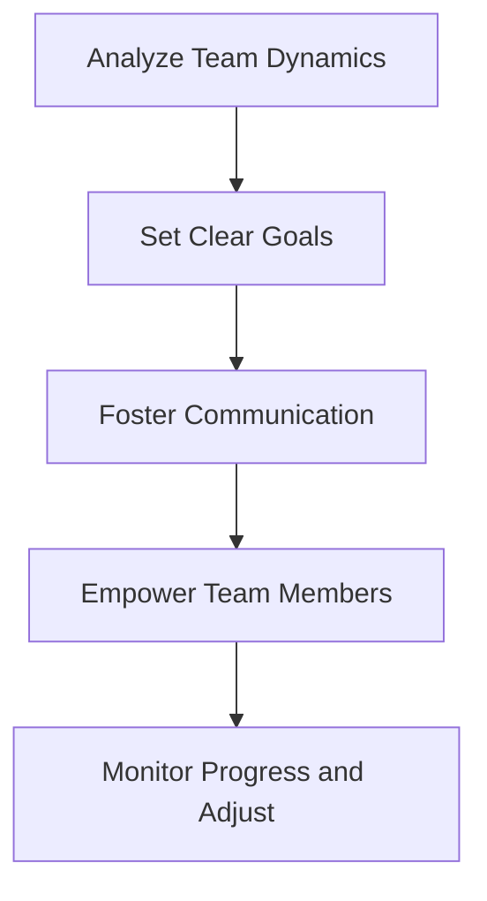
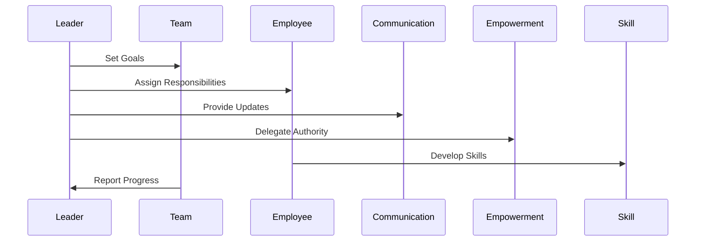
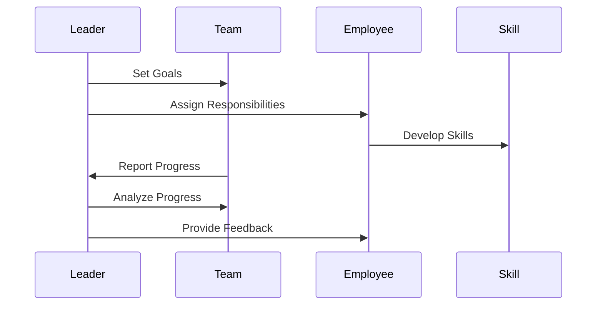

                 

### Introduction to Leadership Principles

**Keywords:** Leadership, High-Performance Teams, Core Principles, Team Building

**Abstract:**
The success of any organization hinges on the leadership principles and strategies employed by its management. This book delves into the foundational principles of effective leadership, exploring the dynamics of building high-performance teams. Through a comprehensive analysis, we will uncover the key elements and practices that drive team success, equipping leaders with the tools needed to foster a collaborative and productive work environment. By understanding and applying these principles, leaders can transform their teams into cohesive units capable of achieving extraordinary results.

#### Background

In today's fast-paced and competitive business landscape, the role of a leader has become more crucial than ever. Effective leadership is no longer just about managing tasks and resources but also about inspiring and motivating teams to achieve their full potential. As organizations evolve, so do the challenges faced by leaders. Navigating these complexities requires a deep understanding of leadership principles and the ability to adapt to various situations.

**Problem Description:**
Building a high-performance team is a multi-faceted challenge that involves understanding individual strengths, fostering a positive team culture, and setting clear goals. Leaders often struggle with managing diverse teams, dealing with conflicts, and maintaining high levels of productivity. To address these challenges, it is essential to have a robust framework of leadership principles that can guide decision-making and foster team success.

**Problem Solution:**
This book aims to provide a comprehensive guide to leadership principles, offering practical insights and strategies for building high-performance teams. By exploring core leadership theories, personal development techniques, and team dynamics, leaders can gain a deeper understanding of their roles and responsibilities. The book will also cover specialized skills required to lead diverse and virtual teams, ensuring that leaders are equipped to handle any situation effectively.

**Boundaries and Extensions:**
While this book focuses on leadership principles, it is important to note that leadership is not a one-size-fits-all concept. Different organizations and industries may require different approaches to leadership. Therefore, the principles discussed in this book should be adapted and tailored to fit the specific context of each organization. Additionally, the book will delve into the latest research and case studies to provide a comprehensive understanding of the topic.

#### Core Concept and Relationships

**Core Concept:**
Leadership principles are fundamental concepts that guide the behavior and decision-making of leaders in various contexts. These principles encompass a wide range of areas, including communication, team building, and personal development. The core concept of leadership principles revolves around the idea of creating a positive and motivating work environment that drives team success.

**Concept Attributes and Comparisons:**

| Attribute | Description |
| --- | --- |
| **Communication** | Effective communication is crucial for building trust and understanding among team members. It involves active listening, clear messaging, and constructive feedback. |
| **Team Building** | Team building focuses on fostering a collaborative and supportive team culture. It involves understanding individual strengths, roles, and responsibilities, and creating a sense of unity and purpose. |
| **Personal Development** | Personal development involves self-awareness, emotional intelligence, and continuous growth. It is essential for leaders to cultivate these qualities to inspire and motivate their teams effectively. |

**ER Entity Relationship Diagram:**

```mermaid
erDiagram
  Leader ||--|{ Team } Team
  Leader ||--|{ Employee } Employee
  Team ||--|{ Goal } Goal
  Employee ||--|{ Skill } Skill
```

#### Algorithm Principles and Explanation

**Algorithm Principle:**
The leadership principles outlined in this book can be represented as an algorithm for building high-performance teams. The algorithm consists of several key steps, including understanding team dynamics, setting clear goals, fostering communication, and empowering team members.

**Algorithm Steps:**

1. **Analyze Team Dynamics:**
   - Assess the strengths and weaknesses of the team.
   - Identify areas for improvement and opportunities for growth.

2. **Set Clear Goals:**
   - Define specific, measurable, achievable, relevant, and time-bound (SMART) goals.
   - Ensure that team members understand and are committed to these goals.

3. **Foster Communication:**
   - Encourage open and transparent communication.
   - Provide regular updates, feedback, and opportunities for input.

4. **Empower Team Members:**
   - Delegate responsibilities and decision-making authority.
   - Provide resources and support to help team members succeed.

5. **Monitor Progress and Adjust:**
   - Regularly review progress towards goals.
   - Make necessary adjustments to improve team performance.

**Algorithm Flowchart:**



**Python Code Example:**

```python
def build_high_performance_team(team):
    # Step 1: Analyze Team Dynamics
    analyze_dynamics(team)
    
    # Step 2: Set Clear Goals
    set_goals(team)
    
    # Step 3: Foster Communication
    foster_communication(team)
    
    # Step 4: Empower Team Members
    empower_members(team)
    
    # Step 5: Monitor Progress and Adjust
    monitor_progress(team)
```

**Mathematical Model and Formulas:**

The success of a high-performance team can be modeled using a combination of performance metrics and team satisfaction scores. The mathematical model can be represented as follows:

$$
Performance = f(Goals, Communication, Empowerment)
$$

where:

- **Performance:** The overall performance of the team.
- **Goals:** The effectiveness of setting and achieving goals.
- **Communication:** The quality and effectiveness of communication among team members.
- **Empowerment:** The degree to which team members are empowered to make decisions and take ownership of their work.

**Explanation:**

The mathematical model represents the interdependencies between goals, communication, and empowerment in driving team performance. By optimizing these key factors, leaders can enhance the overall performance of their teams.

#### System Analysis and Design

**Problem Scenario:**
In today's dynamic business environment, building high-performance teams is crucial for organizational success. To achieve this, organizations need to implement effective leadership principles and strategies that foster collaboration, innovation, and productivity.

**Project Introduction:**
The objective of this project is to design a comprehensive system that helps organizations build high-performance teams. The system will provide tools and resources for leaders to implement leadership principles, monitor team progress, and make data-driven decisions.

**System Function Design:**

**Domain Model Class Diagram:**

```mermaid
classDiagram
  Team <<interface>>
  Leader <<interface>>
  Employee <<interface>>
  Goal <<interface>>
  Communication <<interface>>
  Empowerment <<interface>>

  Team +-- Leader
  Team +-- Employee
  Leader +-- Goal
  Leader +-- Communication
  Leader +-- Empowerment
  Employee +-- Skill
```

**System Architecture Design:**



**System Interface Design and Interaction:**



### Conclusion

In conclusion, effective leadership principles are vital for building high-performance teams. By understanding and applying these principles, leaders can create a positive and motivating work environment that drives team success. This book provides a comprehensive guide to leadership principles, offering practical insights and strategies for building high-performance teams. By following the steps outlined in this book, leaders can transform their teams into cohesive units capable of achieving extraordinary results.

**Tips:**
- Regularly assess and adapt your leadership approach to fit the evolving needs of your team.
- Encourage open communication and active participation from all team members.
- Empower team members to take ownership of their work and make informed decisions.

**Further Reading:**
- "The Five Dysfunctions of a Team" by Patrick Lencioni
- "Leaders Eat Last" by Simon Sinek
- "Essentialism" by Greg McKeown

### About the Author

**Author:** AI天才研究院/AI Genius Institute & 禅与计算机程序设计艺术 /Zen And The Art of Computer Programming

AI天才研究院（AI Genius Institute）致力于推动人工智能领域的创新与进步，专注于培养下一代人工智能专家。同时，"禅与计算机程序设计艺术"（Zen And The Art of Computer Programming）由世界著名计算机科学家Donald E. Knuth所著，为计算机科学领域的重要著作之一，为读者提供了深刻的编程哲学和实用技术。作者结合丰富的实践经验和深厚的理论功底，为读者带来具有深度和见解的专业技术博客。

