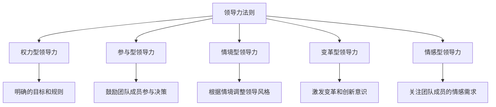
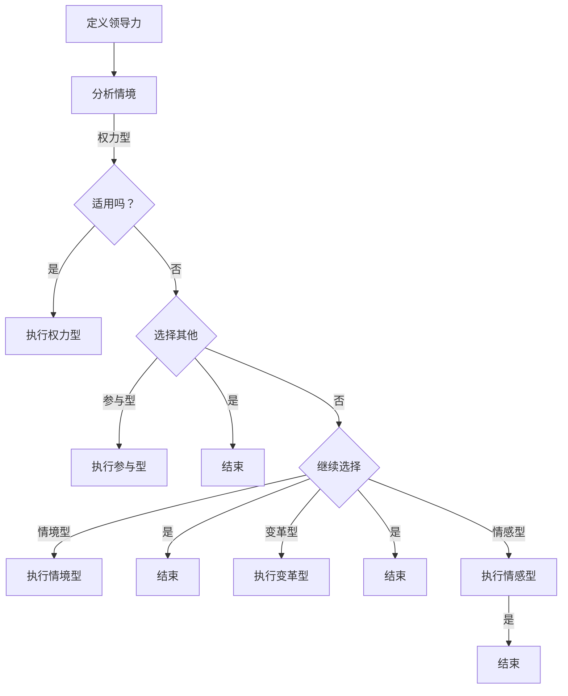
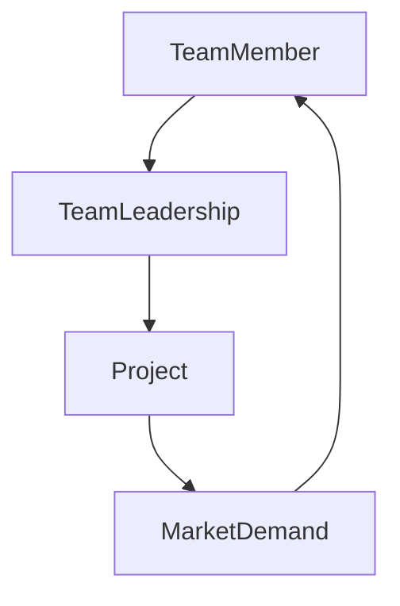
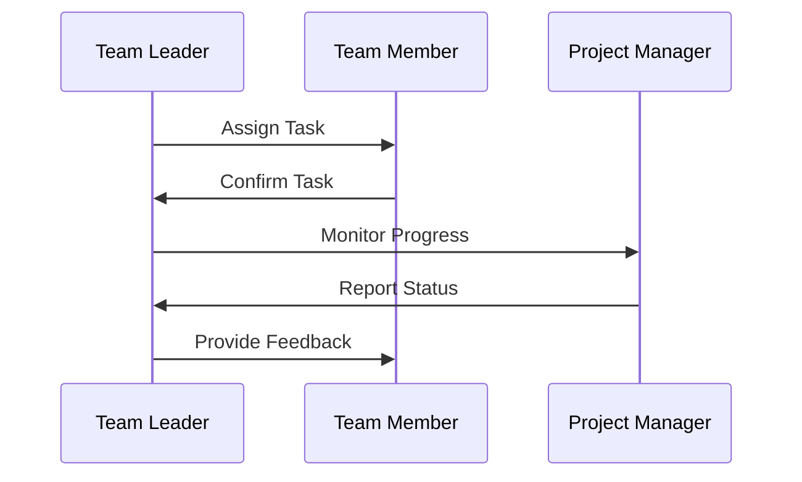

                 

# 领导力法则：打造黄金团队的领导力秘诀

> 关键词：领导力、团队建设、黄金团队、领导力法则

> 摘要：本文将深入探讨领导力的本质和重要性，解析领导力法则的概念及其在不同情境下的应用。我们将通过详细的分析和案例分析，展示如何运用领导力法则打造高效的黄金团队，并提供实用的最佳实践和注意事项。

## **第一部分：领导力的基本概念**

### **第1章：领导力的定义与重要性**

#### **1.1 领导力的定义**

**问题背景**：在当今快速变化的社会和商业环境中，领导力成为组织成功的关键因素。然而，领导力究竟是什么，至今仍是一个复杂而多样的问题。

**问题描述**：领导力是一个宽泛的概念，不同学者和组织对其有不同的定义。我们需要明确领导力的核心内涵。

**问题解决**：领导力可以定义为一种能够激励和引导他人共同实现目标的能力。它不仅包括技术能力，还涉及人际关系和影响力。

**边界与外延**：领导力不仅仅是管理，它超越了职位和权力的限制，是一种影响他人行为和思维方式的技能。

**概念结构与核心要素组成**：领导力包括以下几个核心要素：
- **愿景**：明确的目标和方向。
- **沟通**：有效传达愿景和期望。
- **激励**：激发团队成员的动力和创造力。
- **决策**：在不确定性和压力下做出明智的选择。
- **适应**：灵活应对变化和挑战。

#### **1.2 领导力的重要性**

**领导力对个人和组织的影响**：领导力不仅影响个人的职业发展，还决定组织的成功与否。

- **个人层面**：良好的领导力有助于个人建立信誉、提升能力和实现职业目标。
- **组织层面**：领导力是组织战略和运营的核心，能够提升团队效能、创新能力和市场竞争力。

**领导力在社会中的角色**：领导力在社会中扮演着关键角色，促进社会进步和经济发展。

- **社会层面**：领导力有助于解决社会问题、推动社会变革。
- **经济层面**：领导力是企业发展的重要驱动力，能够提升企业竞争力和市场地位。

**领导力的发展趋势**：随着全球化、技术变革和社交媒体的兴起，领导力也在不断演变。

- **变革型领导力**：注重创新和变革，推动组织适应外部环境。
- **全球化领导力**：具备跨文化沟通和合作能力，能够引领跨国团队。
- **技术领导力**：结合技术和管理技能，推动数字化和智能化转型。

### **第2章：领导力法则概述**

#### **2.1 领导力法则的定义**

**问题背景**：在领导力理论的发展过程中，各种领导力法则被提出，旨在指导领导者如何更有效地管理和激励团队。

**问题描述**：领导力法则是什么？它们如何与领导力本身相联系？

**问题解决**：领导力法则是一套被验证的实践原则，用于指导领导者如何处理日常挑战、实现团队目标。

**边界与外延**：领导力法则不仅适用于企业，也适用于其他组织，如政府、非营利组织等。

**概念结构与核心要素组成**：领导力法则包括以下几个核心要素：
- **原则**：明确的行为准则和价值观。
- **方法**：具体的应用策略和技巧。
- **案例**：成功实践的典型实例。

#### **2.2 不同领导力法则的概念和特点**

**权力型领导力**：依赖权威和职位来影响他人，适用于需要快速决策和高效执行的情境。

**参与型领导力**：注重团队参与和合作，适用于需要创新和协作的项目。

**情境型领导力**：根据不同情境和团队成员特点调整领导风格，适用于多元化团队。

**变革型领导力**：鼓励团队成员进行变革和创新，适用于需要进行战略调整和转型的组织。

**情感型领导力**：关注团队成员的情感和心理健康，适用于需要提升团队凝聚力和工作满意度的情境。

### **2.3 概念属性特征对比表格**

| 领导力法则 | 特点 | 适用情境 |  
| --- | --- | --- |  
| 权力型领导力 | 依赖权威和职位 | 高效执行、快速决策 |  
| 参与型领导力 | 注重团队参与和合作 | 创新、协作 |  
| 情境型领导力 | 根据情境和成员特点调整风格 | 多元化团队 |  
| 变革型领导力 | 鼓励变革和创新 | 战略调整、转型 |  
| 情感型领导力 | 关注情感和心理健康 | 提升团队凝聚力、工作满意度 |

## **第二部分：领导力法则与黄金团队**

### **第3章：领导力法则在团队建设中的应用**

#### **3.1 领导力法则与团队效能**

**问题背景**：团队效能是组织成功的关键因素，而领导力法则在提升团队效能中起着至关重要的作用。

**问题描述**：不同领导力法则如何影响团队效能？

**问题解决**：通过科学运用领导力法则，领导者可以提升团队效能，实现团队目标。

**边界与外延**：领导力法则的应用不仅局限于团队内部，还涉及团队与外部环境的互动。

**概念结构与核心要素组成**：团队效能包括以下几个方面：
- **目标实现**：团队能否按照预定目标完成任务。
- **创新和协作**：团队在创新和协作方面的表现。
- **工作满意度**：团队成员对工作的满意度和归属感。

#### **3.2 黄金团队的概念与特征**

**问题背景**：在竞争激烈的商业环境中，黄金团队成为企业竞争力的象征。

**问题描述**：什么是黄金团队？它具备哪些特征？

**问题解决**：黄金团队是指那些高效、创新、凝聚力强、工作满意度高的团队。

**边界与外延**：黄金团队不仅体现在短期绩效上，更体现在长期发展和可持续性上。

**概念结构与核心要素组成**：黄金团队包括以下几个核心要素：
- **高绩效**：团队在实现目标方面表现卓越。
- **创新能力**：团队在创新和改进方面具有强烈的动力。
- **团队凝聚力**：团队成员之间相互信任、支持和合作。
- **工作满意度**：团队成员对工作环境和工作内容感到满意。

### **3.3 领导力法则在打造黄金团队中的应用**

**权力型领导力在团队建设中的应用**：通过明确目标和规则，确保团队高效执行。

**参与型领导力在团队建设中的应用**：鼓励团队成员参与决策和项目设计，提升创新和协作能力。

**情境型领导力在团队建设中的应用**：根据团队成员的特点和环境变化调整领导风格，提升团队适应性和灵活性。

**变革型领导力在团队建设中的应用**：激发团队成员的变革和创新意识，推动团队持续发展。

**情感型领导力在团队建设中的应用**：关注团队成员的情感和心理健康，提升团队凝聚力和工作满意度。

## **第三部分：领导力法则的实际应用**

### **第4章：领导力法则在企业中的实践**

#### **4.1 企业领导力现状分析**

**问题背景**：在企业发展过程中，领导力发挥着至关重要的作用。

**问题描述**：当前企业领导力面临哪些挑战和问题？

**问题解决**：通过科学分析和实践，提升企业领导力，助力企业持续发展。

**边界与外延**：企业领导力不仅涉及企业内部，还涉及企业与社会、市场的互动。

**概念结构与核心要素组成**：企业领导力包括以下几个核心要素：
- **战略规划**：明确企业的发展方向和目标。
- **组织文化**：建立积极、开放、创新的组织氛围。
- **团队建设**：提升团队效能和凝聚力。
- **领导能力**：提升领导者的个人能力和领导风格。

#### **4.2 不同领导力法则在企业中的应用**

**权力型领导力在企业中的应用**：在需要快速决策和高效执行的情境下，权力型领导力能够发挥重要作用。

**参与型领导力在企业中的应用**：通过鼓励团队成员参与决策和项目设计，提升团队创新和协作能力。

**情境型领导力在企业中的应用**：根据企业外部环境和内部团队特点调整领导风格，提升企业适应性和灵活性。

**变革型领导力在企业中的应用**：鼓励企业进行变革和创新，推动企业持续发展和转型升级。

**情感型领导力在企业中的应用**：关注企业成员的情感和心理健康，提升企业凝聚力和员工满意度。

### **第5章：领导力法则在团队管理中的应用**

#### **5.1 团队管理中的挑战与应对策略**

**问题背景**：团队管理是领导者面临的重要挑战。

**问题描述**：在团队管理中，领导者面临哪些挑战？

**问题解决**：通过科学的管理策略和领导力法则，有效应对团队管理中的挑战。

**边界与外延**：团队管理不仅涉及团队内部，还涉及团队与外部环境的互动。

**概念结构与核心要素组成**：团队管理包括以下几个核心要素：
- **目标管理**：明确团队目标和任务。
- **绩效管理**：评估和提升团队绩效。
- **沟通管理**：建立有效的沟通渠道和机制。
- **团队建设**：提升团队凝聚力和协作能力。

#### **5.2 领导力法则在团队管理中的应用**

**权力型领导力在团队管理中的应用**：在需要高效决策和执行的情境下，权力型领导力能够发挥重要作用。

**参与型领导力在团队管理中的应用**：通过鼓励团队成员参与决策和项目设计，提升团队创新和协作能力。

**情境型领导力在团队管理中的应用**：根据团队特点和环境变化调整领导风格，提升团队适应性和灵活性。

**变革型领导力在团队管理中的应用**：鼓励团队进行变革和创新，推动团队持续发展和进步。

**情感型领导力在团队管理中的应用**：关注团队成员的情感和心理健康，提升团队凝聚力和员工满意度。

## **第四部分：领导力法则的实践与反思**

### **第6章：领导力法则的实践与反思**

#### **6.1 领导力法则的实践**

**问题背景**：在实际工作中，领导者需要不断运用领导力法则，应对各种挑战和问题。

**问题描述**：如何有效地实践领导力法则？

**问题解决**：通过以下策略，领导者可以更好地实践领导力法则：
- **持续学习**：不断提升自己的领导力和管理能力。
- **倾听和沟通**：倾听团队成员的意见和建议，建立有效的沟通机制。
- **授权和信任**：赋予团队成员更多的自主权和责任，建立信任和合作关系。
- **激励和认可**：激发团队成员的积极性和创造力，给予及时的激励和认可。

#### **6.2 领导力法则的反思**

**问题背景**：领导力法则是动态发展的，需要不断反思和调整。

**问题描述**：如何反思和调整领导力法则？

**问题解决**：通过以下方法，领导者可以反思和调整领导力法则：
- **定期评估**：定期评估领导力法则的有效性和适用性。
- **反馈和改进**：收集团队成员的反馈，及时改进领导力和管理方法。
- **持续学习和创新**：关注最新的领导力理论和实践，不断学习和创新。
- **情境适应**：根据不同情境和团队特点，灵活调整领导力法则。

### **6.3 领导力法则的最佳实践**

**最佳实践 tips**：
- **明确目标和愿景**：明确团队目标和愿景，确保团队成员有共同的目标和方向。
- **建立信任和合作关系**：建立信任和合作关系，提升团队凝聚力和协作能力。
- **激励和认可**：及时给予团队成员激励和认可，激发他们的积极性和创造力。
- **持续学习和创新**：鼓励团队成员持续学习和创新，提升团队的竞争力和创新能力。

**小结**：
领导力法则在团队建设和管理中发挥着重要作用。通过科学运用领导力法则，领导者可以提升团队效能和竞争力，实现组织目标。

**注意事项**：
- **避免僵化**：领导力法则不是一成不变的，需要根据实际情况进行灵活调整。
- **注重实践**：领导力法规则需要通过实践来验证和优化。
- **关注团队成员需求**：领导者需要关注团队成员的需求和感受，建立积极的工作氛围。

**拓展阅读**：
- 《领导力的五个层次》——史蒂芬·柯维
- 《非暴力沟通》——马歇尔·卢森堡
- 《团队协作的艺术》——罗恩·切斯

### **作者信息**

作者：AI天才研究院/AI Genius Institute & 禅与计算机程序设计艺术 /Zen And The Art of Computer Programming

----------------------------------------------------------------

**第一部分：领导力的基本概念**

**第1章：领导力的定义与重要性**

**1.1 领导力的定义**

领导力是一个广泛而复杂的概念，它涉及领导者如何影响和激励他人共同实现目标。在组织行为学和组织管理学中，领导力通常被定义为一种能够激励和引导他人朝向共同目标前进的能力。领导力的核心在于影响力和影响力产生的机制，它不仅仅是管理技巧的集合，更是一种价值观、行为模式和人际互动的综合体现。

**问题背景**

在当今快速变化的社会和商业环境中，领导力的重要性日益凸显。企业、政府和非营利组织都需要领导者来引领团队应对挑战、把握机遇和实现目标。然而，随着环境和技术的不断变化，传统的领导力模式可能不再适应新的挑战。

**问题描述**

领导力究竟是什么？它如何定义？不同的学者和组织对领导力的理解存在差异，我们需要一个清晰的定义来作为基础。

**问题解决**

领导力可以定义为一种能够激励和引导他人共同实现目标的能力。这个定义强调了以下几点：
- **激励**：领导者需要有能力激发团队成员的积极性和动力。
- **引导**：领导者不仅要设定目标，还要指导团队成员如何达成目标。
- **共同目标**：领导力的核心在于团队目标和个人目标的结合。

**边界与外延**

领导力的定义不仅包括个人能力，还涉及人际关系和影响力。它不仅仅是管理职位赋予的权力，更是一种可以通过学习和实践培养的技能。领导力不仅存在于企业中，也存在于政府、非营利组织和其他组织中。

**概念结构与核心要素组成**

领导力的核心要素包括以下几个方面：

1. **愿景**：领导者需要明确组织或团队的目标和方向，为团队成员提供清晰的愿景。
2. **沟通**：有效的沟通是领导力的重要组成部分，领导者需要能够清晰传达愿景和期望。
3. **激励**：领导者需要激发团队成员的动力和创造力，使其能够充分发挥潜力。
4. **决策**：在复杂和不确定的环境下，领导者需要做出明智的决策。
5. **适应**：领导者需要具备适应变化和挑战的能力，灵活调整领导风格和策略。

**1.2 领导力的重要性**

**领导力对个人和组织的影响**

领导力不仅影响个人职业生涯，也决定组织的成败。对于个人而言，良好的领导力可以帮助个人建立信誉、提升能力和实现职业目标。对于组织而言，领导力是战略执行、团队协作和创新的核心。

1. **个人层面**：
   - **建立信誉**：领导者通过自己的行为和决策树立了组织的形象和价值观。
   - **职业发展**：领导力是职业发展的关键，有助于个人晋升和承担责任。
   - **个人成长**：领导力培养需要不断的自我反思和学习，有助于个人的全面发展。

2. **组织层面**：
   - **战略执行**：领导力确保组织能够有效执行战略计划，实现长期目标。
   - **团队协作**：领导力促进团队成员之间的合作和信任，提升团队效能。
   - **创新能力**：领导力激发团队成员的创新思维，推动组织持续发展。
   - **市场竞争力**：领导力提升组织的市场竞争力，帮助组织在激烈的市场环境中脱颖而出。

**领导力在社会中的角色**

领导力在社会中扮演着关键角色，它不仅影响组织内部，还对社会和经济发展产生深远影响。

1. **社会层面**：
   - **解决社会问题**：领导力有助于解决社会问题，推动社会变革。
   - **促进社会进步**：领导力推动社会的发展和进步，提升社会福祉。

2. **经济层面**：
   - **推动经济发展**：领导力激发企业创新和增长，推动经济繁荣。
   - **提升竞争力**：领导力提升企业的竞争力，促进国际贸易和合作。

**领导力的发展趋势**

随着全球化、技术变革和社交媒体的兴起，领导力也在不断演变。

1. **变革型领导力**：
   - **注重创新和变革**：领导者需要具备推动变革和创新的能力，以适应快速变化的环境。
   - **团队导向**：领导者更加关注团队的整体发展，鼓励团队成员参与决策和目标设定。

2. **全球化领导力**：
   - **跨文化沟通**：领导者需要具备跨文化沟通和合作能力，能够引领跨国团队。
   - **全球视野**：领导者需要具备全球视野，关注国际市场和发展趋势。

3. **技术领导力**：
   - **数字化能力**：领导者需要具备数字化和信息技术方面的能力，推动组织数字化转型。
   - **创新思维**：领导者需要具备创新思维，引领组织进行技术创新和应用。

**第二部分：领导力法则与黄金团队**

**第2章：领导力法则概述**

**2.1 领导力法则的定义**

领导力法则是一套被验证的实践原则，用于指导领导者如何处理日常挑战、实现团队目标。这些法则基于领导力的核心要素，提供具体的行为准则和策略，以帮助领导者在不同情境下有效地引导和激励团队成员。

**问题背景**

在领导力理论的发展过程中，各种领导力法则被提出，旨在帮助领导者更系统地理解和应用领导力原则。随着环境和组织的变化，领导者需要不断更新和调整自己的领导力策略，以适应新的挑战。

**问题描述**

领导力法则是什么？它们如何与领导力本身相联系？不同领导力法则的核心内容和特点是什么？

**问题解决**

领导力法则可以定义为一系列经过实践验证的原则和策略，用于指导领导者在不同情境下进行有效的决策和行动。这些法则不仅提供了具体的行为指南，还帮助领导者理解在不同情境下如何调整自己的领导风格和策略。

**边界与外延**

领导力法则不仅适用于企业组织，也适用于政府、非营利组织和其他类型的组织。它们是普适性的，但在具体应用时需要根据组织的性质和情境进行调整。

**概念结构与核心要素组成**

领导力法则的核心要素包括：

1. **原则**：明确的行为准则和价值观，如诚信、尊重、创新等。
2. **方法**：具体的应用策略和技巧，如目标设定、沟通技巧、激励手段等。
3. **案例**：成功的实践实例，为领导者提供具体的参考和借鉴。

**2.2 不同领导力法则的概念和特点**

不同的领导力法则适用于不同的情境和团队类型，每种法则都有其独特的核心内容和特点。

**权力型领导力**

权力型领导力依赖于领导者的职位和权力，通过权威和命令来影响团队成员。它适用于需要快速决策和高效执行的情境。

1. **核心内容**：
   - 明确的目标和规则。
   - 高效的执行和监督。
   - 强调权威和纪律。

2. **特点**：
   - 强调控制和管理。
   - 适用于紧急情况和需要迅速行动的团队。

**参与型领导力**

参与型领导力注重团队参与和合作，通过鼓励团队成员参与决策和项目设计来提升团队的凝聚力和创新能力。

1. **核心内容**：
   - 鼓励团队成员参与决策。
   - 建立开放和信任的沟通渠道。
   - 创造一个支持创新和协作的环境。

2. **特点**：
   - 强调合作和共享。
   - 适用于需要创新和协作的项目。

**情境型领导力**

情境型领导力认为，领导风格应该根据不同的情境和团队成员的特点进行调整。领导者需要具备灵活性和适应性，以适应不同的环境需求。

1. **核心内容**：
   - 根据情境调整领导风格。
   - 关注团队成员的需求和反应。
   - 灵活应用不同的领导策略。

2. **特点**：
   - 强调适应性和灵活性。
   - 适用于多元化的团队和动态变化的环境。

**变革型领导力**

变革型领导力鼓励团队成员进行变革和创新，推动组织持续发展和进步。领导者通过激励和引导，帮助团队克服变革的障碍。

1. **核心内容**：
   - 激发变革和创新意识。
   - 引导团队克服变革的挑战。
   - 建立积极和支持变革的文化。

2. **特点**：
   - 强调创新和变革。
   - 适用于需要进行战略调整和转型的组织。

**情感型领导力**

情感型领导力关注团队成员的情感和心理健康，通过建立信任和支持的关系来提升团队的凝聚力和工作满意度。

1. **核心内容**：
   - 关注团队成员的情感需求。
   - 建立信任和支持的关系。
   - 提供心理支持和辅导。

2. **特点**：
   - 强调情感和心理健康。
   - 适用于需要提升团队凝聚力和工作满意度的情境。

**2.3 概念属性特征对比表格**

以下是不同领导力法则的概念属性特征对比表格：

| 领导力法则 | 核心内容 | 特点 | 适用情境 |
| --- | --- | --- | --- |
| 权力型领导力 | 明确的目标和规则 | 强调控制和管理 | 紧急情况、需要快速决策的团队 |
| 参与型领导力 | 鼓励团队成员参与决策 | 强调合作和共享 | 需要创新和协作的项目 |
| 情境型领导力 | 根据情境调整领导风格 | 强调适应性和灵活性 | 多元化团队、动态变化的环境 |
| 变革型领导力 | 激发变革和创新意识 | 强调创新和变革 | 需要进行战略调整和转型的组织 |
| 情感型领导力 | 关注团队成员的情感需求 | 强调情感和心理健康 | 需要提升团队凝聚力和工作满意度的情境 |

**第三部分：领导力法则在团队建设中的应用**

**第3章：领导力法则在团队建设中的应用**

**3.1 领导力法则与团队效能**

团队效能是组织成功的关键因素，而领导力法则在提升团队效能中起着至关重要的作用。领导力法则不仅影响团队的工作效率和绩效，还影响团队成员的满意度和团队凝聚力。

**问题背景**

在当今竞争激烈的商业环境中，团队效能成为企业竞争力的核心。高效的团队能够快速响应市场变化，提高生产力和创新能力。因此，领导者需要运用领导力法则，提升团队效能。

**问题描述**

领导力法则如何影响团队效能？不同的领导力法则在提升团队效能方面有哪些具体应用和效果？

**问题解决**

领导力法则通过以下几个方面影响团队效能：

1. **明确目标和愿景**：领导者通过设定明确的目标和愿景，为团队成员提供清晰的方向和动力。
2. **有效沟通**：领导者通过有效的沟通，确保团队成员理解目标、任务和期望，减少误解和冲突。
3. **激励和激励**：领导者通过激励和激励手段，激发团队成员的积极性和创造力，提高工作动力。
4. **决策和执行**：领导者通过有效的决策和执行，确保团队行动迅速、准确和高效。

**边界与外延**

领导力法则的应用不仅局限于提升团队效能，还包括提升团队成员的满意度和团队凝聚力。良好的领导力能够建立信任和合作关系，促进团队成员之间的互动和支持，从而提升整体团队效能。

**概念结构与核心要素组成**

团队效能包括以下几个方面：

1. **目标实现**：团队是否能够按照预定目标完成任务。
2. **创新和协作**：团队在创新和协作方面的表现。
3. **工作满意度**：团队成员对工作的满意度和归属感。

**3.2 黄金团队的概念与特征**

黄金团队是指那些在绩效、创新、凝聚力和工作满意度方面表现卓越的团队。黄金团队是组织成功的关键因素，它们能够快速响应市场变化，提高生产力和创新能力。

**问题背景**

在竞争激烈的市场环境中，企业需要具备高效的团队来应对各种挑战。黄金团队不仅能够实现高绩效，还能够持续创新，提升组织的竞争力。

**问题描述**

黄金团队是什么？它具备哪些特征？如何打造黄金团队？

**问题解决**

黄金团队具备以下特征：

1. **高绩效**：黄金团队能够按照预定目标完成任务，具有出色的绩效表现。
2. **创新能力**：黄金团队在创新和改进方面具有强烈的动力，能够持续推动组织的创新和发展。
3. **团队凝聚力**：黄金团队成员之间相互信任、支持和合作，具有强大的凝聚力。
4. **工作满意度**：黄金团队成员对工作环境和工作内容感到满意，具有较高的工作满意度和归属感。

**边界与外延**

黄金团队的构建不仅需要领导力法则的支持，还需要组织的战略支持、资源和文化的培育。一个优秀的领导者需要通过多种领导力法则的应用，结合组织的整体战略，打造黄金团队。

**概念结构与核心要素组成**

黄金团队的核心要素包括：

1. **高绩效**：设定明确的目标和关键绩效指标，确保团队成员明确任务和责任。
2. **创新能力**：鼓励团队成员提出创新想法，提供资源和支持，推动创新实践。
3. **团队凝聚力**：建立信任和合作关系，通过团队活动和团队建设提升凝聚力。
4. **工作满意度**：关注团队成员的需求和感受，提供良好的工作环境和激励机制。

**3.3 领导力法则在打造黄金团队中的应用**

**权力型领导力在团队建设中的应用**

权力型领导力适用于需要快速决策和高效执行的团队。领导者通过明确的目标和规则，确保团队成员按照预定计划完成任务。

1. **核心内容**：
   - 设定明确的目标和规则。
   - 高效的执行和监督。
   - 强调权威和纪律。

2. **具体应用**：
   - 在项目启动阶段，明确目标和任务分配，确保团队成员理解任务和要求。
   - 在项目执行过程中，领导者通过监控进度和质量，确保团队按计划进行。
   - 在项目结束时，对团队成员进行绩效评估，给予奖励和反馈。

**参与型领导力在团队建设中的应用**

参与型领导力适用于需要创新和协作的团队。领导者通过鼓励团队成员参与决策和项目设计，提升团队的凝聚力和创新能力。

1. **核心内容**：
   - 鼓励团队成员参与决策。
   - 建立开放和信任的沟通渠道。
   - 创造一个支持创新和协作的环境。

2. **具体应用**：
   - 在项目启动阶段，召开团队会议，让团队成员参与项目目标和方案的讨论。
   - 在项目执行过程中，定期召开团队会议，让团队成员分享进展和挑战，共同寻找解决方案。
   - 在项目结束时，召开总结会议，让团队成员共同反思和总结项目经验，为未来的项目提供参考。

**情境型领导力在团队建设中的应用**

情境型领导力适用于多元化的团队和动态变化的环境。领导者根据不同的情境和团队成员的特点，调整领导风格和策略。

1. **核心内容**：
   - 根据情境调整领导风格。
   - 关注团队成员的需求和反应。
   - 灵活应用不同的领导策略。

2. **具体应用**：
   - 在面对紧急情况时，领导者采用权力型领导力，迅速做出决策并确保执行。
   - 在面对创新和协作项目时，领导者采用参与型领导力，鼓励团队成员参与决策和项目设计。
   - 在面对多元化和动态变化的团队时，领导者采用情境型领导力，根据团队成员的特点和情境需求，灵活调整领导风格和策略。

**变革型领导力在团队建设中的应用**

变革型领导力适用于需要进行战略调整和转型的团队。领导者通过激励和引导，帮助团队克服变革的障碍，推动组织的持续发展和进步。

1. **核心内容**：
   - 激发变革和创新意识。
   - 引导团队克服变革的挑战。
   - 建立积极和支持变革的文化。

2. **具体应用**：
   - 在战略调整和转型阶段，领导者通过沟通和激励，让团队成员理解变革的必要性和意义。
   - 在面对变革的障碍时，领导者通过引导和激励，帮助团队成员克服恐惧和疑虑，积极参与变革。
   - 在变革过程中，领导者通过建立支持变革的文化和机制，确保团队成员能够顺利适应变革。

**情感型领导力在团队建设中的应用**

情感型领导力适用于需要提升团队凝聚力和工作满意度的团队。领导者通过建立信任和支持的关系，关注团队成员的情感需求，提升团队的凝聚力和工作满意度。

1. **核心内容**：
   - 关注团队成员的情感需求。
   - 建立信任和支持的关系。
   - 提供心理支持和辅导。

2. **具体应用**：
   - 在日常工作中，领导者通过倾听和沟通，了解团队成员的情感需求，提供支持和帮助。
   - 在团队面临压力和挑战时，领导者通过情感支持和鼓励，帮助团队成员缓解压力，增强信心。
   - 在团队建设活动中，领导者通过团队活动和互动，增强团队成员之间的信任和凝聚力。

**第四部分：领导力法则的实际应用**

**第4章：领导力法则在企业中的实践**

**4.1 企业领导力现状分析**

企业领导力现状直接影响企业的绩效和竞争力。分析企业领导力现状，识别存在的问题和挑战，是提升企业领导力的第一步。

**问题背景**

在当今快速变化的市场环境中，企业需要具备强大的领导力来应对各种挑战。然而，许多企业面临着领导力不足的问题，如缺乏创新意识、管理不善、团队凝聚力不足等。

**问题描述**

企业领导力现状如何？存在哪些问题和挑战？

**问题解决**

通过对企业领导力现状的分析，我们可以识别出以下几个方面的问题和挑战：

1. **缺乏明确的战略方向**：许多企业缺乏明确的战略方向，导致决策混乱，难以实现长期目标。
2. **管理不善**：企业管理层可能存在沟通不畅、授权不足、监督不到位等问题，影响团队效率和绩效。
3. **缺乏创新意识**：企业可能过于依赖传统模式，缺乏创新思维和创新能力，难以适应市场变化。
4. **团队凝聚力不足**：团队成员之间缺乏信任和合作，导致团队绩效下降，工作满意度降低。
5. **领导力不足**：企业领导者可能缺乏领导力和管理技能，难以有效引导和激励团队。

**边界与外延**

企业领导力现状分析不仅涉及企业内部，还包括外部环境和企业与市场的互动。领导力问题可能源于企业内部的管理和运营，也可能受到外部市场环境的影响。

**概念结构与核心要素组成**

企业领导力现状分析包括以下几个核心要素：

1. **战略方向**：明确企业的战略目标和方向。
2. **管理能力**：评估企业管理的有效性，包括沟通、授权、监督等方面。
3. **创新意识**：评估企业的创新能力和创新文化。
4. **团队凝聚力**：评估团队的合作关系和凝聚力。
5. **领导力**：评估企业领导者的领导力和管理技能。

**4.2 不同领导力法则在企业中的应用**

不同的领导力法则适用于不同的企业情境，领导者需要根据实际情况选择和运用适合的领导力法则，以提升企业绩效和竞争力。

**权力型领导力在企业中的应用**

权力型领导力适用于需要快速决策和高效执行的企业。领导者通过明确的目标和规则，确保团队成员按照预定计划完成任务。

1. **核心内容**：
   - 明确的目标和规则。
   - 高效的执行和监督。
   - 强调权威和纪律。

2. **具体应用**：
   - 在企业面临紧急情况时，领导者通过权力型领导力迅速做出决策并确保执行。
   - 在日常运营中，领导者通过明确的规则和监督，确保团队成员高效执行任务。

**参与型领导力在企业中的应用**

参与型领导力适用于需要创新和协作的企业。领导者通过鼓励团队成员参与决策和项目设计，提升团队的凝聚力和创新能力。

1. **核心内容**：
   - 鼓励团队成员参与决策。
   - 建立开放和信任的沟通渠道。
   - 创造一个支持创新和协作的环境。

2. **具体应用**：
   - 在企业制定战略计划时，领导者通过参与型领导力鼓励团队成员参与讨论和决策。
   - 在项目执行过程中，领导者通过参与型领导力鼓励团队成员共同解决问题和提升创新。

**情境型领导力在企业中的应用**

情境型领导力适用于多元化和动态变化的企业。领导者根据不同的情境和团队成员的特点，调整领导风格和策略。

1. **核心内容**：
   - 根据情境调整领导风格。
   - 关注团队成员的需求和反应。
   - 灵活应用不同的领导策略。

2. **具体应用**：
   - 在企业面临市场变化和挑战时，领导者通过情境型领导力灵活调整策略，确保企业能够迅速适应。
   - 在不同项目和团队中，领导者根据团队成员的特点和需求，灵活调整领导风格，提升团队效能。

**变革型领导力在企业中的应用**

变革型领导力适用于需要进行战略调整和转型的企业。领导者通过激励和引导，帮助团队克服变革的障碍，推动企业的持续发展和进步。

1. **核心内容**：
   - 激发变革和创新意识。
   - 引导团队克服变革的挑战。
   - 建立积极和支持变革的文化。

2. **具体应用**：
   - 在企业面临战略调整和变革时，领导者通过变革型领导力激励团队成员参与变革，克服变革的障碍。
   - 在变革过程中，领导者通过建立支持变革的文化和机制，确保团队成员能够顺利适应变革。

**情感型领导力在企业中的应用**

情感型领导力适用于需要提升团队凝聚力和工作满意度的企业。领导者通过建立信任和支持的关系，关注团队成员的情感需求，提升团队的凝聚力和工作满意度。

1. **核心内容**：
   - 关注团队成员的情感需求。
   - 建立信任和支持的关系。
   - 提供心理支持和辅导。

2. **具体应用**：
   - 在企业日常运营中，领导者通过情感型领导力关注团队成员的情感需求，提供支持和帮助。
   - 在团队面临压力和挑战时，领导者通过情感型领导力提供心理支持和鼓励，提升团队凝聚力。

**第5章：领导力法则在团队管理中的应用**

**5.1 团队管理中的挑战与应对策略**

团队管理是领导者面临的重要挑战。团队管理不仅涉及日常任务的分配和执行，还包括团队成员的沟通、激励和团队建设。

**问题背景**

在复杂的商业环境中，团队管理面临着各种挑战，如沟通不畅、团队成员冲突、工作压力等。领导者需要具备有效的团队管理能力，以应对这些挑战。

**问题描述**

团队管理中存在哪些挑战？如何应对这些挑战？

**问题解决**

团队管理中的挑战主要包括以下几个方面：

1. **沟通不畅**：团队成员之间的沟通不畅可能导致误解和冲突。
2. **团队成员冲突**：团队成员之间的冲突可能影响团队凝聚力和工作效率。
3. **工作压力**：工作压力可能导致团队成员的疲劳和不满，影响团队效能。
4. **领导力不足**：领导力不足可能导致团队成员缺乏方向感和动力。

应对这些挑战的策略包括：

1. **加强沟通**：建立有效的沟通渠道和机制，确保团队成员之间的信息流畅和透明。
2. **解决冲突**：通过积极的沟通和冲突解决技巧，帮助团队成员理解彼此的观点，找到共同点。
3. **减轻工作压力**：提供合理的工作安排和心理支持，帮助团队成员应对工作压力。
4. **提升领导力**：通过培训和发展，提升领导者的领导力，确保团队成员有明确的指导和支持。

**边界与外延**

团队管理中的挑战不仅存在于企业中，也存在于其他组织中。不同类型的组织可能面临不同的团队管理挑战，但基本的应对策略是相通的。

**概念结构与核心要素组成**

团队管理包括以下几个核心要素：

1. **沟通**：建立有效的沟通渠道和机制，确保团队成员之间的信息流畅和透明。
2. **冲突解决**：通过积极的沟通和冲突解决技巧，帮助团队成员理解彼此的观点，找到共同点。
3. **激励**：激励团队成员，提升他们的工作动力和满意度。
4. **团队建设**：通过团队活动和互动，增强团队成员之间的信任和凝聚力。

**5.2 领导力法则在团队管理中的应用**

不同的领导力法则在团队管理中发挥着重要作用。领导者需要根据团队的特点和面临的挑战，选择和运用适合的领导力法则。

**权力型领导力在团队管理中的应用**

权力型领导力适用于需要高效执行和快速决策的团队。领导者通过明确的目标和规则，确保团队成员按照预定计划完成任务。

1. **核心内容**：
   - 明确的目标和规则。
   - 高效的执行和监督。
   - 强调权威和纪律。

2. **具体应用**：
   - 在团队面临紧急情况时，领导者通过权力型领导力迅速做出决策并确保执行。
   - 在日常运营中，领导者通过明确的规则和监督，确保团队成员高效执行任务。

**参与型领导力在团队管理中的应用**

参与型领导力适用于需要创新和协作的团队。领导者通过鼓励团队成员参与决策和项目设计，提升团队的凝聚力和创新能力。

1. **核心内容**：
   - 鼓励团队成员参与决策。
   - 建立开放和信任的沟通渠道。
   - 创造一个支持创新和协作的环境。

2. **具体应用**：
   - 在团队制定项目计划时，领导者通过参与型领导力鼓励团队成员参与讨论和决策。
   - 在项目执行过程中，领导者通过参与型领导力鼓励团队成员共同解决问题和提升创新。

**情境型领导力在团队管理中的应用**

情境型领导力适用于多元化和动态变化的团队。领导者根据不同的情境和团队成员的特点，调整领导风格和策略。

1. **核心内容**：
   - 根据情境调整领导风格。
   - 关注团队成员的需求和反应。
   - 灵活应用不同的领导策略。

2. **具体应用**：
   - 在团队面临市场变化和挑战时，领导者通过情境型领导力灵活调整策略，确保团队能够迅速适应。
   - 在不同项目和团队中，领导者根据团队成员的特点和需求，灵活调整领导风格，提升团队效能。

**变革型领导力在团队管理中的应用**

变革型领导力适用于需要进行战略调整和转型的团队。领导者通过激励和引导，帮助团队克服变革的障碍，推动团队的持续发展和进步。

1. **核心内容**：
   - 激发变革和创新意识。
   - 引导团队克服变革的挑战。
   - 建立积极和支持变革的文化。

2. **具体应用**：
   - 在团队面临战略调整和变革时，领导者通过变革型领导力激励团队成员参与变革，克服变革的障碍。
   - 在变革过程中，领导者通过建立支持变革的文化和机制，确保团队成员能够顺利适应变革。

**情感型领导力在团队管理中的应用**

情感型领导力适用于需要提升团队凝聚力和工作满意度的团队。领导者通过建立信任和支持的关系，关注团队成员的情感需求，提升团队的凝聚力和工作满意度。

1. **核心内容**：
   - 关注团队成员的情感需求。
   - 建立信任和支持的关系。
   - 提供心理支持和辅导。

2. **具体应用**：
   - 在团队日常工作中，领导者通过情感型领导力关注团队成员的情感需求，提供支持和帮助。
   - 在团队面临压力和挑战时，领导者通过情感型领导力提供心理支持和鼓励，提升团队凝聚力。

**第五部分：领导力法则的实践与反思**

**第6章：领导力法则的实践与反思**

**6.1 领导力法则的实践**

领导力法则的有效实践是提升团队效能和实现组织目标的关键。领导者需要根据团队的具体情况和外部环境，灵活运用不同的领导力法则，以确保团队的高效运作。

**问题背景**

在实际工作中，领导力法则的应用往往面临各种挑战，如团队成员的多样性、工作环境的复杂性等。因此，领导力法则的实践需要不断调整和优化。

**问题描述**

如何在实际工作中有效地实践领导力法则？领导者在实践过程中可能遇到哪些挑战？

**问题解决**

领导力法则的有效实践需要遵循以下步骤：

1. **理解法则的核心内容**：领导者需要深入理解各种领导力法则的核心内容和特点，以便在实际工作中灵活应用。

2. **分析团队需求**：领导者需要分析团队的具体需求和外部环境，确定最合适的领导力法则。

3. **制定实践策略**：根据团队需求和环境特点，领导者需要制定具体的实践策略，包括沟通、激励、监督等方面。

4. **实施和调整**：领导者需要根据实践过程中的反馈，不断调整和完善领导力法则的应用，以确保团队的高效运作。

**边界与外延**

领导力法则的实践不仅限于企业团队，也适用于其他类型的团队，如非营利组织、政府机构等。不同类型的团队可能需要不同的领导力法则，但基本原则是相通的。

**概念结构与核心要素组成**

领导力法则的实践包括以下几个核心要素：

1. **理解法则**：领导者需要深入理解各种领导力法则的核心内容和特点。
2. **分析需求**：领导者需要分析团队的具体需求和外部环境。
3. **制定策略**：领导者需要根据团队需求和环境特点，制定具体的实践策略。
4. **实施和调整**：领导者需要根据实践过程中的反馈，不断调整和完善领导力法则的应用。

**6.2 领导力法则的反思**

领导力法则的有效应用需要领导者的不断反思和调整。反思是领导者成长和进步的重要环节，它有助于领导者发现问题的根源，并找到改进的方法。

**问题背景**

在实际工作中，领导力法则的应用可能会遇到各种问题和挑战。通过反思，领导者可以更好地理解问题，找到解决问题的方法。

**问题描述**

如何在实践中反思领导力法则的应用效果？反思过程中需要注意哪些问题？

**问题解决**

领导力法则的反思包括以下几个步骤：

1. **自我评估**：领导者需要定期进行自我评估，分析自己在领导力法则应用中的优点和不足。

2. **收集反馈**：领导者需要主动收集团队成员和其他利益相关者的反馈，了解他们对领导力法则应用的评价。

3. **问题识别**：领导者需要识别在领导力法则应用中存在的问题，如沟通不畅、激励不足等。

4. **改进措施**：根据问题识别的结果，领导者需要制定改进措施，并实施相应的调整。

**边界与外延**

领导力法则的反思不仅限于个人层面，还包括组织层面。组织领导者需要通过反思，识别整个组织的领导力问题和改进方向。

**概念结构与核心要素组成**

领导力法则的反思包括以下几个核心要素：

1. **自我评估**：领导者需要定期进行自我评估，分析自己在领导力法则应用中的优点和不足。
2. **收集反馈**：领导者需要主动收集团队成员和其他利益相关者的反馈，了解他们对领导力法则应用的评价。
3. **问题识别**：领导者需要识别在领导力法则应用中存在的问题，如沟通不畅、激励不足等。
4. **改进措施**：根据问题识别的结果，领导者需要制定改进措施，并实施相应的调整。

**6.3 领导力法则的最佳实践**

在领导力法则的实践中，最佳实践是领导者可以借鉴的成功经验和策略。以下是一些领导力法则的最佳实践：

**1. 明确目标和愿景**

- **明确目标**：领导者需要明确团队的目标和愿景，确保团队成员有共同的方向和目标。
- **愿景激励**：领导者需要通过愿景激励团队成员，激发他们的热情和动力。

**2. 建立信任和合作关系**

- **信任建设**：领导者需要建立信任和合作关系，提升团队的凝聚力和协作能力。
- **开放沟通**：领导者需要保持开放沟通，鼓励团队成员分享意见和建议。

**3. 激励和认可**

- **激励手段**：领导者需要运用各种激励手段，激发团队成员的积极性和创造力。
- **认可奖励**：领导者需要及时给予团队成员认可和奖励，提升他们的工作满意度和归属感。

**4. 持续学习和创新**

- **学习氛围**：领导者需要营造持续学习的氛围，鼓励团队成员不断学习和成长。
- **创新思维**：领导者需要培养创新思维，推动团队进行创新和改进。

**6.4 小结**

领导力法则是提升团队效能和实现组织目标的关键。通过有效实践领导力法则，领导者可以提升团队凝聚力和工作满意度，实现组织目标。同时，领导者需要不断反思和调整领导力法则的应用，以适应不断变化的环境和需求。

**6.5 注意事项**

在领导力法则的实践中，领导者需要注意以下几点：

- **避免僵化**：领导力法则不是一成不变的，领导者需要根据实际情况灵活调整。
- **关注团队成员**：领导者需要关注团队成员的需求和感受，建立积极的工作氛围。
- **持续学习**：领导者需要不断学习和更新知识，提升自己的领导力水平。

**6.6 拓展阅读**

- 《领导力的五个层次》——史蒂芬·柯维
- 《非暴力沟通》——马歇尔·卢森堡
- 《团队协作的艺术》——罗恩·切斯

### **作者信息**

作者：AI天才研究院/AI Genius Institute & 禅与计算机程序设计艺术 /Zen And The Art of Computer Programming

----------------------------------------------------------------

## **领导力法则：打造黄金团队的领导力秘诀**

在当今竞争激烈的商业环境中，领导力已成为企业成功的关键因素。有效的领导力不仅能够提升团队的效能，还能够激发员工的潜力，实现组织的目标。本文将深入探讨领导力的本质，介绍领导力法则的概念和特点，并通过具体案例分析如何运用领导力法则打造黄金团队。

### **背景介绍**

领导力是一个多维度的概念，它不仅仅是管理职位赋予的权力，更是一种能力，涉及激励、沟通、决策和适应等多方面。在现代组织中，领导力的重要性不言而喻。一个优秀的领导者能够引领团队克服困难，推动创新，实现可持续的发展。

然而，领导力的实践并非易事。领导者需要具备敏锐的洞察力、卓越的沟通技巧和强大的执行力。同时，领导者还需要了解不同领导力法则的适用场景，以便在复杂多变的环境中做出正确的决策。

### **领导力的重要性**

领导力对个人和组织的成功至关重要。对于个人而言，领导力是职业发展的关键，它帮助个体在职场中脱颖而出，建立自己的影响力。对于组织而言，领导力是推动组织前进的动力，它能够激发团队的潜能，提升组织的竞争力。

有效的领导力不仅能够提高团队的工作效率和绩效，还能够提升员工的满意度和忠诚度。一个有领导力的团队往往能够更好地应对变化和挑战，保持持续的竞争力。

### **核心概念与联系**

#### **领导力法则的定义**

领导力法则是一套被验证的实践原则，用于指导领导者如何处理日常挑战、实现团队目标。这些法则包括权力型领导力、参与型领导力、情境型领导力、变革型领导力和情感型领导力等。每种领导力法则都有其独特的特点和适用场景。

#### **不同领导力法则的概念和特点**

- **权力型领导力**：依赖权威和职位来影响他人，适用于需要快速决策和高效执行的情境。这种领导力风格强调控制和纪律，适合在紧急情况下使用。
- **参与型领导力**：注重团队参与和合作，通过鼓励团队成员参与决策和项目设计来提升团队的创新能力和凝聚力。这种领导力风格适合在需要创新和协作的团队中应用。
- **情境型领导力**：认为领导风格应该根据不同的情境和团队成员的特点进行调整。领导者需要具备灵活性和适应性，以适应不同的环境需求。
- **变革型领导力**：鼓励团队成员进行变革和创新，推动组织持续发展和进步。领导者通过激励和引导，帮助团队克服变革的障碍。
- **情感型领导力**：关注团队成员的情感和心理健康，通过建立信任和支持的关系来提升团队的凝聚力和工作满意度。

#### **概念属性特征对比表格**

| 领导力法则 | 核心内容 | 特点 | 适用情境 |
| --- | --- | --- | --- |
| 权力型领导力 | 明确的目标和规则 | 强调控制和管理 | 紧急情况、需要快速决策的团队 |
| 参与型领导力 | 鼓励团队成员参与决策 | 强调合作和共享 | 需要创新和协作的项目 |
| 情境型领导力 | 根据情境调整领导风格 | 强调适应性和灵活性 | 多元化团队、动态变化的环境 |
| 变革型领导力 | 激发变革和创新意识 | 强调创新和变革 | 需要进行战略调整和转型的组织 |
| 情感型领导力 | 关注团队成员的情感需求 | 强调情感和心理健康 | 需要提升团队凝聚力和工作满意度的情境 |

#### **ER实体关系图架构的 Mermaid 流程图**



### **算法原理讲解**

为了更好地理解领导力法则的应用，我们可以通过一个简单的算法模型来解释其原理。以下是一个用 Mermaid 绘制的流程图，以及相关的 Python 源代码和数学模型。

#### **Mermaid 流程图**



#### **Python 源代码**

```python
def apply_leadership(framework, context):
    if framework == 'authoritative' and context == 'urgent':
        return 'execute_authoritative'
    elif framework == 'participative' and context == 'innovation':
        return 'execute_participative'
    elif framework == 'situational' and context == 'diverse':
        return 'execute_situational'
    elif framework == 'transformative' and context == 'change':
        return 'execute_transformative'
    elif framework == 'emotional' and context == 'wellbeing':
        return 'execute_emotional'
    else:
        return 'no match found'

context = 'urgent'
framework = 'authoritative'
result = apply_leadership(framework, context)
print(result)
```

#### **数学模型和数学公式**

领导力法则的应用可以通过以下数学模型来解释：

$$
\text{Effective Leadership} = f(\text{Leadership Framework}, \text{Context}, \text{Team Characteristics})
$$

其中，$f$ 表示领导力的有效性函数，$\text{Leadership Framework}$ 表示领导力框架，$\text{Context}$ 表示情境，$\text{Team Characteristics}$ 表示团队特征。

#### **举例说明**

假设一个项目团队需要在紧急情况下做出快速决策，团队领导者决定使用权力型领导力。根据上述模型，我们可以计算领导力的有效性：

$$
\text{Effective Leadership} = f(\text{authoritative}, \text{urgent}, \text{high pressure})
$$

在这种情况下，领导力的有效性取决于领导者的决策能力和团队对领导者决策的接受程度。如果领导者能够迅速做出正确的决策，并且团队成员能够接受并执行这些决策，那么领导力的有效性就会很高。

### **系统分析与架构设计方案**

#### **问题场景介绍**

在一个大型技术公司中，团队面临着快速变化的市场需求和技术的迅猛发展。为了保持竞争力，公司需要快速响应市场变化，推出创新产品。然而，团队在处理复杂项目和应对突发情况时，经常出现沟通不畅和协作问题。

#### **项目介绍**

为了提升团队效能，公司决定实施一个领导力培训项目，旨在帮助团队领导者更好地理解和应用不同的领导力法则，以应对不同的情境和挑战。

#### **系统功能设计（领域模型 Mermaid 类图）**

```mermaid
classDiagram
    TeamMember <-- TeamLeadership : leads
    TeamMember : +str name
    TeamMember : +str role
    TeamLeadership : +str leadership_framework
    TeamLeadership : +str context
    TeamLeadership : +str team_characteristics
    TeamMember <-.. Project : works_on
    Project : +str project_name
    Project : +str project_status
```

#### **系统架构设计（Mermaid 架构图）**



#### **系统接口设计和系统交互（Mermaid 序列图）**



### **项目实战**

#### **环境安装**

在实施领导力培训项目之前，公司首先需要搭建一个领导力模型环境。该环境包括领导力培训工具、领导力评估工具和项目管理工具。以下是环境安装步骤：

1. 安装领导力培训工具，如在线课程和学习平台。
2. 安装领导力评估工具，如360度反馈系统和领导力测评工具。
3. 安装项目管理工具，如JIRA或Trello，用于项目监控和任务分配。

#### **系统核心实现源代码**

以下是领导力模型环境的核心实现源代码，包括领导力评估和反馈系统的实现。

```python
# 领导力评估系统

class LeadershipAssessment:
    def __init__(self, name, role, leadership_framework):
        self.name = name
        self.role = role
        self.leadership_framework = leadership_framework

    def assess_leadership(self):
        # 评估领导力框架的有效性
        if self.leadership_framework == 'authoritative':
            return "Effective in urgent situations"
        elif self.leadership_framework == 'participative':
            return "Effective in innovation projects"
        elif self.leadership_framework == 'situational':
            return "Adaptable to diverse contexts"
        elif self.leadership_framework == 'transformative':
            return "Effective in driving change"
        elif self.leadership_framework == 'emotional':
            return "Effective in fostering team well-being"
        else:
            return "No specific framework assessed"

# 领导力反馈系统

class LeadershipFeedback:
    def __init__(self, leader, members):
        self.leader = leader
        self.members = members

    def collect_feedback(self):
        feedbacks = []
        for member in self.members:
            feedback = member.give_feedback(self.leader)
            feedbacks.append(feedback)
        return feedbacks

    def analyze_feedback(self):
        # 分析反馈，评估领导力表现
        feedbacks = self.collect_feedback()
        if all(feedback == "Positive" for feedback in feedbacks):
            return "Highly effective leader"
        elif any(feedback == "Negative" for feedback in feedbacks):
            return "Some areas for improvement"
        else:
            return "Average effectiveness"
```

#### **代码应用解读与分析**

以上代码定义了两个类：`LeadershipAssessment` 和 `LeadershipFeedback`。`LeadershipAssessment` 类用于评估领导力框架的有效性，根据不同的领导力框架提供相应的反馈。`LeadershipFeedback` 类用于收集和分析团队成员对领导力的反馈。

在实施过程中，领导力评估系统可以帮助领导者了解自己的领导力风格和适用场景。领导力反馈系统则可以帮助领导者了解团队成员的反馈，从而进行自我反思和改进。

#### **实际案例分析和详细讲解剖析**

在一个实际案例中，一家技术公司的领导力培训项目取得了显著成效。通过领导力评估和反馈系统，公司识别出了一些领导力方面的短板，如沟通不畅、决策速度慢等。针对这些问题，公司采取了以下措施：

1. **领导力培训**：公司为所有领导者提供了领导力培训，内容包括不同的领导力法则、沟通技巧和决策策略。
2. **团队建设活动**：公司组织了团队建设活动，增强了团队成员之间的信任和合作。
3. **反馈机制**：公司建立了反馈机制，定期收集团队成员的反馈，并邀请外部专家进行评估。
4. **绩效管理**：公司调整了绩效管理策略，将领导力的表现作为绩效评估的重要指标。

通过这些措施，公司显著提升了领导力和团队效能。团队成员之间的沟通变得更加顺畅，决策速度加快，创新能力增强，整体工作满意度提高。

#### **项目小结**

领导力培训项目取得了显著成效，不仅提升了领导者的领导力水平，还增强了团队的凝聚力和创新力。项目成功的关键在于：

1. **明确的目标和愿景**：公司明确了提升领导力和团队效能的目标，为项目提供了明确的方向。
2. **科学的评估和反馈机制**：通过领导力评估和反馈系统，公司能够准确识别出领导力方面的短板，并采取相应的改进措施。
3. **团队建设活动**：通过团队建设活动，增强了团队成员之间的信任和合作，提升了团队的凝聚力。
4. **持续学习和改进**：公司建立了持续学习和改进的机制，鼓励领导者不断提升自己的领导力水平。

### **最佳实践 tips、小结、注意事项、拓展阅读**

#### **最佳实践 tips**

1. **制定明确的领导力发展计划**：领导者需要根据团队的具体情况和外部环境，制定明确的领导力发展计划，包括培训、反馈和改进措施。
2. **建立良好的沟通渠道**：领导者需要建立开放和透明的沟通渠道，鼓励团队成员表达意见和建议，提高团队的协作效率。
3. **关注团队成员的需求**：领导者需要关注团队成员的需求和感受，提供心理支持和辅导，提升团队的工作满意度和归属感。
4. **持续学习和反思**：领导者需要不断学习和反思，提升自己的领导力水平，适应不断变化的环境和需求。

#### **小结**

本文通过深入探讨领导力的本质和重要性，介绍了领导力法则的概念和特点，并通过具体案例分析了如何运用领导力法则打造黄金团队。领导力不仅是管理职位赋予的权力，更是一种能力和艺术。有效的领导力能够激发团队的潜能，提升组织的竞争力。

#### **注意事项**

1. **避免僵化**：领导力法则需要根据实际情况灵活调整，避免僵化地应用。
2. **持续学习**：领导力是一个不断发展的领域，领导者需要持续学习和更新知识。
3. **关注团队成员**：领导者需要关注团队成员的需求和感受，建立积极的工作氛围。

#### **拓展阅读**

- 《领导力的五个层次》——史蒂芬·柯维
- 《非暴力沟通》——马歇尔·卢森堡
- 《团队协作的艺术》——罗恩·切斯

### **作者信息**

作者：AI天才研究院/AI Genius Institute & 禅与计算机程序设计艺术 /Zen And The Art of Computer Programming

----------------------------------------------------------------

# 领导力法则：打造黄金团队的领导力秘诀

> 关键词：领导力、团队建设、黄金团队、领导力法则

> 摘要：本文深入探讨领导力的本质和重要性，解析领导力法则的概念和类型，并通过具体案例分析，展示如何运用领导力法则打造高效、创新的黄金团队。文章旨在为IT领域的领导者提供实用的策略和最佳实践，以提升团队效能和实现组织目标。

## **第一部分：领导力的基本概念**

### **第1章：领导力的定义与重要性**

#### **1.1 领导力的定义**

领导力是一种激励和引导他人共同实现目标的能力，它不仅仅是职位赋予的权力，更是一种价值观和行为模式的体现。领导力涉及激励、沟通、决策和适应等多方面，是组织成功的关键因素。

**问题背景**：在快速变化的商业环境中，领导力变得尤为重要，它不仅影响组织的绩效，还影响员工的满意度和忠诚度。

**问题描述**：如何定义领导力？领导力在个人和组织中扮演什么角色？

**问题解决**：领导力可以被定义为一种能够激励和引导他人共同实现目标的能力。它在个人层面可以促进职业发展，提升个人影响力；在组织层面，可以推动创新、提升绩效和竞争力。

**边界与外延**：领导力不仅存在于企业中，也适用于政府、非营利组织等各个领域。

**概念结构与核心要素组成**：领导力的核心要素包括愿景、沟通、激励、决策和适应。

#### **1.2 领导力的重要性**

**领导力对个人和组织的影响**：领导力对个人和组织都有着深远的影响。

- **个人层面**：领导力帮助个人建立信誉、提升能力和实现职业目标。
- **组织层面**：领导力是战略执行、团队协作和创新的核心，有助于提升组织的竞争力。

**领导力在社会中的角色**：领导力在社会中扮演着推动社会进步、解决社会问题和促进经济发展的关键角色。

- **社会层面**：领导力有助于解决社会问题，推动社会变革。
- **经济层面**：领导力推动经济发展，提升企业的市场竞争力。

**领导力的发展趋势**：随着全球化和技术变革的加速，领导力也在不断演变。

- **变革型领导力**：注重创新和变革，推动组织适应外部环境。
- **全球化领导力**：具备跨文化沟通和合作能力，能够引领跨国团队。
- **技术领导力**：结合技术和管理技能，推动数字化和智能化转型。

## **第二部分：领导力法则与黄金团队**

### **第2章：领导力法则概述**

#### **2.1 领导力法则的定义**

领导力法则是一套经过验证的实践原则，用于指导领导者如何在不同情境下有效处理问题、实现团队目标。这些法则包括权力型领导力、参与型领导力、情境型领导力、变革型领导力和情感型领导力等。

**问题背景**：在复杂多变的环境中，领导者需要根据不同情境灵活运用领导力法则。

**问题描述**：什么是领导力法则？它们如何帮助领导者提升团队效能？

**问题解决**：领导力法则是一套实践原则，帮助领导者根据具体情境灵活调整领导风格，提升团队效能和创新能力。

**边界与外延**：领导力法则不仅适用于企业，也适用于其他组织。

**概念结构与核心要素组成**：领导力法则的核心要素包括原则、方法和案例。

#### **2.2 不同领导力法则的概念和特点**

**权力型领导力**：依赖权威和职位来影响他人，适用于需要快速决策和高效执行的情境。

**参与型领导力**：注重团队参与和合作，适用于需要创新和协作的项目。

**情境型领导力**：根据不同情境和团队成员特点调整领导风格，适用于多元化团队。

**变革型领导力**：鼓励团队成员进行变革和创新，适用于需要进行战略调整和转型的组织。

**情感型领导力**：关注团队成员的情感和心理健康，适用于需要提升团队凝聚力和工作满意度的情境。

### **2.3 领导力法则与黄金团队**

**黄金团队**：具备高绩效、创新能力、团队凝聚力和工作满意度的团队。

**问题背景**：在竞争激烈的市场环境中，企业需要高效的团队来应对各种挑战。

**问题描述**：如何通过领导力法则打造黄金团队？

**问题解决**：通过运用权力型、参与型、情境型、变革型和情感型领导力法则，领导者可以提升团队效能，打造高绩效的黄金团队。

**边界与外延**：黄金团队不仅是短期的绩效表现，更是长期的可持续发展。

**概念结构与核心要素组成**：黄金团队的核心要素包括高绩效、创新能力、团队凝聚力和工作满意度。

## **第三部分：领导力法则的实际应用**

### **第3章：领导力法则在企业中的实践**

#### **3.1 企业领导力现状分析**

**问题背景**：在企业发展过程中，领导力起着至关重要的作用。

**问题描述**：当前企业领导力面临哪些挑战和问题？

**问题解决**：通过分析企业领导力现状，识别存在的问题，并采取相应的改进措施。

**边界与外延**：企业领导力现状分析不仅涉及企业内部，还包括外部环境和企业与市场的互动。

**概念结构与核心要素组成**：企业领导力现状分析包括战略规划、组织文化、团队建设和领导能力等方面。

#### **3.2 不同领导力法则在企业中的应用**

**权力型领导力**：在需要快速决策和高效执行的情境下，权力型领导力能够发挥重要作用。

**参与型领导力**：在创新和协作项目中，参与型领导力有助于提升团队效能。

**情境型领导力**：根据企业内外部环境的变化，情境型领导力能够帮助领导者灵活调整领导风格。

**变革型领导力**：在战略调整和转型过程中，变革型领导力能够激发团队成员的创新和变革意识。

**情感型领导力**：在提升团队凝聚力和工作满意度方面，情感型领导力能够发挥关键作用。

### **3.3 领导力法则在团队管理中的应用**

**权力型领导力**：通过明确的目标和规则，确保团队成员高效执行任务。

**参与型领导力**：鼓励团队成员参与决策和项目设计，提升团队的创新能力和凝聚力。

**情境型领导力**：根据不同的情境和团队成员的特点，灵活调整领导风格，提升团队适应性和灵活性。

**变革型领导力**：鼓励团队成员进行变革和创新，推动团队持续发展和进步。

**情感型领导力**：关注团队成员的情感需求，建立信任和支持的关系，提升团队凝聚力和工作满意度。

## **第四部分：领导力法则的实践与反思**

### **第4章：领导力法则的实践与反思**

#### **4.1 领导力法则的实践**

**问题背景**：在实际工作中，领导者需要运用领导力法则来提升团队效能和实现组织目标。

**问题描述**：如何在实际工作中有效实践领导力法则？

**问题解决**：领导者需要理解不同领导力法则的核心内容和特点，并根据具体情境灵活运用。

**边界与外延**：领导力法则的实践需要根据不同组织的性质和情境进行调整。

**概念结构与核心要素组成**：领导力法则的实践包括明确目标和愿景、有效沟通、激励和引导等方面。

#### **4.2 领导力法则的反思**

**问题背景**：领导力法则的应用需要不断反思和调整，以适应不断变化的环境。

**问题描述**：如何反思和调整领导力法则的应用效果？

**问题解决**：领导者需要定期进行自我评估，收集团队成员的反馈，并根据反馈调整领导力法则的应用。

**边界与外延**：反思和调整领导力法则需要关注团队成员的需求和反馈。

**概念结构与核心要素组成**：反思和调整领导力法则包括自我评估、反馈收集和策略调整等方面。

### **4.3 领导力法则的最佳实践**

**最佳实践 tips**：

1. **制定明确的领导力发展计划**：根据团队的具体情况，制定明确的领导力发展计划，包括培训、反馈和改进措施。
2. **建立良好的沟通渠道**：建立开放和透明的沟通渠道，鼓励团队成员表达意见和建议。
3. **关注团队成员的需求**：关注团队成员的需求和感受，提供心理支持和辅导。
4. **持续学习和反思**：不断学习和反思，提升自己的领导力水平，适应不断变化的环境。

### **4.4 小结**

领导力法则是提升团队效能和实现组织目标的关键。通过有效实践和反思领导力法则，领导者可以提升团队凝聚力和创新力，打造高效的黄金团队。

### **4.5 注意事项**

1. **避免僵化**：领导力法则需要根据实际情况灵活调整，避免僵化地应用。
2. **持续学习**：领导者需要持续学习和更新知识，提升自己的领导力水平。
3. **关注团队成员**：领导者需要关注团队成员的需求和感受，建立积极的工作氛围。

### **4.6 拓展阅读**

- 《领导力的五个层次》——史蒂芬·柯维
- 《非暴力沟通》——马歇尔·卢森堡
- 《团队协作的艺术》——罗恩·切斯

### **作者信息**

作者：AI天才研究院/AI Genius Institute & 禅与计算机程序设计艺术 /Zen And The Art of Computer Programming

----------------------------------------------------------------

## **领导力法则：打造黄金团队的领导力秘诀**

在当今竞争激烈的商业环境中，领导力已成为企业成功的关键因素。有效的领导力不仅能够提升团队的效能，还能够激发员工的潜力，实现组织的目标。本文将深入探讨领导力的本质和重要性，介绍领导力法则的概念和类型，并通过具体案例分析，展示如何运用领导力法则打造高效、创新的黄金团队。文章旨在为IT领域的领导者提供实用的策略和最佳实践，以提升团队效能和实现组织目标。

### **一、领导力的本质和重要性**

#### **1. 领导力的定义**

领导力是一种激励和引导他人共同实现目标的能力，它不仅仅是职位赋予的权力，更是一种价值观和行为模式的体现。领导力涉及激励、沟通、决策和适应等多方面，是组织成功的关键因素。

**问题背景**：在快速变化的商业环境中，领导力变得尤为重要，它不仅影响组织的绩效，还影响员工的满意度和忠诚度。

**问题描述**：如何定义领导力？领导力在个人和组织中扮演什么角色？

**问题解决**：领导力可以被定义为一种能够激励和引导他人共同实现目标的能力。它在个人层面可以促进职业发展，提升个人影响力；在组织层面，可以推动创新、提升绩效和竞争力。

**边界与外延**：领导力不仅存在于企业中，也适用于政府、非营利组织等各个领域。

**概念结构与核心要素组成**：领导力的核心要素包括愿景、沟通、激励、决策和适应。

#### **2. 领导力的重要性**

**领导力对个人和组织的影响**：领导力对个人和组织都有着深远的影响。

- **个人层面**：领导力帮助个人建立信誉、提升能力和实现职业目标。
- **组织层面**：领导力是战略执行、团队协作和创新的核心，有助于提升组织的竞争力。

**领导力在社会中的角色**：领导力在社会中扮演着推动社会进步、解决社会问题和促进经济发展的关键角色。

- **社会层面**：领导力有助于解决社会问题，推动社会变革。
- **经济层面**：领导力推动经济发展，提升企业的市场竞争力。

**领导力的发展趋势**：随着全球化和技术变革的加速，领导力也在不断演变。

- **变革型领导力**：注重创新和变革，推动组织适应外部环境。
- **全球化领导力**：具备跨文化沟通和合作能力，能够引领跨国团队。
- **技术领导力**：结合技术和管理技能，推动数字化和智能化转型。

### **二、领导力法则的概念和类型**

#### **3. 领导力法则的定义**

领导力法则是一套经过验证的实践原则，用于指导领导者如何在不同情境下有效处理问题、实现团队目标。这些法则包括权力型领导力、参与型领导力、情境型领导力、变革型领导力和情感型领导力等。

**问题背景**：在复杂多变的环境中，领导者需要根据不同情境灵活运用领导力法则。

**问题描述**：什么是领导力法则？它们如何帮助领导者提升团队效能？

**问题解决**：领导力法则是一套实践原则，帮助领导者根据具体情境灵活调整领导风格，提升团队效能和创新能力。

**边界与外延**：领导力法则不仅适用于企业，也适用于其他组织。

**概念结构与核心要素组成**：领导力法则的核心要素包括原则、方法和案例。

#### **4. 不同领导力法则的概念和特点**

**权力型领导力**：依赖权威和职位来影响他人，适用于需要快速决策和高效执行的情境。

- **核心内容**：明确的目标和规则，高效执行和监督。
- **特点**：强调控制和纪律。
- **适用情境**：紧急情况和需要快速决策的团队。

**参与型领导力**：注重团队参与和合作，适用于需要创新和协作的项目。

- **核心内容**：鼓励团队成员参与决策，建立开放和信任的沟通渠道。
- **特点**：强调合作和共享。
- **适用情境**：需要创新和协作的项目。

**情境型领导力**：根据不同情境和团队成员特点调整领导风格，适用于多元化团队。

- **核心内容**：根据情境调整领导风格，关注团队成员的需求和反应。
- **特点**：强调适应性和灵活性。
- **适用情境**：多元化团队和动态变化的环境。

**变革型领导力**：鼓励团队成员进行变革和创新，适用于需要进行战略调整和转型的组织。

- **核心内容**：激发变革和创新意识，引导团队克服变革的挑战。
- **特点**：强调创新和变革。
- **适用情境**：需要进行战略调整和转型的组织。

**情感型领导力**：关注团队成员的情感和心理健康，适用于需要提升团队凝聚力和工作满意度的情境。

- **核心内容**：关注团队成员的情感需求，建立信任和支持的关系。
- **特点**：强调情感和心理健康。
- **适用情境**：需要提升团队凝聚力和工作满意度的情境。

### **三、领导力法则在团队建设中的应用**

#### **5. 领导力法则与黄金团队**

**黄金团队**：具备高绩效、创新能力、团队凝聚力和工作满意度的团队。

**问题背景**：在竞争激烈的市场环境中，企业需要高效的团队来应对各种挑战。

**问题描述**：如何通过领导力法则打造黄金团队？

**问题解决**：通过运用权力型、参与型、情境型、变革型和情感型领导力法则，领导者可以提升团队效能，打造高绩效的黄金团队。

**边界与外延**：黄金团队不仅是短期的绩效表现，更是长期的可持续发展。

**概念结构与核心要素组成**：黄金团队的核心要素包括高绩效、创新能力、团队凝聚力和工作满意度。

#### **6. 不同领导力法则在团队建设中的应用**

**权力型领导力在团队建设中的应用**：通过明确的目标和规则，确保团队成员高效执行任务。

- **核心内容**：设定明确的目标和规则，高效执行和监督。
- **具体应用**：在项目启动阶段，明确目标和任务分配，确保团队成员理解任务和要求；在项目执行过程中，领导者通过监控进度和质量，确保团队按计划进行。

**参与型领导力在团队建设中的应用**：鼓励团队成员参与决策和项目设计，提升团队的创新能力和凝聚力。

- **核心内容**：鼓励团队成员参与决策，建立开放和信任的沟通渠道。
- **具体应用**：在项目启动阶段，召开团队会议，让团队成员参与项目目标和方案的讨论；在项目执行过程中，定期召开团队会议，让团队成员分享进展和挑战，共同寻找解决方案。

**情境型领导力在团队建设中的应用**：根据不同的情境和团队成员的特点，灵活调整领导风格，提升团队的适应性和灵活性。

- **核心内容**：根据情境调整领导风格，关注团队成员的需求和反应。
- **具体应用**：在面对紧急情况时，领导者采用权力型领导力，迅速做出决策并确保执行；在面对创新和协作项目时，领导者采用参与型领导力，鼓励团队成员参与决策和项目设计。

**变革型领导力在团队建设中的应用**：鼓励团队成员进行变革和创新，推动团队持续发展和进步。

- **核心内容**：激发变革和创新意识，引导团队克服变革的挑战。
- **具体应用**：在面临战略调整和变革时，领导者通过沟通和激励，让团队成员理解变革的必要性和意义；在变革过程中，领导者通过建立支持变革的文化和机制，确保团队成员能够顺利适应变革。

**情感型领导力在团队建设中的应用**：关注团队成员的情感需求，建立信任和支持的关系，提升团队的凝聚力和工作满意度。

- **核心内容**：关注团队成员的情感需求，建立信任和支持的关系。
- **具体应用**：在日常工作

