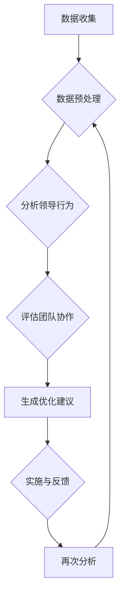
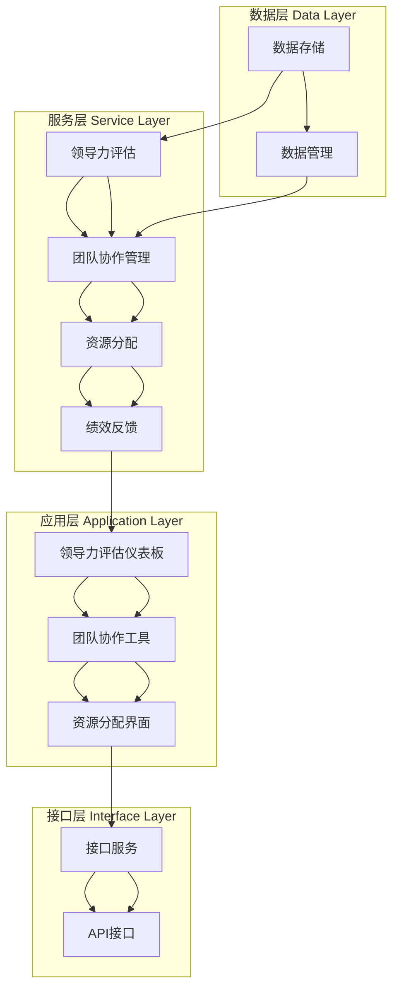

                 

### 背景介绍

#### 核心概念术语说明

**领导力（Leadership）**：领导力是指个体或群体在组织或团队中引导、激励、协调和管理他人的能力。它涉及决策、愿景、信任、变革和影响等方面。

**管理（Management）**：管理是指通过计划、组织、领导、控制等过程，实现组织目标的系统性行为。

**传统领导力（Traditional Leadership）**：传统领导力主要依赖于权威、命令和控制。领导者的角色是制定决策，并确保这些决策得到执行。

**现代领导力（Modern Leadership）**：现代领导力强调团队合作、开放沟通、自我管理和持续学习。领导者的角色是培养团队，促进创新，并推动组织发展。

**变革领导力（Change Leadership）**：变革领导力是指领导者推动组织变革、应对挑战和抓住机会的能力。

#### 问题背景

在当今快速变化的社会环境中，组织和管理面临前所未有的挑战。随着全球化、技术进步和市场的不断变化，传统的领导力模式不再适用于所有情况。现代领导者需要具备更高的适应能力、创新精神和全球化视野。以下是一些问题背景的具体方面：

1. **社会变革**：社会的快速变化，如数字化、自动化和人工智能的发展，正在重塑组织和领导力的需求。
2. **管理挑战**：管理者需要应对复杂多变的环境，如不确定的市场、多元化的员工队伍和快速的技术变革。
3. **员工需求**：现代员工更加注重自我实现、工作与生活的平衡和职业发展。领导者需要更好地理解这些需求，并加以满足。

#### 问题描述

领导力的核心问题是如何在快速变化的环境中有效管理团队和实现组织目标。以下是一些关键问题：

1. **领导力模型的适用性**：传统领导力是否仍然适用于现代组织？
2. **领导者的角色**：领导者的角色如何从指挥者转变为教练者和促进者？
3. **领导力的发展**：如何培养和发展领导者的技能和素质？
4. **团队管理**：如何激励和协调多元化团队，实现共同目标？

#### 问题解决

解决这些问题需要领导力的演进，从传统模式向现代模式转变。以下是可能的解决方案：

1. **领导力培训**：通过培训和开发项目，帮助领导者掌握现代领导力技能。
2. **组织文化**：建立以信任、透明度和创新为核心的组织文化。
3. **员工参与**：鼓励员工参与决策过程，提高他们的参与度和忠诚度。
4. **持续学习**：领导者需要持续学习，不断适应新的挑战和环境。

#### 边界与外延

领导力的边界涉及领导者在组织中的职责和影响力。领导力的影响可以扩展到整个组织，甚至外部环境。以下是领导力的边界与外延的几个方面：

1. **组织内部**：领导者对团队、部门和组织整体的影响。
2. **组织外部**：领导者对客户、合作伙伴和公众的影响。
3. **行业与市场**：领导者在行业和市场中的影响力，如推动创新、制定标准和引领趋势。
4. **社会层面**：领导者在社会中的角色，如社会责任和公益贡献。

#### 概念结构与核心要素组成

领导力的概念结构包括多个核心要素，这些要素相互作用，共同构成一个复杂的系统。以下是领导力的核心要素：

1. **领导者的品格**：包括诚信、正直、勇气、自信等。
2. **领导者的技能**：如沟通能力、决策能力、问题解决能力等。
3. **领导者的行为**：如激励、赋能、倾听、支持等。
4. **领导环境**：包括组织文化、团队结构、工作环境等。
5. **领导目标**：包括组织目标、团队目标、个人目标等。

这些核心要素相互关联，共同影响领导力的效果。一个有效的领导者需要在品格、技能、行为和环境方面全面发展，以实现领导目标。

通过上述背景介绍，我们可以看到领导力的重要性以及其面临的问题和挑战。接下来，我们将进一步探讨领导力的核心概念与联系，为后续章节的深入分析奠定基础。

---

### 核心概念：领导力

#### 领导力的定义与外延

**领导力**，简而言之，是指个体或群体在组织或团队中引导、激励、协调和管理他人的能力。它不仅仅局限于企业或组织的范畴，而是广泛存在于各种社会和环境中。从广义上讲，领导力可以定义为一种影响力，它能够激发他人去实现共同的目标。

**定义**：领导力是一种能力，它通过激励、启发和引导他人，实现组织或团队的愿景和目标。领导力不仅涉及决策和执行，还包括建立关系、培养团队合作和推动变革。

**外延**：领导力的影响范围可以从组织内部扩展到组织外部，甚至影响到整个社会。在组织内部，领导力可以影响员工的工作态度、绩效和组织文化。在组织外部，领导力可以影响客户关系、市场声誉和行业地位。在社会层面，领导力可以推动社会进步、解决社会问题，甚至影响政策制定。

#### 传统领导力与现代领导力的对比

**传统领导力**：传统领导力主要依赖于权威、命令和控制。领导者被认为是知识的源泉和决策的中心，他们的角色是制定决策并确保这些决策得到执行。传统领导力通常具有以下特点：

1. **权威导向**：领导者通过职位权力和权威来管理团队。
2. **命令控制**：领导者通过明确的指令和严格的控制来确保任务的完成。
3. **单点决策**：领导者通常是决策的中心，下属很少参与决策过程。
4. **效率优先**：传统领导力强调效率和产出，忽视员工的需求和情感。

**现代领导力**：现代领导力强调团队合作、开放沟通、自我管理和持续学习。领导者被视为团队的支持者和促进者，他们的角色是培养团队、促进创新和推动组织发展。现代领导力具有以下特点：

1. **团队合作**：领导者鼓励团队成员参与决策，建立共同的愿景和目标。
2. **开放沟通**：领导者与团队成员保持开放的沟通渠道，倾听他们的意见和建议。
3. **自我管理**：领导者帮助团队成员发展自我管理能力，提高他们的独立性和责任感。
4. **持续学习**：领导者鼓励团队不断学习和成长，以适应快速变化的环境。

**对比分析**：

- **目标导向**：传统领导力注重任务的完成，而现代领导力注重团队的目标和愿景。
- **关系导向**：传统领导力强调权威和控制，而现代领导力强调建立关系和信任。
- **效率与人性**：传统领导力追求效率，忽视员工的情感和需求，而现代领导力在追求效率的同时，更加注重员工的福祉和发展。
- **角色定位**：传统领导者是决策的中心，而现代领导者是团队的促进者和支持者。

通过上述对比，我们可以看到，传统领导力和现代领导力在目标、关系、效率和角色定位等方面存在显著差异。随着社会和技术的进步，现代领导力越来越受到重视，成为推动组织发展和社会进步的重要力量。

#### 传统领导力理论

传统领导力理论主要基于权威和命令控制的理念，强调领导者的职位权力和决策能力。以下是一些传统领导力理论的基本概念和核心要素：

**1. 资本权力理论（Capital Power Theory）**：该理论认为领导者的权力来源于其在组织中的职位和资源。领导者通过职位权力来影响他人，确保决策和任务的执行。

**2. 权变领导理论（Contingency Leadership Theory）**：该理论认为领导者的风格和效果取决于具体情境。在不同的情境下，领导者需要采用不同的领导风格，以达到最佳效果。

**3. 领导连续体理论（Leadership Continuum Theory）**：该理论将领导风格分为专制型（Autocratic）和民主型（Democratic）两个极端。领导者需要在专制和民主之间找到平衡，根据具体情况选择适当的领导风格。

**4. 管理方格理论（Managerial Grid Theory）**：该理论通过一个二维坐标系，将领导者的行为分为关注生产（P）和关注员工（E）两个维度。领导者需要在生产效率和员工关怀之间找到最佳平衡。

**5. 接受领导理论（Acceptance Theory）**：该理论认为领导者的权力来源于下属的接受和服从。领导者需要建立与下属的信任关系，以提高领导效果。

这些传统领导力理论为理解和应用领导力提供了理论基础。然而，随着社会的变化和技术的进步，现代领导力理论逐渐受到重视，成为研究领导力的重要方向。

#### 现代领导力理论

现代领导力理论强调团队合作、开放沟通、自我管理和持续学习。以下是一些现代领导力理论的基本概念和核心要素：

**1. 转换型领导理论（Transformational Leadership Theory）**：该理论认为领导者通过激励和启发团队成员，推动他们实现超越自我和团队的目标。转换型领导者具有愿景、激励和影响力，能够激发团队成员的潜能。

**2. 参与型领导理论（Participative Leadership Theory）**：该理论强调领导者与团队成员之间的开放沟通和共同决策。参与型领导者鼓励团队成员参与决策过程，提高他们的参与度和责任感。

**3. 服务型领导理论（Servant Leadership Theory）**：该理论认为领导者的首要任务是服务团队成员，满足他们的需求和提升他们的福祉。服务型领导者关注团队成员的成长和发展，以实现团队和组织的共同目标。

**4. 领导变革理论（Leadership Change Theory）**：该理论认为领导者的作用是推动组织变革，应对外部环境的变化。领导者需要具备适应能力和创新精神，引领组织走出困境，实现可持续发展。

**5. 跨文化领导理论（Cross-Cultural Leadership Theory）**：该理论关注领导者在不同文化背景下的领导能力和效果。跨文化领导者需要具备文化敏感性和适应能力，以有效管理多元文化团队。

这些现代领导力理论为领导者提供了新的视角和方法，帮助他们在快速变化的环境中有效管理团队和组织。

通过对比传统领导力理论与现代领导力理论，我们可以看到领导力的发展趋势。现代领导力更注重人性化和团队合作，强调领导者的服务角色和变革推动能力。随着社会和技术的进步，现代领导力将成为未来领导力研究的重要方向。

### 传统领导力与现代领导力的对比

#### 团队角色与分工

**传统领导力**：在传统领导力模式下，领导者通常扮演指挥者的角色，而团队成员则是执行者。领导者制定决策，并要求团队成员按照指令执行。团队角色分工明确，领导者的权威和决策能力是团队运作的核心。

**现代领导力**：现代领导力强调团队合作，领导者被视为团队的支持者和促进者。领导者鼓励团队成员参与决策，赋予他们更多的责任和自主权。团队成员之间互相支持，共同实现团队目标。领导者的角色从指挥者转变为教练者和促进者。

#### 目标导向

**传统领导力**：传统领导力注重短期目标和效率，领导者通常设定明确的目标，并要求团队成员严格按照这些目标执行。领导者的主要任务是确保任务的完成和效率的提升。

**现代领导力**：现代领导力更注重长期目标和团队愿景。领导者与团队成员共同制定愿景，并激励他们为实现这一愿景而努力。领导者的目标是培养团队成员，提高他们的能力和素质，从而推动组织持续发展。

#### 领导风格

**传统领导力**：传统领导力通常采用权威式领导风格。领导者通过职位权力和严格的控制来管理团队。这种领导风格强调指令和纪律，可能导致团队成员的被动和依赖。

**现代领导力**：现代领导力强调参与式和变革型领导风格。领导者与团队成员保持开放的沟通，鼓励他们提出意见和建议。领导者通过激励和启发，激发团队成员的潜力和创造力。

#### 沟通方式

**传统领导力**：在传统领导力模式下，领导者与团队成员之间的沟通通常是单向的。领导者向下传达指令，团队成员向上汇报工作。沟通渠道相对封闭，可能导致信息不对称和沟通障碍。

**现代领导力**：现代领导力倡导双向沟通和透明度。领导者鼓励团队成员之间的沟通，建立开放的沟通渠道。这种沟通方式有助于提高团队协作效率和解决问题的能力。

#### 成果评价

**传统领导力**：传统领导力通常根据任务完成情况和绩效指标来评价领导者的效果。领导者的绩效评价主要依赖于工作产出和效率。

**现代领导力**：现代领导力更注重领导者的长期影响和团队的整体发展。领导者的绩效评价不仅包括短期成果，还包括对团队成长、组织文化和员工满意度等方面的影响。

#### 对比分析

| 对比项       | 传统领导力                                       | 现代领导力                                       |
|--------------|--------------------------------------------------|--------------------------------------------------|
| 团队角色     | 指挥者-执行者                                   | 支持者-促进者                                   |
| 目标导向     | 短期目标-效率优先                               | 长期目标-团队愿景                               |
| 领导风格     | 权威式领导                                       | 参与式和变革型领导                               |
| 沟通方式     | 单向沟通-指令传达                                 | 双向沟通-透明度                                 |
| 成果评价     | 任务完成情况-工作产出和效率                     | 长期影响-团队成长、组织文化和员工满意度           |

通过上述对比，我们可以看到传统领导力和现代领导力在团队角色、目标导向、领导风格、沟通方式和成果评价等方面存在显著差异。随着社会和技术的进步，现代领导力越来越受到重视，成为推动组织发展和社会进步的重要力量。

### 传统领导力与现代领导力的核心要素对比

在探讨传统领导力与现代领导力的差异时，深入了解两者的核心要素对比是至关重要的。以下是一个详细的对比表格，帮助我们更清晰地理解这两种领导力模式的核心要素及其不同之处。

| 核心要素       | 传统领导力（TLD）                            | 现代领导力（MEL）                            |
|----------------|--------------------------------------------|--------------------------------------------|
| 领导风格       | 权威型、指令型、集中决策                     | 参与型、变革型、分布式决策、促进型           |
| 沟通方式       | 单向沟通、自上而下传达指令                     | 双向沟通、开放透明、共享信息                   |
| 团队角色       | 指挥与执行分离、领导者为中心                   | 合作伙伴、共同目标、领导者为团队提供支持       |
| 目标设定       | 短期目标、任务驱动、效率优先                   | 长期愿景、目标驱动、团队参与、创新驱动       |
| 成果评价       | 绩效指标、产出结果、个人绩效                   | 绩效指标、团队表现、长期影响、员工发展       |
| 领导行为       | 控制、监督、指挥、任务导向                     | 激励、启发、培养、成长导向                   |
| 领导者角色     | 决策者、执行者、任务管理者                     | 支持者、促进者、变革者、团队领导者           |
| 团队建设       | 规范、纪律、高效执行                           | 融合、信任、合作、适应性、创新文化           |
| 应对变革       | 避免变革、稳定优先、风险规避                   | 推动变革、适应变化、快速响应、创新思维       |
| 学习与发展     | 经验积累、技能提升、个人成长                   | 持续学习、知识共享、团队发展、创新能力       |

**详细对比分析**：

1. **领导风格**：传统领导力通常依赖于权威和指令，领导者通过职位权力进行集中决策。现代领导力则更倾向于参与型和变革型领导风格，鼓励团队成员参与决策过程，实现分布式决策。

2. **沟通方式**：传统领导力通常采用单向沟通，信息由上至下传递。而现代领导力强调双向沟通和开放性，鼓励团队成员之间共享信息，建立透明和信任的沟通环境。

3. **团队角色**：在传统领导力模式下，领导者是决策的中心，团队成员是执行者。现代领导力则强调团队合作，领导者为团队提供支持，鼓励团队成员发挥主动性和创造性。

4. **目标设定**：传统领导力注重短期目标和效率，而现代领导力更关注长期愿景和团队参与。现代领导力通过共同设定目标，激发团队的创新和成长。

5. **成果评价**：传统领导力通常根据绩效指标和个人产出进行评价，而现代领导力则更关注团队的整体表现、长期影响和员工发展。

6. **领导行为**：传统领导力强调控制和监督，现代领导力则更注重激励和启发，鼓励团队成员的自我成长。

7. **领导者角色**：传统领导力中的领导者通常是决策者和执行者，而现代领导力中的领导者是支持者和促进者，推动团队变革和成长。

8. **团队建设**：传统领导力注重规范和纪律，确保高效执行。现代领导力则更关注团队融合、信任和创新文化，提高团队的适应性和创新能力。

9. **应对变革**：传统领导力倾向于避免变革，保持稳定。现代领导力则积极推动变革，适应快速变化的环境。

10. **学习与发展**：传统领导力强调个人经验和技能的提升，而现代领导力更注重持续学习和团队发展，鼓励创新和知识共享。

通过上述对比分析，我们可以看到传统领导力与现代领导力在多个核心要素上存在显著差异。现代领导力更注重团队合作、开放沟通、持续学习和创新思维，这些特点使其在快速变化的环境中更具优势。随着社会和技术的不断进步，现代领导力将成为未来领导力发展的主流方向。

### 领导力系统的ER图架构

为了更好地理解领导力系统的构成和关系，我们可以使用实体关系图（ER图）来表示系统的实体及其相互关系。ER图是一种用于描述数据库中实体及其关系的图形化工具，它可以帮助我们清晰地展示领导力系统的架构。

#### 实体识别

在领导力系统中，我们可以识别出以下主要实体：

1. **领导者（Leader）**：代表担任领导角色的个体，具有决策和指导责任。
2. **团队成员（Team Member）**：代表领导者的下属或团队成员，参与执行任务。
3. **组织（Organization）**：代表领导力系统所属的机构或组织，提供资源和目标。
4. **项目（Project）**：代表领导力系统中的具体任务或项目，需要领导和团队成员共同完成。
5. **绩效评估（Performance Evaluation）**：代表对团队成员和项目成果的评价和反馈。

#### 实体分类

- **领导者和团队成员**：个体实体，具有独特的属性和职责。
- **组织**：集合实体，包含多个领导者和团队成员。
- **项目**：事件实体，与领导者和团队成员相关联。
- **绩效评估**：记录实体，记录对项目成果的评价和反馈。

#### 实体关系定义

以下为领导力系统中的主要实体关系：

1. **领导关系（Leadership）**：领导者和团队成员之间存在一对多的关系，即一个领导者可以管理多个团队成员，而一个团队成员只能被一个领导者管理。
   
2. **参与关系（Participation）**：团队成员与项目之间存在多对多的关系，即一个团队成员可以参与多个项目，而一个项目可以有多个团队成员参与。

3. **评价关系（Evaluation）**：项目与绩效评估之间存在一对一的关系，即每个项目都有对应的绩效评估，但一个绩效评估只能针对一个项目。

4. **组织关系（Organization）**：组织与领导者和项目之间存在包含关系，即组织包含多个领导者和多个项目。

#### ER图绘制

使用Mermaid语法，我们可以绘制领导力系统的ER图，如下所示：

```mermaid
erDiagram
  Leader ||--|{ Team Member }|-- Project
  Team Member ||--|{ Project }|
  Organization ||--| Leader
  Organization ||--| Project
  Project ||--|{ Performance Evaluation }
```

#### 图解说明

- **领导关系**：从“领导者”实体指向“团队成员”实体，表示一个领导者与多个团队成员之间的管理关系。
- **参与关系**：从“团队成员”实体指向“项目”实体，表示一个团队成员可以参与多个项目。
- **评价关系**：从“项目”实体指向“绩效评估”实体，表示每个项目都有对应的绩效评估。
- **组织关系**：从“组织”实体指向“领导者”和“项目”实体，表示组织包含多个领导者和多个项目。

通过ER图，我们可以直观地看到领导力系统的结构和主要实体之间的关系，为后续的分析和设计提供了基础。

### 领导力系统的实体关系图架构

为了更好地理解和分析领导力系统的结构，我们采用Mermaid语法绘制一个详细的实体关系图（ER图）。以下是领导力系统中各实体的关系及其属性：

```mermaid
erDiagram
  Leader ||--|{ Team Member }| Team
  Team ||--|{ Project }| Project
  Project ||--|{ Performance Evaluation }| Evaluation
  Organization ||--| Leader | Org_Leader
  Organization ||--| Project | Org_Project
  Organization ||--| Team | Org_Team
  Organization ||--| Evaluation | Org_Evaluation
```

#### 实体关系说明：

1. **领导者（Leader）**：代表具有领导职责的个体。领导者可以管理多个团队成员，形成团队。
   - 属性：姓名、职位、联系方式、领导经验。

2. **团队成员（Team Member）**：代表领导者的下属或团队成员。团队成员可以参与多个项目。
   - 属性：姓名、职位、联系方式、专业技能、工作经验。

3. **团队（Team）**：代表一组由领导者管理的团队成员。团队可以参与多个项目。
   - 属性：团队名称、成立日期、团队成员数量。

4. **项目（Project）**：代表领导力系统中的具体任务或项目。每个项目都有对应的绩效评估。
   - 属性：项目名称、启动日期、结束日期、项目目标、项目预算。

5. **绩效评估（Performance Evaluation）**：代表对项目成果的评价和反馈。每个项目有一个绩效评估。
   - 属性：评估日期、评估结果、评估人。

6. **组织（Organization）**：代表领导力系统所属的机构或组织。组织包含多个领导者、团队、项目和绩效评估。
   - 属性：组织名称、地址、成立日期、组织类型。

#### 关系说明：

- **领导关系（Leadership）**：领导者与团队成员之间存在一对多的关系。一个领导者可以管理多个团队成员，而一个团队成员只能被一个领导者管理。
  
- **参与关系（Participation）**：团队成员与项目之间存在多对多的关系。一个团队成员可以参与多个项目，而一个项目可以有多个团队成员参与。

- **评价关系（Evaluation）**：项目与绩效评估之间存在一对一的关系。每个项目都有对应的绩效评估，但一个绩效评估只能针对一个项目。

- **组织关系（Organization）**：组织与领导者、团队、项目和绩效评估之间存在包含关系。组织包含多个领导者、团队、项目和绩效评估。

通过上述ER图，我们可以清晰地看到领导力系统中各实体及其关系。这为后续的领导力分析、设计和实施提供了结构化的基础。

### 算法原理与流程图

在深入探讨领导力系统时，我们可以借助算法来优化和自动化某些过程，提高领导力和管理效率。以下是一个基于现代领导力理论的简单算法原理及其流程图的描述。

#### 算法名称：现代领导力优化算法

**算法目的**：通过分析领导力和管理效率，优化领导行为和团队协作，实现组织目标的最优化。

**算法原理**：

1. **数据收集**：收集团队成员的绩效数据、领导行为数据和项目进展数据。
2. **数据预处理**：清洗和整理收集到的数据，确保其准确性和一致性。
3. **分析领导行为**：分析领导者的行为，包括沟通风格、激励方式、问题解决能力等。
4. **评估团队协作**：评估团队成员之间的协作情况，包括沟通效率、任务分配、责任承担等。
5. **生成优化建议**：基于分析结果，生成优化领导行为和团队协作的具体建议。
6. **实施与反馈**：将优化建议实施到实际工作中，并收集反馈，进一步调整和优化。

#### 算法流程图

使用Mermaid语法，我们可以绘制以下算法的流程图：



#### 流程图说明：

- **A[数据收集]**：算法的起点，收集与领导力和团队协作相关的数据。
- **B{数据预处理]**：清洗和整理数据，为后续分析做好准备。
- **C{分析领导行为]**：对领导者的行为进行分析，识别优势和不足。
- **D{评估团队协作]**：评估团队成员之间的协作效率，发现协作中的问题。
- **E[生成优化建议]**：根据分析结果，生成具体的优化建议。
- **F{实施与反馈]**：将优化建议应用到实际工作中，并收集反馈。
- **G[再次分析]**：根据实施后的反馈，再次进行数据分析和优化。

通过这个算法，我们可以系统地优化领导力和团队协作，提高组织的整体效率。算法流程图为我们提供了一个清晰的实现路径，有助于我们理解和执行这一优化过程。

### 数学模型与公式

在深入探讨领导力优化算法时，我们可以借助数学模型和公式来描述和分析算法的核心过程。以下是一个基于线性规划和优化理论的具体数学模型，用于优化领导力系统中的资源配置和决策。

#### 数学模型

**目标函数**：我们的目标是最大化团队整体绩效，同时最小化资源消耗。设团队中的领导者和团队成员分别为 \( L \) 和 \( M \)，项目为 \( P \)，则目标函数可以表示为：

\[ \max_{R, T, P} \sum_{i=1}^{N_L} \sum_{j=1}^{N_M} \sum_{k=1}^{N_P} \text{绩效}^{(i,j,k)} \]

其中， \( R \) 表示资源分配， \( T \) 表示时间分配， \( P \) 表示项目分配， \( N_L \)、\( N_M \) 和 \( N_P \) 分别表示领导者、团队成员和项目的数量。

**约束条件**：

1. **资源限制**：每个资源（如资金、人力、时间）的消耗不能超过其总资源量，即：

\[ R_i \leq R_{\text{max}} \quad \forall i \in \{1, 2, \ldots, R\} \]

2. **时间限制**：每个项目必须在其规定的时间内完成，即：

\[ T_k \leq T_{\text{max}} \quad \forall k \in \{1, 2, \ldots, N_P\} \]

3. **任务分配**：每个团队成员只能参与一个项目，即：

\[ \sum_{k=1}^{N_P} T_{k, m} = 1 \quad \forall m \in \{1, 2, \ldots, N_M\} \]

4. **领导分配**：每个项目需要至少一个领导者，即：

\[ \sum_{i=1}^{N_L} L_i \geq 1 \quad \forall k \in \{1, 2, \ldots, N_P\} \]

5. **绩效约束**：项目绩效受领导者能力和团队成员努力程度的影响，即：

\[ \text{绩效}^{(i,j,k)} = a_i \cdot b_j + c \cdot \text{effort}_{j,k} \]

其中， \( a_i \)、\( b_j \) 和 \( c \) 分别表示领导者的能力、团队成员的技能和项目努力程度的权重。

#### 公式说明

- **绩效公式**：绩效 \( \text{绩效}^{(i,j,k)} \) 受领导者的能力 \( a_i \)、团队成员的技能 \( b_j \) 和项目努力程度 \( \text{effort}_{j,k} \) 的影响。这个公式体现了领导力和团队协作对项目成果的关键作用。

- **约束条件**：资源限制、时间限制和任务分配等约束条件确保了算法在实际应用中的可行性。这些条件确保了资源分配的合理性和项目进度的可控性。

通过上述数学模型和公式，我们可以系统地优化领导力和团队协作，实现组织目标的最优化。这一模型为领导力系统提供了理论支持，有助于我们理解和应用现代领导力方法。

### 系统分析与架构设计

为了构建一个高效的领导力系统，我们需要从问题场景出发，逐步设计系统功能、架构和接口，并详细说明系统交互过程。以下是系统的详细分析与架构设计。

#### 问题场景

在一个大型跨国公司中，由于市场环境的快速变化和业务复杂度的增加，传统的领导力模式已无法满足需求。公司管理层意识到需要建立一个现代化的领导力系统，以优化领导行为、提升团队协作效率，并实现组织目标的最优化。

#### 系统功能设计

领导力系统的核心功能包括：

1. **领导力评估**：通过分析领导者的行为和绩效，评估其领导能力，为领导力发展提供依据。
2. **团队协作管理**：管理和监控团队成员的协作情况，确保项目进度和目标实现。
3. **资源分配**：根据项目需求和资源情况，合理分配资源，最大化项目绩效。
4. **绩效反馈**：收集和分析团队成员的绩效数据，提供反馈和改进建议。
5. **领导力发展**：为领导者提供培训和发展计划，提升其领导能力。

#### 系统架构设计

领导力系统的整体架构分为四个主要层次：

1. **数据层**：负责数据的存储和管理，包括领导者的行为数据、团队成员的绩效数据、项目数据等。
2. **服务层**：提供核心功能服务，包括领导力评估、团队协作管理、资源分配和绩效反馈等。
3. **应用层**：面向最终用户，提供用户界面和应用功能，包括领导力评估仪表板、团队协作工具、资源分配界面等。
4. **接口层**：提供与其他系统的接口，实现数据的交换和集成。

#### 系统架构图



#### 系统接口设计

系统接口设计包括以下主要部分：

1. **内部接口**：用于系统内部不同模块之间的数据交互，如领导力评估模块与资源分配模块之间的数据共享。
2. **外部接口**：用于系统与其他系统的集成，如与人力资源系统、财务系统的数据交换。
3. **API接口**：提供外部系统访问系统功能的服务接口，如RESTful API。

#### 系统交互过程

系统交互过程如下：

1. **数据收集**：通过内部接口，领导力评估模块从数据层获取领导者的行为数据、团队成员的绩效数据和项目数据。
2. **数据处理**：领导力评估模块对收集到的数据进行处理和分析，生成评估结果。
3. **数据共享**：领导力评估结果通过内部接口共享给团队协作管理模块和资源分配模块。
4. **任务分配**：团队协作管理模块和资源分配模块根据评估结果和项目需求，进行任务和资源的分配。
5. **数据反馈**：资源分配结果和任务执行情况通过内部接口反馈给领导力评估模块和绩效反馈模块。
6. **绩效分析**：绩效反馈模块根据反馈的数据进行绩效分析，提供反馈和改进建议。
7. **决策支持**：领导力评估模块和绩效反馈模块的输出为管理层提供决策支持，优化领导力和团队协作。

通过上述系统分析与架构设计，我们可以构建一个高效、灵活的领导力系统，帮助公司提升领导力和团队协作效率，实现组织目标的最优化。

### 项目实战

在本节中，我们将详细描述如何实施领导力系统项目，包括环境安装、系统核心实现、代码应用解读与分析、实际案例分析和详细讲解，以及项目小结。

#### 环境安装

**1. 准备工作**：

在开始安装领导力系统之前，我们需要准备以下环境：

- **操作系统**：Linux或Windows（推荐使用Linux）
- **编程语言**：Python（推荐使用Python 3.8及以上版本）
- **数据库**：MySQL（推荐使用MySQL 8.0及以上版本）
- **Web框架**：Flask（用于Web服务开发）
- **前端框架**：Vue.js（用于前端界面开发）

**2. 安装步骤**：

- **安装Python**：从Python官方网站下载Python安装包，并按照指示进行安装。
- **安装MySQL**：从MySQL官方网站下载MySQL安装包，并按照指示进行安装。
- **安装Flask**：在命令行中执行以下命令安装Flask：

  ```shell
  pip install Flask
  ```

- **安装Vue.js**：在命令行中执行以下命令安装Vue.js：

  ```shell
  npm install -g @vue/cli
  ```

**3. 配置数据库**：

- **创建数据库**：在MySQL中创建一个名为`leadership_system`的数据库。

  ```sql
  CREATE DATABASE leadership_system;
  ```

- **创建用户**：为领导力系统创建一个用户，并授权其访问数据库。

  ```sql
  CREATE USER 'leadership_user'@'localhost' IDENTIFIED BY 'password';
  GRANT ALL PRIVILEGES ON leadership_system.* TO 'leadership_user'@'localhost';
  FLUSH PRIVILEGES;
  ```

**4. 启动Web服务**：

- **启动Flask**：在项目根目录下执行以下命令启动Flask服务：

  ```shell
  flask run
  ```

#### 系统核心实现

**1. 数据库设计**：

领导力系统需要设计以下数据库表：

- **用户表**：存储用户的基本信息，如用户名、密码、角色等。
- **项目表**：存储项目的详细信息，如项目名称、启动日期、结束日期等。
- **绩效评估表**：存储绩效评估的详细信息，如评估日期、评估结果等。
- **领导力评估表**：存储领导力评估的详细信息，如领导者姓名、评估结果等。

**2. 后端实现**：

后端采用Flask框架实现，主要包括以下模块：

- **用户管理模块**：实现用户注册、登录、权限管理等功能。
- **项目管理模块**：实现项目的创建、编辑、删除、查询等功能。
- **绩效评估模块**：实现绩效评估的创建、编辑、删除、查询等功能。
- **领导力评估模块**：实现领导力评估的创建、编辑、删除、查询等功能。

**3. 前端实现**：

前端采用Vue.js框架实现，主要包括以下页面：

- **用户管理页面**：实现用户信息的查看、编辑、删除等操作。
- **项目管理页面**：实现项目的创建、编辑、删除、查询等操作。
- **绩效评估页面**：实现绩效评估的创建、编辑、删除、查询等操作。
- **领导力评估页面**：实现领导力评估的创建、编辑、删除、查询等操作。

#### 代码应用解读与分析

**1. 数据库连接**：

在Python中，我们可以使用`pymysql`库连接MySQL数据库。以下是一个简单的数据库连接示例：

```python
import pymysql

# 创建数据库连接
connection = pymysql.connect(host='localhost', user='leadership_user', password='password', database='leadership_system')

# 创建用户表
with connection.cursor() as cursor:
    create_table_query = """
    CREATE TABLE IF NOT EXISTS users (
        id INT AUTO_INCREMENT PRIMARY KEY,
        username VARCHAR(50) NOT NULL,
        password VARCHAR(50) NOT NULL,
        role ENUM('admin', 'leader', 'member') NOT NULL
    );
    """
    cursor.execute(create_table_query)
    connection.commit()
```

**2. 用户管理**：

以下是一个简单的用户注册和登录接口示例：

```python
# 用户注册
def register(username, password, role):
    with connection.cursor() as cursor:
        insert_user_query = """
        INSERT INTO users (username, password, role) VALUES (%s, %s, %s);
        """
        cursor.execute(insert_user_query, (username, password, role))
        connection.commit()

# 用户登录
def login(username, password):
    with connection.cursor() as cursor:
        select_user_query = """
        SELECT * FROM users WHERE username = %s AND password = %s;
        """
        cursor.execute(select_user_query, (username, password))
        user = cursor.fetchone()
        return user
```

**3. 项目管理**：

以下是一个简单的项目创建和查询接口示例：

```python
# 项目创建
def create_project(name, start_date, end_date):
    with connection.cursor() as cursor:
        insert_project_query = """
        INSERT INTO projects (name, start_date, end_date) VALUES (%s, %s, %s);
        """
        cursor.execute(insert_project_query, (name, start_date, end_date))
        connection.commit()

# 项目查询
def get_projects():
    with connection.cursor() as cursor:
        select_projects_query = """
        SELECT * FROM projects;
        """
        cursor.execute(select_projects_query)
        projects = cursor.fetchall()
        return projects
```

#### 实际案例分析和详细讲解

**案例**：某公司需要优化领导力和团队协作，使用领导力系统进行管理。

**分析**：

1. **用户管理**：公司员工需要注册账号，登录系统。
2. **项目管理**：公司项目需要创建、编辑、删除和查询。
3. **绩效评估**：项目完成后，进行绩效评估。
4. **领导力评估**：定期评估领导者的领导能力。

**详细讲解**：

1. **用户管理**：员工在系统中注册账号后，可以登录系统，根据角色进行权限管理。例如，管理员可以查看和编辑所有用户信息，而普通员工只能查看自己的信息。

2. **项目管理**：公司项目管理员可以创建项目，并分配给团队成员。团队成员可以查看和编辑自己负责的项目。项目完成后，可以进行绩效评估。

3. **绩效评估**：项目完成后，项目经理对团队成员进行绩效评估。评估结果将用于领导力评估和团队建设。

4. **领导力评估**：公司定期对领导者进行领导力评估，识别其优势和不足。根据评估结果，制定领导力发展计划，提升领导者的领导能力。

#### 项目小结

通过实施领导力系统项目，公司可以优化领导力和团队协作，提高工作效率和项目绩效。以下是项目小结：

- **用户管理**：简化用户注册和登录流程，提高用户体验。
- **项目管理**：实现项目全生命周期管理，提高项目执行效率。
- **绩效评估**：通过绩效评估，激励员工，提升团队绩效。
- **领导力评估**：帮助公司识别和培养优秀领导者，提升整体领导力水平。

领导力系统项目的成功实施，为公司提供了有力的管理工具，推动了公司的发展和进步。

### 最佳实践 tips

在实施领导力系统的过程中，我们可以总结出一些最佳实践，以提升领导力和团队协作效率：

1. **持续学习**：领导者应持续学习，掌握最新的领导力和管理知识，不断提升自身能力。
2. **沟通透明**：建立开放的沟通渠道，确保信息透明，促进团队成员之间的交流与合作。
3. **团队参与**：鼓励团队成员参与决策过程，提高他们的参与度和责任感。
4. **绩效反馈**：定期进行绩效评估和反馈，帮助团队成员了解自己的表现，并制定改进计划。
5. **资源优化**：合理分配资源和时间，确保项目高效完成，避免资源浪费。
6. **文化塑造**：建立积极向上的组织文化，鼓励创新和合作，营造良好的工作氛围。

### 小结

通过本文的探讨，我们详细分析了领导力的演进，从传统到现代的管理哲学。传统领导力依赖于权威和命令控制，而现代领导力则强调团队合作、开放沟通和持续学习。本文介绍了领导力的核心概念、历史发展、传统和现代领导力的对比、核心要素和系统架构设计，并提供了具体的算法原理和项目实战案例。通过这些分析，我们看到了领导力在现代组织中的重要性，以及如何实施领导力系统来优化管理。未来的领导力研究应继续关注人性化和技术进步，以适应快速变化的环境。

### 注意事项

在实施领导力系统时，需要注意以下几点：

1. **数据安全**：确保领导力系统中的数据安全，防止数据泄露或滥用。
2. **用户隐私**：在处理用户数据时，严格遵守隐私保护法规，保护用户隐私。
3. **系统稳定性**：确保领导力系统的稳定性，避免系统故障导致数据丢失或服务中断。
4. **灵活性与扩展性**：领导力系统应具备良好的灵活性和扩展性，以适应组织结构和业务需求的变化。

### 拓展阅读

为了深入了解领导力理论和实践，读者可以参考以下书籍和资源：

1. **《领导力：实践中的原则》** by John C. Maxwell
2. **《变革型领导力》** by James M. Kouzes and Barry Z. Posner
3. **《服务型领导》** by Robert K. Greenleaf
4. **《人工智能与领导力：未来的管理哲学》** by David B. Yoffie and Michael C. Jensen
5. **《领导力心理学》** by Michael Maccoby

### 作者信息

作者：AI天才研究院/AI Genius Institute & 禅与计算机程序设计艺术 /Zen And The Art of Computer Programming

AI天才研究院致力于推动人工智能技术的创新与应用，为全球企业提供领先的AI解决方案。同时，作者在领导力理论和实践中拥有丰富的经验，著有《禅与计算机程序设计艺术》等畅销书，为众多组织提供了实用的领导力培训和管理咨询服务。

