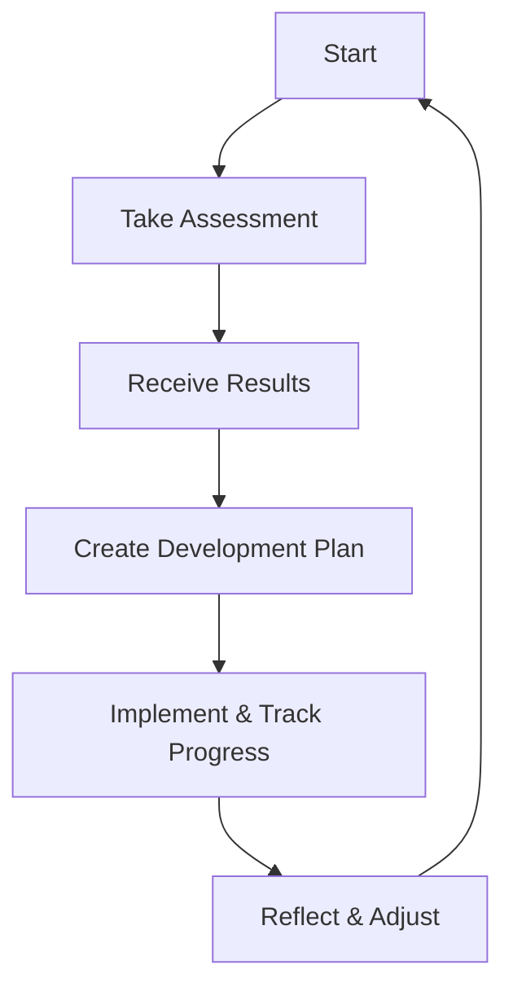
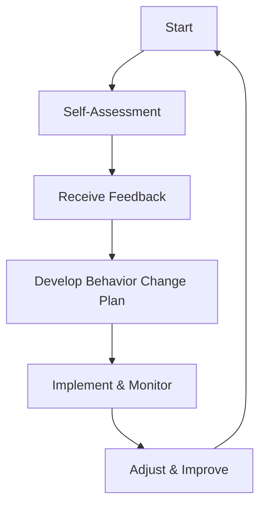
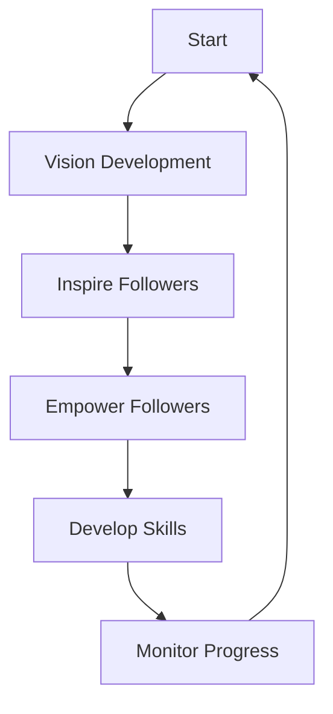

                 


### Introduction to Leadership

#### What is Leadership?

Leadership can be defined as the ability to inspire, influence, and guide individuals or groups toward achieving common goals. It involves the process of leading and directing people towards a common objective. Leadership is not limited to those in formal positions of authority; it can be demonstrated by anyone who takes responsibility for leading a group, project, or organization.

**Characteristics of Effective Leaders**

Effective leaders possess several key characteristics that set them apart. These include:

1. **Vision and Purpose**: Leaders have a clear vision of what they want to achieve and can communicate this vision to others. They inspire others by aligning their goals with the leader's vision.

2. **Communication Skills**: Effective leaders communicate clearly and effectively. They listen to others, provide feedback, and ensure that their message is understood.

3. **Decision-Making Skills**: Leaders make informed decisions based on a variety of factors. They are comfortable with risk and are willing to make tough decisions when necessary.

4. **Empathy and Emotional Intelligence**: Leaders understand and manage their own emotions, as well as the emotions of those they lead. They are able to build strong relationships based on trust and respect.

5. **Adaptability and Resilience**: Leaders are flexible and able to adapt to changing circumstances. They are also resilient, able to recover from setbacks and continue to move forward.

**Importance of Leadership in Organizations**

Leadership plays a crucial role in the success of organizations. Effective leaders can:

1. **Create a Positive Work Environment**: Leaders can foster a culture of collaboration, respect, and innovation, which leads to higher employee satisfaction and productivity.

2. **Set Clear Directions**: Leaders provide direction and clarity, ensuring that everyone in the organization understands the goals and objectives.

3. **Motivate and Inspire**: Leaders inspire and motivate their team members to achieve their best, pushing them to reach new heights.

4. **Drive Change**: Leaders are agents of change. They identify areas for improvement and implement strategies to drive growth and innovation.

#### The Leadership Development Process

The leadership development process is a journey that involves several key steps:

**Self-Assessment**

The first step in leadership development is self-assessment. Leaders need to understand their strengths and weaknesses, as well as their personal values and beliefs. This self-awareness helps leaders to better understand how they can improve their leadership skills.

**Goal Setting**

Once leaders have assessed their strengths and weaknesses, they can set goals for personal and professional development. These goals should be specific, measurable, achievable, relevant, and time-bound (SMART).

**Skill Development**

After setting goals, leaders can begin to develop the skills they need to achieve those goals. This may involve formal training, mentoring, or on-the-job experience. Leaders should be open to learning from a variety of sources and be willing to take risks to develop their skills.

**Continuous Learning**

Leadership is an ongoing process. Leaders must be committed to continuous learning and improvement. This involves staying updated on industry trends, seeking feedback from others, and being open to new ideas and perspectives.

### Leadership Styles and Their Effects

There are several leadership styles that leaders can adopt. Each style has its own advantages and disadvantages, and the effectiveness of a particular style can depend on the situation and the individuals involved.

**Autocratic Leadership**

Autocratic leadership is characterized by a leader who makes decisions without input from others. This style can be effective in situations that require quick decision-making or when the leader has a high level of expertise. However, it can also lead to a lack of motivation and low morale among team members.

**Democratic Leadership**

Democratic leadership involves leaders who involve team members in decision-making processes. This style can foster a sense of ownership and commitment among team members, leading to higher levels of motivation and job satisfaction. However, it can also be time-consuming and may result in decisions that are not always the best for the organization.

**Laissez-Faire Leadership**

Laissez-faire leadership is characterized by a hands-off approach, where leaders allow team members to make decisions independently. This style can be effective in situations where team members are highly skilled and motivated. However, it can also lead to a lack of direction and coordination.

**Transformational Leadership**

Transformational leadership involves leaders who inspire and motivate their team members to achieve their full potential. This style focuses on building strong relationships and fostering a sense of purpose and vision. Transformational leaders are often seen as role models and can drive significant change within an organization.

**Transactional Leadership**

Transactional leadership is based on a system of rewards and punishments. Leaders use incentives and penalties to motivate their team members. This style can be effective in maintaining order and ensuring that tasks are completed efficiently. However, it can also lead to a lack of innovation and creativity.

### Leadership Challenges and Opportunities

Leadership is not without its challenges. Leaders must navigate a complex environment that includes internal challenges and external opportunities.

**Internal Challenges**

Internal challenges can include organizational politics, resistance to change, and a lack of resources. Leaders must be adept at managing these challenges to maintain their effectiveness.

**External Challenges**

External challenges can include economic fluctuations, market changes, and competitive pressures. Leaders must be agile and adaptable to respond to these challenges effectively.

**Opportunities for Growth**

Despite the challenges, leadership also presents opportunities for growth and development. Leaders can take advantage of new technologies, market trends, and innovative ideas to drive growth and success.

In conclusion, leadership is a complex and multifaceted role that requires a combination of skills, knowledge, and experience. Effective leaders inspire and motivate their team members, create a positive work environment, and drive organizational success. By understanding the different leadership styles and challenges, leaders can develop the skills and strategies they need to succeed. The journey of leadership development is ongoing, and leaders must be committed to continuous learning and improvement to remain effective in their roles.

---------------------------------------------------------------

### Core Leadership Concepts

#### Leadership Theories

Leadership theories can be broadly categorized into traditional and contemporary theories. Traditional theories focus on the qualities and behaviors of effective leaders, while contemporary theories emphasize the dynamic nature of leadership and the importance of relationships and situational factors.

**Traditional Theories**

1. **Trait Theory**
   - Believes that certain personality traits, such as intelligence, confidence, and integrity, are key to effective leadership.
   - Research has shown that these traits can be advantageous, but they are not the sole determinants of leadership success.

2. **Behavioral Theory**
   - Focuses on the specific behaviors that leaders exhibit and how these behaviors influence followers.
   - Leadership behaviors can be categorized into task-oriented behaviors (e.g., setting goals, monitoring progress) and relationship-oriented behaviors (e.g., providing support, fostering teamwork).

3. **Contingency Theory**
   - Argues that effective leadership depends on the situation and the leader's ability to adapt to different circumstances.
   - Examples include the Situational Leadership Theory and Fiedler's Contingency Model.

**Contemporary Theories**

1. **Transformational Leadership**
   - Focuses on the leader's ability to inspire and motivate followers through a vision and a set of shared values.
   - Transformational leaders are seen as charismatic and visionary, capable of driving significant change.

2. **Servant Leadership**
   - Emphasizes the leader's role as a servant to their followers, prioritizing the needs and development of others.
   - Servant leaders are often seen as humble and compassionate, fostering a culture of service and collaboration.

3. **Shared Leadership**
   - Acknowledges that leadership is not solely the responsibility of an individual but can be distributed across a team or organization.
   - Shared leadership promotes collaboration, innovation, and a sense of ownership among team members.

#### Leadership Skills

Effective leadership requires a diverse set of skills that enable leaders to manage people, projects, and situations effectively. Here are some key leadership skills:

**Communication Skills**

Communication is a fundamental leadership skill. Effective leaders can clearly convey their vision and expectations, actively listen to others, and provide constructive feedback.

**Decision-Making Skills**

Leaders must be able to make informed decisions in a timely manner. This involves analyzing information, considering different perspectives, and weighing the potential outcomes.

**Emotional Intelligence**

Emotional intelligence is the ability to understand and manage one's own emotions, as well as the emotions of others. Leaders with high emotional intelligence are often more empathetic, resilient, and able to build strong relationships.

**Conflict Resolution**

Leaders must be skilled in resolving conflicts that arise within their teams or organization. This involves understanding the root causes of conflict, communicating effectively, and finding mutually beneficial solutions.

**Problem-Solving Skills**

Leaders are often called upon to solve complex problems and find innovative solutions. This requires critical thinking, creativity, and the ability to analyze information effectively.

#### Leadership and Team Dynamics

Team dynamics refer to the interactions, relationships, and behaviors within a team. Effective leadership is crucial in shaping and managing team dynamics to achieve common goals.

**Team Development Stages**

Teams typically go through several stages of development:

1. **Forming**
   - Team members get to know each other and establish basic communication channels.
2. **Storming**
   - Conflicts and disagreements may arise as team members assert their opinions and establish roles.
3. **Norming**
   - The team begins to establish norms and a sense of cohesion, with conflicts being resolved.
4. **Performing**
   - The team is highly functional and productive, with members working collaboratively towards common goals.

**Team Roles**

Every team member plays a role that contributes to the overall success of the team. Some common team roles include:

1. **Leadership Roles**
   - Visionary, Coordinator, Executor
2. **Functional Roles**
   - Specialist, Generalist, Teamworker
3. **Support Roles**
   - Mediator, Team Player, Resources Allocator

In summary, leadership theories and skills are essential components of effective leadership. By understanding different leadership theories and developing key leadership skills, leaders can better navigate the complexities of team dynamics and achieve organizational success. Additionally, recognizing and leveraging the strengths of team members can further enhance team performance and collaboration.

---------------------------------------------------------------

### Leadership Assessment Models

#### The StrengthsFinder Model

The StrengthsFinder model, also known as the CliftonStrengths assessment, is a widely used tool for identifying and developing an individual's core strengths. This model is based on the premise that people perform best when they focus on their strengths rather than trying to fix their weaknesses. The assessment identifies 34 different themes of talent that can be categorized into four domains: Executing, Influencing, Relationship Building, and Strategic Thinking.

**Introduction**

The StrengthsFinder assessment is designed to help individuals gain a deeper understanding of their natural talents and how they can use these talents to achieve success in their personal and professional lives. By identifying their top five strengths, individuals can create a personalized development plan that leverages their strengths and addresses any areas for improvement.

**Application**

The application of the StrengthsFinder model involves several steps:

1. **Assessment**
   - Individuals take an online assessment that consists of 177 questions. The assessment takes approximately 30 minutes to complete.
2. **Results**
   - After completing the assessment, individuals receive a detailed report that identifies their top five strengths and provides insights into how they can use these strengths effectively.
3. **Development Plan**
   - Based on the results, individuals can create a personalized development plan that focuses on leveraging their strengths and addressing any areas for improvement.

**Mermaid Flowchart**

The following Mermaid flowchart illustrates the process of using the StrengthsFinder model:



#### The Behavioral Approach Model

The Behavioral Approach Model is another popular leadership assessment tool that focuses on an individual's behavior in different situations. This model is based on the idea that leaders can change their behavior to achieve specific outcomes. It is often used in executive coaching and leadership development programs to help leaders identify their behavioral patterns and develop more effective leadership styles.

**Introduction**

The Behavioral Approach Model is designed to help leaders understand their behavior and how it impacts their leadership effectiveness. By recognizing and changing their behavior, leaders can improve their ability to influence and motivate others. The model is based on the concept of "transactional leadership," which involves a leader's ability to create positive interactions and relationships with their followers.

**Application**

The application of the Behavioral Approach Model involves several steps:

1. **Self-Assessment**
   - Leaders complete a self-assessment that identifies their current behavior patterns and areas for improvement.
2. **Feedback**
   - Leaders receive feedback from their followers and peers to gain a comprehensive understanding of their behavior.
3. **Behavior Change**
   - Leaders develop a plan to change their behavior based on the insights gained from the self-assessment and feedback.
4. **Implementation**
   - Leaders implement their behavior change plan and continue to receive feedback to monitor progress and make adjustments.

**Mermaid Flowchart**

The following Mermaid flowchart illustrates the process of using the Behavioral Approach Model:



#### The Transformational Leadership Model

The Transformational Leadership Model focuses on the leader's ability to inspire and motivate followers to achieve their full potential. This model is based on the premise that leaders can transform their organizations by creating a vision, aligning their followers' goals with that vision, and developing the skills and abilities of their followers.

**Introduction**

The Transformational Leadership Model is often used in organizational development and leadership training programs. It is designed to help leaders inspire and motivate their followers to achieve extraordinary results. This model emphasizes the importance of trust, charisma, and empathy in leadership.

**Application**

The application of the Transformational Leadership Model involves several steps:

1. **Vision Development**
   - Leaders develop a clear and compelling vision for the future and communicate this vision to their followers.
2. **Inspiration**
   - Leaders inspire their followers by demonstrating passion and commitment to the vision and by setting high expectations.
3. **Empowerment**
   - Leaders empower their followers by giving them the autonomy and resources they need to achieve their goals.
4. **Development**
   - Leaders develop the skills and abilities of their followers by providing training, coaching, and mentorship.

**Mermaid Flowchart**

The following Mermaid flowchart illustrates the process of using the Transformational Leadership Model:



#### Analyzing Leadership Traits with Math Models

In addition to the StrengthsFinder, Behavioral Approach, and Transformational Leadership Models, mathematical models can be used to analyze and evaluate leadership traits. These models provide a quantitative approach to understanding leadership effectiveness and can be used to predict future performance.

**Math Models**

1. **The Multifactor Leadership Questionnaire (MLQ)**
   - The MLQ is a widely used assessment tool that measures leadership behavior across several dimensions, including task-oriented behavior, people-oriented behavior, and leadership effectiveness.
   - The MLQ uses a set of mathematical formulas to calculate scores for each dimension and provide a comprehensive analysis of an individual's leadership style.

2. **The Leadership Effectiveness Analysis (LEA)**
   - The LEA is a mathematical model that evaluates leadership effectiveness based on factors such as goal setting, communication, decision-making, and team development.
   - The LEA uses a combination of statistical analysis and machine learning algorithms to predict leadership effectiveness and provide actionable insights for improvement.

**Python Code Explanation**

The following Python code demonstrates how to analyze leadership traits using the MLQ:

```python
import pandas as pd
from sklearn.linear_model import LinearRegression

# Load the MLQ data
mlq_data = pd.read_csv('mlq_data.csv')

# Calculate the average score for each dimension
dimension_scores = mlq_data.mean()

# Calculate the regression coefficients
X = mlq_data[['task-oriented', 'people-oriented']]
y = mlq_data['leadership-effectiveness']
regressor = LinearRegression()
regressor.fit(X, y)
coefficients = regressor.coef_

# Print the results
print("Dimension Scores:")
print(dimension_scores)
print("\nRegression Coefficients:")
print(coefficients)
```

In conclusion, leadership assessment models provide valuable insights into an individual's leadership style and effectiveness. By using a combination of self-assessment, feedback, and mathematical analysis, leaders can gain a deeper understanding of their strengths and weaknesses and develop strategies for improvement. The StrengthsFinder, Behavioral Approach, and Transformational Leadership Models, as well as mathematical models like the MLQ and LEA, offer powerful tools for evaluating and enhancing leadership skills.

