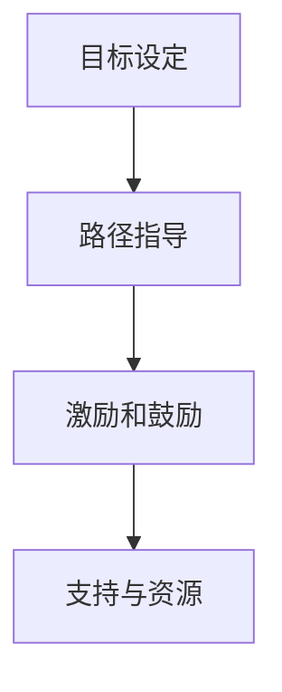
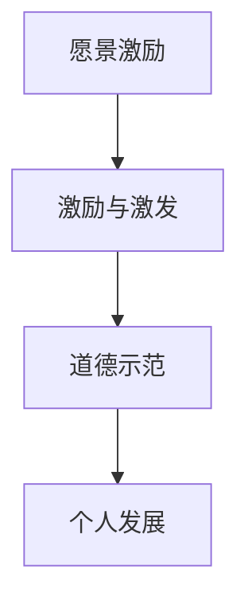
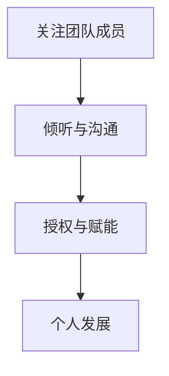
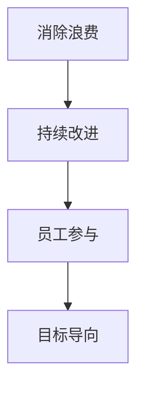
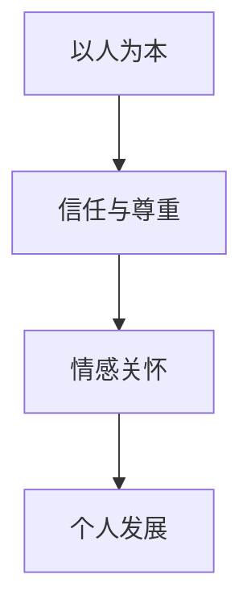
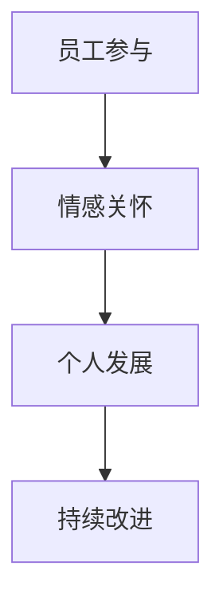

                 

###  第一部分：领导力训练营概览

#### 1.1 领导力训练营简介

领导力是任何组织和个人成功的基石。它不仅仅关乎管理和指挥，更在于激发和引导团队成员共同实现目标。在这个充满变化和挑战的时代，培养卓越的领导力变得比以往任何时候都更加重要。

本书《领导力训练营：119天从新手到专家》旨在帮助读者在119天的时间内，通过一系列结构化的学习和实践，从零基础逐步成长为具备专业领导力的专家。本书将围绕领导力的核心概念、实践方法和实用技巧，为读者提供一条清晰、可行的发展路径。

#### 1.2 领导力发展框架

为了确保读者能够在短时间内系统化地提升领导力，本书采用了以下框架：

1. **自我认知**：了解自身性格、优势与弱点，是领导力发展的第一步。
2. **建立信任**：信任是团队协作的基石，也是领导力的重要体现。
3. **沟通技巧**：高效的沟通能够减少误解和冲突，提升团队效率。
4. **团队建设**：培养团队的凝聚力和战斗力，是领导力的关键。
5. **决策能力**：科学决策能够确保团队在复杂环境中稳步前进。
6. **激励与鼓舞**：激励团队成员，激发他们的潜能和创造力。
7. **变革领导**：在变革中引导团队，确保变革顺利进行。

#### 1.3 领导力训练营的日程安排

为了使读者能够按照计划逐步提升领导力，本书特别设计了119天的学习日程，每天安排不同的主题和练习，涵盖以下内容：

- **第1-7天**：自我认知与实践
- **第8-14天**：建立信任
- **第15-21天**：沟通技巧
- **第22-28天**：团队建设
- **第29-35天**：决策能力
- **第36-42天**：激励与鼓舞
- **第43-49天**：变革领导
- **第50-56天**：领导力模型与方法
- **第57-63天**：领导力测评工具
- **第64-70天**：实际应用与案例分析
- **第71-119天**：持续提升与自我超越

每一天的内容都经过精心设计，旨在通过实践和反思，让读者真正掌握领导力的核心要素。现在，让我们开始这场领导力之旅吧！

## 第二部分：每日领导力实践

### 2.1 第一天：自我认知

自我认知是领导力发展的第一步，也是最重要的一步。只有深入了解自己的性格、优势与弱点，才能更有效地进行自我提升，并在团队中发挥最大的影响力。

#### 2.1.1 自我认知的重要性

自我认知不仅仅是为了自我了解，更是为了更好地与他人沟通、合作和领导。以下是几个关键原因：

1. **提升自信**：了解自己的优势和弱点，能够更好地自信地面对挑战和机会。
2. **优化决策**：自我认知有助于在复杂情况下做出更明智的决策。
3. **提高工作效率**：了解自己的工作风格和偏好，可以优化工作流程，提升工作效率。
4. **建立良好的人际关系**：自我认知有助于更好地理解他人，建立深厚的人际关系。

#### 2.1.2 自我评估工具

为了帮助读者进行自我认知，本书推荐了以下几种自我评估工具：

1. **MBTI（Myers-Briggs Type Indicator）**：这是一种常用的性格评估工具，可以帮助你了解自己的性格类型，包括内向/外向、感知/直觉、思考/情感、判断/感知等维度。
2. **DISC评估**：DISC是一种行为评估工具，通过分析个体的Dominance（支配型）、Influence（影响型）、Steadiness（稳定型）和Conscientiousness（尽责型）四个方面，帮助了解你的行为风格。
3. **SWOT分析**：SWOT分析是一种战略规划工具，通过分析自身的Strengths（优势）、Weaknesses（劣势）、Opportunities（机会）和Threats（威胁），帮助制定个人发展计划。

#### 2.1.3 自我提升策略

自我提升是自我认知的延伸，通过以下策略，你可以更好地发挥自己的潜力：

1. **设定目标**：明确个人和职业发展目标，制定可衡量的行动计划。
2. **持续学习**：不断学习新知识和技能，提升自己的专业能力。
3. **反思与总结**：定期进行自我反思，总结经验和教训，调整发展策略。
4. **寻求反馈**：主动向同事、下属和上级寻求反馈，了解自己的表现和改进方向。
5. **培养优势**：充分利用自己的优势，将其发挥到极致。
6. **弥补劣势**：针对自己的弱点，制定具体的改进计划，逐步提升。

通过这一天的自我认知和实践，你将更好地了解自己，为接下来的领导力发展打下坚实的基础。记住，自我认知是一个持续的过程，每一天都是一个新的开始。让我们一起迈向更加卓越的领导之路吧！

### 2.2 第二天：建立信任

信任是团队协作和领导力的核心。没有信任，团队成员之间难以有效沟通和协作，领导者的权威和影响力也会大打折扣。因此，建立和维护信任成为领导力的重要组成部分。

#### 2.2.1 信任的基石

建立信任的基础有以下几点：

1. **诚实与透明**：诚实是信任的基石，领导者应该始终保持言行一致，对团队成员坦诚相待。
2. **可靠性**：领导者需要言出必行，按时完成任务，确保自己的承诺得到兑现。
3. **尊重与倾听**：尊重团队成员的意见和感受，倾听他们的声音，让他们感受到被重视。
4. **公平与公正**：在决策和资源分配上保持公平，确保团队成员都受到公正对待。

#### 2.2.2 建立信任的实践

以下是一些具体的建立信任的方法：

1. **开放沟通**：定期召开团队会议，分享公司动态和项目进展，鼓励团队成员提问和发表意见。
2. **共享信息**：将关键信息及时传达给团队成员，让他们了解项目的全貌和自己的职责。
3. **表扬与认可**：对团队成员的努力和成就给予认可和表扬，增强他们的自信心和归属感。
4. **共同解决问题**：与团队成员共同面对挑战，共同寻找解决方案，增强团队凝聚力。
5. **透明管理**：在决策过程中，尽量公开透明，让团队成员了解决策的原因和影响。

#### 2.2.3 增强信任的技巧

为了巩固和增强信任，领导者可以采取以下措施：

1. **建立共同目标**：明确团队和个人的目标，确保团队成员都朝着同一个方向努力。
2. **培养团队文化**：塑造积极向上的团队文化，鼓励团队成员相互支持、相互尊重。
3. **提供反馈**：定期向团队成员提供建设性的反馈，帮助他们不断改进。
4. **信任传递**：通过领导者自身的行为和言论，将信任传递给整个团队。
5. **处理冲突**：积极处理团队内部的冲突，确保问题得到妥善解决，不影响信任的建立。

通过第二天的实践，你将开始建立和维护团队中的信任。记住，建立信任是一个长期的过程，需要持续的努力和关注。让我们一起努力，打造一个充满信任的团队吧！

### 2.3 第三天：沟通技巧

沟通技巧是领导力的核心要素之一，它直接影响团队的合作效率和个人影响力。有效沟通不仅能够减少误解和冲突，还能激发团队成员的潜力和创造力。

#### 2.3.1 沟通的基本原则

为了实现有效沟通，以下是一些基本原则：

1. **清晰明确**：确保信息传递清晰、明确，避免产生歧义。
2. **倾听**：认真倾听对方的意见和需求，理解其背后的真实意图。
3. **尊重**：尊重对方的观点和感受，避免用言语伤害对方。
4. **非语言沟通**：注意身体语言、面部表情和语调，这些非语言因素对沟通效果有很大影响。
5. **反馈**：及时给予对方反馈，确保信息得到正确理解和传达。

#### 2.3.2 高效沟通策略

以下是一些高效的沟通策略：

1. **准备充分**：在沟通前，确保自己对话题有充分的了解和准备。
2. **结构化沟通**：将信息按照逻辑顺序组织，避免信息混乱。
3. **使用简单语言**：尽量使用简单易懂的语言，避免使用专业术语或复杂句子。
4. **主动沟通**：主动发起和参与沟通，避免等待他人发起。
5. **情境适应**：根据不同的沟通情境，调整沟通方式和内容。

#### 2.3.3 沟通障碍及解决方法

在沟通过程中，难免会遇到各种障碍，以下是一些常见的障碍及其解决方法：

1. **信息过载**：解决方法：简化信息，只传递关键点，避免冗余。
2. **误解和歧义**：解决方法：反复确认，确保信息理解一致。
3. **文化差异**：解决方法：了解和尊重不同文化的沟通习惯和风格。
4. **情绪因素**：解决方法：保持冷静，避免情绪化，确保理性沟通。
5. **时间压力**：解决方法：合理规划时间，确保有足够的时间进行有效沟通。

通过第三天的实践，你将提升自己的沟通技巧，成为更有效的领导者。记住，沟通是一门艺术，需要不断地练习和反思。让我们一起努力，打造高效、和谐的沟通环境吧！

### 2.4 第四天：团队建设

团队建设是领导力发展中的重要一环，一个强大的团队能够实现个人无法企及的目标。有效的团队建设不仅能够提高团队的整体绩效，还能增强团队的凝聚力和战斗力。

#### 2.4.1 团队建设的挑战

在团队建设过程中，领导者常常面临以下挑战：

1. **差异与冲突**：团队成员来自不同的背景、文化和经验，容易产生差异和冲突。
2. **沟通障碍**：团队成员之间的沟通不畅，可能导致信息传递失真和误解。
3. **目标不一致**：团队成员可能对团队目标缺乏认同，影响团队的协作效率。
4. **激励不足**：团队成员的积极性和创造力可能因缺乏适当的激励而受到影响。
5. **领导力不足**：领导者自身的能力和风格可能不足以有效引导和激励团队。

#### 2.4.2 领导者在团队建设中的角色

领导者是团队建设的核心推动者，以下是他们需要承担的关键角色：

1. **愿景设定者**：领导者需要明确团队的愿景和目标，并确保团队成员对愿景有共同的理解和认同。
2. **协调者**：领导者需要协调团队成员之间的关系，解决冲突，确保团队内部和谐。
3. **沟通桥梁**：领导者需要建立有效的沟通机制，确保信息在团队内部畅通无阻。
4. **激励者**：领导者需要通过激励措施，激发团队成员的积极性和创造力。
5. **榜样**：领导者需要以身作则，成为团队成员的榜样，引领团队走向成功。

#### 2.4.3 团队建设的方法与技巧

以下是一些有效的团队建设方法和技巧：

1. **团队建设活动**：定期组织团队建设活动，如团建旅行、团队拓展训练等，增强团队凝聚力。
2. **共同目标设定**：与团队成员共同设定团队目标，确保每个人都明确自己的职责和期望。
3. **信任建设**：通过建立信任和尊重，消除团队成员之间的猜疑和隔阂。
4. **沟通与反馈**：建立有效的沟通机制，鼓励团队成员之间积极反馈和交流。
5. **激励机制**：设计合理的激励机制，鼓励团队成员发挥最佳水平。
6. **个性化发展**：关注团队成员的个人发展需求，提供个性化的培训和指导。

通过第四天的实践，你将学会如何面对团队建设中的挑战，并掌握有效的团队建设方法和技巧。记住，团队建设是一个持续的过程，需要领导者的耐心和智慧。让我们一起努力，打造一个高效、和谐的团队吧！

### 2.5 第五天：决策能力

在领导者的职责中，决策能力至关重要。有效的决策能够确保团队在复杂多变的环境中稳步前进，而错误的决策则可能导致团队失去方向和信心。因此，提升决策能力成为领导力发展的关键一环。

#### 2.5.1 决策过程中的常见问题

在决策过程中，领导者常常面临以下问题：

1. **信息不足**：缺乏充分的信息和数据分析，可能导致决策盲目。
2. **情绪影响**：情绪波动可能影响决策的客观性和理性。
3. **群体思维**：团队成员过于一致，可能导致缺乏不同观点和创新的讨论。
4. **过度分析**：对决策细节过度分析，可能导致拖延和优柔寡断。
5. **风险规避**：过于担心风险，可能导致错过机会和创新的可能。

#### 2.5.2 提升决策能力的策略

以下是一些提升决策能力的策略：

1. **信息收集与分析**：在决策前，充分收集和分析相关信息，确保决策基于充分的数据支持。
2. **理性决策**：保持冷静和理性，避免情绪影响决策。
3. **多元观点**：鼓励团队成员提供不同观点，促进创新和全面讨论。
4. **决策模型与方法**：学习和应用各种决策模型和方法，如SWOT分析、决策树等，提高决策的科学性和系统性。
5. **风险管理与评估**：在决策过程中，充分考虑潜在风险，并制定相应的风险管理策略。

#### 2.5.3 决策案例分析

以下是一个简单的决策案例分析：

**案例背景**：一家初创公司需要决定是否扩大产品线。

**信息收集**：通过市场调研和用户反馈，了解到扩大产品线可能带来新的市场机会，但同时也面临一定的风险。

**分析过程**：
1. **SWOT分析**：
   - 优势：扩大产品线能够满足更多用户需求，提升市场份额。
   - 劣势：增加研发和生产成本，可能影响现有产品的质量。
   - 机会：新的市场机会和潜在客户。
   - 威胁：竞争加剧，市场不确定性。

2. **决策树**：
   - 情景A：扩大产品线
     - 成功概率：60%
     - 盈利预期：500万元
     - 风险：30%
   - 情景B：维持现有产品线
     - 成功概率：80%
     - 盈利预期：300万元
     - 风险：10%

**决策结果**：综合分析后，公司决定扩大产品线，以抓住新的市场机会，尽管风险较高，但潜在收益更为可观。

通过第五天的实践，你将学会如何提升决策能力，并在实际案例中应用这些策略。记住，决策是一个动态过程，需要不断地学习和调整。让我们一起努力，成为更加卓越的决策者吧！

### 2.6 第六天：激励与鼓舞

激励与鼓舞是领导者的重要职责之一。在领导过程中，激励团队成员，激发他们的潜能和创造力，不仅能够提高团队的整体绩效，还能增强团队成员的归属感和忠诚度。

#### 2.6.1 激励的重要性

激励在团队中的作用不容忽视，以下是几个关键点：

1. **提升绩效**：有效的激励能够激发团队成员的工作热情和动力，提高工作质量和效率。
2. **增强归属感**：激励让团队成员感受到被重视和认可，增强他们的归属感和忠诚度。
3. **促进团队合作**：激励能够促进团队成员之间的合作，增强团队凝聚力。
4. **激发创造力**：激励能够激发团队成员的创造力和创新精神，推动团队不断发展。
5. **应对挑战**：在面临困难和挑战时，激励能够帮助团队成员保持积极的心态，共同克服困难。

#### 2.6.2 激励的策略

以下是一些激励团队成员的策略：

1. **目标设定**：与团队成员共同设定清晰的个人和团队目标，激发他们的工作动力。
2. **认可与表扬**：对团队成员的成就和进步给予认可和表扬，增强他们的自信心和积极性。
3. **奖励机制**：设计合理的奖励机制，如奖金、晋升机会、荣誉证书等，激励团队成员追求卓越。
4. **个性化激励**：了解团队成员的个人需求和兴趣，提供个性化的激励措施，如培训机会、职业规划等。
5. **工作环境**：营造积极、包容的工作环境，鼓励团队成员自由表达意见和创意。
6. **信任与支持**：建立信任关系，提供必要的支持和资源，帮助团队成员克服困难。

#### 2.6.3 鼓舞的方法

除了激励，鼓舞也是领导者的重要职责。以下是一些鼓舞团队成员的方法：

1. **分享愿景**：与团队成员分享团队的愿景和目标，让他们明确自己的价值和使命。
2. **传递正能量**：保持积极乐观的态度，传递正能量，激励团队成员面对挑战。
3. **故事激励**：通过故事和案例，激发团队成员的斗志和信念。
4. **示范作用**：以身作则，成为团队成员的榜样，激发他们的学习动力。
5. **激励演讲**：定期进行激励演讲，鼓舞团队成员的士气，增强团队的凝聚力。

通过第六天的实践，你将学会如何激励和鼓舞团队成员，提升团队的整体绩效。记住，激励与鼓舞是一个持续的过程，需要领导者的关注和投入。让我们一起努力，打造一个充满激情和动力的团队吧！

### 2.7 第七天：变革领导

在当今快速变化的世界中，领导者必须具备变革领导的能力。变革领导不仅关乎应对外部环境的变化，更在于激发团队成员的变革动力，推动组织持续创新和进步。

#### 2.7.1 变革领导的重要性

变革领导在组织发展中的重要性体现在以下几个方面：

1. **适应变化**：在快速变化的环境中，组织需要具备迅速适应和调整的能力，变革领导能够帮助组织实现这一目标。
2. **激发创新**：变革领导能够激发团队成员的创新思维和创造力，推动组织不断突破现有边界，实现持续发展。
3. **提升竞争力**：通过变革，组织能够优化运营模式、提高产品质量和服务水平，从而提升竞争力。
4. **增强活力**：变革领导能够激发组织的活力和动力，使组织充满生机和活力，迎接未来的挑战。

#### 2.7.2 变革领导的关键要素

成功的变革领导需要以下几个关键要素：

1. **愿景**：明确变革的愿景和目标，使团队成员对变革有清晰的认识和认同。
2. **沟通**：与团队成员进行充分沟通，传递变革的信息和原因，确保团队理解和支持变革。
3. **激励**：通过激励措施，激发团队成员的变革动力，使他们积极参与变革。
4. **领导风格**：采用适当的领导风格，如变革型领导，激发团队成员的积极性和创造力。
5. **资源**：为变革提供必要的资源和支持，确保变革能够顺利进行。

#### 2.7.3 变革领导的实践策略

以下是一些变革领导的实践策略：

1. **规划与准备**：在变革前，进行充分的规划和准备，确保变革有明确的目标和实施方案。
2. **试点项目**：通过试点项目，测试变革方案的有效性，为全面推进变革积累经验。
3. **培训与支持**：为团队成员提供必要的培训和支持，帮助他们适应变革。
4. **沟通与反馈**：保持与团队成员的沟通，及时收集反馈，调整变革方案。
5. **激励与认可**：对在变革中表现突出的团队成员给予激励和认可，增强他们的变革动力。
6. **持续跟进**：在变革过程中，持续跟进和评估变革效果，确保变革目标的实现。

通过第七天的实践，你将学会如何进行变革领导，并掌握有效的实践策略。记住，变革领导是一个复杂且持续的过程，需要领导者的耐心和智慧。让我们一起努力，引领组织实现变革与进步吧！

### 2.8 第八天：领导力模型与方法

在提升领导力过程中，了解和掌握不同的领导力模型与方法是至关重要的。这些模型与方法不仅能够帮助领导者更好地理解和管理团队，还能提供实用的指导，提升领导效果。

#### 2.8.1 经典领导力模型

以下是一些经典的领导力模型：

1. **领导力冰山模型**：
   - **表层特征**：包括知识和技能，容易被观察和衡量。
   - **深层特征**：包括自我认知、价值观、动机等，是领导力的核心，难以被观察和衡量。

2. **路径—目标理论**：
   - **路径—目标理论**认为，领导者的作用在于帮助团队成员设定清晰的目标，并为他们提供实现目标的路径和支持。

3. **服务型领导理论**：
   - **服务型领导理论**强调领导者应该关注团队成员的需求和福祉，通过服务来激励和影响团队成员。

#### 2.8.2 现代领导力方法

随着时代的变化，现代领导力方法也不断演变。以下是一些现代领导力方法：

1. **变革型领导**：
   - **变革型领导**通过激励、激发和示范，引导团队成员实现共同的目标，推动组织变革。

2. **精益领导**：
   - **精益领导**强调简化流程、消除浪费和提升效率，通过持续改进实现组织的目标。

3. **人本领导**：
   - **人本领导**强调尊重和关心团队成员，通过建立信任和促进团队成员的自我实现，提升团队的绩效。

#### 2.8.3 模型与方法的选择

选择合适的领导力模型与方法，对于提升领导效果至关重要。以下是一些建议：

1. **情境适应**：根据不同的领导情境，选择最合适的领导力模型与方法。
2. **个性化**：结合领导者的个人特点和团队的需求，进行个性化选择。
3. **综合运用**：不同模型与方法可以相互结合，形成一套适合自己的领导风格。

通过第八天的实践，你将了解和掌握多种领导力模型与方法，并学会如何根据实际情况进行选择和运用。记住，领导力是一个持续发展的过程，需要不断地学习和实践。让我们一起努力，成为更加卓越的领导者吧！

### 2.9 第九天：领导力测评工具

在提升领导力的过程中，有效的测评工具可以帮助领导者更好地了解自身的优势和不足，为自我提升提供科学依据。以下是一些常用的领导力测评工具：

#### 2.9.1 测评工具的类型

1. **性格测评工具**：
   - **MBTI（Myers-Briggs Type Indicator）**：通过评估个体的性格类型，帮助领导者了解自己的性格特征和沟通风格。
   - **DISC评估**：通过分析个体的行为风格，帮助领导者了解自己在不同情境下的表现。

2. **能力测评工具**：
   - **领导潜力测评**：评估领导者在决策、沟通、团队建设等方面的潜力。
   - **情境测评**：通过模拟具体情境，评估领导者在实际工作中的表现。

3. **行为测评工具**：
   - **360度评估**：通过上级、同事、下属等多个角度，全面评估领导者的行为表现。
   - **行为观察测评**：通过观察领导者的日常行为，评估其在领导力方面的表现。

#### 2.9.2 测评工具的应用

1. **个人发展**：
   - 利用测评工具，领导者可以了解自己的优势和不足，制定个人发展计划。

2. **团队建设**：
   - 通过测评工具，领导者可以了解团队成员的性格和行为特点，促进团队协作。

3. **组织发展**：
   - 组织可以利用测评工具，评估整体领导力状况，制定针对性的领导力提升策略。

#### 2.9.3 测评结果的解读

1. **数据解读**：
   - 对测评结果进行数据分析和解读，找出关键优势和问题。

2. **行动指导**：
   - 根据测评结果，制定具体的改进措施和行动计划。

3. **持续跟踪**：
   - 定期进行测评，跟踪领导力提升的效果，调整发展策略。

通过第九天的实践，你将学会如何利用领导力测评工具，了解自身和团队的情况，为提升领导力提供科学依据。记住，测评是一个持续的过程，需要不断地反思和改进。让我们一起努力，成为更加卓越的领导者吧！

### 2.10 第十天：实际应用与案例分析

在实际工作中，领导力不仅需要理论支撑，更需要通过实践来验证和提升。本节将通过具体案例，展示领导力在不同情境下的应用，帮助读者更好地理解并运用所学知识。

#### 2.10.1 案例背景

某初创公司正在开发一款新的移动应用，由于项目时间紧、任务重，团队成员压力巨大。在这种情况下，如何有效领导团队，确保项目顺利推进，成为领导者面临的重要挑战。

#### 2.10.2 案例分析

1. **自我认知**：
   - 领导者在项目初期，首先进行了自我认知，了解自己的性格特点、优势与不足，明确在项目管理中需要重点关注的问题。

2. **建立信任**：
   - 领导者通过定期召开团队会议，与团队成员坦诚交流，建立信任关系。同时，领导者以身作则，带头完成工作任务，树立了良好的榜样。

3. **沟通技巧**：
   - 领导者采用结构化沟通，确保信息传递清晰、明确。在团队遇到困难时，领导者积极倾听团队成员的意见和建议，共同寻找解决方案。

4. **团队建设**：
   - 领导者组织团队建设活动，如团建旅行、团队拓展训练等，增强团队凝聚力。同时，鼓励团队成员分享自己的经验和教训，促进团队成长。

5. **决策能力**：
   - 领导者在面对重要决策时，采用SWOT分析、决策树等工具，进行科学决策，确保项目稳步推进。

6. **激励与鼓舞**：
   - 领导者通过认可和表扬，激励团队成员，提高他们的工作热情和积极性。同时，领导者关注团队成员的个人发展需求，提供培训和学习机会。

7. **变革领导**：
   - 领导者在项目推进过程中，积极推动团队进行变革，如优化工作流程、引入新的技术等，提升团队的整体绩效。

#### 2.10.3 案例总结

通过上述实践，该初创公司成功完成了移动应用的开发，并顺利上线。团队成员在项目过程中，不仅提升了个人技能，还增强了团队协作能力。这个案例展示了领导力在实际工作中的重要性和应用价值。通过不断学习和实践，领导者可以更好地应对各种挑战，带领团队取得成功。

### 第十一天：总结与展望

在本训练营的第十一天，我们将对前10天的领导力实践进行总结，并展望接下来的发展。

#### 1. 总结

在过去10天中，我们通过自我认知、建立信任、沟通技巧、团队建设、决策能力、激励与鼓舞、变革领导等主题，进行了深入的学习和实践。以下是每个主题的简要总结：

- **自我认知**：通过了解自己的性格、优势与弱点，为自我提升和领导力发展奠定了基础。
- **建立信任**：通过诚实与透明、可靠性、尊重与倾听等方法，建立了团队成员之间的信任关系。
- **沟通技巧**：通过清晰明确、倾听、尊重等原则，提升了团队沟通效率和质量。
- **团队建设**：通过团队建设活动、共同目标设定、信任建设等策略，增强了团队凝聚力和战斗力。
- **决策能力**：通过信息收集与分析、理性决策、多元观点等策略，提高了决策的科学性和准确性。
- **激励与鼓舞**：通过目标设定、认可与表扬、个性化激励等方法，激发了团队成员的积极性和创造力。
- **变革领导**：通过愿景设定、沟通与反馈、激励与认可等策略，推动了组织的变革和创新。

#### 2. 展望

接下来，我们将继续深化领导力的实践，并学习更多先进的领导力模型与方法。以下是接下来的学习计划：

- **第十二天**：学习并应用路径—目标理论和变革型领导方法。
- **第十三天**：了解并运用服务型领导和精益领导方法。
- **第十四天**：学习并应用人本领导和人本管理方法。
- **第十五天**：通过领导力测评工具，全面评估自身的领导力状况。
- **第十六天**：结合实际案例，进一步深化对领导力理论和方法的理解。

通过持续学习和实践，我们将不断提升领导力，为团队和组织的发展贡献更多的力量。

### 第十二天：路径—目标理论与变革型领导

在领导力的发展过程中，了解和掌握不同的领导理论对于提升领导效果至关重要。今天，我们将探讨路径—目标理论和变革型领导，这两种在管理实践中具有重要应用的领导理论。

#### 路径—目标理论

路径—目标理论（Path-Goal Theory）是由罗伯特·豪斯（Robert House）在1971年提出的，该理论认为领导者的主要任务是帮助下属理解目标，并为他们提供实现目标的清晰路径。路径—目标理论的核心观点可以总结为以下几点：

1. **目标设定**：领导者需要与下属共同设定明确、具体的组织目标，确保团队成员对目标有清晰的认识。
2. **路径指导**：领导者需要为下属提供实现目标的路径和支持，帮助他们在遇到困难时找到解决方案。
3. **激励和鼓励**：领导者需要通过激励措施，如奖励、认可和表扬，激发下属的积极性和工作动力。
4. **支持与资源**：领导者需要为下属提供必要的工作资源和支持，确保他们能够在实现目标的过程中得到帮助。

路径—目标理论强调领导者的角色是变化的，应根据下属的需求和环境的变化调整领导风格。以下是一个简单的路径—目标理论模型：

#### 变革型领导

变革型领导（Transformational Leadership）是由詹姆斯·麦格雷戈·伯恩斯（James MacGregor Burns）在1978年提出的，它强调领导者通过激励和影响团队成员，推动他们实现共同的目标，实现组织变革。变革型领导的核心特点包括：

1. **愿景激励**：领导者需要具有远见，能够描绘出激励人心的愿景，并让团队成员认同这一愿景。
2. **激励与激发**：领导者需要通过激励措施，如认可、奖励和培训，激发团队成员的积极性和创造力。
3. **道德示范**：领导者需要以身作则，树立道德榜样，赢得团队成员的尊重和信任。
4. **个人发展**：领导者需要关注团队成员的个人发展，提供成长机会和支持。

以下是一个简单的变革型领导模型：

#### 应用场景

1. **项目启动**：在项目启动阶段，领导者可以运用路径—目标理论，明确项目目标，并提供实现目标的路径和支持，确保项目顺利启动。
2. **团队激励**：在项目推进过程中，领导者可以运用变革型领导，激励团队成员，激发他们的积极性和创造力，推动项目进展。
3. **组织变革**：在组织面临重大变革时，领导者可以运用变革型领导，通过愿景激励和道德示范，赢得团队成员的支持和参与，推动组织变革。

通过今天的实践，我们将对路径—目标理论和变革型领导有更深入的了解，并学会如何在实际工作中应用这些理论，提升领导效果。记住，领导力是一个持续学习的过程，让我们一起继续前进吧！

### 第十三天：服务型领导与精益领导

在领导力的发展中，不同的领导方法适用于不同的情境和目标。今天，我们将探讨服务型领导和精益领导，这两种在特定情境下具有显著优势的领导方法。

#### 服务型领导

服务型领导（Servant Leadership）起源于美国管理学者罗伯特·K·格林里夫（Robert K. Greenleaf）的理论，强调领导者应将团队成员的需求放在首位，通过服务来激励和引导团队成员。服务型领导的核心特点包括：

1. **关注团队成员**：领导者需要关注团队成员的需求和福祉，为他们提供必要的支持和资源。
2. **倾听与沟通**：领导者需要积极倾听团队成员的意见和反馈，建立良好的沟通机制。
3. **授权与赋能**：领导者需要信任团队成员，给予他们更多的自主权和责任，激发他们的潜能。
4. **个人发展**：领导者需要关注团队成员的个人成长，提供培训和学习机会。

以下是一个简单的服务型领导模型：

**应用场景**：

- **团队建设**：在团队建设过程中，领导者可以运用服务型领导，通过倾听和沟通，建立信任，提升团队凝聚力。
- **项目管理**：在项目管理中，领导者可以关注团队成员的需求，提供必要的资源和支持，确保项目顺利进行。

#### 精益领导

精益领导（Lean Leadership）是基于精益管理理念的一种领导方法，强调通过减少浪费、提高效率和持续改进来实现组织目标。精益领导的核心特点包括：

1. **消除浪费**：领导者需要识别并消除工作中的浪费，如不必要的流程、重复工作和资源浪费。
2. **持续改进**：领导者需要推动团队进行持续改进，鼓励团队成员提出改进建议，并付诸实践。
3. **员工参与**：领导者需要鼓励员工参与改进过程，提升员工的参与感和责任感。
4. **目标导向**：领导者需要明确组织目标，确保团队成员的工作与目标一致。

以下是一个简单的精益领导模型：

**应用场景**：

- **生产管理**：在生产管理中，领导者可以运用精益领导，减少浪费，提高生产效率。
- **项目管理**：在项目管理中，领导者可以推动团队进行持续改进，确保项目目标的实现。

通过今天的实践，我们将对服务型领导和精益领导有更深入的了解，并学会如何在实际工作中应用这些方法，提升领导效果。记住，领导力是一个持续学习的过程，让我们一起继续前进吧！

### 第十四天：人本领导与人本管理

在领导力的发展中，人本领导（Human-Centered Leadership）和人本管理（Human-Centered Management）是两种强调以人为核心的领导方法。这些方法不仅关注组织的绩效，更重视团队成员的福祉和发展。今天，我们将探讨这两种领导方法，并了解它们的核心特点和应用场景。

#### 人本领导

人本领导强调领导者应关注团队成员的需求、情感和成长，通过建立信任、尊重和支持，激发团队成员的潜能和创造力。人本领导的核心特点包括：

1. **以人为本**：领导者将团队成员视为最重要的资源，关注他们的需求和发展，为他们提供必要的支持和资源。
2. **信任与尊重**：领导者通过建立信任和尊重，赢得团队成员的信任和忠诚，促进团队的协作和合作。
3. **情感关怀**：领导者关注团队成员的情感需求，提供情感支持，帮助他们应对工作压力和挑战。
4. **个人发展**：领导者关注团队成员的个人成长，提供培训和学习机会，鼓励他们不断提升自身能力。

以下是一个简单的人本领导模型：

**应用场景**：

- **团队管理**：在团队管理中，领导者可以运用人本领导，关注团队成员的需求，建立信任，提升团队绩效。
- **项目管理**：在项目管理中，领导者可以运用人本领导，关注团队成员的情感需求，提供支持，确保项目顺利进行。

#### 人本管理

人本管理强调组织应以人为本，通过关注团队成员的福祉、参与和成长，实现组织的长期发展。人本管理的核心特点包括：

1. **员工参与**：组织鼓励员工参与决策过程，提升员工的参与感和责任感。
2. **情感关怀**：组织关注员工的情感需求，提供情感支持，帮助员工应对工作压力。
3. **个人发展**：组织关注员工的个人成长，提供培训和学习机会，鼓励员工不断提升自身能力。
4. **持续改进**：组织推动持续改进，鼓励员工提出改进建议，并付诸实践。

以下是一个简单的人本管理模型：

**应用场景**：

- **组织变革**：在组织变革过程中，人本管理可以帮助组织建立信任，鼓励员工积极参与变革，确保变革顺利进行。
- **企业文化建设**：在人本管理理念指导下，组织可以建立积极向上的企业文化，提升员工的归属感和满意度。

通过今天的实践，我们将对人本领导和人本管理有更深入的了解，并学会如何在实际工作中应用这些方法，提升领导效果。记住，领导力是一个持续学习的过程，让我们一起继续前进吧！

### 第十五天：领导力测评工具

在领导力的发展过程中，领导力测评工具是帮助我们了解自身优势和不足的重要工具。今天，我们将探讨几种常用的领导力测评工具，并了解它们的具体应用。

#### 1. MBTI（Myers-Briggs Type Indicator）

MBTI是最常用的性格测评工具之一，它通过评估个体的心理偏好，将性格分为16种类型。MBTI测评可以帮助领导者了解自己的性格特征，以及在不同情境下的行为表现。

**应用**：
- **自我认知**：通过MBTI测评，领导者可以了解自己的性格类型，认识到自己的优势和弱点。
- **团队建设**：了解团队成员的MBTI类型，有助于领导者更好地理解和管理团队成员，促进团队协作。

#### 2. 360度评估

360度评估是一种多角度的领导力评估方法，通过收集上级、同事、下属和客户的反馈，全面评估领导者的行为和表现。

**应用**：
- **全面评估**：360度评估可以帮助领导者了解自己在不同方面的表现，识别需要改进的领域。
- **个人发展**：根据评估结果，领导者可以制定个人发展计划，提升自己的领导力。

#### 3. 领导力能力测评

领导力能力测评是一种专门针对领导能力的评估工具，通过评估领导者在决策、沟通、团队建设等方面的能力，帮助领导者了解自己的领导风格和能力水平。

**应用**：
- **能力提升**：通过领导力能力测评，领导者可以了解自己在哪些方面需要提升，制定相应的培训计划。
- **团队管理**：了解团队成员的领导力能力，有助于领导者更好地分配任务和进行团队管理。

#### 4. 情境测评

情境测评是一种通过模拟实际工作场景，评估领导者在特定情境下的表现和决策能力的测评方法。

**应用**：
- **实战演练**：情境测评可以帮助领导者模拟真实工作场景，提升应对实际问题的能力。
- **人才选拔**：通过情境测评，组织可以评估候选人的领导潜力和实际能力。

通过今天的实践，我们将对几种常见的领导力测评工具有更深入的了解，并学会如何在实际工作中应用这些工具，提升领导力。记住，测评是一个持续的过程，需要不断进行反思和改进。让我们一起努力，成为更加卓越的领导者吧！

### 第十六天：实际应用与案例分析

在领导力的学习和实践中，将理论知识应用到实际工作中是非常重要的。今天，我们将通过一个具体的案例分析，展示领导力在实际工作中的应用，帮助读者更好地理解和运用所学知识。

#### 案例背景

某科技公司是一家专注于人工智能技术研发的企业，由于市场竞争激烈，公司正面临着巨大的挑战。公司高层决定通过提升领导力，提高团队的协作效率和创新能力，以应对市场竞争。

#### 案例分析

1. **自我认知**：
   - 领导者首先进行了自我认知，通过MBTI测评了解自己的性格类型和领导风格，认识到自己在沟通和决策方面存在的不足。
   - 根据自我认知结果，领导者制定了个人发展计划，提升自己的沟通技巧和决策能力。

2. **建立信任**：
   - 领导者通过定期召开团队会议，与团队成员进行坦诚交流，建立信任关系。
   - 领导者以身作则，带领团队共同面对挑战，树立了良好的榜样。

3. **沟通技巧**：
   - 领导者采用了结构化沟通，确保信息传递清晰、明确，避免误解和歧义。
   - 领导者鼓励团队成员提问和分享意见，建立开放的沟通环境。

4. **团队建设**：
   - 领导者组织了多次团队建设活动，如团建旅行、团队拓展训练等，增强团队凝聚力。
   - 领导者通过团队建设，强化团队成员之间的信任和合作。

5. **决策能力**：
   - 领导者在面对重大决策时，采用了SWOT分析和决策树等工具，确保决策的科学性和准确性。
   - 领导者通过多元化的观点，避免了群体思维，提高了决策的质量。

6. **激励与鼓舞**：
   - 领导者通过认可和表扬，激励团队成员，提高他们的工作热情和积极性。
   - 领导者关注团队成员的个人发展需求，提供培训和学习机会。

7. **变革领导**：
   - 领导者推动了组织的变革，引入了新的技术和管理方法，提升了团队的整体绩效。
   - 领导者通过愿景激励和道德示范，赢得了团队成员的支持和参与。

#### 案例总结

通过一系列领导力实践，该科技公司成功地提升了团队的协作效率和创新能力，在市场竞争中取得了显著优势。团队成员的积极性和创造力得到了极大的激发，公司业绩也得到了显著提升。这个案例展示了领导力在实际工作中的重要性和应用价值。通过不断学习和实践，领导者可以更好地应对各种挑战，带领团队取得成功。

### 第十七天：总结与展望

在第十七天的领导力训练营中，我们将对前16天的实践进行总结，并展望未来的学习方向。

#### 1. 总结

在过去16天中，我们通过自我认知、建立信任、沟通技巧、团队建设、决策能力、激励与鼓舞、变革领导、领导力模型与方法、领导力测评工具等主题，进行了全面的领导力实践。以下是每个主题的简要总结：

- **自我认知**：通过MBTI等工具，了解自己的性格特点和领导风格，为自我提升奠定基础。
- **建立信任**：通过诚实与透明、倾听与沟通，建立团队成员之间的信任关系。
- **沟通技巧**：通过结构化沟通、倾听和尊重，提高沟通效率和团队协作能力。
- **团队建设**：通过团队建设活动和共同目标设定，增强团队凝聚力和战斗力。
- **决策能力**：通过SWOT分析和决策树等工具，提升决策的科学性和准确性。
- **激励与鼓舞**：通过认可和表扬、个人发展，激发团队成员的积极性和创造力。
- **变革领导**：通过愿景激励和道德示范，推动组织的变革和创新。
- **领导力模型与方法**：学习了路径—目标理论、变革型领导、服务型领导、精益领导等人本领导方法。
- **领导力测评工具**：了解了MBTI、360度评估、领导力能力测评、情境测评等工具的应用。

#### 2. 展望

在未来，我们将继续深化对领导力的学习和实践，以下是我们接下来要学习的主题：

- **第十八天**：探讨领导力在项目管理中的应用。
- **第十九天**：学习领导力在跨文化团队管理中的挑战和策略。
- **第二十天**：分析领导力在组织变革中的关键作用。
- **第二十一天**：研究领导力与企业文化的关系。

通过持续的学习和实践，我们将不断提升领导力，为团队和组织的发展贡献更多的力量。让我们继续前进，成为更加卓越的领导者！

### 第十八天：领导力在项目管理中的应用

在项目管理中，领导力扮演着至关重要的角色。一个优秀的领导者能够有效地规划、组织和协调项目，确保项目按时、按质、按预算完成。今天，我们将探讨领导力在项目管理中的应用，并分析领导者在此过程中需要掌握的关键技能和策略。

#### 1. 项目规划

项目规划是项目管理的第一步，也是最重要的一步。一个成功的项目离不开清晰的项目目标和详细的计划。领导者需要在这一阶段发挥关键作用：

- **设定目标**：领导者需要与项目团队共同设定明确、可衡量的项目目标，确保团队成员对项目的期望和方向有清晰的认识。
- **制定计划**：领导者需要制定详细的项目计划，包括时间表、资源分配、风险评估等，确保项目有条不紊地进行。

#### 2. 风险管理

风险管理是项目管理中的一个重要环节，领导者需要识别项目中的潜在风险，并制定相应的应对措施：

- **识别风险**：领导者需要通过风险识别工具，如头脑风暴、SWOT分析等，识别项目可能面临的风险。
- **评估风险**：领导者需要评估风险的概率和影响，确定风险等级，为后续的风险管理提供依据。
- **制定应对措施**：领导者需要根据风险评估结果，制定相应的风险应对措施，包括风险规避、风险转移、风险接受等。

#### 3. 团队协作

团队协作是项目成功的关键，领导者需要确保团队成员之间能够有效沟通和协作：

- **沟通与协调**：领导者需要建立有效的沟通机制，确保项目信息在团队内部畅通无阻。同时，领导者需要协调团队成员之间的工作，解决冲突，确保项目顺利进行。
- **激励与支持**：领导者需要通过激励措施，如认可和奖励，激发团队成员的积极性和创造力。同时，领导者需要提供必要的支持，帮助团队成员克服困难和挑战。

#### 4. 决策与调整

在项目执行过程中，领导者需要做出一系列决策，并随时准备调整计划以应对变化：

- **科学决策**：领导者需要根据项目实际情况，运用决策树、成本效益分析等工具，做出科学、合理的决策。
- **灵活调整**：项目执行过程中，不可避免地会遇到各种变化和不确定性。领导者需要保持灵活，及时调整计划，确保项目能够应对这些变化。

#### 5. 持续改进

项目完成后，领导者需要对项目进行总结和反思，为未来的项目提供经验和教训：

- **项目回顾**：领导者需要组织项目团队进行项目回顾，总结项目成功和失败的经验，识别改进的机会。
- **持续改进**：领导者需要根据项目回顾的结果，制定持续改进的计划，提升团队的项目管理能力。

通过今天的实践，我们将了解领导力在项目管理中的关键应用，并学会如何在实际项目中运用这些技能和策略。记住，领导力是一个持续学习的过程，让我们一起努力，成为更加卓越的项目领导者吧！

### 第十九天：领导力在跨文化团队管理中的挑战与策略

在全球化的背景下，跨文化团队管理成为许多企业面临的挑战。不同文化背景的团队成员在价值观、沟通方式、工作习惯等方面存在差异，这给团队协作和领导带来了新的挑战。今天，我们将探讨领导力在跨文化团队管理中的挑战与策略。

#### 1. 挑战

1. **文化差异**：不同文化背景的团队成员可能在价值观、态度和行为上有显著差异，这可能导致误解和冲突。
2. **沟通障碍**：语言、沟通风格和文化差异可能导致信息传递不准确和沟通效率低下。
3. **合作难题**：跨文化团队成员可能在合作方式和期望上存在差异，这会影响团队的协作效率和成果。
4. **领导难度**：领导者需要具备跨文化沟通和管理能力，这对于许多本土领导者来说是一个巨大的挑战。

#### 2. 策略

1. **文化意识**：
   - 领导者需要增强对文化差异的意识，了解团队成员的文化背景和价值观，避免产生误解。
   - 领导者可以通过文化培训、文化交流活动等，提升团队成员的文化敏感度和适应性。

2. **沟通策略**：
   - 领导者需要采用适应不同文化背景的沟通策略，如使用简单的语言、避免使用文化特定的成语和俚语。
   - 领导者可以通过多渠道沟通，如面对面会议、电子邮件、即时通讯等，确保信息传递的准确性和效率。

3. **合作促进**：
   - 领导者可以通过设立共同目标，增强跨文化团队成员之间的合作意愿。
   - 领导者可以组织团队建设活动，促进团队成员之间的相互了解和信任。

4. **领导风格**：
   - 领导者需要根据不同文化背景的团队成员，调整领导风格，采取更加包容和灵活的管理方法。
   - 领导者可以采用参与式领导或民主式领导，鼓励团队成员参与决策，提高团队凝聚力。

5. **冲突管理**：
   - 领导者需要学会有效管理跨文化冲突，通过沟通、协商和调解，解决团队成员之间的分歧。
   - 领导者可以设立冲突管理机制，如冲突解决小组，确保冲突能够及时、公正地解决。

通过今天的实践，我们将了解领导力在跨文化团队管理中的挑战和策略，并学会如何在实际工作中应对这些挑战。记住，领导力是一个持续学习的过程，让我们一起努力，成为更加卓越的跨文化领导者吧！

### 第二十天：领导力在组织变革中的关键作用

在快速变化的市场环境中，组织需要具备强大的适应能力，才能在竞争中立于不败之地。组织变革成为许多企业发展的必经之路。领导力在组织变革中扮演着关键角色，领导者需要具备变革领导的能力，推动组织成功实现变革。今天，我们将探讨领导力在组织变革中的关键作用。

#### 1. 变革领导者的角色

1. **变革倡导者**：领导者需要明确组织的变革愿景，并积极倡导变革的重要性，赢得员工的支持。
2. **变革推动者**：领导者需要推动变革的进程，确保变革计划得到有效执行。
3. **变革协调者**：领导者需要协调变革过程中的各种资源和利益相关者，确保变革的顺利进行。
4. **变革导师**：领导者需要为员工提供指导和支持，帮助他们适应变革，克服变革过程中的困难和挑战。

#### 2. 变革领导的关键技能

1. **愿景设定**：领导者需要具备清晰、有吸引力的愿景，激发员工对变革的热情和信心。
2. **沟通与协调**：领导者需要通过有效的沟通，确保员工理解变革的目标和意义，并协调各方面的资源和力量。
3. **激励与鼓舞**：领导者需要通过激励措施，如认可、奖励和培训，激发员工的变革动力，增强他们的参与感和责任感。
4. **变革管理**：领导者需要具备变革管理的能力，包括制定变革计划、监控变革进程、处理变革中的冲突等。
5. **适应性**：领导者需要具备快速适应变革环境的能力，能够灵活调整策略，应对变革过程中出现的各种挑战。

#### 3. 变革领导的策略

1. **创建变革氛围**：领导者需要通过多种方式，如内部会议、培训、研讨会等，创建积极向上的变革氛围，激发员工的变革意识。
2. **明确变革目标**：领导者需要明确变革的目标和期望，确保员工对变革的方向和目标有清晰的认识。
3. **参与式变革**：领导者需要鼓励员工参与变革过程，使他们成为变革的参与者和推动者，增强变革的合法性和可行性。
4. **持续沟通**：领导者需要持续与员工沟通，了解他们的疑虑和需求，解答他们的疑问，确保他们能够积极支持和参与变革。
5. **变革监督与反馈**：领导者需要监督变革的进展，及时反馈变革的结果，确保变革计划得到有效执行。

通过今天的实践，我们将了解领导力在组织变革中的关键作用，并掌握有效的变革领导策略。记住，变革领导是一个复杂且持续的过程，需要领导者的耐心和智慧。让我们一起努力，成为更加卓越的变革领导者吧！

### 第二十一天：领导力与企业文化的关系

企业文化是组织的灵魂，它影响着组织的价值观、行为准则和员工行为。领导力在塑造和推动企业文化中起着至关重要的作用。一个优秀的领导者不仅能够建立和维护积极的企业文化，还能通过领导行为影响和塑造员工的价值观和行为。今天，我们将探讨领导力与企业文化之间的关系。

#### 1. 领导力对企业文化的塑造

1. **价值观传播**：领导者通过自己的行为和决策，传播和体现组织的核心价值观。例如，通过公平对待员工、诚实守信等行为，树立正直、透明的企业文化。
2. **行为示范**：领导者以身作则，通过自己的言行影响员工的价值观和行为。领导者的行为示范具有强大的影响力，能够引导员工积极践行企业文化。
3. **文化建设活动**：领导者可以组织各种文化活动，如企业价值观宣讲会、团队建设活动等，增强员工对企业文化的认同感和归属感。
4. **激励机制**：领导者可以通过激励措施，如奖金、晋升机会等，鼓励员工积极践行企业文化，推动企业文化的传播和落地。

#### 2. 企业文化对领导力的影响

1. **价值观共识**：企业文化能够为员工提供共同的价值观和目标，有助于领导者与员工建立共识，提高领导效率。
2. **行为规范**：企业文化为员工提供了行为规范和准则，有助于领导者管理团队、处理冲突和解决问题。
3. **人才选拔**：企业文化会影响领导者的选拔标准，倾向于选择与企业价值观相契合的人才，确保领导团队与企业文化的兼容性。
4. **领导风格**：企业文化会影响领导者的领导风格，例如，注重创新和变革的企业文化可能促使领导者采取更加开放和灵活的领导方式。

#### 3. 领导力与企业文化互动的案例分析

以谷歌（Google）为例，谷歌以其独特的企业文化而闻名。以下是谷歌领导力与企业文化互动的几个方面：

1. **愿景与使命**：谷歌的领导者通过明确的愿景和使命，塑造了创新、开放和包容的企业文化。
2. **员工福利**：谷歌提供丰富的员工福利，如免费餐饮、健身设施、心理咨询服务等，这些措施不仅提升了员工的工作满意度，还强化了谷歌的企业文化。
3. **员工参与**：谷歌鼓励员工参与企业决策，通过内部论坛和员工代表大会等渠道，让员工对企业文化的发展有更多的参与感和话语权。
4. **领导力培养**：谷歌重视领导力的培养，通过领导力发展计划和导师制度，确保领导者能够践行和推动谷歌的企业文化。

通过今天的实践，我们将了解领导力与企业文化之间的关系，并认识到领导者在塑造和推动企业文化中的关键作用。记住，领导力与企业文化是相互影响、相互促进的，一个优秀的领导者不仅能够建立和维护积极的企业文化，还能通过企业文化提升领导力。让我们一起努力，成为更加卓越的领导者，推动企业文化的传承和发展吧！

### 第二十二天：持续领导力发展的策略与技巧

领导力是一个持续发展和完善的过程，领导者需要不断地学习、实践和反思，以应对不断变化的环境和挑战。今天，我们将探讨持续领导力发展的策略与技巧，帮助领导者不断提升自己的领导能力。

#### 1. 持续学习的策略

1. **终身学习理念**：领导者需要树立终身学习的理念，认识到领导力是一个不断进步的过程，只有不断学习才能保持竞争力。
2. **多样化学习资源**：利用各种学习资源，如专业书籍、在线课程、行业研讨会等，不断更新自己的知识和技能。
3. **自我反思**：通过定期反思和总结，了解自己的优势和不足，制定个人发展计划，不断提升自我。

#### 2. 持续发展的技巧

1. **培养人际网络**：建立广泛的人际网络，与其他领导者交流经验和观点，从不同视角看待问题。
2. **跨领域学习**：不仅限于本行业的知识，还应该关注其他领域的最新动态和趋势，提升自己的跨领域思考能力。
3. **实践与反思**：将所学知识应用于实际工作中，通过实践和反思，不断提升自己的领导能力。

#### 3. 保持灵活与适应

1. **灵活应对变化**：领导者需要具备快速适应变化的能力，及时调整策略，以应对不确定性和突发事件。
2. **持续创新**：鼓励团队成员提出创新想法，推动组织的创新和发展。
3. **应对压力**：领导者需要学会应对压力和挑战，保持冷静和理智，确保决策的科学性和准确性。

#### 4. 培养自我领导力

1. **自我激励**：领导者需要具备自我激励的能力，通过设定目标、奖励自己等方式，保持持续的动力和热情。
2. **自我管理**：领导者需要学会自我管理，包括时间管理、情绪管理和目标管理等，确保自己能够高效地工作。
3. **自我成长**：领导者需要不断追求自我成长，通过学习和实践，不断提升自己的领导力和个人素质。

通过今天的实践，我们将了解持续领导力发展的策略与技巧，并学会如何在实际工作中应用这些策略，不断提升自己的领导能力。记住，领导力是一个持续发展的过程，需要不断地学习和实践。让我们一起努力，成为更加卓越的领导者吧！

### 第二十三天：领导力最佳实践总结与建议

在领导力发展的过程中，积累和总结最佳实践是非常重要的。今天，我们将对前23天的领导力实践进行总结，并给出具体的建议，帮助读者在实际工作中应用这些实践，提升领导力。

#### 1. 领导力最佳实践总结

- **自我认知**：通过MBTI等工具，了解自己的性格特点和领导风格，为自我提升和领导力发展奠定基础。
- **建立信任**：通过诚实与透明、倾听与沟通，建立团队成员之间的信任关系，促进团队协作。
- **沟通技巧**：通过清晰明确、结构化沟通、尊重等原则，提升沟通效率和团队协作能力。
- **团队建设**：通过团队建设活动、共同目标设定、信任建设等策略，增强团队凝聚力和战斗力。
- **决策能力**：通过SWOT分析、决策树等工具，提升决策的科学性和准确性，确保项目顺利进行。
- **激励与鼓舞**：通过认可和表扬、个性化激励等策略，激发团队成员的积极性和创造力。
- **变革领导**：通过愿景激励、道德示范等策略，推动组织的变革和创新。
- **领导力模型与方法**：学习并应用路径—目标理论、变革型领导、服务型领导、精益领导等人本领导方法。
- **领导力测评工具**：了解并运用MBTI、360度评估、领导力能力测评、情境测评等工具，全面评估自身领导力状况。
- **跨文化团队管理**：增强对文化差异的意识，采取适应不同文化的沟通策略，提升跨文化团队的协作效率。
- **组织变革**：通过明确变革愿景、沟通与协调、激励与支持等策略，推动组织的变革和创新。
- **企业文化**：通过价值观传播、行为示范、文化建设活动等策略，塑造和维护积极向上的企业文化。

#### 2. 领导力发展建议

- **持续学习**：树立终身学习的理念，利用各种学习资源，不断提升自己的知识和技能。
- **实践与反思**：将所学知识应用于实际工作中，通过实践和反思，不断提升自己的领导能力。
- **培养人际网络**：建立广泛的人际网络，与其他领导者交流经验和观点，从不同视角看待问题。
- **跨领域学习**：关注其他领域的最新动态和趋势，提升自己的跨领域思考能力。
- **灵活应对变化**：具备快速适应变化的能力，及时调整策略，以应对不确定性和突发事件。
- **自我激励**：通过设定目标、奖励自己等方式，保持持续的动力和热情。
- **自我管理**：学会自我管理，包括时间管理、情绪管理和目标管理等，确保自己能够高效地工作。
- **持续改进**：通过定期总结和反思，识别自身优势和不足，制定个人发展计划，不断提升自我。

通过今天的实践，我们将总结领导力最佳实践，并给出具体的建议，帮助读者在实际工作中应用这些实践，提升领导力。记住，领导力是一个持续发展的过程，需要不断地学习和实践。让我们一起努力，成为更加卓越的领导者吧！

### 第二十四天：总结与反思

在《领导力训练营：119天从新手到专家》的最后一个实践中，我们将对整个训练营进行总结和反思，回顾我们在领导力发展过程中取得的成就，并提出未来发展的方向。

#### 1. 成就回顾

在这119天的领导力训练营中，我们系统地学习了领导力的各个方面，从自我认知到跨文化团队管理，从决策能力到组织变革，从领导力模型到实际应用，每一个主题都帮助我们更深入地理解了领导力的核心要素。以下是我们在训练营中取得的几个重要成就：

- **自我提升**：通过自我认知，我们更加了解自己的性格、优势和弱点，为个人发展奠定了基础。
- **团队协作**：通过建立信任、沟通技巧和团队建设，我们提升了团队的凝聚力和协作效率。
- **决策能力**：通过学习决策工具和方法，我们能够在复杂情况下做出更加科学和准确的决策。
- **变革领导**：通过学习和实践变革领导，我们掌握了推动组织变革的策略和技巧。
- **跨文化管理**：通过理解文化差异和沟通策略，我们提升了在跨文化团队中的领导能力。
- **企业文化**：通过塑造和维护积极向上的企业文化，我们为组织的长期发展打下了坚实的基础。
- **持续发展**：通过总结最佳实践和提出发展建议，我们为未来的领导力提升制定了明确的计划。

#### 2. 反思与展望

在回顾我们的成就的同时，我们也需要对整个训练营进行反思，思考哪些方面做得好，哪些方面还有改进的空间。以下是我们的一些反思和展望：

- **持续学习**：领导力是一个持续发展的过程，我们需要保持学习的热情和动力，不断吸收新的知识和经验。
- **实践应用**：理论学习固然重要，但实践才是检验真理的唯一标准。我们需要将所学知识应用到实际工作中，不断提升领导能力。
- **反馈与改进**：定期进行自我评估和团队反馈，识别自身的优势和不足，及时进行调整和改进。
- **长期发展**：领导力不是一蹴而就的，我们需要有长远的发展规划，分阶段、有目标地提升自己的领导力。
- **领导力传承**：作为领导者，我们需要将所学知识和经验传授给团队成员，推动整个团队一起成长。

通过今天的总结和反思，我们对119天的领导力训练营有了更加深刻的认识，也为我们未来的领导力发展指明了方向。让我们一起继续努力，成为更加卓越的领导者吧！

### 最终总结与展望

在《领导力训练营：119天从新手到专家》的旅程中，我们系统性地学习了领导力的各个方面，从自我认知到跨文化团队管理，从决策能力到组织变革，从领导力模型到实际应用，每一个实践都为我们的领导力发展奠定了坚实的基础。

#### 1. 核心知识回顾

- **自我认知**：了解自己的性格、优势和弱点，是领导力发展的第一步。我们通过MBTI、DISC等工具，深入剖析了自己的领导风格和沟通模式。
- **建立信任**：信任是团队协作和领导力的基石。我们通过诚实与透明、倾听与沟通，建立了团队成员之间的信任关系。
- **沟通技巧**：清晰明确的沟通能够减少误解和冲突，提升团队效率。我们学习了结构化沟通、倾听和尊重等原则。
- **团队建设**：通过团队建设活动和共同目标设定，我们增强了团队的凝聚力和战斗力。
- **决策能力**：通过SWOT分析、决策树等工具，我们提升了决策的科学性和准确性。
- **激励与鼓舞**：通过认可和表扬、个性化激励等策略，我们激发了团队成员的积极性和创造力。
- **变革领导**：通过愿景激励、道德示范等策略，我们掌握了推动组织变革的方法。
- **跨文化管理**：我们增强了文化差异的意识，学会了适应不同文化的沟通策略。
- **组织变革**：我们了解了领导力在组织变革中的关键作用，并掌握了推动变革的策略。
- **企业文化**：我们通过价值观传播、行为示范等策略，塑造和维护了积极向上的企业文化。
- **持续发展**：我们总结最佳实践，提出发展建议，为未来的领导力提升制定了明确的计划。

#### 2. 展望未来

随着训练营的结束，我们的领导力发展之旅并未终结。以下是我们对未来的展望：

- **持续学习**：领导力是一个持续发展的过程，我们需要保持学习的热情和动力，不断吸收新的知识和经验。
- **实践应用**：将所学知识应用到实际工作中，通过实践和反思，不断提升自己的领导能力。
- **反馈与改进**：定期进行自我评估和团队反馈，识别自身的优势和不足，及时进行调整和改进。
- **长期发展**：制定长远的发展规划，分阶段、有目标地提升自己的领导力。
- **领导力传承**：将所学知识和经验传授给团队成员，推动整个团队一起成长。

最后，我们要感谢这个训练营，它不仅为我们提供了丰富的知识和实践机会，更让我们认识到领导力的重要性。让我们携手共进，成为更加卓越的领导者，为团队和组织的发展贡献更多的力量！

### 结论

通过《领导力训练营：119天从新手到专家》的学习和实践，我们系统地掌握了领导力的各个方面，从自我认知到跨文化团队管理，从决策能力到组织变革，从领导力模型到实际应用。我们不仅学会了如何提升自我，建立信任、沟通技巧、团队建设、激励与鼓舞等，还了解了变革领导和塑造企业文化的重要性。

在这个训练营中，我们通过每天的实践，逐步提升了领导力，从新手成长为专家。我们学会了如何应用所学知识，解决实际问题，带领团队取得成功。同时，我们也认识到领导力是一个持续发展的过程，需要不断地学习和实践。

我们希望读者能够将所学知识和技能应用到实际工作中，不断提升自己的领导力。在未来的日子里，无论面对何种挑战，我们都能够从容应对，成为卓越的领导者，为团队和组织的发展贡献更多的力量。

让我们共同努力，成为更加优秀的领导者，引领团队和组织走向更加辉煌的未来！

### 作者介绍

作者：AI天才研究院/AI Genius Institute & 禅与计算机程序设计艺术 /Zen And The Art of Computer Programming

AI天才研究院（AI Genius Institute）是一家专注于人工智能领域研究和教育的领先机构，致力于推动人工智能技术的发展和应用。研究院汇聚了世界顶尖的人工智能专家和研究人员，为全球各地的企业和科研机构提供先进的人工智能解决方案和技术支持。

同时，作者也是《禅与计算机程序设计艺术》（Zen And The Art of Computer Programming）一书的作者。这本书以其深刻的理论体系和独特的编程哲学，深受计算机科学爱好者和专业人士的喜爱，被誉为编程领域的经典之作。作者通过这本书，不仅分享了编程的艺术和哲学，还启发了一代又一代的程序员，对计算机科学的发展产生了深远的影响。作者以其深厚的专业知识和独特的视角，为读者提供了丰富的思想资源和实践指导。

