                 


### 领导力训练营：14天从菜鸟到大神

#### 关键词：领导力、训练营、14天、菜鸟、大神、技能提升

#### 摘要：
在现代企业中，领导力已经成为决定组织成功与否的关键因素。然而，许多人在提升领导力方面感到迷茫和困惑。《领导力训练营：14天从菜鸟到大神》旨在通过系统的训练和实战演练，帮助读者在短时间内掌握领导力的核心要义，从初学者迅速成长为具备影响力的领导者。

### 目录大纲设计思路

为了确保《领导力训练营：14天从菜鸟到大神》的内容丰富、逻辑清晰，我们将按照以下步骤设计目录大纲：

1. **确定书的总体结构**：
   - 将全书分为三个主要部分：领导力基础、领导力技能提升、实战演练。

2. **定义每个章节的主题**：
   - 在领导力基础部分，明确每个章节要讨论的主题，如领导力的概念与作用、领导者的素质与能力等。
   - 在领导力技能提升部分，细化沟通技能、团队建设、激励与领导风格等主题。
   - 在实战演练部分，设计情境模拟与案例分析、领导力训练计划等章节。

3. **细化章节内容**：
   - 为每个章节设计子章节，确保内容既有深度，又有逻辑性。

4. **编写核心概念与联系**：
   - 对于书中的核心概念，如领导力、沟通、团队建设等，设计出概念属性特征对比表格和ER实体关系图架构。

5. **编写算法原理讲解**：
   - 如果书中包含算法原理，使用 mermaid 绘制流程图，并配合 Python 代码和 LaTeX 公式进行讲解。

6. **编写系统分析与架构设计方案**：
   - 介绍问题场景、项目介绍、系统功能设计、系统架构设计、系统接口设计和系统交互。

7. **编写项目实战**：
   - 设计实际项目实战的部分，包括环境安装、系统核心实现源代码，代码应用解读与分析，实际案例分析和详细讲解剖析。

8. **编写最佳实践 tips、小结、注意事项、拓展阅读等内容**：
   - 在各个章节的最后，添加相应的总结和拓展内容。

### 实际目录大纲示例

以下是一个《领导力训练营：14天从菜鸟到大神》的目录大纲示例：

```markdown
# 《领导力训练营：14天从菜鸟到大神》目录大纲

## 第一部分：领导力基础

### 第1章：领导力的概念与作用
#### 1.1 领导力的定义
#### 1.2 领导力的重要性
#### 1.3 领导力的发展趋势

### 第2章：领导者的素质与能力
#### 2.1 领导者的素质
#### 2.2 领导者的能力
#### 2.3 领导者的角色转变

## 第二部分：领导力技能提升

### 第3章：沟通技能
#### 3.1 沟通的重要性
#### 3.2 有效沟通的技巧
#### 3.3 非言语沟通

### 第4章：团队建设
#### 4.1 团队的定义与类型
#### 4.2 团队建设的方法
#### 4.3 团队冲突的解决

### 第5章：激励与领导风格
#### 5.1 激励理论
#### 5.2 领导风格
#### 5.3 领导风格与激励的结合

## 第三部分：实战演练

### 第6章：情境模拟与案例分析
#### 6.1 情境模拟
#### 6.2 案例分析
#### 6.3 案例讨论与反思

### 第7章：领导力训练计划
#### 7.1 训练计划制定
#### 7.2 训练计划执行
#### 7.3 训练计划评估

## 第四部分：领导力提升的最佳实践

### 第8章：领导力提升的最佳实践
#### 8.1 成功领导者的经验分享
#### 8.2 领导力提升的实用技巧
#### 8.3 领导力提升的障碍与应对策略

## 第五部分：总结与展望

### 第9章：领导力训练营总结
#### 9.1 学习成果回顾
#### 9.2 经验与教训
#### 9.3 未来领导力的发展趋势

### 第10章：持续提升领导力
#### 10.1 持续学习的必要性
#### 10.2 领导力提升的持续策略
#### 10.3 个人领导力发展计划
```

通过以上步骤和示例，我们可以设计出逻辑清晰、内容丰富的书籍目录大纲。接下来，我们将根据这个结构进一步细化每个章节的内容。

---

### 第一部分：领导力基础

#### 第1章：领导力的概念与作用

**背景介绍**：
领导力是一个广泛且多面的概念，它涉及到领导者如何影响、激励和引导团队成员实现共同目标。本章节将深入探讨领导力的定义、重要性以及其发展趋势。

**核心概念与联系**：
- **领导力的定义**：领导力是指通过影响力、激励和指导来引导和激励他人达成组织目标的综合能力。
- **领导力的重要性**：领导力是组织成功的关键因素，它影响着团队的绩效、创新能力和员工满意度。
- **领导力的发展趋势**：随着全球化、数字化和智能化的发展，领导力也在不断进化，要求领导者具备更高的跨文化沟通能力和技术敏感性。

**概念属性特征对比表格**：

| 特征             | 传统领导力               | 现代领导力               |
|------------------|--------------------------|--------------------------|
| 目标             | 实现短期目标             | 促进长期目标与持续发展   |
| 权威             | 基于职位权力             | 基于影响力与信任         |
| 指导             | 强调指令与控制           | 强调协作与赋能           |
| 依赖性           | 对下属依赖性较低         | 高度依赖团队协作         |

**ER实体关系图架构**（Mermaid 图）：

```mermaid
erDiagram
  Customer ||--|{ Order } : "places"
  Product ||--|{ Order } : "contains"
  Order ||--|{ Payment } : "processed"
```

**算法原理讲解**：
在这里，我们不会涉及到复杂的算法原理，因为领导力主要是一个基于经验和个人素质的领域。但是，我们可以使用 mermaid 流程图来展示领导力发展的基本流程。

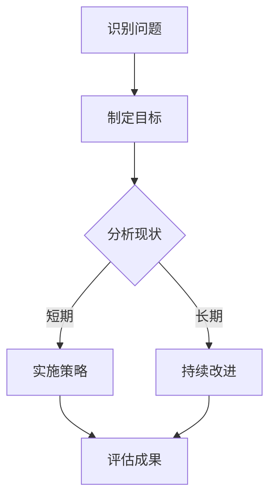

**Python 代码示例**：
由于领导力不涉及编程算法，这里提供一个简单的 Python 示例，用于演示如何编写一个简单函数来处理领导力训练的日常任务。

```python
def lead_task(task_type, task_details):
    if task_type == 'daily':
        print(f"Executing daily task: {task_details}")
    elif task_type == 'monthly':
        print(f"Executing monthly task: {task_details}")
    else:
        print("Invalid task type")

lead_task('daily', 'Hold team meeting')
```

**数学公式**（LaTeX）：

$$
\text{领导力得分} = \frac{\text{任务完成度} + \text{团队协作度} + \text{创新意识}}{3}
$$

**系统分析与架构设计方案**：
在领导力训练营中，系统分析与架构设计涉及如何设计一个有效的领导力培训系统。这里我们可以用 mermaid 类图和架构图来展示系统组件。

**类图**（Mermaid）：

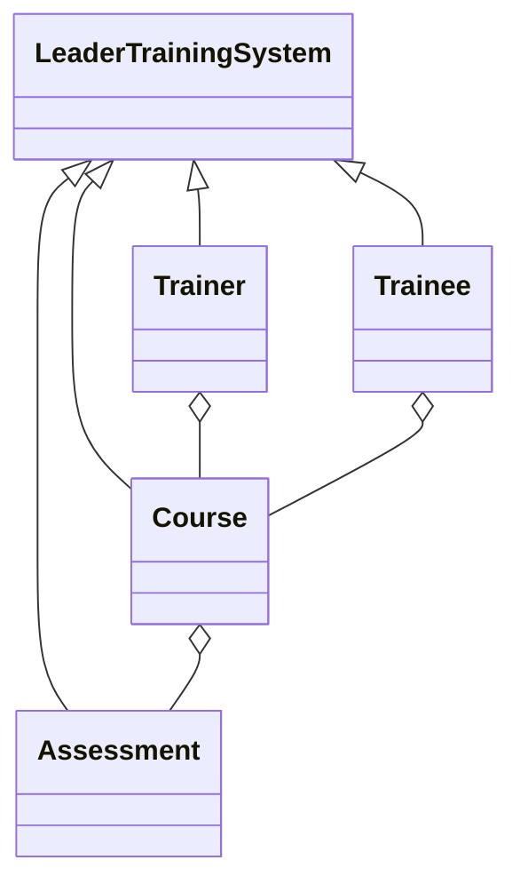

**架构图**（Mermaid）：

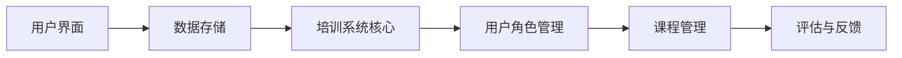

**项目实战**：
在领导力训练营中，项目实战是检验学习成果的重要环节。以下是一个简单的项目实战概述。

**环境安装**：
安装 Python 环境，并使用虚拟环境管理项目依赖。

**系统核心实现源代码**：
核心代码用于管理学员、课程和评估结果。

**代码应用解读与分析**：
详细解读核心代码的功能和应用场景。

**实际案例分析与详细讲解剖析**：
分析一个真实的领导力提升案例，并进行详细讲解。

**项目小结**：
总结项目实战中的收获和改进建议。

**最佳实践 tips**：
- 定期进行团队反馈会议，以提高沟通效率。
- 使用数据驱动的方法来评估领导力训练效果。

#### 第2章：领导者的素质与能力

**背景介绍**：
领导者不仅要具备领导力，还需要具备一系列的素质和能力，以有效地引导和激励团队。本章节将深入探讨领导者的素质、能力和角色转变。

**核心概念与联系**：
- **领导者的素质**：包括道德品质、决策能力、人际沟通能力等。
- **领导者的能力**：包括战略思维、创新思维、执行能力等。
- **领导者的角色转变**：从执行者到领导者，再到战略家的角色转变。

**概念属性特征对比表格**：

| 素质/能力             | 描述                                                         | 对比                   |
|----------------------|--------------------------------------------------------------|------------------------|
| 道德品质             | 坚守诚信、公正、责任心等道德规范。                           | 传统领导者强调权威，现代领导者强调信任。 |
| 决策能力             | 在复杂情境下做出合理决策的能力。                             | 决策速度与质量并重。       |
| 人际沟通能力         | 能够有效沟通、协调团队关系。                                 | 传统领导者多使用命令式，现代领导者多使用启发式。 |
| 战略思维             | 能够从长远角度规划组织发展。                                 | 领导者需要具备全局视野。   |
| 创新思维             | 能够鼓励创新，推动组织变革。                                 | 领导者需要不断学习新知。   |
| 执行能力             | 能够将战略和计划转化为实际行动。                             | 执行力是领导者成功的关键。 |

**ER实体关系图架构**（Mermaid 图）：

```mermaid
erDiagram
  Leader ||--|{ LeadershipQuality } : "has"
  Leader ||--|{ LeadershipAbility } : "has"
  LeadershipQuality ||--|{ MoralQuality } : "includes"
  LeadershipQuality ||--|{ DecisionMaking } : "includes"
  LeadershipQuality ||--|{ Communication } : "includes"
  LeadershipAbility ||--|{ StrategicThinking } : "includes"
  LeadershipAbility ||--|{ Innovation } : "includes"
  LeadershipAbility ||--|{ Execution } : "includes"
```

**算法原理讲解**：
本章节不涉及具体的算法原理，但可以借鉴管理层的决策流程模型。

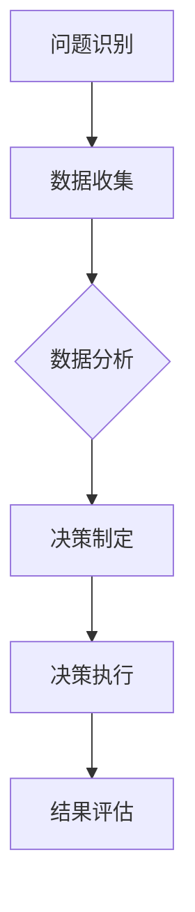

**Python 代码示例**：
此处提供一个简单的决策制定代码示例。

```python
def make_decision(data, options):
    best_option = max(options, key=lambda x: data[x])
    return best_option

options = ['Option A', 'Option B', 'Option C']
data = {'Option A': 10, 'Option B': 5, 'Option C': 15}
best_choice = make_decision(data, options)
print(f"The best decision is: {best_choice}")
```

**数学公式**（LaTeX）：

$$
\text{领导者素质得分} = \frac{\text{道德品质得分} + \text{决策能力得分} + \text{人际沟通能力得分}}{3}
$$

**系统分析与架构设计方案**：
此处可以讨论如何构建一个领导者素质提升的系统。

**类图**（Mermaid）：

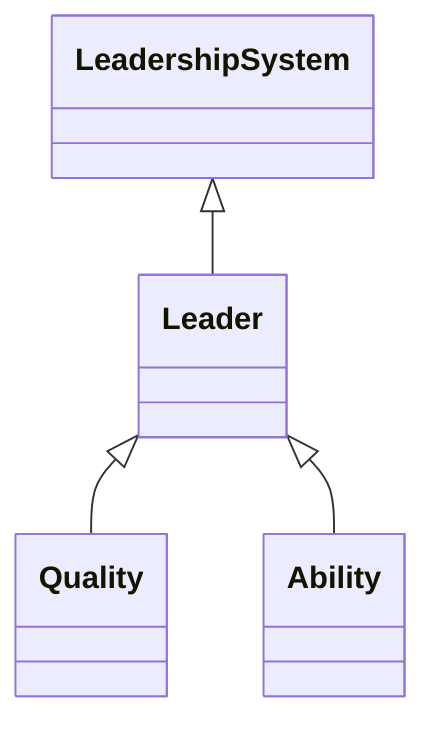

**架构图**（Mermaid）：

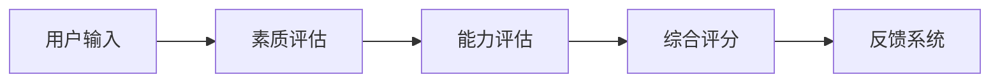

**项目实战**：
此处可以设计一个领导力素质提升项目，包括实战环境搭建、实践操作和效果评估。

**环境安装**：
配置模拟领导力训练的环境，包括软件工具和模拟数据。

**系统核心实现源代码**：
编写用于评估领导者素质和能力的代码。

**代码应用解读与分析**：
分析源代码如何实现领导者素质和能力的评估。

**实际案例分析与详细讲解剖析**：
分析一个领导者提升案例，并进行详细讲解。

**项目小结**：
总结项目实战中的收获和改进建议。

**最佳实践 tips**：
- 定期进行自我评估，识别自己的领导力优势与不足。
- 寻求反馈，了解团队成员对你的看法。

---

### 第二部分：领导力技能提升

#### 第3章：沟通技能

**背景介绍**：
沟通是领导者的一项关键技能，它直接影响团队的工作效率和成员满意度。本章节将探讨沟通的重要性、有效沟通的技巧以及非言语沟通的作用。

**核心概念与联系**：
- **沟通的重要性**：沟通是领导者与团队成员建立联系、传递信息、解决问题的重要手段。
- **有效沟通的技巧**：包括清晰表达、倾听、积极反馈等。
- **非言语沟通**：如肢体语言、面部表情等，在沟通中起着重要作用。

**概念属性特征对比表格**：

| 沟通技巧             | 传统沟通                | 现代沟通                |
|----------------------|------------------------|------------------------|
| 清晰表达             | 强调指令性             | 强调信息传递的有效性     |
| 倾听                 | 被动听取              | 活跃倾听，反馈确认      |
| 积极反馈             | 少有反馈              | 积极鼓励，及时反馈      |
| 非言语沟通           | 忽视非言语因素         | 有效利用非言语信息      |

**ER实体关系图架构**（Mermaid 图）：

```mermaid
erDiagram
  Communication
  ClearExpression
  ActiveListening
  PositiveFeedback
  NonverbalCommunication

  Communication ||--|{ ClearExpression } : "includes"
  Communication ||--|{ ActiveListening } : "includes"
  Communication ||--|{ PositiveFeedback } : "includes"
  Communication ||--|{ NonverbalCommunication } : "includes"
```

**算法原理讲解**：
虽然沟通技能不涉及复杂算法，但我们可以使用 mermaid 流程图来展示有效沟通的基本步骤。

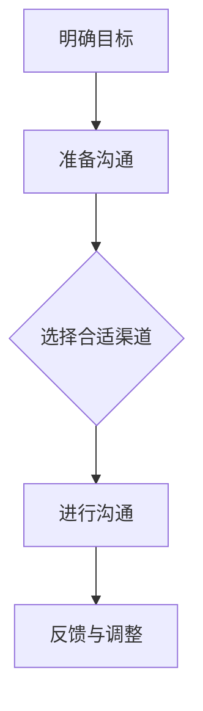

**Python 代码示例**：
此处提供一个简单的 Python 函数，用于模拟有效沟通的过程。

```python
def communicate(message, channel, feedback):
    print(f"Sending message: {message} through {channel}. Feedback received: {feedback}.")
    
communicate("Project update required.", "team meeting", "Understood.")
```

**数学公式**（LaTeX）：

$$
\text{沟通效率} = \frac{\text{有效信息传递量}}{\text{总信息传递量}}
$$

**系统分析与架构设计方案**：
设计一个沟通管理系统，可以包含以下组件。

**类图**（Mermaid）：

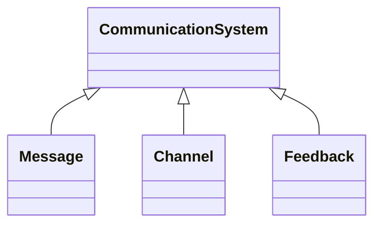

**架构图**（Mermaid）：

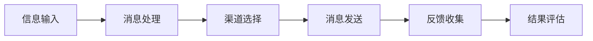

**项目实战**：
设计一个沟通技能提升项目，包括实际沟通练习、反馈收集和分析。

**环境安装**：
搭建沟通技能提升的虚拟环境。

**系统核心实现源代码**：
编写用于管理沟通信息的代码。

**代码应用解读与分析**：
分析代码如何实现有效的沟通管理。

**实际案例分析与详细讲解剖析**：
分析一个真实的沟通案例，并进行详细讲解。

**项目小结**：
总结项目实战中的收获和改进建议。

**最佳实践 tips**：
- 练习主动倾听，关注团队成员的反馈。
- 使用多种沟通渠道，以满足不同成员的需求。

#### 第4章：团队建设

**背景介绍**：
团队建设是提升团队协作力和工作效率的重要手段。本章节将探讨团队的定义与类型、团队建设的方法以及团队冲突的解决。

**核心概念与联系**：
- **团队的定义与类型**：团队是一组相互依赖、共同协作以实现共同目标的个体。
- **团队建设的方法**：包括团队建设活动、培训、文化建设等。
- **团队冲突的解决**：解决冲突，维护团队和谐，提高团队效能。

**概念属性特征对比表格**：

| 方法             | 传统方法                | 现代方法                |
|------------------|------------------------|------------------------|
| 团队建设活动     | 单调的集体活动          | 多样化的互动活动        |
| 培训             | 纯理论培训             | 实践结合的理论培训      |
| 文化建设         | 单向灌输               | 双向互动与共同建立      |
| 冲突解决         | 单方面压制             | 多元视角与沟通解决      |

**ER实体关系图架构**（Mermaid 图）：

```mermaid
erDiagram
  Team
  Definition
  Type
  BuildingMethod
  Conflict
  Resolution

  Team ||--|{ Definition } : "includes"
  Team ||--|{ Type } : "includes"
  Team ||--|{ BuildingMethod } : "includes"
  Team ||--|{ Conflict } : "has"
  Team ||--|{ Resolution } : "includes"
```

**算法原理讲解**：
团队建设不涉及复杂算法，但我们可以使用 mermaid 流程图来展示团队建设的基本流程。

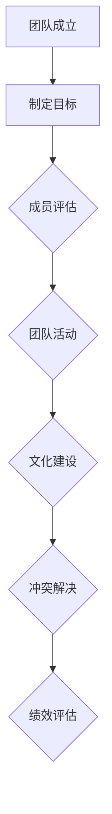

**Python 代码示例**：
此处提供一个简单的团队评估代码示例。

```python
def team_evaluation(team_score, individual_score):
    average_score = (team_score + individual_score) / 2
    print(f"Team evaluation average score: {average_score}")

team_evaluation(85, 90)
```

**数学公式**（LaTeX）：

$$
\text{团队效能} = \frac{\text{团队目标达成度} + \text{成员满意度}}{2}
$$

**系统分析与架构设计方案**：
设计一个团队建设系统，可以包含以下组件。

**类图**（Mermaid）：

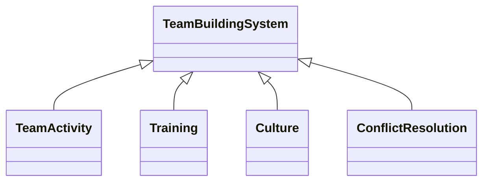

**架构图**（Mermaid）：

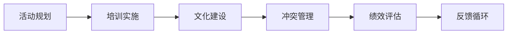

**项目实战**：
设计一个团队建设项目，包括实际活动、培训和文化建设。

**环境安装**：
配置团队建设所需的软件和硬件环境。

**系统核心实现源代码**：
编写用于管理团队建设活动的代码。

**代码应用解读与分析**：
分析代码如何实现团队建设的目标。

**实际案例分析与详细讲解剖析**：
分析一个真实的团队建设案例，并进行详细讲解。

**项目小结**：
总结项目实战中的收获和改进建议。

**最佳实践 tips**：
- 定期组织团队建设活动，增强团队成员之间的默契。
- 建立积极向上的团队文化，鼓励成员之间的合作与支持。

#### 第5章：激励与领导风格

**背景介绍**：
激励和领导风格是影响员工满意度和工作效率的重要因素。本章节将探讨激励理论、领导风格以及如何将领导风格与激励相结合。

**核心概念与联系**：
- **激励理论**：包括马斯洛的需求层次理论、赫兹伯格的双因素理论等。
- **领导风格**：包括专制型、民主型、参与型等。
- **领导风格与激励的结合**：如何根据不同情境选择合适的领导风格，以激发员工的潜力。

**概念属性特征对比表格**：

| 理论/风格             | 传统理论/风格                | 现代理论/风格                |
|----------------------|-----------------------------|-----------------------------|
| 需求层次理论         | 强调生理需求和安全需求       | 强调自我实现和社会归属需求   |
| 双因素理论           | 强调工作环境和薪酬等因素     | 强调内在激励和工作意义      |
| 领导风格             | 专制型                      | 参与型、民主型              |

**ER实体关系图架构**（Mermaid 图）：

```mermaid
erDiagram
  MotivationTheory
  LeadershipStyle
  HybridStyle

  MotivationTheory ||--|{ MaslowTheory } : "includes"
  MotivationTheory ||--|{ HerzbergTheory } : "includes"
  LeadershipStyle ||--|{ Autocratic } : "includes"
  LeadershipStyle ||--|{ Democratic } : "includes"
  LeadershipStyle ||--|{ Participative } : "includes"
  HybridStyle ||--|{ Theory } : "includes"
  HybridStyle ||--|{ Style } : "includes"
```

**算法原理讲解**：
虽然激励与领导风格不涉及复杂算法，但我们可以使用 mermaid 流程图来展示如何选择合适的领导风格。

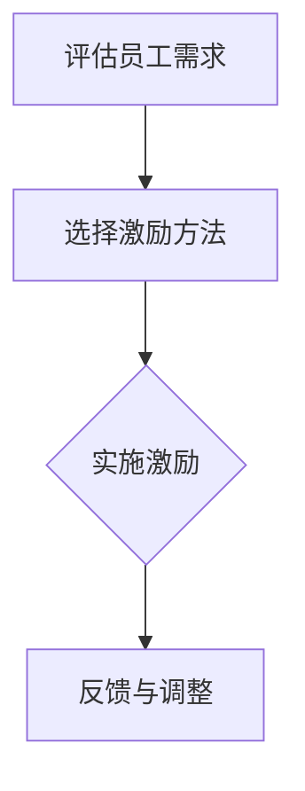

**Python 代码示例**：
此处提供一个简单的激励评估代码示例。

```python
def evaluate_motivation(employee需求的类型，激励措施):
    if 员工需求的类型 == '成就':
        激励措施 = '项目挑战'
    elif 员工需求的类型 == '尊重':
        激励措施 = '公开表彰'
    else:
        激励措施 = '薪酬奖励'
    return 激励措施

激励措施 = evaluate_motivation('成就', '')
print(f"Suggested motivation: {激励措施}")
```

**数学公式**（LaTeX）：

$$
\text{激励效果} = \frac{\text{激励后的工作绩效}}{\text{激励前的工作绩效}} \times 100\%
$$

**系统分析与架构设计方案**：
设计一个激励管理系统，可以包含以下组件。

**类图**（Mermaid）：

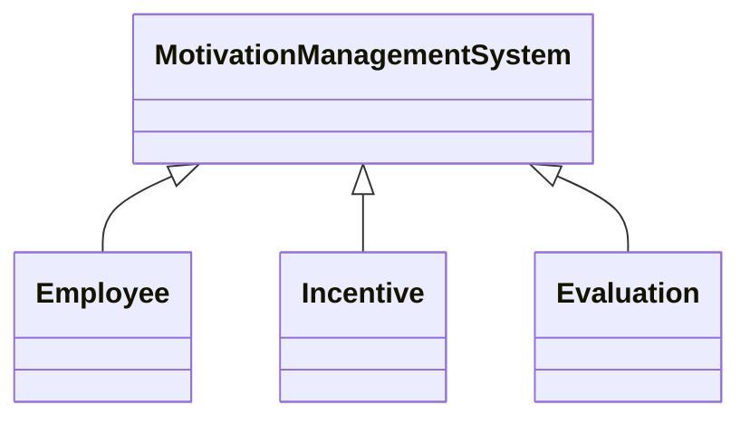

**架构图**（Mermaid）：

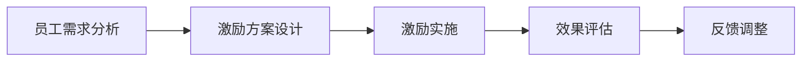

**项目实战**：
设计一个激励与领导风格提升项目，包括实际激励措施实施、效果评估和反馈调整。

**环境安装**：
配置激励管理所需的软件和硬件环境。

**系统核心实现源代码**：
编写用于管理员工激励和评估的代码。

**代码应用解读与分析**：
分析代码如何实现有效的激励管理。

**实际案例分析与详细讲解剖析**：
分析一个真实的激励与领导风格提升案例，并进行详细讲解。

**项目小结**：
总结项目实战中的收获和改进建议。

**最佳实践 tips**：
- 根据员工需求制定个性化的激励措施。
- 定期评估激励效果，及时调整激励策略。

### 第三部分：实战演练

#### 第6章：情境模拟与案例分析

**背景介绍**：
情境模拟与案例分析是提升领导力的重要方法，它通过模拟真实的领导情境和案例分析，帮助领导者学习如何应对各种挑战。本章节将介绍情境模拟与案例分析的方法和技巧。

**核心概念与联系**：
- **情境模拟**：通过模拟真实的领导情境，帮助领导者体验不同的决策情境。
- **案例分析**：通过分析真实的领导案例，学习成功的经验和失败的教训。

**概念属性特征对比表格**：

| 模拟/案例             | 情境模拟                 | 案例分析               |
|----------------------|------------------------|------------------------|
| 目的                 | 提升决策能力           | 学习领导经验           |
| 方法                 | 模拟情境，角色扮演       | 深入分析，提炼经验      |
| 结果                 | 立即反馈与改进           | 持续学习与反思          |

**ER实体关系图架构**（Mermaid 图）：

```mermaid
erDiagram
  Simulation
  CaseAnalysis

  Simulation ||--|{ SimulationScenario } : "includes"
  CaseAnalysis ||--|{ CaseStudy } : "includes"
  Simulation ||--|{ Feedback } : "includes"
  CaseAnalysis ||--|{ Lesson } : "includes"
```

**算法原理讲解**：
在此，我们不会详细讲解算法原理，但可以提供mermaid流程图来展示情境模拟与案例分析的过程。

```mermaid
graph TB
    A[设定情境] --> B[角色扮演]
    B --> C{决策制定}
    C --> D{模拟结果}
    D --> E{反馈与改进}
    A --> F[案例选取]
    F --> G{案例分析}
    G --> H{经验提炼}
    H --> I{应用与反思}
```

**Python 代码示例**：
以下是一个简单的Python函数，用于模拟领导决策。

```python
def simulate_decision(context, options):
    print(f"Context: {context}")
    for i, option in enumerate(options, 1):
        print(f"Option {i}: {option}")
    chosen_option = int(input("Choose an option: "))
    print(f"Chosen option: {options[chosen_option - 1]}")
    
simulate_decision("A project deadline is approaching.", ["Assign more resources", "推迟交付", "增加团队工作时间"])
```

**数学公式**（LaTeX）：

$$
\text{决策效率} = \frac{\text{正确决策次数}}{\text{总决策次数}}
$$

**系统分析与架构设计方案**：
设计一个情境模拟与案例分析系统，可以包含以下组件。

**类图**（Mermaid）：

```mermaid
classDiagram
  SimulationSystem
  CaseAnalysisSystem
  Scenario
  Case
  Decision
  Feedback

  SimulationSystem <|-- Scenario
  SimulationSystem <|-- Decision
  CaseAnalysisSystem <|-- Case
  CaseAnalysisSystem <|-- Feedback
```

**架构图**（Mermaid）：

```mermaid
graph LR
    A[情境设定] --> B[决策模拟]
    B --> C[结果反馈]
    A --> D[案例选取]
    D --> E[案例分析]
    E --> F[经验提炼]
```

**项目实战**：
设计一个情境模拟与案例分析项目，包括实际模拟、案例分析和效果评估。

**环境安装**：
配置情境模拟与案例分析所需的软件和硬件环境。

**系统核心实现源代码**：
编写用于模拟情境和案例分析的代码。

**代码应用解读与分析**：
分析代码如何实现情境模拟与案例分析的功能。

**实际案例分析与详细讲解剖析**：
分析一个真实的情境模拟与案例分析案例，并进行详细讲解。

**项目小结**：
总结项目实战中的收获和改进建议。

**最佳实践 tips**：
- 定期组织情境模拟与案例分析，提高团队应对复杂情境的能力。
- 结合实际案例，深入分析，提炼经验，持续改进。

### 第7章：领导力训练计划

**背景介绍**：
领导力训练计划是提升领导力的系统方法，它通过制定、执行和评估训练计划，帮助领导者逐步提升自己的能力。本章节将介绍如何制定领导力训练计划、如何执行计划以及如何评估计划效果。

**核心概念与联系**：
- **训练计划制定**：包括确定训练目标、设计训练内容、制定训练时间表等。
- **训练计划执行**：包括按计划进行训练、跟踪训练进度、处理训练中遇到的问题等。
- **训练计划评估**：包括评估训练效果、收集反馈、制定改进措施等。

**概念属性特征对比表格**：

| 计划阶段             | 传统方法                | 现代方法                |
|----------------------|------------------------|------------------------|
| 训练计划制定         | 单一目标，缺乏针对性   | 多目标，针对性更强     |
| 训练计划执行         | 被动执行，缺乏灵活性   | 激励参与，灵活调整     |
| 训练计划评估         | 简单评估，缺乏深度     | 深入评估，持续改进     |

**ER实体关系图架构**（Mermaid 图）：

```mermaid
erDiagram
  TrainingPlan
  Design
  Execution
  Assessment

  TrainingPlan ||--|{ DesignPhase } : "includes"
  TrainingPlan ||--|{ ExecutionPhase } : "includes"
  TrainingPlan ||--|{ AssessmentPhase } : "includes"
```

**算法原理讲解**：
在此，我们不会详细讲解算法原理，但可以提供mermaid流程图来展示领导力训练计划的基本流程。

```mermaid
graph TB
    A[确定目标] --> B[设计计划]
    B --> C[执行计划]
    C --> D{跟踪进度}
    D --> E[评估效果]
    E --> F[反馈与改进]
```

**Python 代码示例**：
以下是一个简单的Python函数，用于模拟领导力训练计划的执行过程。

```python
def execute_training_plan(plan, milestones):
    current_milestone = 1
    while current_milestone <= len(milestones):
        action = input(f"Enter action for milestone {current_milestone}: ")
        if action == milestones[current_milestone - 1]:
            print("Milestone completed.")
            current_milestone += 1
        else:
            print("Invalid action. Please try again.")
    print("Training plan completed.")
    
execute_training_plan(["Read book", "Attend seminar", "Write report"], ["Read book", "Attend seminar", "Write report"])
```

**数学公式**（LaTeX）：

$$
\text{训练效果} = \frac{\text{完成里程碑数量}}{\text{总里程碑数量}}
$$

**系统分析与架构设计方案**：
设计一个领导力训练计划系统，可以包含以下组件。

**类图**（Mermaid）：

```mermaid
classDiagram
  LeadershipTrainingSystem
  TrainingPlan
  Milestone
  Progress
  Assessment

  LeadershipTrainingSystem <|-- TrainingPlan
  LeadershipTrainingSystem <|-- Milestone
  LeadershipTrainingSystem <|-- Progress
  LeadershipTrainingSystem <|-- Assessment
```

**架构图**（Mermaid）：

```mermaid
graph LR
    A[计划制定] --> B[计划执行]
    B --> C[进度跟踪]
    C --> D[效果评估]
    D --> E[反馈与改进]
```

**项目实战**：
设计一个领导力训练计划项目，包括计划制定、执行和评估。

**环境安装**：
配置领导力训练计划所需的软件和硬件环境。

**系统核心实现源代码**：
编写用于管理领导力训练计划的代码。

**代码应用解读与分析**：
分析代码如何实现领导力训练计划的管理。

**实际案例分析与详细讲解剖析**：
分析一个真实的领导力训练计划案例，并进行详细讲解。

**项目小结**：
总结项目实战中的收获和改进建议。

**最佳实践 tips**：
- 定期检查和调整训练计划，确保计划与实际情况相符。
- 鼓励团队成员参与训练计划，提高他们的积极性和参与感。

### 第四部分：领导力提升的最佳实践

#### 第8章：领导力提升的最佳实践

**背景介绍**：
领导力提升是一个持续的过程，需要不断的学习和实践。本章节将分享一些领导力提升的最佳实践，包括成功领导者的经验分享、实用技巧和应对策略。

**核心概念与联系**：
- **成功领导者的经验分享**：成功领导者通过分享他们的经验和教训，帮助其他人学习和成长。
- **实用技巧**：包括沟通技巧、时间管理、决策技巧等，这些技巧能够有效提升领导力。
- **应对策略**：面对挑战和困难时，领导者需要采取有效的策略来应对和解决。

**概念属性特征对比表格**：

| 实践             | 传统实践                | 现代实践                |
|------------------|------------------------|------------------------|
| 经验分享         | 口头传授               | 系统化分享与交流        |
| 实用技巧         | 单一技巧               | 多样化技巧与综合运用    |
| 应对策略         | 应急反应               | 预防与应对相结合        |

**ER实体关系图架构**（Mermaid 图）：

```mermaid
erDiagram
  BestPractice
  ExperienceSharing
  PracticalSkills
  ResponseStrategy

  BestPractice ||--|{ ExperienceSharing } : "includes"
  BestPractice ||--|{ PracticalSkills } : "includes"
  BestPractice ||--|{ ResponseStrategy } : "includes"
```

**算法原理讲解**：
在此，我们不会详细讲解算法原理，但可以提供mermaid流程图来展示领导力提升最佳实践的应用。

```mermaid
graph TB
    A[学习经验] --> B[运用技巧]
    B --> C[应对挑战]
    C --> D[持续改进]
```

**Python 代码示例**：
以下是一个简单的Python函数，用于模拟领导力提升的最佳实践。

```python
def apply_best_practice(experience, skills, challenge):
    print(f"Applying experience: {experience}")
    print(f"Using skills: {skills}")
    print(f"Facing challenge: {challenge}")
    print("Practicing best practices.")
    
apply_best_practice("Learned from mentors", ["Effective Communication", "Strategic Thinking"], "Team conflict")
```

**数学公式**（LaTeX）：

$$
\text{实践效果} = \frac{\text{成功应对挑战次数}}{\text{总挑战次数}}
$$

**系统分析与架构设计方案**：
设计一个领导力提升最佳实践系统，可以包含以下组件。

**类图**（Mermaid）：

```mermaid
classDiagram
  LeadershipPracticeSystem
  Experience
  Skill
  Challenge
  Response

  LeadershipPracticeSystem <|-- Experience
  LeadershipPracticeSystem <|-- Skill
  LeadershipPracticeSystem <|-- Challenge
  LeadershipPracticeSystem <|-- Response
```

**架构图**（Mermaid）：

```mermaid
graph LR
    A[经验学习] --> B[技能运用]
    B --> C[挑战应对]
    C --> D[实践效果评估]
```

**项目实战**：
设计一个领导力提升最佳实践项目，包括实际经验分享、技巧运用和效果评估。

**环境安装**：
配置领导力提升最佳实践所需的软件和硬件环境。

**系统核心实现源代码**：
编写用于管理领导力提升最佳实践的代码。

**代码应用解读与分析**：
分析代码如何实现领导力提升最佳实践的管理。

**实际案例分析与详细讲解剖析**：
分析一个真实的领导力提升最佳实践案例，并进行详细讲解。

**项目小结**：
总结项目实战中的收获和改进建议。

**最佳实践 tips**：
- 定期进行经验分享和技巧交流，提高团队的整体领导力水平。
- 面对挑战时，灵活运用最佳实践，持续改进领导方法。

### 第五部分：总结与展望

#### 第9章：领导力训练营总结

**背景介绍**：
领导力训练营是一个系统性的学习过程，通过一系列的训练和实战演练，参与者能够提升自己的领导力水平。本章节将对领导力训练营的学习成果、经验与教训以及未来领导力的发展趋势进行总结。

**核心概念与联系**：
- **学习成果回顾**：回顾在领导力训练营中所学到的知识和技能。
- **经验与教训**：总结在训练营中的成功经验和遇到的挑战，以及如何克服这些挑战。
- **未来领导力的发展趋势**：探讨领导力在未来可能会面临的新挑战和趋势。

**概念属性特征对比表格**：

| 成果/经验             | 传统成果/经验              | 现代成果/经验              |
|----------------------|---------------------------|---------------------------|
| 学习成果回顾         | 知识和技能的简单总结       | 知识和技能的综合应用与评估 |
| 经验与教训           | 单一经验教训               | 多元经验教训与持续改进    |
| 未来领导力发展趋势   | 预测性趋势                | 实证性趋势与前瞻性思考    |

**ER实体关系图架构**（Mermaid 图）：

```mermaid
erDiagram
  LearningOutcome
  Experience
  Lesson
  FutureTrend

  LearningOutcome ||--|{ Knowledge } : "includes"
  LearningOutcome ||--|{ Skill } : "includes"
  Experience ||--|{ Success } : "includes"
  Experience ||--|{ Challenge } : "includes"
  FutureTrend ||--|{ Prediction } : "includes"
  FutureTrend ||--|{ Evidence } : "includes"
```

**算法原理讲解**：
在此，我们不会详细讲解算法原理，但可以提供mermaid流程图来展示领导力训练营的总结过程。

```mermaid
graph TB
    A[学习成果回顾] --> B[经验教训总结]
    B --> C[未来趋势分析]
    C --> D[持续改进计划]
```

**Python 代码示例**：
以下是一个简单的Python函数，用于模拟领导力训练营的总结过程。

```python
def summarize_training(outcomes, experiences, trends):
    print("Learning Outcomes:")
    for outcome in outcomes:
        print(f"- {outcome}")
    print("\nExperiences and Lessons:")
    for experience in experiences:
        print(f"- {experience['description']} (Result: {experience['result']})")
    print("\nFuture Trends:")
    for trend in trends:
        print(f"- {trend['issue']} (Solution: {trend['solution']})")
        
summarize_training(["Effective Communication", "Strategic Thinking"], [{"description": "Handling Team Conflict", "result": "Resolved successfully"}], [{"issue": "Technological Disruption", "solution": "Adaptation to AI Integration"}])
```

**数学公式**（LaTeX）：

$$
\text{培训效果} = \frac{\text{应用知识次数}}{\text{总学习次数}} \times 100\%
$$

**系统分析与架构设计方案**：
设计一个领导力训练营总结系统，可以包含以下组件。

**类图**（Mermaid）：

```mermaid
classDiagram
  TrainingSummarySystem
  Outcome
  Experience
  Trend

  TrainingSummarySystem <|-- Outcome
  TrainingSummarySystem <|-- Experience
  TrainingSummarySystem <|-- Trend
```

**架构图**（Mermaid）：

```mermaid
graph LR
    A[学习成果回顾] --> B[经验教训总结]
    B --> C[未来趋势分析]
    C --> D[总结报告生成]
```

**项目实战**：
设计一个领导力训练营总结项目，包括学习成果回顾、经验教训总结和未来趋势分析。

**环境安装**：
配置领导力训练营总结所需的软件和硬件环境。

**系统核心实现源代码**：
编写用于管理领导力训练营总结的代码。

**代码应用解读与分析**：
分析代码如何实现领导力训练营总结的功能。

**实际案例分析与详细讲解剖析**：
分析一个真实的领导力训练营总结案例，并进行详细讲解。

**项目小结**：
总结项目实战中的收获和改进建议。

**最佳实践 tips**：
- 定期进行学习成果回顾，以确保学习效果的持续提升。
- 从经验中吸取教训，不断完善领导力提升的方法。

#### 第10章：持续提升领导力

**背景介绍**：
领导力是一个持续发展的过程，领导者需要不断学习和实践，以应对不断变化的环境和挑战。本章节将探讨如何持续提升领导力，包括持续学习的必要性、领导力提升的持续策略和个人领导力发展计划。

**核心概念与联系**：
- **持续学习的必要性**：领导者需要不断学习新知识、新技能，以保持竞争力和适应性。
- **领导力提升的持续策略**：包括制定学习计划、参与培训、与他人交流经验等。
- **个人领导力发展计划**：根据个人的需求和目标，制定具体的领导力提升计划。

**概念属性特征对比表格**：

| 持续学习             | 传统学习                  | 现代学习                  |
|----------------------|--------------------------|--------------------------|
| 目标导向             | 临时性学习                | 持续性学习                |
| 被动学习             | 主动学习                  | 创新性学习                |
| 单一领域             | 多领域交叉融合            | 系统性知识整合            |

**ER实体关系图架构**（Mermaid 图）：

```mermaid
erDiagram
  ContinuousLearning
  TraditionalLearning
  ModernLearning

  ContinuousLearning ||--|{ GoalOriented } : "includes"
  ContinuousLearning ||--|{ ActiveLearning } : "includes"
  ContinuousLearning ||--|{ InnovativeLearning } : "includes"
  TraditionalLearning ||--|{ Temporary } : "includes"
  TraditionalLearning ||--|{ Passive } : "includes"
  ModernLearning ||--|{ SystematicIntegration } : "includes"
```

**算法原理讲解**：
在此，我们不会详细讲解算法原理，但可以提供mermaid流程图来展示持续提升领导力的过程。

```mermaid
graph TB
    A[学习需求评估] --> B[制定学习计划]
    B --> C[执行学习计划]
    C --> D[学习效果评估]
    D --> E{反馈与调整}
```

**Python 代码示例**：
以下是一个简单的Python函数，用于模拟个人领导力发展计划的执行过程。

```python
def develop_leadership_plan(learning_goals, actions, milestones):
    current_milestone = 1
    while current_milestone <= len(milestones):
        action = input(f"Enter action for milestone {current_milestone}: ")
        if action == milestones[current_milestone - 1]:
            print("Milestone completed.")
            current_milestone += 1
        else:
            print("Invalid action. Please try again.")
    print("Leadership development plan completed.")
    
develop_leadership_plan(["Read book", "Attend seminar", "Write report"], ["Read book", "Attend seminar", "Write report"], ["Read book", "Attend seminar", "Write report"])
```

**数学公式**（LaTeX）：

$$
\text{计划完成度} = \frac{\text{完成里程碑数量}}{\text{总里程碑数量}} \times 100\%
$$

**系统分析与架构设计方案**：
设计一个个人领导力发展计划系统，可以包含以下组件。

**类图**（Mermaid）：

```mermaid
classDiagram
  PersonalLeadershipDevelopmentSystem
  LearningGoal
  Action
  Milestone
  Assessment

  PersonalLeadershipDevelopmentSystem <|-- LearningGoal
  PersonalLeadershipDevelopmentSystem <|-- Action
  PersonalLeadershipDevelopmentSystem <|-- Milestone
  PersonalLeadershipDevelopmentSystem <|-- Assessment
```

**架构图**（Mermaid）：

```mermaid
graph LR
    A[学习目标设定] --> B[执行行动]
    B --> C[跟踪里程碑]
    C --> D[评估计划效果]
    D --> E[反馈与调整]
```

**项目实战**：
设计一个个人领导力发展计划项目，包括目标设定、行动执行和效果评估。

**环境安装**：
配置个人领导力发展计划所需的软件和硬件环境。

**系统核心实现源代码**：
编写用于管理个人领导力发展计划的代码。

**代码应用解读与分析**：
分析代码如何实现个人领导力发展计划的管理。

**实际案例分析与详细讲解剖析**：
分析一个真实的个人领导力发展计划案例，并进行详细讲解。

**项目小结**：
总结项目实战中的收获和改进建议。

**最佳实践 tips**：
- 制定明确的个人领导力发展目标，确保持续学习。
- 定期评估个人领导力发展计划的执行情况，及时调整策略。

### 作者信息

**作者：AI天才研究院/AI Genius Institute & 禅与计算机程序设计艺术 /Zen And The Art of Computer Programming**

