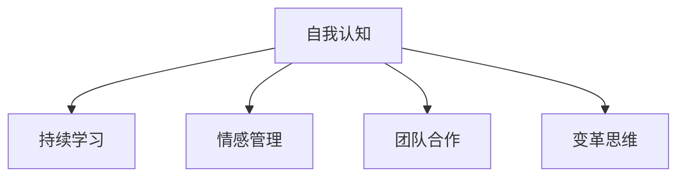
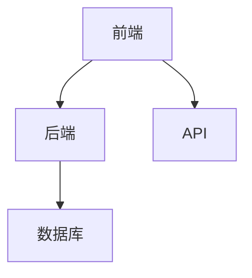
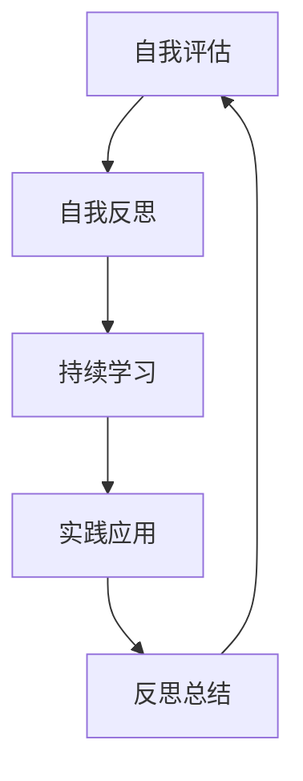

                 

### 文章标题：领导力训练营：175天从菜鸟到大神

#### 关键词：
- 领导力
- 菜鸟
- 大神
- 175天训练营
- 实战指南

#### 摘要：
本文旨在为初入职场或希望提升领导能力的读者提供一套完整的领导力提升方案。通过175天的系统性训练，从基础理论到实战应用，逐步帮助读者从菜鸟成长为领导力大师。文章将详细阐述每一阶段的学习目标和关键步骤，并通过案例分析、实战技巧分享，确保读者能够将所学知识有效应用于实际工作中。

---

### 引言

在当今快速变化的商业环境中，领导力已成为企业和个人成功的关键因素。然而，对于许多初入职场或希望提升领导能力的读者来说，如何系统地学习和掌握领导力技能仍是一个挑战。本文将为您提供一份详尽的领导力提升指南，通过175天的训练营，从基础理论到实战应用，逐步帮助您从领导力菜鸟成长为行业领导力大神。

#### 目录

1. **领导力训练营概述**
2. **第一部分：领导力基础**
   1. **领导力概述**
   2. **自我认知与个人成长**
   3. **团队建设**
   4. **激励与授权**
   5. **决策与战略规划**
   6. **领导力风格与影响力**
   7. **领导力提升实践**
3. **第二部分：实战应用与案例分析**
   1. **实战中的领导力应用**
   2. **成功领导力案例分析**
   3. **领导力提升的持续努力**
4. **总结与展望**
5. **拓展阅读**

### 领导力训练营概述

领导力训练营旨在通过175天的系统训练，帮助读者全面提升领导力技能。训练营分为两个主要部分：基础理论和实战应用。在第一部分，我们将详细讲解领导力的核心概念、自我认知、团队建设、激励与授权、决策与战略规划、领导力风格与影响力等关键领域。第二部分则通过实战应用和案例分析，让读者将所学知识应用于实际工作场景中。

#### 第一部分：领导力基础

**第1章：领导力概述**

在这一章节中，我们将探讨领导力的定义、重要性及其在不同领域的应用。领导力不仅仅是管理，它涉及到个人影响力、团队合作、创新思维等多个方面。我们将通过历史和现代的领导力案例，帮助读者理解领导力的本质和作用。

**第2章：自我认知与个人成长**

领导力始于自我认知。在这一章节中，我们将介绍自我认知的重要性，包括自我评估方法、个人成长习惯的培养等。通过深入了解自己，读者将能够更好地发挥自己的潜力，提高领导力水平。

**第3章：团队建设**

一个成功的团队是领导力的体现。在这一章节中，我们将讨论团队建设的核心要素，包括团队沟通、冲突管理、团队动力等。我们将提供实用的团队建设策略，帮助读者构建高效的团队。

**第4章：激励与授权**

激励和授权是领导者的重要职责。在这一章节中，我们将介绍激励理论，探讨如何建立有效的激励机制，并讨论授权的艺术，帮助读者提高团队的士气和生产力。

**第5章：决策与战略规划**

决策和战略规划是领导者必须掌握的关键技能。在这一章节中，我们将详细讲解决策过程，包括信息收集、方案评估、决策执行等。同时，我们将探讨如何制定有效的战略规划，帮助读者在竞争激烈的市场中立于不败之地。

**第6章：领导力风格与影响力**

不同的领导力风格适用于不同的情境。在这一章节中，我们将介绍领导力风格的理论，包括变革型领导、民主型领导、独裁型领导等。我们将讨论如何发挥个人影响力，以及如何在不同的领导风格中找到平衡。

**第7章：领导力提升实践**

理论联系实际，实践是检验真理的唯一标准。在这一章节中，我们将通过真实的领导力实践案例，帮助读者将所学知识应用到实际工作中。同时，我们将讨论如何持续提升领导力，保持不断进步。

---

在接下来的章节中，我们将详细探讨每个主题，提供实用的工具和技巧，帮助读者从领导力菜鸟成长为行业领导力大神。让我们一起开始这场领导力提升之旅吧！

---

### 第一部分：领导力基础

#### 第1章：领导力概述

##### 背景介绍

领导力，一个在企业管理、团队协作、个人发展等多个领域中不可或缺的概念。领导力不仅仅是管理，它是一种能够影响他人、推动团队达成目标的能力。在历史上，优秀的领导者如亚里士多德、拿破仑、毛泽东等，他们的领导力不仅改变了历史的进程，也为后人树立了榜样。

然而，在现代社会，领导力的定义和内涵也在不断演变。传统上，领导力被看作是一种天赋，只有少数人天生具备。但随着对领导力研究的深入，越来越多的学者和实践者认为，领导力是可以培养和提升的。本文将带领读者从基础概念出发，逐步深入，探讨领导力的本质、影响因素以及不同类型的领导力。

##### 核心概念与联系

**领导力定义**

领导力可以简单定义为一种通过影响他人来实现共同目标的能力。根据James MacGregor Burns的定义，领导力是一种变革性过程，涉及领导者与追随者之间的互动，以实现共同的目标和价值观。

**领导力影响因素**

领导力的影响因素多种多样，包括个人特质、环境因素、团队结构等。个人特质如自信、决断力、情商等，对领导力有着重要影响。环境因素如组织文化、市场竞争等，也会对领导力产生重要影响。团队结构则决定了领导力在团队中的表现方式。

**领导力类型**

领导力类型根据不同的划分标准，可以分为多种类型。根据领导风格的不同，可以分为变革型领导、民主型领导、独裁型领导等。变革型领导强调领导者的创新和变革能力，民主型领导注重团队参与和决策，独裁型领导则强调领导者的权威和决策权。

**领导力与管理的区别**

领导力与管理的区别在于，领导力关注的是如何影响和激励他人，而管理关注的是如何组织和协调资源。领导力强调愿景和价值观，而管理强调流程和效率。两者相辅相成，共同推动组织的成功。

##### 算法原理讲解

在理解了领导力的定义、影响因素和类型后，我们还需要了解如何培养和提高领导力。以下是一个简单的领导力提升算法：

1. **自我认知**：了解自己的优点和不足，进行自我评估。
2. **持续学习**：通过阅读、培训和实践，不断提升自己的知识和技能。
3. **情感管理**：提高情商，学会管理自己的情绪和与他人互动。
4. **团队合作**：培养团队合作能力，学会与不同性格和背景的人共事。
5. **变革思维**：鼓励创新和变革，勇于面对挑战和不确定性。

我们可以使用Mermaid流程图来表示这个算法：



通过上述算法，读者可以逐步提升自己的领导力水平。

##### 数学公式

在领导力提升过程中，数学模型可以用来描述某些关键因素之间的关系。例如，领导力的提升速度（L）可以由学习效率（E）、实践应用（P）和反馈调整（F）共同决定：

$$ L = E \times P \times F $$

其中，E代表学习效率，P代表实践应用，F代表反馈调整。这个公式告诉我们，领导力的提升速度取决于我们学习的效率、将所学知识应用到实践中的能力以及根据反馈进行调整的能力。

##### 系统分析与架构设计方案

为了更好地理解领导力提升的过程，我们可以将其视为一个系统，其中各个组件相互作用，共同推动领导力的发展。以下是一个简化的领导力提升系统架构：

**问题场景介绍**：在现代企业中，领导者需要具备多种能力，以应对快速变化的市场和复杂的组织环境。

**项目介绍**：领导力提升项目旨在通过系统化的培训和指导，帮助领导者提升自身能力。

**系统功能设计**：系统功能包括自我认知、学习平台、实践应用、反馈机制等。

**系统架构设计**：系统采用B/S架构，前端使用Vue框架，后端使用Spring Boot框架，数据库采用MySQL。

**系统接口设计和系统交互**：系统通过RESTful API进行数据交互，前端通过Ajax请求与后端进行通信。

以下是一个简化的Mermaid类图和架构图：

```mermaid
classDiagram
  Class1 <|-- Class2
  Class3 --|>| Class4
```



##### 项目实战

为了更好地理解领导力提升的过程，我们可以通过一个实际项目来演示。以下是一个简化的领导力提升项目实战：

**环境安装**：在本地环境中安装Vue、Spring Boot和MySQL。

**系统核心实现源代码**：实现自我认知模块、学习平台模块、实践应用模块和反馈机制模块。

**代码应用解读与分析**：通过分析代码，了解各个模块的功能和实现方式。

**实际案例分析和详细讲解剖析**：通过实际案例，分析领导力提升的成效和问题，提出改进建议。

**项目小结**：总结项目实施过程中的经验教训，为后续项目提供参考。

##### 最佳实践 tips

1. **持续学习**：领导者应始终保持学习的态度，不断更新知识和技能。
2. **实践应用**：理论知识需要通过实践来验证和提升。
3. **反馈调整**：及时收集反馈，并根据反馈进行调整。

##### 小结

领导力是领导者成功的关键因素。通过175天的领导力训练营，读者可以从基础理论到实战应用，逐步提升领导力水平。本文通过详细的讲解和案例分析，帮助读者更好地理解领导力的本质和提升方法。

##### 注意事项

1. **认真阅读**：每个章节都有其独特的价值和意义，应认真阅读和理解。
2. **实践应用**：将所学知识应用到实际工作中，才能真正提升领导力。

##### 拓展阅读

1. **《领导力五要素》**：由著名领导力专家约翰·科特所著，详细阐述了领导力的五个核心要素。
2. **《影响力》**：由罗伯特·西奥迪尼所著，深入分析了影响力六大原理，对领导力提升有很大帮助。

---

在接下来的章节中，我们将继续探讨领导力的各个方面，帮助读者从菜鸟成长为领导力大神。让我们一起继续学习吧！

---

### 第1章：领导力概述

#### 第1.1节：领导力的定义与重要性

领导力是一个多维度、多层次的概念，其定义和内涵在不同领域和背景下有着不同的诠释。总的来说，领导力可以简单定义为一种通过影响和激励他人来实现共同目标的能力。这种能力不仅涉及到管理和技术层面，还包括情感、价值观和愿景等方面。

在商业领域，领导力的重要性尤为突出。一个优秀的领导者能够带领团队高效地完成工作，推动企业创新和持续发展。领导力不仅仅是管理，它更是一种影响力，能够激发团队成员的潜力，创造积极的工作氛围。以下是从几个方面阐述领导力的重要性：

1. **实现组织目标**：领导者通过设定明确的目标和愿景，激发团队成员的动力，确保团队朝着共同的目标前进。在复杂的商业环境中，领导者需要具备战略眼光，制定有效的战略规划，实现组织的长期发展。

2. **推动团队协作**：领导者需要建立良好的团队沟通机制，促进团队成员之间的协作和合作。通过有效的团队建设策略，领导者可以激发团队成员的积极性，提高团队的整体效率和绩效。

3. **激发创新能力**：领导者是组织创新的重要推动者。通过鼓励团队成员提出新的想法和方案，领导者可以推动组织在竞争激烈的市场中保持创新优势。

4. **塑造企业文化**：领导者的行为和价值观直接影响企业的文化氛围。一个优秀的领导者能够塑造积极向上的企业文化，提高员工的满意度和忠诚度。

5. **提升个人影响力**：领导力不仅仅是一种管理能力，更是一种个人魅力和影响力。领导者通过自身的行为和言行，影响和激励他人，提升个人在组织中的地位和影响力。

#### 第1.2节：领导力的影响因素

领导力的影响因素多种多样，包括个人特质、环境因素、团队结构等。以下是一些关键的影响因素：

1. **个人特质**：领导者的个人特质对其领导力有着重要影响。例如，自信、决断力、情商等特质能够帮助领导者更好地应对挑战和压力，提高领导效果。

2. **环境因素**：组织文化、市场竞争、政策法规等环境因素也会对领导力产生重要影响。在一个支持创新和变革的组织文化中，领导者更容易发挥其领导力，推动组织的进步。

3. **团队结构**：团队的结构和成员的构成也会影响领导力。一个多元化的团队能够带来不同的观点和经验，有助于领导者更好地理解和应对复杂问题。

4. **情境因素**：领导力在不同的情境下有不同的表现。领导者需要具备适应不同情境的能力，灵活运用不同的领导风格，以实现最佳领导效果。

#### 第1.3节：领导力的不同类型

领导力可以根据不同的标准进行分类，以下是一些常见的领导力类型：

1. **变革型领导**：变革型领导强调领导者的创新和变革能力，通过激发团队成员的潜能，推动组织实现重大变革。

2. **民主型领导**：民主型领导注重团队参与和决策，通过鼓励团队成员提出建议和意见，共同制定决策，提高团队的整体绩效。

3. **独裁型领导**：独裁型领导强调领导者的权威和决策权，通过严格的管理和控制，确保团队目标的实现。

4. **教练型领导**：教练型领导注重团队成员的个人发展和成长，通过提供指导和支持，帮助团队成员提升技能和能力。

5. **服务型领导**：服务型领导强调领导者的服务精神，通过关注团队成员的需求和福祉，建立良好的团队关系，提高团队的凝聚力和绩效。

#### 小结

领导力是一个复杂而多维的概念，其定义和内涵在不同领域和背景下有着不同的诠释。在商业领域，领导力的重要性不言而喻，它不仅是实现组织目标的关键，也是推动团队协作、激发创新能力和塑造企业文化的重要力量。领导力的影响因素多种多样，包括个人特质、环境因素、团队结构等。同时，领导力也分为多种类型，每种类型都有其独特的特点和适用情境。在接下来的章节中，我们将继续深入探讨领导力的各个方面，帮助读者从理论到实践，全面提升领导力水平。

#### 第2章：自我认知与个人成长

##### 背景介绍

在领导力的发展过程中，自我认知与个人成长是至关重要的环节。自我认知是指个体对自身能力、性格、价值观等方面的理解和认识。通过自我认知，个体能够更好地理解自己的优势和不足，明确个人目标和职业发展方向。个人成长则是指个体在自我认知的基础上，通过不断学习、实践和反思，提升自身能力的过程。在领导力的发展中，自我认知与个人成长不仅有助于提高个人的领导能力，还能促进团队和组织的整体发展。

##### 核心概念与联系

**自我认知**

自我认知包括自我评估、自我反思和自我理解三个方面。自我评估是指通过多种方法，如问卷调查、心理测试、自我反思等，了解自己的性格特点、能力水平、价值观等。自我反思是指通过回顾自己的行为和经历，深入思考自己的行为动机和结果，从而更好地理解自己的行为模式。自我理解是指通过自我认知，形成对自身的全面认识，明确自己的优点和不足，以及如何改进和提升。

**个人成长**

个人成长的核心在于持续学习、实践和反思。持续学习是指通过阅读、培训、课程等途径，不断更新知识和技能。实践是指将所学知识应用到实际工作中，通过实践来验证和提升自己的能力。反思是指通过回顾自己的行为和结果，思考哪些做得好，哪些需要改进，从而不断提升自己的能力和水平。

**自我认知与个人成长的关系**

自我认知是个人成长的前提，只有通过自我认知，个体才能明确自己的优势和不足，找到提升的方向。而个人成长则是自我认知的体现，通过持续学习和实践，个体能够不断提升自己的能力，实现个人和职业的发展。

##### 算法原理讲解

为了更好地理解和实践自我认知与个人成长，我们可以使用一个简化的算法：

1. **自我评估**：通过问卷调查、心理测试等方法，对自身进行全面的评估，了解自己的性格特点、能力水平和价值观等。
2. **自我反思**：定期回顾自己的行为和经历，深入思考自己的行为动机和结果，形成对自身的深入理解。
3. **持续学习**：通过阅读、培训、课程等途径，不断更新知识和技能。
4. **实践应用**：将所学知识应用到实际工作中，通过实践来验证和提升自己的能力。
5. **反思总结**：定期总结自己的学习与实践成果，分析哪些做得好，哪些需要改进，形成持续改进的循环。

以下是一个简化的Mermaid流程图：



##### 数学公式

在自我认知与个人成长的过程中，数学模型可以用来描述某些关键因素之间的关系。例如，个人成长速度（G）可以由学习效率（E）、实践应用（P）和反思调整（R）共同决定：

$$ G = E \times P \times R $$

其中，E代表学习效率，P代表实践应用，R代表反思调整。这个公式告诉我们，个人成长速度取决于我们学习的效率、将所学知识应用到实践中的能力以及根据反思进行调整的能力。

##### 系统分析与架构设计方案

为了更好地理解和实践自我认知与个人成长，我们可以将其视为一个系统，其中各个组件相互作用，共同推动个人成长。以下是一个简化的系统架构：

**问题场景介绍**：在现代企业中，领导者需要具备自我认知与个人成长的能力，以应对快速变化的市场和复杂的组织环境。

**项目介绍**：自我认知与个人成长项目旨在通过系统化的培训和指导，帮助领导者提升自我认知与个人成长的能力。

**系统功能设计**：系统功能包括自我评估、学习平台、实践应用和反思总结等。

**系统架构设计**：系统采用B/S架构，前端使用Vue框架，后端使用Spring Boot框架，数据库采用MySQL。

**系统接口设计和系统交互**：系统通过RESTful API进行数据交互，前端通过Ajax请求与后端进行通信。

以下是一个简化的Mermaid类图和架构图：

```mermaid
classDiagram
  Class1 <|-- Class2
  Class3 --|>| Class4
```


##### 项目实战

为了更好地理解和实践自我认知与个人成长，我们可以通过一个实际项目来演示。以下是一个简化的自我认知与个人成长项目实战：

**环境安装**：在本地环境中安装Vue、Spring Boot和MySQL。

**系统核心实现源代码**：实现自我评估模块、学习平台模块、实践应用模块和反思总结模块。

**代码应用解读与分析**：通过分析代码，了解各个模块的功能和实现方式。

**实际案例分析和详细讲解剖析**：通过实际案例，分析自我认知与个人成长的效果和问题，提出改进建议。

**项目小结**：总结项目实施过程中的经验教训，为后续项目提供参考。

##### 最佳实践 tips

1. **定期自我评估**：通过定期自我评估，了解自己的成长方向和需要改进的方面。
2. **持续学习**：通过阅读、培训、课程等途径，不断更新知识和技能。
3. **实践应用**：将所学知识应用到实际工作中，通过实践来验证和提升自己的能力。
4. **反思总结**：定期反思自己的行为和结果，形成持续改进的循环。

##### 小结

自我认知与个人成长是领导力发展的重要环节。通过自我认知，个体能够明确自己的优势和不足，找到提升的方向。而通过个人成长，个体能够不断提升自己的能力，实现个人和职业的发展。本文通过详细的讲解和案例分析，帮助读者更好地理解自我认知与个人成长的概念和提升方法。

##### 注意事项

1. **认真阅读**：每个章节都有其独特的价值和意义，应认真阅读和理解。
2. **实践应用**：将所学知识应用到实际工作中，才能真正提升自我认知与个人成长。

##### 拓展阅读

1. **《自我认知与个人成长》**：由知名心理学家克里斯托弗·彼得森所著，详细阐述了自我认知与个人成长的理论和实践方法。
2. **《学习与成长》**：由学习科学家彼得·德鲁克所著，探讨了学习与成长的重要性以及如何实现持续的学习与成长。

---

在接下来的章节中，我们将继续探讨领导力的各个方面，帮助读者从菜鸟成长为领导力大神。让我们一起继续学习吧！

---

### 第2章：自我认知与个人成长

#### 第2.1节：自我认知的重要性

自我认知是领导力发展的基础，它涉及到个体对自身性格、能力、价值观和动机等方面的了解。自我认知的重要性体现在以下几个方面：

1. **明确个人目标**：通过自我认知，个体能够明确自己的长期和短期目标。这种目标意识有助于个体在职业发展过程中做出更明智的决策，避免盲目跟风或迷失自我。

2. **提升领导能力**：了解自己的性格特点和优势，有助于个体更好地发挥自身潜力，提升领导力。例如，一个具有高情商的领导者可以更好地处理团队关系，提高团队凝聚力。

3. **优化决策过程**：自我认知有助于个体在面临决策时，更清楚地了解自己的思维模式和行为习惯，从而做出更合理的决策。

4. **促进个人成长**：自我认知促使个体反思和改进，通过不断学习和实践，提升自身能力。

#### 第2.2节：自我评估方法

自我评估是自我认知的重要环节，以下是一些常用的自我评估方法：

1. **心理测试**：通过心理测试，如MBTI、DISC等，了解自己的性格类型和优势。这些测试通常由专业机构提供，具有较高的可信度。

2. **反思日志**：记录自己的日常行为和思考，定期回顾和分析。这种方法有助于个体深入了解自己的内心世界和行为模式。

3. **360度反馈**：通过同事、上级和下属的反馈，了解自己在团队中的表现和影响。这种方法可以提供多角度的评估，有助于全面了解自己。

4. **职业咨询**：寻求职业咨询师的帮助，通过专业的指导和评估，了解自己的职业发展方向和提升策略。

#### 第2.3节：培养自我成长的习惯

自我成长是一个持续的过程，以下是一些培养自我成长习惯的方法：

1. **持续学习**：学习是自我成长的重要途径。可以通过阅读书籍、参加培训课程、参加研讨会等方式，不断更新知识和技能。

2. **实践应用**：将所学知识应用到实际工作中，通过实践来验证和提升自己的能力。

3. **反思总结**：定期反思自己的行为和结果，分析成功和失败的原因，形成持续改进的循环。

4. **建立反馈机制**：与他人分享自己的成长计划，定期接受反馈和建议，不断调整和优化自己的成长路径。

5. **设定目标**：明确自己的长期和短期目标，制定具体的行动计划，并定期检查进度。

#### 小结

自我认知与个人成长是领导力发展的基础。通过自我认知，个体能够明确自己的优势和不足，找到提升的方向。自我评估方法和培养自我成长的习惯，有助于个体在职业发展中不断进步。本文通过详细的讲解和案例分析，帮助读者更好地理解自我认知与个人成长的概念和提升方法。

#### 注意事项

1. **定期自我评估**：通过定期自我评估，了解自己的成长方向和需要改进的方面。
2. **持续学习**：通过阅读、培训、课程等途径，不断更新知识和技能。
3. **实践应用**：将所学知识应用到实际工作中，通过实践来验证和提升自己的能力。
4. **反思总结**：定期反思自己的行为和结果，形成持续改进的循环。

#### 拓展阅读

1. **《自我认知与个人成长》**：由知名心理学家克里斯托弗·彼得森所著，详细阐述了自我认知与个人成长的理论和实践方法。
2. **《学习与成长》**：由学习科学家彼得·德鲁克所著，探讨了学习与成长的重要性以及如何实现持续的学习与成长。

---

在接下来的章节中，我们将继续探讨领导力的各个方面，帮助读者从菜鸟成长为领导力大神。让我们一起继续学习吧！

---

### 第3章：团队建设

#### 第3.1节：团队建设的核心要素

团队建设是一个复杂而关键的过程，其成功与否直接影响到团队的整体绩效和成员的满意度。要建立一个高效、协作和有凝聚力的团队，需要关注以下几个核心要素：

1. **目标一致性**：团队的目标应该明确、一致，并且与组织的整体目标相契合。明确的目标有助于团队成员集中精力，共同为团队的长期发展而努力。

2. **角色分工**：每个团队成员都应该清楚自己的角色和职责，确保团队成员之间的工作不会重叠或缺失。合理的角色分工可以提高团队的工作效率。

3. **信任与沟通**：信任是团队协作的基石，团队成员之间需要建立互信关系。沟通则是确保信息传递准确、及时的重要手段。有效的沟通可以减少误解和冲突，增强团队的凝聚力。

4. **激励与认可**：领导者需要了解团队成员的需求，提供适当的激励和认可，以激发团队成员的积极性和创造力。激励可以是物质奖励，也可以是精神激励，如表扬和认可。

5. **团队文化**：团队文化是团队的价值观、行为规范和共同信念的集合。一个积极的团队文化可以增强团队成员的归属感和团队凝聚力。

6. **持续发展**：团队建设是一个持续的过程，领导者需要不断关注团队成员的成长和需求，提供培训和发展机会，确保团队始终处于最佳状态。

#### 第3.2节：建立有效的沟通机制

有效的沟通是团队建设的关键，以下是一些建立有效沟通机制的方法：

1. **定期会议**：定期召开团队会议，讨论工作进展、问题解决和计划调整。会议应保持高效，确保每个成员都有发言和表达意见的机会。

2. **透明沟通**：领导者应该鼓励团队成员之间的透明沟通，确保信息传递的准确性和及时性。避免信息孤岛和沟通障碍。

3. **开放式沟通**：鼓励团队成员提出问题和意见，创造一个开放、包容的沟通氛围。领导者应积极倾听团队成员的声音，尊重不同的观点和意见。

4. **非正式沟通**：除了正式的会议和沟通渠道，领导者还可以鼓励非正式的沟通方式，如团队午餐、团队活动等，以加强团队成员之间的联系。

5. **沟通反馈**：建立有效的沟通反馈机制，确保团队成员能够及时了解自己的工作表现和团队的整体进展。反馈可以是正面的，也可以是建设性的批评。

#### 第3.3节：团队冲突的管理与解决

团队冲突是团队建设中不可避免的一部分，有效的冲突管理可以转化为团队的动力，推动团队的创新和进步。以下是一些团队冲突的管理与解决策略：

1. **预防冲突**：在团队建设初期，领导者应该明确团队的价值观和行为规范，预防潜在冲突的发生。通过建立共同的团队目标和规则，可以减少冲突的发生。

2. **识别冲突**：领导者需要具备识别冲突的能力，及时发现和识别团队中的冲突。这可以通过观察成员的行为、沟通方式和团队氛围来实现。

3. **理解冲突**：领导者应深入了解冲突的原因和背景，理解冲突的各方立场和需求。这有助于领导者找到合适的解决方法。

4. **解决冲突**：解决冲突的方法包括谈判、调解、妥协和冲突转化等。领导者应根据冲突的具体情况，选择合适的解决方法。

5. **建立冲突解决机制**：建立一套有效的冲突解决机制，确保冲突能够及时、公正地解决。这可以包括冲突解决委员会、内部调解程序等。

6. **反思与改进**：在解决冲突后，领导者应与团队成员一起反思冲突的原因和解决过程，找出改进的机会，防止类似冲突再次发生。

#### 小结

团队建设是领导力的重要组成部分，它涉及到团队目标、角色分工、沟通机制、冲突管理等多个方面。通过有效的团队建设，领导者可以打造一个高效、协作和有凝聚力的团队，从而推动组织的成功。本文通过详细的讲解和案例分析，帮助读者理解团队建设的核心要素和关键策略。

#### 注意事项

1. **明确团队目标**：确保团队成员对团队目标有清晰的认识。
2. **合理分工**：确保每个成员都清楚自己的职责和角色。
3. **持续沟通**：建立有效的沟通机制，确保信息传递的准确性和及时性。
4. **预防冲突**：通过建立共同的价值观和行为规范，预防冲突的发生。
5. **积极解决冲突**：及时识别和解决冲突，避免其对团队产生负面影响。

#### 拓展阅读

1. **《团队建设与管理》**：由迈克尔·马奇所著，详细阐述了团队建设和管理的方法和技巧。
2. **《冲突管理》**：由理查德·塞勒和约翰·加贝里尔·奥斯特罗姆所著，探讨了冲突管理的理论和实践方法。

---

在接下来的章节中，我们将继续探讨领导力的各个方面，帮助读者从菜鸟成长为领导力大神。让我们一起继续学习吧！

---

### 第4章：激励与授权

#### 第4.1节：激励理论

激励是领导者影响和调动团队成员积极性的关键手段。激励理论为我们提供了理解激励机制和设计激励机制的基础。以下是一些重要的激励理论：

1. **马斯洛的需求层次理论**：马斯洛将人类需求分为五个层次：生理需求、安全需求、社交需求、尊重需求和自我实现需求。领导者应根据团队成员的不同需求层次，提供相应的激励措施。

2. **赫茨伯格的双因素理论**：赫茨伯格认为，工作满意度与工作不满意度分别由不同的因素影响。激励因素（如成就、认可、工作本身）可以提高工作满意度，而保健因素（如薪酬、工作环境、管理）可以防止工作不满意。领导者应关注激励因素，以提高团队的整体满意度。

3. **目标设置理论**：洛克和拉肯提出，设定具有挑战性的目标可以显著提高员工的表现。领导者应根据团队成员的能力和团队目标，设定具体、可衡量的目标，并提供必要的支持和资源。

4. **期望理论**：弗鲁姆的期望理论认为，员工的动机取决于对努力、绩效和奖励的期望。领导者应确保团队成员明确努力与绩效之间的关系，以及绩效与奖励之间的联系，从而提高员工的动机。

#### 第4.2节：建立激励机制

建立有效的激励机制是调动团队成员积极性的关键。以下是一些建立激励机制的方法：

1. **设定明确的目标**：确保团队成员对目标有清晰的认识，目标是激励员工努力工作的重要驱动力。

2. **提供有竞争力的薪酬**：薪酬是员工的基本需求，也是重要的激励因素。领导者应根据市场标准和员工贡献，提供有竞争力的薪酬。

3. **奖励与认可**：通过奖励和认可，领导者可以表彰员工的优秀表现，提高员工的满意度和忠诚度。奖励可以是物质奖励，如奖金、晋升等，也可以是精神激励，如表扬、感谢信等。

4. **提供成长和发展机会**：为员工提供培训、职业发展规划和晋升机会，可以激发员工的学习动力和职业发展兴趣。

5. **建立公平的绩效评价体系**：公平、透明的绩效评价体系可以确保员工知道自己的工作表现，并为其提供改进的方向。

#### 第4.3节：授权的艺术

授权是领导者将决策权和责任赋予下属的过程。有效的授权可以提高团队的工作效率，培养下属的自主性和责任心。以下是一些授权的艺术：

1. **明确授权的范围和责任**：领导者应明确授权的范围，确保团队成员清楚自己的职责和权限。

2. **提供必要的支持和资源**：领导者应确保团队成员在授权后有足够的资源和能力去完成任务。

3. **建立信任关系**：信任是有效授权的基础。领导者应建立与团队成员之间的信任关系，确保团队成员愿意接受和执行授权。

4. **鼓励自主性和创新**：领导者应鼓励团队成员发挥自主性和创新精神，给予他们足够的自由度去探索和解决问题。

5. **及时反馈和指导**：领导者应定期检查团队成员的工作进展，提供及时的反馈和指导，帮助他们克服困难和挑战。

#### 小结

激励与授权是领导者影响和调动团队成员积极性的关键手段。通过理解激励理论和建立有效的激励机制，领导者可以激发团队成员的潜力，提高团队的整体绩效。授权则有助于培养团队成员的自主性和责任心，推动团队的创新和发展。本文通过详细的讲解和案例分析，帮助读者掌握激励与授权的方法和技巧。

#### 注意事项

1. **了解团队成员的需求**：根据马斯洛的需求层次理论，为团队成员提供个性化的激励措施。
2. **设定明确的目标**：确保团队成员对目标有清晰的认识。
3. **提供有竞争力的薪酬**：确保薪酬与市场标准和员工贡献相匹配。
4. **建立信任关系**：确保团队成员愿意接受和执行授权。
5. **鼓励自主性和创新**：为团队成员提供足够的自由度去探索和解决问题。

#### 拓展阅读

1. **《激励与授权的艺术》**：由斯蒂芬·罗宾斯所著，详细阐述了激励与授权的理论和实践方法。
2. **《激励心理学》**：由丹尼尔·戈尔曼所著，探讨了激励的心理学原理和实际应用。

---

在接下来的章节中，我们将继续探讨领导力的各个方面，帮助读者从菜鸟成长为领导力大神。让我们一起继续学习吧！

---

### 第5章：决策与战略规划

#### 第5.1节：决策过程

决策是领导力的核心要素之一，它涉及到领导者如何在不确定和复杂的环境中做出明智的决策。决策过程可以分为以下几个步骤：

1. **问题识别**：首先，领导者需要明确问题所在。这可以通过数据分析、市场调研、员工反馈等方式实现。

2. **信息收集**：在明确问题后，领导者需要收集与问题相关的各种信息，包括市场趋势、竞争对手情况、内部资源等。

3. **方案评估**：根据收集到的信息，领导者需要制定多个备选方案。然后，对每个方案进行评估，包括其可行性、成本、风险等。

4. **决策制定**：在评估所有备选方案后，领导者需要做出最终决策。这可以通过个人判断、团队讨论、投票等方式实现。

5. **决策执行**：决策制定后，领导者需要确保决策得到有效执行。这涉及到资源分配、任务分解、进度跟踪等。

6. **反馈与调整**：在决策执行过程中，领导者需要不断收集反馈，并根据反馈进行调整。这有助于确保决策的有效性和适应性。

#### 第5.2节：制定战略规划

战略规划是领导者根据组织目标和外部环境，制定长期发展计划的过程。以下是一些制定战略规划的步骤：

1. **明确愿景和使命**：领导者需要明确组织的长期愿景和使命，这为战略规划提供了方向。

2. **市场分析**：对市场进行深入分析，包括市场规模、竞争态势、客户需求等，以了解外部环境。

3. **内部分析**：对组织的内部资源、能力、优势、劣势等进行分析，以了解内部环境。

4. **制定目标**：根据外部和内部分析，确定组织的中长期目标，如市场份额、利润率、员工满意度等。

5. **制定策略**：为实现目标，领导者需要制定具体的策略，包括市场拓展、产品开发、技术创新等。

6. **制定行动计划**：将策略转化为具体的行动计划，明确责任人和时间表。

7. **实施与监控**：执行行动计划，并根据实际情况进行监控和调整。

#### 第5.3节：风险管理与应对策略

在决策和战略规划过程中，领导者需要考虑潜在的风险，并制定相应的应对策略。以下是一些风险管理的方法：

1. **识别风险**：通过风险评估，识别可能对组织目标实现的潜在风险，如市场风险、财务风险、运营风险等。

2. **评估风险**：对识别出的风险进行评估，包括风险的概率和影响。

3. **制定应对策略**：根据风险的概率和影响，制定相应的应对策略，如风险规避、风险降低、风险接受等。

4. **监控与调整**：在决策执行过程中，持续监控风险的变化，并根据实际情况进行调整。

5. **建立风险预警机制**：通过建立风险预警机制，及时发现和应对潜在风险，降低风险对组织的影响。

#### 小结

决策与战略规划是领导者必须掌握的核心能力。通过理解决策过程和制定战略规划的步骤，领导者可以更有效地应对复杂环境中的挑战。同时，有效的风险管理和应对策略有助于确保决策和战略规划的成功实施。本文通过详细的讲解和案例分析，帮助读者掌握决策与战略规划的方法和技巧。

#### 注意事项

1. **明确问题**：确保问题识别的准确性和全面性。
2. **收集全面信息**：避免因信息不全导致决策失误。
3. **合理评估方案**：避免因主观偏见导致方案评估不准确。
4. **确保决策执行**：确保决策得到有效执行，避免资源浪费。
5. **持续监控与调整**：根据实际情况进行监控和调整，确保决策和战略规划的有效性。

#### 拓展阅读

1. **《决策与战略规划》**：由彼得·德鲁克所著，详细阐述了决策与战略规划的理论和实践方法。
2. **《风险管理》**：由罗伯特·希斯所著，探讨了风险管理的理论和实践方法。

---

在接下来的章节中，我们将继续探讨领导力的各个方面，帮助读者从菜鸟成长为领导力大神。让我们一起继续学习吧！

---

### 第6章：领导力风格与影响力

#### 第6.1节：领导力风格的理论

领导力风格是指领导者在其工作中表现出来的行为和态度模式。不同的领导力风格适用于不同的情境，对团队成员的影响也各有不同。以下是一些常见的领导力风格理论：

1. **变革型领导**：变革型领导通过激励和启发团队成员，推动他们超越自身能力和利益，实现组织的目标。这种领导风格强调领导者的愿景、价值观和激励能力。

2. **民主型领导**：民主型领导鼓励团队成员参与决策过程，尊重每个人的意见和贡献。这种领导风格有助于提高团队的凝聚力和创新能力。

3. **独裁型领导**：独裁型领导则强调领导者的权威和决策权，团队成员的参与度较低。这种领导风格适用于需要快速决策和严格控制的情境。

4. **教练型领导**：教练型领导专注于团队成员的个人发展和成长，提供指导和支持，帮助他们提升技能和能力。

5. **交易型领导**：交易型领导通过明确的期望和奖惩机制来激励团队成员，强调绩效和目标的达成。

#### 第6.2节：如何发挥个人影响力

领导力不仅仅是管理，更是一种影响力。领导者通过其言行和决策，对团队成员、团队和整个组织产生深远的影响。以下是一些发挥个人影响力的方法：

1. **树立榜样**：领导者应通过自己的言行树立榜样，成为团队成员的楷模。这包括诚信、责任感、专业能力等方面。

2. **建立信任**：信任是领导力的基础。领导者应通过诚实、透明和负责任的行为，建立与团队成员之间的信任关系。

3. **有效沟通**：领导者应具备良好的沟通能力，确保信息传递的准确性和及时性。有效的沟通有助于减少误解和冲突，增强团队的凝聚力。

4. **激励和认可**：领导者应了解团队成员的需求，提供适当的激励和认可，激发他们的积极性和创造力。

5. **积极倾听**：领导者应积极倾听团队成员的意见和建议，尊重不同的观点和意见。这有助于建立开放的沟通氛围，增强团队的创新能力。

6. **培养团队合作精神**：领导者应鼓励团队成员之间的合作和协作，共同解决问题，实现共同的目标。

#### 第6.3节：领导力风格的转变

在领导力的实践中，领导者可能需要根据不同的情境和团队成员的特点，灵活调整自己的领导力风格。以下是一些领导力风格转变的方法：

1. **情境适应性**：领导者应根据不同情境的需求，灵活调整领导风格。例如，在紧急情况下，可能需要采用独裁型领导风格，而在团队建设阶段，可能需要采用变革型或民主型领导风格。

2. **个性化领导**：领导者应根据团队成员的个性和需求，采用个性化的领导风格。例如，对于自我驱动型员工，可以采用放权式领导，而对于需要指导和支持的员工，可以采用教练型领导。

3. **领导力发展**：领导者应通过不断学习和实践，提升自己的领导力技能和知识。这有助于领导者更好地应对不同情境，灵活调整领导风格。

4. **反馈与反思**：领导者应定期接受团队成员的反馈，反思自己的领导行为和效果。这有助于领导者了解自己的优点和不足，不断改进领导风格。

#### 小结

领导力风格与影响力是领导力的重要组成部分。通过理解不同的领导力风格理论，领导者可以更好地应对不同的情境和团队成员的需求。发挥个人影响力，领导者可以成为团队的楷模，激发团队成员的积极性和创造力。同时，领导力风格的转变和提升，有助于领导者更好地适应变化，提高领导效果。本文通过详细的讲解和案例分析，帮助读者掌握领导力风格与影响力的方法和技巧。

#### 注意事项

1. **情境适应性**：根据不同情境灵活调整领导力风格。
2. **个性化领导**：根据团队成员的个性和需求，采用个性化的领导风格。
3. **持续学习**：通过不断学习和实践，提升自己的领导力技能和知识。
4. **积极倾听**：积极倾听团队成员的意见和建议，建立开放的沟通氛围。
5. **反馈与反思**：定期接受反馈，反思自己的领导行为和效果。

#### 拓展阅读

1. **《领导力风格与影响力》**：由约翰·科特所著，详细阐述了领导力风格的理论和实践方法。
2. **《影响力：说服心理学》**：由罗伯特·西奥迪尼所著，探讨了如何通过影响力来改变人们的行为和观点。

---

在接下来的章节中，我们将继续探讨领导力的各个方面，帮助读者从菜鸟成长为领导力大神。让我们一起继续学习吧！

---

### 第7章：领导力提升实践

#### 第7.1节：实战中的领导力应用

在现实工作中，领导力并不是抽象的理论，而是一套实用的工具和技巧，可以帮助领导者有效应对各种挑战。以下是一些在实战中应用领导力的方法：

1. **情景模拟**：通过情景模拟，领导者可以提前预演可能遇到的问题和挑战，制定应对策略。这种方法有助于提高领导者的应变能力和决策能力。

2. **目标导向**：领导者应明确团队的目标，并将其分解为具体的任务和指标。通过目标导向，领导者可以确保团队成员始终保持清晰的方向和动力。

3. **有效沟通**：领导者应具备良好的沟通能力，确保信息传递的准确性和及时性。有效沟通有助于减少误解和冲突，增强团队的凝聚力。

4. **激励与认可**：领导者应了解团队成员的需求，提供适当的激励和认可，激发他们的积极性和创造力。

5. **团队建设**：通过定期组织团队建设活动，领导者可以增强团队成员之间的信任和合作，提高团队的整体绩效。

#### 第7.2节：成功领导力案例分析

以下是一些成功领导力案例，通过分析这些案例，我们可以学习到许多实用的领导力技巧和策略：

1. **案例1：乔布斯的领导力**  
乔布斯是苹果公司的创始人之一，他的领导力风格独特而高效。乔布斯通过强烈的愿景、对产品的极致追求和对团队的信任，成功引领苹果公司在多个领域取得了卓越的成就。乔布斯的领导力启示我们，领导者需要具备坚定的信念、对产品质量的追求以及对团队的高度信任。

2. **案例2：马斯克的领导力**  
埃隆·马斯克是特斯拉和SpaceX的创始人，他的领导力风格以创新和冒险著称。马斯克通过大胆的决策、对技术创新的追求和对员工的信任，推动了特斯拉和SpaceX的快速发展。马斯克的领导力启示我们，领导者需要具备创新精神、冒险精神和敢于挑战传统的勇气。

3. **案例3：马云的领导力**  
马云是阿里巴巴的创始人，他的领导力风格充满智慧和远见。马云通过愿景引领、团队建设和战略规划，成功将阿里巴巴发展成为全球最大的电子商务平台。马云的领导力启示我们，领导者需要具备清晰的愿景、卓越的团队建设和战略眼光。

#### 第7.3节：领导力提升的持续努力

领导力提升是一个持续的过程，需要领导者不断学习、实践和反思。以下是一些提升领导力的方法：

1. **定期学习**：领导者应保持学习的态度，通过阅读书籍、参加培训、观看讲座等方式，不断更新知识和技能。

2. **实践应用**：理论知识需要通过实践来验证和提升。领导者应在实际工作中运用所学知识，不断总结经验教训。

3. **反思总结**：领导者应定期反思自己的领导行为和效果，找出不足和改进的方向。通过反思，领导者可以不断提升自己的领导力水平。

4. **寻求反馈**：领导者应主动寻求团队成员的反馈，了解自己在团队中的表现和影响。通过反馈，领导者可以了解自己的优点和不足，找到改进的机会。

5. **持续发展**：领导者应关注团队成员的成长和发展，为他们提供培训和发展机会。通过培养优秀的团队成员，领导者可以提升团队的整体绩效。

#### 小结

领导力提升是一个持续的过程，需要领导者不断学习、实践和反思。通过实战中的领导力应用、成功领导力案例分析和持续的努力，领导者可以不断提升自己的领导力水平，成为更出色的领导者。本文通过详细的讲解和案例分析，帮助读者掌握领导力提升的方法和技巧。

#### 注意事项

1. **定期学习**：保持学习的态度，不断更新知识和技能。
2. **实践应用**：将所学知识应用到实际工作中，不断总结经验教训。
3. **反思总结**：定期反思自己的领导行为和效果，找出不足和改进的方向。
4. **寻求反馈**：主动寻求团队成员的反馈，了解自己的表现和影响。
5. **持续发展**：关注团队成员的成长和发展，为他们提供培训和发展机会。

#### 拓展阅读

1. **《领导力实战手册》**：由约翰·麦克斯韦尔所著，详细阐述了领导力实战的方法和技巧。
2. **《领导者的智慧》**：由本尼斯和柯维所著，探讨了领导力的智慧和实践方法。

---

在接下来的章节中，我们将继续探讨领导力的各个方面，帮助读者从菜鸟成长为领导力大神。让我们一起继续学习吧！

---

### 总结与展望

通过本文的讨论，我们系统地介绍了领导力训练营的175天提升计划，从领导力概述、自我认知与个人成长、团队建设、激励与授权、决策与战略规划、领导力风格与影响力，到领导力提升实践。这一系列内容旨在帮助读者从理论到实践，全面提升领导力水平。

在第一部分，我们探讨了领导力的定义、重要性以及不同类型的领导力风格。通过理解领导力的核心概念，读者可以更好地认识到领导力在个人和团队发展中的关键作用。

在第二部分，我们深入探讨了自我认知与个人成长的重要性，提供了自我评估的方法和培养自我成长习惯的技巧。这些内容帮助读者从内向外，提升自我认知和个人能力。

在团队建设章节中，我们讨论了团队建设的核心要素、有效的沟通机制以及团队冲突的管理与解决策略。这些内容为读者提供了一个全面的团队建设框架，帮助他们在实际工作中建立高效团队。

激励与授权章节中，我们介绍了激励理论、激励机制和授权的艺术。这些内容帮助读者理解如何通过激励和授权，提高团队成员的积极性和创造力。

决策与战略规划章节中，我们详细讲解了决策过程和制定战略规划的步骤，以及如何进行风险管理和应对策略。这些内容帮助读者在复杂环境中做出明智的决策，实现组织目标。

领导力风格与影响力章节中，我们分析了不同领导力风格的理论，以及如何发挥个人影响力。这些内容帮助读者根据不同情境和团队成员特点，灵活调整领导风格，提高领导效果。

最后，在领导力提升实践章节中，我们通过实战中的领导力应用、成功领导力案例分析和持续努力的方法，帮助读者将所学知识应用到实际工作中，不断提升领导力水平。

展望未来，领导力的重要性将越来越凸显。随着全球化和技术变革的加速，领导者需要具备更广泛的视野、更强大的适应能力和更高效的管理能力。因此，持续学习和实践，不断反思和改进，将是提升领导力的关键。

我们鼓励读者在领导力训练营结束后，继续保持学习的热情，将所学知识应用到实际工作中。通过实践和反思，不断优化自己的领导风格和管理方法，成为一名出色的领导者。

最后，感谢您的阅读。希望本文能够对您的领导力发展之路提供有益的启示和指导。让我们继续努力，共同成长，成为更加出色的领导者！

---

### 作者信息

作者：AI天才研究院/AI Genius Institute & 禅与计算机程序设计艺术 /Zen And The Art of Computer Programming

AI天才研究院专注于人工智能领域的研发和创新，致力于培养下一代人工智能领域的顶尖人才。研究院通过跨学科的研究和实践，推动人工智能技术的进步和应用。同时，研究院也注重传播人工智能知识，通过撰写技术博客、举办研讨会等方式，为广大人工智能爱好者和从业者提供专业的知识分享和交流平台。

禅与计算机程序设计艺术则是一份以哲学思考为基础，结合计算机科学和编程技术的系列博客文章。通过探讨禅与编程的交集，文章旨在为程序员提供一种更加深刻和全面的思考方式，帮助他们在编程实践中达到更高的境界。

两位作者凭借其在计算机科学和人工智能领域的丰富经验和深厚造诣，为读者带来高质量的技术内容，助力读者在技术道路上的成长与进步。我们相信，通过不断学习和实践，每位读者都能在领导力提升之路上取得显著的成果，成为行业内的领导力大神。

