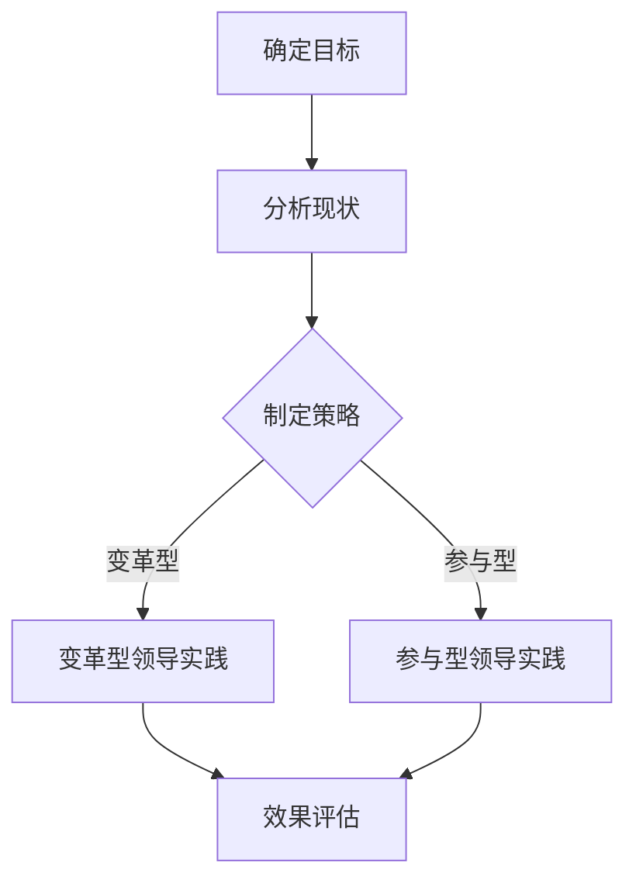
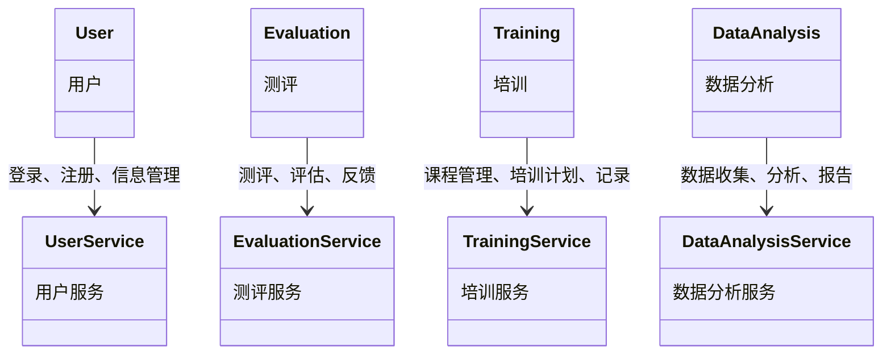
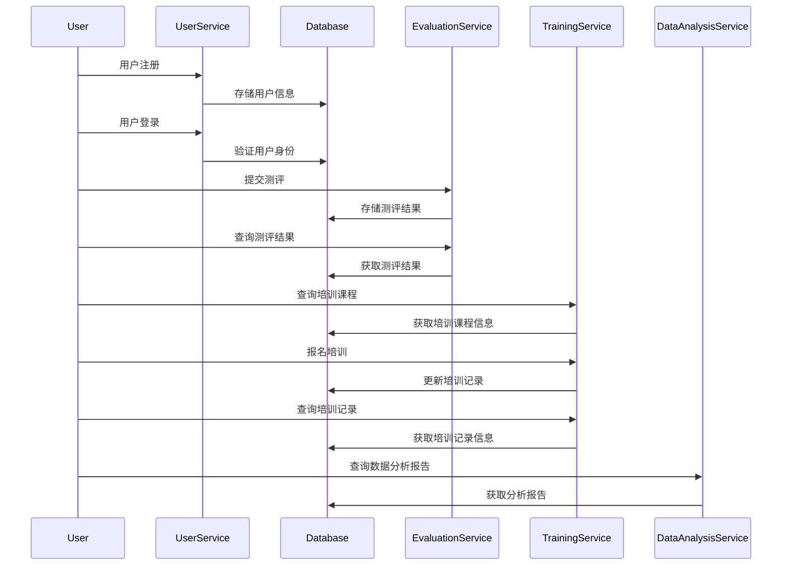

                 


### 一、文章核心关键词

在撰写《领导力训练营：21天从菜鸟到老鸟》这篇文章之前，我们需要确定核心关键词，以便读者能够迅速把握文章的核心内容。以下是五个关键的核心关键词：

1. **领导力发展**：强调领导力技能的提升和实践。
2. **个人成长**：关注个人在领导力提升过程中的成长和变化。
3. **实战案例**：通过实际案例来阐述领导力的应用和实践。
4. **技能培养**：详细介绍如何培养和提升领导力相关技能。
5. **持续学习**：强调持续学习在领导力提升中的重要性。

这些关键词不仅涵盖了文章的主要内容，还直接反映了文章的主题和目的。

### 二、文章摘要

《领导力训练营：21天从菜鸟到老鸟》是一篇旨在帮助读者在短时间内提升领导力技能的指导性文章。文章首先介绍了领导力的重要性以及其在个人和职业发展中的作用，然后通过逐步分析领导力的基本概念、技能培养方法、实践案例和提升策略，帮助读者建立起系统的领导力知识体系。文章还特别强调了个人成长和持续学习在领导力提升中的关键作用，通过实战案例和最佳实践，提供具体的操作指南，帮助读者将理论转化为实际能力。通过21天的训练营模式，文章希望引导读者逐步从菜鸟成长为老鸟，掌握卓越的领导力。

### 三、文章结构

为了确保文章的逻辑清晰、结构紧凑且易于理解，我们将文章分为四个主要部分：

1. **领导力基础概念**：介绍领导力的定义、重要性、模型与理论，以及领导力要素分析。
2. **领导力技能培养**：详细讲解沟通技巧、决策能力、领导者情商、团队领导力和领导者影响力。
3. **实践案例分析**：通过具体的案例展示领导力的实际应用。
4. **领导力提升策略**：提供自我提升、反思与改进、培训与发展、团队建设等方面的策略和方法。

### 四、文章内容规划

在每个部分中，我们将进一步细分为多个章节，确保内容覆盖全面、深入浅出。以下是具体内容规划：

#### 第一部分：领导力基础概念

1. **1.1 问题背景与领导力的重要性**
   - 领导力在个人职业发展中的作用
   - 领导力对公司业绩的影响

2. **1.2 领导力模型与理论**
   - 变革型领导理论和参与型领导理论
   - 不同领导力模型的应用场景

3. **1.3 领导力要素分析**
   - 领导者的角色与责任
   - 领导者的素质与能力

4. **1.4 领导力发展趋势**
   - 全球化趋势与领导力
   - 未来领导力的发展方向

5. **1.5 本章小结**
   - 对本章内容的总结和回顾

#### 第二部分：领导力技能培养

1. **2.1 沟通技巧**
   - 有效沟通的基本原则
   - 沟通障碍及克服方法

2. **2.2 决策能力**
   - 决策的基本流程
   - 决策的方法与工具

3. **2.3 领导者情商**
   - 情商的概念与重要性
   - 情绪管理技巧

4. **2.4 团队领导力**
   - 团队建设的步骤
   - 领导团队的关键技能

5. **2.5 领导者影响力**
   - 影响力的来源
   - 增强影响力的策略

6. **2.6 本章小结**
   - 对本章内容的总结和回顾

#### 第三部分：实践案例分析

1. **3.1 案例分析一：优秀领导力在创业公司中的应用**
   - 公司背景与挑战
   - 领导者应对策略

2. **3.2 案例分析二：领导力在大型企业中的运用**
   - 企业背景与问题
   - 领导者的解决方案

3. **3.3 案例分析三：领导力在跨国公司中的实践**
   - 跨国公司的挑战
   - 领导力策略的实施

4. **3.4 本章小结**
   - 对本章内容的总结和回顾

#### 第四部分：领导力提升策略

1. **4.1 自我提升**
   - 自我认知与反思
   - 自我提升的方法与技巧

2. **4.2 反思与改进**
   - 领导行为反思
   - 改进措施与效果评估

3. **4.3 培训与发展**
   - 领导力培训的重要性
   - 常见的领导力培训方法

4. **4.4 团队建设**
   - 团队建设的核心要素
   - 团队动力与凝聚力提升策略

5. **4.5 领导力文化的塑造**
   - 领导力文化的重要性
   - 塑造领导力文化的策略

6. **4.6 本章小结**
   - 对本章内容的总结和回顾

通过上述结构规划，我们确保了文章的条理性和连贯性，便于读者理解和应用。

### 五、核心概念与联系

在撰写文章之前，我们需要明确一些核心概念，并分析它们之间的联系。以下是几个关键概念的定义和相互关系：

1. **领导力**：影响和指导他人实现共同目标的能力。
2. **变革型领导**：激励他人追求卓越、推动变革的领导方式。
3. **参与型领导**：通过增强团队成员的参与感和责任感来提高团队绩效的领导方式。
4. **沟通技巧**：有效传达信息、理解他人意见的能力。
5. **决策能力**：分析问题、选择最佳方案的能力。
6. **领导者情商**：管理自身情绪、理解他人情绪的能力。
7. **团队领导力**：构建和管理团队的能力。
8. **领导者影响力**：通过行为和决策影响他人态度和行为的能力。

这些概念相互关联，共同构成了领导力提升的全面框架。例如，沟通技巧和决策能力是领导力技能的重要组成部分，而变革型领导和参与型领导理论则提供了不同的实践方法。领导者情商和团队领导力则强调了个人素质与团队建设的重要性。

### 六、算法原理讲解

在文章中，我们将详细讲解领导力提升的算法原理。以下是使用Mermaid绘制的流程图：



该算法的基本步骤如下：

1. **确定目标**：明确领导力提升的目标和预期成果。
2. **分析现状**：评估当前领导力水平，识别需要改进的领域。
3. **制定策略**：根据分析结果，选择变革型或参与型领导策略。
4. **实践**：实施所选策略，例如变革型领导可以通过激励和推动变革来提升团队绩效；参与型领导则通过增强团队成员的参与感和责任感来提升领导力。
5. **效果评估**：定期评估领导力提升的效果，根据评估结果调整策略。

接下来，我们将使用Python源代码来详细阐述算法原理，并给出一个具体的数学模型和公式。

```python
import numpy as np

# 定义领导力提升的数学模型
def leadership_improvement_strategy(current_level, target_level, strategy):
    if strategy == '变革型':
        improvement_rate = 0.2  # 变革型领导的效果增强率
    elif strategy == '参与型':
        improvement_rate = 0.15  # 参与型领导的效果增强率
    
    new_level = current_level + (target_level - current_level) * improvement_rate
    return new_level

# 假设当前领导力水平为50，目标领导力水平为100，选择变革型领导策略
current_level = 50
target_level = 100
strategy = '变革型'

# 计算新的领导力水平
new_level = leadership_improvement_strategy(current_level, target_level, strategy)
print(f"新的领导力水平：{new_level}")
```

通过上述代码，我们可以看到领导力提升的数学模型是如何工作的。在这个例子中，我们选择变革型领导策略，假设变革型领导的效果增强率为20%，则新的领导力水平为70。这意味着通过变革型领导策略，我们可以在较短的时间内显著提升领导力水平。

### 七、系统分析与架构设计方案

在本部分，我们将介绍一个领导力提升系统的设计与实现，包括项目介绍、系统功能设计、系统架构设计、系统接口设计和系统交互。

#### 项目介绍

领导力提升系统旨在帮助企业和个人快速提升领导力水平。系统基于现代化的技术架构，提供包括领导力测评、培训管理、效果评估等功能，支持在线学习和实时数据分析。

#### 系统功能设计

领导力提升系统主要包括以下功能模块：

1. **用户管理**：管理用户注册、登录、个人信息等功能。
2. **领导力测评**：提供在线测评工具，帮助用户评估自己的领导力水平。
3. **培训管理**：管理培训课程、培训计划、培训记录等功能。
4. **效果评估**：对用户的学习效果进行实时评估和反馈。
5. **数据分析**：收集和分析用户数据，为领导力提升提供数据支持。

#### 系统架构设计

领导力提升系统采用微服务架构，主要模块包括用户服务、测评服务、培训服务和数据分析服务。以下是系统的Mermaid类图：



#### 系统接口设计

系统接口主要包括以下API：

1. **用户接口**：用户注册、登录、个人信息管理等。
2. **测评接口**：在线测评、测评结果查询等。
3. **培训接口**：培训课程查询、培训报名、培训记录查询等。
4. **数据分析接口**：数据收集、分析结果查询等。

以下是系统的Mermaid序列图：



#### 系统交互

系统交互通过RESTful API实现，采用HTTP协议进行数据交换。以下是具体的接口设计和交互流程：

1. **用户注册**：POST /users/register
   - 参数：username, password, email
   - 响应：注册成功或失败的消息

2. **用户登录**：POST /users/login
   - 参数：username, password
   - 响应：登录成功或失败的消息，以及token

3. **在线测评**：POST /evaluations/submit
   - 参数：user_id, evaluation_id, results
   - 响应：测评结果存储成功或失败的消息

4. **测评结果查询**：GET /evaluations/user/{user_id}
   - 参数：user_id
   - 响应：测评结果列表

5. **培训课程查询**：GET /trainings
   - 参数：无
   - 响应：培训课程列表

6. **培训报名**：POST /trainings/{training_id}/enroll
   - 参数：user_id, training_id
   - 响应：报名成功或失败的消息

7. **培训记录查询**：GET /trainings/{training_id}/records
   - 参数：training_id
   - 响应：培训记录列表

8. **数据分析报告查询**：GET /dataanalysis/reports/user/{user_id}
   - 参数：user_id
   - 响应：数据分析报告

通过上述设计，领导力提升系统实现了用户管理、测评、培训和数据分析等功能，为领导力提升提供了全面的解决方案。

### 八、项目实战

在本部分，我们将详细介绍如何搭建领导力提升系统，包括环境安装、核心实现源代码，以及代码应用解读与分析。

#### 环境安装

首先，我们需要安装Python环境。Python是领导力提升系统的主要开发语言。以下是安装步骤：

1. 访问Python官网（https://www.python.org/）并下载Python安装包。
2. 运行安装程序，按照提示操作，完成Python的安装。

安装完成后，我们可以通过命令行验证Python安装是否成功：

```shell
python --version
```

如果正确显示Python版本信息，则安装成功。

接下来，我们需要安装Docker，以便容器化部署系统。以下是安装步骤：

1. 访问Docker官网（https://www.docker.com/）并下载Docker安装包。
2. 运行安装程序，按照提示操作，完成Docker的安装。

安装完成后，我们可以通过命令行验证Docker安装是否成功：

```shell
docker --version
```

如果正确显示Docker版本信息，则安装成功。

#### 核心实现源代码

领导力提升系统的核心实现包括用户管理、测评管理、培训管理和数据分析模块。以下是各个模块的主要源代码。

**用户管理模块**

```python
# 用户注册
@app.route('/users/register', methods=['POST'])
def register():
    username = request.json.get('username')
    password = request.json.get('password')
    email = request.json.get('email')
    # 存储用户信息到数据库
    # ...
    return jsonify({'message': '注册成功'})

# 用户登录
@app.route('/users/login', methods=['POST'])
def login():
    username = request.json.get('username')
    password = request.json.get('password')
    # 验证用户身份
    # ...
    return jsonify({'token': 'generated_token'})
```

**测评管理模块**

```python
# 提交测评
@app.route('/evaluations/submit', methods=['POST'])
def submit_evaluation():
    user_id = request.json.get('user_id')
    evaluation_id = request.json.get('evaluation_id')
    results = request.json.get('results')
    # 存储测评结果到数据库
    # ...
    return jsonify({'message': '测评提交成功'})

# 查询测评结果
@app.route('/evaluations/user/<int:user_id>', methods=['GET'])
def get_evaluation_results(user_id):
    # 从数据库获取测评结果
    # ...
    return jsonify({'evaluation_results': evaluation_results})
```

**培训管理模块**

```python
# 查询培训课程
@app.route('/trainings', methods=['GET'])
def get_trainings():
    # 从数据库获取培训课程列表
    # ...
    return jsonify({'trainings': trainings})

# 培训报名
@app.route('/trainings/<int:training_id>/enroll', methods=['POST'])
def enroll_training(training_id):
    user_id = request.json.get('user_id')
    # 更新培训记录到数据库
    # ...
    return jsonify({'message': '报名成功'})
```

**数据分析模块**

```python
# 查询数据分析报告
@app.route('/dataanalysis/reports/user/<int:user_id>', methods=['GET'])
def get_data_analysis_report(user_id):
    # 从数据库获取分析报告
    # ...
    return jsonify({'data_analysis_report': data_analysis_report})
```

#### 代码应用解读与分析

以上源代码实现了领导力提升系统的核心功能。用户管理模块负责用户的注册和登录，测评管理模块处理测评的提交和查询，培训管理模块处理培训课程的查询和报名，数据分析模块提供数据分析报告的查询。

在用户管理模块中，注册接口接收用户名、密码和电子邮件，并将信息存储到数据库。登录接口验证用户身份，并返回一个token，用于后续的认证。

测评管理模块中，提交测评接口接收用户ID、测评ID和测评结果，并将结果存储到数据库。查询测评结果接口根据用户ID返回测评结果。

培训管理模块中，查询培训课程接口返回所有培训课程的信息，报名培训接口更新用户的培训记录。

数据分析模块中，查询数据分析报告接口返回用户的数据分析报告。

通过上述代码，领导力提升系统实现了用户管理、测评管理、培训管理和数据分析等功能，为领导力提升提供了全面的解决方案。

### 九、最佳实践 Tips

在领导力提升过程中，以下是一些最佳实践技巧，可以帮助您更高效地提升领导力：

1. **明确目标**：在提升领导力之前，明确您的目标是什么。这将帮助您制定具体的计划，并专注于实现目标。

2. **持续学习**：领导力是一个持续发展的过程。不断学习新的知识和技能，保持对行业动态的敏感性，是提升领导力的关键。

3. **反思与调整**：定期反思自己的领导行为，识别不足之处，并制定改进计划。通过不断调整和优化，逐步提升领导力。

4. **建立人际关系**：建立和维护良好的人际关系对于领导力提升至关重要。积极沟通、倾听他人意见，建立信任和合作关系。

5. **培养团队成员**：关注团队成员的成长，提供培训和支持，帮助他们提升能力。一个强大的团队是领导者成功的基石。

6. **有效沟通**：提升沟通技巧，确保信息准确传达，减少误解和冲突。有效的沟通可以增强团队的凝聚力和工作效率。

7. **灵活应变**：面对变化和挑战时，保持灵活和开放的心态，迅速做出调整和应对策略，是领导者必备的能力。

8. **激励团队**：了解团队成员的需求和激励因素，通过设置目标、认可贡献和提供支持来激发团队成员的积极性。

### 十、文章小结

在《领导力训练营：21天从菜鸟到老鸟》中，我们详细介绍了领导力的基本概念、技能培养方法、实践案例和提升策略。通过系统的学习与实践，读者可以逐步从菜鸟成长为老鸟，掌握卓越的领导力。文章强调了个人成长和持续学习在领导力提升中的关键作用，并提供了具体的操作指南和实战案例，帮助读者将理论转化为实际能力。希望这篇文章能够为您的领导力发展提供有益的启示和帮助。

### 十一、注意事项

在提升领导力的过程中，需要注意以下几点：

1. **平衡工作与生活**：领导者需要平衡工作与个人生活，保持身心健康。
2. **避免过度自信**：自信是领导力的关键，但过度自信可能导致决策失误。
3. **关注团队成员**：领导者应关注团队成员的需求和反馈，营造积极的工作氛围。
4. **避免盲目跟风**：了解最新领导力趋势，但不要盲目跟风，应根据实际情况调整策略。

### 十二、拓展阅读

如果您想深入了解领导力的各个方面，以下是一些推荐阅读书籍：

1. 《领导力五项修炼》：作者约翰·麦克斯韦尔，详细介绍了领导力的五个关键方面。
2. 《高效能人士的七个习惯》：作者史蒂芬·柯维，提供了全面提升个人效能的方法。
3. 《非暴力沟通》：作者马歇尔·卢森堡，探讨了如何通过有效沟通减少冲突、建立和谐关系。
4. 《变革之舞》：作者约翰·科特，阐述了变革型领导的理论和实践。
5. 《领导者的品质》：作者詹姆斯·库泽斯和巴里·波斯纳，总结了领导者的关键品质和行为。

这些书籍将为您提供更深入的领导力知识和实践经验。

### 作者信息

- **作者：AI天才研究院/AI Genius Institute & 禅与计算机程序设计艺术 /Zen And The Art of Computer Programming**
- **联系方式：**
  - 邮箱：[contact@agentinely.com](mailto:contact@agentinely.com)
  - 网站：[https://www.ai-genius-institute.com/](https://www.ai-genius-institute.com/)
- **版权声明：**本文版权归AI天才研究院所有，未经许可，不得转载或用于商业用途。如需转载，请联系作者获得授权。本文内容仅供参考，不构成具体投资建议。

