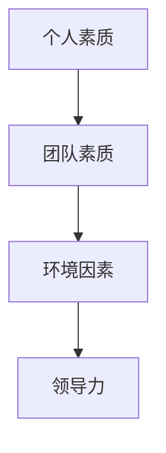

                 

# 《领导力训练：让你的团队天下无敌》

## 关键词：
- 领导力训练
- 团队管理
- 激励方法
- 领导风格
- 企业发展

## 摘要：
本文深入探讨了领导力训练在团队管理中的重要性，分析了领导力的核心概念、原理和实践方法。通过详细的理论分析和实际案例，本文旨在为企业管理者提供一套系统的领导力提升策略，帮助其打造一个高效、团结、无敌的团队。

## 第一部分：领导力基础理论

### 第1章：领导力概述

#### 1.1 领导力的重要性

领导力是团队管理的核心要素，直接影响团队效能和整体业绩。在信息化时代，领导力不仅关乎团队内部的协调和沟通，更关系到企业对外部环境的适应和竞争能力。

#### 1.1.1 领导力在团队中的角色

领导力在团队中扮演着协调者、激励者、愿景规划者和危机处理者的角色。有效的领导力可以激发团队成员的潜能，提升团队凝聚力，实现团队目标。

#### 1.1.2 领导力对企业发展的影响

领导力对企业发展的作用不容忽视。优秀的领导力能够引领企业不断创新，应对市场变化，实现持续增长。

#### 1.1.3 领导力的边界与外延

领导力的边界包括对团队、组织甚至行业的影响力。领导力的外延涉及到管理、沟通、决策、创新等多个方面。

### 1.2 核心概念与联系

领导力的核心概念包括影响力、愿景、决策、沟通等。这些概念相互联系，共同构成了领导力的基础框架。

#### 1.2.1 领导力的定义

领导力是一种激励和引导他人共同实现目标的能力。它不仅包括对团队的领导，还包括对组织的引领。

#### 1.2.2 领导力与管理的区别

领导力关注的是激励和愿景，而管理注重的是执行和控制。领导力与管理相辅相成，共同推动团队和组织的发展。

#### 1.2.3 领导力的核心要素组成

领导力的核心要素包括个人素质、团队素质和环境因素。这些要素相互作用，共同决定了领导力的强度和效果。

### 1.3 主流领导力理论简介

主流领导力理论包括传统领导力理论和现代领导力理论。传统领导力理论强调权威和命令，现代领导力理论则注重沟通和协作。

#### 1.3.1 传统领导力理论

传统领导力理论认为领导者的角色是命令和控制。这种理论在稳定的环境下具有一定的效果，但在快速变化的时代，其局限性逐渐显现。

#### 1.3.2 现代领导力理论

现代领导力理论强调领导者的角色是激发和引导团队成员的潜力。这种理论更加注重团队建设、沟通和创新。

#### 1.3.3 领导力理论的发展趋势

领导力理论的发展趋势是向更加人性化和协作化的方向发展。未来领导力将更加注重员工的成长和自我实现。

### 1.4 领导力的基本模型

领导力的基本模型包括领导力三要素模型、四要素模型和五要素模型。这些模型为我们理解和应用领导力提供了理论框架。

#### 1.4.1 领导力三要素模型

领导力三要素模型包括个人素质、团队素质和环境因素。这个模型强调领导力是个人、团队和环境相互作用的综合结果。

#### 1.4.2 领导力四要素模型

领导力四要素模型在领导力三要素模型的基础上，增加了领导风格这一要素。这个模型强调领导风格对领导力效果的影响。

#### 1.4.3 领导力五要素模型

领导力五要素模型在领导力四要素模型的基础上，增加了决策和愿景这两个要素。这个模型更加全面地描述了领导力的内涵。

### 1.5 本章小结

本章对领导力进行了系统的概述，分析了领导力在团队管理中的重要性，介绍了领导力的核心概念和基本模型。这些内容为后续章节的深入探讨提供了基础。

## 第二部分：领导力的核心概念与原理

### 第2章：领导力的核心概念与原理

#### 2.1 领导力原理

领导力原理是领导力理论的核心。它包括以下几个方面：

##### 2.1.1 领导力原理概述

领导力原理是关于如何激发、引导和管理团队成员实现共同目标的一系列原则和方法。

##### 2.1.2 领导力原理的属性特征对比表格

| 属性特征       | 传统领导力原理 | 现代领导力原理 |
|----------------|----------------|----------------|
| 权威性         | 高             | 低             |
| 指令性         | 强             | 弱             |
| 沟通方式       | 单向           | 双向           |
| 环境适应性     | 弱             | 强             |

##### 2.1.3 领导力原理的ER实体关系图架构

```mermaid
erDiagram
    Entity A : 领导者
    Entity B : 团队成员
    Entity C : 愿景
    Entity D : 目标
    Entity A --> Entity B : 激励
    Entity B --> Entity D : 实现
    Entity A --> Entity C : 规划
    Entity C --> Entity D : 指导
```

#### 2.2 数学模型与公式

领导力可以用数学模型来描述。一个简单的领导力模型可以表示为：

$$
\text{领导力} = f(\text{个人素质}, \text{团队素质}, \text{环境因素})
$$

这个公式表示领导力是个人素质、团队素质和环境因素共同作用的结果。

##### 2.2.1 领导力数学模型



##### 2.2.2 领导力公式详解

领导力公式中的各个因素都可以通过量化方法来评估。例如，个人素质可以包括领导者的知识、技能、经验等，团队素质可以包括团队成员的技能、合作性、积极性等，环境因素可以包括组织的文化、市场环境、竞争态势等。

##### 2.2.3 领导力公式的实际应用举例

假设一个团队的领导者具有优秀的个人素质，团队成员的素质也很高，同时处于一个良好的环境，那么这个团队的领导力将非常强大。反之，如果领导者个人素质较低，团队成员的素质不高，或者处于一个恶劣的环境，那么这个团队的领导力将受到很大影响。

#### 2.3 领导力原理的应用

领导力原理不仅是一个理论框架，更是一个实践工具。在实际应用中，领导力原理可以帮助领导者更好地管理团队，实现团队目标。

##### 2.3.1 领导力在团队建设中的应用

在团队建设中，领导力原理可以帮助领导者识别团队成员的优势和不足，合理分配任务，激发团队成员的潜力。

##### 2.3.2 领导力在项目管理中的应用

在项目管理中，领导力原理可以帮助领导者制定项目目标，规划项目进度，协调团队成员的工作。

##### 2.3.3 领导力在企业战略制定中的应用

在企业战略制定中，领导力原理可以帮助领导者分析市场环境，制定企业愿景，指导企业的发展方向。

### 2.4 本章小结

本章对领导力的核心概念和原理进行了深入分析。通过数学模型和实际应用举例，我们更好地理解了领导力的内涵和作用。这些内容为后续的领导力训练和实践提供了理论基础。

## 第三部分：领导风格与团队激励

### 第3章：领导风格与团队激励

#### 3.1 领导风格

领导风格是领导者管理团队的方式和方法。不同的领导风格会对团队产生不同的影响。

##### 3.1.1 领导风格的定义

领导风格是指领导者在与团队成员互动和指导过程中表现出的行为特征和态度。

##### 3.1.2 主流领导风格理论

主流领导风格理论包括专制型领导、民主型领导和放任型领导。

###### 3.1.2.1 专制型领导

专制型领导强调领导者的权威和决策权，团队成员参与度较低。

###### 3.1.2.2 民主型领导

民主型领导鼓励团队成员参与决策，注重团队协作。

###### 3.1.2.3 放任型领导

放任型领导给予团队成员充分的自由和空间，领导者较少干预。

##### 3.1.3 领导风格与团队效能的关系

不同的领导风格对团队效能产生不同的影响。专制型领导可能在短期内提高效率，但长期来看会损害团队凝聚力。民主型领导和放任型领导则更注重团队的发展和成员的成长。

#### 3.2 团队激励

团队激励是领导者激发团队成员积极性和创造力的方法。

##### 3.2.1 团队激励的重要性

团队激励是提升团队效能的关键因素。有效的激励可以激发团队成员的潜能，提高团队的整体表现。

##### 3.2.2 团队激励的方法与技巧

团队激励的方法和技巧包括目标设定、奖励制度、认可和反馈等。

###### 3.2.2.1 目标设定

明确的目标可以激发团队成员的积极性，帮助他们明确工作方向。

###### 3.2.2.2 奖励制度

奖励制度可以激励团队成员追求卓越，提高工作效率。

###### 3.2.2.3 认可和反馈

领导者对团队成员的认可和反馈可以增强团队成员的自信心，提高工作满意度。

##### 3.2.3 激励理论在领导力中的应用

激励理论在领导力中的应用包括目标设置理论、期望理论、公平理论等。

###### 3.2.3.1 目标设置理论

目标设置理论认为，明确、具体和具有挑战性的目标可以激发团队成员的积极性。

###### 3.2.3.2 期望理论

期望理论认为，团队成员的行为取决于他们对结果的期望和结果的价值。

###### 3.2.3.3 公平理论

公平理论认为，团队成员会比较自己的努力和回报，如果感到公平，他们会更加努力工作。

#### 3.3 领导风格与团队激励的协同作用

领导风格和团队激励是相辅相成的。合适的领导风格可以增强团队激励的效果，而有效的激励也可以提升领导风格的影响。

##### 3.3.1 领导风格与团队激励的相互作用

领导风格和团队激励的相互作用可以增强团队的整体效能。

###### 3.3.1.1 领导风格的优化

合适的领导风格可以激发团队成员的潜力，提高团队的整体表现。

###### 3.3.1.2 激励的有效实施

有效的激励可以增强团队成员的积极性和创造力，提升团队效能。

##### 3.3.2 领导风格与团队激励的最佳组合

不同的领导风格和团队激励方法适合不同的团队和环境。

###### 3.3.2.1 专制型领导与奖励制度

专制型领导与奖励制度的组合可以在短期内提高团队效率，但在长期会损害团队凝聚力。

###### 3.3.2.2 民主型领导与目标设定

民主型领导与目标设定的组合可以激发团队成员的积极性和创造力，提高团队的整体效能。

##### 3.3.3 实战案例解析

以下是一个实际的案例解析：

在一个创业公司中，领导者采用的是民主型领导风格，鼓励团队成员参与决策。同时，公司实施了目标设定和奖励制度，为团队成员提供了明确的工作目标和奖励机制。

这种领导风格和激励方法的组合使得团队成员的积极性得到了极大的激发，公司的业绩也取得了显著的增长。案例解析表明，合适的领导风格和有效的激励是提升团队效能的关键。

### 3.4 本章小结

本章对领导风格和团队激励进行了深入探讨，分析了不同领导风格的特点和团队激励的方法与技巧。通过实际案例的解析，我们看到了领导风格和团队激励的最佳组合是如何提升团队效能的。这些内容为领导者提供了实用的指导。

## 第四部分：领导力发展与实践

### 第4章：领导力发展路径

#### 4.1 领导力发展路径

领导力的发展是一个长期的过程，需要领导者不断地学习和实践。

##### 4.1.1 领导力发展阶段的划分

领导力发展可以划分为以下几个阶段：

1. **认知阶段**：领导者开始认识到领导力的重要性，意识到自己需要提升领导能力。
2. **实践阶段**：领导者通过实践，不断积累领导经验，提高自己的领导能力。
3. **反思阶段**：领导者通过反思自己的行为和决策，不断优化自己的领导方式。
4. **成熟阶段**：领导者已经具备成熟的领导能力，能够灵活应对各种挑战。

##### 4.1.2 领导力发展的关键能力

领导力发展的关键能力包括：

1. **沟通能力**：领导者需要具备良好的沟通能力，能够有效地与团队成员沟通，传达信息。
2. **决策能力**：领导者需要能够快速做出决策，并对决策结果负责。
3. **团队管理能力**：领导者需要能够有效管理团队，协调团队成员的工作，激发团队成员的潜力。
4. **创新能力**：领导者需要具备创新能力，能够引领团队进行创新，推动企业的发展。

##### 4.1.3 领导力发展策略

领导力发展策略包括以下几个方面：

1. **持续学习**：领导者需要不断学习新的知识和技能，保持与时俱进。
2. **实践锻炼**：领导者需要通过实践，不断积累领导经验，提高自己的领导能力。
3. **反思总结**：领导者需要通过反思自己的行为和决策，不断优化自己的领导方式。
4. **寻求反馈**：领导者需要积极寻求团队成员的反馈，了解自己的优点和不足，不断改进。

#### 4.2 实践中的领导力训练

领导力训练是提升领导者能力的重要手段。以下是一些常用的领导力训练方法：

##### 4.2.1 领导力训练的方法

1. **案例研究**：通过研究成功的领导案例，了解领导者的决策过程和领导风格。
2. **角色扮演**：通过模拟实际工作场景，让领导者实践领导技能。
3. **团队建设活动**：通过团队建设活动，增强领导者与团队成员的互动和沟通。
4. **领导力课程**：参加专业的领导力课程，学习领导理论和实践技巧。

##### 4.2.2 领导力训练的工具

1. **360度反馈**：通过团队成员、上级和下属的反馈，了解领导者的优点和不足。
2. **领导力评估工具**：使用专业的领导力评估工具，对领导者的领导能力进行评估。
3. **领导力发展计划**：制定个性化的领导力发展计划，明确领导者的提升目标和行动计划。

##### 4.2.3 领导力训练案例解析

以下是一个实际的领导力训练案例：

在一个大型企业中，公司为中层管理者提供了为期三个月的领导力训练项目。该项目包括案例研究、角色扮演、团队建设活动和领导力课程。通过这些训练，管理者们不仅学习了领导理论，还通过实践锻炼了领导技能。在训练结束后，公司的业绩得到了显著提升，团队凝聚力也明显增强。

### 4.3 领导力评估与反馈

领导力评估与反馈是领导者提升领导能力的重要环节。

##### 4.3.1 领导力评估的重要性

领导力评估可以帮助领导者了解自己的领导能力，发现自身的优点和不足，从而有针对性地进行提升。

##### 4.3.2 领导力评估的方法

领导力评估的方法包括：

1. **360度反馈**：通过团队成员、上级和下属的反馈，全面了解领导者的领导能力。
2. **领导力评估工具**：使用专业的领导力评估工具，对领导者的领导能力进行量化评估。
3. **自我评估**：领导者通过自我反思，评估自己的领导能力。

##### 4.3.3 领导力反馈机制

领导力反馈机制包括以下几个方面：

1. **定期反馈**：定期收集团队成员和上级的反馈，及时了解领导者的表现。
2. **个性化反馈**：针对领导者的优点和不足，提供个性化的反馈和建议。
3. **持续反馈**：建立持续的反馈机制，帮助领导者不断优化自己的领导方式。

### 4.4 本章小结

本章对领导力发展路径和领导力训练方法进行了深入探讨。通过领导力评估与反馈，领导者可以更好地了解自己的领导能力，有针对性地进行提升。这些内容为领导者提供了实用的指导。

## 第五部分：领导力在复杂环境中的应用

### 第5章：领导力在复杂环境中的应用

#### 5.1 复杂环境下的领导力挑战

在复杂环境中，领导者面临着诸多挑战。

##### 5.1.1 复杂环境的特征

复杂环境的特征包括：

1. **不确定性**：复杂环境中，各种因素的变化难以预测。
2. **多变性**：复杂环境中，市场和技术的发展速度极快。
3. **竞争激烈**：复杂环境中，竞争者的数量和实力不断增强。

##### 5.1.2 复杂环境对领导力的要求

复杂环境对领导力提出了更高的要求：

1. **适应性**：领导者需要具备快速适应环境变化的能力。
2. **创新性**：领导者需要具备创新思维，能够引领团队不断突破。
3. **决策能力**：领导者需要能够在复杂环境中做出正确的决策。

##### 5.1.3 复杂环境下的领导力策略

在复杂环境下，领导者可以采取以下策略：

1. **灵活应对**：领导者需要具备灵活应对变化的能力，迅速调整团队策略。
2. **团队合作**：领导者需要加强团队建设，提高团队的协作能力。
3. **持续学习**：领导者需要不断学习新知识，提升自身的领导能力。

#### 5.2 领导力在变化环境中的应用

在变化环境中，领导力的重要性尤为突出。

##### 5.2.1 变化环境下的领导力挑战

变化环境下的领导力挑战包括：

1. **信息过载**：领导者需要处理大量信息，快速做出决策。
2. **不确定性**：领导者需要应对环境的不确定性，保持团队的稳定。
3. **变革管理**：领导者需要引领团队进行变革，适应新的环境。

##### 5.2.2 变化环境下的领导力策略

在变化环境下，领导者可以采取以下策略：

1. **信息管理**：领导者需要建立有效的信息管理系统，提高信息处理能力。
2. **风险管理**：领导者需要建立健全的风险管理机制，降低环境变化带来的风险。
3. **变革引领**：领导者需要具备变革引领能力，推动团队进行变革。

##### 5.2.3 变化环境下的领导力实践

以下是一个实际的变化环境下的领导力实践案例：

在一个快速发展的科技公司中，领导者面临着激烈的市场竞争和技术变革。为了应对这些挑战，领导者采取了以下策略：

1. **信息管理**：领导者建立了快速响应的市场调研系统，及时获取市场信息，指导团队决策。
2. **风险管理**：领导者建立了完善的风险评估机制，对项目进行风险评估，降低风险。
3. **变革引领**：领导者积极推动团队进行技术变革，引入新技术，提高竞争力。

通过这些策略，公司成功应对了市场竞争和技术变革，取得了显著的发展。

#### 5.3 领导力在危机管理中的应用

在危机管理中，领导力的重要性更加突出。

##### 5.3.1 危机管理的领导力角色

危机管理中，领导者的角色包括：

1. **决策者**：领导者需要在危机中做出快速、正确的决策。
2. **协调者**：领导者需要协调各方资源，共同应对危机。
3. **沟通者**：领导者需要与团队成员和外部利益相关者进行有效沟通。

##### 5.3.2 危机管理的领导力策略

在危机管理中，领导者可以采取以下策略：

1. **快速响应**：领导者需要快速响应危机，制定应对方案。
2. **资源整合**：领导者需要整合各方资源，共同应对危机。
3. **沟通协调**：领导者需要与团队成员和外部利益相关者保持有效沟通，共同应对危机。

##### 5.3.3 危机管理案例解析

以下是一个实际的危机管理案例解析：

在一次突发事件中，一家大型企业的生产线发生了严重故障，导致生产停滞。为了应对这次危机，企业领导者采取了以下策略：

1. **快速响应**：领导者立即启动应急预案，组织相关人员迅速到达现场，制定应对方案。
2. **资源整合**：领导者协调企业内部资源，调动工程技术人员和设备，共同解决故障。
3. **沟通协调**：领导者与团队成员和外部供应商保持密切沟通，确保各方信息畅通，共同应对危机。

通过这些策略，企业成功应对了危机，恢复了生产。

### 5.4 本章小结

本章探讨了领导力在复杂环境、变化环境和危机管理中的应用。通过实际案例的解析，我们看到了领导力在应对复杂环境中的重要性。领导者需要具备快速适应变化、有效决策和沟通协调的能力，才能在复杂环境中取得成功。

## 总结与展望

本文从领导力的基础理论、核心概念、领导风格与团队激励、领导力发展与实践、领导力在复杂环境中的应用等方面进行了全面探讨。通过深入分析，我们了解到领导力在团队管理中的重要性，以及如何通过有效的领导力训练和实践，提升团队的效能。

在未来，领导力将面临更多的挑战和机遇。随着全球化、信息化和智能化的快速发展，领导者需要不断学习和适应新的环境，提升自身的领导能力。同时，领导者也需要更加注重团队建设，激发团队成员的潜力，实现共同目标。

我们期待，通过本文的探讨，能够为企业管理者提供有益的指导，帮助他们打造一个高效、团结、无敌的团队，推动企业的发展。

### 作者信息

- 作者：AI天才研究院/AI Genius Institute & 禅与计算机程序设计艺术 /Zen And The Art of Computer Programming

---

本文由AI天才研究院与禅与计算机程序设计艺术联合撰写，旨在为读者提供关于领导力训练的全面见解和实用策略。我们致力于推动人工智能和计算机科学领域的创新，助力企业实现持续发展。

