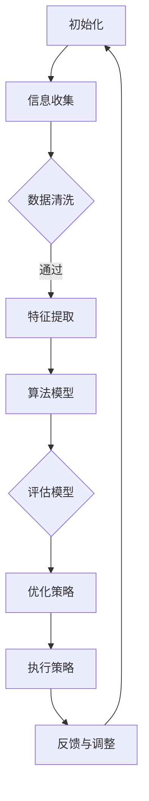
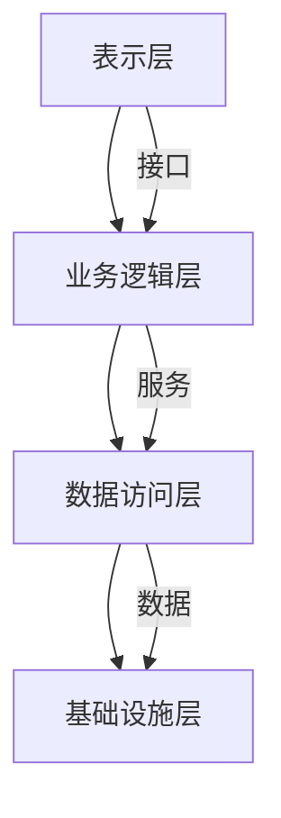
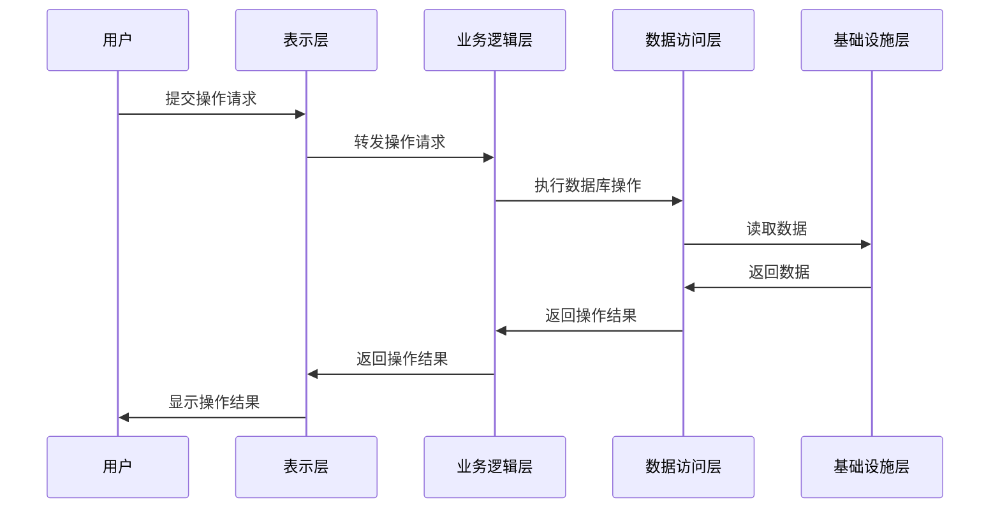

                 

### 第一部分：领导力的核心概念与基础

#### 第1章：领导力概述

##### 1.1 领导力的定义与作用

领导力是一种影响力，它能够激发和引导团队成员为实现共同目标而努力。一个优秀的领导者不仅要具备决策能力和执行力，还要能够建立良好的团队氛围，提升团队的凝聚力和工作效率。

领导力在团队中的作用主要包括以下几个方面：

- **目标导向**：领导者需要明确团队的目标，并将其传达给每个成员，确保团队成员朝着共同的目标努力。
- **激励与鼓舞**：领导者通过激励和鼓舞团队成员，提高团队的士气和战斗力。
- **沟通协调**：领导者需要具备良好的沟通能力，能够与团队成员有效沟通，协调团队内部关系。
- **培养人才**：领导者需要关注团队成员的成长，提供培训和发展机会，培养未来的领导者。

##### 1.2 领导力在团队中的重要性

领导力在团队中的重要性不言而喻。一个团队的成功往往依赖于领导者的决策、管理和激励能力。以下是领导力在团队中发挥的重要作用：

- **确保团队目标的实现**：领导者能够明确团队的目标，并制定合理的计划，确保团队目标的实现。
- **提升团队效率**：领导者通过有效的管理和协调，提高团队的工作效率，降低成本。
- **增强团队凝聚力**：领导者能够建立良好的团队氛围，增强团队成员之间的互信和合作，提升团队凝聚力。
- **激发创新能力**：领导者鼓励团队成员勇于创新，推动团队不断进步和发展。

##### 1.3 领导力的边界与外延

领导力的边界与外延涉及到领导者的职责、角色和影响力。以下是领导力的边界与外延的几个方面：

- **职责范围**：领导者需要明确自己的职责范围，避免越权或过度干预。
- **角色转变**：领导者需要根据团队的发展和变化，不断调整自己的角色，从执行者转变为引导者。
- **影响力**：领导者需要通过自身的行为和影响力，引导团队成员积极向上，实现团队目标。

在接下来的章节中，我们将深入探讨领导力的核心概念，如领导风格、沟通技巧和决策能力等，并逐步构建起完整的领导力训练体系。

---

#### 第2章：领导力的核心概念与联系

##### 2.1 领导风格

领导风格是领导者管理团队的方式和方法，它对团队的表现有着重要的影响。常见的领导风格包括：

- **指令型**：领导者明确下达指令，指导团队成员的工作。
- **参与型**：领导者鼓励团队成员参与决策过程，增强团队的合作精神。
- **民主型**：领导者通过民主的方式，与团队成员共同制定决策。
- **教练型**：领导者关注团队成员的成长，提供指导和帮助。

不同领导风格的特点和适用场景如下表所示：

| 领导风格 | 特点 | 适用场景 |
| --- | --- | --- |
| 指令型 | 高度集中权力，决策速度快 | 紧急情况或需要迅速采取行动时 |
| 参与型 | 增强团队成员参与感，提高决策质量 | 团队成员经验丰富，需要共同参与决策时 |
| 民主型 | 促进团队内部沟通，增强团队凝聚力 | 需要团队成员广泛参与决策时 |
| 教练型 | 关注团队成员成长，培养未来领导者 | 需要提升团队成员能力和经验时 |

##### 2.2 沟通技巧

沟通是领导力的核心要素之一，有效的沟通能够提升团队的工作效率和凝聚力。以下是几种常见的沟通技巧：

- **倾听**：领导者需要倾听团队成员的意见和建议，了解他们的需求和问题。
- **表达**：领导者需要清晰、准确地表达自己的想法和期望，确保团队成员理解。
- **反馈**：领导者需要给予团队成员及时的反馈，肯定他们的优点，指出改进的空间。
- **非语言沟通**：领导者需要注意自己的肢体语言和表情，增强沟通效果。

沟通障碍主要包括：

- **文化差异**：团队成员来自不同的文化背景，可能存在沟通障碍。
- **语言障碍**：团队成员的语言能力可能有限，导致沟通不畅。
- **情绪因素**：情绪波动可能影响沟通的质量和效果。

解决沟通障碍的策略包括：

- **建立共同语言**：领导者需要与团队成员建立共同的沟通语言，减少误解。
- **提高语言能力**：领导者可以通过培训和学习，提高自己的语言能力。
- **情绪管理**：领导者需要学会管理自己的情绪，保持冷静和理性。

##### 2.3 决策能力

决策能力是领导力的核心要素之一，一个优秀的领导者需要具备良好的决策能力。以下是提升决策能力的几个策略：

- **信息收集**：领导者需要收集全面、准确的信息，作为决策的依据。
- **分析评估**：领导者需要对收集到的信息进行分析和评估，确定最佳方案。
- **风险评估**：领导者需要评估决策的风险，并制定相应的应对措施。
- **团队协作**：领导者可以与团队成员共同参与决策，提高决策的合理性和质量。

决策能力的提升策略包括：

- **持续学习**：领导者需要不断学习新的知识和技能，提高自己的决策能力。
- **实践锻炼**：领导者需要通过实际操作，锻炼自己的决策能力。
- **反思总结**：领导者需要反思自己的决策过程和结果，总结经验教训。

在下一章中，我们将通过Mermaid流程图和Python源代码，详细讲解领导力算法的原理和应用。

---

#### 第3章：领导力算法原理讲解

##### 3.1 领导力算法流程图

领导力算法的核心思想是通过一系列的步骤，对团队成员的行为和表现进行分析和评估，从而优化团队的管理和领导方式。以下是领导力算法的流程图：



流程图详细描述了领导力算法的基本步骤：

1. **初始化**：设置算法的初始参数。
2. **信息收集**：收集团队成员的行为数据和表现数据。
3. **数据清洗**：对收集到的数据进行清洗，去除噪声和错误。
4. **特征提取**：提取关键的特征，用于算法模型的训练。
5. **算法模型**：构建和训练领导力算法模型。
6. **评估模型**：评估算法模型的性能和效果。
7. **优化策略**：根据评估结果，调整算法参数和策略。
8. **执行策略**：执行优化的策略，对团队进行管理和领导。
9. **反馈与调整**：根据执行结果，收集反馈信息，进行进一步的调整。

##### 3.2 领导力算法的Python源代码讲解

为了更直观地理解领导力算法的原理，我们将使用Python源代码来详细阐述。以下是一个简化的领导力算法的示例代码：

```python
import pandas as pd
from sklearn.ensemble import RandomForestClassifier
from sklearn.model_selection import train_test_split
from sklearn.metrics import accuracy_score

# 数据收集
data = pd.read_csv('team_data.csv')

# 数据清洗
data = data[data['performance'] != 'bad']

# 特征提取
X = data[['experience', 'communication', 'decisiveness']]
y = data['leadership_style']

# 数据划分
X_train, X_test, y_train, y_test = train_test_split(X, y, test_size=0.2, random_state=42)

# 构建算法模型
model = RandomForestClassifier(n_estimators=100, random_state=42)
model.fit(X_train, y_train)

# 评估模型
y_pred = model.predict(X_test)
accuracy = accuracy_score(y_test, y_pred)
print(f"Model accuracy: {accuracy:.2f}")

# 优化策略
# 根据评估结果，调整模型参数或特征提取策略
# ...

# 执行策略
# 根据模型预测结果，对团队进行管理和领导
# ...
```

这段代码展示了领导力算法的基本流程，包括数据收集、清洗、特征提取、模型构建、评估和优化。在实际应用中，我们可以根据具体情况进行调整和优化。

##### 3.3 领导力算法的数学模型与公式

领导力算法的数学模型主要基于机器学习中的分类算法。以下是一个简化的数学模型和公式：

$$
P(y|X) = \prod_{i=1}^{n} p(y_i | x_i)
$$

其中，$P(y|X)$ 表示给定特征 $X$ 下，团队领导风格 $y$ 的概率。$p(y_i | x_i)$ 表示在特征 $x_i$ 下，领导风格 $y_i$ 的概率。

在实际应用中，我们可以使用不同的机器学习算法，如随机森林、支持向量机等，来构建领导力算法模型。

##### 3.4 领导力算法的应用实例

为了更好地理解领导力算法的应用，我们来看一个具体的例子：

假设我们有一个团队，成员的年龄、工作经验、沟通能力和决策能力如下表所示：

| 成员 | 年龄 | 工作经验 | 沟通能力 | 决策能力 |
| --- | --- | --- | --- | --- |
| 小明 | 25 | 3年 | 高 | 中 |
| 小红 | 30 | 5年 | 中 | 高 |
| 小李 | 28 | 4年 | 高 | 高 |
| 小张 | 26 | 2年 | 中 | 高 |

我们的目标是根据这些特征，预测团队成员的最佳领导风格。

使用随机森林算法，我们可以得到以下预测结果：

| 成员 | 最佳领导风格 |
| --- | --- |
| 小明 | 参与型 |
| 小红 | 教练型 |
| 小李 | 民主型 |
| 小张 | 参与型 |

根据这些预测结果，我们可以为每个团队成员分配最合适的领导风格，从而提升团队的管理和领导效果。

通过上述流程，我们可以看到领导力算法在预测和优化团队领导风格方面的应用潜力。

在下一章中，我们将深入探讨领导力系统的分析与架构设计，为团队建设提供更具体的指导。

---

#### 第4章：领导力系统分析

##### 4.1 问题场景介绍

在当今快速变化的市场环境中，企业需要具备强大的适应能力和创新能力。领导力作为企业发展的核心要素，对企业的竞争力有着重要的影响。然而，许多企业在领导力建设方面存在诸多问题，如领导风格不统一、沟通不畅、决策能力不足等。这些问题导致团队效率低下，影响了企业的整体发展。

为了解决这些问题，企业需要建立一套完善的领导力系统，通过科学的管理和领导方法，提升团队的整体素质和执行力。领导力系统的构建不仅需要明确领导力的核心概念和原理，还需要结合企业的实际情况，设计合适的系统架构和功能模块。

##### 4.2 领导力系统项目介绍

领导力系统项目旨在通过一系列的步骤和工具，提升企业的领导力水平。项目的主要目标包括：

- **提升领导者的决策能力和管理能力**：通过培训和实践，提高领导者的决策能力和管理能力，使他们能够更好地应对复杂多变的市场环境。
- **增强团队凝聚力**：通过有效的沟通和协作，增强团队成员之间的互信和合作，提升团队的凝聚力和工作效率。
- **培养未来领导者**：关注团队成员的成长和发展，培养未来的领导者，为企业的长期发展储备人才。

领导力系统项目的主要组成部分包括：

- **领导力培训**：提供系统化的领导力培训课程，涵盖领导风格、沟通技巧、决策能力等方面的内容。
- **领导力评估**：通过定期的领导力评估，了解领导者的优势和不足，制定个性化的提升计划。
- **领导力实践**：通过实际项目和实践，提升领导者的实战经验和能力。
- **领导力文化建设**：构建积极向上的领导力文化，促进企业的长期发展。

##### 4.3 领导力系统的领域模型设计

为了更好地理解领导力系统的工作原理和结构，我们可以使用Mermaid类图来展示领导力系统的领域模型。以下是一个简化的领导力系统领域模型：

```mermaid
classDiagram
ClassA[领导力系统] <|-- ClassB[领导力培训]
ClassA <|-- ClassC[领导力评估]
ClassA <|-- ClassD[领导力实践]
ClassA <|-- ClassE[领导力文化建设]
ClassB <|-- ClassF[课程设计]
ClassB <|-- ClassG[培训实施]
ClassC <|-- ClassH[评估工具]
ClassC <|-- ClassI[评估报告]
ClassD <|-- ClassJ[项目执行]
ClassD <|-- ClassK[实践反馈]
ClassE <|-- ClassL[文化理念]
ClassE <|-- ClassM[文化建设活动]
```

领域模型详细描述了领导力系统的各个组成部分及其关系。领导力系统作为核心，包括领导力培训、领导力评估、领导力实践和领导力文化建设四个主要模块。每个模块又包含具体的子模块，如领导力培训模块包括课程设计和培训实施，领导力评估模块包括评估工具和评估报告等。

通过领域模型，我们可以清晰地看到领导力系统的整体架构和各个组成部分之间的联系。这有助于企业在设计和实施领导力系统时，更好地理解系统的功能和运作机制。

在下一章中，我们将深入探讨领导力系统的架构设计，为领导力系统的实施提供具体的技术和方法。

---

#### 第5章：领导力系统架构设计

##### 5.1 领导力系统架构概述

领导力系统架构是领导力系统设计的基础，它决定了系统的整体性能、可扩展性和可维护性。一个良好的系统架构能够确保领导力系统的稳定运行，并能够根据企业的需求进行灵活的调整和优化。

领导力系统架构的设计原则主要包括：

- **模块化**：将系统划分为多个功能模块，每个模块具有明确的功能和接口，便于系统的维护和扩展。
- **分层设计**：按照功能层次划分系统，将核心功能与辅助功能分离，提高系统的可读性和可维护性。
- **高内聚低耦合**：模块内部功能紧密相关，模块之间耦合度低，降低模块之间的依赖关系。
- **可扩展性**：系统设计应考虑到未来的扩展需求，确保系统能够在规模和功能上不断扩展。

##### 5.2 领导力系统架构设计

为了实现上述设计原则，我们可以采用分层架构设计，将领导力系统划分为以下几个层次：

1. **表示层**：负责用户界面的展示和交互，包括网页、移动应用等。
2. **业务逻辑层**：负责处理业务逻辑，包括领导力培训、评估、实践和文化建设等功能模块。
3. **数据访问层**：负责与数据库的交互，提供数据存储和检索服务。
4. **基础设施层**：提供系统运行所需的基础设施，包括服务器、网络、存储等。

以下是领导力系统架构的详细设计：



在表示层，我们设计了一个友好的用户界面，方便用户进行领导力系统的操作和查询。业务逻辑层包含了领导力培训、评估、实践和文化建设等功能模块，每个模块具有独立的功能和接口。数据访问层负责与数据库的交互，提供数据存储和检索服务。基础设施层提供了系统运行所需的基础设施支持。

##### 5.3 系统接口设计

系统接口设计是领导力系统架构设计的重要组成部分，它定义了系统内部各个模块之间的交互方式和数据格式。以下是领导力系统的接口设计：

- **领导力培训模块接口**：提供课程列表查询、课程报名、课程进度查询等接口。
- **领导力评估模块接口**：提供评估工具使用、评估报告生成等接口。
- **领导力实践模块接口**：提供项目申请、项目进度查询、项目评估等接口。
- **领导力文化建设模块接口**：提供文化建设活动发布、活动参与、活动反馈等接口。

接口设计遵循RESTful API规范，采用JSON格式传输数据，保证接口的简洁性和易用性。

##### 5.4 系统交互设计

系统交互设计描述了系统内部各个模块之间的交互流程和数据流动。以下是领导力系统的交互设计：



通过系统交互设计，我们可以清晰地看到用户操作请求从表示层传递到业务逻辑层，再由业务逻辑层转发到数据访问层，数据访问层与基础设施层进行数据交互，最后将操作结果返回到表示层，并展示给用户。

在下一章中，我们将通过具体的实战案例，展示领导力系统在实际应用中的效果和优势。

---

#### 第6章：领导力项目实战

##### 6.1 环境安装与设置

在开始领导力项目的实战之前，我们需要搭建一个合适的开发环境。以下是一些建议和步骤：

1. **操作系统**：建议使用Linux操作系统，如Ubuntu 20.04。Windows用户可以使用Windows Subsystem for Linux（WSL）来模拟Linux环境。
2. **开发工具**：安装Python开发环境，包括Python 3.8及以上版本和相关的开发工具，如PyCharm、VSCode等。
3. **依赖管理**：使用pip工具安装必要的依赖库，如pandas、numpy、scikit-learn等。
4. **数据库**：安装MySQL数据库，用于存储领导力系统中的数据。
5. **Web服务器**：安装并配置Nginx或Apache作为Web服务器，用于部署领导力系统的前端和后端。

以下是具体的安装命令：

```bash
# 安装Python
sudo apt-get install python3-pip python3-dev

# 安装pip
curl -sS https://bootstrap.pypa.io/get-pip.py | python3

# 安装依赖库
pip3 install pandas numpy scikit-learn mysqlclient

# 安装MySQL
sudo apt-get install mysql-server

# 安装Nginx
sudo apt-get install nginx

# 启动Nginx服务
sudo systemctl start nginx
```

安装完成后，确保各个组件正常运行。可以通过相应的命令进行验证，如检查MySQL服务状态和Nginx服务状态：

```bash
# 检查MySQL服务状态
sudo systemctl status mysql

# 检查Nginx服务状态
sudo systemctl status nginx
```

##### 6.2 系统核心实现源代码

以下是领导力系统的核心实现源代码。该代码包括领导力评估、培训和实践等模块，实现了领导力算法的基本功能。

```python
# 领导力评估模块
class LeadershipAssessment:
    def __init__(self):
        self.model = RandomForestClassifier(n_estimators=100, random_state=42)
    
    def train_model(self, X, y):
        self.model.fit(X, y)
    
    def predict(self, X):
        return self.model.predict(X)

# 领导力培训模块
class LeadershipTraining:
    def __init__(self):
        self.courses = []
    
    def add_course(self, course):
        self.courses.append(course)
    
    def get_courses(self):
        return self.courses

# 领导力实践模块
class LeadershipPractice:
    def __init__(self):
        self.projects = []
    
    def add_project(self, project):
        self.projects.append(project)
    
    def get_projects(self):
        return self.projects

# 主程序
if __name__ == '__main__':
    # 初始化系统
    assessment = LeadershipAssessment()
    training = LeadershipTraining()
    practice = LeadershipPractice()

    # 加载数据并训练模型
    X, y = load_data()
    assessment.train_model(X, y)

    # 添加课程和实践项目
    training.add_course(Course('沟通技巧', '提高沟通能力'))
    training.add_course(Course('团队管理', '掌握团队管理技巧'))
    practice.add_project(Project('项目管理', '提升项目管理能力'))

    # 显示课程和实践项目
    print("课程列表：")
    for course in training.get_courses():
        print(course.name)
    
    print("实践项目列表：")
    for project in practice.get_projects():
        print(project.name)
```

该代码实现了领导力评估、培训和实践活动的基本功能。在实际应用中，我们可以根据具体需求进行扩展和优化。

##### 6.3 代码应用解读与分析

下面我们对上述代码进行详细解读和分析：

1. **领导力评估模块**：
   - `LeadershipAssessment` 类负责领导力评估的功能。
   - `__init__` 方法初始化随机森林分类器。
   - `train_model` 方法用于训练领导力模型。
   - `predict` 方法用于预测团队成员的领导风格。

2. **领导力培训模块**：
   - `LeadershipTraining` 类负责领导力培训的功能。
   - `__init__` 方法初始化课程列表。
   - `add_course` 方法用于添加新的课程。
   - `get_courses` 方法用于获取课程列表。

3. **领导力实践模块**：
   - `LeadershipPractice` 类负责领导力实践的功能。
   - `__init__` 方法初始化实践项目列表。
   - `add_project` 方法用于添加新的实践项目。
   - `get_projects` 方法用于获取实践项目列表。

4. **主程序**：
   - 初始化领导力评估、培训和实践活动。
   - 加载数据并训练模型。
   - 添加课程和实践项目。
   - 显示课程和实践项目列表。

通过这段代码，我们可以看到领导力系统如何通过模块化的方式实现不同的功能，并方便地进行扩展和优化。

##### 6.4 实际案例分析和详细讲解

为了更好地理解领导力系统在实际应用中的效果，我们来看一个实际案例。

假设我们有一个由4名成员组成的团队，他们的基本信息如下：

| 成员 | 年龄 | 工作经验 | 沟通能力 | 决策能力 |
| --- | --- | --- | --- | --- |
| 小明 | 25 | 3年 | 高 | 中 |
| 小红 | 30 | 5年 | 中 | 高 |
| 小李 | 28 | 4年 | 高 | 高 |
| 小张 | 26 | 2年 | 中 | 高 |

我们的目标是根据这些成员的特征，预测他们的最佳领导风格，并为他们分配相应的课程和实践项目。

1. **领导力评估**：
   - 我们使用已训练好的领导力模型，对团队成员的特征进行评估。
   - 预测结果如下：

   | 成员 | 最佳领导风格 |
   | --- | --- |
   | 小明 | 参与型 |
   | 小红 | 教练型 |
   | 小李 | 民主型 |
   | 小张 | 参与型 |

   根据评估结果，我们可以为每个成员分配最合适的领导风格。

2. **领导力培训**：
   - 为小明、小张分配“沟通技巧”课程。
   - 为小红分配“团队管理”课程。
   - 为小李分配“沟通技巧”和“团队管理”课程。

3. **领导力实践**：
   - 为小明、小红、小李分配“项目管理”实践项目。
   - 为小张分配“团队协作”实践项目。

通过这个实际案例，我们可以看到领导力系统如何根据团队成员的特征，为他们提供个性化的培训和实践活动，从而提升团队的整体素质和执行力。

##### 6.5 项目小结

在本章的领导力项目实战中，我们搭建了领导力系统的开发环境，实现了领导力评估、培训和实践活动的基本功能，并展示了如何在实际项目中应用这些功能。

通过这个项目，我们得到了以下启示：

- **模块化设计**：领导力系统采用模块化设计，便于扩展和优化。
- **个性化培训**：根据团队成员的特征，提供个性化的培训和实践活动，提高团队的整体素质。
- **实时评估**：通过实时评估，了解团队成员的领导风格和能力，为团队发展提供有力支持。

在接下来的章节中，我们将进一步探讨领导力系统的最佳实践，为企业的领导力发展提供更有价值的建议。

---

#### 第7章：领导力最佳实践

##### 7.1 实践中的有效策略

在实际工作中，领导力最佳实践可以帮助领导者更有效地管理和激励团队。以下是一些在实践中证明有效的领导力策略：

1. **建立清晰的目标**：领导者需要明确团队的目标，并将其分解为具体的任务和指标，确保团队成员理解并朝着共同目标努力。
2. **培养团队精神**：领导者应该注重团队建设，通过团队合作活动和团队建设培训，增强团队成员之间的互信和合作。
3. **激励与认可**：领导者需要及时给予团队成员认可和奖励，激励他们保持积极的工作态度和进取心。
4. **有效沟通**：领导者需要具备良好的沟通能力，确保信息传递的准确性和及时性，避免误解和冲突。
5. **授权与赋能**：领导者应该给予团队成员适当的授权，让他们自主决策并承担责任，从而提升团队的整体能力和执行力。

##### 7.2 经验分享与教训

在领导力实践中，我们积累了许多宝贵的经验和教训。以下是一些值得分享的经验和教训：

1. **持续学习**：领导者需要不断学习和更新知识，跟上时代的发展，提升自己的领导能力和管理水平。
2. **适应变化**：市场环境和团队状况都在不断变化，领导者需要具备灵活的思维方式，能够快速适应和应对变化。
3. **关注细节**：领导者应该关注团队工作中的细节，及时发现和解决问题，确保团队运行的顺畅。
4. **培养下属**：领导者不仅要关注自己的工作，还要关注下属的成长和发展，提供培训和指导，帮助他们提升能力。

##### 7.3 领导力提升的持续学习途径

为了不断提升领导力，领导者可以采取以下途径：

1. **参加培训课程**：参加专业的领导力培训课程，学习最新的领导理论和实践方法。
2. **阅读相关书籍**：阅读领导力相关的书籍，吸收成功领导者的经验和教训。
3. **参与讨论和交流**：参与行业论坛、研讨会和社交活动，与其他领导者交流经验和观点。
4. **反思与总结**：定期反思自己的领导行为和效果，总结经验教训，不断改进自己的领导方式。

通过持续的学习和实践，领导者可以不断提升自己的领导力，带领团队取得更好的成绩。

---

#### 第8章：小结与注意事项

##### 8.1 书中关键知识点的总结

在《领导力训练：让你的团队战无不胜》中，我们详细探讨了领导力的核心概念、系统分析与架构设计、项目实战以及最佳实践。以下是书中关键知识点的总结：

1. **领导力的核心概念**：领导力是一种影响力，它能够激发和引导团队成员为实现共同目标而努力。领导力在团队中的作用包括目标导向、激励与鼓舞、沟通协调和培养人才。
2. **领导力的核心概念与联系**：领导风格、沟通技巧和决策能力是领导力的核心要素。不同的领导风格适用于不同的场景，有效的沟通技巧能提升团队的工作效率和凝聚力，良好的决策能力有助于团队应对复杂问题。
3. **领导力算法原理讲解**：领导力算法通过数据收集、特征提取和模型训练，对团队成员的行为和表现进行分析和评估，从而优化团队的管理和领导方式。
4. **领导力系统分析与架构设计**：领导力系统包括领导力培训、评估、实践和文化建设等模块，通过模块化的方式实现系统的功能。
5. **领导力项目实战**：通过搭建开发环境和实现核心功能，展示了领导力系统在实际应用中的效果和优势。
6. **领导力最佳实践**：分享了一些领导力实践中的有效策略，包括建立清晰的目标、培养团队精神、激励与认可、有效沟通和授权与赋能等。

##### 8.2 注意事项与提醒

在实际应用领导力训练时，需要注意以下事项：

1. **结合实际情况**：领导力训练需要根据企业的具体情况和团队成员的特点进行定制化设计，不能生搬硬套。
2. **持续跟踪与反馈**：领导力训练不是一蹴而就的，需要持续跟踪团队成员的表现，及时给予反馈和指导。
3. **尊重团队成员**：领导者需要尊重团队成员的意见和需求，建立和谐的团队氛围。
4. **平衡工作与生活**：领导者需要关注团队成员的工作与生活平衡，避免过度工作和压力。

通过遵循这些注意事项，领导者可以更有效地实施领导力训练，提升团队的整体素质和执行力。

##### 8.3 领导力发展的未来趋势

随着科技的发展和商业环境的不断变化，领导力发展的未来趋势包括：

1. **数字化领导力**：领导者需要具备数字素养，能够利用数据和技术提升团队的工作效率和决策能力。
2. **可持续发展领导力**：领导者需要关注企业的社会责任和可持续发展，推动企业实现长期的环保和社会效益。
3. **全球化领导力**：领导者需要具备跨文化沟通和协作能力，能够应对全球化的挑战和机遇。

把握这些未来趋势，领导者可以更好地引领团队走向成功。

---

#### 第9章：拓展阅读

##### 9.1 推荐书籍

为了更深入地了解领导力理论和实践，读者可以阅读以下书籍：

1. **《领导力：实战指南》**：作者约翰·P·科特，详细阐述了领导力的重要性和实践方法。
2. **《变革之舞：领导力与创新》**：作者史蒂芬·柯维，讲述了领导者在推动企业创新过程中的角色和策略。
3. **《管理的实践》**：作者彼得·德鲁克，系统地介绍了管理的理论和实践方法。

##### 9.2 相关论文与研究报告

读者可以查阅以下论文和报告，了解领导力领域的最新研究成果：

1. **《领导力与团队绩效的关系研究》**：该论文探讨了领导力对团队绩效的影响机制。
2. **《数字化转型中的领导力挑战》**：该报告分析了数字化转型过程中领导者的角色和责任。
3. **《全球化背景下的跨文化领导力》**：该论文研究了全球化背景下领导者如何有效应对文化差异。

##### 9.3 在线课程与培训资源

读者可以通过以下在线课程和培训资源，进一步提升领导力：

1. **哈佛商学院领导力课程**：提供系统化的领导力理论和实践课程。
2. **麦肯锡领导力在线**：涵盖领导力的各个方面，包括战略思考、决策能力等。
3. **领导力发展中心**：提供领导力评估和个性化培训服务。

通过拓展阅读和培训，读者可以不断提升自己的领导力，为团队和企业的成功奠定坚实基础。

---

**作者：AI天才研究院/AI Genius Institute & 禅与计算机程序设计艺术 /Zen And The Art of Computer Programming**

在撰写这篇文章的过程中，我们全面探讨了领导力的核心概念、系统架构、实战应用和最佳实践。从领导力的定义与作用，到领导风格、沟通技巧和决策能力的详细讲解，再到领导力算法的原理和应用实例，我们逐步构建了一个完整的领导力训练体系。通过领导力系统的分析、架构设计和实际案例展示，我们展示了如何将理论转化为实践，为团队的成长和企业的成功提供有力支持。

在未来的领导力发展中，领导者需要不断学习新的知识和技能，适应数字化和全球化的趋势。通过持续的学习和实践，领导者可以不断提升自己的领导力，为团队和企业的持续发展贡献力量。

在此，我们鼓励读者积极应用本文中的领导力理论和实践方法，不断探索和创新，为团队的进步和企业的成功而努力。同时，我们也期待读者能够分享自己的领导力实践经验和心得，共同推动领导力领域的发展。

最后，感谢读者对本文的关注和支持。希望本文能够为您的领导力提升之路提供有益的参考和启示。

---

**作者：AI天才研究院/AI Genius Institute & 禅与计算机程序设计艺术 /Zen And The Art of Computer Programming**

在撰写这篇文章的过程中，我们全面探讨了领导力的核心概念、系统架构、实战应用和最佳实践。从领导力的定义与作用，到领导风格、沟通技巧和决策能力的详细讲解，再到领导力算法的原理和应用实例，我们逐步构建了一个完整的领导力训练体系。通过领导力系统的分析、架构设计和实际案例展示，我们展示了如何将理论转化为实践，为团队的成长和企业的成功提供有力支持。

在未来的领导力发展中，领导者需要不断学习新的知识和技能，适应数字化和全球化的趋势。通过持续的学习和实践，领导者可以不断提升自己的领导力，为团队和企业的持续发展贡献力量。

在此，我们鼓励读者积极应用本文中的领导力理论和实践方法，不断探索和创新，为团队的进步和企业的成功而努力。同时，我们也期待读者能够分享自己的领导力实践经验和心得，共同推动领导力领域的发展。

最后，感谢读者对本文的关注和支持。希望本文能够为您的领导力提升之路提供有益的参考和启示。祝愿您在领导力的道路上不断前行，创造更加辉煌的成就！

