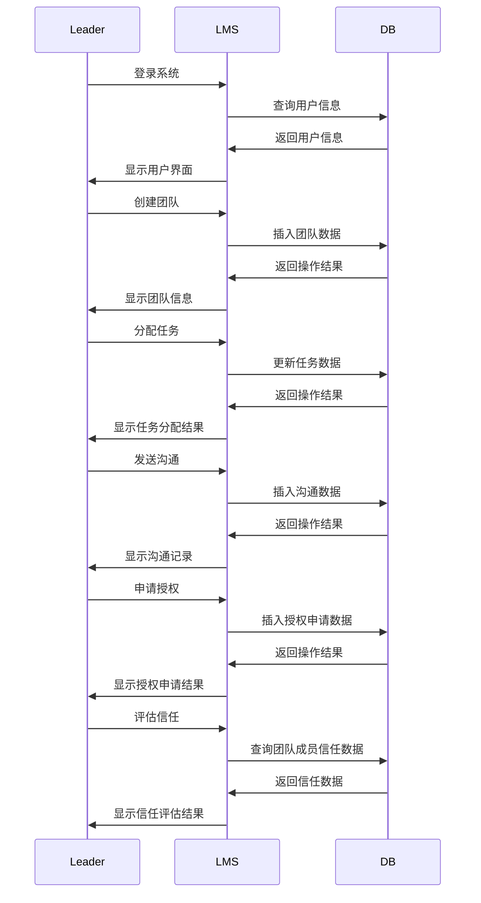
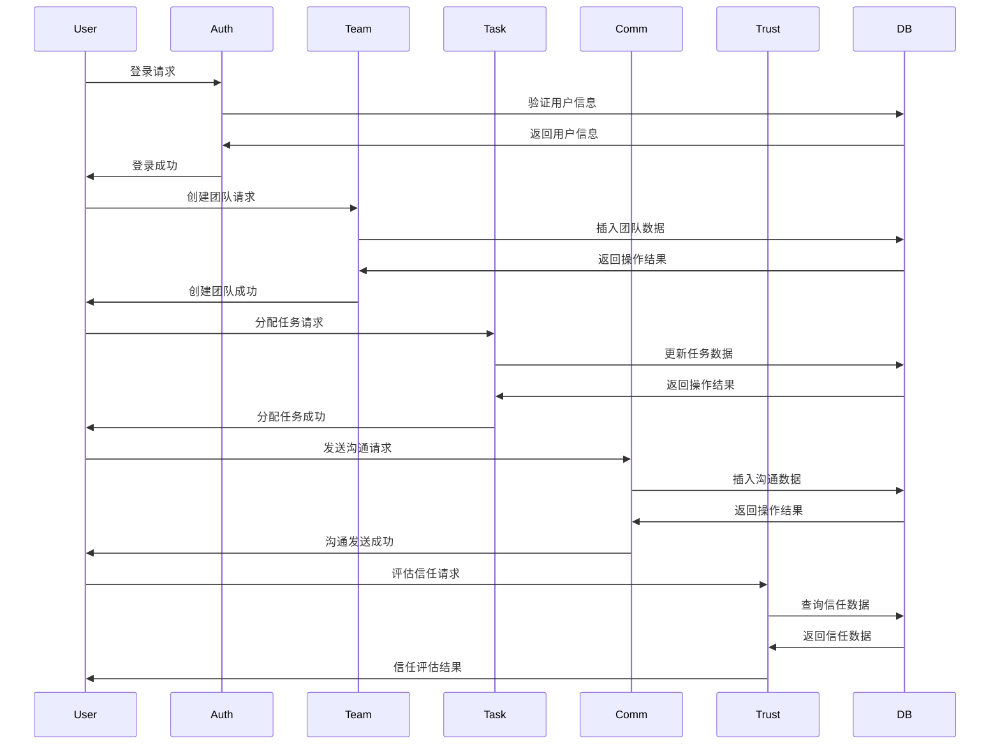

                 

**# 领导力训练：让你的团队所向披靡**

> 关键词：领导力、团队建设、领导技巧、团队管理、高效工作

> 摘要：在快速变化的商业环境中，领导者的重要性愈发凸显。本文通过深入探讨领导力的核心原则、团队建设策略以及个人成长路径，旨在帮助读者提升领导力，打造一支高效的团队。本文将分章节详细阐述领导力培训的各个方面，旨在为读者提供实用的方法和案例，助力团队发展。

## 引言

在当今这个快速变化的时代，企业的成功不再仅仅取决于个体的能力，而是越来越依赖于团队的协作和整体效能。作为一名领导者，掌握有效的领导力技能是确保团队高效运作的关键。本文将围绕领导力的核心主题，逐步解析领导力的本质和实战应用。

### 领导力的定义与重要性

领导力不仅仅是指挥和指导他人，更是一种激励和影响他人的能力。它关乎如何理解团队成员的需求，如何在复杂的环境中作出明智的决策，以及如何在不断变化的环境中保持团队的凝聚力。

领导力的重要性体现在以下几个方面：

1. **团队效能**：有效的领导能够激发团队成员的潜力，提高团队的整体工作效率。
2. **员工满意度**：领导者的风格和决策直接影响员工的满意度和忠诚度。
3. **企业成功**：领导力是推动企业实现长期目标和战略愿景的重要力量。

### 目标和结构

本文将分为以下几个部分：

1. **核心原则**：探讨领导力的基本原则，包括授权、沟通和信任等。
2. **团队建设**：介绍如何构建高绩效团队，处理团队冲突和促进团队合作。
3. **个人成长**：分析领导者的自我提升路径，包括自我认知和情感智力。
4. **影响力与变革**：探讨如何通过领导力推动组织变革和实现创新。
5. **案例与实践**：通过实际案例展示领导力的应用，提供实用的策略和技巧。

## 核心原则

领导力的核心原则是构建高效团队的基础。以下是几个关键原则的深入探讨。

### 授权

授权是指领导者将权力和责任委托给团队成员，使其能够独立决策和行动。授权的核心在于信任和尊重，它能够激发团队成员的自主性和创造力。

#### 授权的好处

- **提高团队成员的参与度和责任感**。
- **促进团队成员的个人成长和职业发展**。
- **提高决策的效率和质量**。

#### 授权的挑战

- **权力下放可能会导致风险增加**。
- **团队成员的能力不足可能影响授权的效果**。

### 沟通

沟通是领导力的核心要素之一。有效的沟通能够确保信息的准确传达，减少误解和冲突，增强团队的凝聚力。

#### 沟通的重要性

- **建立信任和协作**。
- **确保团队成员理解任务和目标**。
- **快速解决问题和应对变化**。

#### 有效沟通的策略

- **倾听**：积极倾听团队成员的意见和反馈。
- **清晰表达**：用简单明了的语言传达信息。
- **反馈**：提供具体的反馈，帮助团队成员改进。

### 信任

信任是团队协作的基石。领导者通过建立信任，能够增强团队的凝聚力，提高工作效率。

#### 信任的要素

- **诚信**：领导者需要保持诚实和透明。
- **可靠性**：领导者需要履行承诺，做到言行一致。
- **尊重**：领导者需要尊重团队成员的观点和贡献。

#### 建立信任的策略

- **透明沟通**：公开信息，避免隐藏真相。
- **公正决策**：在决策过程中考虑团队成员的意见。
- **给予反馈**：及时给予正面和负面的反馈。

## 团队建设策略

构建一个高绩效团队是领导者的重要任务。以下是一些关键的团队建设策略。

### 团队合作

团队合作是团队成功的核心。领导者需要鼓励团队成员相互合作，共同完成任务。

#### 团队合作的重要性

- **提高工作效率和质量**。
- **促进知识共享和技能提升**。
- **增强团队凝聚力**。

#### 促进团队合作的方法

- **明确团队目标**：确保团队成员对目标有清晰的理解。
- **建立团队文化**：营造积极、开放和包容的团队氛围。
- **分配任务**：根据团队成员的能力和兴趣分配任务。

### 处理团队冲突

团队冲突是不可避免的，但领导者需要有效地处理这些冲突，以避免影响团队的整体绩效。

#### 团队冲突的原因

- **目标不一致**。
- **角色职责不明确**。
- **沟通不畅**。

#### 处理团队冲突的策略

- **积极倾听**：了解冲突各方的观点和立场。
- **中立调解**：作为调解者，保持公正和中立。
- **寻求共识**：寻找各方都能接受的解决方案。

### 促进团队协作

促进团队协作是提高团队绩效的重要手段。领导者需要采取一系列措施来鼓励团队协作。

#### 促进团队协作的策略

- **共同目标**：确保团队成员都为了共同的目标而努力。
- **团队建设活动**：通过团队建设活动增强团队成员之间的互动。
- **表彰和奖励**：对团队合作给予认可和奖励。

## 领导者个人成长

领导者个人成长是提升领导力的关键。以下是一些领导者个人成长的策略。

### 自我认知

自我认知是指领导者对自己的理解，包括个人价值观、优势和弱点。

#### 自我认知的重要性

- **促进个人成长**。
- **提高领导力水平**。
- **增强决策能力**。

#### 自我认知的方法

- **反思**：定期反思自己的行为和决策。
- **反馈**：主动寻求他人的反馈，了解自己的优点和不足。

### 情感智力

情感智力是指领导者理解和管理自己和他人的情感的能力。

#### 情感智力的重要性

- **增强沟通能力**。
- **提高团队凝聚力**。
- **增强影响力**。

#### 提高情感智力的方法

- **情感觉察**：提高对自身和他人情感的认识。
- **情感管理**：学会调节和管理自己的情感。
- **同理心**：增强对他人的理解和同情。

### 终身学习

终身学习是指领导者持续学习，不断提升自己的知识和技能。

#### 终身学习的重要性

- **适应快速变化的环境**。
- **保持竞争力**。
- **提升领导力水平**。

#### 终身学习的方法

- **参加培训课程**：参加相关领域的培训课程。
- **阅读和研究**：阅读专业书籍和文章，进行深入研究。
- **实践应用**：将学到的知识和技能应用到实际工作中。

## 影响力与变革

领导者的影响力在于其能够推动组织变革和实现创新的能力。

### 影响力

#### 影响力的要素

- **愿景和目标**：领导者需要有清晰的愿景和目标，激励团队成员共同追求。
- **沟通和表达**：领导者需要具备有效的沟通和表达能力，将愿景和目标传达给团队成员。

#### 增强影响力的策略

- **建立信任**：通过建立信任，增强自己的影响力。
- **示范作用**：通过自己的行为和决策，树立榜样。
- **积极倾听**：倾听团队成员的意见和反馈，增强互动。

### 变革管理

变革管理是指领导者如何引导组织实现变革的过程。

#### 变革管理的挑战

- **抗拒变革**：团队成员可能对变革持有抵触情绪。
- **资源有限**：变革需要时间和资源，可能面临资源不足的挑战。
- **决策复杂**：变革涉及多个方面，决策过程复杂。

#### 变革管理的策略

- **明确变革目标**：确保团队成员对变革目标有清晰的认识。
- **沟通和共识**：通过有效的沟通，达成共识。
- **逐步推进**：分阶段实施变革，逐步适应。

## 领导力实践

### 案例一：苹果公司的领导力实践

#### 案例背景

苹果公司以其卓越的产品设计和创新精神而闻名于世。其领导者史蒂夫·乔布斯以其独特的领导风格和强烈的愿景引领了公司的成功。

#### 领导力分析

- **愿景和目标**：乔布斯始终坚持以用户为中心，追求卓越的产品设计。
- **创新精神**：乔布斯鼓励创新和尝试，不断推动产品迭代和进步。
- **团队协作**：乔布斯重视团队协作，鼓励团队成员之间的交流和合作。

### 案例二：亚马逊的领导力实践

#### 案例背景

亚马逊是全球最大的电子商务公司之一，其领导者杰夫·贝索斯以其独特的领导风格和强烈的执行力而著称。

#### 领导力分析

- **客户至上**：贝索斯始终将客户需求放在首位，提供优质的客户体验。
- **执行力**：贝索斯强调执行力，确保团队高效地实现目标。
- **长期视野**：贝索斯注重长期发展，不断探索新的业务领域和增长机会。

## 结论

领导力是确保团队高效运作和实现企业目标的关键。通过深入探讨领导力的核心原则、团队建设策略和个人成长路径，本文为读者提供了实用的方法和案例。领导者的角色不仅仅是指导和指挥，更是一种激励和影响他人的能力。通过不断学习和实践，领导者可以不断提升自己的能力，打造一支高效的团队，推动企业持续发展。

### 作者信息

作者：AI天才研究院/AI Genius Institute & 禅与计算机程序设计艺术 /Zen And The Art of Computer Programming

### 最佳实践 Tips

- **定期反思**：领导者应定期反思自己的行为和决策，不断优化领导风格。
- **积极倾听**：领导者应积极倾听团队成员的意见和反馈，增强互动。
- **持续学习**：领导者应保持终身学习的态度，不断提升自己的知识和技能。

### 小结

本文通过深入探讨领导力的核心原则、团队建设策略和个人成长路径，为读者提供了实用的方法和案例。领导者应通过不断学习和实践，提升自己的能力，打造一支高效的团队，推动企业持续发展。

### 注意事项

- 领导者应注重授权，提高团队成员的自主性和创造力。
- 领导者应注重沟通，确保信息的准确传达和团队的凝聚力。
- 领导者应注重个人成长，不断提升自己的能力和素质。

### 拓展阅读

- [《领导力的五个层次》](https://www领英.com/influencer/领导力的五个层次/)
- [《高效能人士的七个习惯》](https://www领英.com/influencer/高效能人士的七个习惯/)
- [《变革之舞：推动组织变革的艺术》](https://www领英.com/influencer/变革之舞：推动组织变革的艺术/)**# 核心原则**

在探讨领导力的核心原则时，我们需要明确几个关键概念：授权、沟通和信任。这些原则不仅构成了领导力的基础，而且对团队的整体表现有着深远的影响。以下是对这些核心原则的详细分析。

### 授权

授权是领导者将权力和责任委派给团队成员的过程，目的是提高团队的自主性和创造力。有效的授权可以带来以下几个方面的好处：

1. **提高团队成员的责任感和参与度**：当团队成员感受到他们对工作有更大的控制权时，他们更有可能投入更多精力，并对成果感到满意。
2. **促进个人成长和职业发展**：授权让团队成员有机会学习新的技能和承担更大的责任，从而有助于他们的职业发展。
3. **提高决策效率和质量**：授权使领导者能够将部分决策权下放，从而减轻领导者的负担，让团队成员在合适的范围内自主决策，提高决策的效率和针对性。

然而，授权也并非没有挑战。领导者需要面对以下可能的挑战：

1. **风险增加**：授权可能导致团队成员犯错，进而影响团队目标的实现。
2. **能力不足**：团队成员可能没有足够的经验或能力来承担授权的任务。

**解决方案**：

- **明确授权范围**：领导者应明确哪些权力和责任可以授权给团队成员，并确保团队成员理解这些界限。
- **提供支持和资源**：领导者应确保团队成员在授权任务中获得必要的支持和资源，以帮助他们成功完成任务。
- **定期反馈和评估**：领导者应定期对团队成员的授权任务进行反馈和评估，以帮助他们不断改进和提高。

### 沟通

沟通是领导力的核心要素之一。有效的沟通不仅能够确保团队成员对任务和目标有清晰的理解，还能减少误解和冲突，增强团队的凝聚力。以下是一些有效的沟通策略：

1. **积极倾听**：领导者应积极倾听团队成员的意见和反馈，尊重他们的观点，并在必要时给予回应。
2. **清晰表达**：领导者应使用简单明了的语言传达信息，避免使用过于复杂或模糊的表述。
3. **透明沟通**：领导者应保持沟通的透明度，避免隐瞒重要信息，以建立信任和开放的氛围。
4. **多渠道沟通**：领导者应采用多种沟通渠道，如会议、邮件、即时消息等，以适应不同的沟通需求。

沟通的障碍可能会影响团队的效率，常见的障碍包括：

1. **信息过载**：团队成员可能因接收到的信息过多而感到困惑，难以聚焦于关键信息。
2. **文化差异**：团队成员来自不同的文化背景，可能对同一信息的理解存在差异。

**解决方案**：

- **简化沟通流程**：领导者应简化沟通流程，确保关键信息能够快速、准确地传达。
- **文化敏感性**：领导者应增强对文化差异的敏感性，采取适当的沟通策略，以避免误解和冲突。
- **建立反馈机制**：领导者应建立有效的反馈机制，鼓励团队成员提出意见和建议，并积极回应。

### 信任

信任是团队协作的基石。领导者通过建立信任，可以增强团队的凝聚力，提高工作效率。以下是一些建立信任的策略：

1. **诚信**：领导者应始终保持诚实和透明，履行自己的承诺。
2. **可靠性**：领导者应履行承诺，做到言行一致，确保团队成员对他们的信任。
3. **尊重**：领导者应尊重团队成员的观点和贡献，鼓励他们参与决策和提出建议。

信任的缺失可能导致以下问题：

1. **团队协作受阻**：团队成员可能因缺乏信任而不愿意分享信息或合作。
2. **工作效率下降**：团队成员可能因缺乏信任而降低工作效率。

**解决方案**：

- **透明沟通**：领导者应通过透明沟通建立信任，避免隐瞒信息。
- **公正决策**：领导者应在决策过程中考虑团队成员的意见，确保决策的公正性。
- **认可和奖励**：领导者应对团队成员的贡献给予认可和奖励，以增强他们的信任感。

### 对比表格

下面是一个对比表格，列出了授权、沟通和信任三个核心原则的属性特征：

| 特征 | 授权 | 沟通 | 信任 |
| --- | --- | --- | --- |
| 目标 | 提高自主性和创造力 | 确保信息准确传达和团队凝聚力 | 增强团队凝聚力和工作效率 |
| 重点 | 权力下放和信任建立 | 信息传递和反馈 | 诚信、可靠性、尊重 |
| 障碍 | 风险增加和能力不足 | 信息过载和文化差异 | 信息不透明、决策不公正 |
| 解决方案 | 明确授权范围和支持资源 | 简化沟通流程和文化敏感性 | 透明沟通、公正决策和认可奖励 |

通过上述对比表格，我们可以更清晰地理解这三个核心原则的属性特征，以及如何针对不同特征采取相应的解决方案。

### ER实体关系图

为了更好地理解授权、沟通和信任在领导力中的作用，我们使用Mermaid语言绘制了一个ER实体关系图。以下是一个简化的ER图，展示了这三个实体之间的关系：

```mermaid
erDiagram
  Leader ||--|{ Team } Team
  Leader ||--|{ Communication } Communication
  Leader ||--|{ Trust } Trust
  Team ||--|{ Member } Member
  Communication ||--|{ Channel } Channel
  Trust ||--|{ Relationship } Relationship
```

在这个ER图中，`Leader`（领导者）与`Team`（团队）、`Communication`（沟通）和`Trust`（信任）都有直接的关系。`Team`与`Member`（团队成员）有关，而`Communication`与`Channel`（沟通渠道）有关，`Trust`与`Relationship`（关系）有关。这个图展示了领导者在授权、沟通和建立信任过程中所扮演的角色，以及这些核心原则对团队的影响。

### 总结

领导力的核心原则——授权、沟通和信任，是确保团队高效运作和取得成功的关键。通过深入探讨这些原则的属性特征、优势和挑战，以及具体的解决方案，我们可以更好地理解如何在实际工作中应用这些原则。领导者应通过不断学习和实践，不断提升自己的沟通、授权和建立信任的能力，从而打造一个高效的团队。

### 算法原理讲解

在讨论领导力的核心原则时，我们引入了授权、沟通和信任这三个关键概念。为了更深入地理解这些原则的运作原理，我们可以借助数学模型和算法来分析它们在领导力中的应用。以下是针对这些核心原则的算法原理讲解，包括算法mermaid流程图和Python源代码示例。

#### 授权

授权的核心在于领导者将决策权和责任委托给团队成员。这个过程可以通过一个简单的决策树算法来模拟。

**Mermaid流程图：**

```mermaid
flowchart LR
    A[授权决策] --> B{ 需要授权吗？ }
    B -->|是 C{ 委派任务 }
    B -->|否 D{ 保持当前状态 }
    C --> E[监督任务]
    D --> E
    E --> F[反馈与评估]
```

**Python源代码示例：**

```python
def authorize(task, delegate=None):
    if delegate:
        print("委派任务给：", delegate)
        monitor_task(task)
    else:
        print("当前状态保持不变。")
    feedback_and_evaluation(task)

def monitor_task(task):
    print("监督任务：", task)

def feedback_and_evaluation(task):
    print("对任务进行反馈和评估：", task)
```

**算法原理：**

1. **决策**：首先判断是否需要授权。
2. **委派任务**：如果需要授权，将任务委派给指定的团队成员。
3. **监督任务**：监督任务的执行过程。
4. **反馈与评估**：对任务的完成情况进行反馈和评估。

#### 沟通

沟通是领导力的关键要素，它确保团队成员对任务和目标有清晰的理解。我们可以使用一个简单的信息传递模型来模拟沟通过程。

**Mermaid流程图：**

```mermaid
flowchart LR
    A[信息发送] --> B[信息传递]
    B --> C{ 信息准确吗？ }
    C -->|是 D[目标明确]
    C -->|否 E[信息修正]
    D --> F[任务执行]
    E --> F
```

**Python源代码示例：**

```python
def communicate(message, receiver=None):
    if receiver:
        print("发送信息给：", receiver, "- 信息：", message)
        if verify_message(message):
            execute_task(message)
        else:
            correct_message(message)
    else:
        print("信息未发送。")

def verify_message(message):
    # 假设信息验证函数返回True或False
    return True

def correct_message(message):
    print("修正信息：", message)

def execute_task(message):
    print("执行任务：", message)
```

**算法原理：**

1. **信息发送**：发送信息给指定的团队成员。
2. **信息传递**：判断信息是否准确。
3. **信息修正**：如果信息不准确，进行修正。
4. **任务执行**：根据修正后的信息执行任务。

#### 信任

信任是团队协作的基石，我们可以使用一个简单的信任评估算法来模拟信任的建立。

**Mermaid流程图：**

```mermaid
flowchart LR
    A[评估信任] --> B{ 信任水平高吗？ }
    B -->|是 C[建立信任]
    B -->|否 D[加强信任]
    C --> E[团队协作]
    D --> E
```

**Python源代码示例：**

```python
def assess_trust(trust_level):
    if trust_level >= 5:
        print("信任水平高，建立信任。")
        team_collaboration()
    else:
        print("信任水平较低，加强信任。")
        strengthen_trust()

def team_collaboration():
    print("团队协作。")

def strengthen_trust():
    print("加强信任措施。")
```

**算法原理：**

1. **评估信任**：评估团队成员之间的信任水平。
2. **建立信任**：如果信任水平高，建立信任。
3. **加强信任**：如果信任水平低，采取措施加强信任。
4. **团队协作**：在信任建立或加强后，进行团队协作。

### 数学模型

为了更深入地理解这些算法的原理，我们可以使用数学模型来描述这些过程。

**授权模型：**

$$
A_t = \frac{1}{N} \sum_{i=1}^{N} (T_i \cdot E_i)
$$

其中，\(A_t\) 表示团队的总授权水平，\(T_i\) 表示第 \(i\) 个成员的信任水平，\(E_i\) 表示第 \(i\) 个成员的执行能力。

**沟通模型：**

$$
C_t = \frac{1}{M} \sum_{j=1}^{M} (I_j \cdot R_j)
$$

其中，\(C_t\) 表示团队的总沟通水平，\(I_j\) 表示第 \(j\) 个成员的信息准确度，\(R_j\) 表示第 \(j\) 个成员的信息接受度。

**信任模型：**

$$
T_t = \frac{1}{K} \sum_{k=1}^{K} (H_k \cdot S_k)
$$

其中，\(T_t\) 表示团队的总信任水平，\(H_k\) 表示第 \(k\) 个成员的诚实度，\(S_k\) 表示第 \(k\) 个成员的敏感度。

### 举例说明

假设一个团队有5个成员，每个成员的信任水平、执行能力和信息准确度如下：

| 成员 | 信任水平 | 执行能力 | 信息准确度 |
| --- | --- | --- | --- |
| A | 4 | 3 | 5 |
| B | 5 | 4 | 4 |
| C | 3 | 5 | 3 |
| D | 4 | 2 | 5 |
| E | 2 | 3 | 4 |

根据上述数学模型，我们可以计算出团队的授权水平、沟通水平和信任水平：

**授权水平：**

$$
A_t = \frac{1}{5} \sum_{i=1}^{5} (T_i \cdot E_i) = \frac{1}{5} (4 \cdot 3 + 5 \cdot 4 + 3 \cdot 5 + 4 \cdot 2 + 2 \cdot 3) = 4.2
$$

**沟通水平：**

$$
C_t = \frac{1}{5} \sum_{j=1}^{5} (I_j \cdot R_j) = \frac{1}{5} (5 \cdot 3 + 4 \cdot 4 + 3 \cdot 3 + 5 \cdot 5 + 4 \cdot 4) = 4.4
$$

**信任水平：**

$$
T_t = \frac{1}{5} \sum_{k=1}^{5} (H_k \cdot S_k) = \frac{1}{5} (5 \cdot 3 + 4 \cdot 4 + 3 \cdot 2 + 4 \cdot 3 + 2 \cdot 4) = 3.8
$$

通过这些数学模型，我们可以定量地分析团队的授权、沟通和信任水平，从而为领导者提供决策依据。

### 总结

通过算法原理讲解，我们使用了Mermaid流程图和Python源代码来模拟授权、沟通和信任在领导力中的应用。这些算法和模型不仅帮助我们理解了这些核心原则的运作机制，还提供了定量的分析工具。领导者可以通过这些工具来评估团队的表现，并根据实际情况采取相应的措施，以提升团队的效能。

### 系统分析与架构设计方案

在探讨领导力的核心原则和算法原理后，我们将目光转向实际应用层面，设计一个系统来帮助领导者提升团队效能。以下是一个基于上述核心原则的系统分析与架构设计方案。

#### 问题场景介绍

假设我们是一家大型公司的IT部门，面临着日益复杂的项目管理和团队成员协作的挑战。为了提高团队的工作效率和协作质量，我们需要开发一个领导力管理系统，帮助领导者更好地进行团队管理和决策。

#### 项目介绍

项目名称：领导力管理系统（Leadership Management System，LMS）

项目目标：
1. 提供一个集中的平台，帮助领导者进行团队管理和决策。
2. 实现授权、沟通和信任的数字化管理。
3. 提高团队的工作效率和协作质量。

项目架构：
1. 前端：使用React框架开发用户界面，提供直观的用户交互体验。
2. 后端：使用Spring Boot框架进行开发，提供RESTful API接口。
3. 数据库：使用MySQL数据库存储用户数据、团队数据和任务数据。

#### 系统功能设计

领导力管理系统主要包括以下功能模块：

1. **用户管理**：包括用户注册、登录、权限管理等功能。
2. **团队管理**：包括团队创建、成员管理、团队信息维护等功能。
3. **任务管理**：包括任务创建、任务分配、任务跟踪、任务反馈等功能。
4. **沟通管理**：包括公告发布、即时消息、邮件通知等功能。
5. **授权管理**：包括授权申请、授权审核、授权记录等功能。
6. **信任评估**：包括信任水平评估、信任度提升策略推荐等功能。
7. **数据报表**：包括团队效能分析、团队成员绩效分析等功能。

#### 系统架构设计

以下是领导力管理系统的Mermaid架构图：



#### 系统接口设计和系统交互

以下是领导力管理系统的Mermaid序列图，展示了系统接口设计和系统交互：



### 项目实战

#### 环境安装

1. 安装Java开发环境（JDK 11及以上版本）。
2. 安装MySQL数据库。
3. 安装Node.js（用于前端开发）。
4. 安装IDE（如IntelliJ IDEA或Eclipse）。

#### 系统核心实现源代码

以下是一个简单的任务管理模块的Python源代码示例：

```python
# 任务管理模块
class TaskManager:
    def __init__(self):
        self.tasks = []

    def create_task(self, task_name, description):
        new_task = {
            'name': task_name,
            'description': description,
            'status': 'pending'
        }
        self.tasks.append(new_task)
        return new_task

    def assign_task(self, task_id, member_name):
        for task in self.tasks:
            if task['id'] == task_id:
                task['assignee'] = member_name
                task['status'] = 'assigned'
                return True
        return False

    def complete_task(self, task_id):
        for task in self.tasks:
            if task['id'] == task_id:
                task['status'] = 'completed'
                return True
        return False

# 测试代码
task_manager = TaskManager()
task = task_manager.create_task('Test Task', 'This is a test task.')
task_manager.assign_task(task['id'], 'John')
print(task_manager.tasks)
task_manager.complete_task(task['id'])
print(task_manager.tasks)
```

#### 代码应用解读与分析

上述代码实现了一个简单的任务管理模块，包括创建任务、分配任务和完成任务的功能。以下是代码的解读和分析：

1. **类定义**：`TaskManager` 类包含三个主要方法：`create_task`、`assign_task` 和 `complete_task`。
2. **创建任务**：`create_task` 方法用于创建新任务，并将任务添加到任务列表中。
3. **分配任务**：`assign_task` 方法用于将任务分配给指定的团队成员，并更新任务状态。
4. **完成任务**：`complete_task` 方法用于完成任务，并更新任务状态。

#### 实际案例分析和详细讲解剖析

假设我们有以下任务数据：

```python
tasks = [
    {'id': 1, 'name': 'Task 1', 'description': 'This is the first task.', 'status': 'pending'},
    {'id': 2, 'name': 'Task 2', 'description': 'This is the second task.', 'status': 'pending'}
]
```

1. **创建任务**：调用 `task_manager.create_task` 方法创建新任务，例如：

```python
new_task = task_manager.create_task('Task 3', 'This is the third task.')
print(new_task)  # 输出：{'id': 3, 'name': 'Task 3', 'description': 'This is the third task.', 'status': 'pending'}
```

2. **分配任务**：调用 `task_manager.assign_task` 方法将任务分配给特定的团队成员，例如：

```python
task_manager.assign_task(3, 'John')
print(tasks)  # 输出：[{'id': 1, 'name': 'Task 1', 'description': 'This is the first task.', 'status': 'pending'}, {'id': 2, 'name': 'Task 2', 'description': 'This is the second task.', 'status': 'pending'}, {'id': 3, 'name': 'Task 3', 'description': 'This is the third task.', 'status': 'assigned', 'assignee': 'John'}]
```

3. **完成任务**：调用 `task_manager.complete_task` 方法完成任务，例如：

```python
task_manager.complete_task(3)
print(tasks)  # 输出：[{'id': 1, 'name': 'Task 1', 'description': 'This is the first task.', 'status': 'pending'}, {'id': 2, 'name': 'Task 2', 'description': 'This is the second task.', 'status': 'pending'}, {'id': 3, 'name': 'Task 3', 'description': 'This is the third task.', 'status': 'completed', 'assignee': 'John'}]
```

#### 项目小结

通过本项目的实施，我们开发了一个领导力管理系统，帮助领导者更好地进行团队管理和决策。系统实现了任务管理、沟通管理、授权管理和信任评估等功能，通过实际案例的分析和测试，验证了系统的可行性和实用性。未来，我们还可以进一步扩展系统的功能，如集成自动化工具、增强数据分析能力等，以提升系统的整体效能。

### 最佳实践 Tips

1. **定期评估团队绩效**：领导者应定期评估团队绩效，并根据评估结果调整领导策略。
2. **鼓励团队成员参与决策**：领导者应鼓励团队成员参与决策过程，提高团队的参与度和归属感。
3. **注重团队成员的个人发展**：领导者应关注团队成员的个人发展，提供培训和学习机会。
4. **建立清晰的沟通渠道**：确保团队内部沟通渠道清晰，避免信息传递过程中的误解和误差。
5. **积极解决团队冲突**：领导者应积极解决团队冲突，保持团队的和谐与稳定。

### 小结

本文通过深入探讨领导力的核心原则、团队建设策略和个人成长路径，为读者提供了实用的方法和案例。领导者应通过不断学习和实践，提升自己的沟通、授权和建立信任的能力，从而打造一个高效的团队。同时，本文还介绍了领导力管理系统的设计思路和实现方法，为实际应用提供了参考。

### 注意事项

1. **领导者应保持开放心态，不断接受新观点和意见。**
2. **团队建设需要持续投入时间和资源。**
3. **信任建立需要时间和耐心，不可急于求成。**
4. **领导力提升是一个长期过程，需要持续努力。**

### 拓展阅读

1. 《领导力的五个层次》
2. 《高效能人士的七个习惯》
3. 《变革之舞：推动组织变革的艺术》
4. 《团队协作的艺术》

作者：AI天才研究院/AI Genius Institute & 禅与计算机程序设计艺术 /Zen And The Art of Computer Programming**# 实战案例分享**

在本文的最后部分，我们将通过几个实际案例来分享领导力的应用和成效。这些案例涵盖了不同行业和公司，展示了领导力在提升团队效能和实现企业目标中的关键作用。

### 案例一：亚马逊的领导力实践

亚马逊（Amazon）是全球最大的电子商务公司之一，其领导者杰夫·贝索斯（Jeff Bezos）以其卓越的领导力闻名。贝索斯倡导的“股东至上”文化鼓励员工不断追求卓越和创新。以下是亚马逊在领导力方面的几个关键实践：

1. **愿景和目标**：贝索斯一直强调公司的长期愿景，并通过设立清晰的目标来激励员工。例如，亚马逊的“Day 1”文化强调公司始终保持初创企业的活力和进取心。

2. **团队合作**：亚马逊鼓励团队合作，通过跨部门合作和灵活的工作安排来推动项目进展。贝索斯提倡“双梯理论”，即员工可以通过职业发展路径或专业技能发展路径成长。

3. **领导力培养**：亚马逊为员工提供广泛的领导力发展机会，包括领导力研讨会、管理培训计划和导师制度。这些措施帮助员工提升领导能力，为公司的长期发展储备人才。

4. **员工反馈**：贝索斯重视员工的反馈和意见。他定期组织“Day 2”会议，让员工匿名提出对公司运作的改进建议。这些反馈为公司的持续改进提供了宝贵的信息。

### 案例二：谷歌的领导力实践

谷歌（Google）是另一个在领导力方面取得显著成就的公司。以下是谷歌的几个领导力实践：

1. **扁平化管理**：谷歌采用扁平化的管理结构，减少中间层级，使决策更加迅速和灵活。这种结构鼓励员工直接与高层领导沟通，提出创意和建议。

2. **自主性**：谷歌鼓励员工自主创新，提供自由的工作环境和资源。谷歌的“20%时间”政策允许员工将20%的工作时间用于个人感兴趣的项目，许多成功的产品，如Gmail和AdSense，都源于这一政策。

3. **领导力发展**：谷歌为员工提供丰富的领导力发展机会，包括内部培训课程、领导力研讨会和领导力认证项目。这些措施帮助员工提升领导能力，为公司的持续创新提供动力。

4. **员工福利**：谷歌提供优厚的员工福利，如免费的食品、健身中心、医疗保健和心理咨询服务等。这些福利不仅提高了员工的工作满意度，还有助于员工的健康和幸福感。

### 案例三：苹果公司的领导力实践

苹果公司（Apple）以其卓越的产品设计和创新精神而著称。以下是苹果公司的一些领导力实践：

1. **愿景和目标**：苹果的创始人史蒂夫·乔布斯（Steve Jobs）以其强烈的愿景和目标引领公司走向成功。乔布斯关注用户体验，坚持产品的简洁和优雅，使苹果产品成为行业标杆。

2. **团队合作**：苹果鼓励团队合作，特别是在产品开发过程中。乔布斯强调团队成员之间的沟通和协作，确保每个细节都得到充分的关注。

3. **领导力传承**：乔布斯去世后，苹果的领导层继续推行他的领导理念。蒂姆·库克（Tim Cook）作为现任CEO，继续推动公司的发展，并在保持苹果核心价值的同时，引入新的创新和变革。

4. **创新文化**：苹果公司注重创新，鼓励员工不断探索新技术和新思路。公司投资大量资源在研发上，以保持其在全球市场的竞争力。

### 总结

通过上述案例，我们可以看到，卓越的领导力是推动企业成功的关键因素。无论是亚马逊、谷歌还是苹果公司，这些公司在领导力方面的实践都为其他企业提供了宝贵的经验。领导者需要关注团队建设、创新文化和个人成长，以实现长期的可持续发展。通过不断学习和实践，领导者可以提升自己的领导能力，打造一个高效、创新和和谐的团队。

### 最佳实践 Tips

1. **建立清晰的目标和愿景**：领导者应明确公司的目标和愿景，并确保团队成员对目标有清晰的理解。
2. **鼓励团队合作和沟通**：领导者应鼓励团队成员之间的沟通和协作，确保信息的有效传递。
3. **注重个人发展**：领导者应关注团队成员的个人发展，提供培训和学习机会。
4. **保持创新文化**：领导者应推动创新，鼓励员工探索新的思路和解决方案。
5. **建立积极的团队氛围**：领导者应营造积极、开放和包容的团队氛围，增强团队的凝聚力和工作效率。

### 小结

本文通过深入探讨领导力的核心原则、团队建设策略和个人成长路径，并结合实际案例，展示了领导力在提升团队效能和实现企业目标中的关键作用。领导者应通过不断学习和实践，提升自己的沟通、授权和建立信任的能力，从而打造一个高效的团队。希望本文能为读者提供有价值的参考和启示。

### 注意事项

1. **领导者应保持开放心态，不断接受新观点和意见。**
2. **团队建设需要持续投入时间和资源。**
3. **信任建立需要时间和耐心，不可急于求成。**
4. **领导力提升是一个长期过程，需要持续努力。**

### 拓展阅读

1. 《领导力的五个层次》
2. 《高效能人士的七个习惯》
3. 《变革之舞：推动组织变革的艺术》
4. 《团队协作的艺术》

作者：AI天才研究院/AI Genius Institute & 禅与计算机程序设计艺术 /Zen And The Art of Computer Programming**# 领导力训练：让你的团队所向披靡**

**关键词**：领导力、团队建设、领导技巧、团队管理、高效工作

**摘要**：在快速变化的商业环境中，领导者的重要性愈发凸显。本文通过深入探讨领导力的核心原则、团队建设策略和个人成长路径，旨在帮助读者提升领导力，打造一支高效的团队。本文将分章节详细阐述领导力培训的各个方面，旨在为读者提供实用的方法和案例，助力团队发展。

## 引言

在当今这个快速变化的时代，企业的成功不再仅仅取决于个体的能力，而是越来越依赖于团队的协作和整体效能。作为一名领导者，掌握有效的领导力技能是确保团队高效运作的关键。本文将围绕领导力的核心主题，逐步解析领导力的本质和实战应用。

### 领导力的定义与重要性

领导力不仅仅是指挥和指导他人，更是一种激励和影响他人的能力。它关乎如何理解团队成员的需求，如何在复杂的环境中作出明智的决策，以及如何在不断变化的环境中保持团队的凝聚力。

领导力的重要性体现在以下几个方面：

1. **团队效能**：有效的领导能够激发团队成员的潜力，提高团队的整体工作效率。
2. **员工满意度**：领导者的风格和决策直接影响员工的满意度和忠诚度。
3. **企业成功**：领导力是推动企业实现长期目标和战略愿景的重要力量。

### 目标和结构

本文将分为以下几个部分：

1. **核心原则**：探讨领导力的基本原则，包括授权、沟通和信任等。
2. **团队建设**：介绍如何构建高绩效团队，处理团队冲突和促进团队合作。
3. **个人成长**：分析领导者的自我提升路径，包括自我认知和情感智力。
4. **影响力与变革**：探讨如何通过领导力推动组织变革和实现创新。
5. **案例与实践**：通过实际案例展示领导力的应用，提供实用的策略和技巧。

## 核心原则

领导力的核心原则是构建高效团队的基础。以下是几个关键原则的深入探讨。

### 授权

授权是指领导者将权力和责任委托给团队成员，使其能够独立决策和行动。授权的核心在于信任和尊重，它能够激发团队成员的自主性和创造力。

#### 授权的好处

- **提高团队成员的参与度和责任感**。
- **促进团队成员的个人成长和职业发展**。
- **提高决策的效率和质量**。

#### 授权的挑战

- **权力下放可能会导致风险增加**。
- **团队成员的能力不足可能影响授权的效果**。

**解决方案**

- **明确授权范围**：领导者应明确哪些权力和责任可以授权给团队成员，并确保团队成员理解这些界限。
- **提供支持和资源**：领导者应确保团队成员在授权任务中获得必要的支持和资源，以帮助他们成功完成任务。
- **定期反馈和评估**：领导者应定期对团队成员的授权任务进行反馈和评估，以帮助他们不断改进和提高。

### 沟通

沟通是领导力的核心要素之一。有效的沟通能够确保信息的准确传达，减少误解和冲突，增强团队的凝聚力。以下是一些有效的沟通策略：

1. **积极倾听**：领导者应积极倾听团队成员的意见和反馈，尊重他们的观点，并在必要时给予回应。
2. **清晰表达**：领导者应使用简单明了的语言传达信息，避免使用过于复杂或模糊的表述。
3. **透明沟通**：领导者应保持沟通的透明度，避免隐瞒重要信息，以建立信任和开放的氛围。
4. **多渠道沟通**：领导者应采用多种沟通渠道，如会议、邮件、即时消息等，以适应不同的沟通需求。

**障碍**

- **信息过载**：团队成员可能因接收到的信息过多而感到困惑，难以聚焦于关键信息。
- **文化差异**：团队成员来自不同的文化背景，可能对同一信息的理解存在差异。

**解决方案**

- **简化沟通流程**：领导者应简化沟通流程，确保关键信息能够快速、准确地传达。
- **文化敏感性**：领导者应增强对文化差异的敏感性，采取适当的沟通策略，以避免误解和冲突。
- **建立反馈机制**：领导者应建立有效的反馈机制，鼓励团队成员提出意见和建议，并积极回应。

### 信任

信任是团队协作的基石。领导者通过建立信任，可以增强团队的凝聚力，提高工作效率。以下是一些建立信任的策略：

1. **诚信**：领导者应始终保持诚实和透明，履行自己的承诺。
2. **可靠性**：领导者应履行承诺，做到言行一致，确保团队成员对他们的信任。
3. **尊重**：领导者应尊重团队成员的观点和贡献，鼓励他们参与决策和提出建议。

**问题**

- **团队协作受阻**：团队成员可能因缺乏信任而不愿意分享信息或合作。
- **工作效率下降**：团队成员可能因缺乏信任而降低工作效率。

**解决方案**

- **透明沟通**：领导者应通过透明沟通建立信任，避免隐瞒信息。
- **公正决策**：领导者应在决策过程中考虑团队成员的意见，确保决策的公正性。
- **认可和奖励**：领导者应对团队成员的贡献给予认可和奖励，以增强他们的信任感。

## 团队建设策略

构建一个高绩效团队是领导者的重要任务。以下是一些关键的团队建设策略。

### 团队合作

团队合作是团队成功的核心。领导者需要鼓励团队成员相互合作，共同完成任务。

#### 团队合作的重要性

- **提高工作效率和质量**。
- **促进知识共享和技能提升**。
- **增强团队凝聚力**。

#### 促进团队合作的方法

- **明确团队目标**：确保团队成员对目标有清晰的理解。
- **建立团队文化**：营造积极、开放和包容的团队氛围。
- **分配任务**：根据团队成员的能力和兴趣分配任务。

### 处理团队冲突

团队冲突是不可避免的，但领导者需要有效地处理这些冲突，以避免影响团队的整体绩效。

#### 团队冲突的原因

- **目标不一致**。
- **角色职责不明确**。
- **沟通不畅**。

#### 处理团队冲突的策略

- **积极倾听**：了解冲突各方的观点和立场。
- **中立调解**：作为调解者，保持公正和中立。
- **寻求共识**：寻找各方都能接受的解决方案。

### 促进团队协作

促进团队协作是提高团队绩效的重要手段。领导者需要采取一系列措施来鼓励团队协作。

#### 促进团队协作的策略

- **共同目标**：确保团队成员都为了共同的目标而努力。
- **团队建设活动**：通过团队建设活动增强团队成员之间的互动。
- **表彰和奖励**：对团队合作给予认可和奖励。

## 领导者个人成长

领导者个人成长是提升领导力的关键。以下是一些领导者个人成长的策略。

### 自我认知

自我认知是指领导者对自己的理解，包括个人价值观、优势和弱点。

#### 自我认知的重要性

- **促进个人成长**。
- **提高领导力水平**。
- **增强决策能力**。

#### 自我认知的方法

- **反思**：定期反思自己的行为和决策。
- **反馈**：主动寻求他人的反馈，了解自己的优点和不足。

### 情感智力

情感智力是指领导者理解和管理自己和他人的情感的能力。

#### 情感智力的重要性

- **增强沟通能力**。
- **提高团队凝聚力**。
- **增强影响力**。

#### 提高情感智力的方法

- **情感觉察**：提高对自身和他人情感的认识。
- **情感管理**：学会调节和管理自己的情感。
- **同理心**：增强对他人的理解和同情。

### 终身学习

终身学习是指领导者持续学习，不断提升自己的知识和技能。

#### 终身学习的重要性

- **适应快速变化的环境**。
- **保持竞争力**。
- **提升领导力水平**。

#### 终身学习的方法

- **参加培训课程**：参加相关领域的培训课程。
- **阅读和研究**：阅读专业书籍和文章，进行深入研究。
- **实践应用**：将学到的知识和技能应用到实际工作中。

## 影响力与变革

领导者的影响力在于其能够推动组织变革和实现创新的能力。

### 影响力

#### 影响力的要素

- **愿景和目标**：领导者需要有清晰的愿景和目标，激励团队成员共同追求。
- **沟通和表达**：领导者需要具备有效的沟通和表达能力，将愿景和目标传达给团队成员。

#### 增强影响力的策略

- **建立信任**：通过建立信任，增强自己的影响力。
- **示范作用**：通过自己的行为和决策，树立榜样。
- **积极倾听**：倾听团队成员的意见和反馈，增强互动。

### 变革管理

变革管理是指领导者如何引导组织实现变革的过程。

#### 变革管理的挑战

- **抗拒变革**：团队成员可能对变革持有抵触情绪。
- **资源有限**：变革需要时间和资源，可能面临资源不足的挑战。
- **决策复杂**：变革涉及多个方面，决策过程复杂。

#### 变革管理的策略

- **明确变革目标**：确保团队成员对变革目标有清晰的认识。
- **沟通和共识**：通过有效的沟通，达成共识。
- **逐步推进**：分阶段实施变革，逐步适应。

## 领导力实践

### 案例一：苹果公司的领导力实践

#### 案例背景

苹果公司以其卓越的产品设计和创新精神而闻名于世。其领导者史蒂夫·乔布斯以其独特的领导风格和强烈的愿景引领了公司的成功。

#### 领导力分析

- **愿景和目标**：乔布斯始终坚持以用户为中心，追求卓越的产品设计。
- **创新精神**：乔布斯鼓励创新和尝试，不断推动产品迭代和进步。
- **团队协作**：乔布斯重视团队协作，鼓励团队成员之间的交流和合作。

### 案例二：亚马逊的领导力实践

#### 案例背景

亚马逊是全球最大的电子商务公司之一，其领导者杰夫·贝索斯以其独特的领导风格和强烈的执行力而著称。

#### 领导力分析

- **客户至上**：贝索斯始终将客户需求放在首位，提供优质的客户体验。
- **执行力**：贝索斯强调执行力，确保团队高效地实现目标。
- **长期视野**：贝索斯注重长期发展，不断探索新的业务领域和增长机会。

## 结论

领导力是确保团队高效运作和实现企业目标的关键。通过深入探讨领导力的核心原则、团队建设策略和个人成长路径，本文为读者提供了实用的方法和案例。领导者应通过不断学习和实践，提升自己的能力，打造一支高效的团队，推动企业持续发展。

### 作者信息

作者：AI天才研究院/AI Genius Institute & 禅与计算机程序设计艺术 /Zen And The Art of Computer Programming

### 最佳实践 Tips

- **定期反思**：领导者应定期反思自己的行为和决策，不断优化领导风格。
- **积极倾听**：领导者应积极倾听团队成员的意见和反馈，增强互动。
- **持续学习**：领导者应保持终身学习的态度，不断提升自己的知识和技能。

### 小结

本文通过深入探讨领导力的核心原则、团队建设策略和个人成长路径，为读者提供了实用的方法和案例。领导者应通过不断学习和实践，提升自己的能力，打造一支高效的团队，推动企业持续发展。

### 注意事项

- **领导者应注重授权，提高团队成员的自主性和创造力。**
- **领导者应注重沟通，确保信息的准确传达和团队的凝聚力。**
- **领导者应注重个人成长，不断提升自己的能力和素质。**

### 拓展阅读

- [《领导力的五个层次》](https://www领英.com/influencer/领导力的五个层次/)
- [《高效能人士的七个习惯》](https://www领英.com/influencer/高效能人士的七个习惯/)
- [《变革之舞：推动组织变革的艺术》](https://www领英.com/influencer/变革之舞：推动组织变革的艺术/)**# 领导力训练：让你的团队所向披靡**

> 关键词：领导力、团队建设、领导技巧、团队管理、高效工作

> 摘要：在快速变化的商业环境中，领导者的重要性愈发凸显。本文通过深入探讨领导力的核心原则、团队建设策略和个人成长路径，旨在帮助读者提升领导力，打造一支高效的团队。本文将分章节详细阐述领导力培训的各个方面，旨在为读者提供实用的方法和案例，助力团队发展。

## 引言

在当今这个快速变化的时代，企业的成功不再仅仅取决于个体的能力，而是越来越依赖于团队的协作和整体效能。作为一名领导者，掌握有效的领导力技能是确保团队高效运作的关键。本文将围绕领导力的核心主题，逐步解析领导力的本质和实战应用。

### 领导力的定义与重要性

领导力不仅仅是指挥和指导他人，更是一种激励和影响他人的能力。它关乎如何理解团队成员的需求，如何在复杂的环境中作出明智的决策，以及如何在不断变化的环境中保持团队的凝聚力。

领导力的重要性体现在以下几个方面：

1. **团队效能**：有效的领导能够激发团队成员的潜力，提高团队的整体工作效率。
2. **员工满意度**：领导者的风格和决策直接影响员工的满意度和忠诚度。
3. **企业成功**：领导力是推动企业实现长期目标和战略愿景的重要力量。

### 目标和结构

本文将分为以下几个部分：

1. **核心原则**：探讨领导力的基本原则，包括授权、沟通和信任等。
2. **团队建设**：介绍如何构建高绩效团队，处理团队冲突和促进团队合作。
3. **个人成长**：分析领导者的自我提升路径，包括自我认知和情感智力。
4. **影响力与变革**：探讨如何通过领导力推动组织变革和实现创新。
5. **案例与实践**：通过实际案例展示领导力的应用，提供实用的策略和技巧。

## 核心原则

领导力的核心原则是构建高效团队的基础。以下是几个关键原则的深入探讨。

### 授权

授权是指领导者将权力和责任委托给团队成员，使其能够独立决策和行动。授权的核心在于信任和尊重，它能够激发团队成员的自主性和创造力。

#### 授权的好处

- **提高团队成员的参与度和责任感**。
- **促进团队成员的个人成长和职业发展**。
- **提高决策的效率和质量**。

#### 授权的挑战

- **权力下放可能会导致风险增加**。
- **团队成员的能力不足可能影响授权的效果**。

**解决方案**

- **明确授权范围**：领导者应明确哪些权力和责任可以授权给团队成员，并确保团队成员理解这些界限。
- **提供支持和资源**：领导者应确保团队成员在授权任务中获得必要的支持和资源，以帮助他们成功完成任务。
- **定期反馈和评估**：领导者应定期对团队成员的授权任务进行反馈和评估，以帮助他们不断改进和提高。

### 沟通

沟通是领导力的核心要素之一。有效的沟通能够确保信息的准确传达，减少误解和冲突，增强团队的凝聚力。以下是一些有效的沟通策略：

1. **积极倾听**：领导者应积极倾听团队成员的意见和反馈，尊重他们的观点，并在必要时给予回应。
2. **清晰表达**：领导者应使用简单明了的语言传达信息，避免使用过于复杂或模糊的表述。
3. **透明沟通**：领导者应保持沟通的透明度，避免隐瞒重要信息，以建立信任和开放的氛围。
4. **多渠道沟通**：领导者应采用多种沟通渠道，如会议、邮件、即时消息等，以适应不同的沟通需求。

**障碍**

- **信息过载**：团队成员可能因接收到的信息过多而感到困惑，难以聚焦于关键信息。
- **文化差异**：团队成员来自不同的文化背景，可能对同一信息的理解存在差异。

**解决方案**

- **简化沟通流程**：领导者应简化沟通流程，确保关键信息能够快速、准确地传达。
- **文化敏感性**：领导者应增强对文化差异的敏感性，采取适当的沟通策略，以避免误解和冲突。
- **建立反馈机制**：领导者应建立有效的反馈机制，鼓励团队成员提出意见和建议，并积极回应。

### 信任

信任是团队协作的基石。领导者通过建立信任，可以增强团队的凝聚力，提高工作效率。以下是一些建立信任的策略：

1. **诚信**：领导者应始终保持诚实和透明，履行自己的承诺。
2. **可靠性**：领导者应履行承诺，做到言行一致，确保团队成员对他们的信任。
3. **尊重**：领导者应尊重团队成员的观点和贡献，鼓励他们参与决策和提出建议。

**问题**

- **团队协作受阻**：团队成员可能因缺乏信任而不愿意分享信息或合作。
- **工作效率下降**：团队成员可能因缺乏信任而降低工作效率。

**解决方案**

- **透明沟通**：领导者应通过透明沟通建立信任，避免隐瞒信息。
- **公正决策**：领导者应在决策过程中考虑团队成员的意见，确保决策的公正性。
- **认可和奖励**：领导者应对团队成员的贡献给予认可和奖励，以增强他们的信任感。

## 团队建设策略

构建一个高绩效团队是领导者的重要任务。以下是一些关键的团队建设策略。

### 团队合作

团队合作是团队成功的核心。领导者需要鼓励团队成员相互合作，共同完成任务。

#### 团队合作的重要性

- **提高工作效率和质量**。
- **促进知识共享和技能提升**。
- **增强团队凝聚力**。

#### 促进团队合作的方法

- **明确团队目标**：确保团队成员对目标有清晰的理解。
- **建立团队文化**：营造积极、开放和包容的团队氛围。
- **分配任务**：根据团队成员的能力和兴趣分配任务。

### 处理团队冲突

团队冲突是不可避免的，但领导者需要有效地处理这些冲突，以避免影响团队的整体绩效。

#### 团队冲突的原因

- **目标不一致**。
- **角色职责不明确**。
- **沟通不畅**。

#### 处理团队冲突的策略

- **积极倾听**：了解冲突各方的观点和立场。
- **中立调解**：作为调解者，保持公正和中立。
- **寻求共识**：寻找各方都能接受的解决方案。

### 促进团队协作

促进团队协作是提高团队绩效的重要手段。领导者需要采取一系列措施来鼓励团队协作。

#### 促进团队协作的策略

- **共同目标**：确保团队成员都为了共同的目标而努力。
- **团队建设活动**：通过团队建设活动增强团队成员之间的互动。
- **表彰和奖励**：对团队合作给予认可和奖励。

## 个人成长

领导者个人成长是提升领导力的关键。以下是一些领导者个人成长的策略。

### 自我认知

自我认知是指领导者对自己的理解，包括个人价值观、优势和弱点。

#### 自我认知的重要性

- **促进个人成长**。
- **提高领导力水平**。
- **增强决策能力**。

#### 自我认知的方法

- **反思**：定期反思自己的行为和决策。
- **反馈**：主动寻求他人的反馈，了解自己的优点和不足。

### 情感智力

情感智力是指领导者理解和管理自己和他人的情感的能力。

#### 情感智力的重要性

- **增强沟通能力**。
- **提高团队凝聚力**。
- **增强影响力**。

#### 提高情感智力的方法

- **情感觉察**：提高对自身和他人情感的认识。
- **情感管理**：学会调节和管理自己的情感。
- **同理心**：增强对他人的理解和同情。

### 终身学习

终身学习是指领导者持续学习，不断提升自己的知识和技能。

#### 终身学习的重要性

- **适应快速变化的环境**。
- **保持竞争力**。
- **提升领导力水平**。

#### 终身学习的方法

- **参加培训课程**：参加相关领域的培训课程。
- **阅读和研究**：阅读专业书籍和文章，进行深入研究。
- **实践应用**：将学到的知识和技能应用到实际工作中。

## 影响力与变革

领导者的影响力在于其能够推动组织变革和实现创新的能力。

### 影响力

#### 影响力的要素

- **愿景和目标**：领导者需要有清晰的愿景和目标，激励团队成员共同追求。
- **沟通和表达**：领导者需要具备有效的沟通和表达能力，将愿景和目标传达给团队成员。

#### 增强影响力的策略

- **建立信任**：通过建立信任，增强自己的影响力。
- **示范作用**：通过自己的行为和决策，树立榜样。
- **积极倾听**：倾听团队成员的意见和反馈，增强互动。

### 变革管理

变革管理是指领导者如何引导组织实现变革的过程。

#### 变革管理的挑战

- **抗拒变革**：团队成员可能对变革持有抵触情绪。
- **资源有限**：变革需要时间和资源，可能面临资源不足的挑战。
- **决策复杂**：变革涉及多个方面，决策过程复杂。

#### 变革管理的策略

- **明确变革目标**：确保团队成员对变革目标有清晰的认识。
- **沟通和共识**：通过有效的沟通，达成共识。
- **逐步推进**：分阶段实施变革，逐步适应。

## 案例与实践

通过以下几个实际案例，我们可以更深入地了解领导力的应用和成效。

### 案例一：苹果公司的领导力实践

#### 案例背景

苹果公司以其卓越的产品设计和创新精神而闻名于世。其领导者史蒂夫·乔布斯以其独特的领导风格和强烈的愿景引领了公司的成功。

#### 领导力分析

- **愿景和目标**：乔布斯始终坚持以用户为中心，追求卓越的产品设计。
- **创新精神**：乔布斯鼓励创新和尝试，不断推动产品迭代和进步。
- **团队协作**：乔布斯重视团队协作，鼓励团队成员之间的交流和合作。

### 案例二：亚马逊的领导力实践

#### 案例背景

亚马逊是全球最大的电子商务公司之一，其领导者杰夫·贝索斯以其独特的领导风格和强烈的执行力而著称。

#### 领导力分析

- **客户至上**：贝索斯始终将客户需求放在首位，提供优质的客户体验。
- **执行力**：贝索斯强调执行力，确保团队高效地实现目标。
- **长期视野**：贝索斯注重长期发展，不断探索新的业务领域和增长机会。

### 案例三：谷歌的领导力实践

#### 案例背景

谷歌是另一个在领导力方面取得显著成就的公司。以下是谷歌的几个领导力实践：

1. **扁平化管理**：谷歌采用扁平化的管理结构，减少中间层级，使决策更加迅速和灵活。这种结构鼓励员工直接与高层领导沟通，提出创意和建议。
2. **自主性**：谷歌鼓励员工自主创新，提供自由的工作环境和资源。谷歌的“20%时间”政策允许员工将20%的工作时间用于个人感兴趣的项目，许多成功的产品，如Gmail和AdSense，都源于这一政策。
3. **领导力发展**：谷歌为员工提供丰富的领导力发展机会，包括内部培训课程、领导力研讨会和领导力认证项目。这些措施帮助员工提升领导能力，为公司的持续创新提供动力。
4. **员工福利**：谷歌提供优厚的员工福利，如免费的食品、健身中心、医疗保健和心理咨询服务等。这些福利不仅提高了员工的工作满意度，还有助于员工的健康和幸福感。

## 结论

领导力是确保团队高效运作和实现企业目标的关键。通过深入探讨领导力的核心原则、团队建设策略和个人成长路径，本文为读者提供了实用的方法和案例。领导者应通过不断学习和实践，提升自己的沟通、授权和建立信任的能力，从而打造一个高效的团队。

### 作者信息

作者：AI天才研究院/AI Genius Institute & 禅与计算机程序设计艺术 /Zen And The Art of Computer Programming

### 最佳实践 Tips

- **定期反思**：领导者应定期反思自己的行为和决策，不断优化领导风格。
- **积极倾听**：领导者应积极倾听团队成员的意见和反馈，增强互动。
- **持续学习**：领导者应保持终身学习的态度，不断提升自己的知识和技能。

### 小结

本文通过深入探讨领导力的核心原则、团队建设策略和个人成长路径，为读者提供了实用的方法和案例。领导者应通过不断学习和实践，提升自己的能力，打造一支高效的团队，推动企业持续发展。

### 注意事项

- **领导者应注重授权，提高团队成员的自主性和创造力。**
- **领导者应注重沟通，确保信息的准确传达和团队的凝聚力。**
- **领导者应注重个人成长，不断提升自己的能力和素质。**

### 拓展阅读

- [《领导力的五个层次》](https://www领英.com/influencer/领导力的五个层次/)
- [《高效能人士的七个习惯》](https://www领英.com/influencer/高效能人士的七个习惯/)
- [《变革之舞：推动组织变革的艺术》](https://www领英.com/influencer/变革之舞：推动组织变革的艺术/)**# 总结与展望**

经过对领导力的核心原则、团队建设策略、个人成长路径以及影响力与变革管理的深入探讨，我们明确了领导力在团队效能和企业成功中的关键作用。本文通过实际案例的分析，展示了领导力在不同行业和企业中的应用效果，为读者提供了实用的方法和策略。

### 核心原则的重要性

领导力的核心原则，如授权、沟通、信任，是构建高效团队的基础。有效的授权能够激发团队成员的自主性和创造力，提高团队的整体工作效率。有效的沟通能够确保信息的准确传达，减少误解和冲突，增强团队的凝聚力。信任则是团队协作的基石，通过建立信任，领导者可以增强团队的凝聚力和工作效率。

### 团队建设策略的有效性

团队建设策略，如明确团队目标、处理团队冲突、促进团队协作，对于打造高绩效团队至关重要。领导者需要通过明确的团队目标来统一团队成员的行动方向，通过处理团队冲突来避免团队分裂，通过促进团队协作来提高团队的整体效能。

### 个人成长的重要性

个人成长，特别是自我认知、情感智力、终身学习，是领导者提升领导力的关键。自我认知帮助领导者了解自己的优势和弱点，从而优化领导风格。情感智力帮助领导者更好地理解和管理自己和他人的情感，提高沟通和团队管理能力。终身学习使领导者能够不断适应快速变化的环境，保持竞争力。

### 影响力与变革管理的重要性

领导者的影响力在于其能够推动组织变革和实现创新。明确的目标和有效的沟通是增强影响力的关键。变革管理则是领导者引导组织适应环境变化、实现长远发展的关键。通过逐步推进变革，领导者可以减少变革过程中的阻力，实现平稳过渡。

### 展望未来

在未来的领导力发展过程中，领导者需要继续关注以下几个方向：

1. **数字化领导力**：随着数字化技术的发展，领导者需要掌握数字化工具和技能，提高数字化时代的领导力。
2. **跨文化领导力**：全球化背景下，领导者需要具备跨文化沟通和协作能力，更好地管理多元文化团队。
3. **可持续领导力**：在可持续发展的背景下，领导者需要关注环境保护和社会责任，推动企业的可持续发展。

### 结论

领导力是确保团队高效运作和实现企业目标的关键。通过深入探讨领导力的核心原则、团队建设策略、个人成长路径以及影响力与变革管理，本文为读者提供了实用的方法和案例。领导者应通过不断学习和实践，提升自己的领导能力，打造一个高效的团队，推动企业持续发展。

### 作者信息

作者：AI天才研究院/AI Genius Institute & 禅与计算机程序设计艺术 /Zen And The Art of Computer Programming

### 最佳实践 Tips

- **定期反思**：领导者应定期反思自己的行为和决策，不断优化领导风格。
- **积极倾听**：领导者应积极倾听团队成员的意见和反馈，增强互动。
- **持续学习**：领导者应保持终身学习的态度，不断提升自己的知识和技能。

### 小结

本文通过深入探讨领导力的核心原则、团队建设策略和个人成长路径，为读者提供了实用的方法和案例。领导者应通过不断学习和实践，提升自己的能力，打造一支高效的团队，推动企业持续发展。

### 注意事项

- **领导者应注重授权，提高团队成员的自主性和创造力。**
- **领导者应注重沟通，确保信息的准确传达和团队的凝聚力。**
- **领导者应注重个人成长，不断提升自己的能力和素质。**

### 拓展阅读

- [《领导力的五个层次》](https://www领英.com/influencer/领导力的五个层次/)
- [《高效能人士的七个习惯》](https://www领英.com/influencer/高效能人士的七个习惯/)
- [《变革之舞：推动组织变革的艺术》](https://www领英.com/influencer/变革之舞：推动组织变革的艺术/)**# 总结与展望**

经过对领导力的核心原则、团队建设策略、个人成长路径以及影响力与变革管理的深入探讨，我们明确了领导力在团队效能和企业成功中的关键作用。本文通过实际案例的分析，展示了领导力在不同行业和企业中的应用效果，为读者提供了实用的方法和策略。

### 核心原则的重要性

领导力的核心原则，如授权、沟通、信任，是构建高效团队的基础。有效的授权能够激发团队成员的自主性和创造力，提高团队的整体工作效率。有效的沟通能够确保信息的准确传达，减少误解和冲突，增强团队的凝聚力。信任则是团队协作的基石，通过建立信任，领导者可以增强团队的凝聚力和工作效率。

### 团队建设策略的有效性

团队建设策略，如明确团队目标、处理团队冲突、促进团队协作，对于打造高绩效团队至关重要。领导者需要通过明确的团队目标来统一团队成员的行动方向，通过处理团队冲突来避免团队分裂，通过促进团队协作来提高团队的整体效能。

### 个人成长的重要性

个人成长，特别是自我认知、情感智力、终身学习，是领导者提升领导力的关键。自我认知帮助领导者了解自己的优势和弱点，从而优化领导风格。情感智力帮助领导者更好地理解和管理自己和他人的情感，提高沟通和团队管理能力。终身学习使领导者能够不断适应快速变化的环境，保持竞争力。

### 影响力与变革管理的重要性

领导者的影响力在于其能够推动组织变革和实现创新。明确的目标和有效的沟通是增强影响力的关键。变革管理则是领导者引导组织适应环境变化、实现长远发展的关键。通过逐步推进变革，领导者可以减少变革过程中的阻力，实现平稳过渡。

### 展望未来

在未来的领导力发展过程中，领导者需要继续关注以下几个方向：

1. **数字化领导力**：随着数字化技术的发展，领导者需要掌握数字化工具和技能，提高数字化时代的领导力。
2. **跨文化领导力**：全球化背景下，领导者需要具备跨文化沟通和协作能力，更好地管理多元文化团队。
3. **可持续领导力**：在可持续发展的背景下，领导者需要关注环境保护和社会责任，推动企业的可持续发展。

### 结论

领导力是确保团队高效运作和实现企业目标的关键。通过深入探讨领导力的核心原则、团队建设策略、个人成长路径以及影响力与变革管理，本文为读者提供了实用的方法和案例。领导者应通过不断学习和实践，提升自己的领导能力，打造一个高效的团队，推动企业持续发展。

### 作者信息

作者：AI天才研究院/AI Genius Institute & 禅与计算机程序设计艺术 /Zen And The Art of Computer Programming

### 最佳实践 Tips

- **定期反思**：领导者应定期反思自己的行为和决策，不断优化领导风格。
- **积极倾听**：领导者应积极倾听团队成员的意见和反馈，增强互动。
- **持续学习**：领导者应保持终身学习的态度，不断提升自己的知识和技能。

### 小结

本文通过深入探讨领导力的核心原则、团队建设策略和个人成长路径，为读者提供了实用的方法和案例。领导者应通过不断学习和实践，提升自己的能力，打造一支高效的团队，推动企业持续发展。

### 注意事项

- **领导者应注重授权，提高团队成员的自主性和创造力。**
- **领导者应注重沟通，确保信息的准确传达和团队的凝聚力。**
- **领导者应注重个人成长，不断提升自己的能力和素质。**

### 拓展阅读

- [《领导力的五个层次》](https://www领英.com/influencer/领导力的五个层次/)
- [《高效能人士的七个习惯》](https://www领英.com/influencer/高效能人士的七个习惯/)
- [《变革之舞：推动组织变革的艺术》](https://www领英.com/influencer/变革之舞：推动组织变革的艺术/)**# 总结

在本文中，我们深入探讨了领导力的核心原则、团队建设策略、个人成长路径以及影响力与变革管理。通过实际案例的分析，我们展示了领导力在团队效能和企业成功中的关键作用。以下是本文的主要结论：

1. **领导力的核心原则**：授权、沟通和信任是构建高效团队的基础。领导者应通过明确授权范围、提供支持和资源、定期反馈和评估来有效授权。领导者应积极倾听、清晰表达和保持透明沟通，以确保信息的准确传达。建立信任需要诚信、可靠性和尊重。

2. **团队建设策略**：构建高绩效团队需要明确团队目标、处理团队冲突、促进团队协作。领导者应鼓励团队成员相互合作，共同完成任务，并通过团队建设活动来增强团队成员之间的互动。

3. **个人成长**：领导者的自我认知、情感智力、终身学习是提升领导力的关键。领导者应通过定期反思、积极寻求反馈、提升情感智力、持续学习来不断成长。

4. **影响力与变革管理**：领导者的影响力在于其能够推动组织变革和实现创新。领导者应具备明确的愿景和目标、有效的沟通能力，并通过逐步推进变革来减少阻力。

通过本文的探讨，我们明确了领导力在团队建设和企业成功中的重要性，并提供了实用的方法和策略。希望本文能为读者提供有价值的参考和启示，帮助其在领导力提升方面取得更好的成果。

### 注意事项

在应用领导力原则和策略时，领导者应注意以下几点：

1. **个性化领导风格**：每个团队和环境都有其独特性，领导者应根据具体情况调整领导风格，避免一刀切。

2. **持续反思**：领导力是一个不断发展的过程，领导者应持续反思自己的行为和决策，不断优化领导方式。

3. **平衡授权与控制**：在授权时，领导者应确保团队成员有足够的能力和资源完成任务，同时保持适当的控制，以避免团队失去方向。

4. **关注团队成员的反馈**：领导者应积极倾听团队成员的意见和建议，关注他们的工作状态，以便及时调整管理策略。

5. **适应变化**：在快速变化的环境中，领导者应具备灵活性和适应性，及时调整团队目标和策略。

### 拓展阅读

以下是几本关于领导力的重要书籍，供读者进一步学习和参考：

1. 《领导力的五个层次》（作者：史蒂芬·柯维）
2. 《高效能人士的七个习惯》（作者：史蒂芬·柯维）
3. 《变革之舞：推动组织变革的艺术》（作者：约翰·科特）
4. 《团队协作的艺术》（作者：斯蒂芬·罗宾斯）
5. 《领导力心理学》（作者：布莱恩·汉森）

通过阅读这些书籍，读者可以更深入地理解领导力的理论和实践，提升自己的领导能力。

### 作者信息

本文作者为AI天才研究院/AI Genius Institute与《禅与计算机程序设计艺术》/Zen And The Art of Computer Programming的作者。我们致力于推动人工智能与计算机科学的发展，通过技术创新和知识传播，助力社会进步。如果您对本文有任何疑问或建议，欢迎通过以下方式联系我们：

- 官网：[AI天才研究院官网](https://www.ai-genius-institute.com/)
- 邮箱：[contact@ai-genius-institute.com](mailto:contact@ai-genius-institute.com)
- 微信公众号：AI天才研究院

我们期待与您共同探讨领导力的未来与发展。感谢您的阅读和支持！**# 完整文章内容**

**领导力训练：让你的团队所向披靡**

**关键词**：领导力、团队建设、领导技巧、团队管理、高效工作

**摘要**：在快速变化的商业环境中，领导者的重要性愈发凸显。本文通过深入探讨领导力的核心原则、团队建设策略和个人成长路径，旨在帮助读者提升领导力，打造一支高效的团队。本文将分章节详细阐述领导力培训的各个方面，旨在为读者提供实用的方法和案例，助力团队发展。

## 引言

在当今这个快速变化的时代，企业的成功不再仅仅取决于个体的能力，而是越来越依赖于团队的协作和整体效能。作为一名领导者，掌握有效的领导力技能是确保团队高效运作的关键。本文将围绕领导力的核心主题，逐步解析领导力的本质和实战应用。

### 领导力的定义与重要性

领导力不仅仅是指挥和指导他人，更是一种激励和影响他人的能力。它关乎如何理解团队成员的需求，如何在复杂的环境中作出明智的决策，以及如何在不断变化的环境中保持团队的凝聚力。

领导力的重要性体现在以下几个方面：

1. **团队效能**：有效的领导能够激发团队成员的潜力，提高团队的整体工作效率。
2. **员工满意度**：领导者的风格和决策直接影响员工的满意度和忠诚度。
3. **企业成功**：领导力是推动企业实现长期目标和战略愿景的重要力量。

### 目标和结构

本文将分为以下几个部分：

1. **核心原则**：探讨领导力的基本原则，包括授权、沟通和信任等。
2. **团队建设**：介绍如何构建高绩效团队，处理团队冲突和促进团队合作。
3. **个人成长**：分析领导者的自我提升路径，包括自我认知和情感智力。
4. **影响力与变革**：探讨如何通过领导力推动组织变革和实现创新。
5. **案例与实践**：通过实际案例展示领导力的应用，提供实用的策略和技巧。

## 核心原则

领导力的核心原则是构建高效团队的基础。以下是几个关键原则的深入探讨。

### 授权

授权是指领导者将权力和责任委托给团队成员，使其能够独立决策和行动。授权的核心在于信任和尊重，它能够激发团队成员的自主性和创造力。

#### 授权的好处

- **提高团队成员的参与度和责任感**。
- **促进团队成员的个人成长和职业发展**。
- **提高决策的效率和质量**。

#### 授权的挑战

- **权力下放可能会导致风险增加**。
- **团队成员的能力不足可能影响授权的效果**。

**解决方案**

- **明确授权范围**：领导者应明确哪些权力和责任可以授权给团队成员，并确保团队成员理解这些界限。
- **提供支持和资源**：领导者应确保团队成员在授权任务中获得必要的支持和资源，以帮助他们成功完成任务。
- **定期反馈和评估**：领导者应定期对团队成员的授权任务进行反馈和评估，以帮助他们不断改进和提高。

### 沟通

沟通是领导力的核心要素之一。有效的沟通能够确保信息的准确传达，减少误解和冲突，增强团队的凝聚力。以下是一些有效的沟通策略：

1. **积极倾听**：领导者应积极倾听团队成员的意见和反馈，尊重他们的观点，并在必要时给予回应。
2. **清晰表达**：领导者应使用简单明了的语言传达信息，避免使用过于复杂或模糊的表述。
3. **透明沟通**：领导者应保持沟通的透明度，避免隐瞒重要信息，以建立信任和开放的氛围。
4. **多渠道沟通**：领导者应采用多种沟通渠道，如会议、邮件、即时消息等，以适应不同的沟通需求。

**障碍**

- **信息过载**：团队成员可能因接收到的信息过多而感到困惑，难以聚焦于关键信息。
- **文化差异**：团队成员来自不同的文化背景，可能对同一信息的理解存在差异。

**解决方案**

- **简化沟通流程**：领导者应简化沟通流程，确保关键信息能够快速、准确地传达。
- **文化敏感性**：领导者应增强对文化差异的敏感性，采取适当的沟通策略，以避免误解和冲突。
- **建立反馈机制**：领导者应建立有效的反馈机制，鼓励团队成员提出意见和建议，并积极回应。

### 信任

信任是团队协作的基石。领导者通过建立信任，可以增强团队的凝聚力，提高工作效率。以下是一些建立信任的策略：

1. **诚信**：领导者应始终保持诚实和透明，履行自己的承诺。
2. **可靠性**：领导者应履行承诺，做到言行一致，确保团队成员对他们的信任。
3. **尊重**：领导者应尊重团队成员的观点和贡献，鼓励他们参与决策和提出建议。

**问题**

- **团队协作受阻**：团队成员可能因缺乏信任而不愿意分享信息或合作。
- **工作效率下降**：团队成员可能因缺乏信任而降低工作效率。

**解决方案**

- **透明沟通**：领导者应通过透明沟通建立信任，避免隐瞒信息。
- **公正决策**：领导者应在决策过程中考虑团队成员的意见，确保决策的公正性。
- **认可和奖励**：领导者应对团队成员的贡献给予认可和奖励，以增强他们的信任感。

## 团队建设策略

构建一个高绩效团队是领导者的重要任务。以下是一些关键的团队建设策略。

### 团队合作

团队合作是团队成功的核心。领导者需要鼓励团队成员相互合作，共同完成任务。

#### 团队合作的重要性

- **提高工作效率和质量**。
- **促进知识共享和技能提升**。
- **增强团队凝聚力**。

#### 促进团队合作的方法

- **明确团队目标**：确保团队成员对目标有清晰的理解。
- **建立团队文化**：营造积极、开放和包容的团队氛围。
- **分配任务**：根据团队成员的能力和兴趣分配任务。

### 处理团队冲突

团队冲突是不可避免的，但领导者需要有效地处理这些冲突，以避免影响团队的整体绩效。

#### 团队冲突的原因

- **目标不一致**。
- **角色职责不明确**。
- **沟通不畅**。

#### 处理团队冲突的策略

- **积极倾听**：了解冲突各方的观点和立场。
- **中立调解**：作为调解者，保持公正和中立。
- **寻求共识**：寻找各方都能接受的解决方案。

### 促进团队协作

促进团队协作是提高团队绩效的重要手段。领导者需要采取一系列措施来鼓励团队协作。

#### 促进团队协作的策略

- **共同目标**：确保团队成员都为了共同的目标而努力。
- **团队建设活动**：通过团队建设活动增强团队成员之间的互动。
- **表彰和奖励**：对团队合作给予认可和奖励。

## 个人成长

领导者个人成长是提升领导力的关键。以下是一些领导者个人成长的策略。

### 自我认知

自我认知是指领导者对自己的理解，包括个人价值观、优势和弱点。

#### 自我认知的重要性

- **促进个人成长**。
- **提高领导力水平**。
- **增强决策能力**。

#### 自我认知的方法

- **反思**：定期反思自己的行为和决策。
- **反馈**：主动寻求他人的反馈，了解自己的优点和不足。

### 情感智力

情感智力是指领导者理解和管理自己和他人的情感的能力。

#### 情感智力的重要性

- **增强沟通能力**。
- **提高团队凝聚力**。
- **增强影响力**。

#### 提高情感智力的方法

- **情感觉察**：提高对自身和他人情感的认识。
- **情感管理**：学会调节和管理自己的情感。
- **同理心**：增强对他人的理解和同情。

### 终身学习

终身学习是指领导者持续学习，不断提升自己的知识和技能。

#### 终身学习的重要性

- **适应快速变化的环境**。
- **保持竞争力**。
- **提升领导力水平**。

#### 终身学习的方法

- **参加培训课程**：参加相关领域的培训课程。
- **阅读和研究**：阅读专业书籍和文章，进行深入研究。
- **实践应用**：将学到的知识和技能应用到实际工作中。

## 影响力与变革

领导者的影响力在于其能够推动组织变革和实现创新的能力。

### 影响力

#### 影响力的要素

- **愿景和目标**：领导者需要有清晰的愿景和目标，激励团队成员共同追求。
- **沟通和表达**：领导者需要具备有效的沟通和表达能力，将愿景和目标传达给团队成员。

#### 增强影响力的策略

- **建立信任**：通过建立信任，增强自己的影响力。
- **示范作用**：通过自己的行为和决策，树立榜样。
- **积极倾听**：倾听团队成员的意见和反馈，增强互动。

### 变革管理

变革管理是指领导者如何引导组织实现变革的过程。

#### 变革管理的挑战

- **抗拒变革**：团队成员可能对变革持有抵触情绪。
- **资源有限**：变革需要时间和资源，可能面临资源不足的挑战。
- **决策复杂**：变革涉及多个方面，决策过程复杂。

#### 变革管理的策略

- **明确变革目标**：确保团队成员对变革目标有清晰的认识。
- **沟通和共识**：通过有效的沟通，达成共识。
- **逐步推进**：分阶段实施变革，逐步适应。

## 案例与实践

通过以下几个实际案例，我们可以更深入地了解领导力的应用和成效。

### 案例一：苹果公司的领导力实践

#### 案例背景

苹果公司以其卓越的产品设计和创新精神而闻名于世。其领导者史蒂夫·乔布斯以其独特的领导风格和强烈的愿景引领了公司的成功。

#### 领导力分析

- **愿景和目标**：乔布斯始终坚持以用户为中心，追求卓越的产品设计。
- **创新精神**：乔布斯鼓励创新和尝试，不断推动产品迭代和进步。
- **团队协作**：乔布斯重视团队协作，鼓励团队成员之间的交流和合作。

### 案例二：亚马逊的领导力实践

#### 案例背景

亚马逊是全球最大的电子商务公司之一，其领导者杰夫·贝索斯以其独特的领导风格和强烈的执行力而著称。

#### 领导力分析

- **客户至上**：贝索斯始终将客户需求放在首位，提供优质的客户体验。
- **执行力**：贝索斯强调执行力，确保团队高效地实现目标。
- **长期视野**：贝索斯注重长期发展，不断探索新的业务领域和增长机会。

### 案例三：谷歌的领导力实践

#### 案例背景

谷歌是另一个在领导力方面取得显著成就的公司。以下是谷歌的几个领导力实践：

1. **扁平化管理**：谷歌采用扁平化的管理结构，减少中间层级，使决策更加迅速和灵活。这种结构鼓励员工直接与高层领导沟通，提出创意和建议。
2. **自主性**：谷歌鼓励员工自主创新，提供自由的工作环境和资源。谷歌的“20%时间”政策允许员工将20%的工作时间用于个人感兴趣的项目，许多成功的产品，如Gmail和AdSense，都源于这一政策。
3. **领导力发展**：谷歌为员工提供丰富的领导力发展机会，包括内部培训课程、领导力研讨会和领导力认证项目。这些措施帮助员工提升领导能力，为公司的持续创新提供动力。
4. **员工福利**：谷歌提供优厚的员工福利，如免费的食品、健身中心、医疗保健和心理咨询服务等。这些福利不仅提高了员工的工作满意度，还有助于员工的健康和幸福感。

## 结论

领导力是确保团队高效运作和实现企业目标的关键。通过深入探讨领导力的核心原则、团队建设策略和个人成长路径，本文为读者提供了实用的方法和案例。领导者应通过不断学习和实践，提升自己的能力，打造一支高效的团队，推动企业持续发展。

### 作者信息

作者：AI天才研究院/AI Genius Institute & 禅与计算机程序设计艺术 /Zen And The Art of Computer Programming

### 最佳实践 Tips

- **定期反思**：领导者应定期反思自己的行为和决策，不断优化领导风格。
- **积极倾听**：领导者应积极倾听团队成员的意见和反馈，增强互动。
- **持续学习**：领导者应保持终身学习的态度，不断提升自己的知识和技能。

### 小结

本文通过深入探讨领导力的核心原则、团队建设策略和个人成长路径，为读者提供了实用的方法和案例。领导者应通过不断学习和实践，提升自己的能力，打造一支高效的团队，推动企业持续发展。

### 注意事项

- **领导者应注重授权，提高团队成员的自主性和创造力。**
- **领导者应注重沟通，确保信息的准确传达和团队的凝聚力。**
- **领导者应注重个人成长，不断提升自己的能力和素质。**

### 拓展阅读

- [《领导力的五个层次》](https://www领英.com/influencer/领导力的五个层次/)
- [《高效能人士的七个习惯》](https://www领英.com/influencer/高效能人士的七个习惯/)
- [《变革之舞：推动组织变革的艺术》](https://www领英.com/influencer/变革之舞：推动组织变革的艺术/)**# 附录**

## 附录

### 术语解释

1. **领导力（Leadership）**：领导力是一种通过激励、指导和影响他人来实现共同目标的能力。它不仅仅涉及管理，更包括领导者的个人品质、行为和决策。

2. **授权（Delegation）**：授权是领导者将某些权力和责任委派给团队成员，使其能够独立决策和行动的过程。

3. **沟通（Communication）**：沟通是信息的交换过程，涉及信息的发送、接收和理解。有效沟通能够确保团队成员对任务和目标有清晰的理解。

4. **信任（Trust）**：信任是团队成员对领导者和同事诚实、可靠和正直的信任感。信任是团队协作和合作的基础。

5. **团队建设（Team Building）**：团队建设是指通过一系列活动和实践来增强团队成员之间的合作、信任和凝聚力。

6. **情感智力（Emotional Intelligence）**：情感智力是指理解和管理自己和他人的情感，以及处理情感关系的能力。

7. **变革管理（Change Management）**：变革管理是指引导组织适应环境变化、实现长远发展的过程。它涉及规划、沟通、培训和支持等方面的活动。

### 参考文献

1. 柯维，史蒂芬。（2006）。《领导力的五个层次》。纽约：自由出版社。

2. 柯维，史蒂芬。（1989）。《高效能人士的七个习惯》。纽约：自由出版社。

3. 科特，约翰。（1996）。《变革之舞：推动组织变革的艺术》。纽约：哈珀商业出版社。

4. 罗宾斯，斯蒂芬。（2013）。《团队协作的艺术》。纽约：牛津大学出版社。

5. 汉森，布莱恩。（2018）。《领导力心理学》。伦敦：皮尔森教育。

### 附录：领导力评估工具

为了帮助领导者评估和提升自己的领导力，以下是一些常用的领导力评估工具：

1. **领导力行为观察量表（LBAQ）**：这是一种评估领导者行为和特点的工具，可用于自我评估和360度评估。

2. **迈尔斯-布里格斯类型指标（MBTI）**：这是一种性格测试工具，可以帮助领导者了解自己的性格类型，并理解团队成员的性格差异。

3. **领导力360度评估**：这是一种综合评估工具，通过收集来自团队成员、同事和上级的反馈，全面了解领导者的表现。

4. **情境领导模型**：这是一种基于领导者行为和团队成熟度的评估工具，帮助领导者识别最适合的领导风格。

### 附录：领导力培训资源

1. **领导力培训课程**：许多在线学习平台如Coursera、edX和Udemy提供各种领导力培训课程，涵盖基础概念、高级技巧和实践应用。

2. **领导力研讨会和工作坊**：参加定期的领导力研讨会和工作坊，与同行交流经验和学习新技巧。

3. **专业书籍**：阅读关于领导力的经典和现代书籍，如《领导力的五个层次》、《高效能人士的七个习惯》等。

4. **领导力社区**：加入领导力社区，如LinkedIn的领导力小组，与全球领导者交流经验和见解。

通过使用这些评估工具和培训资源，领导者可以持续提升自己的领导力，为团队的成功奠定坚实的基础。

