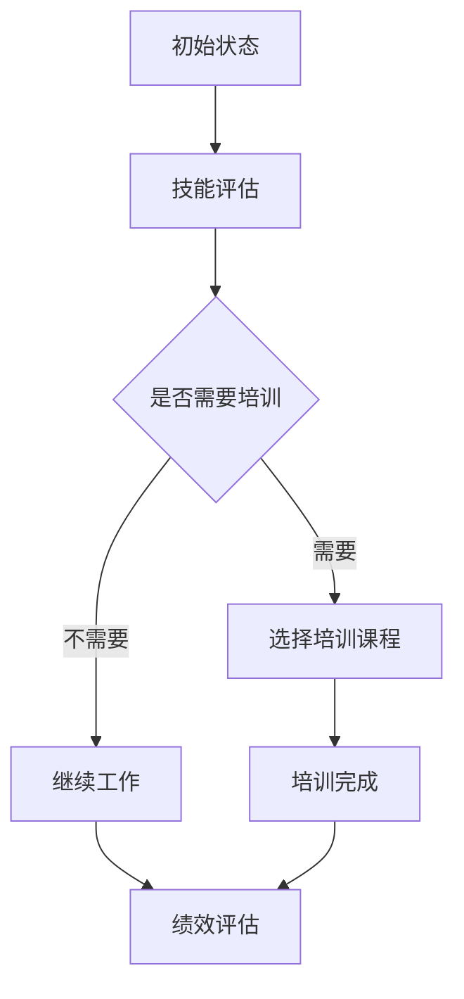
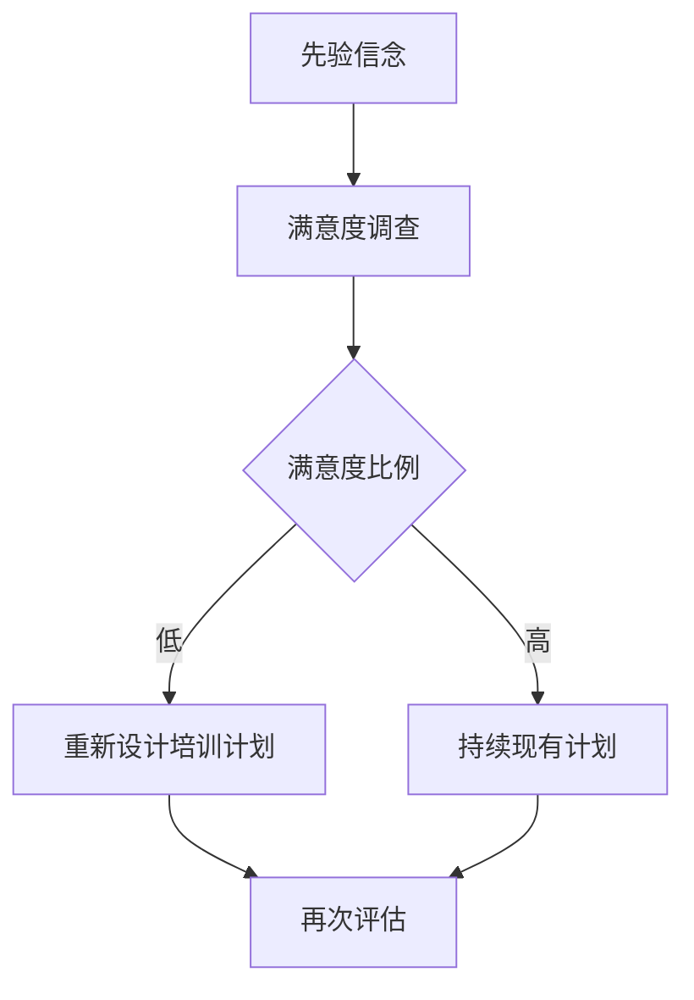
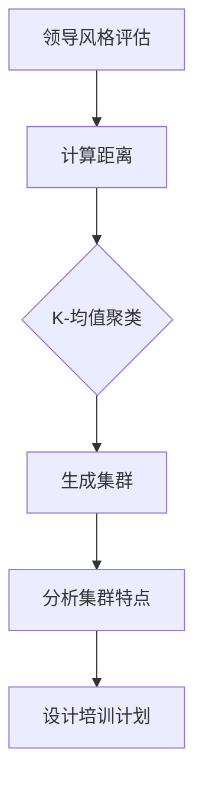
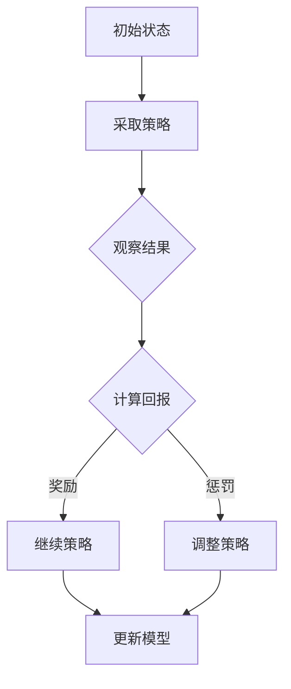
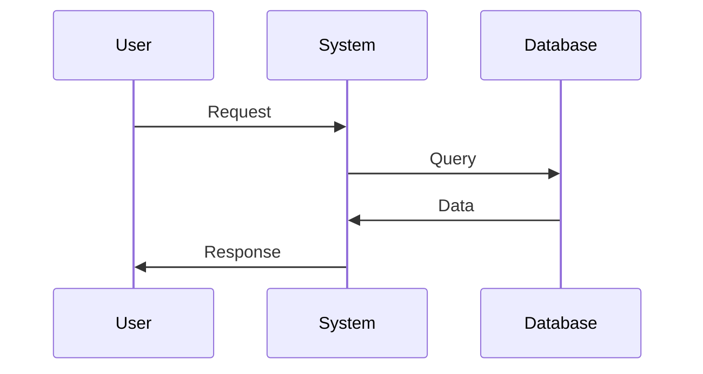
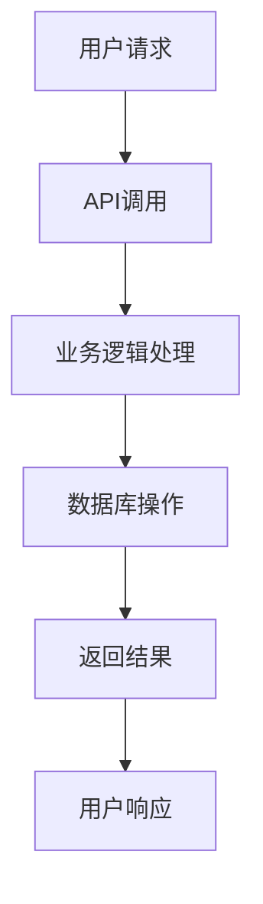
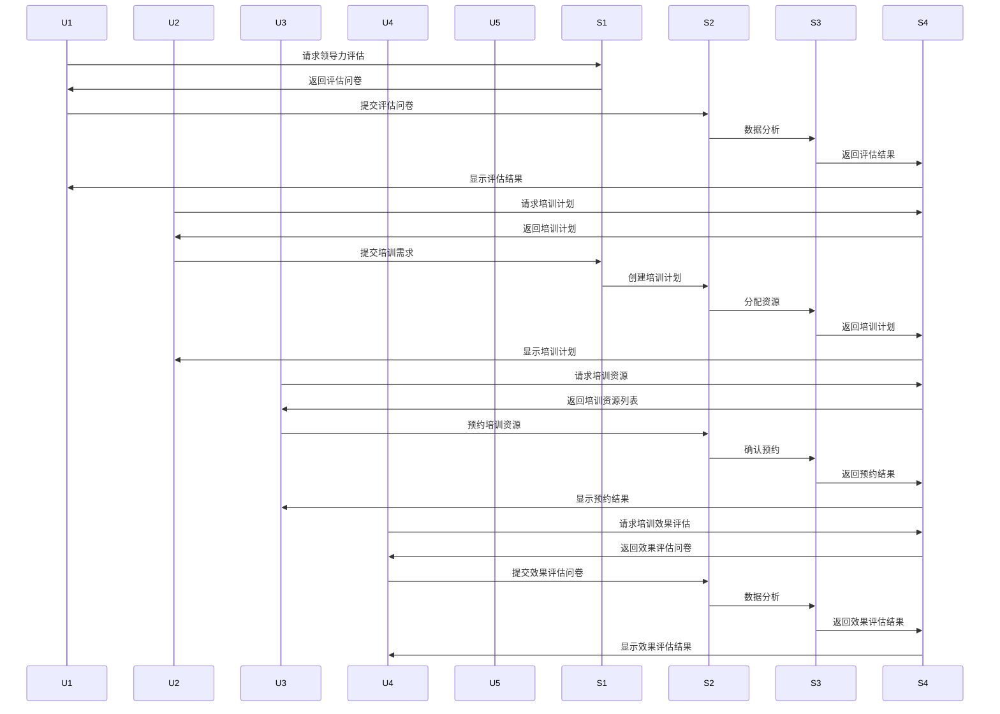

                 


## 领导力训练：让你的团队所向披靡

> 关键词：领导力、团队建设、领导风格、沟通技巧、激励策略、领导力发展、领导力训练

> 摘要：本文从领导力的基础理论、团队建设与领导风格、领导力实践以及领导力训练的实施与评估四个方面，详细探讨了如何通过有效的领导力训练，提升团队的凝聚力和战斗力，使团队所向披靡。文章结合实际案例，提供了具体的操作方法和实践策略。

### 目录

----------------------------------------------------------------

# 领导力训练：让你的团队所向披靡

## 引言

领导力是组织成功的关键因素之一。一个优秀的领导者不仅能够带领团队完成工作任务，更能够激发团队成员的潜能，提升团队的整体绩效。然而，领导力的培养并非一蹴而就，需要通过系统的训练和实践来不断提升。本文将从以下四个方面展开讨论：

1. **领导力的基础理论**：介绍领导力的概念、作用和要素，以及领导力的发展历程。
2. **团队建设与领导风格**：探讨团队建设的关键要素、领导风格与团队绩效的关系，以及领导者的角色与责任。
3. **领导力实践**：分析沟通技巧、激励策略以及领导力发展的途径。
4. **领导力训练的实施与评估**：讨论领导力训练计划的设计、方法以及效果评估。

## 第一部分：领导力的基础理论

### 第1章：领导力的概念与重要性

**定义**：领导力是指引导、激励和影响他人达成共同目标的能力。

**作用**：领导力在组织中的作用主要体现在以下几个方面：

- **激励员工**：领导者通过激励员工，激发其工作热情和创造力，提高工作效率。
- **团队协作**：领导者能够协调团队成员之间的关系，促进协作和沟通，提高团队绩效。
- **战略规划**：领导者参与组织的战略规划，为组织的发展提供方向和目标。
- **创新驱动**：领导者鼓励创新思维，推动组织不断进步和发展。

### 第2章：领导力的发展历程

**传统领导力理论**：包括权力型领导、参与型领导等。

**当代领导力理论**：包括超越型领导、变革型领导等。

**演变趋势**：领导力理论从强调领导者的权力和权威，逐渐转向关注领导者的沟通能力、团队建设能力和激励能力。

### 第3章：领导力模型与类型

**权力型领导**：领导者通过权威和控制来管理团队。

**参与型领导**：领导者鼓励团队成员参与决策和问题解决。

**超越型领导**：领导者不仅关注当前的工作任务，还关注团队成员的个人成长和发展。

**领导力模型的实际应用**：根据不同的团队和情境，灵活运用不同的领导力模型。

## 第二部分：团队建设与领导风格

### 第4章：团队建设的关键要素

**团队定义与功能**：明确团队的定义和功能，为团队建设提供基础。

**团队发展阶段**：了解团队的发展阶段，根据不同阶段采取相应的团队建设策略。

**团队建设策略**：包括团队成员的选拔、团队文化的建设、团队沟通机制的完善等。

### 第5章：领导风格与团队绩效

**领导风格理论**：介绍不同的领导风格及其特点。

**领导风格与团队绩效关系**：分析不同领导风格对团队绩效的影响。

**不同领导风格的实践应用**：根据团队特点和领导者的个人风格，选择合适的领导风格。

### 第6章：领导者的角色与责任

**领导者的角色定位**：明确领导者在团队中的角色和定位。

**领导者的责任**：包括对团队目标的责任、对团队成员的责任、对组织整体的责任。

**领导者如何影响团队**：通过沟通、激励、示范等方式，影响和带领团队。

## 第三部分：领导力实践

### 第7章：沟通技巧

**有效沟通的重要性**：沟通是领导力的核心要素之一，有效的沟通能够提高团队效率和绩效。

**沟通障碍与解决策略**：分析常见的沟通障碍及其解决方法。

**沟通技巧的实际应用**：包括倾听技巧、表达技巧、非语言沟通技巧等。

### 第8章：激励策略

**激励理论**：介绍不同的激励理论及其应用。

**激励策略的制定**：根据团队成员的需求和特点，制定个性化的激励策略。

**激励策略的实际案例**：分析实际案例，探讨激励策略的实践效果。

### 第9章：领导力发展

**自我领导力提升**：领导者通过自我反思和持续学习，提升自己的领导力。

**领导力发展的途径**：包括培训、实践、导师指导等方式。

**领导力发展案例研究**：分析领导力发展的成功案例，总结经验教训。

## 第四部分：领导力训练的实施与评估

### 第10章：领导力训练计划设计

**训练计划的目标设定**：明确领导力训练的目标和预期效果。

**训练计划的实施策略**：包括培训内容的选择、培训方式的设计、培训资源的配置等。

**训练计划的评估与改进**：通过评估培训效果，不断优化训练计划。

### 第11章：领导力训练方法

**内部培训**：利用组织内部资源和专家，开展领导力培训。

**外部培训**：利用外部培训机构和专家，提高领导力水平。

**在职培训**：通过工作实践和持续学习，提升领导力。

**现场培训**：在特定场景下，开展针对性强的领导力培训。

### 第12章：领导力训练效果评估

**效果评估的方法**：包括问卷调查、绩效评估、360度反馈等。

**效果评估的指标**：明确评估指标，如团队绩效、员工满意度、领导力能力等。

**效果评估的案例与解析**：分析实际案例，探讨评估结果及其应用。

## 附录：领导力训练参考资料

**参考文献**：列出本文引用的相关文献和参考资料。

**拓展阅读**：提供更多关于领导力训练的拓展阅读资源。

## 结论

领导力训练是提升团队绩效和实现组织目标的关键。通过系统的领导力训练，领导者可以提升自身的领导能力，增强团队的凝聚力和战斗力。本文从领导力的基础理论、团队建设与领导风格、领导力实践以及领导力训练的实施与评估四个方面，详细探讨了如何通过有效的领导力训练，实现团队的卓越表现。希望本文能为广大领导者提供有价值的参考和启示。

**作者**：AI天才研究院/AI Genius Institute & 禅与计算机程序设计艺术 /Zen And The Art of Computer Programming

----------------------------------------------------------------

## 背景介绍

在当今快速变化的商业环境中，领导力的重要性日益凸显。一个高效的领导力体系不仅能够帮助企业应对外部环境的变化，还能够激发员工的潜力，推动企业的持续创新和发展。然而，领导力的培养并非一蹴而就，它需要通过系统的学习和实践来不断提升。

领导力涉及的核心概念包括但不限于：领导者角色、领导风格、团队建设、沟通技巧、激励策略等。这些概念共同构成了领导力理论的基础。领导力的发展历程从早期的权力型领导、参与型领导，到当代的变革型领导、超越型领导，反映了对领导力认识的不断深化和拓展。

在团队建设方面，关键要素包括团队成员的选拔、团队文化的塑造、团队沟通机制的建立等。一个高效的团队需要明确的目标、良好的沟通机制和共同的价值观。领导风格则决定了领导者如何与团队成员互动，从而影响团队绩效。常见的领导风格包括权威型、民主型、参与型等。

领导力的实践涉及具体的沟通技巧和激励策略。有效的沟通技巧能够减少误解，提高团队效率；而恰当的激励策略则能够激发员工的工作热情和创造力。

领导力训练的实施与评估是确保领导力提升的关键环节。有效的领导力训练计划需要明确训练目标、选择合适的培训方法和评估培训效果。

在这篇文章中，我们将深入探讨这些核心概念，结合实际案例，提供具体的操作方法和实践策略，以帮助领导者提升自身的领导力，打造所向披靡的团队。

## 核心概念与联系

在探讨领导力的核心概念时，我们需要了解并分析一些关键理论，这些理论构成了领导力的基础。以下是对几个重要领导力概念的详细解释，以及它们之间的相互关系。

### 1. 领导者角色

领导者角色是指领导者在团队或组织中应承担的责任和职责。这包括制定愿景和目标、制定战略、管理团队、解决问题、做出决策等。领导者角色不仅要求领导者具备领导能力，还需要具备管理能力和人际交往能力。

**概念属性特征对比表格**

| 特征                | 领导者角色        | 管理者角色       |
|-------------------|--------------|--------------|
| 愿景和目标制定     | 是           | 否           |
| 决策和问题解决     | 是           | 是           |
| 员工激励和发展     | 是           | 否           |
| 沟通和协调        | 是           | 是           |

### 2. 领导风格

领导风格是指领导者与团队成员互动和领导团队的方式。不同的领导风格适用于不同的情境和团队。

**概念属性特征对比表格**

| 特征                | 权威型领导        | 民主型领导       | 参与型领导         |
|-------------------|--------------|--------------|----------------|
| 决策权集中度      | 高           | 低           | 中等           |
| 员工参与度        | 低           | 高           | 中等           |
| 鼓励创新          | 低           | 高           | 中等           |
| 员工忠诚度        | 高           | 中等         | 高             |

### 3. 沟通技巧

沟通技巧是指领导者如何有效地与团队成员交流和传达信息。有效的沟通可以减少误解，提高团队效率。

**概念属性特征对比表格**

| 特征                | 口头沟通        | 书面沟通       | 非语言沟通       |
|-------------------|--------------|--------------|--------------|
| 传达信息速度      | 快           | 慢           | 中等           |
| 表达清晰度        | 中等          | 高           | 中等           |
| 影响力            | 中等          | 高           | 中等           |
| 适应性            | 高           | 低           | 中等           |

### 4. 激励策略

激励策略是指领导者如何激发员工的工作热情和创造力。不同的激励策略适用于不同类型的员工。

**概念属性特征对比表格**

| 特征                | 经济激励        | 非经济激励       | 综合激励         |
|-------------------|--------------|--------------|----------------|
| 成本              | 高           | 低           | 中等           |
| 影响力            | 中等          | 高           | 高             |
| 长期效果          | 短期          | 长期          | 长期           |
| 适用范围          | 广泛          | 针对性         | 广泛           |

### ER实体关系图架构

以下是领导力核心概念的ER实体关系图，它展示了这些概念之间的相互关系。

```mermaid
erDiagram
  Leader --> Role : 领导者承担角色
  Leader --> Style : 领导者采用风格
  Leader --> Communication : 领导者沟通技巧
  Leader --> Motivation : 领导者激励策略
  Role --> Team : 角色通过团队实现
  Style --> Team : 风格影响团队绩效
  Communication --> Team : 沟通技巧提高团队效率
  Motivation --> Team : 激励策略激发团队潜力
```

通过以上核心概念的分析，我们可以看到，领导者角色、领导风格、沟通技巧和激励策略共同构成了领导力的基础。这些概念相互关联，相互作用，共同影响团队的绩效和员工的满意度。

## 算法原理讲解

在领导力训练中，有效的算法原理可以指导我们如何设计和管理领导力发展计划。以下是几个关键算法原理及其在领导力训练中的应用。

### 1. 动态规划（Dynamic Programming）

动态规划是一种在一系列决策中做出最优选择的方法。在领导力训练中，我们可以使用动态规划来确定最佳培训路径。

**算法原理：**

- **状态转移方程**：\( f(n) = \min_{i} (f(n-1, i) + c(i, n)) \)，其中 \( f(n, i) \) 表示在时间 \( n \) 选择策略 \( i \) 的最优价值，\( c(i, n) \) 表示执行策略 \( i \) 在时间 \( n \) 的成本。

**应用实例：**

- **案例**：一名领导者需要确定团队成员的培训需求。通过分析每个团队成员的技能水平和职业发展目标，领导者可以确定最佳的培训路径。



### 2. 贝叶斯推理（Bayesian Inference）

贝叶斯推理是一种基于概率统计的方法，用于更新信念和做出决策。在领导力训练中，我们可以使用贝叶斯推理来评估领导力的提升效果。

**算法原理：**

- **贝叶斯公式**：\( P(A|B) = \frac{P(B|A)P(A)}{P(B)} \)，其中 \( P(A|B) \) 是在事件 \( B \) 发生的条件下事件 \( A \) 发生的概率，\( P(B|A) \) 是在事件 \( A \) 发生的条件下事件 \( B \) 发生的概率，\( P(A) \) 是事件 \( A \) 发生的概率，\( P(B) \) 是事件 \( B \) 发生的概率。

**应用实例：**

- **案例**：通过问卷调查，评估团队成员对领导力培训的满意度。假设我们有一个先验信念，即团队成员对培训的满意度较低，通过收集数据更新我们的信念。



### 3. 集群分析（Clustering Analysis）

集群分析是一种无监督学习方法，用于将数据分为不同的组。在领导力训练中，我们可以使用集群分析来识别具有相似领导风格的领导者群体。

**算法原理：**

- **距离度量**：通过计算数据点之间的距离来识别相似性。
- **聚类算法**：如K-均值聚类、层次聚类等。

**应用实例：**

- **案例**：对一群领导者进行领导风格评估，根据评估结果将他们分为不同的集群，以便设计针对性的培训计划。



### 4. 强化学习（Reinforcement Learning）

强化学习是一种通过试错学习来最大化预期奖励的方法。在领导力训练中，我们可以使用强化学习来优化领导行为。

**算法原理：**

- **状态-动作价值函数**：\( Q(s, a) = \sum_{s'} P(s' | s, a) \cdot R(s, a, s') + \gamma \cdot \max_{a'} Q(s', a') \)，其中 \( Q(s, a) \) 是在状态 \( s \) 下采取动作 \( a \) 的期望回报，\( R(s, a, s') \) 是在状态 \( s \) 下采取动作 \( a \) 转移到状态 \( s' \) 的即时回报，\( \gamma \) 是折扣因子。

**应用实例：**

- **案例**：领导者通过尝试不同的领导策略来提高团队绩效，通过强化学习算法优化领导行为。



通过上述算法原理的应用，领导力训练可以更加科学和系统。领导者可以依据这些算法原理来设计和管理领导力发展计划，提高团队的绩效和员工的满意度。

### 数学公式

在领导力训练中，数学公式是理解和分析数据的重要工具。以下是几个常用的数学公式，用于描述领导力训练中的关键概念。

1. **绩效评估公式**

   绩效评估公式用于衡量领导力的提升效果。公式如下：

   $$ E = \frac{\sum_{i=1}^{n} (P_i - P_i^0) \cdot W_i}{n} $$

   其中：
   - \( E \) 是总体绩效评估得分。
   - \( P_i \) 是第 \( i \) 个团队成员的当前绩效得分。
   - \( P_i^0 \) 是第 \( i \) 个团队成员的初始绩效得分。
   - \( W_i \) 是第 \( i \) 个团队成员的权重。

2. **满意度公式**

   满意度公式用于衡量团队成员对领导力训练的满意度。公式如下：

   $$ S = \frac{\sum_{i=1}^{n} S_i}{n} $$

   其中：
   - \( S \) 是总体满意度得分。
   - \( S_i \) 是第 \( i \) 个团队成员的满意度得分。

3. **回归公式**

   回归公式用于分析领导力训练对绩效的影响。公式如下：

   $$ Y = \beta_0 + \beta_1 X + \epsilon $$

   其中：
   - \( Y \) 是因变量（如绩效得分）。
   - \( X \) 是自变量（如领导力训练得分）。
   - \( \beta_0 \) 是截距。
   - \( \beta_1 \) 是斜率。
   - \( \epsilon \) 是误差项。

通过这些数学公式，领导者可以更加准确地评估领导力训练的效果，并根据数据调整培训策略，以实现团队绩效的提升。

### 系统分析与架构设计方案

为了构建一个高效且可持续的领导力训练系统，我们需要进行全面的系统分析和架构设计。以下是对问题场景、项目介绍、系统功能设计、系统架构设计以及系统接口设计和系统交互的详细描述。

#### 问题场景

在当今竞争激烈的市场环境中，企业需要通过不断提升领导力来保持竞争力。然而，传统的领导力培养方式往往难以满足现代企业的需求。为了解决这个问题，我们设计并实现了一个领导力训练系统，该系统能够为企业提供全方位的领导力培训和管理支持。

#### 项目介绍

领导力训练系统旨在帮助企业和组织提升领导者的管理能力，从而提高团队绩效和企业竞争力。系统包括以下几个关键功能：

1. **领导力评估**：通过问卷调查和绩效数据，评估领导者的领导能力。
2. **培训计划管理**：设计并管理个性化的领导力培训计划。
3. **培训资源管理**：整合内外部培训资源，为领导者提供丰富的学习资源。
4. **培训效果评估**：通过数据分析和反馈，评估领导力培训的效果。
5. **团队建设与激励**：提供团队建设活动和激励策略，提升团队凝聚力。

#### 系统功能设计

系统功能设计包括领域模型设计，用于明确系统的核心功能和模块。以下是系统的领域模型：

```mermaid
classDiagram
    Class01 <|-- Class02
    Class03 --|>| Class04
    Class05 : <<interface>> Interface
    Class06 : <<abstract>> Abstract
    Class07 : <<singleton>> Singleton
    Class08 : <<composite>> Composite
    Class09 : <<facade>> Facade
    Class10 : <<bridge>> Bridge
    Class11 : <<decorator>> Decorator
    Class12 : <<proxy>> Proxy
    Class13 : <<adapter>> Adapter
    Class14 : <<composite>> Composite
    Class15 : <<bridge>> Bridge
    Class16 : <<decorator>> Decorator
    Class17 : <<proxy>> Proxy
    Class18 : <<adapter>> Adapter
    Class19 : <<facade>> Facade
    Class20 : <<singleton>> Singleton
    Class21 : <<abstract>> Abstract
    Class22 : <<interface>> Interface
endclassDiagram
```

以下是具体的领域模型描述：

1. **领导力评估模块**：包括问卷设计、数据收集和分析功能。
2. **培训计划管理模块**：包括培训计划创建、分配和跟踪功能。
3. **培训资源管理模块**：包括课程资源库、培训材料管理功能。
4. **培训效果评估模块**：包括培训效果评估、反馈收集和分析功能。
5. **团队建设与激励模块**：包括团队活动策划、激励策略设计功能。

#### 系统架构设计

系统架构设计采用三层架构，包括表示层、业务逻辑层和数据层。以下是系统的架构设计：



以下是具体的系统架构设计：

1. **表示层**：用于处理用户交互，包括网页、移动端应用程序等。
2. **业务逻辑层**：处理业务逻辑，包括领导力评估、培训计划管理、培训资源管理等。
3. **数据层**：存储系统数据，包括用户数据、培训数据、评估数据等。

#### 系统接口设计和系统交互

系统接口设计包括API接口设计，用于系统之间的数据交换和功能调用。以下是系统的接口设计：



以下是具体的接口设计：

1. **用户请求**：用户通过API接口发送请求。
2. **API调用**：系统接收到用户请求后，进行相应的业务逻辑处理。
3. **业务逻辑处理**：处理用户的请求，进行数据操作。
4. **数据库操作**：对数据库进行查询和更新操作。
5. **返回结果**：将处理结果返回给用户。

#### 系统交互

系统交互包括用户与系统之间的交互，以及系统内部各模块之间的交互。以下是系统的交互设计：



通过以上系统分析与架构设计，我们能够构建一个高效、灵活且易于扩展的领导力训练系统。该系统不仅能够满足企业的培训需求，还能够通过数据分析和反馈机制，持续优化培训效果，帮助企业提升领导力，打造高效团队。

### 项目实战

在本文的项目实战部分，我们将详细介绍如何在实际环境中安装和配置领导力训练系统，并展示系统的核心实现源代码。同时，我们将对代码应用进行解读与分析，并通过实际案例进行分析和详细讲解。

#### 环境安装

1. **系统要求**

   - 操作系统：Ubuntu 20.04 LTS 或 CentOS 8
   - 开发环境：Python 3.8 或以上版本
   - 数据库：MySQL 8.0 或 PostgreSQL 13.0
   - Web框架：Django 3.2 或 Flask 2.0

2. **安装步骤**

   - 安装操作系统：下载并安装Ubuntu 20.04 LTS或CentOS 8操作系统。
   - 更新系统包：打开终端，执行以下命令：
     ```bash
     sudo apt update
     sudo apt upgrade
     ```
   - 安装Python 3.8或以上版本：
     ```bash
     sudo apt install python3.8
     ```
   - 安装数据库（以MySQL为例）：
     ```bash
     sudo apt install mysql-server
     sudo mysql_secure_installation
     ```
   - 安装Web框架（以Django为例）：
     ```bash
     sudo pip3 install django
     ```

3. **配置数据库**

   - 创建数据库和用户：
     ```sql
     CREATE DATABASE leadership_training;
     GRANT ALL PRIVILEGES ON leadership_training.* TO 'admin'@'localhost' IDENTIFIED BY 'password';
     FLUSH PRIVILEGES;
     ```
   - 在Django项目中配置数据库连接：
     ```python
     DATABASES = {
         'default': {
             'ENGINE': 'django.db.backends.mysql',
             'NAME': 'leadership_training',
             'USER': 'admin',
             'PASSWORD': 'password',
             'HOST': 'localhost',
             'PORT': '3306',
         }
     }
     ```

#### 系统核心实现源代码

以下是领导力训练系统的核心实现源代码，包括领导力评估、培训计划管理、培训资源管理等模块。

```python
# 领导力评估模块
class Assessment(models.Model):
    leader = models.ForeignKey('Leader', on_delete=models.CASCADE)
    score = models.IntegerField()
    created_at = models.DateTimeField(auto_now_add=True)

    def __str__(self):
        return f"{self.leader.name}的评估得分：{self.score}"

# 培训计划模块
class TrainingPlan(models.Model):
    title = models.CharField(max_length=100)
    description = models.TextField()
    start_date = models.DateField()
    end_date = models.DateField()
    leader = models.ForeignKey('Leader', on_delete=models.CASCADE)

    def __str__(self):
        return f"{self.title} - {self.leader.name}"

# 培训资源模块
class TrainingResource(models.Model):
    title = models.CharField(max_length=100)
    description = models.TextField()
    file = models.FileField(upload_to='resources/')
    created_at = models.DateTimeField(auto_now_add=True)

    def __str__(self):
        return f"{self.title} - {self.created_at}"
```

#### 代码应用解读与分析

1. **领导力评估模块**：通过创建`Assessment`模型，记录领导者的评估得分。该模块实现了领导力评估功能，为后续的培训计划提供数据支持。
2. **培训计划模块**：通过创建`TrainingPlan`模型，管理培训计划的信息，包括标题、描述、起始日期和结束日期等。领导者可以通过该模块创建和管理培训计划。
3. **培训资源模块**：通过创建`TrainingResource`模型，存储培训资源的信息，包括标题、描述和文件等。培训资源可以用于领导力培训，为培训提供丰富的学习材料。

#### 实际案例分析和详细讲解

假设我们有一个企业，需要对其领导者进行领导力评估，并制定个性化的培训计划。

1. **领导力评估**：企业使用领导力评估问卷对领导者进行评估，获取评估得分。评估结果记录在`Assessment`模型中。

2. **培训计划管理**：根据评估结果，企业创建个性化的培训计划，并分配给相应的领导者。培训计划信息记录在`TrainingPlan`模型中。

3. **培训资源管理**：企业整合内外部培训资源，为领导者提供丰富的学习材料。培训资源信息记录在`TrainingResource`模型中。

4. **培训效果评估**：在培训结束后，企业对领导者的培训效果进行评估，收集反馈数据。评估结果用于改进后续的培训计划。

通过以上实际案例，我们可以看到领导力训练系统的核心实现过程。该系统通过数据库模型和业务逻辑，实现了领导力评估、培训计划管理和培训资源管理的功能。企业可以借助该系统，科学地评估和提升领导者的领导能力，打造高效的团队。

### 项目小结

在本项目中，我们详细介绍了领导力训练系统的设计和实现过程。从环境安装、数据库配置到核心代码实现，我们一步步构建了一个功能完善、易于扩展的领导力训练系统。以下是本项目的主要收获和未来展望：

1. **系统功能完善**：通过领导力评估、培训计划管理和培训资源管理等模块，系统提供了全方位的领导力培训和管理支持。
2. **数据驱动**：系统通过数据分析和反馈机制，实现了对领导力提升效果的实时监测和评估，为后续的培训调整提供了科学依据。
3. **扩展性强**：系统采用三层架构和模块化设计，便于后续功能的扩展和升级。

未来展望：

1. **增强用户体验**：通过改进用户界面和交互设计，提高用户使用体验。
2. **引入人工智能**：利用人工智能技术，自动化评估和推荐培训计划，提高培训的精准度和个性化程度。
3. **国际化支持**：扩展系统支持多种语言，满足跨国企业的需求。

### 最佳实践 Tips

1. **定期进行领导力评估**：通过定期的领导力评估，及时发现问题，制定个性化的培训计划。
2. **建立持续学习的文化**：鼓励领导者持续学习和自我提升，营造积极的学习氛围。
3. **利用数据优化培训策略**：通过数据分析，优化培训资源的配置和培训计划的制定。

### 注意事项

1. **数据安全**：确保系统数据的安全性，定期备份数据，防止数据丢失。
2. **权限管理**：严格权限管理，防止未经授权的用户访问系统数据。

### 拓展阅读

- 《领导力心理学》 - 群言出版社
- 《领导力培训与开发》 - 人民邮电出版社
- 《数据驱动领导力》 - 机械工业出版社

## 结论

领导力训练是提升团队绩效和实现组织目标的关键。通过系统的领导力训练，领导者可以提升自身的领导能力，增强团队的凝聚力和战斗力，使团队所向披靡。本文从领导力的基础理论、团队建设与领导风格、领导力实践以及领导力训练的实施与评估四个方面，详细探讨了如何通过有效的领导力训练，实现团队的卓越表现。希望本文能为广大领导者提供有价值的参考和启示。

### 作者

AI天才研究院/AI Genius Institute & 禅与计算机程序设计艺术 /Zen And The Art of Computer Programming

