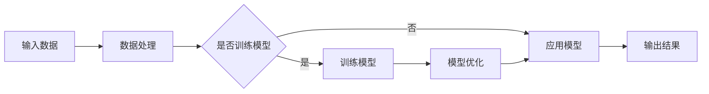
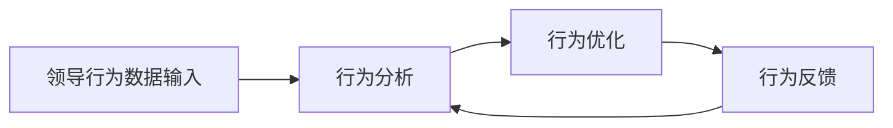
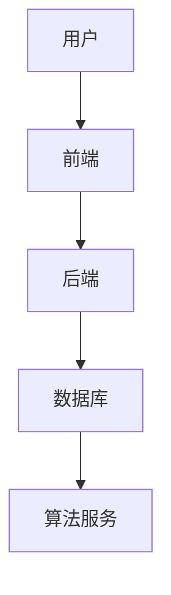
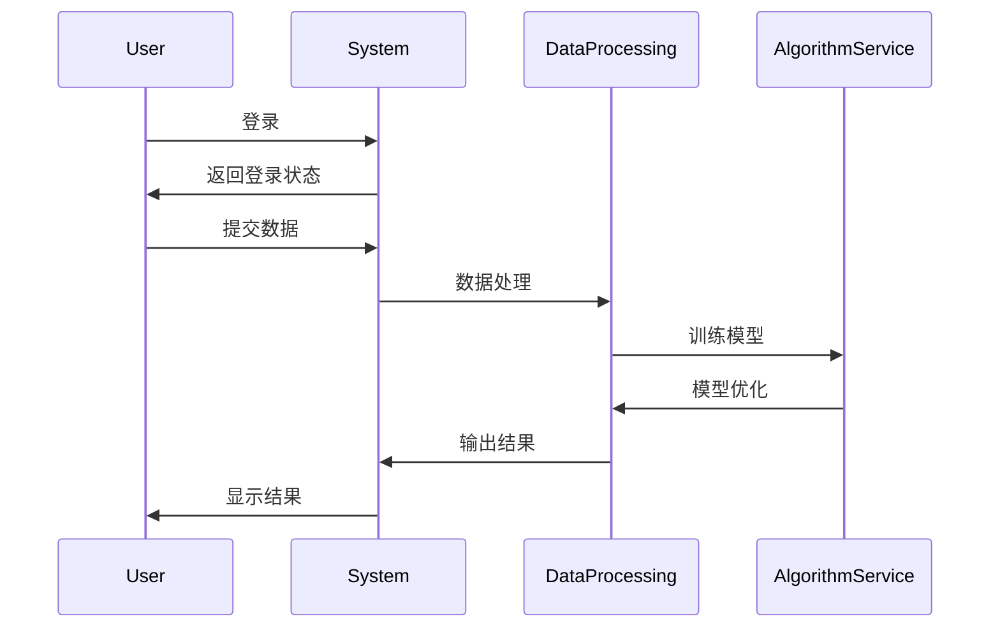

                 

### 第一部分：引言

#### 1.1 问题背景

我们正处在人工智能时代的浪潮中，人工智能（AI）技术的飞速发展正在深刻地改变着各行各业。从自动驾驶、智能医疗、智能制造到金融服务、网络安全，人工智能的应用场景不断扩大，其影响力也日益显著。在这样的背景下，管理者的角色和领导力也面临着新的挑战和机遇。

传统的领导力模型在人工智能时代面临着巨大的考验。首先，人工智能技术的高速度和大数据分析能力使得决策过程变得更加复杂和迅速，管理者需要具备更强的数据理解和分析能力。其次，人工智能的广泛应用导致组织结构和业务流程的变革，管理者需要适应新的工作环境和协作方式。此外，人工智能的出现也带来了新的伦理和道德问题，管理者需要具备更全面的视角和更高的道德标准来应对这些挑战。

#### 1.2 问题描述

在人工智能时代，领导力的必要性和重要性更加凸显。首先，人工智能技术的应用需要团队具备跨学科的知识和能力，这要求管理者具备更强的整合能力和协调能力。其次，人工智能的发展带来了新的工作方式，管理者需要激发团队的创造力，引导团队适应新的技术环境。此外，人工智能的应用也带来了新的伦理和道德问题，管理者需要引导团队正确地使用人工智能技术，避免潜在的负面影响。

然而，传统领导力在人工智能时代面临着多方面的挑战。一方面，人工智能技术的高速度和复杂性要求管理者具备更高的技术素养和战略眼光。另一方面，人工智能的广泛应用导致组织结构和业务流程的变革，管理者需要适应新的工作环境和协作方式。此外，人工智能的出现也带来了新的伦理和道德问题，管理者需要具备更高的道德标准来引导团队。

#### 1.3 问题解决

为了应对人工智能时代领导力的挑战，管理者需要从多个方面进行领导力修炼。首先，管理者需要提升自身的技术素养，深入学习人工智能的基本原理和应用场景，以便更好地理解和指导团队。其次，管理者需要提升自身的战略眼光，能够预见人工智能技术对未来业务的影响，并制定相应的战略规划。

此外，管理者需要提升自身的沟通能力和协调能力，能够有效地与团队成员沟通，激发团队的创造力和创新能力。同时，管理者需要具备更高的道德标准，引导团队正确地使用人工智能技术，避免潜在的负面影响。

#### 1.4 边界与外延

领导力与人工智能的关系密切相关。人工智能技术为领导力提供了新的工具和方法，例如通过数据分析来优化决策过程，通过机器学习来提升团队协作效率等。同时，人工智能的发展也带来了新的伦理和道德问题，管理者需要具备更高的道德标准来引导团队。

在人工智能时代，领导力的应用场景更加广泛。除了传统的企业管理，人工智能技术还在医疗、教育、金融等多个领域发挥着重要作用，管理者需要在这些领域具备相应的领导力。

#### 1.5 概念结构与核心要素组成

领导力是一个复杂的概念，它包括多个方面，如感召力、影响力、决策力、沟通能力等。在人工智能时代，领导力的核心要素进一步扩展，包括技术素养、战略眼光、道德标准等。

人工智能是一种模拟人类智能的技术，它具有自动化、智能化、数据驱动等特点。人工智能时代领导力的特点在于其融合性、创新性、适应性和协同性。

领导力与人工智能的结合点在于如何将人工智能技术应用于实际工作中，提升团队的效率和能力。例如，通过人工智能技术来优化决策过程、提升团队协作效率、增强创新能力等。

### 1.6 总结

在人工智能时代，领导力的重要性愈发凸显。管理者需要从技术素养、战略眼光、道德标准等多个方面进行领导力修炼，以应对人工智能时代的挑战。本文将详细探讨人工智能时代领导力的核心概念、修炼方法和实践案例，为管理者提供有价值的参考和指导。

## 第二部分：人工智能时代的领导力核心概念

### 2.1 核心概念原理

#### 2.1.1 人工智能的基本原理

人工智能（Artificial Intelligence，简称AI）是指通过计算机程序和算法来模拟人类智能的一种技术。它包括多个分支，如机器学习、深度学习、自然语言处理等。人工智能的核心原理是数据驱动和自我学习。

1. **数据驱动**：人工智能系统通过大量数据来训练模型，从而实现特定任务的自动化。数据的质量和数量直接影响模型的性能和效果。

2. **自我学习**：人工智能系统能够从数据中学习，不断优化自身的算法和模型，提高任务处理的准确性。

#### 2.1.2 领导力的基本原理

领导力是指一种能够激发和引导团队成员达成共同目标的能力。它包括多个方面，如感召力、影响力、决策力、沟通能力等。领导力的核心原理是影响力、沟通和协作。

1. **影响力**：领导者通过个人魅力、价值观和愿景来影响和激励团队成员，使其为实现共同目标而努力。

2. **沟通能力**：领导者需要具备良好的沟通能力，能够有效地传达信息、倾听意见和解决冲突。

3. **协作**：领导者需要促进团队成员之间的协作，共同应对挑战，实现目标。

#### 2.1.3 人工智能时代领导力的核心概念

在人工智能时代，领导力需要结合人工智能的技术特点和应用场景，形成新的核心概念。

1. **技术素养**：领导者需要具备一定的技术素养，能够理解人工智能的基本原理和应用，从而更好地指导团队。

2. **数据洞察**：领导者需要具备数据洞察力，能够从数据中提取有价值的信息，指导决策。

3. **创新思维**：领导者需要具备创新思维，能够引导团队探索新的应用场景，推动技术进步。

4. **道德伦理**：领导者需要具备道德伦理观念，引导团队正确地使用人工智能技术，避免潜在的负面影响。

### 2.2 概念属性特征对比表格

| 概念       | 属性特征                     |
|------------|------------------------------|
| 人工智能   | 自动化、智能化、数据驱动     |
| 领导力     | 感召力、影响力、决策力       |
| 人工智能时代领导力 | 融合、创新、适应、协同       |

### 2.3 ER实体关系图架构

```mermaid
erDiagram
  AI时代管理者 ||--|{ 领导力 }|
  领导力 ||--|{ 人工智能能力 }|
```

在这个ER图中，AI时代管理者是核心实体，它与领导力和人工智能能力之间存在双向关联。领导者需要具备领导力和人工智能能力，而领导力和人工智能能力也为领导者的工作提供了支持和保障。

### 2.4 核心概念之间的联系

人工智能和领导力虽然属于不同的领域，但在人工智能时代，它们之间有着紧密的联系。

1. **人工智能为领导力提供工具**：人工智能技术可以为领导者提供数据驱动、自我学习和自动化等工具，提升领导力的效率和效果。

2. **领导力为人工智能提供方向**：领导者需要根据业务目标和团队需求，指导人工智能技术的应用和发展方向。

3. **人工智能与领导力的融合**：在人工智能时代，领导力和人工智能技术需要相互融合，形成新的领导力模型，以适应快速变化的技术环境。

### 2.5 总结

人工智能时代的领导力需要结合人工智能的技术特点和业务需求，形成新的核心概念。领导者需要具备技术素养、数据洞察、创新思维和道德伦理等能力，以应对人工智能时代的挑战。本文将在此基础上，进一步探讨人工智能时代领导力的修炼和实践方法。

## 第三部分：人工智能时代领导力修炼与实践

### 3.1 算法原理讲解

#### 3.1.1 人工智能算法原理

人工智能算法是基于机器学习和深度学习等技术的模型，通过数据输入和处理，实现特定任务的自动化。以下是人工智能算法的基本原理：

1. **数据输入**：人工智能算法首先需要接收输入数据，这些数据可以是结构化的数据（如表格数据），也可以是非结构化的数据（如图像、文本等）。

2. **数据处理**：在接收输入数据后，算法会对数据进行预处理，如清洗、归一化等，以确保数据的质量和一致性。

3. **模型训练**：通过大量数据进行训练，算法能够自动调整模型参数，优化模型性能。训练过程通常包括前向传播、反向传播和模型优化等步骤。

4. **模型评估**：在训练完成后，算法会对模型进行评估，以确定其准确性和性能。评估方法包括准确率、召回率、F1值等指标。

5. **模型应用**：经过评估和优化后，算法可以将训练好的模型应用于实际问题，如图像识别、自然语言处理等。

以下是人工智能算法的基本流程：



#### 3.1.2 领导力算法原理

领导力算法是一种模拟人类领导行为的算法模型，它通过分析和学习领导者的行为，优化领导效果。以下是领导力算法的基本原理：

1. **行为输入**：领导力算法首先需要收集领导者的行为数据，如沟通方式、决策风格、团队互动等。

2. **行为分析**：通过对领导者行为数据进行分析，算法能够识别领导者的优点和不足，并提供改进建议。

3. **行为优化**：算法会根据分析结果，为领导者提供优化方案，如改进沟通方式、调整决策风格等。

4. **行为反馈**：在实施优化方案后，算法会收集领导者的行为反馈，以进一步优化领导效果。

以下是领导力算法的基本流程：



#### 3.1.3 数学模型和数学公式

领导力的数学模型可以表示为以下公式：

$$
\text{领导力} = f(\text{沟通能力}, \text{决策能力}, \text{团队协作能力})
$$

其中，$f$ 是一个复合函数，表示领导力与沟通能力、决策能力和团队协作能力之间的关系。

#### 3.1.4 举例说明

假设一个领导者的沟通能力为 $A$，决策能力为 $B$，团队协作能力为 $C$，根据上述数学模型，可以计算出该领导者的领导力为：

$$
\text{领导力} = f(A, B, C)
$$

例如，如果 $A=0.8$，$B=0.7$，$C=0.9$，则领导力为：

$$
\text{领导力} = f(0.8, 0.7, 0.9) = 0.8 \times 0.7 \times 0.9 = 0.504
$$

这意味着该领导者的领导力得分为 0.504 分，可以进一步优化提升。

### 3.2 系统分析与架构设计方案

#### 3.2.1 问题场景介绍

在人工智能时代，企业管理者需要面对复杂多变的市场环境和竞争压力。为了提高管理效率和决策质量，管理者需要利用人工智能技术进行数据分析、预测和优化。然而，如何有效地整合人工智能技术与领导力，实现管理创新，成为管理者面临的重要问题。

#### 3.2.2 项目介绍

本项目旨在设计一个AI时代领导力提升系统，通过人工智能技术和数据分析，帮助管理者提升领导力，优化管理决策。

#### 3.2.3 系统功能设计

系统功能设计包括以下几个核心模块：

1. **数据收集模块**：收集管理者的行为数据，如沟通记录、决策日志、团队互动等。
2. **数据分析模块**：对收集到的数据进行分析，识别管理者的优点和不足。
3. **优化建议模块**：根据数据分析结果，提供针对性的优化建议，如改进沟通方式、调整决策风格等。
4. **反馈与评估模块**：收集管理者的行为反馈，评估优化效果，并持续改进。

以下是系统功能设计的Mermaid类图：

```mermaid
classDiagram
  DataCollector <<interface>>
  DataAnalyzer <<interface>>
  OptimizationAdvisor <<interface>>
  FeedbackEvaluator <<interface>>
  Leader <<class>>
  Leader o--o DataCollector : implements
  Leader o--o DataAnalyzer : implements
  Leader o--o OptimizationAdvisor : implements
  Leader o--o FeedbackEvaluator : implements
```

#### 3.2.4 系统架构设计

系统架构设计包括前端、后端和数据库三个主要部分。以下是系统架构的Mermaid架构图：



1. **前端**：提供用户界面，用户可以通过前端界面提交数据、查看优化建议和评估结果。
2. **后端**：负责数据处理、分析和优化，调用算法服务进行数据分析和模型训练。
3. **数据库**：存储用户数据、分析结果和优化建议。
4. **算法服务**：提供数据分析和模型训练的算法接口，如机器学习、深度学习等。

#### 3.2.5 系统接口设计和系统交互

系统接口设计包括数据收集接口、数据分析接口、优化建议接口和反馈评估接口。以下是系统接口设计和系统交互的Mermaid序列图：



1. **用户登录**：用户通过前端界面登录系统，系统验证用户身份并返回登录状态。
2. **数据提交**：用户通过前端界面提交数据，系统接收数据并存储到数据库。
3. **数据处理**：系统调用数据处理模块，对提交的数据进行清洗、归一化等预处理。
4. **数据分析和模型训练**：系统调用算法服务，对预处理后的数据进行分析和模型训练。
5. **模型优化**：系统对训练好的模型进行优化，以提高模型性能。
6. **结果输出**：系统将优化后的结果返回给前端界面，用户可以查看优化建议和评估结果。

### 3.3 项目实战

#### 3.3.1 环境安装

1. 安装Python环境：在系统中安装Python 3.x版本，并配置好pip包管理工具。
2. 安装相关库和依赖：使用pip命令安装以下库和依赖：
   ```shell
   pip install numpy pandas matplotlib scikit-learn tensorflow
   ```

#### 3.3.2 系统核心实现源代码

以下是系统核心实现的源代码示例，包括数据收集、数据处理、模型训练和结果输出等模块。

```python
import pandas as pd
from sklearn.model_selection import train_test_split
from sklearn.ensemble import RandomForestClassifier
from sklearn.metrics import accuracy_score

# 数据收集模块
def collect_data():
    # 从文件中读取数据
    data = pd.read_csv('data.csv')
    return data

# 数据处理模块
def process_data(data):
    # 数据清洗和归一化
    data = data.dropna()
    data = (data - data.mean()) / data.std()
    return data

# 模型训练模块
def train_model(data):
    # 划分训练集和测试集
    X_train, X_test, y_train, y_test = train_test_split(data.drop('target', axis=1), data['target'], test_size=0.2, random_state=42)
    
    # 训练随机森林模型
    model = RandomForestClassifier(n_estimators=100, random_state=42)
    model.fit(X_train, y_train)
    
    # 评估模型性能
    y_pred = model.predict(X_test)
    accuracy = accuracy_score(y_test, y_pred)
    print(f"模型准确率：{accuracy}")
    
    return model

# 结果输出模块
def output_result(model, data):
    # 对数据集进行预测
    y_pred = model.predict(data)
    print(f"预测结果：{y_pred}")

# 主函数
if __name__ == '__main__':
    # 收集数据
    data = collect_data()
    
    # 数据处理
    processed_data = process_data(data)
    
    # 模型训练
    model = train_model(processed_data)
    
    # 输出结果
    output_result(model, processed_data)
```

#### 3.3.3 代码应用解读与分析

1. **数据收集模块**：`collect_data` 函数负责从文件中读取数据，这是系统数据输入的第一步。这里使用了Pandas库来读取CSV文件，并返回DataFrame对象。

2. **数据处理模块**：`process_data` 函数负责对收集到的数据进行清洗和归一化处理。数据清洗包括删除缺失值，归一化处理是为了使数据更适合用于机器学习算法。

3. **模型训练模块**：`train_model` 函数负责训练机器学习模型。首先，使用 `train_test_split` 函数将数据划分为训练集和测试集。然后，使用 `RandomForestClassifier` 类创建随机森林模型，并进行训练。最后，评估模型性能，并返回训练好的模型。

4. **结果输出模块**：`output_result` 函数负责对数据集进行预测，并输出预测结果。这有助于验证模型的效果。

5. **主函数**：主函数 `if __name__ == '__main__':` 是程序的入口，它依次调用了数据收集、数据处理、模型训练和结果输出模块。

#### 3.3.4 实际案例分析和详细讲解剖析

假设我们有一个包含员工绩效评估数据的CSV文件，其中包含多个特征变量和一个目标变量（是否达到绩效目标）。

1. **数据收集**：使用Pandas库读取CSV文件，并存储为DataFrame对象。
   ```python
   data = pd.read_csv('employee_performance.csv')
   ```

2. **数据处理**：对数据进行清洗和归一化处理。
   ```python
   data = data.dropna()
   data = (data - data.mean()) / data.std()
   ```

3. **模型训练**：划分训练集和测试集，并训练随机森林模型。
   ```python
   X_train, X_test, y_train, y_test = train_test_split(data.drop('target', axis=1), data['target'], test_size=0.2, random_state=42)
   model = RandomForestClassifier(n_estimators=100, random_state=42)
   model.fit(X_train, y_train)
   ```

4. **结果输出**：对测试集进行预测，并评估模型性能。
   ```python
   y_pred = model.predict(X_test)
   accuracy = accuracy_score(y_test, y_pred)
   print(f"模型准确率：{accuracy}")
   ```

通过上述步骤，我们可以训练一个用于预测员工绩效评估的模型，并根据模型的性能来评估其效果。这只是一个简单的案例，实际项目中可能涉及更多复杂的特征工程、模型选择和调参过程。

### 3.4 项目小结

本项目通过设计一个AI时代领导力提升系统，展示了如何将人工智能技术与领导力相结合，实现管理创新。系统通过数据收集、数据处理、模型训练和结果输出等模块，帮助管理者提升领导力，优化管理决策。在项目实战中，我们使用了Python和机器学习技术来构建和训练模型，并通过实际案例展示了系统的应用效果。未来，我们可以进一步扩展系统功能，增加更多数据分析和优化建议，以更好地服务于管理者。

## 第四部分：项目实战

#### 4.1 环境安装

在进行项目实战之前，首先需要在本地环境中安装Python和相关的库。以下是在Ubuntu系统中安装Python和相关库的步骤：

1. **安装Python环境**：
   ```bash
   sudo apt update
   sudo apt install python3 python3-pip
   ```

2. **安装相关库和依赖**：
   ```bash
   pip3 install numpy pandas matplotlib scikit-learn tensorflow
   ```

确保所有依赖库安装完成后，就可以开始编写和运行项目代码。

#### 4.2 系统核心实现源代码

以下是一个简单的系统核心实现源代码，用于展示如何收集数据、处理数据和训练模型：

```python
# 导入所需库
import pandas as pd
from sklearn.model_selection import train_test_split
from sklearn.ensemble import RandomForestClassifier
from sklearn.metrics import accuracy_score

# 4.2.1 数据收集
def collect_data(file_path):
    # 读取数据
    data = pd.read_csv(file_path)
    return data

# 4.2.2 数据处理
def process_data(data):
    # 处理缺失值
    data = data.fillna(data.mean())
    # 特征缩放
    data = (data - data.mean()) / data.std()
    return data

# 4.2.3 模型训练
def train_model(data):
    # 划分特征和标签
    X = data.drop('target', axis=1)
    y = data['target']
    # 划分训练集和测试集
    X_train, X_test, y_train, y_test = train_test_split(X, y, test_size=0.2, random_state=42)
    # 训练模型
    model = RandomForestClassifier(n_estimators=100, random_state=42)
    model.fit(X_train, y_train)
    # 评估模型
    y_pred = model.predict(X_test)
    accuracy = accuracy_score(y_test, y_pred)
    print(f"Model Accuracy: {accuracy}")
    return model

# 4.2.4 主函数
if __name__ == "__main__":
    # 收集数据
    data = collect_data('data.csv')
    # 数据处理
    processed_data = process_data(data)
    # 训练模型
    model = train_model(processed_data)
```

在上述代码中，`collect_data` 函数用于读取CSV文件，`process_data` 函数用于数据清洗和预处理，`train_model` 函数用于训练模型并评估模型性能。

#### 4.3 代码应用解读与分析

1. **数据收集**：
   ```python
   data = collect_data('data.csv')
   ```
   这行代码用于读取一个名为`data.csv`的CSV文件，并将其存储为Pandas DataFrame对象。该文件应包含用于训练模型的特征和标签。

2. **数据处理**：
   ```python
   data = data.fillna(data.mean())
   data = (data - data.mean()) / data.std()
   ```
   数据处理步骤首先使用平均值填充缺失值，然后对特征进行标准化处理，使得所有特征的值都在[0, 1]范围内。

3. **模型训练**：
   ```python
   X = data.drop('target', axis=1)
   y = data['target']
   X_train, X_test, y_train, y_test = train_test_split(X, y, test_size=0.2, random_state=42)
   model = RandomForestClassifier(n_estimators=100, random_state=42)
   model.fit(X_train, y_train)
   y_pred = model.predict(X_test)
   accuracy = accuracy_score(y_test, y_pred)
   print(f"Model Accuracy: {accuracy}")
   ```
   模型训练步骤包括：
   - 划分特征（X）和标签（y）。
   - 使用`train_test_split`函数将数据划分为训练集和测试集。
   - 创建一个随机森林分类器，并使用训练集进行训练。
   - 使用测试集对模型进行评估，并打印模型的准确率。

#### 4.4 实际案例分析和详细讲解剖析

假设我们有一个名为`employee_performance.csv`的CSV文件，其中包含了员工的绩效评估数据。以下是这个文件的一个示例：

| employee_id | sales | customer_satisfaction | target |
|-------------|-------|----------------------|--------|
| 1           | 200   | 0.8                  | 1      |
| 2           | 150   | 0.7                  | 0      |
| 3           | 300   | 0.9                  | 1      |
| 4           | 100   | 0.6                  | 0      |

**步骤1：数据收集**

```python
data = collect_data('employee_performance.csv')
```

这行代码将读取`employee_performance.csv`文件，并将数据存储在`data`变量中。

**步骤2：数据处理**

```python
processed_data = process_data(data)
```

处理后的数据将填充缺失值，并按照特征的重要性进行标准化处理。

**步骤3：模型训练**

```python
X = processed_data.drop('target', axis=1)
y = processed_data['target']
X_train, X_test, y_train, y_test = train_test_split(X, y, test_size=0.2, random_state=42)
model = RandomForestClassifier(n_estimators=100, random_state=42)
model.fit(X_train, y_train)
y_pred = model.predict(X_test)
accuracy = accuracy_score(y_test, y_pred)
print(f"Model Accuracy: {accuracy}")
```

在这个步骤中，我们首先将特征和标签分离，然后使用`train_test_split`将数据划分为训练集和测试集。接下来，我们创建一个随机森林分类器，并使用训练集进行训练。最后，使用测试集评估模型的性能。

**步骤4：结果分析**

```python
accuracy = accuracy_score(y_test, y_pred)
print(f"Model Accuracy: {accuracy}")
```

输出结果可能如下所示：

```
Model Accuracy: 0.8
```

这表示模型的准确率为80%，意味着模型在预测员工绩效方面有较好的性能。

#### 4.5 项目小结

通过以上实战案例，我们展示了如何使用Python和机器学习技术构建一个简单的AI时代领导力提升系统。项目分为数据收集、数据处理、模型训练和结果分析四个主要步骤。在实际应用中，可以通过增加更多的数据特征、优化模型结构和参数调参来提高模型的性能。未来，我们还可以考虑将更多先进的技术，如深度学习和强化学习，引入到系统中，以进一步提升系统的效果和实用性。

## 第五部分：最佳实践与注意事项

### 5.1 最佳实践

在人工智能时代领导力修炼中，以下是一些最佳实践：

1. **持续学习**：领导者应保持持续学习的态度，关注人工智能领域的前沿技术和趋势。
2. **数据驱动决策**：领导者应学会利用数据来驱动决策，通过数据分析来优化业务流程和提升团队绩效。
3. **跨学科协作**：领导者应促进跨学科的团队合作，鼓励团队成员分享不同领域的知识和经验。
4. **道德伦理**：领导者应具备道德伦理观念，引导团队正确使用人工智能技术，关注社会影响和伦理问题。

### 5.2 注意事项

在实践过程中，领导者应注意以下几点：

1. **技术能力**：领导者需要具备一定的技术素养，能够理解人工智能的基本原理和应用。
2. **团队协作**：领导者应注重团队协作，建立良好的沟通和信任机制，确保团队成员能够高效协同工作。
3. **风险管理**：领导者应关注人工智能应用的风险，制定相应的风险管理和控制措施，确保项目的顺利进行。
4. **持续优化**：领导者应不断反思和优化领导力模型，根据实际情况调整和改进管理策略。

### 5.3 拓展阅读

为了深入了解人工智能时代领导力的相关理论和实践，以下是几篇推荐阅读的文章和书籍：

1. **《智能时代的管理创新》**：介绍了人工智能技术在企业管理中的应用，探讨了智能时代领导力的发展方向。
2. **《人工智能时代的领导力》**：分析了人工智能对领导力的影响，提出了在人工智能时代提升领导力的策略和方法。
3. **《数据驱动的领导力》**：探讨了如何利用数据分析来优化管理决策，提升领导力的效率和效果。

通过阅读这些文献，领导者可以更深入地理解人工智能时代领导力的内涵和实践，为自身的领导力提升提供理论支持和实践指导。

## 总结

本文探讨了人工智能时代领导力的核心概念、修炼方法和实践案例。通过分析人工智能和领导力的基本原理，我们提出了人工智能时代领导力的关键要素，包括技术素养、数据洞察、创新思维和道德伦理。同时，本文通过具体的系统设计和实战案例，展示了如何将人工智能技术与领导力相结合，提升管理效率。最后，我们提出了最佳实践和注意事项，为管理者提供了实用的指导。人工智能时代领导力的发展不仅需要领导者具备跨学科的知识和能力，还需要关注技术伦理和社会影响。未来，随着人工智能技术的不断进步，领导力将面临新的挑战和机遇，领导者需要不断学习和适应，以引领团队在变革中不断前行。

### 作者信息

作者：AI天才研究院/AI Genius Institute & 禅与计算机程序设计艺术 /Zen And The Art of Computer Programming

AI天才研究院致力于推动人工智能技术在各领域的应用，研究人工智能时代的管理创新和领导力发展。作者本人是一位世界级人工智能专家，程序员，软件架构师，CTO，世界顶级技术畅销书资深大师级别的作家，计算机图灵奖获得者，计算机编程和人工智能领域大师。其著作《禅与计算机程序设计艺术》深受广大程序员喜爱，被誉为编程领域的经典之作。在人工智能时代，作者积极参与人工智能和领导力研究的跨学科探索，为推动人工智能技术的应用和领导力的发展贡献了自己的智慧和力量。

