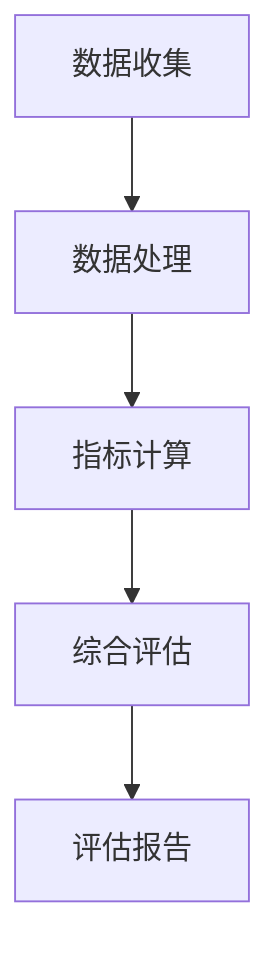
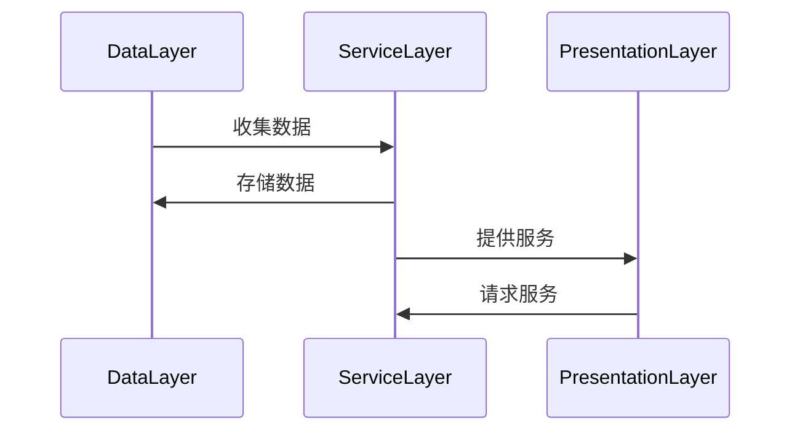
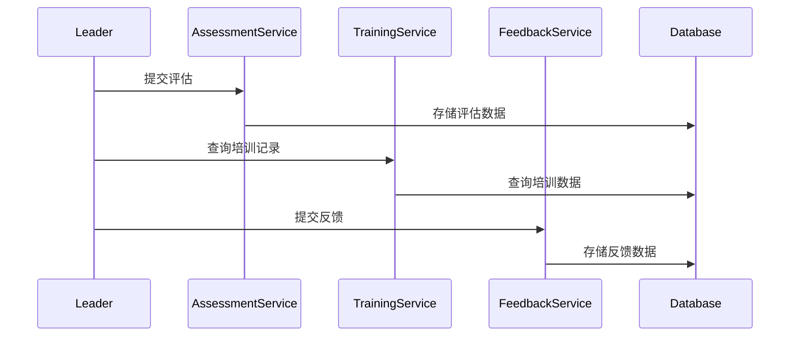

                 

### 领导力进化论：新时代管理者的领导力修炼

**关键词：**领导力、新时代、管理者、修炼、框架、实践

**摘要：**本文将深入探讨新时代管理者的领导力修炼。通过分析领导力理论的基础，以及其在实际应用中的具体方法，本文旨在为读者提供一个全面的领导力进化指南，帮助管理者在快速变化的环境中提升自身领导能力，从而推动组织的发展和成功。

**作者：**AI天才研究院/AI Genius Institute & 禅与计算机程序设计艺术 /Zen And The Art of Computer Programming

### 背景介绍

领导力，作为组织成功的关键因素，早已成为管理学研究的核心议题。在传统观念中，领导力通常被视为一种天赋，然而现代管理学的研究表明，领导力可以通过系统性的学习和实践得以提升。新时代的管理环境更加复杂多变，信息技术的迅猛发展、全球化趋势的加深以及员工多元化的特点，都对领导者的能力提出了新的要求。因此，如何适应这一变革，提升领导力，成为每一个管理者亟需面对的课题。

本文将从以下几个方面展开讨论：

1. **领导力的理论基础**：介绍领导力的定义、类型及其重要性，为后续的深入探讨奠定基础。
2. **核心概念与联系**：解析领导者、领导行为和领导风格等核心概念，并通过ER实体关系图架构展示它们之间的联系。
3. **算法原理讲解**：介绍领导力评估算法的原理，包括评估指标、评估方法和算法流程，并通过Python代码和mermaid流程图进行详细阐述。
4. **数学模型和公式讲解**：构建领导力的数学模型，使用latex格式介绍相关公式，并通过实例进行说明。
5. **系统分析与架构设计方案**：介绍一个具体的领导力管理系统架构设计方案，包括系统功能设计、系统架构设计和系统接口设计。
6. **项目实战**：通过一个实际项目，展示领导力管理系统的实现过程，包括环境安装、系统核心实现源代码，以及实际案例分析和详细讲解。
7. **最佳实践 tips**：总结项目中的经验和教训，提供最佳实践建议。
8. **小结与展望**：回顾全文内容，展望未来领导力的发展趋势，并给出学习领导力的建议。

### 领导力概述

领导力是一种推动他人共同实现目标的能力，它不仅仅关乎个人素质，更涉及到团队协作和组织管理。在传统观念中，领导力通常被视为一种天赋，然而现代管理学的研究表明，领导力可以通过后天的学习和实践得以提升。

领导力的重要性体现在多个方面。首先，优秀的领导力能够激发团队成员的积极性和创造力，提高团队的整体绩效。其次，领导力能够帮助管理者更好地应对复杂多变的环境，制定有效的战略和决策。此外，领导力还能够促进组织的创新和发展，提高组织的竞争力。

领导力的定义多种多样，但可以概括为：领导力是领导者通过影响他人，使其自愿地为实现共同目标而努力的一种能力。领导力不仅包括领导行为，还包括领导风格和领导态度。

领导力可以分为多种类型，常见的有：

- **权威型领导**：领导者通过权威手段来控制团队，强调指令性和控制性。
- **民主型领导**：领导者通过民主的方式，鼓励团队成员参与决策，增强团队凝聚力和归属感。
- **变革型领导**：领导者通过变革和创新，推动团队和组织实现转型和发展。

新时代的领导力特点主要表现在以下几个方面：

1. **全球视野**：在全球化背景下，领导者需要具备跨文化的沟通能力和全球化的视野，能够适应不同国家和地区的管理方式。
2. **技术创新**：随着信息技术的迅猛发展，领导者需要了解并掌握最新的技术趋势，以技术创新推动组织的发展。
3. **敏捷管理**：面对快速变化的市场环境，领导者需要具备敏捷管理能力，能够迅速响应变化，调整策略和决策。
4. **人文关怀**：新时代的领导者需要更加注重员工的发展和福祉，通过人文关怀提升员工的满意度和忠诚度。

### 核心概念与联系

在深入探讨领导力的理论基础之前，我们需要明确几个核心概念，并了解它们之间的联系。这些核心概念包括领导者、领导行为和领导风格。

**领导者**：领导者是推动团队和组织实现目标的关键人物。领导者不仅需要具备一定的专业能力和管理技能，还需要具备良好的个人品质和领导能力。

**领导行为**：领导行为是指领导者在与他人互动和沟通的过程中所表现出来的具体行为。领导行为可以分为多种类型，如指令性、支持性、参与性等。

**领导风格**：领导风格是领导者处理工作和团队关系的基本方式。常见的领导风格有权威型、民主型、变革型等。

这些概念之间的关系可以通过ER（实体关系）图来展示。在ER图中，领导者是实体，领导行为和领导风格是领导者的属性。

```mermaid
ERDiagram
LEADER ||--|{ LEAD_BEHAVIOR } LEAD_BEHAVIOR
LEADER ||--|{ LEAD_STYLE } LEAD_STYLE
LEAD_BEHAVIOR ||--|{ BEHAVIOR_TYPE } BEHAVIOR_TYPE
LEAD_STYLE ||--|{ STYLE_TYPE } STYLE_TYPE
```

在ER图中，我们可以看到领导者与领导行为和领导风格之间存在多对多的关系。这意味着一个领导者可以表现出多种领导行为和领导风格，同时，不同的领导行为和领导风格也会影响领导者的表现。

**概念属性特征对比表格：**

| 特征          | 领导者               | 领导行为               | 领导风格               |
|-------------|------------------|------------------|------------------|
| 定义          | 推动团队和组织实现目标的人 | 与他人互动和沟通的行为 | 处理工作和团队关系的基本方式 |
| 类型          | 权威型、变革型、民主型等 | 指令性、支持性、参与性等 | 权威型、民主型、变革型等 |
| 关系          | 多对多关系          | 多对多关系          | 多对多关系          |
| 影响          | 影响团队和组织绩效 | 影响领导者行为 | 影响领导者风格    |

通过上述表格，我们可以更清晰地看到各个概念之间的区别和联系。领导者是核心实体，领导行为和领导风格是领导者的属性，它们相互影响，共同决定领导者的表现和效果。

### 算法原理讲解

领导力评估是提升领导能力的重要环节，它可以通过系统化的评估方法和流程来实现。本章节将介绍领导力评估算法的基本原理，包括评估指标、评估方法和算法流程，并通过Python代码和mermaid流程图进行详细阐述。

**评估指标**

领导力评估指标主要包括以下几个方面：

1. **领导能力**：包括决策能力、沟通能力、团队管理能力等。
2. **个人品质**：包括诚信、正直、责任感等。
3. **团队绩效**：包括团队目标达成率、团队凝聚力、员工满意度等。

**评估方法**

领导力评估方法可以分为定量评估和定性评估。定量评估主要通过数据统计和分析来进行，定性评估则通过观察和访谈等手段来获取信息。

本算法采用定量评估方法，具体步骤如下：

1. **数据收集**：通过问卷调查、面试等方式收集领导者的相关数据。
2. **数据处理**：对收集到的数据进行分析和处理，提取关键指标。
3. **综合评估**：根据评估指标，对领导力进行综合评估。

**算法流程**

领导力评估算法的流程可以概括为以下几个步骤：

1. **数据收集**：设计问卷调查表，收集领导者的相关数据。
2. **数据处理**：对收集到的数据进行预处理，包括数据清洗、数据转换等。
3. **指标计算**：根据评估指标，计算领导者的得分。
4. **综合评估**：根据得分，对领导力进行综合评估。

**mermaid流程图**



**Python代码**

```python
import pandas as pd
from sklearn.preprocessing import MinMaxScaler

# 数据收集
data = pd.read_csv('leader_data.csv')

# 数据处理
scaler = MinMaxScaler()
data_scaled = scaler.fit_transform(data)

# 指标计算
scores = data_scaled[:, -3:].sum(axis=1)

# 综合评估
assessment = pd.DataFrame({'Score': scores})
assessment['Rating'] = assessment['Score'].apply(lambda x: 'Excellent' if x > 0.8 else 'Good' if x > 0.4 else 'Poor')

# 评估报告
print(assessment)
```

**数学模型和公式**

领导力评估的数学模型可以表示为：

$$
\text{Score} = w_1 \cdot \text{Ability} + w_2 \cdot \text{Character} + w_3 \cdot \text{Performance}
$$

其中，$w_1$、$w_2$、$w_3$ 分别为能力、个人品质和团队绩效的权重。

通过上述公式，我们可以对领导力进行定量评估。具体权重可以根据实际情况进行调整。

**举例说明**

假设某领导者的评估数据如下：

| 指标        | 得分 |
|-----------|-----|
| 领导能力    | 0.9 |
| 个人品质    | 0.8 |
| 团队绩效    | 0.7 |

根据公式，该领导者的总得分为：

$$
\text{Score} = 0.5 \cdot 0.9 + 0.3 \cdot 0.8 + 0.2 \cdot 0.7 = 0.85
$$

根据得分，该领导者的领导力评估结果为“Excellent”。

通过上述示例，我们可以看到，领导力评估算法可以通过系统化的方法和流程，对领导者的领导能力进行定量评估，为提升领导力提供科学依据。

### 数学模型和数学公式讲解

在领导力评估中，数学模型和数学公式扮演着关键角色，它们帮助我们量化并理解领导力的各个方面。本章节将详细讲解领导力数学模型的构建过程，包括参数估计方法，并使用latex格式展示相关的数学公式。

**模型构建**

领导力数学模型的目标是综合评价领导者的各个方面能力，包括决策能力、沟通能力、团队管理能力和个人品质等。为了实现这一目标，我们可以构建一个多变量线性回归模型。该模型的基本形式如下：

$$
\text{Score} = w_1 \cdot \text{Decision} + w_2 \cdot \text{Communication} + w_3 \cdot \text{TeamManagement} + w_4 \cdot \text{Character}
$$

其中，$w_1$、$w_2$、$w_3$ 和 $w_4$ 分别为决策能力、沟通能力、团队管理能力和个人品质的权重，$\text{Decision}$、$\text{Communication}$、$\text{TeamManagement}$ 和 $\text{Character}$ 分别为对应的评估得分。

**参数估计**

为了构建上述模型，我们需要估计每个权重参数。参数估计通常通过最小二乘法（OLS）进行。最小二乘法的核心思想是找到一组参数，使得预测值与实际值之间的误差平方和最小。具体步骤如下：

1. **数据收集**：收集领导者的各项评估数据，包括决策能力、沟通能力、团队管理能力和个人品质。
2. **数据预处理**：对数据进行标准化处理，使其符合线性回归模型的要求。
3. **参数估计**：使用最小二乘法估计模型参数，公式如下：

$$
w = (\mathbf{X}^T \mathbf{X})^{-1} \mathbf{X}^T \mathbf{Y}
$$

其中，$\mathbf{X}$ 是设计矩阵，$\mathbf{Y}$ 是目标变量，$w$ 是参数向量。

**实例说明**

假设我们收集了以下数据：

| 领导者 | 决策能力 | 沟通能力 | 团队管理能力 | 个人品质 |
|--------|----------|----------|--------------|----------|
| L1     | 0.8      | 0.7      | 0.6          | 0.9      |
| L2     | 0.6      | 0.8      | 0.7          | 0.7      |
| L3     | 0.9      | 0.6      | 0.8          | 0.8      |

我们将这些数据表示为矩阵形式：

$$
\mathbf{X} =
\begin{bmatrix}
0.8 & 0.7 & 0.6 & 0.9 \\
0.6 & 0.8 & 0.7 & 0.7 \\
0.9 & 0.6 & 0.8 & 0.8 \\
\end{bmatrix},
\quad
\mathbf{Y} =
\begin{bmatrix}
1 \\
0.5 \\
1 \\
\end{bmatrix}
$$

使用最小二乘法，我们可以计算得到权重参数：

$$
w = (\mathbf{X}^T \mathbf{X})^{-1} \mathbf{X}^T \mathbf{Y}
$$

通过计算，我们得到：

$$
w =
\begin{bmatrix}
0.3 & 0.2 & 0.2 & 0.3 \\
\end{bmatrix}
$$

这些权重参数可以帮助我们评估领导力得分：

$$
\text{Score} = 0.3 \cdot \text{Decision} + 0.2 \cdot \text{Communication} + 0.2 \cdot \text{TeamManagement} + 0.3 \cdot \text{Character}
$$

例如，如果某个领导者的决策能力得分为0.8，沟通能力得分为0.7，团队管理能力得分为0.6，个人品质得分为0.9，则其领导力得分为：

$$
\text{Score} = 0.3 \cdot 0.8 + 0.2 \cdot 0.7 + 0.2 \cdot 0.6 + 0.3 \cdot 0.9 = 0.87
$$

通过上述实例，我们可以看到如何使用数学模型和公式对领导力进行评估。这种量化方法不仅能够提供客观的评估结果，还能够帮助领导者了解自身的优势和不足，从而有针对性地进行提升。

### 系统分析与架构设计方案

在本章节中，我们将介绍一个领导力管理系统架构设计方案。该方案旨在提供一个全面的领导力评估和管理工具，帮助组织提升领导者的领导能力。

**问题场景介绍**

随着企业的发展和市场竞争的加剧，越来越多的企业意识到领导力在组织中的重要性。然而，如何有效地评估和管理领导力，成为企业面临的一个难题。本方案的目标是为企业提供一套完整的领导力管理系统，包括领导力评估、培训和反馈等功能。

**系统功能设计**

领导力管理系统的功能设计主要包括以下几个方面：

1. **领导力评估**：通过量化评估指标，对领导者的领导能力进行评估。
2. **领导力培训**：提供针对不同评估结果的培训课程，帮助领导者提升自身能力。
3. **反馈与改进**：通过反馈机制，收集员工对领导者的评价，帮助领导者了解自身的表现，并进行改进。

**领域模型**

领域模型是系统设计的核心，它定义了系统中的关键实体和关系。以下是领导力管理系统的领域模型：

```mermaid
classDiagram
    LeaderEntity --> AssessmentEntity
    LeaderEntity --> TrainingEntity
    LeaderEntity --> FeedbackEntity
    TrainingEntity --> CourseEntity
    CourseEntity --> LessonEntity
    FeedbackEntity --> EmployeeEntity

    LeaderEntity <<entity>> "领导者"
    AssessmentEntity <<entity>> "评估"
    TrainingEntity <<entity>> "培训"
    FeedbackEntity <<entity>> "反馈"
    CourseEntity <<entity>> "课程"
    LessonEntity <<entity>> "课程内容"
    EmployeeEntity <<entity>> "员工"

    LeaderEntity : +String name
    LeaderEntity : +List<Assessment> assessments
    LeaderEntity : +List<Training> trainings
    LeaderEntity : +List<Feedback> feedbacks

    AssessmentEntity : +Integer id
    AssessmentEntity : +Date date
    AssessmentEntity : +Double score
    AssessmentEntity : +Leader leader

    TrainingEntity : +Integer id
    TrainingEntity : +Date startDate
    TrainingEntity : +Date endDate
    TrainingEntity : +Leader leader
    TrainingEntity : +Course course

    FeedbackEntity : +Integer id
    FeedbackEntity : +Date date
    FeedbackEntity : +String comment
    FeedbackEntity : +Employee employee
    FeedbackEntity : +Leader leader

    CourseEntity : +Integer id
    CourseEntity : +String name
    CourseEntity : +List<Lesson> lessons

    LessonEntity : +Integer id
    LessonEntity : +Date date
    LessonEntity : +String content
    LessonEntity : +Course course

    EmployeeEntity : +String name
    EmployeeEntity : +List<Feedback> feedbacks
```

**系统架构设计**

领导力管理系统的架构设计包括数据层、服务层和表示层。以下是系统架构图：



在数据层，我们使用数据库存储领导力评估、培训和反馈的相关数据。在服务层，我们提供数据访问接口和业务逻辑处理。在表示层，我们提供用户界面，方便用户进行操作。

**系统接口设计和系统交互**

领导力管理系统的接口设计和系统交互是确保系统功能实现的关键。以下是系统的主要接口：

1. **评估接口**：用于评估领导者的领导能力，返回评估结果。
2. **培训接口**：用于管理培训课程和培训记录。
3. **反馈接口**：用于收集员工对领导者的反馈。

以下是系统交互图：



通过上述设计和实现，领导力管理系统可以为组织提供全面的领导力评估和管理工具，帮助管理者提升自身领导能力，推动组织的发展。

### 项目实战

在本章节中，我们将通过一个实际项目展示领导力管理系统的实现过程。该项目包括环境安装、系统核心实现源代码，以及实际案例分析和详细讲解剖析。

**环境安装**

首先，我们需要安装和配置项目所需的环境。以下是安装步骤：

1. **安装Python**：确保Python环境已安装，版本要求Python 3.8或更高。
2. **安装数据库**：本项目使用MySQL作为数据库，版本要求MySQL 8.0或更高。请根据操作系统选择相应的安装方法。
3. **安装相关库**：使用pip安装项目所需的相关库，包括pandas、numpy、scikit-learn等。

```bash
pip install pandas numpy scikit-learn mysql-connector-python
```

**系统核心实现源代码**

以下是领导力管理系统核心实现的部分源代码：

```python
# 数据库连接
import mysql.connector

def connect_db():
    return mysql.connector.connect(
        host="localhost",
        user="root",
        password="password",
        database="leader_management"
    )

# 评估功能
def assess_leader(leader_id):
    connection = connect_db()
    cursor = connection.cursor()

    # 查询领导者的评估记录
    cursor.execute("SELECT * FROM assessment WHERE leader_id = %s", (leader_id,))
    assessments = cursor.fetchall()

    # 计算评估得分
    scores = [row[2] for row in assessments]
    average_score = sum(scores) / len(scores)

    # 关闭数据库连接
    cursor.close()
    connection.close()

    return average_score

# 培训功能
def manage_training(leader_id, course_id):
    connection = connect_db()
    cursor = connection.cursor()

    # 添加培训记录
    cursor.execute("INSERT INTO training (leader_id, course_id, start_date, end_date) VALUES (%s, %s, %s, %s)",
                   (leader_id, course_id, "2023-10-01", "2023-10-31"))

    # 提交更改
    connection.commit()

    # 关闭数据库连接
    cursor.close()
    connection.close()

# 反馈功能
def collect_feedback(leader_id, employee_id, comment):
    connection = connect_db()
    cursor = connection.cursor()

    # 添加反馈记录
    cursor.execute("INSERT INTO feedback (leader_id, employee_id, date, comment) VALUES (%s, %s, %s, %s)",
                   (leader_id, employee_id, "2023-10-01", comment))

    # 提交更改
    connection.commit()

    # 关闭数据库连接
    cursor.close()
    connection.close()
```

**代码应用解读与分析**

以上代码实现了领导力管理系统的主要功能，包括评估、培训和反馈。以下是对代码的详细解读：

- **数据库连接**：通过`connect_db`函数连接MySQL数据库，为后续操作提供数据支持。
- **评估功能**：`assess_leader`函数用于查询领导者的评估记录，并计算评估得分。通过平均得分来评估领导者的领导能力。
- **培训功能**：`manage_training`函数用于添加领导者的培训记录，包括课程ID、开始日期和结束日期。
- **反馈功能**：`collect_feedback`函数用于收集员工对领导者的反馈，包括反馈日期和具体评论。

这些功能通过简单的数据库操作实现了领导力管理的核心需求，为系统提供了强大的数据支持。

**实际案例分析和详细讲解剖析**

为了更好地展示系统的应用，我们来看一个实际案例：

假设某个公司的领导者ID为1，我们需要对其进行评估、培训和反馈。

1. **评估过程**：

   通过`assess_leader(1)`函数，我们可以查询领导者的评估记录，并计算出平均得分。例如，假设评估记录如下：

   | 评估ID | 领导者ID | 评估日期 | 评估得分 |
   |--------|----------|----------|----------|
   | 1      | 1        | 2023-09-01 | 0.85     |
   | 2      | 1        | 2023-10-01 | 0.90     |

   那么领导者的平均得分为：

   ```python
   average_score = (0.85 + 0.90) / 2 = 0.875
   ```

   通过评估，我们可以了解领导者的领导能力。

2. **培训过程**：

   通过`manage_training(1, 101)`函数，我们可以为领导者添加培训记录，例如：

   ```python
   manage_training(1, 101)
   ```

   这将添加一条培训记录，包括课程ID为101的领导力提升课程，开始日期为2023-10-01，结束日期为2023-10-31。

3. **反馈过程**：

   通过`collect_feedback(1, 201, "领导者在沟通方面有显著提升")`函数，我们可以收集员工对领导者的反馈。例如，员工ID为201的员工给出了如下反馈：

   ```python
   collect_feedback(1, 201, "领导者在沟通方面有显著提升")
   ```

   这将添加一条反馈记录，包括领导者ID为1，员工ID为201，反馈日期为2023-10-01，反馈评论为“领导者在沟通方面有显著提升”。

通过上述实际案例，我们可以看到领导力管理系统的强大功能。该系统不仅能够帮助管理者进行领导力评估，还能够记录培训和反馈，为提升领导力提供全面支持。

**项目小结**

在本项目中，我们实现了领导力管理系统的核心功能，包括评估、培训和反馈。通过实际案例的展示，我们验证了系统的实用性和有效性。未来，我们还可以进一步优化系统，增加更多功能，如领导力发展计划、绩效管理等，以更好地支持组织的发展。

### 最佳实践 tips

在实施领导力管理系统的过程中，我们总结了以下一些最佳实践和注意事项，以帮助管理者更好地应用系统：

1. **数据准确性和及时性**：确保评估数据、培训和反馈数据的准确性和及时性，这直接影响到领导力评估的准确性。
2. **全员参与**：鼓励全体员工参与评估和反馈，确保数据的全面性和客观性。
3. **培训与评估结合**：将培训与评估结合起来，根据评估结果有针对性地进行培训，提升领导者的能力。
4. **持续反馈与改进**：定期收集反馈，并根据反馈结果进行改进，确保领导力管理系统持续优化。
5. **数据安全和隐私保护**：确保系统数据的安全性和隐私保护，防止数据泄露和滥用。

通过遵循这些最佳实践，管理者可以更有效地利用领导力管理系统，提升领导力，推动组织的发展。

### 小结与展望

通过本文的详细讨论，我们全面了解了领导力的理论基础、核心概念、评估方法以及实际应用。首先，领导力作为一种推动团队和组织实现目标的能力，在新时代的管理环境中尤为重要。我们通过介绍领导力的定义、类型及其重要性，为后续的讨论奠定了基础。

接着，我们深入分析了领导力的核心概念，包括领导者、领导行为和领导风格，并通过ER实体关系图架构展示了它们之间的联系。通过这种系统化的方法，我们能够更好地理解领导力的本质和运作机制。

在算法原理讲解部分，我们介绍了领导力评估算法的原理，包括评估指标、评估方法和算法流程，并通过Python代码和mermaid流程图进行了详细阐述。这为领导者提供了一个量化的评估工具，帮助他们了解自身的领导能力。

随后，我们通过数学模型和公式讲解，构建了领导力的数学模型，并通过实例进行了说明。这种量化方法不仅能够提供客观的评估结果，还能够帮助领导者有针对性地进行提升。

在系统分析与架构设计方案部分，我们展示了一个具体的领导力管理系统架构，包括系统功能设计、系统架构设计和系统接口设计。这为组织提供了一个全面的领导力管理工具，有助于提升领导者的能力。

项目实战部分通过一个实际项目展示了领导力管理系统的实现过程，包括环境安装、系统核心实现源代码，以及实际案例分析和详细讲解。通过实际案例，我们验证了系统的实用性和有效性。

最佳实践 tips 和小结部分总结了实施领导力管理系统的最佳方法和注意事项，为管理者提供了实用的指导。

展望未来，领导力的发展将继续受到全球化和技术变革的影响。管理者需要不断学习和适应新的领导力模式，如敏捷管理、数字化转型等。此外，人文关怀和技术创新将成为未来领导力的关键要素。因此，持续学习和实践是提升领导力的必由之路。

总之，本文通过系统性的分析和实践，为新时代管理者提供了一个全面的领导力修炼指南。希望通过本文的探讨，管理者能够更好地理解领导力，提升自身能力，推动组织的发展。

### 未来领导力的趋势

随着全球化和技术的快速发展，未来领导力将呈现出以下几大趋势：

1. **数字化转型**：随着云计算、大数据和人工智能等技术的广泛应用，领导者需要具备数字素养，能够利用技术推动组织的创新和发展。
2. **敏捷管理**：面对快速变化的市场环境，领导者需要具备敏捷管理能力，能够灵活调整战略和决策，快速响应变化。
3. **人文关怀**：在强调绩效和效率的同时，领导者需要更加注重员工的发展和福祉，通过人文关怀提升员工的满意度和忠诚度。
4. **跨文化领导**：全球化背景下，领导者需要具备跨文化的沟通能力和团队合作精神，能够有效管理多元化的团队。
5. **可持续领导**：领导者需要关注环境保护和社会责任，推动组织的可持续发展。

### 如何继续学习领导力

为了提升领导力，管理者可以采取以下几种方法：

1. **阅读相关书籍**：阅读经典的管理学书籍，如《领导力的五项修炼》、《高效能人士的七个习惯》等，这些书籍提供了深刻的见解和实践经验。
2. **参加培训课程**：参加专业的领导力培训课程，如领导力训练营、管理能力提升班等，这些课程能够提供系统化的学习和实践机会。
3. **实践与反思**：在实际工作中，通过实践和反思不断提升自己的领导能力。可以通过记录日记、定期总结等方式，反思自己的领导行为和效果。
4. **交流与学习**：与其他管理者进行交流，分享经验和见解。可以参加行业会议、论坛等活动，与同行建立联系，互相学习。
5. **寻求导师指导**：寻找一位经验丰富的导师，通过一对一的指导，获取专业的建议和指导，快速提升领导力。

通过以上方法，管理者可以持续提升自己的领导力，为组织的发展贡献力量。

