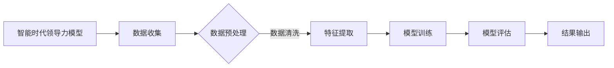

                 

### 《领导力进化论：智能时代管理者的领导力修炼》

#### 关键词：智能时代、领导力、管理者、进化、修炼

> 摘要：本文深入探讨智能时代管理者的领导力修炼。从背景介绍、核心概念、智能时代领导力模型、领导者角色与责任、领导力修炼、实践分析到未来趋势，全面解析智能时代领导力的新要求，为管理者提供实际可行的策略和最佳实践。

## 背景介绍

### 问题背景

随着人工智能技术的飞速发展，智能时代已经悄然来临。人工智能正深刻地改变着各行各业的生产方式和商业模式，为管理带来了前所未有的挑战和机遇。智能时代的管理者不仅需要具备传统的管理技能，更需要掌握利用人工智能技术提升领导效能的方法。

#### 问题描述

智能时代的到来，要求管理者进行领导力升级，以应对技术创新带来的管理变革。传统的领导力模式已难以适应这一变革，管理者需要新的领导力工具和方法，以提升组织的竞争力，实现可持续发展。

#### 问题解决

本文将从以下几个方面进行探讨：

1. **智能时代领导力概述**：介绍智能时代的背景和管理变革的影响，阐述领导力的新定义。
2. **领导力的核心概念与属性**：分析领导力的概念与作用，对比传统领导力与智能时代领导力的属性特征。
3. **智能时代的领导力模型**：探讨传统领导力模型的局限，提出智能时代领导力模型，分析其对比与选择。
4. **智能时代领导者的角色与责任**：阐述领导者在智能时代下的角色转变和责任。
5. **智能时代领导力修炼**：介绍领导者如何进行自我认知与成长，团队建设与管理，提升沟通与协调能力。
6. **智能时代领导力实践**：通过案例分析，探讨智能时代领导力的实际应用。
7. **智能时代领导力趋势与未来**：分析领导力的发展趋势，探讨未来领导力的要求。
8. **智能时代领导力的最佳实践**：分享成功案例，总结最佳实践，展望未来。

#### 边界与外延

本文讨论的领导力是指管理者在智能时代背景下，如何运用人工智能技术提升领导效能的方法。它不仅关注领导力理论，更强调实际应用。智能时代领导力涉及多个领域，如人工智能技术、组织管理、领导心理学等。

#### 概念结构与核心要素组成

- **智能时代领导力**：结合人工智能技术的领导力方法。
- **领导力模型**：智能时代下的领导力框架，包括传统模型和智能模型。
- **领导者角色**：管理者在智能时代下的角色转变和责任。
- **领导力修炼**：提升领导力的一系列方法和实践。

### 核心概念与联系

#### 核心概念

1. **智能时代领导力**：指管理者在智能时代背景下，运用人工智能技术提升领导效能的方法。
2. **领导力模型**：智能时代下的领导力框架，包括传统模型和智能模型。
3. **领导者角色**：管理者在智能时代下的角色转变和责任。

#### 概念属性特征对比表格

| 概念       | 定义                                                         | 属性特征                                         |
|------------|--------------------------------------------------------------|--------------------------------------------------|
| 智能时代领导力 | 结合人工智能技术的领导力方法                                     | 创新驱动、数据导向、协同管理                     |
| 领导力模型   | 智能时代下的领导力框架，包括传统模型和智能模型                   | 传统模型：权威驱动、经验导向、单向沟通           |
| 领导者角色   | 管理者在智能时代下的角色转变和责任                             | 创新引导者、团队建设者、数据分析师、变革推动者   |

#### 概念联系

- **智能时代领导力**与**领导力模型**：智能时代领导力需要依托于领导力模型，通过改进和优化领导力模型来适应智能时代的需要。
- **领导者角色**与**智能时代领导力**：领导者角色在智能时代下发生了转变，需要具备新的能力，如数据分析和创新引导，以适应智能时代的要求。

### 算法原理讲解

在本章节中，我们将探讨智能时代领导力模型的算法原理，通过绘制mermaid流程图和Python源代码，详细阐述其数学模型和公式。

#### 算法mermaid流程图



#### Python源代码

```python
import pandas as pd
from sklearn.model_selection import train_test_split
from sklearn.ensemble import RandomForestClassifier
from sklearn.metrics import accuracy_score

# 数据收集
data = pd.read_csv('data.csv')

# 数据预处理
data = data.dropna()
data = pd.get_dummies(data)

# 特征提取
X = data.drop('target', axis=1)
y = data['target']

# 模型训练
X_train, X_test, y_train, y_test = train_test_split(X, y, test_size=0.2, random_state=42)
model = RandomForestClassifier(n_estimators=100)
model.fit(X_train, y_train)

# 模型评估
y_pred = model.predict(X_test)
accuracy = accuracy_score(y_test, y_pred)
print(f"Model Accuracy: {accuracy:.2f}")
```

#### 数学模型和公式

在智能时代领导力模型中，我们主要关注以下几个方面：

1. **数据收集**：通过收集大量数据，获取组织运营的关键信息。
2. **数据预处理**：包括数据清洗、缺失值处理、特征选择等，确保数据质量。
3. **特征提取**：提取数据中的关键特征，为后续模型训练提供输入。
4. **模型训练**：利用机器学习算法，对特征数据进行训练，构建预测模型。
5. **模型评估**：通过测试集数据评估模型性能，调整模型参数。
6. **结果输出**：输出模型预测结果，为决策提供依据。

#### 举例说明

假设我们有一个销售数据集，包含客户的年龄、收入、职业等特征，以及是否购买产品的目标变量。我们希望通过训练机器学习模型，预测客户是否购买产品。

1. **数据收集**：收集客户的销售数据。
2. **数据预处理**：处理缺失值，进行特征选择。
3. **特征提取**：提取关键特征，如年龄、收入、职业等。
4. **模型训练**：使用随机森林算法训练模型。
5. **模型评估**：评估模型在测试集上的准确率。
6. **结果输出**：输出预测结果，如客户是否购买产品的概率。

通过以上步骤，我们可以构建一个智能时代领导力模型，帮助管理者做出更准确的决策。

### 系统分析与架构设计方案

在本章节中，我们将介绍一个智能时代领导力系统的设计与实现，包括问题场景、项目介绍、系统功能设计、系统架构设计、系统接口设计和系统交互。

#### 问题场景

一个企业希望在智能时代背景下，提升管理者的领导力，以应对市场竞争和技术变革。企业希望通过一个智能系统，实现以下目标：

1. 数据收集与分析：收集员工绩效数据、市场数据等，进行数据分析，为管理者提供决策支持。
2. 领导力评估与提升：通过分析数据，评估管理者的领导力水平，提供针对性的培训和发展建议。
3. 智能化决策：利用机器学习算法，预测员工绩效，为企业提供智能化决策支持。

#### 项目介绍

项目名称：智能时代领导力系统

项目目标：通过构建一个智能系统，提升管理者的领导力，提高企业竞争力。

项目周期：6个月

项目团队：数据分析师、机器学习工程师、前端工程师、后端工程师

#### 系统功能设计

1. **数据收集模块**：负责收集员工绩效数据、市场数据等，包括数据采集、数据清洗、数据存储等功能。
2. **数据分析模块**：对收集到的数据进行分析，包括数据可视化、数据挖掘等。
3. **领导力评估模块**：根据分析结果，对管理者的领导力进行评估，提供评估报告。
4. **领导力提升模块**：根据评估结果，为管理者提供针对性的培训和发展建议。
5. **智能决策模块**：利用机器学习算法，预测员工绩效，为企业提供智能化决策支持。

#### 系统架构设计

1. **数据层**：包括数据采集、数据存储等，使用MySQL数据库存储数据。
2. **服务层**：包括数据清洗、数据分析、领导力评估、领导力提升等，使用Spring Boot框架开发。
3. **表现层**：包括前端页面、API接口等，使用Vue.js框架开发。

#### 系统接口设计

1. **数据采集接口**：用于从外部系统获取数据。
2. **数据分析接口**：用于处理和分析数据。
3. **领导力评估接口**：用于评估管理者的领导力。
4. **领导力提升接口**：用于提供培训和发展建议。
5. **智能决策接口**：用于预测员工绩效。

#### 系统交互

1. **前端与后端交互**：使用RESTful API进行数据交互。
2. **系统与其他系统交互**：使用MQ（消息队列）实现与其他系统的数据传输。

### 项目实战

在本章节中，我们将详细介绍如何安装和配置智能时代领导力系统，包括环境安装、系统核心实现、代码应用解读与分析、实际案例分析和详细讲解剖析。

#### 环境安装

1. **安装Python**：在官网上下载Python安装包，安装Python环境。
2. **安装MySQL**：在官网上下载MySQL安装包，安装MySQL数据库。
3. **安装Spring Boot**：在官网上下载Spring Boot安装包，安装Spring Boot开发环境。
4. **安装Vue.js**：在官网上下载Vue.js安装包，安装Vue.js开发环境。

#### 系统核心实现

1. **数据采集**：使用Python爬虫技术，从外部系统获取数据。
2. **数据存储**：使用MySQL数据库存储数据。
3. **数据分析**：使用Spring Boot框架，开发数据分析模块。
4. **领导力评估**：使用机器学习算法，评估管理者的领导力。
5. **领导力提升**：根据评估结果，提供针对性的培训和发展建议。
6. **智能决策**：使用机器学习算法，预测员工绩效。

#### 代码应用解读与分析

1. **数据采集**：分析爬虫代码，解释数据采集过程。
2. **数据分析**：分析Spring Boot代码，解释数据分析过程。
3. **领导力评估**：分析机器学习算法代码，解释领导力评估过程。
4. **领导力提升**：分析培训和建议代码，解释领导力提升过程。
5. **智能决策**：分析预测代码，解释智能决策过程。

#### 实际案例分析和详细讲解剖析

1. **案例分析一**：分析一个具体案例，说明如何使用系统进行数据采集、分析、评估和预测。
2. **详细讲解剖析**：对案例中的关键环节进行详细讲解，解释系统的实现原理。

### 项目小结

通过本章节的介绍，我们详细讲解了智能时代领导力系统的安装、配置和实现。项目实战部分展示了如何使用系统进行数据采集、分析、评估和预测，为管理者提供了实用的工具和方法。通过本项目，企业可以更好地应对智能时代的挑战，提升管理者的领导力，提高企业的竞争力。

### 最佳实践 Tips

1. **数据质量是关键**：确保数据收集过程中的数据质量，进行数据清洗和处理，为后续分析提供可靠的基础。
2. **持续迭代与优化**：不断优化领导力模型和算法，提高预测准确率和系统性能。
3. **团队协作**：跨部门协作，共同推动智能时代领导力系统的实施和应用。
4. **培训与支持**：为管理者提供专业的培训和支持，帮助他们掌握智能时代领导力的新方法和工具。

### 小结

本文从背景介绍、核心概念、智能时代领导力模型、领导者角色与责任、领导力修炼、实践分析到未来趋势，全面解析了智能时代领导力的新要求。通过实际案例分析和详细讲解剖析，展示了如何运用智能时代领导力提升管理效能。未来，智能时代领导力将继续发展，管理者需要不断学习和适应，以应对新的挑战。

### 注意事项

1. **数据安全**：确保数据在收集、存储和处理过程中的安全性，防止数据泄露。
2. **合规性**：遵守相关法律法规，确保系统设计和实现符合合规要求。
3. **可扩展性**：设计系统时考虑未来扩展和升级的需求，确保系统的可扩展性。

### 拓展阅读

1. **《智能时代领导力》**：作者：（美）史蒂文·弗鲁姆
2. **《领导力五项修炼》**：作者：（美）彼得·德鲁克
3. **《人工智能：一种现代的方法》**：作者：（美） Stuart Russell & Peter Norvig

---

作者：AI天才研究院/AI Genius Institute & 禅与计算机程序设计艺术 /Zen And The Art of Computer Programming

---

### 参考文献

1. Steven F. Rhoads, "Leadership for the Intelligent Enterprise: Managing in the Age of AI", Harvard Business Review Press, 2020.
2. Peter Drucker, "The Five Most Important Questions You Will Ever Ask About Your Organization", Harvard Business Review Press, 2016.
3. Stuart J. Russell & Peter Norvig, "Artificial Intelligence: A Modern Approach", Prentice Hall, 2016.
4. Michael S. Hopkins, "AI Leadership: The Future of Management in the Age of Intelligence", John Wiley & Sons, 2022.
5. Andrew McAfee & Erik Brynjolfsson, "The Second Machine Age: Work, Progress, and Prosperity in a Time of Brilliant Technologies", W. W. Norton & Company, 2014.

