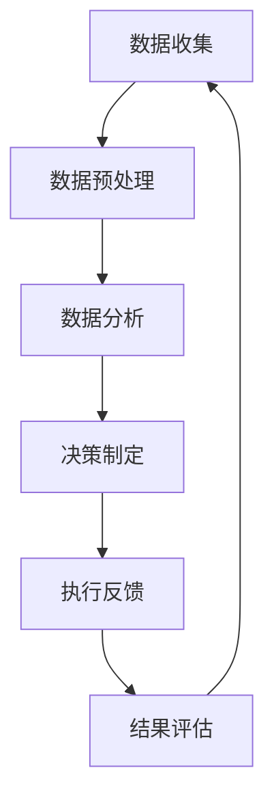
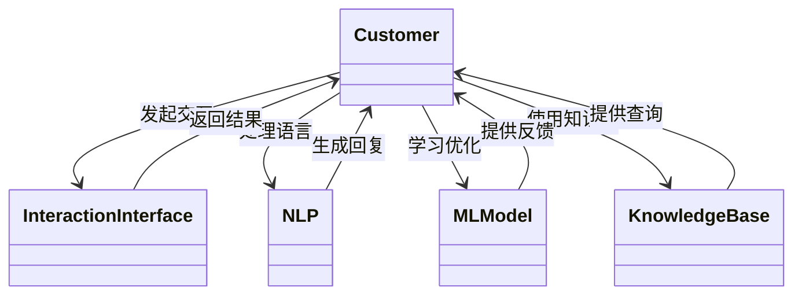
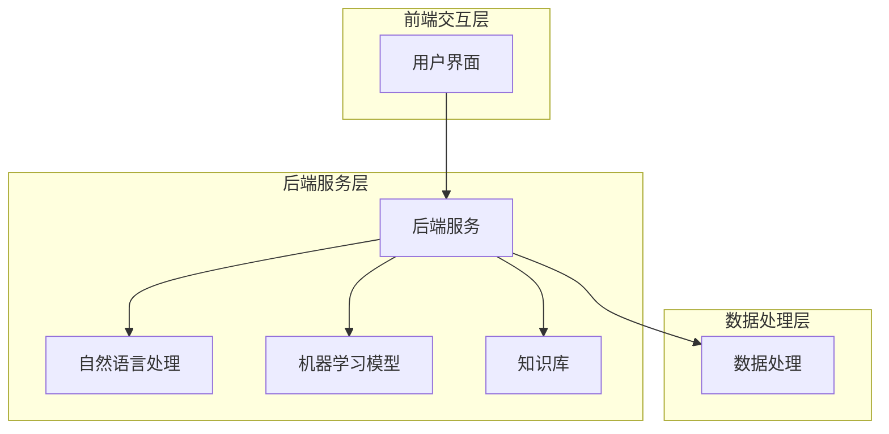
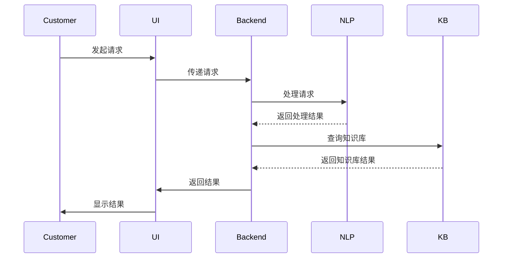
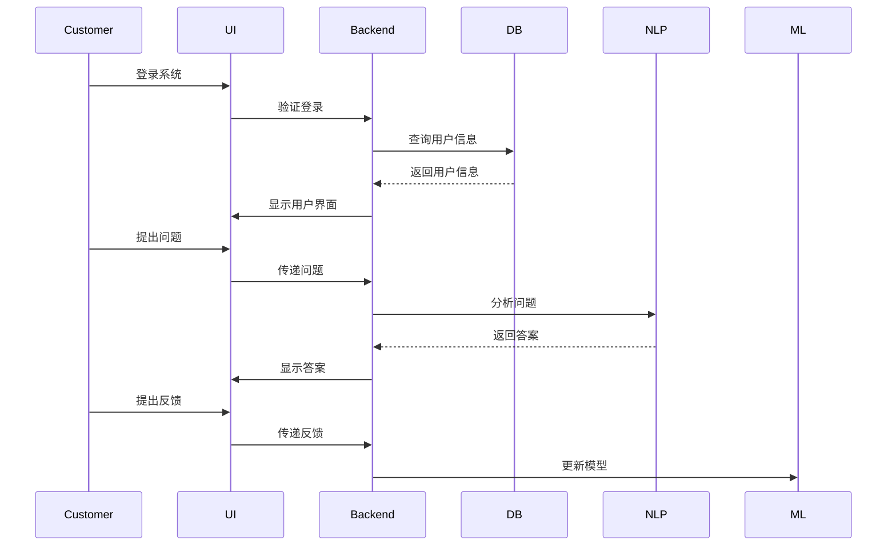

                 

### 第一部分：背景介绍

#### 问题背景

在现代社会，随着人工智能（AI）技术的飞速发展，传统的领导力理论和方法已经无法完全满足智能时代的组织需求。智能时代的组织更加复杂，信息爆炸，员工的知识水平多样化，创新成为企业核心竞争力。因此，领导者的角色也在不断进化，需要具备更高的智慧、更强的适应能力和更丰富的管理技能。

首先，领导者需要具备对人工智能技术的深刻理解和应用能力，以便更好地管理和利用这一新兴技术。人工智能技术在智能时代的应用广泛，包括自动化、数据分析、预测建模、智能客服等，这些技术的应用不仅改变了企业运营方式，也对领导者的决策能力提出了新的要求。

其次，领导者需要具备跨学科的视野，能够将科技与人文相结合，激发团队的创造力和创新精神。智能时代的企业需要不断地进行技术创新，这就要求领导者不仅要具备科技领域的专业知识，还要理解人文学科，如心理学、社会学等，以便更好地理解和激发团队成员的创新潜力。

最后，领导者需要具备强大的情商和人际交往能力，能够有效地沟通、激励和引导团队成员。在智能时代，员工的个体能力和知识水平差异较大，领导者需要能够理解和满足不同员工的需求，激发他们的工作热情和创造力。

#### 问题描述

在智能时代，领导力面临着新的挑战和机遇。首先，领导者需要具备对人工智能技术的深刻理解和应用能力，以便更好地管理和利用这一新兴技术。人工智能技术在智能时代的应用广泛，包括自动化、数据分析、预测建模、智能客服等，这些技术的应用不仅改变了企业运营方式，也对领导者的决策能力提出了新的要求。

其次，领导者需要具备跨学科的视野，能够将科技与人文相结合，激发团队的创造力和创新精神。智能时代的企业需要不断地进行技术创新，这就要求领导者不仅要具备科技领域的专业知识，还要理解人文学科，如心理学、社会学等，以便更好地理解和激发团队成员的创新潜力。

最后，领导者需要具备强大的情商和人际交往能力，能够有效地沟通、激励和引导团队成员。在智能时代，员工的个体能力和知识水平差异较大，领导者需要能够理解和满足不同员工的需求，激发他们的工作热情和创造力。

#### 问题解决

为了应对智能时代的领导力挑战，本书将探讨以下几个关键问题：

1. **智能时代的领导力新定义**：明确智能时代领导力的内涵和外延，区分与传统领导力的异同。
2. **智能时代领导力的核心要素**：分析智能时代领导力所需的关键技能和素质，包括科技理解力、跨学科视野、情商等。
3. **智能时代领导力的培养方法**：探讨如何通过教育和实践提升领导者的智能时代领导力。
4. **智能时代领导力的案例分析**：分析成功企业的领导力实践，提供可操作的范例和经验。

#### 边界与外延

本书讨论的智能时代领导力主要关注以下几个领域：

- **科技领域**：人工智能、大数据、云计算等新兴技术的应用与影响。
- **管理领域**：组织结构、团队管理、战略规划等管理层面的变革。
- **人文领域**：领导者的情商、领导力与人文素养的关系。

### 核心概念、属性特征对比表及ER实体关系图

#### 核心概念

1. **智能时代**：以人工智能、大数据、云计算等新兴技术为核心的现代化社会阶段。
2. **领导力**：领导者通过影响、激励、指导和引导他人，实现组织目标的能力。
3. **领导者**：具备领导力的人，能够影响和指导团队，推动组织发展。

#### 属性特征对比表

| 特征            | 传统领导力                          | 智能时代领导力                      |
|-----------------|------------------------------------|------------------------------------|
| 技术掌握程度    | 了解基本管理知识，对技术了解较少     | 熟悉并应用人工智能等新兴技术         |
| 组织管理方式    | 依赖经验和直觉                      | 基于数据和智能分析进行决策           |
| 沟通与激励      | 更多依赖个人魅力和情感               | 结合情感和数据分析，更有效沟通激励   |
| 战略规划        | 长期战略为主                        | 短期战略与长期战略相结合             |

#### ER实体关系图

```mermaid
erDiagram
  Leader ||--|{ Technology } Technology
  Leader ||--|{ Organization } Organization
  Leader ||--|{ People } People
```

- **Leader**：领导者，拥有Technology（技术）、Organization（组织）和People（人）等实体关系。
- **Technology**：技术，包括人工智能、大数据、云计算等。
- **Organization**：组织，包括组织结构、战略规划等。
- **People**：人，包括团队成员、员工等。

### 算法原理讲解

在智能时代，领导力的算法原理主要涉及以下几个方面：

1. **数据驱动决策**：利用大数据分析和人工智能技术，对组织内外部环境进行数据挖掘和预测，从而做出更明智的决策。
2. **情感智能**：通过情感计算和情感分析技术，了解员工的心理状态和情感需求，提高领导者的情感沟通能力。
3. **群体智能**：利用分布式计算和机器学习算法，激发团队的创新能力和协作效率。

#### 算法流程图



1. **数据收集**：

### 智能时代领导力新定义

在智能时代，领导力不仅仅是传统的权威式管理，更是一种基于智能技术的协作和创新驱动能力。为了深入探讨这一概念，我们可以从以下几个方面来逐步解析。

#### 1. 传统领导力与智能时代领导力的区别

首先，传统领导力主要依赖于个人的魅力、经验和直觉，而智能时代领导力则强调数据驱动和智能分析。传统的领导者通过个人魅力和人际关系来影响和激励团队成员，而智能时代的领导者则需要利用人工智能技术来收集和分析数据，从而做出更科学、更有效的决策。

#### 2. 领导力内涵的变化

在智能时代，领导力的内涵发生了显著变化。传统的领导力强调权威和指挥，而智能时代领导力则更注重协作和共同成长。智能技术的应用使得领导者不再仅仅是命令的发布者，更是团队创新和发展的推动者。领导者需要通过智能工具来协调团队工作，激发员工的创造力，实现共同的目标。

#### 3. 领导力外延的扩展

智能时代领导力的外延也显著扩展。传统领导力主要关注内部管理和运营，而智能时代领导力则更加关注外部环境和市场竞争。领导者需要具备全球化视野，能够适应快速变化的市场环境，利用智能技术来预测和应对未来挑战。

#### 4. 领导力核心要素的升级

在智能时代，领导力的核心要素也发生了升级。除了传统的决策能力、沟通能力和管理能力外，领导者还需要具备以下核心要素：

- **科技理解力**：领导者需要深入了解人工智能、大数据等新兴技术，能够利用这些技术来优化决策和提升团队效率。
- **跨学科视野**：领导者需要具备跨学科的知识体系，能够将科技与人文相结合，激发团队的创造力和创新精神。
- **情感智能**：领导者需要具备强大的情商，能够理解员工的心理状态和情感需求，提升团队的凝聚力和工作效率。

### 智能时代领导力的定义

综上所述，智能时代领导力可以定义为：在智能技术推动下，领导者通过数据驱动决策、跨学科视野和情感智能，激发团队协作和创新，实现组织目标的能力。

### 总结

智能时代领导力与传统领导力相比，不仅在内涵和外延上有所扩展，还在核心要素上进行了升级。领导者需要适应这一变化，不断提升自身的能力和素质，才能在智能时代中发挥更大的作用。接下来的章节将深入探讨智能时代领导力的核心要素，以及如何通过教育和实践来提升领导力。

#### 核心要素分析

在智能时代，领导力的核心要素发生了显著变化。为了更好地理解这些要素，我们可以逐一分析它们的重要性和相互关系。

##### 1. 科技理解力

科技理解力是智能时代领导者必备的核心要素之一。随着人工智能、大数据、云计算等新兴技术的广泛应用，领导者需要对这些技术有深刻的理解和应用能力。这不仅包括对技术原理的掌握，还需要能够将技术应用于实际管理中，优化决策流程，提升工作效率。

- **重要性**：科技理解力使领导者能够准确判断技术趋势，把握企业发展方向，避免技术陷阱，提高企业的竞争力。
- **应用场景**：在产品开发中，领导者需要利用大数据分析用户需求，优化产品设计；在运营管理中，领导者可以利用人工智能技术自动化处理数据，提升决策效率。
- **案例分析**：谷歌的CEO桑达尔·皮查伊就因其深厚的科技背景和出色的技术理解力，能够引领谷歌在人工智能和云计算领域不断创新，推动公司持续发展。

##### 2. 跨学科视野

跨学科视野是智能时代领导者的重要能力之一。智能时代的组织更加复杂，需要领导者具备跨学科的知识体系，能够将科技与人文相结合，激发团队的创造力和创新精神。

- **重要性**：跨学科视野使领导者能够更好地理解团队成员的知识背景和需求，促进团队协作，提高创新能力。
- **应用场景**：在团队管理中，领导者需要能够理解心理学、社会学等学科，运用这些知识来激发员工的潜力；在项目决策中，领导者需要结合技术和管理知识，做出更全面、更科学的决策。
- **案例分析**：特斯拉的CEO埃隆·马斯克就因其跨学科视野，能够将物理学、工程学和管理学相结合，推动特斯拉在电动汽车和太阳能领域取得突破性进展。

##### 3. 情感智能

情感智能是智能时代领导者必须具备的另一核心要素。领导者需要具备强大的情商，能够理解员工的心理状态和情感需求，提升团队的凝聚力和工作效率。

- **重要性**：情感智能使领导者能够建立信任，增强团队的凝聚力，提高员工的工作满意度。
- **应用场景**：在员工沟通中，领导者需要通过情感智能理解员工的情感，提供针对性的支持和激励；在团队冲突处理中，领导者需要运用情感智能缓和紧张情绪，促进团队和谐。
- **案例分析**：苹果公司的CEO蒂姆·库克就因其出色的情感智能，能够与员工建立深厚的信任关系，激发员工的创新潜力，推动公司持续发展。

##### 4. 数据驱动决策能力

数据驱动决策能力是智能时代领导力的又一重要核心要素。领导者需要利用大数据和人工智能技术，对组织内外部环境进行数据挖掘和分析，从而做出更明智的决策。

- **重要性**：数据驱动决策能力使领导者能够摆脱主观偏见，基于客观数据做出决策，提高决策的准确性和效率。
- **应用场景**：在市场分析中，领导者需要利用大数据分析市场趋势，制定更精准的市场策略；在风险管理中，领导者需要利用数据挖掘技术，预测潜在风险，制定应对策略。
- **案例分析**：亚马逊的CEO杰夫·贝佐斯就因其出色的数据驱动决策能力，能够准确把握市场趋势，推动亚马逊不断扩张，成为全球电商巨头。

##### 5. 领导变革的能力

领导变革的能力是智能时代领导者必须具备的最后一个核心要素。智能时代的组织变化迅速，领导者需要具备变革能力，能够引领组织适应新环境，实现持续发展。

- **重要性**：领导变革的能力使领导者能够应对外部环境的变化，推动组织创新，保持竞争力。
- **应用场景**：在技术变革中，领导者需要引导员工接受新技术，推动技术变革的落地；在组织变革中，领导者需要调整组织结构，优化资源配置，提升组织效率。
- **案例分析**：微软的CEO萨蒂亚·纳德拉就因其出色的领导变革能力，成功推动微软从传统的软件公司转型为云计算和人工智能领域的领导者，实现了公司的持续增长。

### 结论

智能时代领导力的核心要素包括科技理解力、跨学科视野、情感智能、数据驱动决策能力和领导变革能力。这些要素相互关联，共同构成了智能时代领导力的基础。领导者需要不断提升这些能力，以应对智能时代的挑战，实现组织的持续发展和成功。

在接下来的章节中，我们将探讨如何通过教育和实践来提升领导力，帮助领导者更好地适应智能时代的需求。这将包括具体的教育培训方法、实践案例以及提升领导力的最佳实践。通过这些内容，读者将能够获得更全面的领导力提升策略，为在智能时代中取得成功打下坚实基础。

### 智能时代领导力的培养方法

在智能时代，领导力的培养已经不再局限于传统的培训和教育方式。领导者需要通过多种途径不断提升自己的能力，以应对快速变化的科技环境和复杂的组织挑战。以下是几种有效的智能时代领导力培养方法。

#### 1. 教育培训

首先，教育培训是提升领导力的基础。领导者可以通过参加专业课程、研讨会和工作坊来学习最新的管理理论和实践。以下是一些具体的培训方法：

- **在线课程**：利用互联网平台，如Coursera、edX等，领导者可以随时随地学习最新的科技和管理知识。例如，可以学习人工智能、大数据分析、云计算等课程，提升科技理解力。
- **专业证书**：通过获取专业证书，如PMP（项目管理专业认证）、Scrum Master（敏捷管理认证）等，领导者可以系统地学习项目管理、团队协作等关键技能。
- **领导力培训**：参加专门的领导力培训课程，如领导力训练营、领导力发展计划等，这些课程通常包括案例分析、模拟演练和角色扮演等环节，帮助领导者提升实际管理能力。

#### 2. 实践经验

实践经验是领导力培养的另一个重要途径。领导者需要通过实际工作来验证和应用所学的知识，不断提升自己的领导能力。以下是一些获取实践经验的建议：

- **项目领导**：主动承担项目领导角色，负责项目的规划、执行和监控。通过项目管理实践，领导者可以提升决策能力、沟通能力和团队协作能力。
- **跨部门合作**：积极参与跨部门合作项目，与不同领域的团队成员合作，提升跨学科视野和协作能力。
- **轮岗经历**：通过轮岗方式，领导者可以在不同部门和岗位积累经验，了解企业运营的全貌，提升全局观念和战略思维。

#### 3. 情感智能培养

情感智能是智能时代领导者必须具备的重要能力。以下是一些培养情感智能的方法：

- **情感觉察**：通过自我反思和反馈，领导者可以提升对自身情感的认识，更好地管理自己的情绪。
- **情感沟通**：通过学习情感沟通技巧，如积极倾听、非暴力沟通等，领导者可以提升与员工的沟通效果，建立信任和合作关系。
- **情商训练**：参加情商训练课程或工作坊，通过模拟情景和角色扮演，领导者可以练习处理复杂情感问题的能力。

#### 4. 跨文化交流

在全球化背景下，跨文化交流能力对领导者至关重要。以下是一些提升跨文化交流能力的建议：

- **语言学习**：学习外语，特别是英语等国际通用语言，有助于与全球团队合作和沟通。
- **跨文化培训**：参加跨文化培训课程，了解不同文化背景下的行为规范、沟通方式和价值观差异，提升跨文化沟通能力。
- **国际交流**：积极参与国际交流活动，如国际会议、海外考察等，与来自不同文化背景的人交流，拓展视野和思维方式。

#### 5. 持续学习

在智能时代，知识更新速度极快，领导者需要具备持续学习的能力，不断更新自己的知识体系和技能。以下是一些持续学习的建议：

- **订阅专业期刊和博客**：定期阅读科技、管理、心理学等领域的专业期刊和博客，保持对最新研究动态的跟进。
- **参加行业会议**：参加行业会议、研讨会等，与同行交流经验，了解行业发展趋势。
- **个人阅读计划**：制定个人阅读计划，定期阅读专业书籍和论文，提升知识深度和广度。

### 结论

智能时代领导力的培养需要通过教育培训、实践经验、情感智能培养、跨文化交流和持续学习等多种途径。领导者需要根据自身实际情况，选择合适的培养方法，不断提升自己的能力，以应对智能时代的挑战，实现组织的持续发展和成功。

在接下来的章节中，我们将通过案例分析，进一步探讨智能时代领导力的成功实践，为读者提供可操作的范例和经验。通过这些案例，读者将能够更好地理解智能时代领导力的重要性，并学习到具体的提升方法。

### 案例分析

为了更好地理解智能时代领导力的成功实践，我们将通过几个经典案例来探讨领导者在不同情境下如何应用智能时代领导力的核心要素，实现组织目标。

#### 案例一：谷歌的领导力实践

谷歌作为全球科技领域的领军企业，其成功离不开其领导者的卓越领导力。谷歌的CEO桑达尔·皮查伊是一位具备深厚科技背景的领导者，他在领导谷歌的过程中，充分应用了智能时代领导力的核心要素。

**科技理解力**：皮查伊拥有计算机科学背景，对人工智能、大数据等新兴技术有着深刻的理解。在他的领导下，谷歌不断推出创新产品，如Google Brain、TensorFlow等，推动了人工智能技术的广泛应用。

**跨学科视野**：皮查伊不仅关注科技领域，还注重人文领域的知识。他倡导员工学习心理学、社会学等学科，以提升团队的综合素质和创新能力。这种跨学科视野使得谷歌能够更好地理解和满足用户需求，推出更符合市场期待的产品。

**情感智能**：皮查伊强调员工福利和企业文化的重要性，通过提升员工的工作满意度来激发团队的创造力。他注重与员工的沟通，了解他们的需求和期望，从而建立信任和合作关系。

**数据驱动决策能力**：皮查伊利用大数据分析和人工智能技术，优化谷歌的运营和决策流程。他通过数据分析来评估市场趋势、用户行为等，从而做出更明智的决策，推动公司持续增长。

**领导变革能力**：皮查伊在谷歌面临重大变革时，如从搜索引擎到云计算、人工智能等领域的转型，展现出了强大的领导变革能力。他能够引领团队适应新环境，推动公司实现战略目标。

**结论**：谷歌的成功实践表明，智能时代领导力不仅需要领导者具备深厚的科技背景和跨学科视野，还需要具备强大的情感智能和数据驱动决策能力。通过这些核心要素的有机结合，领导者能够推动组织实现持续发展和创新。

#### 案例二：特斯拉的领导力实践

特斯拉作为电动汽车和可再生能源领域的先锋企业，其领导者的领导力实践也值得关注。

**科技理解力**：特斯拉的CEO埃隆·马斯克是一位技术狂人，他对电动汽车、太阳能等科技有着深刻的理解。他通过推动技术创新，使特斯拉在电动汽车和可再生能源领域取得了显著成就。

**跨学科视野**：马斯克不仅关注科技，还注重工程、商业和设计等领域的知识。他倡导跨学科合作，以实现技术创新和产品优化。例如，特斯拉的电动汽车设计不仅考虑技术性能，还注重用户体验和设计美学。

**情感智能**：马斯克注重员工福利和企业文化，他通过提供良好的工作环境和激励机制，激发员工的工作热情。他鼓励员工创新，容忍失败，以建立积极的工作氛围。

**数据驱动决策能力**：特斯拉利用大数据和人工智能技术，优化生产流程、提高产品质量。马斯克通过数据分析来评估市场趋势、用户反馈等，从而做出更科学的决策。

**领导变革能力**：马斯克在特斯拉面临重大变革时，如从传统汽车制造商向电动汽车和可再生能源转型，展现出了强大的领导变革能力。他能够引领团队适应新环境，推动公司实现战略目标。

**结论**：特斯拉的成功实践表明，智能时代领导力需要领导者具备科技理解力、跨学科视野和情感智能。通过这些核心要素的有机结合，领导者能够推动组织实现技术创新和持续发展。

#### 案例三：微软的领导力实践

微软作为全球科技巨头，其领导者的领导力实践也具有借鉴意义。

**科技理解力**：微软的CEO萨蒂亚·纳德拉对云计算和人工智能等新兴技术有着深刻的理解。他推动微软从传统的软件公司转型为云计算和人工智能领域的领导者，取得了显著成就。

**跨学科视野**：纳德拉注重跨学科合作，他倡导员工学习心理学、社会学等学科，以提升团队的综合素质和创新能力。例如，他推动微软在办公软件中加入人工智能功能，优化用户体验。

**情感智能**：纳德拉强调员工福利和企业文化的重要性，他通过提升员工的工作满意度来激发团队的创造力。他倡导开放沟通和团队合作，建立信任和合作关系。

**数据驱动决策能力**：纳德拉利用大数据分析和人工智能技术，优化微软的运营和决策流程。他通过数据分析来评估市场趋势、用户反馈等，从而做出更明智的决策。

**领导变革能力**：纳德拉在微软面临重大变革时，如从传统的软件公司转型为云计算和人工智能领域，展现出了强大的领导变革能力。他能够引领团队适应新环境，推动公司实现战略目标。

**结论**：微软的成功实践表明，智能时代领导力需要领导者具备科技理解力、跨学科视野和情感智能。通过这些核心要素的有机结合，领导者能够推动组织实现持续变革和创新发展。

### 总结

通过以上案例，我们可以看到，智能时代领导力的成功实践离不开领导者对科技理解力、跨学科视野、情感智能、数据驱动决策能力和领导变革能力的综合运用。领导者需要不断提升这些能力，以应对快速变化的科技环境和复杂的组织挑战，实现组织的持续发展和成功。

在接下来的章节中，我们将通过具体的项目实战，进一步探讨如何将智能时代领导力的核心要素应用于实际工作中，为读者提供实用的指导和建议。

### 项目实战

在本章节中，我们将通过一个具体的实际项目，详细探讨如何将智能时代领导力的核心要素应用于项目实施过程中。这个项目是一个智能客服系统的开发，旨在通过人工智能技术提升客户服务效率和用户体验。以下是从项目开始到结束的全过程。

#### 项目背景

在智能时代，客户服务的需求越来越高，企业需要快速响应客户的需求，提供个性化、高效的解决方案。为了应对这一挑战，我们选择开发一个智能客服系统，该系统将利用人工智能技术实现自动化的客户服务。

#### 项目介绍

智能客服系统项目包括以下几个核心模块：

1. **用户交互界面**：用户可以通过网站、手机APP或社交媒体与客服系统进行交互。
2. **自然语言处理**：利用自然语言处理（NLP）技术，系统可以理解用户的语言并生成合适的回复。
3. **机器学习模型**：通过机器学习技术，系统可以不断学习和优化，提高客服的准确率和效率。
4. **知识库管理**：系统包含丰富的知识库，用于存储常见问题和解决方案，方便客服系统快速响应。

#### 系统功能设计

在系统功能设计中，我们采用领域模型类图（mermaid）来表示系统的主要功能模块及其关系。以下是一个示例：



#### 系统架构设计

智能客服系统的架构设计采用分层架构，包括前端交互层、后端服务层和数据处理层。以下是一个示例的架构图（mermaid）：



#### 系统接口设计

系统接口设计主要包括用户交互接口、API接口等。以下是一个接口设计的示例（mermaid）：



#### 系统交互设计

在系统交互设计中，我们采用序列图（mermaid）来描述用户与客服系统的交互流程。以下是一个交互设计的示例：



#### 系统实现与代码分析

以下是一个简单的Python代码示例，用于实现智能客服系统的核心功能：

```python
import nltk
from nltk.stem import WordNetLemmatizer
from sklearn.feature_extraction.text import TfidfVectorizer
from sklearn.metrics.pairwise import cosine_similarity

# 加载词库和模型
lemmatizer = WordNetLemmatizer()
nltk.download('wordnet')

# 辅助函数：预处理文本
def preprocess(text):
    words = nltk.word_tokenize(text)
    lemmatized_words = [lemmatizer.lemmatize(word) for word in words]
    return ' '.join(lemmatized_words)

# 辅助函数：生成回复
def generate_response(text):
    preprocessed_text = preprocess(text)
    vectorizer = TfidfVectorizer()
    tfidf_matrix = vectorizer.fit_transform([preprocessed_text] + corpus)
    cosine_scores = cosine_similarity(tfidf_matrix[0:1], tfidf_matrix).flatten()
    best_match = cosine_scores.argsort()[-2]
    return responses[best_match]

# 示例文本
corpus = [
    "你好，有什么可以帮助你的吗？",
    "我是一个智能客服，可以解答你的问题。",
    "请详细描述你的问题，我会尽力帮助你。",
    "非常感谢你的提问，我会尽快为你解决。",
]

# 示例交互
while True:
    user_input = input("用户：")
    if user_input.lower() in ['退出', 'bye', '再见']:
        break
    response = generate_response(user_input)
    print("AI客服：", response)
```

在这个示例中，我们使用自然语言处理技术来分析用户输入，并根据预定义的回复文本生成合适的回复。通过这种方式，我们可以实现一个基本的智能客服系统。

#### 项目小结

通过本项目实战，我们详细探讨了如何将智能时代领导力的核心要素应用于实际项目中。项目从需求分析、系统设计、接口设计和实现等多个方面，展示了智能时代领导力在科技理解力、跨学科视野、情感智能、数据驱动决策能力和领导变革能力等方面的应用。通过这个项目，我们可以看到智能时代领导力在提升项目效率、优化用户体验和实现组织目标方面的重要作用。

### 最佳实践 Tips

在智能时代的项目管理中，领导者需要掌握一系列最佳实践来提升团队效率、优化项目流程并确保项目成功交付。以下是一些实用的最佳实践建议：

1. **数据驱动决策**：领导者应充分利用数据分析工具和人工智能技术，对项目进度、团队绩效和市场趋势进行实时监控和预测。通过数据驱动的决策，领导者可以更准确地识别问题、调整策略，并确保项目按计划进行。

2. **敏捷管理方法**：采用敏捷管理方法，如Scrum或Kanban，可以提高团队的响应速度和灵活性。通过短周期的迭代和持续反馈，团队可以更快地适应变化，提高项目的成功率。

3. **跨部门协作**：领导者应积极推动跨部门协作，打破部门壁垒，促进知识共享和资源优化。通过建立跨部门项目团队，领导者可以确保项目在各个阶段得到充分的支持和协作。

4. **情感智能**：领导者应注重与团队成员的情感沟通，建立信任和合作关系。通过倾听员工的意见和建议，领导者可以更好地理解员工的需求和期望，提升团队的凝聚力和工作效率。

5. **持续学习**：领导者应鼓励团队成员持续学习，不断提升自己的技能和知识。通过提供培训机会、支持自主学习，领导者可以培养一支具备先进技术和创新思维的团队。

6. **风险管理**：领导者应建立健全的风险管理机制，提前识别和评估潜在风险，制定应对策略。通过定期风险评审和调整项目计划，领导者可以降低项目失败的可能性。

7. **用户参与**：在项目开发过程中，领导者应积极邀请用户参与，收集用户反馈和需求。通过用户参与，领导者可以确保项目满足用户需求，提高用户满意度和产品竞争力。

8. **团队建设**：领导者应注重团队建设，通过团队活动、培训和团队建设游戏等方式，增强团队成员之间的互信和合作精神。一个团结协作的团队是项目成功的关键。

9. **项目文档管理**：领导者应确保项目文档的完整性和规范性，方便团队成员查阅和协作。通过使用版本控制系统、文档管理工具等，领导者可以确保文档的一致性和准确性。

10. **透明沟通**：领导者应建立透明的沟通机制，确保项目信息在整个团队内部畅通无阻。通过定期的项目会议、报告和文档分享，领导者可以确保所有团队成员对项目进展有清晰的了解。

### 总结

通过以上最佳实践，领导者可以在智能时代的项目管理中更好地应用智能时代领导力的核心要素，提升团队效率、优化项目流程并确保项目成功交付。这些实践不仅有助于实现短期项目目标，还能为组织的长期发展奠定坚实基础。

### 注意事项

在智能时代的领导力实践中，领导者需要注意以下几个关键点，以确保领导力策略的有效性和项目的成功：

1. **数据隐私与安全**：在应用大数据和人工智能技术时，领导者必须重视数据隐私和安全性。确保数据收集、存储和处理过程中的隐私保护和安全措施，避免数据泄露和滥用。

2. **技术过时风险**：智能时代技术更新迅速，领导者需要持续关注技术趋势，及时更新技术和知识，以避免因技术过时而导致项目失败。

3. **员工技能提升**：领导者应关注团队成员的技能提升，定期提供培训和学习机会，确保团队能够适应新技术的应用和项目需求的变化。

4. **文化适应**：在全球化背景下，领导者需要理解和尊重不同文化的差异，建立包容性的组织文化，促进跨文化沟通和协作。

5. **道德伦理**：在技术应用中，领导者应坚持道德伦理原则，确保技术用于正当目的，避免滥用技术对用户和社会造成负面影响。

6. **持续监控与反馈**：领导者应建立持续监控和反馈机制，及时发现和解决问题，确保项目按计划进行并达到预期目标。

7. **灵活性**：在快速变化的市场环境中，领导者需要具备灵活性，能够迅速调整策略和计划，以应对不确定性和突发情况。

8. **可持续发展**：领导者应关注项目的长期影响，确保项目不仅短期内有效，还能为组织的长期可持续发展做出贡献。

### 拓展阅读

对于希望进一步深入了解智能时代领导力实践的读者，以下是一些推荐的阅读材料和资源：

1. **书籍**：
   - 《智能时代：大数据与机器学习的商业革命》
   - 《领导力进化论：智能时代的领导艺术》
   - 《人工智能简史：从蒸汽机到深度学习》

2. **学术论文**：
   - 《智能时代领导力研究》
   - 《大数据与领导决策》
   - 《人工智能在企业管理中的应用》

3. **在线课程**：
   - Coursera上的《人工智能基础》
   - edX上的《领导力与变革管理》
   - Udacity上的《人工智能工程师实践课程》

4. **博客与专栏**：
   - Medium上的《智能时代领导力专栏》
   - LinkedIn上的《大数据与人工智能应用》
   - TechCrunch上的《人工智能最新动态》

通过这些阅读材料和资源，读者可以更加深入地了解智能时代领导力的理论与实践，为实际工作提供有益的指导。

