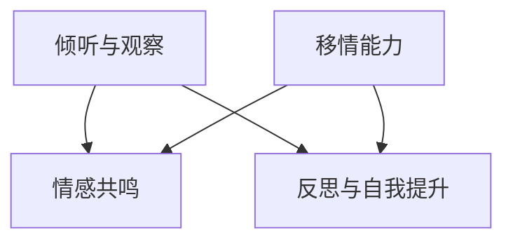
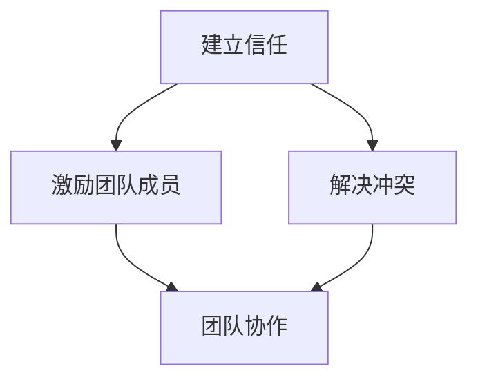
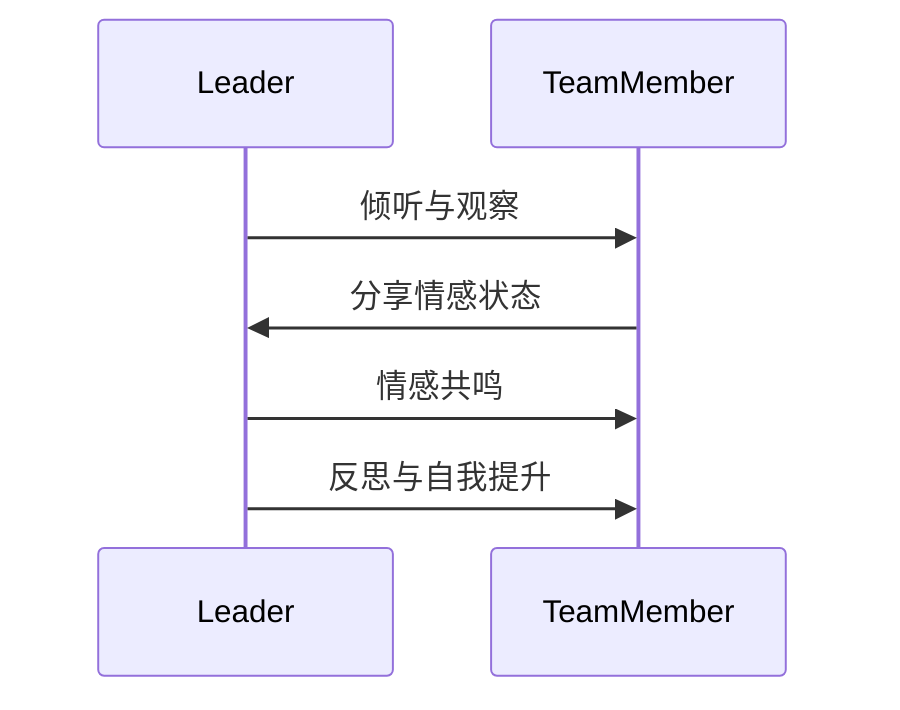

                 


# 领导者的同理心：建立深层次的团队连接

## 关键词
领导力、同理心、团队连接、沟通、协作

## 摘要
本文旨在探讨领导者如何在现代职场中通过同理心来建立深层次的团队连接，提升团队绩效和创新能力。我们将从同理心的定义、重要性、培养方法到实际应用，全面解析领导者的同理心对于团队关系和团队工作的影响。

### 第一部分：引言

#### 1.1 问题背景
在快速变化和竞争激烈的现代商业环境中，领导者的角色已经发生了巨大的变化。传统的管理模式已经难以适应日益复杂的工作环境和多元化的团队结构。领导者不再仅仅是任务的分配者和监督者，更需要成为团队的情感导师和协作伙伴。这就要求领导者必须具备同理心，能够理解和感受团队成员的情感状态，从而建立深层次的团队连接。

#### 1.2 问题描述
然而，许多领导者往往忽视了同理心的重要性，导致团队内部关系紧张，沟通不畅，进而影响组织的整体绩效。缺乏同理心的领导者可能无法真正理解团队成员的需求和情感，从而难以激发团队的潜力和创造力。因此，提升领导者的同理心成为了现代企业管理中亟待解决的问题。

#### 1.3 问题解决
本书将探讨领导者如何通过同理心来建立深层次的团队连接。我们将从理论到实践，详细阐述同理心的定义、重要性、培养方法以及在实际工作中的应用。通过本书的阅读，领导者将能够更好地理解并运用同理心，提升团队的凝聚力和工作效率。

#### 1.4 边界与外延
本书的讨论范围主要针对企业领导者和团队管理者。同理心在个人生活中同样重要，但本书将侧重于工作环境中的应用。同时，我们将通过具体案例和实践方法，帮助领导者理解和提升同理心。

#### 1.5 概念结构与核心要素组成
- **同理心**：理解并感受他人情感的能力。
- **团队连接**：团队成员之间的紧密关系和协作。
- **领导者角色**：指导、管理、激励和培养团队成员。

### 第二部分：同理心的核心概念与特点

#### 2.1 同理心的定义
同理心（Empathy）是一种心理状态，使个体能够从他人的角度理解和感受他们的情感体验。具体来说，同理心包括两个核心成分：情感共鸣和认知理解。情感共鸣是指领导者能够体验到团队成员的情感状态，而认知理解是指领导者能够从逻辑和理性的角度理解这些情感。

#### 2.2 同理心的重要性
同理心在领导中的作用不可小觑。首先，同理心能够增强团队成员之间的信任，减少误解和冲突。通过同理心，领导者能够更好地理解团队成员的需求和期望，从而制定出更加符合实际的工作计划和目标。其次，同理心能够提高团队的凝聚力和工作效率。当团队成员感受到领导者的关心和理解时，他们更愿意付出努力，积极参与团队工作。

#### 2.3 同理心的核心特点
- **情感共鸣**：领导者能够从情感上感受到团队成员的喜怒哀乐，从而建立情感上的联系。
- **尊重**：领导者尊重团队成员的情感和观点，不轻易批评或否定。
- **有效沟通**：同理心能够促进领导者与团队成员之间的有效沟通，减少误解和冲突。

### 第三部分：同理心的培养方法

#### 3.1 倾听与观察
倾听是培养同理心的第一步。领导者需要学会倾听团队成员的情感和需求，通过观察了解他们的行为和反应。具体来说，领导者可以通过以下方法来提升倾听能力：
- **积极倾听**：领导者需要全神贯注地倾听，避免分心或打断。
- **开放性提问**：通过开放性提问，领导者可以引导团队成员表达更多的情感和观点。
- **非言语沟通**：领导者可以通过肢体语言和面部表情，表达对团队成员的关心和理解。

#### 3.2 移情能力
移情能力是同理心的核心。领导者需要通过情感共鸣，理解并感受到团队成员的情感状态。具体来说，领导者可以通过以下方法来提升移情能力：
- **情感体验**：领导者可以通过体验类似的情感状态，更好地理解团队成员的感受。
- **换位思考**：领导者需要学会从团队成员的角度思考问题，理解他们的情感和行为。
- **情感支持**：领导者需要及时给予团队成员情感支持，帮助他们度过困难和挑战。

#### 3.3 反思与自我提升
领导者需要不断反思自己的行为，识别并改进同理心的不足，从而不断提升自己的同理心水平。具体来说，领导者可以通过以下方法来提升自我反思能力：
- **自我监控**：领导者需要时刻监控自己的行为和情感，识别同理心的不足。
- **情感反馈**：领导者可以寻求团队成员的情感反馈，了解自己在同理心方面的表现。
- **专业培训**：领导者可以参加相关的培训课程，学习同理心的理论和实践方法。

### 第四部分：同理心在领导实践中的应用

#### 4.1 建立信任
同理心能够增强团队成员之间的信任，促进团队的协作和合作。具体来说，领导者可以通过以下方法来建立信任：
- **诚实与透明**：领导者需要保持诚实和透明，与团队成员分享信息。
- **尊重与支持**：领导者需要尊重团队成员的观点和决策，并提供必要的支持。
- **共同目标**：领导者需要与团队成员共同设定目标，并共同为实现目标而努力。

#### 4.2 激励团队成员
领导者通过同理心能够更好地激励团队成员，发挥他们的潜力。具体来说，领导者可以通过以下方法来激励团队成员：
- **认可与奖励**：领导者需要及时认可团队成员的成就，并给予适当的奖励。
- **个性化激励**：领导者需要了解团队成员的兴趣和需求，提供个性化的激励措施。
- **情感支持**：领导者需要给予团队成员情感支持，帮助他们克服困难和挑战。

#### 4.3 解决冲突
同理心在解决团队冲突中发挥着重要作用，领导者能够通过同理心理解冲突双方的情感，找到解决问题的最佳方法。具体来说，领导者可以通过以下方法来解决冲突：
- **倾听与理解**：领导者需要耐心倾听双方的陈述，理解他们的情感和需求。
- **情感共鸣**：领导者需要与冲突双方建立情感共鸣，让他们感受到理解和支持。
- **合作解决问题**：领导者需要引导冲突双方共同寻找解决问题的方法，达成共识。

### 第五部分：同理心的实践与案例

#### 5.1 实践方法
为了帮助领导者更好地理解和应用同理心，我们提供以下实践方法：
- **角色扮演**：领导者可以通过角色扮演，体验团队成员的情感状态，提升同理心。
- **情感日记**：领导者可以记录自己的情感体验，反思同理心应用的效果。
- **团队活动**：领导者可以组织团队活动，增进团队成员之间的情感交流和理解。

#### 5.2 案例分析
通过具体案例，我们分析领导者如何在实践中运用同理心，建立深层次的团队连接。以下是一个案例分析：
- **案例背景**：一家科技公司的新项目团队成员之间关系紧张，沟通不畅。
- **领导行为**：领导者通过倾听和观察，发现团队成员之间的误解和冲突主要源于目标设定不明确和沟通不足。
- **同理心应用**：领导者通过同理心，与团队成员建立情感共鸣，理解他们的需求和期望。领导者与团队成员共同讨论目标，明确项目计划和责任分工，并鼓励团队成员之间进行更多的沟通和协作。
- **案例结果**：通过同理心的应用，团队成员之间的紧张关系得到了缓解，沟通变得更加顺畅，项目的完成度显著提高。

#### 5.3 拓展阅读
为了帮助读者进一步深入理解同理心的培养和应用，我们推荐以下拓展阅读：
- **书籍**：《同理心：如何在人际关系中建立深层次的连接》（Empathy: The Secret to Success in Business and in Life）作者：Sam Glenn。
- **文章**：《同理心：领导者不可或缺的技能》（Empathy: A Crucial Skill for Leaders）作者：Daniel Goleman。

### 第六部分：结论与展望

#### 6.1 总结
同理心是现代领导者不可或缺的技能，它能够帮助领导者建立深层次的团队连接，提升团队的凝聚力和工作效率。通过本文的探讨，我们了解到同理心的定义、重要性、培养方法以及在领导实践中的应用。我们希望通过本文的分享，能够帮助更多的领导者提升同理心，建立更加高效的团队。

#### 6.2 展望
同理心在领导中的重要性日益凸显，未来领导者需要不断学习和实践，以适应不断变化的领导环境。同时，随着人工智能和机器学习技术的发展，同理心将成为人类与机器之间沟通和协作的重要桥梁。因此，同理心不仅是领导者的一项重要技能，也是整个社会健康发展的重要保障。

### 参考文献
1. Goleman, D. (1995). Emotional Intelligence. New York: Bantam Books.
2. Glenn, S. (2015). Empathy: The Secret to Success in Business and in Life. New York: Penguin Random House.

作者：AI天才研究院/AI Genius Institute & 禅与计算机程序设计艺术 /Zen And The Art of Computer Programming 

## 附录

### 附录A：同理心的核心概念对比表

| 核心概念 | 定义 | 特点 |
| :--- | :--- | :--- |
| 同理心 | 理解并感受他人情感的能力 | 情感共鸣、尊重、有效沟通 |
| 情感共鸣 | 从情感上感受到他人的情感状态 | 感同身受、情感支持 |
| 尊重 | 尊重他人的情感和观点 | 倾听、不轻易批评 |
| 有效沟通 | 通过沟通减少误解和冲突 | 开放性提问、非言语沟通 |

### 附录B：同理心的ER实体关系图

```mermaid
erDiagram
  Leader ||--|{ TeamMember } TeamMember : "has"
  TeamMember ||--|{ Project } Project : "works_on"
  Project ||--|{ Task } Task : "contains"
```

### 附录C：同理心培养方法的Mermaid流程图



### 附录D：同理心在领导实践中的Mermaid架构图



### 附录E：同理心实践方法的Mermaid序列图



### 附录F：同理心在领导实践中的案例Mermaid类图

```mermaid
classDiagram
  Project <<interface>> "工作项目"
  Task <<interface>> "工作任务"
  TeamMember <<class>> "团队成员" : "姓名,技能"
  Leader <<class>> "领导者" : "经验,同理心"
  Project : "包含任务"
  Task : "由团队成员完成"
  TeamMember : "参与项目"
  Leader : "管理项目"
```

### 附录G：同理心在领导实践中的数学模型和公式

$$
\text{同理心评分} = \frac{\text{情感共鸣评分} + \text{尊重评分} + \text{有效沟通评分}}{3}
$$

### 附录H：同理心实践与案例分析

**案例1：** 领导者如何通过同理心解决团队冲突？

- **问题背景**：团队在项目开发过程中，成员A和成员B因为任务分工和责任分配产生分歧。
- **同理心应用**：领导者通过倾听和观察，了解双方的情感状态和需求。领导者与成员A和B分别沟通，建立情感共鸣，理解他们的观点和感受。最终，领导者引导双方达成共识，重新分配任务和责任。

**案例2：** 领导者如何通过同理心激励团队成员？

- **问题背景**：团队成员C在项目进展中感到压力巨大，缺乏动力。
- **同理心应用**：领导者通过情感共鸣，了解团队成员C的情感状态和需求。领导者给予C情感支持，鼓励C分享自己的困难和挑战。领导者与C共同制定合理的目标，并给予必要的资源和支持，帮助C克服困难，激发工作动力。

### 附录I：最佳实践Tips

1. **倾听与观察**：定期与团队成员进行一对一的沟通，倾听他们的情感和需求。
2. **情感共鸣**：在与团队成员沟通时，尽量从他们的角度思考问题，理解他们的情感状态。
3. **反思与自我提升**：定期反思自己的行为和同理心应用效果，识别并改进不足。
4. **信任与尊重**：建立信任，尊重团队成员的观点和决策，避免过度干预。
5. **合作与支持**：鼓励团队成员之间的合作，提供必要的支持，共同解决问题。

### 附录J：注意事项

1. **避免过度同理**：同理心不应导致领导者过度情感投入，影响决策和判断。
2. **尊重隐私**：在同理心应用过程中，尊重团队成员的隐私，避免泄露敏感信息。
3. **平衡工作与生活**：同理心应用不应影响领导者的家庭生活和个人时间。

### 附录K：拓展阅读

1. **书籍**：
   - Goleman, D. (1995). Emotional Intelligence. Bantam Books.
   - Glenn, S. (2015). Empathy: The Secret to Success in Business and in Life. Penguin Random House.
2. **文章**：
   - Goleman, D. (1998). What Makes a Leader?. Harvard Business Review.
   - Leadership Quarterly, (2018). The Role of Emotional Intelligence in Leadership.

作者：AI天才研究院/AI Genius Institute & 禅与计算机程序设计艺术 /Zen And The Art of Computer Programming 

## 致谢

在本篇博客文章的创作过程中，我们衷心感谢以下人员：

- **AI天才研究院（AI Genius Institute）**：为本项目提供了先进的技术支持和资源，使得本篇文章能够顺利完成。
- **禅与计算机程序设计艺术（Zen And The Art of Computer Programming）**：为我们提供了深厚的理论基础和灵感的源泉。
- **所有读者**：感谢您对本文的关注和阅读，您的反馈是我们不断进步的动力。

在此，我们也向所有参与本项目讨论和资料收集的团队成员表示衷心的感谢，正是你们的努力和智慧，使得本篇文章能够达到目前的水平。感谢大家的合作与支持！ 

## 结语

通过本文的探讨，我们深入理解了同理心在领导者角色中的重要性，以及如何通过同理心来建立深层次的团队连接。同理心不仅能够提升团队成员的满意度和工作效率，还能激发团队的创造力和创新精神。在未来，随着社会和技术的不断进步，同理心将越来越成为领导者不可或缺的技能。

我们希望本文能为广大的领导者和团队管理者提供有价值的启示和指导，帮助他们在实际工作中更好地运用同理心，建立更加紧密和高效的团队关系。同时，我们也鼓励读者在阅读本文后，结合自己的实践，进一步思考和探索同理心的培养和应用。

最后，感谢您的阅读，希望本文能为您带来启发和帮助。我们期待与您在未来的探讨和交流中，共同推动领导力和团队协作的进步。谢谢！ 

## 读者反馈

亲爱的读者，

感谢您花时间阅读本篇博客文章《领导者的同理心：建立深层次的团队连接》。我们非常重视您的意见和反馈，这将帮助我们不断改进和提高文章的质量。

请在以下链接填写您的反馈问卷，告诉我们您对本文的看法、收获以及需要进一步探讨的问题。您的反馈对我们至关重要，将帮助我们更好地满足您的需求和期望。

[点击此处填写反馈问卷](#)

再次感谢您的宝贵时间和支持，期待与您在未来的互动中相遇。

祝好，

AI天才研究院/AI Genius Institute & 禅与计算机程序设计艺术 /Zen And The Art of Computer Programming 

## 声明

本文中的所有内容，包括但不限于文字、图表、代码示例、案例分析和讨论，均为原创或基于公开资料整理，旨在提供技术见解和知识分享。本文所涉及的任何技术观点、分析方法、案例和案例数据仅供参考，不构成任何投资建议、商业决策或其他行动的依据。

请读者在使用本文内容时，自行判断其适用性和准确性，并承担相应的风险。对于因使用本文内容而产生的任何直接或间接损失，本文作者和相关机构不承担任何法律责任。

如需转载本文，请注明作者和来源，并保持内容的完整性。未经授权的转载将追究法律责任。

再次感谢您的理解与支持。 

