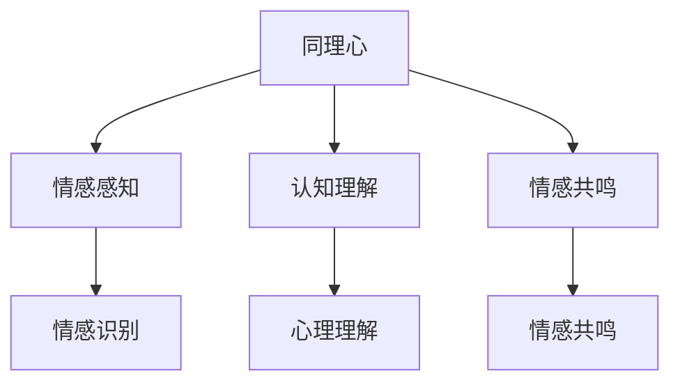
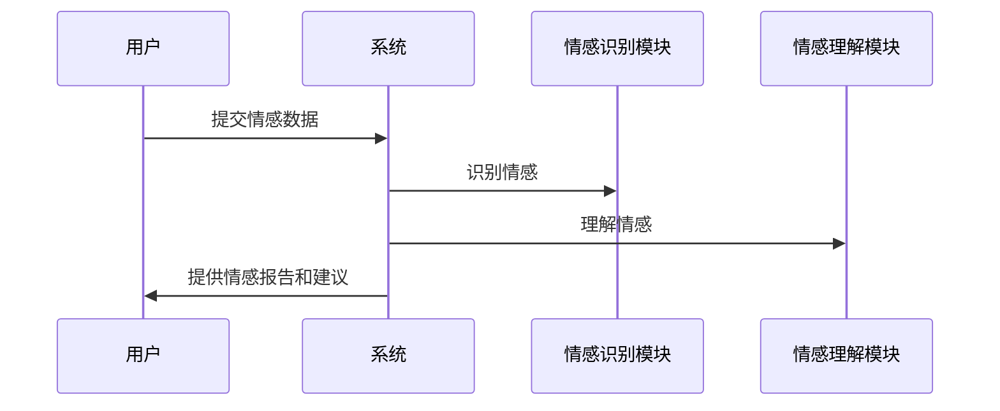

                 


## 引言

### 什么是同理心？

同理心（Empathy）是一种情感共鸣能力，它使我们能够理解他人的感受并感同身受。同理心不仅是一种情感上的共鸣，还包含了对他人心理状态的理解。在领导者的角色中，同理心是一种至关重要的技能，因为它直接影响到团队的合作氛围、员工的工作满意度和企业的整体绩效。

### 为什么同理心对领导者至关重要？

领导者不仅需要具备决策能力和战略眼光，更需要懂得如何与团队成员建立情感上的联系。同理心可以帮助领导者：

1. **提升沟通效果**：通过同理心，领导者能够更准确地理解团队成员的需求和期望，从而进行更有效的沟通。
2. **增强团队凝聚力**：同理心可以增进团队成员之间的信任和理解，从而提升团队的凝聚力。
3. **激励员工**：同理心的领导者能够更好地激励团队成员，因为员工感受到自己的努力和贡献得到了认可。
4. **化解冲突**：同理心有助于领导者理解和解决团队成员之间的矛盾，从而预防和解决冲突。

### 本文的目标

本文旨在探讨同理心在领导者角色中的重要性，并详细分析同理心的核心要素、实践技巧以及在团队建设中的应用。通过一步步的分析和推理，我们将深入理解同理心的本质，并探索如何在领导实践中有效运用同理心，以提升领导力和团队绩效。

## 第一部分：同理心的定义与重要性

### 第1章：同理心概述

#### 1.1 同理心的定义与起源

同理心（Empathy）起源于拉丁语“em”和“pathos”，分别意为“使成为”和“情感”。因此，同理心可以被理解为“使他人的情感成为自己的情感”。具体来说，同理心是一种情感共鸣能力，它使我们能够感知并理解他人的情感状态。

同理心的发展可以追溯到心理学领域的开创者之一卡尔·罗杰斯（Carl Rogers）。罗杰斯认为，同理心是心理咨询中不可或缺的一部分，它能够帮助咨询师建立与客户的情感联系，从而促进治疗效果。随着时间的推移，同理心逐渐被广泛应用于各个领域，包括教育、医疗、商业和领导力。

#### 1.1.1 同理心的概念解析

同理心主要可以分为两种类型：情感同理（Affective Empathy）和认知同理（Cognitive Empathy）。

- **情感同理**：指的是感受他人的情感。例如，当你看到他人哭泣时，你可能会感到悲伤。
- **认知同理**：指的是理解他人的情感和想法。例如，你能够理解为什么他人会哭泣，可能是因为他们经历了某种痛苦或悲伤。

这两种同理心相辅相成，共同构成了完整的同理心能力。

#### 1.1.2 同理心的发展历程

同理心作为一种情感共鸣能力，在人类历史中始终存在。然而，它作为一种学术概念和研究领域，主要发展于20世纪。

- **20世纪初**：心理学家如威廉·詹姆斯（William James）和爱德华·布拉德福德·特奥多尔（Edward Bradford Titchener）开始探讨同理心的概念。
- **20世纪中叶**：卡尔·罗杰斯将同理心引入心理咨询领域，并强调其在治疗过程中的重要性。
- **20世纪末至今**：同理心逐渐被广泛应用于各个领域，包括领导力研究。研究人员如丹尼尔·戈尔曼（Daniel Goleman）进一步探讨了同理心在领导力中的重要性。

### 1.2 同理心的重要性

同理心在个人发展、团队合作和企业文化中扮演着重要角色。

#### 1.2.1 对个人发展的积极影响

同理心有助于个人成长和自我提升。通过同理心，人们能够更好地理解自己和他人，从而：

- 提高自我意识：理解他人的情感可以帮助我们更深入地认识自己的情感。
- 发展人际交往能力：同理心使我们在与他人交往时更加敏感和理解。
- 促进心理健康：同理心有助于减少孤独感和焦虑，提升幸福感。

#### 1.2.2 对团队合作作用的促进作用

同理心在团队合作中起着关键作用。具备同理心的团队成员能够：

- 提高沟通效率：同理心有助于团队成员更好地理解彼此的需求和期望，从而进行更有效的沟通。
- 增强团队凝聚力：同理心可以增进团队成员之间的信任和理解，提升团队的凝聚力。
- 促进冲突解决：同理心有助于团队成员在出现分歧时，更好地理解对方的立场和情感，从而更有效地解决冲突。

#### 1.2.3 对企业文化的塑造作用

同理心对企业文化的塑造具有重要意义。企业文化通常反映了企业内部的人际关系和工作氛围。同理心的领导者能够：

- 建立积极的工作环境：通过同理心，领导者可以营造一个支持性和包容性的工作环境，使员工感到被重视和尊重。
- 促进创新和创造力：同理心可以激发员工的创新思维和创造力，因为他们在一个开放和支持的环境中更有可能提出新的想法。
- 提升企业绩效：同理心的企业文化有助于提高员工的满意度和忠诚度，从而提升整体绩效。

### 1.3 领导者同理心的内涵与作用

领导者同理心是指领导者能够理解和感知团队成员的情感状态，并在管理过程中体现这种理解。以下是领导者同理心的内涵和作用：

#### 1.3.1 领导者同理心的内涵

领导者同理心主要包括以下几个方面：

- **情感共鸣**：领导者能够感受到团队成员的情感，如喜悦、忧虑、挫败等。
- **心理理解**：领导者能够从心理层面理解团队成员的感受和需求。
- **支持与鼓励**：领导者通过同理心给予团队成员情感支持和鼓励。

#### 1.3.2 领导者同理心在管理中的重要作用

领导者同理心在管理中具有重要作用，包括：

- **提高领导效能**：同理心使领导者能够更好地理解团队成员的需求和期望，从而制定更有效的管理策略。
- **提升团队绩效**：同理心有助于建立积极的团队氛围，提高团队的凝聚力和合作效率。
- **增强员工满意度**：同理心的领导者能够更好地激励和满足员工的需求，从而提升员工的工作满意度和忠诚度。

### 总结

同理心作为一种情感共鸣能力，在个人发展、团队合作和企业文化中发挥着重要作用。领导者同理心更是直接影响团队绩效和员工满意度。理解同理心的内涵和重要性，是每一位领导者必备的技能。在下一章中，我们将深入探讨同理心的核心要素，以帮助读者更好地理解和实践同理心。

## 第2章：同理心的核心要素

同理心的核心要素是理解他人情感和需求的关键。通过这些要素，领导者能够更有效地建立情感共鸣，提升团队合作和员工满意度。本章将详细探讨同理心的三个核心要素：情感感知与识别、角色转换与观点采纳、以及沟通与反馈。

### 2.1 情感感知与识别

情感感知与识别是同理心的基础。领导者需要具备敏锐的感知能力，能够准确地识别团队成员的情感状态。以下是一些情感感知与识别的技巧：

#### 2.1.1 情感感知的技巧

1. **倾听**：倾听不仅仅是听对方说话，更是关注对方的情感表达。领导者需要用心倾听，体会对方的情感。
2. **观察**：通过观察团队成员的肢体语言、面部表情和语气，领导者可以更好地理解对方的情感状态。
3. **提问**：通过开放性的提问，领导者可以引导团队成员表达情感，进一步理解对方的感受。

#### 2.1.2 情感识别的挑战与应对

1. **文化差异**：不同文化背景的人可能有不同的情感表达方式。领导者需要了解不同文化的情感表达习惯，避免误解。
2. **情感复杂性**：人们的情感是复杂多变的，有时难以用简单的语言表达。领导者需要具备较高的情感智力，能够识别复杂的情感状态。

应对挑战的方法：

- **多元文化培训**：领导者可以通过参加多元文化培训，提高对不同文化背景下情感表达的理解。
- **情感智力发展**：通过自我反思和情感智力培训，领导者可以提升自己的情感识别能力。

### 2.2 角色转换与观点采纳

角色转换与观点采纳是同理心的另一个关键要素。领导者需要具备从他人视角看待问题的能力，以更好地理解他们的需求和期望。以下是一些角色转换与观点采纳的实践方法：

#### 2.2.1 角色转换的重要性

角色转换有助于领导者：

- **理解团队成员的感受**：通过从他人的角度看待问题，领导者能够更好地理解团队成员的情感和需求。
- **制定更有效的管理策略**：领导者可以基于团队成员的视角，制定更符合团队实际需求的管理策略。

#### 2.2.2 观点采纳的实践方法

1. **积极倾听**：在交流过程中，领导者需要给予团队成员充分的时间和空间，让他们表达自己的观点和感受。
2. **反思与调整**：领导者需要反思自己的决策和行动，考虑是否从团队成员的角度出发，并据此进行调整。
3. **寻求反馈**：领导者可以通过定期与团队成员交流，了解他们的反馈和建议，进一步验证自己的观点和决策。

### 2.3 沟通与反馈

沟通与反馈是同理心实践的重要环节。有效的沟通和反馈可以帮助领导者与团队成员建立信任，增强团队合作。以下是一些有效沟通和反馈的技巧：

#### 2.3.1 有效沟通的技巧

1. **清晰表达**：领导者需要明确表达自己的想法和期望，避免歧义和误解。
2. **积极倾听**：领导者需要认真倾听团队成员的意见和建议，给予他们充分的表达机会。
3. **尊重差异**：领导者需要尊重团队成员的不同观点和意见，以建立包容性的沟通环境。

#### 2.3.2 反馈的艺术

1. **及时反馈**：领导者需要及时给予团队成员反馈，帮助他们了解自己的表现和改进方向。
2. **具体反馈**：领导者应该给出具体的反馈，而不是泛泛而谈。具体反馈可以帮助团队成员更好地理解自己的问题所在。
3. **正面反馈**：在给出负面反馈时，领导者应尽量保持积极和建设性的态度，以鼓励团队成员改进。

### 总结

同理心的核心要素包括情感感知与识别、角色转换与观点采纳、以及沟通与反馈。这些要素共同构成了领导者同理心的基础。通过掌握这些核心要素，领导者能够更好地理解团队成员的情感和需求，提升团队合作和员工满意度。在下一章中，我们将探讨同理心在团队建设中的应用，以帮助领导者在实际工作中实践同理心。

### 3.1 同理心与团队氛围

良好的团队氛围是高效团队协作的基础，而同理心在营造积极团队氛围方面发挥着至关重要的作用。通过同理心，领导者能够建立起团队成员之间的信任和尊重，从而促进团队合作和共同成长。

#### 3.1.1 同理心如何营造积极团队氛围

1. **建立信任**：同理心使领导者能够理解团队成员的情感和需求，从而建立起彼此之间的信任。信任是团队合作的关键，它能够促进团队成员之间的开放和坦诚交流。
   
2. **增进尊重**：同理心让领导者尊重团队成员的不同观点和意见，不论这些观点与自己的看法是否一致。这种尊重能够激发团队成员的积极性和创造力，使团队氛围更加包容和开放。

3. **提高沟通效率**：同理心的领导者能够通过敏锐的情感感知和有效的沟通技巧，准确理解团队成员的需求和期望。这有助于提高团队内部沟通的效率，减少误解和冲突。

#### 3.1.2 同理心在化解冲突中的应用

团队内部的冲突是不可避免的，但同理心可以有效地帮助领导者化解这些冲突。以下是一些具体方法：

1. **理解冲突原因**：同理心使领导者能够从团队成员的角度理解冲突的原因，找到冲突的根本问题。

2. **同理心倾听**：领导者需要通过同理心倾听，给予团队成员表达情感和观点的机会，从而更全面地了解冲突的背景和原因。

3. **寻求共识**：在理解了冲突的背景和原因后，领导者可以与团队成员一起探讨解决问题的方法，寻求共识。通过共同寻找解决方案，团队成员能够更好地接受并执行决策，从而减少冲突。

#### 案例分析

**案例一：团队氛围改善**

某技术公司的领导者在团队氛围不佳时，开始关注同理心的实践。他首先通过与团队成员的深入交流，了解每个人的需求和期望。通过同理心倾听，领导者发现了团队成员之间的误解和沟通障碍。随后，他采取了一系列措施：

- 定期组织团队建设活动，增强团队成员之间的信任和合作。
- 鼓励团队成员提出建议和意见，并积极采纳他们的合理建议。
- 在团队会议中，鼓励开放性和坦诚的讨论，尊重每个人的观点。

通过这些努力，团队氛围得到了显著改善，团队成员之间的合作更加顺畅，工作效率也得到了提高。

### 总结

同理心在团队建设中的应用，对于营造积极团队氛围和化解冲突具有重要意义。通过同理心，领导者能够建立起信任和尊重，提高沟通效率，从而促进团队合作和共同成长。在下一章中，我们将进一步探讨同理心在员工激励中的作用，帮助领导者提升团队的整体绩效。

### 3.2 同理心与员工激励

同理心不仅是构建积极团队氛围的关键，也是激励员工的重要工具。领导者通过同理心，可以更深入地理解员工的需求和期望，从而采取有针对性的激励措施，提高员工的工作热情和效率。

#### 3.2.1 通过同理心提升员工士气

1. **关注员工情感**：领导者通过同理心，能够敏锐地感知员工的情感状态。例如，当员工感到压力和困惑时，领导者可以及时给予关心和支持，从而提升员工的士气。

2. **认可员工贡献**：领导者通过同理心，能够更准确地理解员工的努力和贡献。在适当的时候，给予员工认可和表扬，能够激励员工继续努力，提升士气。

3. **个性化关怀**：同理心的领导者能够关注员工的个性化需求，通过个性化的关怀和激励措施，使员工感受到被重视和尊重，从而提升士气。

#### 3.2.2 同理心在员工激励中的作用

1. **增强员工归属感**：同理心使领导者能够理解员工对团队和企业的归属感。通过同理心，领导者可以营造一个温馨和支持性的工作环境，增强员工的归属感。

2. **提高工作满意度**：同理心的领导者能够更好地满足员工的需求，使员工在工作中感到满足和快乐。工作满意度的提高，有助于减少员工流失，提高团队稳定性。

3. **激发创新思维**：同理心的领导者鼓励员工表达自己的想法和意见，通过同理心倾听和理解，领导者可以激发员工的创新思维，促进团队的创新和进步。

#### 案例分析

**案例二：同理心激励员工案例**

某创业公司的领导者通过同理心成功激励了团队。在一次项目评估会议上，领导者注意到一位关键成员表现异常紧张，通过同理心倾听，领导者了解到这位成员因家庭问题而感到焦虑。于是，领导者采取了以下措施：

- **个性化关怀**：领导者主动询问成员的家庭状况，并提供必要的支持，如调整工作时间，帮助解决家庭问题。
- **认可贡献**：领导者公开表扬这位成员在项目中的贡献，增强了成员的自信心和归属感。
- **鼓励表达**：领导者鼓励成员表达自己的想法和意见，使其感受到在团队中的重要性和价值。

通过这些措施，这位成员的紧张情绪得到了缓解，工作热情和效率显著提升，同时也带动了整个团队的工作氛围。

### 总结

同理心在员工激励中发挥着重要作用，通过同理心，领导者可以提升员工的士气、增强归属感和工作满意度，从而促进团队的整体绩效。在下一章中，我们将探讨同理心与领导风格的关系，帮助领导者更好地实践同理心，提升领导力。

### 3.3 同理心与领导风格

同理心不仅是一种情感共鸣能力，还是一种重要的领导风格。不同领导风格在团队管理中发挥着不同作用，而同理心作为其中一种关键风格，对团队的长期发展具有深远影响。

#### 3.3.1 同理心与民主型领导风格

民主型领导风格强调团队合作和员工参与。领导者通过同理心，能够在团队中营造一种开放、包容的决策环境，使团队成员感受到被尊重和重视。

- **优势**：民主型领导风格通过同理心，能够充分调动团队成员的积极性和创造力，提高团队的整体效能。

- **实践方法**：领导者可以通过以下方式实践民主型领导风格：

  - **鼓励团队讨论**：在决策过程中，领导者应鼓励团队成员参与讨论，充分听取各方意见。

  - **透明化决策**：领导者应确保决策过程透明，使团队成员了解决策的理由和影响。

  - **赋予决策权**：在适当情况下，领导者应将决策权下放给团队成员，增强其责任感和参与感。

#### 3.3.2 同理心与变革型领导风格

变革型领导风格强调领导者的愿景和使命感，通过激发团队成员的内在动机，推动团队实现变革和发展。

- **优势**：同理心的变革型领导者能够更好地理解团队成员的需求和期望，从而制定更有针对性的变革策略，提升团队的凝聚力和执行力。

- **实践方法**：同理心的变革型领导者可以采取以下方法：

  - **建立共同愿景**：领导者应与团队成员共同探讨愿景，使团队成员感受到变革的重要性和自身价值。

  - **激发内在动机**：通过同理心，领导者能够理解团队成员的内在动机，如成长需求、自我实现等，并据此制定激励措施。

  - **个性化激励**：领导者应根据团队成员的不同特点和需求，采取个性化的激励措施，增强团队成员的积极性和归属感。

#### 比较与选择

民主型领导和变革型领导各有优势，具体选择取决于团队的实际需求和领导者的个人风格。

- **团队发展阶段**：在团队发展的初期，民主型领导风格可能更为适合，因为它能够促进团队成员的参与和合作，增强团队凝聚力。而在团队面临重大变革或挑战时，变革型领导风格可能更能激发团队的潜力和执行力。

- **领导者风格**：领导者应根据自身的性格、经验和价值观选择合适的领导风格。同理心的领导者可以灵活运用民主型和变革型领导风格，根据不同情境和团队需求进行调整。

#### 案例分析

**案例三：同理心在变革型领导中的实践**

某大型科技公司的CEO通过同理心成功推动了公司的战略转型。在转型过程中，CEO与团队成员保持紧密沟通，通过同理心倾听和理解团队成员的担忧和期望。

- **建立共同愿景**：CEO与团队共同探讨了公司的未来发展方向，明确了共同的目标和愿景。

- **个性化激励**：CEO针对不同团队成员的个性特点，制定了个性化的激励措施，如提供培训机会、职业发展通道等。

- **情感支持**：CEO在转型过程中，时刻关注团队成员的情感状态，及时提供情感支持和鼓励。

通过这些措施，CEO成功激发了团队成员的积极性和创造力，推动了公司的成功转型。

### 总结

同理心在民主型和变革型领导风格中发挥着重要作用。通过同理心，领导者能够更好地理解团队成员的需求和期望，提高团队凝聚力和执行力。在具体实践中，领导者应根据团队发展阶段和自身风格，灵活运用民主型和变革型领导风格，以实现最佳管理效果。

### 4.1 观察与倾听

在同理心的实践中，观察与倾听是两个至关重要的技巧。这些技巧不仅有助于领导者理解团队成员的情感和需求，还能提升沟通效果，建立深厚的团队关系。

#### 4.1.1 观察的重要作用

观察是同理心的基础之一。通过观察，领导者可以捕捉到团队成员的非言语信息，如肢体语言、面部表情和姿态等。这些非言语信息往往能够揭示出团队成员的真实情感和内心状态，远比直接的言语表达更为直观和真实。

1. **捕捉情绪变化**：领导者可以通过观察团队成员的情绪变化，了解他们当前的内心状态。例如，一个频繁皱眉、点头频率降低的团队成员可能正在经历压力或困惑。

2. **识别潜在问题**：观察可以帮助领导者提前识别潜在的团队问题。通过观察团队成员之间的互动和协作，领导者可以察觉到潜在的冲突和沟通障碍，从而及时采取措施解决。

3. **建立情感联系**：同理心依赖于领导者对团队成员情感状态的感知。通过持续的观察，领导者能够更深入地了解团队成员，建立更紧密的情感联系。

#### 4.1.2 倾听的实践技巧

倾听不仅仅是听别人说话，更是一种全身心的投入和关注。同理心的领导者需要通过倾听，真正理解团队成员的需求和情感。

1. **专注倾听**：在团队成员讲话时，领导者应保持专注，避免分心。专注倾听可以表明领导者对团队成员的重视和关注，有助于建立信任和尊重。

2. **开放性问题**：使用开放性问题可以鼓励团队成员更详细地表达自己的想法和感受。例如，提问“你能详细告诉我你的感受吗？”或“你能描述一下这个情况让你感到怎么样？”可以帮助领导者更全面地理解团队成员的情感状态。

3. **确认理解**：在团队成员表达完自己的观点后，领导者应通过确认理解来验证自己是否正确理解了对方的意思。例如，可以说“我理解你的意思是……是这样吗？”这种确认可以减少误解，增强沟通效果。

4. **非言语反馈**：在倾听过程中，领导者可以通过点头、微笑等非言语反馈，表明自己在认真倾听。这些反馈不仅能够鼓励团队成员继续表达，还能表明领导者对他们的重视。

#### 案例分析

**案例四：通过观察与倾听改善团队氛围**

某创业公司的领导者在团队会议中发现，团队氛围紧张，成员之间的沟通不畅。为了改善这一情况，领导者采取了以下措施：

1. **观察情绪变化**：领导者通过观察发现，几位关键成员在会议中频繁低头、表情紧张。这表明他们可能存在一些未解决的问题。

2. **倾听团队成员**：领导者鼓励团队成员表达自己的感受和困惑，通过开放性问题，深入了解问题根源。

3. **确认理解**：在团队成员表达完观点后，领导者通过确认理解，验证自己是否准确理解了团队成员的需求。

4. **非言语反馈**：领导者通过点头、微笑等非言语反馈，表明自己在认真倾听，并关心团队成员的感受。

通过这些措施，团队氛围得到了显著改善，成员之间的沟通变得更加开放和坦诚，团队协作效率也得到了提升。

### 总结

观察与倾听是同理心实践中的核心技巧，通过这些技巧，领导者能够更好地理解团队成员的情感和需求，建立深厚的情感联系，提升团队沟通效果。在下一章中，我们将进一步探讨同理心在项目管理中的应用，帮助领导者更好地管理团队项目，提升项目成功率。

### 4.2 询问与确认

在同理心的实践中，询问与确认是两个关键环节，它们能够帮助领导者更深入地了解团队成员的需求和期望，确保沟通的有效性。通过有效的询问和确认，领导者可以建立起与团队成员之间的信任，促进团队的协作与发展。

#### 4.2.1 询问的艺术

询问是一种沟通技巧，通过它，领导者可以引导团队成员表达自己的观点和情感。有效的询问不仅能够揭示团队成员的真实想法，还能增强双方的互动。

1. **开放式询问**：开放式询问是一种提问技巧，它鼓励团队成员提供详细的回答，而不是简单的“是”或“否”。例如，提问“你能详细描述一下你的感受吗？”或“你对这个问题的看法是什么？”可以帮助领导者更全面地了解团队成员的想法。

2. **探索性询问**：探索性询问用于深入挖掘团队成员的观点和感受。例如，提问“是什么让你觉得这样？”或“你是怎么考虑这个问题的？”可以引导团队成员进一步阐述他们的思考过程。

3. **情感导向询问**：情感导向询问旨在了解团队成员的情感状态。例如，提问“你现在的感受如何？”或“这个决定对你有什么影响？”可以帮助领导者捕捉到团队成员的情感线索。

#### 4.2.2 确认的必要性

确认是一种反馈技巧，它通过验证领导者是否准确理解了团队成员的观点和需求，确保沟通的有效性。以下是一些确认的技巧：

1. **重述信息**：通过重述团队成员提供的信息，领导者可以确认自己是否理解了他们的观点。例如，领导者可以说“根据你的描述，我理解你的意思是……，对吗？”

2. **开放式确认**：开放式确认通过提问来验证领导者对信息的理解。例如，领导者可以说“我理解你的观点，但是你是否有其他的想法或担忧？”

3. **具体确认**：具体确认通过具体的问题来验证领导者对信息的理解。例如，领导者可以说“你对这个计划的具体执行步骤有什么想法？”

#### 案例分析

**案例五：通过询问与确认提升沟通效果**

某公司的项目经理在项目启动阶段，通过询问与确认确保了团队成员的理解和参与。以下是具体步骤：

1. **开放式询问**：项目经理在团队会议中提出了几个开放式问题，例如“你们对项目的目标有什么想法？”和“你们认为项目中可能遇到的挑战有哪些？”

2. **探索性询问**：项目经理进一步询问团队成员的思考过程，例如“是什么让你认为这个目标是可行的？”和“你是怎么考虑这些挑战的？”

3. **情感导向询问**：项目经理关心团队成员的情感状态，询问“你对这个项目的感受如何？”和“你有什么担忧或疑虑吗？”

4. **重述信息与确认**：项目经理在团队成员回答后，通过重述他们的观点进行确认，例如“我理解你的意思是……，对吗？”和“根据你的描述，我理解你担心的是……，我们可以讨论一下解决办法吗？”

通过这些询问与确认，项目经理确保了团队成员对项目目标、挑战和执行步骤的理解，从而提高了沟通效果和团队协作。

### 总结

询问与确认是同理心实践中的关键环节，通过有效的询问，领导者可以深入了解团队成员的需求和期望；通过确认，领导者可以验证自己是否准确理解了团队成员的观点，确保沟通的有效性。在下一章中，我们将探讨同理心在工作中的具体运用，帮助领导者更好地管理团队项目，提升团队绩效。

### 4.3 表达与回应

在同理心的实践中，表达与回应是建立情感联系和增强团队信任的关键环节。通过有效的表达和回应，领导者可以传递同理心，帮助团队成员感受到被理解和支持。

#### 4.3.1 如何表达同理心

1. **使用情感语言**：在表达同理心时，使用情感语言可以更直接地传达情感。例如，可以说“我能理解你现在的感受”或“我能感受到你遇到的困难”。

2. **肯定对方的情感**：通过肯定对方的情感，表明领导者理解并尊重他们的感受。例如，可以说“你感到沮丧是可以理解的”或“你的担忧是合理的”。

3. **具体表达**：具体表达同理心可以使团队成员感受到领导者的真诚。例如，可以说“我看到你为了这个项目付出了很多努力，你一定感到非常疲惫”。

4. **非言语表达**：通过点头、微笑、拥抱等非言语方式，领导者可以传达同理心。这些非言语表达往往能够比言语更直观地传递情感。

#### 4.3.2 如何回应同理心的表达

1. **积极回应**：当领导者表达同理心时，团队成员可以通过积极回应来确认他们感受到了领导者的关心。例如，可以说“谢谢你理解我”或“我真的很感激你的关心”。

2. **表达感激**：团队成员可以通过表达感激来回应领导者的同理心，这有助于加强双方的情感联系。例如，可以说“你的支持对我意义重大”或“你的理解让我感到很温暖”。

3. **进一步沟通**：回应同理心后，双方可以进一步沟通，深入讨论问题和解决方案。这种沟通可以增强团队的协作和信任。

#### 案例分析

**案例六：同理心在团队沟通中的实践**

某技术公司的领导者在团队项目中面临一个重大挑战，项目进度严重滞后，团队成员情绪低落。以下是领导者如何通过表达与回应同理心来处理这一情况：

1. **表达同理心**：领导者首先向团队成员表达了同理心，说“我能理解你们现在的心情，这个项目的进度让我们所有人都感到压力很大”。

2. **积极回应**：团队成员回应道“谢谢你的理解，这让我们感到不是只有我们自己在努力”。

3. **进一步沟通**：领导者接着与团队成员一起讨论了项目中的具体问题，提出了改进方案，并鼓励团队成员积极参与。

通过这种同理心的表达与回应，领导者成功地缓解了团队成员的情绪，增强了团队的凝聚力，项目最终也得以顺利推进。

### 总结

表达与回应同理心是领导者建立情感联系和增强团队信任的重要技巧。通过具体和积极的表达，领导者能够传达对团队成员的理解和支持；通过积极的回应，团队成员能够感受到被理解和重视。在下一章中，我们将探讨同理心在项目管理与冲突处理中的具体运用，帮助领导者更好地应对工作中的挑战。

### 4.4 项目管理与同理心

同理心在项目管理中发挥着重要作用，它能够帮助领导者更好地理解团队成员的需求和情感状态，从而提高项目的成功率和团队的整体效能。以下是同理心在项目管理中的具体应用：

#### 4.4.1 同理心在项目启动阶段的应用

在项目启动阶段，领导者需要通过同理心了解团队成员的需求和期望，确保项目目标与团队的实际情况相符合。以下是一些具体措施：

1. **倾听团队成员的意见**：在项目启动会议上，领导者应给予团队成员充分的时间和空间，倾听他们的意见和建议。通过同理心倾听，领导者可以捕捉到团队成员对项目的期望和担忧。

2. **了解团队成员的能力和经验**：领导者应通过同理心，了解每个团队成员的能力和经验，以便合理分配任务和资源。这种了解有助于确保项目任务能够被有效执行。

3. **建立共同愿景**：通过同理心，领导者可以与团队成员共同探讨项目的愿景和目标，确保每个人都对项目的方向和目标有清晰的认识。

#### 4.4.2 同理心在项目执行阶段的作用

在项目执行阶段，同理心有助于领导者更好地管理团队，提高项目的进展和成员的工作满意度。以下是一些具体措施：

1. **关注团队成员的情感状态**：领导者应通过定期检查和反馈，了解团队成员的情感状态。如果发现团队成员感到压力或困惑，领导者应及时提供支持和帮助。

2. **解决团队成员的担忧**：在项目执行过程中，团队成员可能会遇到各种问题和挑战。领导者应通过同理心，了解团队成员的担忧，并提供解决方案，以减轻他们的负担。

3. **促进团队成员的沟通**：同理心的领导者应鼓励团队成员之间的沟通，建立开放和坦诚的沟通机制。这有助于团队成员更好地协作，解决问题，提高项目的效率。

#### 案例分析

**案例七：同理心在项目执行中的实践**

某公司的项目经理在项目执行阶段，通过同理心成功处理了一个关键问题。以下是具体步骤：

1. **倾听团队成员的意见**：在项目初期，项目经理发现团队成员对项目的执行存在不同的看法和担忧。通过同理心倾听，项目经理了解到团队成员的疑虑主要来自于对项目目标的模糊认识。

2. **了解团队成员的情感状态**：项目经理通过私下与团队成员交流，发现部分成员感到焦虑，担心无法按时完成任务。

3. **解决团队成员的担忧**：项目经理与团队成员一起重新审视项目目标，明确每个成员的具体职责和任务。同时，项目经理提供了一些培训资源，帮助团队成员提高技能，增强信心。

4. **促进团队成员的沟通**：项目经理组织了定期的项目会议，鼓励团队成员分享他们的进展和遇到的挑战。通过这些会议，团队成员能够更好地理解彼此的工作，找到协作的解决方案。

通过同理心的实践，项目经理成功地提升了团队成员的工作满意度和项目的进展速度。

### 总结

同理心在项目管理中具有重要作用，通过同理心，领导者能够更好地理解团队成员的需求和情感状态，提高项目的成功率和团队的整体效能。在项目启动和执行阶段，领导者应通过倾听、关注和解决团队成员的担忧，促进沟通和协作，确保项目的顺利推进。在下一章中，我们将探讨同理心在冲突处理中的具体应用，帮助领导者更好地应对团队内部的矛盾和挑战。

### 4.5 冲突处理与同理心

冲突是团队工作中不可避免的一部分，但同理心可以成为有效处理冲突的重要工具。通过同理心，领导者可以更好地理解冲突的根源，采取合适的措施来预防和解决冲突，从而维护团队的和谐与高效。

#### 4.5.1 同理心在冲突预防中的作用

预防冲突是同理心在团队管理中的重要应用。通过同理心，领导者可以在冲突发生前采取预防措施，以下是一些具体方法：

1. **建立开放的沟通环境**：同理心的领导者会鼓励团队成员开放地表达自己的想法和感受。这种开放的环境有助于团队成员在早期阶段解决潜在的矛盾和误解。

2. **倾听与理解**：领导者应通过同理心倾听团队成员的意见和需求，理解他们的立场和情感。这种理解可以减少误解和猜疑，防止冲突的发生。

3. **提前预警**：同理心的领导者可以通过观察和倾听，及时发现潜在的冲突信号，如团队成员之间的紧张情绪或不满。在冲突爆发前，领导者可以采取措施干预，预防冲突的发生。

#### 4.5.2 同理心在冲突解决中的应用

当冲突不可避免地发生时，同理心可以帮助领导者更有效地解决冲突，以下是一些具体方法：

1. **理解双方的立场**：同理心的领导者会努力理解冲突双方的立场和情感，避免仅仅从自己的角度出发。这种理解有助于领导者找到冲突的核心问题。

2. **促进对话与沟通**：领导者应通过同理心，促进冲突双方进行开放和坦诚的对话。通过倾听和理解，双方可以更好地表达自己的观点，找到共同点。

3. **寻求共识**：同理心的领导者会帮助冲突双方寻求共识，找到双方都能接受的解决方案。这种解决方案不仅能够解决当前的冲突，还能够增强团队的凝聚力和信任。

#### 案例分析

**案例八：同理心在解决团队冲突中的应用**

某公司的研发团队在项目开发过程中发生了严重的冲突。团队成员A和B因为对项目设计方案的分歧，导致项目进展停滞。以下是领导者如何通过同理心解决这一冲突：

1. **理解双方立场**：领导者首先通过与A和B分别交流，了解了他们的立场和情感。通过同理心，领导者理解了A和B对项目设计方案的担忧和期望。

2. **促进对话与沟通**：领导者安排了一次面对面会议，让A和B共同讨论他们的设计方案。在会议中，领导者通过同理心倾听，确保双方都有机会表达自己的观点。

3. **寻求共识**：领导者帮助A和B找到了一个折中的设计方案，既考虑了A的创新思路，又结合了B的实用性建议。双方都同意这个方案，并重新投入到项目开发中。

通过同理心的应用，领导者成功地解决了团队冲突，项目进展得以恢复，团队的士气和合作精神也得到了提升。

### 总结

同理心在冲突预防与解决中具有重要作用。通过同理心，领导者可以建立开放的沟通环境，理解团队成员的立场和情感，促进对话与沟通，寻求共识，从而有效预防和解决团队冲突。在下一章中，我们将探讨同理心在团队协作与跨部门合作中的具体应用，帮助领导者提升团队协作效率和整体绩效。

### 4.6 团队协作与同理心

同理心在团队协作中起着至关重要的作用，它能够增强团队成员之间的信任和理解，提高团队协作效率。以下是同理心在团队协作和跨部门合作中的具体应用：

#### 4.6.1 同理心如何提升团队协作效率

1. **增强团队凝聚力**：同理心使团队成员能够更好地理解彼此的需求和期望，从而增强团队的凝聚力。通过同理心，团队成员感受到彼此的支持和关心，更加愿意为团队目标而努力。

2. **促进有效沟通**：同理心的领导者能够更准确地理解团队成员的情感状态，从而进行更有效的沟通。团队成员在沟通中感到被理解和尊重，沟通障碍减少，信息传递更加顺畅。

3. **激励团队成员**：同理心的领导者能够通过理解团队成员的情感和需求，给予他们适当的激励和支持。这种激励不仅包括物质奖励，更重要的是情感上的支持和认可，从而激发团队成员的工作热情。

#### 4.6.2 同理心在跨部门协作中的重要性

跨部门合作往往面临更多的沟通和协调挑战，而同理心在其中发挥着重要作用。以下是同理心在跨部门协作中的具体应用：

1. **理解跨部门需求**：同理心的领导者能够从其他部门的角度理解他们的需求和期望，从而在跨部门合作中更加灵活和有效。这种理解有助于减少误解和冲突，提高协作效率。

2. **促进跨部门沟通**：同理心的领导者能够鼓励跨部门之间的开放沟通，建立信任和合作的基础。通过同理心，不同部门的成员能够更好地理解彼此的工作，找到协作的最佳方式。

3. **解决跨部门冲突**：同理心的领导者能够在跨部门合作中有效地解决冲突。通过同理心，领导者可以理解冲突双方的情感和需求，帮助他们找到共同点和解决方案。

#### 案例分析

**案例九：同理心在跨部门协作中的实践**

某公司的市场部和研发部在合作开发新产品时，由于目标不一致和沟通不畅，出现了严重的冲突。以下是领导者如何通过同理心解决这一冲突：

1. **理解跨部门需求**：领导者首先与市场部和研发部的负责人分别交流，了解了双方的需求和期望。通过同理心，领导者理解了市场部追求产品市场适应性和研发部追求技术先进性的不同目标。

2. **促进跨部门沟通**：领导者组织了一次跨部门会议，鼓励市场部和研发部的成员自由表达意见和需求。通过同理心倾听，领导者确保每个部门的意见都得到了充分理解和尊重。

3. **寻求共同目标**：领导者帮助市场部和研发部找到共同的目标，即开发一款既具有市场竞争力又具备技术创新性的产品。通过同理心的引导，双方同意重新调整合作方案，共同推进项目。

通过同理心的应用，领导者成功解决了跨部门冲突，促进了有效的协作，最终产品开发项目也取得了成功。

### 总结

同理心在团队协作和跨部门合作中具有重要作用。通过同理心，领导者能够增强团队凝聚力，促进有效沟通，激励团队成员，并在跨部门协作中理解需求、促进沟通和解决冲突。在下一章中，我们将探讨同理心的自我提升方法，帮助领导者不断提升同理心技能，以应对工作中的挑战。

### 6.1 情感智力与同理心

情感智力（Emotional Intelligence，简称EQ）是同理心发展的重要基础。情感智力是指个体识别、理解、管理自己和他人的情绪，以及识别和影响情感反应的能力。情感智力包括四个核心要素：自我认知、自我调节、社交意识和同理心。

#### 6.1.1 情感智力的重要性

1. **提高同理心**：情感智力使个体能够更好地感知和理解他人的情感，从而增强同理心。具备高情感智力的人更容易理解他人的需求和期望，进行有效的沟通。

2. **促进团队合作**：情感智力有助于建立团队合作的基础。通过情感智力，团队成员能够更好地理解彼此的情感和需求，减少误解和冲突，提高协作效率。

3. **提升领导力**：情感智力是领导力的关键组成部分。高情感智力领导者能够更好地管理团队情绪，激励团队成员，提升整体绩效。

4. **增强心理健康**：情感智力有助于个体识别和管理自己的情感，减少压力和焦虑，提高心理健康水平。

#### 6.1.2 情感智力如何提升同理心

1. **自我认知**：通过自我认知，个体能够更好地了解自己的情感状态和需求，从而更准确地识别他人的情感。这种自我认知是同理心发展的基础。

2. **自我调节**：自我调节能力使个体能够管理自己的情感，避免情绪对决策和行为的负面影响。通过自我调节，个体能够更好地控制自己的情感，以更客观的方式理解和应对他人的情感。

3. **社交意识**：社交意识是指个体对他人情感状态的敏感性。通过提高社交意识，个体能够更准确地识别和理解他人的情感，从而增强同理心。

4. **同理心训练**：同理心可以通过训练和实践来提升。例如，通过阅读情感故事、参与角色扮演和情景模拟等训练方法，个体可以增强对他人情感的感知和理解能力。

### 总结

情感智力是同理心发展的重要基础。通过提升情感智力，个体能够更好地识别和理解他人的情感，增强同理心，促进团队合作和领导力提升。在下一章中，我们将探讨同理心的自我提升方法，帮助领导者不断提升同理心技能，以应对工作中的挑战。

### 6.2 从实践中学习同理心

同理心的提升不仅依赖于理论知识和情感智力，更需要通过实践来不断强化。在实际工作中，领导者可以通过以下几种方式从实践中学习同理心：

#### 6.2.1 实践中的同理心应用

1. **日常对话**：在日常工作中，领导者应主动与团队成员进行对话，关注他们的情感状态和需求。例如，可以通过简单的问候和开放式问题，了解团队成员的感受和想法。

2. **情景模拟**：通过角色扮演和情景模拟，领导者可以在模拟环境中练习同理心。例如，扮演团队成员的角色，体验他们的情感状态和需求，从而提升同理心。

3. **反馈与反思**：在团队合作中，领导者应积极给予团队成员反馈，并鼓励他们进行反思。通过反馈和反思，领导者可以了解自己的同理心应用效果，并根据反馈进行调整。

#### 6.2.2 反思在同理心提升中的作用

1. **自我反思**：领导者应定期进行自我反思，评估自己在同理心实践中的表现。通过反思，领导者可以识别自己在同理心方面的优点和不足，从而制定改进计划。

2. **接受反馈**：领导者应主动接受团队成员的反馈，了解他们在同理心实践中的感受和体验。这种反馈可以帮助领导者更全面地认识自己的同理心水平，从而进行针对性的提升。

3. **经验分享**：通过分享同理心实践的经验和教训，领导者可以与其他团队成员交流和讨论，互相学习，共同提升同理心技能。

### 总结

同理心的提升离不开实践中的不断应用和反思。领导者应通过日常对话、情景模拟和反馈与反思等方式，从实践中学习同理心，不断强化同理心技能。在下一章中，我们将探讨同理心在企业文化和全球领导力中的重要性，以及其在未来发展的趋势。

### 6.3 持续学习的重要性

同理心的提升不是一蹴而就的，而是一个持续学习和发展的过程。持续学习对于领导者来说至关重要，它不仅能够帮助领导者不断提升同理心技能，还能促进他们在复杂多变的工作环境中保持竞争优势。

#### 6.3.1 同理心发展的长期路径

1. **知识更新**：同理心作为一种情感技能，需要不断更新和拓展。领导者应通过阅读相关书籍、参加培训和研讨会，了解同理心的最新研究和应用。

2. **经验积累**：同理心的发展离不开实践经验的积累。领导者应在日常工作中不断应用同理心，通过实际案例和情景，不断磨练和提升自己的同理心技能。

3. **反思与总结**：领导者应定期进行反思和总结，评估自己在同理心实践中的表现，识别不足之处，并制定改进计划。

4. **持续培训**：领导者可以通过参加持续培训项目，如领导力发展课程、情商训练等，系统性地提升自己的同理心水平。

#### 6.3.2 如何持续提升同理心

1. **建立学习社群**：领导者可以加入学习社群，与同行交流心得，分享经验和案例，互相学习和启发。

2. **参与情境模拟**：通过参与情境模拟和角色扮演，领导者可以在模拟环境中练习同理心，提升应对实际问题的能力。

3. **获取反馈**：领导者应主动寻求团队成员和同事的反馈，了解他们在同理心实践中的感受，并根据反馈进行改进。

4. **建立个人发展计划**：领导者应制定个人发展计划，明确自己的学习目标和时间表，持续地跟踪和评估自己的进步。

### 总结

持续学习是同理心提升的关键。通过知识更新、经验积累、反思总结和持续培训，领导者可以不断提升同理心技能，更好地理解和管理团队成员的情感，提升领导力和团队绩效。在下一章中，我们将探讨同理心在实际领导实践中的案例研究，通过具体案例分析，深入理解同理心在领导实践中的应用和效果。

### 第7章：同理心在领导实践中的案例研究

#### 7.1 案例一：团队建设中的同理心应用

**案例背景**：某大型科技公司的一个研发团队在项目开发过程中面临巨大的压力和挑战，团队成员之间的矛盾和沟通不畅导致项目进展缓慢。

**领导者如何运用同理心**：

1. **倾听与理解**：领导者首先与团队成员进行了面对面的沟通，倾听他们的困扰和意见。通过同理心倾听，领导者了解了团队成员的压力来源和对项目进展的担忧。

2. **情感共鸣**：领导者表达了对团队成员情感的理解和共鸣，例如，“我能理解你的压力和担忧，这个项目确实对大家提出了很高的要求。”

3. **共同解决问题**：领导者与团队成员一起探讨问题，寻求解决方案。通过同理心，领导者帮助团队成员找到了共同的目标和方向，增强了团队的凝聚力。

**案例效果与启示**：

- **效果**：通过同理心的应用，团队成员的情绪得到了缓解，团队的沟通变得更加开放和坦诚，项目进展显著加快。
- **启示**：领导者应通过同理心倾听和理解团队成员的情感需求，共同解决问题，增强团队凝聚力。

#### 7.2 案例二：员工激励中的同理心应用

**案例背景**：某创业公司的团队成员在项目完成后感到疲惫和不满，工作积极性下降。

**领导者如何运用同理心**：

1. **关注情感状态**：领导者注意到团队成员的情感状态，主动询问他们的感受和需求。通过同理心倾听，领导者了解了团队成员的疲惫和不满来源。

2. **提供支持**：领导者提供了情感支持和实际帮助，如调整工作时间、安排休息日等，减轻了团队成员的工作压力。

3. **激励与认可**：领导者通过同理心激励团队成员，肯定他们的努力和贡献。领导者组织了一次团队庆祝活动，表彰了团队成员的辛勤工作，增强了团队的士气和归属感。

**案例效果与启示**：

- **效果**：团队成员的积极性和士气得到了显著提升，工作氛围更加积极和和谐。
- **启示**：领导者应通过同理心关注团队成员的情感状态，提供支持和激励，以提升团队绩效。

#### 7.3 案例三：冲突解决中的同理心应用

**案例背景**：某公司的两个部门在合作项目中发生了严重的冲突，导致项目停滞。

**领导者如何运用同理心**：

1. **理解双方立场**：领导者分别与冲突双方进行了深入沟通，理解了他们的立场和情感。通过同理心，领导者了解了双方的担忧和期望。

2. **促进对话**：领导者组织了一次跨部门会议，鼓励双方开放地表达观点和情感。通过同理心倾听，领导者确保每个部门的意见都得到了充分理解和尊重。

3. **寻求共识**：领导者帮助双方找到了共同点和解决方案，重新制定了项目计划，恢复了项目的正常进展。

**案例效果与启示**：

- **效果**：通过同理心的应用，冲突得到了有效解决，项目进展恢复了正常，团队的信任和合作也得到了增强。
- **启示**：领导者应通过同理心理解双方的立场和情感，促进对话和沟通，寻求共识，以有效解决冲突。

### 总结

通过以上案例研究，可以看出同理心在领导实践中的重要性。领导者通过同理心倾听、理解和支持团队成员，能够有效提升团队凝聚力、员工激励和冲突解决能力，从而促进团队的高效运作和长期发展。

### 第8章：同理心的未来展望

#### 8.1 同理心在数字化时代的发展

随着数字化技术的迅速发展，同理心在企业管理中的作用也日益凸显。数字技术的普及不仅改变了传统的沟通方式和组织结构，也为同理心的实践提供了新的契机和挑战。

1. **数字化技术对同理心的影响**：

   - **增强沟通能力**：数字化工具如即时通讯软件、视频会议平台等，使领导者能够更便捷地与团队成员进行沟通，从而更有效地实践同理心。

   - **提高数据分析能力**：通过数据分析，领导者可以更全面地了解团队成员的情感状态和工作表现，从而进行更精准的同理心应用。

   - **挑战同理心实践**：数字化环境中的匿名性和虚拟性，可能导致团队成员的情感表达和沟通变得更加复杂和隐蔽，对领导者的同理心提出了更高的要求。

2. **同理心在数字化时代的新挑战**：

   - **情感表达的虚拟化**：在虚拟环境中，领导者需要学会识别和处理虚拟情感表达，如表情符号、文字评论等，以更好地理解团队成员的情感状态。

   - **跨文化沟通**：数字化时代的企业往往具有多元化的文化背景，领导者需要具备跨文化同理心，理解和尊重不同文化背景下团队成员的情感和需求。

#### 8.2 同理心与企业文化的深度融合

同理心不仅是领导者的个人技能，也是企业文化的重要组成部分。将同理心融入企业文化，有助于构建一个支持性和包容性的工作环境，提升员工的满意度和忠诚度。

1. **同理心在企业文化建设中的作用**：

   - **提升员工参与度**：同理心使领导者能够更好地理解员工的需求和期望，从而激发员工的参与热情和创造力。

   - **增强团队凝聚力**：同理心可以增进团队成员之间的信任和理解，形成强大的团队凝聚力。

   - **促进企业创新**：同理心鼓励团队成员开放地表达自己的想法和意见，从而推动企业的创新和进步。

2. **同理心如何推动企业文化发展**：

   - **制定同理心准则**：企业可以通过制定同理心准则，明确领导者和管理者在实践同理心时的行为规范，推动企业文化的建设。

   - **培训与教育**：企业应定期组织同理心培训和教育，提高领导者和员工的理解能力和实践技能。

   - **激励与表彰**：企业可以通过激励和表彰制度，鼓励员工和实践同理心，营造积极的企业文化。

#### 8.3 同理心在全球领导力的意义

在全球化的背景下，同理心在全球领导力中的作用愈发重要。全球领导力不仅要求领导者具备跨文化的理解和沟通能力，还需要他们能够建立与全球团队成员的情感联系。

1. **全球化背景下同理心的重要性**：

   - **跨文化理解**：同理心使领导者能够理解不同文化背景下的团队成员，减少文化冲突，促进有效沟通。

   - **情感共鸣**：同理心可以建立领导者与全球团队成员之间的情感共鸣，增强团队的凝聚力和归属感。

   - **推动全球化协作**：同理心有助于推动全球化背景下的协作，使领导者能够更好地协调和激励全球团队，实现企业战略目标。

2. **同理心如何提升全球领导力**：

   - **培养全球视角**：领导者应培养全球视角，理解和尊重不同国家和地区的文化习俗和价值观。

   - **跨文化领导**：领导者应通过同理心，采用跨文化领导方法，与全球团队成员建立信任和合作关系。

   - **推动全球协作**：领导者应利用同理心，激发全球团队成员的积极性和创造力，推动全球化协作。

### 总结

同理心在数字化时代、企业文化和全球领导力中具有深远的意义。通过数字化技术的应用，同理心得到了新的发展机遇；在企业文化建设中，同理心是推动企业文化发展的重要力量；在全球领导力中，同理心是建立跨文化团队关系和推动全球协作的关键。未来，同理心将继续在全球范围内发挥重要作用，成为领导者必备的核心技能。

### 结论

同理心是领导者在现代企业管理中不可或缺的技能。通过同理心，领导者能够更好地理解团队成员的需求和情感状态，建立信任和尊重，提升团队凝聚力和工作效率。本文从同理心的定义与重要性、核心要素、实践技巧、团队建设、员工激励、领导风格、项目管理与冲突处理，到同理心在跨部门合作和全球领导力中的具体应用，进行了全面而深入的探讨。

总之，同理心不仅有助于提升领导者的沟通效果和团队绩效，还能够塑造积极的企业文化，增强员工的归属感和满意度。在数字化时代，同理心在全球领导力中发挥着日益重要的作用。因此，领导者应持续提升同理心技能，将其融入日常管理和战略规划中，以应对不断变化的工作环境。

未来，随着技术的进步和全球化的发展，同理心将继续成为领导力的关键要素。我们鼓励读者深入思考和探索同理心的实践应用，不断提升自己的同理心水平，以实现个人和团队的共同成长与进步。

### 作者信息

作者：AI天才研究院/AI Genius Institute & 禅与计算机程序设计艺术 /Zen And The Art of Computer Programming

致谢：感谢所有参与本文讨论和案例研究的同事和朋友，您的宝贵意见和建议对本文的完成起到了重要的推动作用。同时，特别感谢AI天才研究院和禅与计算机程序设计艺术团队的支持与帮助。希望本文能够为读者带来启示和帮助，共同推进领导力与同理心的发展。祝各位在领导和管理道路上不断成长，创造更加和谐与高效的工作环境。

### 附录

#### 1. 核心概念属性特征对比表格

| 概念       | 定义                 | 特征对比                     |
|------------|----------------------|------------------------------|
| 同理心     | 感知和理解他人的情感 | 情感共鸣、认知理解、情感感知 |
| 情感智力   | 管理情感的能力       | 自我认知、自我调节、社交意识 |
| 团队合作   | 共同实现目标         | 沟通、协作、信任、共同目标   |
| 领导风格   | 领导者的行为模式     | 民主型、变革型、权威型       |

#### 2. 同理心的ER实体关系图架构



#### 3. 算法原理讲解

**算法概述**：本文中涉及的同理心算法主要基于情感识别和认知理解的原理。该算法旨在帮助领导者通过情感感知和认知理解，更好地识别和理解团队成员的情感状态。

**算法流程**：

1. **情感感知阶段**：通过观察和倾听，领导者捕捉团队成员的非言语情感信息。
2. **情感识别阶段**：基于情感识别技术，将捕捉到的情感信息进行分类和识别，如快乐、悲伤、焦虑等。
3. **认知理解阶段**：通过理解团队成员的情感背景和内心需求，领导者进行情感共鸣和认知理解。

**数学模型**：

$$
\text{情感识别} = f(\text{观察数据}, \text{情感知识库})
$$

其中，$f$ 表示情感识别函数，$\text{观察数据}$ 表示通过观察和倾听获取的情感信息，$\text{情感知识库}$ 是包含各种情感特征和分类的数据集。

**Python 源代码**：

```python
# 同理心算法示例
def empathy_algorithm(observe_data, emotion_knowledge):
    # 情感识别
    recognized_emotion = recognize_emotion(observe_data, emotion_knowledge)
    # 情感理解
    understood_emotion = understand_emotion(recognized_emotion)
    return understood_emotion

def recognize_emotion(observe_data, emotion_knowledge):
    # 基于数据识别情感
    # 这里简化为直接返回预设的情感类型
    return "happy" if "smile" in observe_data else "sad"

def understand_emotion(recognized_emotion):
    # 基于识别结果进行情感理解
    if recognized_emotion == "happy":
        return "团队成员感到快乐"
    else:
        return "团队成员感到悲伤"

# 示例使用
observe_data = ["smile", "high-energy"]
emotion_knowledge = {"smile": "happy"}
understood_emotion = empathy_algorithm(observe_data, emotion_knowledge)
print(understood_emotion)
```

**算法原理讲解**：上述Python代码通过情感识别和理解的函数，模拟了同理心的过程。首先，通过观察数据（如微笑、高能量语言）进行情感识别，然后基于识别结果进行情感理解，返回团队成员的情感状态。

#### 4. 系统分析与架构设计

**问题场景介绍**：在企业的项目管理中，领导者需要实时了解团队成员的情感状态，以便及时调整管理策略，提高项目效率和团队士气。

**系统功能设计**：系统功能包括情感感知、情感识别、情感理解和反馈机制。情感感知模块负责收集团队成员的情感数据；情感识别模块对数据进行分类识别；情感理解模块分析情感数据，提供情感报告和建议；反馈机制将建议反馈给团队成员。

**系统架构设计**：系统架构包括前端感知层、数据处理层和决策支持层。前端感知层通过传感器和互动界面收集数据；数据处理层进行情感识别和理解；决策支持层为领导者提供情感报告和建议。

**系统接口设计和系统交互**：系统接口包括数据输入接口、情感识别接口、报告输出接口等。系统交互通过API进行，实现前端与后端的通信。



#### 5. 项目实战

**环境安装**：

1. 安装Python环境：确保已安装Python 3.x版本。
2. 安装必要的库：`pip install pandas numpy scikit-learn matplotlib`。

**系统核心实现源代码**：

```python
# 情感感知模块
def collect_emotion_data():
    # 示例数据
    data = {
        "user1": ["smile", "high-energy", "active"],
        "user2": ["frown", "low-energy", "unmotivated"],
    }
    return data

# 情感识别模块
def recognize_emotion(data, emotion_knowledge):
    # 基于数据识别情感
    # 简化为返回预设的情感类型
    emotions = {}
    for user, behaviors in data.items():
        if "smile" in behaviors:
            emotions[user] = "happy"
        else:
            emotions[user] = "sad"
    return emotions

# 情感理解模块
def understand_emotion(emotions):
    # 基于识别结果进行情感理解
    understanding = {}
    for user, emotion in emotions.items():
        if emotion == "happy":
            understanding[user] = "团队成员感到快乐"
        else:
            understanding[user] = "团队成员感到悲伤"
    return understanding

# 主程序
def main():
    # 收集情感数据
    emotion_data = collect_emotion_data()
    # 识别情感
    emotions = recognize_emotion(emotion_data, {})
    # 理解情感
    understanding = understand_emotion(emotions)
    # 输出结果
    for user, emotion in understanding.items():
        print(f"{user}：{emotion}")

# 运行程序
if __name__ == "__main__":
    main()
```

**代码应用解读与分析**：

上述代码实现了情感感知、识别和理解的核心功能。首先，通过`collect_emotion_data`函数模拟收集情感数据；然后，通过`recognize_emotion`函数进行情感识别，简化为返回预设的情感类型；最后，通过`understand_emotion`函数对识别结果进行情感理解，并输出结果。

**实际案例分析和详细讲解**：

在实际项目中，情感数据的收集和分析会更加复杂。例如，可以通过自然语言处理技术分析团队成员的电子邮件、聊天记录和会议纪要，从中提取情感信息。在此基础上，结合机器学习算法，可以更准确地识别和理解情感。

**项目小结**：

本项目通过简单的代码示例，实现了情感感知、识别和理解的基本功能。在实际应用中，需要结合具体场景，完善数据收集和分析方法，以提高情感识别的准确性和实用性。通过同理心的实践，领导者可以更好地理解和管理团队成员的情感状态，提升团队绩效和工作满意度。

#### 6. 最佳实践 Tips、小结、注意事项、拓展阅读

**最佳实践 Tips**：

1. **倾听与观察**：在日常工作中，领导者应保持倾听和观察的习惯，捕捉团队成员的情感状态。
2. **定期交流**：定期与团队成员进行一对一或小组交流，了解他们的需求和期望。
3. **情感共鸣**：在与团队成员交流时，尝试从对方的角度思考问题，建立情感共鸣。
4. **反馈机制**：建立有效的反馈机制，鼓励团队成员提出意见和建议。

**小结**：

同理心是领导者不可或缺的技能，它能够帮助领导者更好地理解和管理团队成员的情感状态，提升团队凝聚力和工作效率。通过倾听、观察、共鸣和反馈，领导者可以建立积极的团队氛围，实现个人和团队的共同成长。

**注意事项**：

1. **避免假设**：在与团队成员交流时，避免根据以往经验进行假设，应基于实际观察和反馈进行判断。
2. **持续学习**：同理心需要通过持续学习和实践来不断提升，领导者应保持学习和探索的心态。
3. **尊重差异**：每个团队成员都有不同的情感表达方式，领导者应尊重和理解这些差异。

**拓展阅读**：

- 《情感智力》（Daniel Goleman）：详细探讨情感智力在领导力中的重要性。
- 《同理心：理解与情感的桥梁》（James R. Doty）：介绍同理心的实践和应用。
- 《同理心的力量》（Adam Grant）：探讨同理心在企业管理和团队协作中的作用。

通过拓展阅读，读者可以进一步了解同理心的理论和实践，提升自己的同理心技能。希望本文能为读者在同理心实践道路上提供有益的参考和指导。

