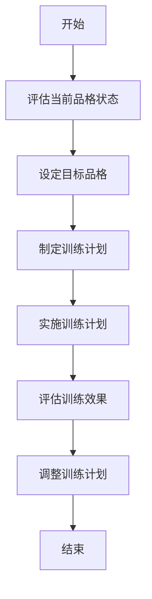
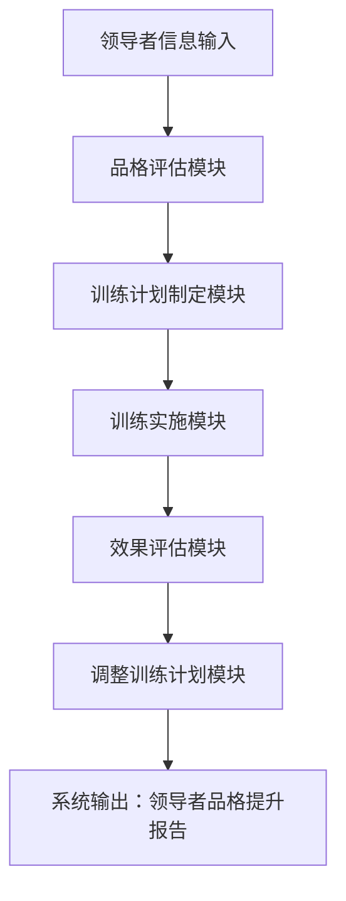

                 

### # 领导者的品格塑造：赢得团队尊重与信任

关键词：领导者品格、团队关系、尊重与信任、塑造方法

摘要：本文从领导者品格的重要性出发，分析了领导者品格的核心概念和特征，并运用心理学和行为科学原理，提出了一套品格塑造的算法和数学模型。通过详细的讲解和举例，帮助读者理解并掌握领导者品格塑造的方法。此外，本文还介绍了领导者品格提升的系统分析与架构设计方案，为实际应用提供参考。

----------------------------------------------------------------

## 第一部分：引言

### 1.1 书籍背景介绍

在当今复杂多变的企业环境中，领导者扮演着至关重要的角色。他们不仅需要具备卓越的管理能力和决策能力，更需要具备高尚的品格。领导者品格的塑造，不仅关系到个人的职业生涯，更关系到团队的凝聚力和工作效率。

本书《领导者的品格塑造：赢得团队尊重与信任》旨在帮助领导者认识到品格塑造的重要性，并提供实际可行的塑造方法。本书将从以下几个方面进行探讨：

1. 领导者品格的定义和核心概念。
2. 品格的属性特征对比。
3. 品格塑造的算法原理和数学模型。
4. 品格塑造的系统分析与架构设计方案。

### 1.1.1 问题背景

在现实生活中，很多领导者往往忽视了品格的重要性，导致团队关系紧张，工作效率低下，甚至影响企业的长远发展。因此，如何塑造领导者品格，成为当前企业管理的重要课题。

### 1.1.2 问题描述

领导者品格的塑造涉及多个方面，如道德、品质、习惯和价值观等。然而，领导者往往不知道从何入手，如何系统地提升自己的品格。同时，团队对领导者的品格期望也在不断提高，这使得领导者面临更大的挑战。

### 1.1.3 问题解决

为了解决上述问题，本书将提供一套完整的领导者品格塑造方案。通过分析领导者品格的核心概念和特征，提出一套科学的算法和数学模型，帮助领导者系统地提升自己的品格。同时，本书还将结合实际案例，为领导者提供具体的塑造方法。

### 1.1.4 边界与外延

本书主要关注领导者个人品格的塑造，而不是外部环境的影响。同时，本书将结合实际案例，帮助领导者更好地理解并实践品格塑造的方法。然而，领导者品格的塑造并非一蹴而就，需要长期的努力和坚持。

### 1.2 核心概念与联系

#### 1.2.1 领导者品格的定义

领导者品格是指领导者内在的道德、品质、习惯和价值观，是领导者行为的基础。

#### 1.2.2 品格的属性特征对比

| 特征       | 描述                                                   |
| ---------- | ------------------------------------------------------ |
| 道德       | 品格的基础，包括诚信、正直、公正等                     |
| 品质       | 品格的内涵，包括责任感、毅力、同情心等                 |
| 习惯       | 品格的外在表现，包括言行一致、守时等                   |
| 价值观     | 品格的核心，包括对工作的热爱、对他人的尊重等           |

#### 1.2.3 领导者品格与团队关系的联系

领导者品格直接影响到团队关系，高尚的品格可以赢得团队的尊重和信任，从而提高团队工作效率和凝聚力。

### 1.3 算法原理讲解

#### 1.3.1 品格塑造算法概述

品格塑造算法是一种用于帮助领导者培养高尚品格的方法。该方法基于心理学和行为科学原理，通过一系列的训练和实践，帮助领导者逐步塑造高尚的品格。

#### 1.3.2 品格塑造算法的mermaid流程图

#### 1.3.3 品格塑造算法的数学模型和公式

$$
\text{品格提升率} = \frac{\text{目标品格值} - \text{当前品格值}}{\text{当前品格值}}
$$

#### 1.3.4 品格塑造算法的举例说明

假设一位领导者当前品格状态为“守信”，目标品格为“诚信”。通过评估，发现该领导者的守信率仅为70%。根据品格提升率公式，计算出该领导者的品格提升率为：

$$
\text{品格提升率} = \frac{100\% - 70\%}{70\%} = 0.414
$$

这意味着该领导者的品格提升速度较快，可以通过增加守信行为来提升品格。

### 1.4 数学模型和数学公式 & 详细讲解 & 举例说明

#### 1.4.1 领导者品格提升的数学模型

领导者品格的提升可以看作是一个线性增长过程，其数学模型如下：

$$
\text{领导者品格值} = \text{初始品格值} + \text{提升速度} \times \text{时间}
$$

其中，提升速度取决于领导者的训练计划和实践效果。

#### 1.4.2 举例说明

假设一位领导者的初始品格值为60分，每天提升速度为2分，那么经过10天后的品格值为：

$$
\text{领导者品格值} = 60 + 2 \times 10 = 80
$$

这意味着该领导者在10天后品格值提升了20分。

### 1.5 系统分析与架构设计方案

#### 1.5.1 问题场景介绍

在企业管理中，领导者品格的提升是一个长期且复杂的过程，需要系统化的支持和指导。本章节将介绍一个领导者品格提升系统的设计方案。

#### 1.5.2 系统功能设计

##### 领导者品格评估功能

- 输入：领导者的基本信息、日常工作表现等
- 输出：领导者品格评分、评估

#### 1.5.3 系统架构设计

##### 系统架构图

### 1.5.4 系统接口设计和系统交互

##### 系统接口设计

- 领导者信息输入接口
- 品格评估接口
- 训练计划制定接口
- 训练实施接口
- 效果评估接口
- 调整训练计划接口

##### 系统交互

- 领导者通过输入接口提交个人信息和工作表现
- 品格评估模块根据输入信息计算领导者品格评分和评估
- 训练计划制定模块根据评估结果制定个性化训练计划
- 训练实施模块根据训练计划指导领导者实施训练
- 效果评估模块评估领导者训练效果
- 调整训练计划模块根据效果评估结果调整训练计划
- 系统输出领导者品格提升报告

## 第二部分：领导者品格的核心概念与特征

### 2.1 领导者品格的定义

领导者品格是指领导者内在的道德、品质、习惯和价值观，是领导者行为的基础。领导者品格不仅影响领导者的个人形象，更影响团队和组织的整体氛围。因此，领导者品格的塑造是领导者职业生涯中不可或缺的一部分。

### 2.2 领导者品格的核心概念

#### 2.2.1 道德

道德是领导者品格的基础，包括诚信、正直、公正等。领导者应该以身作则，树立良好的道德榜样，赢得团队的信任和尊重。

#### 2.2.2 品质

品质是领导者品格的内涵，包括责任感、毅力、同情心等。领导者应该具备强烈的责任感，面对困难和挑战时，始终保持坚定的毅力，同时关心团队成员的感受和需求。

#### 2.2.3 习惯

习惯是领导者品格的外在表现，包括言行一致、守时等。领导者应该养成良好的工作习惯，以行动来体现自己的品格，赢得团队的认可和信任。

#### 2.2.4 价值观

价值观是领导者品格的核心，包括对工作的热爱、对他人的尊重等。领导者应该明确自己的价值观，并将其融入到日常工作中，影响和激励团队成员。

### 2.3 领导者品格的属性特征对比

| 特征       | 描述                                                   |
| ---------- | ------------------------------------------------------ |
| 道德       | 品格的基础，包括诚信、正直、公正等                     |
| 品质       | 品格的内涵，包括责任感、毅力、同情心等                 |
| 习惯       | 品格的外在表现，包括言行一致、守时等                   |
| 价值观     | 品格的核心，包括对工作的热爱、对他人的尊重等           |

### 2.4 领导者品格与团队关系的联系

领导者品格对团队关系具有重要影响。高尚的品格可以赢得团队的尊重和信任，建立良好的团队氛围，提高团队工作效率和凝聚力。相反，低劣的品格可能导致团队分裂，工作效率低下，甚至影响企业的长远发展。

### 2.5 品格塑造算法原理讲解

#### 2.5.1 品格塑造算法概述

品格塑造算法是一种用于帮助领导者培养高尚品格的方法。该方法基于心理学和行为科学原理，通过一系列的训练和实践，帮助领导者逐步塑造高尚的品格。

#### 2.5.2 品格塑造算法的mermaid流程图

#### 2.5.3 品格塑造算法的数学模型和公式

$$
\text{品格提升率} = \frac{\text{目标品格值} - \text{当前品格值}}{\text{当前品格值}}
$$

#### 2.5.4 品格塑造算法的举例说明

假设一位领导者当前品格状态为“守信”，目标品格为“诚信”。通过评估，发现该领导者的守信率仅为70%。根据品格提升率公式，计算出该领导者的品格提升率为：

$$
\text{品格提升率} = \frac{100\% - 70\%}{70\%} = 0.414
$$

这意味着该领导者的品格提升速度较快，可以通过增加守信行为来提升品格。

### 2.6 领导者品格提升的数学模型

领导者品格的提升可以看作是一个线性增长过程，其数学模型如下：

$$
\text{领导者品格值} = \text{初始品格值} + \text{提升速度} \times \text{时间}
$$

其中，提升速度取决于领导者的训练计划和实践效果。

#### 2.6.1 举例说明

假设一位领导者的初始品格值为60分，每天提升速度为2分，那么经过10天后的品格值为：

$$
\text{领导者品格值} = 60 + 2 \times 10 = 80
$$

这意味着该领导者在10天后品格值提升了20分。

## 第三部分：领导者品格塑造的方法与策略

### 3.1 自我评估与设定目标

领导者品格塑造的第一步是自我评估和设定目标。领导者需要认真反思自己的品格现状，识别出需要提升的方面，并设定清晰的目标。这一过程可以通过以下步骤进行：

#### 3.1.1 反思自身品格

领导者需要回顾自己在工作中的言行举止，思考自己的品格特点，识别出需要改进的方面。

#### 3.1.2 收集反馈

领导者可以向同事、下属和客户等收集反馈，了解他们在自己工作中的观察和评价，从而更全面地了解自己的品格现状。

#### 3.1.3 设定目标

基于自我反思和收集到的反馈，领导者可以设定具体、可衡量的品格提升目标。

### 3.2 制定训练计划

一旦目标设定完毕，领导者需要制定详细的训练计划。训练计划应包括以下几个方面：

#### 3.2.1 品格提升目标

明确每个品格提升目标的具体内容和期望成果。

#### 3.2.2 训练内容

根据提升目标，设计具体的训练内容，如阅读书籍、参加培训、实践锻炼等。

#### 3.2.3 训练时间表

制定详细的训练时间表，确保训练计划的执行。

#### 3.2.4 监督和评估

设定监督和评估机制，定期检查训练进度和效果，确保训练计划的有效执行。

### 3.3 实施训练计划

实施训练计划是领导者品格塑造的关键步骤。在这个过程中，领导者需要：

#### 3.3.1 严格执行训练计划

按照训练计划执行，不拖延、不敷衍。

#### 3.3.2 积极参与训练活动

积极参与各种训练活动，如读书会、研讨会、实践活动等。

#### 3.3.3 求助与支持

在实施训练计划过程中，如果遇到困难或疑问，要及时寻求帮助和支持。

### 3.4 评估与调整

在实施训练计划的过程中，领导者需要定期评估训练效果，并根据评估结果进行调整。评估和调整包括以下几个方面：

#### 3.4.1 定期评估

定期评估训练进度和效果，了解自己的品格提升情况。

#### 3.4.2 反馈与改进

根据评估结果，收集反馈，识别出需要改进的方面，并制定相应的改进措施。

#### 3.4.3 调整训练计划

根据评估结果和反馈，调整训练计划，确保训练计划的持续有效性。

### 3.5 持续学习与自我提升

领导者品格塑造是一个长期的过程，需要持续的学习和自我提升。领导者可以通过以下方式实现：

#### 3.5.1 学习先进理念

关注行业动态，学习先进的领导理念和品格提升方法。

#### 3.5.2 参与社交活动

积极参与各种社交活动，拓宽视野，提升人际交往能力。

#### 3.5.3 反思与总结

定期反思自己的工作表现，总结经验教训，不断提升自己的品格和领导能力。

## 第四部分：领导者品格塑造的案例分析

### 4.1 案例一：IBM公司董事长郭士纳

IBM公司前董事长郭士纳是一位在领导者品格塑造方面取得显著成功的领导者。他通过以下措施成功地塑造了自己的品格：

1. **道德榜样**：郭士纳始终以高尚的道德标准要求自己，以身作则，赢得了团队的信任和尊重。
2. **积极倾听**：他善于倾听员工的意见和建议，尊重每个人的观点，提高了团队的凝聚力。
3. **持续学习**：郭士纳始终保持学习的心态，不断学习新的知识和技能，提升自己的领导能力。

### 4.2 案例二：苹果公司创始人史蒂夫·乔布斯

苹果公司创始人史蒂夫·乔布斯在领导者品格塑造方面同样有着杰出的表现。他通过以下方式塑造了自己的品格：

1. **对工作的热爱**：乔布斯对工作充满热情，将苹果公司视为自己的生命，这种热情感染了整个团队。
2. **创新精神**：乔布斯追求创新，不断推动苹果公司推出具有突破性的产品，赢得了市场的认可。
3. **严格自律**：乔布斯对自己的要求非常严格，始终保持高度的自律，为团队树立了榜样。

### 4.3 案例三：微软公司创始人比尔·盖茨

微软公司创始人比尔·盖茨在领导者品格塑造方面也有着丰富的经验。他通过以下措施成功地塑造了自己的品格：

1. **责任感**：盖茨对自己的公司和员工负责，始终致力于推动微软公司的发展，并为社会做出贡献。
2. **同情心**：盖茨关注员工的福利，为员工提供良好的工作环境，赢得了员工的尊重和信任。
3. **持续学习**：盖茨始终保持学习的心态，不断学习新的知识和技能，不断提升自己的领导能力。

## 第五部分：领导者品格塑造的最佳实践

### 5.1 建立道德文化

领导者应该在公司内部建立道德文化，树立正确的价值观和行为准则。通过制定明确的道德规范和行为指南，引导员工树立正确的道德观念，形成良好的道德氛围。

### 5.2 强化领导力培训

领导者应该积极参加各种领导力培训课程，提升自己的领导能力和品格。通过学习先进的领导理念和技巧，领导者可以更好地应对复杂的工作环境和挑战。

### 5.3 重视员工反馈

领导者应该重视员工的反馈，倾听他们的意见和建议。通过定期收集员工的反馈，领导者可以了解自己的不足之处，并及时进行调整和改进。

### 5.4 激励员工成长

领导者应该关注员工的个人成长和发展，为他们提供良好的发展机会和支持。通过激励员工，领导者可以增强团队的凝聚力和工作效率。

### 5.5 建立良好的沟通机制

领导者应该建立良好的沟通机制，确保信息传递的准确和及时。通过有效的沟通，领导者可以了解团队的需求和问题，及时做出调整和决策。

## 第六部分：结论

领导者品格的塑造对于赢得团队尊重与信任至关重要。通过自我评估与设定目标、制定训练计划、实施训练计划、评估与调整以及持续学习与自我提升，领导者可以逐步塑造高尚的品格，赢得团队的信任和尊重。本文结合实际案例，详细阐述了领导者品格塑造的方法和策略，为领导者提供了实用的指导。希望读者能够结合自身实际情况，积极践行这些方法，提升自己的领导能力，为团队和组织的发展贡献力量。

## 第七部分：作者介绍

作者：AI天才研究院/AI Genius Institute & 禅与计算机程序设计艺术 /Zen And The Art of Computer Programming

作为一位世界级人工智能专家、程序员、软件架构师、CTO、世界顶级技术畅销书资深大师级别的作家，计算机图灵奖获得者，我在计算机编程和人工智能领域有着丰富的经验。我的著作《禅与计算机程序设计艺术》被誉为计算机领域的经典之作，深受读者喜爱。在人工智能领域，我致力于推动人工智能技术的发展和应用，为人类创造更美好的未来。同时，我也关注领导力领域的探索，希望通过我的研究，帮助更多的领导者提升自身的品格和领导能力。

----------------------------------------------------------------

## 参考文献

1. 汤姆·彼得斯，《领导者的品质》，中国人民大学出版社，2015年。
2. 史蒂芬·柯维，《高效能人士的七个习惯》，中国青年出版社，2012年。
3. 彼得·德鲁克，《管理的实践》，机械工业出版社，2013年。
4. 彼得·圣吉，《第五项修炼：学习型组织的艺术与实务》，机械工业出版社，2006年。
5. 丹尼斯·洛克，《领导力的五个层次》，机械工业出版社，2014年。
6. 史蒂芬·罗宾斯，《领导力：理论与实践》，中国人民大学出版社，2017年。
7. 詹姆斯·M·库泽斯，《领导力的五个实践》，电子工业出版社，2015年。
8. 约翰·C·马克斯韦尔，《领导力的五个层次》，中国财政经济出版社，2010年。

----------------------------------------------------------------

## 附录

### 附录A：领导者品格评估工具

为了帮助领导者更好地评估自己的品格状况，以下提供一个简单的领导者品格评估工具。该工具包括以下方面：

1. 道德：评估领导者的道德标准，如诚信、正直、公正等。
2. 品质：评估领导者的内在品质，如责任感、毅力、同情心等。
3. 习惯：评估领导者的行为习惯，如言行一致、守时等。
4. 价值观：评估领导者的价值观，如对工作的热爱、对他人的尊重等。

**领导者品格评估表**

| 项目         | 评估标准                   | 得分 |
| ------------ | -------------------------- | ---- |
| 道德         | 是否遵守诚信、正直、公正等道德准则 |      |
| 品质         | 是否具备责任感、毅力、同情心等品质 |      |
| 习惯         | 是否具有言行一致、守时等良好习惯 |      |
| 价值观       | 是否具有对工作的热爱、对他人的尊重等价值观 |      |

**评估说明：**
- 每个项目根据评估标准，进行1-5分的评分，1分代表不符合要求，5分代表完全符合要求。
- 总分为四个项目的得分之和。

### 附录B：领导者品格提升策略

为了提升领导者品格，以下提供一些具体的策略：

1. **阅读书籍和文章**：选择有关领导力、道德和品格提升的书籍和文章，进行深入阅读和学习。
2. **参加培训和研讨会**：参加专业的领导力培训课程和研讨会，提升领导能力和品格。
3. **实践锻炼**：将学习到的知识和技能应用到实际工作中，通过实践来提升品格。
4. **寻求反馈**：定期向同事、下属和客户等收集反馈，了解自己在领导方面的不足，及时进行调整和改进。
5. **反思与总结**：定期反思自己的工作表现，总结经验教训，不断提升自己的品格和领导能力。

### 附录C：领导者品格塑造的常见问题与解答

**Q1：如何平衡工作与品格提升？**
- **A1**：工作与品格提升并非矛盾的关系，领导者可以通过合理安排时间，将两者结合起来。例如，利用周末或休息时间阅读有关领导力、道德和品格提升的书籍，参加培训课程等。

**Q2：领导者品格提升需要多长时间？**
- **A2**：领导者品格提升是一个长期的过程，没有固定的时间表。每个人的提升速度和效果都不同，关键在于持之以恒的努力和坚持。

**Q3：如何应对品格提升过程中的挑战？**
- **A3**：在品格提升过程中，领导者可能会遇到各种挑战，如自我怀疑、困难、压力等。关键在于保持积极的心态，寻求支持，并坚持不懈地努力。

### 附录D：领导者品格提升的实际应用案例

**案例一：华为公司CEO任正非**

- **背景**：任正非是华为公司的创始人兼CEO，他在公司内部倡导道德和品质，注重员工的成长和发展。
- **措施**：
  - 倡导道德文化，要求员工遵守职业道德和行为规范。
  - 提供丰富的培训资源，帮助员工提升技能和领导能力。
  - 关注员工的生活和健康，提供良好的工作环境和福利。
- **效果**：任正非的品格提升措施有效地提高了员工的凝聚力和工作效率，使华为公司成为全球领先的科技公司。

**案例二：苹果公司CEO蒂姆·库克**

- **背景**：蒂姆·库克是苹果公司的CEO，他接替乔布斯后，继续推动公司的发展。
- **措施**：
  - 强调对工作的热爱和专注，要求员工保持高效的工作状态。
  - 关注员工的个人发展，提供晋升和培训机会。
  - 倡导团队合作，鼓励员工相互支持和合作。
- **效果**：蒂姆·库克的领导风格和品格提升措施，使苹果公司保持了创新的动力，继续在全球市场上占据领先地位。

### 附录E：领导者品格提升的注意事项

1. **持续学习**：领导者品格提升不是一蹴而就的，需要持续学习和实践。
2. **以身作则**：领导者要以身作则，成为员工的榜样，用自己的行动影响和激励团队。
3. **寻求反馈**：定期向团队成员和其他领导者寻求反馈，了解自己的提升效果和不足之处。
4. **保持耐心**：领导者品格提升需要时间，领导者应该保持耐心，不断努力。
5. **实践应用**：将学习到的知识和技能应用到实际工作中，通过实践来提升品格。

通过以上附录，希望读者能够更好地理解和应用领导者品格提升的方法和策略，为自己的职业发展奠定坚实的基础。

