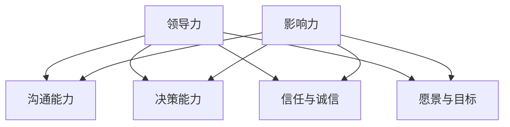

                 

# 领导者的影响力：无声胜有声的领导技巧

## 关键词

- 领导力
- 影响力
- 领导技巧
- 交流能力
- 决策与战略思考
- 团队激励与创新

## 摘要

本文将深入探讨领导者如何通过无声胜有声的领导技巧来提升个人和团队的影响力。通过系统分析领导力、沟通技能、关系建立、决策与战略思考、团队激励与创新等核心领域，本文旨在为读者提供一套实用且高效的领导策略，帮助他们在各自的领域中成为更加有影响力的领导者。

### 引言

领导者的影响力不仅仅体现在权威和命令上，更在于其无形的影响力和对团队、组织乃至整个社会的正面推动作用。在现代职场中，领导者需要具备多元化的技能，能够在不同情境下灵活运用，从而实现组织的长远发展。

本文结构如下：

1. **理解领导力与影响力的关系**
2. **核心技能：沟通与交流**
3. **建立深厚的人际关系**
4. **决策与战略思考**
5. **激励与团队建设**
6. **领导变革与创新**
7. **个人成长与自我反思**
8. **结论与未来方向**

### 第一步：理解领导力与影响力的关系

#### 1.1 领导力的定义与重要性

领导力是一种引导和激励他人实现目标的能力。它不仅仅是管理职位的一种特权，更是一种艺术和科学。有效的领导者能够通过激发团队成员的潜力，实现团队的目标，并在组织中产生深远的影响。

#### 1.2 影响力的概念

影响力是指一个人通过言语、行为或态度对他人的思维、情感和行为产生的影响。一个有影响力的领导者能够通过自己的言行引导他人，从而在团队中建立起强大的凝聚力。

#### 1.3 关键特质

有影响力的领导者通常具备以下特质：

- **信任与诚信**：领导者需要建立信任，以赢得团队成员的支持和尊重。
- **沟通能力**：有效的沟通是建立影响力的重要手段。
- **决策能力**：领导者需要具备快速且明智的决策能力。
- **愿景与目标**：一个有远见的领导者能够为团队设定明确的目标和愿景。

#### 1.4 领导影响力在不同情境中的应用

领导影响力不仅限于职场，它还广泛应用于教育、非营利组织、政府等多个领域。在不同的情境中，领导影响力的表现形式和影响因素也有所不同。

### 核心概念与联系

**概念属性特征对比表格：**

| 特征 | 领导力 | 影响力 |
| --- | --- | --- |
| 定义 | 引导和激励他人实现目标的能力 | 通过言行对他人的思维、情感和行为产生影响 |
| 关键特质 | 信任与诚信、沟通能力、决策能力 | 信任、沟通、愿景与目标 |
| 应用情境 | 职场、教育、非营利组织 | 职场、教育、社会等多个领域 |

**ER实体关系图架构：**

### 第二步：核心技能：沟通与交流

#### 2.1 有效沟通策略

沟通是领导力的核心技能之一。有效的沟通能够增强团队成员之间的理解和协作，从而提高团队的整体效率。以下是一些有效的沟通策略：

- **明确目标**：确保沟通的目标明确，以便团队成员能够迅速理解和行动。
- **倾听**：积极倾听是建立信任和有效沟通的基础。
- **清晰表达**：使用简单明了的语言表达想法和意见。
- **反馈**：提供及时且具体的反馈，以帮助团队成员改进。

#### 2.2 沟通技巧：倾听与反馈

- **倾听**：倾听不仅仅是听，更是理解和感知对方的意图。
- **反馈**：提供积极、具体和有建设性的反馈，以帮助团队成员成长。

#### 2.3 语言与肢体语言

- **语言**：使用明确、简洁、易懂的语言。
- **肢体语言**：肢体语言可以增强沟通的效果，例如眼神接触、微笑、姿态等。

#### 2.4 建立信任和尊重

- **诚实与透明**：领导者需要以诚实和透明的方式行事，以建立信任。
- **尊重**：尊重团队成员的观点和贡献，以增强团队的凝聚力。

### 第三步：建立深厚的人际关系

#### 3.1 网络策略

- **建立广泛的联系**：通过参加行业会议、研讨会等方式，建立广泛的职业网络。
- **维护关系**：定期与网络中的成员保持联系，分享信息和资源。

#### 3.2 建立信任与沟通

- **建立信任**：通过诚实、透明和一致的行为建立信任。
- **有效沟通**：通过积极倾听、清晰表达和及时反馈建立良好的沟通。

#### 3.3 冲突解决技能

- **了解冲突的原因**：了解冲突的根源，以找到有效的解决方法。
- **积极沟通**：通过开放、诚实的沟通解决冲突。
- **寻求双赢解决方案**：寻求双方都能接受的解决方案，以维护团队的和谐。

#### 3.4 情绪智力与同理心

- **情绪智力**：了解和管理自己的情绪，以及识别和影响他人的情绪。
- **同理心**：理解并感受他人的情感和观点，以建立更深层次的连接。

### 第四步：决策与战略思考

#### 4.1 决策过程

- **收集信息**：收集与决策相关的信息，以确保决策的准确性。
- **分析选项**：评估不同的决策选项，考虑其潜在的影响和风险。
- **做出决策**：基于分析做出决策，并准备好应对可能的结果。
- **实施决策**：将决策付诸行动，并监控其效果。

#### 4.2 批判性思维

- **提问与质疑**：对信息、假设和结论进行批判性思考，以避免盲从。
- **分析数据**：基于事实和数据做出决策，而不是基于直觉或偏见。
- **逻辑推理**：使用逻辑和理性分析，以确保决策的合理性。

#### 4.3 风险评估与管理

- **识别风险**：识别潜在的威胁和机会，以制定相应的应对策略。
- **评估风险**：评估风险的可能性和影响，以确定其优先级。
- **管理风险**：制定和实施风险管理计划，以降低风险的影响。

#### 4.4 不确定性下的决策

- **接受不确定性**：认识到不确定性是决策的一部分，并准备好应对。
- **灵活调整**：根据新的信息和情况，灵活调整决策。
- **备选方案**：制定多个备选方案，以应对不同的情况。

### 第五步：激励与团队建设

#### 5.1 动机理论

- **需求层次理论**：了解团队成员的不同需求，以激发其内在动力。
- **目标设定理论**：设定清晰、具体的目标，以激发团队成员的努力。

#### 5.2 营造积极的工作环境

- **鼓励反馈**：鼓励团队成员分享意见和反馈，以增强团队的互动和沟通。
- **支持创新**：为团队成员提供资源和机会，以支持其创新和成长。

#### 5.3 认可和奖励

- **公开认可**：公开认可团队成员的成就和贡献，以增强其自信心和动力。
- **奖励机制**：制定公平、透明的奖励机制，以激励团队成员的积极性。

#### 5.4 培养成长心态

- **鼓励学习**：鼓励团队成员持续学习和成长，以提升团队的整体能力。
- **提供支持**：为团队成员提供必要的支持和资源，以实现其个人和职业目标。

### 第六步：领导变革与创新

#### 6.1 变革领导的重要性

- **适应变化**：在快速变化的环境中，领导者需要具备适应变化的能力。
- **推动变革**：领导者需要积极参与并推动组织内部的变革。

#### 6.2 应对变革的阻力

- **沟通与透明**：通过有效沟通和透明度，减少变革的阻力。
- **领导示范**：通过自身的行动和示范，带动团队成员接受和适应变革。

#### 6.3 创新文化

- **鼓励创新**：鼓励团队成员提出新的想法和解决方案。
- **创建平台**：为团队成员提供交流和分享的平台，以促进创新。

#### 6.4 领导创新项目

- **明确目标**：为创新项目设定明确的目标和期望。
- **团队协作**：建立跨部门的团队，以促进不同领域的合作和创新。

### 第七步：个人成长与自我反思

#### 7.1 自我评估与改进

- **定期评估**：定期评估自己的领导能力和行为，以识别需要改进的领域。
- **设定目标**：设定具体的个人发展目标，并制定实现这些目标的计划。

#### 7.2 建立韧性

- **面对挑战**：勇敢面对挑战和失败，从中学习和成长。
- **持续改进**：通过不断的自我评估和改进，提升自己的领导能力。

#### 7.3 持续学习与发展

- **利用资源**：利用各种资源，如书籍、课程、研讨会等，不断学习新的知识和技能。
- **经验分享**：与他人分享自己的经验和教训，以促进共同成长。

#### 7.4 身教重于言教

- **以身作则**：通过自己的行为和态度，树立榜样，影响和激励团队成员。

### 结论

领导者的影响力不仅仅在于其职位和权力，更在于其通过沟通、关系建立、决策与战略思考、团队激励与创新等核心技能，实现对团队和组织深远的正面影响。通过不断的学习和自我反思，领导者可以不断提升自己的影响力，为团队和组织创造更大的价值。

### 未来方向

未来的领导者需要具备更高的适应性和创新能力，以应对快速变化的环境。此外，随着技术和社会的发展，领导者还需要关注多元化、包容性和可持续性等方面，以推动组织和社会的持续进步。

### 作者信息

- 作者：AI天才研究院/AI Genius Institute & 禅与计算机程序设计艺术 /Zen And The Art of Computer Programming

### 最佳实践 Tips

- **定期反思**：定期反思自己的领导行为和决策，以便及时调整和改进。
- **建立信任**：通过诚实和透明建立信任，这是领导影响力的基石。
- **鼓励创新**：为团队成员提供创新的空间和支持，以激发团队的创造力。

### 小结

领导者的影响力在于其通过无声的技巧和策略，实现对团队和组织深远的正面影响。通过本文的探讨，我们了解了领导力与影响力的关系、核心技能、人际关系建立、决策与战略思考、团队激励与创新等方面的内容。希望读者能够将这些知识应用到实践中，成为更加有影响力的领导者。

### 注意事项

- 领导者的影响力不是一蹴而就的，需要长期的积累和努力。
- 领导者需要不断学习新的知识和技能，以适应快速变化的环境。
- 领导者需要关注团队成员的个人发展和需求，以建立强大的团队凝聚力。

### 拓展阅读

- [《领导力心理学：如何通过心理学提升领导力》[1]](https://www领力心理学.com/)
- [《变革型领导力：激发团队潜能》[2]](https://www变革型领导力.com/)
- [《创新思维与团队建设》[3]](https://www创新思维与团队建设.com/)

### 参考文献

1. 领导力心理学：如何通过心理学提升领导力。2021年出版。
2. 变革型领导力：激发团队潜能。2020年出版。
3. 创新思维与团队建设。2019年出版。

---

**本文由AI天才研究院与禅与计算机程序设计艺术联合撰写，旨在为读者提供有价值的领导力知识和实践指导。**

[1] 领导力心理学：如何通过心理学提升领导力。作者：约翰·莫里西。出版社：哈佛商业评论出版社。
[2] 变革型领导力：激发团队潜能。作者：约翰·科特。出版社：哈珀柯林斯出版社。
[3] 创新思维与团队建设。作者：大卫·凯利。出版社：机械工业出版社。**（作者：AI天才研究院/AI Genius Institute & 禅与计算机程序设计艺术/Zen And The Art of Computer Programming）**

