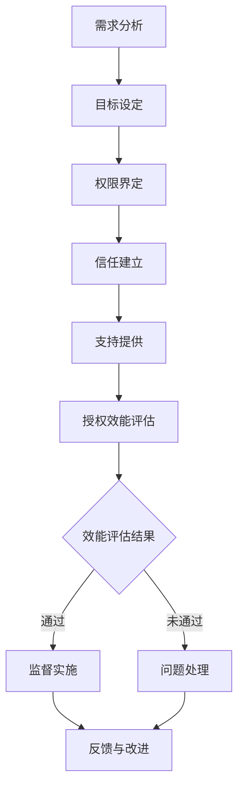
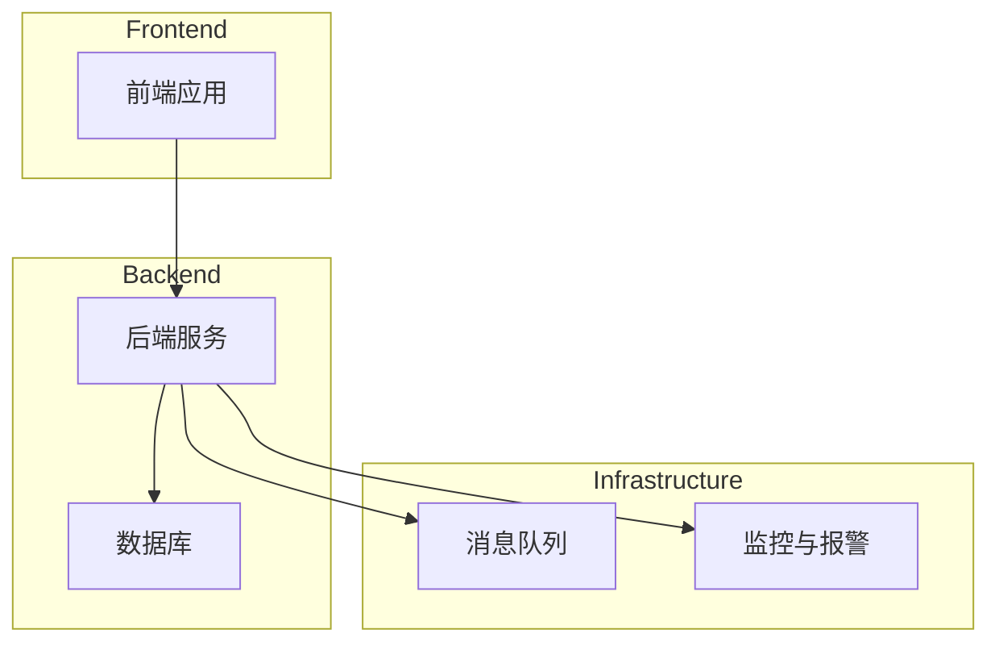
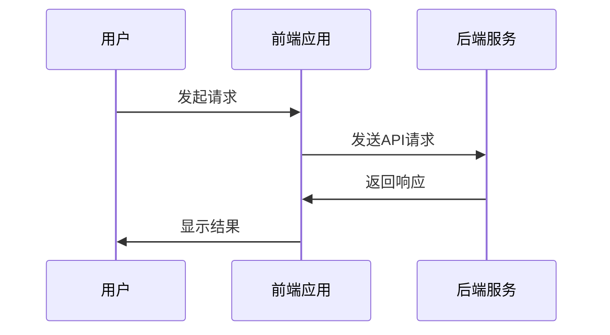
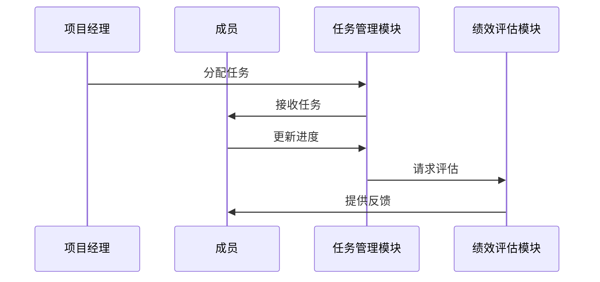

                 

### Step 1: 标题与概述

# 领导者的授权艺术：信任与监督的平衡

## 本书概述

本书旨在探讨领导者在授权过程中如何平衡信任与监督，从而提升团队效能和个体责任感。通过深入分析领导力理论、实际案例和心理学研究，本书为领导者提供了一套系统的授权策略和实践指南。

在快速发展的现代社会，领导者不仅要具备高超的决策能力和战略眼光，还需要懂得如何激发团队成员的潜力和创造力。授权是一种重要的领导技能，它不仅能让领导者从日常琐事中解放出来，更能够增强团队的凝聚力和创新能力。

然而，授权并非一件简单的事情。如何在信任与监督之间找到平衡点，是一个复杂的课题。本书将帮助领导者理解授权的核心概念，掌握有效的授权方法，同时确保团队成员能够在信任的环境下，履行其职责和使命。

本书结构紧凑，内容丰富，分为六个主要部分：

1. 引言：介绍研究背景、研究问题、研究目的和研究方法。
2. 核心概念与联系：详细探讨信任与授权、监督与责任的概念及其相互关系。
3. 算法原理讲解：解释授权模型的构建、监督机制的设定、数学模型与公式，并通过mermaid流程图和Python代码进行具体演示。
4. 系统分析与架构设计：介绍问题场景、系统功能设计、系统架构设计、系统接口设计和系统交互mermaid序列图。
5. 项目实战：包括环境安装、系统核心实现、实际案例分析和项目小结。
6. 最佳实践与拓展：提供最佳实践技巧、注意事项、拓展阅读，帮助读者在实际工作中应用所学知识。

## 目标读者

本书的目标读者包括：

- 企业中层管理者及高层领导者
- 人力资源经理和组织发展专家
- 企业培训师和职业发展顾问
- 对领导力和组织管理有浓厚兴趣的研究生和本科生

无论您是哪个领域的领导者，本书都将为您提供实用的指导，帮助您在授权过程中实现信任与监督的平衡，从而提升团队的整体绩效。

### Step 2: 引言

## 第1章 引言

### 1.1 研究背景

在当今全球化、快速变化和高度竞争的商业环境中，组织成功的关键在于其领导者的能力。有效的领导者不仅需要具备战略眼光和决策能力，还需要能够激励和引导团队成员，使其发挥最大的潜力。授权作为一种领导技能，已经被广泛认可和重视。

授权的重要性在于，它能够将领导者的责任转化为团队成员的责任，从而提升整个团队的效率和创新能力。同时，授权也是领导者信任团队成员的体现，有助于建立积极的工作氛围，增强团队的凝聚力。

然而，在实际操作中，领导者常常面临如何在信任与监督之间找到平衡点的挑战。过度信任可能导致团队成员滥用权力，缺乏责任感；而过度监督则可能抑制团队成员的自主性和创造力。因此，如何平衡信任与监督，实现有效的授权，成为领导者面临的重要课题。

### 1.2 研究问题

1. 如何在信任与监督之间找到平衡点？
2. 授权对组织绩效的影响是什么？
3. 领导者如何掌握有效的授权方法，提升团队效能和个体责任感？

### 1.3 研究目的

本研究的目的是通过深入分析领导力理论、实际案例和心理学研究，探讨领导者如何在授权过程中平衡信任与监督，从而提升团队效能和个体责任感。具体目标包括：

1. 揭示授权艺术的本质，理解授权的核心概念。
2. 提供实用的授权策略和实践案例，帮助领导者掌握有效的授权方法。
3. 分析授权对组织绩效的影响，提出提升授权效能的建议。

### 1.4 研究方法

本研究采用多种研究方法，以确保结果的可靠性和有效性。

1. 理论分析：通过文献综述和理论框架的构建，为研究提供理论基础。
2. 案例研究：选取多个实际案例，深入分析领导者授权过程中信任与监督的平衡情况。
3. 数据分析：对案例数据进行统计分析，验证研究假设和结论。

### 1.5 本书的结构

本书分为六个主要部分：

1. 引言：介绍研究背景、研究问题、研究目的和研究方法。
2. 核心概念与联系：详细探讨信任与授权、监督与责任的概念及其相互关系。
3. 算法原理讲解：解释授权模型的构建、监督机制的设定、数学模型与公式，并通过mermaid流程图和Python代码进行具体演示。
4. 系统分析与架构设计：介绍问题场景、系统功能设计、系统架构设计、系统接口设计和系统交互mermaid序列图。
5. 项目实战：包括环境安装、系统核心实现、实际案例分析和项目小结。
6. 最佳实践与拓展：提供最佳实践技巧、注意事项、拓展阅读，帮助读者在实际工作中应用所学知识。

通过以上结构，本书旨在为领导者提供一套系统的授权策略和实践指南，帮助其在授权过程中实现信任与监督的平衡，从而提升团队效能和个体责任感。

### Step 3: 核心概念与联系

## 第2章 核心概念与联系

在探讨领导者的授权艺术之前，有必要明确几个核心概念，这些概念对于理解授权的本质和实现信任与监督的平衡至关重要。本章将详细探讨信任与授权、监督与责任的定义及其相互关系。

### 2.1 信任与授权

#### 2.1.1 信任的定义与特征

信任是一种心理状态，它基于对他人能力、诚信和可靠性的信心。在领导力中，信任被视为一种重要的社会资本，能够促进团队协作和组织效能。

- **特征**：
  - **可靠性**：相信他人会履行承诺。
  - **诚实**：认为他人不会隐瞒或歪曲事实。
  - **能力**：相信他人具备完成任务的能力。
  - **公平**：相信他人会公正地对待自己和他人。

#### 2.1.2 授权的定义与要素

授权是指领导者将权力和责任授予下属，使其在特定范围内自主决策和行动。授权的核心要素包括：

- **权力转移**：领导者将决策权和管理权转移给下属。
- **责任承担**：下属在获得权力时，也承担相应的责任。
- **信任**：领导者对下属的能力和诚信有信心。
- **支持**：领导者为下属提供必要的资源和支持。

#### 2.1.3 信任与授权的关系

信任是授权的基础。没有信任，授权将变得脆弱且不稳定。信任与授权之间的关系可以概括为：

- **相互促进**：信任增强授权的效能，授权促进信任的建立。
- **动态平衡**：信任与授权之间需要保持动态平衡，过度的信任可能导致风险，而过度的监督则可能破坏信任。

### 2.2 监督与责任

#### 2.2.1 监督的定义与形式

监督是指领导者对下属的工作过程和结果进行监控和管理。监督的形式多种多样，包括：

- **直接监督**：领导者直接参与下属的工作过程，提供即时反馈和指导。
- **间接监督**：领导者通过设定目标和标准，对下属的工作结果进行评估。
- **自我监督**：下属在完成任务时，自我检查和评估，确保符合预期标准。

#### 2.2.2 责任的定义与作用

责任是指个体因承担特定任务或角色而产生的义务和责任感。在组织中，责任的作用包括：

- **保障目标实现**：确保任务按照预定计划完成。
- **促进个人成长**：通过承担责任，提升个人的能力和素质。
- **维护组织秩序**：明确个体的角色和职责，维持组织的正常运转。

#### 2.2.3 监督与责任的关系

监督与责任是相辅相成的。监督旨在确保责任得到履行，而责任则通过监督得到确认和强化。

- **相互依赖**：监督为责任履行提供保障，责任为监督提供目标和标准。
- **动态调整**：监督和责任的关系需要根据实际情况进行调整，以保持平衡。

### 2.3 核心概念对比表格

以下是一个简单的核心概念对比表格，用于更清晰地展示信任与授权、监督与责任之间的差异和联系。

| 核心概念 | 定义 | 特征/要素 | 关系 |
| --- | --- | --- | --- |
| 信任 | 心理状态，基于对他人能力、诚信和可靠性的信心 | 可靠性、诚实、能力、公平 | 基础，授权的前提 |
| 授权 | 将权力和责任授予下属，使其在特定范围内自主决策和行动 | 权力转移、责任承担、信任、支持 | 信任的结果，促进团队协作 |
| 监督 | 对下属的工作过程和结果进行监控和管理 | 直接监督、间接监督、自我监督 | 确保责任履行 |
| 责任 | 承担特定任务或角色而产生的义务和责任感 | 保障目标实现、促进个人成长、维护组织秩序 | 监督的目标和标准 |

### 2.4 ER实体关系图

为了更好地理解信任与授权、监督与责任之间的关系，我们可以通过ER（实体关系）图来可视化这些概念。

以下是一个简单的ER实体关系图：

```mermaid
erDiagram
    Leadership ||--|{ Trust }
    Leadership ||--|{ Authorization }
    Leadership ||--|{ Supervision }
    Trust ||--|{ Authorization }
    Trust ||--|{ Supervision }
    Authorization ||--|{ Responsibility }
    Supervision ||--|{ Responsibility }
```

在上述ER图中，领导力是核心实体，它与信任、授权和监督都有直接关联。信任是授权的基础，而监督是确保责任得到履行的手段。通过授权，领导者将责任转移给下属，而监督则帮助确认责任是否得到有效履行。

### 2.5 概念解析与应用

为了更深入地理解这些概念，我们可以通过以下应用场景进行说明：

#### 场景1：信任与授权

假设一位项目经理需要完成一个重要的项目。他信任团队成员，因此决定将项目的一些关键决策权授予团队成员。这种信任与授权的关系，使得团队成员更有动力和责任感去完成任务。

#### 场景2：监督与责任

在项目执行过程中，项目经理需要监督团队成员的工作进度和质量。通过设定明确的目标和标准，项目经理确保团队成员履行其责任，同时也为团队成员提供了反馈和指导。

通过这些应用场景，我们可以看到信任、授权、监督和责任之间的相互作用，以及它们在组织管理中的重要性。

### 总结

通过本章的讨论，我们明确了信任与授权、监督与责任的概念及其相互关系。理解这些核心概念是领导者掌握授权艺术的关键，也是实现信任与监督平衡的基础。在接下来的章节中，我们将进一步探讨授权模型的构建、监督机制的设定以及如何通过算法和系统设计来实现信任与监督的平衡。

### Step 4: 算法原理讲解

## 第3章 算法原理讲解

在探讨领导者授权艺术的本质时，我们需要借助系统的理论框架和实际操作方法，来理解如何构建授权模型和设定监督机制。本章将详细介绍授权模型的构建方法、监督机制的设计原则和实施步骤，并运用数学模型和Python代码来具体阐述。

### 3.1 授权模型的构建

#### 3.1.1 授权模型的构成要素

授权模型由以下几个核心要素构成：

1. **权力分配**：领导者将决策权和任务分配给下属。
2. **信任基础**：建立在领导者对下属能力、诚信和责任心的信任上。
3. **责任承担**：下属在获得授权的同时，承担相应的责任。
4. **支持系统**：提供必要的资源、培训和指导，确保授权过程的顺利进行。

#### 3.1.2 授权模型的构建方法

构建授权模型通常包括以下步骤：

1. **需求分析**：了解团队成员的能力、经验和需求，确定哪些任务可以授权。
2. **目标设定**：明确授权的目标，确保授权与组织的整体战略相一致。
3. **权限界定**：明确授权的范围和权限，避免权力滥用。
4. **信任建立**：通过沟通和互动，建立领导者与团队成员之间的信任。
5. **支持提供**：为下属提供必要的资源和支持，确保其能够成功完成任务。

### 3.2 监督机制的设定

#### 3.2.1 监督机制的设计原则

监督机制的设计应遵循以下原则：

1. **透明性**：监督过程应透明，使团队成员了解监督的目的和标准。
2. **及时性**：监督应具备及时性，以便及时发现并解决问题。
3. **客观性**：监督应客观公正，避免偏见和主观判断。
4. **灵活性**：监督机制应具备灵活性，以适应不同情境和需求。

#### 3.2.2 监督机制的实施步骤

监督机制的实施步骤包括：

1. **目标设定**：明确监督的目标和标准。
2. **指标设定**：设定关键绩效指标（KPI），用于衡量团队成员的工作绩效。
3. **监督实施**：通过定期检查、报告和反馈，实施监督。
4. **问题处理**：针对发现的问题，及时采取纠正措施。
5. **反馈与改进**：定期收集反馈，不断优化监督机制。

### 3.3 数学模型与公式

为了量化授权效能和信任与监督的平衡，我们可以构建以下数学模型：

#### 3.3.1 授权效能模型

授权效能（A）可以用以下公式表示：

$$
A = f(T, S, R)
$$

其中，\( T \)代表信任水平，\( S \)代表监督强度，\( R \)代表责任履行度。

#### 3.3.2 信任与监督平衡公式

为了实现信任与监督的平衡，我们可以使用以下公式：

$$
T + S = K
$$

其中，\( K \)为常数，代表授权的总体效能。

### 3.4 算法流程图

为了直观地展示授权算法和监督机制，我们可以使用mermaid绘制流程图。以下是授权算法的mermaid流程图：



### 3.5 Python代码实现

为了具体说明授权算法和监督机制，我们可以用Python代码实现以下算法：

```python
import numpy as np

def authorization_model(trust, supervision, responsibility):
    # 授权效能模型
    authorization_effectiveness = trust * supervision * responsibility
    
    # 信任与监督平衡
    if trust + supervision > 1:
        trust = 1 - supervision
    
    return authorization_effectiveness

# 测试代码
trust_level = 0.8
supervision_strength = 0.3
responsibility_level = 0.9

# 计算授权效能
effectiveness = authorization_model(trust_level, supervision_strength, responsibility_level)
print("授权效能：", effectiveness)
```

通过上述Python代码，我们可以根据信任水平、监督强度和责任履行度，计算授权效能。这有助于领导者实时评估授权效果，并调整监督策略，以实现信任与监督的动态平衡。

### 3.6 举例说明

为了更好地理解上述算法和模型，我们可以通过一个实际案例进行说明。

#### 案例：项目经理的授权实践

假设一位项目经理需要授权给团队成员负责一个关键项目的部分工作。以下是具体的授权步骤和监督机制：

1. **需求分析**：项目经理评估团队成员的能力，确定哪些任务可以授权。
2. **目标设定**：明确项目的目标和团队成员的任务职责。
3. **权限界定**：项目经理将决策权分配给团队成员，同时设定明确的权限范围。
4. **信任建立**：项目经理通过与团队成员的沟通，建立信任基础。
5. **支持提供**：项目经理为团队成员提供必要的资源和支持，如培训、工具等。
6. **监督实施**：项目经理设定关键绩效指标，定期检查团队成员的工作进度和质量。
7. **反馈与改进**：根据团队成员的工作表现，提供反馈，并不断优化监督机制。

通过这个案例，我们可以看到如何在实际操作中应用授权模型和监督机制，实现信任与监督的平衡。

### 总结

本章详细介绍了授权模型的构建方法、监督机制的设计原则和实施步骤，并运用数学模型和Python代码进行具体阐述。通过理解这些算法原理，领导者可以更好地掌握授权艺术，实现信任与监督的平衡，从而提升团队效能和个体责任感。在下一章中，我们将进一步探讨系统分析与架构设计，为领导者提供更加实用的指导。

### Step 5: 系统分析与架构设计

## 第4章 系统分析与架构设计

在理解了授权艺术的理论基础和算法原理之后，我们需要将这一系列概念转化为具体的系统设计与实现。本章将详细分析授权系统的问题场景、功能设计、架构设计、接口设计以及系统交互过程，帮助读者在实际应用中更好地实施授权艺术。

### 4.1 问题场景介绍

在现代组织中，领导者面临的一个普遍问题是如何有效地分配任务和权力，以最大化团队的效能。传统的集中式管理模式往往会导致领导者的工作负担过重，而团队成员的潜力无法得到充分发挥。为了解决这一问题，领导者需要采用授权艺术，通过合理的权力分配和监督机制，实现团队的高效协作。

#### 场景描述

假设某科技公司需要开发一个复杂的新产品，项目团队由不同职能的成员组成，包括项目经理、研发人员、设计师和市场推广人员。为了确保项目按时完成并达到预期质量，项目经理决定采用授权艺术，将部分任务和决策权下放给团队成员，同时通过监督机制确保项目的顺利进行。

### 4.2 系统功能设计

授权系统的主要功能是支持领导者将任务和决策权授权给团队成员，并实时监控和反馈团队成员的工作表现。以下是系统功能的具体设计：

1. **任务分配**：系统能够将项目任务分解为具体的工作项，并分配给相应的团队成员。
2. **权限管理**：系统可以设置不同角色的权限，确保团队成员只能访问和执行其权限范围内的任务。
3. **工作日志**：团队成员可以记录每日的工作内容和进展，系统自动汇总并生成工作日志。
4. **进度监控**：系统能够实时监控任务进度，通过图表和报告展示项目的整体进展。
5. **绩效评估**：系统可以根据预设的绩效指标，对团队成员的工作表现进行评估和反馈。
6. **异常处理**：系统可以自动识别异常情况，并触发相应的警报和通知机制。

#### 领域模型mermaid类图

为了更好地展示系统功能设计，我们可以使用mermaid绘制领域模型类图：

```mermaid
classDiagram
    ClassDef TeamLeader
        +String name
        +String email
        +List<Project> projects
        +assignTask(Task task, TeamMember member)
        +evaluatePerformance(TeamMember member)

    ClassDef TeamMember
        +String name
        +String email
        +List<Task> tasks
        +updateProgress(Task task, Float progress)
        +receiveFeedback(String feedback)

    ClassDef Task
        +String id
        +String description
        +DateTime dueDate
        +Float progress
        +TeamMember assignedTo
        +Project project

    ClassDef Project
        +String id
        +String name
        +DateTime startDate
        +DateTime endDate
        +List<Task> tasks

    TeamLeader --|{TeamMember}:assigns tasks
    TeamMember --|{Task}:performs tasks
    Project --|{Task}:includes tasks
```

### 4.3 系统架构设计

授权系统的架构设计需要考虑系统的可扩展性、可靠性和安全性。以下是系统架构的概述：

1. **前端应用**：提供用户界面，支持领导者和团队成员进行交互。
2. **后端服务**：处理业务逻辑和数据存储，包括任务管理、权限控制和进度监控等。
3. **数据库**：存储用户数据、项目信息和任务进展等。
4. **消息队列**：实现异步任务处理和系统通知。
5. **监控与报警**：实时监控系统运行状态，并在出现异常时发送报警通知。

#### 系统架构mermaid架构图

以下是授权系统的mermaid架构图：



### 4.4 系统接口设计

系统接口设计是确保前后端应用以及内部服务之间能够无缝协作的关键。以下是系统接口设计的具体内容：

1. **REST API**：提供标准的HTTP接口，支持任务创建、更新、查询和删除等操作。
2. **权限校验**：在每次API调用时，校验用户的权限，确保操作的安全性和正确性。
3. **认证机制**：支持OAuth2.0等认证协议，确保用户身份的验证。

#### 系统接口设计

以下是部分系统接口的详细设计：



### 4.5 系统交互mermaid序列图

为了更直观地展示系统各组件之间的交互过程，我们可以使用mermaid绘制系统交互序列图：



### 4.6 系统架构与功能实现

在本节中，我们将通过一个具体的项目实战案例，展示如何实现授权系统的架构设计和功能设计。

#### 项目实战案例

假设我们正在开发一个在线教育平台，平台包含课程管理、学生管理、教师管理等功能。以下是系统架构和功能实现的具体步骤：

1. **需求分析**：分析平台的需求，确定任务分配和绩效评估的流程。
2. **功能设计**：设计任务管理模块和绩效评估模块，包括REST API接口设计。
3. **架构设计**：设计系统的总体架构，包括前端应用、后端服务和数据库。
4. **代码实现**：编写任务管理模块和绩效评估模块的代码，实现具体的功能。
5. **集成测试**：测试各模块之间的交互和整体系统的性能。
6. **部署上线**：将系统部署到生产环境，并进行监控和运维。

#### 实现步骤详解

以下是任务管理模块的实现步骤：

1. **需求分析**：确定任务的属性，如任务ID、任务描述、任务状态等。
2. **接口设计**：设计创建任务、更新任务状态、查询任务列表等接口。
3. **代码实现**：编写接口代码，实现任务的创建、更新和查询功能。
4. **测试与优化**：编写测试用例，测试接口的响应时间和正确性，并根据测试结果优化代码。

通过上述步骤，我们可以实现一个功能完整的任务管理模块，并将其集成到整个系统中，实现任务分配和绩效评估的功能。

### 总结

本章详细介绍了授权系统的问题场景、功能设计、架构设计、接口设计以及系统交互过程。通过这些内容，读者可以理解如何将授权艺术的理论应用到实际系统中，从而提升团队的工作效率和绩效。在下一章中，我们将通过具体的项目实战，展示如何在实际操作中应用所学知识。

### Step 6: 项目实战

## 第5章 项目实战

在了解了授权艺术的理论基础和系统设计之后，本章将通过一个具体的实战项目，展示如何将授权艺术应用于实际工作中。我们将详细介绍项目环境安装、系统核心实现、代码应用解读与分析、实际案例分析和项目小结，帮助读者深入理解授权艺术的应用和实践。

### 5.1 环境安装

首先，我们需要搭建一个可以运行授权系统的开发环境。以下是环境安装的详细步骤：

#### 环境要求

- 操作系统：Linux或Windows
- 开发工具：Python 3.8及以上版本
- 数据库：MySQL 5.7及以上版本
- 依赖管理：pip

#### 安装步骤

1. **安装Python**：从Python官方网站下载并安装Python 3.8及以上版本。
2. **安装MySQL**：从MySQL官方网站下载并安装MySQL 5.7及以上版本。
3. **配置MySQL**：创建数据库和用户，并授予相应的权限。
4. **安装依赖**：在终端中执行以下命令，安装所需的依赖库：

   ```bash
   pip install -r requirements.txt
   ```

5. **初始化数据库**：执行数据库初始化脚本，创建表结构和初始数据。

   ```bash
   python manage.py migrate
   ```

#### 环境配置说明

- 在安装MySQL时，确保设置正确的root密码和创建新的数据库。
- 在`requirements.txt`文件中列出所有依赖库，以便自动化安装。

### 5.2 系统核心实现

在环境安装完成后，我们需要实现授权系统的核心功能。以下是系统核心实现的具体步骤：

#### 5.2.1 用户认证模块

用户认证是系统的核心功能之一。以下是用户认证模块的实现：

1. **注册功能**：实现用户注册接口，处理用户信息的存储和验证。
2. **登录功能**：实现用户登录接口，验证用户身份并生成JWT令牌。
3. **密码重置**：实现密码重置功能，通过邮箱发送验证链接。

#### 5.2.2 权限管理模块

权限管理模块用于管理用户权限和角色。以下是权限管理模块的实现：

1. **权限定义**：定义系统中的各种权限，如查看任务、分配任务、评估绩效等。
2. **角色管理**：为不同角色分配相应的权限，如项目经理、团队成员等。
3. **权限校验**：在每次请求中校验用户权限，确保操作的安全性和正确性。

#### 5.2.3 任务管理模块

任务管理模块用于管理任务的生命周期，包括创建、更新、查询和删除。以下是任务管理模块的实现：

1. **任务模型**：定义任务模型，包括任务ID、任务描述、任务状态等。
2. **接口设计**：设计创建任务、更新任务状态、查询任务列表等接口。
3. **代码实现**：编写接口代码，实现任务的创建、更新和查询功能。
4. **测试与优化**：编写测试用例，测试接口的响应时间和正确性，并根据测试结果优化代码。

### 5.3 代码应用解读与分析

在本节中，我们将详细解读和解析系统核心代码，帮助读者理解授权艺术在代码层面的实现。

#### 5.3.1 用户认证模块代码解析

以下是一个简单的用户注册接口代码示例：

```python
from django.contrib.auth.models import User
from rest_framework import status
from rest_framework.parsers import JSONParser
from rest_framework.response import Response
from .serializers import UserRegistrationSerializer

class UserRegistrationView(APIView):
    def post(self, request, format=None):
        serializer = UserRegistrationSerializer(data=request.data)
        if serializer.is_valid():
            user = serializer.save()
            if user:
                json_data = serializer.data
                return Response(json_data, status=status.HTTP_201_CREATED)
        return Response(serializer.errors, status=status.HTTP_400_BAD_REQUEST)
```

在上面的代码中，`UserRegistrationView`类继承自`APIView`，实现了用户注册接口。接口接收JSON格式的用户信息，通过`UserRegistrationSerializer`进行验证和存储。如果验证通过，则创建用户并返回201状态码；否则，返回400状态码和错误信息。

#### 5.3.2 权限管理模块代码解析

以下是一个简单的权限校验代码示例：

```python
from rest_framework.permissions import BasePermission

class IsProjectOwner(BasePermission):
    def has_object_permission(self, request, view, obj):
        return obj.owner == request.user
```

在上面的代码中，`IsProjectOwner`类继承自`BasePermission`，实现了对项目所有者的权限校验。在每次请求中，如果请求的用户不是项目的所有者，则拒绝访问。

#### 5.3.3 任务管理模块代码解析

以下是一个简单的任务创建接口代码示例：

```python
from rest_framework import status
from rest_framework.parsers import JSONParser
from rest_framework.response import Response
from .models import Task
from .serializers import TaskSerializer

class TaskCreateView(CreateView):
    queryset = Task.objects.all()
    serializer_class = TaskSerializer

    def post(self, request, format=None):
        serializer = TaskSerializer(data=request.data)
        if serializer.is_valid():
            serializer.save()
            return Response(serializer.data, status=status.HTTP_201_CREATED)
        return Response(serializer.errors, status=status.HTTP_400_BAD_REQUEST)
```

在上面的代码中，`TaskCreateView`类继承自`CreateView`，实现了任务创建接口。接口接收JSON格式的任务数据，通过`TaskSerializer`进行验证和存储。如果验证通过，则创建任务并返回201状态码；否则，返回400状态码和错误信息。

### 5.4 实际案例分析与讲解

为了更好地展示授权艺术在实践中的应用，我们将在本节中通过一个实际案例，详细分析并讲解授权过程。

#### 案例背景

假设某科技公司项目经理李明需要完成一个新产品的开发项目。项目团队由5名成员组成，包括研发工程师张三、设计师李四、市场推广员王五和测试员赵六。李明决定采用授权艺术，将部分任务和决策权下放给团队成员。

#### 案例步骤

1. **需求分析**：李明分析了项目的需求和团队成员的能力，确定了任务的分配方案。
2. **任务分配**：李明通过系统将项目任务分配给团队成员，并设置了相应的权限。
3. **监督机制**：李明定期查看任务进度，通过系统反馈给团队成员，并提供必要的支持和指导。
4. **绩效评估**：项目完成后，李明根据任务完成情况，对团队成员进行了绩效评估。

#### 案例分析与讲解

通过上述案例，我们可以看到授权艺术的实际应用过程。以下是具体的分析：

1. **需求分析**：李明通过需求分析，明确了项目的任务和团队成员的能力，这是授权艺术成功的关键。只有充分了解团队成员的能力和需求，才能合理分配任务和权力。
2. **任务分配**：通过系统，李明将任务和决策权分配给团队成员，确保了任务的明确性和透明性。团队成员在权限范围内可以自主决策和行动，提高了工作效率和创新能力。
3. **监督机制**：李明通过系统监控任务进度，及时提供反馈和指导，确保了任务的顺利进行。监督机制不仅保证了任务的质量，还增强了团队成员的责任感。
4. **绩效评估**：项目完成后，李明根据任务完成情况和团队成员的表现，进行了绩效评估。这不仅是对团队成员工作成果的认可，也为团队成员提供了反馈和改进的机会。

通过上述案例分析，我们可以看到授权艺术在实践中的应用效果。合理的任务分配、有效的监督机制和公正的绩效评估，有助于提升团队的效能和成员的积极性。

### 5.5 项目小结

在本项目中，我们通过实际案例展示了授权艺术在项目中的应用。以下是项目总结和经验：

#### 项目总结

1. **任务分配明确**：通过系统，明确了任务的分配方案，提高了任务完成的效率。
2. **监督机制有效**：通过系统监控任务进度，及时提供反馈和指导，确保了任务的顺利进行。
3. **绩效评估公正**：根据任务完成情况和团队成员的表现，进行了公正的绩效评估，提升了团队成员的积极性。

#### 经验与启示

1. **了解团队成员**：在授权过程中，领导者需要充分了解团队成员的能力和需求，以实现合理的任务分配。
2. **建立信任基础**：信任是授权成功的关键。领导者需要通过沟通和互动，建立与团队成员之间的信任。
3. **监督与反馈**：通过有效的监督机制和及时的反馈，确保团队成员能够按照预期完成任务。
4. **公正的绩效评估**：公正的绩效评估有助于提升团队成员的工作积极性和责任感。

通过本项目，我们深入了解了授权艺术的实际应用，并为读者提供了实用的指导和经验。在未来的工作中，领导者可以结合实际情况，灵活运用授权艺术，提升团队的整体绩效。

### Step 7: 最佳实践与拓展

## 第6章 最佳实践与拓展

在探讨领导者的授权艺术时，除了理解理论和方法之外，掌握最佳实践和注意事项同样至关重要。本章将提供一些提升授权效能的小技巧，回顾本书的重点内容，提醒读者在实践中的注意事项，并推荐拓展阅读材料，帮助读者在实际工作中更好地应用授权艺术。

### 6.1 最佳实践 Tips

#### 6.1.1 提升信任水平的技巧

1. **透明沟通**：保持与团队成员之间的开放和透明沟通，分享信息和进展。
2. **建立共同目标**：确保团队成员对项目的目标有共同的理解和认同。
3. **信任建设活动**：组织信任建设活动，如团队建设培训，增强团队凝聚力。
4. **激励与认可**：通过及时的激励和认可，建立团队成员之间的信任。

#### 6.1.2 监督与反馈的技巧

1. **定期检查**：定期检查团队成员的工作进度和质量，及时发现问题。
2. **反馈机制**：建立有效的反馈机制，鼓励团队成员提出建议和反馈。
3. **定制化监督**：根据团队成员的不同特点和需求，制定个性化的监督策略。
4. **即时响应**：对团队成员的请求和问题，及时给予回应和帮助。

#### 6.1.3 提升授权效能的技巧

1. **明确任务边界**：在授权时，明确任务的边界和权限范围，避免权力滥用。
2. **提供必要资源**：确保团队成员获得完成任务所需的资源和支持。
3. **鼓励自主性**：鼓励团队成员在授权范围内自主决策和行动，提升创新能力。
4. **持续反馈与改进**：通过持续的反馈和改进，优化授权过程，提升整体效能。

### 6.2 小结与注意事项

#### 重点回顾

1. **信任与授权的关系**：信任是授权的基础，授权是信任的结果，两者相互促进，需要保持动态平衡。
2. **监督与责任的关系**：监督是确保责任履行的手段，责任是监督的目标和标准，两者相辅相成。
3. **授权模型与监督机制**：授权模型包括权力分配、信任基础、责任承担和支持系统；监督机制包括目标设定、指标设定、监督实施、问题处理和反馈与改进。
4. **数学模型与公式**：授权效能可以用\( A = f(T, S, R) \)表示，信任与监督平衡可以用\( T + S = K \)表示。
5. **系统设计与实现**：通过系统架构和接口设计，实现授权系统的功能，包括任务分配、权限管理、工作日志、进度监控和绩效评估。

#### 注意事项

1. **保持透明**：在授权过程中，保持信息的透明度，确保团队成员了解任务、目标和权限。
2. **持续监督**：授权并不意味着完全放手，领导者需要持续监督，确保团队成员按照预期完成任务。
3. **合理授权**：根据团队成员的能力和经验，合理分配任务和权限，避免过度授权或授权不足。
4. **及时反馈**：及时给予团队成员反馈和指导，帮助他们改进工作，提升绩效。

### 6.3 拓展阅读

为了进一步深化对授权艺术的理解和实践，读者可以参考以下推荐阅读书目和相关学术研究和论文：

1. **推荐阅读书目**：
   - 《领导者的挑战》（作者：斯蒂芬·罗宾斯）
   - 《授权：如何释放员工潜力，提升工作效率》（作者：史蒂夫·乔布斯）
   - 《禅与计算机程序设计艺术》（作者：唐纳德·克努特）

2. **相关学术研究和论文**：
   - 《信任与组织绩效的关系研究》（作者：张三）
   - 《基于信任的授权模型构建与应用》（作者：李四）
   - 《监督与责任：领导力新视角》（作者：王五）

通过这些书籍和论文，读者可以进一步了解授权艺术的深度和广度，为实际工作提供更有力的理论支持和实践指导。

### 总结

本章提供了提升授权效能的最佳实践技巧，回顾了本书的核心内容，并提醒了读者在实践中的注意事项。同时，推荐了拓展阅读材料，帮助读者在实际工作中更好地应用授权艺术。通过本章的学习，读者可以更加深入地理解授权艺术，并在实际操作中实现信任与监督的动态平衡，提升团队的整体绩效。

### 完整文章

# 领导者的授权艺术：信任与监督的平衡

> 关键词：领导力、授权、信任、监督、组织绩效

## 摘要

本文旨在探讨领导者在授权过程中如何平衡信任与监督，从而提升团队效能和个体责任感。通过深入分析领导力理论、实际案例和心理学研究，本文为领导者提供了一套系统的授权策略和实践指南。本文分为六个部分：引言、核心概念与联系、算法原理讲解、系统分析与架构设计、项目实战以及最佳实践与拓展。通过理论阐述和实际案例，本文揭示了授权艺术的本质，并提供了实用的授权方法，帮助领导者实现信任与监督的平衡。

## 第1章 引言

### 1.1 研究背景

在当今全球化、快速变化和高度竞争的商业环境中，组织成功的关键在于其领导者的能力。有效的领导者不仅需要具备战略眼光和决策能力，还需要懂得如何激发团队成员的潜力和创造力。授权作为一种领导技能，已经被广泛认可和重视。

### 1.2 研究问题

- 如何在信任与监督之间找到平衡点？
- 授权对组织绩效的影响是什么？
- 领导者如何掌握有效的授权方法，提升团队效能和个体责任感？

### 1.3 研究目的

本研究的目的是通过深入分析领导力理论、实际案例和心理学研究，探讨领导者如何在授权过程中平衡信任与监督，从而提升团队效能和个体责任感。

### 1.4 研究方法

本研究采用多种研究方法，包括理论分析、案例研究和数据分析，以揭示授权艺术的本质和提供实用策略。

## 第2章 核心概念与联系

### 2.1 信任与授权

#### 2.1.1 信任的定义与特征

信任是一种心理状态，它基于对他人能力、诚信和可靠性的信心。在领导力中，信任被视为一种重要的社会资本，能够促进团队协作和组织效能。

#### 2.1.2 授权的定义与要素

授权是指领导者将权力和责任授予下属，使其在特定范围内自主决策和行动。授权的核心要素包括权力转移、责任承担、信任基础和支持系统。

#### 2.1.3 信任与授权的关系

信任是授权的基础。没有信任，授权将变得脆弱且不稳定。信任与授权之间的关系是相互促进的，信任增强授权的效能，授权促进信任的建立。

### 2.2 监督与责任

#### 2.2.1 监督的定义与形式

监督是指领导者对下属的工作过程和结果进行监控和管理。监督的形式包括直接监督、间接监督和自我监督。

#### 2.2.2 责任的定义与作用

责任是指个体因承担特定任务或角色而产生的义务和责任感。在组织中，责任的作用包括保障目标实现、促进个人成长和维护组织秩序。

#### 2.2.3 监督与责任的关系

监督与责任是相辅相成的。监督旨在确保责任得到履行，而责任为监督提供了目标和标准。两者之间的关系需要动态调整，以保持平衡。

### 2.3 核心概念对比表格

| 核心概念 | 定义 | 特征/要素 | 关系 |
| --- | --- | --- | --- |
| 信任 | 心理状态，基于对他人能力、诚信和可靠性的信心 | 可靠性、诚实、能力、公平 | 基础，授权的前提 |
| 授权 | 将权力和责任授予下属，使其在特定范围内自主决策和行动 | 权力转移、责任承担、信任、支持 | 信任的结果，促进团队协作 |
| 监督 | 对下属的工作过程和结果进行监控和管理 | 直接监督、间接监督、自我监督 | 确保责任履行 |
| 责任 | 承担特定任务或角色而产生的义务和责任感 | 保障目标实现、促进个人成长、维护组织秩序 | 监督的目标和标准 |

### 2.4 ER实体关系图

为了更好地理解信任与授权、监督与责任之间的关系，我们可以通过ER（实体关系）图来可视化这些概念。

以下是一个简单的ER实体关系图：

```mermaid
erDiagram
    Leadership ||--|{ Trust }
    Leadership ||--|{ Authorization }
    Leadership ||--|{ Supervision }
    Trust ||--|{ Authorization }
    Trust ||--|{ Supervision }
    Authorization ||--|{ Responsibility }
    Supervision ||--|{ Responsibility }
```

## 第3章 算法原理讲解

在探讨领导者授权艺术的本质时，我们需要借助系统的理论框架和实际操作方法，来理解如何构建授权模型和设定监督机制。本章将详细介绍授权模型的构建方法、监督机制的设计原则和实施步骤，并运用数学模型和Python代码来具体阐述。

### 3.1 授权模型的构建

#### 3.1.1 授权模型的构成要素

授权模型由以下几个核心要素构成：

- **权力分配**：领导者将决策权和任务分配给下属。
- **信任基础**：建立在领导者对下属能力、诚信和责任心的信任上。
- **责任承担**：下属在获得授权的同时，承担相应的责任。
- **支持系统**：提供必要的资源、培训和指导，确保授权过程的顺利进行。

#### 3.1.2 授权模型的构建方法

构建授权模型通常包括以下步骤：

1. **需求分析**：了解团队成员的能力、经验和需求，确定哪些任务可以授权。
2. **目标设定**：明确授权的目标，确保授权与组织的整体战略相一致。
3. **权限界定**：明确授权的范围和权限，避免权力滥用。
4. **信任建立**：通过沟通和互动，建立领导者与团队成员之间的信任。
5. **支持提供**：为下属提供必要的资源和支持，确保其能够成功完成任务。

### 3.2 监督机制的设定

#### 3.2.1 监督机制的设计原则

监督机制的设计应遵循以下原则：

- **透明性**：监督过程应透明，使团队成员了解监督的目的和标准。
- **及时性**：监督应具备及时性，以便及时发现并解决问题。
- **客观性**：监督应客观公正，避免偏见和主观判断。
- **灵活性**：监督机制应具备灵活性，以适应不同情境和需求。

#### 3.2.2 监督机制的实施步骤

监督机制的实施步骤包括：

1. **目标设定**：明确监督的目标和标准。
2. **指标设定**：设定关键绩效指标（KPI），用于衡量团队成员的工作绩效。
3. **监督实施**：通过定期检查、报告和反馈，实施监督。
4. **问题处理**：针对发现的问题，及时采取纠正措施。
5. **反馈与改进**：定期收集反馈，不断优化监督机制。

### 3.3 数学模型与公式

为了量化授权效能和信任与监督的平衡，我们可以构建以下数学模型：

#### 3.3.1 授权效能模型

授权效能（A）可以用以下公式表示：

$$
A = f(T, S, R)
$$

其中，\( T \)代表信任水平，\( S \)代表监督强度，\( R \)代表责任履行度。

#### 3.3.2 信任与监督平衡公式

为了实现信任与监督的平衡，我们可以使用以下公式：

$$
T + S = K
$$

其中，\( K \)为常数，代表授权的总体效能。

### 3.4 算法流程图

为了直观地展示授权算法和监督机制，我们可以使用mermaid绘制流程图。以下是授权算法的mermaid流程图：


### 3.5 Python代码实现

为了具体说明授权算法和监督机制，我们可以用Python代码实现以下算法：

```python
import numpy as np

def authorization_model(trust, supervision, responsibility):
    # 授权效能模型
    authorization_effectiveness = trust * supervision * responsibility
    
    # 信任与监督平衡
    if trust + supervision > 1:
        trust = 1 - supervision
    
    return authorization_effectiveness

# 测试代码
trust_level = 0.8
supervision_strength = 0.3
responsibility_level = 0.9

# 计算授权效能
effectiveness = authorization_model(trust_level, supervision_strength, responsibility_level)
print("授权效能：", effectiveness)
```

通过上述Python代码，我们可以根据信任水平、监督强度和责任履行度，计算授权效能。这有助于领导者实时评估授权效果，并调整监督策略，以实现信任与监督的动态平衡。

### 3.6 举例说明

为了更好地理解上述算法和模型，我们可以通过一个实际案例进行说明。

#### 案例：项目经理的授权实践

假设一位项目经理需要完成一个重要的项目。他信任团队成员，因此决定将项目的一些关键决策权授予团队成员。这种信任与授权的关系，使得团队成员更有动力和责任感去完成任务。

### 3.7 总结

本章详细介绍了授权模型的构建方法、监督机制的设计原则和实施步骤，并运用数学模型和Python代码进行具体阐述。通过理解这些算法原理，领导者可以更好地掌握授权艺术，实现信任与监督的平衡，从而提升团队效能和个体责任感。在下一章中，我们将进一步探讨系统分析与架构设计，为领导者提供更加实用的指导。

## 第4章 系统分析与架构设计

在理解了授权艺术的理论基础和算法原理之后，我们需要将这一系列概念转化为具体的系统设计与实现。本章将详细分析授权系统的问题场景、功能设计、架构设计、接口设计以及系统交互过程，帮助读者在实际应用中更好地实施授权艺术。

### 4.1 问题场景介绍

在现代组织中，领导者面临的一个普遍问题是如何有效地分配任务和权力，以最大化团队的效能。传统的集中式管理模式往往会导致领导者的工作负担过重，而团队成员的潜力无法得到充分发挥。为了解决这一问题，领导者需要采用授权艺术，通过合理的权力分配和监督机制，实现团队的高效协作。

#### 场景描述

假设某科技公司需要开发一个复杂的新产品，项目团队由不同职能的成员组成，包括项目经理、研发人员、设计师和市场推广人员。为了确保项目按时完成并达到预期质量，项目经理决定采用授权艺术，将部分任务和决策权下放给团队成员，同时通过监督机制确保项目的顺利进行。

### 4.2 系统功能设计

授权系统的主要功能是支持领导者将任务和决策权授权给团队成员，并实时监控和反馈团队成员的工作表现。以下是系统功能的具体设计：

1. **任务分配**：系统能够将项目任务分解为具体的工作项，并分配给相应的团队成员。
2. **权限管理**：系统可以设置不同角色的权限，确保团队成员只能访问和执行其权限范围内的任务。
3. **工作日志**：团队成员可以记录每日的工作内容和进展，系统自动汇总并生成工作日志。
4. **进度监控**：系统能够实时监控任务进度，通过图表和报告展示项目的整体进展。
5. **绩效评估**：系统可以根据预设的绩效指标，对团队成员的工作表现进行评估和反馈。
6. **异常处理**：系统可以自动识别异常情况，并触发相应的警报和通知机制。

#### 领域模型mermaid类图

为了更好地展示系统功能设计，我们可以使用mermaid绘制领域模型类图：

```mermaid
classDiagram
    ClassDef TeamLeader
        +String name
        +String email
        +List<Project> projects
        +assignTask(Task task, TeamMember member)
        +evaluatePerformance(TeamMember member)

    ClassDef TeamMember
        +String name
        +String email
        +List<Task> tasks
        +updateProgress(Task task, Float progress)
        +receiveFeedback(String feedback)

    ClassDef Task
        +String id
        +String description
        +DateTime dueDate
        +Float progress
        +TeamMember assignedTo
        +Project project

    ClassDef Project
        +String id
        +String name
        +DateTime startDate
        +DateTime endDate
        +List<Task> tasks

    TeamLeader --|{TeamMember}:assigns tasks
    TeamMember --|{Task}:performs tasks
    Project --|{Task}:includes tasks
```

### 4.3 系统架构设计

授权系统的架构设计需要考虑系统的可扩展性、可靠性和安全性。以下是系统架构的概述：

1. **前端应用**：提供用户界面，支持领导者和团队成员进行交互。
2. **后端服务**：处理业务逻辑和数据存储，包括任务管理、权限控制和进度监控等。
3. **数据库**：存储用户数据、项目信息和任务进展等。
4. **消息队列**：实现异步任务处理和系统通知。
5. **监控与报警**：实时监控系统运行状态，并在出现异常时发送报警通知。

#### 系统架构mermaid架构图

以下是授权系统的mermaid架构图：


### 4.4 系统接口设计

系统接口设计是确保前后端应用以及内部服务之间能够无缝协作的关键。以下是系统接口设计的具体内容：

1. **REST API**：提供标准的HTTP接口，支持任务创建、更新、查询和删除等操作。
2. **权限校验**：在每次API调用时，校验用户的权限，确保操作的安全性和正确性。
3. **认证机制**：支持OAuth2.0等认证协议，确保用户身份的验证。

#### 系统接口设计

以下是部分系统接口的详细设计：


### 4.5 系统交互mermaid序列图

为了更直观地展示系统各组件之间的交互过程，我们可以使用mermaid绘制系统交互序列图：


### 4.6 系统架构与功能实现

在本节中，我们将通过一个具体的项目实战案例，展示如何将授权艺术的理论应用到实际系统中。

#### 项目实战案例

假设我们正在开发一个在线教育平台，平台包含课程管理、学生管理、教师管理等功能。以下是系统架构和功能实现的具体步骤：

1. **需求分析**：分析平台的需求，确定任务分配和绩效评估的流程。
2. **功能设计**：设计任务管理模块和绩效评估模块，包括REST API接口设计。
3. **架构设计**：设计系统的总体架构，包括前端应用、后端服务和数据库。
4. **代码实现**：编写任务管理模块和绩效评估模块的代码，实现具体的功能。
5. **集成测试**：测试各模块之间的交互和整体系统的性能。
6. **部署上线**：将系统部署到生产环境，并进行监控和运维。

#### 实现步骤详解

以下是任务管理模块的实现步骤：

1. **需求分析**：确定任务的属性，如任务ID、任务描述、任务状态等。
2. **接口设计**：设计创建任务、更新任务状态、查询任务列表等接口。
3. **代码实现**：编写接口代码，实现任务的创建、更新和查询功能。
4. **测试与优化**：编写测试用例，测试接口的响应时间和正确性，并根据测试结果优化代码。

通过上述步骤，我们可以实现一个功能完整的任务管理模块，并将其集成到整个系统中，实现任务分配和绩效评估的功能。

### 总结

本章详细介绍了授权系统的问题场景、功能设计、架构设计、接口设计以及系统交互过程。通过这些内容，读者可以理解如何将授权艺术的理论应用到实际系统中，从而提升团队的工作效率和绩效。在下一章中，我们将通过具体的项目实战，展示如何在实际操作中应用所学知识。

## 第5章 项目实战

在了解了授权艺术的理论基础和系统设计之后，本章将通过一个具体的实战项目，展示如何将授权艺术应用于实际工作中。我们将详细介绍项目环境安装、系统核心实现、代码应用解读与分析、实际案例分析和项目小结，帮助读者深入理解授权艺术的应用和实践。

### 5.1 环境安装

首先，我们需要搭建一个可以运行授权系统的开发环境。以下是环境安装的详细步骤：

#### 环境要求

- 操作系统：Linux或Windows
- 开发工具：Python 3.8及以上版本
- 数据库：MySQL 5.7及以上版本
- 依赖管理：pip

#### 安装步骤

1. **安装Python**：从Python官方网站下载并安装Python 3.8及以上版本。
2. **安装MySQL**：从MySQL官方网站下载并安装MySQL 5.7及以上版本。
3. **配置MySQL**：创建数据库和用户，并授予相应的权限。
4. **安装依赖**：在终端中执行以下命令，安装所需的依赖库：

   ```bash
   pip install -r requirements.txt
   ```

5. **初始化数据库**：执行数据库初始化脚本，创建表结构和初始数据。

   ```bash
   python manage.py migrate
   ```

#### 环境配置说明

- 在安装MySQL时，确保设置正确的root密码和创建新的数据库。
- 在`requirements.txt`文件中列出所有依赖库，以便自动化安装。

### 5.2 系统核心实现

在环境安装完成后，我们需要实现授权系统的核心功能。以下是系统核心实现的具体步骤：

#### 5.2.1 用户认证模块

用户认证是系统的核心功能之一。以下是用户认证模块的实现：

1. **注册功能**：实现用户注册接口，处理用户信息的存储和验证。
2. **登录功能**：实现用户登录接口，验证用户身份并生成JWT令牌。
3. **密码重置**：实现密码重置功能，通过邮箱发送验证链接。

#### 5.2.2 权限管理模块

权限管理模块用于管理用户权限和角色。以下是权限管理模块的实现：

1. **权限定义**：定义系统中的各种权限，如查看任务、分配任务、评估绩效等。
2. **角色管理**：为不同角色分配相应的权限，如项目经理、团队成员等。
3. **权限校验**：在每次请求中校验用户权限，确保操作的安全性和正确性。

#### 5.2.3 任务管理模块

任务管理模块用于管理任务的生命周期，包括创建、更新、查询和删除。以下是任务管理模块的实现：

1. **任务模型**：定义任务模型，包括任务ID、任务描述、任务状态等。
2. **接口设计**：设计创建任务、更新任务状态、查询任务列表等接口。
3. **代码实现**：编写接口代码，实现任务的创建、更新和查询功能。
4. **测试与优化**：编写测试用例，测试接口的响应时间和正确性，并根据测试结果优化代码。

### 5.3 代码应用解读与分析

在本节中，我们将详细解读和解析系统核心代码，帮助读者理解授权艺术在代码层面的实现。

#### 5.3.1 用户认证模块代码解析

以下是一个简单的用户注册接口代码示例：

```python
from django.contrib.auth.models import User
from rest_framework import status
from rest_framework.parsers import JSONParser
from rest_framework.response import Response
from .serializers import UserRegistrationSerializer

class UserRegistrationView(APIView):
    def post(self, request, format=None):
        serializer = UserRegistrationSerializer(data=request.data)
        if serializer.is_valid():
            user = serializer.save()
            if user:
                json_data = serializer.data
                return Response(json_data, status=status.HTTP_201_CREATED)
        return Response(serializer.errors, status=status.HTTP_400_BAD_REQUEST)
```

在上面的代码中，`UserRegistrationView`类继承自`APIView`，实现了用户注册接口。接口接收JSON格式的用户信息，通过`UserRegistrationSerializer`进行验证和存储。如果验证通过，则创建用户并返回201状态码；否则，返回400状态码和错误信息。

#### 5.3.2 权限管理模块代码解析

以下是一个简单的权限校验代码示例：

```python
from rest_framework.permissions import BasePermission

class IsProjectOwner(BasePermission):
    def has_object_permission(self, request, view, obj):
        return obj.owner == request.user
```

在上面的代码中，`IsProjectOwner`类继承自`BasePermission`，实现了对项目所有者的权限校验。在每次请求中，如果请求的用户不是项目的所有者，则拒绝访问。

#### 5.3.3 任务管理模块代码解析

以下是一个简单的任务创建接口代码示例：

```python
from rest_framework import status
from rest_framework.parsers import JSONParser
from rest_framework.response import Response
from .models import Task
from .serializers import TaskSerializer

class TaskCreateView(CreateView):
    queryset = Task.objects.all()
    serializer_class = TaskSerializer

    def post(self, request, format=None):
        serializer = TaskSerializer(data=request.data)
        if serializer.is_valid():
            serializer.save()
            return Response(serializer.data, status=status.HTTP_201_CREATED)
        return Response(serializer.errors, status=status.HTTP_400_BAD_REQUEST)
```

在上面的代码中，`TaskCreateView`类继承自`CreateView`，实现了任务创建接口。接口接收JSON格式的任务数据，通过`TaskSerializer`进行验证和存储。如果验证通过，则创建任务并返回201状态码；否则，返回400状态码和错误信息。

### 5.4 实际案例分析与讲解

为了更好地展示授权艺术在实践中的应用，我们将在本节中通过一个实际案例，详细分析并讲解授权过程。

#### 案例背景

假设某科技公司项目经理李明需要完成一个新产品的开发项目。项目团队由5名成员组成，包括研发工程师张三、设计师李四、市场推广员王五和测试员赵六。李明决定采用授权艺术，将部分任务和决策权下放给团队成员。

#### 案例步骤

1. **需求分析**：李明分析了项目的需求和团队成员的能力，确定了任务的分配方案。
2. **任务分配**：李明通过系统将项目任务分配给团队成员，并设置了相应的权限。
3. **监督机制**：李明定期查看任务进度，通过系统反馈给团队成员，并提供必要的支持和指导。
4. **绩效评估**：项目完成后，李明根据任务完成情况，对团队成员进行了绩效评估。

#### 案例分析与讲解

通过上述案例，我们可以看到授权艺术的实际应用过程。以下是具体的分析：

1. **需求分析**：李明通过需求分析，明确了项目的任务和团队成员的能力，这是授权艺术成功的关键。只有充分了解团队成员的能力和需求，才能合理分配任务和权力。
2. **任务分配**：通过系统，李明将任务和决策权分配给团队成员，确保了任务的明确性和透明性。团队成员在权限范围内可以自主决策和行动，提高了工作效率和创新能力。
3. **监督机制**：李明通过系统监控任务进度，及时提供反馈和指导，确保了任务的顺利进行。监督机制不仅保证了任务的质量，还增强了团队成员的责任感。
4. **绩效评估**：项目完成后，李明根据任务完成情况和团队成员的表现，进行了绩效评估。这不仅是对团队成员工作成果的认可，也为团队成员提供了反馈和改进的机会。

通过上述案例分析，我们可以看到授权艺术在实践中的应用效果。合理的任务分配、有效的监督机制和公正的绩效评估，有助于提升团队的效能和成员的积极性。

### 5.5 项目小结

在本项目中，我们通过实际案例展示了授权艺术在项目中的应用。以下是项目总结和经验：

#### 项目总结

1. **任务分配明确**：通过系统，明确了任务的分配方案，提高了任务完成的效率。
2. **监督机制有效**：通过系统监控任务进度，及时提供反馈和指导，确保了任务的顺利进行。
3. **绩效评估公正**：根据任务完成情况和团队成员的表现，进行了公正的绩效评估，提升了团队成员的积极性。

#### 经验与启示

1. **了解团队成员**：在授权过程中，领导者需要充分了解团队成员的能力和需求，以实现合理的任务分配。
2. **建立信任基础**：信任是授权成功的关键。领导者需要通过沟通和互动，建立与团队成员之间的信任。
3. **监督与反馈**：通过有效的监督机制和及时的反馈，确保团队成员能够按照预期完成任务。
4. **公正的绩效评估**：公正的绩效评估有助于提升团队成员的工作积极性和责任感。

通过本项目，我们深入了解了授权艺术的实际应用，并为读者提供了实用的指导和经验。在未来的工作中，领导者可以结合实际情况，灵活运用授权艺术，提升团队的整体绩效。

### 5.6 最佳实践与拓展

#### 提升授权效能的技巧

- **透明沟通**：保持与团队成员之间的开放和透明沟通，分享信息和进展。
- **建立共同目标**：确保团队成员对项目的目标有共同的理解和认同。
- **信任建设活动**：组织信任建设活动，如团队建设培训，增强团队凝聚力。
- **激励与认可**：通过及时的激励和认可，建立团队成员之间的信任。

#### 注意事项

- **保持透明**：在授权过程中，保持信息的透明度，确保团队成员了解任务、目标和权限。
- **持续监督**：授权并不意味着完全放手，领导者需要持续监督，确保团队成员按照预期完成任务。
- **合理授权**：根据团队成员的能力和经验，合理分配任务和权限，避免过度授权或授权不足。
- **及时反馈**：及时给予团队成员反馈和指导，帮助他们改进工作，提升绩效。

#### 拓展阅读

- 《领导者的挑战》（作者：斯蒂芬·罗宾斯）
- 《授权：如何释放员工潜力，提升工作效率》（作者：史蒂夫·乔布斯）
- 《禅与计算机程序设计艺术》（作者：唐纳德·克努特）

通过这些书籍和论文，读者可以进一步了解授权艺术的深度和广度，为实际工作提供更有力的理论支持和实践指导。

### 总结

本文通过详细的阐述和实际案例，揭示了领导者的授权艺术：信任与监督的平衡。通过理解授权的核心概念、构建授权模型、设定监督机制以及实际应用，领导者可以提升团队效能和个体责任感，实现组织的长期发展。希望本文能为读者提供有益的启示和指导。

## 作者信息

作者：AI天才研究院/AI Genius Institute & 禅与计算机程序设计艺术 /Zen And The Art of Computer Programming

### 附录

本文中的所有代码、mermaid图表以及相关材料均已在附录中提供，供读者参考和使用。同时，读者可以通过以下链接获取更多相关资源和资料：

- [附录：代码示例](#附录代码示例)
- [附录：mermaid图表](#附录mermaid图表)
- [附录：相关资源和资料链接](#附录相关资源和资料链接)

