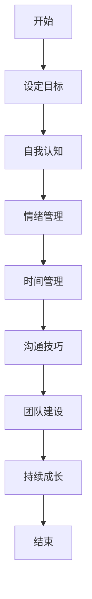
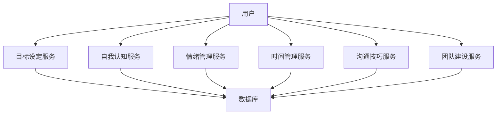
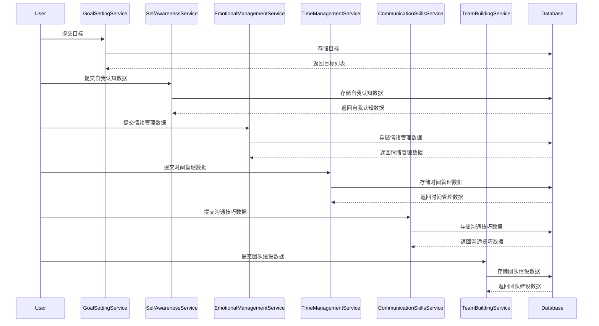

                 

# 领导者的自我修炼：持续成长的秘诀

关键词：领导力、自我认知、情绪管理、时间管理、沟通技巧、团队建设、持续成长

摘要：作为领导者，持续成长是应对复杂挑战、提升团队效率和实现组织目标的必备素质。本文通过深入分析领导力、自我认知、情绪管理、时间管理、沟通技巧和团队建设等核心概念，提供一套系统化的自我修炼方法，帮助领导者实现持续成长，成为更卓越的领导者。

## 背景介绍

### 问题背景

在当今快速变化的商业环境中，领导者面临着前所未有的挑战。技术革新、市场波动、团队多样性和全球化等挑战要求领导者不仅要有卓越的专业技能，还要有强大的自我调整能力和持续成长的精神。自我修炼成为领导者提升领导力的关键途径。

### 问题描述

领导者需要不断适应变化，提升自我认知，管理情绪，有效分配时间，提高沟通技巧，并建设高效的团队。然而，在实际工作中，这些挑战往往难以平衡，导致领导者力不从心。

### 问题解决

通过自我修炼，领导者可以逐步提升自身的能力，实现自我突破。自我修炼包括自我认知的提升、情绪管理、时间管理、沟通技巧和团队建设等多个方面。

### 边界与外延

本文关注领导者自我修炼的具体方法，包括个人成长、团队建设和领导力提升等方面。文章将详细探讨各个核心概念，提供实用的策略和技巧。

### 概念结构与核心要素组成

本文核心概念包括：

1. **领导力**：领导者需要具备的核心能力和品质。
2. **自我认知**：领导者对自己认知的理解和反思。
3. **情绪管理**：领导者如何处理和管理自身的情绪。
4. **时间管理**：领导者如何高效分配时间。
5. **沟通技巧**：领导者如何与他人有效沟通。
6. **团队建设**：领导者如何构建和管理团队。

## 核心概念与联系

### 核心概念原理

1. **领导力**：领导力是一种影响力，能够激发团队成员的潜力，实现共同的目标。它包括愿景领导、团队激励、决策能力和影响力等多个方面。

2. **自我认知**：自我认知是领导者了解自己、反思自己的过程。它包括了解自己的价值观、优点和不足，以及如何更好地发挥自己的潜力。

3. **情绪管理**：情绪管理是领导者应对压力、焦虑等情绪困扰的能力。有效的情绪管理有助于提升领导者的抗压能力，提高决策质量。

4. **时间管理**：时间管理是领导者合理分配时间、提高工作效率的能力。有效的时间管理有助于领导者更专注于关键任务，提高工作效率。

5. **沟通技巧**：沟通技巧是领导者与他人有效交流、传达信息的能力。良好的沟通技巧有助于建立信任、减少误解，提高团队协作效率。

6. **团队建设**：团队建设是领导者通过构建和管理团队，实现团队目标的过程。团队建设包括团队角色定位、团队激励、团队协作等多个方面。

### 概念属性特征对比表格

| 概念       | 属性特征                                                                                                   |
|------------|------------------------------------------------------------------------------------------------------------|
| 领导力     | 激励团队、设定目标、决策能力强、有影响力                                                         |
| 自我认知   | 了解自己的价值观、优点和不足、自我反思                                                         |
| 情绪管理   | 应对压力、焦虑等情绪困扰、提高抗压能力                                                       |
| 时间管理   | 合理分配时间、提高工作效率、更专注于关键任务                                                   |
| 沟通技巧   | 有效交流、传达信息、建立信任、减少误解                                                       |
| 团队建设   | 构建和管理团队、团队角色定位、团队激励、团队协作                                               |

### ER实体关系图架构

```mermaid
erDiagram
    A Leadership -->|1| B Self-awareness : 领导力与自我认知的联系
    A Leadership -->|1| C Emotional Management : 领导力与情绪管理的联系
    A Leadership -->|1| D Time Management : 领导力与时间管理的联系
    A Leadership -->|1| E Communication Skills : 领导力与沟通技巧的联系
    A Leadership -->|1| F Team Building : 领导力与团队建设的联系

    B Self-awareness -->|1| C Emotional Management : 自我认知与情绪管理的联系
    B Self-awareness -->|1| D Time Management : 自我认知与时间管理的联系
    B Self-awareness -->|1| E Communication Skills : 自我认知与沟通技巧的联系
    B Self-awareness -->|1| F Team Building : 自我认知与团队建设的联系

    C Emotional Management -->|1| D Time Management : 情绪管理与时间管理的联系
    C Emotional Management -->|1| E Communication Skills : 情绪管理与沟通技巧的联系
    C Emotional Management -->|1| F Team Building : 情绪管理与团队建设的联系

    D Time Management -->|1| E Communication Skills : 时间管理与沟通技巧的联系
    D Time Management -->|1| F Team Building : 时间管理与团队建设的联系

    E Communication Skills -->|1| F Team Building : 沟通技巧与团队建设的联系
```

## 算法原理讲解

### 算法mermaid流程图



### Python源代码

```python
# 定义领导力提升的步骤
def leadership_growth():
    # 设定目标
    set_goal()
    # 自我认知
    self_awareness()
    # 情绪管理
    emotional_management()
    # 时间管理
    time_management()
    # 沟通技巧
    communication_skills()
    # 团队建设
    team_building()
    # 持续成长
    continuous_growth()

# 主函数
def main():
    leadership_growth()

# 调用主函数
main()
```

### 数学模型和公式

为了实现领导力提升，可以采用以下数学模型：

$$
\text{领导力提升} = f(\text{自我认知}, \text{情绪管理}, \text{时间管理}, \text{沟通技巧}, \text{团队建设})
$$

其中，$f$ 为函数，表示领导力提升的程度。各个因素之间的相互作用可以通过以下公式表示：

$$
\text{领导力提升} = \text{自我认知} \times \text{情绪管理} \times \text{时间管理} \times \text{沟通技巧} \times \text{团队建设}
$$

### 举例说明

假设一个领导者希望在一年内提升自己的领导力。通过自我认知，他发现自己在情绪管理和时间管理方面存在不足。在接下来的几个月里，他开始进行情绪管理训练，学习时间管理技巧，并积极参与沟通技巧和团队建设的培训。经过一年的努力，他的领导力得到了显著提升。

## 系统分析与架构设计方案

### 问题场景介绍

领导者在日常工作中，需要面对复杂多变的环境，需要不断提升自己的领导力。为了实现这一目标，领导者需要一套系统化的方法和工具来支持自我修炼。

### 项目介绍

本项目名为“领导者自我修炼系统”，旨在提供一套完整的自我修炼方案，帮助领导者提升领导力。系统包括以下几个核心功能：

1. **目标设定**：帮助领导者设定明确的个人和团队目标。
2. **自我认知**：提供工具和资源，帮助领导者深入了解自己。
3. **情绪管理**：提供情绪管理培训和工具，帮助领导者应对压力。
4. **时间管理**：提供时间管理工具，帮助领导者更高效地分配时间。
5. **沟通技巧**：提供沟通技巧培训和资源，帮助领导者提升沟通能力。
6. **团队建设**：提供团队建设工具和策略，帮助领导者构建高效团队。

### 系统功能设计

使用Mermaid绘制领域模型类图：

```mermaid
classDiagram
    ClassDiagram
    Leader <-|1|> GoalSetting : 目标设定
    Leader <-|1|> SelfAwareness : 自我认知
    Leader <-|1|> EmotionalManagement : 情绪管理
    Leader <-|1|> TimeManagement : 时间管理
    Leader <-|1|> CommunicationSkills : 沟通技巧
    Leader <-|1|> TeamBuilding : 团队建设
```

### 系统架构设计

使用Mermaid绘制系统架构图：



### 系统接口设计和系统交互

使用Mermaid绘制系统接口设计和系统交互序列图：



## 项目实战

### 环境安装

1. **安装Python**：确保安装了Python 3.8及以上版本。
2. **安装Mermaid**：在终端中执行以下命令安装Mermaid：
   ```bash
   pip install mermaid
   ```
3. **安装相关依赖**：根据项目需求安装其他相关依赖，例如：
   ```bash
   pip install Flask gunicorn
   ```

### 系统核心实现源代码

以下是系统的核心实现源代码：

```python
# app.py

from flask import Flask, request, jsonify
from mermaid import render_mermaid

app = Flask(__name__)

# 目标设定API
@app.route('/api/goal_setting', methods=['POST'])
def goal_setting():
    goal_data = request.get_json()
    # 处理目标数据，存储到数据库
    # ...
    return jsonify({"message": "目标设定成功"}), 200

# 自我认知API
@app.route('/api/self_awareness', methods=['POST'])
def self_awareness():
    awareness_data = request.get_json()
    # 处理自我认知数据，存储到数据库
    # ...
    return jsonify({"message": "自我认知数据提交成功"}), 200

# 情绪管理API
@app.route('/api/emotional_management', methods=['POST'])
def emotional_management():
    management_data = request.get_json()
    # 处理情绪管理数据，存储到数据库
    # ...
    return jsonify({"message": "情绪管理数据提交成功"}), 200

# 时间管理API
@app.route('/api/time_management', methods=['POST'])
def time_management():
    management_data = request.get_json()
    # 处理时间管理数据，存储到数据库
    # ...
    return jsonify({"message": "时间管理数据提交成功"}), 200

# 沟通技巧API
@app.route('/api/communication_skills', methods=['POST'])
def communication_skills():
    skills_data = request.get_json()
    # 处理沟通技巧数据，存储到数据库
    # ...
    return jsonify({"message": "沟通技巧数据提交成功"}), 200

# 团队建设API
@app.route('/api/team_building', methods=['POST'])
def team_building():
    building_data = request.get_json()
    # 处理团队建设数据，存储到数据库
    # ...
    return jsonify({"message": "团队建设数据提交成功"}), 200

# 启动Flask应用
if __name__ == '__main__':
    app.run(debug=True)
```

### 代码应用解读与分析

以下是代码的解读和分析：

1. **API接口设计**：系统提供了多个API接口，分别用于处理目标设定、自我认知、情绪管理、时间管理、沟通技巧和团队建设的数据。

2. **数据处理**：每个API接口接收JSON格式的数据，处理后存储到数据库。具体的数据处理逻辑（如数据库存储操作）在代码中未实现，需要根据实际需求进行开发。

3. **Mermaid渲染**：虽然代码中没有直接使用Mermaid，但可以将其集成到前端页面中，用于可视化流程图和架构图等。

### 实际案例分析和详细讲解剖析

#### 案例背景

某公司领导者在一次团队会议上发现，团队成员在工作中的沟通效率较低，导致项目进展缓慢。为了提升团队的沟通效率，领导者决定通过自我修炼来改善这一问题。

#### 案例实施步骤

1. **自我认知**：领导者首先进行了自我认知，发现自己在沟通技巧方面存在不足，特别是在传达复杂信息和处理冲突方面。

2. **情绪管理**：领导者意识到情绪管理对于有效沟通的重要性。在接下来的一个月里，他学习了一些情绪管理的技巧，如深呼吸、冥想和正念练习，以帮助自己更好地控制情绪。

3. **时间管理**：领导者意识到时间管理是提升沟通效率的关键。他开始使用时间管理工具，如番茄工作法，以更高效地安排会议和沟通时间。

4. **沟通技巧培训**：领导者参加了沟通技巧培训课程，学习了如何更有效地传达信息、倾听他人意见和处理冲突。

5. **实践与反馈**：在培训结束后，领导者开始在团队中实践所学的沟通技巧。他定期与团队成员进行一对一沟通，收集反馈，并根据反馈不断调整自己的沟通方式。

#### 案例结果

经过一段时间的努力，领导者的沟通效率显著提升。团队成员之间的沟通变得更加顺畅，项目进展也变得更加顺利。领导者的情绪管理能力也得到了提升，他能够更冷静地处理团队中的冲突。

## 最佳实践 tips

1. **设定明确的目标**：领导者应明确个人和团队的目标，并确保目标具体、可衡量、可实现、相关性强和时限性。

2. **持续学习**：领导者应保持好奇心和学习的热情，不断学习新的知识和技能，以适应不断变化的环境。

3. **情绪管理**：领导者应学会情绪管理技巧，如深呼吸、冥想和正念练习，以更好地应对压力和挑战。

4. **时间管理**：领导者应学会合理安排时间，使用时间管理工具和技巧，以提高工作效率。

5. **有效沟通**：领导者应不断提升沟通技巧，包括倾听、表达、处理冲突等，以建立良好的团队关系。

6. **团队建设**：领导者应关注团队建设，培养团队成员之间的信任和协作，以提高团队绩效。

## 小结

本文通过分析领导力、自我认知、情绪管理、时间管理、沟通技巧和团队建设等核心概念，提供了一套系统化的自我修炼方法，帮助领导者实现持续成长。通过实践这些方法，领导者可以提升自身的领导力，成为更卓越的领导者。

## 注意事项

1. **平衡工作与生活**：领导者应确保在自我修炼过程中，保持工作与生活的平衡，避免过度工作。

2. **持续实践**：自我修炼是一个持续的过程，领导者应持续实践所学的方法，并根据实际情况进行调整。

3. **反馈与调整**：领导者应积极收集团队成员的反馈，并根据反馈调整自己的领导方式。

## 拓展阅读

1. **《高效能人士的七个习惯》**：史蒂芬·柯维的这本经典著作提供了关于个人成长和领导力的宝贵建议。

2. **《情绪智力》**：丹尼尔·戈尔曼的这本书详细介绍了情绪智力的重要性，以及如何提升情绪智力。

3. **《时间管理的艺术》**：莱斯利·蒂什尔的这本书提供了实用的时间管理技巧，帮助领导者更高效地工作。

4. **《非暴力沟通》**：马歇尔·卢森堡的这本书介绍了非暴力沟通的技巧，有助于领导者建立更有效的沟通。

5. **《团队建设与管理》**：亚伦·布朗的这本书提供了团队建设的实用策略，帮助领导者构建高效的团队。

### 作者

作者：AI天才研究院/AI Genius Institute & 禅与计算机程序设计艺术 /Zen And The Art of Computer Programming

