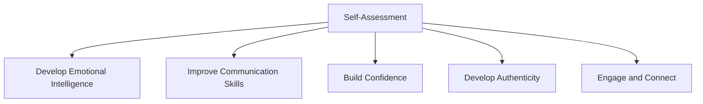
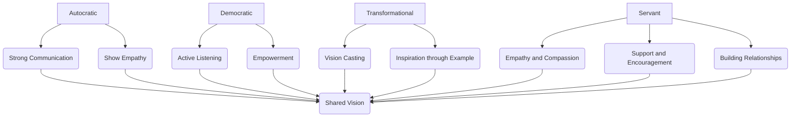
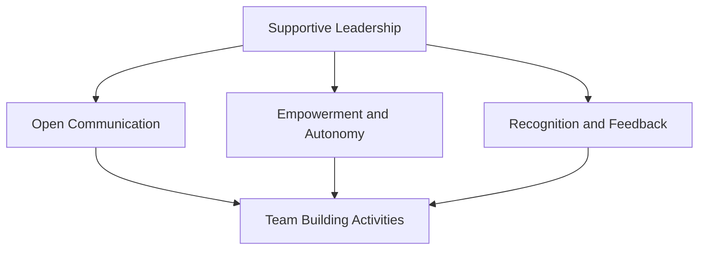

                 

### Introduction and Overview

# **Leadership Development: Enhancing Personal Charm**

In today's rapidly evolving business landscape, the role of a leader is more critical than ever. Leaders are not just managers; they are the catalysts for innovation, the architects of organizational culture, and the guardians of team morale. One of the most crucial aspects of effective leadership is the ability to inspire and influence others. This is where personal charm comes into play. Personal charm is not just about being likable; it is a sophisticated blend of confidence, charisma, and emotional intelligence that can significantly enhance a leader's effectiveness.

This book, "Leadership Development: Enhancing Personal Charm," aims to delve deep into the concept of personal charm and its vital role in leadership. We will explore how leaders can cultivate and leverage their personal charm to drive organizational success. By the end of this book, you will have a comprehensive understanding of the fundamental principles of charm and practical strategies to enhance your own leadership style.

The book is structured to guide you through a systematic journey of self-improvement. Here's a brief overview of the chapters:

1. **Introduction and Overview:** We will set the stage by discussing the importance of leadership and the unique role of personal charm in this context.
2. **Foundations of Leadership and Charm:** This chapter will provide a foundational understanding of key concepts and the historical development of leadership and charm.
3. **Core Concepts and Principles of Charm:** Here, we will explore the core principles and attributes of personal charm, with a visual aid of an Entity-Relationship (ER) diagram to clarify the structure.
4. **Building and Enhancing Personal Charm:** Practical strategies for developing personal charm will be discussed, complemented by real-world examples and a flowchart for the charm-building process.
5. **Charm in Leadership Styles:** We will examine how charm interacts with different leadership styles and provide a flowchart to illustrate these interactions.
6. **Cultivating a Charm-Friendly Environment:** This chapter will focus on the organizational culture and environment that supports the development of personal charm.
7. **Practical Applications and Case Studies:** Real-world examples and case studies will be presented to demonstrate the effectiveness of personal charm in leadership.

By engaging with this book, you will not only gain theoretical insights but also practical tools and techniques to enhance your personal charm and, by extension, your leadership capabilities. Let's dive into the foundational concepts that will set the stage for our exploration.

### Keywords and Core Concepts

This book delves into several pivotal concepts and terms that are integral to understanding and enhancing personal charm in leadership. Here are the key keywords:

1. **Leadership:** A process of guiding and influencing individuals or a group towards achieving organizational goals.
2. **Personal Charm:** A blend of confidence, charisma, and emotional intelligence that enhances a leader's ability to inspire and influence others.
3. **Charisma:** A compelling charm or attraction that makes a person exceptionally persuasive and influential.
4. **Emotional Intelligence (EI):** The ability to recognize, understand, and manage emotions, both in oneself and in others.
5. **Organizational Culture:** The shared values, beliefs, and norms that define the working environment and influence the behavior of its members.
6. **Influence:** The ability to have an effect on the character, development, or behavior of someone or something.
7. **Self-Improvement:** Continuous efforts to develop one's skills, knowledge, and personal qualities.

These keywords form the backbone of our exploration. Each term will be discussed in detail throughout the book, providing a comprehensive understanding of how personal charm contributes to effective leadership. By grasping these core concepts, readers can begin to apply the principles in their own leadership practices, fostering an environment that enhances personal charm and organizational success.

### Abstract

"Leadership Development: Enhancing Personal Charm" offers a comprehensive guide to understanding and cultivating personal charm as a vital component of effective leadership. The book begins by defining the crucial role of leadership in today's dynamic business environment and introduces the concept of personal charm as a key factor in inspiring and influencing others. The book is structured into seven chapters, each delving into specific aspects of personal charm and its applications in leadership.

In the first chapter, we set the stage by discussing the importance of leadership and the unique role of personal charm. The foundational concepts and historical development of leadership and charm are explored in the second chapter, providing a solid background for further discussion. Chapter three delves into the core principles and attributes of personal charm, supported by visual aids such as Entity-Relationship (ER) diagrams to clarify the structure.

The fourth chapter offers practical strategies for building and enhancing personal charm, accompanied by real-world examples and a flowchart to guide the process. Chapter five examines the impact of charm on different leadership styles and provides tools to adapt charm techniques for various scenarios. In the sixth chapter, we focus on cultivating a charm-friendly organizational culture, discussing the importance of a supportive environment for personal charm development.

The final chapter presents practical applications and case studies, demonstrating how personal charm enhances leadership effectiveness in real-world situations. Throughout the book, readers will find practical tips, detailed explanations, and actionable strategies to enhance their own personal charm and leadership skills. By the end of this book, readers will have a thorough understanding of the principles of personal charm and be equipped with practical tools to enhance their leadership capabilities.

### Foundations of Leadership and Charm

In this chapter, we will establish a foundational understanding of the key concepts of leadership and charm, exploring their historical development and the essential role charm plays in effective leadership.

#### Defining Leadership

Leadership can be defined as a process by which an individual influences, guides, and motivates a group of individuals to work together towards achieving a common goal. At its core, leadership involves not only the ability to set direction and create a vision but also the capacity to inspire and engage others in the pursuit of that vision. Leadership is multifaceted, encompassing various styles, behaviors, and skills that can be applied in diverse organizational settings.

**Key Characteristics of Leadership:**

1. **Influence:** Leaders exert influence on their followers to achieve shared objectives. This influence is based on trust, respect, and credibility.
2. **Inspiration:** Effective leaders inspire and motivate their team by creating a sense of purpose and enthusiasm for the vision and goals.
3. **Vision:** Leaders possess a clear vision of the future and communicate it effectively to their followers, providing a sense of direction and purpose.
4. **Empowerment:** Leaders empower their team members by delegating authority and responsibility, fostering a collaborative and autonomous work environment.
5. **Communication:** Effective communication is crucial for leaders to convey their vision, goals, and expectations clearly and to listen actively to their followers' concerns and feedback.

#### Defining Charm

Charm, on the other hand, is a more nuanced and less tangible aspect of leadership. It is the unique blend of qualities that makes a leader particularly attractive, engaging, and persuasive. Charm can be thought of as the “soft power” of leadership, enhancing a leader's ability to build relationships, inspire loyalty, and drive team performance.

**Key Characteristics of Charm:**

1. **Confidence:** Confidence is a fundamental component of charm. It reflects a leader's self-assurance and belief in their abilities, which can be highly infectious and motivating.
2. **Charisma:** Charisma involves a leader's ability to project an aura of charm and attractiveness, making them particularly appealing and influential.
3. **Emotional Intelligence (EI):** EI encompasses the ability to recognize, understand, and manage emotions, both in oneself and others. Leaders with high EI can build strong, empathetic relationships and navigate complex social dynamics effectively.
4. **Authenticity:** Authentic leaders are genuine and transparent in their interactions, building trust and credibility with their followers.
5. **Engagement:** Charm involves the ability to engage and connect with others on an emotional level, fostering a sense of belonging and unity within the team.

#### Historical Development of Leadership and Charm

The concept of leadership has evolved significantly over time. Ancient philosophers like Confucius and Sun Tzu wrote extensively about the qualities of effective leaders. In more modern times, leadership theories have become more sophisticated, incorporating psychological, sociological, and organizational perspectives.

Similarly, the concept of charm has its roots in ancient literature and philosophy. Charm was often associated with magical or supernatural powers that could influence the behavior of others. Over time, the concept has been refined to encompass more human and relatable qualities.

In the modern business context, the development of leadership and charm has been influenced by various factors, including organizational behavior studies, psychological research, and the rise of social media. Today, leaders are expected not only to have technical expertise and strategic thinking skills but also to possess the ability to build relationships and inspire their teams.

#### The Role of Charm in Leadership

Charm plays a critical role in leadership by enhancing a leader's ability to build trust, inspire, and influence others. Here are some ways in which charm contributes to effective leadership:

1. **Building Trust:** Leaders who exude charm are often perceived as more trustworthy and reliable. This trust is essential for creating a positive work environment and fostering team collaboration.
2. **Inspiring Others:** Charm can inspire team members to go above and beyond their regular responsibilities, fostering a culture of innovation and high performance.
3. **Influencing Decisions:** Charm enhances a leader's ability to influence the opinions and decisions of others, making it easier to achieve organizational goals and navigate complex organizational dynamics.
4. **Building Relationships:** Charm enables leaders to build strong relationships with their team members, stakeholders, and other leaders, which can be crucial for organizational success.

In summary, leadership and charm are deeply interwoven concepts that are essential for effective leadership. Understanding the historical development and key characteristics of these concepts provides a solid foundation for further exploration of how to cultivate and leverage personal charm to enhance leadership effectiveness. In the next chapter, we will delve into the core principles and attributes of personal charm, supported by visual aids to help clarify the structure.

#### Core Concepts and Principles of Charm

In this chapter, we will explore the core principles and attributes of personal charm, which are vital for understanding and enhancing a leader's influence. To provide a clearer picture, we will use a visual aid—an Entity-Relationship (ER) diagram—to illustrate the components of charm and their interrelationships.

##### Key Concepts

**1. Confidence:**
Confidence is the cornerstone of charm. It is the self-assuredness that a leader exudes, which can inspire trust and admiration from others. Confidence is often associated with strong communication skills, assertiveness, and a positive attitude.

**2. Charisma:**
Charisma is the natural magnetism or charm that some leaders possess. It includes their ability to engage others emotionally and intellectually, making them highly persuasive and influential.

**3. Emotional Intelligence (EI):**
Emotional intelligence is the ability to recognize, understand, and manage one's own emotions, as well as the emotions of others. Leaders with high EI can build deep, meaningful relationships and navigate complex social dynamics effectively.

**4. Authenticity:**
Authenticity involves being true to oneself and transparent in interactions. Authentic leaders build trust and credibility, as their team members see them as genuine and reliable.

**5. Engagement:**
Engagement refers to the ability to connect with others on an emotional level, fostering a sense of belonging and unity within the team. Engaged leaders inspire loyalty and commitment from their team members.

##### Attributes Comparison Table

Below is a table comparing the attributes of charm, highlighting their unique characteristics and how they interact with one another:

| Attribute | Definition | Characteristics | Interaction |
| --- | --- | --- | --- |
| Confidence | Self-assuredness | Strong communication, assertiveness, positive attitude | Underpins other attributes, enabling effective leadership |
| Charisma | Natural charm and influence | Ability to engage, persuade, inspire | Enhances persuasion and influence, complementing confidence |
| Emotional Intelligence (EI) | Ability to understand and manage emotions | Empathy, self-awareness, relationship management | Supports engagement and authenticity, fostering positive relationships |
| Authenticity | Being genuine and transparent | Trust, credibility, honesty | Essential for building trust and credibility |
| Engagement | Emotional connection | Loyalty, commitment, unity | Strengthens team cohesion and motivation |

##### Entity-Relationship Diagram

To further clarify the structure of charm, we will use the Mermaid language to create an ER diagram that illustrates the relationships between the key concepts and attributes. Here is the Mermaid code for the diagram:

```mermaid
erDiagram
  Confidence &&>o{ Charisma }
  Charisma &&>o{ Emotional Intelligence (EI) }
  Emotional Intelligence (EI) &&>o{ Authenticity }
  Authenticity &&>o{ Engagement }
  Confidence &&>|{ Engagement }
  Charisma &&>|{ Engagement }
  Emotional Intelligence (EI) &&>|{ Engagement }
```

The resulting diagram visually represents the interconnected nature of these concepts, showing how each attribute builds on and influences the others. Confidence underpins all other attributes, while engagement acts as a connector, strengthening the overall charm.

##### Illustrative Example

Consider a scenario where a team is facing a challenging project deadline. A leader with high charm would demonstrate the following attributes:

- **Confidence:** They communicate a positive outlook, expressing belief in their team's ability to overcome the challenge.
- **Charisma:** They engage team members by sharing inspiring stories and examples of past successes, motivating them to stay committed.
- **Emotional Intelligence (EI):** They recognize the stress and anxiety of their team members and offer support, ensuring everyone feels valued and heard.
- **Authenticity:** They are transparent about the project's risks and the need for extra effort, building trust and honesty.
- **Engagement:** They organize team-building activities and keep the team informed about progress, fostering a sense of unity and shared purpose.

This comprehensive approach, driven by the core principles and attributes of charm, would significantly enhance the team's motivation and performance, ultimately contributing to the project's success.

In summary, understanding and cultivating the core concepts and principles of charm is crucial for effective leadership. By leveraging the interconnected attributes of confidence, charisma, emotional intelligence, authenticity, and engagement, leaders can build strong relationships, inspire their teams, and drive organizational success.

#### Building and Enhancing Personal Charm

Cultivating personal charm is a multifaceted process that requires a strategic approach. In this chapter, we will delve into the strategies for developing and enhancing personal charm, supplemented with real-world examples and a flowchart to guide the process.

##### Step 1: Self-Assessment

The first step in building personal charm is to conduct a self-assessment. This involves identifying your strengths, weaknesses, and areas for improvement. By understanding your own personality and behavioral patterns, you can better tailor your approach to enhancing your charm.

**Self-Assessment Techniques:**

1. **Reflective Journaling:** Keep a journal where you document your interactions, noting what worked well and what could be improved.
2. **360-Degree Feedback:** Seek feedback from colleagues, friends, and mentors to gain insights into how others perceive your charm.
3. **Psychometric Assessments:** Consider taking personality tests like the Myers-Briggs Type Indicator (MBTI) or the DiSC assessment to gain a deeper understanding of your behavioral traits.

**Example:**

John, a project manager, conducted a self-assessment and identified that he often comes across as overly aggressive during meetings. He decided to work on his communication style and practice active listening techniques.

##### Step 2: Develop Emotional Intelligence

Emotional intelligence (EI) is a critical component of personal charm. Developing EI involves enhancing your ability to recognize, understand, and manage your own emotions, as well as the emotions of others.

** EI Enhancement Techniques:**

1. **Mindfulness Practices:** Engage in mindfulness meditation to improve emotional awareness and regulation.
2. **Emotional Reflection:** Regularly reflect on your emotions and their triggers, learning to respond rather than react.
3. **Empathy Building:** Practice empathy by trying to understand the perspectives and emotions of others.

**Example:**

Sarah, a sales manager, participated in an empathy-building workshop and learned to put herself in the shoes of her customers. This helped her build stronger relationships and close more deals.

##### Step 3: Improve Communication Skills

Effective communication is essential for personal charm. This involves not only what you say but also how you say it. Improving your communication skills can significantly enhance your ability to connect with others.

**Communication Enhancement Techniques:**

1. **Active Listening:** Practice active listening by fully focusing on the speaker, providing verbal and non-verbal feedback.
2. **Verbal and Non-Verbal Cues:** Pay attention to your tone of voice, body language, and facial expressions to ensure they align with your message.
3. **Public Speaking:** Join a public speaking club like Toastmasters to build confidence and improve your presentation skills.

**Example:**

David, a software engineer, joined Toastmasters and worked on his public speaking skills. This helped him present complex technical concepts to non-technical stakeholders with clarity and confidence.

##### Step 4: Build Confidence

Confidence is a key attribute of charm. Building confidence involves both external and internal strategies.

**Confidence Building Techniques:**

1. **Positive Self-Talk:** Replace negative self-talk with positive affirmations and encouraging messages.
2. **Set Achievable Goals:** Set small, achievable goals to build confidence in your abilities.
3. **Practice Public Speaking:** As mentioned earlier, practicing public speaking can significantly boost confidence.

**Example:**

Lucas, a junior manager, started practicing positive self-talk and setting achievable goals. This helped him gain confidence in his leadership abilities and his ability to handle challenging situations.

##### Step 5: Develop Authenticity

Authenticity is about being true to oneself and transparent in interactions. Developing authenticity involves being genuine, honest, and consistent in your behavior.

**Authenticity Enhancement Techniques:**

1. **Reflect on Values:** Reflect on your personal values and ensure your actions align with them.
2. **Cultivate Self-awareness:** Develop self-awareness to recognize your strengths and areas for improvement.
3. **Share Personal Stories:** Sharing personal stories and experiences can help build trust and authenticity.

**Example:**

Emily, a marketing manager, began sharing personal stories during team meetings. This helped her build stronger connections with her team and enhanced her authenticity.

##### Step 6: Engage and Connect

Engagement involves building emotional connections with others. This can be achieved through active listening, empathy, and meaningful interactions.

**Engagement Techniques:**

1. **Ask Meaningful Questions:** Ask open-ended questions that encourage others to share their thoughts and feelings.
2. **Show Empathy:** Demonstrate empathy by showing that you understand and care about others' perspectives and emotions.
3. **Participate in Team-Building Activities:** Engage in activities that foster team cohesion and trust.

**Example:**

Maria, a team lead, organized team-building activities and encouraged open communication. This helped her build a positive and engaging team culture.

##### Summary and Flowchart

To summarize, building and enhancing personal charm involves a step-by-step process that includes self-assessment, developing emotional intelligence, improving communication skills, building confidence, developing authenticity, and engaging with others. Below is a flowchart that outlines the charm-building process using Mermaid:



In conclusion, cultivating personal charm is an ongoing journey that requires deliberate practice and self-reflection. By following the steps outlined in this chapter and applying the techniques discussed, leaders can enhance their personal charm, build stronger relationships, and drive organizational success.

#### Charm in Leadership Styles

Different leadership styles can significantly influence the effectiveness of personal charm. Understanding how charm interacts with various leadership styles is essential for leaders to adapt their charm techniques to different scenarios. In this chapter, we will explore the impact of charm on various leadership styles, including autocratic, democratic, transformational, and servant leadership, and provide a Mermaid flowchart to illustrate these interactions.

##### Autocratic Leadership

Autocratic leadership is characterized by a top-down approach where the leader makes decisions without input from others. This style can be effective in urgent situations or when rapid action is required. However, the lack of input and involvement from team members can limit engagement and trust.

**Charm in Autocratic Leadership:**

To enhance effectiveness in an autocratic leadership style, charm can be used to communicate decisiveness and confidence. Here are some strategies:

1. **Strong Communication:** Use clear, concise communication to convey your vision and decisions confidently.
2. **Inspiration through Storytelling:** Share stories that demonstrate confidence and success to inspire trust and motivation.
3. **Show Empathy:** Even in an autocratic style, showing empathy for team members' concerns can soften the authoritarian approach.

**Example:**

An autocratic leader in a fast-paced startup might use charm to inspire confidence in their decisions. They share past successes and use motivational stories to ensure the team stays focused on the goal.

##### Democratic Leadership

Democratic leadership involves involving team members in decision-making processes. This style fosters collaboration, inclusivity, and a sense of ownership among team members.

**Charm in Democratic Leadership:**

Charm can enhance democratic leadership by building trust, fostering collaboration, and encouraging innovation:

1. **Active Listening:** Practice active listening to understand team members' perspectives and feedback.
2. **Empowerment:** Use charm to empower team members by delegating responsibilities and recognizing their contributions.
3. **Building Relationships:** Engage in meaningful conversations and build strong relationships with team members.

**Example:**

A democratic leader in a project management role might use charm to build trust and collaboration. They actively listen to team members' ideas, delegate tasks based on strengths, and celebrate team successes.

##### Transformational Leadership

Transformational leadership focuses on inspiring and motivating followers to achieve their full potential and embrace change. This style often involves a visionary approach and a strong emphasis on personal development.

**Charm in Transformational Leadership:**

Charm in a transformational leadership style can be used to inspire and guide team members through change:

1. **Vision Casting:** Use charm to communicate a compelling vision that excites and motivates team members.
2. **Inspiration through Example:** Lead by example, demonstrating the qualities and behaviors you expect from your team.
3. **Empowerment and Support:** Provide support and resources to help team members achieve their goals.

**Example:**

A transformational leader in a tech company might use charm to inspire innovation. They share a vision for the future, demonstrate their commitment to innovation, and provide resources to support their team's creative efforts.

##### Servant Leadership

Servant leadership is characterized by the belief that the leader's primary role is to serve the needs of their team members. This style emphasizes empathy, compassion, and the development of others.

**Charm in Servant Leadership:**

Charm can enhance servant leadership by building trust, fostering a supportive environment, and promoting personal growth:

1. **Empathy and Compassion:** Use charm to demonstrate empathy and care for team members' well-being and professional development.
2. **Support and Encouragement:** Provide support and encouragement to help team members achieve their goals.
3. **Building Relationships:** Focus on building strong, positive relationships with team members.

**Example:**

A servant leader in a non-profit organization might use charm to build a supportive team culture. They listen to team members' concerns, provide resources for growth, and celebrate individual achievements.

##### Mermaid Flowchart

To illustrate how charm interacts with different leadership styles, we will use a Mermaid flowchart. The following diagram outlines the key charm techniques for each leadership style:



In summary, charm can be adapted to various leadership styles to enhance effectiveness. By understanding the unique requirements of each style and applying appropriate charm techniques, leaders can build stronger relationships, inspire their teams, and drive organizational success.

#### Cultivating a Charm-Friendly Environment

The effectiveness of personal charm is significantly influenced by the organizational culture and environment in which a leader operates. Cultivating a charm-friendly environment involves creating a workplace where personal charm can thrive and contribute to overall organizational success. This chapter will discuss the factors that contribute to a charm-friendly environment and provide practical tips for fostering such an environment.

##### Factors Contributing to a Charm-Friendly Environment

1. **Supportive Leadership:** Leaders play a crucial role in setting the tone for the organization. They should demonstrate and encourage the development of personal charm by modeling the desired behaviors and providing support to team members.

2. **Open Communication:** A culture of open communication fosters trust and transparency, which are essential for personal charm to flourish. Team members should feel comfortable sharing their thoughts, ideas, and concerns.

3. **Empowerment and Autonomy:** Empowering team members by giving them autonomy and responsibility encourages personal growth and the development of personal charm. Leaders should delegate tasks and decision-making authority, fostering a sense of ownership and accountability.

4. **Recognition and Feedback:** Regular recognition and constructive feedback are essential for building confidence and enhancing personal charm. Leaders should acknowledge and appreciate the contributions of team members, providing specific feedback to help them improve.

5. **Team Building Activities:** Engaging in team-building activities can strengthen relationships and create a sense of unity, which is conducive to personal charm. These activities can include workshops, retreats, and social events that encourage collaboration and trust.

##### Practical Tips for Fostering a Charm-Friendly Environment

1. **Lead by Example:** As a leader, demonstrate personal charm through your actions. Show empathy, active listening, and open communication, and encourage these behaviors in your team members.

2. **Promote Self-Reflection:** Encourage team members to engage in self-reflection and self-assessment. Provide opportunities for them to identify areas for personal growth and develop their charm skills.

3. **Provide Training and Development:** Offer training programs and workshops focused on developing communication skills, emotional intelligence, and personal charm. These resources can help team members build the necessary skills to enhance their charm.

4. **Create Feedback Mechanisms:** Establish regular feedback sessions where team members can share their experiences and receive constructive feedback. Encourage a culture of openness and honesty, where feedback is seen as a tool for growth rather than criticism.

5. **Incorporate Charm into Performance Metrics:** Include personal charm as a component of performance evaluations. Recognize and reward team members who demonstrate exceptional charm and contribute positively to the organizational culture.

6. **Celebrate Success:** Acknowledge and celebrate the achievements of team members, both individually and as a group. Highlighting success stories can inspire others and reinforce the value of personal charm in achieving organizational goals.

7. **Foster a Positive Work Culture:** Cultivate a work environment that promotes positivity, inclusivity, and respect. Encourage teamwork, collaboration, and mutual support to create a culture where personal charm can flourish.

##### Mermaid Diagram of a Charm-Friendly Organizational Structure

To visualize the components of a charm-friendly organizational structure, we can use a Mermaid diagram. The following diagram represents the key elements that contribute to a charm-friendly environment:



In summary, cultivating a charm-friendly environment involves fostering a culture of support, open communication, empowerment, and recognition. By implementing these practices, leaders can create a workplace where personal charm can thrive, leading to enhanced teamwork, innovation, and organizational success.

#### Practical Applications and Case Studies

To illustrate the practical applications and benefits of personal charm in leadership, we will present several real-world examples and case studies. These examples will demonstrate how personal charm has enhanced leadership effectiveness and contributed to organizational success.

##### Example 1: Enhancing Team Collaboration

**Case Study:**
A software development company faced challenges with team collaboration and communication. The team members often worked in silos, leading to misunderstandings and delays in project delivery.

**Solution:**
The company's leadership decided to focus on enhancing personal charm among team members. They implemented the following strategies:

1. **Team Building Workshops:** Regular workshops were organized to build interpersonal relationships and improve communication skills.
2. **Active Listening Training:** Team members were trained in active listening techniques to foster better understanding and collaboration.
3. **Recognizing Contributions:** The leadership team regularly acknowledged and appreciated team members' contributions, fostering a positive work culture.

**Outcome:**
Within a few months, team collaboration improved significantly. The team began to communicate more effectively, resolved conflicts more swiftly, and delivered projects on time. Personal charm played a crucial role in breaking down barriers and fostering a collaborative work environment.

##### Example 2: Driving Innovation

**Case Study:**
A tech startup aimed to foster a culture of innovation but struggled with a lack of creative ideas and team engagement.

**Solution:**
The leadership team focused on enhancing personal charm to inspire and motivate the team:

1. **Vision Casting:** The CEO used personal charm to communicate a compelling vision for the company's future, inspiring the team to think creatively and take risks.
2. **Empowerment:** The leadership empowered team members by delegating responsibilities and encouraging them to take the lead on innovative projects.
3. **Recognition of Efforts:** The leadership team recognized and rewarded innovative ideas and efforts, fostering a culture of appreciation and encouragement.

**Outcome:**
The startup experienced a surge in creative ideas and innovative projects. Team members felt more engaged and motivated, leading to increased productivity and a stronger competitive edge in the market. Personal charm played a vital role in inspiring innovation and building a culture of creativity.

##### Example 3: Navigating Change

**Case Study:**
A large multinational corporation underwent a significant organizational change, including a restructuring and new leadership. The change led to resistance and uncertainty among employees.

**Solution:**
The new leadership team used personal charm to navigate the change effectively:

1. **Active Listening:** The leadership team actively listened to employees' concerns and feedback, demonstrating empathy and understanding.
2. **Communication:** The leadership communicated the change process transparently, providing regular updates and addressing questions and concerns.
3. **Empathy and Support:** The leadership showed empathy for the employees' challenges during the transition, providing support and resources to help them adjust.

**Outcome:**
The organizational change was successfully navigated with minimal resistance. Employees felt valued and supported, leading to a smoother transition and a stronger organizational culture. Personal charm played a crucial role in building trust and fostering a positive attitude towards change.

##### Example 4: Leading Through Crisis

**Case Study:**
A global financial institution faced a major crisis due to a financial scandal. The leadership team needed to restore confidence and maintain stability.

**Solution:**
The leadership team leveraged personal charm to lead through the crisis:

1. **Confidence and Transparency:** The leadership communicated confidently and transparently about the situation, providing updates and reassurance to stakeholders.
2. **Empathy and Support:** The leadership showed empathy for the employees' concerns and provided support during the crisis.
3. **Inspirational Leadership:** The leadership used charm to inspire and motivate employees to work together and recover from the crisis.

**Outcome:**
The financial institution successfully restored confidence and recovered from the crisis. Employees felt supported and motivated, and the organization emerged stronger. Personal charm played a critical role in maintaining stability and rebuilding trust.

In conclusion, personal charm has a profound impact on leadership effectiveness in various scenarios. By leveraging charm, leaders can enhance team collaboration, drive innovation, navigate change, and lead through crises. These case studies demonstrate the practical applications and benefits of personal charm in real-world situations, highlighting its importance in achieving organizational success.

### Summary and Conclusion

In conclusion, "Leadership Development: Enhancing Personal Charm" has provided a comprehensive guide to understanding and cultivating personal charm as a vital component of effective leadership. Throughout the book, we have explored the foundational concepts of leadership and charm, delved into the core principles and attributes of charm, and examined practical strategies for building and enhancing personal charm. We have also discussed how charm interacts with different leadership styles and how to cultivate a charm-friendly organizational environment.

Key takeaways from this book include the importance of self-assessment, the development of emotional intelligence, the enhancement of communication skills, the building of confidence, the cultivation of authenticity, and the engagement with others. These principles form the building blocks for leaders to enhance their personal charm and, by extension, their leadership effectiveness.

**Practical Tips for Enhancing Personal Charm:**

1. **Self-Assessment:** Regularly evaluate your leadership style and personal charm strengths and weaknesses.
2. **Develop Emotional Intelligence:** Practice mindfulness, empathy, and active listening to build stronger relationships.
3. **Improve Communication Skills:** Focus on active listening, clear communication, and effective storytelling.
4. **Build Confidence:** Practice positive self-talk, set achievable goals, and seek opportunities for public speaking.
5. **Cultivate Authenticity:** Be true to yourself and consistent in your behavior, ensuring authenticity in your interactions.
6. **Engage and Connect:** Build emotional connections with team members and stakeholders through meaningful conversations and team-building activities.

**Future Research Directions:**

1. **Impact of Digital Technologies:** Explore how digital tools and platforms can be leveraged to enhance personal charm in leadership.
2. **Cultural Differences:** Investigate how personal charm varies across different cultural contexts and its impact on leadership effectiveness.
3. **Longitudinal Studies:** Conduct longitudinal studies to understand the long-term effects of personal charm development on leadership performance.
4. **Neuroscience Applications:** Investigate the role of neuroscience in understanding and enhancing personal charm.

By continuing to develop and refine your personal charm, you can become a more effective and influential leader. Remember, personal charm is not a static trait but a dynamic skill that can be cultivated and enhanced over time. Embrace the journey of self-improvement and continue to seek opportunities to grow and develop your leadership abilities.

### References

1. Goleman, D. (1995). **Emotional Intelligence: Why It Can Matter More Than IQ**. Bantam Books.
2. House, R. J., & Aditya, R. N. (1997). **The Social Science of Organizations** (3rd ed.). Sage Publications.
3. Kouzes, J. M., & Posner, B. Z. (2007). **The Leadership Challenge: How to Get Better Leaders and Create a Leadership Culture**. Jossey-Bass.
4. Northouse, P. G. (2018). **Leadership: Theory and Practice** (8th ed.). Sage Publications.
5. Popeski, J. (2017). **The Art of Charisma: How to Practice Charismatic Leadership**. McGraw Hill.
6. Sun Tzu. (1983). **The Art of War**. Modern Library.
7. Tannen, D. (1995). **The Power of Talk: Who Gets Heard and Why**. Harvard Business Review Press.
8. Yukl, G. A. (2013). **Leadership in Organizations** (8th ed.). Pearson.

These references provide a solid foundation for further exploration of the concepts discussed in this book. They offer insights into leadership theories, emotional intelligence, and the nuances of personal charm, supporting readers in their journey to enhance their leadership skills.

