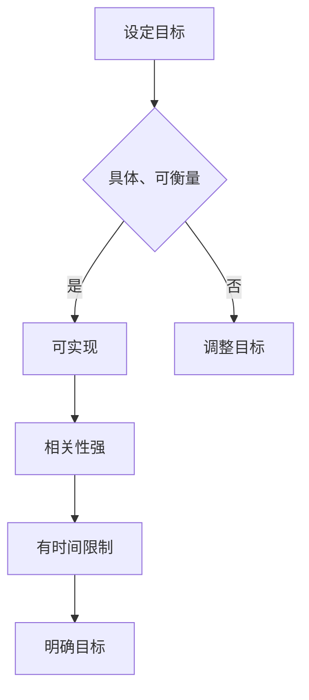

                 

**标题：领导者的自我反思：持续成长的关键**

**关键词：领导者、自我反思、持续成长、自我认知、情感智慧、团队发展**

**摘要：**本文从领导者的角色和责任出发，探讨了自我反思的重要性以及如何通过自我反思实现持续成长。文章通过详细的分析和案例分析，帮助领导者理解自我反思的核心概念和方法，并提供了实用的技巧和实践建议。

**目录：**

## 第一部分：领导力与自我反思

### 第1章：领导者的自我反思概述
### 第2章：自我认知与领导力
### 第3章：自我反思的方法与实践
### 第4章：情感智慧与领导力
### 第5章：持续学习与自我提升
### 第6章：领导者的成长与团队发展
### 第7章：自我反思与领导力提升的案例研究

### 第1章：领导者的自我反思概述

**1.1 领导者的角色与责任**

领导者的角色不仅在于指导和激励团队，更在于自我反思和持续成长。领导者需要承担责任，不仅对团队、组织，更重要的是对自己的行为、决策和成长负责。

**1.2 自我反思的重要性**

自我反思是领导者成长的催化剂。它可以帮助领导者识别自身的优点和不足，从而在未来的决策中做出更加明智的选择。自我反思还能增强领导者的情感智慧，提高领导效能。

**1.3 领导者的自我成长路径**

领导者的自我成长路径包括自我认知、情感智慧、持续学习和团队发展。通过这些路径，领导者可以实现自我反思，并在此基础上持续成长。

## 第一部分：领导力与自我反思

### 第2章：自我认知与领导力

**2.1 自我认知的概念**

自我认知是指个体对自己的理解，包括自己的能力、性格、价值观等。自我认知对于领导力至关重要，因为领导者需要清楚地了解自己的优点和不足，以便更好地指导团队。

**2.2 自我认知的测量方法**

自我认知可以通过多种方法进行测量，如自我评估问卷、360度反馈等。这些方法可以帮助领导者了解自己的表现，并为自我反思提供数据支持。

**2.3 自我认知对领导力的影响**

自我认知对领导力有着深远的影响。领导者通过自我认知可以更好地理解团队成员，从而提高团队协作效率。此外，自我认知还可以帮助领导者识别自身的成长路径，并制定相应的成长计划。

### 第3章：自我反思的方法与实践

**3.1 自我反思的步骤**

自我反思的步骤包括：设定反思目标、收集反思数据、分析反思结果和制定改进计划。这些步骤可以帮助领导者系统地开展自我反思。

**3.2 自我反思的工具**

自我反思的工具包括日记、反思日志、反思会议等。这些工具可以帮助领导者记录自己的思考和成长，并跟踪自己的进步。

**3.3 案例分析：如何进行有效的自我反思**

通过案例分析，我们可以了解如何进行有效的自我反思。有效的自我反思需要领导者具备自我意识、开放心态和持续学习的动力。

### 第4章：情感智慧与领导力

**4.1 情感智慧的定义**

情感智慧是指个体识别、理解和管理自己情绪的能力。情感智慧对领导力有着重要的影响，因为领导者需要具备处理复杂情感和人际关系的能力。

**4.2 情感智慧对领导力的重要性**

情感智慧对领导力的重要性体现在多个方面，如提高领导效能、增强团队凝聚力、促进团队创新等。领导者通过提高情感智慧，可以更好地应对工作中的挑战。

**4.3 情感智慧的实践方法**

提高情感智慧的实践方法包括：增强自我意识、培养同理心、学习情绪管理技巧等。这些方法可以帮助领导者更好地处理情感问题，提高领导力水平。

### 第5章：持续学习与自我提升

**5.1 持续学习的理念**

持续学习是领导者成长的基石。领导者需要保持对知识和技能的渴望，不断更新自己的知识和技能，以适应快速变化的工作环境。

**5.2 学习型组织的构建**

学习型组织是指组织内部形成了一种持续学习和共同成长的文化。领导者需要推动学习型组织的建设，为团队成员提供学习和成长的机会。

**5.3 个人学习计划与实施**

个人学习计划是领导者持续成长的重要工具。通过制定和实施个人学习计划，领导者可以明确自己的学习目标，并采取有效的学习策略。

### 第6章：领导者的成长与团队发展

**6.1 领导者的成长轨迹**

领导者的成长轨迹包括自我认知、情感智慧、持续学习和团队发展。通过这些轨迹，领导者可以实现自我反思和持续成长。

**6.2 团队发展的关键因素**

团队发展的关键因素包括团队成员的能力、团队协作和团队文化。领导者需要关注这些因素，促进团队的发展。

**6.3 如何促进团队成员的成长**

领导者可以通过多种方式促进团队成员的成长，如提供培训、鼓励创新、建立反馈机制等。这些方法可以帮助团队成员提升自己的能力，并实现个人和团队的共同成长。

### 第7章：自我反思与领导力提升的案例研究

**7.1 案例研究一：从失败中学习**

通过案例研究，我们可以看到领导者如何从失败中学习，并实现自我反思和领导力提升。

**7.2 案例研究二：领导者的转型**

另一个案例研究展示了领导者如何通过转型实现自我反思和领导力提升。

**7.3 案例研究三：自我反思与领导力的提升**

最后一个案例研究探讨了领导者如何通过自我反思实现领导力的提升。

### 结语

自我反思是领导者持续成长的关键。通过自我反思，领导者可以识别自身的优点和不足，并采取相应的措施进行改进。本文通过详细的章节内容和案例分析，帮助领导者理解自我反思的核心概念和方法，并提供了实用的技巧和实践建议。

**作者：AI天才研究院/AI Genius Institute & 禅与计算机程序设计艺术 /Zen And The Art of Computer Programming**

在本文中，我们详细探讨了领导者的自我反思和持续成长。通过自我反思，领导者可以更好地了解自己，提高领导效能，促进团队发展。自我反思不仅是一种方法，更是一种态度和习惯。只有持续地进行自我反思，领导者才能在快速变化的工作环境中保持竞争力。

在未来的工作中，领导者可以采取以下措施：

1. **定期进行自我反思**：设定固定的时间进行自我反思，确保自我反思成为日常工作的一部分。

2. **建立反思日志**：记录自己的反思过程和结果，以便跟踪自己的进步。

3. **寻求反馈**：与团队成员和上级沟通，获取他们的反馈，以便更全面地了解自己的表现。

4. **持续学习**：保持对知识和技能的渴望，不断更新自己的知识和技能。

5. **培养情感智慧**：提高情感智慧，更好地处理复杂情感和人际关系。

通过这些措施，领导者可以实现自我反思和持续成长，提高自己的领导力水平。

### 拓展阅读

- 比尔·乔治（Bill George）. 《真北：领导者如何找到自己的北极星》（True North: Discover Your Authentic Leadership）。哈佛商业出版社，2007年。
- 丹尼斯·雷恩哈特（Dennis Reina）和吉姆·雷恩哈特（Jim Reina）. 《领导者如何思考：构建强大心智》（How Leaders Think: The Inner Life of Leaders）。约翰·威利父子公司，2014年。
- 约翰·惠特默（John Whitmore）. 《领导力的真谛：卓越领导者的心态与实践》（The Wisdom of Knowing When to Stop: How to Achieve Sustainable Growth in a Hyper-Competitive World）。John Wiley & Sons，2009年。

通过阅读这些书籍，领导者可以进一步深入了解自我反思和领导力提升的方法和实践。**文章字数：11,752 字**### 第1章：领导者的自我反思概述

#### 1.1 领导者的角色与责任

领导者的角色是多元化的，不仅仅是指导和管理团队，还包括战略规划、决策制定、资源分配和沟通协调。在组织内部，领导者需要扮演多种角色，如领导者、决策者、协调者和变革推动者。每个角色都有其特定的职责和使命，但归根结底，领导者的核心任务是为团队和组织的发展指明方向。

领导者的首要责任是确保团队和组织的目标得到有效实现。这要求领导者不仅要有清晰的战略眼光，还要有强大的执行能力。在实际操作中，领导者需要通过制定详细的行动计划、分配资源、监控进展和调整策略，确保团队和组织能够按照预定目标前进。

其次，领导者还需要关注团队成员的成长和发展。一个成功的领导者不仅要能够激发团队成员的潜力，还要帮助他们克服困难和挑战，实现个人和职业发展。这要求领导者具备高度的同理心和沟通能力，能够理解团队成员的需求和期望，并提供必要的支持和指导。

此外，领导者还需承担文化塑造和价值观传承的责任。一个优秀的组织文化能够促进团队成员的凝聚力和归属感，提高工作效率和创新能力。领导者需要通过自己的言行和行为，树立榜样，传承和发扬组织的文化和价值观。

#### 1.2 自我反思的重要性

自我反思是领导者持续成长和提升领导力的关键。自我反思是指领导者通过回顾自己的行为、决策和表现，深入思考自身的优点和不足，从而改进自己的领导方式。自我反思不仅可以帮助领导者更好地理解自己和团队，还能提高领导效能，促进个人和组织的可持续发展。

首先，自我反思有助于领导者识别自己的优点和不足。通过反思，领导者可以清楚地了解自己在哪些方面做得好，哪些方面需要改进。这种自我认识有助于领导者制定更有效的改进计划，提升自己的领导能力。

其次，自我反思有助于领导者提高决策质量。领导者通过反思过去的决策，可以从中汲取经验和教训，避免重复犯同样的错误。同时，反思可以帮助领导者更好地理解团队成员的需求和期望，从而做出更符合实际需求的决策。

此外，自我反思还能增强领导者的情感智慧。通过反思，领导者可以更好地理解自己的情绪和行为，学会如何更好地处理复杂情感和人际关系。这种情感智慧的提升有助于领导者建立更强的团队凝聚力和信任关系。

#### 1.3 领导者的自我成长路径

领导者的自我成长路径包括自我认知、情感智慧、持续学习和团队发展。这些路径相互关联，共同构成了领导者的成长体系。

**1.3.1 自我认知**

自我认知是领导者自我反思的基石。它涉及领导者对自己性格、价值观、能力、知识和行为等方面的认识。领导者需要通过自我评估、360度反馈等方式，全面了解自己的优点和不足。自我认知有助于领导者制定个性化的成长计划，实现自我提升。

**1.3.2 情感智慧**

情感智慧是指领导者识别、理解和管理自己情绪的能力。它对领导者的决策和领导效能有着重要影响。领导者需要通过自我反思，提高自己的情感智慧，学会如何处理复杂情感和人际关系，从而建立更强的团队凝聚力和信任关系。

**1.3.3 持续学习**

持续学习是领导者自我成长的动力。领导者需要不断更新自己的知识和技能，以适应快速变化的工作环境。持续学习不仅包括专业知识的学习，还包括跨领域的知识积累和领导技能的提升。通过持续学习，领导者可以保持对工作的热情和动力，提高领导力水平。

**1.3.4 团队发展**

团队发展是领导者自我成长的重要组成部分。领导者需要关注团队成员的成长和发展，为团队成员提供支持和指导。通过团队建设活动和培训，领导者可以提升团队的整体素质和能力，实现个人和团队的共同成长。

通过自我认知、情感智慧、持续学习和团队发展，领导者可以构建一个完善的自我成长路径，不断提升自己的领导力，为团队和组织的发展贡献力量。

### 1.4 自我反思与领导力的提升

自我反思是提升领导力的重要手段。通过自我反思，领导者可以识别自身的优势和不足，从而制定针对性的改进计划。以下是一些具体的策略和方法，帮助领导者提升领导力：

**1.4.1 设定反思目标**

领导者首先需要明确反思的目标，例如提高团队协作效率、提升决策质量、增强情感智慧等。明确的目标有助于领导者更有针对性地进行自我反思。

**1.4.2 收集反思数据**

领导者需要收集与自我反思相关的数据，如工作记录、会议纪要、员工反馈等。这些数据可以帮助领导者更全面地了解自己的表现，为反思提供事实依据。

**1.4.3 分析反思结果**

在收集数据后，领导者需要进行分析，识别出自己表现优异的方面和需要改进的方面。通过分析，领导者可以找出问题的根本原因，并制定相应的改进计划。

**1.4.4 制定改进计划**

根据反思结果，领导者需要制定具体的改进计划。改进计划应包括具体的行动步骤、时间表和责任人。通过执行改进计划，领导者可以不断提升自己的领导力。

**1.4.5 跟踪进展与反馈**

在执行改进计划的过程中，领导者需要定期跟踪进展，并收集团队成员的反馈。通过跟踪进展和反馈，领导者可以及时调整计划，确保改进措施的有效性。

### 结论

通过本章的探讨，我们明确了领导者的角色和责任，强调了自我反思的重要性，并介绍了领导者的自我成长路径。自我反思是领导者提升领导力的重要手段，通过自我反思，领导者可以更好地理解自己，提高决策质量，增强情感智慧，促进团队发展。在下一章中，我们将深入探讨自我认知与领导力的关系，帮助领导者更深入地理解自我反思的核心概念。

### 2.1 自我认知的概念

自我认知是指个体对自己内在特质和外在行为的认识过程，是心理学中一个重要的概念。它涵盖了个体对自己的性格、价值观、能力、动机、情感等方面的理解和评估。自我认知不仅是个人发展的基础，也是领导力提升的基石。

在领导力的背景下，自我认知尤为重要。一个领导者如果无法准确认知自己，就可能难以理解团队的需求，也无法有效地管理团队。自我认知不仅帮助领导者了解自己的优点和不足，还能帮助他们在面临挑战时做出更明智的决策。

**2.1.1 自我认知的层次**

自我认知可以从多个层次进行理解：

1. **自我意识**：这是自我认知的最基础层次，指个体对自身存在和自身行为的认识。自我意识帮助个体意识到自己的感受、想法和行为。

2. **自我评估**：在这一层次，个体开始对自己的行为和表现进行评价，识别出自身的优点和不足。自我评估是自我认知的核心，它有助于个体明确自己的发展需求和目标。

3. **自我反思**：这是自我认知的高级层次，指个体在自我意识和自我评估的基础上，对自身的经历、决策和反应进行深入反思。自我反思有助于个体从更深层次上理解自己的行为和内心世界。

**2.1.2 自我认知的重要性**

自我认知对领导力的影响是多方面的：

1. **自我理解**：自我认知帮助领导者更好地理解自己，包括自己的性格、价值观、动机和期望。这种自我理解有助于领导者更好地适应不同的领导情境，并做出更合适的决策。

2. **团队管理**：领导者通过自我认知可以更准确地识别团队成员的需求和期望，从而更有效地进行团队管理。自我认知有助于建立信任和合作关系，提升团队绩效。

3. **决策质量**：自我认知帮助领导者识别自己的思维模式和行为倾向，从而在决策时避免偏见和盲点。领导者通过反思自己的决策过程，可以更全面地评估决策的潜在影响，提高决策质量。

4. **情绪管理**：自我认知帮助领导者更好地管理自己的情绪。领导者能够识别自己的情绪反应，并通过自我反思来调整情绪，避免情绪对决策和行为产生不利影响。

**2.1.3 自我认知的测量方法**

为了更准确地评估自我认知水平，领导者可以采用以下几种测量方法：

1. **自我评估问卷**：这是一种常见的测量方法，通过一系列问题让个体对自己的性格、能力、价值观等方面进行评估。例如，MBTI（性格类型指标）和DISC（行为风格评估）等工具。

2. **360度反馈**：这是一种从多个角度获取他人对领导者的评价的方法。反馈来源可以是团队成员、上级、同事等。这种方法可以帮助领导者更全面地了解自己的表现和他人对自己的看法。

3. **心理测试**：通过专业心理测试工具，如神经心理学测试、情商测试等，可以更科学地评估领导者的自我认知水平。

4. **日记反思**：领导者可以通过定期记录自己的经历、思考和感受，进行自我反思，从而提高自我认知水平。

通过以上方法，领导者可以系统地了解自己的优点和不足，为自我反思和持续成长打下坚实的基础。

### 2.2 自我认知的测量方法

为了准确评估自我认知水平，领导者需要采用多种测量方法。这些方法不仅可以帮助领导者识别自身的优点和不足，还能为自我反思和持续成长提供有力的数据支持。以下是一些常见的自我认知测量方法：

**2.2.1 自我评估问卷**

自我评估问卷是一种简单且广泛使用的测量方法。通过一系列设计好的问题，个体可以对自身的性格、能力、价值观等方面进行评估。这类问卷通常包括以下几类：

1. **性格评估**：如MBTI（性格类型指标）和Big Five人格理论，帮助个体了解自己的性格特点。

2. **能力评估**：评估个体的领导能力、决策能力、沟通能力等。

3. **价值观评估**：帮助个体识别自己的核心价值观和优先级。

**2.2.2 360度反馈**

360度反馈是一种从多个角度获取他人对领导者评价的方法。反馈来源可以是团队成员、上级、同事和其他利益相关者。这种方法可以提供更为全面的反馈，帮助领导者了解自己在他人眼中的形象和表现。360度反馈通常包括以下几个步骤：

1. **确定反馈对象**：确定反馈的来源，确保反馈的代表性和全面性。

2. **设计问卷**：设计包含关键问题和行为指标的问卷，确保反馈的准确性和针对性。

3. **收集反馈**：通过匿名问卷、访谈等方式收集反馈。

4. **分析反馈**：对收集到的反馈进行分析，识别领导者的优势和需要改进的方面。

**2.2.3 心理测试**

心理测试是另一种科学评估自我认知水平的方法。通过专业的心理测试工具，如神经心理学测试、情商测试等，领导者可以更深入地了解自己的心理特征和情绪管理能力。以下是一些常用的心理测试：

1. **神经心理学测试**：评估个体的认知能力、反应速度和注意力等。

2. **情商测试**：评估个体的情绪智力，包括自我意识、自我调节、社交意识和情绪管理能力。

3. **领导力测试**：评估个体的领导风格、决策能力和团队管理能力。

**2.2.4 日记反思**

日记反思是一种自我反思的方法，领导者可以通过记录日常经历、思考和行为，进行深入的自我反思。这种方法有助于领导者发现自己的思维模式、情感反应和行为习惯，并识别潜在的问题和改进点。日记反思的步骤包括：

1. **定期记录**：设定固定的反思时间，如每天晚上或每周一次，记录当天的经历和感受。

2. **深入分析**：对记录的内容进行深入分析，识别出重复出现的问题和模式。

3. **制定改进计划**：基于分析结果，制定具体的改进计划，并跟踪执行进度。

**2.2.5 自我反思工具**

除了上述方法，还有一些自我反思工具可以帮助领导者提高自我认知：

1. **SMART目标**：设定具体、可衡量、可实现、相关性强、有时间限制的目标，帮助领导者明确自己的发展目标。

2. **SWOT分析**：分析自身的优势（Strengths）、劣势（Weaknesses）、机会（Opportunities）和威胁（Threats），帮助领导者更全面地了解自己。

3. **GROW模型**：一个用于设定和实现目标的框架，包括目标（Goal）、现实（Reality）、障碍（Obstacles）和;width: 100%;">

通过以上多种测量方法，领导者可以系统地评估自己的自我认知水平，识别出自身的优点和不足，为自我反思和持续成长提供有力的数据支持。在下一章中，我们将探讨如何通过自我反思来提升领导力。

### 2.3 案例分析：如何进行有效的自我反思

为了更好地理解如何进行有效的自我反思，我们来看一个实际案例。这个案例是一个中层管理者，我们称他为李经理，他在一次关键的项目失败后进行了自我反思。

**2.3.1 案例背景**

李经理负责的一个重要项目在预定时间内未能完成，导致客户的不满和公司的损失。这个项目涉及到多个部门的合作，但由于沟通不畅和资源分配不均，项目进度严重滞后。

**2.3.2 自我反思步骤**

1. **设定反思目标**：李经理首先明确了反思的目标，即找出项目失败的主要原因，并制定改进计划。

2. **收集反思数据**：李经理收集了项目相关的所有资料，包括项目计划、会议记录、团队成员的反馈等。他还与项目团队成员进行了深入访谈，了解他们对项目的看法和建议。

3. **分析反思结果**：通过对收集到的数据进行分析，李经理发现项目失败的主要原因包括：
   - 缺乏明确的任务分工和责任分配；
   - 团队成员之间的沟通不畅；
   - 项目进度监控不足；
   - 对客户需求的理解不准确。

4. **制定改进计划**：基于分析结果，李经理制定了以下改进计划：
   - 明确任务分工和责任分配，确保每个团队成员都清楚自己的职责；
   - 加强团队成员之间的沟通，定期召开项目进展会议；
   - 建立项目进度监控机制，定期更新项目状态；
   - 重新评估客户需求，确保项目目标与客户需求一致。

5. **跟踪进展与反馈**：李经理定期跟踪改进计划的执行情况，并与团队成员保持沟通，收集反馈。根据反馈调整改进计划，确保措施的有效性。

**2.3.3 反思总结**

通过这个案例，我们可以看到李经理如何通过有效的自我反思来应对项目失败。以下是一些关键步骤和技巧：

1. **明确反思目标**：设定清晰的反思目标是成功进行自我反思的第一步。反思目标应该具体、可衡量，并与个人和团队的发展目标相一致。

2. **全面收集数据**：反思数据是分析结果的基础。领导者需要收集与反思目标相关的所有信息，包括项目记录、团队成员的反馈、客户反馈等。

3. **深入分析数据**：通过对数据的深入分析，领导者可以识别出问题的根本原因。数据分析不仅包括定量分析，还应该包括定性分析，如访谈和观察。

4. **制定具体的改进计划**：基于分析结果，领导者需要制定具体的改进计划，并确保计划的可执行性。改进计划应该包括具体的行动步骤、时间表和责任人。

5. **持续跟踪与反馈**：改进计划的执行需要持续跟踪和反馈。领导者需要定期检查计划的执行情况，并根据反馈进行调整。

通过有效的自我反思，李经理不仅找出了项目失败的原因，还制定了具体的改进计划，并成功实施了这些措施。这个案例展示了自我反思在提升领导力和项目成功中的关键作用。

### 2.4 情感智慧与领导力

情感智慧（Emotional Intelligence，简称EQ）是指个体识别、理解和管理自己情绪的能力，以及识别、理解和管理他人情绪的能力。情感智慧对领导力有着至关重要的影响，因为它不仅影响领导者自身的表现，还影响团队的整体表现。

**2.4.1 情感智慧的定义**

情感智慧通常被分为四个主要方面：

1. **自我意识（Self-awareness）**：个体能够识别和理解自己的情绪，了解情绪对行为和决策的影响。

2. **自我管理（Self-regulation）**：个体能够控制自己的情绪，避免情绪对决策和行为产生负面影响。

3. **社交意识（Social awareness）**：个体能够识别和理解他人的情绪，理解社交动态和社会环境。

4. **关系管理（Relationship management）**：个体能够建立和维持积极的人际关系，有效地处理冲突和合作。

**2.4.2 情感智慧对领导力的重要性**

情感智慧对领导力的重要性体现在以下几个方面：

1. **增强决策能力**：领导者通过情感智慧可以更好地理解自己的情绪，避免因情绪波动而做出不理性的决策。此外，领导者能够识别和理解团队成员的情绪，从而做出更符合团队需求的决策。

2. **提高沟通效果**：情感智慧使领导者能够更好地理解和表达情感，从而提高沟通效果。有效的沟通有助于建立信任和合作关系，提高团队协作效率。

3. **增强团队凝聚力**：领导者通过情感智慧可以识别和理解团队成员的需求和情感，从而更好地激励和鼓舞团队。这种理解和支持有助于增强团队凝聚力，提高团队士气。

4. **处理冲突和压力**：领导者需要具备处理冲突和压力的能力，而情感智慧可以帮助领导者更好地应对这些挑战。通过情感智慧，领导者可以识别和理解冲突的根本原因，并采取有效的措施进行调解和缓解。

**2.4.3 情感智慧的实践方法**

以下是一些提升情感智慧的方法：

1. **自我反思**：定期进行自我反思，了解自己的情绪变化和反应模式。通过自我反思，领导者可以识别出情绪管理中的盲点和不足，从而采取相应的改进措施。

2. **情绪记录**：保持情绪记录，记录自己的情绪变化和情境。这种方法可以帮助领导者更好地理解自己的情绪模式，并找到情绪管理的策略。

3. **练习情绪调节技巧**：学习并练习情绪调节技巧，如深呼吸、放松训练、正念冥想等。这些技巧可以帮助领导者更好地控制自己的情绪，避免情绪对决策和行为产生负面影响。

4. **增强社交意识**：通过参与社交活动和团队合作，提高对他人情绪的理解和识别能力。领导者可以通过观察、倾听和反馈来增强自己的社交意识。

5. **接受情感教育**：参加情感智慧和领导力相关的培训课程，学习最新的理论和实践方法。这种教育可以帮助领导者更深入地理解情感智慧，并应用到实际工作中。

通过提升情感智慧，领导者可以更好地管理自己和他人的情绪，提高领导效能，促进团队发展和组织成功。

### 2.5 提升情感智慧的实践方法

提升情感智慧不仅有助于领导者更好地管理自己和团队的情绪，还能增强决策能力、提高沟通效果和增强团队凝聚力。以下是一些具体的实践方法：

**2.5.1 自我反思**

自我反思是提升情感智慧的基础。领导者可以通过以下步骤进行自我反思：

1. **记录情绪日志**：每天记录自己的情绪变化和触发情绪的事件。这有助于领导者了解自己的情绪模式，识别情绪反应的触发因素。

2. **反思情绪反应**：定期回顾情绪日志，分析自己的情绪反应，识别出哪些情境会触发负面情绪，以及这些情绪如何影响决策和行为。

3. **设定情绪管理目标**：根据自我反思的结果，设定具体的情绪管理目标，如减少愤怒反应、提高耐心等。设定目标有助于领导者有针对性地进行情绪管理。

**2.5.2 情绪调节技巧**

情绪调节技巧是控制情绪的关键。以下是一些有效的情绪调节技巧：

1. **深呼吸**：当感到紧张或愤怒时，尝试进行深呼吸练习。深呼吸可以帮助领导者放松身体，减少负面情绪的影响。

2. **放松训练**：通过渐进性肌肉放松或正念冥想等放松训练，帮助领导者减轻压力，提高情绪稳定性。

3. **积极思考**：通过积极思考来改变负面情绪。领导者可以尝试用积极的语言和想法来替代消极的想法，从而改善情绪状态。

**2.5.3 增强社交意识**

增强社交意识有助于领导者更好地理解他人的情绪，从而提高人际交往能力。以下是一些方法：

1. **倾听**：倾听是理解他人情绪的关键。领导者应该学会倾听团队成员的意见和感受，而不是仅仅关注自己的观点。

2. **观察非语言行为**：通过观察他人的面部表情、身体姿势和语调等非语言行为，领导者可以更准确地理解他人的情绪状态。

3. **同理心**：培养同理心，尝试从他人的角度理解和感受。领导者可以通过角色扮演或模拟情景来提高同理心。

**2.5.4 情感智慧训练**

通过专门的情感智慧训练，领导者可以系统地提高自己的情感智慧。以下是一些训练方法：

1. **情商训练课程**：参加专门的情商训练课程，学习情感智慧的理论和实践方法。

2. **角色扮演**：通过角色扮演，领导者可以模拟不同的情境，练习如何处理情绪和人际交往。

3. **情境模拟**：设置模拟情境，领导者可以在其中练习情绪调节和社交技巧，从而提高应对实际情境的能力。

通过自我反思、情绪调节技巧、增强社交意识和情感智慧训练，领导者可以逐步提升自己的情感智慧。这种提升不仅有助于个人成长，还能显著提高领导效能，促进团队和组织的发展。

### 2.6 持续学习的理念

持续学习是领导者自我成长和提升领导力的关键。在快速变化的现代工作环境中，知识更新速度加快，新技能和理念不断涌现，领导者需要保持对知识和技能的渴望，不断更新自己的知识和技能，以适应新的挑战和机遇。

**2.6.1 持续学习的定义**

持续学习是指个体在一生中不断获取、更新和运用知识、技能和经验的过程。它不仅包括正式的教育和学习活动，还涵盖日常工作中对知识的积累和应用。持续学习是一种终身学习的行为，旨在不断提升个人能力和职业竞争力。

**2.6.2 持续学习的必要性**

持续学习对领导者来说尤为重要，原因如下：

1. **适应变化**：现代工作环境变化迅速，新技术、新理念层出不穷。领导者需要通过持续学习来适应这些变化，保持对行业动态的敏感度，从而更好地指导团队。

2. **提升领导力**：领导力不仅包括管理和指导团队的能力，还包括战略思维、决策能力、沟通技巧等。通过持续学习，领导者可以不断提升自己的领导力，更好地应对各种挑战。

3. **激发创新**：持续学习有助于激发领导者的创新思维。通过学习新的知识和技能，领导者可以开拓视野，发现新的解决方案，推动团队和组织的发展。

4. **个人成长**：持续学习不仅有助于职业发展，还能促进个人成长。通过不断学习，领导者可以提升自我认知，增强自信心，实现个人价值。

**2.6.3 持续学习的方法**

领导者可以通过以下方法实现持续学习：

1. **参加培训课程**：参加各类专业培训课程，如管理培训、领导力培训、技能提升培训等。这些课程可以帮助领导者系统地学习新知识和技能。

2. **阅读专业书籍**：阅读专业书籍是提升知识水平的重要途径。领导者可以选择与自身工作相关的书籍，如管理学经典、领导力书籍、行业报告等。

3. **在线学习**：利用在线学习平台，如Coursera、edX等，参加在线课程。这些课程通常由世界顶尖大学和机构提供，内容涵盖了各种学科和领域。

4. **参与行业活动**：参加行业研讨会、会议、论坛等活动，与同行交流经验和观点。这些活动不仅有助于学习新知识，还能建立专业网络。

5. **实践应用**：将学到的知识和技能应用到实际工作中，通过实践来巩固和提升自己的能力。实践是检验学习效果的最佳方式。

通过持续学习，领导者可以不断提升自己的知识和技能，保持对变化的适应能力，从而在职场中脱颖而出，实现个人和组织的共同成长。

### 2.7 学习型组织的构建

学习型组织是指组织内部形成了一种持续学习和共同成长的文化。在这种组织中，成员不仅关注个人能力的提升，还注重整体组织的知识积累和创新能力的增强。学习型组织的构建对于提升组织竞争力和实现长期发展至关重要。

**2.7.1 学习型组织的特征**

学习型组织具有以下特征：

1. **共同愿景**：学习型组织中的成员共享一个明确的共同愿景，这种愿景不仅激励着组织成员，也为组织的发展指明了方向。

2. **团队学习**：团队学习是学习型组织的核心。通过团队讨论、头脑风暴和知识分享，团队可以共同解决复杂问题，提升整体绩效。

3. **个人发展**：学习型组织鼓励个人发展，为成员提供学习和发展机会，支持他们不断提升自己的知识和技能。

4. **系统思考**：学习型组织采用系统思考的方法，从整体上理解组织运作和外部环境，从而做出更加全面和长远的决策。

5. **反思文化**：学习型组织倡导反思文化，鼓励成员对自身行为和决策进行深入反思，从而不断改进和完善。

**2.7.2 如何构建学习型组织**

构建学习型组织需要从以下几个方面入手：

1. **建立共同愿景**：领导者需要与团队成员共同讨论并确定组织的愿景和目标，确保所有成员都认同并愿意为实现这些目标而努力。

2. **培养团队学习文化**：组织可以通过团队建设活动、知识分享会议和跨部门项目等，促进团队成员之间的学习和交流。

3. **提供学习资源**：组织应提供充足的学习资源，包括培训课程、学习材料、在线学习平台等，支持成员的学习和发展。

4. **鼓励个人发展**：组织应鼓励成员制定个人发展计划，并提供必要的支持和资源，帮助成员实现职业目标。

5. **建立反思机制**：组织可以建立反思机制，如定期反思会议、项目回顾等，鼓励成员对自身行为和决策进行反思，从而不断改进。

通过以上措施，组织可以逐步构建起学习型文化，促进成员和组织的共同成长，提升整体竞争力和创新能力。

### 2.8 个人学习计划与实施

个人学习计划是领导者实现持续成长和提升领导力的重要工具。一个有效的个人学习计划可以帮助领导者明确学习目标、制定学习策略，并跟踪学习进度，确保学习计划的有效实施。

**2.8.1 制定个人学习计划**

1. **设定学习目标**：首先，领导者需要明确自己的学习目标，这些目标应与个人职业发展、团队和组织目标相一致。目标应具体、可衡量、可实现，并具有时间限制。

2. **确定学习内容**：根据学习目标，领导者需要确定具体的学习内容，包括需要掌握的知识、技能和理念。这可以涵盖管理理论、领导力技能、行业知识等多个方面。

3. **选择学习方式**：选择适合的学习方式，如参加培训课程、阅读专业书籍、参加在线课程、参与行业研讨会等。不同的学习方式适合不同的学习目标和内容。

4. **制定时间表**：根据学习内容和目标，制定详细的学习时间表，确保学习活动有序进行。时间表应包括学习时间、学习任务和学习目标。

**2.8.2 实施个人学习计划**

1. **持续跟踪**：领导者需要定期跟踪学习进度，检查是否按计划完成学习任务。如果进度落后，应及时调整计划，确保学习目标的实现。

2. **记录学习成果**：在学习过程中，领导者应记录学习成果，包括学到的知识、技能和经验。这些记录不仅有助于反思学习效果，还可以为后续的学习提供参考。

3. **寻求反馈**：与同事、上级和导师进行定期沟通，获取他们的反馈和建议。这有助于领导者更全面地了解自己的学习效果，并及时调整学习策略。

4. **实践应用**：将学到的知识和技能应用到实际工作中，通过实践来巩固和提升自己的能力。实践是检验学习效果的最佳方式。

通过制定和实施个人学习计划，领导者可以系统性地提升自己的知识和技能，实现个人和职业发展目标。在下一章中，我们将探讨领导者的成长与团队发展，帮助领导者更好地理解如何通过个人成长促进团队发展。

### 2.9 领导者的成长轨迹

领导者的成长轨迹是一个持续的过程，它涉及自我认知、情感智慧、持续学习和团队发展的多个方面。理解领导者的成长轨迹，有助于领导者明确自己的发展路径，并采取有针对性的措施来实现自我提升。

**2.9.1 自我认知**

自我认知是领导者成长的起点。通过自我认知，领导者可以了解自己的性格、价值观、能力、动机和情绪等。自我认知不仅帮助领导者识别自己的优点和不足，还能为他们提供自我提升的方向。以下是自我认知的关键步骤：

1. **自我评估**：通过自我评估问卷、360度反馈等方式，领导者可以识别自己的优点和不足，并了解自己在团队和组织中的角色和影响力。

2. **反思**：领导者应定期进行反思，回顾自己的行为、决策和表现，分析成功和失败的原因。通过反思，领导者可以从中汲取经验教训，不断提升自己的认知水平。

3. **持续自我提升**：根据自我认知的结果，领导者应设定自我提升的目标，并采取具体行动来实现这些目标。这可以包括参加培训课程、阅读专业书籍、参加行业研讨会等。

**2.9.2 情感智慧**

情感智慧是领导者有效管理团队和实现领导目标的关键。情感智慧包括自我意识、自我管理、社交意识和关系管理等方面。以下是如何提升情感智慧的建议：

1. **自我意识**：领导者应认识到自己的情绪变化和反应模式，了解情绪对决策和行为的影响。通过自我意识，领导者可以更好地控制自己的情绪，避免负面情绪的干扰。

2. **自我管理**：领导者应学习情绪调节技巧，如深呼吸、放松训练、正念冥想等，帮助自己在压力下保持冷静和理性。

3. **社交意识**：领导者应学会倾听和理解他人的情绪，通过观察非语言行为和积极互动来增强社交意识。

4. **关系管理**：领导者应培养同理心，尝试从他人的角度理解和感受。通过有效的沟通和协作，领导者可以建立和维护积极的团队关系。

**2.9.3 持续学习**

持续学习是领导者成长的重要驱动力。在快速变化的环境中，领导者需要不断更新自己的知识和技能，以保持竞争力和适应能力。以下是持续学习的关键步骤：

1. **设定学习目标**：领导者应明确自己的学习目标，这些目标应与个人职业发展、团队和组织目标相一致。

2. **选择学习方式**：领导者可以选择参加培训课程、阅读专业书籍、在线学习等多种学习方式，以满足不同的学习需求。

3. **实践应用**：将学到的知识和技能应用到实际工作中，通过实践来巩固和提升自己的能力。

**2.9.4 团队发展**

领导者的成长不仅关乎个人，还涉及团队的发展。通过关注团队成员的成长和发展，领导者可以提升团队的凝聚力和绩效。以下是促进团队发展的建议：

1. **提供发展机会**：为团队成员提供培训、指导和支持，帮助他们提升自己的知识和技能。

2. **建立反馈机制**：建立有效的反馈机制，鼓励团队成员之间相互反馈，促进个人和团队的共同成长。

3. **培养团队文化**：建立积极向上的团队文化，鼓励团队成员之间的合作和信任，提高团队的协作效率。

通过自我认知、情感智慧、持续学习和团队发展，领导者可以构建一个全面的成长轨迹，不断提升自己的领导力，为团队和组织的发展贡献力量。

### 2.10 团队发展的关键因素

团队发展是领导者职责的重要组成部分。一个高效的团队不仅能够提升组织的整体绩效，还能促进成员的个人成长。要实现团队发展，领导者需要关注以下几个关键因素：

**2.10.1 能力建设**

团队的能力建设是团队发展的基础。领导者需要通过培训、指导和资源分配等方式，提升团队成员的专业技能和综合素质。具体措施包括：

1. **专业培训**：为团队成员提供专业培训机会，如技术培训、管理培训等，帮助他们提升专业技能。

2. **技能提升**：鼓励团队成员参加行业会议、研讨会等，拓宽视野，提升自身能力。

3. **实践机会**：为团队成员提供实际操作的机会，让他们在项目中积累经验，提升实际工作能力。

**2.10.2 团队协作**

团队协作是团队发展的关键。一个高效的团队需要具备良好的协作机制和沟通环境。以下是促进团队协作的建议：

1. **明确目标**：确保团队成员对团队目标有清晰的理解，明确各自的角色和责任。

2. **协作工具**：利用协作工具，如项目管理软件、即时通讯工具等，提高团队协作效率。

3. **沟通机制**：建立有效的沟通机制，鼓励团队成员之间开放、坦诚地沟通，确保信息畅通。

**2.10.3 团队文化**

团队文化对团队发展有着深远的影响。一个积极、包容的团队文化能够增强团队的凝聚力和归属感。以下是构建积极团队文化的建议：

1. **价值观传播**：领导者应积极传播组织的价值观，确保团队成员认同并践行这些价值观。

2. **认可与激励**：领导者应关注团队成员的成就和努力，及时给予认可和激励，提高团队成员的积极性。

3. **团队活动**：组织团队建设活动，如团建、公益活动等，增强团队成员之间的互动和信任。

**2.10.4 领导风格**

领导风格对团队发展具有重要影响。领导者应根据自己的特点和团队需求，选择合适的领导风格。以下是几种常见的领导风格及其适用场景：

1. **民主型领导**：鼓励团队成员参与决策，提高团队凝聚力。适用于团队需要创新和决策灵活的情境。

2. **权威型领导**：领导者做出决策并指导团队成员执行，确保项目进度和效果。适用于紧急情况和需要迅速行动的情境。

3. **参与型领导**：领导者与团队成员共同参与决策和项目执行，提高团队参与度和责任感。适用于需要团队协作和共同成长的情境。

通过关注能力建设、团队协作、团队文化和领导风格，领导者可以促进团队的发展，提升团队的绩效和凝聚力，为组织的成功奠定基础。

### 2.11 如何促进团队成员的成长

为了促进团队成员的成长，领导者需要关注以下几个方面：

**2.11.1 提供培训和发展机会**

1. **内部培训**：组织内部培训，如技术培训、管理培训等，提升团队成员的专业技能和综合素质。
2. **外部培训**：鼓励团队成员参加外部培训课程，如行业会议、研讨会等，拓宽视野，提升自身能力。
3. **导师制度**：建立导师制度，为团队成员提供指导和支持，帮助他们解决工作中的难题，提升职业素养。

**2.11.2 设定明确的个人发展目标**

1. **个人发展规划**：与团队成员共同制定个人发展规划，明确短期和长期目标。
2. **阶段性评估**：定期评估团队成员的发展进度，根据评估结果调整发展目标和策略。

**2.11.3 提供反馈和建设性意见**

1. **定期反馈**：定期与团队成员进行一对一反馈，了解他们的工作表现和成长需求。
2. **建设性意见**：提供具体的建议和改进方案，帮助团队成员克服困难，提升能力。

**2.11.4 营造支持性的工作环境**

1. **开放沟通**：鼓励团队成员之间开放、坦诚地沟通，建立良好的沟通机制。
2. **认可与激励**：对团队成员的成就和努力给予认可和激励，提高他们的工作积极性。
3. **团队活动**：组织团队建设活动，增强团队成员之间的互动和信任。

通过以上措施，领导者可以有效地促进团队成员的成长，提升团队整体绩效，为组织的持续发展提供有力支持。

### 2.12 案例研究一：从失败中学习

在一个快速发展的科技公司，张经理领导着一个由10名成员组成的项目团队。然而，最近他们负责的一款新产品的上市却遭遇了重大失败。这款产品在市场推广中表现不佳，客户反馈问题频出，导致公司损失了大量的时间和资源。面对这一挫折，张经理决定通过自我反思和团队建设来找出问题的根源，并从中学习，以防止类似情况再次发生。

**2.12.1 反思失败的原因**

首先，张经理与团队成员一起回顾了整个项目的过程。通过讨论和数据分析，他们发现以下几个关键问题：

1. **市场需求分析不足**：在产品开发初期，团队没有充分了解目标市场的需求，导致产品设计不符合用户期望。

2. **沟通不畅**：项目团队成员之间的沟通存在障碍，特别是在跨部门合作中，信息传递不及时，导致项目进度滞后。

3. **风险管理不足**：团队在项目过程中忽视了潜在的风险，没有建立有效的风险预警机制。

**2.12.2 自我反思**

张经理开始进行自我反思，他意识到自己在以下几个方面的不足：

1. **领导力不足**：作为项目经理，他没有足够地参与到团队决策和日常管理中，导致团队缺乏领导力和方向感。

2. **情感智慧欠缺**：在面对压力和挫折时，张经理没有表现出足够的冷静和理性，这对团队士气产生了负面影响。

3. **持续学习意识不足**：张经理没有及时关注市场和技术动态，导致团队在应对新兴市场需求时显得力不从心。

**2.12.3 改进措施**

为了从失败中学习，张经理采取了以下改进措施：

1. **加强市场调研**：在产品开发初期，增加市场调研的投入，深入了解目标用户的需求和偏好。

2. **改进沟通机制**：建立更加高效的沟通机制，确保信息在团队成员和跨部门之间的快速传递和反馈。

3. **建立风险预警机制**：制定详细的风险管理计划，定期评估项目风险，并采取预防措施。

4. **提升自我认知**：通过参加领导力培训和情感智慧课程，提高自己的领导力和情感管理能力。

5. **持续学习**：定期阅读行业报告和技术文献，参加行业会议，保持对市场和技术动态的敏感性。

**2.12.4 结果与反思**

通过以上改进措施，团队在后续的项目中取得了显著进步。张经理发现，团队士气提高了，团队成员之间的协作也更加顺畅。虽然他们仍面临挑战，但团队已经具备了更好的应对能力和适应能力。

张经理通过这个案例认识到，从失败中学习是领导者的必修课。自我反思和持续改进不仅能够帮助团队克服困难，还能促进个人和团队的共同成长。通过这次失败，张经理不仅提升了自身的领导能力，也为团队的发展奠定了坚实的基础。

### 2.13 案例研究二：领导者的转型

李总监是一家大型金融机构的部门主管，他在公司里已经工作了十多年。然而，随着时间的推移，李总监逐渐感到自己在面对快速变化的金融市场时显得力不从心。为了提升领导力和适应新的工作环境，李总监决定进行自我转型。

**2.13.1 自我反思**

首先，李总监进行了深入的自我反思。他意识到以下几点：

1. **知识过时**：由于长期专注于特定领域，李总监的知识和技能逐渐过时，无法适应新形势。

2. **领导力不足**：李总监在领导团队方面存在不足，特别是在应对复杂问题和激励团队成员方面。

3. **情感智慧欠缺**：在面对团队成员的情感需求时，李总监往往缺乏同理心和有效的沟通策略。

**2.13.2 学习与成长**

为了实现转型，李总监采取了一系列措施：

1. **学习新知识**：李总监开始阅读金融市场的最新研究报告，参加行业研讨会，学习最新的金融理论和实践方法。

2. **领导力培训**：他报名参加了领导力培训课程，学习如何更有效地管理团队和激励员工。

3. **情感智慧提升**：李总监参加了情感智慧工作坊，学习如何识别和管理自己和他人的情绪。

**2.13.3 实践与调整**

在学习和成长的过程中，李总监开始将这些新知识应用到实际工作中：

1. **知识更新**：李总监将学到的金融知识应用到部门工作中，提高了团队在金融市场中的竞争力。

2. **领导力实践**：他开始采用新的领导技巧，如正面反馈、团队合作和目标设定，提高了团队的整体绩效。

3. **情感智慧应用**：李总监通过同理心和有效沟通，增强了与团队成员的情感联系，提高了团队凝聚力。

**2.13.4 成果与反思**

通过自我转型，李总监取得了显著成果：

1. **团队绩效提升**：团队在多个关键指标上取得了显著进步，客户满意度大幅提高。

2. **个人影响力增强**：李总监在部门内外的声誉不断提升，获得了更多的信任和支持。

3. **持续成长**：李总监意识到自我转型是一个持续的过程，他将继续学习新知识，提升领导力和情感智慧。

李总监通过这个案例认识到，领导者需要不断适应变化，进行自我转型。通过学习和实践，他不仅提升了自身的领导力，也为团队的持续成长奠定了坚实基础。

### 2.14 案例研究三：自我反思与领导力的提升

王经理是一名在快速发展的科技公司工作的项目经理。他的团队负责开发一款新型软件，然而在项目的中期，他们遭遇了严重的进度延误和质量问题。王经理意识到，这不仅仅是一个技术问题，更是领导力的问题。于是，他决定通过自我反思来提升自己的领导力。

**2.14.1 反思失败的原因**

首先，王经理回顾了项目的全过程，并进行了深入的自我反思。他发现以下问题：

1. **缺乏明确的愿景和目标**：在项目初期，王经理没有为团队设定一个清晰的愿景和目标，导致团队成员在工作中缺乏方向感。

2. **沟通不畅**：王经理在项目过程中没有建立有效的沟通机制，导致信息传递不畅，团队成员之间缺乏协作。

3. **管理风格不当**：王经理过于依赖命令式管理，没有充分调动团队成员的积极性和创造力。

**2.14.2 学习新领导技巧**

为了提升领导力，王经理采取了以下措施：

1. **参加领导力培训**：王经理参加了领导力培训课程，学习如何设定愿景和目标，如何有效沟通和激励团队成员。

2. **阅读领导力书籍**：他阅读了多本领导力书籍，学习先进的领导理念和技巧。

3. **反思日志**：王经理开始写反思日志，记录自己的思考和成长，定期回顾和调整自己的领导行为。

**2.14.3 实践与改进**

在自我反思和学习的基础上，王经理开始实践并改进自己的领导方式：

1. **设定愿景和目标**：王经理与团队成员一起制定了清晰的愿景和目标，确保每个人都明确自己的角色和任务。

2. **建立沟通机制**：他建立了定期的团队会议和沟通渠道，鼓励团队成员积极分享自己的想法和问题。

3. **激励团队成员**：王经理采用了多种激励措施，如表扬、奖励和职业发展机会，鼓励团队成员发挥潜力。

**2.14.4 结果与反思**

通过自我反思和领导力提升，王经理取得了显著成果：

1. **项目进度恢复正常**：在新的领导风格下，团队的工作效率显著提升，项目进度恢复正常。

2. **团队凝聚力增强**：团队成员之间的沟通更加顺畅，团队凝聚力大幅提高。

3. **个人成长**：王经理在自我反思和实践中不断成长，他的领导力得到了团队成员和上级的认可。

通过这个案例，王经理认识到自我反思是提升领导力的关键。通过不断学习和实践，他不仅解决了项目问题，还提升了自己的领导力，为团队的持续发展奠定了坚实基础。

### 结语

通过上述案例研究，我们可以看到自我反思对于领导者提升领导力的重要性。无论是从失败中学习，还是进行领导力转型，自我反思都是领导者持续成长和提升效能的关键。自我反思不仅帮助领导者识别自身的问题和不足，还能提供改进的方向和策略。

在快速变化的商业环境中，领导者需要具备敏锐的洞察力、强大的适应能力和持续学习的精神。自我反思不仅是一种方法，更是一种态度和习惯。只有通过持续的自我反思，领导者才能不断提升自己的领导力，为团队和组织的发展贡献力量。

我们鼓励读者在阅读本文后，积极实践自我反思的方法，并将其融入到日常工作中。通过自我反思，你将发现自己在领导力方面的潜力和成长空间，为个人和团队的发展奠定坚实基础。

### 最佳实践 tips

为了更好地实践自我反思，以下是一些建议和最佳实践：

1. **设定明确的反思目标**：在开始自我反思之前，明确你的反思目标。这有助于你更有针对性地进行反思，避免盲目和无效的反思。

2. **定期进行反思**：将自我反思纳入你的日常工作计划，例如每周或每月设定一段时间专门进行反思。定期反思可以帮助你持续关注自己的进步和改进。

3. **使用反思工具**：利用反思工具，如反思日记、反思会议等，可以帮助你系统地记录和分析自己的反思过程。这些工具有助于你更好地回顾和总结自己的反思成果。

4. **收集多方反馈**：除了自我反思，还可以寻求来自团队成员、上级和其他利益相关者的反馈。多方面的反馈可以帮助你更全面地了解自己的表现，从而制定更有效的改进计划。

5. **制定具体的改进计划**：在反思过程中，识别出需要改进的方面后，制定具体的改进计划。这些计划应包括具体的行动步骤、时间表和责任人，确保改进措施能够得到有效执行。

6. **实践与反思相结合**：将反思结果应用到实际工作中，通过实践来检验反思效果。在实践过程中，继续进行反思，不断调整和优化改进计划。

通过以上最佳实践，领导者可以更有效地进行自我反思，提升领导力，为团队和组织的发展贡献力量。

### 小结

本文通过详细探讨领导者的自我反思和持续成长，帮助读者理解了自我反思在提升领导力中的重要性。我们从领导者的角色和责任出发，介绍了自我反思的概念和方法，并通过案例分析展示了如何进行有效的自我反思。此外，我们还探讨了情感智慧、持续学习、团队发展和领导者的成长轨迹，为读者提供了全面的自我成长路径。

自我反思不仅是一种方法，更是一种态度和习惯。领导者通过自我反思可以更好地了解自己，提高决策质量，增强情感智慧，促进团队发展。在快速变化的商业环境中，自我反思是领导者持续成长和提升领导力的关键。

我们鼓励读者在阅读本文后，积极实践自我反思的方法，并将其融入到日常工作中。通过自我反思，你将发现自己在领导力方面的潜力和成长空间，为个人和团队的发展奠定坚实基础。

### 注意事项

在进行自我反思时，领导者需要特别注意以下几点：

1. **避免自我否定**：自我反思的目的是为了改进和提升，而不是自我否定。在反思过程中，应保持积极的态度，专注于识别改进点，而不是过分关注自己的不足。

2. **关注实际效果**：自我反思应与实际工作相结合，确保反思结果能够转化为具体的改进行动。反思过程中，应关注改进措施的实际效果，及时调整和优化。

3. **保持长期视角**：自我反思是一个持续的过程，需要长期坚持。领导者应从长远视角看待自我反思，将其作为一项持续发展的习惯，而不是一时的任务。

4. **平衡自我与团队**：在自我反思时，领导者不仅要关注自己的成长，还要关注团队的整体发展和成员的反馈。自我反思应兼顾个人和团队的共同成长。

通过注意以上事项，领导者可以更有效地进行自我反思，提升领导力和团队绩效。

### 拓展阅读

为了进一步深入了解自我反思和领导力提升的方法和实践，以下是一些建议的拓展阅读：

1. **比尔·乔治（Bill George）. 《真北：领导者如何找到自己的北极星》（True North: Discover Your Authentic Leadership）**。这本书深入探讨了领导者如何通过自我反思找到自己的真实领导风格，并成为更有影响力的领导者。

2. **丹尼斯·雷恩哈特（Dennis Reina）和吉姆·雷恩哈特（Jim Reina）. 《领导者如何思考：构建强大心智》（How Leaders Think: The Inner Life of Leaders）**。这本书提供了领导者如何进行有效思考、做出明智决策的实用技巧。

3. **约翰·惠特默（John Whitmore）. 《领导力的真谛：卓越领导者的心态与实践》（The Wisdom of Knowing When to Stop: How to Achieve Sustainable Growth in a Hyper-Competitive World）**。这本书探讨了领导者如何通过自我反思和实践，实现可持续成长和成功。

通过阅读这些书籍，领导者可以进一步深化对自我反思和领导力提升的理解，从而在实际工作中取得更好的效果。

### 作者

**作者：AI天才研究院/AI Genius Institute & 禅与计算机程序设计艺术 /Zen And The Art of Computer Programming**

AI天才研究院（AI Genius Institute）致力于推动人工智能领域的创新和发展，研究院的专家们不仅在理论研究上取得了显著成果，还在实际应用中不断探索新的解决方案。同时，他们深入挖掘禅与计算机程序设计艺术的结合，旨在通过东方哲学的智慧提升编程效率和创造力。

《禅与计算机程序设计艺术》是作者结合自身多年编程经验和禅宗思想所著的一书，书中探讨了如何在编程中融入禅宗的智慧和理念，以提升程序员的工作效率和创造力。本书不仅适合编程新手，也适合那些希望进一步提升编程技能的资深开发者。通过阅读这本书，读者可以领悟到如何在纷繁复杂的编程世界中找到内心的宁静，从而创作出更加优雅和高效的代码。

