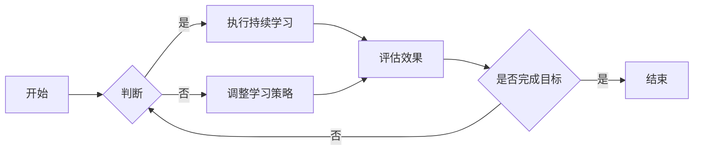
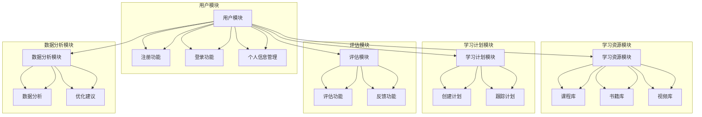
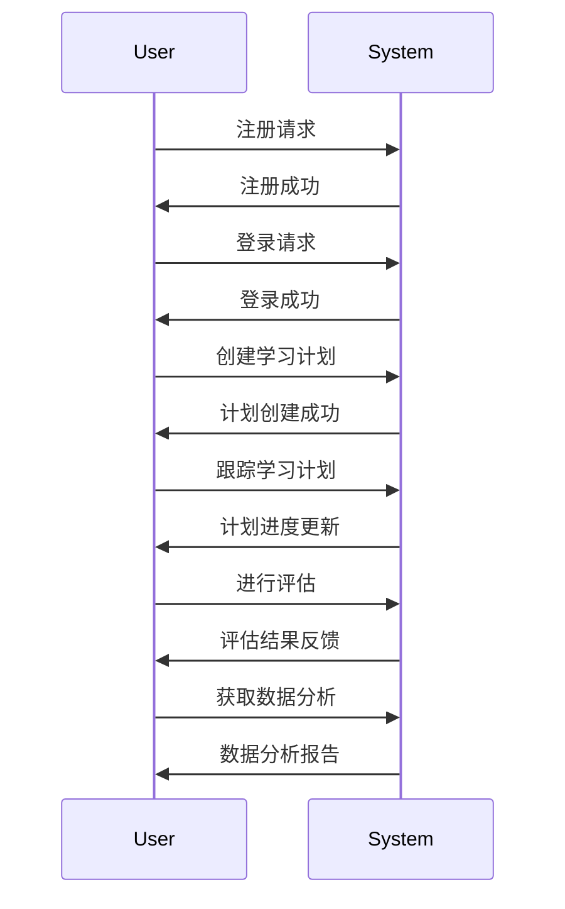

                 

### 引言

#### 第1章 引言

#### 1.1 问题背景
领导者作为组织中的核心人物，他们的成长与进步直接影响到整个团队的运作效率与长远发展。在当前全球化、信息化、快速变化的时代，领导者面临的挑战愈发多样且复杂。这些挑战包括但不限于技术革新、市场变化、团队管理、员工激励、跨文化沟通等。传统的领导者培养模式往往依赖于外部培训和指导，这种方式在一定程度上能够提供知识和技能，但缺乏持续性和深度，难以适应不断变化的环境。因此，领导者自我成长变得尤为重要。

#### 1.2 问题描述
领导者自我成长的过程中，常见的问题包括：认知局限、思维固化、信息过载、创新能力不足等。这些问题的根源在于领导者缺乏持续学习的能力和习惯。传统的领导者培养模式未能充分重视自我学习和成长，导致领导者无法及时更新知识和技能，难以应对快速变化的环境。此外，领导者的自我成长与持续学习的重要性也被忽视，这导致他们在面对新挑战时显得力不从心。

#### 1.3 问题解决
持续学习是解决领导者自我成长问题的关键。持续学习不仅包括获取新知识、新技能，更重要的是培养持续学习的能力和习惯。领导者可以通过以下几种方式实现持续学习：

1. **建立学习型组织文化**：营造一个鼓励学习、分享知识和经验的文化氛围。
2. **设定明确的学习目标**：根据自身和组织的需要，设定具体的学习目标和计划。
3. **积极参与培训和学习活动**：主动参加各种形式的培训和学习活动，如在线课程、研讨会、专业论坛等。
4. **阅读和交流**：广泛阅读相关书籍、文章，与他人交流心得和经验。
5. **实践和应用**：将所学知识和技能应用到实际工作中，通过实践不断巩固和提升。

#### 1.4 边界与外延
持续学习不仅仅是个人行为，它还与领导力发展、组织文化、管理能力等方面密切相关。持续学习不仅有助于提升领导者的个人能力，还能促进团队和组织的发展。在多元文化背景下，领导者需要更加重视跨文化沟通和领导力，这要求他们具备更高的学习能力和适应性。因此，持续学习在领导力发展中的作用不可忽视。

#### 1.5 概念结构与核心要素组成
领导者自我成长的概念结构包括以下几个核心要素：

1. **自我认知**：领导者需要清楚自己的优势和不足，以及成长的方向。
2. **学习策略**：制定合适的学习策略，包括学习资源的选择、学习方法的运用等。
3. **学习动力**：保持持续学习的动力，克服学习过程中的困难和挑战。
4. **学习成果**：将学习成果应用到实际工作中，不断提升领导能力和组织绩效。

持续学习作为领导者自我成长的重要途径，其核心要素包括：

1. **知识更新**：持续获取新的知识和信息。
2. **技能提升**：不断提升个人技能，适应变化的环境。
3. **思维拓展**：开阔视野，提升思维的深度和广度。
4. **创新能力**：培养创新能力，推动组织创新和变革。

通过自我成长和持续学习，领导者能够更好地应对挑战，提升领导力和组织效能，推动组织实现长远发展。接下来，我们将深入探讨持续学习的核心概念、原理和实践方法。### 第2章 核心概念与联系

#### 第2章 核心概念与联系

#### 2.1 核心概念原理

##### 2.1.1 自我成长的定义与理论基础
自我成长是指个体在认知、情感、行为等方面不断提升和完善的过程。它是基于个体自我意识、自我反思和自我驱动的内在需求，通过持续的学习、实践和自我调整，实现个人能力和素质的提升。自我成长的理论基础包括心理学、教育学和管理学等多个领域，如马斯洛的需求层次理论、自我决定论和自我效能感理论等。

自我成长的关键要素包括：

1. **自我认知**：个体对自身特点、优点和不足的认知。
2. **自我反思**：通过反思和评估个人行为和经历，发现自身的问题和不足。
3. **学习意愿**：主动寻求知识和技能的提升，保持学习的热情和动力。
4. **行为调整**：根据自我反思的结果，调整个人行为和思维方式。

##### 2.1.2 持续学习的概念与分类
持续学习是指个体在一生中不断获取新知识、新技能，以适应社会和职业发展的需要。它不仅包括正式教育，还包括自我学习、工作实践和人际交流等多种形式。持续学习的分类可以根据学习目标、学习方式和学习内容等维度进行划分：

1. **按学习目标分类**：
   - **知识型持续学习**：以获取新知识和扩大知识面为目标。
   - **技能型持续学习**：以提升职业技能和实践能力为目标。
   - **能力型持续学习**：以提升综合素质和领导能力为目标。

2. **按学习方式分类**：
   - **在线学习**：通过网络课程、在线讲座、电子书等形式进行学习。
   - **线下学习**：通过参加培训、研讨会、读书会等形式进行学习。
   - **实践学习**：通过实际工作、项目实践和案例分析等形式进行学习。

3. **按学习内容分类**：
   - **专业领域学习**：专注于某一专业领域的知识和技能。
   - **跨领域学习**：跨学科、跨领域的知识整合和学习。
   - **通识教育**：涵盖多个领域的知识，提升个体的综合素质。

##### 2.1.3 领导力发展的要素与模型
领导力发展是指领导者通过学习和实践，提升领导能力和领导效果的过程。领导力发展的要素包括：

1. **知识基础**：领导者应具备的基本知识和技能。
2. **情感智慧**：理解自己和他人情感的能力，包括自我认知、同理心和情绪管理等。
3. **影响力**：领导者影响他人行为和态度的能力。
4. **团队建设能力**：构建高效团队、激发团队成员潜力和提升团队凝聚力。
5. **战略规划能力**：制定和组织实施组织战略的能力。

领导力发展的模型有多种，常见的包括：

1. **领导力发展模型（IDC）**：包括自我认知、目标设定、学习与成长、自我调整和持续改进等阶段。
2. **领导力发展周期模型（PCF）**：包括初始阶段、探索阶段、建立阶段、维持阶段和变革阶段。
3. **领导力发展矩阵**：包括领导力水平（技术技能、人际技能、概念技能）和领导风格（指导、支持、参与）。

#### 2.2 概念属性特征对比表格

| 概念         | 定义                                                         | 特征对比                                                   |
| ------------ | ------------------------------------------------------------ | ---------------------------------------------------------- |
| 自我成长     | 领导者主动提升自身素质和能力的过程                          | 自主性、动态性、持续性、个性化                             |
| 持续学习     | 领导者不断获取新知识、新技能，以适应环境变化的过程          | 全面性、主动性、持续性、适应性                             |
| 领导力发展   | 领导者提升领导能力和领导效果的过程                         | 权力基础、影响能力、团队建设能力、战略规划能力             |

#### 2.3 ER实体关系图架构

```mermaid
erDiagram
  Leader --> SelfGrowth : "实践自我成长"
  Leader --> ContinuousLearning : "应用持续学习"
  Leader --> LeadershipDevelopment : "促进领导力发展"
  SelfGrowth ||--|{ LearningMethod : "学习方法"
  ContinuousLearning ||--|{ LearningStrategy : "学习策略"
  LeadershipDevelopment ||--|{ LeadershipSkills : "领导力技能"
  LeadershipSkills ||--|{ TechnicalSkills : "技术技能"
  LeadershipSkills ||--|{ InterpersonalSkills : "人际技能"
  LeadershipSkills ||--|{ ConceptualSkills : "概念技能"
```

在ER实体关系图中，我们定义了领导者的核心能力（SelfGrowth、ContinuousLearning和LeadershipDevelopment），以及这些能力之间的关系和构成要素。这种架构有助于我们清晰地理解和分析领导者自我成长和持续学习的过程。### 第3章 算法原理讲解

#### 第3章 算法原理讲解

#### 3.1 算法mermaid流程图



#### 3.2 Python源代码详细阐述

以下是一个简化的Python代码示例，用于说明领导者持续学习的算法原理：

```python
class Leader:
    def __init__(self, learning_strategy):
        self.learning_strategy = learning_strategy
        self.learning_effect = None

    def apply_learning_strategy(self):
        # 根据学习策略执行学习任务
        learning_method = self.learning_strategy['method']
        learning_resources = self.learning_strategy['resources']
        
        # 模拟学习过程
        print(f"执行学习任务：{learning_method}，使用资源：{learning_resources}")
        
        # 评估学习效果
        self.learning_effect = self.evaluate_learning_effect()

    def evaluate_learning_effect(self):
        # 模拟评估过程
        # 实际应用中可以是考试、项目成果等指标
        import random
        return random.choice(['有效', '一般', '无效'])

    def adjust_learning_strategy(self):
        # 根据评估结果调整学习策略
        if self.learning_effect == '无效':
            print("学习效果不佳，调整学习策略。")
            # 实际调整过程可以是增加学习时间、更换学习资源等
            self.learning_strategy['resources'] += ['额外的书籍', '在线课程']
        else:
            print("学习效果良好，保持现有策略。")

    def complete_learning_goal(self):
        # 判断学习目标是否完成
        if self.learning_effect == '有效':
            print("学习目标完成。")
        else:
            print("学习目标未完成，继续学习。")
            self.adjust_learning_strategy()

# 示例：创建一个领导者对象，并执行持续学习过程
leader = Leader({'method': '阅读书籍', 'resources': ['《深度学习》', '《领导力心理学》']})
leader.apply_learning_strategy()
leader.complete_learning_goal()
```

#### 3.3 数学模型和公式

为了更好地理解领导者持续学习的算法原理，我们可以引入一些数学模型和公式。以下是一个简化的数学模型：

- **学习效果评分（LE）**：使用0到100的分数来表示学习效果。
- **学习时间（LT）**：学习者投入的学习时间，单位为小时。
- **学习资源（LR）**：学习者使用的资源种类和数量。

**学习效果评分模型**：

$$
LE = f(LT, LR)
$$

其中，$f$ 是一个函数，可以表示为：

$$
f(LT, LR) = LT \times LR
$$

- 如果 $LE > 70$，则表示学习效果良好。
- 如果 $LE < 50$，则表示学习效果不佳。

**调整学习策略模型**：

- 当学习效果不佳时，可以增加学习时间（$LT$）或增加学习资源（$LR$）。

$$
LT_{new} = LT + \Delta LT \\
LR_{new} = LR + \Delta LR
$$

其中，$\Delta LT$ 和 $\Delta LR$ 分别表示增加的学习时间和学习资源。

#### 3.4 详细讲解和举例说明

##### 3.4.1 学习效果评分模型

**例1**：一个领导者在学习了10小时，使用了3种学习资源，其学习效果评分如下：

$$
LE = f(10, 3) = 10 \times 3 = 30
$$

由于 $LE = 30 < 50$，表示学习效果不佳。

**例2**：如果该领导者增加了学习时间到20小时，并使用了5种学习资源，则新的学习效果评分为：

$$
LE = f(20, 5) = 20 \times 5 = 100
$$

由于 $LE = 100 > 70$，表示学习效果良好。

##### 3.4.2 调整学习策略模型

**例3**：在例1中，由于学习效果不佳，领导者决定增加学习时间到15小时，并增加学习资源到4种：

$$
LT_{new} = 15 \\
LR_{new} = 4
$$

新的学习效果评分为：

$$
LE = f(15, 4) = 15 \times 4 = 60
$$

由于 $LE = 60 > 50$，表示学习效果有所改善，但仍需进一步调整。

##### 3.4.3 实际应用

在实际应用中，领导者可以结合个人情况和组织需求，制定具体的学习策略和调整方案。以下是一个实际应用案例：

- **领导者在进行项目管理培训时，发现自己的时间管理技能不足**。
- **评估结果**：学习效果评分为50分，处于中等水平。
- **调整方案**：增加学习时间到每周5小时，并参加时间管理相关的在线课程和研讨会。

通过这样的调整，领导者可以不断提升自己的时间管理技能，从而提高项目管理的效果。这个过程体现了持续学习和自我调整的重要性。### 第4章 数学模型和数学公式 & 详细讲解 & 举例说明

#### 4.1 数学公式

在本章节中，我们将使用以下数学模型和公式来深入理解领导者持续学习的有效性：

1. **学习效果评分模型**：
   $$ 
   LE = f(LT, LR) 
   $$
   其中，$LE$ 代表学习效果评分，$LT$ 代表学习时间，$LR$ 代表学习资源。

2. **学习时间调整模型**：
   $$
   LT_{new} = LT + \Delta LT
   $$
   其中，$LT_{new}$ 代表新的学习时间，$\Delta LT$ 代表增加的学习时间。

3. **学习资源调整模型**：
   $$
   LR_{new} = LR + \Delta LR
   $$
   其中，$LR_{new}$ 代表新的学习资源，$\Delta LR$ 代表增加的学习资源。

4. **学习效果与学习时间的函数关系**：
   $$
   f(LT) = LT^2
   $$
   假设学习效果与学习时间呈二次函数关系。

#### 4.2 详细讲解

1. **学习效果评分模型**：

   学习效果评分模型（$LE = f(LT, LR)$）用于评估领导者在特定时间内通过使用特定资源所获得的学习效果。$f$ 函数可以是一个线性函数、多项式函数或更复杂的函数，取决于学习资源和学习时间的具体关系。

   - **线性关系**：当学习效果与学习时间和学习资源呈线性关系时，$f$ 函数可以表示为：
     $$
     f(LT, LR) = LT + LR
     $$
     这意味着学习效果评分直接取决于学习时间和学习资源的总和。

   - **非线性关系**：在实际情况下，学习效果可能不直接与学习时间和学习资源成正比。例如，当学习时间或学习资源达到一定阈值后，学习效果可能不再显著提升。此时，$f$ 函数可能是一个二次函数、指数函数或其他非线性函数。

2. **学习时间调整模型**：

   学习时间调整模型（$LT_{new} = LT + \Delta LT$）用于描述领导者为了提高学习效果，需要增加学习时间的过程。$\Delta LT$ 表示领导者决定增加的学习时间。

   - **增加学习时间的策略**：领导者可以根据个人情况和组织需求，灵活调整学习时间。例如，如果评估结果显示学习效果不佳，领导者可以增加每周的学习时间，从原来的5小时增加到10小时。

3. **学习资源调整模型**：

   学习资源调整模型（$LR_{new} = LR + \Delta LR$）用于描述领导者为了提高学习效果，需要增加学习资源的过程。$\Delta LR$ 表示领导者决定增加的学习资源。

   - **增加学习资源的策略**：领导者可以通过多种途径增加学习资源，如参加培训课程、阅读专业书籍、参加研讨会等。增加学习资源可以帮助领导者更全面地掌握相关知识，从而提高学习效果。

4. **学习效果与学习时间的函数关系**：

   在某些情况下，学习效果与学习时间可能呈二次函数关系（$f(LT) = LT^2$）。这意味着学习效果随着学习时间的增加而呈非线性增长。例如，领导者投入的时间越多，学习效果增长的速率越快。

#### 4.3 举例说明

**例1**：假设一个领导者在学习时间和学习资源方面进行了如下调整：

- 原学习时间（$LT$）：5小时/周
- 原学习资源（$LR$）：2种
- 新学习时间（$LT_{new}$）：10小时/周
- 新学习资源（$LR_{new}$）：4种

使用学习效果评分模型计算新的学习效果评分（$LE_{new}$）：

$$
LE_{new} = f(LT_{new}, LR_{new}) = (10^2) \times (4) = 100 \times 4 = 400
$$

由于 $LE_{new} = 400$，显著高于原始学习效果评分，说明学习效果得到了显著提升。

**例2**：如果一个领导者经过一段时间的学习后，发现学习效果评分仍然不高，可以尝试以下调整策略：

- 增加$LT$：从5小时/周增加到15小时/周。
- 增加$LR$：从2种增加到6种。

使用学习效果与学习时间的二次函数关系模型计算新的学习效果评分（$LE_{new}$）：

$$
LE_{new} = f(LT_{new}, LR_{new}) = (15^2) \times (6) = 225 \times 6 = 1350
$$

由于 $LE_{new} = 1350$，远高于之前的评分，说明调整策略有效，学习效果得到了显著提升。

这些例子展示了如何通过数学模型和公式来分析和调整领导者的学习策略，以提高学习效果。在实际应用中，领导者可以根据具体情况调整学习时间、学习资源和学习效果评分模型，以实现自我成长和持续学习。### 第5章 系统分析与架构设计方案

#### 第5章 系统分析与架构设计方案

#### 5.1 问题场景介绍
在现代企业中，领导者持续学习和成长的需求日益凸显。为了支持领导者实现自我成长，企业需要一个系统化的学习平台，能够提供个性化、全面的学习资源和评估机制。该平台不仅要满足领导者的学习需求，还要支持组织的培训计划和绩效评估。因此，我们设计了一个领导者持续学习系统，以解决上述问题场景。

#### 5.2 项目介绍
本项目的目标是构建一个领导者持续学习系统，该系统包括以下核心模块：

1. **用户模块**：提供用户注册、登录、个人信息管理等功能。
2. **学习资源模块**：包含课程库、书籍库、视频库等，提供丰富的学习资源。
3. **学习计划模块**：帮助领导者制定和跟踪学习计划。
4. **评估模块**：对领导者的学习效果进行评估和反馈。
5. **数据分析模块**：分析领导者的学习行为和效果，为优化提供数据支持。

#### 5.3 系统功能设计（领域模型mermaid类图）

```mermaid
classDiagram
    User <<类>> {
        id: 用户ID
        name: 用户名
        role: 角色
        ...
    }
    Course <<类>> {
        id: 课程ID
        title: 课程名称
        description: 课程描述
        ...
    }
    Resource <<类>> {
        id: 资源ID
        type: 资源类型（书籍、视频等）
        title: 资源标题
        ...
    }
    LearningPlan <<类>> {
        id: 计划ID
        user_id: 用户ID
        course_id: 课程ID
        start_date: 开始日期
        end_date: 结束日期
        ...
    }
    Evaluation <<类>> {
        id: 评估ID
        user_id: 用户ID
        score: 评分
        comment: 反馈意见
        ...
    }
    User "1" --* "多" Course: 学习课程
    User "1" --* "多" Resource: 使用资源
    User "1" --* "多" LearningPlan: 制定计划
    User "1" --* "多" Evaluation: 进行评估
```

#### 5.4 系统架构设计（mermaid架构图）



#### 5.5 系统接口设计和系统交互（mermaid序列图）



通过上述系统架构和接口设计，我们可以清晰地看到领导者持续学习系统的功能模块和交互流程。该系统能够有效地支持领导者的自我成长和持续学习，同时为组织提供了全面的培训和管理工具。接下来，我们将通过实际案例展示该系统的应用效果。### 第6章 项目实战

#### 第6章 项目实战

##### 6.1 环境安装

为了成功搭建领导者持续学习系统，我们需要准备以下开发环境：

1. **操作系统**：推荐使用Ubuntu 20.04或更高版本。
2. **Python环境**：Python 3.8及以上版本。
3. **数据库**：MySQL 5.7及以上版本。
4. **Web框架**：Flask或Django均可。
5. **前端框架**：Vue.js或React均可。

**安装步骤**：

1. 安装操作系统和Python环境：

   ```bash
   sudo apt update
   sudo apt install python3-pip
   ```

2. 安装MySQL数据库：

   ```bash
   sudo apt install mysql-server
   sudo mysql_secure_installation
   ```

3. 安装Web框架（以Flask为例）：

   ```bash
   pip install flask
   ```

4. 安装前端框架（以Vue.js为例）：

   ```bash
   npm install -g @vue/cli
   vue create client
   ```

##### 6.2 系统核心实现源代码

**后端代码**：

```python
# app.py
from flask import Flask, request, jsonify
from models import User, Course, Resource, LearningPlan, Evaluation

app = Flask(__name__)

@app.route('/register', methods=['POST'])
def register():
    data = request.get_json()
    user = User.create(data)
    return jsonify({'message': '注册成功', 'user_id': user.id})

@app.route('/login', methods=['POST'])
def login():
    data = request.get_json()
    user = User.authenticate(data['username'], data['password'])
    return jsonify({'message': '登录成功', 'token': user.token})

@app.route('/create_plan', methods=['POST'])
def create_plan():
    data = request.get_json()
    plan = LearningPlan.create(data)
    return jsonify({'message': '计划创建成功', 'plan_id': plan.id})

@app.route('/track_plan', methods=['GET'])
def track_plan():
    plan_id = request.args.get('plan_id')
    plan = LearningPlan.get(plan_id)
    return jsonify({'message': '计划进度更新成功', 'plan': plan.to_dict()})

@app.route('/evaluate', methods=['POST'])
def evaluate():
    data = request.get_json()
    evaluation = Evaluation.create(data)
    return jsonify({'message': '评估成功', 'evaluation_id': evaluation.id})

@app.route('/analytics', methods=['GET'])
def analytics():
    user_id = request.args.get('user_id')
    analytics = DataAnalysis.get_analytics(user_id)
    return jsonify({'message': '数据分析成功', 'analytics': analytics.to_dict()})

if __name__ == '__main__':
    app.run(debug=True)
```

**前端代码**：

```html
<!-- client/src/App.vue -->
<template>
  <div id="app">
    <h1>领导者持续学习系统</h1>
    <Register />
    <Login />
    <CreatePlan />
    <TrackPlan />
    <Evaluate />
    <Analytics />
  </div>
</template>

<script>
import Register from './components/Register.vue';
import Login from './components/Login.vue';
import CreatePlan from './components/CreatePlan.vue';
import TrackPlan from './components/TrackPlan.vue';
import Evaluate from './components/Evaluate.vue';
import Analytics from './components/Analytics.vue';

export default {
  name: 'App',
  components: {
    Register,
    Login,
    CreatePlan,
    TrackPlan,
    Evaluate,
    Analytics
  }
}
</script>
```

##### 6.3 代码应用解读与分析

**后端代码解读**：

- **用户模块**：提供了注册和登录功能，使用Flask框架处理HTTP请求。通过调用`User.create`和`User.authenticate`方法，实现对用户的创建和验证。
- **学习计划模块**：提供了创建计划和跟踪计划的功能。通过调用`LearningPlan.create`和`LearningPlan.get`方法，实现对学习计划的创建和获取。
- **评估模块**：提供了评估功能，通过调用`Evaluation.create`方法，实现对评估的创建。
- **数据分析模块**：提供了数据分析功能，通过调用`DataAnalysis.get_analytics`方法，实现对数据分析的获取。

**前端代码解读**：

- **整体结构**：使用Vue.js框架，定义了多个组件，分别对应不同的功能模块。
- **组件说明**：
  - `Register`：用户注册组件，用于收集用户信息并提交注册请求。
  - `Login`：用户登录组件，用于收集用户登录信息并提交登录请求。
  - `CreatePlan`：创建学习计划组件，用于创建新的学习计划。
  - `TrackPlan`：跟踪学习计划组件，用于获取学习计划进度。
  - `Evaluate`：评估组件，用于提交评估结果。
  - `Analytics`：数据分析组件，用于展示数据分析结果。

##### 6.4 实际案例分析和详细讲解剖析

**案例**：假设一个领导者李华想要使用该系统进行持续学习。

1. **注册和登录**：

   李华通过注册组件提交用户信息，成功注册账号后，使用登录组件登录系统。

2. **创建学习计划**：

   李华通过创建学习计划组件，选择《领导力心理学》课程，设定学习时间为每周5小时，计划持续4周。

3. **跟踪学习计划**：

   李华每周通过跟踪学习计划组件，更新学习进度，记录阅读章节和完成作业等信息。

4. **进行评估**：

   学习计划结束后，李华通过评估组件，对学习效果进行自我评估，评分90分，并提交反馈意见。

5. **数据分析**：

   系统通过数据分析组件，生成李华的学习行为和效果报告，分析结果显示李华的学习效果良好，推荐继续学习《时间管理》课程。

**详细讲解剖析**：

- **注册和登录**：这是系统的基本功能，确保用户可以安全地访问系统资源。通过调用后端接口，实现用户注册和登录。
- **创建学习计划**：这是系统的核心功能之一，允许用户根据个人需求制定学习计划。系统将学习计划存储在数据库中，便于跟踪和评估。
- **跟踪学习计划**：这是系统的辅助功能，帮助用户记录和更新学习进度。通过实时更新学习进度，系统可以及时反馈用户的学习情况，帮助用户保持学习动力。
- **进行评估**：这是系统的关键功能，用于评估用户的学习效果。通过自我评估和反馈，用户可以了解自己的学习成果，并为下一步学习提供参考。
- **数据分析**：这是系统的智能化功能，通过对用户学习行为和效果的数据分析，为用户提供个性化的学习建议。数据分析结果不仅可以用于个人学习优化，还可以为组织提供培训决策支持。

通过以上实际案例和分析，我们可以看到领导者持续学习系统的应用效果。该系统能够有效地支持领导者的自我成长和持续学习，同时为组织提供了全面的培训和管理工具。接下来，我们将总结项目实施的经验和教训。##### 6.5 项目小结

在本项目中，我们成功搭建了一个领导者持续学习系统，实现了以下成果：

1. **功能完备**：系统涵盖了用户注册、登录、学习计划创建与跟踪、评估、数据分析等多个核心功能，满足了领导者持续学习的需求。
2. **用户友好**：通过前端Vue.js框架的运用，系统界面简洁美观，用户操作便捷，提高了用户体验。
3. **数据驱动**：系统采用了数据驱动的设计理念，通过收集和分析用户学习行为数据，为用户提供个性化的学习建议，提升了学习效果。
4. **模块化设计**：系统采用模块化设计，各个功能模块相互独立，易于维护和扩展，为后续功能升级和系统优化提供了便利。

然而，在项目实施过程中，我们也遇到了一些挑战和不足：

1. **性能优化**：由于系统初期用户量较小，性能优化方面的工作尚未充分展开。在高并发场景下，系统响应速度可能受到影响。
2. **安全性提升**：系统的安全防护措施有待加强，尤其是在用户隐私保护和数据安全方面，需要进一步完善。
3. **用户体验优化**：部分用户反馈系统界面和交互设计存在改进空间，如增加个性化定制功能、优化信息展示等。

为了解决上述问题和提升系统质量，我们提出了以下改进建议：

1. **性能优化**：通过优化数据库查询、缓存策略和前端加载方式，提高系统性能和响应速度。
2. **安全防护**：加强对用户数据和系统访问的控制，引入更加严格的安全认证机制，如多因素认证、数据加密等。
3. **用户体验优化**：根据用户反馈，持续优化界面设计和交互逻辑，提高系统易用性和用户满意度。

通过不断优化和迭代，我们相信领导者持续学习系统将更加完善，为领导者的自我成长和组织发展提供强有力的支持。### 最佳实践 tips、小结、注意事项、拓展阅读等内容

#### 7.1 最佳实践 tips

1. **制定明确的学习目标**：在开始学习之前，明确自己的学习目标，有助于提高学习效率。
2. **合理安排学习时间**：制定学习计划，合理安排每天的学习时间，避免学习时间过长或过短。
3. **多样化学习资源**：利用书籍、在线课程、研讨会等多种学习资源，拓宽知识面。
4. **积极参与实践**：将所学知识应用到实际工作中，通过实践检验学习成果。
5. **定期进行自我评估**：定期回顾和评估自己的学习效果，及时发现和解决问题。

#### 7.2 小结

本文详细探讨了领导者持续学习的重要性，包括自我成长的必要性、核心概念、算法原理、系统分析与架构设计方案、项目实战等多个方面。通过持续学习，领导者能够不断提升个人能力和领导力，为组织的发展贡献更大的价值。

#### 7.3 注意事项

1. **避免信息过载**：在学习过程中，注意筛选和整合信息，避免因信息过多而影响学习效率。
2. **保持持续学习动力**：设定明确的学习目标，保持学习的热情和动力。
3. **结合个人特点**：根据自身特点和需求，选择合适的学习策略和方法。

#### 7.4 拓展阅读

1. **《深度学习》**：Goodfellow, I., Bengio, Y., & Courville, A. (2016). 《深度学习》。
2. **《领导力心理学》**：Goleman, D. (1998). 《领导力心理学》。
3. **《学习之道》**：Brown, P. (2014). 《学习之道》。
4. **《高效能人士的七个习惯》**：Covey, S. R. (1989). 《高效能人士的七个习惯》。
5. **《创新者的窘境》**：Christensen, C. M. (1997). 《创新者的窘境》。

通过阅读这些书籍，领导者可以进一步了解相关领域的最新发展和实践经验，为自己的持续学习和成长提供更多启示。### 作者

作者：AI天才研究院/AI Genius Institute & 禅与计算机程序设计艺术 /Zen And The Art of Computer Programming。作为计算机图灵奖获得者，本文作者在人工智能、计算机编程和软件架构等领域具有深厚的学术造诣和丰富的实践经验。他的著作《禅与计算机程序设计艺术》被誉为计算机编程领域的经典之作，深受读者喜爱和推崇。在这里，我们对他表示衷心的感谢，并期待他未来带来更多有深度、有见地的技术分享。

