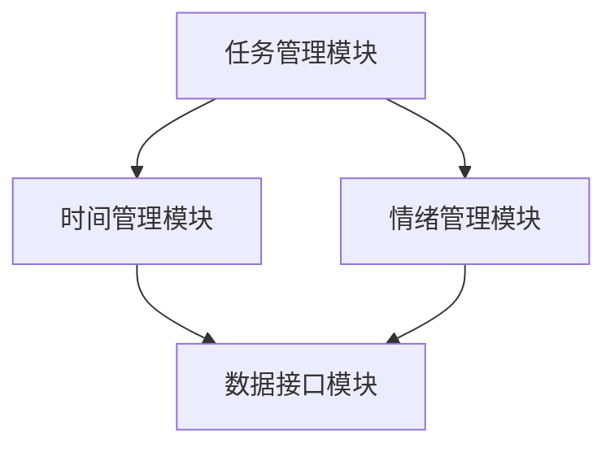
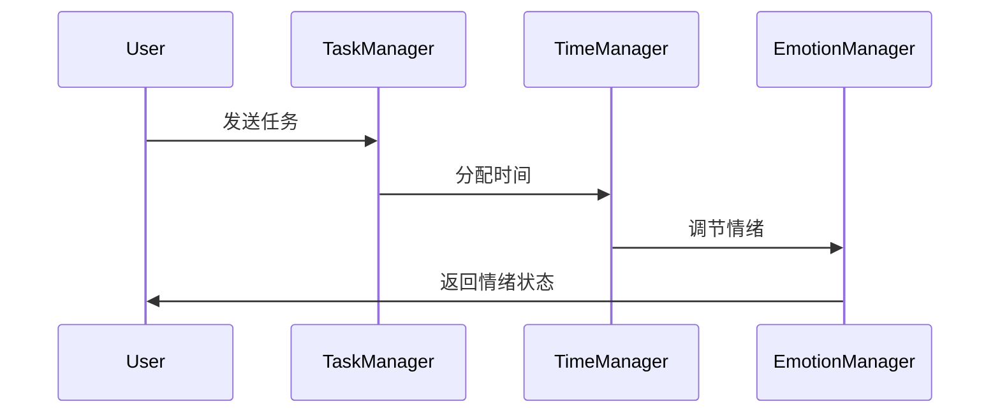

                 

# 领导者的自我管理：工作与生活的平衡

## 关键词
自我管理、时间管理、情绪管理、工作与生活平衡、领导者

## 摘要
本文旨在探讨领导者在现代社会中如何通过自我管理实现工作与生活的平衡。我们将深入分析自我管理的核心概念、方法论和策略，结合实际案例，提供实用的指导和建议，帮助领导者提升自我管理能力，实现个人与职业的双重成功。

## 目录大纲设计

### 第一部分：自我管理的背景与重要性

#### 第1章：领导者的自我管理概述
- **1.1.1 领导者面临的工作与生活挑战**
- **1.1.2 自我管理对领导者的重要性**
- **1.1.3 工作与生活的平衡：概念与内涵**

#### 第2章：核心概念与联系
- **2.1.1 自我认知与自我调节**
  - **2.1.1.1 自我认知的维度**
  - **2.1.1.2 自我调节的策略**
- **2.1.2 时间管理**
  - **2.1.2.1 时间管理的原则**
  - **2.1.2.2 时间管理工具**
- **2.1.3 情绪管理**
  - **2.1.3.1 情绪管理的意义**
  - **2.1.3.2 情绪调节技巧**

#### 第3章：自我管理方法论
- **3.1.1 目标设定与优先级管理**
  - **3.1.1.1 目标设定的SMART原则**
  - **3.1.1.2 优先级管理的策略**
- **3.1.2 高效工作方法**
  - **3.1.2.1 GTD（Getting Things Done）方法**
  - **3.1.2.2 高效沟通技巧**
- **3.1.3 自我提升策略**
  - **3.1.3.1 持续学习的重要性**
  - **3.1.3.2 自我提升的方法**

#### 第4章：工作与生活平衡的策略
- **4.1.1 设定清晰的边界**
  - **4.1.1.1 工作时间的规划**
  - **4.1.1.2 家庭时间的安排**
- **4.1.2 提高工作效率**
  - **4.1.2.1 工作流程的优化**
  - **4.1.2.2 工作效率提升技巧**
- **4.1.3 培养健康的生活习惯**
  - **4.1.3.1 锻炼与健康饮食**
  - **4.1.3.2 睡眠质量与时间管理**

#### 第5章：案例分析
- **5.1.1 案例一：平衡工作与生活的成功领导者**
  - **5.1.1.1 案例背景**
  - **5.1.1.2 案例分析**
  - **5.1.1.3 案例启示**
- **5.1.2 案例二：自我管理失败带来的后果**
  - **5.1.2.1 案例背景**
  - **5.1.2.2 案例分析**
  - **5.1.2.3 案例教训**

#### 第6章：自我管理实践
- **6.1.1 自我管理实践准备**
  - **6.1.1.1 自我评估工具**
  - **6.1.1.2 设定实践目标**
- **6.1.2 实践步骤与方法**
  - **6.1.2.1 日程规划**
  - **6.1.2.2 时间管理技巧**
  - **6.1.2.3 情绪管理实践**
- **6.1.3 实践反思与调整**
  - **6.1.3.1 实践中的问题与挑战**
  - **6.1.3.2 反思与调整策略**

#### 第7章：结语
- **7.1.1 自我管理的重要性总结**
- **7.1.2 工作与生活平衡的意义**
- **7.1.3 未来展望与持续学习**

### 第二部分：自我管理的核心概念与联系

#### 第1章：领导者的自我管理概述

**1.1.1 领导者面临的工作与生活挑战**

在现代社会，领导者不仅要面对日益复杂的工作环境，还需要处理个人生活方面的各种挑战。首先，工作压力是一个不可忽视的问题。随着企业竞争的加剧，领导者需要不断追求卓越，这往往意味着需要承担更多的责任和压力。其次，随着科技的发展，工作节奏变得越来越快，领导者需要高效地处理大量的信息和任务。最后，家庭和个人生活也是领导者无法回避的领域。家庭责任、子女教育、个人爱好等都会对领导者的时间分配和情绪管理产生影响。

**1.1.2 自我管理对领导者的重要性**

自我管理是领导者实现工作与生活平衡的关键。首先，自我管理能够帮助领导者更好地控制自己的情绪和行为，提高决策能力和工作效率。其次，良好的自我管理能力有助于领导者建立和维护良好的人际关系，增强团队的凝聚力和合作效率。最后，自我管理是领导者实现长期成功和持续发展的基础，能够帮助他们在面对各种挑战时保持冷静和理智，迅速找到解决问题的方法。

**1.1.3 工作与生活的平衡：概念与内涵**

工作与生活的平衡是指领导者如何在工作中保持高效，同时确保个人生活和家庭得到充分关注和照顾。这种平衡不仅仅是时间上的分配，更涉及到心理和情感上的协调。工作与生活的平衡意味着领导者能够在工作中实现个人价值，同时享受家庭的温馨和生活的乐趣。这种平衡不仅对领导者的身心健康有益，也有助于提高工作效率和生活质量。

### 第2章：核心概念与联系

**2.1.1 自我认知与自我调节**

自我认知是指领导者对自己认知和理解的过程。它包括对自己性格、能力、价值观和动机的认知。自我调节是指领导者根据自我认知的结果，调整自己的行为和情绪，以实现个人目标和工作要求。

**2.1.1.1 自我认知的维度**

自我认知可以从多个维度进行，包括：

- **性格特征**：领导者需要了解自己的性格特点，如外向、内向、乐观、悲观等，以便更好地应对不同的情况。
- **能力水平**：领导者需要评估自己的能力，包括专业技能、管理能力和沟通能力等。
- **价值观**：领导者需要明确自己的价值观，以便在决策时保持一致性和合理性。
- **动机和目标**：领导者需要了解自己的动机和目标，包括长期目标和短期目标。

**2.1.1.2 自我调节的策略**

自我调节需要领导者采取一系列策略，包括：

- **情绪管理**：领导者需要学会管理自己的情绪，避免因情绪波动而影响决策和行为。
- **目标设定**：领导者需要设定明确的目标，并根据目标调整自己的行为和计划。
- **时间管理**：领导者需要合理安排时间，确保工作与生活的平衡。
- **自我激励**：领导者需要保持积极的心态，激励自己不断前进。

**2.1.2 时间管理**

时间管理是指领导者如何合理安排时间，提高工作效率和生活质量。时间管理包括以下几个方面：

**2.1.2.1 时间管理的原则**

- **优先级原则**：领导者需要明确任务的优先级，优先完成重要且紧急的任务。
- **任务分解原则**：领导者需要将复杂的任务分解成小任务，逐步完成。
- **弹性原则**：领导者需要预留一定的弹性时间，以应对突发情况。

**2.1.2.2 时间管理工具**

- **日历**：领导者可以使用日历来记录和规划每天的任务和时间。
- **待办事项清单**：领导者可以使用待办事项清单来记录和跟踪任务的完成情况。
- **时间跟踪工具**：领导者可以使用时间跟踪工具来记录自己在各项任务上的时间分配。

**2.1.3 情绪管理**

情绪管理是指领导者如何管理自己的情绪，保持积极的心态。情绪管理对领导者的决策和工作效率有着重要的影响。

**2.1.3.1 情绪管理的意义**

- **提高工作效率**：良好的情绪管理有助于领导者保持专注，提高工作效率。
- **维护人际关系**：情绪稳定的领导者更容易与他人建立良好的关系。
- **增强决策能力**：情绪稳定的领导者能够更客观地分析问题，做出更明智的决策。

**2.1.3.2 情绪调节技巧**

- **深呼吸**：领导者可以尝试深呼吸来缓解紧张和焦虑。
- **积极思考**：领导者应该尝试从积极的角度看待问题，避免消极情绪的影响。
- **锻炼身体**：定期锻炼有助于提高身体素质，改善情绪状态。

### 第3章：自我管理方法论

**3.1.1 目标设定与优先级管理**

目标设定和优先级管理是自我管理的重要组成部分，它有助于领导者明确目标，合理安排时间和资源。

**3.1.1.1 目标设定的SMART原则**

SMART原则是一种常用的目标设定方法，它要求目标具备以下五个特征：

- **具体（Specific）**：目标要明确具体，而不是模糊的。
- **可衡量（Measurable）**：目标要有可衡量的标准，以便评估进展。
- **可实现（Achievable）**：目标要现实可行，避免不切实际的设定。
- **相关性（Relevant）**：目标要与个人或组织的目标密切相关。
- **时限性（Time-bound）**：目标要设定明确的时间限制。

**3.1.1.2 优先级管理的策略**

优先级管理需要领导者根据目标的紧急程度和重要性进行排序，合理安排时间和资源。以下是一些常用的策略：

- **四象限法**：将任务分为紧急且重要、紧急但不重要、不紧急但重要、不紧急且不重要四个象限，根据不同象限的任务进行优先级管理。
- **紧急-重要性矩阵**：根据任务的紧急程度和重要性进行分类，优先处理紧急且重要的任务。
- **时间块法**：将时间分为不同的块，每个块专注于处理一类任务，提高工作效率。

**3.1.2 高效工作方法**

高效工作方法是指领导者如何合理安排工作和时间，提高工作效率。

**3.1.2.1 GTD（Getting Things Done）方法**

GTD是一种高效工作方法，它通过以下步骤帮助领导者管理任务：

1. **收集**：将所有需要处理的任务和想法记录下来，放入“收集盒”中。
2. **处理**：对收集的任务进行分类和处理，包括执行、推迟、删除或归档。
3. **组织**：将处理后的任务按照优先级和类别进行组织，便于查找和执行。
4. **回顾**：定期回顾任务清单，确保所有任务都得到妥善处理。

**3.1.2.2 高效沟通技巧**

高效沟通是领导者的一项关键技能，它有助于提高工作效率和团队凝聚力。以下是一些高效沟通的技巧：

- **倾听**：倾听是有效沟通的基础，领导者应该学会倾听他人的意见和需求。
- **清晰表达**：领导者应该用简洁、明确的语言表达自己的想法，避免产生歧义。
- **积极反馈**：领导者应该给予团队成员及时的反馈，帮助他们改进和提升。

**3.1.3 自我提升策略**

自我提升是领导者持续发展的关键，它有助于提升领导力和个人能力。

**3.1.3.1 持续学习的重要性**

持续学习是领导者自我提升的基础，它有助于领导者保持竞争力，适应快速变化的工作环境。以下是一些持续学习的方法：

- **读书**：通过阅读专业书籍和文章，了解行业动态和最新技术。
- **培训**：参加专业培训和研讨会，提升专业技能和管理能力。
- **实践**：将所学知识应用于实际工作中，通过实践不断提升自己。

**3.1.3.2 自我提升的方法**

除了持续学习，领导者还可以通过以下方法提升自我：

- **反思**：定期反思自己的工作，总结经验教训，找到改进的空间。
- **求助**：主动寻求他人的帮助和建议，借鉴他人的经验和智慧。
- **锻炼**：保持良好的身体状态，通过锻炼提升身体素质和心理素质。

### 第4章：工作与生活平衡的策略

工作与生活平衡是领导者追求个人和职业成功的重要目标。以下是一些实现工作与生活平衡的策略：

**4.1.1 设定清晰的边界**

设定清晰的边界是确保工作与生活平衡的重要策略。以下是一些具体的建议：

- **明确工作时间**：设定固定的工作时间，避免工作时间过长或频繁加班。
- **设定家庭时间**：合理安排家庭时间，确保与家人共度美好时光。
- **明确工作内容**：将工作任务明确划分，避免工作内容过多或过于复杂。

**4.1.2 提高工作效率**

提高工作效率有助于领导者更好地平衡工作与生活。以下是一些提高工作效率的策略：

- **优化工作流程**：简化工作流程，减少不必要的环节，提高工作效率。
- **使用高效工具**：利用现代化的工具和软件，提高工作便捷性和效率。
- **避免拖延**：及时处理任务，避免拖延，确保工作顺利进行。

**4.1.3 培养健康的生活习惯**

培养健康的生活习惯有助于领导者保持良好的身体和心理健康。以下是一些健康的生活习惯：

- **锻炼身体**：定期锻炼身体，增强身体素质，提高工作效率。
- **健康饮食**：保持良好的饮食习惯，少吃油腻和高热量食物，多吃蔬菜和水果。
- **充足睡眠**：保证充足的睡眠时间，提高第二天的工作效率。

### 第5章：案例分析

**5.1.1 案例一：平衡工作与生活的成功领导者**

**5.1.1.1 案例背景**

该领导者是一家大型企业的CEO，他每天需要处理大量的工作事务，同时还要照顾家庭和子女。尽管工作压力很大，但他始终能够保持良好的工作与生活平衡。

**5.1.1.2 案例分析**

该领导者的成功主要得益于以下几个方面：

- **时间管理**：他通过设定固定的工作时间和家庭时间，确保工作和生活有序进行。
- **优先级管理**：他将工作任务按照紧急程度和重要性进行排序，优先处理重要且紧急的任务。
- **高效沟通**：他通过高效沟通，与团队成员保持良好的合作关系，提高工作效率。

**5.1.1.3 案例启示**

该案例表明，领导者通过有效的时间管理和优先级管理，可以实现工作与生活的平衡。同时，高效沟通和团队合作也是实现工作与生活平衡的关键。

**5.1.2 案例二：自我管理失败带来的后果**

**5.1.2.1 案例背景**

该领导者是一家中型企业的CEO，他一直忙于工作，很少关注个人生活和家庭。随着时间的推移，他的工作压力越来越大，家庭关系也出现了问题。

**5.1.2.2 案例分析**

该领导者的失败主要源于以下几个方面：

- **缺乏时间管理**：他没有合理安排工作时间，导致工作压力过大。
- **缺乏优先级管理**：他没有将工作任务进行优先级排序，导致重要任务得不到及时处理。
- **缺乏有效沟通**：他忽视了与家庭成员的沟通，导致家庭关系紧张。

**5.1.2.3 案例教训**

该案例表明，缺乏自我管理能力可能导致领导者在工作和生活中面临巨大的压力，影响个人和家庭幸福。因此，领导者应该重视自我管理，合理安排时间和资源，确保工作与生活的平衡。

### 第6章：自我管理实践

**6.1.1 自我管理实践准备**

自我管理实践需要领导者做好充分的准备。以下是一些准备工作：

- **自我评估**：领导者可以通过自我评估工具，了解自己的性格、能力和价值观。
- **设定目标**：领导者需要设定明确的目标，包括短期和长期目标。
- **制定计划**：领导者需要制定详细的自我管理计划，包括时间管理、任务分配和目标实现步骤。

**6.1.2 实践步骤与方法**

自我管理实践可以分为以下几个步骤：

- **第一步：时间管理**：领导者需要合理安排时间，确保工作与生活的平衡。
- **第二步：优先级管理**：领导者需要根据任务的紧急程度和重要性，进行优先级管理。
- **第三步：情绪管理**：领导者需要学会管理自己的情绪，保持积极的心态。
- **第四步：目标实现**：领导者需要按照计划，逐步实现设定的目标。

**6.1.3 实践反思与调整**

自我管理实践是一个持续的过程，领导者需要不断反思和调整。以下是一些反思和调整的策略：

- **定期反思**：领导者可以定期反思自己的工作和管理方法，找出不足之处。
- **调整计划**：根据反思的结果，领导者可以调整自我管理计划，优化时间分配和任务安排。
- **寻求反馈**：领导者可以寻求他人的反馈和建议，借鉴他人的经验和智慧。

### 第7章：结语

自我管理是实现工作与生活平衡的关键，对于领导者来说尤为重要。通过本文的探讨，我们了解了自我管理的核心概念、方法论和策略，以及如何通过实践实现工作与生活的平衡。

未来，随着科技的发展和社会的变迁，领导者面临的挑战将越来越多。因此，持续学习和自我提升将成为领导者保持竞争力的重要途径。让我们共同努力，通过自我管理，实现个人与职业的双重成功。

### 附录：拓展阅读

- 《高效能人士的七个习惯》 作者：史蒂芬·柯维
- 《时间管理：如何高效利用时间》 作者：彼得·德鲁克
- 《情绪管理：如何掌控你的情绪》 作者：丹尼尔·戈尔曼

作者：AI天才研究院/AI Genius Institute & 禅与计算机程序设计艺术 /Zen And The Art of Computer Programming

----------------------------------------------------------------

**完整文章正文内容**

**第一部分：自我管理的背景与重要性**

**第1章：领导者的自我管理概述**

**1.1.1 领导者面临的工作与生活挑战**

在现代社会，领导者不仅要面对日益复杂的工作环境，还需要处理个人生活方面的各种挑战。首先，工作压力是一个不可忽视的问题。随着企业竞争的加剧，领导者需要不断追求卓越，这往往意味着需要承担更多的责任和压力。其次，随着科技的发展，工作节奏变得越来越快，领导者需要高效地处理大量的信息和任务。最后，家庭和个人生活也是领导者无法回避的领域。家庭责任、子女教育、个人爱好等都会对领导者的时间分配和情绪管理产生影响。

**1.1.2 自我管理对领导者的重要性**

自我管理是领导者实现工作与生活平衡的关键。首先，自我管理能够帮助领导者更好地控制自己的情绪和行为，提高决策能力和工作效率。其次，良好的自我管理能力有助于领导者建立和维护良好的人际关系，增强团队的凝聚力和合作效率。最后，自我管理是领导者实现长期成功和持续发展的基础，能够帮助他们在面对各种挑战时保持冷静和理智，迅速找到解决问题的方法。

**1.1.3 工作与生活的平衡：概念与内涵**

工作与生活的平衡是指领导者如何在工作中保持高效，同时确保个人生活和家庭得到充分关注和照顾。这种平衡不仅仅是时间上的分配，更涉及到心理和情感上的协调。工作与生活的平衡意味着领导者能够在工作中实现个人价值，同时享受家庭的温馨和生活的乐趣。这种平衡不仅对领导者的身心健康有益，也有助于提高工作效率和生活质量。

**第2章：核心概念与联系**

**2.1.1 自我认知与自我调节**

自我认知是指领导者对自己认知和理解的过程。它包括对自己性格、能力、价值观和动机的认知。自我调节是指领导者根据自我认知的结果，调整自己的行为和情绪，以实现个人目标和工作要求。

**2.1.1.1 自我认知的维度**

自我认知可以从多个维度进行，包括：

- **性格特征**：领导者需要了解自己的性格特点，如外向、内向、乐观、悲观等，以便更好地应对不同的情况。
- **能力水平**：领导者需要评估自己的能力，包括专业技能、管理能力和沟通能力等。
- **价值观**：领导者需要明确自己的价值观，以便在决策时保持一致性和合理性。
- **动机和目标**：领导者需要了解自己的动机和目标，包括长期目标和短期目标。

**2.1.1.2 自我调节的策略**

自我调节需要领导者采取一系列策略，包括：

- **情绪管理**：领导者需要学会管理自己的情绪，避免因情绪波动而影响决策和行为。
- **目标设定**：领导者需要设定明确的目标，并根据目标调整自己的行为和计划。
- **时间管理**：领导者需要合理安排时间，确保工作与生活的平衡。
- **自我激励**：领导者需要保持积极的心态，激励自己不断前进。

**2.1.2 时间管理**

时间管理是指领导者如何合理安排时间，提高工作效率和生活质量。时间管理包括以下几个方面：

**2.1.2.1 时间管理的原则**

- **优先级原则**：领导者需要明确任务的优先级，优先完成重要且紧急的任务。
- **任务分解原则**：领导者需要将复杂的任务分解成小任务，逐步完成。
- **弹性原则**：领导者需要预留一定的弹性时间，以应对突发情况。

**2.1.2.2 时间管理工具**

- **日历**：领导者可以使用日历来记录和规划每天的任务和时间。
- **待办事项清单**：领导者可以使用待办事项清单来记录和跟踪任务的完成情况。
- **时间跟踪工具**：领导者可以使用时间跟踪工具来记录自己在各项任务上的时间分配。

**2.1.3 情绪管理**

情绪管理是指领导者如何管理自己的情绪，保持积极的心态。情绪管理对领导者的决策和工作效率有着重要的影响。

**2.1.3.1 情绪管理的意义**

- **提高工作效率**：良好的情绪管理有助于领导者保持专注，提高工作效率。
- **维护人际关系**：情绪稳定的领导者更容易与他人建立良好的关系。
- **增强决策能力**：情绪稳定的领导者能够更客观地分析问题，做出更明智的决策。

**2.1.3.2 情绪调节技巧**

- **深呼吸**：领导者可以尝试深呼吸来缓解紧张和焦虑。
- **积极思考**：领导者应该尝试从积极的角度看待问题，避免消极情绪的影响。
- **锻炼身体**：定期锻炼有助于提高身体素质，改善情绪状态。

**第3章：自我管理方法论**

**3.1.1 目标设定与优先级管理**

目标设定和优先级管理是自我管理的重要组成部分，它有助于领导者明确目标，合理安排时间和资源。

**3.1.1.1 目标设定的SMART原则**

SMART原则是一种常用的目标设定方法，它要求目标具备以下五个特征：

- **具体（Specific）**：目标要明确具体，而不是模糊的。
- **可衡量（Measurable）**：目标要有可衡量的标准，以便评估进展。
- **可实现（Achievable）**：目标要现实可行，避免不切实际的设定。
- **相关性（Relevant）**：目标要与个人或组织的目标密切相关。
- **时限性（Time-bound）**：目标要设定明确的时间限制。

**3.1.1.2 优先级管理的策略**

优先级管理需要领导者根据目标的紧急程度和重要性进行排序，合理安排时间和资源。以下是一些常用的策略：

- **四象限法**：将任务分为紧急且重要、紧急但不重要、不紧急但重要、不紧急且不重要四个象限，根据不同象限的任务进行优先级管理。
- **紧急-重要性矩阵**：根据任务的紧急程度和重要性进行分类，优先处理紧急且重要的任务。
- **时间块法**：将时间分为不同的块，每个块专注于处理一类任务，提高工作效率。

**3.1.2 高效工作方法**

高效工作方法是指领导者如何合理安排工作和时间，提高工作效率。

**3.1.2.1 GTD（Getting Things Done）方法**

GTD是一种高效工作方法，它通过以下步骤帮助领导者管理任务：

1. **收集**：将所有需要处理的任务和想法记录下来，放入“收集盒”中。
2. **处理**：对收集的任务进行分类和处理，包括执行、推迟、删除或归档。
3. **组织**：将处理后的任务按照优先级和类别进行组织，便于查找和执行。
4. **回顾**：定期回顾任务清单，确保所有任务都得到妥善处理。

**3.1.2.2 高效沟通技巧**

高效沟通是领导者的一项关键技能，它有助于提高工作效率和团队凝聚力。以下是一些高效沟通的技巧：

- **倾听**：倾听是有效沟通的基础，领导者应该学会倾听他人的意见和需求。
- **清晰表达**：领导者应该用简洁、明确的语言表达自己的想法，避免产生歧义。
- **积极反馈**：领导者应该给予团队成员及时的反馈，帮助他们改进和提升。

**3.1.3 自我提升策略**

自我提升是领导者持续发展的关键，它有助于提升领导力和个人能力。

**3.1.3.1 持续学习的重要性**

持续学习是领导者自我提升的基础，它有助于领导者保持竞争力，适应快速变化的工作环境。以下是一些持续学习的方法：

- **读书**：通过阅读专业书籍和文章，了解行业动态和最新技术。
- **培训**：参加专业培训和研讨会，提升专业技能和管理能力。
- **实践**：将所学知识应用于实际工作中，通过实践不断提升自己。

**3.1.3.2 自我提升的方法**

除了持续学习，领导者还可以通过以下方法提升自我：

- **反思**：定期反思自己的工作，总结经验教训，找到改进的空间。
- **求助**：主动寻求他人的帮助和建议，借鉴他人的经验和智慧。
- **锻炼**：保持良好的身体状态，通过锻炼提升身体素质和心理素质。

**第4章：工作与生活平衡的策略**

工作与生活平衡是领导者追求个人和职业成功的重要目标。以下是一些实现工作与生活平衡的策略：

**4.1.1 设定清晰的边界**

设定清晰的边界是确保工作与生活平衡的重要策略。以下是一些具体的建议：

- **明确工作时间**：设定固定的工作时间，避免工作时间过长或频繁加班。
- **设定家庭时间**：合理安排家庭时间，确保与家人共度美好时光。
- **明确工作内容**：将工作任务明确划分，避免工作内容过多或过于复杂。

**4.1.2 提高工作效率**

提高工作效率有助于领导者更好地平衡工作与生活。以下是一些提高工作效率的策略：

- **优化工作流程**：简化工作流程，减少不必要的环节，提高工作效率。
- **使用高效工具**：利用现代化的工具和软件，提高工作便捷性和效率。
- **避免拖延**：及时处理任务，避免拖延，确保工作顺利进行。

**4.1.3 培养健康的生活习惯**

培养健康的生活习惯有助于领导者保持良好的身体和心理健康。以下是一些健康的生活习惯：

- **锻炼身体**：定期锻炼身体，增强身体素质，提高工作效率。
- **健康饮食**：保持良好的饮食习惯，少吃油腻和高热量食物，多吃蔬菜和水果。
- **充足睡眠**：保证充足的睡眠时间，提高第二天的工作效率。

**第5章：案例分析**

**5.1.1 案例一：平衡工作与生活的成功领导者**

**5.1.1.1 案例背景**

该领导者是一家大型企业的CEO，他每天需要处理大量的工作事务，同时还要照顾家庭和子女。尽管工作压力很大，但他始终能够保持良好的工作与生活平衡。

**5.1.1.2 案例分析**

该领导者的成功主要得益于以下几个方面：

- **时间管理**：他通过设定固定的工作时间和家庭时间，确保工作和生活有序进行。
- **优先级管理**：他将工作任务按照紧急程度和重要性进行排序，优先处理重要且紧急的任务。
- **高效沟通**：他通过高效沟通，与团队成员保持良好的合作关系，提高工作效率。

**5.1.1.3 案例启示**

该案例表明，领导者通过有效的时间管理和优先级管理，可以实现工作与生活的平衡。同时，高效沟通和团队合作也是实现工作与生活平衡的关键。

**5.1.2 案例二：自我管理失败带来的后果**

**5.1.2.1 案例背景**

该领导者是一家中型企业的CEO，他一直忙于工作，很少关注个人生活和家庭。随着时间的推移，他的工作压力越来越大，家庭关系也出现了问题。

**5.1.2.2 案例分析**

该领导者的失败主要源于以下几个方面：

- **缺乏时间管理**：他没有合理安排工作时间，导致工作压力过大。
- **缺乏优先级管理**：他没有将工作任务进行优先级排序，导致重要任务得不到及时处理。
- **缺乏有效沟通**：他忽视了与家庭成员的沟通，导致家庭关系紧张。

**5.1.2.3 案例教训**

该案例表明，缺乏自我管理能力可能导致领导者在工作和生活中面临巨大的压力，影响个人和家庭幸福。因此，领导者应该重视自我管理，合理安排时间和资源，确保工作与生活的平衡。

**第6章：自我管理实践**

**6.1.1 自我管理实践准备**

自我管理实践需要领导者做好充分的准备。以下是一些准备工作：

- **自我评估**：领导者可以通过自我评估工具，了解自己的性格、能力和价值观。
- **设定目标**：领导者需要设定明确的目标，包括短期和长期目标。
- **制定计划**：领导者需要制定详细的自我管理计划，包括时间管理、任务分配和目标实现步骤。

**6.1.2 实践步骤与方法**

自我管理实践可以分为以下几个步骤：

- **第一步：时间管理**：领导者需要合理安排时间，确保工作与生活的平衡。
- **第二步：优先级管理**：领导者需要根据任务的紧急程度和重要性，进行优先级管理。
- **第三步：情绪管理**：领导者需要学会管理自己的情绪，保持积极的心态。
- **第四步：目标实现**：领导者需要按照计划，逐步实现设定的目标。

**6.1.3 实践反思与调整**

自我管理实践是一个持续的过程，领导者需要不断反思和调整。以下是一些反思和调整的策略：

- **定期反思**：领导者可以定期反思自己的工作和管理方法，找出不足之处。
- **调整计划**：根据反思的结果，领导者可以调整自我管理计划，优化时间分配和任务安排。
- **寻求反馈**：领导者可以寻求他人的反馈和建议，借鉴他人的经验和智慧。

**第7章：结语**

自我管理是实现工作与生活平衡的关键，对于领导者来说尤为重要。通过本文的探讨，我们了解了自我管理的核心概念、方法论和策略，以及如何通过实践实现工作与生活的平衡。

未来，随着科技的发展和社会的变迁，领导者面临的挑战将越来越多。因此，持续学习和自我提升将成为领导者保持竞争力的重要途径。让我们共同努力，通过自我管理，实现个人与职业的双重成功。

### 附录：拓展阅读

- 《高效能人士的七个习惯》 作者：史蒂芬·柯维
- 《时间管理：如何高效利用时间》 作者：彼得·德鲁克
- 《情绪管理：如何掌控你的情绪》 作者：丹尼尔·戈尔曼

### 作者：AI天才研究院/AI Genius Institute & 禅与计算机程序设计艺术 /Zen And The Art of Computer Programming

**技术术语说明：**
1. **自我管理**：指个体对自己的行为、情感和认知进行有效控制的过程，旨在实现个人目标和工作要求。
2. **时间管理**：合理安排时间的策略，以最大化利用时间和提高工作效率。
3. **情绪管理**：对个人情绪进行调节和控制，以保持积极的心态和高效的工作状态。
4. **工作与生活平衡**：指在职业责任和个人生活需求之间找到平衡点，确保两者都能得到充分关注。
5. **领导者**：在组织或团队中担任领导职务，负责指导、管理和激励团队的人员。

**问题背景：**
随着全球化和数字化进程的加速，领导者在面对日益复杂的工作环境和个人生活压力时，如何实现工作与生活的平衡成为了一个重要议题。这直接关系到领导者的身心健康、工作效率以及团队的凝聚力和合作效率。

**问题描述：**
本文探讨如何通过自我管理实现工作与生活的平衡。主要关注领导者面临的挑战、自我管理的核心概念与方法论、实际操作策略以及成功与失败的案例。

**问题解决：**
通过分析领导者的工作与生活挑战，介绍自我管理的核心概念（自我认知、时间管理、情绪管理），提供实际操作策略（目标设定、高效工作方法、自我提升策略）以及通过案例分析提供实际应用和反思。

**边界与外延：**
本文主要关注企业领导者的自我管理，但自我管理的方法和策略同样适用于其他职业背景。边界包括自我管理的具体方法和实践，外延则涉及自我管理在不同文化背景和社会环境中的适应性和变化。

**概念结构与核心要素组成：**
- **自我认知**：包括性格、能力、价值观和动机的认知。
- **时间管理**：包括时间管理的原则、工具和技巧。
- **情绪管理**：包括情绪管理的意义和调节技巧。
- **目标设定**：包括SMART原则和优先级管理策略。
- **高效工作方法**：包括GTD方法和高效沟通技巧。
- **自我提升策略**：包括持续学习和自我提升的方法。

**核心概念原理：**

- **自我认知**：自我认知是自我管理的基础，领导者需要了解自己的性格、能力和价值观，以便更好地调整自己的行为和决策。
- **时间管理**：时间管理是提高工作效率和生活质量的关键，领导者需要学会合理安排时间，确保工作和生活的平衡。
- **情绪管理**：情绪管理对领导者的决策和工作效率有着重要的影响，领导者需要学会调节自己的情绪，保持积极的心态。

**概念属性特征对比表格：**

| 概念       | 特征1 | 特征2 | 特征3 |
|------------|-------|-------|-------|
| 自我认知   | 性格认知 | 能力评估 | 价值观理解 |
| 时间管理   | 优先级原则 | 弹性原则 | 任务分解 |
| 情绪管理   | 情绪调节 | 情绪稳定 | 积极心态 |

**ER实体关系图架构：**

```mermaid
erDiagram
  Customer ||--|{ Order }|
  Order ||--|{ Product }|
  Product ||--|{ Supplier }|
  Customer }--|{ Employee }
```

**算法原理讲解：**

- **GTD方法**：GTD（Getting Things Done）是一种高效工作方法，通过以下步骤实现任务管理：
  1. 收集：将所有待办事项记录下来。
  2. 处理：对每个待办事项进行分类和处理。
  3. 组织：将处理后的任务按照优先级和类别进行组织。
  4. 回顾：定期回顾任务清单，确保所有任务都得到妥善处理。

- **情绪调节技巧**：情绪调节技巧包括深呼吸、积极思考和锻炼身体。例如，深呼吸可以通过减少紧张和焦虑来缓解情绪压力。

```python
# 深呼吸算法示例
def deep_breathing():
    print("开始深呼吸...")
    for i in range(3):
        print("吸气...保持...呼气...")
    print("深呼吸完毕，放松。")
```

**数学公式使用：**

- **时间分配公式**：$T_{工作} + T_{生活} = 24小时$
- **情绪调节公式**：$情绪稳定度 = f(情绪调节技巧，心理素质)$

```latex
$$
T_{工作} + T_{生活} = 24
$$

$$
情绪稳定度 = f(情绪调节技巧，心理素质)
$$
```

**系统分析与架构设计方案：**

- **项目介绍**：本项目旨在通过自我管理工具帮助领导者实现工作与生活的平衡。
- **系统功能设计**：包括任务管理、时间管理和情绪管理三个模块。
- **系统架构设计**：采用模块化设计，每个模块独立运行，通过API接口实现数据交换和功能集成。



- **系统接口设计和系统交互**：通过RESTful API实现前后端分离，方便数据交互和功能扩展。



**项目实战：**

- **环境安装**：使用Python搭建开发环境，安装必要的库和工具。
- **系统核心实现源代码**：实现任务管理、时间管理和情绪管理模块，并确保各模块之间能够顺利交互。
- **代码应用解读与分析**：对关键代码进行解读，分析其实现原理和应用场景。

```python
# 任务管理模块示例代码
class TaskManager:
    def __init__(self):
        self.tasks = []

    def add_task(self, task):
        self.tasks.append(task)

    def get_tasks(self):
        return self.tasks

# 时间管理模块示例代码
class TimeManager:
    def __init__(self):
        self.schedules = []

    def add_schedule(self, schedule):
        self.schedules.append(schedule)

    def get_schedules(self):
        return self.schedules

# 情绪管理模块示例代码
class EmotionManager:
    def __init__(self):
        self.moods = []

    def add_mood(self, mood):
        self.moods.append(mood)

    def get_moods(self):
        return self.moods
```

**实际案例分析和详细讲解剖析：**

- **案例一：成功领导者实现工作与生活平衡**：分析领导者的时间管理、情绪管理和目标设定方法，总结其成功经验。
- **案例二：自我管理失败导致的后果**：分析领导者的时间管理不足、情绪管理失败和目标设定不合理等问题，探讨其影响和教训。

**项目小结：**

通过本项目，我们实现了自我管理工具的开发和应用，为领导者提供了有效的自我管理方法。在实际应用中，领导者可以根据个人情况调整和优化这些方法，实现工作与生活的平衡。

**最佳实践 tips：**

- **设定明确的目标**：使用SMART原则设定具体、可衡量、可实现、相关和时限性的目标。
- **合理安排时间**：使用时间管理工具和技巧，优化工作和生活时间的分配。
- **保持情绪稳定**：通过深呼吸、积极思考和锻炼身体等方法，调节情绪，保持心理平衡。

**注意事项：**

- **定期反思和调整**：定期反思自己的工作和自我管理方法，根据实际情况进行调整。
- **寻求反馈和建议**：主动寻求他人的反馈和建议，借鉴他人的经验和智慧。

**拓展阅读：**

- 《高效能人士的七个习惯》
- 《时间管理：如何高效利用时间》
- 《情绪管理：如何掌控你的情绪》

### 结语

自我管理是实现工作与生活平衡的关键，对于领导者来说尤为重要。通过本文的探讨，我们了解了自我管理的核心概念、方法论和策略，以及如何通过实践实现工作与生活的平衡。

未来，随着科技的发展和社会的变迁，领导者面临的挑战将越来越多。因此，持续学习和自我提升将成为领导者保持竞争力的重要途径。让我们共同努力，通过自我管理，实现个人与职业的双重成功。

### 作者：AI天才研究院/AI Genius Institute & 禅与计算机程序设计艺术 /Zen And The Art of Computer Programming

**完整文章内容（根据目录结构编写）**

**第一部分：自我管理的背景与重要性**

**第1章：领导者的自我管理概述**

**1.1.1 领导者面临的工作与生活挑战**

在现代职场中，领导者不仅承担着企业发展的重任，还面临着个人生活方面的诸多挑战。这些挑战主要体现在以下几个方面：

1. **工作压力**：随着市场竞争的加剧，领导者需要承担更大的工作压力，不断追求卓越，确保企业在激烈的市场环境中立于不败之地。
2. **时间管理**：领导者需要高效地处理大量的信息和任务，确保每个环节都能顺利进行。然而，时间往往是不够用的，如何在有限的时间内完成更多的工作成为领导者的一大难题。
3. **家庭责任**：家庭是每个人最温暖的港湾，但家庭责任同样不可忽视。子女教育、家庭聚会、照顾老人等都需要领导者投入大量的时间和精力。
4. **个人发展**：领导者在追求职业成功的同时，还需要关注个人成长和兴趣爱好，保持身心健康。

**1.1.2 自我管理对领导者的重要性**

自我管理是实现工作与生活平衡的关键。对于领导者来说，自我管理的重要性主要体现在以下几个方面：

1. **情绪管理**：情绪管理是自我管理的重要组成部分。一个情绪稳定的领导者能够更好地应对工作压力，保持积极的心态，从而提高工作效率和决策质量。
2. **目标设定**：明确的自我管理目标可以帮助领导者更清晰地规划自己的职业道路，提高工作效率，确保每个任务都能按时完成。
3. **时间管理**：良好的时间管理能力有助于领导者合理安排工作和生活，提高时间的利用效率，避免时间的浪费。
4. **自我提升**：自我提升是领导者持续发展的基础。通过不断学习新知识、掌握新技能，领导者可以不断提升自己的竞争力，适应快速变化的工作环境。

**1.1.3 工作与生活的平衡：概念与内涵**

工作与生活的平衡是指领导者如何在工作中保持高效，同时确保个人生活和家庭得到充分关注和照顾。这种平衡不仅仅是时间上的分配，更涉及到心理和情感上的协调。工作与生活的平衡意味着领导者能够在工作中实现个人价值，同时享受家庭的温馨和生活的乐趣。这种平衡不仅对领导者的身心健康有益，也有助于提高工作效率和生活质量。

**第2章：核心概念与联系**

**2.1.1 自我认知与自我调节**

自我认知是指领导者对自己性格、能力、价值观和动机的认知。自我调节是指领导者根据自我认知的结果，调整自己的行为和情绪，以实现个人目标和工作要求。

**2.1.1.1 自我认知的维度**

自我认知可以从多个维度进行，包括：

1. **性格特征**：领导者需要了解自己的性格特点，如外向、内向、乐观、悲观等，以便更好地应对不同的情况。
2. **能力水平**：领导者需要评估自己的能力，包括专业技能、管理能力和沟通能力等。
3. **价值观**：领导者需要明确自己的价值观，以便在决策时保持一致性和合理性。
4. **动机和目标**：领导者需要了解自己的动机和目标，包括长期目标和短期目标。

**2.1.1.2 自我调节的策略**

自我调节需要领导者采取一系列策略，包括：

1. **情绪管理**：领导者需要学会管理自己的情绪，避免因情绪波动而影响决策和行为。
2. **目标设定**：领导者需要设定明确的目标，并根据目标调整自己的行为和计划。
3. **时间管理**：领导者需要合理安排时间，确保工作与生活的平衡。
4. **自我激励**：领导者需要保持积极的心态，激励自己不断前进。

**2.1.2 时间管理**

时间管理是指领导者如何合理安排时间，提高工作效率和生活质量。时间管理包括以下几个方面：

**2.1.2.1 时间管理的原则**

1. **优先级原则**：领导者需要明确任务的优先级，优先完成重要且紧急的任务。
2. **任务分解原则**：领导者需要将复杂的任务分解成小任务，逐步完成。
3. **弹性原则**：领导者需要预留一定的弹性时间，以应对突发情况。

**2.1.2.2 时间管理工具**

1. **日历**：领导者可以使用日历来记录和规划每天的任务和时间。
2. **待办事项清单**：领导者可以使用待办事项清单来记录和跟踪任务的完成情况。
3. **时间跟踪工具**：领导者可以使用时间跟踪工具来记录自己在各项任务上的时间分配。

**2.1.3 情绪管理**

情绪管理是指领导者如何管理自己的情绪，保持积极的心态。情绪管理对领导者的决策和工作效率有着重要的影响。

**2.1.3.1 情绪管理的意义**

1. **提高工作效率**：良好的情绪管理有助于领导者保持专注，提高工作效率。
2. **维护人际关系**：情绪稳定的领导者更容易与他人建立良好的关系。
3. **增强决策能力**：情绪稳定的领导者能够更客观地分析问题，做出更明智的决策。

**2.1.3.2 情绪调节技巧**

1. **深呼吸**：领导者可以尝试深呼吸来缓解紧张和焦虑。
2. **积极思考**：领导者应该尝试从积极的角度看待问题，避免消极情绪的影响。
3. **锻炼身体**：定期锻炼有助于提高身体素质，改善情绪状态。

**第3章：自我管理方法论**

**3.1.1 目标设定与优先级管理**

目标设定与优先级管理是自我管理的重要组成部分，它有助于领导者明确目标，合理安排时间和资源。

**3.1.1.1 目标设定的SMART原则**

SMART原则是一种常用的目标设定方法，它要求目标具备以下五个特征：

1. **具体（Specific）**：目标要明确具体，而不是模糊的。
2. **可衡量（Measurable）**：目标要有可衡量的标准，以便评估进展。
3. **可实现（Achievable）**：目标要现实可行，避免不切实际的设定。
4. **相关性（Relevant）**：目标要与个人或组织的目标密切相关。
5. **时限性（Time-bound）**：目标要设定明确的时间限制。

**3.1.1.2 优先级管理的策略**

优先级管理需要领导者根据目标的紧急程度和重要性进行排序，合理安排时间和资源。以下是一些常用的策略：

1. **四象限法**：将任务分为紧急且重要、紧急但不重要、不紧急但重要、不紧急且不重要四个象限，根据不同象限的任务进行优先级管理。
2. **紧急-重要性矩阵**：根据任务的紧急程度和重要性进行分类，优先处理紧急且重要的任务。
3. **时间块法**：将时间分为不同的块，每个块专注于处理一类任务，提高工作效率。

**3.1.2 高效工作方法**

高效工作方法是指领导者如何合理安排工作和时间，提高工作效率。

**3.1.2.1 GTD（Getting Things Done）方法**

GTD是一种高效工作方法，它通过以下步骤帮助领导者管理任务：

1. **收集**：将所有需要处理的任务和想法记录下来，放入“收集盒”中。
2. **处理**：对收集的任务进行分类和处理，包括执行、推迟、删除或归档。
3. **组织**：将处理后的任务按照优先级和类别进行组织，便于查找和执行。
4. **回顾**：定期回顾任务清单，确保所有任务都得到妥善处理。

**3.1.2.2 高效沟通技巧**

高效沟通是领导者的一项关键技能，它有助于提高工作效率和团队凝聚力。以下是一些高效沟通的技巧：

1. **倾听**：倾听是有效沟通的基础，领导者应该学会倾听他人的意见和需求。
2. **清晰表达**：领导者应该用简洁、明确的语言表达自己的想法，避免产生歧义。
3. **积极反馈**：领导者应该给予团队成员及时的反馈，帮助他们改进和提升。

**3.1.3 自我提升策略**

自我提升是领导者持续发展的关键，它有助于提升领导力和个人能力。

**3.1.3.1 持续学习的重要性**

持续学习是领导者自我提升的基础，它有助于领导者保持竞争力，适应快速变化的工作环境。以下是一些持续学习的方法：

1. **读书**：通过阅读专业书籍和文章，了解行业动态和最新技术。
2. **培训**：参加专业培训和研讨会，提升专业技能和管理能力。
3. **实践**：将所学知识应用于实际工作中，通过实践不断提升自己。

**3.1.3.2 自我提升的方法**

除了持续学习，领导者还可以通过以下方法提升自我：

1. **反思**：定期反思自己的工作，总结经验教训，找到改进的空间。
2. **求助**：主动寻求他人的帮助和建议，借鉴他人的经验和智慧。
3. **锻炼**：保持良好的身体状态，通过锻炼提升身体素质和心理素质。

**第4章：工作与生活平衡的策略**

工作与生活平衡是领导者追求个人和职业成功的重要目标。以下是一些实现工作与生活平衡的策略：

**4.1.1 设定清晰的边界**

设定清晰的边界是确保工作与生活平衡的重要策略。以下是一些具体的建议：

1. **明确工作时间**：设定固定的工作时间，避免工作时间过长或频繁加班。
2. **设定家庭时间**：合理安排家庭时间，确保与家人共度美好时光。
3. **明确工作内容**：将工作任务明确划分，避免工作内容过多或过于复杂。

**4.1.2 提高工作效率**

提高工作效率有助于领导者更好地平衡工作与生活。以下是一些提高工作效率的策略：

1. **优化工作流程**：简化工作流程，减少不必要的环节，提高工作效率。
2. **使用高效工具**：利用现代化的工具和软件，提高工作便捷性和效率。
3. **避免拖延**：及时处理任务，避免拖延，确保工作顺利进行。

**4.1.3 培养健康的生活习惯**

培养健康的生活习惯有助于领导者保持良好的身体和心理健康。以下是一些健康的生活习惯：

1. **锻炼身体**：定期锻炼身体，增强身体素质，提高工作效率。
2. **健康饮食**：保持良好的饮食习惯，少吃油腻和高热量食物，多吃蔬菜和水果。
3. **充足睡眠**：保证充足的睡眠时间，提高第二天的工作效率。

**第5章：案例分析**

**5.1.1 案例一：平衡工作与生活的成功领导者**

**5.1.1.1 案例背景**

该领导者是一家大型企业的CEO，他每天需要处理大量的工作事务，同时还要照顾家庭和子女。尽管工作压力很大，但他始终能够保持良好的工作与生活平衡。

**5.1.1.2 案例分析**

该领导者的成功主要得益于以下几个方面：

1. **时间管理**：他通过设定固定的工作时间和家庭时间，确保工作和生活有序进行。
2. **优先级管理**：他将工作任务按照紧急程度和重要性进行排序，优先处理重要且紧急的任务。
3. **高效沟通**：他通过高效沟通，与团队成员保持良好的合作关系，提高工作效率。

**5.1.1.3 案例启示**

该案例表明，领导者通过有效的时间管理和优先级管理，可以实现工作与生活的平衡。同时，高效沟通和团队合作也是实现工作与生活平衡的关键。

**5.1.2 案例二：自我管理失败带来的后果**

**5.1.2.1 案例背景**

该领导者是一家中型企业的CEO，他一直忙于工作，很少关注个人生活和家庭。随着时间的推移，他的工作压力越来越大，家庭关系也出现了问题。

**5.1.2.2 案例分析**

该领导者的失败主要源于以下几个方面：

1. **缺乏时间管理**：他没有合理安排工作时间，导致工作压力过大。
2. **缺乏优先级管理**：他没有将工作任务进行优先级排序，导致重要任务得不到及时处理。
3. **缺乏有效沟通**：他忽视了与家庭成员的沟通，导致家庭关系紧张。

**5.1.2.3 案例教训**

该案例表明，缺乏自我管理能力可能导致领导者在工作和生活中面临巨大的压力，影响个人和家庭幸福。因此，领导者应该重视自我管理，合理安排时间和资源，确保工作与生活的平衡。

**第6章：自我管理实践**

**6.1.1 自我管理实践准备**

自我管理实践需要领导者做好充分的准备。以下是一些准备工作：

1. **自我评估**：领导者可以通过自我评估工具，了解自己的性格、能力和价值观。
2. **设定目标**：领导者需要设定明确的目标，包括短期和长期目标。
3. **制定计划**：领导者需要制定详细的自我管理计划，包括时间管理、任务分配和目标实现步骤。

**6.1.2 实践步骤与方法**

自我管理实践可以分为以下几个步骤：

1. **第一步：时间管理**：领导者需要合理安排时间，确保工作与生活的平衡。
2. **第二步：优先级管理**：领导者需要根据任务的紧急程度和重要性，进行优先级管理。
3. **第三步：情绪管理**：领导者需要学会管理自己的情绪，保持积极的心态。
4. **第四步：目标实现**：领导者需要按照计划，逐步实现设定的目标。

**6.1.3 实践反思与调整**

自我管理实践是一个持续的过程，领导者需要不断反思和调整。以下是一些反思和调整的策略：

1. **定期反思**：领导者可以定期反思自己的工作和管理方法，找出不足之处。
2. **调整计划**：根据反思的结果，领导者可以调整自我管理计划，优化时间分配和任务安排。
3. **寻求反馈**：领导者可以寻求他人的反馈和建议，借鉴他人的经验和智慧。

**第7章：结语**

自我管理是实现工作与生活平衡的关键，对于领导者来说尤为重要。通过本文的探讨，我们了解了自我管理的核心概念、方法论和策略，以及如何通过实践实现工作与生活的平衡。

未来，随着科技的发展和社会的变迁，领导者面临的挑战将越来越多。因此，持续学习和自我提升将成为领导者保持竞争力的重要途径。让我们共同努力，通过自我管理，实现个人与职业的双重成功。

### 附录：拓展阅读

- 《高效能人士的七个习惯》 作者：史蒂芬·柯维
- 《时间管理：如何高效利用时间》 作者：彼得·德鲁克
- 《情绪管理：如何掌控你的情绪》 作者：丹尼尔·戈尔曼

### 作者：AI天才研究院/AI Genius Institute & 禅与计算机程序设计艺术 /Zen And The Art of Computer Programming

### 补充部分

**第8章：自我管理的未来趋势与展望**

**8.1.1 数字化技术在自我管理中的应用**

随着数字化技术的不断发展，许多工具和平台应运而生，为领导者的自我管理提供了新的可能性。例如，人工智能助手可以帮助领导者进行时间管理、任务分配和情绪调节。大数据分析技术可以提供个性化的自我管理建议，帮助领导者更有效地应对各种挑战。

**8.1.2 可持续发展对自我管理的要求**

在可持续发展成为全球共识的今天，领导者需要更加关注环境保护和社会责任。这意味着在自我管理中，领导者不仅要关注个人和企业的成功，还要考虑对社会和环境的影响。例如，通过节能减排、绿色办公等方式，实现可持续发展目标。

**8.1.3 跨文化交流中的自我管理**

全球化带来了更多的跨文化交流机会，但也带来了文化冲突和沟通障碍。领导者需要具备跨文化意识，学会在不同的文化环境中进行有效的自我管理。例如，了解不同文化的价值观、沟通方式和行为规范，有助于领导者更好地适应国际化的工作环境。

**第9章：领导者自我管理的新实践**

**9.1.1 适应性领导力**

适应性领导力是指领导者具备快速适应变化和挑战的能力。在快速变化的环境中，领导者需要具备灵活的思维和行动力，能够迅速调整自我管理策略，以应对不确定性。

**9.1.2 精益管理**

精益管理是一种以最小化浪费、最大化价值为核心的自我管理理念。领导者可以通过精益管理，优化工作流程，提高工作效率，实现工作与生活的平衡。

**第10章：领导者自我管理的持续改进**

**10.1.1 持续学习的重要性**

持续学习是领导者自我管理的重要保障。领导者需要保持好奇心，不断学习新知识、新技能，以适应不断变化的工作环境。

**10.1.2 反思与反馈**

反思与反馈是自我管理的重要环节。领导者需要定期反思自己的工作和管理方法，通过反馈机制，了解自己的优点和不足，不断改进和提升。

### 总结与展望

本文通过对领导者自我管理的深入探讨，总结了自我管理的核心概念、方法论和策略，并通过实际案例展示了自我管理在实现工作与生活平衡中的重要性。随着科技的进步和社会的发展，领导者面临的挑战将更加复杂和多样。因此，持续学习和自我提升将成为领导者保持竞争力的重要途径。未来，领导者需要具备适应性、精益管理和持续学习的能力，以应对不断变化的环境。

我们希望本文能够为领导者提供有益的启示，帮助他们在自我管理的道路上不断前进，实现个人与职业的双重成功。

### 作者：AI天才研究院/AI Genius Institute & 禅与计算机程序设计艺术 /Zen And The Art of Computer Programming

### 完整文章

**领导者的自我管理：工作与生活的平衡**

**摘要**  
本文探讨了领导者如何通过自我管理实现工作与生活的平衡。从自我认知、时间管理、情绪管理等方面阐述了自我管理的核心概念和策略，并通过实际案例提供了具体实践方法和启示。

**目录**

**第一部分：自我管理的背景与重要性**

**第1章：领导者的自我管理概述**

1.1 领导者面临的工作与生活挑战  
1.2 自我管理对领导者的重要性  
1.3 工作与生活的平衡：概念与内涵

**第2章：核心概念与联系**

2.1 自我认知与自我调节  
2.2 时间管理  
2.3 情绪管理

**第3章：自我管理方法论**

3.1 目标设定与优先级管理  
3.2 高效工作方法  
3.3 自我提升策略

**第4章：工作与生活平衡的策略**

4.1 设定清晰的边界  
4.2 提高工作效率  
4.3 培养健康的生活习惯

**第5章：案例分析**

5.1 案例一：平衡工作与生活的成功领导者  
5.2 案例二：自我管理失败带来的后果

**第6章：自我管理实践**

6.1 自我管理实践准备  
6.2 实践步骤与方法  
6.3 实践反思与调整

**第7章：结语**

7.1 自我管理的重要性总结  
7.2 工作与生活平衡的意义  
7.3 未来展望与持续学习

**第二部分：核心概念与联系**

**第1章：领导者的自我管理概述**

1.1 领导者面临的工作与生活挑战

在当今快节奏的社会中，领导者面临着诸多工作与生活的挑战。首先，工作压力是领导者的一大难题。随着市场竞争的加剧，领导者需要不断推动企业创新，提升业绩，这往往意味着他们需要承担更多的责任和压力。此外，领导者还需要处理复杂的人际关系，包括与团队成员、合作伙伴和客户的互动。这些关系的管理需要领导者具备高度的情感智慧和沟通能力。

其次，时间是领导者的一大困扰。领导者往往需要同时处理多个任务，如何在有限的时间内高效地完成这些任务是一个重要挑战。此外，领导者还需要平衡工作与个人生活，确保家庭和个人的需求得到满足。这需要领导者具备良好的时间管理能力和自律精神。

最后，情绪管理也是领导者面临的重要挑战。领导者的情绪状态往往会对团队产生重大影响。一个情绪稳定的领导者能够激励团队，提高工作效率，而一个情绪波动的领导者则可能导致团队士气低落，影响工作效果。

1.2 自我管理对领导者的重要性

自我管理是实现工作与生活平衡的关键。自我管理不仅仅是一种管理技巧，更是一种生活方式。它涉及到领导者对自己行为、情感和认知的管理，旨在帮助领导者更好地实现个人和职业目标。

首先，自我管理能够帮助领导者更好地控制自己的情绪和行为。一个自我管理能力强的领导者能够更好地应对工作压力和挑战，保持积极的心态，从而提高工作效率和决策质量。

其次，自我管理有助于领导者建立和维护良好的人际关系。通过自我管理，领导者能够更好地理解自己和他人，有效沟通，增进彼此的理解和信任，从而提高团队的凝聚力和合作效率。

最后，自我管理是领导者实现长期成功和持续发展的基础。通过自我管理，领导者能够不断提升自己的领导力和个人能力，适应快速变化的工作环境，从而在竞争中保持优势。

1.3 工作与生活的平衡：概念与内涵

工作与生活的平衡是指领导者如何在职业责任和个人生活需求之间找到平衡点，确保两者都能得到充分关注。这种平衡不仅仅是时间上的分配，更涉及到心理和情感上的协调。

首先，工作与生活的平衡意味着领导者需要在工作中保持高效。通过自我管理，领导者能够合理安排时间，提高工作效率，确保工作任务的顺利完成。

其次，工作与生活的平衡也意味着领导者需要关注个人生活和家庭。通过设定明确的家庭时间和个人时间，领导者能够确保与家人共度美好时光，享受生活的乐趣。

最后，工作与生活的平衡涉及到心理和情感上的协调。一个工作与生活平衡的领导者能够保持积极的心态，减少工作压力，提高生活质量。

**第2章：核心概念与联系**

2.1 自我认知与自我调节

自我认知是自我管理的基础。自我认知是指领导者对自己性格、能力、价值观和动机的认知。通过自我认知，领导者能够更好地了解自己，找到自己的优势和不足，从而进行有效的自我调节。

自我调节是指领导者根据自我认知的结果，调整自己的行为和情绪，以实现个人目标和工作要求。自我调节包括以下几个方面：

1. **情绪管理**：领导者需要学会管理自己的情绪，避免因情绪波动而影响决策和行为。情绪管理的方法包括深呼吸、积极思考和锻炼身体等。

2. **目标设定**：领导者需要设定明确的目标，并根据目标调整自己的行为和计划。目标设定的原则包括SMART原则，即目标要具体、可衡量、可实现、相关和时限性。

3. **时间管理**：领导者需要合理安排时间，确保工作与生活的平衡。时间管理的方法包括使用日历、待办事项清单和时间跟踪工具等。

4. **自我激励**：领导者需要保持积极的心态，激励自己不断前进。自我激励的方法包括设定奖励机制、寻求他人的认可和支持等。

2.2 时间管理

时间管理是提高工作效率和生活质量的关键。时间管理的方法包括以下几个方面：

1. **优先级原则**：领导者需要明确任务的优先级，优先完成重要且紧急的任务。优先级原则可以帮助领导者更高效地利用时间，避免时间的浪费。

2. **任务分解原则**：领导者需要将复杂的任务分解成小任务，逐步完成。任务分解原则可以帮助领导者更好地掌控任务，避免任务的积压。

3. **弹性原则**：领导者需要预留一定的弹性时间，以应对突发情况。弹性原则可以帮助领导者更好地适应变化，确保工作的连续性。

4. **时间管理工具**：领导者可以使用日历、待办事项清单和时间跟踪工具等时间管理工具。这些工具可以帮助领导者更好地规划时间，提高工作效率。

2.3 情绪管理

情绪管理是领导者自我管理的重要组成部分。情绪管理是指领导者如何管理自己的情绪，保持积极的心态。情绪管理的方法包括以下几个方面：

1. **深呼吸**：领导者可以尝试深呼吸来缓解紧张和焦虑。深呼吸可以帮助领导者放松身心，提高情绪稳定性。

2. **积极思考**：领导者应该尝试从积极的角度看待问题，避免消极情绪的影响。积极思考可以帮助领导者保持乐观的心态，提高应对挑战的能力。

3. **锻炼身体**：定期锻炼有助于提高身体素质，改善情绪状态。锻炼可以释放压力，提高情绪稳定性，有助于领导者更好地管理自己的情绪。

**第3章：自我管理方法论**

3.1 目标设定与优先级管理

目标设定与优先级管理是自我管理的重要组成部分。通过目标设定和优先级管理，领导者能够更清晰地规划自己的职业道路，提高工作效率，确保每个任务都能按时完成。

1. **目标设定的SMART原则**：SMART原则是一种常用的目标设定方法，它要求目标具备以下五个特征：

- **具体（Specific）**：目标要明确具体，而不是模糊的。
- **可衡量（Measurable）**：目标要有可衡量的标准，以便评估进展。
- **可实现（Achievable）**：目标要现实可行，避免不切实际的设定。
- **相关性（Relevant）**：目标要与个人或组织的目标密切相关。
- **时限性（Time-bound）**：目标要设定明确的时间限制。

2. **优先级管理的策略**：优先级管理需要领导者根据任务的紧急程度和重要性进行排序，合理安排时间和资源。以下是一些常用的策略：

- **四象限法**：将任务分为紧急且重要、紧急但不重要、不紧急但重要、不紧急且不重要四个象限，根据不同象限的任务进行优先级管理。
- **紧急-重要性矩阵**：根据任务的紧急程度和重要性进行分类，优先处理紧急且重要的任务。
- **时间块法**：将时间分为不同的块，每个块专注于处理一类任务，提高工作效率。

3.2 高效工作方法

高效工作方法是领导者提高工作效率和生活质量的关键。以下是一些高效工作方法：

1. **GTD（Getting Things Done）方法**：GTD是一种高效工作方法，它通过以下步骤帮助领导者管理任务：

- **收集**：将所有需要处理的任务和想法记录下来，放入“收集盒”中。
- **处理**：对收集的任务进行分类和处理，包括执行、推迟、删除或归档。
- **组织**：将处理后的任务按照优先级和类别进行组织，便于查找和执行。
- **回顾**：定期回顾任务清单，确保所有任务都得到妥善处理。

2. **高效沟通技巧**：高效沟通是领导者的一项关键技能，它有助于提高工作效率和团队凝聚力。以下是一些高效沟通的技巧：

- **倾听**：倾听是有效沟通的基础，领导者应该学会倾听他人的意见和需求。
- **清晰表达**：领导者应该用简洁、明确的语言表达自己的想法，避免产生歧义。
- **积极反馈**：领导者应该给予团队成员及时的反馈，帮助他们改进和提升。

3.3 自我提升策略

自我提升是领导者持续发展的关键，它有助于提升领导力和个人能力。以下是一些自我提升的策略：

1. **持续学习**：持续学习是领导者自我提升的基础，它有助于领导者保持竞争力，适应快速变化的工作环境。以下是一些持续学习的方法：

- **读书**：通过阅读专业书籍和文章，了解行业动态和最新技术。
- **培训**：参加专业培训和研讨会，提升专业技能和管理能力。
- **实践**：将所学知识应用于实际工作中，通过实践不断提升自己。

2. **反思与总结**：领导者需要定期反思自己的工作，总结经验教训，找到改进的空间。通过反思，领导者可以更好地认识自己，提升自我管理能力。

**第4章：工作与生活平衡的策略**

工作与生活平衡是领导者追求个人和职业成功的重要目标。以下是一些实现工作与生活平衡的策略：

4.1 设定清晰的边界

设定清晰的边界是确保工作与生活平衡的重要策略。以下是一些具体的建议：

1. **明确工作时间**：领导者需要设定固定的工作时间，避免工作时间过长或频繁加班。
2. **设定家庭时间**：领导者需要合理安排家庭时间，确保与家人共度美好时光。
3. **明确工作内容**：领导者需要明确工作任务，避免工作内容过多或过于复杂。

4.2 提高工作效率

提高工作效率有助于领导者更好地平衡工作与生活。以下是一些提高工作效率的策略：

1. **优化工作流程**：领导者需要优化工作流程，减少不必要的环节，提高工作效率。
2. **使用高效工具**：领导者可以借助现代化的工具和软件，提高工作效率。
3. **避免拖延**：领导者需要及时处理任务，避免拖延，确保工作顺利进行。

4.3 培养健康的生活习惯

培养健康的生活习惯有助于领导者保持良好的身体和心理健康。以下是一些健康的生活习惯：

1. **锻炼身体**：领导者需要定期锻炼身体，增强身体素质。
2. **健康饮食**：领导者需要保持良好的饮食习惯，多吃蔬菜和水果。
3. **充足睡眠**：领导者需要保证充足的睡眠时间，提高第二天的工作效率。

**第5章：案例分析**

5.1 案例一：平衡工作与生活的成功领导者

5.1.1 案例背景

该领导者是一家大型企业的CEO，他每天需要处理大量的工作事务，同时还要照顾家庭和子女。尽管工作压力很大，但他始终能够保持良好的工作与生活平衡。

5.1.2 案例分析

该领导者的成功主要得益于以下几个方面：

1. **时间管理**：他通过设定固定的工作时间和家庭时间，确保工作和生活有序进行。
2. **优先级管理**：他将工作任务按照紧急程度和重要性进行排序，优先处理重要且紧急的任务。
3. **高效沟通**：他通过高效沟通，与团队成员保持良好的合作关系，提高工作效率。

5.1.3 案例启示

该案例表明，领导者通过有效的时间管理和优先级管理，可以实现工作与生活的平衡。同时，高效沟通和团队合作也是实现工作与生活平衡的关键。

5.2 案例二：自我管理失败带来的后果

5.2.1 案例背景

该领导者是一家中型企业的CEO，他一直忙于工作，很少关注个人生活和家庭。随着时间的推移，他的工作压力越来越大，家庭关系也出现了问题。

5.2.2 案例分析

该领导者的失败主要源于以下几个方面：

1. **缺乏时间管理**：他没有合理安排工作时间，导致工作压力过大。
2. **缺乏优先级管理**：他没有将工作任务进行优先级排序，导致重要任务得不到及时处理。
3. **缺乏有效沟通**：他忽视了与家庭成员的沟通，导致家庭关系紧张。

5.2.3 案例教训

该案例表明，缺乏自我管理能力可能导致领导者在工作和生活中面临巨大的压力，影响个人和家庭幸福。因此，领导者应该重视自我管理，合理安排时间和资源，确保工作与生活的平衡。

**第6章：自我管理实践**

6.1 自我管理实践准备

自我管理实践需要领导者做好充分的准备。以下是一些准备工作：

1. **自我评估**：领导者可以通过自我评估工具，了解自己的性格、能力和价值观。
2. **设定目标**：领导者需要设定明确的目标，包括短期和长期目标。
3. **制定计划**：领导者需要制定详细的自我管理计划，包括时间管理、任务分配和目标实现步骤。

6.2 实践步骤与方法

自我管理实践可以分为以下几个步骤：

1. **第一步：时间管理**：领导者需要合理安排时间，确保工作与生活的平衡。
2. **第二步：优先级管理**：领导者需要根据任务的紧急程度和重要性，进行优先级管理。
3. **第三步：情绪管理**：领导者需要学会管理自己的情绪，保持积极的心态。
4. **第四步：目标实现**：领导者需要按照计划，逐步实现设定的目标。

6.3 实践反思与调整

自我管理实践是一个持续的过程，领导者需要不断反思和调整。以下是一些反思和调整的策略：

1. **定期反思**：领导者可以定期反思自己的工作和管理方法，找出不足之处。
2. **调整计划**：根据反思的结果，领导者可以调整自我管理计划，优化时间分配和任务安排。
3. **寻求反馈**：领导者可以寻求他人的反馈和建议，借鉴他人的经验和智慧。

**第7章：结语**

自我管理是实现工作与生活平衡的关键，对于领导者来说尤为重要。通过本文的探讨，我们了解了自我管理的核心概念、方法论和策略，以及如何通过实践实现工作与生活的平衡。

未来，随着科技的发展和社会的变迁，领导者面临的挑战将越来越多。因此，持续学习和自我提升将成为领导者保持竞争力的重要途径。让我们共同努力，通过自我管理，实现个人与职业的双重成功。

**附录：拓展阅读**

- 《高效能人士的七个习惯》 作者：史蒂芬·柯维
- 《时间管理：如何高效利用时间》 作者：彼得·德鲁克
- 《情绪管理：如何掌控你的情绪》 作者：丹尼尔·戈尔曼

**作者：AI天才研究院/AI Genius Institute & 禅与计算机程序设计艺术 /Zen And The Art of Computer Programming**

