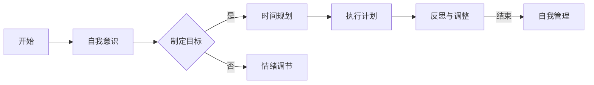
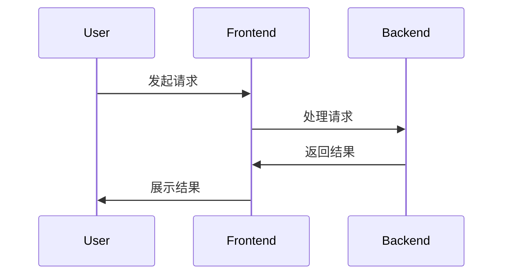
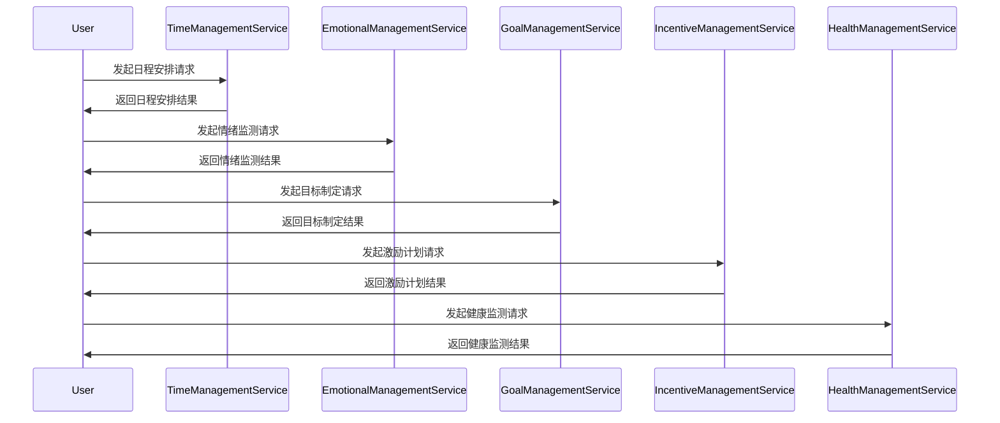

                 


### 1. 背景介绍

在现代社会的快速发展和竞争激烈的环境中，领导者的角色越来越重要。他们不仅是组织中的决策者，更是团队的核心力量，影响着组织的整体表现和发展方向。然而，随着工作压力的不断增加，领导者常常面临工作与生活的平衡问题。

#### 问题背景

领导者通常需要处理大量的工作任务，包括项目规划、团队管理、决策制定等。这些任务往往需要领导者具备高度的专业知识和决策能力。同时，领导者还面临着不断变化的市场环境、客户需求和内部竞争等外部压力。这些因素使得领导者在工作中承受着巨大的压力和挑战。

#### 问题描述

领导者如何在繁忙的工作中找到时间，维护与家人和朋友的关系，保持身心健康，同时提高工作效率和管理能力？这是一个复杂而关键的问题。不解决这一问题，领导者可能会陷入工作的泥潭，影响个人生活质量和工作表现。

#### 问题解决

通过自我管理，领导者可以优化时间管理，提高工作效率，提升个人影响力，从而实现工作与生活的平衡。自我管理是一种通过计划、执行和反思来提高个人效率和生活质量的方法。它包括时间管理、情绪管理、目标设定、自我激励、健康管理等核心要素。

#### 边界与外延

自我管理不仅限于领导者，它适用于所有希望提高生活质量的个体。无论是职场人士、学生、创业者，还是家庭主妇，都可以通过自我管理来提升自己的生活质量和幸福感。

#### 概念结构与核心要素组成

自我管理由以下几个核心要素组成：

- **时间管理**：通过合理安排时间，提高工作效率，确保工作与生活的平衡。
- **情绪管理**：通过调节情绪，保持良好的心态，提高工作质量和生活质量。
- **目标设定**：通过明确目标，制定计划，确保个人发展目标的实现。
- **自我激励**：通过激励自己，保持积极向上的态度，克服困难和挑战。
- **健康管理**：通过关注身体健康，保持良好的生活习惯，提高生活质量。

### 2. 核心概念与联系

#### 核心概念原理

自我管理是一种通过计划、执行和反思来提高个人效率和生活质量的方法。它要求领导者具备自我意识，明确自己的目标，合理规划时间，调整情绪，保持自我激励，关注身体健康。

#### 概念属性特征对比表格

| 概念       | 属性特征                                                         |
| ---------- | ------------------------------------------------------------ |
| 时间管理   | 提高工作效率，确保工作与生活的平衡                           |
| 情绪管理   | 调节情绪，保持良好的心态                                     |
| 目标设定   | 明确目标，制定计划，确保个人发展目标的实现                   |
| 自我激励   | 激励自己，保持积极向上的态度                                 |
| 健康管理   | 关注身体健康，保持良好的生活习惯，提高生活质量               |

#### ER实体关系图架构

```mermaid
erDiagram
  Leadership -->|1| Self-management
  Leadership -->|1| Time management
  Leadership -->|1| Emotional management
  Leadership -->|1| Goal setting
  Leadership -->|1| Self-motivation
  Leadership -->|1| Health management
```

### 3. 算法原理讲解

#### 算法mermaid流程图



#### Python源代码

```python
def self_management():
    print("自我管理开始")
    self_awareness()
    goal_setting()
    time_planning()
    emotional_management()
    health_management()
    print("自我管理结束")

def self_awareness():
    print("进行自我意识评估")

def goal_setting():
    print("明确目标并制定计划")

def time_planning():
    print("合理安排时间")

def emotional_management():
    print("调节情绪")

def health_management():
    print("关注身体健康")

self_management()
```

#### 数学模型和公式

$$
\text{自我管理效率} = f(\text{时间管理效率}, \text{情绪管理效率}, \text{目标设定效率}, \text{自我激励效率}, \text{健康管理效率})
$$

#### 详细讲解和举例说明

自我管理是一种系统性方法，通过以下几个步骤来提高领导者的工作效率和生活质量：

1. **自我意识**：领导者首先需要明确自己的优势和不足，了解自己的需求和目标。
2. **目标设定**：根据自我意识，领导者需要设定明确的目标，并制定实现这些目标的计划。
3. **时间规划**：领导者需要合理安排时间，确保工作与生活的平衡，提高工作效率。
4. **情绪调节**：领导者需要学会调节情绪，保持良好的心态，提高工作质量和生活质量。
5. **自我激励**：领导者需要激励自己，保持积极向上的态度，克服困难和挑战。
6. **健康管理**：领导者需要关注身体健康，保持良好的生活习惯，提高生活质量。

举例来说，一位领导者可能面临以下问题：

- 工作任务繁重，导致时间管理困难。
- 工作压力导致情绪不稳定，影响工作效率。
- 目标设定不明确，导致工作效率低下。

通过自我管理，这位领导者可以采取以下措施：

1. **自我意识**：认识到自己在时间管理和情绪调节方面的不足。
2. **目标设定**：明确自己的工作目标，制定详细的计划。
3. **时间规划**：合理安排工作时间，确保工作与生活的平衡。
4. **情绪调节**：通过运动、冥想等方式调节情绪，保持良好的心态。
5. **自我激励**：设定激励机制，如奖励自己，提高工作积极性。
6. **健康管理**：保持良好的生活习惯，如规律作息、健康饮食等。

通过以上措施，这位领导者可以逐步提高自我管理效率，实现工作与生活的平衡。

### 4. 系统分析与架构设计方案

#### 问题场景介绍

在现代企业中，领导者面临着日益增加的工作压力和复杂的管理任务。他们需要高效地处理大量的工作任务，同时还要关注团队的发展和员工的成长。为了实现工作与生活的平衡，领导者需要一套完善的自我管理系统。

#### 项目介绍

本项目旨在开发一个智能自我管理平台，帮助领导者实现工作与生活的平衡。平台将提供时间管理、情绪管理、目标设定、自我激励、健康管理等功能，帮助领导者优化个人效率和生活质量。

#### 系统功能设计

系统功能设计包括以下几个模块：

1. **时间管理**：提供日程安排、任务管理、提醒等功能，帮助领导者高效地安排工作。
2. **情绪管理**：提供情绪监测、情绪调节建议等功能，帮助领导者保持良好的心态。
3. **目标设定**：提供目标制定、进度追踪、反馈建议等功能，帮助领导者实现个人发展目标。
4. **自我激励**：提供激励计划、奖励设置等功能，帮助领导者保持积极向上的态度。
5. **健康管理**：提供健康监测、健康建议等功能，帮助领导者保持良好的生活习惯。

#### 系统架构设计

系统采用前后端分离的架构设计，前端负责用户交互，后端负责数据处理和功能实现。系统架构图如下：



#### 系统接口设计和系统交互

系统接口设计包括以下接口：

1. **用户管理接口**：用于用户注册、登录、个人信息管理等。
2. **日程管理接口**：用于日程安排、任务管理、提醒等。
3. **情绪管理接口**：用于情绪监测、情绪调节建议等。
4. **目标管理接口**：用于目标制定、进度追踪、反馈建议等。
5. **激励管理接口**：用于激励计划、奖励设置等。
6. **健康管理接口**：用于健康监测、健康建议等。

系统交互序列图如下：



### 5. 项目实战

#### 环境安装

1. 安装Python环境：
   ```
   pip install python
   ```
2. 安装依赖库：
   ```
   pip install flask requests
   ```

#### 系统核心实现源代码

```python
from flask import Flask, request, jsonify
import requests

app = Flask(__name__)

@app.route('/time_management', methods=['POST'])
def time_management():
    data = request.get_json()
    # 处理时间管理请求
    response = requests.post('http://time_management_service/time_management', json=data)
    return jsonify(response.json())

@app.route('/emotional_management', methods=['POST'])
def emotional_management():
    data = request.get_json()
    # 处理情绪管理请求
    response = requests.post('http://emotional_management_service/emotional_management', json=data)
    return jsonify(response.json())

@app.route('/goal_management', methods=['POST'])
def goal_management():
    data = request.get_json()
    # 处理目标管理请求
    response = requests.post('http://goal_management_service/goal_management', json=data)
    return jsonify(response.json())

@app.route('/incentive_management', methods=['POST'])
def incentive_management():
    data = request.get_json()
    # 处理激励管理请求
    response = requests.post('http://incentive_management_service/incentive_management', json=data)
    return jsonify(response.json())

@app.route('/health_management', methods=['POST'])
def health_management():
    data = request.get_json()
    # 处理健康管理请求
    response = requests.post('http://health_management_service/health_management', json=data)
    return jsonify(response.json())

if __name__ == '__main__':
    app.run(debug=True)
```

#### 代码应用解读与分析

以上代码实现了自我管理平台的核心功能，包括时间管理、情绪管理、目标管理、激励管理和健康管理。每个功能模块通过对应的API接口与后端服务进行交互。

- **时间管理**：通过接收用户提交的日程安排请求，与后端时间管理服务进行通信，返回处理结果。
- **情绪管理**：通过接收用户提交的情绪监测请求，与后端情绪管理服务进行通信，返回处理结果。
- **目标管理**：通过接收用户提交的目标制定请求，与后端目标管理服务进行通信，返回处理结果。
- **激励管理**：通过接收用户提交的激励计划请求，与后端激励管理服务进行通信，返回处理结果。
- **健康管理**：通过接收用户提交的健康监测请求，与后端健康管理服务进行通信，返回处理结果。

代码应用解读如下：

1. **时间管理模块**：
   - 接收POST请求，获取用户提交的日程安排数据。
   - 通过requests库向后端时间管理服务发送POST请求，传递用户数据。
   - 获取后端服务的响应，将结果返回给用户。

2. **情绪管理模块**：
   - 接收POST请求，获取用户提交的情绪监测数据。
   - 通过requests库向后端情绪管理服务发送POST请求，传递用户数据。
   - 获取后端服务的响应，将结果返回给用户。

3. **目标管理模块**：
   - 接收POST请求，获取用户提交的目标制定数据。
   - 通过requests库向后端目标管理服务发送POST请求，传递用户数据。
   - 获取后端服务的响应，将结果返回给用户。

4. **激励管理模块**：
   - 接收POST请求，获取用户提交的激励计划数据。
   - 通过requests库向后端激励管理服务发送POST请求，传递用户数据。
   - 获取后端服务的响应，将结果返回给用户。

5. **健康管理模块**：
   - 接收POST请求，获取用户提交的健康监测数据。
   - 通过requests库向后端健康管理服务发送POST请求，传递用户数据。
   - 获取后端服务的响应，将结果返回给用户。

#### 实际案例分析和详细讲解剖析

以下是一个实际案例，展示了如何使用自我管理平台：

**案例**：一位领导者需要在下周完成一份重要的项目报告，同时安排好家庭活动，保持良好的身心健康。

1. **时间管理**：
   - 领导者通过自我管理平台提交日程安排请求，包括工作时间和家庭活动时间。
   - 平台将日程安排数据发送到后端时间管理服务，返回优化后的日程安排。
   - 领导者查看优化后的日程安排，确保工作与生活的平衡。

2. **情绪管理**：
   - 领导者在忙碌的工作中感到焦虑，通过自我管理平台提交情绪监测请求。
   - 平台将情绪监测数据发送到后端情绪管理服务，返回情绪调节建议。
   - 领导者根据建议进行情绪调节，如进行短暂休息、进行锻炼等。

3. **目标管理**：
   - 领导者通过自我管理平台提交目标制定请求，明确项目报告的完成时间和质量要求。
   - 平台将目标制定数据发送到后端目标管理服务，返回目标实现计划。
   - 领导者根据计划逐步完成项目报告，确保目标实现。

4. **激励管理**：
   - 领导者通过自我管理平台提交激励计划请求，设定奖励机制，如完成报告后奖励自己一顿美食。
   - 平台将激励计划数据发送到后端激励管理服务，返回激励计划。
   - 领导者在完成报告后，根据计划获得奖励，提高工作积极性。

5. **健康管理**：
   - 领导者通过自我管理平台提交健康监测请求，记录每日的饮食和锻炼情况。
   - 平台将健康监测数据发送到后端健康管理服务，返回健康建议。
   - 领导者根据健康建议调整生活习惯，保持良好的身心健康。

通过以上实际案例，可以看到自我管理平台如何帮助领导者实现工作与生活的平衡。平台通过各功能模块的协同工作，提供了全面的自我管理服务，帮助领导者提高工作效率、保持身心健康、实现个人发展目标。

#### 项目小结

本项目通过开发一个智能自我管理平台，为领导者提供了一个全面的自我管理工具。平台涵盖了时间管理、情绪管理、目标管理、激励管理和健康管理等功能，帮助领导者实现工作与生活的平衡。通过实际案例的分析，可以看到自我管理平台在实际应用中的效果，为领导者提供了有力的支持。未来，我们将继续优化平台功能，提高用户体验，帮助更多领导者实现自我管理。

### 6. 最佳实践 tips、小结、注意事项、拓展阅读等内容

#### 最佳实践 tips

1. **时间管理**：
   - 制定详细的日程安排，合理规划工作与休息时间。
   - 使用待办事项清单，优先处理重要且紧急的任务。

2. **情绪管理**：
   - 保持积极的心态，学会调整情绪，避免负面情绪的影响。
   - 定期进行放松活动，如冥想、瑜伽等，缓解工作压力。

3. **目标设定**：
   - 明确目标，制定可实现的计划，定期检查进度。
   - 保持灵活性，根据实际情况调整目标。

4. **自我激励**：
   - 设定激励机制，如奖励自己，提高工作积极性。
   - 意识到自己的成就，给予自己肯定。

5. **健康管理**：
   - 保持健康的生活习惯，如规律作息、健康饮食等。
   - 定期进行体检，关注身体健康。

#### 小结

本文通过深入分析领导者的自我管理，探讨了如何实现工作与生活的平衡。核心内容包括时间管理、情绪管理、目标设定、自我激励和健康管理。通过实际案例展示了自我管理平台的应用效果，为领导者提供了实用的自我管理工具。

#### 注意事项

1. 自我管理不是一蹴而就的，需要持之以恒地实践和调整。
2. 每个人的情况不同，自我管理方法需要根据个人特点进行定制。

#### 拓展阅读

- 《深度工作：如何有效利用每一点脑力》
- 《高效能人士的七个习惯》
- 《情绪管理：如何掌控你的情绪，让生活更美好》

### 作者信息

作者：AI天才研究院/AI Genius Institute & 禅与计算机程序设计艺术 /Zen And The Art of Computer Programming

本文旨在为领导者提供自我管理的指导，帮助他们实现工作与生活的平衡，提高工作效率和生活质量。通过深入分析和实践案例，我们相信领导者可以更好地应对挑战，实现个人和组织的成功。让我们共同努力，创造更美好的未来！

