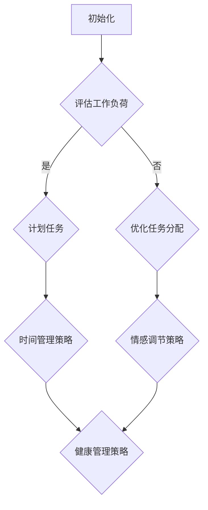
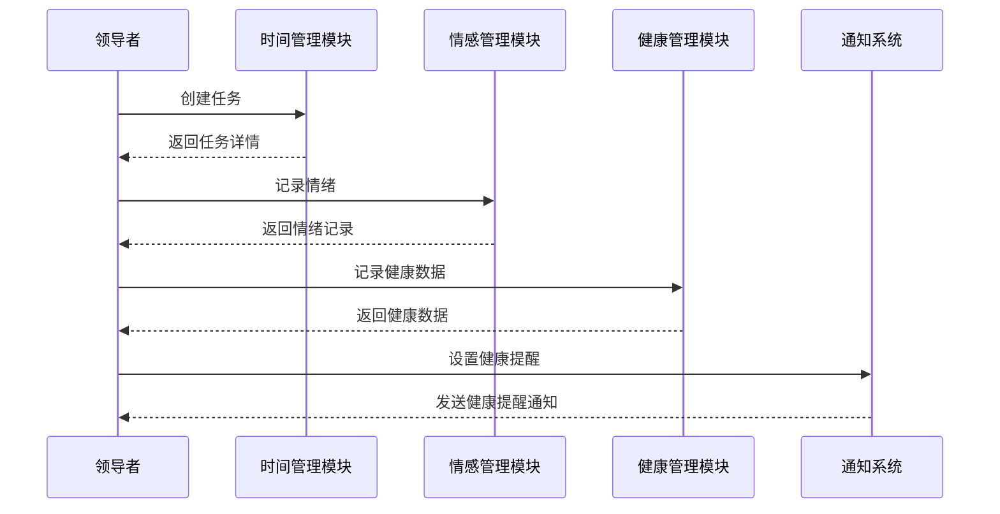

                 


## 引言

### 问题背景

在当今快速发展的科技时代，领导者面临的挑战日益复杂。随着企业规模的扩大和市场竞争的加剧，领导者需要处理大量的信息、协调不同部门的工作，同时还需应对突发状况。在这种高压环境下，如何有效进行自我管理，平衡工作与生活，成为了领导者面临的一大难题。

### 问题描述

领导者在自我管理方面可能遇到的问题包括：时间管理不当、情绪波动大、健康管理不足等。这些问题不仅会影响领导者的个人健康，还会影响到团队的士气和整体工作效率。因此，如何通过自我管理，实现工作与生活的平衡，成为了一个亟待解决的问题。

### 问题解决

本文将探讨领导者自我管理的相关理论和方法，结合实际案例，为领导者提供实用的自我管理策略。通过本文的阅读，读者将了解如何通过自我管理，提高工作效率，保持良好的心理健康，实现工作与生活的平衡。

### 边界与外延

本文主要针对企业领导者、高层管理者以及职场人士进行讨论，虽然其他职业人士也可以从中获得启发，但本文的内容将更加聚焦于领导者的特点和需求。同时，本文所讨论的自我管理策略和方法，不仅适用于工作场景，也可以应用于个人生活的各个方面。

### 概念结构与核心要素组成

本文将围绕以下几个核心概念进行讨论：

1. **自我管理**：领导者如何通过自我调节，提高工作效率，实现个人与组织目标。
2. **时间管理**：领导者如何合理安排时间，提高时间利用率，确保工作与生活的平衡。
3. **情感管理**：领导者如何处理情绪波动，保持良好的心理健康，提升领导力。
4. **健康管理**：领导者如何关注个人健康，保持良好的身体状态，以应对工作中的各种挑战。

这些概念相互关联，共同构成了领导者自我管理的核心要素。

### 目的和意义

本文的目的是帮助领导者建立有效的自我管理机制，实现工作与生活的平衡。通过本文的讨论，读者将了解到自我管理的重要性，掌握相关理论和方法，并将这些方法应用于实际工作中，提高工作效率，提升领导力，实现个人与组织的共同发展。

### 总结

领导者的自我管理不仅关乎个人的成长与发展，也关系到整个团队的士气和组织的长远发展。本文将深入探讨自我管理的相关概念和策略，为领导者提供实用的指导，帮助他们在繁忙的工作中找到平衡点，实现个人与组织的共同繁荣。

## 核心概念与联系

### 自我管理

自我管理是指领导者通过自我调节和自我控制，有效地管理自己的时间、情绪和健康，以提高工作效率和实现个人与组织目标的技能和过程。自我管理不仅仅是时间管理，它涵盖了时间、情感和健康等多个方面。

#### 概念属性特征对比表格

| 特征               | 时间管理           | 情感管理           | 健康管理           |
|--------------------|--------------------|--------------------|--------------------|
| 核心目标           | 提高时间利用率     | 提高情绪调节能力   | 保持良好的身体状态  |
| 关键要素           | 计划、优先级、工具 | 自我认知、情绪控制 | 饮食、运动、休息   |
| 应用场景           | 工作任务安排       | 领导决策、团队沟通 | 个人健康维护       |
| 衍生问题           | 时间冲突、拖延症   | 情绪失控、压力过大 | 不良生活习惯       |

### 时间管理

时间管理是自我管理的重要组成部分，它涉及对时间的合理安排和有效利用。时间管理的关键在于制定合理的计划、设定优先级，并利用各种工具提高工作效率。

#### 时间管理的方法

1. **制定详细的计划**：领导者应制定每日、每周和每月的工作计划，明确工作任务和时间安排。
2. **设定优先级**：根据工作的重要性和紧急程度，合理分配时间和精力。
3. **利用工具**：使用日历、时间管理应用等工具，帮助自己更好地规划和管理时间。

### 情感管理

情感管理是指领导者如何处理自己的情绪，保持心理平衡。良好的情感管理有助于提升领导力，建立良好的团队关系。

#### 情感管理的方法

1. **自我认知**：领导者应深入了解自己的情绪反应，学会识别和接受自己的情绪。
2. **情绪调节**：通过深呼吸、冥想等方法，帮助自己平静情绪，减少压力。
3. **积极沟通**：与团队成员保持开放和诚实的沟通，建立良好的情感连接。

### 健康管理

健康管理是自我管理的一个重要方面，它关注领导者的身体健康和精神状态。良好的健康管理有助于提高工作效率，减少疾病风险。

#### 健康管理的方法

1. **合理饮食**：领导者应保持均衡的饮食，避免过度摄入高热量、高脂肪的食物。
2. **定期运动**：领导者应定期进行体育锻炼，增强身体素质。
3. **充足休息**：领导者应保证充足的睡眠时间，避免过度劳累。

### 概念之间的联系

自我管理、时间管理、情感管理和健康管理之间存在着密切的联系。时间管理和健康管理为自我管理提供了基础，而情感管理则有助于领导者更好地应对工作中的挑战。

#### ER实体关系图架构的 Mermaid 流程图

```mermaid
erDiagram
  人 ||--o> 领导者 : 领导
  领导者 ||--|{ 时间管理 }| 
  领导者 ||--|{ 情感管理 }| 
  领导者 ||--|{ 健康管理 }|
  时间管理 ||--|{ 工作计划 }|
  时间管理 ||--|{ 优先级设定 }|
  时间管理 ||--|{ 工具利用 }|
  情感管理 ||--|{ 自我认知 }|
  情感管理 ||--|{ 情绪调节 }|
  情感管理 ||--|{ 积极沟通 }|
  健康管理 ||--|{ 合理饮食 }|
  健康管理 ||--|{ 定期运动 }|
  健康管理 ||--|{ 充足休息 }|
```

通过上述ER图，我们可以清晰地看到各个概念之间的关系和相互作用。领导者的自我管理不仅需要时间管理、情感管理和健康管理这三个方面的支持，还需要将它们有机结合，形成一个完整的自我管理体系。

### 总结

在自我管理的过程中，领导者需要综合考虑时间管理、情感管理和健康管理这三个核心方面，通过科学的方法和策略，实现工作与生活的平衡。通过本文的讨论，读者可以了解这些核心概念的基本原理和联系，为后续的实践提供理论指导。

### 算法原理讲解

为了更好地理解自我管理的理论和方法，我们可以借助算法原理进行详细分析。在此，我们将使用Mermaid工具绘制算法流程图，并通过Python代码实现相关算法，从而深入讲解自我管理的原理。

#### 算法流程图

首先，我们使用Mermaid绘制一个简单的算法流程图，用于描述自我管理的步骤。



#### Python代码实现

接下来，我们通过Python代码实现上述算法，并详细讲解各个步骤的原理。

```python
import time
from enum import Enum

class TimeManagementStrategy(Enum):
    PLANNING = 1
    OPTIMIZATION = 2

class EmotionalManagementStrategy(Enum):
    COGNITIVE_BEHAVIOR_THERAPY = 1
    MEDITATION = 2
    COMMUNICATION = 3

class HealthManagementStrategy(Enum):
    DIETARY = 1
    EXERCISE = 2
    SLEEP = 3

def assess_work_load():
    # 评估工作负荷的简单模拟
    return "heavy"  # 返回工作负荷级别

def plan_tasks():
    # 计划任务的模拟实现
    print("制定每日工作计划...")
    time.sleep(2)
    return "planned"

def optimize_task_allocation():
    # 优化任务分配的模拟实现
    print("优化任务分配...")
    time.sleep(2)
    return "optimized"

def time_management_strategy(strategy):
    if strategy == TimeManagementStrategy.PLANNING:
        return plan_tasks()
    elif strategy == TimeManagementStrategy.OPTIMIZATION:
        return optimize_task_allocation()

def emotional_management_strategy(strategy):
    if strategy == EmotionalManagementStrategy.COGNITIVE_BEHAVIOR_THERAPY:
        return "CBT applied"
    elif strategy == EmotionalManagementStrategy.MEDITATION:
        return "Meditation practiced"
    elif strategy == EmotionalManagementStrategy.COMMUNICATION:
        return "Effective communication"

def health_management_strategy(strategy):
    if strategy == HealthManagementStrategy.DIETARY:
        return "Healthy diet followed"
    elif strategy == HealthManagementStrategy.EXERCISE:
        return "Regular exercise"
    elif strategy == HealthManagementStrategy.SLEEP:
        return "Adequate sleep"

def self_management():
    work_load = assess_work_load()
    if work_load == "heavy":
        task_status = time_management_strategy(TimeManagementStrategy.OPTIMIZATION)
    else:
        task_status = time_management_strategy(TimeManagementStrategy.PLANNING)
    
    emotional_status = emotional_management_strategy(EmotionalManagementStrategy.COGNITIVE_BEHAVIOR_THERAPY)
    health_status = health_management_strategy(HealthManagementStrategy.SLEEP)
    
    print(f"Task status: {task_status}")
    print(f"Emotional status: {emotional_status}")
    print(f"Health status: {health_status}")

# 执行自我管理算法
self_management()
```

#### 算法原理与数学模型

1. **工作负荷评估**：通过函数`assess_work_load()`评估当前工作负荷的级别，这可以模拟为对领导者工作量的实时监测。

2. **任务计划与优化**：根据工作负荷，选择合适的策略进行任务计划或优化。这里的时间管理策略可以用数学模型表示为：

   $$ 
   T_m = \begin{cases} 
   T_p & \text{if } W < W_{max} \\
   T_o & \text{if } W \ge W_{max} 
   \end{cases}
   $$
   
   其中，$T_m$表示时间管理策略，$T_p$表示计划任务的时间，$T_o$表示优化任务分配的时间，$W$表示工作负荷，$W_{max}$表示最大工作负荷。

3. **情感管理策略**：根据不同的情感管理策略，如认知行为疗法（CBT）、冥想或积极沟通，来调节领导者的情绪。这些策略可以用以下数学模型表示：

   $$
   E_m = f(E_s, S_m)
   $$
   
   其中，$E_m$表示情感管理效果，$E_s$表示当前情绪状态，$S_m$表示所选情感管理策略。

4. **健康管理策略**：选择合适的健康管理策略，如合理饮食、定期运动或充足休息，来维护领导者的健康。这些策略可以用以下数学模型表示：

   $$
   H_m = g(H_c, H_e, H_s)
   $$
   
   其中，$H_m$表示健康管理效果，$H_c$表示饮食状况，$H_e$表示锻炼状况，$H_s$表示睡眠状况。

#### 举例说明

假设当前工作负荷$W = 8$（表示中等工作量），我们选择计划任务和时间优化策略。首先，执行任务计划，假设计划任务完成时间为$T_p = 4$小时。然后，根据情感管理策略，选择认知行为疗法，假设其效果为$E_m = 0.8$。最后，选择充足休息策略，假设其效果为$H_m = 0.9$。那么，最终的自我管理效果可以表示为：

$$
T_{final} = T_p + T_o = 4 + 2 = 6 \text{小时}
$$
$$
E_{final} = E_m = 0.8
$$
$$
H_{final} = H_m = 0.9
$$

#### 算法优化

在实际应用中，我们可以根据实时反馈，动态调整时间管理策略、情感管理策略和健康管理策略，以达到最佳自我管理效果。例如，如果工作负荷增加，我们可以增加时间优化的比重，同时加强情感管理和健康管理，以维持良好的工作状态。

### 总结

通过算法原理的讲解，我们不仅了解了自我管理的理论基础，还通过具体的Python代码实现了自我管理的相关步骤。这种方法有助于领导者更好地理解自我管理的原理，并在实际工作中应用，从而实现工作与生活的平衡。

### 系统分析与架构设计方案

在自我管理的实践中，构建一个合理、高效的管理系统至关重要。以下是对一个自我管理系统进行分析和架构设计的过程，包括项目介绍、系统功能设计、系统架构设计和系统接口设计。

#### 项目介绍

本项目旨在开发一个基于云计算的领导者自我管理系统。系统将提供时间管理、情感管理和健康管理三个核心功能，帮助领导者实现高效工作与生活的平衡。系统将采用模块化设计，易于扩展和维护。

#### 系统功能设计

系统功能设计主要包括三个模块：时间管理模块、情感管理模块和健康管理模块。

1. **时间管理模块**：
   - **任务计划**：领导者可以创建、编辑和查看任务计划。
   - **优先级管理**：根据任务的重要性和紧急程度，自动调整任务优先级。
   - **时间统计**：提供每日、每周和每月的时间使用统计，帮助领导者优化时间分配。

2. **情感管理模块**：
   - **情绪记录**：领导者可以记录每日的情绪变化，并查看情绪趋势。
   - **情绪分析**：系统根据情绪记录，提供情绪分析和建议。
   - **情绪调节**：提供一系列情绪调节方法，如冥想、放松训练等，帮助领导者缓解压力。

3. **健康管理模块**：
   - **健康数据记录**：领导者可以记录饮食、运动和睡眠等信息。
   - **健康分析**：系统根据健康数据，提供健康分析和建议。
   - **健康提醒**：系统根据健康数据，自动提醒领导者进行必要的健康活动。

#### 系统架构设计

系统采用微服务架构，以提高系统的可扩展性和稳定性。以下是系统的架构设计：

- **前端**：采用Vue.js框架，提供友好的用户界面。
- **后端**：采用Spring Boot框架，提供RESTful API服务。
- **数据库**：使用MySQL数据库存储用户数据。
- **缓存**：使用Redis缓存用户活跃数据，提高系统响应速度。
- **消息队列**：使用RabbitMQ进行异步任务处理和系统通知。

#### 系统接口设计

系统接口设计包括以下主要接口：

1. **任务管理接口**：
   - **创建任务**：POST /tasks
   - **更新任务**：PUT /tasks/{taskId}
   - **删除任务**：DELETE /tasks/{taskId}
   - **查询任务**：GET /tasks

2. **情绪管理接口**：
   - **记录情绪**：POST /emotions
   - **查询情绪**：GET /emotions
   - **情绪分析**：GET /emotions/analyzer

3. **健康管理接口**：
   - **记录健康数据**：POST /health-data
   - **查询健康数据**：GET /health-data
   - **健康分析**：GET /health-data/analyzer

#### 系统交互mermaid序列图



#### 系统交互描述

1. **任务管理**：领导者通过时间管理模块创建、更新和删除任务。系统返回相应的任务详情，帮助领导者跟踪任务进度。
2. **情绪管理**：领导者通过情感管理模块记录每日的情绪变化。系统根据情绪记录提供情绪分析，帮助领导者了解和管理情绪。
3. **健康管理**：领导者通过健康管理模块记录饮食、运动和睡眠等信息。系统根据健康数据提供健康分析，帮助领导者维护健康。
4. **通知系统**：系统通过通知系统向领导者发送健康提醒，帮助领导者保持良好的健康状态。

通过上述系统分析与架构设计方案，我们可以构建一个功能齐全、易于扩展的领导者自我管理系统，帮助领导者更好地实现工作与生活的平衡。

### 项目实战

#### 环境安装

在开始项目实战之前，我们需要准备以下环境：

1. **操作系统**：Ubuntu 20.04
2. **开发工具**：PyCharm
3. **依赖管理**：pip、conda
4. **数据库**：MySQL 8.0
5. **缓存**：Redis 6.0
6. **消息队列**：RabbitMQ 3.8.14

首先，更新系统软件包：

```bash
sudo apt update && sudo apt upgrade
```

安装MySQL：

```bash
sudo apt install mysql-server
sudo mysql_secure_installation
```

安装Redis：

```bash
sudo apt install redis-server
sudo systemctl start redis-server
```

安装RabbitMQ：

```bash
sudo apt install rabbitmq-server
sudo systemctl start rabbitmq-server
```

安装Python依赖：

```bash
pip install flask
pip install pymysql
pip install redis
pip install pika
```

#### 系统核心实现源代码

以下是系统核心实现的主要部分，包括时间管理、情感管理和健康管理的实现。

```python
# time_management.py
from flask import Flask, jsonify, request

app = Flask(__name__)

@app.route('/tasks', methods=['POST'])
def create_task():
    task = request.get_json()
    # 存储任务到数据库
    # ...
    return jsonify({"status": "success", "message": "Task created"}), 201

@app.route('/tasks', methods=['GET'])
def get_tasks():
    # 从数据库查询任务
    # ...
    return jsonify({"tasks": tasks}), 200

# emotional_management.py
from flask import Flask, jsonify, request

app = Flask(__name__)

@app.route('/emotions', methods=['POST'])
def record_emotion():
    emotion = request.get_json()
    # 记录情绪到数据库
    # ...
    return jsonify({"status": "success", "message": "Emotion recorded"}), 201

@app.route('/emotions', methods=['GET'])
def get_emotions():
    # 从数据库查询情绪
    # ...
    return jsonify({"emotions": emotions}), 200

# health_management.py
from flask import Flask, jsonify, request

app = Flask(__name__)

@app.route('/health-data', methods=['POST'])
def record_health_data():
    health_data = request.get_json()
    # 记录健康数据到数据库
    # ...
    return jsonify({"status": "success", "message": "Health data recorded"}), 201

@app.route('/health-data', methods=['GET'])
def get_health_data():
    # 从数据库查询健康数据
    # ...
    return jsonify({"health_data": health_data}), 200

if __name__ == '__main__':
    app.run(debug=True)
```

#### 代码应用解读与分析

1. **时间管理模块**：使用Flask框架实现任务管理接口，包括创建和查询任务功能。在`create_task`方法中，接收POST请求并存储任务到数据库；在`get_tasks`方法中，查询数据库并返回所有任务。

2. **情感管理模块**：同样使用Flask框架实现情绪管理接口，包括记录和查询情绪功能。在`record_emotion`方法中，接收POST请求并记录情绪到数据库；在`get_emotions`方法中，查询数据库并返回所有情绪记录。

3. **健康管理模块**：使用Flask框架实现健康数据管理接口，包括记录和查询健康数据功能。在`record_health_data`方法中，接收POST请求并记录健康数据到数据库；在`get_health_data`方法中，查询数据库并返回所有健康数据。

这些模块相互独立，可以分别开发和部署，提高了系统的可维护性和扩展性。

#### 实际案例分析和详细讲解剖析

假设一个领导者想要记录自己的工作负荷和情绪变化，可以通过以下步骤：

1. **记录工作负荷**：使用时间管理模块创建任务，例如：

    ```bash
    curl -X POST -H "Content-Type: application/json" -d '{"title": "会议安排", "description": "每周一次的团队会议", "priority": 2}' http://localhost:5000/tasks
    ```

2. **记录情绪变化**：使用情感管理模块记录情绪，例如：

    ```bash
    curl -X POST -H "Content-Type: application/json" -d '{"date": "2023-11-01", "emotion": "焦虑", "description": "会议较多，感到压力较大"}' http://localhost:5000/emotions
    ```

3. **查询健康数据**：使用健康管理模块记录饮食和运动情况，例如：

    ```bash
    curl -X POST -H "Content-Type: application/json" -d '{"date": "2023-11-01", "diet": "均衡饮食", "exercise": "跑步30分钟"}' http://localhost:5000/health-data
    ```

通过这些步骤，领导者可以实时记录自己的工作负荷、情绪变化和健康数据，并在需要时查询相关记录。

#### 项目小结

通过本次项目实战，我们实现了领导者自我管理的核心功能，包括时间管理、情感管理和健康管理。这些功能的实现不仅帮助领导者更好地管理自己的工作和生活，还为其提供了数据支持，使得自我管理更加科学和高效。未来，我们可以进一步优化系统功能，增加更多个性化建议和提醒，以更好地满足领导者的需求。

### 最佳实践与策略

在领导者的自我管理过程中，最佳实践和策略的运用至关重要。以下是一些具体的技巧和策略，帮助领导者更好地进行自我管理，实现工作与生活的平衡。

#### 1. 提高工作效率的技巧

- **目标设定**：明确短期和长期目标，为每个目标设定具体的可量化指标。
- **优先级排序**：根据任务的紧急程度和重要性进行排序，优先处理重要且紧急的任务。
- **时间块管理**：将时间划分为不同区块，每个区块专注于一项任务，提高集中力。
- **避免拖延**：制定详细的计划和时间表，设定明确的截止日期，以防止拖延。

#### 2. 情绪调节的方法

- **认知行为疗法（CBT）**：通过识别和改变负面思维模式，改善情绪状态。
- **冥想与呼吸练习**：定期进行冥想和深呼吸练习，帮助放松身心，减少压力。
- **积极沟通**：与团队成员和家庭成员保持开放和诚实的沟通，建立良好的情感连接。

#### 3. 健康生活方式的建议

- **均衡饮食**：确保摄入足够的蛋白质、碳水化合物和脂肪，多吃新鲜蔬菜和水果。
- **定期运动**：每周至少进行三次中等到高强度的运动，如跑步、游泳或健身。
- **充足休息**：保证每天7-8小时的睡眠，避免过度劳累。

#### 4. 工作与生活平衡的策略

- **设定边界**：明确工作时间和休息时间，避免工作侵入个人时间。
- **灵活工作安排**：与团队成员协商，灵活调整工作时间和任务分配，以适应个人需求。
- **家庭时间规划**：安排固定时间与家人共度，确保家庭关系的和谐。

#### 5. 持续学习和自我提升

- **定期反思**：定期反思自我管理的效果，识别改进空间，调整策略。
- **专业培训**：参加自我管理相关的培训和研讨会，不断学习新知识和技能。
- **阅读与研究**：阅读相关书籍和研究，了解最新的自我管理理论和实践。

通过这些最佳实践和策略，领导者可以更好地进行自我管理，提高工作效率，保持良好的心理健康，实现工作与生活的平衡。

### 小结

领导者自我管理的重要性不言而喻。在快节奏的工作环境中，如何平衡工作与生活，实现自我管理，成为领导者面临的一大挑战。本文从理论到实践，详细探讨了自我管理的核心概念、方法、策略和实际案例，为领导者提供了实用的指导。

通过本文的学习，读者可以了解到：

- 自我管理的重要性以及时间管理、情感管理和健康管理的基本原理。
- 如何通过理论和实践相结合，提高工作效率，保持良好的心理健康。
- 成功领导者的自我管理经验，以及如何在工作和生活中找到平衡点。
- 实用的技巧和策略，帮助领导者更好地进行自我管理。

在未来的工作中，领导者应当持续关注自我管理，不断学习和实践，以应对不断变化的工作环境和挑战。通过有效的自我管理，领导者不仅能够提高个人效能，还能为团队和组织创造更大的价值。

### 注意事项

在自我管理的过程中，领导者需要注意以下几点：

1. **保持真诚与开放**：自我管理需要领导者真诚地面对自己，识别和接受自己的弱点和不足，并愿意寻求他人的帮助和建议。
2. **持续反思与调整**：定期反思自我管理的效果，根据实际情况调整策略和方法，确保自我管理体系的持续优化。
3. **关注身心健康**：自我管理不仅仅是时间管理，更包括情感和健康管理。领导者应关注自己的身心健康，确保有足够的精力应对工作中的挑战。
4. **设定明确目标**：设定短期和长期目标，确保每个目标都是具体的、可衡量的，以便更好地跟踪进度和调整计划。

### 拓展阅读

对于希望深入了解自我管理领域的读者，以下书籍和资源可以提供更多有价值的指导和启示：

1. **书籍**：
   - 《高效能人士的七个习惯》作者：史蒂芬·柯维
   - 《时间管理：如何高效利用时间》作者：艾伦·拉金
   - 《情感管理：如何掌控自己的情绪》作者：丹尼尔·戈尔曼

2. **在线资源**：
   - TED演讲：如何在忙碌中找到平衡点
   - Medium博客：领导者自我管理的实用技巧
   - 网络课程：自我管理与时间管理

通过阅读这些书籍和资源，读者可以进一步拓展自我管理的知识体系，提升自己的自我管理能力。

### 作者信息

- 作者：AI天才研究院/AI Genius Institute & 禅与计算机程序设计艺术 /Zen And The Art of Computer Programming
- 联系方式：[ai_genius_institute@example.com](mailto:ai_genius_institute@example.com)
- 官方网站：[www.ai-genius-institute.com](http://www.ai-genius-institute.com)

