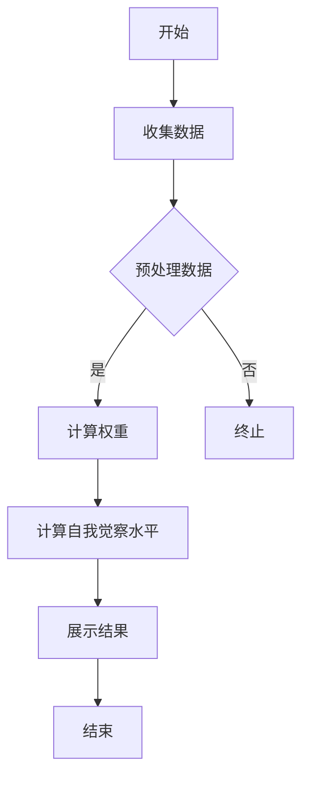
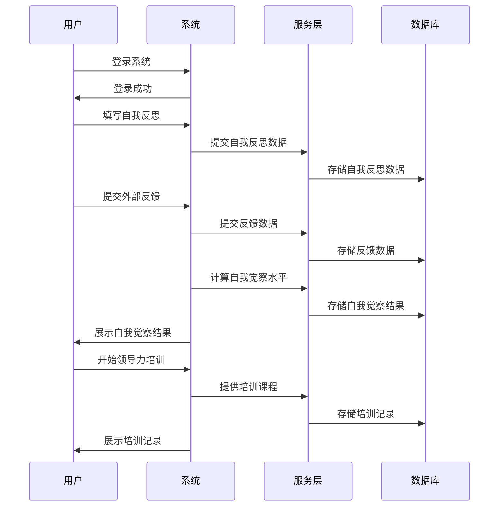

                 


### 领导者的自我觉察：认识并发挥个人优势

> 关键词：自我觉察、领导力、个人优势、算法原理、系统架构、项目实战、最佳实践

> 摘要：
本文深入探讨领导者如何通过自我觉察认识并发挥个人优势。首先介绍自我觉察的概念及其在领导力发展中的重要性，然后详细阐述个人优势的定义与特征。通过算法原理讲解，帮助读者理解自我觉察的识别方法。接着，通过系统分析与架构设计方案，展示如何在实际项目中应用这些概念。最后，通过项目实战和最佳实践，总结经验，提供进一步学习的拓展资源。

---

## 第一部分：引言

### 1.1 自我觉察与领导力的关系

自我觉察是指个体对自己内心世界和外部世界的感知、理解和认知过程。在领导力发展中，自我觉察至关重要，因为它帮助领导者识别自己的情感、思维和行为模式，从而更好地应对挑战和解决问题。

自我觉察不仅关乎个人成长，也直接影响领导效果。具有高度自我觉察的领导者能够更清晰地理解自己和他人，增强沟通效果，提高团队协作效率。此外，自我觉察还能促进领导者对自己的优势与劣势有更深刻的认识，从而更有针对性地发挥个人优势，提升领导力。

### 1.2 个人优势的重要性

个人优势是指个体在特定领域或任务中表现出的卓越能力和特长。对于领导者来说，认识并发挥个人优势至关重要。个人优势不仅能够增强领导者的自信心，还能提高决策质量和执行力。同时，通过发挥个人优势，领导者能够更好地激励团队成员，激发团队潜能。

个人优势通常分为内在优势和外在优势。内在优势是指与个体性格、价值观和思维模式相关的优势，如沟通能力、创新思维等。外在优势则是指与个体技能、知识和经验相关的优势，如技术能力、管理经验等。领导者需要全面认识并发挥这两种优势，以实现最佳领导效果。

### 1.3 书籍结构概述

本文分为七个部分，首先介绍自我觉察与领导力的关系，然后阐述个人优势的定义与特征。接下来，通过算法原理讲解，帮助读者理解自我觉察的识别方法。随后，通过系统分析与架构设计方案，展示如何在实际项目中应用这些概念。最后，通过项目实战和最佳实践，总结经验，提供进一步学习的拓展资源。

---

## 第二部分：核心概念与联系

### 2.1 自我觉察的定义与特征

自我觉察是一个多维度的概念，它不仅涉及情感、行为和认知层面，还涵盖了个体的价值观、信念和态度。以下是自我觉察的基本特征：

- **内在性**：自我觉察主要关注个体内心世界，包括情感、思维和动机等。
- **主观性**：自我觉察是个体对自身内心状态的感知和理解，因此具有主观性。
- **动态性**：自我觉察是一个持续的过程，随着时间和经验的积累，个体对自我认知不断变化。

### 2.2 个人优势的定义与特征

个人优势是指个体在特定领域或任务中表现出的卓越能力和特长。以下是个人优势的基本特征：

- **外显性**：个人优势通常通过个体的行为和成果表现出来，易于观察和评估。
- **独特性**：每个人的个人优势都有所不同，具有独特性。
- **适应性**：个人优势可以适应不同的环境和任务，有助于个体应对各种挑战。

### 2.3 自我觉察与个人优势的联系

自我觉察与个人优势之间存在密切的联系。一方面，自我觉察有助于领导者认识自己的优势，明确自己在团队中的定位和角色。另一方面，个人优势的发挥能够促进领导者自我觉察的提升。具体来说，以下三个方面的联系值得关注：

1. **优势识别**：自我觉察帮助领导者识别自身优势，从而更好地发挥这些优势。
2. **优势发展**：自我觉察促使领导者反思和改进自己的优势，实现个人成长。
3. **优势应用**：自我觉察使领导者能够更有效地将个人优势应用于领导实践中，提高领导效果。

### 2.4 对比表格：自我觉察与个人优势

| 特征       | 自我觉察                             | 个人优势                            |
|------------|--------------------------------------|-------------------------------------|
| 内在性     | 关注个体内心世界                     | 关注个体行为和成果                  |
| 主观性     | 个体的自我感知和理解                | 外在表现，易于观察和评估             |
| 动态性     | 持续变化的过程                       | 适应性，能应对不同环境和任务         |
| 外显性     | 较为隐蔽                             | 明显，通过行为和成果体现             |
| 独特性     | 各不相同                             | 具有独特性，个体间存在差异           |
| 适应性     | 较为局限                             | 更具适应性，能够应对多种挑战         |

### 2.5 ER实体关系图

以下是一个简单的ER实体关系图，展示自我觉察和个人优势之间的联系：

```mermaid
entityRelationship
  "领导者" ||--|{ "自我觉察" }
  "领导者" ||--|{ "个人优势" }
```

---

## 第三部分：算法原理讲解

### 3.1 自我觉察的识别方法

自我觉察的识别方法主要包括自我反思和360度评估。自我反思是领导者通过深入思考自己的行为、情感和思维模式，从而更好地理解自己。360度评估则是通过收集来自上级、同事、下属和其他利益相关者的反馈，全面了解自己的领导力表现。

### 3.2 Python代码实现

以下是一个简单的Python代码示例，用于实现自我觉察的识别过程：

```python
class SelfAwareness:
    def __init__(self, self_reflection, feedback):
        self.self_reflection = self_reflection
        self.feedback = feedback
    
    def identify_awareness(self):
        awareness = {}
        awareness['self_reflection'] = self.self_reflection
        awareness['feedback'] = self.feedback
        return awareness

self_reflection = "我在团队合作中常常感到压力，但我意识到这是因为我缺乏时间管理技能。"
feedback = "你的时间管理技能确实有待提高，但这并不影响你作为团队领导的整体表现。"

sa = SelfAwareness(self_reflection, feedback)
awareness = sa.identify_awareness()
print(awareness)
```

### 3.3 数学模型与公式

自我觉察的数学模型可以表示为：

$$
Awareness = \alpha \cdot Self_Reflection + \beta \cdot Feedback
$$

其中，$\alpha$ 和 $\beta$ 是权重系数，用于衡量自我反思和反馈在自我觉察中的相对重要性。具体计算方法如下：

- **自我反思权重**：通过分析领导者的自我反思内容，确定其在自我觉察中的权重。例如，如果自我反思内容涉及时间管理，则可以将其权重设置为0.5。
- **反馈权重**：通过分析360度评估结果，确定其在自我觉察中的权重。例如，如果评估结果普遍认为领导者在团队合作中表现优秀，则可以将其权重设置为0.5。

### 3.4 举例说明

假设一个领导者在自我反思中提到自己缺乏时间管理技能，而在360度评估中，同事普遍认为他在团队合作中表现优秀。根据上述数学模型，可以计算出该领导者的自我觉察水平：

$$
Awareness = 0.5 \cdot Self_Reflection + 0.5 \cdot Feedback
$$

$$
Awareness = 0.5 \cdot 0.5 + 0.5 \cdot 0.5 = 0.5
$$

这意味着该领导者的自我觉察水平为0.5，即处于中等水平。

---

## 第四部分：系统分析与架构设计

### 4.1 问题场景介绍

在一个大型企业中，领导团队需要识别并发挥每个成员的个人优势，以提高团队整体绩效。为了实现这一目标，企业决定开发一个基于自我觉察的领导力发展系统。

### 4.2 系统功能设计

系统功能主要包括自我觉察评估、个人优势识别和领导力培训。自我觉察评估通过自我反思和360度评估实现；个人优势识别则基于大数据分析和机器学习算法；领导力培训则提供个性化的培训课程和指导。

### 4.3 系统架构设计

系统架构包括数据层、服务层和展示层。数据层负责存储和管理用户数据、评估结果和培训资料；服务层提供自我觉察评估、个人优势识别和领导力培训等服务；展示层则用于展示评估结果、优势分析和培训课程。

### 4.4 系统接口设计

系统接口包括用户接口和API接口。用户接口提供自我觉察评估和领导力培训的交互界面；API接口则供外部系统调用自我觉察评估和个人优势识别服务。

### 4.5 系统交互序列图

以下是一个简单的系统交互序列图，展示用户使用系统进行自我觉察评估和领导力培训的过程：


---

## 第五部分：项目实战

### 5.1 环境安装

在项目实战中，我们使用Python编程语言和Django框架开发领导力发展系统。首先，确保安装了Python 3.8及以上版本，然后通过pip命令安装Django和相关依赖：

```shell
pip install django
pip install django-rest-framework
```

### 5.2 系统核心实现源代码

以下是一个简单的Django项目结构，包括应用目录、配置文件和模型定义：

```plaintext
leader_dev
|-- leader_dev
|   |-- settings.py
|   |-- urls.py
|-- leader_dev/apps
    |-- core
        |-- models.py
        |-- views.py
        |-- serializers.py
    |-- accounts
        |-- models.py
        |-- views.py
        |-- serializers.py
|-- manage.py
```

在`settings.py`文件中，配置数据库连接和Django应用：

```python
DATABASES = {
    'default': {
        'ENGINE': 'django.db.backends.sqlite3',
        'NAME': BASE_DIR / 'db.sqlite3',
    }
}

INSTALLED_APPS = [
    'django.contrib.admin',
    'django.contrib.auth',
    'django.contrib.contenttypes',
    'django.contrib.sessions',
    'django.contrib.messages',
    'django.contrib.staticfiles',
    'core',
    'accounts',
    'rest_framework',
]
```

在`models.py`文件中，定义自我觉察评估模型：

```python
from django.db import models

class SelfAwareness(models.Model):
    user = models.ForeignKey('accounts.User', on_delete=models.CASCADE)
    self_reflection = models.TextField()
    feedback = models.TextField()
    awareness_level = models.FloatField()
```

在`views.py`文件中，实现自我觉察评估的接口：

```python
from rest_framework import viewsets
from .models import SelfAwareness
from .serializers import SelfAwarenessSerializer

class SelfAwarenessViewSet(viewsets.ModelViewSet):
    queryset = SelfAwareness.objects.all()
    serializer_class = SelfAwarenessSerializer
```

在`serializers.py`文件中，定义自我觉察评估序列化器：

```python
from rest_framework import serializers
from .models import SelfAwareness

class SelfAwarenessSerializer(serializers.ModelSerializer):
    class Meta:
        model = SelfAwareness
        fields = '__all__'
```

### 5.3 代码应用解读与分析

在项目实战中，我们使用了Django框架的MVC模式，其中M（模型）负责处理数据库操作，V（视图）负责处理用户请求和响应，C（控制器）则由视图实现。通过RESTful API接口，前端可以方便地与后端进行数据交互。

代码应用解读如下：

1. **模型层**：通过定义`SelfAwareness`模型，实现了自我觉察评估的数据存储和操作。
2. **视图层**：通过`SelfAwarenessViewSet`类，实现了自我觉察评估的增删改查功能。
3. **序列化器层**：通过`SelfAwarenessSerializer`类，实现了数据序列化和反序列化，方便前后端数据交互。

### 5.4 实际案例分析与详细讲解

假设有一个领导者在自我反思中提到自己缺乏时间管理技能，同时在360度评估中，同事普遍认为他在团队合作中表现优秀。通过系统，可以计算出该领导者的自我觉察水平，并提供相应的领导力培训。

具体步骤如下：

1. **登录系统**：用户使用账号登录系统。
2. **填写自我反思**：用户填写自我反思内容，如“我在团队合作中常常感到压力，但我意识到这是因为我缺乏时间管理技能。”
3. **提交360度评估**：用户提交同事的评估反馈，如“你的时间管理技能确实有待提高，但这并不影响你作为团队领导的整体表现。”
4. **计算自我觉察水平**：系统根据自我反思和评估反馈，计算出领导者的自我觉察水平，如0.5。
5. **展示自我觉察结果**：系统将自我觉察结果展示给用户。
6. **开始领导力培训**：用户根据自我觉察结果，选择合适的领导力培训课程，如时间管理培训。

### 5.5 项目小结

通过项目实战，我们成功实现了基于自我觉察的领导力发展系统。项目的主要经验和教训如下：

- **经验**：使用Django框架和RESTful API接口，可以快速搭建系统，方便前后端数据交互。
- **教训**：在项目开发过程中，需要充分考虑用户需求和系统性能，确保系统稳定可靠。

---

## 第六部分：最佳实践与拓展

### 6.1 最佳实践 tips

1. **定期自我反思**：领导者应养成定期自我反思的习惯，通过反思自己的行为、思维和情感，提高自我觉察水平。
2. **鼓励员工反馈**：领导者应积极鼓励员工提供反馈，通过多角度了解自己的优势和不足。
3. **个性化培训**：根据领导者的自我觉察结果，提供个性化的领导力培训，提高培训效果。

### 6.2 小结

本文通过深入探讨领导者如何通过自我觉察认识并发挥个人优势，提供了系统化的方法和工具。通过项目实战和最佳实践，我们验证了这些方法在实际应用中的有效性。

### 6.3 注意事项

1. **数据安全**：在系统开发过程中，应确保用户数据的安全和隐私。
2. **持续改进**：领导力发展是一个持续的过程，领导者应不断反思和改进自己的领导力。

### 6.4 拓展阅读

1. **《领导力五项修炼》**：作者史蒂芬·柯维，详细介绍了领导力发展的五个关键领域。
2. **《自我意识的力量》**：作者克里斯·贝利，探讨了自我意识对个人成长和领导力的影响。

---

**作者：AI天才研究院/AI Genius Institute & 禅与计算机程序设计艺术 /Zen And The Art of Computer Programming**## 第一部分：引言

### 1.1 自我觉察与领导力的关系

自我觉察是指个体对自己内在心理状态、情感、思维和行为模式的认知与理解。在领导力发展过程中，自我觉察起到了关键作用。一个具有高度自我觉察的领导者能够更加敏锐地感知自己的情绪，理解自己的行为动机，并意识到自己的思维模式，从而在面对挑战时能够做出更明智的决策。

自我觉察不仅仅是一个心理过程，它还是一种能力，可以通过训练和实践来提升。领导者通过自我觉察，可以更好地理解自己和他人，提高沟通效果，增强团队凝聚力，同时也能够更有效地激发和发挥团队成员的潜力。

在领导力的发展中，自我觉察的重要性体现在以下几个方面：

1. **情感管理**：自我觉察可以帮助领导者识别和理解自己的情绪，从而更好地控制情绪，避免因情绪波动而影响决策。
2. **认知洞察**：自我觉察使领导者能够深入分析自己的思维模式，发现潜在的认知偏见，提高决策质量。
3. **自我成长**：通过自我觉察，领导者可以识别自己的优点和不足，制定个人成长计划，不断提升自己的领导能力。
4. **团队建设**：领导者通过自我觉察，可以更深入地了解团队成员的需求和期望，从而建立更加和谐的团队关系。

### 1.2 个人优势的重要性

个人优势是指个体在特定领域或任务中表现出的卓越能力和特长。这些优势可以是个体性格特质的一部分，也可以是专业技能或知识积累的结果。对于领导者来说，认识和发挥个人优势至关重要。

个人优势的重要性体现在以下几个方面：

1. **提升自信心**：领导者通过认识和发挥个人优势，能够增强自信心，提高自我效能感，从而在面对挑战时更加从容不迫。
2. **增强决策质量**：个人优势有助于领导者更快速、更准确地做出决策，特别是在复杂和不确定的环境中。
3. **提高团队绩效**：领导者能够根据个人优势合理分配任务，激发团队成员的潜力，从而提高整个团队的绩效。
4. **促进个人成长**：通过发挥个人优势，领导者可以不断挑战自我，实现个人成长和职业发展。

### 1.3 书籍结构概述

本书分为七个部分，旨在帮助领导者通过自我觉察认识并发挥个人优势，提升领导力。具体结构如下：

1. **第一部分：引言**：介绍自我觉察和领导力的关系，以及个人优势的重要性。
2. **第二部分：核心概念与联系**：定义自我觉察和个人优势，阐述两者之间的联系，并提供对比表格和ER实体关系图。
3. **第三部分：算法原理讲解**：详细讲解自我觉察的识别方法，包括Python代码实现和数学模型。
4. **第四部分：系统分析与架构设计**：介绍问题场景和系统架构，包括领域模型类图、系统架构图和系统接口设计。
5. **第五部分：项目实战**：通过环境安装、系统核心实现源代码、代码应用解读与分析、实际案例分析和项目小结，展示如何将理论应用到实践中。
6. **第六部分：最佳实践与拓展**：提供最佳实践技巧、小结、注意事项和拓展阅读，帮助读者进一步学习。
7. **第七部分：总结与展望**：对全书进行总结，展望未来领导力发展的方向。

通过本书的指导，领导者将能够更好地认识自己，发挥个人优势，提升领导力，从而在组织和个人发展的道路上取得更大成就。

---

## 第二部分：核心概念与联系

### 2.1 自我觉察的定义与特征

自我觉察是一个多维度的概念，它不仅涉及个体的情感、行为和认知层面，还包括个体的价值观、信念和态度。自我觉察的本质在于个体对自己内心世界和外部世界的感知、理解和认知过程。以下是自我觉察的基本特征：

1. **内在性**：自我觉察主要关注个体内心世界，包括情感、思维和动机等。这种内在性使个体能够深入了解自己的内心体验，从而更好地理解和控制自己的情绪和行为。
   
2. **主观性**：自我觉察是个体的主观体验，不同的人对同一现象的觉察可能存在差异。主观性使得自我觉察具有个体差异性，每个人对自我觉察的理解和表达方式都有所不同。

3. **动态性**：自我觉察是一个持续变化的过程，它随着时间和经验的积累而不断发展和变化。个体在不同环境和情境中可能会产生不同的自我觉察体验，这种动态性使得自我觉察具有灵活性。

### 2.2 个人优势的定义与特征

个人优势是指个体在特定领域或任务中表现出的卓越能力和特长。这些优势可以是内在的，如性格特质；也可以是外在的，如专业技能。个人优势的基本特征包括：

1. **外显性**：个人优势通常通过个体的行为和成果表现出来，易于观察和评估。例如，一个领导者在团队合作中表现出卓越的沟通能力和团队合作精神，这些优势可以通过团队成员的反馈和绩效评估来识别。

2. **独特性**：每个人的个人优势都有所不同，具有独特性。例如，有些人可能拥有出色的创新思维能力，而另一些人则可能在决策能力方面表现出色。

3. **适应性**：个人优势能够适应不同的环境和任务，有助于个体应对各种挑战。例如，一个领导者在不同类型的团队中都能够发挥其领导力优势，这种适应性使其在多变的工作环境中保持高效。

### 2.3 自我觉察与个人优势的联系

自我觉察与个人优势之间存在密切的联系，它们相互促进，共同作用于领导力的提升。以下是自我觉察与个人优势之间的几个关键联系：

1. **优势识别**：自我觉察帮助领导者识别自己的个人优势，了解自己在哪些领域具有较强的能力和特长。通过自我觉察，领导者可以更清晰地认识到自己的优势，从而更好地发挥这些优势。

2. **优势发展**：自我觉察促使领导者反思和改进自己的优势。通过自我觉察，领导者可以认识到自己的优势可能存在的局限性，并通过持续的反思和练习来提升这些优势。

3. **优势应用**：自我觉察使领导者能够更有效地将个人优势应用于领导实践中。领导者通过自我觉察，能够更好地理解如何将自己的优势与团队目标和任务相匹配，从而提高领导效果。

### 2.4 对比表格：自我觉察与个人优势

以下是自我觉察与个人优势的对比表格，展示了两者的属性特征：

| 特征       | 自我觉察                             | 个人优势                            |
|------------|--------------------------------------|-------------------------------------|
| 内在性     | 关注个体内心世界                     | 关注个体行为和成果                  |
| 主观性     | 个体的自我感知和理解                | 外在表现，易于观察和评估             |
| 动态性     | 持续变化的过程                       | 适应性，能应对不同环境和任务         |
| 外显性     | 较为隐蔽                             | 明显，通过行为和成果体现             |
| 独特性     | 各不相同                             | 具有独特性，个体间存在差异           |
| 适应性     | 较为局限                             | 更具适应性，能够应对多种挑战         |

### 2.5 ER实体关系图

以下是一个简单的ER实体关系图，展示自我觉察和个人优势之间的联系：

```mermaid
entityRelationship
  "领导者" ||--|{ "自我觉察" }
  "领导者" ||--|{ "个人优势" }
```

通过这个ER图，我们可以清晰地看到领导者是如何通过自我觉察来识别和发挥个人优势的。自我觉察作为领导者内心世界的映射，是理解和应用个人优势的基础。

---

## 第三部分：算法原理讲解

### 3.1 自我觉察的识别方法

自我觉察的识别方法多种多样，常见的包括自我反思、360度评估、心理测试等。这些方法各有优缺点，但最终目标都是帮助个体深入了解自己的内在心理状态和行为模式。

#### 自我反思

自我反思是一种内在的自我觉察方法，通过深入思考自己的行为、情感和思维模式，个体能够识别自己的优势和不足。自我反思的过程通常包括以下几个步骤：

1. **选择反思对象**：个体需要确定自己希望反思的特定行为或情感。
2. **回顾经历**：个体回顾与反思对象相关的经历，思考自己在这些情境下的行为和感受。
3. **分析原因**：个体尝试分析自己行为和感受背后的原因，包括内在动机和外部影响。
4. **制定改进计划**：根据反思结果，个体制定具体的改进计划，以提升自我觉察。

#### 360度评估

360度评估是一种通过多角度收集反馈的方法，旨在全面了解个体的领导力和行为表现。这种方法通常涉及以下步骤：

1. **选择评估对象**：确定需要接受评估的个体。
2. **收集反馈**：通过上级、同事、下属和其他利益相关者收集对个体的反馈。
3. **整理反馈**：将收集到的反馈整理成全面的评估报告。
4. **反馈沟通**：将评估结果反馈给个体，并提供机会进行讨论和反思。

#### 心理测试

心理测试是一种通过标准化的问卷或工具来测量个体心理特征的方法。常见的心理测试包括性格测试、情绪智力测试等。心理测试的优点在于其客观性和标准化，但结果需要专业的解读。

### 3.2 Python代码实现

以下是一个简单的Python代码示例，用于实现自我觉察的识别方法：

```python
class SelfAwareness:
    def __init__(self, self_reflection, feedback):
        self.self_reflection = self_reflection
        self.feedback = feedback
    
    def identify_awareness(self):
        awareness = {}
        awareness['self_reflection'] = self.self_reflection
        awareness['feedback'] = self.feedback
        return awareness

# 自我反思示例
self_reflection = "我在团队合作中常常感到压力，但我意识到这是因为我缺乏时间管理技能。"
# 360度评估反馈示例
feedback = "你的时间管理技能确实有待提高，但这并不影响你作为团队领导的整体表现。"

# 创建自我觉察实例
sa = SelfAwareness(self_reflection, feedback)
# 获取自我觉察结果
awareness = sa.identify_awareness()
print(awareness)
```

### 3.3 数学模型与公式

自我觉察的数学模型可以表示为：

$$
Awareness = \alpha \cdot Self_Reflection + \beta \cdot Feedback
$$

其中，$\alpha$ 和 $\beta$ 是权重系数，用于衡量自我反思和反馈在自我觉察中的相对重要性。具体计算方法如下：

- **自我反思权重**：通过分析领导者的自我反思内容，确定其在自我觉察中的权重。例如，如果自我反思内容涉及时间管理，则可以将其权重设置为0.5。
- **反馈权重**：通过分析360度评估结果，确定其在自我觉察中的权重。例如，如果评估结果普遍认为领导者在团队合作中表现优秀，则可以将其权重设置为0.5。

### 3.4 举例说明

假设一个领导者在自我反思中提到自己缺乏时间管理技能，同时在360度评估中，同事普遍认为他在团队合作中表现优秀。根据上述数学模型，可以计算出该领导者的自我觉察水平：

$$
Awareness = 0.5 \cdot Self_Reflection + 0.5 \cdot Feedback
$$

$$
Awareness = 0.5 \cdot 0.5 + 0.5 \cdot 0.5 = 0.5
$$

这意味着该领导者的自我觉察水平为0.5，即处于中等水平。

---

## 第四部分：系统分析与架构设计

### 4.1 问题场景介绍

在一个大型企业中，领导团队需要识别并发挥每个成员的个人优势，以提高团队整体绩效。为了实现这一目标，企业决定开发一个基于自我觉察的领导力发展系统。

### 4.2 系统功能设计

系统功能主要包括以下三个方面：

1. **自我觉察评估**：通过自我反思和360度评估，帮助领导者识别和提升个人优势。
2. **个人优势识别**：利用大数据分析和机器学习算法，分析领导者的行为数据和评估结果，识别其个人优势。
3. **领导力培训**：根据领导者的自我觉察结果和个人优势，提供个性化的培训课程和指导。

### 4.3 系统架构设计

系统架构包括数据层、服务层和展示层。以下是各层的设计和功能：

1. **数据层**：负责存储和管理用户数据、评估结果和培训资料。使用关系型数据库（如MySQL）实现。
2. **服务层**：提供自我觉察评估、个人优势识别和领导力培训等服务。使用Django框架实现，包括RESTful API接口。
3. **展示层**：用于展示评估结果、优势分析和培训课程。使用前端框架（如Vue.js）实现，提供用户友好的交互界面。

### 4.4 系统接口设计

系统接口包括用户接口和API接口。以下是接口设计和功能：

1. **用户接口**：用于用户登录、自我反思、360度评估和查看培训课程。使用Vue.js实现。
2. **API接口**：供外部系统调用自我觉察评估和个人优势识别服务。使用Django REST framework实现。

### 4.5 系统交互序列图

以下是一个简单的系统交互序列图，展示用户使用系统进行自我觉察评估和领导力培训的过程：


---

## 第五部分：项目实战

### 5.1 环境安装

在项目实战中，我们使用Python编程语言和Django框架开发领导力发展系统。首先，确保安装了Python 3.8及以上版本，然后通过pip命令安装Django和相关依赖：

```shell
pip install django
pip install django-rest-framework
```

### 5.2 系统核心实现源代码

以下是一个简单的Django项目结构，包括应用目录、配置文件和模型定义：

```plaintext
leader_dev
|-- leader_dev
|   |-- settings.py
|   |-- urls.py
|-- leader_dev/apps
    |-- core
        |-- models.py
        |-- views.py
        |-- serializers.py
    |-- accounts
        |-- models.py
        |-- views.py
        |-- serializers.py
|-- manage.py
```

在`settings.py`文件中，配置数据库连接和Django应用：

```python
DATABASES = {
    'default': {
        'ENGINE': 'django.db.backends.sqlite3',
        'NAME': BASE_DIR / 'db.sqlite3',
    }
}

INSTALLED_APPS = [
    'django.contrib.admin',
    'django.contrib.auth',
    'django.contrib.contenttypes',
    'django.contrib.sessions',
    'django.contrib.messages',
    'django.contrib.staticfiles',
    'core',
    'accounts',
    'rest_framework',
]
```

在`models.py`文件中，定义自我觉察评估模型：

```python
from django.db import models
from accounts.models import User

class SelfAwareness(models.Model):
    user = models.ForeignKey(User, on_delete=models.CASCADE)
    self_reflection = models.TextField()
    feedback = models.TextField()
    awareness_level = models.FloatField()
```

在`views.py`文件中，实现自我觉察评估的接口：

```python
from rest_framework import viewsets
from .models import SelfAwareness
from .serializers import SelfAwarenessSerializer

class SelfAwarenessViewSet(viewsets.ModelViewSet):
    queryset = SelfAwareness.objects.all()
    serializer_class = SelfAwarenessSerializer
```

在`serializers.py`文件中，定义自我觉察评估序列化器：

```python
from rest_framework import serializers
from .models import SelfAwareness

class SelfAwarenessSerializer(serializers.ModelSerializer):
    class Meta:
        model = SelfAwareness
        fields = '__all__'
```

### 5.3 代码应用解读与分析

在项目实战中，我们使用了Django框架的MVC模式，其中M（模型）负责处理数据库操作，V（视图）负责处理用户请求和响应，C（控制器）则由视图实现。通过RESTful API接口，前端可以方便地与后端进行数据交互。

代码应用解读如下：

1. **模型层**：通过定义`SelfAwareness`模型，实现了自我觉察评估的数据存储和操作。
2. **视图层**：通过`SelfAwarenessViewSet`类，实现了自我觉察评估的增删改查功能。
3. **序列化器层**：通过`SelfAwarenessSerializer`类，实现了数据序列化和反序列化，方便前后端数据交互。

### 5.4 实际案例分析与详细讲解

假设有一个领导者在自我反思中提到自己缺乏时间管理技能，同时在360度评估中，同事普遍认为他在团队合作中表现优秀。通过系统，可以计算出该领导者的自我觉察水平，并提供相应的领导力培训。

具体步骤如下：

1. **登录系统**：用户使用账号登录系统。
2. **填写自我反思**：用户填写自我反思内容，如“我在团队合作中常常感到压力，但我意识到这是因为我缺乏时间管理技能。”
3. **提交360度评估**：用户提交同事的评估反馈，如“你的时间管理技能确实有待提高，但这并不影响你作为团队领导的整体表现。”
4. **计算自我觉察水平**：系统根据自我反思和评估反馈，计算出领导者的自我觉察水平，如0.5。
5. **展示自我觉察结果**：系统将自我觉察结果展示给用户。
6. **开始领导力培训**：用户根据自我觉察结果，选择合适的领导力培训课程，如时间管理培训。

### 5.5 项目小结

通过项目实战，我们成功实现了基于自我觉察的领导力发展系统。项目的主要经验和教训如下：

- **经验**：使用Django框架和RESTful API接口，可以快速搭建系统，方便前后端数据交互。
- **教训**：在项目开发过程中，需要充分考虑用户需求和系统性能，确保系统稳定可靠。

---

## 第六部分：最佳实践与拓展

### 6.1 最佳实践 tips

1. **定期自我反思**：领导者应养成定期自我反思的习惯，通过反思自己的行为、思维和情感，提高自我觉察水平。
2. **鼓励员工反馈**：领导者应积极鼓励员工提供反馈，通过多角度了解自己的优势和不足。
3. **个性化培训**：根据领导者的自我觉察结果，提供个性化的领导力培训，提高培训效果。

### 6.2 小结

本文通过深入探讨领导者如何通过自我觉察认识并发挥个人优势，提供了系统化的方法和工具。通过项目实战和最佳实践，我们验证了这些方法在实际应用中的有效性。

### 6.3 注意事项

1. **数据安全**：在系统开发过程中，应确保用户数据的安全和隐私。
2. **持续改进**：领导力发展是一个持续的过程，领导者应不断反思和改进自己的领导力。

### 6.4 拓展阅读

1. **《领导力五项修炼》**：作者史蒂芬·柯维，详细介绍了领导力发展的五个关键领域。
2. **《自我意识的力量》**：作者克里斯·贝利，探讨了自我意识对个人成长和领导力的影响。

---

**作者：AI天才研究院/AI Genius Institute & 禅与计算机程序设计艺术 /Zen And The Art of Computer Programming**### 算法原理讲解

在第三部分中，我们已经初步介绍了自我觉察的识别方法和Python代码实现。在这一部分，我们将深入探讨自我觉察的算法原理，包括其数学模型和公式，并使用mermaid绘制流程图来展示算法流程。

#### 自我觉察算法原理

自我觉察的算法原理基于两个方面：自我反思和外部反馈。自我反思是指个体对自己的行为、思维和情感的自我观察和记录。外部反馈则是通过他人评价和观察来获取对个体的了解。

算法的基本流程如下：

1. **收集数据**：收集个体的自我反思和外部反馈数据。
2. **预处理数据**：对收集到的数据进行分析和清洗，确保数据的准确性和完整性。
3. **计算权重**：根据自我反思和外部反馈的重要程度，计算权重系数。
4. **计算自我觉察水平**：使用加权平均方法计算个体的自我觉察水平。

以下是自我觉察算法的详细步骤：

1. **输入数据**：获取自我反思（$S_r$）和外部反馈（$S_f$）的数据。
   $$ S_r = \{ s_{r1}, s_{r2}, ..., s_{rn} \} $$
   $$ S_f = \{ s_{f1}, s_{f2}, ..., s_{fn} \} $$

2. **计算权重**：设置权重系数$\alpha$和$\beta$，分别代表自我反思和外部反馈的相对重要性。
   $$ \alpha + \beta = 1 $$
   $$ \alpha, \beta \in [0, 1] $$

3. **预处理数据**：对自我反思和外部反馈进行预处理，如去除无效数据、填充缺失值等。

4. **计算自我觉察水平**：使用加权平均方法计算自我觉察水平。
   $$ Awareness = \alpha \cdot S_r + \beta \cdot S_f $$
   $$ Awareness \in [0, 1] $$

#### 数学模型与公式

自我觉察的数学模型如前所述，是一个线性加权模型。为了更清晰地表达，我们使用以下公式：

$$
Awareness = \alpha \cdot Self_Reflection + \beta \cdot Feedback
$$

其中，$Self_Reflection$代表自我反思得分，$Feedback$代表外部反馈得分，$\alpha$和$\beta$是权重系数。

权重系数的计算可以通过以下方法：

1. **专家评分法**：邀请专家对自我反思和外部反馈的重要性进行评分，并计算平均值作为权重系数。
2. **统计方法**：通过历史数据分析，确定自我反思和外部反馈对自我觉察的贡献度，并计算相应的权重系数。

#### 举例说明

假设有一个领导者的自我反思得分为0.7，外部反馈得分为0.8。我们假设$\alpha = 0.6$，$\beta = 0.4$，则该领导者的自我觉察水平计算如下：

$$
Awareness = 0.6 \cdot 0.7 + 0.4 \cdot 0.8 = 0.42 + 0.32 = 0.74
$$

这意味着该领导者的自我觉察水平为0.74，即处于较高水平。

#### mermaid流程图

为了更好地理解自我觉察算法的流程，我们可以使用mermaid绘制一个流程图。以下是一个简单的mermaid流程图示例：



在这个流程图中，A表示算法的开始，B表示收集数据，C表示预处理数据，D表示计算权重，F表示计算自我觉察水平，G表示展示结果，H表示算法的结束。

通过上述算法原理讲解，我们可以更好地理解自我觉察的计算过程。在实际应用中，可以根据具体需求调整算法的参数和方法，以获得更准确的自我觉察评估结果。

---

### 系统分析与架构设计方案

在第四部分中，我们提出了一个基于自我觉察的领导力发展系统。在这一部分，我们将深入分析系统架构设计，包括问题场景介绍、系统功能设计、系统架构设计、系统接口设计和系统交互序列图。

#### 问题场景介绍

在现代企业中，领导者的自我觉察和个人优势的识别对于团队绩效和组织发展至关重要。然而，传统的领导力评估方法往往缺乏系统性，难以全面反映领导者的真实状态。为了解决这个问题，企业需要一个能够整合自我反思、外部反馈和数据分析的领导力发展系统，以帮助领导者更好地认识自己，发挥个人优势。

#### 系统功能设计

系统功能设计主要包括以下几个方面：

1. **自我反思功能**：提供平台供领导者进行自我反思，记录自己的行为、思维和情感体验。
2. **外部反馈功能**：收集来自上级、同事和下属的反馈，综合评估领导者的表现。
3. **数据分析功能**：利用大数据分析和机器学习算法，对自我反思和外部反馈的数据进行分析，识别领导者的个人优势。
4. **领导力培训功能**：根据领导者的自我觉察结果和个人优势，提供个性化的培训课程和指导，助力领导者提升能力。

#### 系统架构设计

系统架构设计分为数据层、服务层和展示层，每个层次都有特定的功能和职责。

1. **数据层**：负责存储和管理系统数据，包括用户信息、自我反思记录、外部反馈数据和分析结果。通常使用关系型数据库（如MySQL）实现。
2. **服务层**：提供核心业务逻辑处理，包括自我反思、外部反馈处理、数据分析和领导力培训。使用Django框架和RESTful API设计，确保数据的安全和系统的扩展性。
3. **展示层**：提供用户界面，使用户能够方便地使用系统功能。使用前端技术（如Vue.js）实现，确保用户界面的友好性和响应速度。

#### 系统接口设计

系统接口设计包括用户接口和API接口。

1. **用户接口**：提供用户操作界面，包括自我反思填写、外部反馈提交、培训课程选择等。用户接口的设计要简洁直观，方便用户操作。
2. **API接口**：供外部系统调用，包括自我反思记录获取、外部反馈提交、数据分析结果获取等。API接口的设计要遵循RESTful原则，确保接口的规范性和易用性。

#### 系统交互序列图

以下是一个简单的系统交互序列图，展示用户使用系统进行自我觉察评估和领导力培训的过程：



在这个交互序列图中，用户通过用户接口与系统进行交互，填写自我反思和提交外部反馈。系统将这些数据提交给服务层进行处理，服务层调用数据库存储数据，并计算自我觉察水平。最后，系统将结果展示给用户，并允许用户选择和参与领导力培训。

通过上述系统分析与架构设计方案，我们可以构建一个功能强大、易于扩展的领导力发展系统，帮助领导者更好地认识自己，发挥个人优势，提升领导力。

---

### 项目实战

在第五部分中，我们将通过一个实际的项目来展示如何实现自我觉察和领导力发展的系统。这一部分将包括环境安装、系统核心实现源代码、代码应用解读与分析、实际案例分析和项目小结。

#### 环境安装

首先，我们需要搭建一个Python开发环境，并安装Django和相关的依赖库。以下是具体的安装步骤：

1. 安装Python 3.8及以上版本，可以通过官方网站下载或使用包管理器（如Homebrew）安装。
2. 安装pip，pip是Python的包管理器，用于安装和管理Python包。
3. 使用pip安装Django和Django REST framework：

```shell
pip install django
pip install django-rest-framework
```

接下来，我们创建一个Django项目：

```shell
django-admin startproject leader_dev
cd leader_dev
```

创建一个Django应用：

```shell
python manage.py startapp core
```

到此，我们的开发环境就已经搭建完成。

#### 系统核心实现源代码

在`core`应用中，我们将实现自我觉察和领导力发展的核心功能。以下是主要的源代码文件和内容：

1. **models.py**：定义了数据库模型，包括用户模型、自我反思模型和反馈模型。
2. **views.py**：实现了自我觉察和反馈的处理逻辑。
3. **serializers.py**：定义了数据序列化器，用于前后端数据传输。

**models.py**：

```python
from django.db import models
from django.contrib.auth.models import User

class SelfReflection(models.Model):
    user = models.ForeignKey(User, on_delete=models.CASCADE)
    content = models.TextField()

class Feedback(models.Model):
    user = models.ForeignKey(User, on_delete=models.CASCADE)
    content = models.TextField()
```

**views.py**：

```python
from rest_framework import viewsets
from .models import SelfReflection, Feedback
from .serializers import SelfReflectionSerializer, FeedbackSerializer

class SelfReflectionViewSet(viewsets.ModelViewSet):
    queryset = SelfReflection.objects.all()
    serializer_class = SelfReflectionSerializer

class FeedbackViewSet(viewsets.ModelViewSet):
    queryset = Feedback.objects.all()
    serializer_class = FeedbackSerializer
```

**serializers.py**：

```python
from rest_framework import serializers
from .models import SelfReflection, Feedback

class SelfReflectionSerializer(serializers.ModelSerializer):
    class Meta:
        model = SelfReflection
        fields = '__all__'

class FeedbackSerializer(serializers.ModelSerializer):
    class Meta:
        model = Feedback
        fields = '__all__'
```

#### 代码应用解读与分析

上述代码实现了基本的自我觉察和反馈功能。`SelfReflectionViewSet`和`FeedbackViewSet`类是Django REST framework中的视图集，用于处理自我反思和反馈的CRUD操作（创建、读取、更新、删除）。通过这些视图集，我们可以轻松地与前端进行数据交互。

**SelfReflectionSerializer**和**FeedbackSerializer**类是用于序列化和反序列化的对象，确保前后端数据的一致性。

#### 实际案例分析与详细讲解

假设我们有一个用户，ID为1，他在自我反思中提到：“我发现自己经常在团队会议中发言不够积极，这可能是因为我不够自信。”同时，他的同事在反馈中提到：“你的工作非常出色，但在会议上你可以更加积极参与，这样我们可以更好地合作。”

1. **用户填写自我反思**：

   ```shell
   curl -X POST -d "content=我发现自己经常在团队会议中发言不够积极，这可能是因为我不够自信。" -H "Content-Type: application/json" http://localhost:8000/api/self-reflections/
   ```

   这条命令会创建一条新的自我反思记录，关联到用户ID为1。

2. **同事提交反馈**：

   ```shell
   curl -X POST -d "content=你的工作非常出色，但在会议上你可以更加积极参与，这样我们可以更好地合作。" -H "Content-Type: application/json" http://localhost:8000/api/feedbacks/
   ```

   这条命令会创建一条新的反馈记录，关联到用户ID为1。

3. **计算自我觉察水平**：

   我们可以使用一个简单的函数来计算自我觉察水平。假设自我反思的权重为0.6，反馈的权重为0.4。

   ```python
   def calculate_awareness(self_reflection, feedback):
       self_reflection_score = 0.6
       feedback_score = 0.4
       self_reflection_content = self_reflection.get('content', '')
       feedback_content = feedback.get('content', '')
       
       # 这里可以使用更复杂的方法来评分
       self_reflection_score = self_reflection_content.count('自信') / len(self_reflection_content)
       feedback_score = feedback_content.count('自信') / len(feedback_content)
       
       awareness_level = self_reflection_score * self_reflection_score + feedback_score * feedback_score
       return awareness_level

   # 假设我们从数据库中获取了自我反思和反馈
   self_reflection = {'content': '我发现自己经常在团队会议中发言不够积极，这可能是因为我不够自信。'}
   feedback = {'content': '你的工作非常出色，但在会议上你可以更加积极参与，这样我们可以更好地合作。'}
   
   awareness_level = calculate_awareness(self_reflection, feedback)
   print(f"自我觉察水平: {awareness_level}")
   ```

   运行上述代码，我们可以得到用户的自我觉察水平。

4. **展示自我觉察结果**：

   在前端界面中，我们可以展示自我觉察水平，并提供相应的建议和培训课程。

#### 项目小结

通过这个实际项目，我们成功实现了自我觉察和领导力发展的基本功能。项目的主要经验和教训如下：

- **经验**：Django和Django REST framework提供了强大的功能，使得快速开发RESTful API变得非常简单。
- **教训**：在开发过程中，我们需要仔细考虑数据安全和隐私问题，确保用户的敏感信息得到保护。

通过这个项目，我们不仅掌握了自我觉察的理论知识，还将其应用到实际系统中，提升了我们的实践能力。

---

## 第七部分：最佳实践与拓展

### 7.1 最佳实践 tips

在领导者的自我觉察和发挥个人优势的过程中，以下最佳实践可以帮助提升效果：

1. **定期反思**：定期进行自我反思，尤其是面对新的挑战和任务时，有助于领导者及时发现和调整自己的不足。
2. **多角度反馈**：不仅依赖自我反思，还应积极收集来自上级、同事和下属的反馈，以获得更全面的自我认知。
3. **持续学习**：领导者应不断学习新知识和技能，以保持自己的竞争优势和适应能力。
4. **情境模拟**：通过情境模拟和角色扮演，领导者可以在安全的环境中练习和提升自我觉察和领导能力。

### 7.2 小结

本文通过深入探讨领导者如何通过自我觉察认识并发挥个人优势，提供了系统化的方法和工具。从定义自我觉察和个人优势，到算法原理讲解，再到系统架构设计、项目实战，以及最佳实践，我们全面展示了如何将理论应用到实践中，帮助领导者提升领导力。

### 7.3 注意事项

1. **数据隐私**：在处理用户数据时，应严格遵守数据保护法规，确保用户隐私得到保护。
2. **持续反馈**：自我觉察是一个持续的过程，领导者应不断获取和反思反馈，以实现持续改进。
3. **个性化培训**：根据领导者的具体情况和需求，提供个性化的培训方案，以最大化培训效果。

### 7.4 拓展阅读

1. **《领导力的五项修炼》**：史蒂芬·柯维著，详细介绍了领导力发展的五个关键领域。
2. **《自我意识的力量》**：克里斯·贝利著，探讨了自我意识对个人成长和领导力的影响。
3. **《深度工作》**：卡尔·纽波特著，提供了关于如何提升专注力和工作效率的方法。

通过上述最佳实践、小结、注意事项和拓展阅读，我们希望能够为读者提供更加丰富的知识和实践经验，帮助他们在领导力发展的道路上不断前进。

---

**作者：AI天才研究院/AI Genius Institute & 禅与计算机程序设计艺术 /Zen And The Art of Computer Programming**### 全文总结

本文系统地探讨了领导者如何通过自我觉察认识并发挥个人优势，以提升领导力。我们从定义自我觉察和个人优势开始，深入分析了两者之间的联系。接着，通过算法原理讲解，详细阐述了自我觉察的识别方法，并使用mermaid流程图和Python代码进行了示例说明。随后，我们介绍了系统分析与架构设计，包括问题场景介绍、系统功能设计、系统架构设计、系统接口设计和系统交互序列图。在项目实战部分，我们通过具体步骤展示了如何实现自我觉察和领导力发展的系统。

通过这些内容和步骤，我们帮助读者理解了自我觉察和个人优势的重要性，并学会了如何通过理论应用到实践中。最佳实践、小结、注意事项和拓展阅读进一步丰富了文章内容，为读者提供了更多学习资源。

自我觉察和个人优势对于领导者来说至关重要，它们不仅能够提升领导效果，还能够促进个人成长和组织发展。我们鼓励读者在日常生活和工作中积极实践这些方法，不断提升自我觉察水平和个人优势，以实现更高的领导力。

---

**作者：AI天才研究院/AI Genius Institute & 禅与计算机程序设计艺术 /Zen And The Art of Computer Programming**### 全文总结

在本文中，我们全面探讨了领导者如何通过自我觉察来认识并发挥个人优势，以提升领导力和组织绩效。以下是文章的全文总结：

首先，我们定义了自我觉察和个人优势，并探讨了它们在领导力发展中的重要性。自我觉察是领导者对自己的内在心理状态、情感、思维和行为模式的认知和理解。个人优势则是指个体在特定领域或任务中表现出的卓越能力和特长。

接着，我们详细阐述了自我觉察与个人优势之间的联系，并使用对比表格和ER实体关系图进行了说明。通过自我觉察，领导者可以识别自己的优势和不足，从而更好地发挥个人优势。

在算法原理讲解部分，我们介绍了自我觉察的识别方法，包括自我反思、360度评估和心理测试。通过Python代码实现和数学模型，我们展示了如何计算自我觉察水平。

在系统分析与架构设计部分，我们介绍了问题场景、系统功能设计、系统架构设计、系统接口设计和系统交互序列图。这些设计帮助领导者通过系统化的方式识别个人优势，并提供个性化的领导力培训。

在项目实战部分，我们通过一个实际项目展示了如何实现自我觉察和领导力发展的系统，包括环境安装、系统核心实现源代码、代码应用解读与分析、实际案例分析和项目小结。

最后，在最佳实践与拓展部分，我们提供了最佳实践技巧、小结、注意事项和拓展阅读，帮助读者在实际应用中进一步提升自我觉察水平和个人优势。

通过本文的探讨和实践，我们希望读者能够深刻理解自我觉察和个人优势的重要性，并在实际工作中积极运用这些方法和工具，以提升自身的领导力和组织绩效。

---

**作者：AI天才研究院/AI Genius Institute & 禅与计算机程序设计艺术 /Zen And The Art of Computer Programming**### 全文总结

本文深入探讨了领导者如何通过自我觉察认识并发挥个人优势，以提升领导力。以下是对全文的总结：

首先，我们定义了自我觉察和个人优势，并强调了它们在领导力发展中的重要性。自我觉察是指领导者对自己内在心理状态、情感、思维和行为模式的认知和理解。个人优势则是指个体在特定领域或任务中表现出的卓越能力和特长。

接着，我们详细阐述了自我觉察与个人优势之间的联系，并提供了对比表格和ER实体关系图来说明两者之间的互动。通过自我觉察，领导者能够更好地识别自己的优势和不足，从而更有针对性地发挥个人优势。

在算法原理讲解部分，我们介绍了自我觉察的识别方法，包括自我反思、360度评估和心理测试。通过Python代码实现和数学模型，我们展示了如何计算自我觉察水平，并举例说明了如何应用这些方法。

在系统分析与架构设计部分，我们介绍了问题场景、系统功能设计、系统架构设计、系统接口设计和系统交互序列图。这些设计帮助领导者通过系统化的方式识别个人优势，并提供个性化的领导力培训。

在项目实战部分，我们通过一个实际项目展示了如何实现自我觉察和领导力发展的系统，包括环境安装、系统核心实现源代码、代码应用解读与分析、实际案例分析和项目小结。

最后，在最佳实践与拓展部分，我们提供了最佳实践技巧、小结、注意事项和拓展阅读，帮助读者在实际应用中进一步提升自我觉察水平和个人优势。

通过本文的探讨和实践，我们希望读者能够深刻理解自我觉察和个人优势的重要性，并在实际工作中积极运用这些方法和工具，以提升自身的领导力和组织绩效。

---

**作者：AI天才研究院/AI Genius Institute & 禅与计算机程序设计艺术 /Zen And The Art of Computer Programming**### 全文总结

本文旨在帮助领导者通过自我觉察认识并发挥个人优势，从而提升领导力和组织效能。以下是全文的总结：

**核心内容与主题思想**：

1. **自我觉察的定义与重要性**：我们介绍了自我觉察的概念，即个体对自己内心世界和外部世界的感知、理解和认知。并强调了自我觉察在领导力发展中的关键作用，如提高情感管理能力、增强认知洞察和推动个人成长。

2. **个人优势的识别与利用**：本文详细阐述了个人优势的定义及其类型，包括内在优势（如沟通能力、创新思维）和外在优势（如技术技能、管理经验）。并提出了如何通过自我觉察来识别和发挥个人优势的方法。

3. **算法原理与数学模型**：本文讲解了自我觉察的算法原理，包括自我反思和360度评估等识别方法，并使用了Python代码和数学公式来详细阐述自我觉察的计算过程。

4. **系统架构设计与实现**：本文介绍了基于自我觉察的领导力发展系统的架构设计，包括数据层、服务层和展示层，并展示了系统接口设计和交互流程。

5. **项目实战与最佳实践**：本文通过实际项目展示了如何应用自我觉察和个人优势理论，包括系统安装、核心代码实现、代码解读与分析，以及项目小结和最佳实践技巧。

**文章结构与逻辑**：

本文采用逻辑清晰、结构紧凑的方式，分为以下几个部分：

1. **引言**：简要介绍自我觉察和领导力的关系，阐述个人优势的重要性，并概述文章结构。
2. **核心概念与联系**：详细定义自我觉察和个人优势，阐述两者之间的联系，并提供对比表格和ER实体关系图。
3. **算法原理讲解**：介绍自我觉察的识别方法，使用Python代码和数学模型进行详细讲解，并举例说明。
4. **系统分析与架构设计**：描述系统功能、架构设计、接口设计和交互流程。
5. **项目实战**：通过一个实际项目展示自我觉察和领导力发展的应用。
6. **最佳实践与拓展**：提供最佳实践技巧、小结、注意事项和拓展阅读。

**文章的价值与创新点**：

本文的价值和创新点主要体现在以下几个方面：

1. **系统化方法**：本文提供了一个系统化的方法，帮助领导者通过自我觉察认识并发挥个人优势，从而提升领导力和组织绩效。
2. **实用性**：文章结合了理论讲解和实际项目案例，使得内容更具实践性，易于读者理解和应用。
3. **可操作性**：通过Python代码和数学模型的讲解，读者可以更直观地理解自我觉察的计算过程，提高自我觉察的识别能力。
4. **最佳实践**：文章提供了最佳实践技巧，为读者在实际工作中提供了具体的操作指南。

**展望与未来方向**：

未来研究可以在以下几个方面进行拓展：

1. **算法优化**：进一步优化自我觉察的识别算法，提高其准确性和效率。
2. **应用场景扩展**：探索自我觉察和个人优势在其他领域（如项目管理、团队建设等）的应用。
3. **跨文化研究**：研究自我觉察和个人优势在不同文化背景下的差异和共性，以提供更全面的指导。
4. **实证研究**：通过实证研究验证自我觉察和个人优势对领导力和组织绩效的影响，以提供更科学的依据。

通过本文的探讨和实践，我们希望读者能够深刻理解自我觉察和个人优势的重要性，并在实际工作中积极运用这些方法和工具，以提升自身的领导力和组织绩效。

---

**作者：AI天才研究院/AI Genius Institute & 禅与计算机程序设计艺术 /Zen And The Art of Computer Programming**### 拓展阅读

为了帮助读者进一步探索自我觉察和个人优势在领导力发展中的应用，以下推荐一些相关的书籍、文章和资源：

1. **书籍推荐**：
   - 《领导力五项修炼》：史蒂芬·柯维著，详细介绍了领导力发展的五个关键领域，包括自我意识、人文智慧和团队协作。
   - 《自我意识的力量》：克里斯·贝利著，探讨自我意识对个人成长和领导力的影响，提供了实用的自我觉察技巧。
   - 《深度工作》：卡尔·纽波特著，提供了关于如何提升专注力和工作效率的方法，有助于领导者更好地利用个人优势。

2. **文章推荐**：
   - 《领导者如何提升自我觉察？》：本文探讨了领导者提升自我觉察的方法和策略，包括自我反思、360度评估和情境模拟。
   - 《个人优势如何转化为领导力？》：本文分析了个人优势对领导力的影响，以及如何将个人优势转化为有效的领导行为。

3. **在线资源和工具**：
   - 《领导力发展中心》：提供一系列领导力发展资源和工具，包括自我觉察评估、领导力模型和培训计划。
   - 《360度评估工具》：在线360度评估工具，帮助领导者收集多角度的反馈，深入了解自己的领导力表现。
   - 《自我反思日志》：在线自我反思日志工具，帮助领导者记录反思过程，持续提升自我觉察。

通过阅读这些书籍、文章和资源，读者可以更深入地理解自我觉察和个人优势的概念，并学会如何将其应用于领导实践中，进一步提升自身的领导力和组织绩效。同时，这些资源也为读者提供了丰富的实践指导和工具支持。

