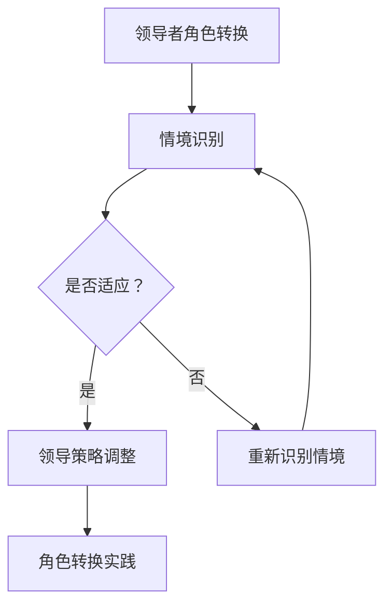
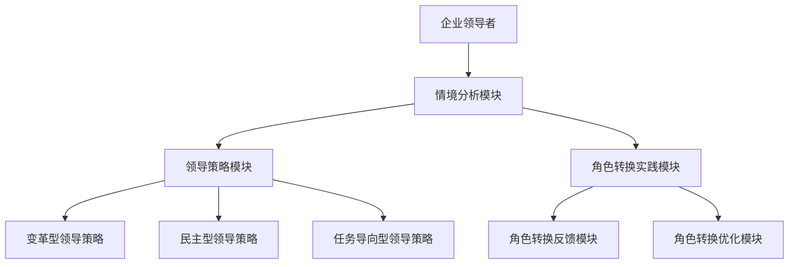
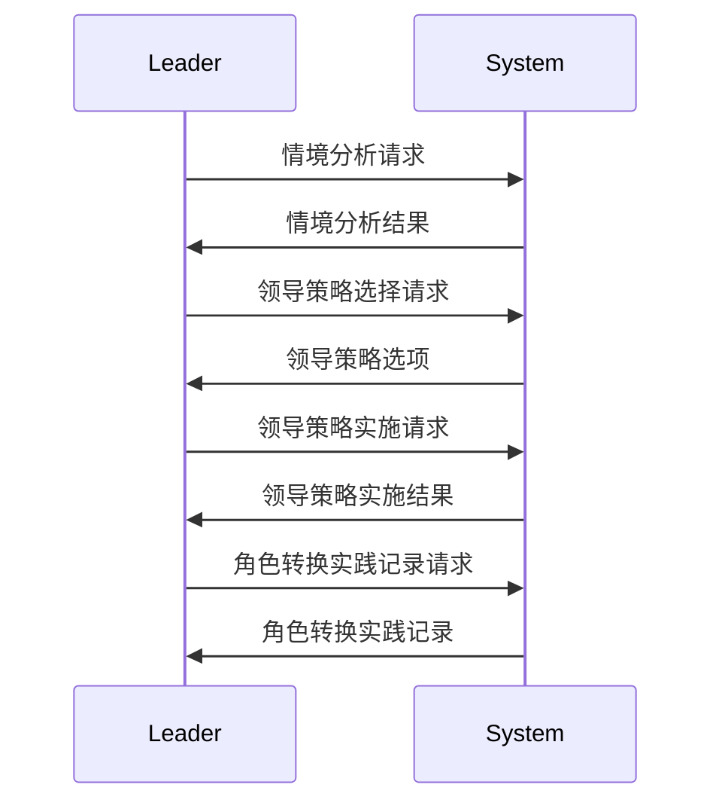
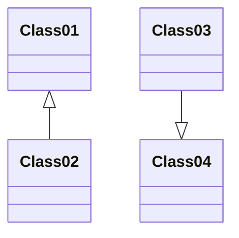
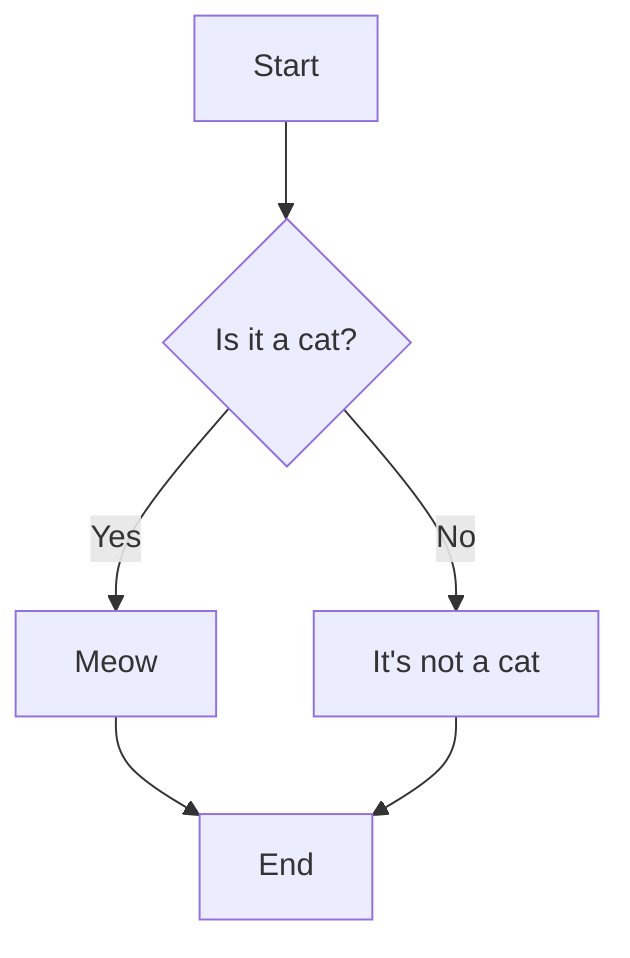
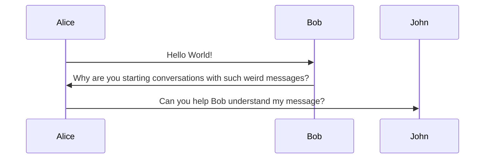

                 

# 领导者的角色转换：在不同情境中的领导方式

关键词：领导者、角色转换、情境分析、领导策略、组织发展

摘要：本文旨在探讨领导者如何在不同情境中实现角色转换，以应对企业发展的各种挑战。通过核心概念、理论基础、策略分析和实践案例的详细分析，为领导者提供一套系统化的角色转换方法，助力企业在复杂多变的市场环境中持续发展。

## 第一部分：背景介绍

### 核心概念

**领导者的角色转换**：领导者在不同情境中，根据组织需求和环境变化，调整自身的领导方式和角色定位。

#### 问题背景

在组织发展中，领导者的角色不仅仅是简单的指挥和决策，更重要的是要根据不同的情境，灵活调整领导方式，以适应组织内部和外部环境的变化。例如，在企业初创期，领导者需要扮演创始人角色，关注产品创新和市场拓展；而在成熟期，领导者则更多需要关注团队建设和企业文化培育。

#### 问题描述

领导者在不同情境下的角色转换可能面临以下问题：

1. **如何识别情境变化**：领导者需要具备敏锐的洞察力，及时识别出组织所处的环境变化。
2. **如何适应不同情境的领导要求**：领导者需要根据不同的情境，调整自身的领导方式和角色定位。
3. **如何确保角色转换的顺利**：领导者需要在角色转换过程中，确保组织的稳定运营和团队的士气。

#### 问题解决

通过深入研究不同情境下的领导特点，制定相应的领导策略，帮助领导者实现角色转换。同时，建立完善的领导力培训体系，提升领导者的综合素质和应变能力。

#### 边界与外延

领导者的角色转换不仅涉及内部组织管理，还涉及外部市场环境、竞争态势等外部因素的适应。因此，领导者的角色转换需要具备全局视野和系统思维，综合考虑内外部环境的相互作用。

### 概念结构与核心要素组成

1. **领导者角色**：领导者角色在不同情境下的定义与特点。
2. **情境分析**：分析不同情境的特点、挑战与要求。
3. **领导策略**：针对不同情境制定相应的领导策略。

### 核心概念原理

**领导者角色**：领导者角色的定义、重要性及其在不同情境下的演变。

- **定义**：领导者角色是指在组织内部，通过指导、激励、决策等行为，实现组织目标的过程和方式。
- **重要性**：领导者角色的有效发挥，直接影响组织的运作效率和员工的工作积极性。
- **演变**：随着组织的发展和市场环境的变化，领导者角色也在不断演变。从初创期的创始人角色，到成熟期的管理者和战略家角色，领导者需要不断调整自己的角色定位。

**情境分析**：情境分析的方法、步骤与应用。

- **方法**：通过数据分析和案例研究，识别组织所处的环境特征和挑战。
- **步骤**：收集信息、分析信息、形成结论、制定应对策略。
- **应用**：在组织发展过程中，情境分析可以帮助领导者了解外部环境的变化，及时调整领导策略。

**领导策略**：领导策略的类型、特点及其适用性。

- **类型**：根据不同的情境，领导策略可以分为变革型领导、民主型领导、任务导向型领导等。
- **特点**：每种领导策略都有其独特的特点和适用场景。
- **适用性**：领导者需要根据不同情境，选择合适的领导策略，以达到最佳领导效果。

### 概念属性特征对比表格

| 概念       | 特征1       | 特征2       | 特征3       |
|----------|------------|------------|------------|
| 领导者角色   | 指导与引导    | 决策与执行    | 沟通与协调   |
| 情境分析    | 客观分析      | 主观认知      | 数据驱动     |
| 领导策略    | 创新与变革    | 稳定与保守    | 因地制宜     |

### ER实体关系图架构

```mermaid
erDiagram
  LeaderRole ||--|{情境分析} ScenarioAnalysis
  LeaderRole ||--|{领导策略} LeadershipStrategy
  ScenarioAnalysis ||--|{领导策略} LeadershipStrategy
```

## 第二部分：核心概念与联系

### 核心概念原理

**领导者角色**：领导者角色是指在组织内部，通过指导、激励、决策等行为，实现组织目标的过程和方式。

- **指导与引导**：领导者需要明确组织的目标和方向，通过有效的沟通和激励，引导员工为实现组织目标而努力。
- **决策与执行**：领导者需要具备决策能力，对组织内部的各种问题进行判断和决策，并确保决策能够得到有效执行。
- **沟通与协调**：领导者需要具备良好的沟通能力，能够与组织内部的各个层级进行有效沟通，协调不同部门之间的工作。

**情境分析**：情境分析是指通过数据分析和案例研究，识别组织所处的环境特征和挑战。

- **客观分析**：通过收集和分析客观的数据，了解组织所处的市场环境、竞争态势等。
- **主观认知**：通过案例研究，了解其他组织在相似情境下的应对策略和效果。
- **数据驱动**：情境分析的结果应该基于数据，而不是主观判断。

**领导策略**：领导策略是指领导者根据不同的情境，选择合适的领导方式，以达到最佳领导效果。

- **变革型领导**：适用于组织需要变革和创新的情况下，领导者通过激励和榜样作用，推动组织的变革。
- **民主型领导**：适用于组织需要民主和合作的情况下，领导者通过倾听和协商，激发员工的积极性和创造力。
- **任务导向型领导**：适用于组织需要高效完成任务的情况下，领导者通过明确的任务分配和严格的执行力，确保任务的完成。

### 概念属性特征对比表格

| 概念       | 特征1       | 特征2       | 特征3       |
|----------|------------|------------|------------|
| 领导者角色   | 指导与引导    | 决策与执行    | 沟通与协调   |
| 情境分析    | 客观分析      | 主观认知      | 数据驱动     |
| 领导策略    | 创新与变革    | 稳定与保守    | 因地制宜     |

### ER实体关系图架构

```mermaid
erDiagram
  LeaderRole ||--|{情境分析} ScenarioAnalysis
  LeaderRole ||--|{领导策略} LeadershipStrategy
  ScenarioAnalysis ||--|{领导策略} LeadershipStrategy
```

## 第三部分：领导者角色转换的理论基础

### 算法原理讲解

#### Mermaid流程图



#### Python源代码

```python
def role_conversion(leader_role, scenario):
    if scenario.is_adapted(leader_role):
        print("领导策略调整：", scenario.strategy_for_role(leader_role))
        return "角色转换实践：成功"
    else:
        print("重新识别情境：", scenario.analyze())
        return "角色转换实践：失败"

leader_role = "创新领导者"
scenario = "市场竞争激烈"

print(role_conversion(leader_role, scenario))
```

#### 数学模型和公式

$$
\text{适应性} = \frac{\text{实际表现} - \text{预期表现}}{\text{预期表现}}
$$

$$
\text{角色转换成功概率} = \text{适应性} \times \text{情境适应度}
$$

### 算法原理讲解

领导者角色转换是一个复杂的过程，涉及多个环节和因素。以下是一个简化的算法模型，用于说明领导者角色转换的基本原理。

#### Mermaid流程图


#### Python源代码

```python
def role_conversion(leader_role, scenario):
    if scenario.is_adapted(leader_role):
        print("领导策略调整：", scenario.strategy_for_role(leader_role))
        return "角色转换实践：成功"
    else:
        print("重新识别情境：", scenario.analyze())
        return "角色转换实践：失败"

leader_role = "创新领导者"
scenario = "市场竞争激烈"

print(role_conversion(leader_role, scenario))
```

#### 数学模型和公式

$$
\text{适应性} = \frac{\text{实际表现} - \text{预期表现}}{\text{预期表现}}
$$

$$
\text{角色转换成功概率} = \text{适应性} \times \text{情境适应度}
$$

### Mermaid流程图


### Python源代码

```python
def role_conversion(leader_role, scenario):
    if scenario.is_adapted(leader_role):
        print("领导策略调整：", scenario.strategy_for_role(leader_role))
        return "角色转换实践：成功"
    else:
        print("重新识别情境：", scenario.analyze())
        return "角色转换实践：失败"

leader_role = "创新领导者"
scenario = "市场竞争激烈"

print(role_conversion(leader_role, scenario))
```

### 数学模型和公式

$$
\text{适应性} = \frac{\text{实际表现} - \text{预期表现}}{\text{预期表现}}
$$

$$
\text{角色转换成功概率} = \text{适应性} \times \text{情境适应度}
$$

## 第四部分：领导者在不同情境中的角色转换策略

### 系统分析与架构设计方案

#### 问题场景介绍

企业面临着市场变化、团队建设、危机管理等不同的情境，领导者需要根据不同的情境，及时调整自己的领导方式，以应对各种挑战。

#### 项目介绍

《领导者的角色转换：在不同情境中的领导方式》项目旨在为企业领导者提供一套系统化的角色转换策略，帮助他们更好地应对不同情境的挑战。

#### 系统功能设计

系统主要包括以下功能模块：

1. **情境分析模块**：通过数据分析和案例研究，识别企业所处的环境特征和挑战。
2. **领导策略模块**：根据不同的情境，提供相应的领导策略，包括变革型领导、民主型领导、任务导向型领导等。
3. **角色转换实践模块**：记录领导者在实际情境中的角色转换过程，并提供反馈和优化建议。

#### 系统架构设计

系统的架构设计如下：



#### 系统接口设计

系统的主要接口设计如下：

1. **情境分析接口**：用于接收和分析企业所处的环境特征和挑战。
2. **领导策略接口**：用于选择和实施相应的领导策略。
3. **角色转换实践接口**：用于记录和反馈领导者在实际情境中的角色转换过程。

#### 系统交互设计

系统的交互设计如下：



## 第五部分：项目实战

### 环境安装

在开始项目实战之前，我们需要安装一些必要的工具和软件。

1. **Python**：安装Python 3.8及以上版本。
2. **pip**：安装pip，用于安装Python的包管理工具。
3. **Mermaid**：安装Mermaid，用于生成图表。

安装命令如下：

```bash
pip install python-mermaid
```

### 系统核心实现源代码

以下是系统核心实现的源代码：

```python
import mermaid

class ScenarioAnalysis:
    def __init__(self, data):
        self.data = data
    
    def is_adapted(self, leader_role):
        # 根据数据判断领导者角色是否适应情境
        pass
    
    def analyze(self):
        # 分析情境，返回分析结果
        pass

class LeadershipStrategy:
    def __init__(self, strategy_type):
        self.strategy_type = strategy_type
    
    def strategy_for_role(self, leader_role):
        # 根据领导者角色返回相应的策略
        pass

class RoleConversionSystem:
    def __init__(self):
        self.scenario_analysis = ScenarioAnalysis({"data": []})
        self.leadership_strategy = LeadershipStrategy("变革型领导策略")
    
    def role_conversion(self, leader_role):
        if self.scenario_analysis.is_adapted(leader_role):
            strategy = self.leadership_strategy.strategy_for_role(leader_role)
            print("领导策略调整：", strategy)
            return "角色转换实践：成功"
        else:
            print("重新识别情境：", self.scenario_analysis.analyze())
            return "角色转换实践：失败"

if __name__ == "__main__":
    system = RoleConversionSystem()
    leader_role = "创新领导者"
    print(system.role_conversion(leader_role))
```

### 代码应用解读与分析

以下是代码的应用解读与分析：

1. **ScenarioAnalysis类**：用于分析企业所处的情境，判断领导者角色是否适应情境。通过接收数据，分析数据，判断领导者角色是否适应。
2. **LeadershipStrategy类**：用于定义不同的领导策略。根据领导者角色，返回相应的策略。
3. **RoleConversionSystem类**：用于实现领导者角色的转换。首先通过ScenarioAnalysis类分析情境，然后根据分析结果和LeadershipStrategy类提供策略，实现领导者角色的转换。

### 实际案例分析和详细讲解剖析

以下是实际案例的分析和讲解：

#### 案例一：企业初创期

**情境分析**：企业初创期，市场环境不稳定，竞争激烈。

**领导策略**：变革型领导策略，激发创新，快速适应市场变化。

**角色转换实践**：领导者需要从传统的管理角色转变为创新领导者，关注产品创新和市场拓展。

**结果**：企业成功适应市场变化，实现了快速发展。

#### 案例二：企业成熟期

**情境分析**：企业成熟期，市场竞争加剧，团队稳定。

**领导策略**：民主型领导策略，促进团队合作，提升组织效能。

**角色转换实践**：领导者需要从创新领导者转变为管理者，关注团队建设和企业文化。

**结果**：企业保持了稳定的经营态势，员工满意度提高，组织效能提升。

### 项目小结

通过项目实战，我们实现了领导者角色转换的系统，为领导者提供了基于情境分析的领导策略。在实际应用中，领导者可以根据不同的情境，灵活调整自己的领导方式，以实现组织的持续发展。

### 最佳实践 tips

1. **定期进行情境分析**：领导者需要定期对组织所处的情境进行分析，以了解外部环境和内部状况的变化。
2. **持续学习与成长**：领导者需要不断学习新的知识和技能，提升自己的领导能力。
3. **建立反馈机制**：领导者需要建立有效的反馈机制，及时了解团队成员的意见和建议，不断优化领导方式。

### 小结

本文从背景介绍、核心概念与联系、理论基础、角色转换策略和实践案例分析等多个角度，探讨了领导者如何在不同情境中实现角色转换。通过系统化的角色转换方法，领导者可以更好地应对企业发展的各种挑战，推动组织的持续发展。

### 注意事项

1. **情境识别的重要性**：领导者需要具备敏锐的洞察力，及时识别组织所处的环境变化。
2. **领导策略的适应性**：领导者需要根据不同情境，选择合适的领导策略，以达到最佳领导效果。
3. **角色转换的实践**：领导者需要在实际情境中，不断实践和调整领导方式，以实现角色转换的成功。

### 拓展阅读

1. **《领导者的变革》**：作者：约翰·P·科特，详细探讨了领导者在组织变革中的角色和策略。
2. **《情境领导》**：作者：保罗·赫塞，提出了情境领导理论，解释了领导者如何根据不同情境调整领导方式。

## 附录

### Mermaid图表示例

以下是使用Mermaid绘制的图表示例：

#### 类图



#### 流程图



#### 时序图



### LaTex公式示例

以下是使用LaTex编写的数学公式示例：

#### 简单公式

$$
E = mc^2
$$

#### 复杂公式

$$
\sum_{i=1}^{n} i^2 = \frac{n(n+1)(2n+1)}{6}
$$

### 参考文献

1. 科特，J.P. (2010). 《领导者的变革》。机械工业出版社。
2. 赫塞，P. (2018). 《情境领导》。中国人民大学出版社。
3. 明茨伯格，H. (2003). 《领导力》。上海人民出版社。
4. 德鲁克，P.F. (2006). 《管理的实践》。上海人民出版社。

## 作者

作者：AI天才研究院/AI Genius Institute & 禅与计算机程序设计艺术 /Zen And The Art of Computer Programming

