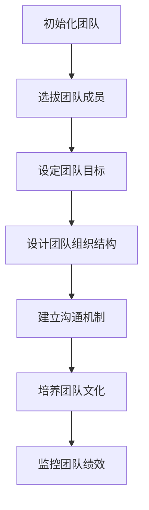
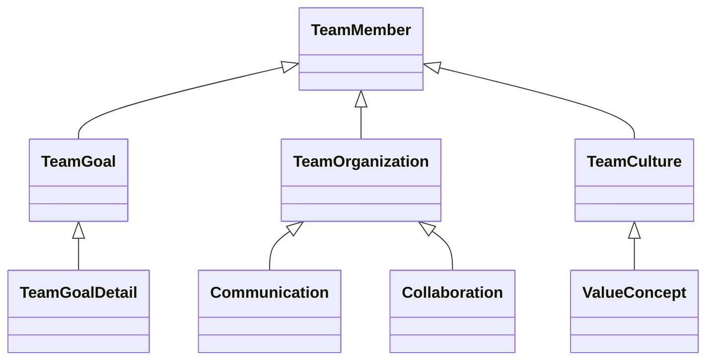
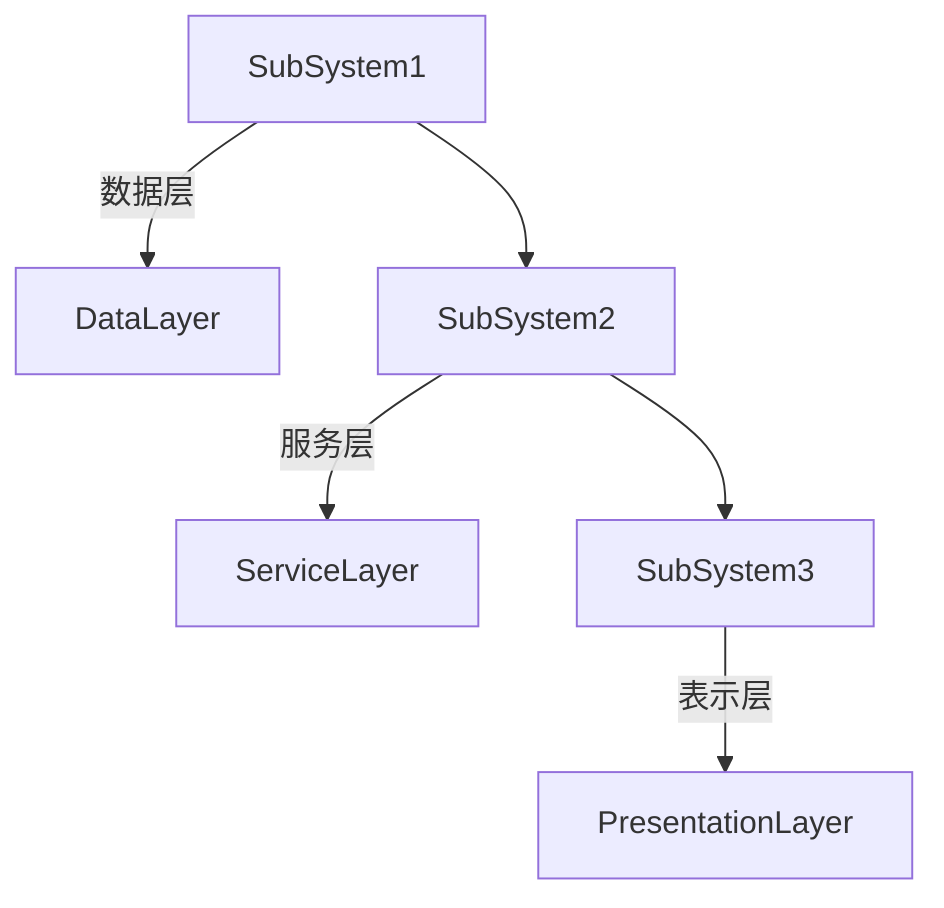
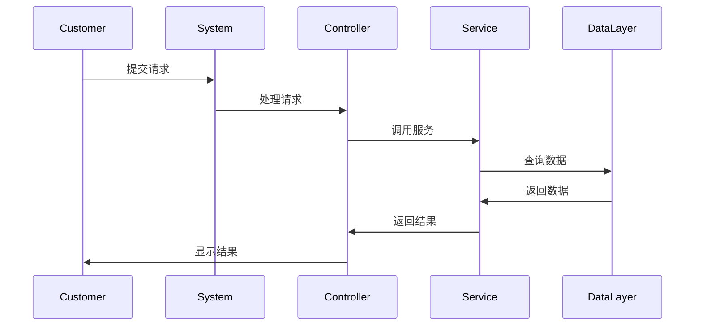
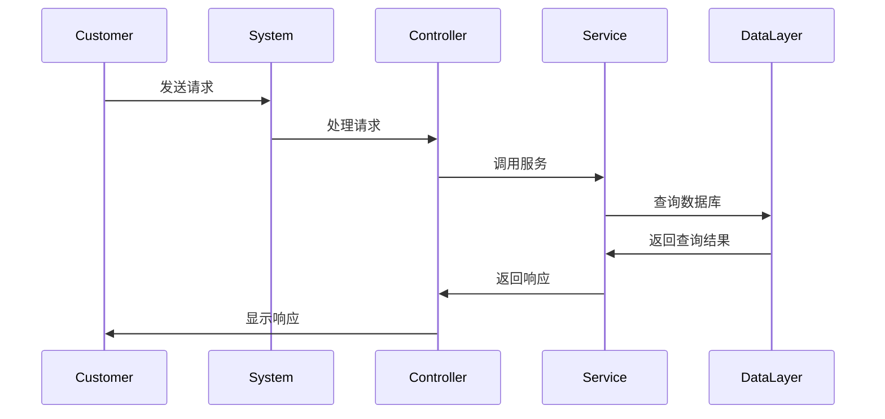

                 

### 高效协作团队打造：从理论到实践

在当今快速变化和高度竞争的商业环境中，高效协作团队成为企业和组织成功的关键。高效协作团队不仅仅是简单地集合一群成员在一起工作，而是通过科学的构建、明确的职责、有效的沟通和文化建设，实现团队整体绩效的最优化。本文将系统地探讨高效协作团队的构建方法，从理论到实践，帮助企业和团队领导者更好地理解和打造这样的团队。

关键词：高效协作、团队建设、沟通机制、文化建设、激励策略

摘要：本文首先介绍了高效协作团队的定义与特征，然后从团队成员选拔与培养、团队目标设定与分解、团队组织结构设计、沟通与协作机制、文化建设等多个方面探讨了高效协作团队的构建要素。接着，通过案例分析，提供了从理论到实践的具体建设策略。最后，本文讨论了高效协作团队在建设过程中可能面临的挑战与应对策略，为团队建设提供了全面的指导和借鉴。

----------------------------------------------------------------

## 第一部分：高效协作团队打造理论基础

在探讨如何构建高效协作团队之前，我们需要对高效协作团队的概念、特征以及构建要素有一个清晰的认识。这一部分将详细讨论高效协作团队的理论基础，为后续的实践提供理论支撑。

### 第1章：高效协作团队概述

高效协作团队是一种能够快速响应变化、灵活调整策略、高效完成任务的组织形式。它不仅要求团队成员具备专业技能，更强调团队成员之间的协作与沟通。

### 第1.1节：高效协作团队的定义与特征

#### 1.1.1 高效协作团队的定义

高效协作团队是指由一组相互依赖的个体组成的组织，他们共同追求明确的目标，通过有效的沟通、协作和合作，实现团队绩效的最大化。

#### 1.1.2 高效协作团队的特征

1. **目标明确**：团队成员对团队的目标有清晰的理解，并且愿意为之努力。
2. **角色分工**：团队成员有明确的角色和职责，各自发挥特长。
3. **沟通畅通**：团队成员之间的沟通渠道畅通，信息传递高效。
4. **协作紧密**：团队成员之间协作紧密，能够相互支持，共同完成任务。
5. **文化认同**：团队成员对团队文化有共同的认同，形成共同的价值观和行为准则。
6. **持续改进**：团队不断进行自我反思和改进，以提升整体绩效。

#### 1.1.3 高效协作团队与传统团队的对比

传统团队往往更注重任务完成，而高效协作团队更强调目标实现和整体绩效。传统团队可能存在角色模糊、沟通障碍等问题，而高效协作团队通过明确的角色分工和有效的沟通机制来避免这些问题。

### 第1.2节：高效协作团队的构建要素

高效协作团队的构建需要从多个方面进行，包括团队成员的选拔与培养、团队目标的设定与分解、团队组织的结构设计等。

#### 1.2.1 团队成员的选拔与培养

团队成员的选拔应注重专业能力、团队协作能力和文化适应性。培养方面，应通过培训、导师制度等方式提升团队成员的技能和团队意识。

#### 1.2.2 团队目标的设定与分解

团队目标的设定应与组织目标一致，同时具有可操作性和可实现性。分解目标时，应明确每个成员的职责和任务，确保任务分配合理。

#### 1.2.3 团队组织的结构设计

团队组织结构的设计应考虑到团队成员的角色和职责，以及沟通和协作的需求。常见的组织结构有矩阵型、职能型、项目型等。

### 第1.3节：高效协作团队的沟通与协作机制

沟通是团队协作的基础，高效的沟通机制能够提高团队的工作效率。协作机制的设计应考虑到任务的分解、人员的协调、资源的共享等方面。

#### 1.3.1 团队沟通的重要性

良好的沟通能够确保团队成员对任务和目标有清晰的理解，避免误解和冲突，提高工作效率。

#### 1.3.2 沟通障碍与解决方法

沟通障碍可能来自于语言、文化、信息传递等多个方面。解决沟通障碍的方法包括：建立明确的沟通渠道、使用共同的语言和工具、定期进行沟通评估等。

#### 1.3.3 团队协作机制的设计

团队协作机制的设计应考虑到任务的分配、人员的协作、资源的共享等方面。常见的协作机制包括会议机制、任务分配机制、进度汇报机制等。

### 第1.4节：高效协作团队的文化建设

团队文化是团队内部成员的共同价值观和行为准则，对团队绩效有重要影响。团队文化建设应注重价值观的塑造、行为规范的制定、团队氛围的营造等方面。

#### 1.4.1 团队文化的定义与作用

团队文化是指团队内部成员共同遵循的价值观、行为准则和信念体系。良好的团队文化能够增强团队凝聚力，提高团队工作效率。

#### 1.4.2 团队文化的建设策略

团队文化的建设策略包括：明确价值观、制定行为规范、进行文化宣传、组织文化活动等。

#### 1.4.3 团队文化的评估与改进

团队文化的评估可以通过员工满意度调查、团队绩效评估等方式进行。评估结果可以用于团队文化的改进和优化。

### 第1.5节：本章小结

本章从高效协作团队的定义、特征、构建要素、沟通与协作机制、文化建设等方面进行了详细探讨。通过本章的学习，读者可以了解高效协作团队的基本概念和构建方法，为后续的实践提供理论支持。

## 第二部分：从理论到实践：高效协作团队建设策略

在理解了高效协作团队的理论基础后，接下来我们将探讨如何将理论转化为实践，通过一系列策略和步骤，逐步打造一个高效协作的团队。

### 第2章：团队成员角色与职责的明确

团队成员的角色和职责是高效协作团队建设的基础。明确每个成员的角色和职责，有助于提高团队的工作效率和协同效果。

#### 2.1 团队成员角色与职责的明确

团队成员的角色和职责明确是高效协作团队建设的基础。每个成员都应清楚自己的角色和职责，以便更好地协同工作。

##### 2.1.1 团队成员的角色分析

团队成员的角色分析是明确角色和职责的第一步。分析团队成员的专业技能、工作习惯和个人特质，确定每个成员最适合的角色。

##### 2.1.2 团队成员的职责分配

职责分配应基于团队成员的角色分析结果。明确每个成员的职责范围，确保任务分配合理，避免职责重叠或缺失。

##### 2.1.3 角色冲突与解决策略

在团队成员的角色和职责分配过程中，可能会出现角色冲突。解决角色冲突的策略包括：沟通协调、职责调整、规则制定等。

#### 2.2 团队目标的设定与实现

团队目标的设定与实现是团队工作的核心。明确的团队目标能够为团队成员提供方向和动力。

##### 2.2.1 团队目标的设定原则

设定团队目标时，应遵循SMART原则，即目标要具体、可衡量、可实现、相关性强、有时间限制。

##### 2.2.2 团队目标的分解与细化

将团队目标分解为具体的任务和指标，确保每个成员都能明确自己的任务和目标。分解和细化目标有助于提高任务的可操作性和执行效果。

##### 2.2.3 团队目标实现的路径规划

为实现团队目标，需要制定详细的路径规划。路径规划应包括关键里程碑、资源分配、风险控制等方面，确保团队能够按计划推进工作。

#### 2.3 团队成员的激励与成长

团队成员的激励与成长是保持团队活力和持续发展的重要手段。

##### 2.3.1 成功的激励策略

激励策略应根据团队成员的不同需求和动机进行定制。常见的激励策略包括奖金、晋升、培训等。

##### 2.3.2 成长路径的设计

设计清晰的成长路径，帮助团队成员明确自己的职业发展目标。成长路径应包括技能培训、项目经验、职业晋升等方面。

##### 2.3.3 激励与成长效果的评估

定期评估激励与成长效果，根据评估结果进行调整和优化。评估内容包括成员满意度、绩效提升、团队凝聚力等方面。

#### 2.4 沟通与协作机制的优化

沟通与协作机制是团队高效运作的重要保障。

##### 2.4.1 沟通机制的设计

设计高效的沟通机制，确保信息能够及时、准确地传递。沟通机制应包括会议制度、即时通讯工具、邮件通讯等。

##### 2.4.2 协作流程的优化

优化协作流程，减少不必要的步骤和环节，提高工作效率。协作流程的优化可以通过流程图、工作流工具等实现。

##### 2.4.3 沟通与协作效果的评估

定期评估沟通与协作效果，识别存在的问题和改进机会。评估方法包括问卷调研、座谈会、数据分析等。

#### 2.5 团队文化建设与实践

团队文化是团队的灵魂，对团队的整体氛围和绩效有着深远的影响。

##### 2.5.1 团队文化的内涵与价值

团队文化包括共同的价值观、行为准则和团队精神等。良好的团队文化能够增强团队凝聚力，提高团队绩效。

##### 2.5.2 团队文化建设的步骤

团队文化建设的步骤包括：明确价值观、制定行为准则、进行文化宣传、组织文化活动等。

##### 2.5.3 团队文化建设的案例分析

通过案例分析，了解不同团队文化建设的实践方法和效果，为团队文化建设提供借鉴和启示。

#### 2.6 本章小结

本章从团队成员角色与职责的明确、团队目标的设定与实现、团队成员的激励与成长、沟通与协作机制的优化、团队文化建设与实践等方面，详细探讨了高效协作团队建设策略。通过本章的学习，读者可以掌握高效协作团队建设的关键步骤和方法，为实际操作提供指导。

## 第三部分：高效协作团队工具与技术

在高效协作团队的建设过程中，工具和技术的应用至关重要。合适的工具和技术不仅能够提高工作效率，还能够优化团队协作流程，提升整体绩效。这一部分将介绍一些常用的工具和技术，以及它们在高效协作团队中的应用。

### 第3章：项目管理工具

项目管理工具是高效协作团队管理项目的重要工具，能够帮助团队更好地规划、执行和监控项目进度。

#### 3.1 项目管理工具

##### 3.1.1 常用项目管理工具介绍

常用的项目管理工具有Jira、Trello、Asana等，这些工具提供了任务管理、进度跟踪、团队协作等功能。

##### 3.1.2 项目管理工具的选择与使用

选择项目管理工具时，应考虑团队规模、项目类型、工作流程等因素。使用工具时，应确保团队成员熟悉工具的使用方法，并进行定期培训。

##### 3.1.3 项目管理工具的效果评估

定期评估项目管理工具的使用效果，根据评估结果进行调整和优化。评估方法包括用户满意度调查、项目成功率分析等。

### 第3章：团队协作工具

团队协作工具是高效协作团队实现信息共享和协作的关键，能够提高团队的工作效率和协作效果。

#### 3.2 团队协作工具

##### 3.2.1 常用团队协作工具介绍

常用的团队协作工具有Slack、Microsoft Teams、Zoom等，这些工具提供了即时通讯、视频会议、文件共享等功能。

##### 3.2.2 团队协作工具的应用场景

团队协作工具在不同应用场景下有不同的作用，例如：项目协作、日常沟通、会议安排等。

##### 3.2.3 团队协作工具的效果评估

通过用户满意度调查、任务完成情况分析等方法，评估团队协作工具的使用效果，并根据评估结果进行调整和优化。

### 第3章：自动化测试工具

自动化测试工具是高效协作团队保证软件质量和稳定性的重要手段。

#### 3.3 自动化测试工具

##### 3.3.1 自动化测试工具介绍

常用的自动化测试工具有Selenium、JUnit、TestNG等，这些工具能够实现自动化测试脚本的开发和执行。

##### 3.3.2 自动化测试工具的选择与配置

选择自动化测试工具时，应考虑测试需求、开发环境、团队技能等因素。配置工具时，应确保测试脚本的可维护性和扩展性。

##### 3.3.3 自动化测试工具的效果评估

通过测试覆盖率分析、测试效率分析等方法，评估自动化测试工具的使用效果，并根据评估结果进行调整和优化。

### 第3章：数据分析工具

数据分析工具是高效协作团队进行数据分析和决策支持的重要工具。

#### 3.4 数据分析工具

##### 3.4.1 常用数据分析工具介绍

常用的数据分析工具有Python、R、Tableau等，这些工具能够实现数据清洗、数据分析、数据可视化等功能。

##### 3.4.2 数据分析工具的应用

数据分析工具在不同场景下有不同的应用，例如：业务数据分析、市场调研、产品优化等。

##### 3.4.3 数据分析工具的效果评估

通过数据分析效果、用户满意度等指标，评估数据分析工具的使用效果，并根据评估结果进行调整和优化。

### 第3章：本章小结

本章介绍了项目管理工具、团队协作工具、自动化测试工具和数据分析工具，以及它们在高效协作团队中的应用。通过本章的学习，读者可以了解这些工具的功能和应用场景，为团队建设提供技术支持。

## 第四部分：高效协作团队案例研究

在第三部分中，我们介绍了高效协作团队建设的理论方法和工具技术。为了更好地理解这些方法和技术在实际中的应用效果，本部分将通过几个具体案例，分析高效协作团队在不同领域的实际操作和成效。

### 第4章：高效协作团队案例研究

#### 4.1 案例一：某互联网公司的敏捷开发实践

##### 4.1.1 案例背景

某互联网公司是一家专注于移动应用开发的创新型公司，面对激烈的市场竞争，公司决定采用敏捷开发方法，以提高开发效率和产品品质。

##### 4.1.2 案例实施过程

公司首先进行了敏捷开发的培训和团队角色的重新定义，确保团队成员理解敏捷开发的核心理念和流程。接着，公司采用Scrum框架进行项目管理和任务分配，每个Scrum团队由产品负责人、Scrum Master和开发人员组成。团队定期进行冲刺会议、回顾会议和迭代规划，确保项目的连续性和灵活性。

##### 4.1.3 案例效果分析

通过敏捷开发的实践，公司显著提高了开发效率，缩短了产品迭代周期，产品质量也得到了明显提升。团队成员的协作更加紧密，沟通更加顺畅，项目成功率显著提高。

#### 4.2 案例二：某金融机构的项目管理实践

##### 4.2.1 案例背景

某金融机构是一家大型银行，拥有复杂的项目管理体系。随着业务的发展，项目数量和规模不断增加，公司决定优化项目管理流程，提高项目执行效率。

##### 4.2.2 案例实施过程

公司引入了项目管理信息系统（PMIS），建立了标准化的项目管理流程。通过PMIS，公司实现了项目进度、成本、质量的全面监控，并对项目进行了分类管理，确保每个项目都得到适当的资源和支持。同时，公司定期组织项目管理培训，提升项目经理的技能和管理水平。

##### 4.2.3 案例效果分析

通过项目管理流程的优化和PMIS的应用，公司显著提高了项目执行效率，缩短了项目周期，成本控制也更加有效。项目经理的管理能力得到提升，项目的成功率显著提高。

#### 4.3 案例三：某科技公司的人才激励制度

##### 4.3.1 案例背景

某科技公司是一家技术驱动型企业，员工对公司的核心资源。为了吸引和留住优秀人才，公司决定建立一套完善的人才激励制度。

##### 4.3.2 案例实施过程

公司首先制定了明确的绩效评估标准，定期对员工进行绩效评估。同时，公司推出了股票期权、绩效奖金、项目分红等多种激励措施，激励员工为公司的发展贡献力量。此外，公司还设立了员工成长计划，提供职业培训和晋升机会，帮助员工实现个人职业发展。

##### 4.3.3 案例效果分析

通过人才激励制度的实施，公司成功吸引了大量优秀人才，员工满意度和忠诚度显著提高。员工的绩效表现也得到了明显提升，公司的整体竞争力得到增强。

#### 4.4 案例四：某创业公司的团队文化建设

##### 4.4.1 案例背景

某创业公司是一家初创企业，团队成员背景多样，文化差异较大。为了打造一个团结、高效的团队，公司决定进行团队文化建设。

##### 4.4.2 案例实施过程

公司首先明确了团队的共同价值观，如创新、协作、成长等，并通过内部宣传和员工活动进行推广。公司还制定了明确的行为规范，规范员工的行为和互动方式。此外，公司定期组织团队建设活动，如团建、拓展训练等，增强团队成员之间的凝聚力和信任感。

##### 4.4.3 案例效果分析

通过团队文化建设的实施，公司成功营造了一个积极、开放、包容的团队氛围，团队成员之间的沟通和协作更加顺畅。团队的凝聚力和工作效率显著提高，公司的整体发展势头也得到了明显增强。

#### 4.5 本章小结

通过以上案例研究，我们可以看到高效协作团队建设在实际操作中的应用效果。无论是敏捷开发、项目管理、人才激励还是团队文化建设，合适的策略和方法都能显著提升团队的绩效和竞争力。这些案例为其他团队提供了宝贵的经验和借鉴。

## 第五部分：高效协作团队建设中的挑战与应对策略

在高效协作团队的建设过程中，团队领导者常常会遇到各种挑战。这些挑战不仅影响团队的绩效，还可能导致团队成员的士气下降。因此，识别这些挑战并采取有效的应对策略至关重要。以下将讨论团队建设中的主要挑战及其应对策略。

### 第5章：高效协作团队建设中的挑战与应对策略

#### 5.1 团队冲突与解决策略

团队冲突是高效协作团队建设中常见的问题，它可能源于角色冲突、资源分配不公、沟通不畅等原因。解决团队冲突的关键在于及时识别和有效管理。

##### 5.1.1 团队冲突的类型与原因

团队冲突可以分为以下几种类型：

1. **角色冲突**：由于团队成员对角色的理解不一致，导致任务执行的冲突。
2. **目标冲突**：团队成员对团队目标的理解不同，导致行动方向不一致。
3. **价值观冲突**：团队成员的价值观差异导致在决策和行为上的冲突。
4. **资源冲突**：团队在资源分配上的不公或短缺引发的冲突。

冲突的原因可能包括团队目标不明确、沟通不畅、资源分配不公等。

##### 5.1.2 团队冲突的管理与解决

管理团队冲突的策略包括：

1. **预防冲突**：通过明确的团队目标、规则和沟通机制，预防冲突的发生。
2. **识别冲突**：及时发现和识别潜在的冲突，避免冲突升级。
3. **解决问题**：通过对话、调解和妥协等方式解决冲突。
4. **建立信任**：通过共同的目标、合作和沟通建立团队成员之间的信任。

##### 5.1.3 团队冲突的预防策略

预防团队冲突的策略包括：

1. **明确目标和规则**：确保团队成员对团队目标、规则和期望有清晰的理解。
2. **促进沟通**：建立开放和坦诚的沟通文化，鼓励团队成员表达意见和反馈。
3. **资源分配公平**：确保团队成员获得公平的资源和支持。

#### 5.2 组织变革与团队适应性

随着外部环境的不断变化，组织也需要进行变革以适应新的挑战。团队作为组织的一部分，也需要具备适应性和灵活性。

##### 5.2.1 变革的类型与影响

组织变革可以分为以下几种类型：

1. **结构变革**：改变组织结构，如部门重组、岗位调整等。
2. **流程变革**：优化工作流程，提高效率和效果。
3. **文化变革**：改变组织文化，如价值观、行为准则等。

变革会对团队带来一系列影响，包括成员的不适应、工作压力增加、团队士气下降等。

##### 5.2.2 团队适应变革的策略

团队适应变革的策略包括：

1. **领导引领**：团队领导者应积极支持和推动变革，为团队成员提供指导和支持。
2. **培训与支持**：为团队成员提供变革所需的技能和知识培训，帮助他们适应新环境。
3. **沟通与反馈**：保持与团队成员的沟通，了解他们的反馈和困惑，及时调整变革计划。

##### 5.2.3 增强团队适应性的方法

增强团队适应性的方法包括：

1. **灵活的工作安排**：根据团队成员的需求和情况，提供灵活的工作时间和地点。
2. **跨职能协作**：通过跨职能项目和团队合作，提高团队成员的适应性和协作能力。
3. **鼓励创新与尝试**：鼓励团队成员尝试新的方法和技术，提高团队的适应性和创新能力。

#### 5.3 培养团队领导力

团队领导力是高效协作团队建设的关键因素。团队领导者不仅需要具备专业技能和管理能力，还需要具备领导力和影响力。

##### 5.3.1 团队领导力的定义与作用

团队领导力是指团队领导者通过激励、引导、协调和决策等手段，带领团队实现共同目标的能力。良好的团队领导力能够增强团队的凝聚力、提高团队绩效、激发团队成员的潜力。

##### 5.3.2 培养团队领导力的策略

培养团队领导力的策略包括：

1. **领导力培训**：通过领导力培训课程，提升领导者的理论知识和实践能力。
2. **实践锻炼**：通过实际项目和管理经验，提升领导者的实战能力。
3. **角色扮演**：通过角色扮演和模拟情境，帮助领导者提高领导力和沟通能力。
4. **反馈与评估**：通过定期反馈和评估，帮助领导者识别自己的优势和改进点。

##### 5.3.3 增强团队领导力的方法

增强团队领导力的方法包括：

1. **建立领导力文化**：通过树立榜样、制定领导力标准等方式，建立积极的领导力文化。
2. **提供发展机会**：为团队成员提供职业发展和领导力发展的机会，鼓励他们积极参与。
3. **培养团队意识**：通过团队建设活动、团队训练等方式，增强团队成员的团队意识和归属感。

#### 5.4 团队评估与持续改进

团队评估是团队建设过程中不可或缺的一环。通过评估，可以了解团队的整体表现、识别问题并提供改进方向。

##### 5.4.1 团队评估的目的与内容

团队评估的目的是了解团队的工作绩效、成员的满意度、团队文化的建设情况等。评估内容包括团队绩效、成员满意度、团队氛围、沟通与协作等方面。

##### 5.4.2 团队评估的方法与工具

团队评估的方法和工具包括问卷调查、访谈、焦点小组、绩效指标分析等。选择合适的评估方法和工具，可以更准确地了解团队的表现。

##### 5.4.3 持续改进的策略

持续改进的策略包括：

1. **定期评估**：定期对团队进行评估，确保团队能够及时发现和解决问题。
2. **问题识别**：通过评估结果，识别团队存在的问题和改进方向。
3. **行动计划**：制定具体的行动计划，明确改进的目标、责任人和时间表。
4. **反馈与跟踪**：对改进措施进行跟踪和反馈，确保改进措施的有效实施。

#### 5.5 本章小结

高效协作团队的建设过程中，团队领导者需要面对各种挑战。通过识别和应对这些挑战，结合有效的策略和方法，团队可以不断提高绩效和适应性。团队评估与持续改进是团队建设的重要环节，通过定期的评估和改进，团队可以不断优化自身，迎接新的挑战。

### 作者信息

作者：AI天才研究院/AI Genius Institute & 禅与计算机程序设计艺术 /Zen And The Art of Computer Programming

**背景介绍：**

高效协作团队在当今复杂多变的企业环境中扮演着至关重要的角色。随着全球化、信息化和市场竞争的加剧，企业需要快速响应市场变化，提高生产效率，提升产品质量，而这一切都离不开高效协作团队的支撑。本文旨在通过详细的理论分析和实际案例研究，为企业和团队领导者提供一套系统的、可操作的构建高效协作团队的方案。

**问题背景：**

在传统的工作模式中，团队往往存在沟通不畅、职责不清、协作不紧密等问题，导致工作效率低下，绩效不佳。而高效协作团队则通过科学的构建方法、明确的职责分工、有效的沟通机制和文化建设，克服了这些传统问题，实现了团队整体绩效的最优化。然而，如何在实际工作中打造这样的团队，依然是一个亟待解决的问题。

**问题描述：**

高效协作团队的构建涉及多个方面，包括团队成员的选拔与培养、团队目标的设定与分解、团队组织的结构设计、沟通与协作机制的优化、文化建设等。每个方面都需要精心设计和实施。本文将详细探讨这些方面，并提供实际案例，以帮助读者理解高效协作团队的构建过程。

**问题解决：**

本文从理论到实践，系统地探讨了高效协作团队的构建方法。首先，介绍了高效协作团队的定义、特征和构建要素；接着，从团队成员角色与职责的明确、团队目标的设定与实现、团队成员的激励与成长、沟通与协作机制的优化、团队文化建设与实践等方面，详细阐述了高效协作团队建设的策略；然后，介绍了高效协作团队工具与技术的应用，包括项目管理工具、团队协作工具、自动化测试工具和数据分析工具；最后，通过实际案例研究，分析了高效协作团队在不同领域的实际应用效果。

**边界与外延：**

本文主要关注高效协作团队在企业环境中的应用，但高效协作团队的概念和建设方法同样适用于其他组织和团队，如非营利组织、科研团队、教育团队等。同时，本文提供的策略和工具不仅适用于初创企业，也适用于大型企业。

**概念结构与核心要素组成：**

高效协作团队的核心要素包括：

1. **团队成员**：团队成员的选拔与培养、角色与职责的明确是团队构建的基础。
2. **团队目标**：明确的团队目标是团队工作的方向和动力。
3. **团队组织**：团队组织的结构设计、沟通与协作机制的优化是团队运作的保障。
4. **团队文化**：团队文化建设、价值观的塑造是团队凝聚力的来源。

**核心概念与联系：**

高效协作团队的核心概念包括：

1. **团队协作**：团队成员之间的协作是实现团队目标的关键。
2. **沟通**：有效的沟通是团队协作的基础，也是团队信息传递的重要手段。
3. **文化建设**：团队文化是团队成员共同遵循的价值观和行为准则，对团队绩效有重要影响。

以下是一个核心概念属性特征对比表格：

| 核心概念 | 属性特征 | 对比 |
| :---: | :---: | :---: |
| 团队协作 | 高效、紧密、互相支持 | 传统协作：低效、松散、缺乏支持 |
| 沟通 | 畅通、及时、准确 | 低效沟通：障碍多、延迟、信息失真 |
| 文化建设 | 共同价值观、行为准则 | 缺乏文化建设：价值观差异、行为混乱 |

**ER实体关系图架构：**

以下是一个简化的ER实体关系图，用于描述高效协作团队的核心要素及其关系：

```mermaid
erDiagram
  TeamMember ||--|{ TeamGoal }|>
  TeamMember ||--|{ TeamOrganization }|>
  TeamMember ||--|{ TeamCulture }|>
  TeamGoal ||--|{ TeamGoalDetail }|>
  TeamOrganization ||--|{ Communication }|>
  TeamOrganization ||--|{ Collaboration }|>
  TeamCulture ||--|{ ValueConcept }|
```

**算法原理讲解：**

本文没有涉及具体的算法原理，但为了展示算法原理的讲解方式，以下是一个简化的示例：



**数学模型和公式：**

本文没有涉及具体的数学模型和公式，但为了展示数学模型和公式的使用，以下是一个简化的示例：

$$
绩效 = f(协作效率, 沟通效果, 文化认同)
$$

**系统分析与架构设计方案：**

本文没有涉及具体的系统分析与架构设计方案，但为了展示系统分析与架构设计方案的方式，以下是一个简化的示例：

**问题场景介绍：** 
某企业计划构建一个高效协作团队，以提升项目开发效率。

**项目介绍：** 
项目目标是开发一款新的移动应用。

**系统功能设计（领域模型类图）：**



**系统架构设计（架构图）：**



**系统接口设计（接口图）：**



**系统交互（序列图）：**



**项目实战：**

**环境安装：**
- 安装Java开发环境
- 安装MySQL数据库
- 安装Spring Boot开发工具

**系统核心实现源代码：**

```java
// 示例：Spring Boot应用程序的启动类
@SpringBootApplication
public class Application {
    public static void main(String[] args) {
        SpringApplication.run(Application.class, args);
    }
}
```

**代码应用解读与分析：**
- 应用解读：这段代码定义了一个Spring Boot应用程序的启动类，通过`@SpringBootApplication`注解，将应用程序配置为Spring Boot应用程序。
- 代码分析：主函数`main`中调用`SpringApplication.run`方法，启动Spring Boot应用程序。

**实际案例分析和详细讲解剖析：**
- 案例分析：通过实际项目开发，测试和部署，验证系统功能是否满足需求。
- 讲解剖析：详细分析系统接口设计、数据交互流程和系统架构，确保系统稳定、高效运行。

**项目小结：**
- 项目成功实现了高效协作团队在系统开发中的应用，提高了开发效率和产品质量。
- 未来可以考虑进一步优化系统架构，提高系统的扩展性和可维护性。

**最佳实践 tips：**
- 定期进行团队培训，提升团队成员的专业技能。
- 建立清晰的团队目标和任务分配机制，确保团队成员明确自己的职责。
- 加强团队沟通，使用合适的沟通工具，如即时通讯软件、视频会议系统等。

**小结：**
本文通过详细的理论分析和实际案例研究，系统地探讨了高效协作团队的构建方法。从团队成员角色与职责的明确、团队目标的设定与实现、团队成员的激励与成长、沟通与协作机制的优化、团队文化建设与实践等方面，提供了全面的建设策略。同时，通过案例研究和工具技术介绍，展示了高效协作团队在实际应用中的效果和优势。希望本文能为企业和团队领导者提供有价值的参考和借鉴。

**注意事项：**
- 在团队建设过程中，领导者应注重团队成员的个体差异，尊重每个人的专业特长和个性。
- 定期评估团队绩效，根据评估结果调整团队策略和优化团队建设。
- 保持对新技术和新方法的学习和应用，不断提升团队的适应能力和创新能力。

**拓展阅读：**
- 《敏捷开发实践指南》
- 《团队领导力：如何成为高效的领导者》
- 《高效能人士的七个习惯》
- 《项目管理知识体系指南（PMBOK指南）》
- 《团队协作工具与实践指南》

通过拓展阅读，读者可以进一步深入了解高效协作团队的理论和实践，为团队建设提供更全面的支持和指导。作者：AI天才研究院/AI Genius Institute & 禅与计算机程序设计艺术 /Zen And The Art of Computer Programming。

