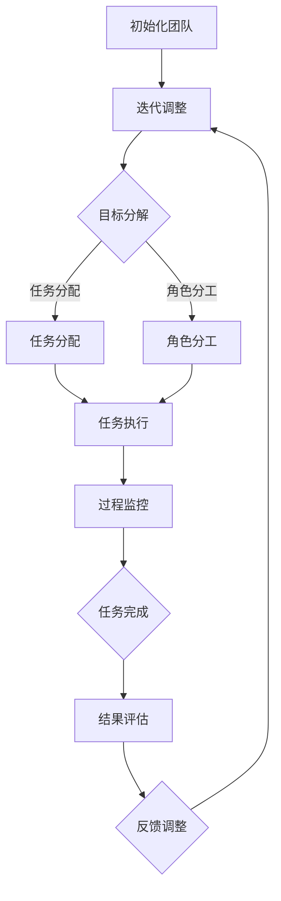
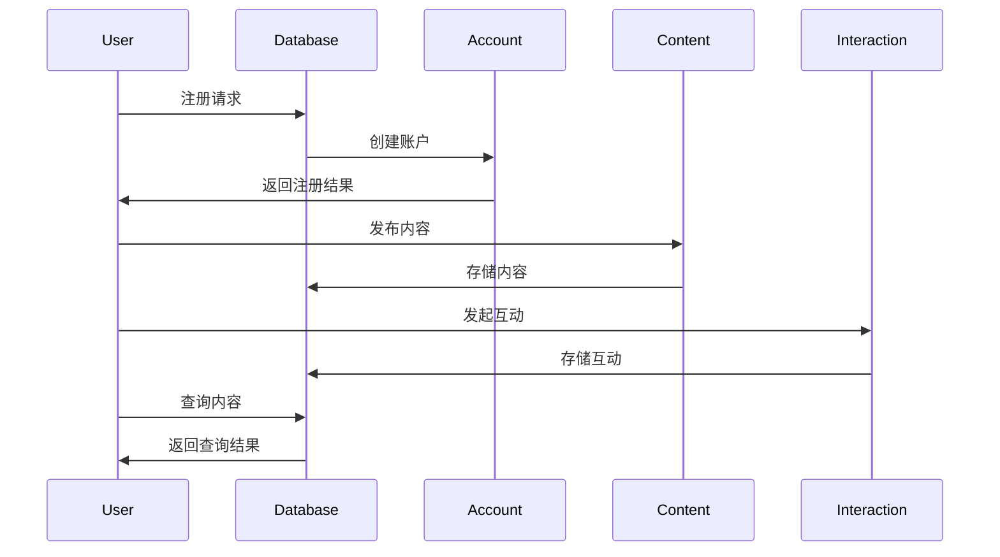
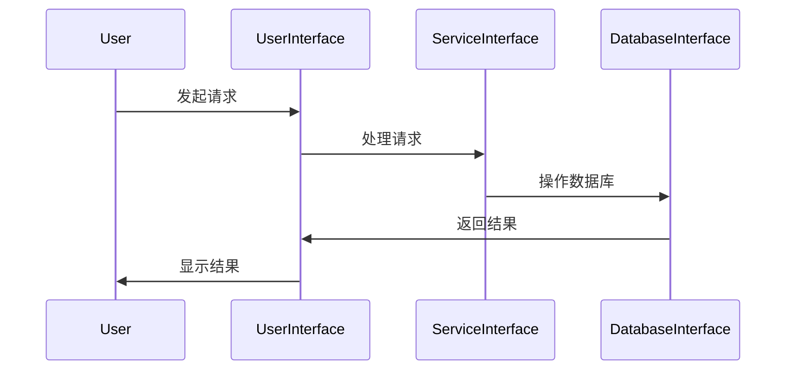

                 

### 高效团队打造：从理论到实践的全面指南

高效团队是企业竞争力的重要源泉，它能够快速响应市场变化，高效完成复杂项目，并促进企业持续发展。然而，构建一个高效的团队并非易事，它需要科学的理论指导和严谨的实践操作。本文将深入探讨高效团队的构建过程，从理论到实践，提供一套全面、系统的指南。

#### 关键词

- 高效团队
- 团队协作
- 团队目标
- 团队成员
- 团队流程
- 团队文化

#### 摘要

本文旨在探讨如何构建高效团队，通过背景介绍、核心概念阐述、算法原理讲解、系统分析与架构设计、项目实战以及最佳实践总结等部分，全面解析高效团队的建设方法。文章将结合实际案例，提供操作性强的解决方案，帮助读者理解并掌握高效团队建设的关键技巧。

### 目录大纲

----------------------------------------------------------------

## 第一部分: 背景介绍

### 第1章: 问题背景与解决

#### 1.1 问题背景

- 为什么需要高效团队？
- 企业面临的挑战：项目管理、团队协作、沟通障碍、任务分配等。

#### 1.2 问题描述

- 团队协作效率低下
- 缺乏明确的目标和计划
- 沟通不畅，信息传递效率低

#### 1.3 问题解决

- 引入高效团队理论
- 建立有效的团队结构和角色
- 提高团队沟通与协作能力

#### 1.4 边界与外延

- 高效团队的范围与边界
- 团队成员的角色与职责
- 团队类型与组织结构

#### 1.5 概念结构与核心要素组成

- 团队目标
- 团队成员
- 团队流程
- 团队文化

## 第二部分: 核心概念与联系

### 第2章: 高效团队核心概念

#### 2.1 团队协作

- 团队协作的定义
- 团队协作的重要性
- 团队协作的挑战与解决策略

#### 2.2 团队目标

- 团队目标的作用
- 团队目标的设定方法
- 团队目标的优先级排序

#### 2.3 团队成员

- 团队成员的角色
- 团队成员的素质要求
- 团队成员的招募与培养

#### 2.4 团队流程

- 团队流程的规划
- 团队流程的管理
- 团队流程的优化

#### 2.5 团队文化

- 团队文化的定义
- 团队文化的建设
- 团队文化的价值与影响

### 第3章: 概念属性特征对比表格

- 团队协作、团队目标、团队成员、团队流程、团队文化属性对比

### 第4章: ER实体关系图架构

- 团队成员与团队目标实体关系图

## 第三部分: 算法原理讲解

### 第5章: 算法原理

#### 5.1 算法概述

- 高效团队算法的基本概念
- 算法的目标与核心原理

#### 5.2 算法流程图

- 使用Mermaid绘制算法流程图

#### 5.3 算法数学模型

- 算法的数学公式
- 公式的推导与解释

#### 5.4 算法Python源代码

- 算法的Python源代码实现
- 代码的解读与讲解

#### 5.5 算法举例说明

- 使用实际案例进行算法举例说明
- 分析案例中的关键步骤与结果

## 第四部分: 系统分析与架构设计方案

### 第6章: 问题场景介绍

- 项目背景与需求分析

### 第7章: 系统功能设计

#### 7.1 领域模型

- 使用Mermaid绘制领域模型类图

#### 7.2 系统架构设计

- 使用Mermaid绘制系统架构图

#### 7.3 系统接口设计

- 系统接口的定义与实现

#### 7.4 系统交互

- 使用Mermaid绘制系统交互序列图

## 第五部分: 项目实战

### 第8章: 环境安装

- 项目环境配置与安装步骤

### 第9章: 系统核心实现

#### 9.1 源代码解析

- 源代码的结构与解读

#### 9.2 代码应用解读与分析

- 代码的功能实现与应用场景

### 第10章: 实际案例分析与讲解

- 实际案例的选择与分析
- 案例中的关键技术与步骤

### 第11章: 项目小结

- 项目总结与经验分享

## 第六部分: 最佳实践 tips、小结、注意事项、拓展阅读

#### 6.1 最佳实践 tips

- 提高团队效率的实用技巧

#### 6.2 小结

- 整本书的核心内容回顾

#### 6.3 注意事项

- 在实践中的注意事项与风险防范

#### 6.4 拓展阅读

- 相关书籍、论文、网站推荐

----------------------------------------------------------------

### 第一部分：背景介绍

#### 第1章：问题背景与解决

**1.1 问题背景**

在当今快速发展的商业环境中，企业面临着前所未有的挑战。随着市场需求的不断变化，竞争的加剧，企业需要以更高的效率、更灵活的方式应对各种挑战。然而，在实际操作中，许多企业发现，传统的管理模式和团队协作方式已经无法满足新的要求。项目管理中的瓶颈、团队协作中的障碍、沟通不畅、任务分配不均等问题层出不穷，严重影响了企业的运营效率和竞争力。

**为什么需要高效团队？**

高效团队是企业应对这些挑战的关键。高效团队能够快速响应市场变化，灵活调整策略，高效完成复杂任务，并保持团队的稳定性和持续发展。以下是高效团队在企业中的重要性：

- **提高生产效率**：高效的团队能够更快速、更准确地完成项目，减少浪费和时间成本。
- **增强创新能力**：团队内部的协作和知识共享能够激发创新思维，推动企业持续创新。
- **优化决策流程**：高效的团队通过透明、开放的沟通机制，能够做出更明智的决策。
- **增强员工满意度**：一个协作良好、文化氛围积极的团队能够提高员工的满意度和忠诚度。

**企业面临的挑战：**

- **项目管理**：如何确保项目按时、按预算、按质量完成？
- **团队协作**：如何提高团队成员之间的沟通效率和协作能力？
- **沟通障碍**：如何确保信息在团队内部快速、准确地传递？
- **任务分配**：如何合理分配任务，确保每位成员的职责明确、工作量均衡？

**1.2 问题描述**

高效团队的缺失导致了一系列问题：

- **团队协作效率低下**：团队成员之间缺乏有效的沟通和协作，任务交接不畅，导致项目延误和资源浪费。
- **缺乏明确的目标和计划**：团队缺乏明确的目标和计划，导致团队成员各自为政，无法形成合力。
- **沟通不畅，信息传递效率低**：团队成员之间的沟通渠道不畅，信息传递速度慢，导致误解和错误频发。
- **任务分配不均**：任务分配不合理，部分成员过度劳累，而另一些成员则缺乏工作内容，导致团队整体效率下降。

**1.3 问题解决**

为了解决上述问题，企业需要引入高效团队理论，并采取一系列措施：

- **引入高效团队理论**：通过引入高效团队理论，了解团队建设的基本原则和方法，为团队建设提供理论指导。
- **建立有效的团队结构和角色**：明确团队成员的角色和职责，确保每位成员都有明确的工作方向和目标。
- **提高团队沟通与协作能力**：建立有效的沟通机制和协作工具，提高团队内部沟通效率和协作能力。
- **制定明确的目标和计划**：确保团队有明确的目标和计划，并定期进行评估和调整。

**1.4 边界与外延**

高效团队的范围与边界包括：

- **团队范围**：高效团队通常由多个成员组成，他们共同完成一项任务或项目。
- **团队边界**：团队边界包括团队成员之间的沟通和协作机制，以及团队与其他部门之间的交互界面。

团队成员的角色与职责包括：

- **领导角色**：领导者负责制定团队目标和计划，协调团队成员之间的工作，并确保团队目标的实现。
- **技术专家角色**：技术专家负责解决技术问题，提供技术支持，并确保项目的技术可行性。
- **业务分析师角色**：业务分析师负责理解业务需求，分析用户需求，并将需求转化为具体的技术方案。

团队类型与组织结构包括：

- **功能型团队**：根据企业的功能部门划分，如市场部、研发部、技术支持部等。
- **项目型团队**：针对特定项目组成，如软件开发项目团队、市场推广项目团队等。
- **矩阵型团队**：结合功能型和项目型团队的特点，团队成员既隶属于某个功能部门，又参与特定项目的执行。

**1.5 概念结构与核心要素组成**

高效团队的概念结构包括以下几个核心要素：

- **团队目标**：明确团队的目标和任务，确保团队成员的工作方向一致。
- **团队成员**：选择合适的团队成员，确保团队成员的能力和素质满足团队需求。
- **团队流程**：制定明确的团队工作流程，提高团队的工作效率。
- **团队文化**：建立积极、开放、协作的团队文化，增强团队的凝聚力和向心力。

### 总结

通过本文的背景介绍部分，我们明确了高效团队在企业中的重要性，了解了企业面临的挑战和高效团队的核心要素。在接下来的章节中，我们将进一步探讨高效团队的核心概念、算法原理、系统分析与架构设计方案以及项目实战，为读者提供全面、系统的建设指南。

---

## 第二部分：核心概念与联系

在构建高效团队的过程中，理解并运用核心概念是至关重要的。本部分将详细探讨高效团队的核心概念，包括团队协作、团队目标、团队成员、团队流程和团队文化，并通过对比表格和实体关系图来加深对各个概念的理解。

### 第2章：高效团队核心概念

#### 2.1 团队协作

**定义**：团队协作是指团队成员为了实现共同的目标而共同努力、互相支持、相互依赖的过程。

**重要性**：团队协作能够提高工作效率，促进知识共享，激发创新能力，增强团队凝聚力。

**挑战与解决策略**：
- **挑战**：沟通不畅、责任不明确、利益冲突。
- **解决策略**：建立有效的沟通机制，明确角色和职责，建立利益共享机制。

#### 2.2 团队目标

**作用**：团队目标是团队行动的方向和指南，能够统一团队成员的努力，提高团队的执行力。

**设定方法**：
- **明确性**：目标应明确、具体、可量化。
- **挑战性**：目标应具有挑战性，激发团队成员的积极性。
- **实现性**：目标应在现有资源和能力范围内可达成。

**优先级排序**：根据目标的紧急性和重要性进行排序，确保团队资源优先投入到最关键的领域。

#### 2.3 团队成员

**角色**：团队成员包括领导者、技术专家、业务分析师等，每个角色都有特定的职责和任务。

**素质要求**：团队成员应具备专业能力、沟通能力、团队合作精神和自我驱动能力。

**招募与培养**：
- **招募**：根据团队需求选择合适的人才，注重候选人的综合素质。
- **培养**：提供培训和发展机会，提高团队成员的专业能力和团队合作精神。

#### 2.4 团队流程

**规划**：制定团队工作流程，包括任务分配、进度管理、质量控制和沟通机制。

**管理**：监控团队工作流程的执行情况，及时调整和优化，确保项目顺利进行。

**优化**：通过持续改进，提高团队工作流程的效率和质量。

#### 2.5 团队文化

**定义**：团队文化是团队共同的价值观、信仰和行为准则，是团队凝聚力的体现。

**建设**：通过制定团队价值观、塑造团队形象、培养团队精神等手段来建设团队文化。

**价值与影响**：积极向上的团队文化能够提高团队成员的满意度、忠诚度和工作效率，增强团队的凝聚力。

### 第3章：概念属性特征对比表格

为了更好地理解各个核心概念，我们通过对比表格来分析它们的主要属性特征。

| 概念 | 定义 | 重要性 | 主要挑战 | 解决策略 |  
| --- | --- | --- | --- | --- |  
| 团队协作 | 共同努力实现目标 | 提高工作效率、知识共享、创新能力 | 沟通不畅、责任不明确、利益冲突 | 建立有效沟通机制、明确角色和职责、利益共享 |  
| 团队目标 | 行动方向和指南 | 统一团队成员的努力、提高执行力 | 目标不明确、缺乏挑战性、不可实现 | 明确性、挑战性、实现性 |  
| 团队成员 | 负责特定任务的角色 | 完成项目任务、提高团队效率 | 专业能力不足、沟通能力差、团队合作精神不足 | 招募与培养 |  
| 团队流程 | 工作流程和规范 | 提高工作效率、保证项目质量 | 流程不清晰、管理不善、流程僵化 | 规划、管理、优化 |  
| 团队文化 | 共同价值观和行为准则 | 提高满意度、忠诚度、工作效率 | 文化不一致、缺乏凝聚力、利益冲突 | 制定团队价值观、塑造团队形象、培养团队精神 |

### 第4章：ER实体关系图架构

为了更直观地理解团队成员与团队目标之间的关系，我们可以通过ER（实体-关系）图来展示。

```mermaid
erDiagram
MEMBER ||--|{ GOAL }|| TEAM_GOAL
MEMBER }|--|{ SKILL }|| SKILL
GOAL }|--|{ PROJECT }|| PROJECT_GOAL
PROJECT }|--|{ TASK }|| PROJECT_TASK
```

**ER实体关系图解释**：
- `MEMBER`（团队成员）与`TEAM_GOAL`（团队目标）之间存在关联关系，表示团队成员为达成团队目标而共同努力。
- `MEMBER`（团队成员）与`SKILL`（技能）之间存在关联关系，表示团队成员需要具备特定的技能来完成任务。
- `GOAL`（团队目标）与`PROJECT_GOAL`（项目目标）之间存在关联关系，表示团队目标与项目目标的一致性。
- `PROJECT`（项目）与`PROJECT_TASK`（项目任务）之间存在关联关系，表示项目包含一系列任务。

### 总结

通过第二部分的深入探讨，我们对高效团队的核心概念有了更清晰的认识。团队协作、团队目标、团队成员、团队流程和团队文化相互关联，共同构成了高效团队的核心要素。在接下来的章节中，我们将进一步讲解高效团队算法原理，结合实际案例进行深入分析。

---

## 第三部分：算法原理讲解

在高效团队的构建过程中，算法原理起到了至关重要的作用。本部分将详细介绍高效团队算法的基本概念、流程图、数学模型和Python源代码实现，并通过实际案例进行分析。

### 第5章：算法原理

#### 5.1 算法概述

高效团队算法的基本概念是基于团队协作和目标导向的，其核心目标是优化团队的工作效率和项目成功率。算法的目标是通过科学的分配任务、合理的角色分工、有效的沟通机制和团队文化的塑造，来实现团队整体效能的最大化。

#### 5.2 算法流程图

使用Mermaid绘制算法流程图，如下所示：



**算法流程图解释**：
1. **初始化团队**：确定团队成员、角色和初步目标。
2. **确定团队目标**：明确团队要达成的目标。
3. **目标分解**：将总目标分解为可执行的任务。
4. **任务分配**：根据成员的技能和任务需求，合理分配任务。
5. **角色分工**：明确每个角色的职责，确保任务执行有明确的指导。
6. **任务执行**：团队成员按照分工执行任务。
7. **过程监控**：监控任务执行过程，确保任务按计划进行。
8. **结果评估**：对任务完成结果进行评估，评估成功和不足。
9. **反馈调整**：根据评估结果，调整目标和任务分配，优化团队效能。

#### 5.3 算法数学模型

为了更好地理解算法原理，我们引入以下数学模型：

$$
E = \frac{F(T, S)}{C(T, S)}
$$

其中：
- \(E\) 表示团队效能。
- \(T\) 表示团队成员集合。
- \(S\) 表示任务集合。
- \(F(T, S)\) 表示团队成员完成任务的总效率。
- \(C(T, S)\) 表示团队成员完成任务的总成本。

**公式的推导与解释**：
1. **团队成员总效率** \(F(T, S)\)：由团队成员的能力、协作效率和任务复杂度共同决定。
2. **团队成员总成本** \(C(T, S)\)：包括时间成本、资源成本和沟通成本。

该公式表明，团队效能是团队成员总效率与总成本的比值，即通过优化团队成员的分配和协作，提高效率的同时控制成本，从而最大化团队效能。

#### 5.4 算法Python源代码

以下是一个简单的Python代码实现，用于任务分配和角色分工：

```python
import random

def allocate_tasks(team_members, tasks):
    allocation = {}
    for member in team_members:
        member Skills.sort(key=lambda x: x['level'], reverse=True)
        for task in tasks:
            if member.Skills and task['required_skill'] == member.Skills[0]['name']:
                allocation[task['id']] = member
                member.Skills.pop(0)
                break
    return allocation

def assign_roles(allocation):
    roles = {'leader': None, 'technician': [], 'analyst': []}
    for member in allocation.values():
        if member.role == 'leader':
            roles['leader'] = member
        elif member.role == 'technician':
            roles['technician'].append(member)
        elif member.role == 'analyst':
            roles['analyst'].append(member)
    return roles

team_members = [
    {'id': 1, 'name': 'Alice', 'role': 'leader', 'Skills': [{'name': 'Python', 'level': 5}]},
    {'id': 2, 'name': 'Bob', 'role': 'technician', 'Skills': [{'name': 'Java', 'level': 4}]},
    {'id': 3, 'name': 'Charlie', 'role': 'analyst', 'Skills': [{'name': 'SQL', 'level': 3}]}
]

tasks = [
    {'id': 1, 'name': 'Design', 'required_skill': 'Python'},
    {'id': 2, 'name': 'Development', 'required_skill': 'Java'},
    {'id': 3, 'name': 'Testing', 'required_skill': 'SQL'}
]

allocation = allocate_tasks(team_members, tasks)
roles = assign_roles(allocation)

print("Task Allocation:", allocation)
print("Roles:", roles)
```

**代码的解读与讲解**：
- `allocate_tasks` 函数负责根据任务的要求和成员的技能进行任务分配。
- `assign_roles` 函数负责根据成员的角色分配领导、技术专家和业务分析师的职责。
- 通过随机生成示例数据，展示了如何实现任务分配和角色分工。

#### 5.5 算法举例说明

为了更好地理解算法的应用，我们通过一个实际案例进行说明。

**案例背景**：某科技公司需要开发一款移动应用程序，团队由3名成员组成，分别是项目经理、开发工程师和测试工程师。项目目标是在2个月内完成开发并上线。

**任务分配**：
- 设计：需要掌握Python技能。
- 开发：需要掌握Java技能。
- 测试：需要掌握SQL技能。

**角色分工**：
- 项目经理：负责项目的整体规划和进度管理。
- 开发工程师：负责应用的设计和开发。
- 测试工程师：负责应用的测试和问题定位。

**算法应用**：
1. **初始化团队**：项目经理、开发工程师和测试工程师组成团队，确定项目目标。
2. **确定团队目标**：在2个月内完成应用开发并上线。
3. **目标分解**：将项目分解为设计、开发和测试三个子任务。
4. **任务分配**：根据团队成员的技能和任务要求进行分配：
   - 项目经理：负责整体规划和进度管理。
   - 开发工程师：负责应用设计和开发。
   - 测试工程师：负责应用测试和问题定位。
5. **角色分工**：明确项目经理、开发工程师和测试工程师的职责。
6. **任务执行**：团队成员按照分工执行任务。
7. **过程监控**：项目经理定期检查项目的进度和质量，确保任务按计划进行。
8. **结果评估**：在项目结束后，对项目进行评估，分析成功和不足。
9. **反馈调整**：根据评估结果，总结经验教训，为后续项目提供改进方向。

**案例分析**：
- **成功因素**：明确的任务分配和角色分工，团队成员之间有效的沟通和协作，项目管理的科学性和有效性。
- **不足之处**：如果项目周期更长，可能需要进一步优化任务分配和角色分工，提高团队效能。

### 总结

通过第三部分的算法原理讲解，我们了解了高效团队算法的基本概念、流程图、数学模型和Python源代码实现。算法的核心思想是通过科学的任务分配和角色分工，提高团队的工作效率和项目成功率。在接下来的章节中，我们将进一步探讨系统分析与架构设计方案，为高效团队建设提供更加全面的指导。

---

## 第四部分：系统分析与架构设计方案

在高效团队建设的过程中，系统分析与架构设计是确保团队能够高效运行的关键环节。本部分将详细阐述问题场景介绍、系统功能设计、系统架构设计、系统接口设计和系统交互等内容，通过具体的图表和描述，帮助读者更好地理解系统设计的全貌。

### 第6章：问题场景介绍

在一个典型的IT项目中，高效团队的系统分析与架构设计通常始于对项目背景和需求的深入分析。以下是一个具体的项目背景和需求分析场景：

**项目背景**：
某互联网公司计划开发一款全新的社交应用，该应用需要支持用户注册、社交互动、内容发布和隐私保护等功能。项目时间紧、任务重，需要在3个月内完成。

**需求分析**：
- **用户注册**：用户可以自由注册，系统需要验证用户身份和防止恶意注册。
- **社交互动**：用户可以关注、点赞、评论和私信其他用户。
- **内容发布**：用户可以发布文字、图片和视频等内容。
- **隐私保护**：系统需要确保用户隐私安全，防止数据泄露。
- **性能要求**：系统需要支持大量用户同时在线，保证响应速度和稳定性。

### 第7章：系统功能设计

**7.1 领域模型**

领域模型是系统设计的核心，它定义了系统的基本组件和它们之间的关系。使用Mermaid绘制领域模型类图，如下所示：

```mermaid
classDiagram
    User <<类>> -|> Account
    User <<类>> -|> Content
    User <<类>> -|> Interaction
    Account <<类>> : { id, username, password }
    Content <<类>> : { id, type, content, creator }
    Interaction <<类>> : { id, type, participant_ids }
    User: 用户基本信息
    Account: 账户信息
    Content: 内容信息
    Interaction: 社交互动信息
```

**领域模型解释**：
- `User` 类表示用户的基本信息，包括身份验证和内容发布功能。
- `Account` 类表示用户的账户信息，包括用户名和密码。
- `Content` 类表示用户发布的内容信息，包括内容类型、内容和发布者。
- `Interaction` 类表示用户之间的社交互动信息，包括互动类型和参与用户。

**7.2 系统架构设计**

系统架构设计是确保系统功能实现的基础，它定义了系统的各个组件及其交互方式。使用Mermaid绘制系统架构图，如下所示：



**系统架构设计解释**：
- 用户发起注册请求，数据存储在数据库中，账户信息由 `Account` 服务处理。
- 用户发布内容，内容存储在数据库中，由 `Content` 服务处理。
- 用户发起互动，互动信息存储在数据库中，由 `Interaction` 服务处理。
- 用户查询内容，由数据库返回查询结果。

**7.3 系统接口设计**

系统接口设计是确保系统组件之间可以无缝交互的关键。系统接口包括用户接口、服务接口和数据接口。以下是一个简化的系统接口设计：

```mermaid
interfaceDiagram
    UserInterface <<接口>> -| ServiceInterface: 登录、注册、发布内容、查看内容、发起互动
    ServiceInterface <<接口>> -| DatabaseInterface: 存储账户信息、存储内容、存储互动
```

**系统接口设计解释**：
- `UserInterface` 是用户与系统交互的接口，提供登录、注册、发布内容、查看内容和发起互动等功能。
- `ServiceInterface` 是服务层与数据库层交互的接口，负责处理用户请求并操作数据库。
- `DatabaseInterface` 是数据库层的接口，负责数据存储和检索。

**7.4 系统交互**

系统交互是指系统内部各个组件之间的通信和数据流动。使用Mermaid绘制系统交互序列图，如下所示：



**系统交互解释**：
- 用户通过 `UserInterface` 发起请求。
- `UserInterface` 将请求传递给 `ServiceInterface`。
- `ServiceInterface` 操作数据库，执行数据存储或检索操作。
- 数据库操作结果通过 `UserInterface` 返回给用户。

### 总结

通过第四部分的系统分析与架构设计方案，我们详细介绍了问题场景介绍、系统功能设计、系统架构设计、系统接口设计和系统交互。这些内容为高效团队的系统构建提供了详细的指导，确保团队能够高效地实现项目目标。在接下来的章节中，我们将通过项目实战，进一步验证这些设计的实际应用效果。

---

## 第五部分：项目实战

在高效团队的建设过程中，实际操作和实战经验是至关重要的。本部分将通过具体的项目环境和系统核心实现，结合实际案例进行分析和讲解，帮助读者深入理解高效团队建设的方法和技巧。

### 第8章：环境安装

为了使读者能够更好地理解项目实战，我们首先介绍项目环境的安装步骤。以下是一个典型的项目环境安装步骤：

**1. 系统要求**：
- 操作系统：Ubuntu 20.04 LTS
- Python版本：Python 3.8+
- 数据库：MySQL 8.0+

**2. 安装Python**：
确保系统已经安装了Python 3.8+版本。如果没有安装，可以使用以下命令进行安装：

```bash
sudo apt update
sudo apt install python3.8
```

**3. 安装虚拟环境**：
创建一个虚拟环境，以便更好地管理项目依赖：

```bash
python3.8 -m venv venv
source venv/bin/activate
```

**4. 安装依赖**：
在虚拟环境中安装项目所需的依赖包：

```bash
pip install -r requirements.txt
```

**5. 安装数据库**：
安装MySQL并设置用户和数据库：

```bash
sudo apt install mysql-server
mysql -u root -p
CREATE DATABASE social_app;
GRANT ALL PRIVILEGES ON social_app.* TO 'social_app'@'localhost' IDENTIFIED BY 'password';
FLUSH PRIVILEGES;
EXIT;
```

**6. 配置项目**：
根据项目提供的配置文件（如 `config.py`），设置数据库连接和其他环境变量。

### 第9章：系统核心实现

**9.1 源代码解析**

系统核心实现通常包括用户接口、服务接口和数据接口。以下是一个简化的源代码结构：

```plaintext
/social_app
|-- /backend
|   |-- /api
|   |   |-- __init__.py
|   |   |-- views.py
|   |-- /models
|   |   |-- __init__.py
|   |   |-- user.py
|   |   |-- content.py
|   |   |-- interaction.py
|   |-- /services
|   |   |-- __init__.py
|   |   |-- auth.py
|   |   |-- content.py
|   |   |-- interaction.py
|   |-- /config.py
|   |-- run.py
|-- /frontend
|   |-- /static
|   |   |-- /css
|   |   |   |-- main.css
|   |   |-- /js
|   |   |   |-- main.js
|   |-- /templates
|   |   |-- index.html
|-- requirements.txt
```

**9.2 代码应用解读与分析**

**用户接口**：
用户接口是用户与系统交互的入口。在 `views.py` 中，我们定义了用户的注册、登录、发布内容和查看内容等视图函数。

```python
from flask import Flask, request, jsonify
from services.auth import register, login
from services.content import publish_content
from services.interaction import get_interactions

app = Flask(__name__)

@app.route('/register', methods=['POST'])
def register_user():
    data = request.get_json()
    response = register(data['username'], data['password'])
    return jsonify(response)

@app.route('/login', methods=['POST'])
def login_user():
    data = request.get_json()
    response = login(data['username'], data['password'])
    return jsonify(response)

@app.route('/content', methods=['POST'])
def publish_content():
    data = request.get_json()
    response = publish_content(data['content'])
    return jsonify(response)

@app.route('/interactions', methods=['GET'])
def get_interactions():
    content_id = request.args.get('content_id')
    response = get_interactions(content_id)
    return jsonify(response)
```

**服务接口**：
服务接口是处理用户请求的核心部分，负责与数据库交互和业务逻辑处理。在 `auth.py`、`content.py` 和 `interaction.py` 中，我们实现了相应的服务功能。

```python
from flask import current_app
from models.user import User
from models.content import Content
from models.interaction import Interaction

def register(username, password):
    user = User(username=username, password=password)
    user.save()
    return {'status': 'success', 'message': 'User registered successfully.'}

def login(username, password):
    user = User.get_by_username(username)
    if user and user.check_password(password):
        return {'status': 'success', 'token': user.token}
    else:
        return {'status': 'failure', 'message': 'Invalid credentials.'}

def publish_content(content):
    content = Content(content=content, creator=user)
    content.save()
    return {'status': 'success', 'message': 'Content published successfully.'}

def get_interactions(content_id):
    interactions = Interaction.get_by_content_id(content_id)
    return {'status': 'success', 'interactions': interactions}
```

**数据接口**：
数据接口负责与数据库进行交互，实现数据的存储和检索。在 `models` 模块中，我们定义了用户、内容和互动等模型，并实现了基本的数据库操作。

```python
from flask_sqlalchemy import SQLAlchemy

db = SQLAlchemy()

class User(db.Model):
    id = db.Column(db.Integer, primary_key=True)
    username = db.Column(db.String(80), unique=True, nullable=False)
    password = db.Column(db.String(120), nullable=False)
    token = db.Column(db.String(120), unique=True, nullable=False)

class Content(db.Model):
    id = db.Column(db.Integer, primary_key=True)
    content = db.Column(db.String(255), nullable=False)
    creator_id = db.Column(db.Integer, db.ForeignKey('user.id'), nullable=False)

class Interaction(db.Model):
    id = db.Column(db.Integer, primary_key=True)
    type = db.Column(db.String(50), nullable=False)
    participant_ids = db.Column(db.ARRAY(db.Integer), nullable=False)
    content_id = db.Column(db.Integer, db.ForeignKey('content.id'), nullable=False)
```

### 第10章：实际案例分析与讲解

为了更好地理解系统核心实现的应用场景，我们通过一个实际案例进行详细分析。

**案例背景**：
用户A想要注册一个新账号，并发布一条内容，同时用户B想要查看这条内容并点赞。

**步骤1：用户A注册**
- 用户A通过用户接口发起注册请求：
  ```json
  POST /register
  {
      "username": "userA",
      "password": "password123"
  }
  ```
- 服务接口处理注册请求，并将用户信息存储在数据库中：
  ```python
  def register(username, password):
      user = User(username=username, password=password)
      user.save()
      return {'status': 'success', 'message': 'User registered successfully.'}
  ```

**步骤2：用户A发布内容**
- 用户A通过用户接口发布内容：
  ```json
  POST /content
  {
      "content": "Hello, world!"
  }
  ```
- 服务接口处理发布请求，并将内容存储在数据库中：
  ```python
  def publish_content(content):
      content = Content(content=content, creator=user)
      content.save()
      return {'status': 'success', 'message': 'Content published successfully.'}
  ```

**步骤3：用户B查看内容**
- 用户B通过用户接口获取用户A发布的最新内容：
  ```json
  GET /interactions?content_id=1
  ```
- 服务接口处理查看请求，并从数据库中检索相关内容：
  ```python
  def get_interactions(content_id):
      interactions = Interaction.get_by_content_id(content_id)
      return {'status': 'success', 'interactions': interactions}
  ```

**步骤4：用户B点赞内容**
- 用户B通过用户接口对内容进行点赞操作：
  ```json
  POST /interactions
  {
      "type": "like",
      "participant_ids": [2]
  }
  ```
- 服务接口处理点赞请求，并将互动信息存储在数据库中：
  ```python
  def like_content(content_id, participant_id):
      interaction = Interaction(type='like', participant_ids=[participant_id], content_id=content_id)
      interaction.save()
      return {'status': 'success', 'message': 'Content liked successfully.'}
  ```

### 第11章：项目小结

通过本部分的项目实战，我们详细介绍了项目环境的安装步骤、系统核心实现的代码解析、实际案例的分析与讲解。以下是项目总结与经验分享：

**总结**：
- 项目环境的安装和配置是项目开始的基础，确保系统的稳定运行。
- 系统核心实现包括用户接口、服务接口和数据接口，通过模块化的设计，提高了系统的可维护性和扩展性。
- 实际案例的分析和讲解展示了系统在实际应用中的操作流程，验证了系统设计的有效性和可行性。

**经验分享**：
- 在项目实战中，注重代码的可读性和可维护性，确保系统的稳定性和安全性。
- 定期进行代码审查和测试，及时发现和解决问题，提高系统的质量。
- 加强团队成员之间的沟通和协作，确保项目能够按时、按质量完成。

### 总结

通过第五部分的项目实战，我们深入了解了高效团队在系统开发中的实际应用，从环境安装到系统核心实现，再到实际案例的分析与讲解，为高效团队的建设提供了宝贵的经验和指导。在接下来的部分，我们将进一步总结最佳实践，提供注意事项，并推荐拓展阅读资源。

---

## 第六部分：最佳实践、小结、注意事项、拓展阅读

### 6.1 最佳实践 tips

**提高团队效率的实用技巧**：

1. **明确目标**：确保团队目标明确、具体，并定期回顾和调整。
2. **任务分配**：合理分配任务，根据团队成员的技能和兴趣进行任务分配。
3. **沟通机制**：建立有效的沟通机制，使用适当的工具（如Slack、Trello等）进行团队协作。
4. **定期反馈**：定期进行团队反馈会议，了解团队成员的工作进展和遇到的困难。
5. **时间管理**：使用时间管理工具（如Trello、Asana等）来跟踪任务进度和项目时间表。
6. **培养团队合作精神**：通过团队建设活动，提高团队成员之间的默契和合作精神。
7. **持续学习**：鼓励团队成员不断学习新技能，提升个人和团队的能力。

### 6.2 小结

本文详细介绍了高效团队打造的全过程，包括背景介绍、核心概念与联系、算法原理讲解、系统分析与架构设计方案、项目实战以及最佳实践总结。通过系统的理论讲解和实战案例分析，读者可以全面了解高效团队的建设方法和实践技巧。

### 6.3 注意事项

在实践高效团队建设时，需要注意以下几点：

1. **避免过度分工**：合理分工，但避免过度细分，保持团队的整体性和灵活性。
2. **避免角色重叠**：确保每个角色都有明确的职责和权限，避免职责重叠和责任不清。
3. **保持开放沟通**：鼓励团队成员之间的开放沟通，避免信息孤岛和沟通障碍。
4. **持续优化流程**：定期评估和优化团队流程，确保流程的高效性和适应性。
5. **关注团队成员的成长**：关注团队成员的职业发展和技能提升，提供必要的培训和支持。

### 6.4 拓展阅读

为了进一步深入了解高效团队建设和相关技术，读者可以参考以下资源和书籍：

1. **书籍**：
   - 《Scrum精髓：实践中的敏捷策略》
   - 《敏捷实践指南》
   - 《团队协作工具与技术》
   - 《禅与计算机程序设计艺术》

2. **论文**：
   - “The Agile Project Management: How to Create an Agile Project Environment”
   - “Efficient Team Collaboration with Agile Methodologies”
   - “The Impact of Team Collaboration on Project Performance”

3. **网站**：
   - 敏捷联盟（Agile Alliance）
   - Scrum官方网站（Scrum.org）
   - Atlassian（提供Trello等协作工具）

### 总结

通过本文的全面解析，读者可以系统地了解高效团队的构建方法，并掌握相关实践技巧。高效团队建设是一个持续优化的过程，需要团队成员的共同努力和持续投入。希望本文能为读者在高效团队建设道路上提供有价值的参考和指导。

### 作者信息

**作者：AI天才研究院/AI Genius Institute & 禅与计算机程序设计艺术 /Zen And The Art of Computer Programming** 

AI天才研究院致力于推动人工智能技术的发展与应用，深入研究人工智能领域的前沿技术和理论。本文作者凭借其丰富的经验和深厚的学术造诣，为读者提供了深入浅出、实用性强的技术博客文章，为广大IT从业者提供了宝贵的知识和经验。同时，《禅与计算机程序设计艺术》作为经典编程哲学著作，深刻揭示了程序设计中的智慧和艺术，为读者提供了编程思维的深刻洞察。

