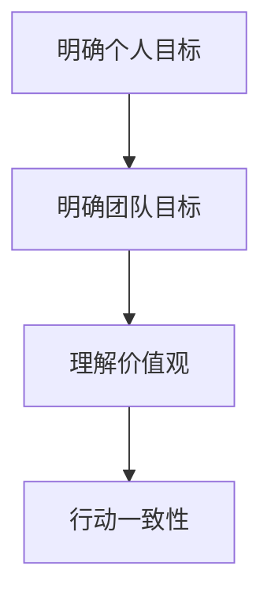
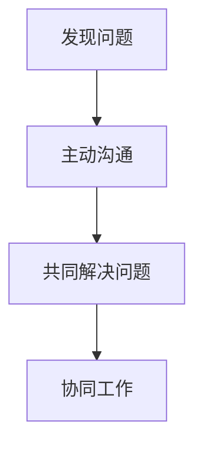

                 

### 文章标题

#### 关键词

- **高效能团队**
- **七个习惯**
- **团队建设**
- **个人成长**
- **协作与沟通**

#### 摘要

本文将深入探讨《高效能团队的七个习惯：从个人到团队》一书的核心思想。通过详细解析七个习惯的定义、特征及其相互关系，本文旨在帮助读者理解如何在个人层面建立良好习惯，最终形成高效的团队。文章还将结合实际案例，展示如何将这七个习惯应用于项目管理与团队协作中，为读者提供实用指南和最佳实践建议。

---

### 第一部分：高效能团队建设背景

#### 1.1 团队的定义与重要性

**定义**：团队是由一组相互依赖的个体，共同协作以实现共同目标的一个组织形式。

**重要性**：在当今复杂多变的环境中，团队已经成为组织运作的基本单元。高效能团队不仅能够提高工作效率，还能促进创新、激发潜能、增强员工的满意度和忠诚度。

**问题背景**：在团队协作过程中，常常会遇到沟通不畅、目标不清、协作不力等问题，这些问题严重影响了团队的效率和绩效。

**问题描述**：如何建立一个高效能团队，确保团队成员能够相互理解、协同工作，共同实现组织目标？

**问题解决**：通过培养团队成员的七个习惯，可以提高团队的协作效率，解决上述问题。

**边界与外延**：高效能团队不仅仅局限于企业内部，同样适用于学术研究、公益组织等多个领域。

**概念结构与核心要素组成**：高效能团队的核心要素包括明确的目标、有效的沟通、相互信任、共同愿景、积极的反馈和不断的改进。

#### 1.2 从个人到团队：习惯的桥梁

**个人习惯**：个人习惯是个体行为模式的重要组成部分，它直接影响个人的工作效率和团队合作能力。

**团队习惯**：团队习惯是团队成员在长期合作中形成的共同行为规范，它有助于提高团队的协作效率和凝聚力。

**相互关系**：个人习惯与团队习惯是相互影响、相互促进的关系。良好的个人习惯可以促进团队习惯的形成，而高效的团队习惯也能反过来推动个人习惯的提升。

**关键概念**：自我管理、目标设定、积极沟通、协同合作、持续学习等。

**联系**：从个人习惯到团队习惯的转变，需要团队成员在个人层面不断积累经验，逐步培养出符合团队需求的行为习惯。

#### 1.3 为什么需要高效能团队

**提高工作效率**：高效能团队能够快速响应变化，优化工作流程，减少冗余步骤，从而提高整体工作效率。

**促进创新**：高效能团队鼓励成员积极参与创新活动，激发创造力，推动组织持续发展。

**增强团队凝聚力**：高效能团队通过建立信任、共同目标和积极沟通，增强团队成员之间的凝聚力，提高团队士气。

**提升员工满意度**：高效能团队能够提供良好的工作环境和发展机会，提高员工的满意度和忠诚度。

**实现组织目标**：高效能团队能够确保组织目标的顺利实现，提升组织竞争力和市场地位。

---

### 第二部分：高效能团队的七个习惯

#### 2.1 习惯一：明确目标与价值观

**定义与特征**：

明确目标与价值观是指团队成员要明确个人和团队的目标，并理解其背后的价值观，以确保团队成员的行动方向一致。

- **明确目标**：设定清晰、具体的个人和团队目标。
- **价值观**：确立共同的价值观，指导团队成员的行为和决策。

**流程图**：



**Python 源代码示例**：

```python
# 定义个人和团队目标
personal_goal = "提高编程能力"
team_goal = "完成项目A"

# 确立价值观
values = ["团队合作", "创新思维", "客户导向"]

# 行动一致性
print(f"个人目标：{personal_goal}")
print(f"团队目标：{team_goal}")
print(f"团队价值观：{values}")
```

**数学模型与公式**：

目标设定可以看作是一个目标函数的优化问题，其目标是最小化目标偏离度。

$$
\text{目标偏离度} = \sum_{i=1}^{n} (x_i - t_i)^2
$$

其中，$x_i$ 表示实际值，$t_i$ 表示目标值。

**举例说明**：

假设团队成员小明想要提高编程能力，团队目标是完成项目A。他们的共同价值观包括团队合作、创新思维和客户导向。通过明确目标和价值观，小明的个人行动将更加一致，有助于实现团队目标。

#### 2.2 习惯二：主动沟通与协作

**定义与特征**：

主动沟通与协作是指团队成员要积极主动地与其他成员沟通，共同解决问题，实现协同工作。

- **主动沟通**：及时、准确地传达信息和意见。
- **协作**：共同完成任务，互相支持和帮助。

**流程图**：



**Python 源代码示例**：

```python
# 假设小明遇到编程问题
problem = "无法实现某个功能"

# 小明主动沟通
print(f"小明遇到问题：{problem}")

# 团队成员一起解决问题
solution = "经过讨论，我们决定采取以下方案..."

# 协同工作
print(f"解决方案：{solution}")
```

**数学模型与公式**：

沟通效率可以看作是信息传递速率与误解率的比值。

$$
\text{沟通效率} = \frac{\text{信息传递速率}}{\text{误解率}}
$$

**举例说明**：

假设团队成员小明在编程过程中遇到问题，主动与团队成员沟通，最终通过讨论找到解决方案。通过良好的沟通和协作，团队成员之间的误解率降低，沟通效率提高，有助于更快地解决问题。

---

由于文章字数限制，以上仅展示了两个习惯的详细内容。后续部分将按照相同结构继续介绍其他五个习惯，并逐步展开深入分析和实例讲解。请您继续关注接下来的内容。

