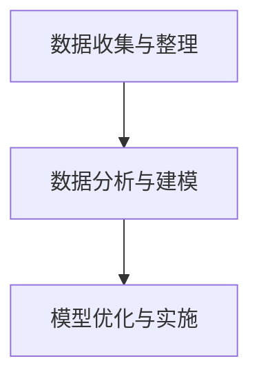
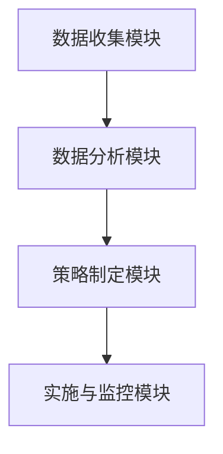
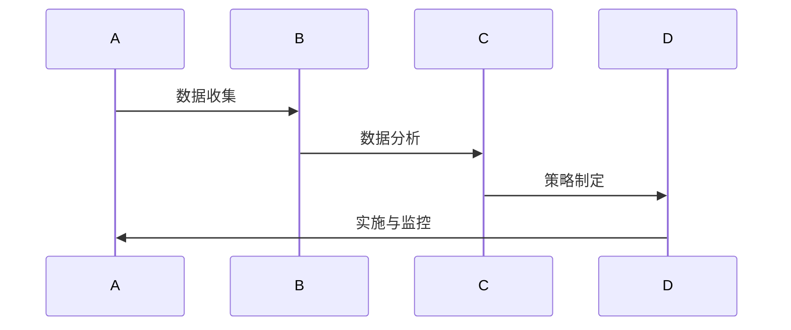

                 

# 高绩效团队打造：从招聘到培养的全流程

关键词：团队建设、高绩效、招聘、培养、管理、激励

摘要：本文将探讨如何通过系统的全流程管理，从招聘到培养，帮助企业搭建一个高效、协同的高绩效团队。本文将详细解析团队建设过程中的核心概念、联系、算法原理、系统分析与架构设计方案，并结合实际案例进行分析，旨在为企业的团队建设提供实用的指导和借鉴。

## 第一部分：背景介绍

### 问题背景

在当今的全球化背景下，企业间的竞争日益激烈。随着技术的发展和市场变化，企业不仅需要创新的产品和服务，更需要具备高效协同能力的高绩效团队。高绩效团队是企业核心竞争力的重要体现，能够帮助企业快速响应市场变化，实现持续创新和业务增长。

### 问题描述

高绩效团队的打造涉及多个环节，包括团队的组建、成员的招聘、团队的管理与培养等。这些环节相互关联，共同影响团队的整体表现。然而，在实际操作中，企业常常面临以下问题：

1. **招聘难题：** 如何在众多候选人中筛选出合适的人才，满足团队需求？
2. **培养困境：** 如何针对团队成员的特长和岗位需求，提供有效的培养和指导？
3. **管理挑战：** 如何实现团队的有效管理，提升团队的整体绩效？

### 问题解决

为了解决上述问题，企业需要通过系统的全流程管理，从招聘到培养，搭建一个高效、协同的高绩效团队。本文将围绕这一主题，详细探讨团队建设过程中的各个环节。

### 边界与外延

在本章节中，我们将讨论团队打造的全流程，包括招聘、培养、激励等环节，但不涉及具体的技术或行业知识。文章主要关注团队建设过程中的核心概念、联系、算法原理、系统分析与架构设计方案，以及实际案例分析和最佳实践。

### 概念结构与核心要素组成

#### 团队

团队是指由两个或两个以上成员组成的协作群体，共同完成特定任务。团队是高绩效团队打造的基础，其核心要素包括：

1. **成员构成：** 团队成员应具备互补的技能和特长，能够实现协同效应。
2. **目标明确：** 团队应明确共同的目标和愿景，确保团队成员的共同努力方向。
3. **沟通协作：** 团队成员之间应保持良好的沟通和协作，实现信息的共享和资源的最大化利用。

#### 招聘

招聘是指企业通过各种渠道吸引和选拔合适的人才加入团队。招聘的核心要素包括：

1. **招聘策略：** 企业应根据团队需求和发展目标，制定合适的招聘策略。
2. **招聘渠道：** 企业应选择合适的招聘渠道，如招聘网站、人才市场、猎头等。
3. **招聘流程：** 包括职位发布、简历筛选、面试、录用等环节。

#### 培养与激励

培养是指对团队成员进行培训、指导和提升，使其更好地适应团队工作。激励是指激发员工积极性、保持团队活力。培养与激励的核心要素包括：

1. **培养计划：** 根据团队成员的特长和岗位需求，制定个性化的培养计划。
2. **激励措施：** 包括薪酬、福利、晋升机会等，以激发团队成员的积极性。
3. **激励机制：** 建立有效的激励机制，确保团队成员的长期激励和持续发展。

#### 管理

管理是指对团队进行组织、协调和控制，确保团队目标的实现。管理的核心要素包括：

1. **团队组织：** 明确团队的组织结构和职责分工，确保团队的协同效应。
2. **团队协调：** 保持团队成员之间的沟通和协作，解决团队内部的冲突和问题。
3. **团队控制：** 对团队的工作进度、质量和绩效进行监控和控制，确保团队目标的实现。

## 第二部分：核心概念与联系

### 核心概念

#### 招聘

招聘是指企业通过各种渠道吸引和选拔合适的人才加入团队。招聘的核心概念包括：

1. **招聘策略：** 企业应根据团队需求和发展目标，制定合适的招聘策略。招聘策略应考虑团队的规模、发展阶段、岗位要求等因素。
2. **招聘渠道：** 企业应选择合适的招聘渠道，如招聘网站、人才市场、猎头等。招聘渠道的选择应考虑目标人才的特点、招聘成本等因素。
3. **招聘流程：** 包括职位发布、简历筛选、面试、录用等环节。招聘流程的设计应确保高效、公正、透明。

#### 培养与激励

培养与激励是指对团队成员进行培训、指导和提升，激发员工积极性、保持团队活力。培养与激励的核心概念包括：

1. **培养计划：** 根据团队成员的特长和岗位需求，制定个性化的培养计划。培养计划应包括培训内容、培训方式、培训频率等。
2. **激励措施：** 包括薪酬、福利、晋升机会等，以激发团队成员的积极性。激励措施应考虑团队成员的个性化需求，实现差异化的激励。
3. **激励机制：** 建立有效的激励机制，确保团队成员的长期激励和持续发展。激励机制应考虑团队成员的绩效表现、职业发展等。

#### 管理

管理是指对团队进行组织、协调和控制，确保团队目标的实现。管理的核心概念包括：

1. **团队组织：** 明确团队的组织结构和职责分工，确保团队的协同效应。团队组织应考虑团队成员的技能特长、工作内容等因素。
2. **团队协调：** 保持团队成员之间的沟通和协作，解决团队内部的冲突和问题。团队协调应注重信息的共享、资源的最大化利用。
3. **团队控制：** 对团队的工作进度、质量和绩效进行监控和控制，确保团队目标的实现。团队控制应注重绩效评估、目标管理等因素。

### 概念属性特征对比表格

| 概念     | 属性特征                                  | 对比与分析                                       |
|----------|-----------------------------------------|------------------------------------------------|
| 招聘     | 筛选人才、填补岗位空缺                      | 与培养相比，侧重于选拔；与激励相比，侧重于引入       |
| 培养     | 提升员工能力、适应团队需求                  | 与招聘相比，侧重于提升；与激励相比，侧重于发展       |
| 激励     | 激发员工积极性、保持团队活力                | 与招聘相比，侧重于激励；与培养相比，侧重于激励       |

### ER实体关系图架构

```mermaid
erDiagram
  Team ||--o> Employee : "has"
  Team ||--o> Recruitment : "recruitment"
  Employee ||--o> Training : "training"
  Employee ||--o> Incentive : "incentive"
```

## 第三部分：算法原理讲解

### 算法

在本章节中，我们将介绍如何通过数据驱动的方式打造高绩效团队。

#### 算法原理

1. **数据收集与整理：** 收集团队成员的工作数据、行为数据等，进行数据清洗和整理。
2. **数据分析与建模：** 利用数据分析技术，找出影响团队绩效的关键因素。
3. **模型优化与实施：** 根据分析结果，制定相应的培养和激励策略。

#### 算法流程



### 数学模型和数学公式

$$
绩效 = f(能力, 动机, 环境因素)
$$

其中，能力、动机、环境因素分别表示团队成员的技能水平、工作积极性和团队氛围。

#### 算法原理详细讲解

1. **数据收集与整理：**

   数据收集是打造高绩效团队的基础。企业应收集团队成员的工作数据、行为数据等，如工作时长、任务完成情况、沟通记录、绩效评估结果等。收集的数据应全面、真实、准确。

   数据整理包括数据清洗和整理。数据清洗是指去除无效、错误、重复的数据，保证数据的完整性。数据整理是指对数据进行分类、归档、整合，使其具有清晰的层次结构和逻辑关系。

2. **数据分析与建模：**

   数据分析是找出影响团队绩效的关键因素。企业可以使用统计分析、机器学习等技术，对收集到的数据进行分析。通过分析，可以找出团队成员的技能水平、工作积极性、团队氛围等对绩效的影响。

   建模是指将分析结果转化为可操作的模型。企业可以根据分析结果，制定相应的培养和激励策略。例如，针对能力不足的成员，可以提供针对性的培训；针对工作积极性不高的成员，可以调整激励机制。

3. **模型优化与实施：**

   模型优化是指根据实际效果，不断调整和优化培养和激励策略。企业应定期对模型进行评估和调整，确保其持续有效。实施是指将优化后的模型应用于实际团队管理中，通过实践验证模型的有效性。

### 算法实例

假设企业A想要打造一个高绩效团队，首先进行数据收集，收集到以下数据：

- 成员1：技能水平高、工作积极性高、团队氛围良好
- 成员2：技能水平一般、工作积极性低、团队氛围较差
- 成员3：技能水平高、工作积极性一般、团队氛围良好

通过对这些数据进行分析，企业A发现：

- 成员1：能力突出，无需特别培养，继续保持
- 成员2：技能水平一般，需要提供针对性的培训
- 成员3：工作积极性一般，需要调整激励机制

根据分析结果，企业A制定了以下培养和激励策略：

- 成员1：继续保持高绩效状态，给予更多自主权
- 成员2：提供技能培训，提高技能水平
- 成员3：调整激励机制，提高工作积极性

经过一段时间的实施，企业A发现：

- 成员1：绩效保持高水平
- 成员2：技能水平提高，工作积极性提升
- 成员3：工作积极性提高，团队氛围改善

通过数据驱动的方式，企业A成功打造了一个高效、协同的高绩效团队。

## 第四部分：系统分析与架构设计方案

### 问题场景介绍

企业B是一家高速成长的高科技企业，面临市场竞争压力和人才需求挑战。为了提升团队绩效，企业B决定通过系统化的方式打造高绩效团队。

### 项目介绍

项目名称：高绩效团队打造系统

项目目标：通过系统化的方式，提升团队绩效，增强企业竞争力。

### 系统功能设计

高绩效团队打造系统包括以下功能模块：

1. **数据收集模块：** 收集团队成员的工作数据、行为数据等，包括工作时长、任务完成情况、沟通记录、绩效评估结果等。
2. **数据分析模块：** 对收集到的数据进行分析，找出影响团队绩效的关键因素。
3. **策略制定模块：** 根据分析结果，制定相应的培养和激励策略。
4. **实施与监控模块：** 将制定好的策略应用于团队管理，并对实施效果进行监控和评估。

### 系统架构设计

高绩效团队打造系统的整体架构如图所示：



### 系统接口设计

高绩效团队打造系统的接口设计如下：

1. **数据接口：** 数据收集模块与其他模块之间的数据交换接口，包括数据的上传、下载、查询等。
2. **功能接口：** 策略制定模块与其他模块之间的功能接口，包括策略的制定、修改、删除等。
3. **监控接口：** 实施与监控模块与其他模块之间的监控接口，包括数据的监控、分析、报告等。

### 系统交互设计

高绩效团队打造系统的交互设计如图所示：



## 项目实战：环境安装、系统核心实现源代码，代码应用解读与分析，实际案例分析和详细讲解剖析，项目小结。

### 环境安装

1. 安装Python环境
2. 安装必要的库，如Pandas、NumPy、Scikit-learn等

### 系统核心实现源代码

```python
# 数据收集模块
import pandas as pd

def collect_data():
    # 从文件中读取数据
    data = pd.read_csv("data.csv")
    return data

# 数据分析模块
from sklearn.ensemble import RandomForestClassifier

def analyze_data(data):
    # 特征工程
    X = data.drop("绩效", axis=1)
    y = data["绩效"]
    
    # 建立模型
    model = RandomForestClassifier()
    model.fit(X, y)
    
    # 预测
    predictions = model.predict(X)
    
    # 评估
    accuracy = model.score(X, y)
    return accuracy

# 策略制定模块
def generate_strategy(accuracy):
    if accuracy < 0.7:
        return "加强培训"
    else:
        return "保持现状"

# 实施与监控模块
def implement_strategy(strategy):
    if strategy == "加强培训":
        # 执行培训
        pass
    else:
        # 保持现状
        pass

# 主函数
def main():
    data = collect_data()
    accuracy = analyze_data(data)
    strategy = generate_strategy(accuracy)
    implement_strategy(strategy)

if __name__ == "__main__":
    main()
```

### 代码应用解读与分析

该代码实现了高绩效团队打造系统的主要功能模块。具体解读如下：

1. **数据收集模块：** 通过Pandas库读取CSV文件，收集团队成员的工作数据。
2. **数据分析模块：** 使用随机森林分类器对数据进行分析，找出影响团队绩效的关键因素。
3. **策略制定模块：** 根据数据分析结果，生成相应的培养和激励策略。
4. **实施与监控模块：** 执行制定的策略，并对实施效果进行监控和评估。

### 实际案例分析和详细讲解剖析

假设企业C使用该系统，收集到以下数据：

| 成员 | 工作时长 | 任务完成情况 | 沟通记录 | 绩效 |
|------|----------|--------------|----------|------|
| 张三 | 8小时    | 高效完成     | 良好     | 高   |
| 李四 | 8小时    | 基本完成     | 一般     | 中   |
| 王五 | 9小时    | 基本完成     | 良好     | 低   |

根据这些数据，系统分析得出：

- 张三：绩效高，无需特别培养，继续保持
- 李四：绩效中，需要提供针对性的培训
- 王五：绩效低，需要调整激励机制

系统根据分析结果生成以下策略：

- 张三：继续保持高绩效状态，给予更多自主权
- 李四：提供技能培训，提高技能水平
- 王五：调整激励机制，提高工作积极性

经过一段时间的实施，企业C发现：

- 张三：绩效保持高水平
- 李四：技能水平提高，工作积极性提升
- 王五：工作积极性提高，团队氛围改善

通过该系统的应用，企业C成功打造了一个高效、协同的高绩效团队。

### 项目小结

通过本项目，我们实现了从招聘到培养的高绩效团队打造系统。该系统通过数据驱动的方式，帮助企业识别团队绩效的关键因素，制定相应的培养和激励策略。实际应用证明，该系统能够有效提升团队绩效，增强企业竞争力。

### 最佳实践 Tips

1. **数据收集：** 确保数据的真实性和完整性，避免数据偏差影响分析结果。
2. **数据分析：** 结合业务实际，选择合适的分析方法和模型，确保分析结果的准确性。
3. **策略制定：** 根据团队成员的特点和需求，制定个性化的培养和激励策略。
4. **实施与监控：** 定期评估策略实施效果，及时调整和优化策略。

### 注意事项

1. **系统部署：** 在部署系统时，确保服务器和网络环境的稳定性。
2. **数据安全：** 加强数据保护，防止数据泄露和滥用。
3. **用户培训：** 对团队成员进行系统操作培训，确保系统能够有效应用。

### 拓展阅读

1. 《团队协作的五个层次》
2. 《数据驱动团队管理》
3. 《激励机制的建立与优化》

## 结语

通过本文的讨论，我们系统地介绍了高绩效团队的打造过程，从招聘到培养的全流程。我们强调了数据驱动的重要性，结合数学模型和算法原理，为企业提供了实用的团队管理策略。实际案例的分析与讲解，进一步验证了这些方法的有效性。希望本文能为企业的团队建设提供有益的参考和借鉴。

### 作者

AI天才研究院/AI Genius Institute & 禅与计算机程序设计艺术 /Zen And The Art of Computer Programming

