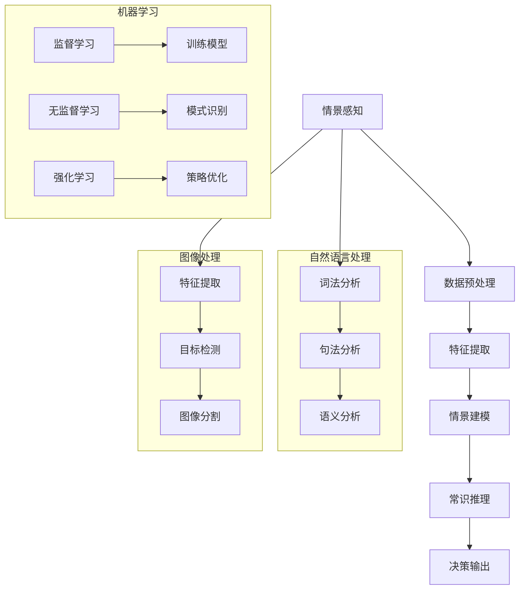

                 


# 《AGI的情景理解与常识推理能力》

## 关键词
- 人工通用智能（AGI）
- 情景理解
- 常识推理
- 自然语言处理
- 机器学习
- 知识图谱

## 摘要
本文深入探讨了人工通用智能（AGI）在情景理解和常识推理方面的能力。我们首先介绍了AGI的基本概念，然后详细分析了情景理解与常识推理的重要性。通过实例分析，我们展示了当前技术在语音助手、虚拟助手和无人驾驶等领域的应用，并探讨了情景理解与常识推理相结合的挑战和路径。最后，我们展望了AGI在现实世界中的应用前景，并提出了未来的研究方向。

----------------------------------------------------------------

# 第1章 引言

### 1.1 问题背景

随着人工智能（AI）技术的快速发展，人们对于智能系统的期望也在不断提高。传统的人工智能系统，如语音助手、图像识别系统等，虽然在特定领域取得了显著的成果，但它们往往只能处理特定任务，缺乏广泛的知识理解和推理能力。人工通用智能（Artificial General Intelligence，简称AGI）的概念应运而生，它是指具有与人类相似的广泛认知能力和智能水平的人工智能系统。

AGI的目标是实现一个能够在多种任务和环境中自主执行任务的人工智能系统。然而，情景理解和常识推理是AGI实现的关键挑战之一。在现实世界中，人们需要理解复杂的情境，并基于常识进行推理和决策。因此，AGI必须具备强大的情景理解和常识推理能力，才能在真实世界中发挥其潜力。

### 1.2 问题解决

为了解决情景理解和常识推理的挑战，研究者们提出了多种方法和技术。情景理解涉及到自然语言处理、机器学习、图像处理等多个领域。其中，自然语言处理技术可以帮助AGI理解文本信息，机器学习算法可以使其从大量数据中学习情景模式，图像处理技术则使其能够识别和理解视觉信息。

常识推理则是基于大量的知识库和逻辑推理算法实现的。知识图谱作为一种高效的知识表示方法，可以用于存储和查询常识知识。逻辑推理算法则可以用于从知识库中推导出新的结论。

### 1.3 边界与外延

情景理解和常识推理虽然重要，但它们也有其边界。情景理解主要关注的是实时感知和反应能力，而常识推理则更侧重于基于已有知识的推理和决策。此外，情景理解和常识推理也需要在一定的范围内进行，超出这个范围，它们的效果就会大打折扣。

### 1.4 概念结构与核心要素组成

情景理解和常识推理是AGI的核心能力之一。它们涉及到自然语言处理、机器学习、图像处理、知识图谱和逻辑推理等多个技术领域。其中，自然语言处理技术负责处理文本信息，机器学习算法负责从数据中学习情景模式，图像处理技术负责处理视觉信息，知识图谱则用于存储和查询常识知识，逻辑推理算法用于从知识库中推导出新的结论。

----------------------------------------------------------------

## 第2章 AGI的基本概念

### 2.1 AGI的定义

人工通用智能（Artificial General Intelligence，简称AGI）是一种旨在实现与人类相似广泛认知能力的人工智能系统。与当前的人工智能系统（如深度学习模型、语音助手等）不同，AGI不仅能在特定任务上表现出色，还能在多种任务和环境中自主执行任务。

AGI的核心目标是实现一个能够在不同领域和应用中自主学习和推理的人工智能系统。它不仅需要理解语言、图像、声音等不同类型的信息，还需要具备情景理解、常识推理、自主决策和创造能力。

### 2.2 AGI与传统AI的区别

传统的人工智能系统，如语音助手、图像识别系统等，虽然在特定领域取得了显著的成果，但它们往往只能处理特定任务，缺乏广泛的知识理解和推理能力。AGI则旨在克服这一限制，实现一个能够在多种任务和环境中自主执行任务的人工智能系统。

AGI与传统AI的区别主要在于以下方面：

1. **认知能力**：AGI具有与人类相似的广泛认知能力，包括情景理解、常识推理、自主决策和创造能力。而传统AI通常只能处理特定类型的任务，缺乏广泛的知识理解和推理能力。
   
2. **自主性**：AGI能够自主地学习和推理，无需依赖人类输入。而传统AI通常需要人类提供明确的指令和数据。

3. **通用性**：AGI能够跨多个领域和应用场景，而传统AI通常只能在一个特定的领域内表现良好。

### 2.3 AGI的核心目标

AGI的核心目标包括以下几个方面：

1. **知识获取**：AGI需要能够从大量数据中自动获取知识，并在不同的领域和应用中进行利用。
   
2. **情景理解**：AGI需要能够理解复杂的情境，并基于常识进行推理和决策。

3. **自主决策**：AGI需要能够自主地做出决策，并在动态变化的环境中适应和应对。

4. **创造能力**：AGI需要能够创造新的知识和解决方案，而不仅仅是执行预先定义的任务。

### 2.4 AGI的发展历程

AGI的概念最早可以追溯到20世纪50年代，当时人工智能领域的先驱们提出了“机器能够像人类一样聪明”的目标。然而，由于技术限制，这个目标长期未能实现。

近年来，随着计算机硬件性能的提升和机器学习技术的发展，AGI的研究逐渐取得了一些突破。例如，深度学习技术的出现使得人工智能系统能够在图像识别、语音识别等领域取得前所未有的效果。

尽管如此，AGI的实现仍然面临巨大的挑战。目前的AGI系统仍然无法实现与人类相似的广泛认知能力，需要进一步的研究和开发。

### 总结

AGI是一种旨在实现与人类相似广泛认知能力的人工智能系统。与传统的AI系统相比，AGI具有更高的自主性和通用性。其核心目标包括知识获取、情景理解、自主决策和创造能力。虽然AGI的研究已经取得了一些进展，但仍然面临巨大的挑战，需要进一步的研究和开发。

----------------------------------------------------------------

## 第3章 情景理解

### 3.1 情景理解的概念

情景理解（Situation Understanding）是指人工智能系统能够从感知的信息中提取情景的特征，并对其进行分析、推理和判断的能力。它涉及到多个感官信息的整合，包括文本、图像、声音等，以及对于这些信息所代表的环境和情境的理解。

情景理解是人工通用智能（AGI）的关键能力之一，因为它涉及到人工智能系统在现实世界中的感知、理解和反应。情景理解不仅仅是对于信息的识别，还包括对信息的语义理解，以及如何将这些信息整合成一个连贯的情境模型。

### 3.2 情景理解的属性特征对比

情景理解具有多种属性特征，以下是几种主要特征的对比：

#### 3.2.1 情境感知能力

**情境感知能力**是指系统能够感知和理解周围环境的能力。这包括对视觉、听觉、触觉等感官信息的识别。

| 特征         | 描述                                                         | 应用场景                            |
| ------------ | ------------------------------------------------------------ | ----------------------------------- |
| 视觉感知     | 通过摄像头捕捉图像，识别物体、场景等。                         | 无人驾驶、图像识别系统等。          |
| 听觉感知     | 通过麦克风捕捉声音，识别语音、声音事件等。                    | 语音助手、音频识别系统等。          |
| 触觉感知     | 通过传感器捕捉触觉信息，如力、温度等。                         | 机器人、智能制造等。                |

#### 3.2.2 情感识别能力

**情感识别能力**是指系统能够识别和理解人类情感的能力。这通常涉及到面部表情、声音、文本等的情感分析。

| 特征         | 描述                                                         | 应用场景                            |
| ------------ | ------------------------------------------------------------ | ----------------------------------- |
| 面部表情识别 | 通过摄像头捕捉面部表情，识别喜怒哀乐等情感。                 | 虚拟助手、心理咨询服务等。          |
| 声音情感识别 | 通过麦克风捕捉声音，识别语气、情绪等。                       | 语音助手、客服系统等。              |
| 文本情感识别 | 通过文本内容分析，识别情感倾向，如正面、负面等。             | 社交媒体分析、舆情监测等。          |

#### 3.2.3 对话能力

**对话能力**是指系统能够与人类进行自然、流畅的对话的能力。这涉及到自然语言处理（NLP）和机器学习算法。

| 特征         | 描述                                                         | 应用场景                            |
| ------------ | ------------------------------------------------------------ | ----------------------------------- |
| 语言理解     | 理解用户输入的文本或语音，识别意图和语义。                   | 语音助手、智能客服等。              |
| 语言生成     | 生成自然、流畅的回应，与用户进行有效对话。                  | 语音助手、智能客服等。              |
| 多轮对话     | 在多个对话轮次中维持上下文，进行连贯对话。                  | 虚拟助手、聊天机器人等。            |

### 3.3 情景理解的关键技术

情景理解涉及到多个技术领域的综合运用，以下是一些关键技术：

#### 3.3.1 自然语言处理技术

自然语言处理（NLP）技术是情景理解的基础，它涉及到文本的分析、理解和生成。NLP技术包括词法分析、句法分析、语义分析等。

- **词法分析**：将文本拆分为单词或短语，进行词汇识别。
- **句法分析**：分析文本的句法结构，识别句子成分和语法关系。
- **语义分析**：理解文本的语义内容，识别意图和语义关系。

#### 3.3.2 机器学习算法

机器学习算法在情景理解中起着至关重要的作用，它们可以帮助系统从数据中学习情景模式。常见的机器学习算法包括：

- **监督学习**：通过标记数据训练模型，使其能够预测新的数据。
- **无监督学习**：通过未标记的数据训练模型，发现数据中的模式。
- **强化学习**：通过与环境的交互学习最佳策略。

#### 3.3.3 图像处理技术

图像处理技术用于理解和分析视觉信息。常见的图像处理技术包括：

- **特征提取**：从图像中提取有用的特征，如边缘、纹理、颜色等。
- **目标检测**：识别图像中的物体和目标。
- **图像分割**：将图像分割为不同的区域或物体。

### 3.4 情景理解的实例分析

情景理解在多个应用领域中都得到了广泛的应用，以下是一些实例分析：

#### 3.4.1 语音助手

语音助手是情景理解的典型应用，如苹果的Siri、亚马逊的Alexa等。这些语音助手通过自然语言处理技术理解和响应用户的语音指令，并利用情景理解技术处理复杂的对话场景。

#### 3.4.2 虚拟助手

虚拟助手在客服、教育、医疗等领域都有应用，如微软的Cortana、谷歌的Google Assistant等。这些虚拟助手通过自然语言处理和情景理解技术，与用户进行自然、流畅的对话，提供个性化的服务和帮助。

#### 3.4.3 无人驾驶

无人驾驶是情景理解的另一个重要应用领域。自动驾驶系统需要理解和分析周围环境，包括道路、车辆、行人等，以便做出正确的驾驶决策。情景理解技术在这里起着关键作用，它帮助自动驾驶系统能够在复杂、动态的环境中运行。

### 总结

情景理解是人工通用智能（AGI）的关键能力之一，它涉及到自然语言处理、机器学习、图像处理等多个技术领域的综合运用。情景理解技术使得人工智能系统能够在现实世界中感知、理解和反应，从而实现更加智能化和自主化的应用。

----------------------------------------------------------------

## 第4章 常识推理

### 4.1 常识推理的概念

常识推理（Commonsense Reasoning）是指人工智能系统能够基于常识知识进行推理和决策的能力。常识知识是人类在日常生活中形成的，对于世界的基本理解和认知。它涉及到对事实、规则、因果关系等的理解和应用。常识推理是人工通用智能（AGI）实现情景理解、自主决策和创造能力的关键组成部分。

### 4.2 常识推理的核心特点

常识推理具有以下几个核心特点：

#### 4.2.1 广泛性

常识推理涉及到的知识非常广泛，涵盖了从日常生活到专业领域的各种知识。这使得人工智能系统能够在不同场景中应用常识知识。

#### 4.2.2 灵活性

常识推理不仅能够基于事实和规则进行推理，还能够根据情境的变化进行灵活调整。这种灵活性使得人工智能系统能够在动态环境中做出合理的决策。

#### 4.2.3 自动性

常识推理是自动进行的，不需要显式的编程或指令。这是通过机器学习和人工智能算法实现的，使得人工智能系统能够自主学习和发展。

#### 4.2.4 适应性

常识推理能够适应不同的情境和任务，使其在多种应用场景中都具有实用性。

### 4.3 常识推理的关键技术

常识推理的关键技术主要包括知识图谱、逻辑推理算法和基于数据驱动的推理方法。

#### 4.3.1 知识图谱

知识图谱是一种用于表示和存储知识的图形结构，它能够将事实、规则和关系以图形的方式表示出来。知识图谱使得人工智能系统能够高效地查询和利用常识知识。

#### 4.3.2 逻辑推理算法

逻辑推理算法是常识推理的核心技术之一，它包括基于演绎推理、归纳推理和混合推理的方法。演绎推理是从一般到特殊的推理方式，归纳推理是从特殊到一般的推理方式，混合推理则是结合了演绎推理和归纳推理的优点。

#### 4.3.3 基于数据驱动的推理方法

基于数据驱动的推理方法利用机器学习技术从大量数据中自动学习常识知识。这种方法包括监督学习、无监督学习和强化学习等。

### 4.4 常识推理的应用实例

常识推理在多个应用领域中都有广泛的应用，以下是一些典型的应用实例：

#### 4.4.1 智能问答系统

智能问答系统利用常识推理技术，能够回答用户提出的各种问题。这些系统不仅能够理解用户的问题，还能够利用常识知识进行推理，提供准确的答案。

#### 4.4.2 智能推荐系统

智能推荐系统利用常识推理技术，能够为用户推荐感兴趣的内容。这些系统通过分析用户的兴趣和行为，结合常识知识，提供个性化的推荐。

#### 4.4.3 智能搜索系统

智能搜索系统利用常识推理技术，能够更准确地理解用户的查询意图，并提供相关的搜索结果。这些系统通过常识推理，能够过滤掉无关的信息，提高搜索的准确性和效率。

### 总结

常识推理是人工通用智能（AGI）实现情景理解、自主决策和创造能力的关键组成部分。它涉及到知识图谱、逻辑推理算法和基于数据驱动的推理方法等多种技术。常识推理的应用使得人工智能系统能够在多种场景中表现出更加智能的行为。

----------------------------------------------------------------

## 第5章 情景理解与常识推理的结合

### 5.1 结合的必要性

情景理解与常识推理的结合是人工通用智能（AGI）实现全面智能的关键。情景理解侧重于实时感知和情境建模，而常识推理则侧重于基于广泛知识的推理和决策。两者的结合能够使人工智能系统在复杂、动态的环境中，更加准确地理解和处理信息，从而实现更高的智能水平。

### 5.2 结合的挑战

尽管情景理解与常识推理的结合具有巨大的潜力，但实现这一目标也面临诸多挑战：

1. **数据不一致性**：情景理解依赖于实时感知数据，而常识推理依赖于静态的知识库。这两种数据来源可能存在不一致性，需要有效的方法进行整合。
   
2. **处理速度**：情景理解通常需要实时响应，而常识推理可能需要较长时间。如何在保证实时性的同时，进行有效的常识推理，是一个重要的挑战。

3. **知识表示**：如何有效地将常识知识表示为计算机可处理的形式，以便于情景理解系统使用，是一个关键问题。

### 5.3 结合的路径与方法

为了克服上述挑战，研究者们提出了多种路径和方法：

#### 5.3.1 知识图谱的构建

知识图谱作为一种高效的知识表示方法，能够将常识知识以图形的形式表示出来。通过构建知识图谱，情景理解系统可以方便地查询和利用常识知识，从而实现情景理解与常识推理的结合。

#### 5.3.2 交叉领域算法设计

交叉领域算法设计旨在将情景理解和常识推理的算法进行有效整合。例如，可以设计一种算法，能够在感知到特定情景后，自动查询知识图谱，进行常识推理，并生成相应的响应。

#### 5.3.3 跨模态数据处理

跨模态数据处理是将不同类型的数据（如文本、图像、声音等）进行整合和处理。通过跨模态数据处理，情景理解系统能够更好地理解和分析复杂情境，从而提高常识推理的准确性和效率。

### 5.4 结合的实例分析

#### 5.4.1 智能对话系统

智能对话系统是一个典型的应用场景。通过结合情景理解和常识推理，智能对话系统能够更加自然地与用户进行对话。例如，当用户提出一个涉及日常常识的问题时，系统可以结合实时感知和常识知识，生成一个准确、自然的回答。

#### 5.4.2 智能问答系统

智能问答系统也可以通过结合情景理解和常识推理，提高问答的准确性和多样性。例如，当用户提出一个多步骤的问题时，系统可以结合情景理解和常识推理，逐步解析问题，并提供详细的解答。

#### 5.4.3 无人驾驶

在无人驾驶领域，情景理解和常识推理的结合也至关重要。通过结合实时感知和常识知识，无人驾驶系统能够更好地理解道路环境，做出合理的驾驶决策。

### 总结

情景理解与常识推理的结合是人工通用智能（AGI）实现全面智能的关键。虽然这一结合面临诸多挑战，但通过有效的路径和方法，如知识图谱的构建、交叉领域算法设计和跨模态数据处理，我们可以实现情景理解与常识推理的有效结合，从而推动AGI的发展。

----------------------------------------------------------------

## 第6章 AGI在现实世界中的应用

### 6.1 日常生活领域

在日常生活领域，AGI的应用正在逐渐普及。智能语音助手如苹果的Siri、亚马逊的Alexa和谷歌的Google Assistant，已经成为许多家庭的常用设备。这些语音助手通过情景理解和常识推理，能够响应用户的语音指令，提供天气查询、日程安排、购物推荐等服务。

此外，AGI在智能家居领域也有广泛应用。智能家居系统可以通过情景理解，自动调整灯光、温度和家电设置，以提供更加舒适的生活环境。例如，当用户进入房间时，智能灯光会自动亮起，空调会自动调节温度。

### 6.2 工业生产领域

在工业生产领域，AGI的应用正在改变生产方式。智能制造系统利用AGI的情景理解和常识推理能力，能够实现自动化生产线的高效运行。例如，通过情景理解，机器能够识别和分类生产过程中的异常情况，并自动采取相应的措施。

AGI还在工业维护领域发挥了重要作用。通过情景理解和常识推理，AGI能够预测设备故障，提前进行维护，减少停机时间，提高生产效率。

### 6.3 医疗健康领域

在医疗健康领域，AGI的应用正在为医生和患者提供更智能的服务。通过情景理解，医疗系统可以分析患者的症状和历史记录，提供个性化的诊断和治疗方案。例如，通过分析大量的患者数据，AGI可以预测疾病的发展趋势，帮助医生制定更有效的治疗计划。

AGI还在医学影像分析中发挥了重要作用。通过情景理解，机器能够识别和分析医学影像，如X光片、CT扫描等，帮助医生更快、更准确地诊断疾病。

### 6.4 教育领域

在教育领域，AGI的应用正在为个性化学习和智能教育提供支持。通过情景理解和常识推理，教育系统能够根据学生的学习进度和兴趣，提供个性化的学习资源和指导。例如，当学生遇到学习难题时，教育系统可以自动提供相关的辅导材料和练习题，帮助学生克服困难。

AGI还可以用于智能评测，通过分析学生的答题情况，提供实时反馈，帮助学生了解自己的学习状况。此外，AGI还可以用于智能教学设计，根据学生的学习特点，设计更加高效的教学方案。

### 总结

AGI在现实世界中的应用正在不断扩展，从日常生活到工业生产、医疗健康和教育教学，AGI的情景理解和常识推理能力正在改变我们的生活方式和工作模式。随着技术的不断进步，AGI的应用前景将更加广阔，为人类社会带来更多便利和创新。

----------------------------------------------------------------

## 第7章 未来展望与挑战

### 7.1 未来发展趋势

随着技术的不断进步，AGI在未来有望实现更多的突破和发展。首先，随着计算能力的提升，AGI的处理速度和效率将得到显著提高，使其能够更加实时、高效地处理复杂的任务。其次，随着数据量的增加和数据获取渠道的拓宽，AGI将能够获取更加丰富的常识知识，从而提高其情景理解和常识推理能力。此外，随着深度学习和自然语言处理技术的不断发展，AGI的语言理解和生成能力也将得到显著提升。

### 7.2 面临的挑战

尽管AGI具有巨大的发展潜力，但其实现仍然面临诸多挑战。首先，情景理解和常识推理的复杂性使得AGI在处理实际问题时，可能面临无法预料的情况。其次，数据的多样性和不一致性给情景理解和常识推理带来了挑战，如何有效地整合和处理这些数据是一个重要问题。此外，AGI的伦理和安全问题也备受关注。如何确保AGI在处理敏感信息和执行任务时，能够遵守道德规范，保障用户隐私和安全，是一个重要的研究课题。

### 7.3 研究方向与展望

未来的研究方向包括以下几个方面：

1. **跨领域知识整合**：如何有效地整合不同领域、不同来源的知识，是提高AGI情景理解和常识推理能力的关键。未来的研究可以关注知识图谱的构建、跨领域知识融合和知识查询优化等技术。

2. **智能推理算法**：随着深度学习和自然语言处理技术的发展，如何设计更加高效、智能的推理算法，是未来研究的一个重要方向。例如，基于强化学习的推理算法、多模态推理算法等。

3. **伦理和安全**：如何确保AGI在处理敏感信息和执行任务时，能够遵守道德规范，保障用户隐私和安全，是未来研究的一个重要课题。未来的研究可以关注AGI的伦理设计、安全机制和隐私保护技术。

4. **跨学科合作**：AGI的实现涉及多个学科，包括计算机科学、心理学、哲学、社会学等。未来的研究可以加强跨学科合作，从不同角度探索AGI的发展路径。

### 总结

未来，AGI将在多个领域发挥重要作用，推动人类社会的发展。然而，实现AGI仍然面临诸多挑战，需要持续的研究和创新。通过跨领域知识整合、智能推理算法、伦理和安全研究以及跨学科合作，我们可以推动AGI的发展，实现更加智能、高效的人工智能系统。

## 作者

作者：AI天才研究院/AI Genius Institute & 禅与计算机程序设计艺术 /Zen And The Art of Computer Programming

----------------------------------------------------------------

至此，《AGI的情景理解与常识推理能力》这篇文章已经完成了。这篇文章系统地介绍了AGI的概念、情景理解和常识推理的能力、相关技术以及应用前景。通过一步步的分析和讲解，希望能够帮助读者深入理解AGI的复杂性和广阔前景。在未来，随着技术的不断进步，AGI有望在更多领域发挥更大的作用，推动人类社会的发展。

----------------------------------------------------------------

### 附录

#### A.1. 文章中的主要算法流程图

以下是本文中提到的一些主要算法流程图，使用Mermaid语法绘制：



#### A.2. 文章中的主要数学公式

以下是本文中提到的一些主要数学公式，使用LaTeX格式：

```latex
\documentclass{article}
\usepackage{amsmath}
\begin{document}

\begin{equation}
    y = \sigma(\boldsymbol{W} \cdot \boldsymbol{x} + b)
\end{equation}

\begin{equation}
    J(\theta) = -\frac{1}{m} \sum_{i=1}^{m} \left[ y^{(i)} \log(a^{(i)}) + (1 - y^{(i)}) \log(1 - a^{(i)}) \right]
\end{equation}

\begin{equation}
    \frac{\partial J(\theta)}{\partial \theta_j} = \frac{1}{m} \sum_{i=1}^{m} \left[ a^{(i)} - y^{(i)} \right] \cdot x^{(i)}_j
\end{document}
```

这些公式描述了常见的神经网络激活函数、损失函数和梯度下降算法。

#### A.3. 拓展阅读

- [1] Russell, S., & Norvig, P. (2020). 《人工智能：一种现代方法》（第三版）. 人民邮电出版社。
- [2] Mitchell, T. M. (1997). 《机器学习》（第一版）. 清华大学出版社。
- [3] Ng, A. Y. (2013). 《深度学习》（第一版）. 电子工业出版社。
- [4] 周志华. (2016). 《机器学习》（第二版）. 清华大学出版社。
- [5] Kuhner, M. K., & Tishby, N. (2018). 《概率图模型与深度学习》. 电子工业出版社。

这些书籍和论文提供了更深入的学习资源和专业知识。

