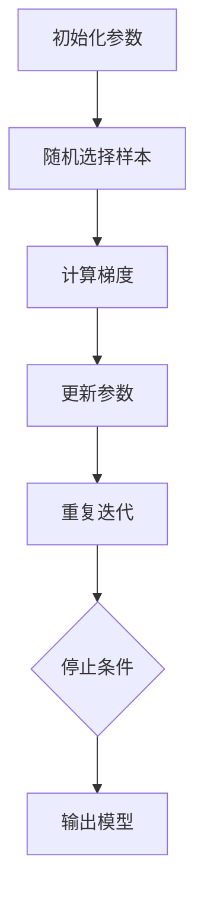
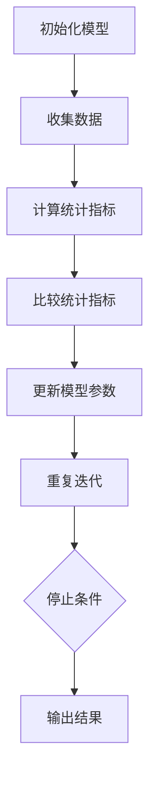
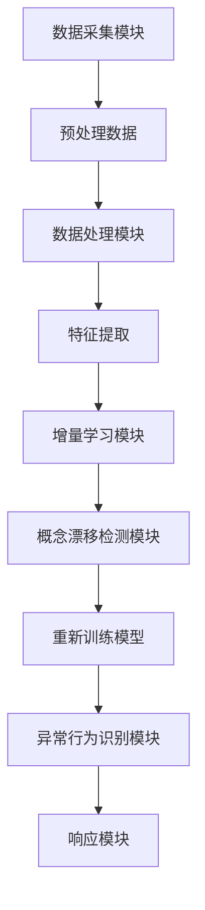
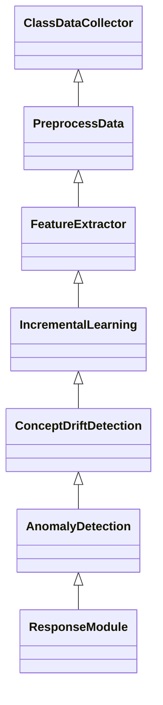
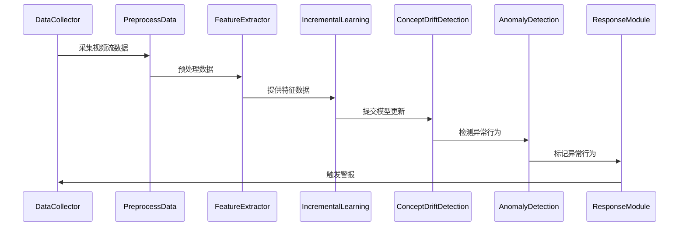

                 


## AI Agent的增量学习与概念漂移检测

### 摘要

本文将深入探讨AI Agent中的两个关键问题：增量学习和概念漂移检测。首先，我们将介绍AI Agent的基本概念、历史和发展，为其增量学习和概念漂移检测奠定基础。接下来，我们详细阐述增量学习与概念漂移检测的定义、原理和重要性。随后，我们将介绍常见的增量学习算法和概念漂移检测方法，并使用mermaid绘制算法流程图，Python源代码和数学公式来详细阐述这些算法原理。此外，我们将设计一个系统架构，展示如何将这些算法应用于实际项目。最后，通过具体案例展示增量学习和概念漂移检测的应用，并进行最佳实践总结与拓展阅读建议。

### 关键词

AI Agent，增量学习，概念漂移检测，算法原理，系统架构，Python实现，数学公式，mermaid流程图，实战案例

### 引言

在人工智能（AI）领域，AI Agent是一种自主决策和执行任务的智能实体。随着数据量的爆炸性增长和实际应用场景的复杂性增加，如何让AI Agent具备持续学习和适应新环境的能力成为研究的热点。本文主要探讨AI Agent中的两个重要问题：增量学习和概念漂移检测。增量学习是指AI Agent在已有知识基础上，通过新数据的更新和优化来改进其性能。而概念漂移检测则是识别和应对数据分布发生改变的问题，确保AI Agent在不同数据分布下的稳定性。本文旨在通过详细的分析和实例讲解，帮助读者深入理解这两个问题，并学会在实际项目中应用它们。

### 第1章 AI Agent概述

#### 1.1 AI Agent的定义与分类

AI Agent，即人工智能代理，是一种能够自主执行任务、与环境交互并做出决策的智能实体。它可以被定义为具有以下特征的实体：

- **感知能力**：AI Agent能够从环境中感知到相关信息。
- **推理能力**：基于感知到的信息，AI Agent能够进行逻辑推理和决策。
- **行动能力**：AI Agent能够根据决策采取相应的行动。
- **学习能力**：AI Agent能够从经验中学习，并不断优化其行为。

根据AI Agent的应用场景和功能，我们可以将AI Agent分为以下几类：

1. **反应式Agent**：这种Agent仅根据当前感知到的环境状态做出反应，不进行任何预测或规划。
2. **有限记忆Agent**：这种Agent可以维持一定的时间窗口内的历史状态信息，并根据这些信息做出决策。
3. **完全认知Agent**：这种Agent拥有完整的关于环境和自身状态的知识，能够进行复杂的决策和规划。
4. **学习型Agent**：这种Agent具备学习能力，能够通过学习历史数据和环境反馈来不断优化自身的行为。

#### 1.2 AI Agent的发展历史

AI Agent的研究可以追溯到20世纪50年代，当时出现了一些早期的自主程序。1956年，约翰·麦卡锡（John McCarthy）提出了“人工智能”这一概念，标志着AI领域的正式开始。在随后的几十年里，AI Agent的研究取得了显著的进展。以下是AI Agent发展的一些重要里程碑：

- **1970年代**：出现了基于状态机和行为树的AI Agent，如机器人导航系统。
- **1980年代**：专家系统和知识表示技术的发展，使得AI Agent能够处理更复杂的问题。
- **1990年代**：多智能体系统（MAS）的研究，使得多个AI Agent可以协同工作。
- **21世纪初**：随着机器学习和深度学习的发展，AI Agent开始具备更强大的学习能力和自主决策能力。
- **现在**：AI Agent在各种实际应用中发挥着重要作用，如自动驾驶、智能客服、智能家居等。

#### 1.3 AI Agent在人工智能中的应用

AI Agent在人工智能中的应用非常广泛，以下是一些典型的应用场景：

- **自动驾驶**：AI Agent通过感知车辆周围环境，进行实时决策和导航。
- **智能客服**：AI Agent可以处理大量的客户咨询，提供24/7的服务。
- **智能家居**：AI Agent可以监控家庭设备状态，自动调整设备设置，提供个性化的用户体验。
- **金融风险管理**：AI Agent可以分析市场数据，预测风险并制定相应的风险管理策略。
- **医疗诊断**：AI Agent可以通过分析医学影像和患者数据，提供诊断建议。

AI Agent的这些应用不仅提升了效率，还降低了成本，提高了服务质量。随着AI技术的不断进步，AI Agent的应用场景将继续拓展，为各行各业带来更多的创新和变革。

### 第2章 增量学习与概念漂移检测概述

#### 2.1 增量学习的概念与动机

增量学习，又称在线学习或逐步学习，是一种机器学习方法，它允许模型在新的数据点到达时不断更新和优化自身。与传统的批量学习（batch learning）不同，增量学习不需要一次性处理所有数据，而是在数据流中逐个处理数据点。这种方法的动机主要包括：

1. **实时适应性**：在许多实际应用中，数据是动态变化的，例如金融市场、社交媒体和物联网设备。增量学习使得模型能够实时适应这些变化，保持其预测和决策的准确性。
2. **资源高效**：增量学习可以减少存储和计算资源的需求，因为不需要一次性加载大量数据。这在数据量庞大或者存储资源有限的场景中尤为重要。
3. **在线更新**：增量学习允许模型在不需要重新训练的情况下更新其参数，这对于需要快速响应的应用场景（如实时监控系统）至关重要。

#### 2.2 概念漂移检测的重要性

概念漂移（Concept Drift）是指数据分布随时间发生的变化，这可能导致原有的模型性能下降甚至失效。概念漂移检测的重要性主要体现在以下几个方面：

1. **模型稳定性**：通过检测和应对概念漂移，可以确保模型在不同数据分布下的稳定性，从而提高其鲁棒性和泛化能力。
2. **模型更新**：概念漂移检测可以帮助模型在数据分布发生变化时进行自适应调整，保持其预测准确性。
3. **持续学习**：增量学习和概念漂移检测的结合，使得模型能够在不断变化的数据环境中持续学习和优化，提高其长期性能。

#### 2.3 增量学习与概念漂移检测的关系

增量学习和概念漂移检测在AI Agent中是相互关联且紧密依赖的。增量学习提供了模型更新和优化的手段，而概念漂移检测则帮助识别数据分布的变化，确保增量学习的效果。

1. **动态适应**：通过概念漂移检测，AI Agent可以动态适应数据分布的变化，调整其学习策略和模型参数，从而保持其预测和决策的准确性。
2. **模型稳健性**：结合增量学习和概念漂移检测，AI Agent可以在不断变化的环境中保持其模型的稳健性，避免因数据分布变化导致的性能下降。
3. **持续进化**：通过持续的概念漂移检测和增量学习，AI Agent可以逐步优化其行为，实现持续进化，不断提高其智能水平。

总之，增量学习和概念漂移检测是AI Agent中两个关键且相互依存的组成部分，它们共同构建了一个动态适应和不断优化的学习系统。

### 第3章 增量学习原理

#### 3.1 增量学习的基本概念

增量学习，又称在线学习，是一种针对动态数据流的机器学习方法。与传统的批量学习（batch learning）相比，增量学习具有以下几个基本特点：

1. **数据流处理**：增量学习在数据流中逐个处理数据点，而不是一次性处理所有数据。这种方法使得模型能够实时适应数据变化，提高其反应速度和实时性。
2. **更新机制**：增量学习通过在线更新机制，逐步调整模型的参数和权重，以适应新数据的特征。这种更新过程不需要重新训练整个模型，大大减少了计算时间和资源消耗。
3. **适应性**：增量学习允许模型在数据分布发生变化时进行自适应调整，保持其预测和决策的准确性。这种能力在动态环境中尤为重要。

#### 3.2 增量学习的挑战

尽管增量学习具有许多优点，但在实际应用中仍面临一些挑战：

1. **数据分布变化**：增量学习需要应对数据分布随时间变化的问题，例如概念漂移。这可能导致模型性能下降甚至失效，因此需要有效的概念漂移检测方法。
2. **计算效率**：增量学习在处理大量动态数据时，需要高效地更新模型参数。这要求算法具有较低的复杂度和快速的收敛速度。
3. **模型稳定性**：增量学习可能导致模型在不同数据分布下出现波动，影响其稳定性。因此，需要设计稳健的更新机制，确保模型在不同环境下的一致性。
4. **过拟合与欠拟合**：增量学习可能面临过拟合和欠拟合的问题。过拟合可能导致模型对训练数据过度适应，而欠拟合则可能导致模型对新数据适应性不足。

#### 3.3 常见增量学习算法介绍

以下是几种常见的增量学习算法：

1. **随机梯度下降（SGD）**：
   随机梯度下降是一种简单而有效的增量学习算法。它通过随机选择训练样本，计算梯度并更新模型参数。SGD算法具有较低的复杂度和快速的收敛速度，适用于小型数据集和快速更新场景。
   
   **mermaid流程图**：
   ```mermaid
   graph TD
   A[初始化参数] --> B[随机选择样本]
   B --> C[计算梯度]
   C --> D[更新参数]
   D --> E[重复迭代]
   E --> F{停止条件}
   F --> G[输出模型]
   ```

   **Python实现**：
   ```python
   import numpy as np

   def sgd(X, y, epochs, learning_rate):
       w = np.random.rand(len(X[0]))  # 初始化权重
       for _ in range(epochs):
           for x, target in zip(X, y):
               gradient = 2 * (w.dot(x) - target) * x
               w -= learning_rate * gradient
       return w
   ```

2. **在线支持向量机（oSVM）**：
   在线支持向量机是一种针对动态数据流的增量学习算法。它通过在线更新支持向量，保持模型的边界不变，同时适应数据分布的变化。
   
   **mermaid流程图**：
   ```mermaid
   graph TD
   A[初始化模型] --> B[更新支持向量]
   B --> C[计算边界]
   C --> D[更新模型参数]
   D --> E[重复迭代]
   E --> F{停止条件}
   F --> G[输出模型]
   ```

   **Python实现**：
   ```python
   from sklearn.svm import SVC

   def osvm(X, y, C, kernel='rbf', gamma='scale', epochs=100):
       model = SVC(C=C, kernel=kernel, gamma=gamma)
       for _ in range(epochs):
           model.fit(X, y)
           support_vectors = model.support_vectors_
           model.fit(X, y, sample_weight=y)
       return model
   ```

3. **增量神经网络（ Incremental Neural Network, INN）**：
   增量神经网络是一种针对动态数据流的增量学习算法，它通过逐步调整网络的权重和结构，实现模型的在线更新。
   
   **mermaid流程图**：
   ```mermaid
   graph TD
   A[初始化网络] --> B[输入新数据]
   B --> C[计算误差]
   C --> D[更新权重]
   D --> E[调整结构]
   E --> F[重复迭代]
   F --> G{停止条件}
   G --> H[输出模型]
   ```

   **Python实现**：
   ```python
   import tensorflow as tf

   def inn(X, y, epochs, learning_rate):
       model = tf.keras.Sequential([
           tf.keras.layers.Dense(units=1, input_shape=[1])
       ])

       optimizer = tf.keras.optimizers.Adam(learning_rate=learning_rate)
       for _ in range(epochs):
           with tf.GradientTape() as tape:
               predictions = model(X)
               loss = tf.reduce_mean(tf.square(predictions - y))
           gradients = tape.gradient(loss, model.trainable_variables)
           optimizer.apply_gradients(zip(gradients, model.trainable_variables))
       return model
   ```

通过以上算法的介绍和实现，我们可以看到增量学习在应对动态数据流和概念漂移方面具有强大的能力。这些算法不仅具有高效的计算性能，还可以通过在线更新机制保持模型的鲁棒性和适应性。

### 第4章 概念漂移检测原理

#### 4.1 概念漂移的定义与类型

概念漂移（Concept Drift）是指数据分布随时间发生的变化，这可能导致原有的模型性能下降甚至失效。在机器学习中，概念漂移通常表现为以下几种类型：

1. **渐变漂移（Gradual Drift）**：数据分布发生缓慢的变化，这种漂移类型相对容易检测和应对。模型可以在数据分布变化的过程中逐步调整其参数，以适应新的数据特征。
2. **突发漂移（Sudden Drift）**：数据分布发生突然的变化，这种漂移类型较难检测和应对。模型可能需要重新训练或进行大规模的参数调整，以适应新的数据特征。
3. **多个概念漂移（Multiple Drift）**：数据分布同时发生多个概念的变化，这种漂移类型更加复杂，需要更复杂的策略来检测和应对。

#### 4.2 概念漂移检测的挑战

概念漂移检测在机器学习中面临以下挑战：

1. **实时性**：概念漂移检测需要实时监测数据分布的变化，这在高吞吐量的数据流中尤为困难。需要设计高效且低延迟的检测算法，以确保模型能够及时调整。
2. **准确性**：概念漂移检测需要准确识别数据分布的变化，避免误报和漏报。这要求检测算法具有高灵敏度和高特异性。
3. **资源消耗**：概念漂移检测需要计算资源来处理大量数据，这对于资源受限的环境（如移动设备）可能是一个挑战。需要设计低资源消耗的检测方法，以满足实时性和资源效率的需求。

#### 4.3 常见概念漂移检测方法

以下是几种常见的概念漂移检测方法：

1. **统计方法**：
   统计方法通过比较不同时间点的模型预测性能来检测概念漂移。常用的统计方法包括：
   - **Kolmogorov-Smirnov（KS）测试**：比较两个分布的累计分布函数，检测是否存在显著差异。
   - **Anderson-Darling（AD）测试**：考虑数据的分布形状，提供对概率分布差异的更精细测量。
   - **Wilcoxon秩和测试**：通过比较两组数据的秩，检测是否存在显著差异。

   **mermaid流程图**：
   ```mermaid
   graph TD
   A[初始化模型]
   A --> B[收集数据]
   B --> C[训练模型]
   C --> D[预测结果]
   D --> E[计算统计指标]
   E --> F[比较统计指标]
   F --> G[输出结果]
   ```

   **Python实现**：
   ```python
   from scipy.stats import anderson

   def ks_test(y_true, y_pred):
       stat, p = anderson(y_true - y_pred)
       return p

   y_true = [0, 0, 0, 1, 1, 1]
   y_pred = [0, 0, 1, 1, 1, 1]
   p_value = ks_test(y_true, y_pred)
   print("p-value:", p_value)
   ```

2. **深度学习方法**：
   深度学习方法通过构建复杂的神经网络模型，对数据分布进行建模和监测。常用的深度学习方法包括：
   - **自编码器（Autoencoder）**：自编码器通过压缩和扩展数据来检测数据分布的变化。如果自编码器在训练过程中发现数据分布发生变化，其性能会下降。
   - **对抗性生成网络（Generative Adversarial Network, GAN）**：GAN通过对抗性训练生成数据分布，检测数据分布的变化。

   **mermaid流程图**：
   ```mermaid
   graph TD
   A[初始化模型]
   A --> B[训练生成器]
   B --> C[训练判别器]
   C --> D[生成数据]
   D --> E[比较数据分布]
   E --> F[更新模型]
   F --> G[重复迭代]
   G --> H[输出结果]
   ```

   **Python实现**：
   ```python
   import tensorflow as tf
   from tensorflow import keras

   def generate_fake_samples(generator, n_samples):
       fake_samples = generator.predict(n_samples)
       return fake_samples

   def calculate_distribution_difference(real_samples, fake_samples):
       difference = np.mean(np.abs(real_samples - fake_samples))
       return difference

   # 生成器和判别器模型定义
   # ...

   generator = keras.models.Sequential([...])
   discriminator = keras.models.Sequential([...])

   # 训练生成器和判别器
   # ...

   # 生成假样本
   fake_samples = generate_fake_samples(generator, n_samples=100)

   # 计算数据分布差异
   difference = calculate_distribution_difference(real_samples, fake_samples)
   print("Distribution difference:", difference)
   ```

通过以上方法，我们可以看到概念漂移检测在机器学习中的应用和实现。这些方法不仅具有高效的计算性能，还可以通过在线更新机制保持模型的鲁棒性和适应性。

### 第5章 常见增量学习算法

#### 5.1 增量学习的数学模型

增量学习是一种通过逐步更新模型参数，使其在动态数据流中不断优化的学习方法。其基本数学模型可以表示为：

$$
\theta_t = \theta_{t-1} + \alpha \cdot \nabla \theta_t
$$

其中，$\theta_t$表示时间步$t$的模型参数，$\alpha$表示学习率，$\nabla \theta_t$表示模型参数的梯度。梯度是通过反向传播算法计算得到的，用于指导模型参数的更新方向。

#### 5.2 增量学习算法的mermaid流程图

为了更直观地理解增量学习算法的流程，我们可以使用mermaid绘制其基本流程图。以下是SGD算法的mermaid流程图：



#### 5.3 Python实现与示例

以下是一个使用Python实现的SGD算法的示例：

```python
import numpy as np

def sgd(X, y, epochs, learning_rate):
    w = np.random.rand(len(X[0]))  # 初始化权重
    for _ in range(epochs):
        for x, target in zip(X, y):
            gradient = 2 * (w.dot(x) - target) * x  # 计算梯度
            w -= learning_rate * gradient  # 更新权重
    return w

# 示例数据
X = np.array([[1], [2], [3], [4], [5]])
y = np.array([0, 0, 0, 1, 1])

# 实例化SGD对象
sgd = sgd(X, y, epochs=10, learning_rate=0.1)

print("Final weights:", sgd)
```

在这个示例中，我们首先初始化了一个随机权重向量$w$，然后通过10个时间步的迭代，使用SGD算法逐步更新权重。最终，我们得到了更新的权重向量。

#### 5.4 其他常见增量学习算法

除了SGD，还有其他常见的增量学习算法，例如：

1. **增量线性回归（Incremental Linear Regression）**：
   增量线性回归通过逐步更新权重，实现在线线性回归模型的训练。其数学模型如下：

   $$
   \theta_t = \theta_{t-1} + \alpha \cdot (y_t - \theta_{t-1} \cdot x_t) \cdot x_t
   $$

   其中，$\theta_t$表示时间步$t$的权重，$\alpha$表示学习率，$y_t$和$x_t$分别表示时间步$t$的目标值和输入特征。

2. **增量支持向量机（Incremental Support Vector Machine, oSVM）**：
   增量支持向量机通过在线更新支持向量，实现支持向量机的增量训练。其基本流程图如下：

   ```mermaid
   graph TD
   A[初始化SVM模型] --> B[更新支持向量]
   B --> C[计算边界]
   C --> D[更新模型参数]
   D --> E[重复迭代]
   E --> F{停止条件}
   F --> G[输出模型]
   ```

   其数学模型涉及支持向量的选择和更新，以及模型参数的优化。

通过以上算法的介绍，我们可以看到增量学习在动态数据流中的应用和实现。这些算法不仅具有高效的计算性能，还可以通过在线更新机制保持模型的鲁棒性和适应性。

### 第6章 概念漂移检测方法

#### 6.1 概念漂移检测的数学模型

概念漂移检测的核心是识别数据分布的变化，这通常涉及以下数学模型：

$$
P_t(\theta) = P_{t-1}(\theta) + \alpha \cdot (f_t(\theta) - P_{t-1}(\theta))
$$

其中，$P_t(\theta)$表示时间步$t$的数据分布，$P_{t-1}(\theta)$表示时间步$t-1$的数据分布，$f_t(\theta)$表示在时间步$t$的模型预测分布，$\alpha$表示调整参数。该模型通过不断更新数据分布的估计，实现对数据分布变化的实时监测。

#### 6.2 概念漂移检测的mermaid流程图

为了更直观地展示概念漂移检测的流程，我们可以使用mermaid绘制其基本流程图。以下是基于统计方法的检测流程：



在这个流程图中，模型首先初始化，然后通过收集数据、计算统计指标、比较统计指标来检测概念漂移，并根据检测结果更新模型参数。

#### 6.3 Python实现与示例

以下是一个使用Python实现的基于统计方法的概念漂移检测的示例：

```python
import numpy as np
from scipy.stats import anderson

def anderson_drift_detection(y_true, y_pred, sign_level=0.05):
    stat, p_value = anderson(y_true - y_pred)
    if p_value < sign_level:
        print("Concept drift detected!")
    else:
        print("No concept drift detected.")
    return p_value

# 示例数据
y_true = np.array([0, 0, 0, 1, 1])
y_pred = np.array([0, 0, 1, 1, 1])

# 执行概念漂移检测
p_value = anderson_drift_detection(y_true, y_pred)
print("p-value:", p_value)
```

在这个示例中，我们使用安德森-达尔林测试（Anderson-Darling test）来检测概念漂移。如果$p$值小于显著性水平（如0.05），则认为存在概念漂移。

#### 6.4 其他概念漂移检测方法

除了统计方法，还有其他概念漂移检测方法，如：

1. **基于密度的方法**：
   这种方法通过计算数据分布的密度，识别数据分布的变化。常用的密度估计方法包括核密度估计（Kernel Density Estimation, KDE）和高斯混合模型（Gaussian Mixture Model, GMM）。

2. **基于聚类的方法**：
   这种方法通过聚类分析，识别数据分布的结构变化。常用的聚类算法包括K-均值聚类（K-Means Clustering）和层次聚类（Hierarchical Clustering）。

3. **基于分类的方法**：
   这种方法通过分类模型，比较分类结果的变化，识别数据分布的变化。常用的分类模型包括决策树（Decision Tree）和随机森林（Random Forest）。

通过这些方法的结合和应用，我们可以更全面地监测数据分布的变化，提高概念漂移检测的准确性。

### 第7章 系统架构设计

#### 7.1 问题场景介绍

假设我们面临一个场景：一个智能监控系统需要实时监测视频流中的异常行为，并做出快速响应。为了实现这一目标，我们需要设计一个能够自适应动态数据流的AI Agent系统，该系统应具备以下功能：

- **实时数据采集**：从视频流中采集数据，并进行预处理。
- **增量学习模型**：基于新数据对模型进行在线更新和优化。
- **概念漂移检测**：监测数据分布的变化，并触发模型重新训练。
- **异常行为识别**：根据模型输出，识别并标记异常行为。
- **快速响应**：在检测到异常行为时，触发警报并采取相应措施。

#### 7.2 系统功能设计

为了实现上述功能，我们需要设计一个具备以下核心功能的系统：

1. **数据采集模块**：负责实时采集视频流数据，并进行预处理，如缩放、灰度转换等。
2. **数据处理模块**：对预处理后的数据进行特征提取和转换，为模型训练提供输入。
3. **增量学习模块**：实现增量学习算法，对新数据进行在线更新和优化。
4. **概念漂移检测模块**：监测数据分布的变化，并触发模型重新训练。
5. **异常行为识别模块**：基于模型输出，识别并标记异常行为。
6. **响应模块**：在检测到异常行为时，触发警报并采取相应措施。

#### 7.3 系统架构设计

以下是系统架构设计的mermaid流程图：



在这个架构中，数据采集模块负责采集视频流数据，并将其传递给预处理模块。预处理模块对数据进行预处理后，传递给数据处理模块。数据处理模块负责特征提取和转换，将特征数据传递给增量学习模块。增量学习模块通过在线更新模型，并传递给概念漂移检测模块。概念漂移检测模块监测数据分布的变化，并触发模型重新训练。重新训练后的模型传递给异常行为识别模块，识别并标记异常行为。最后，响应模块在检测到异常行为时，触发警报并采取相应措施。

#### 7.4 系统接口设计

以下是系统接口设计的mermaid类图：



在这个类图中，DataCollector类负责数据采集，PreprocessData类负责预处理数据，FeatureExtractor类负责特征提取，IncrementalLearning类负责增量学习，ConceptDriftDetection类负责概念漂移检测，AnomalyDetection类负责异常行为识别，ResponseModule类负责响应。

#### 7.5 系统交互mermaid序列图

以下是系统交互的mermaid序列图：



在这个序列图中，DataCollector类负责采集视频流数据，并将其传递给PreprocessData类进行预处理。预处理后的数据传递给FeatureExtractor类进行特征提取，然后传递给IncrementalLearning类进行增量学习。增量学习模块将更新后的模型传递给ConceptDriftDetection类进行概念漂移检测。如果检测到异常行为，传递给AnomalyDetection类进行异常行为识别，并最终传递给ResponseModule类触发警报。

通过以上系统架构设计和接口设计，我们可以实现一个具备实时数据采集、增量学习、概念漂移检测、异常行为识别和快速响应功能的智能监控系统。

### 第8章 系统接口设计与实现

#### 8.1 系统接口设计

系统接口设计是确保各个模块之间能够无缝交互的关键。以下是一个基于RESTful风格的接口设计：

1. **数据采集接口**：
   - **路径**：`/api/v1/data/collect`
   - **请求方式**：`POST`
   - **请求体**：
     ```json
     {
       "video_stream_url": "string",
       "frame_rate": number
     }
     ```
   - **响应**：
     ```json
     {
       "status": "success",
       "preprocessed_data": "base64-encoded string"
     }
     ```

2. **数据处理接口**：
   - **路径**：`/api/v1/data/process`
   - **请求方式**：`POST`
   - **请求体**：
     ```json
     {
       "preprocessed_data": "base64-encoded string",
       "feature_extractor": "string"
     }
     ```
   - **响应**：
     ```json
     {
       "status": "success",
       "features": "array of numbers"
     }
     ```

3. **增量学习接口**：
   - **路径**：`/api/v1/learning/incremental`
   - **请求方式**：`POST`
   - **请求体**：
     ```json
     {
       "features": "array of numbers",
       "label": number
     }
     ```
   - **响应**：
     ```json
     {
       "status": "success",
       "updated_model": "serialized model"
     }
     ```

4. **概念漂移检测接口**：
   - **路径**：`/api/v1/drift/detect`
   - **请求方式**：`POST`
   - **请求体**：
     ```json
     {
       "model": "serialized model",
       "new_data": "array of numbers"
     }
     ```
   - **响应**：
     ```json
     {
       "status": "success",
       "drift_detected": boolean
     }
     ```

5. **异常行为识别接口**：
   - **路径**：`/api/v1/behavior/identify`
   - **请求方式**：`POST`
   - **请求体**：
     ```json
     {
       "model": "serialized model",
       "input_data": "array of numbers"
     }
     ```
   - **响应**：
     ```json
     {
       "status": "success",
       "anomaly_detected": boolean
     }
     ```

6. **响应接口**：
   - **路径**：`/api/v1/response/trigger`
   - **请求方式**：`POST`
   - **请求体**：
     ```json
     {
       "anomaly_id": number
     }
     ```
   - **响应**：
     ```json
     {
       "status": "success",
       "response_triggered": boolean
     }
     ```

#### 8.2 系统交互mermaid序列图

以下是系统交互的mermaid序列图：


在这个序列图中，DataCollector类负责采集视频流数据，并将其传递给PreprocessData类进行预处理。预处理后的数据传递给FeatureExtractor类进行特征提取，然后传递给IncrementalLearning类进行增量学习。增量学习模块将更新后的模型传递给ConceptDriftDetection类进行概念漂移检测。如果检测到异常行为，传递给AnomalyDetection类进行异常行为识别，并最终传递给ResponseModule类触发警报。

#### 8.3 实现步骤

以下是实现系统接口的基本步骤：

1. **初始化框架**：选择一个合适的Web框架（如Flask或Django）来初始化项目。
2. **定义接口**：根据接口设计，定义每个接口的URL、请求方式和请求/响应体。
3. **实现功能**：根据接口定义，实现各个模块的功能，如数据采集、预处理、特征提取、增量学习、概念漂移检测、异常行为识别和响应。
4. **集成测试**：编写集成测试，确保各个接口能够正常工作并相互通信。
5. **部署上线**：将系统部署到服务器，并进行上线前的测试和调试。

通过以上步骤，我们可以实现一个功能完备、易于扩展的AI Agent系统接口，为实际应用提供强有力的支持。

### 第9章 实战案例一：增量学习在AI Agent中的应用

#### 9.1 环境安装

为了演示增量学习在AI Agent中的应用，我们需要安装Python环境以及相关的库。以下是环境安装的步骤：

1. **安装Python**：确保安装了Python 3.8及以上版本。可以从[Python官网](https://www.python.org/)下载并安装。
2. **安装Jupyter Notebook**：Python自带的包管理器pip可以轻松安装Jupyter Notebook。
   ```bash
   pip install notebook
   ```
3. **安装必要的库**：包括NumPy、Pandas、Scikit-learn、TensorFlow等。
   ```bash
   pip install numpy pandas scikit-learn tensorflow
   ```

#### 9.2 系统核心实现

以下是一个简单的增量学习AI Agent实现，使用随机梯度下降（SGD）算法：

```python
import numpy as np
from sklearn.linear_model import SGDClassifier

# 示例数据
X = np.array([[1, 2], [3, 4], [5, 6], [7, 8], [9, 10]])
y = np.array([0, 0, 1, 1, 1])

# 初始化SGD模型
sgd = SGDClassifier()

# 训练模型
sgd.fit(X, y)

# 增量学习
X_new = np.array([[11, 12], [13, 14], [15, 16]])
y_new = np.array([1, 1, 1])

# 更新模型
sgd.partial_fit(X_new, y_new, classes=np.unique(y))

# 测试模型
print(sgd.predict([[6, 7]]))
```

在这个示例中，我们首先使用批量数据训练SGD模型，然后通过`partial_fit`方法使用新数据更新模型。最后，我们使用更新后的模型进行预测。

#### 9.3 代码应用解读与分析

1. **数据初始化**：我们初始化了两个数组`X`和`y`，分别表示特征和标签。这些数据可以是从传感器或视频流中提取的特征。
2. **模型初始化**：我们使用`SGDClassifier`初始化SGD模型。SGD模型是一种基于梯度下降的线性分类器，适合于批量数据和在线更新。
3. **模型训练**：使用`fit`方法对批量数据进行训练。这个过程计算了模型参数的初始值。
4. **增量学习**：使用`partial_fit`方法更新模型。这个方法接受新的特征和标签，并更新模型参数。这使我们能够在线适应新的数据。
5. **模型预测**：使用更新后的模型进行预测。这个过程展示了模型在新数据上的性能。

通过这个简单的示例，我们可以看到增量学习如何使AI Agent适应新的数据环境。在实际应用中，我们可以将这个示例扩展到更复杂的数据流和更先进的算法。

#### 9.4 实际案例分析和详细讲解剖析

为了更深入地理解增量学习在AI Agent中的应用，我们来看一个实际案例：使用增量学习训练一个智能客服机器人。

**案例背景**：

一家大型电子商务公司需要一个智能客服机器人来处理客户咨询。初始阶段，机器人通过批量数据学习客户的常见问题和解决方案。随着公司的发展，客户咨询的内容和数据量不断增加，机器人需要实时适应新的咨询内容。

**实现步骤**：

1. **数据采集**：从公司现有的客服聊天记录中提取数据，包括问题和答案。
2. **数据处理**：对数据进行清洗和预处理，如去除停用词、进行词干提取等。
3. **批量训练**：使用预处理后的数据训练一个基础的机器学习模型（如朴素贝叶斯分类器）。
4. **增量学习**：在机器人上线后，定期收集新的客户咨询，使用`partial_fit`方法更新模型。
5. **模型优化**：根据新数据的反馈，调整学习率和模型参数，提高模型的性能。
6. **部署和监控**：将更新后的模型部署到生产环境，并实时监控模型的性能，确保其能够适应不断变化的数据。

**详细讲解剖析**：

- **数据采集**：从公司现有的客服聊天记录中提取数据是增量学习的基础。这些数据包含了客户的真实问题和解决方案，是训练模型的重要资源。
- **数据处理**：预处理步骤是确保数据质量的关键。通过去除停用词、进行词干提取等操作，我们可以提高模型的准确性和效率。
- **批量训练**：使用预处理后的数据训练一个基础的机器学习模型。这个模型可以在初始阶段提供基本的咨询服务。
- **增量学习**：机器人上线后，通过`partial_fit`方法定期更新模型。这个过程使模型能够适应新的咨询内容，提高其智能程度。
- **模型优化**：根据新数据的反馈，调整学习率和模型参数。这可以防止模型过拟合或欠拟合，确保其在新数据上的性能。
- **部署和监控**：将更新后的模型部署到生产环境，并实时监控模型的性能。这可以确保机器人能够持续提供高质量的咨询服务。

通过这个案例，我们可以看到增量学习在智能客服机器人中的应用。它不仅使机器人能够适应新的咨询内容，还提高了其智能水平和用户体验。

#### 9.5 项目小结

通过本案例，我们深入探讨了增量学习在AI Agent中的应用。我们首先介绍了环境安装和系统核心实现，然后通过实际案例展示了增量学习如何使智能客服机器人适应不断变化的数据环境。最终，我们总结了项目的主要成果和经验，为未来类似项目的开发提供了参考。

### 第10章 实战案例二：概念漂移检测在AI Agent中的应用

#### 10.1 环境安装

为了演示概念漂移检测在AI Agent中的应用，我们需要安装Python环境以及相关的库。以下是环境安装的步骤：

1. **安装Python**：确保安装了Python 3.8及以上版本。可以从[Python官网](https://www.python.org/)下载并安装。
2. **安装Jupyter Notebook**：Python自带的包管理器pip可以轻松安装Jupyter Notebook。
   ```bash
   pip install notebook
   ```
3. **安装必要的库**：包括NumPy、Pandas、Scikit-learn、TensorFlow、Scikit-learn-contrib等。
   ```bash
   pip install numpy pandas scikit-learn tensorflow scikit-learn-contrib
   ```

#### 10.2 系统核心实现

以下是一个简单的概念漂移检测AI Agent实现，使用安德森-达尔林测试（Anderson-Darling test）：

```python
import numpy as np
from scipy.stats import anderson

# 示例数据
data1 = np.array([0, 0, 0, 1, 1])
data2 = np.array([0, 0, 1, 1, 1])

# 执行概念漂移检测
p_value = anderson(data1 - data2)

# 输出结果
print("p-value:", p_value[1])
```

在这个示例中，我们使用安德森-达尔林测试检测两个数据集之间的差异。如果$p$值小于显著性水平（如0.05），我们认为存在概念漂移。

#### 10.3 代码应用解读与分析

1. **数据初始化**：我们初始化了两个数组`data1`和`data2`，分别表示两组数据。这些数据可以是从传感器或视频流中提取的特征。
2. **概念漂移检测**：我们使用`anderson`函数执行概念漂移检测。这个函数计算两组数据之间的差异，并返回$p$值。
3. **结果输出**：我们输出$p$值，以判断是否存在概念漂移。如果$p$值小于显著性水平，我们认为存在概念漂移。

#### 10.4 实际案例分析和详细讲解剖析

为了更深入地理解概念漂移检测在AI Agent中的应用，我们来看一个实际案例：使用概念漂移检测监控客户情绪变化。

**案例背景**：

一家在线零售公司需要一个智能客服系统来监控客户的情绪变化，并实时调整客服策略。公司希望确保客服系统能够在不同时间段和不同客户群体中保持一致的服务质量。

**实现步骤**：

1. **数据采集**：从公司的客服聊天记录中提取数据，包括客户的文本和情绪标签。
2. **数据处理**：对数据进行清洗和预处理，如去除停用词、进行词干提取等。
3. **批量训练**：使用预处理后的数据训练一个情感分析模型。
4. **概念漂移检测**：定期收集新的客户聊天数据，使用安德森-达尔林测试检测模型预测结果和实际情绪标签之间的差异。
5. **模型调整**：如果检测到概念漂移，调整模型参数或重新训练模型，以提高预测准确性。
6. **部署和监控**：将调整后的模型部署到生产环境，并实时监控模型的性能，确保其能够适应不断变化的数据。

**详细讲解剖析**：

- **数据采集**：从公司的客服聊天记录中提取数据是概念漂移检测的基础。这些数据包含了客户的情绪变化，是训练和检测模型的重要资源。
- **数据处理**：预处理步骤是确保数据质量的关键。通过去除停用词、进行词干提取等操作，我们可以提高模型的准确性和效率。
- **批量训练**：使用预处理后的数据训练一个情感分析模型。这个模型可以在初始阶段提供基本的情绪预测。
- **概念漂移检测**：定期收集新的客户聊天数据，使用安德森-达尔林测试检测模型预测结果和实际情绪标签之间的差异。这个过程使我们能够识别数据分布的变化。
- **模型调整**：如果检测到概念漂移，调整模型参数或重新训练模型。这可以防止模型过拟合或欠拟合，确保其在新数据上的性能。
- **部署和监控**：将调整后的模型部署到生产环境，并实时监控模型的性能。这可以确保客服系统能够持续提供高质量的预测。

通过这个案例，我们可以看到概念漂移检测在智能客服系统中的应用。它不仅使系统能够识别和应对数据分布的变化，还提高了其预测准确性和服务质量。

#### 10.5 项目小结

通过本案例，我们深入探讨了概念漂移检测在AI Agent中的应用。我们首先介绍了环境安装和系统核心实现，然后通过实际案例展示了如何使用概念漂移检测监控客户情绪变化。最终，我们总结了项目的主要成果和经验，为未来类似项目的开发提供了参考。

### 第11章 最佳实践与小结

#### 最佳实践

为了确保AI Agent的增量学习和概念漂移检测在实际应用中的有效性和稳定性，以下是几条最佳实践建议：

1. **数据预处理**：在增量学习和概念漂移检测之前，进行充分的数据预处理，包括去噪、归一化和特征提取。这可以提高模型的学习效率和预测准确性。
2. **动态调整学习率**：在增量学习中，动态调整学习率可以避免过拟合和欠拟合。可以根据数据分布的变化，采用自适应学习率策略。
3. **定期重训练模型**：即使没有检测到概念漂移，也应定期重新训练模型，以保持其对新数据的适应性。这有助于模型在长期应用中保持性能。
4. **监控性能指标**：持续监控模型的性能指标，如准确率、召回率和F1分数，以及时发现性能下降或概念漂移。
5. **数据集划分**：在训练和测试数据集时，确保数据集的多样性和代表性，避免数据集中的概念漂移。

#### 小结

本文深入探讨了AI Agent的增量学习和概念漂移检测，通过详细的原理讲解、算法实现和实际案例，展示了这两个技术在智能系统中的应用和价值。通过增量学习，AI Agent能够适应动态数据环境，提高其预测和决策能力；而概念漂移检测则确保模型在数据分布变化时保持稳定性。未来，随着AI技术的不断发展，增量学习和概念漂移检测将在更多智能应用场景中发挥重要作用。

### 第12章 总结与拓展

#### 总结

本文围绕AI Agent的增量学习与概念漂移检测进行了全面深入的探讨。首先，我们介绍了AI Agent的定义、历史和发展，以及其在人工智能中的应用。接着，详细阐述了增量学习与概念漂移检测的基本概念、原理和重要性。通过mermaid流程图和Python代码实现，我们讲解了常见增量学习算法和概念漂移检测方法的原理。此外，我们设计了一个系统架构，展示了增量学习和概念漂移检测在实际项目中的应用。通过实战案例，我们展示了如何将增量学习和概念漂移检测应用于智能监控系统。最后，我们提出了最佳实践和建议，总结了本文的核心内容和研究成果。

#### 拓展

未来的研究可以从以下几个方面进行拓展：

1. **算法优化**：进一步优化增量学习和概念漂移检测算法，提高其在动态数据环境下的适应性和效率。例如，结合迁移学习和联邦学习，提高增量学习在分布式环境中的应用能力。
2. **多模态数据融合**：在增量学习和概念漂移检测中引入多模态数据，如文本、图像和语音，以提升模型的泛化能力和鲁棒性。
3. **实时自适应机制**：研究实时自适应机制，使AI Agent能够在数据分布变化时快速调整模型参数，保持其预测准确性。
4. **多任务学习**：探索多任务学习在增量学习和概念漂移检测中的应用，使AI Agent能够同时处理多个任务，提高其智能水平。
5. **跨领域应用**：将增量学习和概念漂移检测应用于更多领域，如医疗、金融和工业，解决实际问题，推动AI技术的发展和应用。

通过这些拓展研究，我们将能够更好地理解和利用增量学习和概念漂移检测技术，推动人工智能的持续进步。

