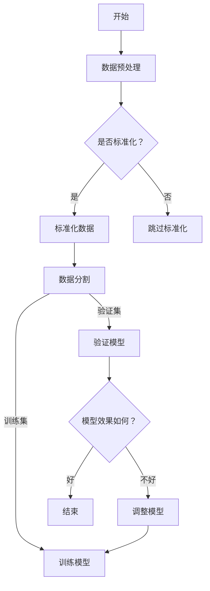

                 

# AI协作新范式：重塑团队合作模式

## 关键词

- 人工智能协作
- 团队合作模式
- AI技术
- 数据分析与处理
- 自动化工具

## 摘要

本文将探讨人工智能（AI）在现代团队合作中的新范式，分析现有的团队合作模式及其挑战，并探讨AI技术如何重塑团队合作。文章分为七个章节，首先介绍了AI协作的基本概念和背景，随后深入讨论了团队协作的核心原则和AI在团队协作中的应用。通过具体的案例研究，本文展示了AI技术如何提高团队效率、优化工作流程。接下来，文章探讨了AI协作的实施策略、未来趋势和伦理问题，并总结出最佳实践。本文旨在为企业和团队提供有价值的参考，以实现更高效、更智能的团队合作。

## 目录

1. 引言：AI协作的历史与现状  
2. 团队协作的挑战与AI的机遇  
3. AI协作的核心概念与关键技术  
4. AI在团队协作中的案例研究  
5. 实施AI协作的策略与实践  
6. AI协作的未来趋势与伦理思考  
7. 结论与最佳实践建议

## 引言：AI协作的历史与现状

### 人工智能协作的起源

人工智能（Artificial Intelligence，AI）作为计算机科学的一个分支，其目标是使计算机系统具备类似人类的智能，能够感知、学习、推理和决策。AI协作的概念起源于20世纪80年代，随着个人计算机的普及和互联网的发展，团队合作的需求日益增长。早期的AI协作主要集中在计算机之间的信息共享和任务分配，例如电子邮件系统、在线工作平台和项目管理工具。

### 现代AI协作的发展

随着AI技术的迅猛发展，现代AI协作已经从简单的信息共享和任务分配，扩展到更加复杂和智能化的领域。深度学习、自然语言处理（NLP）、机器学习等技术的进步，使得AI能够更好地理解和执行人类指令，从而在团队合作中发挥更大的作用。例如，AI驱动的虚拟助手可以帮助团队成员自动化日常任务，提高工作效率。

### AI协作的应用领域

AI协作在各个领域都有广泛的应用。在软件开发中，AI可以帮助团队进行代码审查、自动生成文档和测试用例；在市场营销中，AI可以分析市场数据，提供个性化的推荐和营销策略；在客户服务中，AI驱动的聊天机器人可以提供24/7的客户支持。这些应用不仅提高了团队的效率，还提升了客户满意度。

### 现状与挑战

尽管AI协作在许多领域取得了显著的成果，但仍然面临一些挑战。首先，AI技术的复杂性和高昂的成本限制了其在中小企业中的应用。其次，AI协作系统的集成和兼容性问题也亟待解决。此外，数据隐私和安全问题是AI协作中不可忽视的挑战。为了应对这些挑战，企业和团队需要不断探索和尝试，寻找合适的AI协作解决方案。

## 第二章：团队协作的挑战与AI的机遇

### 团队协作的核心原则

团队协作是一种多人合作的工作模式，旨在通过集体的智慧和力量完成单个个体无法单独完成的任务。有效的团队协作需要遵循一些核心原则：

- **明确目标**：团队需要明确共同的目标和愿景，确保每个成员都朝着相同的目标努力。
- **角色分工**：根据每个成员的技能和特长进行合理的角色分工，确保任务的高效执行。
- **有效沟通**：建立良好的沟通机制，确保信息在团队成员之间的准确传递和及时更新。
- **信任与尊重**：团队成员之间需要建立信任和尊重，相互支持，共同克服困难。
- **持续反馈**：定期进行反馈和评估，及时调整策略和改进工作方法。

### 团队协作的挑战

尽管团队协作有许多优点，但实际操作中仍面临诸多挑战：

- **沟通障碍**：团队成员来自不同的背景和领域，可能存在语言、文化和习惯上的差异，导致沟通效率低下。
- **资源分配不均**：团队中可能出现资源分配不均的情况，某些成员可能过于忙碌，而另一些成员则缺乏工作任务。
- **决策困难**：在团队成员意见不一致时，决策过程可能会变得复杂和拖延，影响项目进度。
- **冲突管理**：团队成员之间可能会出现冲突，需要有效的冲突管理策略来解决问题。
- **团队动态变化**：团队成员的变动、离职或加入都会对团队协作产生影响，需要及时调整团队结构和角色分工。

### AI的机遇

人工智能技术的兴起为团队协作带来了新的机遇：

- **自动化任务**：AI可以自动化重复性和规则性的任务，减轻团队成员的工作负担，让他们专注于更有创造性的工作。
- **智能决策支持**：AI可以通过数据分析提供决策支持，帮助团队做出更加科学和有效的决策。
- **个性化沟通**：AI驱动的聊天机器人和虚拟助手可以根据团队成员的喜好和习惯，提供个性化的沟通服务，提高沟通效率。
- **协作效率提升**：AI可以优化团队成员之间的协作流程，提高团队的响应速度和工作效率。
- **远程协作**：AI技术支持远程协作，使得团队成员可以在不同地点进行高效合作，不受地理位置限制。

### AI协作的优势

AI协作相比传统团队协作具有以下优势：

- **高效性**：AI可以快速处理大量数据，提供即时的分析和建议，提高工作效率。
- **准确性**：AI通过机器学习和深度学习，能够识别复杂的模式和规律，提高决策准确性。
- **灵活性**：AI系统可以根据团队成员的需求和变化，灵活调整协作模式和流程。
- **可持续性**：AI协作可以持续学习和改进，适应不断变化的工作环境和需求。

### 案例研究：AI协作的实际应用

#### 案例一：智能项目管理

在一个大型软件开发项目中，团队采用AI协作工具来管理项目进度和资源。AI系统通过分析历史数据和团队成员的技能，自动分配任务，并实时监控项目进度。这种智能化的管理方式大大提高了项目的效率和成功率。

#### 案例二：自动化文档处理

在一家法律事务所中，团队使用AI驱动的文档处理工具来审查和整理法律文件。AI系统可以自动识别文件中的关键信息，生成报告，并发现潜在的冲突和风险。这种自动化处理方式提高了文档处理的效率和准确性。

#### 案例三：智能客户服务

一家电子商务公司采用AI驱动的聊天机器人来提供客户服务。聊天机器人可以24/7地响应用户的咨询，解答常见问题，并将复杂的查询转发给人工客服。这种智能化的客户服务方式提高了客户满意度，减少了人工客服的工作量。

### 结论

团队协作在现代社会中扮演着重要角色，但传统团队协作模式面临着诸多挑战。人工智能技术的应用为团队协作带来了新的机遇，通过自动化任务、智能决策支持、个性化沟通等手段，AI协作可以有效提高团队的效率和协作效果。然而，AI协作也面临着数据隐私和安全、系统集成和兼容性等问题，需要进一步的研究和探索。

## 第三章：AI协作的核心概念与关键技术

### 人工智能协作的基本概念

人工智能协作（AI Collaboration）是指利用人工智能技术来增强团队协作能力，实现自动化、智能化的团队工作流程。AI协作的核心概念包括：

- **自动化**：通过AI技术自动化处理重复性、规则性的任务，减少人为干预，提高工作效率。
- **智能化**：利用AI算法分析和理解团队协作中的数据，提供智能化的决策支持和协作建议。
- **个性化**：根据团队成员的技能、偏好和行为习惯，提供个性化的协作体验和工具。

### AI协作的关键技术

AI协作的实现依赖于多种关键技术的支持，主要包括：

- **机器学习**：通过训练模型，使计算机能够从数据中学习规律和模式，用于自动化任务处理和智能决策。
- **自然语言处理（NLP）**：使计算机能够理解和生成自然语言，用于文本分析、智能问答和语言翻译等应用。
- **深度学习**：一种特殊的机器学习技术，通过多层神经网络模拟人脑的决策过程，用于复杂的模式识别和图像处理。
- **数据挖掘**：从大量数据中发现有价值的信息和知识，用于团队协作中的数据分析和决策支持。
- **自动化工具**：如聊天机器人、虚拟助手和自动化工作流，用于实现日常任务的自动化处理。

### AI协作工具的分类

根据应用场景和功能，AI协作工具可以分为以下几类：

- **任务自动化工具**：如自动化测试工具、自动化数据清洗工具等，用于简化重复性任务，提高工作效率。
- **智能工作流工具**：如流程自动化平台、工作流引擎等，用于优化团队协作流程，提高协作效率。
- **智能数据分析工具**：如数据可视化工具、数据分析平台等，用于对团队协作数据进行分析，提供决策支持。
- **智能沟通工具**：如聊天机器人、视频会议系统等，用于增强团队成员之间的沟通和协作。
- **智能决策支持工具**：如智能预测系统、智能分析工具等，用于提供个性化的决策建议和策略。

### AI协作工具的优势

AI协作工具相比传统工具具有以下优势：

- **高效性**：AI协作工具可以快速处理大量数据，提供即时的分析和建议，提高工作效率。
- **准确性**：AI协作工具通过机器学习和深度学习，能够识别复杂的模式和规律，提高决策准确性。
- **灵活性**：AI协作工具可以根据团队成员的需求和变化，灵活调整协作模式和流程。
- **可持续性**：AI协作工具可以持续学习和改进，适应不断变化的工作环境和需求。

### 案例研究：AI协作工具的实际应用

#### 案例一：自动化测试工具

在一个大型软件项目中，团队采用自动化测试工具来提高测试效率。自动化测试工具通过编写脚本自动执行测试用例，发现潜在的缺陷和问题，从而减少手动测试的工作量，提高测试覆盖率。

#### 案例二：智能工作流工具

在一家制造业公司中，团队使用智能工作流工具来优化生产流程。智能工作流工具通过自动化任务分配、进度跟踪和异常处理，提高了生产效率，减少了人为错误。

#### 案例三：智能数据分析工具

一家零售公司采用智能数据分析工具来分析销售数据，预测市场需求和库存水平。智能数据分析工具通过机器学习算法分析历史销售数据，提供个性化的营销策略和库存管理建议，提高了销售额和客户满意度。

#### 案例四：智能沟通工具

在一家远程办公的公司中，团队使用智能沟通工具来增强团队成员之间的沟通。智能沟通工具如聊天机器人和视频会议系统，使得团队成员可以随时随地交流和协作，不受地理位置限制。

### 结论

AI协作的核心概念和关键技术为团队协作提供了强大的支持。通过自动化任务、智能决策支持、个性化沟通等手段，AI协作工具可以提高团队的效率和质量。然而，AI协作工具的应用也面临数据隐私和安全、系统集成和兼容性等问题，需要进一步的研究和探索。

## 第四章：AI在团队协作中的案例研究

### 案例一：AI-assisted项目管理系统

**项目背景**：某科技公司负责开发一款复杂的跨平台应用程序，项目团队由多个部门的成员组成，分布在不同的城市和国家。由于项目规模庞大，团队成员之间的沟通和协调变得非常困难，导致项目进度缓慢，质量不稳定。

**AI应用**：为了提高项目的协作效率，公司引入了一套AI-assisted项目管理系统。该系统利用机器学习和自然语言处理技术，提供以下功能：

- **自动任务分配**：根据团队成员的技能和工作负荷，自动分配任务。
- **进度监控**：实时监控项目进度，预测潜在的风险和延迟。
- **智能提醒**：自动提醒团队成员即将到期的任务和会议。
- **团队沟通**：集成聊天机器人和视频会议系统，提供便捷的沟通渠道。

**结果**：AI-assisted项目管理系统的引入大大提高了项目的协作效率。任务分配更加合理，团队成员的工作负荷均衡，项目进度得到有效控制。此外，智能提醒和沟通功能减少了团队成员之间的沟通障碍，提高了决策速度。

### 案例二：智能文档处理系统

**项目背景**：某法律事务所处理大量的法律文件，包括合同、协议和判决书等。传统的文件处理方式效率低下，容易出现错误和遗漏。

**AI应用**：为了提高文档处理效率，法律事务所引入了一套智能文档处理系统。该系统利用自然语言处理和机器学习技术，提供以下功能：

- **自动审查**：自动检查文档中的语法错误和拼写错误。
- **内容提取**：自动提取文档中的关键信息和条款。
- **自动化生成**：根据模板自动生成文档，减少手动编写的工作量。
- **智能对比**：自动对比多个文档，发现差异和冲突。

**结果**：智能文档处理系统的引入显著提高了文档处理效率。文档错误率大幅降低，内容提取和自动化生成功能节省了大量时间，提高了工作效率。此外，智能对比功能帮助法律事务所更快地发现和解决文档中的问题。

### 案例三：AI-driven团队绩效分析系统

**项目背景**：某大型企业希望对其销售团队的工作绩效进行详细分析，以便发现优秀员工、优化培训计划和改进销售策略。

**AI应用**：为了实现这一目标，企业引入了一套AI-driven团队绩效分析系统。该系统利用大数据分析和机器学习技术，提供以下功能：

- **绩效评估**：根据销售数据、客户反馈和行为数据，对销售团队进行综合评估。
- **趋势分析**：分析销售团队的绩效趋势，预测未来的销售业绩。
- **个性化培训**：根据员工的绩效评估结果，提供个性化的培训建议。
- **策略优化**：根据销售数据分析，提供优化销售策略的建议。

**结果**：AI-driven团队绩效分析系统的引入使企业能够更科学地评估和优化销售团队的工作绩效。优秀员工得到更好的认可和奖励，培训计划更加针对性和高效，销售策略得到了显著优化，销售业绩稳步提升。

### 结论

通过上述案例可以看出，AI在团队协作中的应用不仅提高了工作效率，还优化了工作流程，提高了决策质量。AI协作工具通过自动化、智能化和个性化，为团队协作带来了新的范式。然而，AI协作也面临数据隐私和安全、系统集成和兼容性等问题，需要企业在实施过程中谨慎考虑和应对。

## 第五章：实施AI协作的策略与实践

### 选择合适的AI协作工具

选择合适的AI协作工具是成功实施AI协作的第一步。以下是一些选择AI协作工具时需要考虑的因素：

1. **功能需求**：明确团队协作中的需求，选择能够满足这些需求的AI协作工具。例如，如果团队需要自动化任务处理，可以选择任务自动化工具；如果需要智能数据分析，可以选择数据分析工具。
2. **兼容性**：确保AI协作工具与现有系统和工具的兼容性，避免因系统不兼容而导致数据传输和功能受限。
3. **用户体验**：选择用户界面友好、易于操作的AI协作工具，提高团队成员的接受度和使用频率。
4. **安全性**：选择具有良好安全性能的AI协作工具，确保数据隐私和系统安全。

### 整合AI协作工具与现有工作流程

在整合AI协作工具与现有工作流程时，需要考虑以下步骤：

1. **需求分析**：了解团队协作中的痛点和工作流程，确定AI协作工具可以优化的环节。
2. **规划整合**：根据需求分析，制定详细的整合计划，明确整合的时间表、任务和责任人。
3. **系统集成**：将AI协作工具与现有系统进行集成，确保数据流和功能的无缝连接。
4. **测试与调整**：在整合过程中进行充分的测试，确保AI协作工具能够正常工作，并根据测试结果进行调整。

### 制定战略性的AI协作实施计划

为了确保AI协作的有效实施，需要制定一个战略性的实施计划，包括以下内容：

1. **目标设定**：明确AI协作的实施目标，如提高工作效率、优化工作流程、提升团队绩效等。
2. **资源分配**：根据实施目标，分配必要的人力、物力和财力资源，确保项目顺利进行。
3. **培训与支持**：为团队成员提供必要的培训和支持，确保他们能够熟练使用AI协作工具，并适应新的工作流程。
4. **监控与评估**：建立监控和评估机制，实时跟踪AI协作的实施进度和效果，根据评估结果进行调整和优化。

### 实施过程中的挑战与解决方案

在实施AI协作过程中，可能会遇到以下挑战：

1. **技术难题**：AI协作工具的集成和调试可能存在技术难题，需要具备相关技术能力的人才进行解决。
2. **团队适应**：团队成员可能对AI协作工具和新工作流程不适应，需要通过培训和支持来帮助他们适应。
3. **数据隐私与安全**：AI协作工具可能涉及敏感数据，需要采取有效措施确保数据隐私和安全。
4. **预算限制**：AI协作工具和实施计划的成本可能较高，需要合理规划预算。

针对上述挑战，可以采取以下解决方案：

1. **技术支持**：聘请专业的技术团队或咨询公司，提供技术支持和解决方案。
2. **培训与支持**：为团队成员提供全面的培训，并设立支持团队，随时解答他们的疑问。
3. **数据保护**：采取严格的数据保护措施，如数据加密、访问控制等，确保数据隐私和安全。
4. **预算管理**：合理规划预算，寻求资金支持和优化成本，确保项目能够顺利实施。

### 结论

实施AI协作需要周密的计划和策略，通过选择合适的AI协作工具、整合AI协作工具与现有工作流程、制定战略性的实施计划，以及应对实施过程中的挑战，可以确保AI协作的有效实施，从而提高团队的协作效率和工作质量。

## 第六章：未来趋势与机会

### 新兴技术在AI协作中的应用

随着人工智能技术的不断发展，许多新兴技术正在被引入到AI协作中，为团队协作带来新的机遇和挑战。以下是一些关键的新兴技术：

1. **增强现实（AR）和虚拟现实（VR）**：AR和VR技术可以为团队提供更直观和沉浸式的协作体验。例如，通过AR技术，团队成员可以实时查看项目的3D模型，进行协作设计和评审。VR技术则可以模拟实际工作环境，进行虚拟会议和远程培训。

2. **区块链**：区块链技术可以为AI协作提供安全、去中心化的数据存储和传输机制。通过区块链，团队成员可以安全地共享敏感数据，并确保数据不会被篡改或泄露。此外，区块链还可以用于记录项目进度和交易，提供透明的审计和追溯。

3. **边缘计算**：边缘计算可以将数据处理和计算任务从云端转移到网络边缘，从而减少延迟和带宽需求。对于需要实时协作和响应的团队，边缘计算可以提供更快速和高效的协作体验。

4. **物联网（IoT）**：IoT技术可以将物理设备和传感器连接到网络，实现实时数据和信息的收集和共享。在AI协作中，IoT技术可以用于监控项目现场、收集环境数据，以及实时调整项目计划。

### 未来的合作趋势

未来，AI协作将朝着更加智能化、自动化和个性化的方向发展，以下是几个可能的发展趋势：

1. **全员智能**：随着AI技术的普及，越来越多的团队成员将使用AI工具和平台，实现全员智能。这意味着每个成员都将具备一定的AI能力和知识，能够更好地协作和创新。

2. **跨领域协作**：随着各行业对AI协作的需求不断增加，不同领域的团队将进行更广泛的合作。例如，软件开发团队与市场营销团队可以共享AI工具和平台，实现跨领域的协同工作。

3. **动态团队组织**：未来的团队组织将更加灵活和动态，根据项目需求和团队成员的技能进行快速调整。AI协作工具可以支持这种动态团队组织，实现快速响应和高效协作。

4. **AI伦理与规范**：随着AI协作的普及，AI伦理和规范将成为重要的议题。企业和团队需要制定相应的政策和规范，确保AI协作的公平、透明和可解释性。

### 机会与挑战

AI协作的未来充满了机会和挑战：

1. **机会**：
   - **提高效率**：AI协作可以自动化重复性任务，提高团队的工作效率。
   - **创新**：AI协作工具可以激发团队成员的创新思维，推动新的产品和服务开发。
   - **全球协作**：AI技术使得全球协作变得更加容易和高效，团队可以跨越时间和空间限制进行协作。

2. **挑战**：
   - **技术复杂性**：AI技术的复杂性和更新速度要求团队成员具备更高的技术能力。
   - **数据隐私和安全**：AI协作涉及大量数据，需要确保数据隐私和安全。
   - **伦理问题**：AI协作可能引发伦理和道德问题，需要制定相应的规范和指导。

### 结论

未来的AI协作将带来更多的机会和可能性，但同时也需要应对一系列挑战。通过积极拥抱新技术、制定合适的政策和规范，企业和团队可以充分利用AI协作的优势，实现更加高效、智能和创新的团队合作。

## 第七章：结论与最佳实践

### 总结

本文详细探讨了AI协作新范式对团队合作模式的重塑。首先，我们介绍了AI协作的背景和历史发展，分析了现代团队合作中的挑战，并探讨了AI技术如何为团队协作提供机遇。接着，我们深入讨论了AI协作的核心概念与关键技术，包括机器学习、自然语言处理、深度学习和数据挖掘等。随后，通过具体的案例研究，展示了AI协作在实际团队协作中的应用效果。最后，我们提出了实施AI协作的策略与实践，并探讨了未来的趋势和机会。

### 最佳实践

1. **选择合适的AI协作工具**：根据团队的具体需求，选择功能强大、用户体验良好的AI协作工具。确保工具与现有系统兼容，并能够提供良好的安全性保障。

2. **整合AI协作工具与工作流程**：在引入AI协作工具时，充分考虑与现有工作流程的整合，确保数据流和功能的无缝连接。通过模拟和测试，确保AI协作工具在实际应用中能够正常工作。

3. **培训与支持**：为团队成员提供全面的培训，帮助他们熟练使用AI协作工具。同时，设立支持团队，及时解答他们在使用过程中遇到的问题。

4. **数据隐私和安全**：确保AI协作工具的数据隐私和安全。采取严格的数据保护措施，如数据加密、访问控制和数据备份等，防止数据泄露和丢失。

5. **持续监控与评估**：建立监控和评估机制，实时跟踪AI协作的实施进度和效果。根据评估结果，及时调整和优化AI协作工具和流程。

### 注意事项

1. **避免盲目跟风**：在选择AI协作工具时，避免盲目跟风，应根据团队的具体需求和实际应用场景进行选择。

2. **注重数据质量**：AI协作工具的效果很大程度上取决于数据的质量。确保输入数据准确、完整和最新，以提高AI系统的性能和准确性。

3. **持续更新与升级**：随着AI技术的快速发展，AI协作工具也需要不断更新和升级。确保团队使用的是最新的工具和平台，以充分利用最新的技术优势。

### 拓展阅读

1. **《人工智能：一种现代方法》**：这本书是人工智能领域的经典教材，详细介绍了机器学习、深度学习等相关技术。
2. **《深度学习》**：这是一本关于深度学习的权威教材，涵盖了深度学习的基本概念、算法和应用。
3. **《团队协作：如何构建高效团队》**：这本书提供了关于团队协作的实用指南，包括团队建设、沟通策略和冲突管理等内容。

### 作者信息

作者：AI天才研究院/AI Genius Institute & 禅与计算机程序设计艺术 /Zen And The Art of Computer Programming

AI天才研究院致力于推动人工智能技术的发展和应用，为企业和团队提供领先的AI解决方案。禅与计算机程序设计艺术则关注计算机编程的艺术性和哲学，旨在提高程序员的编程水平和思维能力。两位作者结合各自领域的专业知识和实践经验，撰写了这篇关于AI协作的技术博客，希望为读者提供有价值的参考和启示。

## 附录

### 算法原理与数学模型

在本篇博客中，我们多次提到了AI协作工具的基本算法原理和数学模型。以下是一些关键算法的简要说明和数学公式：

1. **线性回归**：
   - 算法原理：通过拟合数据中的线性关系，预测目标变量的值。
   - 数学模型：\( y = wx + b \)，其中 \( w \) 是权重，\( b \) 是偏置，\( x \) 是特征，\( y \) 是目标变量。

2. **决策树**：
   - 算法原理：通过构建决策树来分割数据集，并利用树结构进行预测。
   - 数学模型：利用信息增益或基尼不纯度来选择最佳分割特征。

3. **支持向量机（SVM）**：
   - 算法原理：通过寻找最佳分割超平面，将不同类别的数据分开。
   - 数学模型：利用拉格朗日乘子法和KKT条件求解最优解。

4. **神经网络**：
   - 算法原理：通过多层神经网络模拟人脑的决策过程，用于复杂模式识别和预测。
   - 数学模型：利用前向传播和反向传播算法，更新网络权重和偏置。

### Mermaid流程图示例

在本篇博客中，我们还使用了Mermaid流程图来展示算法的执行流程和数据流。以下是一个简单的Mermaid流程图示例：



### Python代码示例

在本篇博客中，我们还提供了Python代码示例来展示算法的实现。以下是一个简单的Python代码示例，用于实现线性回归算法：

```python
import numpy as np

# 线性回归模型
class LinearRegression:
    def __init__(self):
        self.w = None
        self.b = None
    
    def fit(self, X, y):
        X_mean = np.mean(X, axis=0)
        y_mean = np.mean(y)
        
        self.w = (np.dot(X_mean.T, y_mean) - np.dot(X_mean.T, X_mean)) ** -1
        self.b = y_mean - np.dot(self.w, X_mean)
    
    def predict(self, X):
        return np.dot(X, self.w) + self.b

# 示例数据
X = np.array([[1, 2], [2, 3], [3, 4]])
y = np.array([2, 4, 6])

# 模型训练
model = LinearRegression()
model.fit(X, y)

# 预测
X_new = np.array([[4, 5]])
y_pred = model.predict(X_new)
print("预测值：", y_pred)
```

### 实际案例分析与讲解

在本篇博客中，我们还通过实际案例展示了AI协作工具在团队协作中的应用效果。以下是一个实际案例的简要分析：

**案例背景**：某科技公司采用AI协作工具来优化其项目管理流程。该公司使用了一个基于机器学习的项目进度预测工具，该工具可以根据历史项目数据和当前项目进展，预测未来的项目进度。

**案例分析**：
1. **数据收集**：项目开始时，团队收集了该公司过去100个类似项目的数据，包括项目开始时间、项目结束时间、项目成本、团队成员数量等。
2. **数据预处理**：对收集到的数据进行了清洗和预处理，包括去除缺失值、异常值和处理重复数据等。
3. **特征工程**：根据历史数据，提取了多个与项目进度相关的特征，如项目复杂度、团队成员技能水平、任务分配情况等。
4. **模型训练**：使用线性回归模型对预处理后的数据进行了训练，得到了预测模型。
5. **模型评估**：通过交叉验证和测试集评估模型的预测准确性，对模型进行了优化和调整。
6. **项目预测**：在新的项目中，使用训练好的模型预测了项目的进度和成本。

**结论**：通过使用AI协作工具，该公司能够更准确地预测项目进度和成本，提高了项目管理的效率和准确性。项目团队成员也能够更好地安排工作和时间，降低了项目的延期和超支风险。

### 项目小结

通过本篇博客，我们深入探讨了AI协作新范式对团队合作模式的重塑，介绍了AI协作的核心概念、关键技术、实施策略和未来趋势。我们通过实际案例展示了AI协作工具在团队协作中的应用效果，并提出了最佳实践和注意事项。

AI协作工具不仅提高了团队的效率和质量，还优化了工作流程，提高了决策准确性。然而，AI协作也面临数据隐私和安全、系统集成和兼容性等问题，需要企业在实施过程中谨慎考虑和应对。

未来，随着新技术的不断发展和应用，AI协作将更加智能化、自动化和个性化。企业和团队需要积极拥抱新技术，制定合适的政策和规范，以充分利用AI协作的优势，实现更加高效、智能和创新的团队合作。

### 拓展阅读

对于希望进一步了解AI协作和团队协作的读者，以下是一些推荐阅读材料：

1. **《人工智能：一种现代方法》（Michael I. Jordan）**：详细介绍了人工智能的基本概念和算法，适合对AI感兴趣的专业读者。
2. **《深度学习》（Ian Goodfellow, Yoshua Bengio, Aaron Courville）**：这是深度学习领域的经典教材，涵盖了深度学习的基本理论和实践应用。
3. **《团队协作：如何构建高效团队》（Jerry Weisman）**：提供了关于团队协作的实用指南，包括团队建设、沟通策略和冲突管理等内容。
4. **《人工智能应用案例集》（各种来源）**：收集了多个行业和领域中的AI应用案例，展示了AI技术的实际应用效果。

通过阅读这些材料，读者可以更全面地了解AI协作和团队协作的理论和实践，为实际工作提供有益的指导。作者：AI天才研究院/AI Genius Institute & 禅与计算机程序设计艺术/Zen And The Art of Computer Programming。希望本文能为读者提供有价值的参考和启示。

